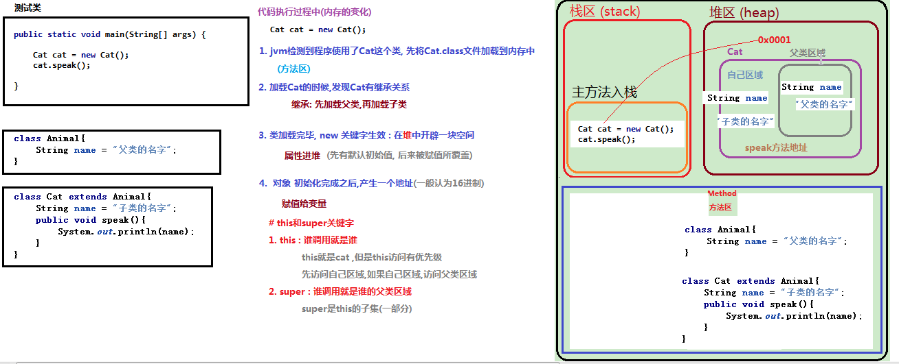
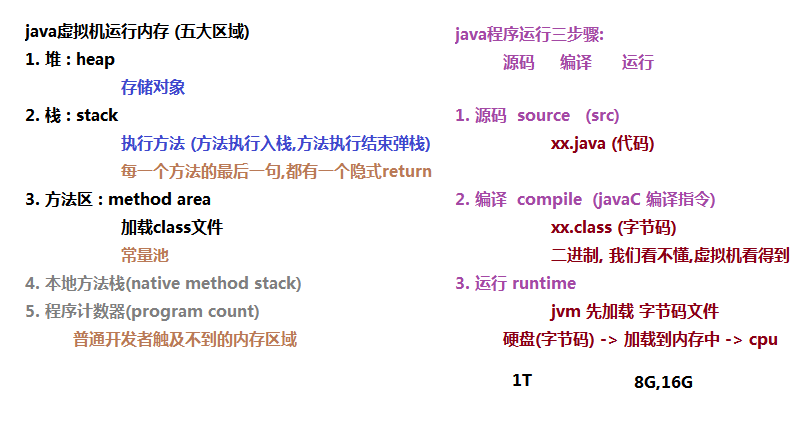

# day01-课堂笔记

## 一. 回顾

### 1. 类 

```java
package com.itheima01.clazz;

/*
*   Java面向对象三大特性:
*           封装, 继承 , 多态
*
*   # 回顾(封装)
*       隐藏内部实现细节,对外暴露可访问的方法
*
*    封装的好处:
*       1. 提高安全性
*       2. 避免代码冗余(提高代码复用性)
*
*
*    类的封装
*       1. 属性private
*       2. 对外提供(public)该属性的get set 方法
* */
public class Student {

    //1. 成员变量(属性)  field
    private String name; // 姓名
    private int age; // 年龄

    //2. 成员方法 method
    public String getName() {
        return name;
    }

    public void setName(String name) {
        this.name = name;
    }

    public int getAge() {
        return age;
    }

    public void setAge(int age) {
        if(age < 0){
            System.out.println("你个傻鸟,年龄不能为负");
            return;
        }
        this.age = age;
    }
    /*
        3. 构造方法(构造器) constructor

            注意: 如果一个类中不显式声明任何一个构造方法
                那么这个类会有一个默认的空参构造(隐式声明)
     */
}

```

```java
package com.itheima01.clazz;

/*
    工程创建
*  1. File -> new Project -> Empty Project
*       创建一个空工程,用来放模块
*
*  2. File -> new Module -> java
*       就在当前空工程,有了一个模块day01
*
*     创建类
*  1. new class
*       包名.类名 (完全限定名 : 是一个类路径)
*       com.itheima01.clazz.ClassDemo
*
*  2. new package -> new class (麻烦了点)
*
* */
public class ClassDemo {

    public static void main(String[] args) {
        // 1. 创建对象
        Student student = new Student();
        //2. 设置属性值
        student.setName("张三");
        student.setAge(18);

        System.out.println(student.getName() + "," + student.getAge());

        Student s2 = new Student();
        /*
            # 封装的安全性
            1. 如果属性外部可以直接访问,那么有可能被非法访问
                比如 age = -18 (现实生活,年龄不可能为负数)

            2. 方法可以包含执行过程
                可以对设置的内容进行校验, 不合法可以拒绝执行
         */
//        s2.age = -18;
        s2.setAge(-18);

        return;// 方法执行完,弹栈(隐式声明)
    }
}

```

### 2. 构造和this

```java
package com.itheima02.constructor;

public class Student {

    //1. 成员变量(属性)
    private String name;
    private int age;

    /*
    * 3. 构造方法
    *    如果一个类不显式声明构造,默认会有一个空参构造(隐式声明)
    **/
    public Student(){
        System.out.println("空参构造:" + this);
    }
    public Student(String name,int age){
        this.name = name;
        this.age = age;
    }

    //2. 成员方法
    public String getName() {
        return name;
    }

    public void setName(String name) {
        this.name = name;
    }

    public int getAge() {
        return age;
    }

    public void setAge(int age) {
        this.age = age;
    }
}

```

```java
package com.itheima02.constructor;

public class ConstructorDemo {

    public static void main(String[] args) {
        /*
            1.用空参构造创建对象

            new关键字生效的时候,在堆内存中开辟一块空间
            成员属性会进堆, 有默认初始值
                String name = null;
                int age = 0;

            2. 用满参构造创建对象
                new关键字生效的时候,在堆内存中开辟一块空间
                成员属性会进堆, 有默认初始值

                构造方法执行,会覆盖默认初始值
                  String name = "张三";
                    int age = 18;

            # this关键字
                this 谁调用就是谁
                本类实例(只对了一半, 继承)	


         */
//        Student s1 = new Student();

        Student s2 = new Student("张三", 18);

        //验证this
        Student s3 = new Student();
        System.out.println(s3);//引用类型打印是内容地址值

        Student s4 = new Student();
        System.out.println(s4);

    }
}

```

### 3. 匿名对象

```java
package com.itheima03.niming;

public class Student {

    private String name;

    public Student(String name) {
        this.name = name;
    }

    public String getName() {
        return name;
    }

    public void setName(String name) {
        this.name = name;
    }
}

```

```java
package com.itheima03.niming;

public class NmDemo {

    public static void main(String[] args) {
        // 命名对象 : 创建对象的时候,给这个对象命名(变量)
        Student s1 = new Student("张三");
        String name = s1.getName();
        System.out.println(name);

        System.out.println(s1);

        /*
            匿名对象: 创建对象的时候,不给这个命名
            1. 局限: 匿名对象只能使用一次 (每new一次,就会创建一个对象)
            2. 好处: 一次性使用场景, 使用简单

          */
        String name2 = new Student("李四").getName();
        System.out.println(name2);

        System.out.println(new Student("李四")); // 对象A
        System.out.println(new Student("李四")); // 对象B

        System.out.println("-----------------");

//        method01(s1);

        Student s2 = new Student("王五");
        method02(s2);

        method02(new Student("马六"));

    }

    private static void method02(Student student) {
        String name = student.getName();
        System.out.println(name);
    }


    /*
    *   正常流程: 先定义方法,后调用
    *
    *   反向流程: 先调用,后定义方法 (利用开发工具 : alt + enter )
    *
    *   定义方法:
    *       方法名,参数列表,返回值
    * */
    public static void method01(Student s){
        String name = s.getName();
        System.out.println(name);
    }

}

```


## 二. 继承

### 1. 继承入门

```markdown
# 生活中的继承
		儿子继承老子的家产
		在继承关系中,爸爸的就是儿子的
# java中的继承
1. java面向对象三大特性之一: 封装, 继承, 多态
		封装: 隐藏内部实现细节,对外暴露可访问的接口
		继承: 子类继承父类,拥有父类所有的属性和方法(除构造和private之外)
		多态: 父类引用指向子类对象,父类引用调用方法,执行的是子类重写的方法
2. 继承:
		子类继承父类,拥有父类所有的属性和方法(除构造和private之外)
3. 案例	
	0). 举例
		但凡动物,能吃
		猫是动物,狗动物	
		现在有猫有狗,因为它们都是动物,所以都能吃饭
	1). 继承的语法 
		I.
        	extends (java关键字) 继承,扩展
		II. 
			class A extends B{
				类体 class body
			}
		III. 
        	A叫子类, B叫父类(基类,超类) super class
	2). 继承的特点
		子类继承父类,拥有父类所有的属性和方法(除构造和private之外)	
	3). 继承的作用
		提高代码的复用性(解释如下)
		a. 父类: 所有子类的共性抽取
			父类中不能定义某一部分子类没有的内容
			举例: 动物都能吃, 不是都能飞
		b. 有了继承特性,那么多个类的共性可以抽取到一个父类中,避免代码冗余
```

### 2. 子类不能继承的内容

```markdown
# 继承关系,子类不能继承的内容
	构造和private
1. 构造方法不能被继承
		因为构造方法核心作用就是用来创建对象的, 继承是没有意义的
		(构造方法名跟类名同名,不会产生歧义)
2. private修饰的内容不能被继承
	1). private 属性
	2). private 方法
		因为private内容只能本类内部使用,外部不能直接调用,所以我们也认为不能被继承
		注意, private内容可以间接调用
```


```java
package com.itheima04.inherit;

public class AnimalDemo {

    public static void main(String[] args) {

        Cat cat = new Cat();
        cat.name = "加菲";
        cat.eat();

        Dog dog = new Dog();
        dog.name = "哈士奇";
        dog.eat();

    }
}
/*
*   一个java文件,可以写多个java类
*       1. 注意: 只有一个跟当前文件同名的类为public,其他类不能为public
*       2. 这样做在开发是不规范的,纯粹为了学习方便
* */
class Animal{
    String name;
    public void eat(){
        System.out.println(name + "正在吃饭");
        method01();
    }

    private void method01(){
        System.out.println("method01");
    }
}
class Dog extends Animal {

}
class Cat extends Animal {

}
```

### 3. 继承的细节

#### 3.1 继承中成员变量的特点

```markdown
# 继承中成员变量的特点
1. 继承格式
        class A extends B{ // class body 类体
			//1). 成员变量
			//2). 成员方法
			//3). 构造
        }
2. 子类拥有跟父类(不同名)的成员变量
	1). 举例
		动物(父类) : name属性
		狗(子类) : type 狗的种类
		猫(子类) : name属性
	2). 特点
		父类的属性是子类的
		子类的还是子类的(特有的,别的类不能访问)
3. 子类拥有跟父类(同名)的成员变量
	1). 首先要明确的是, 开发中不会在子类中定义跟父类同名的属性
	2). 访问特点: 就近原则

4. this和super关键字
	1). this
		a. 谁调用就是谁
		b. 继承访问特点: 就近原则(先访问子类区域,如果子类区域没有,访问父类区域)
	2). super
    	a. 谁调用就是谁的父类区域(super 是 this的子集)
    	b. 专门访问父类区域
```

```java
package com.itheima05.field;

public class FiledDemo {

    public static void main(String[] args) {

        Dog dog = new Dog();
        dog.name = "大黄"; // 父类的属性
        dog.type = "哈士奇"; // 子类特有的属性

        System.out.println(dog.name + "是" + dog.type);

        Cat cat = new Cat();
        cat.speak();
    }
}
class Animal{
    String name = "父类的名字";// 动物的名字
}
class Dog extends Animal{
    String type;// 狗的种类
}
class Cat extends Animal{
    String name = "子类的名字";
    public void speak(){
        String name = "局部的名字";
        /*
        *   默认省略this
        *   但是如果局部存在同名变量,默认this会被擦除
        *   此时想要访问成员位置,必须手动加上this
        * */
        System.out.println(name);
//        System.out.println("this.name==" + this.name);
//        System.out.println("super.name==" + super.name);
    }
}
```


   

  


#### 3.2 继承中成员方法的特点   

```markdown
# 继承中成员方法的特点  
1. 子类拥有跟父类(不同名)的方法
	1). 父类的方法被子类所继承
	2). 子类的方法还是子类的
	
2.  子类拥有跟父类(同名)的方法: 方法重写
	1). 子类对象优先调用自己的方法
	2). 如果子类中没有重写此方法,就会调用父类的该方法

```

```java
package com.itheima06.method;

public class MethodDemo {

    public static void main(String[] args) {
        Dog dog = new Dog();
        dog.eat();
        dog.show();
        System.out.println("-----------");
        Cat cat = new Cat();
        cat.eat();
    }
}
class Animal{

    public void eat(){
        System.out.println("父类的方法");
    }
}
class Dog extends Animal{

    public void show(){
        System.out.println("子类特有的方法");
    }
}
class Cat extends Animal{

    public void eat(){
        System.out.println("子类中跟父类同名同参的方法");
    }
}

```

```markdown
# 方法重写(override)
1. 方法重写: 在继承关系中,子类定义了与父类(同名同参同返回值)的方法

2. 特点: 
		子类对象会优先自己重写的方法
3. 作用:
		1). 覆盖父类的方法, 进行功能的重新实现
		2). 增强父类的方法, 通过super先调用父类方法,自己再追加内容

4. 注解:  @Override
	1). java有四大类型
		class(类), interface(接口),enum(枚举),annotation(注解)
    2). @Override 注解
    	I. JDK自带的注解
    	II. 作用: 检查当前方法是否是重写方法,不是就会编译报错
    	
5. 方法重载和方法重写
	1). 方法重载(overload)
		I. 同一类中
		II. 方法名相同
		III. 参数的个数 或 参数类型 或 参数的顺序 不一样
		IV. 注意: 跟返回值无关
	2). 方法重写(override)
		I. 不在同一个类中,在继承的子父类之间
		II. 子类中定义了与父类完全一样的方法(方法名,参数列表,返回值类型)
    	
    	
		
```


 ```java
package com.itheima07.override;

public class OverrideDemo {

    public static void main(String[] args) {

        Dog dog = new Dog();
        dog.speak();
    }
}
class Animal{
    public void speak(){
        System.out.println("动物在说话");
    }
}
class Dog extends Animal{

    @Override
    public void speak(){

//        this.speak(); // 死循环调用, StackOverflowError 栈溢出
        super.speak(); // 增强父类的方法
        System.out.println("狗在汪汪叫");

    }

}
 ```


#### 3.3 继承中构造方法的特点

```markdown
# 继承中构造方法的特点
1. 原则: 在java的继承关系中,子类的构造一定要能调用到父类的构造
	 1).  一个类中不声明任何构造,会有默认空参构造
	 2). 子类的构造方法中,如果没有声明调用任何构造,默认调用父类的空参构造
			super() -> 调用父类空参构造
	 3). 如果子类调用不到父类的构造(全部private), 这个继承关系不成立

2. this和super:  
	1). 语法
		super(参数列表) -> 调用父类构造
		this (参数列表) -> 调用本类构造
	2). 必须放在<构造方法>的<第一行>
		所以super() 和 this() 不能共存

# 问题: 
	在java的继承关系中,子类的构造一定要能调用到父类的构造 (原则)

# 回答:  
	1. 继承不应该破坏封装
	2. 父类的属性就应该交给父类的构造进行初始化
	3. 当我们创建子类对象, 就应该调用父类的构造完成父类属性的初始化, 子类构造初始化子类的属性
```

```java
package com.itheima08.constructor;

public class ConstructorDemo {

    public static void main(String[] args) {
        //就创建一个子类对象
        new Dog();
    }
}
/*
 *   1. 一个类中不声明任何构造,会有默认空参构造
 *   2. 子类的构造方法中,如果没有声明调用任何构造,默认调用父类的空参构造
 *          super(参数列表) -> 调用父类构造
 *
 *   3. 如果子类调用不到父类的构造(全部private), 这个继承关系不成立
 * */
class Animal{
    private Animal(){
        System.out.println("父类的构造");
    }
    public Animal(int number){

    }

}
class Dog extends Animal{
    public Dog(){
       super(1);
        System.out.println("子类的构造");
    }

    public Dog(String str){
//        super(1); // 可以 : 直接调用父类构造
        this(); // 可以: 间接调用父类构造
    }

    public Dog(String str,int age){
        this("abc"); // 可以: 间接调用父类构造
    }
}
class A{
    public A(){

    }
}
class B extends A{
    public B(){
        super();//调用父类空参构造
    }
}
```


```java
package com.itheima10.yiyi;
/*
*  问题:
*       在java的继承关系中,子类的构造一定要能调用到父类的构造 (原则)
*
*       为什么这么设计呢?
*
*   需求:
*       让大家设计构造方法,当我们创建Dog对象,三个属性都能直接赋值
*
*   回答:
*       继承不应该破坏封装
*
*       父类的属性就应该交给父类的构造进行初始化
*       当我们创建子类对象, 就应该调用父类的构造完成父类属性的初始化, 子类构造初始化子类的属性
*
* */
public class Demo01 {
}
class Animal{
   String name;
   int age;
   public Animal(){

   }
    public Animal(String name,int age){
        this.name = name;
        this.age = age;
    }

    public void setAge(int age){
       this.age = age;
    }
}
class Dog extends Animal{
   String type;

   public Dog(String name,int age,String type){
//       super();
//       super.name = name;
//       super.age = age;
//       this.type = type;

       super(name,age);
       this.type = type;
   }
}

```


## 三. this和super关键字

```markdown
1. this : 谁调用就是谁
2. super : this的父类区域
3. 原则: 一个类中调用属性和方法,会有一个隐式的this
	1). 属性: 成员变量
		如果存在同名局部变量,隐式this会被擦除(就近原则)
	2). 方法: 成员方法
4. 原则: 子类的构造必须调用到父类的构造
	1). 子类没有显式调用父类构造,会隐式调用父类的空参构造
		super()
	2). 如果父类不存在空参构造,或者空参构造私有	
		子类必须显式的调用其他构造

5. 语法
	1). this关键字
		1. this.属性
		2. this.方法
			优先调用本类的属性和方法,如果子类没有,调用父类的
		3. this(参数列表)
			调用本类的构造,不能调用父类的构造 (必须在构造方法的第一行)
	2).  super相关的三种语法
		1. super.属性
		2. super.方法
			调用父类中的属性和方法,如果父类中没有,编译报错
		3. super(参数列表)
			调用父类的构造  (必须在构造方法的第一行)
```


```java
package com.itheima09.this_super;

public class Demo01 {

    public static void main(String[] args) {

        A a1 = new A();
        a1.name = "张三";

        A a2 = new A();
        a2.name = "李四";

        //a1调用了show(),show里面的this=a1,this.name就是张三
        a1.show();
    }
}
/*
    # 原则: 必须要用对象调用普通属性和方法
        1. 属性: 成员变量
        2. 方法: 成员方法


*       结论: 在类中,调用属性和方法,都会有一个(隐式)的this
*           可以不写,不写也是有this的
*
*           name(实际上是this.name), 只有局部存在name属性时,this会被擦除
*
*    # this : 谁调用就是谁(当前对象)
*
* */
class A{
    String name;
    public void show(){
        System.out.println(this.name); // this.name
//        this.xx();
    }

    public void xx(){
        System.out.println("xx");
    }
}
```

```java
package com.itheima09.this_super;

public class Demo02 {

    public static void main(String[] args) {

        C c1 = new C();
        //com.itheima09.this_super.C@1540e19d
        // 对象的类型@内存地址
        c1.show();

        B b1 = new B();
        //com.itheima09.this_super.B@677327b6
        b1.show();
    }
}
//this: 谁调用就是谁
class B{

    public void show(){
        System.out.println(this);
    }
}
class C extends B{

}

```

```java
package com.itheima09.this_super;

public class Demo03 {

    public static void main(String[] args) {

    }
}
/*
   # this相关的三种语法
*
*   1. this.属性
*   2. this.方法
*       优先调用本类的属性和方法,如果子类没有,调用父类的
*   3. this(参数列表)
*       调用本类的构造,不能调用父类的构造 (必须在构造方法的第一行)
*
*   # super相关的三种语法
*
*   1. super.属性
*   2. super.方法
*       调用父类中的属性和方法,如果父类中没有,编译报错
*   3. super(参数列表)
*       调用父类的构造  (必须在构造方法的第一行)
*
*  # 子类的构造必须调用到父类的构造
* */
class D{
    String name;
    public void fuShow(){

    }
}
class E extends D{

    public E(){

    }
    public E(int number){
        this();
    }
    public E(int number,String str){

    }

    public void show(){
        System.out.println(name);
        super.fuShow();
    }
}

```


## 四. 抽象类

```markdown
# 抽象类引入
1. 没有方法体的方法要声明称抽象方法
		关键字 abstract
2. 拥有抽象方法的类必须是抽象类

# 抽象类的特点
1. 抽象类不能被实例化
		不能创建对象
2. 抽象类可以拥有抽象方法,也可以没有	
		如果见到没有抽象方法的抽象类(这个类不想被创建对象)
3. 如果一个类继承抽象类	
	1). 那么这个类要么重写父类所有抽象方法
	2). 要么自己也是一个抽象类 
    	因为如果父类有抽象方法没有被子类重写,那么子类继承这些抽象方法
    	而拥有抽象方法的类必须是抽象类
4. private和abstract不能在一起修饰方法    
	1). private方法不能被重写的
			子类不能直接访问父类的private方法,就无所谓重写
	2). abstract方法不被重写没有意义 	
    		所以private和abstract设计理念是冲突的
    3). final和static跟abstract不能在一起	
    
```

```java
package com.itheima11.abstractd;

/*
*   1. 抽象
*
*
* */
public class Demo01 {

    public static void main(String[] args) {

        Dog dog = new Dog();
        dog.name = "大黄";
        dog.eat();

//        Cat cat = new Cat();
//        cat.name = "加菲";
//        cat.eat();

    }
}
abstract class Animal{
    String name;
    /*
    *   0. 铺垫: 如果只知道有个方法,但是不知道方法的具体实现
    *       -> 方法体干脆就不写了
    *   1. 引入: 那么没有方法体的方法 -> 抽象方法
    *       必须加一个关键字abstract
    *
    *   2. 深入: 拥有抽象方法的类必须是抽象类
    *       必须加一个关键字abstract
    * */
    /*public void eat(){
        System.out.println(name + "在吃饭");
    }*/
    public abstract void eat();
    public abstract void run();
}
class Dog extends Animal{
    //在idea的子类中,直接写与父类同名的方法,会有自动提示
    @Override
    public void eat() {
        System.out.println(name + "正在吃骨头");
    }

    @Override
    public void run() {

    }

}
//class Cat extends Animal{
//
//}
```

```markdown
# 抽象类的存在意义
1. 抽象类必须是父类才有意义
		抽象类不能被实例化
2. 父类是所有子类的共性抽取		

3. 模板设计模式
	1). 但是有些内容我们已经知道有,但是无法具体描述,只好抽象
        前置内容固定 A
        部分内容抽象 B
        后置内容固定 C
			-> 共性抽取 形成 抽象父类 (模板)
	
    2). 子类继承抽象父类
    	A,C无需重新实现,只要实现B就可以了, 这个内容就被完善了		
	3). 设计模式: 前人总结经验
		一般都是解决某类问题最好的代码架构	
	4). 模板设计模式的好处:
		固定的内容不需要重新编写,只需要关心未实现的部分即可
			
```

```java
package com.itheima11.abstractd;

public class Demo02 {

    public static void main(String[] args) {
        Adriver adriver = new Adriver();
        adriver.drive();
        System.out.println("-----------");
        Bdriver bdriver = new Bdriver();
        bdriver.drive();
    }
}
/*
*   场景: 司机开车
*       1. 必须的准备: 点火,挂挡,松离合,踩油门
*       2. 开车姿势:(多种多样)
*              不能写死
*       3. 必须的结束: 熄火
*
*       司机的共性
* */
abstract class Driver{
    public void drive(){
        System.out.println("必须的准备: 点火,挂挡,松离合,踩油门");
        //每个司机都有各自开车姿势,在父类中无法具体实现,所以抽象
        this.style();
        System.out.println("必须的结束: 熄火");
    }

    public abstract void style();
}
//ctrl + i : 自动提示未重写的抽象方法
class Adriver extends Driver{
    @Override
    public void style() {
        System.out.println("单手漂移");
    }
}
class Bdriver extends Driver{
    @Override
    public void style() {
        System.out.println("不踩刹车");
    }
}
```

## 五. 总结

```markdown
1. 能够写出类的继承格式
		class A extends B{
            //1. 成员变量(属性)
            //2. 成员方法(方法)
            //3. 构造
		}
		A : 子类
		B : 父类,基类, 超类 (super class)
		
2. 能够说出类继承的三个特点
	1). 核心: 子类继承父类,拥有父类所有的属性和方法(构造和private除外)
	2). 单继承: java中的类只需要单继承,不需要多继承
	3). 多重继承: java中继承具备传递性
		A 继承 B, 而 B 继承 C,那么A拥有B和C的特点, 也可以说A是C的子类
3. 能够说出继承中子类访问成员的特点
	1). 属性
		不同名, 子类都可以调用
		同名, this先调用本类,再调用父类,而super只调用父类
	2). 方法
		不同名, 子类都可以调用
		同名 -> 方法重写, 子类优先调用自己的方法
	3). 构造
		子类的构造必须要调用父类的构造
    
4. 能够说出继承中方法重写的使用场景
	1). 方法覆盖 : 自己重写写
	2). 方法增强 : super.父类方法, 然后自己再写
	
5. 能够说出this和super的使用方式及其区别
		自己看this和super的总结
		
6. 能够定义抽象类和抽象方法
abstract class A{
	public abstract void method01();
}
7. 能够使用含有抽象方法的抽象类
	1). 继承抽象类,要么重写此重写类所有抽象方法
	2). 要么自己也是抽象类
	
8. 能够说出父类抽象方法的存在意义
	模板设计模式

```

