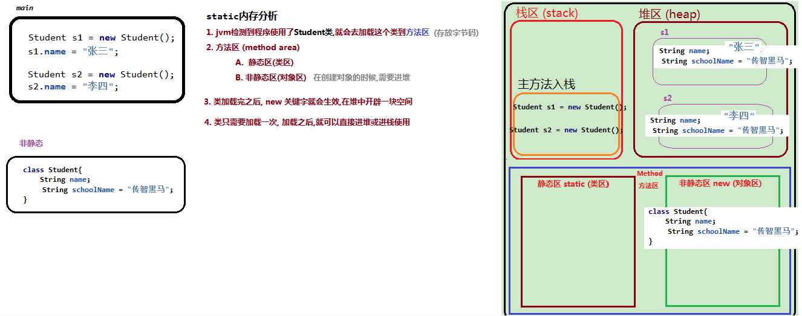
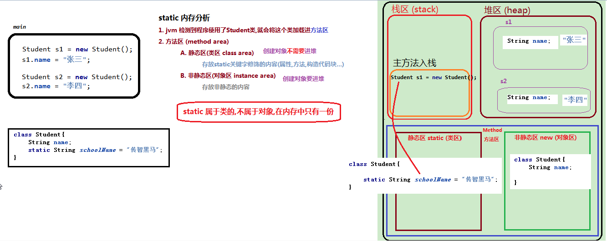

# day02-课堂笔记


## 第一章 Java关键字

### 1.  static关键字   

#### 1.1 static 引入

  


  


```java
package com.itheima01.staticd;

public class Demo01 {

    public static void main(String[] args) {
        /*
        *   问题: 我们创建一个学校里多个学生对象
        *       他们的学校名字都一样, 不断的赋值,而且值都一样,
        *          代码冗余?
        *
        *   解决:
        *       方案一:
        *           直接给普通属性schoolName进行赋值
        *
        *           问题: 普通属性要进堆, 在堆中会有重复的内容(内存占用多)
        *
        *       方案二:
        *           属性schoolName用static修饰
        *
        *           好处:static 属于类的,在内存中只有一份
        * */
        Student s1 = new Student();
        s1.name = "张三";
//        s1.schoolName = "传智黑马";

        Student s2 = new Student();
        s2.name = "李四";
//        s2.schoolName = "传智黑马";


//        Student s3 = new Student();

        /*
        * NullPointerException : 空指针异常
        *    调用普通属性/方法的对象是不存在的 (null)
        *
        *
        *  static 关键字:
        *   属于类的,不属于对象, 对象为null, 跟static也没关系
        *   static关键字不存在空指针异常
        * */
        Student s3 = null;
        System.out.println(s3.schoolName);
    }
}

class Student{
    String name;  // 学生的姓名
    static String schoolName = "传智黑马";// 学生的学校
}
```

#### 1.2 static 语法

  ```markdown
#static的用法
1. static修饰属性
	1). 特点: 在内存中只有一份
	2). 访问
		a. 推荐:  类名.属性名
		b. 不推荐: 对象名.属性名
2. static修饰方法
	1). 访问:
		a. 推荐: 类名.方法名
		b. 不推荐: 对象名.方法名
	 2). 扩展: 为啥main方法要设计成static方法呢
        答案: static方法的调用要比普通方法效率高
        解释:
            普通方法需要对象来调用,需要先创建对象(占用内存,消耗时间)
            静态方法直接用类来调用,不需要创建

            源码(.java文件) -> 字节码(.class文件) -> 运行
                    javac (compile)          java Demo03

        补充: 在idea中, 右单击 run的时候
            底层: 先编译,后运行
            运行:
                先加载当前类, 然后调用  当前类名.main

    3). 注意点:  静态不能调用非静态 (反之可以)

        原因:
            1. 静态的使用不需要对象的 (不进堆)
            2. 而非静态需要对象(进堆)

             类名.静态 , 如果静态内容允许包含非静态的话, 那么非静态的内容又无处安放(冲突)

3. static代码块

  ```


```java
package com.itheima01.staticd;

/*
* 1. static修饰属性
	1). 特点: 在内存中只有一份
	2). 访问
		a. 推荐:  类名.属性名
		b. 不推荐: 对象名.属性名  (警告)


    # static属于类的,不属于对象,在内存只有一份
* */
public class Demo02 {

    public static void main(String[] args) {
        //推荐:  类名.属性名
        System.out.println(Person.schoolName);

        Person p1 = new Person();
        //b. 不推荐: 对象名.属性名  (警告)
        // 对象名.属性名 这种方式调用静态属性,其本质还是通过类调用的
        // 对象是类的一个实例
        // 类(class) 是 一类事物的抽象描述 , 对象 是这类事物的具体实例 (创建对象 , 实例化)
        System.out.println(p1.schoolName);

        System.out.println("-------------");

        Person p2 = new Person();
        Person p3 = new Person();
         p2.schoolName = "传智白马"; //static在内存中只有一份,只要修改了,那么后续访问都会改变
        System.out.println(p2.schoolName); 
        System.out.println(p3.schoolName);
    }
}
class Person{
    String name;
    static String schoolName = "传智黑马";
}
```


```java
package com.itheima01.staticd;

/*
* 2. static修饰方法
	1). 访问:
		a. 推荐: 类名.方法名
		b. 不推荐: 对象名.方法名

    2). 扩展: 为啥main方法要设计成static方法呢

        答案: static方法的调用要比普通方法效率高

        解释:
            普通方法需要对象来调用,需要先创建对象(占用内存,消耗时间)
            静态方法直接用类来调用,不需要创建

            源码(.java文件) -> 字节码(.class文件) -> 运行
                    javac (compile)          java Demo03


        补充: 在idea中, 右单击 run的时候
            底层: 先编译,后运行
            运行:
                先加载当前类, 然后调用  当前类名.main

    3). 注意点:  静态不能调用非静态 (反之可以)

        原因:
            1. 静态的使用不需要对象的 (不进堆)
            2. 而非静态需要对象(进堆)

             类名.静态 , 如果静态内容允许包含非静态的话, 那么非静态的内容又无处安放(冲突)

* */
public class Demo03 {

    public static void main(String[] args) {
        Cat.eat();


        Cat c1 = new Cat();
        c1.eat();
        c1.run();
    }
}

class Cat{
    String name;
    static String age;
    public void run(){
        System.out.println("猫在跑");
        this.eat();
        System.out.println(this.age);
    }
    public static void eat(){
        //静态不能调用非静态,非静态可以调用静态
//        System.out.println(this);
//        System.out.println(name);
        System.out.println(age);
        System.out.println("猫吃鱼");
    }
}
```


### 2. 权限修饰符

```markdown
# java的权限修饰符
1. java四大权限
		public > protected > 不写(默认) > private
2. 使用范围
	1). public : 公开的 (全工程可访问)
	2). protected : 受保护的(本包,非本包子类内部可访问)
	3). 默认: 本包可访问
	4). private : 私有的(只有本类的内部可访问)
	
3. 开发中主要运用
	1). public 修饰构造和get/set方法
	2). private 修饰属性
	3). protected 一般出现JDK代码中,就表示只允许子类内部使用
	
```

```java
package com.itheima01.staticd;

public class Animal {
    public int id1; // 全工程
    protected int id2; // 本包,非本包的子类内部可访问
    int id3;    //本包
    private int id4;// 本类内部
}

```

```java
package com.itheima02.privilege;

import com.itheima01.staticd.Animal;


public class Demo01 {
    public static void main(String[] args) {
        Animal a1 = new Animal();
        System.out.println(a1.id1);
//        System.out.println(a1.id2); //不能访问

    }
}

class Dog extends Animal {

    public void show(){
        System.out.println(id1);
        System.out.println(id2);//非本包的子类内部
    }
}

```


### 3. final关键字

```markdown
#1. 为什么要有final关键字
	希望内容(属性和方法)可以被继承,又不能被修改
#2. final修饰的内容
	0. 不可继承,不可重写,不可修改
	1. 类 :
            如果一个类被final所修饰,那么这个类不能被继承
            (比如String)
	2. 方法 :
	       此方法可以被继承使用,但是不能重写

	3. 变量 :
	        一次赋值,终身不变
	        (final修饰的变量叫常量 : 恒定不变的量 constant)
	        (变量: variable)

         1). 成员变量(属性)
            a. final修饰的成员变量在初始化的时候必须要赋值
            (原因: 成员变量不给初始值的,会有默认初始值, 之后又无法修改,这样没有意义的)
                I. 直接赋值
                II. 通过构造方法赋值
                    普通属性需要先创建对象,必然要调用构造方法,所以也可以用构造方法赋值
         2). 局部变量
            a. final局部变量在初始化的时候不需要赋值
                局部变量没有默认初始值

            b. 原则: 在java中,访问的变量都必须有值,没有值会编译报错

```

```java
package com.itheima03.finald;
/*
*   final出现的场景:
*       问题 : 继承(方法重写) 破坏了 类的封装性
*           方法用public 修饰,那么可以继承,但是无法保证此方法的安全(封装被破坏)
*           方法用private修饰,那么保证此方法的安全(封装), 但是不可以继承
*
*       解决:
*           此方法既可以被继承,又不能被修改
*
*
* */
public class Demo01 {

    public static void main(String[] args) {

        Dog dog = new Dog();
        dog.name = "狗代表";
        dog.declare();

        Fox fox = new Fox();
        fox.name = "狐狸代表";
        fox.declare();
    }
}
/*
*   父类: 是所有子类的共性抽取
* */
class Animal{
    String name;
    //规定好了,不希望被篡改
    public final void declare(){
        System.out.println(name + "说: 我们和人类是好朋友");
    }
}
class Dog extends Animal{

}
class Fox extends Animal{
//    @Override
//    public void declare() {
//        System.out.println(name + "说: 我们和人类是敌人~~");
//    }
}
```


```java
package com.itheima03.finald;
/*
* final修饰的内容 (最终)
	0. 不可继承,不可重写,不可修改
	1. 类 :
            如果一个类被final所修饰,那么这个类不能被继承
            (比如String)
	2. 方法 :
	       此方法可以被继承使用,但是不能重写

	3. 变量 :
	        一次赋值,终身不变
	        (final修饰的变量叫常量 : 恒定不变的量 constant)
	        (变量: variable)

         1). 成员变量(属性)
            a. final修饰的成员变量在初始化的时候必须要赋值
            (原因: 成员变量不给初始值的,会有默认初始值, 之后又无法修改,这样没有意义的)
                I. 直接赋值
                II. 通过构造方法赋值
                    普通属性需要先创建对象,必然要调用构造方法,所以也可以用构造方法赋值
         2). 局部变量
            a. final局部变量在初始化的时候不需要赋值
                局部变量没有默认初始值

            b. 原则: 在java中,访问的变量都必须有值,没有值会编译报错
* */
public class Demo02 {

    public static void main(String[] args) {

//        C c = new C();
//        c.show();

        D d = new D();
        System.out.println(d.age);
    }

}
class D{
//    final int age = 1; //直接赋值
    final int age; // 构造方法赋值
    public D(){
        this.age = 2;
    }

    public void show(){
        final int year;
        year = 2;
//        year = 3; //不能修改

        System.out.println(year);
    }
}


final class A{

}
class B{
    public final void show(){

    }
}
class C extends B{

}
```


## 第二章 代码块

```markdown
# 语法:
*   1.
*       class 类名{    //类体 class body
*           //1.属性
*           //2.方法
*           //3.构造方法
*           //4.成员内部类
*           //5.代码块
*       }
*
*   2.  方法必须要定义在类中
*       修饰符 返回值类型 方法名(参数列表){ //方法体 method body
*           //1. 局部变量
*           //2. 方法内部类
*           //3. 具有执行逻辑的代码片段
*       }
*
*   3.  代码也必须定义在类中
*       {
*            //1. 局部变量
 *           //2. 方法内部类
 *           //3. 具有执行逻辑的代码片段
*       }
*
*       1). 代码块中书写的内容跟方法差不多
*       2). 不一样的是, 不需要手动调用,自动调用
*       3). 代码块
*           I.构造代码块 (了解)
*                当我们创建对象的时候,会执行,而且先于构造方法执行
*                每创建一次对象,就会执行一次
*
*           II. 静态代码块
*               静态代码块随着类的加载而执行,就执行一次
*               静态代码块 要比 对象 快
```


```java
package com.itheima04.block;
/*
*   # 语法:
*   1.
*       class 类名{    //类体 class body
*           //1.属性
*           //2.方法
*           //3.构造方法
*           //4.成员内部类
*           //5.代码块
*       }
*
*   2.  方法必须要定义在类中
*       修饰符 返回值类型 方法名(参数列表){ //方法体 method body
*           //1. 局部变量
*           //2. 方法内部类
*           //3. 具有执行逻辑的代码片段
*       }
*
*   3.  代码也必须定义在类中
*       {
*            //1. 局部变量
 *           //2. 方法内部类
 *           //3. 具有执行逻辑的代码片段
*       }
*
*       1). 代码块中书写的内容跟方法差不多
*       2). 不一样的是, 不需要手动调用,自动调用
*       3). 代码块
*           I.构造代码块 (了解)
*                当我们创建对象的时候,会执行,而且先于构造方法执行
*                每创建一次对象,就会执行一次
*
*           II. 静态代码块
*               静态代码块随着类的加载而执行,就执行一次
*               静态代码块 要比 对象 快
* */
public class Demo01 {
    static{
        System.out.println("Demo01静态代码块");
    }
    public static void main(String[] args) throws ClassNotFoundException {
        System.out.println("Demo01主方法");
        //先加载类,后创建对象
//        A a1 = new A();
//        A a2 = new A(1);

        A.main();

    }
}
class A{
    static{
        System.out.println("静态代码块");
    }
    public static void main(){
        System.out.println("A的静态方法");
    }
    static String name;
    {
        System.out.println("构造代码块");
    }
    public A(){
        System.out.println("构造方法");
    }
    public A(int i){
        System.out.println("构造方法2");
    }
    public void method(){
        //代码片段
        int i;
        i = 2;
    }

}

```


## 第三章 接口(重点)

```markdown
# 一. 为什么有接口
1. 概念
	1). 生活中的接口: 一类事物的标准(规范) 
        usb接口的规范(标准)
            1. 参数: 接触针数 5
            2. 充电功能 charge
            3. 传输数据 transfer
    2). Java中的接口
        1. 四大类型之一: class(类), interface(接口) , enum(枚举) , annotation(注解)
        2. 含义:
            类: 一类事物的抽象描述
            接口: 一类事物的标准定义
# 二. 接口的使用
1. 关键字 : interface
	interface 接口名{ 
	
	}
2. 接口中的内容
	1). 抽象方法(JDK7之前) 
		I. 抽象方法的作用是下定义(接口中最重要的内容)
		II. 抽象方法
			public abstract void 方法名(参数列表);
			public abstract可以省略不写
	2). 默认方法 (jdk8): default
	 	I. 默认用public修饰
        II. 通过实现类对象调用(继承)
	3). 静态方法 (jdk8) : static
		I. 默认用public修饰
    	II. 通过接口名直接调用
			默认方法和静态方法是为函数式编程铺垫的
	4). 常量
    	I. 接口中没有变量,只有常量
    	II. 常量默认用public static final修饰
    	III. 直接接口名调用
    	(常量名要大写 : 软性规范)
            硬性规范 : 不这么做不行
            软性规范 : 不这么做可以,但推荐这么做
            ctrl + shift + u(uppercase) : 大小写自动转换
3. 接口的特点	
	1). 接口不能被实例化
	2). 接口的作用是给一类事物定义标准,是需要类实现的(实现等价于继承)
		class A implements B{
            //A是类,B是接口 
            //A是B的子类(实现类)
		}
		
# 三. 接口和类的关系
1. 接口和类之间的关系
    1). 类与类之间 : 继承  (单继承,可以多重继承)
        class A extends B{ }
        class C extends A{ }

    2). 接口与类之间: 实现(等价于继承, 可以多实现)
        class A implements B{ }
        class A implements B,C{ // 一个类可以实现多个接口 }

    3). 接口与接口之间: 继承
        interface A extends B,C{ // 一个接口可以继承多个接口 }
    
    4). 一个类可以继承另外一个类,还可以实现另一个接口
    	class A extends B implements C{  }
    	
2. 多实现下极端情况(了解)
	1). 第一种情况
		class K implements I,J 
		其中,I和J存在同名的抽象方法
		K只要重写其中一个即可
	2). 第二种情况
    	class K implements I,J 
		其中,I和J存在同名的默认方法
		K必须要重写这个方法
	3). 第三种情况
    	class K implements I,J 
		其中,I和J存在同名的静态方法
		K不需要重写, 直接用相应接口名调用即可
	4). 第四种情况
    	 class M extends L implements I
    	 其中, L和I存在同名的方法(默认)
    	 L的优先级高于I,M优先调用L的方法
# 四. 接口和抽象类
	1. 语法上
		1). 都不能实例化
			抽象类有构造方法,但是接口没有
		2). 都需要被继承,不然就没有意义
        
	2. 含义上
		1). 能用接口抽取内容,尽量不要用抽象类
			抽象类是类, 类只能单继承, 接口可以多实现
	    2). 类 is a 关系, 接口 have a 关系
        	
```


```java
package com.itheima05.interfaced;

public class Demo01 {

}
/*
     生活中的接口: 一类事物的标准(规范)
        usb接口的规范(标准)
            1. 参数: 接触针数 5
            2. 充电功能 charge
            3. 传输数据 transfer

    Java中的接口
        1. 四大类型之一: class(类), interface(接口) , enum(枚举) , annotation(注解)
        2. 含义:
            类: 一类事物的抽象描述
            接口: 一类事物的标准定义

 */
interface Usb{
    //参数: 接触针数 5
    public static final int number = 5;
    //充电功能
    public abstract void charge();
    //传输数据
    public abstract void transfer();
}

```


```java
package com.itheima05.interfaced;

public class Demo02 {
    public static void main(String[] args) {

    }
}
//只要一个对象实现自某个接口,必须要重写这个接口的所有抽象方法
//但凡是动物,必须能吃能跑
//接口中的抽象方法(下定义),子类必须有这些方法,子类的实例必须重写方法
interface Animal{
    public abstract void eat();
    //方法声明前默认有public abstract
    void run();
}
abstract class Dog implements Animal{
    //拥有抽象方法的类必须是抽象类
}
/*
    ctrl + I : 提示所有未实现的抽象方法
* */
class Cat implements Animal{
    @Override
    public void eat() {
        System.out.println("猫吃鱼");
    }

    @Override
    public void run() {
        System.out.println("猫在跑");
    }
}

```


```java
package com.itheima05.interfaced;

public class Demo03 {

    public static void main(String[] args) {

        B b = new B();
        b.method02();

        A.method03();

        System.out.println(A.YEAR);
    }
}
interface A{
    /*
    *   常量
    *   1. 接口中没有变量,只有常量
    *   2. 常量默认用public static final修饰
    *   3. 直接接口名调用
    *   (常量名要大写 : 软性规范)
    *       硬性规范 : 不这么做不行
    *       软性规范 : 不这么做可以,但推荐这么做
    *
    *   ctrl + shift + u(uppercase) : 大小写自动转换
    * */
    public static final int YEAR = 1;


    public abstract void method01();
    /*
        默认方法: default
        1. 默认用public修饰
        2. 通过实现类对象调用(继承)
     */
    public default void method02(){
        System.out.println("默认方法");
    }
    /*
    *  静态方法: static
    *  1. 默认用public修饰
    *  2. 通过接口名直接调用
    * */
    public static void method03(){
        System.out.println("静态方法");
    }
}
class B implements A{
    int i; //变量
    public final int j = 1;//常量:不可修改
    public static final int k = 2;//静态常量(跟对象无关,可以直接类名调用)
    @Override
    public void method01() {
        System.out.println("抽象方法的重写");
    }
}
```


```java
package com.itheima05.interfaced;

import com.itheima01.staticd.Animal;

/*
 *   多实现下的极端情况
 * */
public class Demo05 {

    public static void main(String[] args) {
//        K k = new K();
//        k.method02();

        M m = new M();
        m.method02();
    }
}

interface I{
    void method01();
    default void method02(){
        System.out.println("第一个默认方法");
    }
    static void method03(){
        System.out.println("第一个静态方法");
    }
}
interface J{
    void method01();
    default void method02(){
        System.out.println("第二个默认方法");
    }
    static void method03(){
        System.out.println("第二个静态方法");
    }
}
 class K implements I,J{
     @Override
     public void method01() {

     }

     @Override
     public void method02() {
        I.method03();
        J.method03();
     }
 }
abstract class L{
    public abstract void method01();
    public void method02(){
        System.out.println("第三个普通方法");
    }
    public static void method03(){
        System.out.println("第三个静态方法");
    }
}
 class M extends L implements I{
     @Override
     public void method01() {

     }
 }
abstract class Animal2{
    public abstract void eat();
    public abstract void run();
}
interface Jidu{
    void jd();
}
//狗是动物,有缉毒功能
class Dog2 extends Animal2 implements Jidu{
    @Override
    public void eat() {

    }

    @Override
    public void run() {

    }

    @Override
    public void jd() {

    }
}
```


## 第四章 多态(重点)

```markdown
# 多态
1. 概述
	1). 多态的表现: 一种行为,多种形态
	2). java中的多态三要素
		I. 继承
		II. 重写
		III. 向上转型
	3). 向上转型
    	父类类型 变量 = 子类对象
    4). 多态的代码体现:
    	父类引用指向子类对象,父类引用调用方法,执行的是子类重写的方法

2. 多态的好处
	提高代码的复用性(扩展性)
	
3. 多态的缺点	
	1). 不能调用某个子类特有的方法(编译看左边)
	2). 解决: 向下转型 (强转)
	  子类类型 变量 = (子类类型)父类引用
      前提:  父类引用的真实类型必须跟子类类型一致(只对了一半)
	
	3). 问题:
       I. 如果父类引用的真实类型跟子类类型不一致(比如真实类型Dog , 硬要转换 Cat)
       II. 运行报错:    ClassCastException (类型转换异常)
	   III. 解决:
                先判断,如果是猫,再强转
			//如果变量a的真实类型是Cat2,返回true,否则返回false
               boolean result = a instanceof Cat2;	
```


```java
package com.itheima06.duotai;
/*
*  java中的多态三要素
    I. 继承
    II. 重写
    III. 向上转型 (基于继承关系的)

   1). 向上转型 (天然成立没有问题)
    	父类类型 变量 = 子类对象

   2). 为什么要有重写?
        父类有此方法,子类重写了此方法

        父类此方法为了通过编译
        子类的方法为了执行

        编译看左边,运行看右边
* */
public class Demo01 {
    public static void main(String[] args) {
        //父类引用指向子类对象(向上转型)
//        Animal a = new Cat();
        //父类引用调用方法,执行的是子类重写的方法
//        a.eat();


       /*
            多态的好处 : 提高代码的复用性(扩展性)

            需求一: 狗吃东西
            需求二: 猫吃东西

            需求变动,如果没有多态要改两行代码
            如果有了多态,只要修改对象就可以了

        */
//        Dog dog = new Dog();
//        dog.eat();

//        Cat cat = new Cat();
//        cat.eat();

        Animal a = new Cat();
        a.eat();

        // Animal a =  new Cat();
        method01( new Cat());
        method01( new Dog());
    }

    private static void method01(Animal a) {
        a.eat();
    }
}
abstract class Animal{
    //抽象方法: 吃
    public abstract void eat();
}
class Dog extends Animal{
    @Override
    public void eat() {
        System.out.println("狗吃骨头");
    }
}
class Cat extends Animal{
    @Override
    public void eat() {
        System.out.println("猫吃鱼");
    }
}
```


```java
package com.itheima06.duotai;
/*
*       源码(source) .java -> 字节码(bytecode) .class  ->    运行
*                      编译器(主要检查语法)             java虚拟机
*
*
*     经典结论: 编译看左边,运行看右边
*
*
*      表达式的左边: 编译器可以检查的
*      表达式的右边: 编译器无法检查,只有运行了才知道
* */
public class Demo02 {

    public static void main(String[] args) {

        boolean result = true;
        while(result){
            System.out.println("xx");
        }
        /*
        *   编译报错: 逻辑有问题
        * */
        System.out.println("yy");
    }
}

```


## 第五章 内部类(明天)


## 今日总结

```markdown
- 能够定义和使用静态方法及静态变量
		1). public static final 返回值类型 方法名(参数列表){方法体 }
		2). public static final int i = 1;
		3). 使用: 类名.属性 / 类名.方法名
- 能够说出final修饰类，方法，变量的特点
		不可继承,不可重写,不可修改
		成员变量赋值(初始化必须赋值, 直接赋值或者构造方法赋值)
		局部变量赋值(初始化可以不赋值,用的时候再赋值)
- 能够说出4种权限修饰符的访问特点	
		public : 公开的,全工程可访问
		protected : 受保护的,本包,非本包子类内部可访问
		不写:  默认, 本包
		private : 本类内部可访问
- 能够说出各种代码块的定义格式及执行特点
		1). 构造代码块
			I. 每创建一个对象,都会执行一次(跟构造方法)
			II. 构造代码块先于构造方法执行
			III. 成员位置
				{  }
		2). 静态代码块
			I. 随着类的加载而执行,只执行一次
			II. 优先于对象执行,优先于静态方法
			III. 成员位置
				static{   }
- 能够写出接口的定义格式
		interface 接口名{
			//1. 抽象方法(JDK7)
			//2. 默认方法(JDK8 为函数式编程铺垫)
			//3. 静态方法(JDK8 为函数式编程铺垫)
			//4. 常量
		}
- 能够写出接口的实现格式
		class A extends B implements C,D{
            
		}
- 能够说出接口中的成员特点
		1). 抽象方法默认用public abstract 修饰
		2). 默认方法 public default
		3). 静态方法 public static 
		4). 常量 : public static final
- 能够说出多态的前提
		继承,重写,向上转型
- 能够写出多态的格式
		父类引用指向子类对象,父类引用调用方法执行的是子类重写的方法
		Animal a = new Dog();
		a.eat();
- 能够理解多态向上转型和向下转型
		1). 向上转型 (继承关系,无其他条件)
			父类类型 变量 = 子类对象
        	Animal a = new Dog();
        	
        2). 向下转型(强转)	
        	子类类型 变量 = (子类类型)父类引用
        	
        	前提: 父类引用的真实类型必须跟子类类型一致
        	如果担心不一样,可先进行类型判断 (如果一致,返回true,否则就是false)
				boolean result = 父类引用 instanceof 子类类型
```

