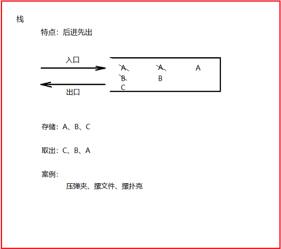
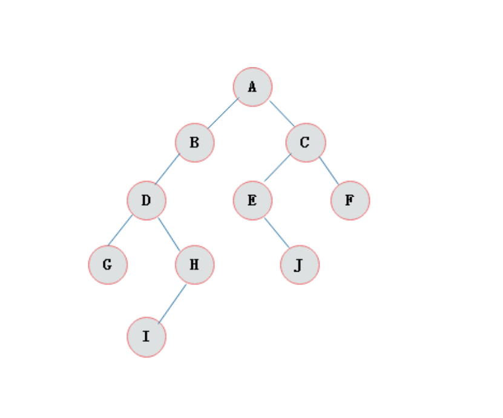
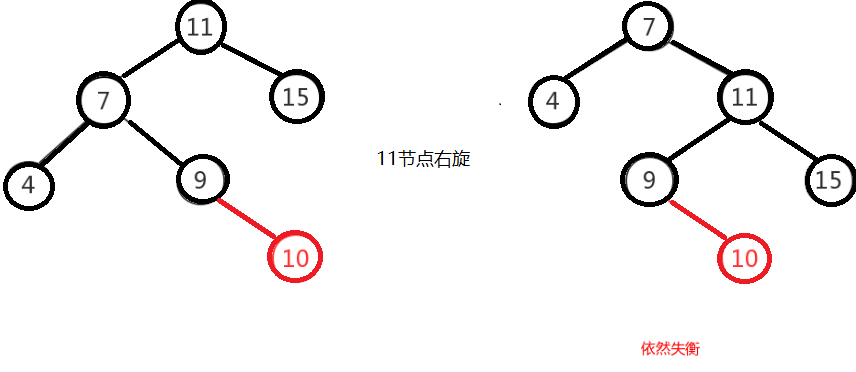

# day04 【Collection集合框架，迭代器，数据结构，List集合】

## 今日内容

- Collection集合
- 迭代器
- 泛型
- 数据结构


## 教学目标

- [ ] 能够在成员变量及其方法上使用引用类型
- [ ] 能够使用Collection集合的常用功能
- [ ] 能够使用迭代器遍历集合
- [ ] 能够使用增强for循环遍历集合和数组
- [ ] 能够理解泛型的含义
- [ ] 能够熟悉泛型上下限的格式
- [ ] 能够说出数组结构特点
- [ ] 能够说出栈结构特点
- [ ] 能够说出队列结构特点
- [ ] 能够说出单向链表结构特点
- [ ] 能够说出List集合特点
- [ ] 能够说出List的常用子类及其底层结构特点


# 第一章 引用类型使用

​		实际的开发中，引用类型的使用非常重要，也是非常普遍的。我们可以在理解基本类型的使用方式基础上，进一步去掌握引用类型的使用方式。基本类型可以作为成员变量、作为方法的参数、作为方法的返回值，那么当然引用类型也是可以的。在这我们使用两个例子 , 来学习一下。

## 1 类名作为方法参数和返回值

```java
public class Person{
  public void eat(){
    System.out.println("吃饭");
  }
}
public class Test{
  public static void main(String[] args){
        method(new Person());
   		Person p = createPerson();
  }
    
  //引用类型作为方法参数,在前面笔记本案例中我们也使用了接口类型作为方法参数
  pubic static void method(Person p){
       p.eat();
  }
    
  //引用类型作为返回值
  public static Person createPerson(){
    	return new Person();
  }
}

```


## 2 抽象类作为方法参数和返回值

- 抽象类作为形参：表示可以接收任何此抽象类的"子类对象"作为实参；
- 抽象类作为返回值：表示"此方法可以返回此抽象类的任何子类对象"；

```java
/* 定义一个抽象类 */
public abstract class Person{
    public void eat(){
        System.out.println("吃饭");
    }
    public abstract void work();
}
/*定义子类Student*/
public class Student extends Person{
    public void work(){
        System.out.println("学生的工作是学习...");
    }
}
public class Teacher extends Person{
    public void work(){
        System.out.println("老师的工作是教书育人...");
    }
}
/*测试类*/
public class Test{
    public static void main(String[] args){
        //1.调用method1()方法，可以传入一个Student对象，也可以传入一个Teacher对象
        method1(new Student());//OK的
        method1(new Teacher());//OK的
        
        //2.调用method2()方法，接收的可能是Student对象，也可能是Teacher对象
        //所以，这里使用Person类型接收
        Person p = method2();
        p.work();//如果是Student对象，则调用的是Student的work()；如果是Teacher对象，调用的是Teacher的work()。
    }
    //-------------------------------------------------------------------------------//
    //抽象类Person作为形参——可以接收任何它的子类对象
    public static void method1(Person p){
        p.eat();
        p.work();
    }
    
    //抽象类Person作为返回值——此方法可以返回一个Student对象，也可以返回一个Teacher对象
    public static Person method2(){
      //  return new Student();//OK的
        return new Teacher();//OK的
    }
    
}
```


## 3 接口作为方法参数和返回值

- 接口作为方法的形参：【同抽象类】
- 接口作为方法的返回值：【同抽象类】

```java
/*定义一个接口*/
public interface USB{
    public void run();
}
/*定义子类*/
public class Keyboard implements USB{
    public void run(){
        System.out.println("使用键盘...");
    }
}
public class Mouse implements USB{
    public void run(){
        System.out.println("使用鼠标...");
    }
}
/*定义测试类*/
public class Test{
    public static void main(String[] args){
        //1.调用method1()方法，需要传入USB的任何子类对象都可以
        method1(new Keyboard());
        method2(new Mouse());
        
        //2.调用method2()方法，此方法可能返回一个Keyboard对象，也可能返回一个Mouse对象
        USB usb = method2();
        usb.run();
    }
    //接口作为形参
    public static void method1(USB usb){
        usb.run();
    }
    //接口作为返回值
    public static USB method2(){
  //      return new Keyboard();//OK的
    	return new Mouse();//OK的    
    }
}
```


## 4 类名作为成员变量

​	我们每个人(Person)都有一个身份证(IDCard) , 为了表示这种关系 , 就需要在Person中定义一个IDCard的成员变量。定义Person类时，代码如下：

```java
class Person {
    String name;//姓名
    int age;//年龄
}
```

​	使用`String` 类型表示姓名 , `int` 类型表示年龄。其实，`String`本身就是引用类型，我们往往忽略了它是引用类型。如果我们继续丰富这个类的定义，给`Person` 增加身份证号 , 身份证签发机关等属性，我们将如何编写呢？这时候就需要编写一个IDCard类了

定义IDCard(身份证)类，添加身份证号 , 签发地等属性：

```java
class IDCard {
    String idNum;//身份证号
    String authority;//签发地
  
  	//getter和setter方法
  	//...
  	
  	//toString方法
  	//...
}
```

修改Person类：

```java
public class Person {
    String name;//姓名
    int age;//年龄

    IDCard idCard;//表示自己的身份证信息

    //name和age的getter、setter方法
    //...

    public IDCard getIdCard() {
        return idCard;
    }

    public void setIdCard(IDCard idCard) {
        this.idCard = idCard;
    }

    @Override
    public String toString() {
        return "Person{" +
                "name='" + name + '\'' +
                ", age=" + age +
                ", idCard=" + idCard +
                '}';
    }
}
```

测试类：

```java
public class TestDemo {
    public static void main(String[] args) {
        //创建IDCard对象
        IDCard idCard = new IDCard();
        //设置身份证号
        idCard.setIdNum("110113201606066666");
        //设置签发地
        idCard.setAuthority("北京市顺义区公安局");

        //创建Person对象
        Person p = new Person();
        //设置姓名
        p.setName("小顺子");
        //设置年龄
        p.setAge(2);
        //设置身份证信息
        p.setIdCard(idCard);

        //打印小顺子的信息
        System.out.println(p);
    }
}
输出结果:
Person{name='小顺子', age=2, idCard=IDCard{idNum='110113201606066666', authority='北京市顺义区公安局'}}
```

> 类作为成员变量时，对它进行赋值的操作，实际上，是赋给它该类的一个对象。同理 , 接口也是如此 , 例如我们笔记本案例中使用usb设备。在此我们只是通过小例子 , 让大家熟识下引用类型的用法 , 后续在咱们的就业班学习中 , 这种方式会使用的很多。  


## 5 抽象类作为成员变量

- 抽象类作为成员变量——为此成员变量赋值时，可以是任何它的子类对象

```java
/*定义抽象类*/
public abstract class Animal{
    public abstract void sleep();
}
/*定义子类*/
public class Cat extends Animal{
    public void sleep(){
        System.out.println("小猫睡觉...");
    }
    public String toString(){
        return "一只可爱的小猫";
    }
}
public class Dog extends Animal{
    public void sleep(){
        System.out.println("小狗睡觉...");
    }
    public String toString(){
        return "一只可爱的小狗";
    }
}
/*定义Student类*/
public class Student{
    private String name;
    private int age;
    private Animal animal;//表示学生有一个动物，可以是Cat，也可以是Dog
    
    public Student(String name,int age,Animal animal){
        this.name = name;
        this.age = age;
        this.animal = animal;
    }
    public void setName(String name){
        this.name = name;
    }
    public String getName(){
        return this.name;
    }
    public void setAge(int age){
        this.age = age;
    }
    public int getAge(){
        return this.age;
    }
    public void setAnimal(Animal animal){
        this.animal = animal;
    }
    public Animal getAnimal(){
        return this.animal;
    }
    
    public String toString(){
        return "Student [name = " + name + 
            	" , age = " + age + 
            	" , animal = " + animal + 
            	"]";
    }
}
/*定义测试类*/
public class Test{
    public static void main(String[] args){
        Student stu = new Student();
        stu.setName("章子怡");
        stu.setAge(19);
    //    stu.setAnimal(new Cat());//表示Student有一只猫
        stu.setAnimal(new Dog());//表示Student有一只狗
        
        System.out.println(stu);//隐式调用stu.toString()，而stu.toString()中会隐式调用animal的toString().
    }
    
}
```


## 6 接口作为成员变量

- 接口类型作为成员变量——【同抽象类】

```java
/*定义接口*/
public interface Animal{
    public abstract void sleep();
}
/*定义子类*/
public class Cat implements Animal{
    public void sleep(){
        System.out.println("小猫睡觉...");
    }
    public String toString(){
        return "一只可爱的小猫";
    }
}
public class Dog implements Animal{
    public void sleep(){
        System.out.println("小狗睡觉...");
    }
    public String toString(){
        return "一只可爱的小狗";
    }
}
/*定义Student类*/
public class Student{
    private String name;
    private int age;
    private Animal animal;//表示学生有一个动物，可以是Cat，也可以是Dog
    
    public Student(String name,int age,Animal animal){
        this.name = name;
        this.age = age;
        this.animal = animal;
    }
    public void setName(String name){
        this.name = name;
    }
    public String getName(){
        return this.name;
    }
    public void setAge(int age){
        this.age = age;
    }
    public int getAge(){
        return this.age;
    }
    public void setAnimal(Animal animal){
        this.animal = animal;
    }
    public Animal getAnimal(){
        return this.animal;
    }
    
    public String toString(){
        return "Student [name = " + name + 
            	" , age = " + age + 
            	" , animal = " + animal + 
            	"]";
    }
}
/*定义测试类*/
public class Test{
    public static void main(String[] args){
        Student stu = new Student();
        stu.setName("章子怡");
        stu.setAge(19);
    //    stu.setAnimal(new Cat());//表示Student有一只猫
        stu.setAnimal(new Dog());//表示Student有一只狗
        
        System.out.println(stu);//隐式调用stu.toString()，而stu.toString()中会隐式调用animal的toString().
    }
    
}
```


# 第二章 Collection集合

## 1 集合概述

在前面基础班我们已经学习过并使用过集合ArrayList<E> ,那么集合到底是什么呢?

- **集合**：集合是java中提供的一种容器，可以用来存储多个数据。

集合和数组既然都是容器，它们有什么区别呢？

- 数组的长度是固定的。集合的长度是可变的。
- 数组中存储的是同一类型的元素，可以存储任意类型数据。集合存储的都是引用数据类型。如果想存储基本类型数据需要存储对应的包装类型。


## 2  集合常用类的继承体系

Collection：单列集合类的根接口，用于存储一系列符合某种规则的元素，它有两个重要的子接口，分别是`java.util.List`和`java.util.Set`。其中，**`List`的特点是元素有序、元素可重复 ; `Set`的特点是元素不可重复**。`List`接口的主要实现类有`java.util.ArrayList`和`java.util.LinkedList`，`Set`接口的主要实现类有`java.util.HashSet`和`java.util.LinkedHashSet`。

从上面的描述可以看出JDK中提供了丰富的集合类库，为了便于初学者进行系统地学习，接下来通过一张图来描述集合常用类的继承体系


注意:这张图只是我们常用的集合有这些，不是说就只有这些集合。

集合本身是一个工具，它存放在java.util包中。在`Collection`接口定义着单列集合框架中最最共性的内容。


## 3 Collection 常用功能

Collection是所有单列集合的父接口，因此在Collection中定义了单列集合(List和Set)通用的一些方法，这些方法可用于操作所有的单列集合。方法如下：

- `public boolean add(E e)`：  把给定的对象添加到当前集合中 。
- `public void clear()` :清空集合中所有的元素。
- `public boolean remove(E e)`: 把给定的对象在当前集合中删除。
- `public boolean contains(Object obj)`: 判断当前集合中是否包含给定的对象。
- `public boolean isEmpty()`: 判断当前集合是否为空。
- `public int size()`: 返回集合中元素的个数。
- `public Object[] toArray()`: 把集合中的元素，存储到数组中

> tips: 有关Collection中的方法可不止上面这些，其他方法可以自行查看API学习。

```java
public class Demo02ListMethod {
    public static void main(String[] args) {
        method4();
    }

    public static void method4() {
        //创建集合
        List<String> list = new ArrayList<>();
        //添加元素
        list.add("jack");
        list.add("rose");
        list.add("tony");
        //打印集合
        System.out.println("替换前：" + list); //[jack, rose, tony]
        //调用set方法，使用 tom 替换掉原来索引为1的元素
        String str = list.set(1, "tom");
        System.out.println("替换后：" + list); //[jack, tom, tony]
        System.out.println("str:" + str); //rose
    }

    public static void method3() {
        //创建集合
        List<String> list = new ArrayList<>();
        //添加元素
        list.add("jack");
        list.add("rose");
        list.add("tony");
        //打印集合
        System.out.println("删除前：" + list); //[jack, rose, tony]
        //调用remove方法，删除索引为1的元素
        String str = list.remove(1);
        System.out.println("删除后：" + list); //[jack, tony]
        System.out.println("str:" + str); //rose
    }

    public static void method2() {
        //创建集合
        List<String> list = new ArrayList<>();
        //添加元素
        list.add("jack");
        list.add("rose");
        list.add("tony");
        //调用get方法，根据索引获取元素
        System.out.println(list.get(1));
    }


    public static void method1() {
        //创建集合
        List<String> list = new ArrayList<>();
        //添加元素
        list.add("jack");
        list.add("rose");
        list.add("tony");
        //打印集合
        System.out.println("list:" + list); //[jack, rose, tony]
        //向索引为1的位置插入元素。 lucy
        list.add(1, "lucy");
        //打印集合
        System.out.println("list:" + list); //[jack, lucy, rose, tony]

    }
}

```


# 第三章 Iterator迭代器

## 1 Iterator接口

在程序开发中，经常需要遍历集合中的所有元素。针对这种需求，JDK专门提供了一个接口`java.util.Iterator`。

想要遍历Collection集合，那么就要获取该集合迭代器完成迭代操作，下面介绍一下获取迭代器的方法：

- `public Iterator iterator()`: 获取集合对应的迭代器，用来遍历集合中的元素的。

下面介绍一下迭代的概念：

- **迭代**：即Collection集合元素的通用获取方式。在取元素之前先要判断集合中有没有元素，如果有，就把这个元素取出来，继续再判断，如果还有就再取出来。一直把集合中的所有元素全部取出。这种取出方式专业术语称为迭代。

Iterator接口的常用方法如下：

- `public E next()`:返回迭代的下一个元素。
- `public boolean hasNext()`:如果仍有元素可以迭代，则返回 true。

接下来我们通过案例学习如何使用Iterator迭代集合中元素：

```java
public class IteratorDemo {
  	public static void main(String[] args) {
        // 使用多态方式 创建对象
        Collection<String> coll = new ArrayList<String>();

        // 添加元素到集合
        coll.add("串串星人");
        coll.add("吐槽星人");
        coll.add("汪星人");
        //遍历
        //使用迭代器 遍历   每个集合对象都有自己的迭代器
        Iterator<String> it = coll.iterator();
        //  泛型指的是 迭代出 元素的数据类型
        while(it.hasNext()){ //判断是否有迭代元素
            String s = it.next();//获取迭代出的元素
            System.out.println(s);
        }
  	}
}
```

> tips: 
>
> 1. 在进行集合元素获取时，如果集合中已经没有元素了，还继续使用迭代器的next方法，将会抛出java.util.NoSuchElementException没有集合元素异常。
> 2. 在进行集合元素获取时，如果添加或移除集合中的元素 , 将无法继续迭代 , 将会抛出ConcurrentModificationException并发修改异常.


## 2 迭代器的实现原理

​        我们在之前案例已经完成了Iterator遍历集合的整个过程。当遍历集合时，首先通过调用t集合的iterator()方法获得迭代器对象，然后使用hashNext()方法判断集合中是否存在下一个元素，如果存在，则调用next()方法将元素取出，否则说明已到达了集合末尾，停止遍历元素。

​        Iterator迭代器对象在遍历集合时，内部采用指针的方式来跟踪集合中的元素。在调用Iterator的next方法之前，迭代器的索引位于第一个元素之前，不指向任何元素，当第一次调用迭代器的next方法后，迭代器的索引会向后移动一位，指向第一个元素并将该元素返回，当再次调用next方法时，迭代器的索引会指向第二个元素并将该元素返回，依此类推，直到hasNext方法返回false，表示到达了集合的末尾，终止对元素的遍历。


## 3 增强for

增强for循环(也称for each循环)是**JDK1.5**以后出来的一个高级for循环，专门用来遍历数组和集合的。它的内部原理其实是个Iterator迭代器，所以在遍历的过程中，不能对集合中的元素进行增删操作。

格式：

```java
for(元素的数据类型  变量 : Collection集合or数组){ 
  	//写操作代码
}
```

它用于遍历Collection和数组。通常只进行遍历元素，不要在遍历的过程中对集合元素进行增删操作。

代码演示

```java
public class NBForDemo1 {
    public static void main(String[] args) {
		int[] arr = {3,5,6,87};
       	//使用增强for遍历数组
		for(int a : arr){//a代表数组中的每个元素
			System.out.println(a);
		}
    	
    	Collection<String> coll = new ArrayList<String>();
    	coll.add("小河神");
    	coll.add("老河神");
    	coll.add("神婆");
    	
    	for(String s :coll){
    		System.out.println(s);
    	}
	}
}
```


> tips: 
>
> 增强for循环必须有被遍历的目标，目标只能是Collection或者是数组；
>
> 增强for（迭代器）仅仅作为遍历操作出现，不能对集合进行增删元素操作，否则抛出ConcurrentModificationException并发修改异常 


> 小结：Collection是所有单列集合的根接口，如果要对单列集合进行遍历，通用的遍历方式是迭代器遍历或增强for遍历。


# 第四章 泛型

## 1  泛型概述

在前面学习集合时，我们都知道集合中是可以存放任意对象的，只要把对象存储集合后，那么这时他们都会被提升成Object类型。当我们在取出每一个对象，并且进行相应的操作，这时必须采用类型转换。

大家观察下面代码：

```java
public class GenericDemo {
	public static void main(String[] args) {
		Collection coll = new ArrayList();
		coll.add("abc");
		coll.add("itcast");
		coll.add(5);//由于集合没有做任何限定，任何类型都可以向其中存放
		Iterator it = coll.iterator();
		while(it.hasNext()){
			//需要打印每个字符串的长度,就要把迭代出来的对象转成String类型
			String str = (String) it.next();
			System.out.println(str.length());
		}
	}
}
```

程序在运行时发生了问题**java.lang.ClassCastException**。                                                                                             为什么会发生类型转换异常呢？                                                                                                                                       我们来分析下：由于集合中什么类型的元素都可以存储。导致取出时强转引发运行时 ClassCastException。                                                                                                                                                       怎么来解决这个问题呢？                                                                                                                                                           Collection虽然可以存储各种对象，但实际上通常Collection只存储同一类型对象。例如都是存储字符串对象。因此在JDK5之后，新增了**泛型**(**Generic**)语法，让你在设计API时可以指定类或方法支持泛型，这样我们使用API的时候也变得更为简洁，并得到了编译时期的语法检查。

- **泛型**：可以在类或方法中预知地使用未知的类型。

> tips:泛型的作用是在创建对象时，将未知的类型确定具体的类型。当没有指定泛型时，默认类型为Object类型。


## 2  使用泛型的好处

上一节只是讲解了泛型的引入，那么泛型带来了哪些好处呢？

- 将运行时期的ClassCastException，转移到了编译时期变成了编译失败。
- 避免了类型强转的麻烦。

通过我们如下代码体验一下：

```java
public class GenericDemo2 {
	public static void main(String[] args) {
        Collection<String> list = new ArrayList<String>();
        list.add("itheima");
        list.add("itcast");
        // list.add(666);//当集合明确类型后，存放类型不一致就会编译报错
        // 集合已经明确具体存放的元素类型，那么在使用迭代器的时候，迭代器也同样会知道具体遍历元素类型
        Iterator<String> it = list.iterator();
        while(it.hasNext()){
            String str = it.next();
            //当使用Iterator<String>控制元素类型后，就不需要强转了。获取到的元素直接就是String类型
            System.out.println(str.length());
        }
	}
}
```

> tips:泛型是数据类型的一部分，我们将类名与泛型合并一起看做数据类型。


## 3  泛型的定义与使用

我们在集合中会大量使用到泛型，这里来完整地学习泛型知识。

泛型，用来灵活地将数据类型应用到不同的类、方法、接口当中。将数据类型作为参数进行传递。

### 定义和使用含有泛型的类

定义格式：

```
修饰符 class 类名<代表泛型的变量> {  }
```

例如，API中的ArrayList集合：

泛型在定义的时候不具体，使用的时候才变得具体。在使用的时候确定泛型的具体数据类型。

```java
class ArrayList<E>{ 
    public boolean add(E e){ }

    public E get(int index){ }
   	....
}
```

使用泛型： 即什么时候确定泛型。

**在创建对象的时候确定泛型**

 例如，`ArrayList<String> list = new ArrayList<String>();`

此时，变量E的值就是String类型,那么我们的类型就可以理解为：

```java 
class ArrayList<String>{ 
     public boolean add(String e){ }

     public String get(int index){  }
     ...
}
```

再例如，`ArrayList<Integer> list = new ArrayList<Integer>();`

此时，变量E的值就是Integer类型,那么我们的类型就可以理解为：

```java
class ArrayList<Integer> { 
     public boolean add(Integer e) { }

     public Integer get(int index) {  }
     ...
}
```

### 含有泛型的方法

定义格式：

```
修饰符 <代表泛型的变量> 返回值类型 方法名(参数){  }
```

例如，

```java
public class MyGenericMethod {	  
    public <MVP> void show(MVP mvp) {
    	System.out.println(mvp.getClass());
    }
    
    public <MVP> MVP show2(MVP mvp) {	
    	return mvp;
    }
}
```

**调用方法时，确定泛型的类型**

```java
public class GenericMethodDemo {
    public static void main(String[] args) {
        // 创建对象
        MyGenericMethod mm = new MyGenericMethod();
        // 演示看方法提示
        mm.show("aaa");
        mm.show(123);
        mm.show(12.45);
    }
}
```

### 含有泛型的接口

定义格式：

```
修饰符 interface接口名<代表泛型的变量> {  }
```

例如，

```java
public interface MyGenericInterface<E>{
	public abstract void add(E e);
	
	public abstract E getE();  
}
```

使用格式：

**1、定义类时确定泛型的类型**

例如

```java
public class MyImp1 implements MyGenericInterface<String> {
	@Override
    public void add(String e) {
        // 省略...
    }

	@Override
	public String getE() {
		return null;
	}
}
```

此时，泛型E的值就是String类型。

 **2、始终不确定泛型的类型，直到创建对象时，确定泛型的类型**

 例如

```java
public class MyImp2<E> implements MyGenericInterface<E> {
	@Override
	public void add(E e) {
       	 // 省略...
	}

	@Override
	public E getE() {
		return null;
	}
}
```

确定泛型：

```java
/*
 * 使用
 */
public class GenericInterface {
    public static void main(String[] args) {
        MyImp2<String>  my = new MyImp2<String>();  
        my.add("aa");
    }
}
```

> 小结：泛型是一种未知的数据类型，定义在类上的泛型，使用类的时候会确定泛型的类型，定义在方法上的泛型，会在使用方法的时候确定泛型，定义在接口上的泛型，需要使用接口的时候确定泛型。


## 4  泛型通配符

当使用泛型类或者接口时，传递的数据中，泛型类型不确定，可以通过通配符<?>表示。但是一旦使用泛型的通配符后，只能使用Object类中的共性方法，集合中元素自身方法无法使用。

#### 通配符基本使用

泛型的通配符:**不知道使用什么类型来接收的时候,此时可以使用?,?表示未知通配符。**

此时只能接受数据,不能往该集合中存储数据。

举个例子大家理解使用即可：

```java
public static void main(String[] args) {
    Collection<Intger> list1 = new ArrayList<Integer>();
    getElement(list1);
    Collection<String> list2 = new ArrayList<String>();
    getElement(list2);
}

public static void getElement(Collection<?> coll){}

//？代表可以接收任意类型
//泛型不存在继承关系 Collection<Object> list = new ArrayList<String>();这种是错误的。
```

#### 通配符高级使用(受限泛型)

之前设置泛型的时候，实际上是可以任意设置的，只要是类就可以设置。但是在JAVA的泛型中可以指定一个泛型的**上限**和**下限**。

**泛型的上限**：

- **格式**： `类型名称 <? extends 类 > 对象名称`
- **意义**： `只能接收该类型及其子类`

**泛型的下限**：

- **格式**： `类型名称 <? super 类 > 对象名称`
- **意义**： `只能接收该类型及其父类型`

比如：现已知Object类，String 类，Number类，Integer类，其中Number是Integer的父类

```java
public static void main(String[] args) {
    Collection<Integer> list1 = new ArrayList<Integer>();
    Collection<String> list2 = new ArrayList<String>();
    Collection<Number> list3 = new ArrayList<Number>();
    Collection<Object> list4 = new ArrayList<Object>();
    
    getElement1(list1);
    getElement1(list2);//报错
    getElement1(list3);
    getElement1(list4);//报错
  
    getElement2(list1);//报错
    getElement2(list2);//报错
    getElement2(list3);
    getElement2(list4);
}
// 泛型的上限：此时的泛型?，必须是Number类型或者Number类型的子类
public static void getElement1(Collection<? extends Number> coll){}
// 泛型的下限：此时的泛型?，必须是Number类型或者Number类型的父类
public static void getElement2(Collection<? super Number> coll){}
```

> ?表示泛型通配符，如果要对?泛型通配符的取值范围进行限制，可以使用泛型限定


# 第五章 数据结构

## 1 数据结构介绍

数据结构 : 数据用什么样的方式组合在一起。


## 2 常见数据结构

数据存储的常用结构有：栈、队列、数组、链表和红黑树。我们分别来了解一下：

#### 栈

- **栈**：**stack**,又称堆栈，它是运算受限的线性表，其限制是仅允许在标的一端进行插入和删除操作，不允许在其他任何位置进行添加、查找、删除等操作。

简单的说：采用该结构的集合，对元素的存取有如下的特点

- 先进后出（即，存进去的元素，要在后它后面的元素依次取出后，才能取出该元素）。例如，子弹压进弹夹，先压进去的子弹在下面，后压进去的子弹在上面，当开枪时，先弹出上面的子弹，然后才能弹出下面的子弹。

- 栈的入口、出口的都是栈的顶端位置。

  


这里两个名词需要注意：

- **压栈**：就是存元素。即，把元素存储到栈的顶端位置，栈中已有元素依次向栈底方向移动一个位置。
- **弹栈**：就是取元素。即，把栈的顶端位置元素取出，栈中已有元素依次向栈顶方向移动一个位置。

#### 队列

- **队列**：**queue**,简称队，它同堆栈一样，也是一种运算受限的线性表，其限制是仅允许在表的一端进行插入，而在表的另一端进行取出并删除。

  简单的说，采用该结构的集合，对元素的存取有如下的特点：

  - 先进先出（即，存进去的元素，要在后它前面的元素依次取出后，才能取出该元素）。例如，小火车过山洞，车头先进去，车尾后进去；车头先出来，车尾后出来。
  - 队列的入口、出口各占一侧。例如，下图中的左侧为入口，右侧为出口。


#### 数组

- **数组**:**Array**,是有序的元素序列，数组是在内存中开辟一段连续的空间，并在此空间存放元素。就像是一排出租屋，有100个房间，从001到100每个房间都有固定编号，通过编号就可以快速找到租房子的人。

简单的说,采用该结构的集合，对元素的存取有如下的特点：

- 查找元素快：通过索引，可以快速访问指定位置的元素

  

- 增删元素慢

- **指定索引位置增加元素**：需要创建一个新数组，将指定新元素存储在指定索引位置，再把原数组元素根据索引，复制到新数组对应索引的位置。如下图

- **指定索引位置删除元素：**需要创建一个新数组，把原数组元素根据索引，复制到新数组对应索引的位置，原数组中指定索引位置元素不复制到新数组中。如下图


#### 链表

- **链表**:**linked list**,由一系列结点node（链表中每一个元素称为结点）组成，结点可以在运行时动态生成。每个结点包括两个部分：一个是存储数据元素的数据域，另一个是存储下一个结点地址的指针域。我们常说的链表结构有单向链表与双向链表，那么这里给大家介绍的是**单向链表**。

  

  简单的说，采用该结构的集合，对元素的存取有如下的特点：

  - 多个结点之间，通过地址进行连接。例如，多个人手拉手，每个人使用自己的右手拉住下个人的左手，依次类推，这样多个人就连在一起了。

  - 查找元素慢：想查找某个元素，需要通过连接的节点，依次向后查找指定元素。

  - 增删元素快：

  


## 3. 树基本结构介绍

树具有的特点：

1. 每一个节点有零个或者多个子节点
2. 没有父节点的节点称之为根节点，一个树最多有一个根节点。
3. 每一个非根节点有且只有一个父节点

 

| 名词     | 含义                                                         |
| -------- | ------------------------------------------------------------ |
| 节点     | 指树中的一个元素                                             |
| 节点的度 | 节点拥有的子树的个数，二叉树的度不大于2                      |
| 叶子节点 | 度为0的节点，也称之为终端结点                                |
| 高度     | 叶子结点的高度为1，叶子结点的父节点高度为2，以此类推，根节点的高度最高 |
| 层       | 根节点在第一层，以此类推                                     |
| 父节点   | 若一个节点含有子节点，则这个节点称之为其子节点的父节点       |
| 子节点   | 子节点是父节点的下一层节点                                   |
| 兄弟节点 | 拥有共同父节点的节点互称为兄弟节点                           |

### 二叉树

如果树中的每个节点的子节点的个数不超过2，那么该树就是一个二叉树。



### 二叉查找树	

二叉查找树的特点：

1. 左子树上所有的节点的值均小于等于他的根节点的值
2. 右子树上所有的节点值均大于或者等于他的根节点的值
3. 每一个子节点最多有两个子树

案例演示(20,18,23,22,17,24,19)数据的存储过程；


遍历获取元素的时候可以按照"左中右"的顺序进行遍历；

注意：二叉查找树存在的问题：会出现"瘸子"的现象，影响查询效率


### 平衡二叉树(AVL Tree)

#### 概述

为了避免出现"瘸子"的现象，减少树的高度，提高我们的搜素效率，又存在一种树的结构："平衡二叉树"

规则：**它的左右两个子树的高度差的绝对值不超过1，并且左右两个子树都是一棵平衡二叉树**

如下图所示：


如下图所示，左图是一棵平衡二叉树，根节点10，左右两子树的高度差是1，而右图，虽然根节点左右两子树高度差是0，但是右子树15的左右子树高度差为2，不符合定义，

所以右图不是一棵平衡二叉树。


#### 旋转

在构建一棵平衡二叉树的过程中，当有新的节点要插入时，检查是否因插入后而破坏了树的平衡，如果是，则需要做旋转去改变树的结构。

左旋：

**左旋就是将节点的右支往左拉，右子节点变成父节点，并把晋升之后多余的左子节点出让给降级节点的右子节点；**


右旋：

**将节点的左支往右拉，左子节点变成了父节点，并把晋升之后多余的右子节点出让给降级节点的左子节点**


举个例子，像上图是否平衡二叉树的图里面，左图在没插入前"19"节点前，该树还是平衡二叉树，但是在插入"19"后，导致了"15"的左右子树失去了"平衡"，

所以此时可以将"15"节点进行左旋，让"15"自身把节点出让给"17"作为"17"的左树，使得"17"节点左右子树平衡，而"15"节点没有子树，左右也平衡了。如下图，

 


由于在构建平衡二叉树的时候，当有**新节点插入**时，都会判断插入后时候平衡，这说明了插入新节点前，都是平衡的，也即高度差绝对值不会超过1。当新节点插入后，

有可能会有导致树不平衡，这时候就需要进行调整，而可能出现的情况就有4种，分别称作**左左，左右，右左，右右**。


##### 左左

左左即为在原来平衡的二叉树上，在节点的左子树的左子树下，有新节点插入，导致节点的左右子树的高度差为2，如下即为"10"节点的左子树"7"，的左子树"4"，插入了节点"5"或"3"导致失衡。

 


左左调整其实比较简单，只需要对节点进行右旋即可，如下图，对节点"10"进行右旋，

 


 


##### 左右

左右即为在原来平衡的二叉树上，在节点的左子树的右子树下，有新节点插入，导致节点的左右子树的高度差为2，如上即为"11"节点的左子树"7"，的右子树"9"，

插入了节点"10"或"8"导致失衡。

 

左右的调整就不能像左左一样，进行一次旋转就完成调整。我们不妨先试着让左右像左左一样对"11"节点进行右旋，结果图如下，右图的二叉树依然不平衡，而右图就是接下来要

讲的右左，即左右跟右左互为镜像，左左跟右右也互为镜像。

 


左右这种情况，进行一次旋转是不能满足我们的条件的，正确的调整方式是，将左右进行第一次旋转，将左右先调整成左左，然后再对左左进行调整，从而使得二叉树平衡。

即先对上图的节点"7"进行左旋，使得二叉树变成了左左，之后再对"11"节点进行右旋，此时二叉树就调整完成，如下图:

 


##### 右左

右左即为在原来平衡的二叉树上，在节点的右子树的左子树下，有新节点插入，导致节点的左右子树的高度差为2，如上即为"11"节点的右子树"15"，的左子树"13"，

插入了节点"12"或"14"导致失衡。

 


前面也说了，右左跟左右其实互为镜像，所以调整过程就反过来，先对节点"15"进行右旋，使得二叉树变成右右，之后再对"11"节点进行左旋，此时二叉树就调整完成，如下图:

 


##### 右右

右右即为在原来平衡的二叉树上，在节点的右子树的右子树下，有新节点插入，导致节点的左右子树的高度差为2，如下即为"11"节点的右子树"13"，的左子树"15"，插入了节点

"14"或"19"导致失衡。

 


右右只需对节点进行一次左旋即可调整平衡，如下图，对"11"节点进行左旋。

 


### 红黑树

#### 概述

红黑树是一种自平衡的二叉查找树，是计算机科学中用到的一种数据结构，它是在1972年由Rudolf Bayer发明的，当时被称之为平衡二叉B树，后来，在1978年被

Leoj.Guibas和Robert Sedgewick修改为如今的"红黑树"。它是一种特殊的二叉查找树，红黑树的每一个节点上都有存储位表示节点的颜色，可以是红或者黑；

红黑树不是高度平衡的，它的平衡是通过"红黑树的特性"进行实现的；

红黑树的特性：

1. 每一个节点或是红色的，或者是黑色的。
2. 根节点必须是黑色
3. 每个叶节点(Nil)是黑色的；（如果一个节点没有子节点或者父节点，则该节点相应的指针属性值为Nil，这些Nil视为叶节点）
4. 如果某一个节点是红色，那么它的子节点必须是黑色(不能出现两个红色节点相连的情况)
5. 对每一个节点，从该节点到其所有后代叶节点的简单路径上，均包含相同数目的黑色节点；

如下图所示就是一个

 


在进行元素插入的时候，和之前一样； 每一次插入完毕以后，使用黑色规则进行校验，如果不满足红黑规则，就需要通过变色，左旋和右旋来调整树，使其满足红黑规则；

```tex
1. AVL树是严格的平衡二叉树，平衡条件必须满足（所有节点的左右子树高度差不超过1）。不管我们是执行插入还是删除操作，只要不满足上面的条件，就要通过旋转来保持平衡，而有的旋转非常耗时，由此我们可以知道AVL树适合用于插入与删除次数比较少，但查找多的情况
2. 红黑树通过对任何一条从根到叶子的路径上各个节点着色的方式的限制，可以确保没有一条路径会比其它路径长出两倍，因此，红黑树是一种弱平衡二叉树（由于是弱平衡，可以看到，在相同的节点情况下，AVL树的高度低于红黑树），相对于要求严格的AVL树来说，它的旋转次数少，所以对于搜索，插入，删除操作较多的情况下，我们就用红黑树。
```


# 第六章 List接口

我们掌握了Collection接口的使用后，再来看看Collection接口中的子类，他们都具备那些特性呢？

接下来，我们一起学习Collection中的常用几个子类（`java.util.List`集合、`java.util.Set`集合）。

## 1 List接口介绍

`java.util.List`接口继承自`Collection`接口，是单列集合的一个重要分支，习惯性地会将实现了`List`接口的对象称为List集合。在List集合中允许出现重复的元素，所有的元素是以一种线性方式进行存储的，在程序中可以通过索引来访问集合中的指定元素。另外，List集合还有一个特点就是元素有序，即元素的存入顺序和取出顺序一致。

看完API，我们总结一下：

List接口特点：

1. 它是一个元素存取有序的集合。例如，存元素的顺序是11、22、33。那么集合中，元素的存储就是按照11、22、33的顺序完成的）。
2. 它是一个带有索引的集合，通过索引就可以精确的操作集合中的元素（与数组的索引是一个道理）。
3. 集合中可以有重复的元素，通过元素的equals方法，来比较是否为重复的元素。

> tips:我们在基础班的时候已经学习过List接口的子类java.util.ArrayList类，该类中的方法都是来自List中定义。


## 2 List接口中常用方法

List作为Collection集合的子接口，不但继承了Collection接口中的全部方法，而且还增加了一些根据元素索引来操作集合的特有方法，如下：

- `public void add(int index, E element)`: 将指定的元素，添加到该集合中的指定位置上。
- `public E get(int index)`:返回集合中指定位置的元素。
- `public E remove(int index)`: 移除列表中指定位置的元素, 返回的是被移除的元素。
- `public E set(int index, E element)`:用指定元素替换集合中指定位置的元素,返回值的更新前的元素。

List集合特有的方法都是跟索引相关，我们在基础班都学习过。

> tips:我们之前学习Colletion体系的时候，发现List集合下有很多集合，它们的存储结构不同，这样就导致了这些集合它们有各自的特点，供我们在不同的环境下使用，那么常见的数据结构有哪些呢？在下一章我们来介绍：


## 3 ArrayList集合

`java.util.ArrayList`集合数据存储的结构是数组结构。元素增删慢，查找快，由于日常开发中使用最多的功能为查询数据、遍历数据，所以`ArrayList`是最常用的集合。

许多程序员开发时非常随意地使用ArrayList完成任何需求，并不严谨，这种用法是不提倡的。


## 4 LinkedList集合

`java.util.LinkedList`集合数据存储的结构是链表结构。方便元素添加、删除的集合。

> LinkedList是一个双向链表，那么双向链表是什么样子的呢，我们用个图了解下

 

实际开发中对一个集合元素的添加与删除经常涉及到首尾操作，而LinkedList提供了大量首尾操作的方法。这些方法我们作为**了解即可**：

- `public void addFirst(E e)`:将指定元素插入此列表的开头。
- `public void addLast(E e)`:将指定元素添加到此列表的结尾。
- `public E getFirst()`:返回此列表的第一个元素。
- `public E getLast()`:返回此列表的最后一个元素。
- `public E removeFirst()`:移除并返回此列表的第一个元素。
- `public E removeLast()`:移除并返回此列表的最后一个元素。
- `public E pop()`:从此列表所表示的堆栈处弹出一个元素。
- `public void push(E e)`:将元素推入此列表所表示的堆栈。
- `public boolean isEmpty()`：如果列表不包含元素，则返回true。


LinkedList是List的子类，List中的方法LinkedList都是可以使用，这里就不做详细介绍，我们只需要了解LinkedList的特有方法即可。在开发时，LinkedList集合也可以作为堆栈，队列的结构使用。

```java
public class Demo04LinkedList {
	public static void main(String[] args) {
		method4();
	}
	/*
	 *  void push(E e)： 压入。把元素添加到集合的第一个位置。
	 *  E pop()： 弹出。把第一个元素删除，然后返回这个元素。
	 */
	public static void method4() {
		//创建LinkedList对象
		LinkedList<String> list = new LinkedList<>();
		//添加元素
		list.add("达尔文");
		list.add("达芬奇");
		list.add("达尔优");
		System.out.println("list:" + list);
		//调用push在集合的第一个位置添加元素
		//list.push("爱迪生");
		//System.out.println("list:" + list);//[爱迪生, 达尔文, 达芬奇, 达尔优]
		
		//E pop()： 弹出。把第一个元素删除，然后返回这个元素。
		String value = list.pop();
		System.out.println("value:" + value);//达尔文
		System.out.println("list:" + list);//[达芬奇，达尔优]
	}
	
	/*
	 * E removeFirst()：删除第一个元素
	 * E removeLast()：删除最后一个元素。
	 */
	public static void method3() {
		//创建LinkedList对象
		LinkedList<String> list = new LinkedList<>();
		//添加元素
		list.add("达尔文");
		list.add("达芬奇");
		list.add("达尔优");
		//删除集合的第一个元素
//		String value = list.removeFirst();
//		System.out.println("value:" + value);//达尔文
//		System.out.println("list:" + list);//[达芬奇，达尔优]
		
		//删除最后一个元素
		String value = list.removeLast();
		System.out.println("value:" + value);//达尔优
		System.out.println("list:" + list);//[达尔文， 达芬奇]
	}
	
	/*
	 * E getFirst()： 获取集合中的第一个元素
	 * E getLast()： 获取集合中的最后一个元素
	 */
	public static void method2() {
		//创建LinkedList对象
		LinkedList<String> list = new LinkedList<>();
		//添加元素
		list.add("达尔文");
		list.add("达芬奇");
		list.add("达尔优");
		
		System.out.println("list:" + list);
		//获取集合中的第一个元素
		System.out.println("第一个元素是：" + list.getFirst());
		//获取集合中的最后一个元素怒
		System.out.println("最后一个元素是：" + list.getLast());
	} 
	
	
	/*
	 * void addFirst(E e)： 在集合的开头位置添加元素。
	 * void addLast(E e)： 在集合的尾部添加元素。
	 */
	public static void method1() {
		//创建LinkedList对象
		LinkedList<String> list = new LinkedList<>();
		//添加元素
		list.add("达尔文");
		list.add("达芬奇");
		list.add("达尔优");
		//打印这个集合
		System.out.println("list:" + list);//[达尔文, 达芬奇, 达尔优]
		//调用addFirst添加元素
		list.addFirst("曹操");
		System.out.println("list:" + list);//[曹操, 达尔文, 达芬奇, 达尔优]
		//调用addLast方法添加元素
		list.addLast("大乔");
		System.out.println("list:" + list);//[曹操, 达尔文, 达芬奇, 达尔优, 大乔]
		
	}
}
```


## 5 LinkedList源码分析

- LinkedList的成员变量源码分析：

  ```java
  public class LinkedList<E> extends AbstractSequentialList<E>
      				implements List<E>, Deque<E>, Cloneable, java.io.Serializable{
      transient int size = 0;
      /**
       *存储第一个节点的引用
       */
      transient Node<E> first;
  
      /**
       * 存储最后一个节点的引用
       */
      transient Node<E> last;
      
      //......
      //......
  }
  ```

- LinkedList的内部类Node类源码分析：

  ```java
  public class LinkedList<E> extends AbstractSequentialList<E>
      				implements List<E>, Deque<E>, Cloneable, java.io.Serializable{
      //......
      private static class Node<E> {
          E item;//被存储的对象
          Node<E> next;//下一个节点
          Node<E> prev;//前一个节点
  
          //构造方法
          Node(Node<E> prev, E element, Node<E> next) {
              this.item = element;
              this.next = next;
              this.prev = prev;
          }
      }
      //......
  }
  ```

- LinkedList的add()方法源码分析：

  ```java
  public boolean add(E e) {
  	linkLast(e);//调用linkLast()方法
  	return true;//永远返回true
  }
  void linkLast(E e) {
    final Node<E> l = last;//一个临时变量，存储最后一个节点
    final Node<E> newNode = new Node<>(l, e, null);//创建一个Node对象
    last = newNode;//将新Node对象存储到last
    if (l == null)//如果没有最后一个元素，说明当前是第一个节点
   	first = newNode;//将新节点存为第一个节点
    else
   	l.next = newNode;//否则不是第一个节点，就赋值到当前的last的next成员
    size++;//总数量 + 1
    modCount++;//
  }
  ```

- LinkedList的get()方法：

  ```java
  public E get(int index) {
      checkElementIndex(index);//检查索引的合法性(必须在0-size之间)，如果不合法，此方法抛出异常
      return node(index).item;
  }
  Node<E> node(int index) {//此方法接收一个索引，返回一个Node
          // assert isElementIndex(index);
          if (index < (size >> 1)) {//判断要查找的index是否小于size / 2，二分法查找
              Node<E> x = first;// x = 第一个节点——从前往后找
              for (int i = 0; i < index; i++)//从0开始，条件：i < index，此循环只控制次数
                  x = x.next;//每次 x = 当前节点.next;
              return x;//循环完毕，x就是index索引的节点。
          } else {
              Node<E> x = last;// x = 最后一个节点——从后往前找
              for (int i = size - 1; i > index; i--)//从最后位置开始，条件：i > index
                  x = x.prev;//每次 x = 当前节点.prev;
              return x;//循环完毕，x就是index索引的节点
          }
      }
  ```


```java
public static void main(String[] args) {
  	//有参构造,传入比较器,使用比较器对元素进行排序
  	TreeSet<Integer> set = new TreeSet<Integer>(new Comparator<Integer>() {
    	@Override
    	public int compare(Integer o1, Integer o2) {
      		//元素前 - 元素后 : 升序
      		//元素后 - 元素前 : 降序
      		return o2 - o1;
    	}
  	});
  	set.add(20);
  	set.add(18);
  	set.add(23);
  	set.add(22);
  	set.add(17);
  	set.add(24);
  	set.add(19);
  	System.out.println(set);
}

控制台的输出结果为:
[24, 23, 22, 20, 19, 18, 17]
```

