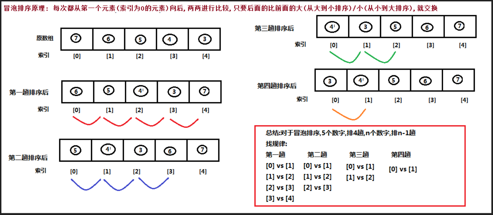
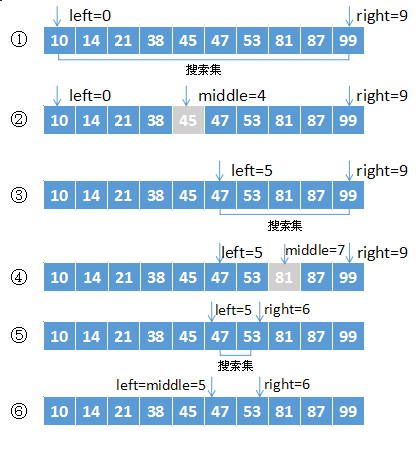

# day05【Set，Collections，排序，查找，Map】

## 今日内容

- Set集合

- Collections工具类

- 冒泡排序 

- 选择排序

- 二分查找

- Map集合

  

## 教学目标

- [ ] 能够说出Set集合的特点
- [ ] 能够说出Set集合常用子类及其底层结构特点
- [ ] 能够使用HashSet集合存储自定义元素
- [ ] 能够使用集合工具类Collections的shuffle、sort、addAll方法
- [ ] 能够理解冒泡及选择排序的执行流程
- [ ] 能够理解二分查找的执行流程
- [ ] 能够说出Map集合特点
- [ ] 能够说出Map接口常用子类及其底层结构特点
- [ ] 能够使用”键找值”和“键值对”的方式遍历Map集合
- [ ] 能够知道自定义类型当做HashMap的键存储的注意事项


# 第一章 Set接口

`java.util.Set`接口和`java.util.List`接口一样，同样继承自`Collection`接口，它与`Collection`接口中的方法基本一致，并没有对`Collection`接口进行功能上的扩充，只是比`Collection`接口更加严格了。与`List`接口不同的是，`Set`接口都会以某种规则保证存入的元素不出现重复。

`Set`集合有多个子类，这里我们介绍其中的`java.util.HashSet`、`java.util.LinkedHashSet`、`java.util.TreeSet`这两个集合。

> tips:Set集合取出元素的方式可以采用：迭代器、增强for。

## 1 HashSet集合介绍

`java.util.HashSet`是`Set`接口的一个实现类，它所存储的元素是不可重复的，并且元素都是无序的(即存取顺序不能保证不一致)。`java.util.HashSet`底层的实现其实是一个`java.util.HashMap`支持，由于我们暂时还未学习，先做了解。

`HashSet`是根据对象的哈希值来确定元素在集合中的存储位置，因此具有良好的存储和查找性能。保证元素唯一性的方式依赖于：`hashCode`与`equals`方法。

我们先来使用一下Set集合存储，看下现象，再进行原理的讲解:

```java
public class HashSetDemo {
    public static void main(String[] args) {
        //创建 Set集合
        HashSet<String>  set = new HashSet<String>();

        //添加元素
        set.add(new String("cba"));
        set.add("abc");
        set.add("bac"); 
        set.add("cba");  
        //遍历
        for (String name : set) {
            System.out.println(name);
        }
    }
}
```

输出结果如下，说明集合中不能存储重复元素：

```
cba
abc
bac
```

> tips:根据结果我们发现字符串"cba"只存储了一个，也就是说重复的元素set集合不存储。


## 2  HashSet集合存储数据的结构（哈希表）

什么是哈希表呢？

在**JDK1.8**之前，哈希表底层采用数组+链表实现，即使用数组处理冲突，同一hash值的链表都存储在一个数组里。但是当位于一个桶中的元素较多，即hash值相等的元素较多时，通过key值依次查找的效率较低。而JDK1.8中，哈希表存储采用数组+链表+红黑树实现，当链表长度超过阈值（8）时，将链表转换为红黑树，这样大大减少了查找时间。

简单的来说，哈希表是由数组+链表+红黑树（JDK1.8增加了红黑树部分）实现的，如下图所示。 

看到这张图就有人要问了，这个是怎么存储的呢？

为了方便大家的理解我们结合一个存储流程图来说明一下：


总而言之，**JDK1.8**引入红黑树大程度优化了HashMap的性能，那么对于我们来讲保证HashSet集合元素的唯一，其实就是根据对象的hashCode和equals方法来决定的。如果我们往集合中存放自定义的对象，那么保证其唯一，就必须复写hashCode和equals方法建立属于当前对象的比较方式。


## 3  HashSet存储自定义类型元素

给HashSet中存放自定义类型元素时，需要重写对象中的hashCode和equals方法，建立自己的比较方式，才能保证HashSet集合中的对象唯一.

创建自定义Student类:

```java
public class Student {
    private String name;
    private int age;

	//get/set
    @Override
    public boolean equals(Object o) {
        if (this == o)
            return true;
        if (o == null || getClass() != o.getClass())
            return false;
        Student student = (Student) o;
        return age == student.age &&
               Objects.equals(name, student.name);
    }

    @Override
    public int hashCode() {
        return Objects.hash(name, age);
    }
}
```

创建测试类:

```java
public class HashSetDemo2 {
    public static void main(String[] args) {
        //创建集合对象   该集合中存储 Student类型对象
        HashSet<Student> stuSet = new HashSet<Student>();
        //存储 
        Student stu = new Student("于谦", 43);
        stuSet.add(stu);
        stuSet.add(new Student("郭德纲", 44));
        stuSet.add(new Student("于谦", 43));
        stuSet.add(new Student("郭麒麟", 23));
        stuSet.add(stu);

        for (Student stu2 : stuSet) {
            System.out.println(stu2);
        }
    }
}
执行结果：
Student [name=郭德纲, age=44]
Student [name=于谦, age=43]
Student [name=郭麒麟, age=23]
```


## 4 HashSet的源码分析

### 4.1 HashSet的成员属性及构造方法

~~~java
public class HashSet<E> extends AbstractSet<E>
    					implements Set<E>, Cloneable, java.io.Serializable{
    
	//内部一个HashMap——HashSet内部实际上是用HashMap实现的
    private transient HashMap<E,Object> map;
    // 用于做map的值
    private static final Object PRESENT = new Object();
    /**
     * 构造一个新的HashSet，
     * 内部实际上是构造了一个HashMap
     */
    public HashSet() {
        map = new HashMap<>();
    }
    
}
~~~

- 通过构造方法可以看出，HashSet构造时，实际上是构造一个HashMap

### 4.2 HashSet的add方法源码解析

~~~java
public class HashSet{
    //......
    public boolean add(E e) {
       return map.put(e, PRESENT)==null;//内部实际上添加到map中，键：要添加的对象，值：Object对象
    }
    //......
}
~~~

### 4.3 HashMap的put方法源码解析

~~~java
public class HashMap{
    //......
    public V put(K key, V value) {
        return putVal(hash(key), key, value, false, true);
    }
    //......
    static final int hash(Object key) {//根据参数，产生一个哈希值
        int h;
        return (key == null) ? 0 : (h = key.hashCode()) ^ (h >>> 16);
    }
    //......
    final V putVal(int hash, K key, V value, boolean onlyIfAbsent,
                   boolean evict) {
        Node<K,V>[] tab; //临时变量，存储"哈希表"——由此可见，哈希表是一个Node[]数组
        Node<K,V> p;//临时变量，用于存储从"哈希表"中获取的Node
        int n, i;//n存储哈希表长度；i存储哈希表索引
        
        if ((tab = table) == null || (n = tab.length) == 0)//判断当前是否还没有生成哈希表
            n = (tab = resize()).length;//resize()方法用于生成一个哈希表，默认长度：16，赋给n
        if ((p = tab[i = (n - 1) & hash]) == null)//(n-1)&hash等效于hash % n，转换为数组索引
            tab[i] = newNode(hash, key, value, null);//此位置没有元素，直接存储
        else {//否则此位置已经有元素了
            Node<K,V> e; K k;
            if (p.hash == hash &&
                ((k = p.key) == key || (key != null && key.equals(k))))//判断哈希值和equals
                e = p;//将哈希表中的元素存储为e
            else if (p instanceof TreeNode)//判断是否为"树"结构
                e = ((TreeNode<K,V>)p).putTreeVal(this, tab, hash, key, value);
            else {//排除以上两种情况，将其存为新的Node节点
                for (int binCount = 0; ; ++binCount) {//遍历链表
                    if ((e = p.next) == null) {//找到最后一个节点
                        p.next = newNode(hash, key, value, null);//产生一个新节点，赋值到链表
                        if (binCount >= TREEIFY_THRESHOLD - 1) //判断链表长度是否大于了8
                            treeifyBin(tab, hash);//树形化
                        break;
                    }
                    if (e.hash == hash &&
                        ((k = e.key) == key || (key != null && key.equals(k))))//跟当前变量的元素比较，如果hashCode相同，equals也相同
                        break;//结束循环
                    p = e;//将p设为当前遍历的Node节点
                }
            }
            if (e != null) { // 如果存在此键
                V oldValue = e.value;//取出value
                if (!onlyIfAbsent || oldValue == null)
                    e.value = value;//设置为新value
                afterNodeAccess(e);//空方法，什么都不做
                return oldValue;//返回旧值
            }
        }
        ++modCount;
        if (++size > threshold)
            resize();
        afterNodeInsertion(evict);
        return null;
    }
}
~~~


## 5 LinkedHashSet

我们知道HashSet保证元素唯一，可是元素存放进去是没有顺序的，那么我们要保证有序，怎么办呢？

在HashSet下面有一个子类`java.util.LinkedHashSet`，它是链表和哈希表组合的一个数据存储结构。

演示代码如下:

```java
public class LinkedHashSetDemo {
	public static void main(String[] args) {
		Set<String> set = new LinkedHashSet<String>();
		set.add("bbb");
		set.add("aaa");
		set.add("abc");
		set.add("bbc");
        Iterator<String> it = set.iterator();
		while (it.hasNext()) {
			System.out.println(it.next());
		}
	}
}
结果：
  bbb
  aaa
  abc
  bbc
```


## 6 TreeSet集合

### 6.1 特点

TreeSet集合是Set接口的一个实现类,底层依赖于TreeMap,是一种基于**红黑树**的实现,其特点为：

1. 元素唯一
2. 元素没有索引
3. 使用元素的[自然顺序](../../java/lang/Comparable.html)对元素进行排序，或者根据创建 TreeSet 时提供的 [`Comparator`](../../java/util/Comparator.html) 比较器
   进行排序，具体取决于使用的构造方法：

```java
public TreeSet()：								根据其元素的自然排序进行排序
public TreeSet(Comparator<E> comparator):    根据指定的比较器进行排序
```

### 6.2 演示

案例演示**自然排序**(20,18,23,22,17,24,19):

```java
public static void main(String[] args) {
	//无参构造,默认使用元素的自然顺序进行排序
	TreeSet<Integer> set = new TreeSet<Integer>();
	set.add(20);
	set.add(18);
  	set.add(23);
  	set.add(22);
  	set.add(17);
  	set.add(24);
  	set.add(19);
  	System.out.println(set);
}

控制台的输出结果为:
[17, 18, 19, 20, 22, 23, 24]
```

案例演示**比较器排序**(20,18,23,22,17,24,19):

```java
public static void main(String[] args) {
  	//有参构造,传入比较器,使用比较器对元素进行排序
  	TreeSet<Integer> set = new TreeSet<Integer>(new Comparator<Integer>() {
    	@Override
    	public int compare(Integer o1, Integer o2) {
      		//元素前 - 元素后 : 升序
      		//元素后 - 元素前 : 降序
      		return o2 - o1;
    	}
  	});
  	set.add(20);
  	set.add(18);
  	set.add(23);
  	set.add(22);
  	set.add(17);
  	set.add(24);
  	set.add(19);
  	System.out.println(set);
}

控制台的输出结果为:
[24, 23, 22, 20, 19, 18, 17]
```


# 第二章  Collections类

## 1 Collections常用功能

- `java.utils.Collections`是集合工具类，用来对集合进行操作。

  常用方法如下：


- `public static void shuffle(List<?> list) `:打乱集合顺序。
- `public static <T> void sort(List<T> list)`:将集合中元素按照默认规则排序。
- `public static <T> void sort(List<T> list，Comparator<? super T> )`:将集合中元素按照指定规则排序。

代码演示：

```java
public class CollectionsDemo {
    public static void main(String[] args) {
        ArrayList<Integer> list = new ArrayList<Integer>();
   
        list.add(100);
        list.add(300);
        list.add(200);
        list.add(50);
        //排序方法 
        Collections.sort(list);
        System.out.println(list);
    }
}
结果：
[50,100, 200, 300]
```

我们的集合按照默认的自然顺序进行了排列，如果想要指定顺序那该怎么办呢？


## 2 Comparator比较器

创建一个学生类，存储到ArrayList集合中完成指定排序操作。

Student 类

```java
public class Student{
    private String name;
    private int age;
	//构造方法
    //get/set
 	//toString
}
```

测试类：

```java
public class Demo {
    public static void main(String[] args) {
        // 创建四个学生对象 存储到集合中
        ArrayList<Student> list = new ArrayList<Student>();

        list.add(new Student("rose",18));
        list.add(new Student("jack",16));
        list.add(new Student("abc",20));
		Collections.sort(list, new Comparator<Student>() {
  		  @Override
    		public int compare(Student o1, Student o2) {
        	return o1.getAge()-o2.getAge();//以学生的年龄升序
   		 }
		});


        for (Student student : list) {
            System.out.println(student);
        }
    }
}
Student{name='jack', age=16}
Student{name='rose', age=18}
Student{name='abc', age=20}
```


## 3 可变参数

在**JDK1.5**之后，如果我们定义一个方法需要接受多个参数，并且多个参数类型一致，我们可以对其简化.

**格式：**

```
修饰符 返回值类型 方法名(参数类型... 形参名){  }
```

**代码演示:**

```java
  public class ChangeArgs {
    public static void main(String[] args) {
        int sum = getSum(6, 7, 2, 12, 2121);
        System.out.println(sum);
    }
    public static int getSum(int... arr) {
   		int sum = 0;
   	     for (int a : arr) {
         sum += a;
        }
   		 return sum;
    }
}
```

**注意：**

​	1.一个方法只能有一个可变参数

​	2.如果方法中有多个参数，可变参数要放到最后。

**应用场景: Collections**

​	在Collections中也提供了添加一些元素方法：

​	`public static <T> boolean addAll(Collection<T> c, T... elements)  `:往集合中添加一些元素。

**代码演示:**

```java
public class CollectionsDemo {
	public static void main(String[] args) {
      ArrayList<Integer> list = new ArrayList<Integer>();
      //原来写法
      //list.add(12);
      //list.add(14);
      //list.add(15);
      //list.add(1000);
      //采用工具类 完成 往集合中添加元素  
      Collections.addAll(list, 5, 222, 1，2);
      System.out.println(list);
}
```


# 第三章 冒泡排序

## 2.1 冒泡排序概述

- 一种排序的方式，对要进行排序的数据中相邻的数据进行两两比较，将较大的数据放在后面，依次对所有的数据进行操作，直至所有数据按要求完成排序
- 如果有n个数据进行排序，总共需要比较n-1次
- 每一次比较完毕，下一次的比较就会少一个数据参与


## 2.2 冒泡排序图解




## 4.3 冒泡排序代码实现

```java
/*
    冒泡排序：
        一种排序的方式，对要进行排序的数据中相邻的数据进行两两比较，将较大的数据放在后面，
        依次对所有的数据进行操作，直至所有数据按要求完成排序
 */
public class ArrayDemo {
    public static void main(String[] args) {
        //定义一个数组
        int[] arr = {7, 6, 5, 4, 3};
        System.out.println("排序前：" + Arrays.toString(arr));

        // 这里减1，是控制每轮比较的次数
        for (int x = 0; x < arr.length - 1; x++) {
            // -1是为了避免索引越界，-x是为了调高比较效率
            for (int i = 0; i < arr.length - 1 - x; i++) {
                if (arr[i] > arr[i + 1]) {
                    int temp = arr[i];
                    arr[i] = arr[i + 1];
                    arr[i + 1] = temp;
                }
            }
        }
        System.out.println("排序后：" + Arrays.toString(arr));
    }
}
```


# 第三章 选择排序

## 3.1 选择排序概述

- 另外一种排序的方式，选中数组的某个元素,其后面的元素依次和选中的元素进行两两比较，将较大的数据放在后面，依次从前到后选中每个元素，直至所有数据按要求完成排序
- 如果有n个数据进行排序，总共需要比较n-1次
- 每一次比较完毕，下一次的比较就会少一个数据参与


## 3.2 选择排序图解


## 3.3 选择排序代码实现

```java
/*
    选择排序：
        另外一种排序的方式，选中数组的某个元素,其后面的元素依次和选中的元素进行两两比较，将较大的数据放在后面，依次从前到后选中每个元素，直至所有数据按要求完成排序
 */
public class ArrayDemo {
    public static void main(String[] args) {
        //定义一个数组
        int[] arr = {7, 6, 5, 4, 3};
        System.out.println("排序前：" + Arrays.toString(arr));
  		// 这里减1，是控制比较的轮数
        for (int x = 0; x < arr.length - 1; x++) {
            // 从x+1开始,直到最后一个元素
            for (int i = x+1; i < arr.length; i++) {
                if (arr[x] > arr[i]) {
                    int temp = arr[x];
                    arr[x] = arr[i];
                    arr[i] = temp;
                }
            }
        }
        System.out.println("排序后：" + Arrays.toString(arr));
    }
}
```


# 第四章 二分查找

## 4.1 普通查找和二分查找

**普通查找**

原理：遍历数组，获取每一个元素，然后判断当前遍历的元素是否和要查找的元素相同，如果相同就返回该元素的索引。如果没有找到，就返回一个负数作为标识(一般是-1)

**二分查找**

原理: 每一次都去获取数组的中间索引所对应的元素，然后和要查找的元素进行比对，如果相同就返回索引；

如果不相同，就比较中间元素和要查找的元素的值；

如果中间元素的值大于要查找的元素，说明要查找的元素在左侧，那么就从左侧按照上述思想继续查询(忽略右侧数据)；

如果中间元素的值小于要查找的元素，说明要查找的元素在右侧，那么就从右侧按照上述思想继续查询(忽略左侧数据)；

**二分查找对数组是有要求的,数组必须已经排好序**


## 4.2 二分查找图解

假设有一个给定有序数组(10,14,21,38,45,47,53,81,87,99),要查找50出现的索引

则查询过程如下图所示:




## 4.3 二分查找代码实现

```java
	public static void main(String[] args) {
        int[] arr = {10, 14, 21, 38, 45, 47, 53, 81, 87, 99};
        int index = binarySerach(arr, 38);
        System.out.println(index);
	}
	/**
     * 二分查找方法
     * @param arr 查找的目标数组
     * @param number 查找的目标值
     * @return 找到的索引,如果没有找到返回-1
     */
    public static int binarySerach(int[] arr, int number) {
        int start = 0;
        int end = arr.length - 1;

        while (start <= end) {
            int mid = (start + end) / 2;
            if (number == arr[mid]) {
                return mid ;
            } else if (number < arr[mid]) {
                end = mid - 1;
            } else if (number > arr[mid]) {
                start = mid + 1;
            }
        }
        return -1;  //如果数组中有这个元素，则返回
    }
```


# 第五章 Map集合

## 5.1 概述

现实生活中，我们常会看到这样的一种集合：IP地址与主机名，身份证号与个人，系统用户名与系统用户对象等，这种一一对应的关系，就叫做映射。Java提供了专门的集合类用来存放这种对象关系的对象，即`java.util.Map`接口。

我们通过查看`Map`接口描述，发现`Map`接口下的集合与`Collection`接口下的集合，它们存储数据的形式不同，如下图。


- `Collection`中的集合，元素是孤立存在的（理解为单身），向集合中存储元素采用一个个元素的方式存储。
- `Map`中的集合，元素是成对存在的(理解为夫妻)。每个元素由键与值两部分组成，通过键可以找对所对应的值。
- `Collection`中的集合称为单列集合，`Map`中的集合称为双列集合。
- 需要注意的是，`Map`中的集合不能包含重复的键，值可以重复；每个键只能对应一个值。


## 5.2  Map的常用子类

通过查看Map接口描述，看到Map有多个子类，这里我们主要讲解常用的HashMap集合、LinkedHashMap集合。

- **HashMap<K,V>**：存储数据采用的哈希表结构，元素的存取顺序不能保证一致。由于要保证键的唯一、不重复，需要重写键的hashCode()方法、equals()方法。
- **LinkedHashMap<K,V>**：HashMap下有个子类LinkedHashMap，存储数据采用的哈希表结构+链表结构。通过链表结构可以保证元素的存取顺序一致；通过哈希表结构可以保证的键的唯一、不重复，需要重写键的hashCode()方法、equals()方法。
- **TreeMap<K,V>**：TreeMap集合和Map相比没有特有的功能，底层的数据结构是红黑树；可以对元素的***键***进行排序，排序方式有两种:**自然排序**和**比较器排序**

> tips：Map接口中的集合都有两个泛型变量<K,V>,在使用时，要为两个泛型变量赋予数据类型。两个泛型变量<K,V>的数据类型可以相同，也可以不同。


## 5.3  Map的常用方法

Map接口中定义了很多方法，常用的如下：

- `public V put(K key, V value)`:  把指定的键与指定的值添加到Map集合中。
- `public V remove(Object key)`: 把指定的键 所对应的键值对元素 在Map集合中删除，返回被删除元素的值。
- `public V get(Object key)` 根据指定的键，在Map集合中获取对应的值。
- `public Set<K> keySet()`: 获取Map集合中所有的键，存储到Set集合中。
- `public Set<Map.Entry<K,V>> entrySet()`: 获取到Map集合中所有的键值对对象的集合(Set集合)。
- `public boolean containKey(Object key)`:判断该集合中是否有此键。

Map接口的方法演示

```java
public class MapDemo {
    public static void main(String[] args) {
        //创建 map对象
        HashMap<String, String>  map = new HashMap<String, String>();

        //添加元素到集合
        map.put("黄晓明", "杨颖");
        map.put("文章", "马伊琍");
        map.put("邓超", "孙俪");
        System.out.println(map);

        //String remove(String key)
        System.out.println(map.remove("邓超"));
        System.out.println(map);

        // 想要查看 黄晓明的媳妇 是谁
        System.out.println(map.get("黄晓明"));
        System.out.println(map.get("邓超"));    
    }
}
```

> tips:
>
> 使用put方法时，若指定的键(key)在集合中没有，则没有这个键对应的值，返回null，并把指定的键值添加到集合中； 
>
> 若指定的键(key)在集合中存在，则返回值为集合中键对应的值（该值为替换前的值），并把指定键所对应的值，替换成指定的新值。 


## 5.4   Map的遍历

### 方式1:键找值方式

通过元素中的键，获取键所对应的值

分析步骤：

1. 获取Map中所有的键，由于键是唯一的，所以返回一个Set集合存储所有的键。方法提示:`keyset()`
2. 遍历键的Set集合，得到每一个键。
3. 根据键，获取键所对应的值。方法提示:`get(K key)`

遍历图解：


### 方式2:键值对方式

即通过集合中每个键值对(Entry)对象，获取键值对(Entry)对象中的键与值。

**Entry键值对对象:**

我们已经知道，`Map`中存放的是两种对象，一种称为**key**(键)，一种称为**value**(值)，它们在在`Map`中是一一对应关系，这一对对象又称做`Map`中的一个`Entry(项)`。`Entry`将键值对的对应关系封装成了对象。即键值对对象，这样我们在遍历`Map`集合时，就可以从每一个键值对（`Entry`）对象中获取对应的键与对应的值。

在Map集合中也提供了获取所有Entry对象的方法：

- `public Set<Map.Entry<K,V>> entrySet()`: 获取到Map集合中所有的键值对对象的集合(Set集合)。

 获取了Entry对象 , 表示获取了一对键和值，那么同样Entry中 , 分别提供了获取键和获取值的方法：

- `public K getKey()`：获取Entry对象中的键。
- `public V getValue()`：获取Entry对象中的值。

操作步骤与图解：

1. 获取Map集合中，所有的键值对(Entry)对象，以Set集合形式返回。方法提示:`entrySet()`。
2. 遍历包含键值对(Entry)对象的Set集合，得到每一个键值对(Entry)对象。
3. 通过键值对(Entry)对象，获取Entry对象中的键与值。  方法提示:`getkey() getValue()`     

遍历图解：


> tips：Map集合不能直接使用迭代器或者foreach进行遍历。但是转成Set之后就可以使用了。


## 5.5  HashMap存储自定义类型

练习：每位学生（姓名，年龄）都有自己的家庭住址。那么，既然有对应关系，则将学生对象和家庭住址存储到map集合中。学生作为键, 家庭住址作为值。

> 注意，学生姓名相同并且年龄相同视为同一名学生。

编写学生类：

```java
public class Student {
    private String name;
    private int age;

    //构造方法
    //get/set
    @Override
    public boolean equals(Object o) {
        if (this == o)
            return true;
        if (o == null || getClass() != o.getClass())
            return false;
        Student student = (Student) o;
        return age == student.age && Objects.equals(name, student.name);
    }

    @Override
    public int hashCode() {
        return Objects.hash(name, age);
    }
}
```

编写测试类：

```java 
public class HashMapTest {
    public static void main(String[] args) {
        //1,创建Hashmap集合对象。
        Map<Student,String> map = new HashMap<Student,String>();
        //2,添加元素。
        map.put(new Student("lisi",28), "上海");
        map.put(new Student("wangwu",22), "北京");
        map.put(new Student("wangwu",22), "南京");
        
        //3,取出元素。键找值方式
        Set<Student> keySet = map.keySet();
        for(Student key: keySet){
            String value = map.get(key);
            System.out.println(key.toString()+"....."+value);
        }
    }
}
```

- 当给HashMap中存放自定义对象时，如果自定义对象作为key存在，这时要保证对象唯一，必须复写对象的hashCode和equals方法(如果忘记，请回顾HashSet存放自定义对象)。
- 如果要保证map中存放的key和取出的顺序一致，可以使用`java.util.LinkedHashMap`集合来存放。


## 5.6   LinkedHashMap介绍

我们知道HashMap保证成对元素唯一，并且查询速度很快，可是成对元素存放进去是没有顺序的，那么我们要保证有序，还要速度快怎么办呢？

在HashMap下面有一个子类LinkedHashMap，它是链表和哈希表组合的一个数据存储结构。

```java
public class LinkedHashMapDemo {
    public static void main(String[] args) {
        LinkedHashMap<String, String> map = new LinkedHashMap<String, String>();
        map.put("邓超", "孙俪");
        map.put("李晨", "范冰冰");
        map.put("刘德华", "朱丽倩");
        Set<Entry<String, String>> entrySet = map.entrySet();
        for (Entry<String, String> entry : entrySet) {
            System.out.println(entry.getKey() + "  " + entry.getValue());
        }
    }
}
```

结果:

```
邓超  孙俪
李晨  范冰冰
刘德华  朱丽倩
```


## 5.7 TreeMap集合

### 5.7.1.TreeMap介绍

TreeMap集合和Map相比没有特有的功能，底层的数据结构是红黑树；可以对元素的***键***进行排序，排序方式有两种:**自然排序**和**比较器排序**；到时使用的是哪种排序，取决于我们在创建对象的时候所使用的构造方法；

```java
public TreeMap()									使用自然排序
public TreeMap(Comparator<? super K> comparator) 	比较器排
```

### 5.7.2.演示

案例演示**自然排序**

```java
public static void main(String[] args) {
 	TreeMap<Integer, String> map = new TreeMap<Integer, String>();
  	map.put(1,"张三");
  	map.put(4,"赵六");
  	map.put(3,"王五");
  	map.put(6,"酒八");
  	map.put(5,"老七");
  	map.put(2,"李四");
  	System.out.println(map);
}

控制台的输出结果为:
{1=张三, 2=李四, 3=王五, 4=赵六, 5=老七, 6=酒八}
```

案例演示**比较器排序**

**需求:**

1. 创建一个TreeMap集合，键是学生对象(Student)，值是居住地 (String)。存储多个元素，并遍历。
2. 要求按照学生的年龄进行升序排序，如果年龄相同，比较姓名的首字母升序， 如果年龄和姓名都是相同，认为是同一个元素；

 **实现:**

为了保证age和name相同的对象是同一个,Student类必须重写hashCode和equals方法

```java
public class Student {
    private int age;
    private String name;
	//省略get/set..
    public Student() {}
    public Student(int age, String name) {
        this.age = age;
        this.name = name;
    }
    @Override
    public String toString() {
        return "Student{" +
                "age=" + age +
                ", name='" + name + '\'' +
                '}';
    }
    @Override
    public boolean equals(Object o) {
        if (this == o) return true;
        if (o == null || getClass() != o.getClass()) return false;
        Student student = (Student) o;
        return age == student.age &&
                Objects.equals(name, student.name);
    }
    @Override
    public int hashCode() {
        return Objects.hash(age, name);
    }
}
```

```java
public static void main(String[] args) {
  	TreeMap<Student, String> map = new TreeMap<Student, String>(new Comparator<Student>() {
    	@Override
    	public int compare(Student o1, Student o2) {
      		//先按照年龄升序
      		int result = o1.getAge() - o2.getAge();
      		if (result == 0) {
        		//年龄相同,则按照名字的首字母升序
        		return o1.getName().charAt(0) - o2.getName().charAt(0);
      		} else {
        		//年龄不同,直接返回结果
        		return result;
      		}
    	}
  	});
  	map.put(new Student(30, "jack"), "深圳");
  	map.put(new Student(10, "rose"), "北京");
  	map.put(new Student(20, "tom"), "上海");
  	map.put(new Student(10, "marry"), "南京");
  	map.put(new Student(30, "lucy"), "广州");
  	System.out.println(map);
}
控制台的输出结果为:
{
  Student{age=10, name='marry'}=南京, 
  Student{age=10, name='rose'}=北京, 
  Student{age=20, name='tom'}=上海, 
  Student{age=30, name='jack'}=深圳, 
  Student{age=30, name='lucy'}=广州
}
```


## 5.8 Map集合练习

**需求：**

输入一个字符串中每个字符出现次数。

**分析：**

1. 获取一个字符串对象
2. 创建一个Map集合，键代表字符，值代表次数。
3. 遍历字符串得到每个字符。
4. 判断Map中是否有该键。
5. 如果没有，第一次出现，存储次数为1；如果有，则说明已经出现过，获取到对应的值进行++，再次存储。     
6. 打印最终结果

**方法介绍**

`public boolean containKey(Object key)`:判断该集合中是否有此键。

**代码：**

```java
public class MapTest {
public static void main(String[] args) {
        //友情提示
        System.out.println("请录入一个字符串:");
        String line = new Scanner(System.in).nextLine();
        // 定义 每个字符出现次数的方法
        findChar(line);
    }
    private static void findChar(String line) {
        //1:创建一个集合 存储  字符 以及其出现的次数
        HashMap<Character, Integer> map = new HashMap<Character, Integer>();
        //2:遍历字符串
        for (int i = 0; i < line.length(); i++) {
            char c = line.charAt(i);
            //判断 该字符 是否在键集中
            if (!map.containsKey(c)) {//说明这个字符没有出现过
                //那就是第一次
                map.put(c, 1);
            } else {
                //先获取之前的次数
                Integer count = map.get(c);
                //count++;
                //再次存入  更新
                map.put(c, ++count);
            }
        }
        System.out.println(map);
    }
}
```


