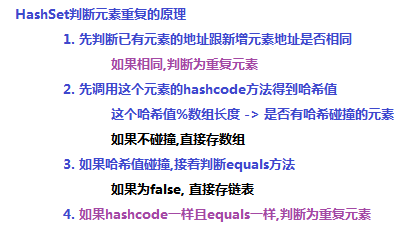
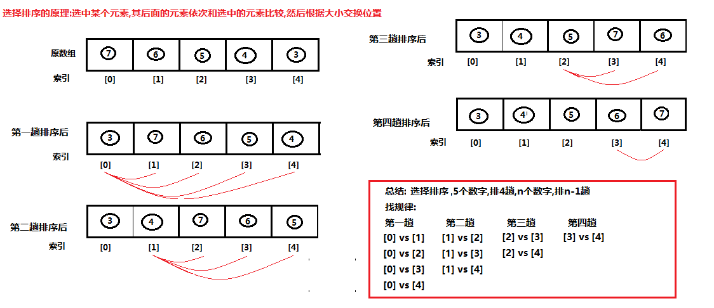

# day05【Set，Collections，排序，查找，Map】

## 今日内容

- Set集合

- Collections工具类

- 冒泡排序 

- 选择排序

- 二分查找

- Map集合


## 教学目标

- [ ] 能够说出Set集合的特点
- [ ] 能够说出Set集合常用子类及其底层结构特点
- [ ] 能够使用HashSet集合存储自定义元素
- [ ] 能够使用集合工具类Collections的shuffle、sort、addAll方法
- [ ] 能够理解冒泡及选择排序的执行流程
- [ ] 能够理解二分查找的执行流程
- [ ] 能够说出Map集合特点
- [ ] 能够说出Map接口常用子类及其底层结构特点
- [ ] 能够使用”键找值”和“键值对”的方式遍历Map集合
- [ ] 能够知道自定义类型当做HashMap的键存储的注意事项


# 第一章 Set接口

```markdown
#Set接口
	1. 特点
		1. 不保证存取有序
		2. 不允许元素重复
		3. 不带索引
	2. 实现类
		1. HashSet(重点) 哈希表
			LinkedHashSet
		2. TreeSet  红黑树
			1). 排序算法
			2). 排序原理: 接口和多态
```


```java
package com.itheima02.set;

import java.util.*;

/*
* Set接口
	1. 特点
		1. 不保证存取有序
		2. 不允许元素重复
		3. 不带索引
* */
public class Demo01 {

    public static void main(String[] args) {

//        method01();

        Set<String> set = new HashSet<>();
        set.add("张三");
        set.add("李四");
        set.add("王五");

        Iterator<String> it = set.iterator();
        while(it.hasNext()){
            String element = it.next();
        }

        for (String element : set) {
            System.out.println(element);
        }
    }

    private static void method01() {
        Set<String> set = new HashSet<>();
        set.add("张三");
        set.add("李四");
        //添加成功返回true,否则返回false
        boolean result = set.add("王五");
        System.out.println(result); //true
        //不允许重复元素
        boolean result2 = set.add("王五");
        System.out.println(result2);//false
        //不保证存取有序
        System.out.println(set);


        ArrayList<String> list = new ArrayList<>();
        //list的add返回值恒为true,没有意义
        boolean xxx = list.add("xxx");
    }
}

```


## 1 HashSet集合介绍

`java.util.HashSet`是`Set`接口的一个实现类，它所存储的元素是不可重复的，并且元素都是无序的(即存取顺序不能保证不一致)。`java.util.HashSet`底层的实现其实是一个`java.util.HashMap`支持，由于我们暂时还未学习，先做了解。

`HashSet`是根据对象的哈希值来确定元素在集合中的存储位置，因此具有良好的存储和查找性能。保证元素唯一性的方式依赖于：`hashCode`与`equals`方法。

我们先来使用一下Set集合存储，看下现象，再进行原理的讲解:

```java
public class HashSetDemo {
    public static void main(String[] args) {
        //创建 Set集合
        HashSet<String>  set = new HashSet<String>();

        //添加元素
        set.add(new String("cba"));
        set.add("abc");
        set.add("bac"); 
        set.add("cba");  
        //遍历
        for (String name : set) {
            System.out.println(name);
        }
    }
}
```

输出结果如下，说明集合中不能存储重复元素：

```
cba
abc
bac
```

> tips:根据结果我们发现字符串"cba"只存储了一个，也就是说重复的元素set集合不存储。


## 2  HashSet集合存储数据的结构（哈希表）

   


  


```java
package com.itheima02.set;

import java.util.Objects;

public class Person {
    private String name;
    private int age;

    public Person(String name, int age) {
        this.name = name;
        this.age = age;
    }

    @Override
    public String toString() {
        return "Person{" +
                "name='" + name + '\'' +
                ", age=" + age +
                '}';
    }

    @Override
    public boolean equals(Object o) {
        if (this == o) return true;
        if (o == null || getClass() != o.getClass()) return false;
        Person person = (Person) o;
        return age == person.age &&
                Objects.equals(name, person.name);
    }

    @Override
    public int hashCode() {
        //31算法
        return Objects.hash(name, age);
    }
}

```


```java
package com.itheima02.set;

import java.util.HashSet;

/*
*   # Set不允许重复元素
*
*   面试问题: HashSet如何判断元素是否重复?
*
*   解决:
*       1. Object类的方法 hashcode
*           1). 本地方法
*           2). 加密算法
*                  I. 对象真正的内存地址 为 明文  计算得到一个 密文
 *                      (尽量不保证不碰撞)
 *                 II. 可能产生哈希碰撞
*                  III. 此算法不可逆
*
*           3). String重写hashcode方法
*               系数31,对每个字符进行计算的,得到哈希值
*
*
*       2. HashSet的数据结构: 哈希表
*           哈希表 = 数组 + 链表 + 红黑树
*
*       3. HashSet判断元素重复的原理
* */
public class Demo02 {

    public static void main(String[] args) {

        HashSet<String> set = new HashSet<>();
        String s1 = new String("张三");
        String s2 = new String("张三");
        set.add(s1);
        set.add(s2);

        System.out.println(set);

        HashSet<Person> set2 = new HashSet<>();
        /*
        *   如果地址不同,先判断hashcode,在判断equals
        *
        *   1. Person类没有重写Object的hashcode方法
        *       真正内存 -> 哈希值
        *
        *       p1 , p2 内存地址不一样 , 哈希值基本不可能一样
        *
        *   2. Person类没有重写Object的equals方法
        *       p1 == p2
        *       比较真正的内存地址,肯定不一样
        *
        *   应用:
        *       认为两个对象就算内存地址不同,但是所有属性一一对应,就认为是同一元素
        *
        *   解决:  重写hashcode和equals方法
        *
        *       这两个方法要跟属性挂钩
        *
        *       alt + insert -> hashcode and equals
        * */
        Person p1 = new Person("高圆圆", 18);
        Person p2 = new Person("高圆圆", 18);

        set2.add(p1);
        set2.add(p2);

        System.out.println(set2);
    }
}


```


```java
package com.itheima02.set;
/*
*   Object类的方法 hashcode
* */
public class Demo03 {

    public static void main(String[] args) {

        Person p1 = new Person("高圆圆", 18);

        /*
            1. 调用Object的toString方法(如果没有重写toString)

                com.itheima02.set.Person@1540e19d
                当前对象的类型@当前对象的内存地址(的哈希值 16进制)

            2. 直接调用Object的hashcode方法
                得到的当前对象的内存地址哈希值(10进制)
                    356573597

              源码 :
                public native int hashCode();
                      1). 本地方法,底层调用c/c++代码 (哈希算法: 加密算法)
                      2). 对真正的内存地址进行加密得到哈希值

                      3). 算法具备的特点
                            I.  一个明文 -> 对应一个密文,尽量不重复(散列)
                            II. 不可逆: 知道算法,知道密文,也不能算出明文
                            III. 哈希碰撞: 不同的明文产生相同的密文(很少见)
            3. 加密算法

               1). 凯撒密码:
                    按字母往右移动3位

                 你 :  I love you
                 女孩: L orzh brx

              2). 概念
                  加密算法:  按字母往右移动n位
                  明文: 信息原文
                  密文: 明文经过加密得到信息
                  密钥: n = 3

              3). 破解:
                  a. 统计学
                    不知道明文, 算法, 密钥, 只知道密文
                    破解只能靠猜

                    频率分析法:(大数据分析,缴获大量的密文)
                       字母表 e i o
                       密文   b
                       猜算法,猜密钥

                  b. 社会工程学
                        明文


                  c. 现代加密算法
                    不知道明文,不知道密钥(保密) , 知道算法(公开), 知道密文

                    破解:暴力破解(穷举法)
                        遍历: 去遍历所有的密钥


              4). 哈希算法: 数字签名算法
                    一个明文 -> 对应一个密文,尽量不重复(散列)
                    不可逆: 知道算法,知道密文,也不能算出明文


                        明文无限多个(内存地址)   -> 密文个数是有限的(java的hash算法返回值43亿个)
                              a  -> x
                              b  -> x

                    哈希碰撞: 不同的明文产生相同的密文(很少见)


                    明文: root
                    密文: *81F5E21E35407D884A6CD4A731AEBFB6AF209E1B

                    系统保存的是: 密文

                    登录的时候输入明文 root
                    登录流程 : 明文经过数字签名算法加密,变成密文
                    实际 : 比对密文
         */
        System.out.println(p1.toString());
        System.out.println(p1.hashCode());
    }
}

```


```java
package com.itheima02.set;

/*
* String 类的方法 hashcode
*       经过重写的
*
*  public int hashCode() {
        int h = hash;
        if (h == 0 && value.length > 0) {
            char val[] = value;
            for (int i = 0; i < value.length; i++) {
                h = 31 * h + val[i];
            }
            hash = h;
        }
        return h;
    }

    分析: h = 0
         char[] value = {'a','b','c'}
    第一轮  h = 31*0 + 97 = 97
    第二轮  h = 31*97+98 = 3105
    第三轮  h = 31*3105 + 99 = 96354

    31算法:
        1. 跟字符串的每个元素有关
        2. 跟系数31有关

* */
public class Demo04 {

    public static void main(String[] args) {

        String s1 = "abc";
        //96354
        System.out.println(s1.hashCode());

        String s2 = "acD";
        System.out.println(s2.hashCode());

        String s3 = "通话";
        String s4 = "重地";
        //1179395
        System.out.println(s3.hashCode());
        System.out.println(s4.hashCode());
            //比较的是真正的内存地址
        System.out.println(s3 == s4);//false

    }
}

```


```java
package com.itheima02.set;

import java.util.HashSet;

public class Demo05 {

    public static void main(String[] args) {

        HashSet<String> set = new HashSet<>();

        String s1 = "abc"; //96354
        String s2 = "abc";
        String s3 = new String("abc");

        String s4 = "通话";//1179395
        String s5 = "重地";

        set.add(s1);
        set.add(s2);
        set.add(s3);
        set.add(s4);
        set.add(s5);
        //[通话, 重地, abc]
        System.out.println(set);

    }
}

```


## 6 TreeSet集合

```markdown
# TreeSet总结
1. 如果调用TreeSet空参构造
	1) 自定义类型要求: 元素比较具备可比性 
            假设元素类型=Student
            class Student implements Comparable(可比较的){
                String name;
                int age;
                //o1=this, o2=o
                @override
                public int compareTo(Student o){
                    //年龄比较规则
                    return this.age - o.age; //按年龄升序
                    //return o.age - this.age; //按年龄降序
                }
            }
    2).  Integer  implements Comparable 
         	按照数值的自然顺序升序排序
   	3). String implements Comparable
         	按字符串的第一个字符(字母)ASCII码值升序排序,第一个字符,再比较第二个,以此类推
         	
2. 如果调用TreeSet有参构造(带Comparator 比较器)    
	1). 对元素是否Comparable接口没有要求,压根不用
	2). 用比较器规则
	 	Comparator<Student> comparator = new Comparator<Student>() {
            @Override
            public int compare(Student o1, Student o2) {
                return o1.age - o2.age;
            }
        };
3. 两种比较规则总结
	1). 让元素类型直接实现Comparable接口
		规则只能写一种(升序或降序)不够灵活
		只要写一次就够了
		(Integer和String 都实现了这个接口)
	2). 用Comparator接口
    	规则在调用的时候指定(想升序降序都可以)
    	每次调用都得写
    	(这个用的比较多)
```


```java
package com.itheima01.set;

import java.util.Comparator;
import java.util.TreeSet;

/*
*   TreeSet (红黑树)
*   1. 如何排序?
*       1). 默认是升序: 几种排序方式的混合
*           Integer : 按字面值自然顺序升序
*           String : 按首字母的ASCII码值升序,首字母一样比较第二个,以此类推
*
*      2). 想要降序 : 比较器
*           o1 - o2 升序
*           o2 - o1 降序
*
*   2. 判断元素重复的原理?
*           o1 - o2 = 0
*           TreeSet 中存在与新增元素按比较规则判定为相等的元素,则为重复元素
*
*   3. 注意:
*      1).  TreeSet空参构造创建的集合, 只能添加实现了Comparable接口的元素
*           底层原理:
*               比如TreeSet存的是Student类型的元素
*               在存元素 s1 的时候,会先将 Comparable c = (Comparable)s1;
*               如果Student没有实现Comparable接口就会报错: 类型转换异常
*
*               底层就会按照排序算法循环调用s1的compareTo方法,跟集合已有的元素比
*               o1- o2 : 升序
*               o2 - o1 : 降序
*
*          二分查找
*
*      2). TreeSet带比较器的构造创建的集合,元素可以不实现Comparable接口
 *          如果我们用了比较器,TreeSet优先调用比较器的比较规则,忽略元素自身的比较规则
* */
public class Demo01 {

    public static void main(String[] args) {
//        method01();

//        TreeSet<Student> set = new TreeSet<>();
        Comparator<Student> comparator = new Comparator<Student>() {
            @Override
            public int compare(Student o1, Student o2) {
                return o1.age - o2.age;
            }
        };
        TreeSet<Student> set = new TreeSet<>(comparator);
        Student s1 = new Student("张三", 18);
        Student s2 = new Student("李四", 17);
        Student s3 = new Student("王五", 17);

        set.add(s1);
        set.add(s2);
        set.add(s3);
        System.out.println(set);
    }

    private static void method01() {
        //空参构造: 默认升序
//        TreeSet<Integer> set = new TreeSet<>();//默认升序

        Comparator<Integer> comparator = new Comparator<Integer>() {
            @Override
            public int compare(Integer o1, Integer o2) {
//                return o1 - o2; //升序
                return o2 - o1; // 降序
            }
        };
        //带比较器的构造方法: 可以自定义升降序
        TreeSet<Integer> set = new TreeSet<>(comparator);
        set.add(3);
        set.add(5);
        set.add(2);
        set.add(1);
        set.add(4);
        set.add(4);

        System.out.println(set);
        System.out.println("---------------");

        TreeSet<String> set2 = new TreeSet<>();
        set2.add("abc");
        set2.add("abk");
        set2.add("bc");
        set2.add("be");
        set2.add("A");

        System.out.println(set2);
    }
}

```


```java
package com.itheima01.set;

/*
public class Student implements Comparable<Student>{
    String name;
    int age;

    public Student(String name, int age) {
        this.name = name;
        this.age = age;
    }

    @Override
    public String toString() {
        return "Student{" +
                "name='" + name + '\'' +
                ", age=" + age +
                '}';
    }

    //o1=this, o2 = o

    public int compareTo(Student o) {
//        return 0;
//        return this.age - o.age;
        return o.age - this.age;
    }
}
*/
public class Student{
    String name;
    int age;

    public Student(String name, int age) {
        this.name = name;
        this.age = age;
    }

    @Override
    public String toString() {
        return "Student{" +
                "name='" + name + '\'' +
                ", age=" + age +
                '}';
    }


}


```


# 第二章  Collections类

## 1 Collections常用功能

- `java.utils.Collections`是集合工具类，用来对集合进行操作。

  常用方法如下：


- `public static void shuffle(List<?> list) `:打乱集合顺序。
- `public static <T> void sort(List<T> list)`:将集合中元素按照默认规则排序。
- `public static <T> void sort(List<T> list，Comparator<? super T> )`:将集合中元素按照指定规则排序。

代码演示：

```java
package com.itheima02.collections;

import com.itheima01.set.Student;

import java.util.ArrayList;
import java.util.Collections;
import java.util.Comparator;
import java.util.Random;

public class Demo01 {

    public static void main(String[] args) {

        ArrayList<Student> list = new ArrayList<>();
        Student s1 = new Student("张三", 18);
        Student s2 = new Student("李四", 17);
        Student s3 = new Student("王五", 19);

        list.add(s1);
        list.add(s2);
        list.add(s3);
        //不带比较器,默认使用元素的比较规则
        Collections.sort(list);

        System.out.println(list);

        System.out.println("-----------");

        //带比较器,使用比较器规则
        Collections.sort(list, new Comparator<Student>() {
            @Override
            public int compare(Student o1, Student o2) {
                return o1.age - o2.age;
            }
        });

        System.out.println(list);

        System.out.println("------------");
//        Random r = new Random();
        //随机打乱顺序
        Collections.shuffle(list);
        System.out.println(list);

        System.out.println("--------");

        ArrayList<Integer> list2 = new ArrayList<>();
        //批量添加
        Collections.addAll(list2,1,2,3,4,5);

        System.out.println(list2);
    }
}

```

我们的集合按照默认的自然顺序进行了排列，如果想要指定顺序那该怎么办呢？


## 2 Comparator比较器

创建一个学生类，存储到ArrayList集合中完成指定排序操作。

Student 类

```java
public class Student{
    private String name;
    private int age;
	//构造方法
    //get/set
 	//toString
}
```

测试类：

```java
public class Demo {
    public static void main(String[] args) {
        // 创建四个学生对象 存储到集合中
        ArrayList<Student> list = new ArrayList<Student>();

        list.add(new Student("rose",18));
        list.add(new Student("jack",16));
        list.add(new Student("abc",20));
		Collections.sort(list, new Comparator<Student>() {
  		  @Override
    		public int compare(Student o1, Student o2) {
        	return o1.getAge()-o2.getAge();//以学生的年龄升序
   		 }
		});


        for (Student student : list) {
            System.out.println(student);
        }
    }
}
Student{name='jack', age=16}
Student{name='rose', age=18}
Student{name='abc', age=20}
```


## 3 可变参数

在**JDK1.5**之后，如果我们定义一个方法需要接受多个参数，并且多个参数类型一致，我们可以对其简化.

**格式：**

```
修饰符 返回值类型 方法名(参数类型... 形参名){  }
```

**代码演示:**

```java
package com.itheima02.collections;

import static netscape.security.Privilege.add;

/*
*  可变参数
*
*  1. 引入
*       需要一种灵活的参数个数来定义方法,不然重载方法太多,太冗余
*
*  2. 解释
*       1). 所谓的可变参数,指的是同种类型的参数个数可以动态变化,变化的范围是 0~正无穷
*       2). 语法
*               类型... 变量名
*
*       3). 可变参数只能用在参数列表中
*
*       4). 可变参数的本质是数组
*           只有在调用方法的时候,传参的时候,才能最终确定这个数组的值
*
*       5). 使用方式
*           add(int... args)
*
*           add(1,2,3,4) 直接传入多个连续的int, 可以的
*
*           int[] array={1,2,3,4}
*           add(array) 直接传入一个数组,也是可以的
*
*   3. 语法注意点:
*       1). 如果参数列表有其他参数,可变参数必须放在最后
*       2). 一个参数列表只能有一个可变参数
*
* */
public class Demo02 {

    public static void main(String[] args) {
       // int[] args = {1,2};
        int sum = add(1,2);
        System.out.println(sum);// 3
        // int[] args = {1,2,3}
        int sum2 = add(1,2,3);
        System.out.println(sum2); // 6

        int[] array = {1,2,3,4};
        int sum3 = add(array);
        System.out.println(sum3);
    }
    private static int add(int... args) {
        int sum = 0;
        for (int i = 0; i < args.length; i++) {
            sum += args[i];
        }
        return sum;
    }

   /* private static int add(int a, int b, int c) {
        return a + b + c;
    }

    private static int add(int a, int b) {
        return a + b;
    }*/

    /*
    *   method01(1,2,3);
    * */
    private static void method01(int i,int... args) {

    }
}

```

**注意：**

​	1.一个方法只能有一个可变参数

​	2.如果方法中有多个参数，可变参数要放到最后。

**应用场景: Collections**

​	在Collections中也提供了添加一些元素方法：

​	`public static <T> boolean addAll(Collection<T> c, T... elements)  `:往集合中添加一些元素。

**代码演示:**

```java
public class CollectionsDemo {
	public static void main(String[] args) {
      ArrayList<Integer> list = new ArrayList<Integer>();
      //原来写法
      //list.add(12);
      //list.add(14);
      //list.add(15);
      //list.add(1000);
      //采用工具类 完成 往集合中添加元素  
      Collections.addAll(list, 5, 222, 1，2);
      System.out.println(list);
}
```


# 第三章 冒泡排序

## 2.1 冒泡排序概述

- 一种排序的方式，对要进行排序的数据中相邻的数据进行两两比较，将较大的数据放在后面，依次对所有的数据进行操作，直至所有数据按要求完成排序
- 如果有n个数据进行排序，总共需要比较n-1次
- 每一次比较完毕，下一次的比较就会少一个数据参与


## 2.2 冒泡排序图解


## 4.3 冒泡排序代码实现

```java
/*
    冒泡排序：
        一种排序的方式，对要进行排序的数据中相邻的数据进行两两比较，将较大的数据放在后面，
        依次对所有的数据进行操作，直至所有数据按要求完成排序
 */
public class ArrayDemo {
    public static void main(String[] args) {
        //定义一个数组
        int[] arr = {7, 6, 5, 4, 3};
        System.out.println("排序前：" + Arrays.toString(arr));

        // 这里减1，是控制每轮比较的次数
        for (int x = 0; x < arr.length - 1; x++) {
            // -1是为了避免索引越界，-x是为了调高比较效率
            for (int i = 0; i < arr.length - 1 - x; i++) {
                if (arr[i] > arr[i + 1]) {
                    int temp = arr[i];
                    arr[i] = arr[i + 1];
                    arr[i + 1] = temp;
                }
            }
        }
        System.out.println("排序后：" + Arrays.toString(arr));
    }
}
```


# 第三章 选择排序

## 3.1 选择排序概述

- 另外一种排序的方式，选中数组的某个元素,其后面的元素依次和选中的元素进行两两比较，将较大的数据放在后面，依次从前到后选中每个元素，直至所有数据按要求完成排序
- 如果有n个数据进行排序，总共需要比较n-1次
- 每一次比较完毕，下一次的比较就会少一个数据参与


## 3.2 选择排序图解




## 3.3 选择排序代码实现

```java
/*
    选择排序：
        另外一种排序的方式，选中数组的某个元素,其后面的元素依次和选中的元素进行两两比较，将较大的数据放在后面，依次从前到后选中每个元素，直至所有数据按要求完成排序
 */
public class ArrayDemo {
    public static void main(String[] args) {
        //定义一个数组
        int[] arr = {7, 6, 5, 4, 3};
        System.out.println("排序前：" + Arrays.toString(arr));
  		// 这里减1，是控制比较的轮数
        for (int x = 0; x < arr.length - 1; x++) {
            // 从x+1开始,直到最后一个元素
            for (int i = x+1; i < arr.length; i++) {
                if (arr[x] > arr[i]) {
                    int temp = arr[x];
                    arr[x] = arr[i];
                    arr[i] = temp;
                }
            }
        }
        System.out.println("排序后：" + Arrays.toString(arr));
    }
}
```


# 第四章 二分查找

## 4.1 普通查找和二分查找

**普通查找**

原理：遍历数组，获取每一个元素，然后判断当前遍历的元素是否和要查找的元素相同，如果相同就返回该元素的索引。如果没有找到，就返回一个负数作为标识(一般是-1)

**二分查找**

原理: 每一次都去获取数组的中间索引所对应的元素，然后和要查找的元素进行比对，如果相同就返回索引；

如果不相同，就比较中间元素和要查找的元素的值；

如果中间元素的值大于要查找的元素，说明要查找的元素在左侧，那么就从左侧按照上述思想继续查询(忽略右侧数据)；

如果中间元素的值小于要查找的元素，说明要查找的元素在右侧，那么就从右侧按照上述思想继续查询(忽略左侧数据)；

**二分查找对数组是有要求的,数组必须已经排好序**


## 4.2 二分查找图解

假设有一个给定有序数组(10,14,21,38,45,47,53,81,87,99),要查找50出现的索引

则查询过程如下图所示:


## 4.3 二分查找代码实现

```java
	public static void main(String[] args) {
        int[] arr = {10, 14, 21, 38, 45, 47, 53, 81, 87, 99};
        int index = binarySerach(arr, 38);
        System.out.println(index);
	}
	/**
     * 二分查找方法
     * @param arr 查找的目标数组
     * @param number 查找的目标值
     * @return 找到的索引,如果没有找到返回-1
     */
    public static int binarySerach(int[] arr, int number) {
        int start = 0;
        int end = arr.length - 1;

        while (start <= end) {
            int mid = (start + end) / 2;
            if (number == arr[mid]) {
                return mid ;
            } else if (number < arr[mid]) {
                end = mid - 1;
            } else if (number > arr[mid]) {
                start = mid + 1;
            }
        }
        return -1;  //如果数组中有这个元素，则返回
    }
```


# 第五章 Map集合

## 5.1 概述

```markdown
# Map 
1. Map是双列集合的顶层接口(映射)
2. Map的元素有两个值, 一个key,一个value (键和值)
3. 一个key映射一个value
4. key不能重复,value允许重复
```

  

## 5.2  Map的常用子类

```markdown
# Map的常用子类
1. HashMap(最重要)
	哈希表
2. LinkedHashMap
	哈希表 + 链表
	(是HashMap的子类,多了存取有序)
3. TreeMap	
	红黑树
	(按照key的比较规则进行排序的)
```


## 5.3  Map的常用方法

Map接口中定义了很多方法，常用的如下：

- `public V put(K key, V value)`:  把指定的键与指定的值添加到Map集合中。
- `public V remove(Object key)`: 把指定的键 所对应的键值对元素 在Map集合中删除，返回被删除元素的值。
- `public V get(Object key)` 根据指定的键，在Map集合中获取对应的值。
- `public Set<K> keySet()`: 获取Map集合中所有的键，存储到Set集合中。
- `public Set<Map.Entry<K,V>> entrySet()`: 获取到Map集合中所有的键值对对象的集合(Set集合)。
- `public boolean containKey(Object key)`:判断该集合中是否有此键。

Map接口的方法演示

```java
package com.itheima03.map;

import java.util.HashMap;
import java.util.Map;

/*
    Map的常用方法
* - public V put(K key, V value):  把指定的键与指定的值添加到Map集合中。
*       1). 存, key不同就存
*       2). 改, key相同就改
- public V remove(Object key): 把指定的键 所对应的键值对元素 在Map集合中删除，返回被删除元素的值。
        删
- public V get(Object key) 根据指定的键，在Map集合中获取对应的值。
        查

- public boolean containKey(Object key):判断该集合中是否有此键。
        是否包含某个键


- public Set<K> keySet(): 获取Map集合中所有的键，存储到Set集合中。
- public Set<Map.Entry<K,V>> entrySet(): 获取到Map集合中所有的键值对对象的集合(Set集合)。

* */
public class Demo01 {

    public static void main(String[] args) {
        /*
        *   Map双泛型接口 <K,V>
        *       第一个泛型指定key类型
        *       第二个泛型指定value类型
        * */
        Map<Integer,String> map = new HashMap<>();
        map.put(1,"北京");
        map.put(2,"约克");
        map.put(3,"约克");
        map.put(4,"上海"); //key不同为存
        map.put(4,"杭州");// key相同,改value

        //{1=北京, 2=约克, 3=约克, 4=杭州}
        System.out.println(map);

        //从指定的key,找到对应的值
        String value = map.get(1);
        System.out.println(value);//北京

        //根据指定的key删除该元素,返回被删除的value
        String remove = map.remove(1);
        System.out.println(remove);//北京

        System.out.println(map);

        //判断是否包含该key,是返回true,否返回false
        boolean result = map.containsKey(2);
        System.out.println(result);
    }
}

```

> tips:
>
> 使用put方法时，若指定的键(key)在集合中没有，则没有这个键对应的值，返回null，并把指定的键值添加到集合中； 
>
> 若指定的键(key)在集合中存在，则返回值为集合中键对应的值（该值为替换前的值），并把指定键所对应的值，替换成指定的新值。 


## 5.4   Map的遍历

```java
package com.itheima03.map;

import java.util.HashMap;
import java.util.Iterator;
import java.util.Map;
import java.util.Set;

/*
*  # Map的两种遍历方式
*  1. 键找值
*       1). 先获取key这一列的Set集合(元素不重复)
*       2). 遍历keySet,取出每一个key
*       3). 根据key找到对应的值
*
*  2. 键值对
*       1). 先获取map的键值对Set集合(把键值看成一个元素)
*               键值对 entry (包含一个key,一个值)
*
*       2). 遍历entrySet,取出每一个entry
*
*       3). 从entry分别取出key和value
* */
public class Demo02 {
    public static void main(String[] args) {

//        method01();

        Map<Integer,String> map = new HashMap<>();
        map.put(1,"北京");
        map.put(2,"约克");
        map.put(3,"约克");
        map.put(4,"上海");
//        1). 先获取map的键值对Set集合(把键值看成一个元素)
            //Entry是Map的static内部接口,所以用外部接口名访问Entry
            //Set的泛型是Entry,Entry的泛型是<Integer,String> (跟Map一样)
        Set<Map.Entry<Integer, String>> entrySet = map.entrySet();
//        2). 遍历entrySet,取出每一个entry
        for(Map.Entry<Integer,String> entry : entrySet){
           //3). 从entry分别取出key和value
            Integer key = entry.getKey();
            String value = entry.getValue();
            System.out.println(key + "-" + value);
        }


    }

    private static void method01() {
        Map<Integer,String> map = new HashMap<>();
        map.put(1,"北京");
        map.put(2,"约克");
        map.put(3,"约克");
        map.put(4,"上海");

//        1). 先获取key这一列的Set集合(元素不重复)
        Set<Integer> keySet = map.keySet();
//         2). 遍历keySet,取出每一个key
        Iterator<Integer> it = keySet.iterator();
        while(it.hasNext()){
            Integer key = it.next();
            //3). 根据key找到对应的值
            String value = map.get(key);
            System.out.println(key + "-" + value);
        }
    }
}

```


## 5.5  Map的实现类

```java
package com.itheima03.map;

import java.util.Objects;

public class Person implements Comparable<Person> {
    public String name;
    public int age;

    public Person(String name, int age) {
        this.name = name;
        this.age = age;
    }

    @Override
    public String toString() {
        return "Person{" +
                "name='" + name + '\'' +
                ", age=" + age +
                '}';
    }

    @Override
    public boolean equals(Object o) {
        if (this == o) return true;
        if (o == null || getClass() != o.getClass()) return false;
        Person person = (Person) o;
        return age == person.age &&
                Objects.equals(name, person.name);
    }

    @Override
    public int hashCode() {
        return Objects.hash(name, age);
    }

    @Override
    public int compareTo(Person o) {
        return this.age - o.age;//升序
    }
}

```


```java
package com.itheima03.map;

import java.util.*;

/*
*   Map的实现类
*   1. HashMap (重点)
*       (哈希表)
*       key这一列不允许重复元素: hashcode和equals
*
*   2. LinkedHashMap
*       (哈希表 + 链表)
*       比HashMap 多一个存取有序
*
*   3. TreeMap
*       (红黑树)
*
*
*
*   # Map是双列集合的顶层接口
*       1). 所以, 跟Collection接口没有直接关系
*       2). Set接口的实现类底层是Map接口的实现类
*
*           比如HashSet使用了HashMap的key这一列(value这一列用了一个无意义的常量填充)
* */
public class Demo03 {

    public static void main(String[] args) {

//        HashSet<String> set = new HashSet<>();
//        set.add("abc");

//        method01();
//        method02();
            //元素类型实现Comparable接口
//        TreeMap<Person,String> map = new TreeMap<>();

        TreeMap<Person,String> map = new TreeMap<>(new Comparator<Person>() {
            @Override
            public int compare(Person o1, Person o2) {
                return o1.age - o2.age;
            }
        });
        map.put(new Person("高圆圆",18), "小四");
        map.put(new Person("贾静雯",20), "小六");
        map.put(new Person("柳岩",19), "小五");
        map.put(new Person("刘亦菲",21), "小⑦");

        System.out.println(map);

    }

    private static void method02() {
        //        HashMap<Person, String> map = new HashMap<>();
        LinkedHashMap<Person, String> map = new LinkedHashMap<>();

        map.put(new Person("高圆圆",18), "小四");
        map.put(new Person("贾静雯",20), "小六");
        map.put(new Person("柳岩",19), "小五");
        map.put(new Person("刘亦菲",20), "小⑦");

        System.out.println(map);
    }

    private static void method01() {
        HashMap<Person, String> map = new HashMap<>();

        map.put(new Person("高圆圆",18), "小三");
        map.put(new Person("高圆圆",18), "小四");//key相同,新value覆盖value
        map.put(new Person("柳岩",19), "小五");
        map.put(new Person("贾静雯",20), "小六");

        Set<Map.Entry<Person, String>> entrySet = map.entrySet();
        for (Map.Entry<Person, String> entry : entrySet) {
            Person key = entry.getKey();
            String value = entry.getValue();
            System.out.println(key + "-" + value);
        }
    }
}

```


## 5.8 Map集合练习

**需求：**

输入一个字符串中每个字符出现次数。

**分析：**

1. 获取一个字符串对象
2. 创建一个Map集合，键代表字符，值代表次数。
3. 遍历字符串得到每个字符。
4. 判断Map中是否有该键。
5. 如果没有，第一次出现，存储次数为1；如果有，则说明已经出现过，获取到对应的值进行++，再次存储。     
6. 打印最终结果

**方法介绍**

`public boolean containKey(Object key)`:判断该集合中是否有此键。

**代码：**

```java
package com.itheima04.practice;

import java.util.HashMap;
import java.util.Map;
import java.util.Scanner;

/*
*   需求: 输入一个字符串中, 统计字符串中每个字符出现次数。
*
*   1. 有一个字符串   abcaba
*               a=3 b=2 c=1
*
*   2. 容器: 存储每个字符出现的次数
*       (int[] array 存字符 , ArrayList<Integer> list 存对应的次数)
*       Map<Character,Integer>  map (key存字符,value存次数)
*
*   3. 遍历字符串每个字符
*   4. 判断map中是否存在这个字符c
*       4.1 存在, 意味着这个字符不是第一次出现,现有次数+1
*           count = map.get(c)
*           count ++;
*           map.put(c,count);
*       4.2 不存在,意味着这个字符是第一次出现,次数=1
*           map.put(c,1)
* */
public class Demo01 {

    public static void main(String[] args) {
        //1. 有一个字符串
        System.out.println("请输入一个字符串:");
        Scanner sc = new Scanner(System.in);
        String str = sc.nextLine();

        count(str);
    }

    private static void count(String str) {
        //容器: 存储每个字符出现的次数
        Map<Character,Integer> map = new HashMap<Character, Integer>();

//        3. 遍历字符串每个字符
        for(int i=0; i< str.length(); i ++){
            char c = str.charAt(i);
            //       4. 判断map中是否存在这个字符c
            boolean result = map.containsKey(c);
            if(result){
                //4.1 存在, 意味着这个字符不是第一次出现,现有次数+1
                Integer count = map.get(c);
//                count++;
//                map.put(c,count);
                map.put(c,++count);
            }else{
                //4.2 不存在,意味着这个字符是第一次出现,次数=1
                map.put(c,1);
            }
        }

        System.out.println(map);

    }
}

```


# 集合总结

```markdown
# 单列集合Collection
1. List接口
	1). ArrayList (数组)
		查询快,增删慢
    2). LinkedList(链表)
    	查询慢,增删快
2. Set 接口	
	1). HashSet(哈希表)
	2). LinkedHashSet(哈希表+链表)
    3). TreeSet(红黑树)
    
# 双列集合Map
1). HashMap(哈希表)
2). LinkedHashMap(哈希表+链表)
3). TreeMap(红黑树)

# 实际开发中
1. 单列:一个元素一个值
	1). 查询多 : ArrayList
	2). 增删多 : LinkedList
	3). 不重复: HashSet(哈希表)
	4). 不重复且存取有序 : LinkedHashSet
	5). 需要排序: TreeSet(红黑树)

2. 双列: 一个元素两个值(映射)
	1) .键值对 : HashMap
	2). 键值对,存取有序 : LinkedHashMap
	3). 键值对,按key排序 : TreeMap

3. 主观感受
	1). 90% 用ArrayList
	2). 8% 用 HashMap
	3). 1% 用 LinekdList
	4). 1% 用 其他
	
```

