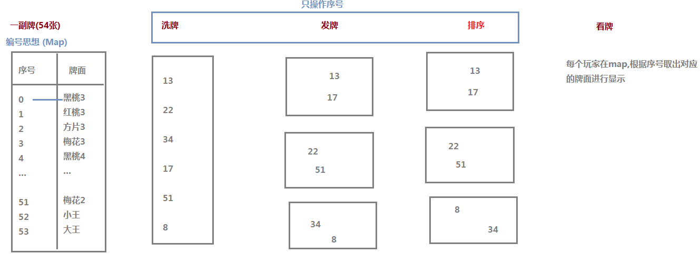
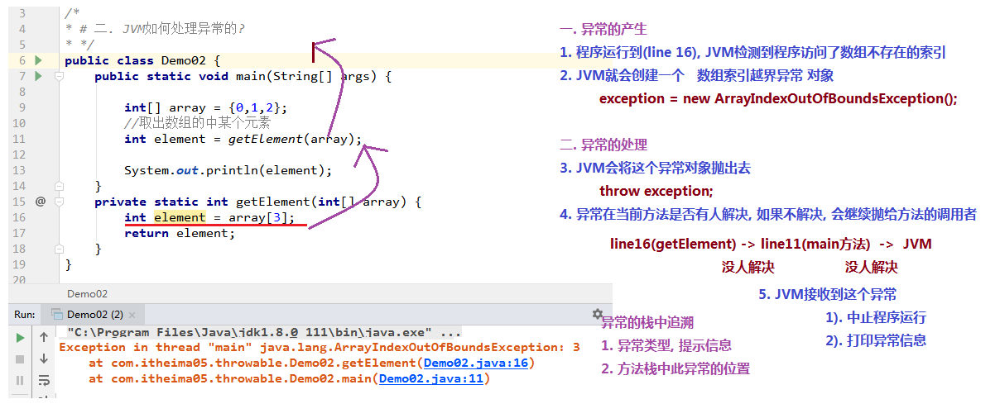
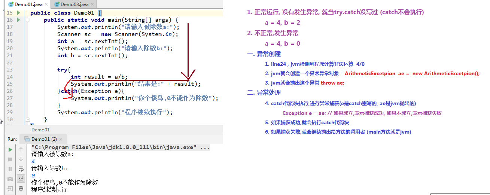

# day06【集合嵌套，异常，线程】

## 今日内容

- 集合嵌套使用
- 集合综合案例斗地主
- 异常机制
- 多线程

## 学习目标

- [ ] 能够理解集合嵌套使用场景
- [ ] 能够完成斗地主洗牌发牌案例
- [ ] 能够说出Error和Exception的区别
- [ ] 能够说出Exception异常的分类
- [ ] 能够使用try...catch关键字处理异常
- [ ] 能够使用throws关键字处理异常
- [ ] 能够自定义并使用自定义异常类
- [ ] 说出进程和线程的概念
- [ ] 能够理解并发与并行的区别
- [ ] 能够使用继承Thread类方式创建多线程
- [ ] 能够使用实现Runnable接口方式创建多线程
- [ ] 能够说出实现接口方式的好处


# 第一章 集合的嵌套

- **总述：任何集合内部都可以存储其它任何集合**

## 1 List嵌套List

~~~java
public class Test{
    public static void main(String[] args){
        /*
			假如有两个班的学生姓名，它们分别存储在两个集合中：
		*/
        //第一个班
        ArrayList<String> list1 = new ArrayList<>();
        list1.add("迪丽热巴");
        list1.add("古力娜扎");
        list1.add("柳岩");
        list1.add("杨幂");
        
        //第二个班
        ArrayList<String> list2 = new ArrayList<>();
        list2.add("蔡徐坤");
        list2.add("杨坤");
        list2.add("陈伟霆");
        list2.add("李易峰");
        
        //将两个集合存储到一个集合中
        ArrayList<ArrayList<String>> allList = new ArrayList<>();
        allList.add(list1);
        allList.add(list2);
        
        //遍历allList，取出每个ArrayList
        for(ArrayList<String> list : allList){
            //遍历每个班的ArrayList
            for(String s : list){
                System.out.println(s);
            }
        }
    }
    
}

~~~


## 2 List嵌套Map

~~~java
public class Test{
    public static void main(String[] args){
        /*
        	有两个班的学员，分别存储在两个Map中
        */
        //第一个班：
        Map<String,String> map1 = new HashMap<>();
        map1.put("it001","迪丽热巴");
        map1.put("it002","古力娜扎");
        
        //第二个班：
        Map<String,String> map2 = new HashMap<>();
        map6.put("heima001","蔡徐坤");
        map2.put("heima002","李易峰");
        
        //将两个班的map存储到一个ArrayList中
        ArrayList<Map<String,String>> allList = new ArrayList<>();
        allList.add(map1);
        allList.add(map2);
        
        //遍历allList，取出每个Map
        for(Map<String,String> map : allList){
            //遍历map
            Set<String> keys = map.keySet();
            for(String key : keys){
                System.out.println(key + " - " + map.get(key));
            }
        }
    }
}
~~~


## 3 Map嵌套Map

~~~java
public class Test{
    public static void main(String[] args){
        /*
        有两个班，班号分别为："黑马188期"和"黑马189期"，两个班学员的姓名分别存储在两个Map中
        */
        //"黑马188期"：
        Map<String,String> map1 = new HashMap<>();
        map1.put("it001","迪丽热巴");
        map1.put("it002","古力娜扎");
        
        //"黑马189期"：
        Map<String,String> map2 = new HashMap<>();
        map2.put("heima001","蔡徐坤");
        map2.put("heima002","李易峰");
        
        //将两个班的Map连同对应的"班号"一同存储在一个Map中
        Map<String,Map<String,String>> allMap = new HashMap<>();
        allMap.put("黑马188期",map1);
        allMap.put("黑马189期",map2);
        
        //遍历allMap
        Set<String> keys = allMap.keySet();
        for(String k : keys){
            System.out.println(k + "：");
            //取出对应的map
            Map<String,String> map = allMap.get(k);
            //遍历map
            Set<String> keys2 = map.keySet();
            for(String k2 : keys2){
                System.out.println(k2 + " = " + map.get(k2));
            }
        }
    }
}
~~~


# 第二章 模拟斗地主洗牌发牌

## 1 案例介绍

按照斗地主的规则，完成洗牌发牌的动作。


具体规则：

1. 组装54张扑克牌
2. 54张牌顺序打乱
3. 三个玩家参与游戏，三人交替摸牌，每人17张牌，最后三张留作底牌。
4. 查看三人各自手中的牌（按照牌的大小排序）、底牌

> 规则：手中扑克牌从大到小的摆放顺序：大王,小王,2,A,K,Q,J,10,9,8,7,6,5,4,3


## 2 案例需求分析

1.准备牌：

完成数字与纸牌的映射关系：

使用双列Map(HashMap)集合，完成一个数字与字符串纸牌的对应关系(相当于一个字典)。

2.洗牌：

通过数字完成洗牌发牌

3.发牌：

将每个人以及底牌设计为ArrayList<String>,将最后3张牌直接存放于底牌，剩余牌通过对3取模依次发牌。

存放的过程中要求数字大小与斗地主规则的大小对应。

将代表不同纸牌的数字分配给不同的玩家与底牌。

4.看牌：

通过Map集合找到对应字符展示。

通过查询纸牌与数字的对应关系，由数字转成纸牌字符串再进行展示。


## 3  实现代码步骤

  

```java
package com.itheima04.practice;

import java.util.ArrayList;
import java.util.Collections;
import java.util.Comparator;
import java.util.HashMap;

public class Demo02 {

    public static void main(String[] args) {
        //1. 要有一副牌
        String[] numbers = {"3","4","5","6","7","8","9","10","J","Q","K","A","2"};
        String[] colors = {"♠","♥","♣","♦"};
            //存储 编号=牌面 的对应关系
        HashMap<Integer, String> map = new HashMap<>();
        //数字放在外层循环
        int a = 0;
        for (String number : numbers) {
            for (String color : colors) {
                String poker = color + number;
                map.put(a,poker);
                a++;
            }
        }
        map.put(52,"小☺");
        map.put(53,"大☺");

        //2. 洗牌
        ArrayList<Integer> list = new ArrayList<>();
        for (int i = 0; i < 54; i++) {
            list.add(i);
        }
            //随机打乱list的元素顺序
        Collections.shuffle(list);

        //3. 发牌
        ArrayList<Integer> p1 = new ArrayList<>();
        ArrayList<Integer> p2 = new ArrayList<>();
        ArrayList<Integer> p3 = new ArrayList<>();
        ArrayList<Integer> dp = new ArrayList<>();

        for (int i = 0; i < list.size(); i++) {
            //有三个玩家,就%3,根据不同的余数情况发给不同的人
            int mod = i % 3;

            Integer xuhao = list.get(i);
            if(i < 3){
                dp.add(xuhao);
            }else if(mod == 0){
                p1.add(xuhao);
            }else if(mod == 1){
                p2.add(xuhao);
            }else{
                p3.add(xuhao);
            }
        }

        //4. 排序
        Collections.sort(p1);
        Collections.sort(p2);
        Collections.sort(p3, new Comparator<Integer>() {
            @Override
            public int compare(Integer o1, Integer o2) {
                return o1 - o2;
            }
        });

        //5. 看牌
        lookPoker(p1,map);
        lookPoker(p2,map);
        lookPoker(p3,map);
        lookPoker(dp,map);

    }

    private static void lookPoker(ArrayList<Integer> list, HashMap<Integer, String> map) {
            //list中都是序号,这个序号就是map中的key
        for (Integer key : list) {
            String value = map.get(key);
            System.out.print(value+" ");//不换行打印,一副牌显示一行
        }
        System.out.println();//换行
    }
}

```


# 第三章   异常

## 1 异常概念

异常，就是不正常的意思。在生活中:医生说,你的身体某个部位有异常,该部位和正常相比有点不同,该部位的功能将受影响.在程序中的意思就是：

- **异常** ：指的是程序在执行过程中，出现的非正常的情况，最终会导致JVM的非正常停止。

在Java等面向对象的编程语言中，异常本身是一个类，产生异常就是创建异常对象并抛出了一个异常对象。Java处理异常的方式是中断处理。

> 异常指的并不是语法错误,语法错了,编译不通过,不会产生字节码文件,根本不能运行.


## 2 异常体系

异常机制其实是帮助我们**找到**程序中的问题，异常的根类是`java.lang.Throwable`，其下有两个子类：`java.lang.Error`与`java.lang.Exception`，平常所说的异常指`java.lang.Exception`。


**Throwable体系：**

- **Error**:严重错误Error，无法通过处理的错误，只能事先避免，好比绝症。
- **Exception**:表示异常，异常产生后程序员可以通过代码的方式纠正，使程序继续运行，是必须要处理的。好比感冒、阑尾炎。

**Throwable中的常用方法：**

- `public void printStackTrace()`:打印异常的详细信息。

  *包含了异常的类型,异常的原因,还包括异常出现的位置,在开发和调试阶段,都得使用printStackTrace。*

- `public String getMessage()`:获取发生异常的原因。

  *提示给用户的时候,就提示错误原因。*

- `public String toString()`:获取异常的类型和异常描述信息(不用)。

***出现异常,不要紧张,把异常的简单类名,拷贝到API中去查。***


## 3 异常分类

我们平常说的异常就是指Exception，因为这类异常一旦出现，我们就要对代码进行更正，修复程序。

**异常(Exception)的分类**:根据在编译时期还是运行时期去检查异常?

- **编译时期异常**:checked异常。在编译时期,就会检查,如果没有处理异常,则编译失败。(如日期格式化异常)
- **运行时期异常**:runtime异常。在运行时期,检查异常.在编译时期,运行异常不会编译器检测(不报错)。(如数学异常)

​    

## 4     异常的产生过程解析

先运行下面的程序，程序会产生一个数组索引越界异常ArrayIndexOfBoundsException。我们通过图解来解析下异常产生的过程。

 工具类

```java
public class ArrayTools {
    // 对给定的数组通过给定的角标获取元素。
    public static int getElement(int[] arr, int index) {
        int element = arr[index];
        return element;
    }
}
```

 测试类

```java
public class ExceptionDemo {
    public static void main(String[] args) {
        int[] arr = { 34, 12, 67 };
        intnum = ArrayTools.getElement(arr, 4)
        System.out.println("num=" + num);
        System.out.println("over");
    }
}
```

上述程序执行过程图解：

 


# 第四章 异常的处理

Java异常处理的五个关键字：**try、catch、finally、throw、throws**

## 1 	抛出异常throw

在编写程序时，我们必须要考虑程序出现问题的情况。比如，在定义方法时，方法需要接受参数。那么，当调用方法使用接受到的参数时，首先需要先对参数数据进行合法的判断，数据若不合法，就应该告诉调用者，传递合法的数据进来。这时需要使用抛出异常的方式来告诉调用者。

在java中，提供了一个**throw**关键字，它用来抛出一个指定的异常对象。那么，抛出一个异常具体如何操作呢？

1. 创建一个异常对象。封装一些提示信息(信息可以自己编写)。

2. 需要将这个异常对象告知给调用者。怎么告知呢？怎么将这个异常对象传递到调用者处呢？通过关键字throw就可以完成。throw 异常对象。

   throw**用在方法内**，用来抛出一个异常对象，将这个异常对象传递到调用者处，并结束当前方法的执行。


**使用格式：**

```
throw new 异常类名(参数);
```

 例如：

```java
throw new NullPointerException("要访问的arr数组不存在");

throw new ArrayIndexOutOfBoundsException("该索引在数组中不存在，已超出范围");
```

学习完抛出异常的格式后，我们通过下面程序演示下throw的使用。

```java
public class ThrowDemo {
    public static void main(String[] args) {
        //创建一个数组 
        int[] arr = {2,4,52,2};
        //根据索引找对应的元素 
        int index = 4;
        int element = getElement(arr, index);

        System.out.println(element);
        System.out.println("over");
    }
    /*
     * 根据 索引找到数组中对应的元素
     */
    public static int getElement(int[] arr,int index){ 
       	//判断  索引是否越界
        if(index<0 || index>arr.length-1){
             /*
             判断条件如果满足，当执行完throw抛出异常对象后，方法已经无法继续运算。
             这时就会结束当前方法的执行，并将异常告知给调用者。这时就需要通过异常来解决。 
              */
             throw new ArrayIndexOutOfBoundsException("哥们，角标越界了~~~");
        }
        int element = arr[index];
        return element;
    }
}
```

> 注意：如果产生了问题，我们就会throw将问题描述类即异常进行抛出，也就是将问题返回给该方法的调用者。
>
> 那么对于调用者来说，该怎么处理呢？一种是进行捕获处理，另一种就是继续讲问题声明出去，使用throws声明处理。


## 2 Objects非空判断

还记得我们学习过一个类Objects吗，曾经提到过它由一些静态的实用方法组成，这些方法是null-save（空指针安全的）或null-tolerant（容忍空指针的），那么在它的源码中，将对象为null的值进行了抛出异常操作。

- `public static <T> T requireNonNull(T obj)`:查看指定引用对象不是null。

查看源码发现这里对为null的进行了抛出异常操作：

```java
public static <T> T requireNonNull(T obj) {
    if (obj == null)
      	throw new NullPointerException();
    return obj;
}
```


## 3  声明异常throws

**声明异常**：将问题标识出来，报告给调用者。如果方法内通过throw抛出了编译时异常，而没有捕获处理（稍后讲解该方式），那么必须通过throws进行声明，让调用者去处理。

关键字**throws**运用于方法声明之上,用于表示当前方法不处理异常,而是提醒该方法的调用者来处理异常(抛出异常).

**声明异常格式：**

```
修饰符 返回值类型 方法名(参数) throws 异常类名1,异常类名2…{   }	
```

声明异常的代码演示：

```java
public class ThrowsDemo {
    public static void main(String[] args) throws FileNotFoundException {
        read("a.txt");
    }

    // 如果定义功能时有问题发生需要报告给调用者。可以通过在方法上使用throws关键字进行声明
    public static void read(String path) throws FileNotFoundException {
        if (!path.equals("a.txt")) {//如果不是 a.txt这个文件 
            // 我假设  如果不是 a.txt 认为 该文件不存在 是一个错误 也就是异常  throw
            throw new FileNotFoundException("文件不存在");
        }
    }
}
```

throws用于进行异常类的声明，若该方法可能有多种异常情况产生，那么在throws后面可以写多个异常类，用逗号隔开。

```java
public class ThrowsDemo2 {
    public static void main(String[] args) throws IOException {
        read("a.txt");
    }

    public static void read(String path)throws FileNotFoundException, IOException {
        if (!path.equals("a.txt")) {//如果不是 a.txt这个文件 
            // 我假设  如果不是 a.txt 认为 该文件不存在 是一个错误 也就是异常  throw
            throw new FileNotFoundException("文件不存在");
        }
        if (!path.equals("b.txt")) {
            throw new IOException();
        }
    }
}
```


## 4  捕获异常try…catch

如果异常出现的话,会立刻终止程序,所以我们得处理异常:

1. 该方法不处理,而是声明抛出,由该方法的调用者来处理(throws)。
2. 在方法中使用try-catch的语句块来处理异常。

**try-catch**的方式就是捕获异常。

- **捕获异常**：Java中对异常有针对性的语句进行捕获，可以对出现的异常进行指定方式的处理。

捕获异常语法如下：

```java
try{
     编写可能会出现异常的代码
}catch(异常类型  e){
     处理异常的代码
     //记录日志/打印异常信息/继续抛出异常
}
```

**try：**该代码块中编写可能产生异常的代码。

**catch：**用来进行某种异常的捕获，实现对捕获到的异常进行处理。

> 注意:try和catch都不能单独使用,必须连用。

演示如下：

```java
public class TryCatchDemo {
    public static void main(String[] args) {
        try {// 当产生异常时，必须有处理方式。要么捕获，要么声明。
            read("b.txt");
        } catch (FileNotFoundException e) {// 括号中需要定义什么呢？
          	//try中抛出的是什么异常，在括号中就定义什么异常类型
            System.out.println(e);
        }
        System.out.println("over");
    }
    /*
     *
     * 我们 当前的这个方法中 有异常  有编译期异常
     */
    public static void read(String path) throws FileNotFoundException {
        if (!path.equals("a.txt")) {//如果不是 a.txt这个文件 
            // 我假设  如果不是 a.txt 认为 该文件不存在 是一个错误 也就是异常  throw
            throw new FileNotFoundException("文件不存在");
        }
    }
}
```

如何获取异常信息：

Throwable类中定义了一些查看方法:

- `public String getMessage()`:获取异常的描述信息,原因(提示给用户的时候,就提示错误原因。


- `public String toString()`:获取异常的类型和异常描述信息(不用)。
- `public void printStackTrace()`:打印异常的跟踪栈信息并输出到控制台。

​            *包含了异常的类型,异常的原因,还包括异常出现的位置,在开发和调试阶段,都得使用printStackTrace。*

在开发中呢也可以在catch将编译期异常转换成运行期异常处理。


## 4 finally 代码块

**finally**：有一些特定的代码无论异常是否发生，都需要执行。另外，因为异常会引发程序跳转，导致有些语句执行不到。而finally就是解决这个问题的，在finally代码块中存放的代码都是一定会被执行的。

什么时候的代码必须最终执行？

当我们在try语句块中打开了一些物理资源(磁盘文件/网络连接/数据库连接等),我们都得在使用完之后,最终关闭打开的资源。

finally的语法:

 try...catch....finally:自身需要处理异常,最终还得关闭资源。

> 注意:finally不能单独使用。

比如在我们之后学习的IO流中，当打开了一个关联文件的资源，最后程序不管结果如何，都需要把这个资源关闭掉。

finally代码参考如下：

```java
public class TryCatchDemo4 {
    public static void main(String[] args) {
        try {
            read("a.txt");
        } catch (FileNotFoundException e) {
            //抓取到的是编译期异常  抛出去的是运行期 
            throw new RuntimeException(e);
        } finally {
            System.out.println("不管程序怎样，这里都将会被执行。");
        }
        System.out.println("over");
    }
    /*
     *
     * 我们 当前的这个方法中 有异常  有编译期异常
     */
    public static void read(String path) throws FileNotFoundException {
        if (!path.equals("a.txt")) {//如果不是 a.txt这个文件 
            // 我假设  如果不是 a.txt 认为 该文件不存在 是一个错误 也就是异常  throw
            throw new FileNotFoundException("文件不存在");
        }
    }
}
```

> 当只有在try或者catch中调用退出JVM的相关方法,此时finally才不会执行,否则finally永远会执行。


## 5   异常注意事项

- 运行时异常被抛出可以不处理。即不捕获也不声明抛出。

- 如果父类的方法抛出了多个异常,子类覆盖(重写)父类方法时,只能抛出相同的异常或者是他的子集。

- 父类方法没有抛出异常，子类覆盖父类该方法时也不可抛出异常。此时子类产生该异常，只能捕获处理，不能声明抛出

- 当多异常分别处理时，捕获处理，前边的类不能是后边类的父类

- 在try/catch后可以追加finally代码块，其中的代码一定会被执行，通常用于资源回收。

- 多个异常使用捕获又该如何处理呢？

  1. 多个异常分别处理。
  2. 多个异常一次捕获，多次处理。
  3. 多个异常一次捕获一次处理。

  一般我们是使用一次捕获多次处理方式，格式如下：

  ```java
  try{
       编写可能会出现异常的代码
  }catch(异常类型A  e){  当try中出现A类型异常,就用该catch来捕获.
       处理异常的代码
       //记录日志/打印异常信息/继续抛出异常
  }catch(异常类型B  e){  当try中出现B类型异常,就用该catch来捕获.
       处理异常的代码
       //记录日志/打印异常信息/继续抛出异常
  }
  ```

  > 注意:这种异常处理方式，要求多个catch中的异常不能相同，并且若catch中的多个异常之间有子父类异常的关系，那么子类异常要求在上面的catch处理，父类异常在下面的catch处理。


# 第五章 自定义异常

## 1 概述

**为什么需要自定义异常类:**

我们说了Java中不同的异常类,分别表示着某一种具体的异常情况,那么在开发中总是有些异常情况是SUN没有定义好的,此时我们根据自己业务的异常情况来定义异常类。,例如年龄负数问题,考试成绩负数问题。

在上述代码中，发现这些异常都是JDK内部定义好的，但是实际开发中也会出现很多异常,这些异常很可能在JDK中没有定义过,例如年龄负数问题,考试成绩负数问题.那么能不能自己定义异常呢？

**什么是自定义异常类:**

在开发中根据自己业务的异常情况来定义异常类.

自定义一个业务逻辑异常: **RegisterException**。一个注册异常类。

**异常类如何定义:**

1. 自定义一个编译期异常: 自定义类 并继承于`java.lang.Exception`。
2. 自定义一个运行时期的异常类:自定义类 并继承于`java.lang.RuntimeException`。


## 2 自定义异常的练习

要求：我们模拟注册操作，如果用户名已存在，则抛出异常并提示：亲，该用户名已经被注册。

首先定义一个注册异常类RegisterException：

```java
// 业务逻辑异常
public class RegisterException extends Exception {
    /**
     * 空参构造
     */
    public RegisterException() {
    }

    /**
     *
     * @param message 表示异常提示
     */
    public RegisterException(String message) {
        super(message);
    }
}
```

模拟登陆操作，使用数组模拟数据库中存储的数据，并提供当前注册账号是否存在方法用于判断。

```java
public class Demo {
    // 模拟数据库中已存在账号
    private static String[] names = {"bill","hill","jill"};
   
    public static void main(String[] args) {     
        //调用方法
        try{
              // 可能出现异常的代码
            checkUsername("nill");
            System.out.println("注册成功");//如果没有异常就是注册成功
        }catch(LoginException e){
            //处理异常
            e.printStackTrace();
        }
    }

    //判断当前注册账号是否存在
    //因为是编译期异常，又想调用者去处理 所以声明该异常
    public static boolean checkUsername(String uname) throws LoginException{
        for (String name : names) {
            if(name.equals(uname)){//如果名字在这里面 就抛出登陆异常
                throw new LoginException("亲"+name+"已经被注册了！");
            }
        }
        return true;
    }
}
```


# 第六章 多线程

我们在之前，学习的程序在没有跳转语句的前提下，都是由上至下依次执行，那现在想要设计一个程序，边打游戏边听歌，怎么设计？

要解决上述问题,咱们得使用多进程或者多线程来解决.

## 1 并发与并行

- **并行**：指两个或多个事件在**同一时刻**发生（同时执行）。
- **并发**：指两个或多个事件在**同一个时间段内**发生(交替执行)。


在操作系统中，安装了多个程序，并发指的是在一段时间内宏观上有多个程序同时运行，这在单 CPU 系统中，每一时刻只能有一道程序执行，即微观上这些程序是分时的交替运行，只不过是给人的感觉是同时运行，那是因为分时交替运行的时间是非常短的。

而在多个 CPU 系统中，则这些可以并发执行的程序便可以分配到多个处理器上（CPU），实现多任务并行执行，即利用每个处理器来处理一个可以并发执行的程序，这样多个程序便可以同时执行。目前电脑市场上说的多核 CPU，便是多核处理器，核越多，并行处理的程序越多，能大大的提高电脑运行的效率。

> 注意：单核处理器的计算机肯定是不能并行的处理多个任务的，只能是多个任务在单个CPU上并发运行。同理,线程也是一样的，从宏观角度上理解线程是并行运行的，但是从微观角度上分析却是串行运行的，即一个线程一个线程的去运行，当系统只有一个CPU时，线程会以某种顺序执行多个线程，我们把这种情况称之为线程调度。


## 2 线程与进程

- **进程**：是指一个内存中运行的应用程序，每个进程都有一个独立的内存空间，一个应用程序可以同时运行多个进程；进程也是程序的一次执行过程，是系统运行程序的基本单位；系统运行一个程序即是一个进程从创建、运行到消亡的过程。
- **线程**：是进程中的一个执行单元，负责当前进程中程序的执行，一个进程中至少有一个线程。一个进程中是可以有多个线程的，这个应用程序也可以称之为多线程程序。

**进程**


**线程**


**进程与线程的区别**

- 进程：有独立的内存空间，进程中的数据存放空间（堆空间和栈空间）是独立的，至少有一个线程。
- 线程：堆空间是共享的，栈空间是独立的，线程消耗的资源比进程小的多。

> **注意：**下面内容为了解知识点
>
> 1:因为一个进程中的多个线程是并发运行的，那么从微观角度看也是有先后顺序的，哪个线程执行完全取决于 CPU 的调度，程序员是干涉不了的。而这也就造成的多线程的随机性。
>
> 2:Java 程序的进程里面至少包含两个线程，主进程也就是 main()方法线程，另外一个是垃圾回收机制线程。每当使用 java 命令执行一个类时，实际上都会启动一个 JVM，每一个 JVM 实际上就是在操作系统中启动了一个线程，java 本身具备了垃圾的收集机制，所以在 Java 运行时至少会启动两个线程。
>
> 3:由于创建一个线程的开销比创建一个进程的开销小的多，那么我们在开发多任务运行的时候，通常考虑创建多线程，而不是创建多进程。

**线程调度:**

- 分时调度

  ​	所有线程轮流使用 CPU 的使用权，平均分配每个线程占用 CPU 的时间。

- 抢占式调度

  ​	优先让优先级高的线程使用 CPU，如果线程的优先级相同，那么会随机选择一个(线程随机性)，Java使用的为抢占式调度。

  

## 3 Thread类

线程开启我们需要用到了`java.lang.Thread`类，API中该类中定义了有关线程的一些方法，具体如下：

**构造方法：**

- `public Thread()`:分配一个新的线程对象。
- `public Thread(String name)`:分配一个指定名字的新的线程对象。
- `public Thread(Runnable target)`:分配一个带有指定目标新的线程对象。
- `public Thread(Runnable target,String name)`:分配一个带有指定目标新的线程对象并指定名字。

**常用方法：**

- `public String getName()`:获取当前线程名称。
- `public void start()`:导致此线程开始执行; Java虚拟机调用此线程的run方法。
- `public void run()`:此线程要执行的任务在此处定义代码。
- `public static void sleep(long millis)`:使当前正在执行的线程以指定的毫秒数暂停（暂时停止执行）。
- `public static Thread currentThread()  `:返回对当前正在执行的线程对象的引用。

翻阅API后得知创建线程的方式总共有两种，一种是继承Thread类方式，一种是实现Runnable接口方式，方式一我们上一天已经完成，接下来讲解方式二实现的方式。


## 4 创建线程方式一_继承方式

Java使用`java.lang.Thread`类代表**线程**，所有的线程对象都必须是Thread类或其子类的实例。每个线程的作用是完成一定的任务，实际上就是执行一段程序流即一段顺序执行的代码。Java使用线程执行体来代表这段程序流。Java中通过继承Thread类来**创建**并**启动多线程**的步骤如下：

1. 定义Thread类的子类，并重写该类的run()方法，该run()方法的方法体就代表了线程需要完成的任务,因此把run()方法称为线程执行体。
2. 创建Thread子类的实例，即创建了线程对象
3. 调用线程对象的start()方法来启动该线程

代码如下：

测试类：

```java
public class Demo01 {
	public static void main(String[] args) {
		//创建自定义线程对象
		MyThread mt = new MyThread("新的线程！");
		//开启新线程
		mt.start();
		//在主方法中执行for循环
		for (int i = 0; i < 200; i++) {
			System.out.println("main线程！"+i);
		}
	}
}
```

自定义线程类：

```java
public class MyThread extends Thread {
	//定义指定线程名称的构造方法
	public MyThread(String name) {
		//调用父类的String参数的构造方法，指定线程的名称
		super(name);
	}
  	public MyThread() {
		//不指定线程的名字,线程有默认的名字Thread-0
	}
	/**
	 * 重写run方法，完成该线程执行的逻辑
	 */
	@Override
	public void run() {
		for (int i = 0; i < 200; i++) {
			System.out.println(getName()+"：正在执行！"+i);
		}
	}
}
```


## 5 创建线程方式二_实现方式

采用`java.lang.Runnable`也是非常常见的一种，我们只需要重写run方法即可。

步骤如下：

1. 定义Runnable接口的实现类，并重写该接口的run()方法，该run()方法的方法体同样是该线程的线程执行体。
2. 创建Runnable实现类的实例，并以此实例作为Thread的target来创建Thread对象，该Thread对象才是真正的线程对象。
3. 调用线程对象的start()方法来启动线程。

代码如下：

```java
public class MyRunnable implements Runnable{
	@Override
	public void run() {
		for (int i = 0; i < 20; i++) {
			System.out.println(Thread.currentThread().getName()+" "+i);
		}
	}
}
```

```java
public class Demo {
    public static void main(String[] args) {
        //创建自定义类对象  线程任务对象
        MyRunnable mr = new MyRunnable();
        //创建线程对象
        Thread t = new Thread(mr, "小强");
        t.start();
        for (int i = 0; i < 20; i++) {
            System.out.println("旺财 " + i);
        }
    }
}
```

通过实现Runnable接口，使得该类有了多线程类的特征。run()方法是多线程程序的一个执行目标。所有的多线程代码都在run方法里面。Thread类实际上也是实现了Runnable接口的类。

在启动的多线程的时候，需要先通过Thread类的构造方法Thread(Runnable target) 构造出对象，然后调用Thread对象的start()方法来运行多线程代码。

实际上所有的多线程代码都是通过运行Thread的start()方法来运行的。因此，不管是继承Thread类还是实现Runnable接口来实现多线程，最终还是通过Thread的对象的API来控制线程的，熟悉Thread类的API是进行多线程编程的基础。

> tips:Runnable对象仅仅作为Thread对象的target，Runnable实现类里包含的run()方法仅作为线程执行体。而实际的线程对象依然是Thread实例，只是该Thread线程负责执行其target的run()方法。

**Thread和Runnable的区别**

如果一个类继承Thread，则不适合资源共享。但是如果实现了Runable接口的话，则很容易的实现资源共享。

**总结：**

**实现Runnable接口比继承Thread类所具有的优势：**

1. 适合多个相同的程序代码的线程去共享同一个资源。
2. 可以避免java中的单继承的局限性。
3. 增加程序的健壮性，实现解耦操作，代码可以被多个线程共享，代码和线程独立。
4. 线程池只能放入实现Runable或Callable类线程，不能直接放入继承Thread的类。


## 6 匿名内部类方式

使用线程的内匿名内部类方式，可以方便的实现每个线程执行不同的线程任务操作。

使用匿名内部类的方式实现Runnable接口，重新Runnable接口中的run方法：

```java
public class NoNameInnerClassThread {
   	public static void main(String[] args) {	   	
//		new Runnable(){
//			public void run(){
//				for (int i = 0; i < 20; i++) {
//					System.out.println("张宇:"+i);
//				}
//			}  
//	   	}; //---这个整体  相当于new MyRunnable()
        Runnable r = new Runnable(){
            public void run(){
                for (int i = 0; i < 20; i++) {
                  	System.out.println("张宇:"+i);
                }
            }  
        };
        new Thread(r).start();

        for (int i = 0; i < 20; i++) {
          	System.out.println("费玉清:"+i);
        }
   	}
}
```


# 异常总结

```markdown
# 一. 异常是什么? 异常的继承体系
1. 程序异常: 程序中出现了不符合预期的情况,这种情况可能导致程序崩溃
2. 异常的继承体系
	0). Throwable (异常的顶层类) 可抛出的
    1). Error (子类) 错误
    	无法从软件层面解决
    	碰到错误,直接修改代码,避开错误
    2). Exception (子类) 异常
		I. 程序的错, 要想办法解决
		II. 异常是分两类
			源码 -> 编译  -> 运行
			a. 运行时异常: RuntimeException及其子类
				在编译时期可以不处理
				1). NullPointerException 空指针
				2). IndexOutOfBoundsException 索引越界(List集合)
					StringIndexOutOfBoundsException 字符串索引越界
					ArrayIndexOutOfBoundsException 数组索引越界
				3). ClassCastException 类型转换异常
                4). ArithmeticException 算术异常
			b. 编译时异常: 只要不是RuntimeException
				在编译时期必须处理,不处理就会报错
				1). IO异常 : IOException
				2). 反射异常
# 二. JVM如何处理异常的?

# 三. 程序员如何处理异常 (重点)
0. 处理异常有两种方式
1. 当场解决 : try...catch
   语法:
        1. try...catch (常见)
        2. try...finally
        3. try...catch...catch...
        4. try...catch...finally (最后一种)
2. 暂时不解决 : throws
 	1. 语法
           方法声明上添加关键throws
          修饰符 返回值类型 方法名(参数列表) throws 异常类型{

          }

     2. 含义:
         此方法有异常,但是暂时不解决,期待方法调用者解决
     3. 作用: 主要是来声明内部有编译异常    
# 四. 自定义异常
	自定义异常 : 自己写一个异常类,然后继承已有的异常类
```

    


  