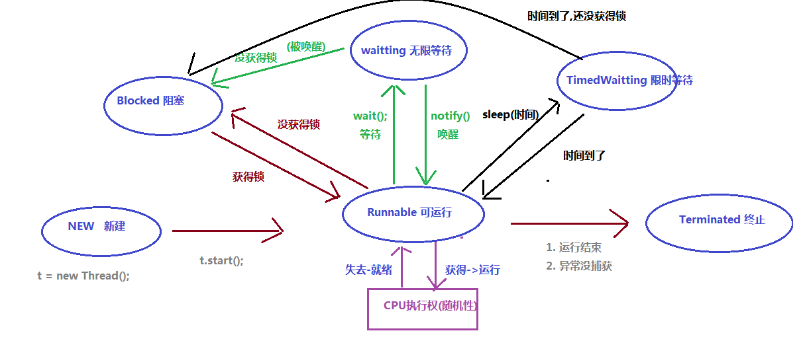
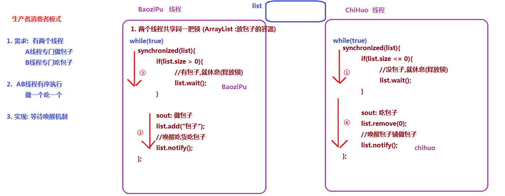

day08【JUC并发包，线程池，死锁，线程状态】

## 今日内容

* 并发包
* 死锁
* 线程池
* 线程状态
* 等待与唤醒
* Timer实现定时任务


## 教学目标 

- [ ] 并发包下三个线程安全的集合

  > CopyOnWriteArrayList : 如果有线程安全问题,取代 ArrayList
  >
  > CopyOnWriteArraySet : 如果有线程安全问题,取代 HashSet
  >
  >ConcurrentHashMap :  如果有线程安全问题,取代 HashMap
  >
  >线程安全有三个问题
  >
  >1. 有序性
  >2. 可见性
  >3. 原子性
  >
  >线程安全出现的前提
  >
  >1. 线程并发(起码两个线程)
  >2. 多个线程操作共享资源

- [ ] 能够描述CountDownLatch类的作用

  >计数器(门栓) : 
  >
  >1). 使用: 
  >
  >​	初始构造设置一个值   count=2
  >
  >​	然后当前线程await(); // count==0时,当前线程会被唤醒
  >
  >​       其他线程调用countdown(); / count--​	

- [ ] 能够描述CyclicBarrier类的作用

  >循环屏障
  >
  >1). 使用
  >
  >​	初始构造设置一个值  count=5 和 一个线程A
  >
  >​	然后其他5个线程调用await方法, 那么A就会被唤醒执行
  >
  >2). 例子: 5个人到齐了才开会
  >
  >3). 运用: 线程按照指定顺序执行

- [ ] 能够表述Semaphore类的作用

  > 允许指定数量线程并发 
  >
  > 举例: 允许2个线程并发
  >
  > A 进来了
  >
  > B 进来了
  >
  > A出去了
  >
  > C 进来了

- [ ] 能够描述Exchanger类的作用

  > 允许两个线程交换数据
  >
  > 1. exchange方法必须两个方法都要执行到,才能继续往下执行
  > 2. 运用: 交易, AB对账

- [ ] 能够描述Java中线程池运行原理

  > 线程池: 存储线程的容器
  >
  > 合理使用线程池的好处
  >
  > 1. 在高并发场景下,避免线程频繁创建和销毁,节省性能
  > 2. 使用线程的时响应速度比较快(线程池的线程提前创建好的)
  > 3. 控制内存占用

- [ ] 能够描述死锁产生的三个条件

  > 1. 必须多个线程(起码2个)
  > 2. 必须多个锁(起码2个)
  > 3. 必须同步代码块嵌套

- [ ] 能够说出线程6个状态的名称

  >1. new : 新建状态
  >2. runnable :可运行
  >3. terminated : 终止
  >4. blocked : 阻塞
  >5. waitting : 无限等待
  >6. timedWatting : 限时等待

- [ ] 能够理解等待唤醒案例

- [ ] 能够使用Timer类实现定时任务


# 第零章 并发包 

在JDK的并发包里提供了几个非常有用的并发容器和并发工具类。供我们在多线程开发中进行使用。


## 5.1 CopyOnWriteArrayList

```java
package com.itheima01.juc;

import java.util.ArrayList;
import java.util.List;
import java.util.concurrent.CopyOnWriteArrayList;

/*
* 问题:  索引越界
 *      Exception in thread "Thread-0" java.lang.ArrayIndexOutOfBoundsException: 823
 *
 *      数组长度: 822
 *      Thread-0    添加的时候,元素个数还未超过821, cpu切换到Thread-1线程(①) 已经判断过了,把元素放进去,越界了823(④)
        Thread-1    连续添加两个, 第一个没有越界 821+1(②),再添加第二个数也是822+1 > 长度, 扩容(cpu切换 ③)
*
* 结论: ArrayList 是线程不安全的, 效率高
*
* 解决: CopyOnWriteArrayList 是线程安全的,效率低
*
*       线程安全原理 :
            添加的时候,判断集合长度是否够用, 如果够用继续添加,不够用,会先扩容后添加(用lock锁住了)
 *
*  推荐: 如果没有线程安全问题, 请用ArrayList,如果有线程安全问题用CopyOnWriteArrayList
*       1. 起码两个线程
*       2. 多个线程操作同一资源
* */
public class Demo01 {

    public static void main(String[] args) throws InterruptedException {
        MyThread t1 = new MyThread();
        MyThread t2 = new MyThread();

        t1.start();
        t2.start();
        //等t1,t2先执行完
        Thread.sleep(1000);

        System.out.println("最终集合的长度：" + MyThread.list.size());
    }
}

class MyThread extends Thread {
//    public static List<Integer> list = new ArrayList<>();//线程不安全的
    public static List<Integer> list = new CopyOnWriteArrayList<>();//线程安全的
    @Override
    public void run() {
        for (int i = 0; i < 10000; i++) {
            list.add(i);
        }
        System.out.println("添加完毕！");
    }
}

```


## 5.2 CopyOnWriteArraySet

```java
package com.itheima01.juc;

import java.util.HashSet;
import java.util.Set;
import java.util.concurrent.CopyOnWriteArraySet;

/*
* 最终集合的长度：19203
*       HashSet 的数组长度=16;
*           (数组 : 16
*            链表
*            红黑树
*           )
*      比如 : 添加16和添加32 放在同一数组索引的链表中的
* 线程A :   添加 16  , 先判断链表的 2 索引位没东西, 准备放进去(cpu切换①), 接着放进去,结果发现链表同一位置存了两个,新的覆盖旧的(③)
* 线程B :   添加 32  , 判断链表2索引位没东西,装进去了(切换②)
*
* 扩容因子 16*0.75
* */
public class Demo02 {

    public static void main(String[] args) throws InterruptedException {
        YourThread t1 = new YourThread();
        t1.start();

        //主线程也添加10000个
        for (int i = 10000; i < 20000; i++) {
            YourThread.set.add(i);

        }
        Thread.sleep(1000 * 4);
        System.out.println("最终集合的长度：" + YourThread.set.size());
    }
}

class YourThread extends Thread {
//    public static Set<Integer> set = new HashSet<>();//线程不安全的
    public static Set<Integer> set = new CopyOnWriteArraySet<>();//线程不安全的
    @Override
    public void run() {
        for (int i = 0; i < 10000; i++) {
            set.add(i);
        }
        System.out.println("添加完毕！");
    }
}

```


## 5.3 ConcurrentHashMap

```java
package com.itheima01.juc;

import java.util.HashMap;
import java.util.HashSet;
import java.util.Hashtable;
import java.util.Map;
import java.util.concurrent.ConcurrentHashMap;

/*
*   HashMap线程不安全,效率高
*
*   Hashtable 线程安全, JDK很早的类,效率很低, 已经被废弃
*       (哈希表)
*       1). 几乎所有的方法都加synchronized 关键字锁起来了
*       2). synchronized的普通方法的锁对象 this
*           get,put共用一个锁对象, 一个线程在put的时候,另一个线程不能get
*           (整个集合被锁住了)
*       # 表锁
*
*       
*   ConcurrentHashMap 线程安全,效率不是很低
*       1). CAS + synchronized(局部锁定)(只锁住核心操作,没有整个方法都锁住)
*
*       2). 效率相对较高
*
*       # 行锁
*       
*   # 运用: 线程安全用 ConcurrentHashMap , 不安全用 HashMap
* */
public class Demo03 {
    public static void main(String[] args) throws InterruptedException {

        HerThread t1 = new HerThread();
        t1.start();

        for (int i = 10000; i < 20000 ; i++) {
            HerThread.map.put(i, HerThread.obj);

        }
        Thread.sleep(1000 * 2);

        System.out.println("map最终大小：" + HerThread.map.size());

    }
}
class HerThread extends Thread {
//    public static Map<Integer, Object> map = new HashMap<>(); // 线程不安全,效率高
//    public static Map<Integer, Object> map = new Hashtable<>(); // 线程安全,效率很低
    public static Map<Integer, Object> map = new ConcurrentHashMap<>(); // 线程安全,效率不是很低

    public static final Object obj = new Object(); //独一份
    @Override
    public void run() {
        for (int i = 0; i < 10000; i++) {
            map.put(i, obj);
        }
    }
}
```


- **HashMap是线程不安全的。**

  > 1. 线程类：

  ```java
  public class MyThread extends Thread {
      public static Map<Integer, Integer> map = new HashMap<>();
      @Override
      public void run() {
          for (int i = 0; i < 10000; i++) {
              map.put(i, i);
          }
      }
  }
  
  ```

  > 1. 测试类：

  ```java
  public class Demo {
      public static void main(String[] args) throws InterruptedException {
          MyThread t1 = new MyThread();
          t1.start();
  
          for (int i = 10000; i < 20000 ; i++) {
              MyThread.map.put(i, i);
  
          }
          Thread.sleep(1000 * 2);
  
          System.out.println("map最终大小：" + MyThread.map.size());
      }
  }
  
  ```

  运行结果可能会出现异常、或者结果不准确！！

- **Hashtable是线程安全的，但效率低：**

  我们改用JDK提供的一个早期的线程安全的Hashtable类来改写此例，注意：我们加入了"计时"。

  > 1. 线程类：

  ```java
  public class MyThread extends Thread {
      public static Map<Integer, Integer> map = new Hashtable<>();
      @Override
      public void run() {
          long start = System.currentTimeMillis();
          for (int i = 0; i < 100000; i++) {
              map.put(i, i);
          }
          long end = System.currentTimeMillis();
          System.out.println((end - start) + " 毫秒");
      }
  }
  
  ```

  > 1. 测试类：

  ```java
  public class Demo {
      public static void main(String[] args) throws InterruptedException {
          for (int i = 0; i < 1000; i++) {
              new MyThread().start();//开启1000个线程
          }
  
          Thread.sleep(1000 * 20);//由于每个线程执行时间稍长，所以这里多停顿一会
  
          System.out.println("map的最终大小：" + MyThread.map.size());
         
      }
  }
  
  ```

  > 1. 最终打印结果：

  ```java
  ...
  ...
  15505 毫秒
  15509 毫秒
  15496 毫秒
  15501 毫秒
  15539 毫秒
  15540 毫秒
  15542 毫秒
  15510 毫秒
  15541 毫秒
  15502 毫秒
  15533 毫秒
  15647 毫秒
  15544 毫秒
  15619 毫秒
  map的最终大小：100000
  ```

  能看到结果是正确的，但耗时较长。

- **改用ConcurrentHashMap**

  > 1. 线程类：

  ```java
  public class MyThread extends Thread {
      public static Map<Integer, Integer> map = new ConcurrentHashMap<>();
  
      @Override
    public void run() {
          long start = System.currentTimeMillis();
        for (int i = 0; i < 100000; i++) {
              map.put(i, i);
          }
          long end = System.currentTimeMillis();
          System.out.println((end - start) + " 毫秒");
      }
  }
  ```

  > 1. 测试类：

```java
  public class Demo {
    public static void main(String[] args) throws InterruptedException {
          for (int i = 0; i < 1000; i++) {
              new MyThread().start();
          }
  
          Thread.sleep(1000 * 20);
  
          System.out.println("map的最终大小：" + MyThread.map.size());
      }
  }
```

> 1. 最终结果：

```java
  ...
  ...
  3995 毫秒
  3997 毫秒
  4007 毫秒
  4007 毫秒
  4008 毫秒
  4010 毫秒
  4019 毫秒
  4022 毫秒
  4026 毫秒
  3985 毫秒
  4152 毫秒
  4292 毫秒
  map的最终大小：100000
```

  可以看到效率提高了很多！！！

- HashTable效率低下原因：

```java
public synchronized V put(K key, V value) 
public synchronized V get(Object key)
```

HashTable容器使用synchronized来保证线程安全，但在线程竞争激烈的情况下HashTable的效率非常低下。因为当一个线程访问HashTable的同步方法，其他线程也访问HashTable的同步方法时，会进入阻塞状态。如线程1使用put进行元素添加，线程2不但不能使用put方法添加元素，也不能使用get方法来获取元素，所以竞争越激烈效率越低。

  


**ConcurrentHashMap高效的原因：CAS + 局部(synchronized)锁定**


# 第一章 并发包

## 1.1 CountDownLatch

CountDownLatch允许一个或多个线程等待其他线程完成操作。

例如：线程1要执行打印：A和C，线程2要执行打印：B，但线程1在打印A后，要线程2打印B之后才能打印C，所以：线程1在打印A后，必须等待线程2打印完B之后才能继续执行。


CountDownLatch构造方法:

```java
public CountDownLatch(int count)// 初始化一个指定计数器的CountDownLatch对象
```

CountDownLatch重要方法:

```java
public void await() throws InterruptedException// 让当前线程等待
public void countDown()	// 计数器进行减1
```

```java
package com.itheima02.juc;

import java.util.concurrent.CountDownLatch;
/*
*   需求: 按顺序打印a,b,c
* */
public class Demo01 {

    public static void main(String[] args) throws InterruptedException {
        // 计数初始为1 (控制A线程)
        CountDownLatch countDownLatch = new CountDownLatch(1);
        // 计数初始为1 (控制B线程)
        CountDownLatch countDownLatch2 = new CountDownLatch(1);

//        new AThread(countDownLatch).start();
//        new BThread(countDownLatch).start();
        new BThread(countDownLatch,countDownLatch2).start();
        new AThread(countDownLatch,countDownLatch2).start();
//        Thread.sleep(1000);
    }
}
class AThread extends Thread{
    CountDownLatch latch;
    CountDownLatch latchB;
    public AThread(CountDownLatch latch){
        this.latch = latch;
    }
    public AThread(CountDownLatch latch,CountDownLatch latchB){
        this.latch = latch;
        this.latchB = latchB;
    }

    @Override
    public void run() {
        System.out.println("a");
        latchB.countDown();
        try {
            latch.await();
        } catch (InterruptedException e) {
            e.printStackTrace();
        }
        System.out.println("c");
    }
}
class BThread extends Thread{
    CountDownLatch latch;
    CountDownLatch latchB;
    public BThread(CountDownLatch latch){
        this.latch = latch;
    }
    public BThread(CountDownLatch latch,CountDownLatch latchB){
        this.latch = latch;
        this.latchB = latchB;
    }
    @Override
    public void run() {
        try {
            latchB.await();
        } catch (InterruptedException e) {
            e.printStackTrace();
        }
        System.out.println("b");
        latch.countDown();//计数-1
    }
}

```


- 示例**
- 1). 制作线程1：

~~~java
public class ThreadA extends Thread {
    private CountDownLatch down ;
    public ThreadA(CountDownLatch down) {
        this.down = down;
    }
    @Override
    public void run() {
        System.out.println("A");
        try {
            down.await();
        } catch (InterruptedException e) {
            e.printStackTrace();
        }
        System.out.println("C");
    }
}
~~~

2). 制作线程2：

~~~java
public class ThreadB extends Thread {
    private CountDownLatch down ;
    public ThreadB(CountDownLatch down) {
        this.down = down;
    }
    @Override
    public void run() {
        System.out.println("B");
        down.countDown();
    }
}
~~~

3).制作测试类：

~~~java
public class Demo {
    public static void main(String[] args) {
        CountDownLatch down = new CountDownLatch(1);//创建1个计数器
        new ThreadA(down).start();
        new ThreadB(down).start();
    }
}
~~~

4). 执行结果：
会保证按：A B C的顺序打印。

说明：

CountDownLatch中count down是倒数的意思，latch则是门闩的含义。整体含义可以理解为倒数的门栓，似乎有一点“三二一，芝麻开门”的感觉。

CountDownLatch是通过一个计数器来实现的，每当一个线程完成了自己的任务后，可以调用countDown()方法让计数器-1，当计数器到达0时，调用CountDownLatch。

await()方法的线程阻塞状态解除，继续执行。


## 1.2 CyclicBarrier

### 概述

CyclicBarrier的字面意思是可循环使用（Cyclic）的屏障（Barrier）。它要做的事情是，让一组线程到达一个屏障（也可以叫同步点）时被阻塞，直到最后一个线程到达屏障时，屏障才会开门，所有被屏障拦截的线程才会继续运行。

例如：公司召集5名员工开会，等5名员工都到了，会议开始。

 我们创建5个员工线程，1个开会线程，几乎同时启动，使用CyclicBarrier保证5名员工线程全部执行后，再执行开会线程。

CyclicBarrier构造方法：

```java
public CyclicBarrier(int parties, Runnable barrierAction)// 用于在线程到达屏障时，优先执行barrierAction，方便处理更复杂的业务场景
```

CyclicBarrier重要方法：

```java
public int await()// 每个线程调用await方法告诉CyclicBarrier我已经到达了屏障，然后当前线程被阻塞
```

- **示例代码：**

  ```java
  package com.itheima02.juc;
  
  import java.util.Random;
  import java.util.concurrent.BrokenBarrierException;
  import java.util.concurrent.CyclicBarrier;
  
  public class Demo02 {
      public static void main(String[] args) {
  
          Meeting meeting = new Meeting();
          //如果有5个线程调用了await方法,就会执行meeting线程
          CyclicBarrier barrier = new CyclicBarrier(5, meeting);
  
          for (int i = 0; i < 5; i++) {
              Employee employee = new Employee(barrier);
              employee.start();
          }
      }
  }
  class Meeting extends Thread{
      @Override
      public void run() {
          System.out.println("人都到齐了,开会吧");
      }
  }
  class Employee extends Thread{
      CyclicBarrier barrier;
      public Employee(CyclicBarrier barrier){
          this.barrier = barrier;
      }
      @Override
      public void run() {
  
          try {
              int time = new Random().nextInt(1000) * 3;
              Thread.sleep(time); //随机睡0~3000ms
  
              System.out.println(Thread.currentThread().getName() + "已经到了");
  
              barrier.await();
          } catch (InterruptedException e) {
              e.printStackTrace();
          } catch (BrokenBarrierException e) {
              e.printStackTrace();
          }
      }
  }
  
  ```


### 使用场景

使用场景：CyclicBarrier可以用于多线程计算数据，最后合并计算结果的场景。

需求：使用两个线程读取2个文件中的数据，当两个文件中的数据都读取完毕以后，进行数据的汇总操作。


## 1.3 Semaphore

Semaphore的主要作用是控制线程的并发数量。

synchronized可以起到"锁"的作用，但某个时间段内，只能有一个线程允许执行。

Semaphore可以设置同时允许几个线程执行。

Semaphore字面意思是信号量的意思，它的作用是控制访问特定资源的线程数目。

Semaphore构造方法：

```java
public Semaphore(int permits)						permits 表示许可线程的数量
public Semaphore(int permits, boolean fair)			fair 表示公平性，如果这个设为 true 的话，下次执行的线程会是等待最久的线程
```

Semaphore重要方法：

```java
public void acquire() throws InterruptedException	表示获取许可
public void release()								release() 表示释放许可
```


```java
package com.itheima02.juc;

import java.util.concurrent.Semaphore;

/*
* synchronized : 只能一个一个进来
*
* Semaphore： 发信号(允许指定数量的线程并发)

 构造方法
    public Semaphore(int permits)						permits 表示许可线程的数量
    public Semaphore(int permits, boolean fair)			fair 表示公平性，如果这个设为 true 的话，下次执行的线程会是等待最久的线程

Semaphore重要方法：

    public void acquire() throws InterruptedException	表示获取许可  (加锁)
    public void release()								release() 表示释放许可 (释放锁)


* */
public class Demo03 {

    public static void main(String[] args) {

        MyTask mt = new MyTask();
        new Thread(mt).start();
        new Thread(mt).start();
        new Thread(mt).start();
        new Thread(mt).start();
        new Thread(mt).start();
    }
}
class MyTask implements Runnable{
    //许可最多2个线程并发
    Semaphore smp  = new Semaphore(2);
    @Override
    public void run() {
      /*  synchronized (MyTask.class){
            System.out.println(Thread.currentThread().getName() + "进来了");
            System.out.println(Thread.currentThread().getName() + "出去了");
        }*/
        try {
            smp.acquire(); //获取许可
        } catch (InterruptedException e) {
            e.printStackTrace();
        }
        System.out.println(Thread.currentThread().getName() + "进来了");
        System.out.println(Thread.currentThread().getName() + "出去了");
           //释放许可
        smp.release();
    }
}
```


## 1.4 Exchanger

### 概述

Exchanger（交换者）是一个用于线程间协作的工具类。Exchanger用于进行线程间的数据交换。

这两个线程通过exchange方法交换数据，如果第一个线程先执行exchange()方法，它会一直等待第二个线程也执行exchange方法，当两个线程都到达同步点时，这两个线程就可以交换数据，将本线程生产出来的数据传递给对方。

Exchanger构造方法：

```java
public Exchanger()
```

Exchanger重要方法：

```java
public V exchange(V x)
```

```java
package com.itheima02.juc;

import java.util.concurrent.Exchanger;
import java.util.concurrent.TimeUnit;
import java.util.concurrent.TimeoutException;

public class Demo04 {
    public static void main(String[] args) {

        Exchanger<String> exchanger = new Exchanger<>();
        new BbThread(exchanger).start();
        new AaThread(exchanger).start();
    }
}
class AaThread extends Thread{
    Exchanger<String> exchanger;
    public AaThread(Exchanger<String> exchanger){
        this.exchanger = exchanger;
    }
    @Override
    public void run() {
        System.out.println("A在进货");
        //到了这个点,等交易
        try {
                /*
                    exchange方法传给B线程,并获取B线程给的参数

                    阻塞方法:
                        在A调用此方法的时候,如果B还没调用,此方法无限等待
                        直到B也调用了此方法, 那么A就不再等待,可以继续执行
                 */
//            String str = exchanger.exchange("货");
            /*
            *   最多只等3000ms,如果3000ms内等不到,这个方法就会抛出异常TimeoutException(超时异常)
            *    timeout : 超时
            *    timeUnit : 时间单位
            * */
            String str = exchanger.exchange("货",3000, TimeUnit.MILLISECONDS);

            System.out.println("A拿着B给的" + str + ",喜滋滋回家");
        } catch (InterruptedException e) {
            e.printStackTrace();
        } catch (TimeoutException e) {
            e.printStackTrace();
            System.out.println("交易超时了,B很可能被抓,先撤~~~");
        }

    }
}
class BbThread extends Thread{
    Exchanger<String> exchanger;
    public BbThread(Exchanger<String> exchanger){
        this.exchanger = exchanger;
    }
    @Override
    public void run() {
        System.out.println("B在取钱");
        System.out.println("B取钱之后被抓了");
        //到了这个点,等交易
      /*  try {
            String str = exchanger.exchange("大包的钱");

            System.out.println("B拿着A给的" + str + ",笑呵呵的回家");
        } catch (InterruptedException e) {
            e.printStackTrace();
        }*/

    }
}
```


### 使用场景

使用场景：可以做数据校对工作

需求：比如我们需要将纸制银行流水通过人工的方式录入成电子银行流水。为了避免错误，采用AB岗两人进行录入，录入到两个文件中，系统需要加载这两个文件，

并对两个文件数据进行校对，看看是否录入一致，


# 第二章 线程池方式

## 2.1 线程池的思想 


我们使用线程的时候就去创建一个线程，这样实现起来非常简便，但是就会有一个问题：

如果并发的线程数量很多，并且每个线程都是执行一个时间很短的任务就结束了，这样频繁创建线程就会大大降低系统的效率，因为频繁创建线程和销毁线程需要时间。

那么有没有一种办法使得线程可以复用，就是执行完一个任务，并不被销毁，而是可以继续执行其他的任务？

在Java中可以通过线程池来达到这样的效果。今天我们就来详细讲解一下Java的线程池。


## 2.2 线程池概念

- **线程池：**其实就是一个容纳多个线程的容器，其中的线程可以反复使用，省去了频繁创建线程对象的操作，无需反复创建线程而消耗过多资源。

由于线程池中有很多操作都是与优化资源相关的，我们在这里就不多赘述。我们通过一张图来了解线程池的工作原理：


合理利用线程池能够带来三个好处：

1. 降低资源消耗。减少了创建和销毁线程的次数，每个工作线程都可以被重复利用，可执行多个任务。
2. 提高响应速度。当任务到达时，任务可以不需要的等到线程创建就能立即执行。
3. 提高线程的可管理性。可以根据系统的承受能力，调整线程池中工作线线程的数目，防止因为消耗过多的内存，而把服务器累趴下(每个线程需要大约1MB内存，线程开的越多，消耗的内存也就越大，最后死机)。


## 2.3 线程池的使用

Java里面线程池的顶级接口是`java.util.concurrent.Executor`，但是严格意义上讲`Executor`并不是一个线程池，而只是一个执行线程的工具。真正的线程池接口是`java.util.concurrent.ExecutorService`。

要配置一个线程池是比较复杂的，尤其是对于线程池的原理不是很清楚的情况下，很有可能配置的线程池不是较优的，因此在`java.util.concurrent.Executors`线程工厂类里面提供了一些静态工厂，生成一些常用的线程池。官方建议使用Executors工程类来创建线程池对象。

Executors类中有个创建线程池的方法如下：

- `public static ExecutorService newFixedThreadPool(int nThreads)`：返回线程池对象。(创建的是有界线程池,也就是池中的线程个数可以指定最大数量)

获取到了一个线程池ExecutorService 对象，那么怎么使用呢，在这里定义了一个使用线程池对象的方法如下：

- `public Future<?> submit(Runnable task)`:获取线程池中的某一个线程对象，并执行

  > Future接口：用来记录线程任务执行完毕后产生的结果。


```java
package com.itheima03.pool;

import java.util.concurrent.ExecutorService;
import java.util.concurrent.Executors;

public class Demo01 {

    public static void main(String[] args) {
        /*
        *   创建一个线程数为3的线程池
        *   1. 创建一个容器
        *   2. 循环添加3个线程
        * */
        ExecutorService service = Executors.newFixedThreadPool(3);

        /*
        *  ExecutorService的方法
        *  1. submit(Runnable)
        *       提交任务, 提交任务之后,线程池会自己安排线程去执行
        *  2. submit(Callable)
        * */
        MyRunnable mr = new MyRunnable();
        service.submit(mr);
        service.submit(mr);
        service.submit(mr);
        service.submit(mr);
//        new Thread(mr).start();

        //销毁线程池,在服务器应用一般是不会销毁的,只有在停服的时候才会销毁
        service.shutdown();

    }
}
class MyRunnable implements Runnable{
    @Override
    public void run() {
        System.out.println(Thread.currentThread().getName() + "执行任务");
        /*while (true){
        }*/
    }
}

```


```java
package com.itheima03.pool;

import java.util.concurrent.*;

public class Demo02 {

    public static void main(String[] args) throws ExecutionException, InterruptedException {

        ExecutorService service = Executors.newFixedThreadPool(3);
            //提交任务,返回一个期望
        Future<?> future = service.submit(new YourRunnable());

        Object obj = future.get();
        System.out.println(obj); //null, 因为Runnbale的run方法没有返回值

            //提交任务,返回一个期望
        Future<String> future2 = service.submit(new YourCallable());
            //此方法是一个阻塞方法,如果call方法要执行很久,它需要等call方法先执行完毕
        String s = future2.get();//call方法的返回值
        System.out.println(s);
        System.out.println("呵呵");
        service.shutdown();
    }
}
class YourRunnable implements Runnable{
    @Override
    public void run() {
        try {
            Thread.sleep(1);
        } catch (InterruptedException e) {
            e.printStackTrace();
        }
        System.out.println(Thread.currentThread().getName() + "执行任务");
    }
}
class YourCallable implements Callable<String>{
    @Override
    public String call() throws InterruptedException {

        System.out.println(Thread.currentThread().getName() + "执行任务");
        Thread.sleep(2000);
        return "call的返回值";
    }
}

```


## 2.4 线程池的练习

**需求:** 使用线程池方式执行任务,返回1-n的和

**分析:** 因为需要返回求和结果,所以使用Callable方式的任务

**代码:**

```java
package com.itheima03.pool;

import java.util.concurrent.*;

/*
*   需求: 使用线程池方式执行任务,返回1-n的和
*       线程A : 计算 1~100的值
*       线程B :计算 1~1000的值
*
*   思考:
*       任务类的编写: (Callable)
*           参数是n, 返回值1~n的求和
* */
public class Demo03 {
    public static void main(String[] args) throws ExecutionException, InterruptedException {

        ExecutorService service = Executors.newFixedThreadPool(2);

        Future<Integer> future = service.submit(new MyTask(3));
        Integer result = future.get();
        System.out.println(result);


        Future<Integer> future2 = service.submit(new MyTask(10));
        Integer result2 = future2.get();
        System.out.println(result2);

        service.shutdown();
    }
}
class MyTask implements Callable<Integer>{
    int n;
    public MyTask(int n){
        this.n = n;
    }
    @Override
    public Integer call() {
        int sum = 0;
        for (int i = 1; i <= n; i++) {
            sum += i;
        }
        return sum;
    }
}

```


# 第三章 死锁

## 3.1 什么是死锁

在多线程程序中,使用了多把锁,造成线程之间相互等待.程序不往下走了。


## 3.2 产生死锁的条件

1.有多把锁
2.有多个线程
3.有同步代码块嵌套


## 3.3 死锁代码

```java
public class Demo05 {
    public static void main(String[] args) {
        MyRunnable mr = new MyRunnable();

        new Thread(mr).start();
        new Thread(mr).start();
    }
}

class MyRunnable implements Runnable {
    Object objA = new Object();
    Object objB = new Object();
    /*
    嵌套1 objA
    嵌套1 objB
    嵌套2 objB
    嵌套1 objA
     */
    @Override
    public void run() {
        synchronized (objA) {
            System.out.println("嵌套1 objA");
            synchronized (objB) {// t2, objA, 拿不到B锁,等待
                System.out.println("嵌套1 objB");
            }
        }

        synchronized (objB) {
            System.out.println("嵌套2 objB");
            synchronized (objA) {// t1 , objB, 拿不到A锁,等待
                System.out.println("嵌套2 objA");
            }
        }
    }
}
```

注意:**我们应该尽量避免死锁**


# 第四章 线程状态

## 4.1 线程状态概述

线程由生到死的完整过程：技术素养和面试的要求。

当线程被创建并启动以后，它既不是一启动就进入了执行状态，也不是一直处于执行状态。在线程的生命周期中，有几种状态呢？在API中`java.lang.Thread.State`这个枚举中给出了六种线程状态：

这里先列出各个线程状态发生的条件，下面将会对每种状态进行详细解析

| 线程状态                | 导致状态发生条件                                             |
| ----------------------- | ------------------------------------------------------------ |
| NEW(新建)               | 线程刚被创建，但是并未启动。还没调用start方法。MyThread t = new MyThread只有线程对象，没有线程特征。 |
| Runnable(可运行)        | 线程可以在java虚拟机中运行的状态，可能正在运行自己代码，也可能没有，这取决于操作系统处理器。调用了t.start()方法   ：就绪（经典教法） |
| Blocked(锁阻塞)         | 当一个线程试图获取一个对象锁，而该对象锁被其他的线程持有，则该线程进入Blocked状态；当该线程持有锁时，该线程将变成Runnable状态。 |
| Waiting(无限等待)       | 一个线程在等待另一个线程执行一个（唤醒）动作时，该线程进入Waiting状态。进入这个状态后是不能自动唤醒的，必须等待另一个线程调用notify或者notifyAll方法才能够唤醒。 |
| Timed Waiting(计时等待) | 同waiting状态，有几个方法有超时参数，调用他们将进入Timed Waiting状态。这一状态将一直保持到超时期满或者接收到唤醒通知。带有超时参数的常用方法有Thread.sleep 、Object.wait。 |
| Teminated(被终止)       | 因为run方法正常退出而死亡，或者因为没有捕获的异常终止了run方法而死亡。 |


我们不需要去研究这几种状态的实现原理，我们只需知道在做线程操作中存在这样的状态。那我们怎么去理解这几个状态呢，新建与被终止还是很容易理解的，我们就研究一下线程从Runnable（可运行）状态与非运行状态之间的转换问题。


  


## 4.2 睡眠sleep方法

我们看到状态中有一个状态叫做计时等待，可以通过Thread类的方法来进行演示.

`public static void  sleep(long time)`  让当前线程进入到睡眠状态，到毫秒后自动醒来继续执行

```java
public class Test{
  public static void main(String[] args){
    for(int i = 1;i<=5;i++){
      	Thread.sleep(1000);
        System.out.println(i)   
    } 
  }
}
```

这时我们发现主线程执行到sleep方法会休眠1秒后再继续执行。


## 4.3 等待和唤醒

Object类的方法

`public void wait()` : 让当前线程进入到等待状态 此方法必须锁对象调用.

```java
public class Demo1_wait {
    public static void main(String[] args) throws InterruptedException {
	   // 步骤1 : 子线程开启,进入无限等待状态, 没有被唤醒,无法继续运行.
        new Thread(() -> {
            try {

                System.out.println("begin wait ....");
                synchronized ("") {
                    "".wait();
                }
                System.out.println("over");
            } catch (Exception e) {
            }
        }).start();
    }
```

`public void notify()` : 唤醒当前锁对象上等待状态的线程  此方法必须锁对象调用.

```java
public class Demo2_notify {
    public static void main(String[] args) throws InterruptedException {
	   // 步骤1 : 子线程开启,进入无限等待状态, 没有被唤醒,无法继续运行.
        new Thread(() -> {
            try {

                System.out.println("begin wait ....");
                synchronized ("") {
                    "".wait();
                }
                System.out.println("over");
            } catch (Exception e) {
            }
        }).start();

        //步骤2:  加入如下代码后, 3秒后,会执行notify方法, 唤醒wait中线程.
        Thread.sleep(3000);
        new Thread(() -> {
            try {
                synchronized ("") {
                    System.out.println("唤醒");
                    "".notify();
                }
            } catch (Exception e) {
            }
        }).start();
    }
}
```


## 4.4 等待唤醒案例（包子铺卖包子）

  


```java
package com.itheima05.waitnofity;

import java.util.ArrayList;

public class BaoziPu extends Thread {
    ArrayList<String> list;

    public BaoziPu(ArrayList<String> list){
        this.list = list;
    }

    @Override
    public void run() {
        int i = 0; // 写在循环外面
        while(true){
            synchronized (list){
                if(list.size() > 0){
                    //有包子就睡觉
                    try {
                        list.wait();
                    } catch (InterruptedException e) {
                        e.printStackTrace();
                    }
                }

                i++;
                list.add("包子" + i);
                System.out.println("包子铺做包子"+i);
                //唤醒吃货线程
                list.notify();
            }
        }
    }
}


```

```java
package com.itheima05.waitnofity;

import java.util.ArrayList;

public class ChiHuo extends Thread{

    ArrayList<String> list;

    public ChiHuo(ArrayList<String> list){
        this.list = list;
    }

    @Override
    public void run() {
        while(true){
            synchronized (list){
                if(list.size() <= 0){
                    //没有包子就睡觉
                    try {
                        list.wait();
                    } catch (InterruptedException e) {
                        e.printStackTrace();
                    }
                }
                //返回被删除的元素
                String remove = list.remove(0);
                System.out.println("吃货吃" + remove);
                //唤醒包子铺线程
                list.notify();
            }
        }
    }
}

```


```java
package com.itheima05.waitnofity;

import java.util.ArrayList;

public class Demo02 {

    public static void main(String[] args) {
        //存包子的容器(锁对象)
        ArrayList<String> list = new ArrayList<>();

        new ChiHuo(list).start();
        new BaoziPu(list).start();

    }
}

```


# 第五章 定时器

## 5.1 定时器概述

​	定时器，可以设置线程在某个时间执行某件事情，或者某个时间开始，每间隔指定的时间反复的做某件事情


## 5.2 定时器Timer类

​		java.util.Timer类：线程调度任务以供将来在后台线程中执行的功能。 任务可以安排一次执行，或者定期重复执行。

> 1.构造方法

~~~java
public Timer()：构造一个定时器
~~~

> 2.成员方法

| 返回值 | 方法名                                                 | 说明                                                         |
| ------ | ------------------------------------------------------ | ------------------------------------------------------------ |
| void   | schedule(TimerTask task, long delay)                   | 在指定的延迟之后安排指定的任务执行。                         |
| void   | schedule(TimerTask task, long delay,  long period)     | 在指定 *的延迟*之后开始，重新 *执行固定延迟执行*的指定任务。 |
| void   | schedule(TimerTask task, Date time)                    | 在指定的时间安排指定的任务执行。                             |
| void   | schedule(TimerTask task, Date firstTime,  long period) | 从指定的时间开始，对指定的任务执行重复的 *固定延迟执行* 。   |

~~~java
package com.itheima06.timer;

import java.text.SimpleDateFormat;
import java.util.Calendar;
import java.util.Date;
import java.util.Timer;
import java.util.TimerTask;

public class Demo01 {

    public static void main(String[] args) {

        //1. 创建一个计时器对象
        Timer timer = new Timer();

        //2. 调用方法
        TimerTask task = new TimerTask() {
            @Override
            public void run() {
//                System.out.println(Thread.currentThread().getName() + "爆炸了");
                //计时器需要取消的,不然一直存在
//                timer.cancel();

                //打印当前时间
                Date date = new Date();
                SimpleDateFormat sdf = new SimpleDateFormat("HH-mm-ss");
                String format = sdf.format(date);
                System.out.println(format);
            }
        };
        System.out.println("计时开始");
        //延迟3000ms之后执行任务 task.run会在另一个线程中执行
//        timer.schedule(task,3000);

        //延迟3000ms之后执行任务 , 然后每隔1000ms就执行一次
//        timer.schedule(task,3000,1000);


        Calendar c = Calendar.getInstance();
        c.set(2020,9,16,16,50,50);
        Date time = c.getTime();

        //到了指定time,会执行任务
        timer.schedule(task,time);
//        timer.schedule(task,time,1000);
        
    }
}

~~~
