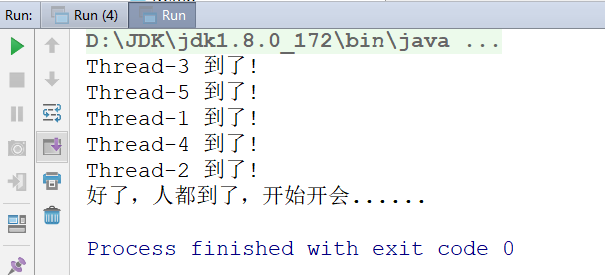

# day08【JUC并发包，线程池，死锁，线程状态】

## 今日内容

* 并发包
* 死锁
* 线程池
* 线程状态
* 等待与唤醒
* Timer实现定时任务


## 教学目标 

- [ ] 能够描述CountDownLatch类的作用
- [ ] 能够描述CyclicBarrier类的作用
- [ ] 能够表述Semaphore类的作用
- [ ] 能够描述Exchanger类的作用
- [ ] 能够描述Java中线程池运行原理
- [ ] 能够描述死锁产生的三个条件
- [ ] 能够说出线程6个状态的名称
- [ ] 能够理解等待唤醒案例
- [ ] 能够使用Timer类实现定时任务


# 第一章 并发包

## 1.1 CountDownLatch

CountDownLatch允许一个或多个线程等待其他线程完成操作。

例如：线程1要执行打印：A和C，线程2要执行打印：B，但线程1在打印A后，要线程2打印B之后才能打印C，所以：线程1在打印A后，必须等待线程2打印完B之后才能继续执行。


CountDownLatch构造方法:

```java
public CountDownLatch(int count)// 初始化一个指定计数器的CountDownLatch对象
```

CountDownLatch重要方法:

```java
public void await() throws InterruptedException// 让当前线程等待
public void countDown()	// 计数器进行减1
```

- **示例**
  1). 制作线程1：

~~~java
public class ThreadA extends Thread {
    private CountDownLatch down ;
    public ThreadA(CountDownLatch down) {
        this.down = down;
    }
    @Override
    public void run() {
        System.out.println("A");
        try {
            down.await();
        } catch (InterruptedException e) {
            e.printStackTrace();
        }
        System.out.println("C");
    }
}
~~~

2). 制作线程2：

~~~java
public class ThreadB extends Thread {
    private CountDownLatch down ;
    public ThreadB(CountDownLatch down) {
        this.down = down;
    }
    @Override
    public void run() {
        System.out.println("B");
        down.countDown();
    }
}
~~~

3).制作测试类：

~~~java
public class Demo {
    public static void main(String[] args) {
        CountDownLatch down = new CountDownLatch(1);//创建1个计数器
        new ThreadA(down).start();
        new ThreadB(down).start();
    }
}
~~~

4). 执行结果：
会保证按：A B C的顺序打印。

说明：

CountDownLatch中count down是倒数的意思，latch则是门闩的含义。整体含义可以理解为倒数的门栓，似乎有一点“三二一，芝麻开门”的感觉。

CountDownLatch是通过一个计数器来实现的，每当一个线程完成了自己的任务后，可以调用countDown()方法让计数器-1，当计数器到达0时，调用CountDownLatch。

await()方法的线程阻塞状态解除，继续执行。


## 1.2 CyclicBarrier

### 概述

CyclicBarrier的字面意思是可循环使用（Cyclic）的屏障（Barrier）。它要做的事情是，让一组线程到达一个屏障（也可以叫同步点）时被阻塞，直到最后一个线程到达屏障时，屏障才会开门，所有被屏障拦截的线程才会继续运行。

例如：公司召集5名员工开会，等5名员工都到了，会议开始。

 我们创建5个员工线程，1个开会线程，几乎同时启动，使用CyclicBarrier保证5名员工线程全部执行后，再执行开会线程。

CyclicBarrier构造方法：

```java
public CyclicBarrier(int parties, Runnable barrierAction)// 用于在线程到达屏障时，优先执行barrierAction，方便处理更复杂的业务场景
```

CyclicBarrier重要方法：

```java
public int await()// 每个线程调用await方法告诉CyclicBarrier我已经到达了屏障，然后当前线程被阻塞
```

- **示例代码：**
  1). 制作员工线程：

~~~java
public class PersonThread extends Thread {
	private CyclicBarrier cbRef;
	public PersonThread(CyclicBarrier cbRef) {
		this.cbRef = cbRef;
	}
	@Override
	public void run() {
		try {
			Thread.sleep((int) (Math.random() * 1000));
			System.out.println(Thread.currentThread().getName() + " 到了! ");
			cbRef.await();
		} catch (InterruptedException e) {
			e.printStackTrace();
		} catch (BrokenBarrierException e) {
			e.printStackTrace();
		}
	}
}
~~~

2). 制作开会线程：

~~~java
public class MeetingThread extends Thread {
    @Override
    public void run() {
        System.out.println("好了，人都到了，开始开会......");
    }
}
~~~

3). 制作测试类：

~~~java
public class Demo {
	public static void main(String[] args) {
		CyclicBarrier cbRef = new CyclicBarrier(5, new MeetingThread());//等待5个线程执行完毕，再执行MeetingThread
		PersonThread p1 = new PersonThread(cbRef);
		PersonThread p2 = new PersonThread(cbRef);
		PersonThread p3 = new PersonThread(cbRef);
		PersonThread p4 = new PersonThread(cbRef);
		PersonThread p5 = new PersonThread(cbRef);
		p1.start();
		p2.start();
		p3.start();
		p4.start();
		p5.start();
	}
}
~~~

4). 执行结果：




### 使用场景

使用场景：CyclicBarrier可以用于多线程计算数据，最后合并计算结果的场景。

需求：使用两个线程读取2个文件中的数据，当两个文件中的数据都读取完毕以后，进行数据的汇总操作。


## 1.3 Semaphore

Semaphore的主要作用是控制线程的并发数量。

synchronized可以起到"锁"的作用，但某个时间段内，只能有一个线程允许执行。

Semaphore可以设置同时允许几个线程执行。

Semaphore字面意思是信号量的意思，它的作用是控制访问特定资源的线程数目。

Semaphore构造方法：

```java
public Semaphore(int permits)						permits 表示许可线程的数量
public Semaphore(int permits, boolean fair)			fair 表示公平性，如果这个设为 true 的话，下次执行的线程会是等待最久的线程
```

Semaphore重要方法：

```java
public void acquire() throws InterruptedException	表示获取许可
public void release()								release() 表示释放许可
```


- **示例一：同时允许1个线程执行**

1). 制作一个Service类：

~~~java
public class Service {
    private Semaphore semaphore = new Semaphore(1);
    //1表示许可的意思，表示最多允许1个线程执行acquire()和release()之间的内容
    
    public void testMethod() {
        try {
            semaphore.acquire();
            System.out.println(Thread.currentThread().getName()
                    + " 进入 时间=" + System.currentTimeMillis());
            Thread.sleep(1000);
            System.out.println(Thread.currentThread().getName()
                    + "   结束 时间=" + System.currentTimeMillis());
            semaphore.release();
			//acquire()和release()方法之间的代码为"同步代码"
        } catch (InterruptedException e) {
            e.printStackTrace();
        }
    }
}
~~~

2). 制作线程类：

~~~java
public class ThreadA extends Thread {
	private Service service;
	public ThreadA(Service service) {
		super();
		this.service = service;
	}
	@Override
	public void run() {
		service.testMethod();
	}
}
~~~


3). 测试类：

~~~java
public class Demo {
	public static void main(String[] args) {
		Service service = new Service();
        //启动5个线程
		for (int i = 1; i <= 5; i++) {
			ThreadA a = new ThreadA(service);
			a.setName("线程 " + i);
			a.start();//5个线程会同时执行Service的testMethod方法，而某个时间段只能有1个线程执行
		}
	}
}
~~~

4). 结果：


- **示例二：同时允许2个线程同时执行**
  1). 修改Service类，将new Semaphore(1)改为2即可：

~~~java
public class Service {
    private Semaphore semaphore = new Semaphore(2);
    //2表示许可的意思，表示最多允许2个线程执行acquire()和release()之间的内容
    
    public void testMethod() {
        try {
            semaphore.acquire();
            System.out.println(Thread.currentThread().getName()
                    + " 进入 时间=" + System.currentTimeMillis());
            Thread.sleep(5000);
            System.out.println(Thread.currentThread().getName()
                    + "   结束 时间=" + System.currentTimeMillis());
            semaphore.release();
			//acquire()和release()方法之间的代码为"同步代码"
        } catch (InterruptedException e) {
            e.printStackTrace();
        }
    }
}
~~~

2). 再次执行结果：


## 1.4 Exchanger

### 概述

Exchanger（交换者）是一个用于线程间协作的工具类。Exchanger用于进行线程间的数据交换。

这两个线程通过exchange方法交换数据，如果第一个线程先执行exchange()方法，它会一直等待第二个线程也执行exchange方法，当两个线程都到达同步点时，这两个线程就可以交换数据，将本线程生产出来的数据传递给对方。

Exchanger构造方法：

```java
public Exchanger()
```

Exchanger重要方法：

```java
public V exchange(V x)
```

- **示例一：exchange方法的阻塞特性**

1).制作线程A，并能够接收一个Exchanger对象：

~~~java
public class ThreadA extends Thread {
	private Exchanger<String> exchanger;
	public ThreadA(Exchanger<String> exchanger) {
		super();
		this.exchanger = exchanger;
	}
	@Override
	public void run() {
		try {
			System.out.println("线程A欲传递值'礼物A'给线程B，并等待线程B的值...");
			System.out.println("在线程A中得到线程B的值=" + exchanger.exchange("礼物A"));

		} catch (InterruptedException e) {
			e.printStackTrace();
		}
	}

}
~~~

2). 制作main()方法：

~~~java
public class Demo {
	public static void main(String[] args) {
		Exchanger<String> exchanger = new Exchanger<String>();
		ThreadA a = new ThreadA(exchanger);
		a.start();
	}
}
~~~

3).执行结果：


- **示例二：exchange方法执行交换**

1).制作线程A：

~~~java
public class ThreadA extends Thread {
	private Exchanger<String> exchanger;
	public ThreadA(Exchanger<String> exchanger) {
		super();
		this.exchanger = exchanger;
	}
	@Override
	public void run() {
		try {
			System.out.println("线程A欲传递值'礼物A'给线程B，并等待线程B的值...");
			System.out.println("在线程A中得到线程B的值=" + exchanger.exchange("礼物A"));
		} catch (InterruptedException e) {
			e.printStackTrace();
		}
	}
}
~~~

2).制作线程B：

~~~java
public class ThreadB extends Thread {
	private Exchanger<String> exchanger;
	public ThreadB(Exchanger<String> exchanger) {
		super();
		this.exchanger = exchanger;
	}
	@Override
	public void run() {
		try {
			System.out.println("线程B欲传递值'礼物B'给线程A，并等待线程A的值...");
			System.out.println("在线程B中得到线程A的值=" + exchanger.exchange("礼物B"));

		} catch (InterruptedException e) {
			e.printStackTrace();
		}
	}
}
~~~

3).制作测试类：

~~~java
public class Demo {
	public static void main(String[] args) throws InterruptedException {
		Exchanger<String> exchanger = new Exchanger<String>();
		ThreadA a = new ThreadA(exchanger);
		ThreadB b = new ThreadB(exchanger);
		a.start();
		b.start();
	}
}
~~~

4).执行结果：


- **示例三：exchange方法的超时**

1).制作线程A：

~~~java
public class ThreadA extends Thread {
	private Exchanger<String> exchanger;
    
	public ThreadA(Exchanger<String> exchanger) {
		super();
		this.exchanger = exchanger;
	}
    
	@Override
	public void run() {
		try {
			System.out.println("线程A欲传递值'礼物A'给线程B，并等待线程B的值，只等5秒...");
			System.out.println("在线程A中得到线程B的值 =" + exchanger.exchange("礼物A",5, TimeUnit.SECONDS));
			System.out.println("线程A结束！");
		} catch (InterruptedException e) {
			e.printStackTrace();
		} catch (TimeoutException e) {
			System.out.println("5秒钟没等到线程B的值，线程A结束！");
		}
	}
}
~~~

2).制作测试类：

~~~java
public class Run {
	public static void main(String[] args) {
		Exchanger<String> exchanger = new Exchanger<String>();
		ThreadA a = new ThreadA(exchanger);
		a.start();
	}
}
~~~

3).测试结果：


### 使用场景

使用场景：可以做数据校对工作

需求：比如我们需要将纸制银行流水通过人工的方式录入成电子银行流水。为了避免错误，采用AB岗两人进行录入，录入到两个文件中，系统需要加载这两个文件，

并对两个文件数据进行校对，看看是否录入一致，


# 第二章 线程池方式

## 2.1 线程池的思想 


我们使用线程的时候就去创建一个线程，这样实现起来非常简便，但是就会有一个问题：

如果并发的线程数量很多，并且每个线程都是执行一个时间很短的任务就结束了，这样频繁创建线程就会大大降低系统的效率，因为频繁创建线程和销毁线程需要时间。

那么有没有一种办法使得线程可以复用，就是执行完一个任务，并不被销毁，而是可以继续执行其他的任务？

在Java中可以通过线程池来达到这样的效果。今天我们就来详细讲解一下Java的线程池。


## 2.2 线程池概念

- **线程池：**其实就是一个容纳多个线程的容器，其中的线程可以反复使用，省去了频繁创建线程对象的操作，无需反复创建线程而消耗过多资源。

由于线程池中有很多操作都是与优化资源相关的，我们在这里就不多赘述。我们通过一张图来了解线程池的工作原理：


合理利用线程池能够带来三个好处：

1. 降低资源消耗。减少了创建和销毁线程的次数，每个工作线程都可以被重复利用，可执行多个任务。
2. 提高响应速度。当任务到达时，任务可以不需要的等到线程创建就能立即执行。
3. 提高线程的可管理性。可以根据系统的承受能力，调整线程池中工作线线程的数目，防止因为消耗过多的内存，而把服务器累趴下(每个线程需要大约1MB内存，线程开的越多，消耗的内存也就越大，最后死机)。


## 2.3 线程池的使用

Java里面线程池的顶级接口是`java.util.concurrent.Executor`，但是严格意义上讲`Executor`并不是一个线程池，而只是一个执行线程的工具。真正的线程池接口是`java.util.concurrent.ExecutorService`。

要配置一个线程池是比较复杂的，尤其是对于线程池的原理不是很清楚的情况下，很有可能配置的线程池不是较优的，因此在`java.util.concurrent.Executors`线程工厂类里面提供了一些静态工厂，生成一些常用的线程池。官方建议使用Executors工程类来创建线程池对象。

Executors类中有个创建线程池的方法如下：

- `public static ExecutorService newFixedThreadPool(int nThreads)`：返回线程池对象。(创建的是有界线程池,也就是池中的线程个数可以指定最大数量)

获取到了一个线程池ExecutorService 对象，那么怎么使用呢，在这里定义了一个使用线程池对象的方法如下：

- `public Future<?> submit(Runnable task)`:获取线程池中的某一个线程对象，并执行

  > Future接口：用来记录线程任务执行完毕后产生的结果。

使用线程池中线程对象的步骤：

1. 创建线程池对象。
2. 创建Runnable接口子类对象。(task)
3. 提交Runnable接口子类对象。(take task)
4. 关闭线程池(一般不做)。

**Runnable实现类代码：**

```java
public class MyRunnable implements Runnable {
    @Override
    public void run() {
        System.out.println("我要一个教练");
        try {
            Thread.sleep(2000);
        } catch (InterruptedException e) {
            e.printStackTrace();
        }
        System.out.println("教练来了： " + Thread.currentThread().getName());
        System.out.println("教我游泳,教完后，教练回到了游泳池");
    }
}
```

线程池测试类：

```java
public class ThreadPoolDemo {
    public static void main(String[] args) {
        // 创建线程池对象
        ExecutorService service = Executors.newFixedThreadPool(2);//包含2个线程对象
        // 创建Runnable实例对象
        MyRunnable r = new MyRunnable();

        //自己创建线程对象的方式
        // Thread t = new Thread(r);
        // t.start(); ---> 调用MyRunnable中的run()

        // 从线程池中获取线程对象,然后调用MyRunnable中的run()
        service.submit(r);
        // 再获取个线程对象，调用MyRunnable中的run()
        service.submit(r);
        service.submit(r);
        // 注意：submit方法调用结束后，程序并不终止，是因为线程池控制了线程的关闭。
        // 将使用完的线程又归还到了线程池中
        // 关闭线程池
        //service.shutdown();
    }
}
```

**Callable测试代码:**

- `<T> Future<T> submit(Callable<T> task)` : 获取线程池中的某一个线程对象，并执行.

  Future : 表示计算的结果.

- `V get()  ` : 获取计算完成的结果。

```java
public class ThreadPoolDemo2 {
    public static void main(String[] args) throws Exception {
        // 创建线程池对象
      ExecutorService service = Executors.newFixedThreadPool(2);//包含2个线程对象

        // 创建Runnable实例对象
        Callable<Double> c = new Callable<Double>() {
            @Override
            public Double call() throws Exception {
                return Math.random();
            }
        };

        // 从线程池中获取线程对象,然后调用Callable中的call()
        Future<Double> f1 = service.submit(c);
        // Futur 调用get() 获取运算结果
        System.out.println(f1.get());

        Future<Double> f2 = service.submit(c);
        System.out.println(f2.get());

        Future<Double> f3 = service.submit(c);
        System.out.println(f3.get());
    }
}
```


## 2.4 线程池的练习

**需求:** 使用线程池方式执行任务,返回1-n的和

**分析:** 因为需要返回求和结果,所以使用Callable方式的任务

**代码:**

```java
public class Demo04 {
    public static void main(String[] args) throws ExecutionException, InterruptedException {
        ExecutorService pool = Executors.newFixedThreadPool(3);

        SumCallable sc = new SumCallable(100);
        Future<Integer> fu = pool.submit(sc);
        Integer integer = fu.get();
        System.out.println("结果: " + integer);
        
        SumCallable sc2 = new SumCallable(200);
        Future<Integer> fu2 = pool.submit(sc2);
        Integer integer2 = fu2.get();
        System.out.println("结果: " + integer2);

        pool.shutdown();
    }
}
```


**SumCallable.java**

```java
public class SumCallable implements Callable<Integer> {
    private int n;

    public SumCallable(int n) {
        this.n = n;
    }

    @Override
    public Integer call() throws Exception {
        // 求1-n的和?
        int sum = 0;
        for (int i = 1; i <= n; i++) {
            sum += i;
        }
        return sum;
    }
}
```


# 第三章 死锁

## 3.1 什么是死锁

在多线程程序中,使用了多把锁,造成线程之间相互等待.程序不往下走了。


## 3.2 产生死锁的条件

1.有多把锁
2.有多个线程
3.有同步代码块嵌套


## 3.3 死锁代码

```java
public class Demo05 {
    public static void main(String[] args) {
        MyRunnable mr = new MyRunnable();

        new Thread(mr).start();
        new Thread(mr).start();
    }
}

class MyRunnable implements Runnable {
    Object objA = new Object();
    Object objB = new Object();

    /*
    嵌套1 objA
    嵌套1 objB
    嵌套2 objB
    嵌套1 objA
     */
    @Override
    public void run() {
        synchronized (objA) {
            System.out.println("嵌套1 objA");
            synchronized (objB) {// t2, objA, 拿不到B锁,等待
                System.out.println("嵌套1 objB");
            }
        }

        synchronized (objB) {
            System.out.println("嵌套2 objB");
            synchronized (objA) {// t1 , objB, 拿不到A锁,等待
                System.out.println("嵌套2 objA");
            }
        }
    }
}
```

注意:**我们应该尽量避免死锁**


# 第四章 线程状态

## 4.1 线程状态概述

线程由生到死的完整过程：技术素养和面试的要求。

当线程被创建并启动以后，它既不是一启动就进入了执行状态，也不是一直处于执行状态。在线程的生命周期中，有几种状态呢？在API中`java.lang.Thread.State`这个枚举中给出了六种线程状态：

这里先列出各个线程状态发生的条件，下面将会对每种状态进行详细解析

| 线程状态                | 导致状态发生条件                                             |
| ----------------------- | ------------------------------------------------------------ |
| NEW(新建)               | 线程刚被创建，但是并未启动。还没调用start方法。MyThread t = new MyThread只有线程对象，没有线程特征。 |
| Runnable(可运行)        | 线程可以在java虚拟机中运行的状态，可能正在运行自己代码，也可能没有，这取决于操作系统处理器。调用了t.start()方法   ：就绪（经典教法） |
| Blocked(锁阻塞)         | 当一个线程试图获取一个对象锁，而该对象锁被其他的线程持有，则该线程进入Blocked状态；当该线程持有锁时，该线程将变成Runnable状态。 |
| Waiting(无限等待)       | 一个线程在等待另一个线程执行一个（唤醒）动作时，该线程进入Waiting状态。进入这个状态后是不能自动唤醒的，必须等待另一个线程调用notify或者notifyAll方法才能够唤醒。 |
| Timed Waiting(计时等待) | 同waiting状态，有几个方法有超时参数，调用他们将进入Timed Waiting状态。这一状态将一直保持到超时期满或者接收到唤醒通知。带有超时参数的常用方法有Thread.sleep 、Object.wait。 |
| Teminated(被终止)       | 因为run方法正常退出而死亡，或者因为没有捕获的异常终止了run方法而死亡。 |


我们不需要去研究这几种状态的实现原理，我们只需知道在做线程操作中存在这样的状态。那我们怎么去理解这几个状态呢，新建与被终止还是很容易理解的，我们就研究一下线程从Runnable（可运行）状态与非运行状态之间的转换问题。


## 4.2 睡眠sleep方法

我们看到状态中有一个状态叫做计时等待，可以通过Thread类的方法来进行演示.

`public static void  sleep(long time)`  让当前线程进入到睡眠状态，到毫秒后自动醒来继续执行

```java
public class Test{
  public static void main(String[] args){
    for(int i = 1;i<=5;i++){
      	Thread.sleep(1000);
        System.out.println(i)   
    } 
  }
}
```

这时我们发现主线程执行到sleep方法会休眠1秒后再继续执行。


## 4.3 等待和唤醒

Object类的方法

`public void wait()` : 让当前线程进入到等待状态 此方法必须锁对象调用.

```java
public class Demo1_wait {
    public static void main(String[] args) throws InterruptedException {
	   // 步骤1 : 子线程开启,进入无限等待状态, 没有被唤醒,无法继续运行.
        new Thread(() -> {
            try {

                System.out.println("begin wait ....");
                synchronized ("") {
                    "".wait();
                }
                System.out.println("over");
            } catch (Exception e) {
            }
        }).start();
    }
```

`public void notify()` : 唤醒当前锁对象上等待状态的线程  此方法必须锁对象调用.

```java
public class Demo2_notify {
    public static void main(String[] args) throws InterruptedException {
	   // 步骤1 : 子线程开启,进入无限等待状态, 没有被唤醒,无法继续运行.
        new Thread(() -> {
            try {

                System.out.println("begin wait ....");
                synchronized ("") {
                    "".wait();
                }
                System.out.println("over");
            } catch (Exception e) {
            }
        }).start();

        //步骤2:  加入如下代码后, 3秒后,会执行notify方法, 唤醒wait中线程.
        Thread.sleep(3000);
        new Thread(() -> {
            try {
                synchronized ("") {
                    System.out.println("唤醒");
                    "".notify();
                }
            } catch (Exception e) {
            }
        }).start();
    }
}
```


## 4.4 等待唤醒案例（包子铺卖包子）

```java
定义一个集合，包子铺线程完成生产包子，包子添加到集合中；吃货线程完成购买包子，包子从集合中移除。
1. 当包子没有时（包子状态为false），吃货线程等待.
2. 包子铺线程生产包子（即包子状态为true），并通知吃货线程（解除吃货的等待状态）
```

**代码示例：**

生成包子类：

```java
public class BaoZiPu extends Thread{
    private List<String> list ;
    public BaoZiPu(String name,ArrayList<String> list){
        super(name);
        this.list = list;
    }
    @Override
    public void run() {
        	int i = 0; 
            while(true){
                    //list作为锁对象
                    synchronized (list){
                        if(list.size()>0){
                            //存元素的线程进入到等待状态
                            try {
                                list.wait();
                            } catch (InterruptedException e) {
                                e.printStackTrace();
                            }
                        }

                        //如果线程没进入到等待状态 说明集合中没有元素
                        //向集合中添加元素
                        list.add("包子"+i++);
                        System.out.println(list);
                        //集合中已经有元素了 唤醒获取元素的线程
                        list.notify();
                    }
                }
            }
    }
}
```

消费包子类：

```java
public class ChiHuo extends Thread {

    private List<String> list ;
    public ChiHuo(String name,ArrayList<String> list){
        super(name);
        this.list = list;
    }

    @Override
    public void run() {
 			//为了能看到效果 写个死循环
                while(true){
                    //由于使用的同一个集合 list作为锁对象
                    synchronized (list){
                        //如果集合中没有元素 获取元素的线程进入到等待状态
                        if(list.size()==0){
                            try {
                                list.wait();
                            } catch (InterruptedException e) {
                                e.printStackTrace();
                            }
                        }
                        //如果集合中有元素 则获取元素的线程获取元素(删除)
                        list.remove(0);
                        //打印集合 集合中没有元素了
                        System.out.println(list);
                        //集合中已经没有元素 则唤醒添加元素的线程 向集合中添加元素
                        list.notify();
                    }
                }
            }
    }
}
```

测试类：

```java
public class Demo {
    public static void main(String[] args) {
        //等待唤醒案例
        List<String> list = new ArrayList<>();
        // 创建线程对象        
         BaoZiPu bzp = new BaoZiPu("包子铺",list);
        ChiHuo ch = new ChiHuo("吃货",list);
        // 开启线程
        bzp.start();
        ch.start();
    }
}
```


# 第五章 定时器

## 5.1 定时器概述

​	定时器，可以设置线程在某个时间执行某件事情，或者某个时间开始，每间隔指定的时间反复的做某件事情


## 5.2 定时器Timer类

​		java.util.Timer类：线程调度任务以供将来在后台线程中执行的功能。 任务可以安排一次执行，或者定期重复执行。

> 1.构造方法

~~~java
public Timer()：构造一个定时器
~~~

> 2.成员方法

| 返回值 | 方法名                                                 | 说明                                                         |
| ------ | ------------------------------------------------------ | ------------------------------------------------------------ |
| void   | schedule(TimerTask task, long delay)                   | 在指定的延迟之后安排指定的任务执行。                         |
| void   | schedule(TimerTask task, long delay,  long period)     | 在指定 *的延迟*之后开始，重新 *执行固定延迟执行*的指定任务。 |
| void   | schedule(TimerTask task, Date time)                    | 在指定的时间安排指定的任务执行。                             |
| void   | schedule(TimerTask task, Date firstTime,  long period) | 从指定的时间开始，对指定的任务执行重复的 *固定延迟执行* 。   |

~~~java
public class Test{
    public static void main(String[] args){
        //1.设置一个定时器，2秒后启动，只执行一次
        Timer t = new Timer();
        t.schedule(new TimerTask(){
            @Override
            public void run(){
                for(int i = 10;i >= 0 ; i--){
                    System.out.println("倒数：" + i);
                    try{
                        Thread.sleep(1000);
                    }catch(Exception e){}
                }
                System.out.println("嘭......嘭......");
                //任务执行完毕，终止计时器
                t.cancel();
            }
        },2000);
        
        //2.设置一个定时器，5秒后开始执行，每一秒执行一次
        Timer t2 = new Timer();
        t2.schedule(new TimerTask(){
            @Override
            public void run(){
                SimpleDateFormat sdf = new SimpleDateFormat("yyyy-MM-dd HH:mm:ss");
                System.out.println(sdf.format(new Date()));
            }
        },5000,1000);
        
        //3.设置一个定时器，在2030年01月01日零时开始执行，每隔24小时执行一次
        Timer t3 = new Timer();
        Calendar c = new GregorianCalendar(2030, 1-1, 1, 0, 0, 0);
        Date d = c.getTime();
        
        t3.schedule(new TimerTask(){
            @Override
            public void run(){
                System.out.println("搜索全盘......");
            }
        },d,1000 * 3600 * 24);
    }
}
~~~
