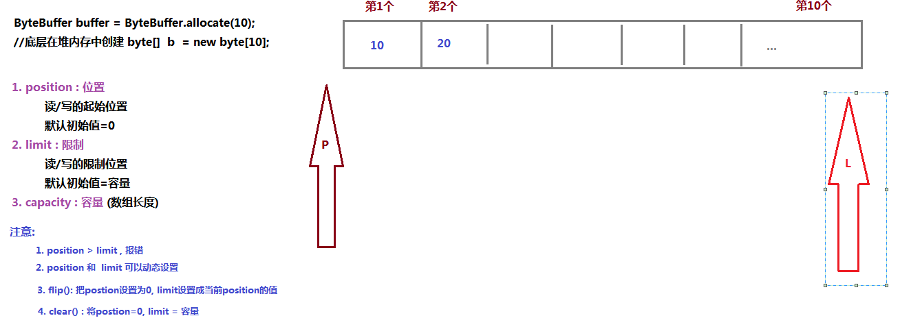

# day13【NIO】

## 今日内容

- NIO

## 教学目标

- [ ] 能够描述同步和异步的概念
- [ ] 能够描述阻塞和非阻塞的概念
- [ ] 能够描述在NIO中Buffer和Channel之间的关系
- [ ] 能够创建ByteBuffer缓冲区
- [ ] 能够描述Buffer的核心四个字段
- [ ] 能够使用ByteBuffer存取数据的方法
- [ ] 能够根据文件字节流或RandomAccessFile需要获取FileChannel对象
- [ ] 能够结合字节缓冲流和文件通道完成文件的拷贝
- [ ] 能够使用MappedByteBuffer实现高效读写
- [ ] 能够使用ServerSocketChannel和SocketChannel实现连接并收发信息

# 第一章 NIO

```markdown
# 1. 同步和异步
	你去银行柜台取钱,需要排队
1). 同步 (Synchronous): 如果是你主动获取排队的结果
2). 异步(Asynchronous) : 如果是柜台主动通知你,你是被动接收
# 2. 阻塞和非阻塞
	你去银行柜台取钱,排队
1). 阻塞 (blocking): 你在等待结果的过程中,你不能干别的事,你唯一能做的就是等
2). 非阻塞 (non-blocking): 你看有人排队就走了,没人排队就取钱, 你不会去等

# 3. 综合
	你去银行柜台取钱,排队
1). 同步阻塞 : 你需要主动去询问排队结果,如果还没轮到,继续等
2). 同步非阻塞 : 你需要主动去询问排队结果, 问完了轮到你了就取钱,轮不到就走了
		为了确保能够取到钱: 轮询机制
		你需要主动去询问排队结果, 问完了轮到你了就取钱,轮不到就走了去逛街,逛街的同时会是不是的回来看一下,一直到取到钱为止(效率其实也不高)
3). 异步阻塞: 柜台主动通知你,你是被动接收,但是你依然在那里等(这种方式很傻,开发中很少见到)
4). 异步非阻塞: 柜台主动通知你,你是被动接收, 然后你就去逛街了,柜台通知你好了你再去取钱
		(效率最高的)
# 4. 新IO
1. BIO : blocking IO 同步阻塞的IO流
2. NIO : non-blocking IO 同步非阻塞的IO流 (JDK1.4)
		非阻塞
3. AIO : Asynchronous IO 异步非阻塞的IO流 (JDK1.8)
		异步
		

```


```markdown
# NIO主要有三个核心部分组成：
1. buffer缓冲区   ->  byte[] buffer = new byte[1024]
		读到的内容放在缓冲区
		将缓冲区写出去
2. Channel管道   -> Socket
		双向的,既可以读,也可以写
	 -> 同步非阻塞
	 
3. Selector选择器
		多路复用

```


# 第二章 Buffer类（缓冲区）

## 1 Buffer概述


## 2 创建ByteBuffer

```java
package com.itheima01.buffer;

import java.nio.ByteBuffer;

/*
*
*  # 直接缓冲区 和 间接缓冲区
*  0. 前提:
*       java程序  -> JVM  -> 系统
*       JVM 出现 : 跨平台 (windows系统,unix ,linux....)
*
*       java程序 -> JVM(内存: 堆,栈,方法区,本地方法栈, 程序计数器) 向系统申请
*
*               -> 系统 (内存)
*
*   1. 间接缓冲区: 从JVM内存创建的缓冲区
*           byte[] buffer = new byte[1024]
*           buffer数据写到硬盘上: jvm内存 -> 系统内存  -> 硬盘
*
*   2. 直接缓冲区: 系统内存创建的缓冲区
*
*   3. 优劣
*       间接缓冲区 优势:
*           创建和释放  缓冲区快
*
*       间接缓冲区 劣势:
*           读写效率慢
 *
*
* *  # ByteBuffer的创建
 *
 *  1. static ByteBuffer allocate(int capacity) 分配一个新的字节缓冲区。
 *             间接缓冲区
 *  2. static ByteBuffer allocateDirect(int capacity) 分配新的直接字节缓冲区。
 *             直接缓冲区
 *  3. static ByteBuffer wrap(byte[] array) 将 byte 数组包装到缓冲区中。
 *             间接缓冲区
 * */
public class Demo01 {

    public static void main(String[] args) {
            // 1. 间接缓冲区(JVM内存中)  [0,0,0...]  byte[] 
        ByteBuffer buffer1 = ByteBuffer.allocate(10);
        //java.nio.HeapByteBuffer[pos=0 lim=10 cap=10]
        System.out.println(buffer1);
            //2. 直接缓冲区(系统内存中)
        ByteBuffer buffer2 = ByteBuffer.allocateDirect(10);
        //java.nio.DirectByteBuffer[pos=0 lim=10 cap=10]
        System.out.println(buffer2);
            //3.  间接缓冲区
        //java.nio.HeapByteBuffer[pos=0 lim=6 cap=6]
        ByteBuffer buffer3 = ByteBuffer.wrap("呵呵".getBytes());
        System.out.println(buffer3);

    }
}

```


## 3 ByteBuffer数据添加和获取

  


```java
package com.itheima01.buffer;

import java.nio.ByteBuffer;
import java.util.Arrays;

public class Demo02 {

    public static void main(String[] args) {
        ByteBuffer buffer = ByteBuffer.allocate(10);
        /*
            java.nio.HeapByteBuffer[pos=0 lim=10 cap=10]
                position = 0 (读/写起始位)
                limit = 10 (读/写限制位)
                capacity=10 (容量: 数组长度)
         */
        System.out.println(buffer);
        /*
            存数据
            ByteBuffer put(byte b)：向当前可用位置添加数据。
            ByteBuffer put(byte[] byteArray)：向当前可用位置添加一个byte[]数组
            ByteBuffer put(byte[] byteArray,int offset,int len)：添加一个byte[]数组的一部分
         */
        buffer.put((byte)10);
        //java.nio.HeapByteBuffer[pos=1 lim=10 cap=10]
        System.out.println(buffer);
        buffer.put((byte)20);
        //java.nio.HeapByteBuffer[pos=2 lim=10 cap=10]
        System.out.println(buffer);

        /*
        * 取数据
        *   public byte[] array() 返回实现此缓冲区的 byte 数组
            public byte get() 当前位置+1,读取此缓冲区当前位置的字节，
        * */
        byte[] array = buffer.array();
        //[10, 20, 0, 0, 0, 0, 0, 0, 0, 0]
        System.out.println(Arrays.toString(array));
        //先limit=position, 然后position=0,
        buffer.flip();
        byte b = buffer.get();
        System.out.println(b); // 10
        b = buffer.get();
        System.out.println(b); // 20
        //java.nio.HeapByteBuffer[pos=2 lim=2 cap=10]
        System.out.println(buffer);
//        b = buffer.get(); //pos > lim , 所以java.nio.BufferUnderflowException
//        System.out.println(b);

        //position=0, limit=容量
        buffer.clear();
        //java.nio.HeapByteBuffer[pos=0 lim=10 cap=10]
        System.out.println(buffer);
        byte[] array2 = buffer.array();
        //[10, 20, 0, 0, 0, 0, 0, 0, 0, 0]
        System.out.println(Arrays.toString(array2));
    }
}

```


## 4 Buffere核心字段

Buffer类维护了4个核心字段来描述其内在数组的信息。它们是：

- **容量Capacity**

  **缓冲区能够容纳的数据元素的最大数量**。容量在缓冲区创建时被设定，并且永远不能被改变。(不能被改变的原因也很简单，底层是数组嘛)

- **上界Limit**

  **缓冲区里的数据的总数**，代表了当前缓冲区中一共有多少数据。 (limit 后数据不能进行读写)

- **位置Position**

  **下一个要被读或写的元素的位置**。Position会自动由相应的 `get( )`和 `put( )`函数更新。

- **标记Mark**

  表示记录当前position的位置。可以通过reset()恢复到mark的位置

他们的关系 0<= mark <= position <= limit <= capacity


```java
package com.itheima01.buffer;

import java.nio.ByteBuffer;
/*
*   总结:
*       1. position: 位置
*           读/写的起始位
*
*       2. limit : 限制
*           读/写的限制位
*
*       3. capacity 容量
*           数组的长度
*
*       4. mark : 标记
*           mark=当前position
*           配合reset使用: 不论position是多少,position=mark
*
*      一般
*      0 <= mark <= position <= limit <= capacity
*       mark > position
*
*     两个重要方法
*     1. flip()  limit = position,然后 position=0
*     2. clear()  position=0, limit=capacity
* */
public class Demo03 {

    public static void main(String[] args) {
//        method01();

//        method02();

//        method03();

        method04();
    }
    /*
    * - 标记mark是指：当调用缓冲区的reset()方法时，会将缓冲区的position位置重置为该索引。不能小于0，不能大于position。
     - public Buffer mark()：设置此缓冲区的标记为当前的position位置。

    * */
    private static void method04() {
        ByteBuffer buffer = ByteBuffer.allocate(10);
        //没有使用mark,先调用reset是没有意义的: Exception in thread "main" java.nio.InvalidMarkException
//        buffer.reset();
        byte[] b = {10,20};
        buffer.put(b);
        //position=2
        System.out.println(buffer);

        buffer.mark(); // mark=position=2

        byte[] b2 = {30,40,50};
        buffer.put(b2);
        //position=5
        System.out.println(buffer);
        buffer.reset(); // position=mark=2
        byte c = buffer.get();
        System.out.println(c);// 30


    }

    /*
    - public int position()：获取当前可写入位置索引。
    - public Buffer position(int p)：更改当前可写入位置索引。

    * */
    private static void method03() {
        byte[] b = {10,20,30,40,50};
        ByteBuffer buffer = ByteBuffer.wrap(b);
        //获取当前可以读写的索引 0
        System.out.println(buffer.position());

        buffer.position(2);

        byte element = buffer.get();
        // 30
        System.out.println(element);
    }

    /*
    * - public int limit()：获取此缓冲区的限制。
        - public Buffer limit(int newLimit)：设置此缓冲区的限制。
    * */
    private static void method02() {
        ByteBuffer buffer = ByteBuffer.allocate(10);
        //limit的默认初始值=10
        System.out.println(buffer.limit());//10
        //注意: position~limit是读写的范围, 且position不能大于limit
        buffer.limit(6);
        //java.nio.HeapByteBuffer[pos=0 lim=5 cap=10]
        System.out.println(buffer);

        buffer.put("呵呵".getBytes());
    }

    //获取容量
    private static void method01() {
        ByteBuffer buffer1 = ByteBuffer.allocate(10);
        System.out.println(buffer1.capacity());

        ByteBuffer buffer2 = ByteBuffer.wrap("呵呵".getBytes());
        System.out.println(buffer2.capacity());
    }
}

```


## 5 其它方法

- public int remaining()：获取position与limit之间的元素数【剩余空间】。
- public boolean isReadOnly()：获取当前缓冲区是否只读。
- public boolean isDirect()：获取当前缓冲区是否为直接缓冲区。
- public Buffer clear()：还原缓冲区的状态。
  - 将position设置为：0
  - 将限制limit设置为容量capacity；
  - 丢弃标记mark，设置为-1，表示无效标记。
- public Buffer flip()：缩小limit的范围。【重要】
  - 将limit设置为当前position位置；
  - 将当前position位置设置为0；
  - 丢弃标记。
- public Buffer rewind()：重置此缓冲区，让position回到位置0的状态。
  - 将position位置设置为：0
  - 限制limit不变。
  - 丢弃标记。


# 第三章 Channel（通道）

## 1 Channel概述


通道(Channel) 是用来传输数据的通路。举个例子，现在的从上海到北京的高铁，动车可以比作缓冲区，可以上下客。铁轨就好比Channel通道了。

因此切记，Channel通道**只负责传输数据、不直接操作数据的**，而操作数据都是由Buffer缓冲区来实现的！


通道的主要实现类
`java.nio.channels.Channel`:

​			|--`FileChannel`  用于读取、写入操作文件的通道。

​			|--`DatagramChannel`：读写UDP网络协议数据 


​			|--`SocketChannel` 针对面向流的连接套接字的可选择通道（TCP）

​			|--`ServerSocketChannel` 针对面向流的侦听套接字的可选择通道。（TCP）


## 2 FileChannel基本使用

```java
package com.itheima02.channel;

import java.io.FileInputStream;
import java.io.FileNotFoundException;
import java.io.IOException;
import java.nio.ByteBuffer;
import java.nio.channels.FileChannel;
import java.util.Arrays;

/*
* FileChannel : 基本操作
*   1. 先读
*
*   2. 后写
*
*   3. 文件复制
*
*   4. 大文件高效复制
* */
public class Demo01 {

    public static void main(String[] args) throws IOException {
//        method01();

        FileInputStream fis = new FileInputStream("day13/a.txt");
        /*
        *  FileChannel的获取: 可以直接通过 输入流/输入流到得到的
        *    输入流得到的管道 可以 读
        *    输出流得到的管道 可以 写
        * */
        FileChannel inChannel = fis.getChannel();

        ByteBuffer buffer = ByteBuffer.allocate(3);
        //读到的内容放到缓冲数组里,并返回读到的字节长度
        int length = inChannel.read(buffer);
        System.out.println(buffer); //java.nio.HeapByteBuffer[pos=3 lim=3 cap=3]

        System.out.println(Arrays.toString(buffer.array())); // [97, 98, 99]
        System.out.println(length); // 3

        buffer.clear();
        //java.nio.HeapByteBuffer[pos=0 lim=3 cap=3]
        System.out.println(buffer);
        length = inChannel.read(buffer);
        System.out.println(Arrays.toString(buffer.array())); // [97, 98, 99]
        System.out.println(length);

        buffer.flip();// pos=0,limit=2
        byte[] array = buffer.array();
        String str = new String(array, 0, buffer.limit());
        System.out.println(str);


    }

    private static void method01() throws IOException {
        FileInputStream fis = new FileInputStream("day13/a.txt");

        byte[] buffer = new byte[3];
        int length = fis.read(buffer);
        System.out.println(length);//3
        System.out.println(Arrays.toString(buffer));//[97, 98, 99]
        System.out.println(new String(buffer,0,length));//abc

        length = fis.read(buffer);
        System.out.println(length);//2
        System.out.println(Arrays.toString(buffer));//[100, 101, 99]
        System.out.println(new String(buffer,0,length));//de
    }
}

```


```java
package com.itheima02.channel;

import java.io.FileNotFoundException;
import java.io.FileOutputStream;
import java.io.IOException;
import java.nio.ByteBuffer;
import java.nio.channels.FileChannel;

public class Demo02 {

    public static void main(String[] args) throws IOException {

//        method01();

        FileOutputStream fos = new FileOutputStream("day13/b.txt");
        FileChannel outChannel = fos.getChannel();

        ByteBuffer buffer = ByteBuffer.wrap("abc".getBytes());
        outChannel.write(buffer);
        
        //java.nio.HeapByteBuffer[pos=3 lim=3 cap=3]
        System.out.println(buffer);
        
        outChannel.close();
        fos.close();
    }

    private static void method01() throws IOException {
        FileOutputStream fos = new FileOutputStream("day13/b.txt");

        byte[] buffer = {97,99,100};

        fos.write(buffer, 0,buffer.length );
        fos.close();
    }
}

```


```java
package com.itheima02.channel;

import java.io.FileInputStream;
import java.io.FileOutputStream;
import java.io.IOException;
import java.nio.ByteBuffer;
import java.nio.channels.FileChannel;

public class Demo03 {

    public static void main(String[] args) throws IOException {

        FileInputStream fis = new FileInputStream("day13/a.txt");
        FileOutputStream fos = new FileOutputStream("day13/c.txt");

        FileChannel inChannel = fis.getChannel();
        FileChannel outChannel = fos.getChannel();

        ByteBuffer buffer = ByteBuffer.allocate(1024);
        while( inChannel.read(buffer) != -1){
            buffer.flip();// position=0; limit=读到的字节数
            outChannel.write(buffer);// 读的范围 position~limit, 读完了postion=limit
            buffer.clear(); // position=0, limit= capacity
        }

        outChannel.close();
        inChannel.close();
        fos.close();
        fis.close();

    }
}

```


## 3 FileChannel结合MappedByteBuffer实现高效读写


### 复制2GB以下的文件

```java
package com.itheima02.channel;

import java.io.*;
import java.nio.MappedByteBuffer;
import java.nio.channels.FileChannel;

/*
*   RandomAccessFile
*       1. 支持随机访问的文件 (IO流)
*       文件索引可以任意调整
*       2. 支持双向操作: 即可写,也可读
*
*       应用: 多线程断点下载
*
*   缓冲区:
*       1. 直接 : 系统内存
*       2. 间接 : jvm内存
* */
public class Demo04 {

    public static void main(String[] args) throws IOException {
        long start = System.currentTimeMillis();
//        method01();//2255     7
         method02(); //621      13
        long end = System.currentTimeMillis();
        System.out.println(end-start);

    }

    private static void method02() throws IOException {

        //1.创建随机访问文件对象
//        RandomAccessFile inRaf = new RandomAccessFile("c:/test/test1.rar", "r");
//        RandomAccessFile outRaf = new RandomAccessFile("c:/test/test1_copy2.rar", "rw");
        RandomAccessFile inRaf = new RandomAccessFile("c:/test/柳岩.jpg", "r");
        RandomAccessFile outRaf = new RandomAccessFile("c:/test/柳岩2.jpg", "rw");

        //2.获取管道
        FileChannel inChannel = inRaf.getChannel();
        FileChannel outChannel = outRaf.getChannel();

        //3.获取文件大小 466619372字节
//        long length = inRaf.length();
        long size = inChannel.size();
//        System.out.println(size);

        //4. 创建系统内存缓冲区(直接缓冲区)
        MappedByteBuffer inMap = inChannel.map(FileChannel.MapMode.READ_ONLY, 0, size);
        MappedByteBuffer outMap = outChannel.map(FileChannel.MapMode.READ_WRITE, 0, size);

        //5. 数据映射: 读的缓冲区 映射 写的缓冲区
        for (int i = 0; i < size; i++) {
            //获取i索引的字节
            byte b = inMap.get(i);
            outMap.put(i, b);
        }

        //6. 释放资源

        outRaf.close();
        inRaf.close();

    }

    private static void method01() throws IOException {
//        FileInputStream fis = new FileInputStream("c:/test/test1.rar");
//        FileOutputStream fos = new FileOutputStream("c:/test/test1_copy.rar");
                FileInputStream fis = new FileInputStream("c:/test/柳岩.jpg");
        FileOutputStream fos = new FileOutputStream("c:/test/柳岩1.jpg");

        int length;
        byte[] buffer = new byte[1024];
        while((length = fis.read(buffer)) != -1){
            fos.write(buffer,0,length);
        }
        fos.close();
        fis.close();
    }
}

```


### **复制2GB以上文件**

```java
package com.itheima02.channel;

import java.io.*;
import java.nio.MappedByteBuffer;
import java.nio.channels.FileChannel;

/*
*   max int = 2147483647
*
*   刚才复制,只能最多复制2G文件
*
*   超过2G文件, 分块复制 -> 需要随机访问IO支持
* */
public class Demo05 {

    public static void main(String[] args) throws Exception {
        long start = System.currentTimeMillis();
//        method01(); //13303 ms
        method02();
        long end = System.currentTimeMillis();
        System.out.println(end - start);
    }

    private static void method01() throws IOException {
        RandomAccessFile inRaf = new RandomAccessFile("c:/test/test2.rar", "r");
        RandomAccessFile outRaf = new RandomAccessFile("c:/test/test2_copy1.rar", "rw");

        FileChannel inChannel = inRaf.getChannel();
        FileChannel outChannel = outRaf.getChannel();

        //设置一些参数
            //文件大小
        long size = inChannel.size();
            //每块大小 0.5G
        long everySize = 1024 * 1024 * 1024 ;
            //总块数
        long count = size%everySize==0?size/everySize:size/everySize+1;

        //逐块复制
        long startIndex = 0;
        long length = everySize;
        for (int i = 0; i < count; i++) {
            if(i == count-1){
                length = size - startIndex;
            }
            //直接缓冲区
            MappedByteBuffer inMap = inChannel.map(FileChannel.MapMode.READ_ONLY, startIndex, length);
            MappedByteBuffer outMap = outChannel.map(FileChannel.MapMode.READ_WRITE, startIndex, length);

            for (int j = 0; j < length; j++) {
                byte b = inMap.get(j);
                outMap.put(j,b);
            }
            startIndex+=everySize;
        }
        //释放资源
        outRaf.close();
        inRaf.close();
    }

    private static void method02() throws IOException {
        FileInputStream fis = new FileInputStream("c:/test/test2.rar");
        FileOutputStream fos = new FileOutputStream("c:/test/test2_copy2.rar");
//                FileInputStream fis = new FileInputStream("c:/test/柳岩.jpg");
//        FileOutputStream fos = new FileOutputStream("c:/test/柳岩1.jpg");

        int length;
        byte[] buffer = new byte[1024 * 1024];
        while((length = fis.read(buffer)) != -1){
            fos.write(buffer,0,length);
        }
        fos.close();
        fis.close();
    }
}

```


## 


## 4 ServerSocketChannel和SocketChannel收发信息

```java
package com.itheima03.socket;

import java.io.IOException;
import java.net.InetSocketAddress;
import java.nio.ByteBuffer;
import java.nio.channels.ServerSocketChannel;
import java.nio.channels.SocketChannel;

/*
* ServerSocketChannel和SocketChannel创建连接
* */
public class TcpChannelServer01 {

    public static void main(String[] args) throws IOException {
        //1. 开启一个服务端通道,并且绑定9988端口
        ServerSocketChannel ssc = ServerSocketChannel.open();
        ssc.bind(new InetSocketAddress(9988));

        //2. 等待客户端连接(默认也是阻塞)
        SocketChannel sc = ssc.accept();

        //3. 读取数据
        ByteBuffer buffer = ByteBuffer.allocate(1024);
        //读到的数据放在buffer中
        while( sc.read(buffer) != -1){ // ab
                // buffer.array() = {a,b,0,0,0}
            String str = new String(buffer.array(), 0, buffer.position());
//            buffer.flip();//limit=position=2 position=2
//            String str = new String(buffer.array(), 0, buffer.limit());
            System.out.println("收到客户端:" + str);
            buffer.clear(); // 如果收到内容>1024, 重置position和limit
        }
        //写数据
        ByteBuffer wrap = ByteBuffer.wrap("hello,来根华子".getBytes());
        sc.write(wrap);

        //4. 释放
        sc.close();
        ssc.close();
    }
}

```

```java
package com.itheima03.socket;

import java.io.IOException;
import java.net.InetSocketAddress;
import java.nio.ByteBuffer;
import java.nio.channels.SocketChannel;

public class TcpChannelClient01 {

    public static void main(String[] args) throws IOException {
        String host = "127.0.0.1";
        int port = 9988;
        //指定服务端的ip和port,进行连接
        SocketChannel sc = SocketChannel.open(new InetSocketAddress(host, port));
        //写数据
        ByteBuffer buffer = ByteBuffer.wrap("hello,goodbye".getBytes());
        sc.write(buffer);

        sc.shutdownOutput();
        //读数据
        ByteBuffer buffer2 = ByteBuffer.allocate(1024);
        int length = sc.read(buffer2);

        byte[] array = buffer2.array();
        String str = new String(array, 0, length);
        System.out.println("收到服务端的响应:" + str);


        sc.close();
    }
}

```


## 5. 配置非阻塞

```java
package com.itheima03.socket;

import java.io.IOException;
import java.net.InetSocketAddress;
import java.nio.ByteBuffer;
import java.nio.channels.ServerSocketChannel;
import java.nio.channels.SocketChannel;
/*
*   同步: 主动获取客户端是否连接的信息
*
*   阻塞: 获取连接的时候,如果还没等到客户端, 一直等
*
*   非阻塞: 获取连接的时候,如果有连接,没有不等
*
*   同步非阻塞: 主动获取客户端连接的信息,如果有连接就连接,如果没有也不等
*       1. 不一定能够拿到结果
*       2. 轮询机制: 主动去获取连接,如果有连接就连接,如果没有也不等,去干其他的事
*                   其他的事干一会,回来再主动去连接获取...
*
*       对比同步阻塞的好处: 尽量避免资源浪费,提高有效利用率
*
* */
public class TcpChannelServer02 {

    public static void main(String[] args) throws IOException, InterruptedException {
        //1. 开启一个服务端通道,并且绑定9988端口
        ServerSocketChannel ssc = ServerSocketChannel.open();
        ssc.bind(new InetSocketAddress(9988));
            //配置阻塞: false 非阻塞(默认是true : 阻塞)
        ssc.configureBlocking(false);
        /*
            2. 等待客户端连接
                1). 如果有客户端连接, sc!=null
                2). 如果没有客户端连接,sc = null
         */
        while(true){
            SocketChannel sc = ssc.accept();
            if(sc != null){
                //3. 读取数据
                ByteBuffer buffer = ByteBuffer.allocate(1024);

                while( sc.read(buffer) != -1){
                    buffer.flip();
                    String str = new String(buffer.array(), 0, buffer.limit());
                    System.out.println("收到客户端:" + str);
                    buffer.clear();
                }
                //写数据
                ByteBuffer wrap = ByteBuffer.wrap("hello,来根华子".getBytes());
                sc.write(wrap);

                //4. 释放
                sc.close();
//                ssc.close();
//                break;
            }else{
                System.out.println("去喝一杯");
                Thread.sleep(2000);
            }

        }

    }
}

```

