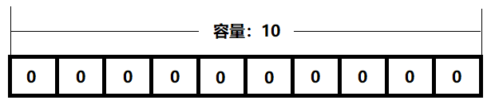
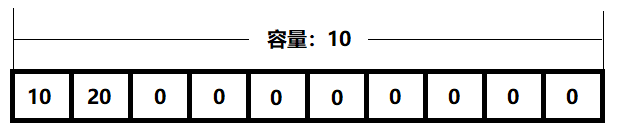
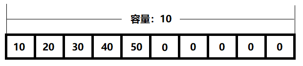
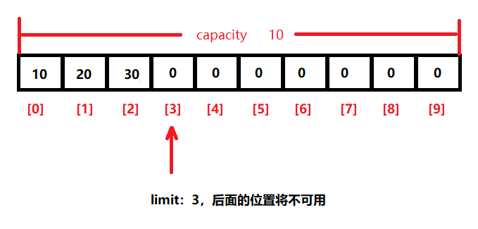

# day13【NIO】

## 今日内容

- NIO

## 教学目标

- [ ] 能够描述同步和异步的概念
- [ ] 能够描述阻塞和非阻塞的概念
- [ ] 能够描述在NIO中Buffer和Channel之间的关系
- [ ] 能够创建ByteBuffer缓冲区
- [ ] 能够描述Buffer的核心四个字段
- [ ] 能够使用ByteBuffer存取数据的方法
- [ ] 能够根据文件字节流或RandomAccessFile需要获取FileChannel对象
- [ ] 能够结合字节缓冲流和文件通道完成文件的拷贝
- [ ] 能够使用MappedByteBuffer实现高效读写
- [ ] 能够使用ServerSocketChannel和SocketChannel实现连接并收发信息

# 第一章 NIO

## NIO概述

### 1 名词解释

在我们学习Java的NIO流之前，我们都要了解几个关键词

#### 同步与异步

同步和异步关注的是**消息通信机制** (synchronous communication/ asynchronous communication)

- 所谓同步，就是在发出一个调用时，在没有得到结果之前，该调用就不返回。但是一旦调用返回，就得到返回值了。换句话说，就是由调用者主动等待这个调用的结果。

- 而异步则是相反，调用在发出之后，这个调用就直接返回了，所以没有返回结果。换句话说，当一个异步过程调用发出后，调用者不会立刻得到结果。而是在*调用*发出后，*被调用者*通过状态、通知来通知调用者，或通过回调函数处理这个调用。


#### 阻塞与非阻塞

阻塞和非阻塞关注的是**程序在等待调用结果（消息，返回值）时的状态.**


场景举例：

你去电脑城买电脑，但是所需型号缺货。

```
同步与异步 跟 阻塞和非阻塞是两个不同的概念

同步与异步：结果的通知机制。
    1）同步：主动的去询问结果，你主动的去问店家，电脑有了么。
    2）异步：不主动去询问结果，电脑来了，店老板会通知你，去拿。

阻塞与非阻塞：结果返回以前，调用方的状态。
    1）阻塞：你在店里等电脑回来才做别的事情。
    2）非阻塞：你去做了别的事情。

同步阻塞：你什么事都不做，在店里等电脑回来。（我们平时用的最多的）
同步非阻塞：你边逛街边等，边逛街边去问老板电脑回来没有。（类似轮询）
异步阻塞：留了电话给店家，电脑回来老板会通知你来拿，但是你什么事都不做，就一直对着电话在等通知。（有点傻）很少用，不需要你主动去要结果，你非要等。
异步非阻塞：你去逛街，留了电话给店家，电脑回来老板会通知你拿，开开心心的去做了别的事。
```


### 2  NIO介绍

在Java1.4之前的I/O系统中，提供的都是面向流的I/O系统，系统一次一个字节地处理数据，一个输入流产生一个字节的数据，一个输出流消费一个字节的数据，面向流的I/O效率不高，而在Java 1.4中推出了NIO，这是一个面向块的I/O系统，系统以块的方式处理数据，每一个操作在一步中产生或者消费一个数据，按块处理要比按字节处理数据快的多。

NIO主要有**三个核心部分组成**：

- **buffer缓冲区**
- **Channel管道**
- **Selector选择器**


**buffer缓冲区和Channel管道的认识：**

在NIO中并不是以流的方式来处理数据的，而是以buffer缓冲区和Channel管道**配合使用**来处理数据。

简单理解一下：

- Channel管道比作成铁路，buffer缓冲区比作成火车(运载着货物)

而我们的NIO就是**通过Channel管道运输着存储数据的Buffer缓冲区的来实现数据的处理**！

- 要时刻记住：==Channel不与数据打交道，它只负责运输数据。与数据打交道的是Buffer缓冲区==

  - **Channel-->运输**

  - **Buffer-->数据**


相对于传统IO而言，**流是单向的**。对于NIO而言，有了Channel管道这个概念，我们的**读写都是双向**的(铁路上的火车能从上海去北京、自然就能从北京返还到上海)！


# 第二章 Buffer类（缓冲区）

## 1 Buffer概述

Buffer是一个对象，它对某种基本类型的数组进行了封装。NIO开始使用的Channel(通道)就是通过 Buffer 来读写数据的。

在NIO中，所有的数据都是用Buffer处理的，它是NIO读写数据的中转池。Buffer实质上是一个数组，通常是一个字节数据，但也可以是其他非boolean类型的数组。但一个缓冲区不仅仅是一个数组，重要的是它提供了对数据的结构化访问，而且还可以跟踪系统的读写进程。

Buffer主要有如下几种：

- **ByteBuffer**
- CharBuffer
- DoubleBuffer
- FloatBuffer
- IntBuffer
- LongBuffer
- ShortBuffer


使用 Buffer 读写数据一般遵循以下四个步骤：

```
1.写入数据到 Buffer；
2.调用 flip() 方法；
3.从 Buffer 中读取数据；
4.调用 clear() 方法或者 compact() 方法。
```


当向 Buffer 写入数据时，Buffer 会记录下写了多少数据。一旦要读取数据，需要通过 flip() 方法将 Buffer 从写模式切换到读模式。在读模式下，可以读取之前写入到 Buffer 的所有数据。

一旦读完了所有的数据，就需要清空缓冲区，让它可以再次被写入。有两种方式能清空缓冲区：调用 clear() 或 compact() 方法。clear() 方法会清空整个缓冲区。compact() 方法只会清除已经读过的数据。任何未读的数据都被移到缓冲区的起始处，新写入的数据将放到缓冲区未读数据的后面。


## 2 创建ByteBuffer

ByteBuffer类内部封装了一个byte[]数组，并可以通过一些方法对这个数组进行操作。

创建ByteBuffer对象三种方式：

- **方式一：在堆中创建缓冲区**

  

  ```java
  static ByteBuffer allocate(int capacity) 分配一个新的字节缓冲区。 
  ```

  【代码实践】

  获取一个容量为10的字节缓冲区：

  ```java
  public static void main(String[] args) {
      	//创建堆缓冲区
          ByteBuffer byteBuffer = ByteBuffer.allocate(10);
  }
  ```

   

- **方式二：在系统内存创建缓冲区**

  ByteBuffer中存在静态方法：

  ```java
  static ByteBuffer allocateDirect(int capacity) 分配新的直接字节缓冲区。 
  ```

  【代码实践】

  获取一个容量为10的字节缓冲区：

  ```java
  public static void main(String[] args) {
      	//创建直接缓冲区
          ByteBuffer byteBuffer = ByteBuffer.allocateDirect(10);
  }
  ```

  

  间接缓冲区和直接缓冲区的区别：

  - 在堆中创建缓冲区称为：间接缓冲区

  - 在系统内存创建缓冲区称为：直接缓冲区

    

  效率对比：

  - 间接缓冲区（堆中缓冲区）的创建和销毁效率要高于直接缓冲区


  - 间接缓冲区的工作效率要低于直接缓冲区

  

  可以使用以下方法来判断是否是直接缓冲区：

  ```java
  boolean isDirect() 判断此字节缓冲区是否为直接的。 
  ```

  

- **方式三：通过数组创建缓冲区：**

  ByteBuffer中还存在静态方法，直接包装字节数组得到缓冲区：
  
  ```java
  static ByteBuffer wrap(byte[] array) 将 byte 数组包装到缓冲区中。 
  ```
  

  
  【代码实践】
  
  ```java
   public static void main(String[] args) {
        byte[] byteArray = new byte[10];
          ByteBuffer byteBuffer = ByteBuffer.wrap(byteArray);
   }
  ```
  
  - 此种方式创建的缓冲区为：间接缓冲区
  
  

## 3 ByteBuffer数据添加和获取

向缓冲区中添加数据可以使用很多方法，介绍三种常用方法：

```java
public ByteBuffer put(byte b)：向当前可用位置添加数据。
public ByteBuffer put(byte[] byteArray)：向当前可用位置添加一个byte[]数组
public ByteBuffer put(byte[] byteArray,int offset,int len)：添加一个byte[]数组的一部分
```

获取缓冲区的数据方法：

```java
public byte[] array() 返回实现此缓冲区的 byte 数组 
public byte get() 读取此缓冲区当前位置的字节，然后该位置递增。 
```


【代码实践】

- public ByteBuffer put(byte b)：向当前可用位置添加数据。

  ```java
  public static void main(String[] args) {
      ByteBuffer buf = ByteBuffer.allocate(10);
  
      buf.put((byte) 10);
      buf.put((byte) 20);
  
      System.out.println(Arrays.toString(buf.array()));
  }
  ```

  打印结果：

  ```java
  [10, 20, 0, 0, 0, 0, 0, 0, 0, 0]
  ```

   

- public ByteBuffer put(byte[] byteArray)：向当前可用位置添加一个byte[]数组

  ```java
  public static void main(String[] args) {
      ByteBuffer buf = ByteBuffer.allocate(10);
  
      buf.put((byte) 10);
      buf.put((byte) 20);
  
      byte[] byteArray = {30, 40, 50};
      buf.put(byteArray);//添加整个数组
  
      System.out.println(Arrays.toString(buf.array()));
  }
  ```

  打印结果：

  ```java
  [10, 20, 30, 40, 50, 0, 0, 0, 0, 0]
  ```

   

- public ByteBuffer put(byte[] byteArray,int offset,int len)：添加一个byte[]数组的一部分

  ```java
  public static void main(String[] args) {
      ByteBuffer buf = ByteBuffer.allocate(10);
  
      buf.put((byte) 10);
      buf.put((byte) 20);
  
      byte[] byteArray = {30, 40, 50};
      buf.put(byteArray,0,2);//只添加byteArray的前两个元素
  
      System.out.println(Arrays.toString(buf.array()));
  }
  ```

  打印结果：

  ```java
  [10, 20, 30, 40, 0, 0, 0, 0, 0, 0]
  ```

​	

## 4 Buffere核心字段

Buffer类维护了4个核心字段来描述其内在数组的信息。它们是：

- **容量Capacity**

  **缓冲区能够容纳的数据元素的最大数量**。容量在缓冲区创建时被设定，并且永远不能被改变。(不能被改变的原因也很简单，底层是数组嘛)

- **上界Limit**

  **缓冲区里的数据的总数**，代表了当前缓冲区中一共有多少数据。 (limit 后数据不能进行读写)

- **位置Position**

  **下一个要被读或写的元素的位置**。Position会自动由相应的 `get( )`和 `put( )`函数更新。

- **标记Mark**

  表示记录当前position的位置。可以通过reset()恢复到mark的位置

他们的关系 0<= mark <= position <= limit <= capacity


### 1 容量-capacity

- Buffer的容量(capacity)是指：Buffer所能够包含的元素的最大数量。定义了Buffer后，容量是不可变的。

- 示例代码：

  ```java
  public static void main(String[] args) {
      ByteBuffer b1 = ByteBuffer.allocate(10);
      System.out.println("容量：" + b1.capacity());//10。之后不可改变
  
      byte[] byteArray = {97, 98, 99, 100};
      ByteBuffer b2 = ByteBuffer.wrap(byteArray);
      System.out.println("容量：" + b2.capacity());//4。之后不可改变
  }
  ```

- 结果：

  ```java
  容量：10
  容量：4
  ```


### 2 限制-limit

- 限制limit是指：第一个不应该读取或写入元素的index索引。缓冲区的限制(limit)不能为负，并且不能大于容量。

- 有两个相关方法：

  - public int limit()：获取此缓冲区的限制。
  - public Buffer limit(int newLimit)：设置此缓冲区的限制。

- 示例代码：

  ```java
  public static void main(String[] args) {
      ByteBuffer buf = ByteBuffer.allocate(10);
  
      System.out.println("初始容量：" + buf.capacity() +
                         			" 初始限制：" + buf.limit());//10
  
      buf.limit(3);//设置限制为：索引3
      
      buf.put((byte) 10);//索引：0
      buf.put((byte) 20);//索引：1
      buf.put((byte) 30);//索引：2
      buf.put((byte) 40);//抛出异常
  
  }
  ```

  图示：

  

### 3 位置-position

- 位置position是指：当前可写入的索引。位置不能小于0，并且不能大于"限制"。

- 有两个相关方法：

  - public int position()：获取当前可写入位置索引。
  - public Buffer position(int p)：更改当前可写入位置索引。

- 示例代码：

  ```java
  public static void main(String[] args) {
      ByteBuffer buf = ByteBuffer.allocate(10);
  
      System.out.println("初始容量：" + buf.capacity() +
                         " 初始限制：" + buf.limit() +
                         " 当前位置：" + buf.position());//0
  
      buf.put((byte) 10);//position = 1
      buf.put((byte) 20);//position = 2
      buf.put((byte) 30);//position = 3
      System.out.println("当前容量：" + buf.capacity() +
                         " 初始限制：" + buf.limit() +
                         " 当前位置：" + buf.position());//3
      
      buf.position(1);//当position改为：1
  
      buf.put((byte) 2);//添加到索引：1
      buf.put((byte) 3);//添加到索引：2
  
  
      System.out.println(Arrays.toString(buf.array()));
  }
  ```

  打印结果：

  ```java
  初始容量：10 初始限制：10 当前位置：0
  初始容量：10 初始限制：10 当前位置：3
  [10, 2, 3, 0, 0, 0, 0, 0, 0, 0]
  ```


### 4 标记-mark

- 标记mark是指：当调用缓冲区的`reset()`方法时，会将缓冲区的position位置重置为该索引。不能小于0，不能大于position。

- 相关方法：

  - public Buffer mark()：设置此缓冲区的标记为当前的position位置。

- 示例代码：

  ```java
  public static void main(String[] args) {
      ByteBuffer buf = ByteBuffer.allocate(10);
  
      System.out.println("初始容量：" + buf.capacity() +
                         " 初始限制：" + buf.limit() +
                         " 当前位置：" + buf.position());//初始标记不确定
  
      buf.put((byte) 10);
      buf.put((byte) 20);
      buf.put((byte) 30);
      System.out.println("当前容量：" + buf.capacity() +
                         " 当前限制：" + buf.limit() +
                         " 当前位置：" + buf.position());
      buf.position(1);//当position改为：1
      buf.mark();//设置索引1位标记点
  
      buf.put((byte) 2);//添加到索引：1
      buf.put((byte) 3);//添加到索引：2
  
      //当前position为：3
      
      //将position设置到之前的标记位：1
      buf.reset();
      System.out.println("reset后的当前位置：" + buf.position());
  
      buf.put((byte) 20);//添加到索引：1
  
      System.out.println(Arrays.toString(buf.array()));
  }
  ```

  打印结果：

  ```java
  初始容量：10 初始限制：10 当前位置：0
  当前容量：10 当前限制：10 当前位置：3
  reset后的当前位置：1
  [10, 20, 3, 0, 0, 0, 0, 0, 0, 0]
  ```


## 5 其它方法

- public int remaining()：获取position与limit之间的元素数【剩余空间】。
- public boolean isReadOnly()：获取当前缓冲区是否只读。
- public boolean isDirect()：获取当前缓冲区是否为直接缓冲区。
- public Buffer clear()：还原缓冲区的状态。
  - 将position设置为：0
  - 将限制limit设置为容量capacity；
  - 丢弃标记mark，设置为-1，表示无效标记。
- public Buffer flip()：缩小limit的范围。【重要】
  - 将limit设置为当前position位置；
  - 将当前position位置设置为0；
  - 丢弃标记。
- public Buffer rewind()：重置此缓冲区，让position回到位置0的状态。
  - 将position位置设置为：0
  - 限制limit不变。
  - 丢弃标记。


# 第三章 Channel（通道）

## 1 Channel概述


通道(Channel) 是用来传输数据的通路。举个例子，现在的从上海到北京的高铁，动车可以比作缓冲区，可以上下客。铁轨就好比Channel通道了。

因此切记，Channel通道**只负责传输数据、不直接操作数据的**，而操作数据都是由Buffer缓冲区来实现的！


通道的主要实现类
`java.nio.channels.Channel`:

​			|--`FileChannel`  用于读取、写入操作文件的通道。

​			|--`DatagramChannel`：读写UDP网络协议数据 


​			|--`SocketChannel` 针对面向流的连接套接字的可选择通道（TCP）

​			|--`ServerSocketChannel` 针对面向流的侦听套接字的可选择通道。（TCP）


## 2 FileChannel基本使用

`java.nio.channels.FileChannel` (抽象类)：用于读、写文件的通道。

### FIleChannel对象获取：

查阅API得知：

此类没有定义打开现有文件或创建新文件的方法，可从现有的 [`FileInputStream`](../../../java/io/FileInputStream.html#getChannel())、[`FileOutputStream`](../../../java/io/FileOutputStream.html#getChannel())  或 [`RandomAccessFile`](../../../java/io/RandomAccessFile.html#getChannel())  对象获得文件通道，方法是调用该对象的 `getChannel` 方法，这会返回一个连接到相同底层文件的文件通道。 

此类在各种情况下指定要求“允许读取操作”、“允许写入操作”或“允许读取和写入操作”的某个实例。

- 通过 `FileInputStream`  实例的 `getChannel` 方法所获得的通道将允许进行读取操作。
- 通过 `FileOutputStream`  实例的 `getChannel`  方法所获得的通道将允许进行写入操作。
- 最后，如果使用模式 `"r"` 创建`RandomAccessFile` 实例，则通过该实例的 `getChannel()`方法所获得的通道将允许进行读取操作，如果使用模式 `"rw"` 创建实例，则获得的通道将允许进行读取和写入操作。 

【代码实践】

- 通过FileInputStream和FileOutputStream的getChannel()方法方便的获取一个它的子类对象。

  ```java
  FileInputStream fi=new FileInputStream(new File(src));
  FileOutputStream fo=new FileOutputStream(new File(dst));
  //获得传输通道channel
  FileChannel inChannel=fi.getChannel();
  FileChannel outChannel=fo.getChannel();
  ```

- 通过`RandomAccessFile` 来获取通道

  `java.io.RandomAccessFile`，此类的实例支持对随机访问文件的读取和写入。

  构造方法如下：

  ```java
  RandomAccessFile(File file, String mode) 
            创建从中读取和向其中写入（可选）的随机访问文件流，该文件由 File 参数指定。 
  RandomAccessFile(String name, String mode) 
            创建从中读取和向其中写入（可选）的随机访问文件流，该文件具有指定名称。 
  
  mode值:
  	"r" 以只读方式打开。调用结果对象的任何 write 方法都将导致抛出 IOException。  
  	"rw" 打开以便读取和写入。如果该文件尚不存在，则尝试创建该文件。  
  ```

  【代码实践】

  ```java
   RandomAccessFile raf = new RandomAccessFile("foo/file01.txt","rw");
   FileChannel channel = raf.getChannel();//该通道可读，可写
  ```


### FileChannel读写方法：

```java
int read(ByteBuffer dst)将字节序列从此通道读入给定的缓冲区。返回读取的字节数，可能为零，如果该通道已到达流的末尾，则返回 -1 
int write(ByteBuffer src)将字节序列从给定的缓冲区写入此通道。 返回写入的字节数，可能为零 
```


### 文件拷贝案例实践：

我们将通过CopyFile这个示例让大家体会NIO的操作过程。

CopyFile执行三个基本的操作：

1. 创建一个Buffer，
2. 然后从源文件读取数据到缓冲区，
3. 然后再将缓冲区写入目标文件。

【代码实践】

```java
public static void main(String[] args) throws Exception {
        //声明源文件和目标文件
        FileInputStream fi=new FileInputStream("d:\\视频.itcast");
        FileOutputStream fo=new FileOutputStream("e:\\视频_copy.itcast");
    
        //获得传输通道channel
        FileChannel inChannel=fi.getChannel();
        FileChannel outChannel=fo.getChannel();
    
        //获得容器buffer
        ByteBuffer buffer= ByteBuffer.allocate(1024);
        int eof = 0;
        while((eof =inChannel.read(buffer)) != -1){//读取的字节将会填充buffer的position到limit位置
            //重设一下buffer：limit=position , position=0
            buffer.flip();
            //开始写
            outChannel.write(buffer);//只输出position到limit之间的数据
            //写完要重置buffer，重设position=0，limit=capacity，用于下次读取
            buffer.clear();
        }
        inChannel.close();
        outChannel.close();
    
        fi.close();
        fo.close();

    }
```


## 3 FileChannel结合MappedByteBuffer实现高效读写

上例直接使用FileChannel结合ByteBuffer实现的管道读写，但并不能极大提高文件的读写效率。

ByteBuffer有个子类：MappedByteBuffer，它可以创建一个“直接缓冲区”，并可以将文件直接映射至内存，可以提高大文件的读写效率。

ByteBuffer(抽象类)

​        |--MappedByteBuffer(抽象类)

可以调用FileChannel的map()方法获取一个MappedByteBuffer，map()方法的原型：

```java
MappedByteBuffer map(MapMode mode, long position, long size) 将节点中从position开始的size个字节映射到返回的MappedByteBuffer中。

参数说明：
  mode：映射的模式。
  三种模式，在这三种模式下得到的将是三种不同的MappedByteBuffer：
  三种模式都是FileChannel的内部类MapMode中定义的静态常量：
		1). FileChannel.MapMode.READ_ONLY：
  				得到的镜像只能读不能写（只能使用get之类的读取Buffer中的内容）；
		2). FileChannel.MapMode.READ_WRITE：
  				得到的镜像可读可写（既然可写了必然可读），对其写会直接更改到存储节点；
		3). FileChannel.MapMode.PRIVATE：
  				得到一个私有的镜像，其实就是一个(position, size)区域的副本罢了，也是可读可写，只不过写不会影响到存储节点，就是一个普通的ByteBuffer了！！
```

### 复制2GB以下的文件

复制d:\\b.rar文件，此文件大概600多兆，复制完毕用时不到2秒。此例不能复制大于2G的文件，因为map的第三个参数被限制在Integer.MAX_VALUE(字节) = 2G。

```java
public static void main(String[] args) throws Exception {
        try {
            //java.io.RandomAccessFile类，可以设置读、写模式的IO流类。
            //"r"表示：只读--输入流，只读就可以。
            RandomAccessFile source = new RandomAccessFile("d:\\b.rar", "r");
            //"rw"表示：读、写--输出流，需要读、写。
            RandomAccessFile target = new RandomAccessFile("e:\\b.rar", "rw");
            //分别获取FileChannel通道
            FileChannel in = source.getChannel();
            FileChannel out = target.getChannel();
            //获取文件大小
            long size = in.size();
            //调用Channel的map方法获取MappedByteBuffer
            MappedByteBuffer mbbi = in.map(FileChannel.MapMode.READ_ONLY, 0, size);
            MappedByteBuffer mbbo = out.map(FileChannel.MapMode.READ_WRITE, 0, size);
            long start = System.currentTimeMillis();
            System.out.println("开始...");
            for (int i = 0; i < size; i++) {
                byte b = mbbi.get(i);//读取一个字节
                mbbo.put(i, b);//将字节添加到mbbo中
            }
            long end = System.currentTimeMillis();
            System.out.println("用时: " + (end - start) + " 毫秒");
            source.close();
            target.close();
        } catch (Exception e) {
            e.printStackTrace();
        }

    }
```


**为什么使用RandomAccessFile？**

1. 使用InputStream获得的Channel可以映射，使用map时只能指定为READ_ONLY模式，不能指定为READ_WRITE和PRIVATE，否则会抛出运行时异常！

2. 使用OutputStream得到的Channel不可以映射！并且OutputStream的Channel也只能write不能read！

3. 只有RandomAccessFile获取的Channel才能开启任意的这三种模式！


### **复制2GB以上文件**

下例使用循环，将文件分块，可以高效的复制大于2G的文件：要复制的文件为：d:\\测试13G.rar，此文件13G多，复制完成大概30秒左右。

```java
import sun.nio.ch.FileChannelImpl;

import java.io.*;
import java.nio.ByteBuffer;
import java.nio.MappedByteBuffer;
import java.nio.channels.FileChannel;

public class MappedFileChannelTest {
    public static void main(String[] args) throws Exception {
        try {
            RandomAccessFile source = new RandomAccessFile("d:\\测试13G.rar", "r");
            RandomAccessFile target = new RandomAccessFile("e:\\测试13G.rar", "rw");
            FileChannel in = source.getChannel();
            FileChannel out = target.getChannel();
            long size = in.size();//获取文件大小
            long count = 1;//存储分的块数，默认初始化为：1
            long copySize = size;//每次复制的字节数，默认初始化为：文件大小
            long everySize = 1024 * 1024 * 512;//每块的大小，初始化为：512M
            if(size > everySize){//判断文件是否大于每块的大小
                //判断"文件大小"和"每块大小"是否整除，来计算"块数"
                count = (int)(size % everySize != 0 ? size / everySize + 1 : size / everySize);
                //第一次复制的大小等于每块大小。
                copySize = everySize;
            }
            
            MappedByteBuffer mbbi = null;//输入的MappedByteBuffer
            MappedByteBuffer mbbo = null;//输出的MappedByteBuffer
            long startIndex = 0;//记录复制每块时的起始位置
            long start = System.currentTimeMillis();
            System.out.println("开始...");
            for (int i = 0; i < count; i++) {
                mbbi = in.map(FileChannel.MapMode.READ_ONLY,startIndex,copySize);
                mbbo = out.map(FileChannel.MapMode.READ_WRITE, startIndex,copySize);
         
                for (int j = 0; j < copySize; j++) {
                    byte b = mbbi.get(i);
                    mbbo.put(i, b);
                }
                startIndex += copySize;//计算下一块的起始位置
                //计算下一块要复制的字节数量。
                copySize = in.size() - startIndex > everySize ? everySize : in.size() - startIndex;
            }


            long end = System.currentTimeMillis();
            source.close();
            target.close();
            System.out.println("用时: " + (end - start) + " 毫秒");
        } catch (Exception e) {
            e.printStackTrace();
        }
    }
}
```


## 4 ServerSocketChannel和SocketChannel创建连接

### **服务器端 **

**ServerSocketChannel**类用于连接的服务器端，它相当于：ServerSocket。

#### 使用步骤

1. 调用ServerSocketChannel的静态方法open()：打开一个通道，新频道的套接字最初未绑定; 必须通过其套接字的bind方法将其绑定到特定地址，才能接受连接。

   ```java
   ServerSocketChannel serverChannel = ServerSocketChannel.open()
   ```

2. 调用ServerSocketChannel的实例方法bind(SocketAddress add)：绑定本机监听端口，准备接受连接。
   注：java.net.SocketAddress(抽象类)：代表一个Socket地址。
   可以使用它的子类：java.net.InetSocketAddress(类)
   构造方法：InetSocketAddress(int port)：指定本机监听端口。

   ```java
     serverChannel.bind(new InetSocketAddress(8888));
   ```

3.  调用ServerSocketChannel的实例方法accept()：等待连接。

   ```java
     SocketChannel accept = serverChannel.accept();
     System.out.println("后续代码...");
   ```

   

  示例：服务器端等待连接(默认-阻塞模式)

  ```java
  public class Server {
      public static void main(String[] args) {
          try (ServerSocketChannel serverChannel = ServerSocketChannel.open()) {
              serverChannel.bind(new InetSocketAddress(8888));
              System.out.println("【服务器】等待客户端连接...");
              SocketChannel accept = serverChannel.accept();
              System.out.println("后续代码......");
              ......
              ......
          } catch (IOException e) {
              e.printStackTrace();
          }
      }
  }
  ```

  运行后结果：

  ```java
  【服务器】等待客户端连接...
  ```

#### 配置是否阻塞 

 **我们可以通过ServerSocketChannel的configureBlocking(boolean b)方法设置accept()是否阻塞**

  ```java
  public class Server {
      public static void main(String[] args) throws Exception {
          try (ServerSocketChannel serverChannel = ServerSocketChannel.open()) {
              serverChannel.bind(new InetSocketAddress(8888));
              System.out.println("【服务器】等待客户端连接...");
         //   serverChannel.configureBlocking(true);//默认--阻塞
              serverChannel.configureBlocking(false);//非阻塞
              SocketChannel accept = serverChannel.accept();
              System.out.println("后续代码......");
              //......
              //......
          } catch (IOException e) {
              e.printStackTrace();
          }
  
      }
  }
  ```

  运行后结果：

  ```java
  【服务器】等待客户端连接...
  后续代码......
  ```

  可以看到，accept()方法并没有阻塞，而是直接执行后续代码，返回值为null。

  这种非阻塞的方式，通常用于"客户端"先启动，"服务器端"后启动，来查看是否有客户端连接，有，则接受连接；没有，则继续工作。


### **客户端：**

**SocketChannel**类用于连接的客户端，它相当于：Socket。

#### 使用步骤

1. 先调用SocketChannel的open()方法打开通道：

   ```java
   ServerSocketChannel serverChannel = ServerSocketChannel.open()
   ```

2. 用SocketChannel的实例方法connect(SocketAddress add)连接服务器：

   ```java
   socket.connect(new InetSocketAddress("localhost", 8888));
   ```

   

  示例：客户端连接服务器：

  ```java
  public class Client {
      public static void main(String[] args) {
          try (SocketChannel socket = SocketChannel.open()) {
              socket.connect(new InetSocketAddress("localhost", 8888));
  			System.out.println("后续代码......");
          } catch (IOException e) {
              e.printStackTrace();
          }
          System.out.println("客户端完毕！");
      }
  }
  ```


## 5 ServerSocketChannel和SocketChannel收发信息

接下来我们看一下客户端和服务器端实现信息交互的过程。

### 服务端

创建服务器端如下：

```java
public class Server {
    public static void main(String[] args) {
        try (ServerSocketChannel serverChannel = ServerSocketChannel.open()) {
            serverChannel.bind(new InetSocketAddress("localhost", 8888));
            
            System.out.println("【服务器】等待客户端连接...");
            SocketChannel accept = serverChannel.accept();
            System.out.println("【服务器】有连接到达...");
            
            //1.先发一条
            ByteBuffer outBuffer = ByteBuffer.allocate(100);
            outBuffer.put("你好客户端，我是服务器".getBytes());
            outBuffer.flip();//limit设置为position,position设置为0
            accept.write(outBuffer);//输出从position到limit之间的数据

            //2.再收一条，不确定字数是多少，但最多是100字节。先准备100字节空间
            ByteBuffer inBuffer = ByteBuffer.allocate(100);
            accept.read(inBuffer);
            inBuffer.flip();//limit设置为position,position设置为0
            String msg = new String(inBuffer.array(),0,inBuffer.limit());
            System.out.println("【服务器】收到信息：" + msg);
            accept.close();


        } catch (IOException e) {
            e.printStackTrace();
        }
    }
}
```

### 客户端

创建客户端如下：

```java
public class Client {
    public static void main(String[] args) {
        try (SocketChannel socket = SocketChannel.open()) {
            socket.connect(new InetSocketAddress("localhost", 8888));

            //1.先发一条
            ByteBuffer buf = ByteBuffer.allocate(100);
            buf.put("你好服务器，我是客户端".getBytes());
            buf.flip();//limit设置为position,position设置为0
            socket.write(buf);//输出从position到limit之间的数据

            //2.再收一条，不确定字数是多少，但最多是100字节。先准备100字节空间
            ByteBuffer inBuffer = ByteBuffer.allocate(100);
            socket.read(inBuffer);
            inBuffer.flip();//limit设置为position,position设置为0
            String msg = new String(inBuffer.array(),0,inBuffer.limit());
            System.out.println("【客户端】收到信息：" + msg);
            socket.close();
        } catch (IOException e) {
            e.printStackTrace();
        }
        System.out.println("客户端完毕！");
    }
}

```

- 服务器端打印结果：

  ```java
  【服务器】等待客户端连接...
  【服务器】有连接到达...
  【服务器】收到信息：你好服务器，我是客户端
  ```

- 客户端打印结果：

  ```java
  【客户端】收到信息：你好客户端，我是服务器
  客户端完毕！
  ```


