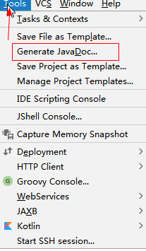
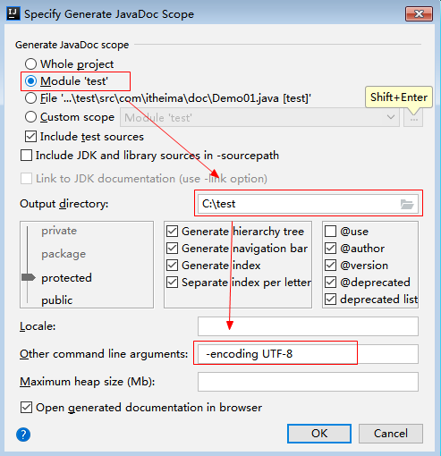
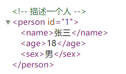
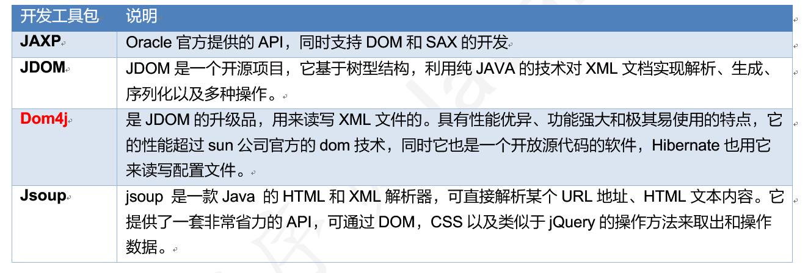
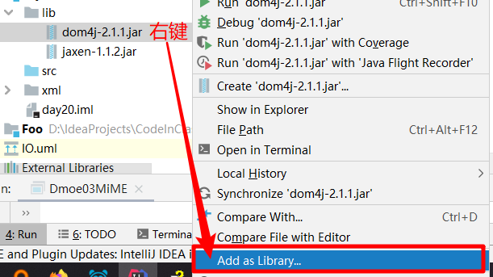

# day15【注解，XML，Dom4j，设计模式】

## 今日目标

- 注解
- XML
- Dom4j
- 单例设计模式
- 多例设计模式
- 工厂设计模式

## 教学目标

- [ ] 能够说出注解的作用 
- [ ] 能够自定义注解和使用注解
- [ ] 能够说出常用的元注解及其作用
- [ ] 能够解析注解并获取注解中的数据
- [ ] 能够说出xml的作用
- [ ] 能够说出xml约束有哪两种
- [ ] 能够使用DOM4J技术解析xml文件
- [ ] 能够使用xpath技术解析xml文件
- [ ] 能够说出单例设计模式的好处
- [ ] 能够说出多例模式的好处
- [ ] 能够使用简单工厂模式编写java程序


# 第一章 注解

## 1 注解的概述

### 1.1 注解的概念

- 注解是JDK1.5的新特性。

- 注解相当一种标记，是类的组成部分，可以给类携带一些额外的信息。

- 标记(注解)可以加在包，类，字段，方法，方法参数以及局部变量上。

- 注解是给编译器或JVM看的，编译器或JVM可以根据注解来完成对应的功能。

  ###### *注解(Annotation)相当于一种标记，在程序中加入注解就等于为程序打上某种标记，以后，javac编译器、开发工具和其他程序可以通过反射来了解你的类及各种元素上有无何种	标记，看你的程序有什么标记，就去干相应的事，标记可以加在包、类，属性、方法，方法的参数以及局部变量上。*

### 1.2 注解的作用

 **注解的作用就是给程序带入参数。**

以下几个常用操作中都使用到了注解：

1. **生成帮助文档**：**@author和@version**

   - **@author**：用来标识作者姓名。

   - **@version**：用于标识对象的版本号，适用范围：文件、类、方法。

     - 使用**@author和@version**注解就是告诉**Javadoc工具**在生成帮助文档时把作者姓名和版本号也标记在文档中。如下图：

       

         

     

2. 编译检查**：**@Override**

   - **@Override**：用来修饰方法声明。

     - 用来告诉**编译器**该方法是重写父类中的方法，如果父类不存在该方法，则编译失败。如下图

     

3. **框架的配置(框架=代码+配置)**

   - 具体使用请关注框架课程的内容的学习。

### 1.3 常见注解

1. **@author**：用来标识作者名，eclipse开发工具默认的是系统用户名。
2. **@version**：用于标识对象的版本号，适用范围：文件、类、方法。
3. **@Override** ：用来修饰方法声明，告诉编译器该方法是重写父类中的方法，如果父类不存在该方法，则编译失败。


## 2 自定义注解

```java
package com.itheima03.annotation;
/*
*  # 框架/软件 : 配置文件 (配置软件/框架运行时,使用到的一些参数)
*  # 配置文件有三种类型
*  1. properties文件 (druid连接池, mybatis数据库配置)
*       1). 配置: xx.properties (name=value格式)
*       2). 解析: Properties / ResourceBundle
*  2. xml文件
*       1). 配置 : xx.xml (xml语法)
*       2). 解析: dom4j 框架
*  3. 注解
*       1). 配置: 注解语法(怎么给注解的的属性赋值)
*       2). 解析: 反射
*
*
*       我们重在学习如何配置xml和注解, 框架底层帮我们解析xml和注解
*
*  # 配置文件两种操作
*  1. 存数据: 配置 (config)
*  2. 取数据: 解析 (parse)
* */
public class Demo01 {
}

```


```java
package com.itheima03.annotation;

/*
*   # 注解: annotation (注释；注解)
*       1. 概念
*           1). 注释 : 给程序员看的配置数据(不参与编译,运行)
*           2). 注解 : 给程序看的配置数据(参与编译,运行)
*
*       2. 注解是java四大类型(class,interface,annotation,enum)
*
*       3. 应用场景:
*           1). 生成帮助文档：@author和@version
*           2). 编译检查:@override @FunctionalInterface
*           3). 配置 (重要)
* */
public class Demo02 {

    public static void main(String[] args) {

    }
}
@FunctionalInterface
interface A{
    void eat();
}

```


```java
package com.itheima03.annotation;
/*
* 注解的配置:  配置,还未解析
*
* 注解的配置注意点:
*   1. 注解可以放在很多位置 (类, 属性,方法,构造,局部变量...)
*
*   2. 所有的属性必须都要赋值
*       1). 默认初始值  String name() default "佚名";
*       2). 手动赋值   @MyAnno2(name="马六",age=3)
*
*       3). 特殊情况
*           I. 如果属性名为value ,而且只给value赋值, 赋值的时候value= 可以省略
*                @MyAnno2("钱七")  省略了value=
*                @MyAnno2(value="马六",age=3)  这个不能省略
*           II. 如果属性是数组类型,并且赋值的时候元素只有一个,大括号可以省略
*             @MyAnno2(array={"a"})
                @MyAnno2(array="a")
* */
@MyAnno2
public class Demo03 {
    @MyAnno2(value="马六",age=3)
    int a = 2;
//    @MyAnno2(value="钱七")
    @MyAnno2("钱七")
    public static void main(@MyAnno2(name="王五")String[] args) {

        @MyAnno2(array={"a","b","c"})
//        @MyAnno2(array={"a"})
//        @MyAnno2(array="a")
        int b;
    }
}
//注解的定义
@interface MyAnno2{
    String name() default "佚名";
    int age() default 2;
    String value() default "yy";
    String[] array() default {};
}

```


```java
package com.itheima03.annotation;

import java.lang.annotation.ElementType;
import java.lang.annotation.Retention;
import java.lang.annotation.RetentionPolicy;
import java.lang.annotation.Target;

/*
*   # 元注解 : 起始的注解
*       1. 注解的注解, 用于注解之上的注解
*       2. 元数据: metadata
*
*   # 两个元注解
*   1. @Target : 使用范围
*
*   2. @Retention : 保留策略(生命周期)
*        SOURCE -> CLASS -> RUNTIME
*        源码       字节码    运行时
*        
*        当注解用作配置的时候,需要反射解析的,所以注解需要保留到运行时
* */
@MyAnno3
public class Demo04 {
    @MyAnno3
    int a;
    @MyAnno3
    public static void main(String[] arg ){

    }
}
//@Target(value={ElementType.METHOD})
//@Target(value=ElementType.METHOD)
//@Target(ElementType.METHOD)
@Target({ElementType.METHOD,ElementType.CONSTRUCTOR,ElementType.TYPE,ElementType.FIELD})
@Retention(RetentionPolicy.RUNTIME)
@interface MyAnno3{
    String value() default "随便";
}
abstract class D{
    abstract void eat();
}
class E extends D{
    @Override
    void eat() {

    }
}
```


## 4 注解之元注解

```java
元注解概述
    * Java官方提供的注解
    * 用来定义注解的注解
    * 任何官方提供的非元注解的定义都使用到了元注解。

常用的元注解
    * @Target
        * 作用：用来标识注解使用的位置，如果没有使用该注解标识，则自定义的注解可以使用在任意位置。
        * 可使用的值定义在ElementType枚举类中，常用值如下
            TYPE，类，接口
            FIELD, 成员变量
            METHOD, 成员方法
            PARAMETER, 方法参数
            CONSTRUCTOR, 构造方法
            LOCAL_VARIABLE, 局部变量

    * @Retention
        * 作用：用来标识注解的生命周期(有效范围)
        * 可使用的值定义在RetentionPolicy枚举类中，常用值如下
            * SOURCE：注解只作用在源码阶段，生成的字节码文件中不存在
            * CLASS：注解作用在源码阶段，字节码文件阶段，运行阶段不存在，默认值
            * RUNTIME：注解作用在源码阶段，字节码文件阶段，运行阶段
```


## 5 注解解析

```java
  什么是注解解析
        * 使用Java技术获得注解上数据的过程则称为注解解析。
    与注解解析相关的接口
        * Annotation: 注解类，该类是所有注解的父类。
        * AnnotatedElement:该接口定义了与注解解析相关的方法
             T getAnnotation(Class<T> annotationClass) 根据注解类型获得对应注解对象
             Annotation[]	getAnnotations()
                * 获得当前对象上使用的所有注解，返回注解数组，包含父类继承的
             Annotation[]	getDeclaredAnnotations()
                * 获得当前对象上使用的所有注解，返回注解数组,只包含本类的
             boolean	isAnnotationPresent(Class<Annotation> annotationClass)
                * 判断当前对象是否使用了指定的注解，如果使用了则返回true，否则false

        获取注解数据的原理
            * 注解作用在哪个成员上就会得该成员对应的对象来获得注解
                * 比如注解作用成员方法，则要获得该成员方法对应的Method对象
                * 比如注解作用在类上，则要该类的Class对象
                * 比如注解作用在成员变量上，则要获得该成员变量对应的Field对象。
            * Field,Method,Constructor，Class等类都是实现了AnnotatedElement接口
```


```java
package com.itheima03.annotation;

import java.lang.annotation.ElementType;
import java.lang.annotation.Retention;
import java.lang.annotation.RetentionPolicy;
import java.lang.annotation.Target;

public class Student {
    @MyAnno5("张三")
    @Deprecated
    public String name;
//    String name = "张三";


    @Override
    public String toString() {
        return "Student{" +
                "name='" + name + '\'' +
                '}';
    }

    @MyAnno5("今天要下雨")
    @Deprecated //表示过时了,有更好的替代的方案,依然可用
    public void speak(String msg){
        System.out.println("speak:" + msg);
    }

}
@Retention(RetentionPolicy.RUNTIME)
@Target({ElementType.METHOD,ElementType.FIELD})
@interface MyAnno5{
    String value() default "默认";
}
```


```java
package com.itheima03.annotation;

import java.lang.reflect.Field;
import java.lang.reflect.InvocationTargetException;
import java.lang.reflect.Method;

/*
*  注解的三大功能
*  1. 生成文档
*  2. 编译检查
*  3. 用作配置(最为常见,重要)
*       1). 配置数据 : 写
*       2). 解析数据 : 读
*
*  # 注解的解析: 反射
*
*
*  框架的底层: 定义注解 + 注解解析
*  使用框架 :
*
* */
public class Demo05 {
    public static void main(String[] args) throws NoSuchFieldException, IllegalAccessException, NoSuchMethodException, InvocationTargetException {
//        Student s = new Student();
//        s.speak("xx");

        //需求: 将属性name上的注解value赋值给name
        Student s = new Student();
        Class<? extends Student> clazz = s.getClass();
        Field nameField = clazz.getField("name");

            /*
                获取属性之上的指定注解
                    T getAnnotation(Class<T> annotationClass)

                    annotationClass : 属性上可以放多个注解, 指定想要的注解
             */
        MyAnno5 myAnno5 = nameField.getAnnotation(MyAnno5.class);
        String value = myAnno5.value();
        nameField.set(s,value );
        System.out.println(s);

        //需求: 将方法speak上的注解value赋值给参数msg
        Method method = clazz.getMethod("speak", String.class);
        MyAnno5 ma = method.getAnnotation(MyAnno5.class);
        String value2 = ma.value();

        method.invoke(s,value2);
    }
}

```


## 6 注解案例

### 6.1 案例说明

- 模拟Junit测试的@Test

### 6.2 案例分析

1. 模拟Junit测试的注释@Test，首先需要编写自定义注解@MyTest，并添加元注解，保证自定义注解只能修饰方法，且在运行时可以获得。
2. 然后编写目标类（测试类），然后给目标方法（测试方法）使用 @MyTest注解，编写三个方法，其中两个加上@MyTest注解。
3. 最后编写调用类，使用main方法调用目标类，模拟Junit的运行，只要有@MyTest注释的方法都会运行。

### 6.3 案例代码

```java
package com.itheima03.annotation;


public class TestDemo {
    public void method0(){
        System.out.println("测试方法0");
    }
    @MyTest
    public void method01(){
        System.out.println("测试方法1");
    }
    @MyTest
    public void method02(){
        System.out.println("测试方法2");
    }
    @MyTest
    public void method03(){
        System.out.println("测试方法3");
    }
}

```


```java
package com.itheima03.annotation;

import java.lang.annotation.ElementType;
import java.lang.annotation.Retention;
import java.lang.annotation.RetentionPolicy;
import java.lang.annotation.Target;
import java.lang.reflect.InvocationTargetException;
import java.lang.reflect.Method;

/*
*  # 模拟 Junit测试框架的底层原理
*   0. 观察:
*       一个类有多个方法,加了@Test可以测试运行,不加不能运行
*
*   模拟: 一个类有多个方法,加了@MyTest可以测试运行,不加不行
*
*   1. 定义 @MyTest 注解
*
*   2. 反射解析, 只要带@MyTest注解的方法都需要给我运行
* */
public class Demo06 {

    public static void main(String[] args) throws ClassNotFoundException, IllegalAccessException, InstantiationException, InvocationTargetException {
        //2. 反射解析, 只要带@MyTest注解的方法都需要给我运行

        //反射TestDemo这个类,获取到所有的public方法
        Class<?> clazz = Class.forName("com.itheima03.annotation.TestDemo");
        Method[] methods = clazz.getMethods();
        //判断哪个方法上有@MyTest,就运行
        for (Method method : methods) {
            //判断method上是否有MyTest.clas注解,如果有返回true,否则false
            boolean result = method.isAnnotationPresent(MyTest.class);
            if(result){
                Object obj = clazz.newInstance();
                method.invoke(obj);
            }
        }
    }
}
//1. 定义 @MyTest 注解
@Target(ElementType.METHOD)
@Retention(RetentionPolicy.RUNTIME)
@interface MyTest{
}

```


# 第二章 XML

## 1 XML概述

### 目标

1. 什么是XML
2. 编写第1个XML文件

### 什么是XML

1. 英文：eXtensible Markup Language 可扩展的标记语言，由各种标记(标签，元素)组成。

   > hypertext markup language : HTML 超文本标记语言
   >
   > ​	html的标签不能随意扩展,固定含义,可被浏览器解析
   >
   > ​	html作用: 展示数据
   >
   > 1. 可扩展  : 标签随意自定义
   >
   > 2. 标记
   >
   >    xml作用: 传输数据, 存储数据(配置文件)

2. 可扩展：所有的标签都是自定义的，可以随意扩展的。如：\<abc/>，<姓名>

3. 标记语言：整个文档由各种标签组成。清晰，数据结构化！

4. XML是通用格式标准，全球所有的技术人员都知道这个东西，都会按照XML的规范存储数据，交互数据！！

### XML作用

1) 数据交换：不同的计算机语言之间，不同的操作系统之间，不同的数据库之间，进行数据交换。                                                  

2)  配置文件：在后期我们主要用于各种框架的配置文件基本天天见。

比如我们很快会学到连接池：c3p0-config.xml

 


### 小结

1. 主要有哪两个作用？
   1. 数据交换
   2. 配置文件


## 2 编写第1个XML文件

### 需求

编写xml文档，用于描述人员信息，person代表一个人员，id是人员的属性代表人员编号。人员信息包括age年龄、name姓名、sex性别信息。

使用Java类去描述：

```java
class Person{
	String id;
  int age;
  String name;
  String sex;
}

Person p = new Person("1","张三",18,"男");
```


### 效果

 

### 步骤

1. 选择当前项目鼠标右键新建

 

2. 编写person.xml文件

   ```xml
   <?xml version="1.0" encoding="UTF-8" ?>
   <person id="100">
       <age>18</age>
       <name>张三</name>
       <sex>男</sex>
   </person>
   ```

3. 通过浏览器解析XML的内容

    

- **注：XML以后通过Java来进行解析，很少直接在浏览器上显示。**


## 3 XML的组成：声明和元素

```tex
# XML组成
    1. 声明       固定
    2. 元素(标签)  最重要 !!!
    3. 属性       重要
    4. 注释       重要
    5. 转义字符    知道
    6. CDATA 字符区  了解

# 1. 声明 declare
<?xml version="1.0" encoding="UTF-8" ?>
    xml 版本 1.0
    编码 utf-8

必须出现在xml文件的第一行

# 2. 元素(标签) element(tag)
1). 它是xml最重要组成部分
2). 标签有两种形式
    I. 成对标签
        开始标签 结束标签(start tag, end tag) 开,闭
        <标签名> </标签名>
    II. 单标签(空标签)
        自关闭 : <标签名/>
3). 元素: 开标签到闭标签之间的所有内容 (book元素包含name元素)
4). 语法 :
    I. xml有且仅有一个根标签 (root tag)
    II. 标签内可以包裹其他标签(子标签),也可以包裹文本
    III. 元素命名
         - 区分大小写
         - 不能使用空格，不能使用冒号
         - 不建议以XML、xml、Xml开头
         - 标签名不能数字开头
# 3. 属性
    1. 开始标签和空标签内,可以写属性
    2. 语法
        I. 格式: name = "value"
        II. 可以连续多个属性
        name=value空格name=value

# 4. 注释
    <!--注释内容-->

# 5. 转义字符
    < 不能用 - >  &lt;


    转义字符:
        语法:  &开头 ;结尾

        &lt;  less than 小于  <
        &gt;  greater than 大于 >
        &amp;   &   和号

        严格地讲，在 XML 中仅有字符 "<"和"&" 是非法的。
        省略号、引号和大于号是合法的，但是把它们替换为实体引用是个好的习惯。

# 6. CDATA区(了解)
1). PCDATA:  被解析的字符数据（Parsed Character Data）。

    XML 解析器通常会解析 XML 文档中所有的文本。

2). CDATA:  不被解析的字符数据 (Character Data)
    <![CDATA[" 开始，由 "]]>


```


```xml
<?xml version="1.0" encoding="UTF-8" ?>
<!--注释-->
<books>
    <book id="001">
        <author name="张三丰" age="18" sex="男"/>
        <name>java从入门到放弃</name>
        <price>998</price>
    </book>
    <book>
        <author/>
        <name>从入门到脊椎病防治指南</name>
        <price>119</price>
    </book>
    <sql>
        select * from student where age  &lt; 18;
    </sql>
    <sql>
        <![CDATA["
         select * from student where age  < 18
            and number < 20
            and score < 90;

         "]]>

    </sql>
</books>

```


## 6 XML约束：DTD约束

### 目标

1. XML有哪两种约束
2. 了解DTD约束

### 1. XML约束

> 规范xml的书写: 为了方便解析
>
> 约束
>
> 1. DTD :  document type definition  文档类型定义
> 2. schema : 模式
>
> 学习约束: 重在理解,语法不重要


### 2. 约束体验

体验效果说明：当编写xml文档时不符合指定dtd约束时，进行提示xml编写错误，如下图：


体验步骤:

步骤1：复制bookshelf.dtd文件

步骤2：bookshelf.dtd文件内容如下

```dtd
<!ELEMENT 书架 (书+)>
<!ELEMENT 书 (书名,作者,售价)><!--约束元素书的子元素必须为书名、作者、售价-->
<!ELEMENT 书名 (#PCDATA)>
<!ELEMENT 作者 (#PCDATA)>
<!ELEMENT 售价 (#PCDATA)>
```

步骤三：新建books.xml，代码如下

```
引用 <!DOCTYPE 根元素 SYSTEM "dtd约束文件的路径"> 
```

```xml
<?xml version="1.0" encoding="UTF-8"?>
<!DOCTYPE 书架 SYSTEM "bookshelf.dtd"><!--指定使用bookshelf.dtd文件约束当前xml文档-->
<书架>
    <书>
        <书名>JavaWeb开发教程</书名>
        <作者>张孝祥</作者>
        <售价>100.00元</售价>
    </书>
    <书>
        <书名>三国演义</书名>
        <作者>罗贯中</作者>
        <售价>100.00元</售价>
        <测试>hello</测试><!--不符合约束，书的子元素必须为书名、作者、售价-->
    </书>
</书架>
```

步骤四：idea开发工具books.xml的dtd约束验证不通过的效果如下


  

### 3. DTD学习要求

​	在企业实际开发中，我们很少自己编写DTD约束文档，通常情况下通过框架提供的DTD约束文档编写对应的XML文档。所以这一知识点的要求是可以根据DTD约束文档内容编写XML文档。


## 7 XML约束：Schema约束

### 目标

了解Schema约束

### 1 概念

Schema 语言也可作为 XSD（XML Schema Definition）。

Schema 比DTD强大，是DTD代替者。

Schema 本身也是XML文档，单Schema文档扩展名为xsd，而不是xml。

Schema 功能更强大，数据类型约束更完善。

### 2 约束体验

体验效果说明：体验schema约束XML文档中对元素体数据类型的约束。效果如下：


DTD约束无法对具体数据类型进行约束,所以开发工具没有任何错误提示，如下效果：


**实现步骤**

步骤1：复制schema约束文件bookshelf.xsd，其中已对售价约束了数据类型，代码如下

```scheme
<?xml version="1.0" encoding="UTF-8" ?>
<!--
	传智播客DTD教学实例文档.将注释中的以下内容复制到要编写的xml的声明下面
	复制内容如下:
	<书架 xmlns="http://www.itcast.cn"
		  xmlns:xsi="http://www.w3.org/2001/XMLSchema-instance"
		  xsi:schemaLocation="http://www.itcast.cn bookshelf.xsd"
    >
 -->
<xs:schema xmlns:xs="http://www.w3.org/2001/XMLSchema"
           targetNamespace="http://www.itcast.cn"
           elementFormDefault="qualified">
        <xs:element name='书架' >
                <xs:complexType>
                        <xs:sequence maxOccurs='unbounded' >
                                <xs:element name='书' >
                                        <xs:complexType>
                                                <xs:sequence>
                                                     <xs:element name='书名' type='xs:string' />
                                                     <xs:element name='作者' type='xs:string' />
                                                     <xs:element name='售价' type='xs:double' />
                                                </xs:sequence>
                                        </xs:complexType>
                                </xs:element>
                        </xs:sequence>
                </xs:complexType>
        </xs:element>
</xs:schema>

```

步骤2：新建books2.xml使用schema约束文件bookshelf.xsd，代码如下

```xml
<?xml version="1.0" encoding="UTF-8"?>
<书架
xmlns="http://www.itcast.cn"
xmlns:xsi="http://www.w3.org/2001/XMLSchema-instance"
xsi:schemaLocation="http://www.itcast.cn bookshelf.xsd"
><!--指定schema文档约束当前XML文档-->
    <书>
        <书名>JavaScript网页开发</书名>
        <作者>张孝祥</作者>
        <售价>abc</售价>
    </书>
</书架>
```

步骤3：开发工具提示效果


### 3 名称空间

​	一个XML文档最多可以使用一个DTD文件,但一个XML文档中使用多个Schema文件，若这些Schema文件中定义了相同名称的元素时,使用的时候就会出现名字冲突。这就像一个Java文件中使用了`import java.util.*`和`import java.sql.*`时，在使用Date类时，那么就不明确Date是哪个包下的Date了。同理 , 在XML文档中就需要通过名称空间(namespace)来区分元素和属性是来源于哪个约束中的。名称空间就在在根元素后面的内容 , 使用xmlns到引入约束 。

​	当一个XML文档中需要使用多个Schema文件的时候 , 有且仅有一个使用缺省的 , 其他的名称空间都需要起别名 。参考资料中的 applicationContext.xml文件(spring框架的配置文件)

```schema
 xmlns="http://www.itcast.cn"    
 	<!-- 缺省的名称空间.使用此约束中的元素的时候只需要写元素名即可 例如:<书></书> -->
 
 xmlns:aa="http://java.sun.com"
 	<!-- aa就是此约束的别名,使用此约束中的元素的时候就需要加上别名 例如:<aa:书></aa:书> -->
```

​	总之名称空间就是用来处理元素和属性的名称冲突问题，与Java中的包是同一用途。如果每个元素和属性都有自己的名称空间，那么就不会出现名字冲突问题，就像是每个类都有自己所在的包一样，那么类名就不会出现冲突。


### 4 schema学习要求

​	虽然schema功能比dtd强大，但是编写要比DTD复杂，同样以后我们在企业开发中也很少会自己编写schema文件。

​	xml编写与约束内容已经完成了，根据xml的作用我们了解到，无论是xml作为配置文件还是数据传输，我们的程序都要获取xml文档中的数据以便我们进行具体的业务操作，接下来我们就要学习XML解析技术Dom4j。


# 第三章 Dom4j


## 1 XML解析

### 1.1 解析概述

​	当将数据存储在XML后，我们就希望通过程序获取XML的内容。我们使用Java基础所学的IO知识是可以完成的，不过需要非常繁琐的操作才可以完成，且开发中会遇到不同问题（只读、读写）。人们为不同问题提供不同的解析方式，使用不同的解析器进行解析，方便开发人员操作XML。


### 1.2 解析方式和解析器

开发中比较常见的解析方式有三种，如下：

1. **DOM**：要求解析器把整个XML文档装载到内存，并解析成一个Document对象

   a）优点：元素与元素之间保留结构关系，故可以进行增删改查操作。

   b）缺点：XML文档过大，可能出现内存溢出

2. **SAX**：是一种速度更快，更有效的方法。它逐行扫描文档，一边扫描一边解析。并以事件驱动的方式进行具体解析，每执行一行，都触发对应的事件。

   a）优点：处理速度快，可以处理大文件

   b）缺点：只能读，逐行后将释放资源，解析操作繁琐。

3. **PULL**：Android内置的XML解析方式，类似SAX。（了解）


解析器，就是根据不同的解析方式提供具体实现。有的解析器操作过于繁琐，为了方便开发人员，有提供易于操作的解析开发包


**常见的解析器**

 


## 2 Dom4j的基本使用

> J2EE : java to enterprice edition
>
> dom4j : domcument for java

### 2.1 DOM解析原理及结构模型

**解析原理**

将整个XML文档加载到内存，生成一个DOM树，并获得一个Document对象，通过Document对象就可以对DOM树进行操作。以下面books.xml文档为例。

```xml
<?xml version="1.0" encoding="UTF-8"?>
<books>
    <book id="0001">
        <name>JavaWeb开发教程</name>
        <author>张孝祥</author>
        <sale>100.00元</sale>
    </book>
    <book id="0002">
        <name>三国演义</name>
        <author>罗贯中</author>
        <sale>100.00元</sale>
    </book>
</books>
```

**结构模型**

DOM中的核心概念就是节点，在XML文档中的元素、属性、文本，在DOM中都是节点！所有的节点都封装到了Document对象中。


**引入dom4j的jar包**

去官网下载 zip 包。<http://www.dom4j.org/>
  


**通常我们会在项目中创建lib文件夹，将需要依赖的库放在这里。**

库导入方式：

1. 在IDEA中，选择项目鼠标右键--->弹出菜单-->open Module settings”-->Dependencies-->+-->JARs or directories...   找到dom4j-1.6.1.jar,成功添加之后点击"OK" 即可。

2. 直接右键选择：Add as Library

    


### 2.2 常用的方法

dom4j 必须使用核心类SaxReader加载xml文档获得Document，通过Document对象获得文档的根元素，然后就可以操作了。

#### SAXReader对象

| 方法                      | 作用            |
| ------------------------- | --------------- |
| new SAXReader()           | 构造器          |
| Document read(String url) | 加载执行xml文档 |


#### Document对象

| 方法                     | 作用       |
| ------------------------ | ---------- |
| Element getRootElement() | 获得根元素 |

#### Element对象

| 方法                                   | 作用                                     |
| -------------------------------------- | ---------------------------------------- |
| List elements(String ele )             | 获得指定名称的所有子元素。可以不指定名称 |
| Element element([String ele])          | 获得指定名称第一个子元素。可以不指定名称 |
| String getName()                       | 获得当前元素的元素名                     |
| String attributeValue(String attrName) | 获得指定属性名的属性值                   |
| String elementText(Sting ele)          | 获得指定名称子元素的文本值               |
| String getText()                       | 获得当前元素的文本内容                   |


### 2.3 方法演示

复制资料下的常用xml中"books.xml",内容如下:

```xml
<?xml version="1.0" encoding="UTF-8"?>
<books>
    <book id="0001">
        <name>JavaWeb开发教程</name>
        <author>张孝祥</author>
        <sale>100.00元</sale>
    </book>
    <book id="0002">
        <name>三国演义</name>
        <author>罗贯中</author>
        <sale>100.00元</sale>
    </book>
</books>
```

> 注意:为了便于解析,此xml中没有添加约束

解析此文件,获取每本书的id值,以及书本名称,作者名称和价格.

步骤分析：

1. 创建一个SaxReader对象，调用read方法加载一个xml文件获得文档对象
2. 通过文档对象，获取根元素
3. 通过根元素一层一层的进行解析子元素。

```java
package com.itheima01.dom;

import org.dom4j.Document;
import org.dom4j.DocumentException;
import org.dom4j.Element;
import org.dom4j.io.SAXReader;

import java.util.List;

/*
* Dom4j:  第三方封装xml解析工具包
*
* 1. 导入jar包 : dom4j-1.6.1.jar
*
* 2. SAXReader类的方法
*   方法              作用
new SAXReader()             构造器
Document read(String url)       加载执行xml文档

  3. 属性
        field
        attribute
        property
* */
public class Demo01 {

    public static void main(String[] args) throws DocumentException {
        // 阅读器读取硬盘xml文件, 在内存中生成对应的Document对象
        SAXReader saxReader = new SAXReader();
        Document doc = saxReader.read("day16/demo01.xml");

        //获取根元素
        Element rootElement = doc.getRootElement();

        //获取所有的book子元素
        List<Element> bookList = rootElement.elements("book");

        for (Element book : bookList) {
            String id = book.attributeValue("id");
            System.out.println(id);
            //1).直接获取子元素的文本
            String nameText = book.elementText("name");

            //2).先获取子元素,再获取文本值
//            Element name = book.element("name");
//            String nameText = name.getText();
            System.out.println(nameText);
        }

    }
}

```


需求二：

将xml中文件数据解析成为java对象，每个book解析为一个book类型的对象。然后将book对象放到一个集合中存储。

```xml
<?xml version="1.0" encoding="UTF-8"?>
<books>
    <book id="0001">
        <name>JavaWeb开发教程</name>
        <author>张孝祥</author>
        <sale>100.00元</sale>
    </book>
    <book id="0002">
        <name>三国演义</name>
        <author>罗贯中</author>
        <sale>100.00元</sale>
    </book>
</books>
```

步骤分析：

1. 先创建一个Book类对应book元素
2. 创建一个ArrayList集合用来存储解析后的book对象
3. 创建SaxReader对象，调用read方法加载xml文件，得到文档对象
4. 通过文档对象获取根元素，然后层层解析

代码实现：

```java
public class Demo02 {
    public static void main(String[] args) throws DocumentException {
        //1. 先创建一个Book类对应book元素
        //2. 创建一个ArrayList集合用来存储解析后的book对象
        ArrayList<Book> list = new ArrayList<>();
        //3. 创建SaxReader对象，调用read方法加载xml文件，得到文档对象
        SAXReader sr = new SAXReader();
        Document doc = sr.read("day13/books.xml");
        //4. 通过文档对象获取根元素，然后层层解析
        Element root = doc.getRootElement();

        //开始解析book子元素的内容
        List<Element> books = root.elements("book");
        for (Element book : books) {
            Book obj = parse(book);//设计一个方法，将一个元素变为对象
            list.add(obj);
        }

        //遍历集合
        for (Book book : list) {
            System.out.println("book = " + book);
        }
    }

    private static Book parse(Element book) {
        Book obj = new Book();
        obj.setId(book.attributeValue("id"));//获取book元素的id，设置到对象中
        obj.setName(book.elementTextTrim("name"));//获取book子元素name的文本数据
        obj.setAuthor(book.elementTextTrim("author"));//获取book子元素author的文本数据
        obj.setPrice(book.elementTextTrim("sale"));//获取book子元素sale的文本数据
        return obj;
    }
}

class Book {
    private String id;
    private String name;
    private String author;
    private String price;

    public Book() {
    }

    public Book(String id, String name, String author, String price) {
        this.id = id;
        this.name = name;
        this.author = author;
        this.price = price;
    }

    public String getId() {
        return id;
    }

    public void setId(String id) {
        this.id = id;
    }

    public String getName() {
        return name;
    }

    public void setName(String name) {
        this.name = name;
    }

    public String getAuthor() {
        return author;
    }

    public void setAuthor(String author) {
        this.author = author;
    }

    public String getPrice() {
        return price;
    }

    public void setPrice(String price) {
        this.price = price;
    }

    @Override
    public boolean equals(Object o) {
        if (this == o) return true;
        if (o == null || getClass() != o.getClass()) return false;
        Book book = (Book) o;
        return Objects.equals(id, book.id) &&
                Objects.equals(name, book.name) &&
                Objects.equals(author, book.author) &&
                Objects.equals(price, book.price);
    }

    @Override
    public int hashCode() {
        return Objects.hash(id, name, author, price);
    }

    @Override
    public String toString() {
        return "Book{" +
                "id='" + id + '\'' +
                ", name='" + name + '\'' +
                ", author='" + author + '\'' +
                ", price='" + price + '\'' +
                '}';
    }
}
```


## 3 Dom4J结合XPath解析XML

### 3.1 介绍

XPath 使用路径表达式来选取XML/HTML 文档中的元素节点或属性节点。节点是通过沿着路径 (path) 来选取的。XPath在解析XML/HTML文档方面提供了一独树一帜的路径思想。

### 3.2 XPath使用步骤

步骤1：导入jar包(dom4j和jaxen-1.1-beta-6.jar)

步骤2：通过dom4j的SaxReader获取Document对象

步骤3： 利用Xpath提供的api,结合xpaht的语法完成选取XML文档元素节点进行解析操作。


Node接口中存在以下方法：

| 方法                                  | 作用                     |
| ------------------------------------- | ------------------------ |
| `List<Element> selectNodes("表达式")` | 获取符合表达式的元素集合 |
| `Element selectSingleNode("表达式")`  | 获取符合表达式的唯一元素 |

我们熟知的Document，Element等都是Node的子类型，因此也能使用上述selectNode的方法。如下图

 


### 3.3 XPath语法(了解)

- XPath表达式，就是用于选取XML，HTML文档中节点的表达式字符串。

  获取XML文档节点元素一共有如下4种XPath语法方式：

  1. **绝对路径表达式方式**	     例如: /元素/子元素/子子元素...
  2. **相对路径表达式方式**          例如: 子元素/子子元素..    或者   ./子元素/子子元素..
  3. **全文搜索路径表达式方式**  例如: //子元素//子子元素
  4. **谓语（条件筛选）方式**      例如: //元素[@attr]


- 获取不同节点语法

  | 获取类型     | 语法代码  |
  | ------------ | --------- |
  | 获取元素节点 | 元素名称  |
  | 获取属性节点 | @属性名称 |


```xml
<?xml version="1.0" encoding="UTF-8"?>
<books>
    <book id="0001" other="hehe">
        <a>
            <b>
                <name>JavaWeb开发教程</name>
            </b>
        </a>
        <name>book下的name</name>
        <author sx="aa">张孝祥</author>
        <sale>100.00元</sale>
    </book>
    <book id="0002">
        <a>
            <name>三国演义</name>
        </a>
        <name >book下的name</name>
        <author sx="bb">罗贯中</author>
        <sale>100.00元</sale>
    </book>
</books>
```

```java
package com.itheima01.dom;

import org.dom4j.Document;
import org.dom4j.DocumentException;
import org.dom4j.Element;
import org.dom4j.Node;
import org.dom4j.io.SAXReader;

import java.util.List;

/*
*   Xpath : 路径表达式
*       1. 再导入: jaxen-1.1-beta-6.jar
*
*       2. 例子: //name
*           // 表示全文搜索  (用符号来表示路径的)
*
*       3. 几种路径表达式
*           1). 绝对路径表达式
*               以根路径开始
*           2). 相对
*           3). 全文搜索
*           4). 谓语(条件筛选)
*
* */
public class Demo02 {

    public static void main(String[] args) throws DocumentException {
//        method01();

//        method02();

        method03();


    }

    private static void method03() throws DocumentException {
        SAXReader reader = new SAXReader();
        Document document = reader.read("day16/demo01.xml");
        Element rootElement = document.getRootElement();
//        1). 绝对路径表达式
//        List<Node> nameList = rootElement.selectNodes("/books/book/a/name");
        //3). 全文搜索
//        List<Node> nameList = rootElement.selectNodes("//a//name");
//        for (Node node : nameList) {
//            System.out.println(node.getText());
//        }
        /*
            2). 相对
                ./ : 平级  (可以省略)
                ../ : 上一级
         */

       /* List<Node> nameList = rootElement.selectNodes("/books/book/a/name");

        for (Node name : nameList) {
            List<Node> authorList = name.selectNodes("../../author");
            for (Node author : authorList) {
                System.out.println(author.getText());
            }
        }*/

       //4. 条件搜索
        //author元素并且带有sx属性
       List<Node> nameList = rootElement.selectNodes("//author[@sx]");
       //author元素并且带有sx属性,sx=aa
//       List<Node> nameList = rootElement.selectNodes("//author[@sx='aa']");
        for (Node node : nameList) {
            System.out.println(node.getText());
        }
    }

    private static void method02() throws DocumentException {
        SAXReader reader = new SAXReader();
        Document document = reader.read("day16/demo01.xml");
        Element rootElement = document.getRootElement();
        //找到根元素中包裹的所有name子元素
        List<Node> nameList = rootElement.selectNodes("//name");
        for (Node node : nameList) {
            System.out.println(node.getText());
        }
    }

    private static void method01() throws DocumentException {
        //需求: 只想要两本书的name文本
        SAXReader reader = new SAXReader();
        Document document = reader.read("day16/demo01.xml");

        Element rootElement = document.getRootElement();

        List<Element> bookList = rootElement.elements("book");
        for (Element book : bookList) {
            String name = book.elementText("name");
            System.out.println(name);
        }
    }
}

```


# 第四章 设计模式

## 1 单例设计模式

正常情况下一个类可以创建多个对象

```java
public static void main(String[] args) {
	// 正常情况下一个类可以创建多个对象
	Person p1 = new Person();
	Person p2 = new Person();
	Person p3 = new Person();
}
```

### 1.1 单例设计模式的作用

单例模式，是一种常用的软件设计模式。通过单例模式可以保证系统中，应用该模式的这个类只有一个实例。即一个类只有一个对象实例。


### 1.2 单例设计模式实现步骤

1. 将构造方法私有化，使其不能在类的外部通过new关键字实例化该类对象。
2. 在该类内部产生一个唯一的实例化对象，并且将其封装为private static类型的成员变量。
3. 定义一个静态方法返回这个唯一对象。


### 1.3 单例设计模式的类型

根据实例化对象的时机单例设计模式又分为以下两种:

1. 饿汉单例设计模式
2. 懒汉单例设计模式


```java
package com.itheima02.pattern;

import java.util.ArrayList;

public class MyPool {
    int count;//线程的数量
    ArrayList<Thread> list;// 线程容器

    //单例A : 不符合封装性,少见
//    public static MyPool myPool = new MyPool();

    private MyPool(){

    }

    /*
    *   单例B : 饿汉单例
    * */
  /*  private  static MyPool myPool = new MyPool();
    public static MyPool getInstance(){
        return myPool;
    }*/

  /*
  *   单例C: 懒汉单例
  * */
    private  static MyPool myPool;
    public synchronized static MyPool getInstance(){
        if(myPool == null){
            myPool = new MyPool();
        }
        return myPool;
    }

}

```

```java
package com.itheima02.pattern;
/*
*   设计模式: Design pattern
*
*   0. 解决一类问题的最佳实践
*   1. 模板模式 (day01)
*        避免代码重复
*
*   2. 装饰模式/代理模式 (IO流)
*        在原类不修改的前提,扩展一个类功能
*
*        -> 明天学习 动态代理!!!
*
*   3. 工厂模式
*       对象创建
*
*   4. 单例模式
*
*   5. 多例模式
*
*
*   # 单例 singleton
*       1. 作用: 保证一个类只有一个实例
*       2. 运用场景: 线程池
*
*       3. 推导:
*           I. 类的所有构造全部private  -> 别人就无法创建对象了
*           II. 在本类中创建一个实例,并static修饰
*           III.  设计一个static方法获取这个属性 -> 使外部能够访问打破这个实例
*
*       4. 两种方式: 实例创建的时机
*           I. 饿汉单例 (hungry) : 类加载的时候就创建了单例
*               优势: 使用的快
*               缺点: 占用内存
*           II. 懒汉单例 (lazy) : 类加载时不创建,获取的时候判断,如果有就不创建,没有才创建
*               优势: 节省内存
*               缺点: 第一次使用比较慢
*                   注意线程并发,可能会创建多个实例,记得加锁
*
* */
public class Demo01 {

    public static void main(String[] args) {

        MyPool pool = MyPool.getInstance();

    }
}

```


## 2 多例设计模式

一般情况下一个类可以创建多个对象

```java
public static void main(String[] args) {
	// 正常情况下一个类可以创建多个对象
	Person p1 = new User();
	Person p2 = new User();
	Person p3 = new User();
}
```

### 2.1 多例设计模式的作用

多例模式，是一种常用的软件设计模式。通过多例模式可以保证系统中，应用该模式的类有固定数量的实例。多例类要自我创建并管理自己的实例，还要向外界提供获取本类实例的方法。


### 2.2 实现步骤

​	1.创建一个类,  将构造方法私有化，使其不能在类的外部通过new关键字实例化该类对象。

​	2.在类中定义该类被创建的总数量

​	3.在类中定义存放类实例的list集合

​	4.在类中提供静态代码块,在静态代码块中创建类的实例

​	5.提供获取类实例的静态方法


### 2.3.实现代码

```java
package com.itheima02.pattern;

import java.util.ArrayList;

public class MyThread {
    
    //一般支持自定义
    private static int count = 3;
    
    //一般用队列 queue
    private static ArrayList<MyThread> list = new ArrayList<>();

    static{
        for (int i = 0; i < count; i++) {
            MyThread mt = new MyThread();
            list.add(mt);
        }
    }

    private MyThread(){

    }
    //用的时候,从集合中获取实例
    public static MyThread getInstance(){
        //删除0索引位,并返回被删的元素
        MyThread mt = list.remove(0);
        return mt;
    };
    //用完了要还回去
    public static void back(MyThread mt){
        list.add(mt);
    }

}

```


```java
package com.itheima02.pattern;

/*
*  # 多例模式
*   1. 特点: 一个类有指定数量的实例
*   2. 运用场景: 线程池的线程 (线程池单例,线程多例)
*
*   3. 推导
*       I. 构造private
*       II. 在类中定义该类被创建的总数量
	    III. 在类中定义存放类实例的容器
        IV.在类中提供静态代码块,在静态代码块中创建类的实例
        V. 提供获取类实例的静态方法

*
* */
public class Demo02 {

    public static void main(String[] args) {
        MyThread mt = MyThread.getInstance();
        System.out.println("mt在干活");
        MyThread.back(mt);
    }
}

```


## 3 工厂设计模式

### 3.1概述

​	工厂模式（Factory Pattern）是 Java 中最常用的设计模式之一。这种类型的设计模式属于创建型模式，它提供了一种创建对象的最佳方式。之前我们创建类对象时, 都是使用new 对象的形式创建, 除new 对象方式以外, 工厂模式也可以创建对象.


### 3.2作用

​	解决类与类之间的耦合问题


### 3.3实现步骤

1. 编写一个Car接口, 提供run方法
2. 编写一个Falali类实现Car接口,重写run方法
3. 编写一个Benchi类实现Car接口
4. 提供一个CarFactory(汽车工厂),用于生产汽车对象
5. 定义CarFactoryTest测试汽车工厂


### 3.4实现代码

1.编写一个Car接口, 提供run方法

```java
public interface Car {
    public void run();
}
```

2.编写一个Falali类实现Car接口,重写run方法

```java
public class Falali implements Car {
    @Override
    public void run() {
        System.out.println("法拉利以每小时500公里的速度在奔跑.....");
    }
}
```

3.编写一个Benchi类实现Car接口

```java
public class Benchi implements Car {
    @Override
    public void run() {
        System.out.println("奔驰汽车以每秒1米的速度在挪动.....");
    }
}
```

4.提供一个CarFactory(汽车工厂),用于生产汽车对象

```java
public class CarFactory {
    /**
     * @param id : 车的标识
     *           benchi : 代表需要创建Benchi类对象
     *           falali : 代表需要创建Falali类对象
     *           如果传入的车标识不正确,代表当前工厂生成不了当前车对象,则返回null
     * @return
     */
    public Car createCar(String id){
        if("falali".equals(id)){
            return new Falali();
        }else if("benchi".equals(id)){
            return new Benchi();
        }
        return null;
    }
}
```

5.定义CarFactoryTest测试汽车工厂

```java
public class CarFactoryTest {
    public static void main(String[] args) {
        CarFactory carFactory = new CarFactory();
        Car benchi = carFactory.createCar("benchi");
        benchi.run();
        Car falali = carFactory.createCar("falali");
        falali.run();
    }
}
```


### 3.5小结

工厂模式的存在可以改变创建类的方式,解决类与类之间的耦合.

实现步骤:

1. 编写一个Car接口, 提供run方法
2. 编写一个Falali类实现Car接口,重写run方法
3. 编写一个Benchi类实现Car接口
4. 提供一个CarFactory(汽车工厂),用于生产汽车对象
5. 定义CarFactoryTest测试汽车工厂