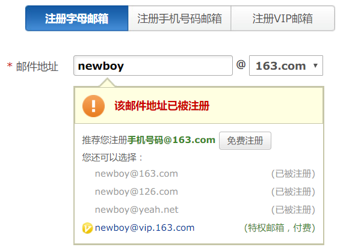
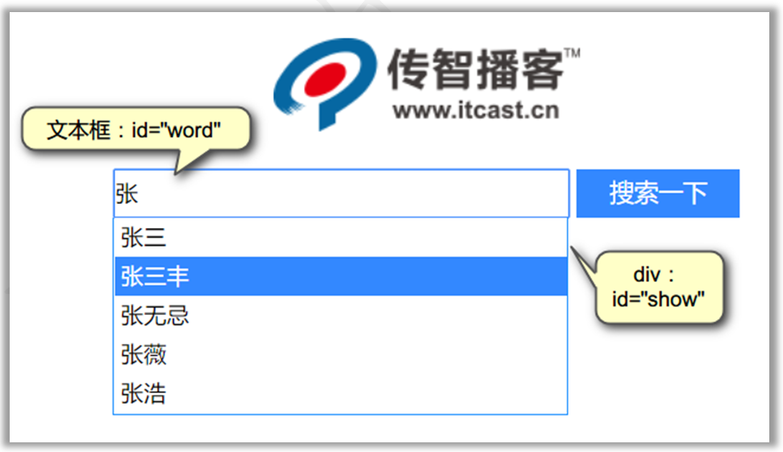

# AJAX&JSON

## 一. AJAX的概述

### 1.1 什么是ajax

 

​	**异步JavaScript和XML (Asynchronous Javascript And XML)**

> 前端用于发起异步请求的技术: 基于js和xml诞生的,xml被淘汰换成json

1. 异步的访问方式

2. 使用到的技术：JavaScript和XML

   a. JavaScript：用于后台请求的发送和响应数据的接收，(以前提交表单或在浏览器上输入地址)。

   b. XML：用于封装服务器发送的大量的数据，因为XML无关的数据太多，而且解析比较麻烦。所以目前几乎不再使用了，使用JSON格式来代替。

   ```xml
   <contactList>
      <contact> 
         <id>1</id>
         <name>潘金莲</name>
         <sex>女</sex>
         <address>烧饼店</address>
      </contact>
      <contact> 
         <id>2</id>
         <name>武大</name>
         <sex>男</sex>
         <address>烧饼连锁店</address>
       </contact>
   </contactList>
   ```


### 1.2 同步和异步的区别

同步方式：浏览器与服务器是串行的操作，浏览器发工作的时候，服务器没有处理数据的。服务器在工作的时候，浏览器只能等待。以前使用JSP开发的方式都是同步的方式。

缺点：执行效率低，用户体验差。

异步方式：以后逐渐会使用异步的开发，浏览器与服务器是并行工作的。

优点：执行效率高，用户体验更好。

很大企业开发中，是同步和异步并存的方式。	


​	AJAX使用异步的提交方式，浏览器与服务器可以并行操作，即浏览器后台发送数据给服务器。用户在前台还是可以继续工作。用户感觉不到浏览器已经将数据发送给了服务器，并且服务器也已经返回了数据。




### 1.3 AJAX的应用场景

#### 1.3.1 检查用户名是否已被注册

​	很多站点的注册页面都具备自动检测用户名是否存在的友好提示，该功能整体页面并没有刷新，但仍然可以异步与服务器端进行数据交换，查询用户的输入的用户名是否在数据库中已经存在。   

                                                     

####  1.3.2 省市下拉框联动

​	很多站点都存在输入用户地址的操作，在完成地址输入时，用户所在的省份是下拉框，当选择不同的省份时会出现不同的市区的选择，这就是最常见的省市联动效果。

    

####  1.3.3 内容自动补全

百度的搜索补全功能：

     

京东的搜索补全功能：


## 二. 原生ajax的访问流程[了解]

### 1.1 AJAX的执行流程


流程说明：

1. 用户访问的时候，由JavaScript后台创建一个请求对象：XMLHttpRequest对象。
2. 请求对象创建一个回调函数，回调函数用于处理服务器返回的响应
3. 请求对象用于发送请求给服务器
4. 服务器接收到浏览器发过来的请求，并且对数据进行处理。
5. 将数据以XML的格式发送回浏览器，由XMLHttpRequest请求对象的回调函数接收数据
6. 使用HTML和CSS更新网页最新结果


### 1.2 XMLHttpRequest对象

​	学习XMLHttpRequest对象有哪些事件，方法和属性

| **创建XMLHttpRequest对象** | **说明**             |
| -------------------------- | -------------------- |
| **new XMLHttpRequest()**   | 构造方法直接创建对象 |

| **XMLHttpRequest对象的事件** | **说明**                                                     |
| ---------------------------- | ------------------------------------------------------------ |
| **on ready state change**    | 准备状态改变事件，这个事件是在以下情况激活：<br />1. 浏览器开始发送数据给服务器的时候<br />2. 浏览器数据发送完毕的时候<br />3. 服务器开始发送数据给浏览器的时候<br />4. 服务器数据发送完毕的时候 |

| **XMLHttpRequest对象的属性** | **说明**                                              |
| ---------------------------- | ----------------------------------------------------- |
| **readyState**               | 准备状态的值，当它等于4的时候，表示服务器数据接收完毕 |
| **status**                   | 服务器的状态码。等于200的时候，服务器正确响应         |
| **responseText**             | 接收服务器返回的字符串数据                            |

| **XMLHttpRequest对象的方法** | **说明**                                                     |
| ---------------------------- | ------------------------------------------------------------ |
| **open("GET","URL",true)**   | 打开服务器的连接<br />1. GET或POST表示请求的方式<br />2. URL访问服务器的地址<br />3. true/false 表示异步，false表示同步。<br />同步是指要等待服务器响应回来以后，才继续向后执行。 |
| **send()**                   | 发送请求，如果是GET方法send()不需要参数。<br />如果是POST，send()需要传递浏览器端的数据 |


### 1.3 案例：使用原生的AJAX判断用户名是否存在

​	用户注册时输入一个用户名，失去焦点以后，通过ajax后台判断用户名是否存在。服务器先不访问数据库，直接判断用户名，如果用户名为newboy，则表示用户已经存在，否则用户名可以注册使用。


**服务器端步骤**

1. 编写Demo1UserExistsServlet
2. 设置响应的类型为text/plain;charset=utf-8，纯文本的数据。如：\<br/>不会换行
3. 得到客户端发送过来的数据：request.getParameter()
4. 如果用户名忽略大小写比较等于newboy，则向客户端打印"用户名已经存在"，否则打印"恭喜你，可以注册"


```java
@WebServlet("/MyServlet")
public class MyServlet extends javax.servlet.http.HttpServlet {

    protected void doGet(javax.servlet.http.HttpServletRequest request, javax.servlet.http.HttpServletResponse response) throws javax.servlet.ServletException, IOException {
        this.doPost(request, response);
    }

    protected void doPost(javax.servlet.http.HttpServletRequest request, javax.servlet.http.HttpServletResponse response) throws javax.servlet.ServletException, IOException {
        String name = request.getParameter("name");
        String age = request.getParameter("age");
        System.out.println("接收到ajax发送的请求了:" + name + "," + age);
        response.getWriter().print("hello");
    }

}
```

**客户端步骤**

1. 文本框失去焦点，得到文本框中的姓名
2. 创建XMLHttpRequest请求对象
3. 设置请求对象的onreadystatechange事件，即"准备状态改变"事件。
4. 当readyState等于4，并且服务器status响应码为200则表示响应成功
5. 通过responseText得到响应的字符串
6. 如果用户存在，在后面的span显示"用户名已经存在"
7. 不存在，在后面的span中显示"恭喜你，可以注册"。
8. 设置请求的URL，将用户名以url参数传递
9. 调用open方法，设置提交给服务器的请求方式和访问地址
10. 调用send方法发送请求


```html
<!DOCTYPE html>
<html lang="zh-CN">
<head>
    <meta charset="UTF-8">
    <title>Title</title>
</head>
<body>
        <input type="button" value="发起原生ajax请求的按钮_get" onclick="method01()">
        <input type="button" value="发起原生ajax请求的按钮_post" onclick="method02()">

        <script>
            function method01() {
                //1. 创建ajax引擎对象
                var xhr = new XMLHttpRequest();
                //2. 设置监听事件
                    /*
                    *  事件的触发: readyState 改变的时候触发
                    *       5种状态 会有4次改变(0->1->2->3->4)
                    *
                    * */
                xhr.onreadystatechange = function(){
                    // console.log("打印会有4次")
                    if(xhr.readyState == 4 ){//响应状态已就绪

                        if(xhr.status==200){
                            console.log(xhr.responseText) // 字符串形式的响应数据
                            // document.write(xhr.responseText) // 字符串形式的响应数据
                        }else{
                            alert("请联系网管~~")
                        }

                    }
                }


                //3. 请求设置
                /*
                *   open(method,url,async)
                * a. method 请求方式
                * b. url 请求地址
                * c. true 异步  false 同步
                * */
                xhr.open("get","/day09/MyServlet?name=zs&age=18",true)

                //4. 发送请求
                    // post请求参数写在send函数参数中
                xhr.send()
            }

        </script>

        <script>
            function method02() {

                var xhr = new XMLHttpRequest();

                xhr.onreadystatechange = function(){
                    if(xhr.readyState == 4 ){//响应状态已就绪

                        if(xhr.status==200){
                            console.log(xhr.responseText) // 字符串形式的响应数据
                            // document.write(xhr.responseText) // 字符串形式的响应数据
                        }else{
                            alert("请联系网管~~")
                        }

                    }
                }


                //3. 请求设置
                /*
                *   open(method,url,async)
                * a. method 请求方式
                * b. url 请求地址
                * c. true 异步  false 同步
                * */
                xhr.open("post","/day09/MyServlet",true)

                //4. 发送请求
                // post请求参数写在send函数参数中
                //普通的post请求的请求体,浏览器自动进行url编码
                //ajax不会进行url编码,要手动设置
                xhr.setRequestHeader("content-type","application/x-www-form-urlencoded")
                xhr.send("name=zs&age=18")
            }

        </script>
        <!--<form action="" enctype="application/x-www-form-urlencoded"></form>-->

</body>
</html>
```


## 三. JQuery的Ajax封装【会用】

​	jquery作为一个优秀的js框架, 自然也会对ajax的复杂的api进行封装:


### 3.3.1 get/post 函数(要背下来)

```markdown
* 1. get请求方式
	$.get(url, [data], [callback], [type])
		1. url : 请求的服务器端url地址
		2. data : 发送给服务器端的请求参数，格式可以是key=value，也可以是json对象
		3. callback: 当请求成功后的回掉函数，可以在函数体中编写我们的逻辑代码
		4. type : 预期的返回数据的类型，取值可以是 xml, html, script, json, text					(主要text和json两种)
		
* 2. post请求方式 :
	$.post(url, [data], [callback], [type])
		只需要将get函数换成post即可(参数含义同上)

```

```html
<!DOCTYPE html>
<html lang="zh-CN">
<head>
    <meta charset="UTF-8">
    <title>Title</title>
    <script src="js/jquery-3.3.1.js"> </script>
</head> 
<body>
     <input type="button" value="jquery的ajax请求_get" onclick="method01()"> <br>
     <input type="button" value="jquery的ajax请求_post" onclick="method02()"> <br>
     <input type="button" value="jquery的ajax请求_ajax" onclick="method03()"> <br>

     <script>
         function method01() {
            /*
                $.get(url, [data], [callback], [type])
                $.post(url, [data], [callback], [type])
                        在前端文档,当你看到[],表示此参数可传可不传
            *
            *   1. url : 请求地址
            *   2. data : 请求参数
            *   3. callback : 响应成功后的回调函数
            *       functon(result) { result : 响应回来的数据}
            *   4. type : 指定响应数据类型(text,json)
            *
            * */
            let param = "name=ww&age=19"
             let callback = function(result){
                 console.log(result);
             }
            $.get("/day09/MyServlet22",param,callback,"text")
         }
     </script>
     <script>
         function method02() {

             let param = "name=ml&age=20"
             let callback = function(result){
                 console.log(result);
             }
             $.post("/day09/MyServlet",param,callback,"text")
         }
     </script>
</body>
</html>
```


### 3.3.2 ajax函数(看得懂,会抄)

```markdown
* 语法：
		$.ajax({name:value,name:value})
	
* 参数：
	1. url	: 请求的服务器端url地址
	2. async : (默认: true) 默认设置下，所有请求均为异步请求。如果需要发送同步请求,设置false
	3. data : 发送到服务器的数据，可以是键值对形式，也可以是js对象形式
	4. type : (默认: "GET") 请求方式 ("POST" 或 "GET")
	5. dataType : 预期的返回数据的类型(默认text,常用json)
	6. success	: 请求成功后的回调函数
	7. error	: 请求失败时调用此函数
	这些参数,是可以选择性的写
	
* 总结: 在实际使用中, 比get/post请求多考虑了失败的情况
	
```


```html
 <input type="button" value="jquery的ajax请求_ajax" onclick="method03()"> <br>

     <script >
         /*   let jsObj = {name : "zs",
                   age : 18,
                   show : function () {
                       console.log("show")
                   }}

     jsObj.show()
     console.log(jsObj.name + "," + jsObj.age)

     */
         function method03() {
             /*
             * ajax完整请求:
             *      $.ajax(settings)
             *          a.  jsObj = {name : value,name2 : value...}
             *          b. settings就是js对象
             * */

             let settings = {
                 url:"http://localhost:8080/day09/MyServlet", // 请求地址
                 type:"get",        // 请求方式,默认是get
                 data:"name=qq&age=33", // 请求参数(text,json)
                 success:function (resp) {  // 成功响应的回调, resp是响应数据
                     // 实现局部刷新
                     console.log(resp)
                 },
                 error:function () { //失败的回调 : 如果访问失败,会执行这个函数
                     alert('网络信号不好,服务器繁忙，请稍后重试...')
                 },
                 dataType:"text",  // 响应数据的格式(主要text,json)
                 async:true // 异步提交(默认true, 如果设置false是同步)
             }

             $.ajax(settings)

         }

     </script>
```

### 3.3.3 检查用户名是否已被注册

```markdown
#需求: 
	   a. 有一个注册的表单, 有注册用户名和密码,一个提交按钮
	   b. 用户名输完之后,检测这个用户名是否可用
	   c. 就算服务器没有立即响应, 用户还能继续在表单上操作
#分析:
	1. 用户名输入框注册一个失去焦点事件(onblur)
	2. 向服务器发送 异步 请求
	3. 服务器响应之后, 提示信息局部更新到页面上
	   
```


```html
<!DOCTYPE html>
<html lang="zh-CN">
<head>
    <meta charset="UTF-8">
    <title>Title</title>
    <script src="js/jquery-3.3.1.js"></script>
</head>
<body>
        <h3>注册页面</h3>
        <!--
            同步请求: 一次请求未结束,另一请求不能继续发送
        -->
        <form action="/day09/MyServlet" method="get">
            <input type="text" name="username" placeholder="请输入用户名" id="myid">
                <span style="color: red" id="myspan"></span>
            <br>
            <input type="password" name="password" placeholder="请输入密码"> <br>
            <input type="submit">
        </form>

        <script>
            /*
            * #分析:
                1. 用户名输入框注册一个失去焦点事件(onblur)
                2. 向服务器发送 异步 请求
                3. 服务器响应之后, 提示信息局部更新到页面上
            * */
            $("#myid").blur(function () {
                let url = "/day09/CheckServlet"
                let data = "name=" + this.value // 这样可以
                console.log("request:" + data)
                let callback = function(result){
                    //TODO:
                    console.log("response:" + result)
                    $("#myspan").text(result)
                }

                $.get(url,data,callback,"text")
            })
        </script>
</body>
</html>
```


```java
package com.itheima01.ajax;

import javax.servlet.ServletException;
import javax.servlet.annotation.WebServlet;
import javax.servlet.http.HttpServlet;
import javax.servlet.http.HttpServletRequest;
import javax.servlet.http.HttpServletResponse;
import java.io.IOException;

@WebServlet("/CheckServlet")
public class CheckServlet extends HttpServlet {

    protected void doGet(HttpServletRequest request, HttpServletResponse response) throws ServletException, IOException {
        this.doPost(request, response);
    }

    protected void doPost(HttpServletRequest request, HttpServletResponse response) throws ServletException, IOException {
        response.setContentType("text/html;charset=utf-8");
        String name = request.getParameter("name");

        //伪数据: jack 代替已存在的用户名
        if("jack".equalsIgnoreCase(name)){
            response.getWriter().print("用户已存在,请换一个");
        }else{
            response.getWriter().print("此用户名可以使用");
        }
    }

}
```


## 四.  JSON

### 4.1 JSON概述

JavaScript对象表示形式（JavaScript Object Notation : js对象简谱）

> json是一种js对象文本表示形式
>
> json是目前前后端数据交互的主要格式之一

```markdown
* java对象表示形式
		User user = new User();
			user.setUsername("后羿");
			user.setAge(23);
			user.setSex("男");
			...
			
		Product product = new Product();
			product.setName("小米10");
			product.setDesc("1亿像素的手机小王子");
			
* javaScript对象表示形式
		let user ={"username":"后羿","age":23,"sex":"男"}
		let product = {"name":"小米10","desc":"1亿像素的手机小王子"}
```


json可以取代XML笨重的数据结构，和xml相比：更小、更快，更易解析

> json、xml作用：作为数据的载体，在网络中传输


### 4.2 JSON基础语法

```markdown
#json的语法主要有两种:
        1. 对象 { }
        2. 数组 [ ]
        
1. 对象类型
		{name:value,name:value}
		
2. 数组类型
		[
            {name:value,name:value},
            {name:value,name:value},
            {name:value,name:value}
		]
		
3. 复杂对象
		{
            name:value,
            list:[{name:value},{},{}]
            user:{name:value}
		}
#注意: 
	1. 其中name必须是string类型
	2. value必须是以下数据类型之一：
		字符串
		数字
		对象（JSON 对象）
		数组
		布尔
		Null
	3. JSON 中的字符串必须用双引号包围。(单引号不行!)	
```


```html
<!DOCTYPE html>
<html lang="zh-CN">
<head>
    <meta charset="UTF-8">
    <title>Title</title>
</head>
<body>

        <script>
            /*
            * json的类型
            *   1. 对象  { }
            *   2. 数组  [ ]
            *
            *   a. 对象
            *       {name : value , name : value}
            *
            *    b. 数组
            *       [元素1, 元素2...]
            *
            *    c. 复杂
            *       {
            *           "name" : "jack",
            *           "wives" : ["高圆圆","柳岩","贾静雯"],
            *           "son" : {"name" : "瘪三", "age" : 18}
            *       }
            *
            *       #注意:
                    1. 其中name必须是string类型
                    2. value必须是以下数据类型之一：
                        字符串
                        数字
                        对象（JSON 对象）
                        数组
                        布尔
                        Null
                    3. JSON 中的字符串必须用双引号包围。(单引号不行!)
            * */

            let jsonObj = {"name" : "jack","age" : 18,"married" : true}
            console.log(jsonObj.age + "," + jsonObj.married)

            let jsonArray1 = ["张三","李四",true]
            let jsonArray2 = [
                                 {"name" : "jack","age" : 18,"married" : true},
                                 {"name" : "rose","age" : 19,"married" : false}
                             ]

            console.log(jsonArray2[1].age)


            let jsonComplex =  {"name" : "jack",
                                "wives" : ["高圆圆","柳岩","贾静雯"],
                                "son" : {"name" : "瘪三", "age" : 18}
                                }
            console.log(jsonComplex.wives[2])
        </script>
</body>
</html>
```


### 4.3 JSON格式转换

```markdown
* JSON对象与字符串转换的相关函数
	语法：
    	1. JSON.stringify(object) 把json对象转为字符串
    
    	2. JSON.parse(string) 把字符串转为json对象
```

```html
<!DOCTYPE html>
<html lang="zh-CN">
<head>
    <meta charset="UTF-8">
    <title>Title</title>
</head>
<body>
        <script >
            /*
            * * JSON对象与字符串转换的相关函数
                语法：
                    1. JSON.stringify(object) 把json对象转为字符串(知道,没什么运用)

                    2. JSON.parse(string) 把字符串转为json对象 (掌握)

                场景:
                        服务器给浏览器响应数据 : json格式的字符串
                        a. json在js中是对象
                        b. json在java是字符串

                       浏览器给服务器发送的请求数据:
                        如果是json对象,自动变成字符串
            * */

            //这是json对象
            let json = {"name" : "张三","age" : 18}

            // js字符串可以是单引或双引, json字符串必须是双引
                //json格式的字符串
            let jsonStr = '{"name" : "张三","age" : 18}'
            console.log(typeof jsonStr) // string
            console.log(jsonStr.name) // undefined

                //json格式的字符串 -> json对象 (重要!!!)
            let jsonObj = JSON.parse(jsonStr);
            console.log(typeof jsonObj) // object
            console.log(jsonObj.name) // "张三"

            //对象 -> 字符串
            let str = JSON.stringify(json)
            console.log(typeof str) // string
            console.log(str.name) // undefined

        </script>

</body>
</html>
```


### 4.4 将Java对象转成JSON字符串

**需求**

​	在服务器端有如下User代码，要转成符合JSON格式的字符串响应给浏览器，首先自己采用字符串拼接的方式输出。

```java
public class User {

    private String name;
    private Integer age;
    private boolean married;

    public User() {
    }

    public User(String name, Integer age, boolean married) {
        this.name = name;
        this.age = age;
        this.married = married;
    }

    public String toJson() {
        return "{\"name\":\""+name+"\",\"age\":"+age+",\"married\":"+married+"}";
    }

      @Override
    public String toString() {
        return "User{" +
                "name='" + name + '\'' +
                ", age=" + age +
                ", married=" + married +
                '}';
    }

    public String getName() {
        return name;
    }

    public void setName(String name) {
        this.name = name;
    }

    public Integer getAge() {
        return age;
    }

    public void setAge(Integer age) {
        this.age = age;
    }

    public boolean isMarried() {
        return married;
    }

    public void setMarried(boolean married) {
        this.married = married;
    }
}

```

#### 4.4.1 json转换工具的概述

​	json的转换工具是通过java封装好的一些jar工具包，直接将java对象或集合转换成json格式的字符串。

**常见的json转换工具**


#### **4.4.2 使用步骤**

1. 导包json的三个jar包

    

2. 在Servlet或main函数中调用jackson的类：ObjectMapper

3. 调用类中的方法String writeValueAsString(对象或集合)

   | **ObjectMapper对象中的方法**              | **说明**                       |
   | ----------------------------------------- | ------------------------------ |
   | **String writeValueAsString(Object   o)** | 将一个对象转成JSON格式的字符串 |

##### 

```java
/*
*   使用JackSon
*   1. 导入3个jar包
*   2. 写两行代码
*
*       java各种类型对象 变成 json格式字符串
* */
public class Demo02 {

    @Test
    public void method01() throws JsonProcessingException {

        User user = new User("李四", 18, true);

        //1. 创建一个对象映射器
        ObjectMapper om = new ObjectMapper();
        //2. 将对象转成字符串
        String s = om.writeValueAsString(user);
        System.out.println(s);
    }

    @Test
    public void method02() throws JsonProcessingException {

        User user1 = new User("张三", 19, true);
        User user2 = new User("李四", 18, false);
        User user3 = new User("王五", 15, true);

        ArrayList<User> list = new ArrayList<>();
        Collections.addAll(list,user1,user2,user3);

        //1. 创建一个对象映射器
        ObjectMapper om = new ObjectMapper();
        //2. 将对象转成字符串
        String s = om.writeValueAsString(list);
        System.out.println(s);

    }

    @Test
    public void method03() throws JsonProcessingException {

        User user1 = new User("张三", 19, true);
        User user2 = new User("李四", 18, false);
        User user3 = new User("王五", 15, true);

        ArrayList<User> list = new ArrayList<>();
        Collections.addAll(list,user1,user2,user3);

        HashMap<String, Object> map = new HashMap<>();
        map.put("name","韦小宝");
        map.put("wives",list);

        //1. 创建一个对象映射器
        ObjectMapper om = new ObjectMapper();
        //2. 将对象转成字符串
        String s = om.writeValueAsString(map);
        System.out.println(s);

    }
}

```


### 4.5 ajax和json综合练习


  


```html
<!DOCTYPE html>
<html lang="zh-CN">
<head>
    <meta charset="UTF-8">
    <title>Title</title>
    <script src="js/jquery-3.3.1.js"></script>
</head>
<body>
        <input type="button" value="发送ajax异步请求的按钮" onclick="method01()">

        <script>
            function method01() {
                let url = "/day09/UnionServlet"
                /*
                *   请求参数格式:
                *       1. text
                *       2. json
                * */
                let data = {"name":"钱七","age" : 25}

                let callback = function(result){
                    // 把json格式的字符串 解析成 对象
                    // result = JSON.parse(result)
                    console.log(typeof result);
                    console.log(result);
                    console.log(result.married);
                }
                /*
                 TODO:
                *   响应json格式字符串 -> json对象 三种解决方法
                *
                *   1. dataType = json
                *   2. result = JSON.parse(result)
                *           --> 前端解决
                *   3. response.setContentType("application/json;charset=utf-8");
                *           --> 后端解决
                * */
                // let dataType = "json"
                // $.get(url,data,callback,dataType)

                $.get(url,data,callback)
            }
        </script>
</body>
</html>
```


```java
@WebServlet("/UnionServlet")
public class UnionServlet extends HttpServlet {

    protected void doGet(HttpServletRequest request, HttpServletResponse response) throws ServletException, IOException {
        this.doPost(request, response);
    }

    protected void doPost(HttpServletRequest request, HttpServletResponse response) throws ServletException, IOException {
        //获取请求参数
        String name = request.getParameter("name");
        String age = request.getParameter("age");

        System.out.println("请求参数:" + name + "," + age);

        //响应json格式的字符串
        User user = new User("赵八", 99, false);

        String json = new ObjectMapper().writeValueAsString(user);
        /*
        *   服务器通过响应头,以json格式化解析响应体数据
        *       application/json (mime类型)
        * */
//        response.setContentType("text/html;charset=utf-8");
        response.setContentType("application/json;charset=utf-8");
        response.getWriter().print(json);

    }

}
```


## 五.综合案例


### 案例1：省市级联

**需求**

页面上有两个下拉列表框，页面加载的时候访问数据库，得到所有的省份显示在第1个列表框中。当选择不同的省份的时候，加载这个省份下所有的城市显示在第二个下拉列表中。

**效果**

 

**流程分析**


**表中的数据**

 

**sql语句**

```mysql
-- 同一张表中包含省和市
create table `area` (
`id` int primary key,
`name` varchar (50),
`pid` int   -- 父级的id，如果为0，表示没有父元素
); 

-- pid为0表示省，否则为某一个省下面的市
insert into `area` (`id`, `name`, `pid`) values(1,'广东省',0);
insert into `area` (`id`, `name`, `pid`) values(2,'湖南省',0);
insert into `area` (`id`, `name`, `pid`) values(3,'广西省',0);
insert into `area` (`id`, `name`, `pid`) values(4,'深圳',1);
insert into `area` (`id`, `name`, `pid`) values(5,'广州',1);
insert into `area` (`id`, `name`, `pid`) values(6,'东莞',1);
insert into `area` (`id`, `name`, `pid`) values(7,'长沙',2);
insert into `area` (`id`, `name`, `pid`) values(8,'株洲',2);
insert into `area` (`id`, `name`, `pid`) values(9,'湘潭',2);
insert into `area` (`id`, `name`, `pid`) values(10,'南宁',3);
insert into `area` (`id`, `name`, `pid`) values(11,'柳州',3);
insert into `area` (`id`, `name`, `pid`) values(12,'桂林',3);

select * from `area`;
```

**Area实体类**

```java
public class Area {

    private Integer id;
    private String name;
    private Integer pid;

    @Override
    public String toString() {
        return "Area{" +
                "id=" + id +
                ", name='" + name + '\'' +
                ", pid=" + pid +
                '}';
    }

    public Integer getId() {
        return id;
    }

    public void setId(Integer id) {
        this.id = id;
    }

    public String getName() {
        return name;
    }

    public void setName(String name) {
        this.name = name;
    }

    public Integer getPid() {
        return pid;
    }

    public void setPid(Integer pid) {
        this.pid = pid;
    }
}
```

**核心配置文件**

```xml
<?xml version="1.0" encoding="UTF-8" ?>
<!DOCTYPE configuration
        PUBLIC "-//mybatis.org//DTD Config 3.0//EN"
        "http://mybatis.org/dtd/mybatis-3-config.dtd">
<configuration>
    <!--加载外部资源文件-->
    <properties resource="jdbc.properties"/>

    <settings>
        <!--在控制台显示SQL语句-->
        <setting name="logImpl" value="STDOUT_LOGGING"/>
    </settings>

    <typeAliases>
        <!--扫描pojo下的所有javabean-->
        <package name="com.itheima04.example.pojo"/>
    </typeAliases>

    <!--mybatis环境的配置-->
    <environments default="development">
        <environment id="development">
            <!--事务管理器：由JDBC来管理-->
            <transactionManager type="JDBC"/>
            <!--数据源的配置：mybatis自带的连接池-->
            <dataSource type="POOLED">
                <property name="driver" value="${jdbc.driver}"/>
                <property name="url" value="${jdbc.url}"/>
                <property name="username" value="${jdbc.username}"/>
                <property name="password" value="${jdbc.password}"/>
            </dataSource>
        </environment>

    </environments>
    <mappers>
        <!--xml配置: 文件路径 -->
      <!--  <mapper resource="com/itheima/user/dao/UserMapper.xml"/>-->
        <!--注解 : 配置接口所在的位置-->
         <package name="com.itheima04.example.dao"/>
    </mappers>
</configuration>
```

**工具类**

```java
public class SqlSessionUtil {

    private static SqlSessionFactory factory;
    static {
        //实例化工厂建造类
        SqlSessionFactoryBuilder builder = new SqlSessionFactoryBuilder();
        //读取核心配置文件
        try (InputStream inputStream = Resources.getResourceAsStream("sqlMapConfig.xml")) {
            //创建工厂对象
            factory = builder.build(inputStream);
        } catch (IOException e) {
            e.printStackTrace();
        }
    }

    /**
     得到会话对象
     @return 会话对象
     */
    public static SqlSession getSession() {
        return factory.openSession();
    }

    /**
     得到会话对象
     @param isAutoCommit 是否自动提交事务
     */
    public static SqlSession getSession(boolean isAutoCommit) {
        return factory.openSession(isAutoCommit);
    }

    /**
     得到工厂对象
     @return 会话工厂对象
     */
    public static SqlSessionFactory getSqlSessionFactory() {
        return factory;
    }

}
```


**代码:** 

```html
<!DOCTYPE html>
<html lang="en">
<head>
    <meta charset="UTF-8">
    <title>省市级联</title>
    <script type="text/javascript" src="js/jquery-3.3.1.js"></script>

</head>
<body>
<!--
    静态数据写死在前端: 省市可以
    动态数据必须服务器获取

    需求: 级联数据是动态变化的, 就要从服务器的数据库获取

    数据表的设计 : 自关联

    分析:
        0. sql:
            查询所有的省 : select * from area where pid = 0;
            查询某个省对应的市 : select * from area where pid = ?;

        1. 获取省
            a. 前端: (js是一种事件驱动型语言)
                1. 事件: 页面加载事件
                2. 局部刷新: 异步请求
                3. 请求地址 : /day09/ProvinceServlet
                4. 请求参数

            b. 后端:
                 1. 查询数据库,返回结果 List<Area> list
                 2. list 转成 json格式字符串
                 3. 进行响应给浏览器

            c. 前端:
                  1. 获取数据, 填充到页面上

        2. 获取市
             a. 前端:
                1. 事件: 省下拉框的onchange事件
                2. 局部刷新: 异步请求
                3. 请求地址 : /day09/CityServlet
                4. 请求参数 : pid=?

            b. 后端:
                 1. 查询数据库,返回结果 List<Area> list
                 2. list 转成 json格式字符串
                 3. 进行响应给浏览器

            c. 前端:
                  1. 获取数据, 填充到页面上
-->
<select id="province" onchange="method01(this.value)">
    <option>---请选择省---</option>
</select>
<select id="city">
    <option>---请选择城市---</option>
</select>

<script>
    /*获取省数据*/
    $(function () {
        $.get("/day09/ProvinceServlet",function (result) {
            //TODO:
            console.log(result);
            for(let element of result){
                // es6字符串模板: 反引号(esc下面), ${变量}取值
                $("#province").append(`<option value='${element.id}'>${element.name}</option>`)
            }

        },"json")
    })
</script>
<script>
    function method01(value) {

        $.get("/day09/CityServlet",`pid=${value}`,function (result) {
            //TODO:
            console.log(result);
            $("#city").html(` <option>---请选择城市---</option>`) // 内部重置 

            // $("#city").empty()
            // $("#city").append(`<option>---请选择城市---</option>`)
            for(let element of result){
                // es6字符串模板: 反引号(esc下面), ${变量}取值
                $("#city").append(`<option value='${element.id}'>${element.name}</option>`)
            }
        })
    }
</script>

</body>
</html>
```


```java

@WebServlet("/ProvinceServlet")
public class ProvinceServlet extends HttpServlet {

    protected void doGet(HttpServletRequest request, HttpServletResponse response) throws ServletException, IOException {
        this.doPost(request, response);
    }

    protected void doPost(HttpServletRequest request, HttpServletResponse response) throws ServletException, IOException {

        AreaService service = new AreaService();
        List<Area> list = service.findAllProvince();

        String json = new ObjectMapper().writeValueAsString(list);
        response.setContentType("text/html;charset=utf-8");
        response.getWriter().print(json);
    }

}
```

#### 

```java

@WebServlet("/CityServlet")
public class CityServlet extends HttpServlet {

    protected void doGet(HttpServletRequest request, HttpServletResponse response) throws ServletException, IOException {
        this.doPost(request, response);
    }

    protected void doPost(HttpServletRequest request, HttpServletResponse response) throws ServletException, IOException {

        String pid = request.getParameter("pid");

        AreaService service = new AreaService();
        List<Area> list = service.findCity(pid);

        String json = new ObjectMapper().writeValueAsString(list);
            //后端指定json
        response.setContentType("application/json;charset=utf-8");
        response.getWriter().print(json);
    }

}
```


```java

public class AreaService {

    public List<Area> findAllProvince() {
        SqlSession session = SqlSessionUtil.getSession(true);

        AreaDao dao = session.getMapper(AreaDao.class);

        List<Area> list = dao.findAllProvince();

        session.close();
        return list;
    }

    public List<Area> findCity(String pid) {
        SqlSession session = SqlSessionUtil.getSession(true);

        AreaDao dao = session.getMapper(AreaDao.class);

        List<Area> list = dao.findCityByPid(pid);

        session.close();
        return list;
    }
}

```

#### 

```java
public interface AreaDao {
    @Select("select * from area where pid = 0")
    List<Area> findAllProvince();
    @Select("select * from area where pid = #{pid}")
    List<Area> findCityByPid(String pid);
}
```


### 案例2：自动补全项目搭建

**需求**

在输入框输入关键字，下拉框中异步显示与该关键字相关的用户名称

**分析**

1. 查询以输入的关键字开头的用户
2. 文本框使用keyup事件，得到文本框中的值，去掉前后空格。如果文本框的内容为空则不提交给服务器。
3. 查询成功的回调函数中如果返回的用户数大于0才进行div的拼接，拼接以后显示在div中。
4. 否则要隐藏div。
5. 给大div中的子div绑定鼠标点击事件，点击某个名字则将div的文本内容显示在文本框中，并隐藏div


**效果**




**导入数据库脚本**

```mysql
CREATE TABLE `user` (
  `id` int(11) NOT NULL AUTO_INCREMENT,
  `name` varchar(32) DEFAULT NULL,
  `password` varchar(32) DEFAULT NULL,
  PRIMARY KEY (`id`)
);

INSERT INTO `user` VALUES (1, '张三', '123');
INSERT INTO `user` VALUES (2, '李四', '123');
INSERT INTO `user` VALUES (3, '王五', '123');
INSERT INTO `user` VALUES (4, '赵六', '123');
INSERT INTO `user` VALUES (5, '田七', '123');
INSERT INTO `user` VALUES (6, '孙八', '123');
INSERT INTO `user` VALUES (7, '张三丰', '123');
INSERT INTO `user` VALUES (8, '张无忌', '123');
INSERT INTO `user` VALUES (9, '李寻欢', '123');
INSERT INTO `user` VALUES (10, '王维', '123');
INSERT INTO `user` VALUES (11, '李白', '123');
INSERT INTO `user` VALUES (12, '杜甫', '123');
INSERT INTO `user` VALUES (13, '李贺', '123');
INSERT INTO `user` VALUES (14, '李逵', '123');
INSERT INTO `user` VALUES (15, '宋江', '123');
INSERT INTO `user` VALUES (16, '王英', '123');
INSERT INTO `user` VALUES (17, '鲁智深', '123');
INSERT INTO `user` VALUES (18, '武松', '123');
INSERT INTO `user` VALUES (19, '张薇', '123');
INSERT INTO `user` VALUES (20, '张浩', '123');
INSERT INTO `user` VALUES (21, '刘小轩', '123');
INSERT INTO `user` VALUES (22, '刘浩宇', '123');
INSERT INTO `user` VALUES (23, '刘六', '123');
```

**编写实体类**

```java

public class User3 {
    private Integer id;
    private String name;
    private String password;

    @Override
    public String toString() {
        return "User3{" +
                "id=" + id +
                ", name='" + name + '\'' +
                ", password='" + password + '\'' +
                '}';
    }

    public Integer getId() {
        return id;
    }

    public void setId(Integer id) {
        this.id = id;
    }

    public String getName() {
        return name;
    }

    public void setName(String name) {
        this.name = name;
    }

    public String getPassword() {
        return password;
    }

    public void setPassword(String password) {
        this.password = password;
    }
}

```

**代码**

```html
<!DOCTYPE html>
<html lang="zh-CN">
<head>
    <meta charset="UTF-8">
    <title>自动完成</title>
    <style type="text/css">
        .content {
            width: 400px;
            margin: 30px auto;
            text-align: center;
        }

        input[type='text'] {
            box-sizing: border-box;
            width: 280px;
            height: 30px;
            font-size: 14px;
            border: 1px solid #38f;
        }

        input[type='button'] {
            width: 100px;
            height: 30px;
            background: #38f;
            border: 0;
            color: #fff;
            font-size: 15px;
        }

        #show {
            box-sizing: border-box;
            position: relative;
            left: 7px;
            font-size: 14px;
            width: 280px;
            border: 1px solid dodgerblue;
            text-align: left;
            border-top: 0;
            /*一开始是隐藏不可见*/
            display: none;
        }

        #show div {
            padding: 4px;
            background-color: white;
        }

        #show div:hover {
            /*鼠标移上去背景变色*/
            background-color: #3388ff;
            color: white;
        }
    </style>
    <script type="text/javascript" src="js/jquery-3.3.1.js"></script>
</head>
<body>
    <div class="content">
        <br/><br/>
            <!-- 文本输入框 -->
        <input type="text" name="word" id="word">
        <input type="button" value="搜索一下">
        <ul id="show">

        </ul>
    </div>

<script type="text/javascript">
    /*
    *   需求分析:
    *       0. sql: select * from user where name like ?
    *           ? = keyword%
    *       1. 前端
    *           a. 事件: 键盘抬起 onkeyup
    *           b. 发起异步请求
    *           c. 请求地址: /day09/AutoServlet
    *           d. 请求参数 : keyword=?
    *
    *       2. 后端
    *           a. 查询数据库,返回结果 List<User> list
    *           b. 转成json格式字符串,响应回去
    *
    *       3. 前端
    *           a. 获取数据,显示到页面
    * */
    $("#word").keyup(function () {

        let value = $("#word").val()
        //js中: 空字符串是false
        if(!value){
            $("#show").css("display","none") // 隐藏
            return;
        }

        $.get("/day09/AutoServlet",`keyword=${this.value}`,function (result) {
            //TODO:
            // console.log(result);
            $("#show").empty()
            for(let element of result){
                $("#show").css("display","block")//显示
                $("#show").append(`<li onclick="method02('${element.name}')" >${element.name}</li>`)
            }

        },"json")
    })
</script>
<script >
    function method02(value) {

        $("#word").val(value)
    }
</script>
</body>
</html>

```


```java
@WebServlet("/AutoServlet")
public class AutoServlet extends HttpServlet {

    protected void doGet(HttpServletRequest request, HttpServletResponse response) throws ServletException, IOException {
        this.doPost(request, response);
    }

    protected void doPost(HttpServletRequest request, HttpServletResponse response) throws ServletException, IOException {

        String kd = request.getParameter("keyword");

        AutoService service = new AutoService();
        List<User3> list = service.findAutoComplete(kd);

        String json = new ObjectMapper().writeValueAsString(list);
        response.setContentType("text/html;charset=utf-8");
        response.getWriter().print(json);
    }

}
```

#### 

```java
public interface UserDao {
    /* 记得参数映射*/
//    @Select("select * from user where name like #{kd'%'}") //不行
    @Select("select * from user where name like '${kd}%'")// 可以
    List<User3> findAuto(@Param("kd")String kd);
}
```
