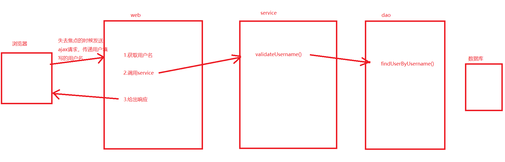
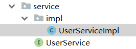
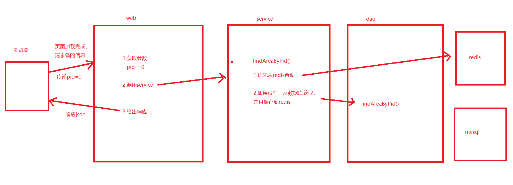

# 课堂笔记

# 1.ajax

## 1.1 ajax介绍

~~~
局部刷新技术，可以在不重新加载整个页面的情况下，针对局部的内容进行更新。

传统请求：浏览器会将服务器的响应显示的浏览器的页面中
ajax请求：浏览器只负责接受服务器给出的响应，但是浏览器不做任何处理。

ajax请求的应用场景：一个网站的所有请求都可以采用ajax请求。
~~~


## 1.2 原生js的ajax请求（理解）

~~~
需求： 点击按钮，在页面显示内容

步骤：
	1.准备页面，绑定点击事件
	2.准备DemoServlet给出响应
	3.在点击事件中发送ajax请求
		a.创建ajax引擎对象
		b.绑定onreadystatechange
		c.通过open设置请求的参数
		d.在通过send方法发送请求
		e.在响应成功的情况下，通过dom操作显示内容
~~~

代码实现：

demoServlet:


```java
package com.itheima.web;

import javax.servlet.ServletException;
import javax.servlet.annotation.WebServlet;
import javax.servlet.http.HttpServlet;
import javax.servlet.http.HttpServletRequest;
import javax.servlet.http.HttpServletResponse;
import java.io.IOException;

@WebServlet(urlPatterns = "/DemoServlet")
public class DemoServlet extends HttpServlet {

    @Override
    protected void doGet(HttpServletRequest request, HttpServletResponse response) throws ServletException, IOException {
        doPost(request, response);
    }

    @Override
    protected void doPost(HttpServletRequest request, HttpServletResponse response) throws ServletException, IOException {

        System.out.println("demoServlet执行了。。");

        response.getWriter().write("success");
    }
}
```

index.html

```html
<!DOCTYPE html>
<html lang="en">
<head>
    <meta charset="UTF-8">
    <title>Title</title>
</head>
<body>
    <input type="button" value="按钮" onclick="js_ajax()">
    <br>
    <div id="mydiv">用来展示后台响应的内容</div>

</body>
<script>
    
    function js_ajax() {
        // a.创建ajax引擎对象
        var request = new XMLHttpRequest();
        // b.绑定onreadystatechange
        /**
         *      readystate: ajax请求的状态信息
         *
         *           0 Uninitialized 初始化状态。XMLHttpRequest 对象已创建或已被 abort() 方法重置。
                     1 Open open() 方法已调用，但是 send() 方法未调用。请求还没有被发送。
                     2 Sent Send() 方法已调用，HTTP 请求已发送到 Web 服务器。未接收到响应。
                     3 Receiving 所有响应头部都已经接收到。响应体开始接收但未完成。
                     4 Loaded HTTP 响应已经完全接收。

                responseText： 响应体
         *
         */
        request.onreadystatechange=function () {
            //alert(request.readyState);
            // e.在响应成功的情况下，通过dom操作显示内容
            /**
             *  request.readyState==4:浏览器已经接受到响应体
             *  request.status==200 ： http协议响应的状态码200，表示ok
             */
            if(request.readyState==4&&request.status==200){
                //获取响应体
                var res = request.responseText;
                //dom操作
                document.getElementById("mydiv").innerHTML=res;
            }
        }
        // c.通过open设置请求的参数
        /**
         *      当前操作的资源   http://localhost:8080/index.html
         *      要访问的资源     http://localhost:8080/DemoServlet
         */
        request.open("get","DemoServlet",true);
        // d.在通过send方法发送请求
        request.send();

    }
</script>
</html>
```


## 1.3 同步异步（理解）

~~~
同步：浏览器在还没有接受到服务器给出的响应时，浏览器处于卡死的状态。无法进行其他操作。 （java单线程）
异步：浏览器在还没有接收到服务器的响应时，浏览器的任何其他操作照样执行，不受任何影响。(ajax请求是子线程去发送的。)

企业开发：基本使用异步。
~~~


# 2.jquery的ajax（照着api写即可）

注意：要引入jquery文件

```html
<!DOCTYPE html>
<html lang="en">
<head>
    <meta charset="UTF-8">
    <title>Title</title>
</head>
<body>
<input type="button" value="jquery_ajax_get" onclick="jquery_get()">
<input type="button" value="jquery_ajax_get" onclick="jquery_post()">
<input type="button" value="jquery_ajax_get" onclick="jquery_ajax()">
<div id="mydiv">用来显示响应的内容</div>
</body>
<!-- 引入jquery文件-->
<script src="js/jquery-2.1.0.js"></script>
<script>

    function jquery_get() {

        /**
         * url:请求的地址:
         * data: 请求的参数，可以是json格式，可以是key=value格式
         * fn:请求成功的回调函数,回调函数的参数是响应体的内容
         */
        $.get("DemoServlet","username=zhangsan",function (res) {

            document.getElementById("mydiv").innerHTML=res;

        });
    }

    function jquery_post() {

        /**
         * url:请求的地址:
         * data: 请求的参数，可以是json格式，可以是key=value格式
         * fn:请求成功的回调函数,回调函数的参数是响应体的内容
         */
        $.post("DemoServlet","username=zhangsan",function (res) {

            document.getElementById("mydiv").innerHTML=res;

        });
    }


    function jquery_ajax() {

        $.ajax({
            type:"get",//请求的方式，不写默认是get
            url:"DemoServlet",//请求的地址，必写
            data:"username=zhangsan",//请求的参数,可以是json格式
            async:true,//是否异步，true代表异步，不写默认是true
            success:function (res) {
                //请求成功的回调函数，res就是响应体
                document.getElementById("mydiv").innerHTML=res;
            }
        });
    }
</script>
</html>
```


# 3.注册时，用户名校验功能

~~~
准备工作：
	1.准备web工程
	2.准备数据库和数据
	3.准备页面
	
案例的实现思路：	
~~~



准备工作：

~~~sql
DROP TABLE IF EXISTS `user`;
CREATE TABLE `user` (
  `id` int(11) DEFAULT NULL,
  `username` varchar(255) DEFAULT NULL,
  `password` varchar(255) DEFAULT NULL
) ENGINE=InnoDB DEFAULT CHARSET=utf8;

-- ----------------------------
-- Records of user
-- ----------------------------
INSERT INTO `user` VALUES ('1', 'admin', '123123');
~~~

导入资料中的基础案例（注意maven配置改成自己的）


代码实现：

mybaits的核心配置

```xml
<?xml version="1.0" encoding="UTF-8" ?>
<!DOCTYPE configuration
        PUBLIC "-//mybatis.org//DTD Config 3.0//EN"
        "http://mybatis.org/dtd/mybatis-3-config.dtd">
<configuration>
    <environments default="development">
        <environment id="development">
            <transactionManager type="JDBC"/>
            <dataSource type="POOLED">
                <property name="driver" value="com.mysql.jdbc.Driver"/>
                <property name="url" value="jdbc:mysql://localhost:3306/itheima119_day03"/>
                <property name="username" value="root"/>
                <property name="password" value="root"/>
            </dataSource>
        </environment>
    </environments>
    <mappers>
       <package name="com.itheima.dao"></package>
    </mappers>
</configuration>
```


servlet

```java
@WebServlet(urlPatterns = "/ValidateUsernameServlet")
public class ValidateUsernameServlet extends HttpServlet {

    @Override
    protected void doGet(HttpServletRequest request, HttpServletResponse response) throws ServletException, IOException {
        doPost(request, response);
    }

    @Override
    protected void doPost(HttpServletRequest request, HttpServletResponse response) throws ServletException, IOException {

        //1.获取用户名
        String username = request.getParameter("username");
        //2.调用service
        UserService userService = new UserServiceImpl();
        boolean flag = userService.validateUsername(username);
        //3.给出响应
        response.getWriter().write(""+flag);
    }
}
```


service



```java
public class UserServiceImpl implements UserService {
    @Override
    public boolean validateUsername(String username) {
        boolean flag = false;
        //调用dao层方法去数据库查询
        SqlSession session = SqlSessionUtil.getSession();
        UserMapper mapper = session.getMapper(UserMapper.class);
        User dbUser = mapper.findUserByUsername(username);
        if (dbUser!=null){
            flag=true;
        }
        return flag;
    }
}
```

dao


```java
package com.itheima.dao;

import com.itheima.pojo.User;
import org.apache.ibatis.annotations.Param;
import org.apache.ibatis.annotations.Select;

public interface UserMapper {

    @Select("select * from user where username=#{username}")
    public User findUserByUsername(@Param("username") String username);
}
```

html

```html
<!DOCTYPE html>
<html lang="en">
<head>
    <meta charset="UTF-8">
    <title>Title</title>
</head>
<body>
   用户名: <input type="text" value="" name="username" onblur="validateUsername(this.value)">
        <span id="myspan"></span>
</body>
<script src="js/jquery-2.1.0.js"></script>
<script>

    function validateUsername(username) {

        //ajax请求进行校验
        $.ajax({
            url:"ValidateUsernameServlet",
            data:"username="+username,
            success:function (res) {
                //alert(typeof (res)+":::"+res);
                //获取标签对象
                var myspan = document.getElementById("myspan");
                if(res=="true"){
                    //表示用户名存在
                    myspan.innerHTML="用户名已存在";
                    myspan.style.color="red";
                }else if(res=="false"){
                    //表示用户名不存在
                    myspan.innerHTML="√";
                    myspan.style.color="green";
                }
            }
        });
    }

</script>
</html>
```


# 4 JSON数据格式

## 4.1 为什么使用json

~~~
ajax请求查询用户信息，用户信息在java代码中是一个对象，而我们需要将用户信息响应给浏览器。
响应包含字符流和字节流。  
问题：如何使用字符流（字符串）将用户信息响应给浏览器呢？ 需要一种数据格式，能够清晰的java中的对象所包含的信息。

所以：
json是一种数据格式，用来描述数据的。

json的数据格式：value可以是任意数据类型 
 1  json对象：   {key:value,key:value....} 
 2. json数组:   
 				[
                    {key:value,key:value..},
                    {key:value,key:value..},
                    ..
                   
 				]
				
~~~

## 4.2 json数据格式

demo1.html

```html
<!DOCTYPE html>
<html lang="en">
<head>
    <meta charset="UTF-8">
    <title>Title</title>
</head>
<body>

</body>
<script>

    /**
     *  json对象：
     *      {key:value,key:value}
     *
     *   注意：js中的json，key可以不用引号，但是value需要使用引号。
     *
     *      但是在其他语言中，key和value都需要使用双引号。
     *
     *  Class User{
     *      username=张三丰,
     *      password=123
     *  }
     *
     *  对于json来说，获取json的值，json.key的方式获取key对应的值。
     *
     */
    let json = {"username":"张三丰","password":"123"};
   // alert(json.username+"::"+json.password);
    alert(json);


    let jsonStr = "{'username':'张三丰','password':'123'}";
    //alert(jsonStr.username+"::"+jsonStr.password);
    alert(jsonStr);
</script>
</html>
```


demo2.html


```html
<!DOCTYPE html>
<html lang="en">
<head>
    <meta charset="UTF-8">
    <title>Title</title>
</head>
<body>

</body>
<script>

    /**
     *  数组格式：
     *      [
     *          {key:value,key:value},
     *          {key:value,key:value},
     *          {key:value,key:value},
     *          ...
     *      ]
     *
     */
     var dogs = [
            {"name":"泰日天","type":"泰迪"},
            {"name":"撕家","type":"二哈"},
            {"name":"短腿","type":"柯基"}
        ];

     for(var i=0;i<dogs.length;i++){
         alert(dogs[i].name);
     }


</script>
</html>
```

demo3.html


```html
<!DOCTYPE html>
<html lang="en">
<head>
    <meta charset="UTF-8">
    <title>Title</title>
</head>
<body>

</body>
<script>

    /**
     *  张三丰养了一只叫做小白的狗
     *  Class User{
     *      username=..
     *      password=...
     *      Dog = new Dog()
     *  }
     *
     *  Class Dog{
     *      name=..
     *      type=..
     *  }
     *
     */

    let person = {
        "username":"张三丰",
        "password":"123",
        "dog":{
            "name":"小白",
            "type":"边牧"
        }
    }


    alert(person.username+"养了一只狗，叫做"+person.dog.name);

</script>
</html>
```

demo4.html

```html
<!DOCTYPE html>
<html lang="en">
<head>
    <meta charset="UTF-8">
    <title>Title</title>
</head>
<body>

</body>
<script>

    /**
     *  张三丰养了很多狗和猫
     *  Class User{
     *      username..
     *      password..
     *      List<Dog>
     *      List<Cat>
     *  }
     *
     */

    var person = {
        "username":"三丰",
        "password":"123",
        "dogs":[
            {"name":"小白","type":"边牧"},
            {"name":"小黑","type":"中华田园犬"}
        ],
        "cats":[
            {"name":"小菊","type":"橘猫"},
            {"name":"小蓝","type":"蓝猫"}
        ]
    }

    alert(person.username);
    alert(person.dogs[0].name);
    alert(person.cats[1].name);

</script>
</html>
```


小结：

~~~
无论如何嵌套：
1.如果是json对象，一定满足  {key:value,key:value}
2.如果是json数组，满足  [{key:value,key:value}...]

注意：json在描述单个java对象，使用json对象，如果描述的是集合，那么使用json数组。
~~~


## 4.3 java中转换java对象为json格式

~~~
1.fastjson 阿里巴巴的
2.jackson  springmvc默认采用的json工具类
~~~

#### fastjson

fastjson的依赖

~~~
    <dependency>
            <groupId>com.alibaba</groupId>
            <artifactId>fastjson</artifactId>
            <version>1.2.46</version>
        </dependency>
~~~

java代码：

实体类：

```java
package com.itheima.pojo;

public class Cat {
    private String name;

    private String type;

    public String getName() {
        return name;
    }

    public void setName(String name) {
        this.name = name;
    }

    public String getType() {
        return type;
    }

    public void setType(String type) {
        this.type = type;
    }

    @Override
    public String toString() {
        return "Cat{" +
                "name='" + name + '\'' +
                ", type='" + type + '\'' +
                '}';
    }
}
```

Dog.java

```java
package com.itheima.pojo;

public class Dog {
    private String name;
    private String type;

    public String getName() {
        return name;
    }

    public void setName(String name) {
        this.name = name;
    }

    public String getType() {
        return type;
    }

    public void setType(String type) {
        this.type = type;
    }
}
```

Person.java

```java
package com.itheima.pojo;

import java.util.List;

public class Person {

    private String username;
    private String password;

    private List<Dog> dogs;

    private Cat cat;

    public List<Dog> getDogs() {
        return dogs;
    }

    public void setDogs(List<Dog> dogs) {
        this.dogs = dogs;
    }

    public Cat getCat() {
        return cat;
    }

    public void setCat(Cat cat) {
        this.cat = cat;
    }

    public String getUsername() {
        return username;
    }

    public void setUsername(String username) {
        this.username = username;
    }

    public String getPassword() {
        return password;
    }

    public void setPassword(String password) {
        this.password = password;
    }
}
```

测试类：

```java
package com.itheima.json;

import com.alibaba.fastjson.JSON;
import com.itheima.pojo.Cat;
import com.itheima.pojo.Dog;
import com.itheima.pojo.Person;

import java.util.ArrayList;
import java.util.List;

public class FastJsonTest {
    public static void main(String[] args) {


        Cat cat = new Cat();
        cat.setName("小菊");
        cat.setType("橘猫");
        //单个java对象转换成json
        String catJson = JSON.toJSONString(cat);
        System.out.println(catJson);


        List<Dog> dogs = new ArrayList<>();
        Dog dog1 = new Dog();
        dog1.setName("短腿");
        dog1.setType("柯基");

        Dog dog2 = new Dog();
        dog2.setName("日天");
        dog2.setType("泰迪");

        dogs.add(dog1);
        dogs.add(dog2);

        //集合转换成json数组格式
        String dogsJsonStr = JSON.toJSONString(dogs);
        System.out.println(dogsJsonStr);


        //复杂类型
        Person person = new Person();
        person.setUsername("张三丰");
        person.setPassword("123");
        person.setCat(cat);
        person.setDogs(dogs);
        String personJsonStr = JSON.toJSONString(person);
        System.out.println(personJsonStr);

		//将字符串反转换成java中的对象
        Cat cat1 = JSON.parseObject(catJson, Cat.class);
        System.out.println(cat1);
    }
}
```

#### Jackson

~~~xml
<dependency>
    <groupId>com.fasterxml.jackson.core</groupId>
    <artifactId>jackson-databind</artifactId>
    <version>2.9.8</version>
</dependency>
~~~


```java
package com.itheima.json;

import com.fasterxml.jackson.databind.ObjectMapper;
import com.itheima.pojo.Cat;
import com.itheima.pojo.Dog;
import com.itheima.pojo.Person;

import java.util.ArrayList;
import java.util.List;

public class JacksonTest {

    public static void main(String[] args) throws Exception {

        //创建核心对象
        ObjectMapper objectMapper = new ObjectMapper();

        Cat cat = new Cat();
        cat.setName("小菊");
        cat.setType("橘猫");
        //单个对象
        String s = objectMapper.writeValueAsString(cat);
        System.out.println(s);

        List<Dog> dogs = new ArrayList<>();
        Dog dog1 = new Dog();
        dog1.setName("短腿");
        dog1.setType("柯基");

        Dog dog2 = new Dog();
        dog2.setName("日天");
        dog2.setType("泰迪");

        dogs.add(dog1);
        dogs.add(dog2);
        //集合类型
        String s1 = objectMapper.writeValueAsString(dogs);
        System.out.println(s1);


        Person person = new Person();
        person.setUsername("张三丰");
        person.setPassword("123");
        person.setCat(cat);
        person.setDogs(dogs);
        //复杂类型
        String s2 = objectMapper.writeValueAsString(person);
        System.out.println(s2);

        //json字符串转换成java对象
        Cat cat1 = objectMapper.readValue(s, Cat.class);
        System.out.println(cat1);

    }

}
```


#### 小结：

~~~
fastjson:
	JSON.toJSONString(obj); 将java对象转换成json字符串
	JSON.parseObj(str,type);将json字符串转换成java对象

jackson:
	ObjectMapper mapper = new ObjectMapper();
	mapper.writeValueAsString(obj); 将java对象转换成json字符串
	mapper.readValue(str,type); 将json字符串，反转成java对象
~~~


## 4.4 json应用于ajax请求

~~~
需求： 前端发送ajax请求，请求用户信息，浏览器在div中显示用户名称
	
	步骤：
	1.点击按钮绑定单击事件
	2.发送jquery的ajax请求
	3.后台响应用户信息的json
	4.前端dom操作显示用户信息
~~~


servlet

```java
package com.itheima.web;

import com.alibaba.fastjson.JSON;
import com.itheima.pojo.Person;

import javax.servlet.ServletException;
import javax.servlet.annotation.WebServlet;
import javax.servlet.http.HttpServlet;
import javax.servlet.http.HttpServletRequest;
import javax.servlet.http.HttpServletResponse;
import java.io.IOException;

@WebServlet(urlPatterns = "/JsonServlet")
public class JsonServlet extends HttpServlet {

    @Override
    protected void doGet(HttpServletRequest request, HttpServletResponse response) throws ServletException, IOException {
        doPost(request, response);
    }

    @Override
    protected void doPost(HttpServletRequest request, HttpServletResponse response) throws ServletException, IOException {

        //获取请求的参数
        String username = request.getParameter("username");
        System.out.println("请求中的参数:"+username);


        //响应用户信息
        Person person = new Person();
        person.setUsername("张三丰");
        person.setPassword("123");
        //转换成json
        String personStr = JSON.toJSONString(person);
        //响应
        response.setContentType("text/html;charset=utf-8");
        response.getWriter().write(personStr);

    }
}
```


前端：


```html
<!DOCTYPE html>
<html lang="en">
<head>
    <meta charset="UTF-8">
    <title>Title</title>
</head>
<body>
    <input type="button" value="查询" onclick="findUser()">
    <div id="mydiv"> 此处用来展示用户名称</div>
</body>
<script src="js/jquery-2.1.0.js"></script>
<script>

    function findUser() {
        $.ajax({
            url:"JsonServlet",
            data:{"username":"jack"},
            dataType:"json",//将响应体的内容转换成js中的json对象
            success:function (res) {
                //res是响应体
                /**
                 *  {
                 *      username:value,
                 *      password:value
                 *  }
                 */
                //alert(res);
                document.getElementById("mydiv").innerHTML=res.username;
            }
        });
    }
</script>
</html>
```

小结：

~~~
注意： 前端ajax请求时，如果响应的内容是json，我们需要dataType:"json",将字符串转换成json对象来使用。
~~~


# 5.案例：省市联动

### 案例准备

sql

~~~sql
-- 同一张表中包含省和市
create table `area` (
`id` int primary key,
`name` varchar (50),
`pid` int   -- 父级的id，如果为0，表示没有父元素
); 

-- pid为0表示省，否则为某一个省下面的市
insert into `area` (`id`, `name`, `pid`) values(1,'广东省',0);
insert into `area` (`id`, `name`, `pid`) values(2,'湖南省',0);
insert into `area` (`id`, `name`, `pid`) values(3,'广西省',0);
insert into `area` (`id`, `name`, `pid`) values(4,'深圳',1);
insert into `area` (`id`, `name`, `pid`) values(5,'广州',1);
insert into `area` (`id`, `name`, `pid`) values(6,'东莞',1);
insert into `area` (`id`, `name`, `pid`) values(7,'长沙',2);
insert into `area` (`id`, `name`, `pid`) values(8,'株洲',2);
insert into `area` (`id`, `name`, `pid`) values(9,'湘潭',2);
insert into `area` (`id`, `name`, `pid`) values(10,'南宁',3);
insert into `area` (`id`, `name`, `pid`) values(11,'柳州',3);
insert into `area` (`id`, `name`, `pid`) values(12,'桂林',3);

select * from `area`;
~~~


实体：

~~~java
public class Area {

    private Integer id;
    private String name;
    private Integer pid;

    @Override
    public String toString() {
        return "Area{" +
                "id=" + id +
                ", name='" + name + '\'' +
                ", pid=" + pid +
                '}';
    }

    public Integer getId() {
        return id;
    }

    public void setId(Integer id) {
        this.id = id;
    }

    public String getName() {
        return name;
    }

    public void setName(String name) {
        this.name = name;
    }

    public Integer getPid() {
        return pid;
    }

    public void setPid(Integer pid) {
        this.pid = pid;
    }
}
~~~

页面：

~~~html
<select id="province" >
    <option>---请选择省---</option>
</select>
<select id="city">
    <option>---请选择城市---</option>
</select>
~~~


### 案例分析




### 代码实现：

#### 后台：数据做缓存

pom.xml中依赖：

```xml
<dependencies>
    <dependency>
        <groupId>javax.servlet</groupId>
        <artifactId>javax.servlet-api</artifactId>
        <version>3.0.1</version>
        <scope>provided</scope>
    </dependency>
    <dependency>
        <groupId>mysql</groupId>
        <artifactId>mysql-connector-java</artifactId>
        <version>5.1.38</version>
    </dependency>
    <dependency>
        <groupId>org.mybatis</groupId>
        <artifactId>mybatis</artifactId>
        <version>3.4.6</version>
    </dependency>
    <dependency>
        <groupId>com.alibaba</groupId>
        <artifactId>fastjson</artifactId>
        <version>1.2.46</version>
    </dependency>


    <!--jedis依赖-->
    <dependency>
        <groupId>redis.clients</groupId>
        <artifactId>jedis</artifactId>
        <version>2.9.0</version>
    </dependency>

</dependencies>
```


mybaits配置：

```xml
<?xml version="1.0" encoding="UTF-8" ?>
<!DOCTYPE configuration
        PUBLIC "-//mybatis.org//DTD Config 3.0//EN"
        "http://mybatis.org/dtd/mybatis-3-config.dtd">
<configuration>
    <environments default="development">
        <environment id="development">
            <transactionManager type="JDBC"/>
            <dataSource type="POOLED">
                <property name="driver" value="com.mysql.jdbc.Driver"/>
                <property name="url" value="jdbc:mysql://localhost:3306/itheima119_day03"/>
                <property name="username" value="root"/>
                <property name="password" value="root"/>
            </dataSource>
        </environment>
    </environments>
    <mappers>
       <package name="com.itheima.dao"></package>
    </mappers>
</configuration>
```

jedis配置

```properties
redis.host=localhost
redis.port=6379
redis.maxTotal=10
redis.maxIdle=5
redis.maxWaitMillis=10000
```

jedis工具类

```java
package com.itheima.utils;

import redis.clients.jedis.Jedis;
import redis.clients.jedis.JedisPool;
import redis.clients.jedis.JedisPoolConfig;

import java.util.ResourceBundle;

public class JedisUtils {

    private static int port = 0;
    private static String host = "";
    private static long maxWaitMillis = 0;
    private static int maxTotal = 0;
    private static int maxIdle = 0;

    private static JedisPool jedisPool = null;
    static {
        //读取配置,专门用来读取classpath下的properties文件的
        //classpath:就是用于存放字节码文件的目录
        ResourceBundle rb = ResourceBundle.getBundle("jedis");

        port = Integer.parseInt(rb.getString("redis.port"));
        host = rb.getString("redis.host");
        maxWaitMillis = Long.parseLong(rb.getString("redis.maxWaitMillis"));
        maxTotal = Integer.parseInt(rb.getString("redis.maxTotal"));
        maxIdle = Integer.parseInt(rb.getString("redis.maxIdle"));

        //创建连接池对象
        JedisPoolConfig config = new JedisPoolConfig();
        config.setMaxIdle(maxIdle);
        config.setMaxTotal(maxTotal);
        config.setMaxWaitMillis(maxWaitMillis);

        jedisPool = new JedisPool(config,host,port);
    }

    public static Jedis getJedis(){
        return jedisPool.getResource();
    }

    public static void release(Jedis jedis){
        if(jedis!=null){
            jedis.close();
        }

    }

    public static void main(String[] args) {
        Jedis jedis = JedisUtils.getJedis();
        jedis.set("username","aaa");
        JedisUtils.release(jedis);
    }
}
```

sqlSession工具类

```java
package com.itheima.utils;

import org.apache.ibatis.io.Resources;
import org.apache.ibatis.session.SqlSession;
import org.apache.ibatis.session.SqlSessionFactory;
import org.apache.ibatis.session.SqlSessionFactoryBuilder;

import java.io.IOException;
import java.io.InputStream;

public class SqlSessionUtil {

    private static SqlSessionFactory factory;
    static {
        //实例化工厂建造类
        SqlSessionFactoryBuilder builder = new SqlSessionFactoryBuilder();
        //读取核心配置文件
        try {
            InputStream inputStream = Resources.getResourceAsStream("sqlMapConfig.xml");
            //创建工厂对象
            factory = builder.build(inputStream);
        } catch (IOException e) {
            e.printStackTrace();
        }
    }

    /**
     得到会话对象
     @return 会话对象 : 自动提交事务
     */
    public static SqlSession getSession() {
        return factory.openSession(true);
    }

    /**
     得到会话对象
     @param isAutoCommit 是否自动提交事务
     */
    public static SqlSession getSession(boolean isAutoCommit) {
        return factory.openSession(isAutoCommit);
    }


}
```

servlet

```java
package com.itheima.web;

import com.itheima.service.AreaService;
import com.itheima.service.impl.AreaServiceImpl;

import javax.servlet.ServletException;
import javax.servlet.annotation.WebServlet;
import javax.servlet.http.HttpServlet;
import javax.servlet.http.HttpServletRequest;
import javax.servlet.http.HttpServletResponse;
import java.io.IOException;

@WebServlet(urlPatterns = "/findAreaByPidServlet")
public class FindAreaByPidServlet extends HttpServlet {

    @Override
    protected void doGet(HttpServletRequest request, HttpServletResponse response) throws ServletException, IOException {
        doPost(request, response);
    }

    @Override
    protected void doPost(HttpServletRequest request, HttpServletResponse response) throws ServletException, IOException {

        //1.获取pid
        int pid = Integer.parseInt(request.getParameter("pid"));
        //2.调用service查询指定pid下面的子级区域
        AreaService areaService = new AreaServiceImpl();
        String jsonStr =  areaService.findAreaByPid(pid);
        //3.给出响应
        response.setContentType("text/html;charset=utf-8");
        response.getWriter().write(jsonStr);
    }
}
```

service

```java
package com.itheima.service.impl;

import com.alibaba.fastjson.JSON;
import com.itheima.dao.AreaMapper;
import com.itheima.pojo.Area;
import com.itheima.service.AreaService;
import com.itheima.utils.JedisUtils;
import com.itheima.utils.SqlSessionUtil;
import org.apache.ibatis.session.SqlSession;
import redis.clients.jedis.Jedis;

import java.util.List;

public class AreaServiceImpl implements AreaService {

    @Override
    public String findAreaByPid(int pid) {

        //1.优先查询redis，
        Jedis jedis = JedisUtils.getJedis();
        String areaJsonStr = jedis.get("area:" + pid);
        // 如果没有，查询数据，并且保存到redis中即可。
        if(areaJsonStr==null||areaJsonStr.length()==0){
            //查询数据库的数据
            SqlSession session = SqlSessionUtil.getSession();
            AreaMapper mapper = session.getMapper(AreaMapper.class);
            List<Area> areaList = mapper.findAreaByPid(pid);

            //释放资源
            session.close();
            //转换成json字符串保存到redis中即可。
            areaJsonStr = JSON.toJSONString(areaList);
            jedis.set("area:"+pid,areaJsonStr);
            System.out.println("从数据库获取数据");
        }else {
            System.out.println("从缓存获取数据");
        }

        //释放jedis连接
        jedis.close();

        return areaJsonStr;
    }
}
```

dao

```java
package com.itheima.dao;

import com.itheima.pojo.Area;
import org.apache.ibatis.annotations.Param;
import org.apache.ibatis.annotations.Select;

import java.util.List;

public interface AreaMapper {

    @Select("select * from area where pid = #{pid}")
    public List<Area> findAreaByPid(@Param("pid") int pid);
}
```

#### 前端

```html
<!DOCTYPE html>
<html lang="en">
<head>
    <meta charset="UTF-8">
    <title>Title</title>
</head>
<body>

    <!-- 对于下拉列表，this.value获取的是提交给服务器的值，就是选中的option的value的值 -->
    <select id="province" onchange="changeCity(this.value)" >
        <option value="">---请选择省---</option>

    </select>
    <select id="city">
        <option value="">---请选择城市---</option>
    </select>
</body>
<script src="js/jquery-2.1.0.js"></script>
<script>

    //js的页面加载完成事件
    window.onload = function (ev) {
        //获取所有省的信息
        $.ajax({
            url:"findAreaByPidServlet",
            data:{"pid":"0"},
            dataType:"json",
            success:function (res) {
                /**
                 *  [
                 *      {id:v,name:v,pid:v},
                 *      {id:v,name:v,pid:v}
                 *      ...
                 *  ]
                 */
                for(let i=0;i<res.length;i++){
                    //创建option  <option></option>
                    let option = document.createElement("option");
                    //设置option标签的value属性和文本值
                    option.value=res[i].id;
                    option.innerHTML=res[i].name;
                    //追加到省的下拉列表框下
                    document.getElementById("province").appendChild(option);
                }
            }
        });
    }


    function changeCity(pid) {
        //获取所有省的信息
        $.ajax({
            url:"findAreaByPidServlet",
            data:{"pid":pid},
            dataType:"json",
            success:function (res) {
                /**
                 *  [
                 *      {id:v,name:v,pid:v},
                 *      {id:v,name:v,pid:v}
                 *      ...
                 *  ]
                 */
                //清空
                document.getElementById("city").innerHTML="<option value=\"\">---请选择城市---</option>";
                for(let i=0;i<res.length;i++){
                    //创建option  <option></option>
                    let option = document.createElement("option");
                    //设置option标签的value属性和文本值
                    option.value=res[i].id;
                    option.innerHTML=res[i].name;
                    //追加到城市的下拉列表框下
                    document.getElementById("city").appendChild(option);
                }
            }
        });
    }
</script>
</html>
```


# 6.总结

~~~
1.ajax请求：
	和传统请求的区别：
	传统请求：必须要重新加载整个页面才能更新页面的数据。浏览器会处理响应体，将内容显示到浏览器上
	ajax请求：局部刷新，不重新加载整个页面的情况下，更新数据。浏览器只负责接受响应，不做处理。
	
2.原生的（理解）
3.同步异步（理解）
	同步：浏览器在还没有接受到响应的情况下，浏览器其他操作无法进行。类似java中的单线程
	异步：浏览器在没有接受到响应的情况下，浏览器其他操作一切正常，类似java中的多线程，ajax请求是用子线程去发送的

4.jquery的ajax请求（照着api会写就可，后面使用vue的ajax请求来替代）

5.json：数据格式（掌握）
     a.  json对象   {key:value,key:value}
	b. json数组     [ {key:value,key:value},..]
	value任意格式。
	
6.案例：（掌握）
	注册时校验用户名
	省市联动
~~~


# 7.演讲技术

~~~
1.redisson限流器，令牌桶算法
2.redisson分布式锁
3.mybatis的pagehelper分页插件
4.lombok插件
5.spring的session（分布式session）
~~~

