# Docker入门


# 0.学习目标

- 了解docker和虚拟机的区别
- 会操作Docker拉取镜像运行容器
- 会编写Dockerfile
- 会用Docker部署常见应用


# 1.认识Docker

本节会带着大家了解Docker，以及Docker中的一些基本概念。

## 1.1.什么是Docker

Docker 最初是 dotCloud 公司创始人 Solomon Hykes 在法国期间发起的一个公司内部项目，它是基于 dotCloud 公司多年云服务技术的一次革新，并于 2013 年 3 月以 Apache 2.0 授权协议开源，主要项目代码在 GitHub 上进行维护。Docker 项目后来还加入了 Linux 基金会，并成立推动 开放容器联盟（OCI）。

Docker 自开源后受到广泛的关注和讨论，至今其 GitHub 项目 已经超过 5 万 4 千个星标和一万多个 fork。甚至由于 Docker 项目的火爆，在 2013 年底，dotCloud 公司决定改名为 Docker。Docker 最初是在 Ubuntu 12.04 上开发实现的；Red Hat 则从 RHEL 6.5 开始对 Docker 进行支持；Google 也在其 PaaS 产品中广泛应用 Docker。

Docker 使用 Google 公司推出的 Go 语言 进行开发实现，基于 Linux 内核的 cgroup，namespace，以及 OverlayFS 类的 Union FS 等技术，对进程进行封装隔离，属于 操作系统层面的虚拟化技术。由于隔离的进程独立于宿主和其它的隔离的进程，因此也称其为容器。最初实现是基于 LXC，从 0.7 版本以后开始去除 LXC，转而使用自行开发的 libcontainer，从 1.11 开始，则进一步演进为使用 runC 和 containerd。

**Docker** 在容器的基础上，进行了进一步的封装，从文件系统、网络互联到进程隔离等等，极大的简化了容器的创建和维护。使得 `Docker` 技术比虚拟机技术更为轻便、快捷。

下面的图片比较了 **Docker** 和传统虚拟化方式的不同之处:

- **虚拟机**: 虚拟机是虚拟出一套硬件后，在其上运行一个**完整操作系统**，在该系统上再运行所需应用进程；

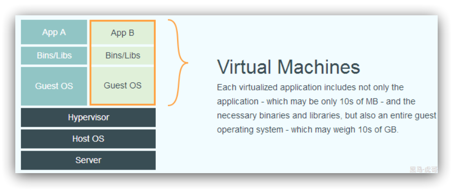 

- **Docker**：Docker没有虚拟的硬件，也没有模拟操作系统，而是直接运行在宿主机上。Docker会为每个应用进程形成隔离环境，让的应用进程以为自己是独立机器。因此Docker要比传统虚拟机更为轻便。

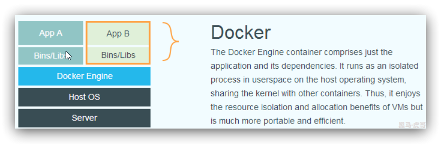 


## 1.2.为什么要用Docker

作为一种新兴的虚拟化方式，`Docker` 跟传统的虚拟化方式相比具有众多的优势：

- 更高效的利用系统资源
- 更快速的启动时间
- 一致的运行环境
- 持续的交付和部署
- 更轻松的迁移

对比传统虚拟机：

| 特性       | 容器               | 虚拟机      |
| :--------- | :----------------- | :---------- |
| 启动       | 秒级               | 分钟级      |
| 硬盘使用   | 一般为 `MB`        | 一般为 `GB` |
| 性能       | 接近原生           | 弱于        |
| 系统支持量 | 单机支持上千个容器 | 一般几十个  |


## 1.3.结构和概念

Docker是一个客户端-服务器（C/S）架构程序。Docker客户端（client）只需要向Docker服务器或者后台进程发出请求，服务器或者后台进程将完成所有工作并返回结果。

Docker中有三个很重要的概念：

- 镜像（`Image`）
- 容器（`Container`）
- 仓库（`Repository`）

理解了这三个概念，就理解了 Docker 的整个生命周期。

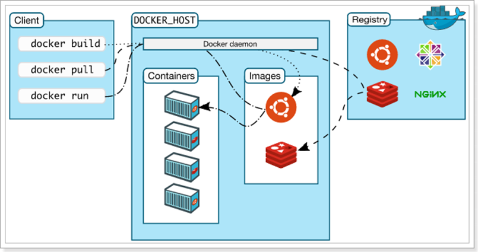


### 1.3.1.镜像（`Image`）

Linux的操作系统分为内核和用户空间。对于 Linux 而言，内核启动后，会挂载 `root` 文件系统为其提供用户空间支持。

而 Docker 镜像（Image），就相当于是一个 `root` 文件系统。比如官方镜像 `ubuntu:18.04` 就包含了完整的一套 Ubuntu 18.04 最小系统的 `root` 文件系统。

Docker 镜像是一个特殊的文件系统，除了提供容器运行时所需的程序、库、资源、配置等文件外，还包含了一些为运行时准备的一些配置参数（如匿名卷、环境变量、用户等）。镜像不包含任何动态数据，其内容在构建之后也不会被改变，是一个**`只读的模板`**。

简单来说：镜像就像你下载并安装好的一个游戏，比如《我的世界》，其中包含了运行所需要的jre库。因此这个游戏可以放到任何机器上运行。


### 1.3.2.容器（`Container`）

镜像（`Image`）和容器（`Container`）的关系，就像是面向对象程序设计中的 `类` 和 `实例` 一样，镜像是静态的定义，容器是镜像运行时的实体。容器可以被创建、启动、停止、删除、暂停等。

容器的实质是进程，但与直接在宿主执行的进程不同，Docker会保证**隔离每一个容器进程**。

容器进程运行于属于自己的独立的 [命名空间](https://en.wikipedia.org/wiki/Linux_namespaces)。因此容器可以拥有自己的 `root` 文件系统、自己的网络配置、自己的进程空间，甚至自己的用户 ID 空间。容器内的进程是运行在一个隔离的环境里，使用起来，就好像是在一个独立于宿主的系统下操作一样。这种特性使得容器封装的应用比直接在宿主运行更加安全。也因为这种隔离的特性，很多人初学 Docker 时常常会混淆容器和虚拟机。


### 1.3.3.镜像仓库（`Docker Registry`）

镜像构建完成后，可以很容易的在当前宿主机上运行，但是，如果需要在其它服务器上使用这个镜像，我们就需要一个集中的存储、分发镜像的服务，[Docker Registry](https://docker_practice.gitee.io/zh-cn/repository/registry.html) 就是这样的服务。

一个 **Docker Registry** 中可以包含多个 **仓库**（`Repository`）；每个仓库可以包含多个 **标签**（`Tag`）；每个标签对应一个版本的镜像。

通常，一个仓库（`Repository`）会包含同一个软件不同版本的镜像(`image`)，而标签（`Tag`）就常用于对应该软件的各个版本。我们可以通过 `<仓库名>:<标签>` 的格式来指定具体是这个软件哪个版本的镜像。如果不给出标签，将以 `latest` 作为默认标签。

以Nginx镜像为例。我们可以通过 `nginx:1.7.9`，或者 `nginx:1.8.0` 来具体指定所需哪个版本的镜像。如果忽略了标签，比如 `nginx`，那将视为 `nginx:latest`。

仓库名经常以 *两段式路径* 形式出现，比如 `jwilder/nginx-proxy`，前者往往意味着 Docker Registry 多用户环境下的用户名，后者则往往是对应的软件名。


仓库分为**公开仓库**（Public）和**私有仓库**（Private）两种形式。

最常使用的 Registry 公开服务是官方的 [Docker Hub](https://hub.docker.com/)，这也是默认的 Registry，并拥有大量的高质量的官方镜像，供用户下载。国内也有一些云服务商提供类似于 Docker Hub 的公开服务。比如 [网易云镜像服务](https://c.163.com/hub#/m/library/)、[DaoCloud 镜像市场](https://hub.daocloud.io/)、[阿里云镜像库](https://cr.console.aliyun.com/) 等。

除了使用公开服务外，用户还可以在本地搭建私有 Docker Registry。


当用户创建了自己的镜像之后就可以使用 push 命令将它上传到公有或者私有仓库，这样下次在另外一台机器上使用这个镜像时候，只需要从仓库上 pull 下来就可以了。


# 2.安装Docker

Docker 分为 CE 和 EE 两大版本。CE 即社区版（免费，支持周期 7 个月），EE 即企业版，强调安全，付费使用，支持周期 24 个月。

Docker CE 分为 `stable` `test` 和 `nightly` 三个更新频道。

官方网站上有各种环境下的 [安装指南](https://docs.docker.com/install/)，这里主要介绍 Docker CE 在 `Linux` 和 `macOS` 上的安装。

## 2.1.CentOS安装Docker

Docker CE 支持 64 位版本 CentOS 7，并且要求内核版本不低于 3.10， CentOS 7 满足最低内核的要求，所以我们在CentOS 7安装Docker。

### 2.1.1.卸载

如果之前安装过旧版本的Docker，可以使用下面命令卸载：

```
yum remove docker \
                  docker-client \
                  docker-client-latest \
                  docker-common \
                  docker-latest \
                  docker-latest-logrotate \
                  docker-logrotate \
                  docker-selinux \
                  docker-engine-selinux \
                  docker-engine \
                  docker-ce
```


### 2.1.2.安装docker

首先需要大家虚拟机联网，安装yum工具

```sh
yum install -y yum-utils \
           device-mapper-persistent-data \
           lvm2 --skip-broken
```

更新XFS文件系统管理工具：

```shell
yum update xfsprogs -y
```


然后更新本地镜像源：

```shell
yum-config-manager \
    --add-repo \
    https://mirrors.ustc.edu.cn/docker-ce/linux/centos/docker-ce.repo
# 解决域名问题
sed -i 's/download.docker.com/mirrors.ustc.edu.cn\/docker-ce/g' /etc/yum.repos.d/docker-ce.repo
```


更新镜像源缓存：

```
yum makecache fast
```


然后输入命令：

```shell
yum install -y docker-ce
```

docker-ce为社区免费版本。稍等片刻，docker即可安装成功。

一定要关闭防火墙后，再启动docker

```sh
# 关闭
systemctl stop firewalld
# 禁止开机启动防火墙
systemctl disable firewalld
```


通过命令启动docker：

```
systemctl start docker
```


然后输入命令，可以查看docker版本：

```
docker --version
```

如图：

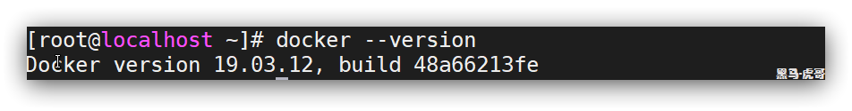 


### 2.1.3.配置镜像

docker官方镜像仓库网速较差，我们需要设置国内镜像：

参考阿里云的镜像加速文档：https://cr.console.aliyun.com/cn-hangzhou/instances/mirrors

```sh
systemctl daemon-reload
systemctl restart docker
```


### 2.1.4.docker命令

docker服务的命令：

```
systemctl start docker  # 启动docker服务
systemctl stop docker  # 停止docker服务
systemctl restart docker  # 重启docker服务
```


## 2.2.MacOS安装Docker(不建议)

macOS下支持两种安装方式：

- Homebrew安装
- 手动下载安装

大家根据自己情况选择。


### 2.2.1.使用 Homebrew 安装

[Homebrew](https://brew.sh/) 的 [Cask](https://github.com/Homebrew/homebrew-cask) 已经支持 Docker Desktop for Mac，因此可以很方便的使用 Homebrew Cask 来进行安装：

```bash
$ brew cask install docker
```

### 2.2.2.手动下载安装

如果需要手动下载，请点击以下链接下载 [Stable](https://download.docker.com/mac/stable/Docker.dmg) 或 [Edge](https://download.docker.com/mac/edge/Docker.dmg) 版本的 Docker Desktop for Mac。

如同 macOS 其它软件一样，安装也非常简单，双击下载的 `.dmg` 文件，然后将那只叫 [Moby](https://www.docker.com/blog/call-me-moby-dock/) 的鲸鱼图标拖拽到 `Application` 文件夹即可（其间需要输入用户密码）。

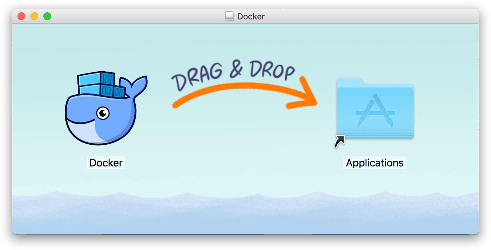

### 2.2.3运行

从应用中找到 Docker 图标并点击运行。


运行之后，会在右上角菜单栏看到多了一个鲸鱼图标，这个图标表明了 Docker 的运行状态。


第一次点击图标，可能会看到这个安装成功的界面，点击 "Got it!" 可以关闭这个窗口。


### 2.2.4.配置镜像加速

对于使用 macOS 的用户，在任务栏点击 Docker Desktop 应用图标 -> `Perferences`，在弹出窗口的顶部导航菜单选择 `Daemon`，在下边的`Registry mirrors`框中，填写镜像地址即可，例如网易镜像：

```json
https://hub-mirror.c.163.com
```

修改完成之后，点击 `Apply & Restart` 按钮，Docker 就会重启并应用配置的镜像地址了。


# 3.镜像操作

当运行容器时，使用的镜像如果在本地中不存在，docker 就会自动从 docker 镜像仓库中下载，[Docker Hub](https://hub.docker.com/search?q=&type=image) 上有大量的高质量的镜像可以用，这里我们就说一下怎么获取这些镜像。

## 3.1.搜索镜像

要使用一个镜像，必须先知道镜像的仓库名称、版本等信息。那么问题来了，我们该如何知道镜像的名称呢？

### 方案一

去[Docker Hub](https://hub.docker.com)上搜索，如图：

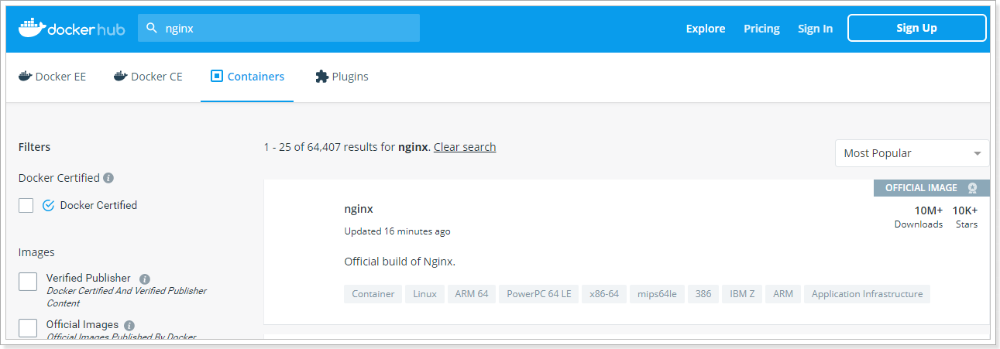

点击搜索到的第一个结果（一般是官方镜像），即可看到nginx的官方镜像及使用说明：https://hub.docker.com/_/nginx

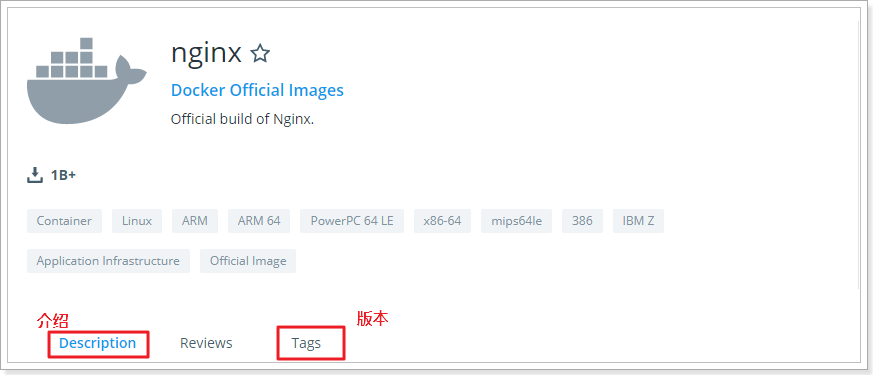 

点击tags，可以看到各种nginx的版本：

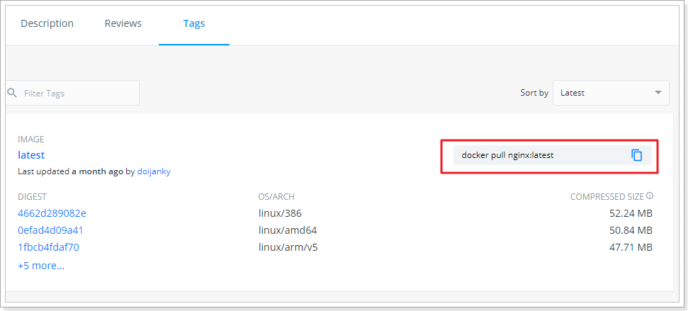

还能看到对应的拉取命令：`docker pull nginx:latest`


### 方案二

使用`docker search 镜像关键字` 命令搜索：

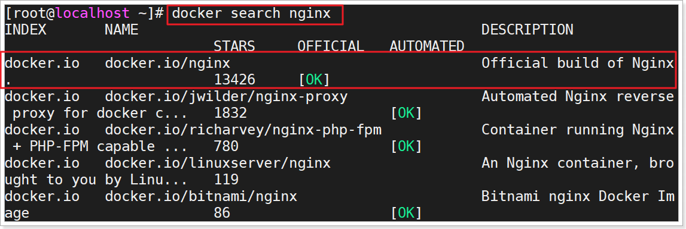

可以看到各种nginx，其中第一个就是官方的nginx镜像，不过这里看不到tag信息。


## 3.2.获取镜像

从 Docker 镜像仓库获取镜像的命令是 `docker pull`。其命令格式为：

```
docker pull [OPTIONS] NAME[:TAG|@DIGEST]
```

- `OPTIONS`：选项，
  - `-a`：代表拉取所有版本镜像
  - `--help`：帮助
- NAME：仓库名称

- TAG：仓库标签，也就是具体的版本，如果不指定一般就是latest，最新版本


我们以nginx为例来试试：

```
docker pull nginx
```

如图：

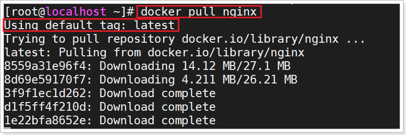

因为我们没有指定tag，所以使用了默认的tag：latest

然后就可以看到开始下载以及下载的进度了。


## 3.3.查看镜像

查看本地镜像的命令是：`docker images`，基本语法：

```sh
docker images [OPTIONS] [REPOSITORY[:TAG]]
```

参数说明：

- OPTIONS：可选性
  - `-a`：列出所有镜像
  - `-f`：过滤要显示的镜像
  - `-q`：只显示镜像的ID

- REPOSITORY：仓库名，只显示指定仓库名的镜像


示例，显示所有镜像：

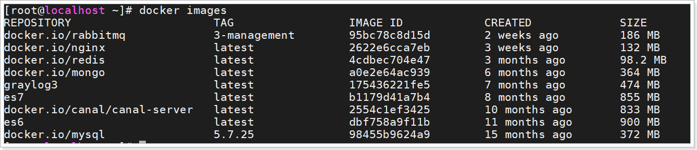

显示的字段包括：

- REPOSITORY：仓库名称
- TAG：标记，也就是版本号
- IMAGE ID：镜像的ID，是镜像的唯一标示
- CREATED：创建时间
- SIZE：镜像大小


只显示镜像ID：

```
[root@localhost ~]# docker images -q
95bc78c8d15d
2622e6cca7eb
4cdbec704e47
a0e2e64ac939
175436221fe5
b1179d41a7b4
2554c1ef3425
dbf758a9f11b
98455b9624a9
```


## 3.4.删除镜像

删除镜像的命令为：`docker rmi`，语法：

```
docker rmi [OPTIONS] IMAGE [IMAGE...]
```

参数说明：

- OPTIONS：选项
  - `-f`：强制删除，不管是否有容器基于该镜像运行
- IMAGE：镜像名称或镜像ID

示例：

```
[root@localhost ~]# docker rmi docker.io/nginx
Untagged: docker.io/nginx:latest
Untagged: docker.io/nginx@sha256:21f32f6c08406306d822a0e6e8b7dc81f53f336570e852e25fbe1e3e3d0d0133
Deleted: sha256:2622e6cca7ebbb6e310743abce3fc47335393e79171b9d76ba9d4f446ce7b163
Deleted: sha256:e86d1b8b130bec203609b4b1d7b851bd763fa16e513e5a3fa6102ebea23260e0
Deleted: sha256:8f9f007533543813bb1aef80b791a16e5e16c7cbbbc456a3a483d0fa7a9effcc
Deleted: sha256:e2c0065a77fee75795cdcf9f19a72f11769332423cd52ec9e19aacfb878aec8b
Deleted: sha256:059442698ef65fe8545e4fe9657988a10329b9c3663b368ae7ee0007a9c43949
Deleted: sha256:13cb14c2acd34e45446a50af25cb05095a17624678dbafbcc9e26086547c1d74

```


# 4.容器操作

镜像是一个独立的文件系统，有了镜像以后，我们就可以基于镜像运行多个容器。每个容器都会有自己运行环境。

我们接下来学习如何管理一个容器，包括创建、启动和停止等。

## 4.1.创建并运行容器

拉取到镜像后，我们需要基于镜像创建一个容器，然后运行它。一般我们会把创建和运行合为一个命令：`docker run`命令，通过`docker run --help`可以查看语法。

具体语法：

```
Usage:  docker run [OPTIONS] IMAGE [COMMAND] [ARG...]
```

语法说明：

- OPTIONS：可选项，这里列举一些常用的
  - `-e`：环境变量，例如指定运行MySQL的默认密码，一般是KEY=VALUE的结构
  - `-d`：守护进程，让容器作为后台进程运行
  - `-h`：主机名，指定容器运行的hostname
  - `-p`：端口映射，例如：`-p 8080:80`，把容器的80端口映射到宿主机的8080端口
  - `-v`：挂载的数据卷。例如：`-v /tmp:/var/tmp`，把宿主机的/tmp目录挂载到容器的/var/tmp目录
  - `--name`：给容器起一个名字
  - `--network`：设置容器的网络配置
- IMAGE：镜像名称
- COMMAND：运行的指令，如果没指定则使用镜像默认的COMMAND
- ARG：COMMAND参数


我们来运行一个Nginx的容器：

```sh
docker run --name my-nginx -p 80:80 -d nginx
```

运行命令后，会在控制台返回一个容器的id：

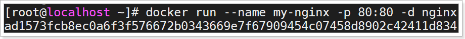


此时，我们在浏览器访问虚拟机的地址：http://192.168.150.101（用你自己的虚拟机地址）：

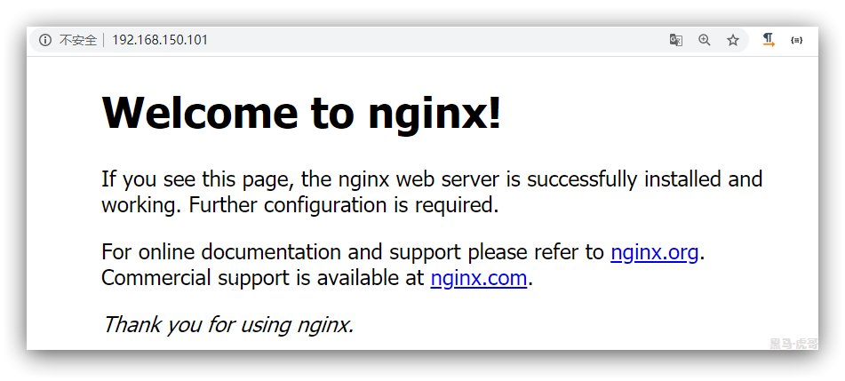

## 4.2.查看容器状态

如果要查看当前运行的容器，可以使用`docker ps`命令：

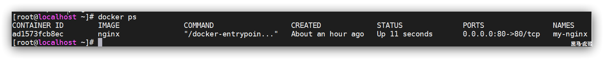

可以发现其`STATUS`为：`Up 11 seconds`，正在运行。

如果要查看已经停止运行的容器，可以使用`docker ps -a`命令：

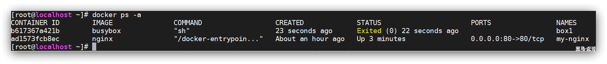


## 4.3.进入容器

如果我们要修改nginx的欢迎页面内容，或者修改Nginx的配置文件，就必须进入nginx的容器中。

使用`docker exec`命令可以做到，基本语法：

```
docker exec [OPTIONS] CONTAINER COMMAND [ARG...]
```

说明：

- OPTIONS：可选项，这里常用的两个是：
  - `-i`：开启一个容器关联的STDIN（标准输入），允许用户通过控制台输入命令
  - `-t`：分配一个虚拟的TTY终端，让用户与容器交互
- CONTAINER：容器名称或者容器ID
- COMMAND：进入容器后要执行的命令
- ARG：命令参数

通过`docker exec --help`查看详细的使用说明。


示例，我们进入nginx容器：

```
docker exec -it my-nginx bash
```

这里我们进入容器后，允许bash命令，也就是Linux中的bash交互界面

效果：

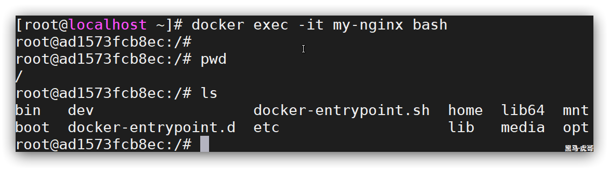 

如同进入了一个新的Linux环境。

docker中的Nginx默认html目录是在：`/usr/share/nginx/html`目录：

```sh
# 进入nginx的html目录
cd usr/share/nginx/html/
# 查看内容
ls
```

包含两个文件：

```
50x.html  index.html
```

修改index.html内容：

```sh
echo "<html><head><meta charset="utf-8"> </head> <h1>风里雨里我在传智播客等你</h1></html>" > index.html
```


再次访问虚拟机地址：http://yourIp

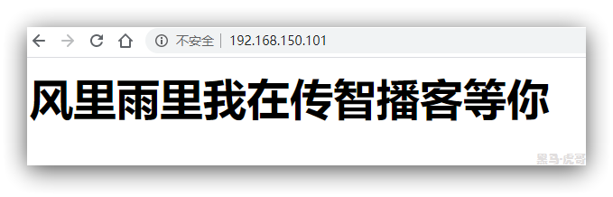

控制台输入：`exit`即可退出容器。


## 4.4.启动和停止容器

`docker run`命令是创建一个容器，然后运行。如果一个容器已经存在了，我们怎么操作呢？

当容器创建后，我们可以通过下列命令可以控制容器的启动或停止：

```shell
# 启动
docker start CONTAINER
# 停止
docker stop CONTAINER
# 重启
docker restart CONTAINER
```


## 4.5.查看运行日志

如何查看一个正在运行的容器的运行日志呢？

通过 `docker logs`命令，语法如下：

```
[root@localhost ~]# docker logs --help

Usage:  docker logs [OPTIONS] CONTAINER

Fetch the logs of a container

Options:
      --details        Show extra details provided to logs
  -f, --follow         Follow log output
      --help           Print usage
      --since string   Show logs since timestamp
      --tail string    Number of lines to show from the end of the logs (default "all")
  -t, --timestamps     Show timestamps
```

说明：

- OPTIONS：可选项
  - `-f`：跟踪显示日志。当有新日志产生，控制台会持续打印日志
  - `--tail`：指定输出最后的n行日志，不指定则显示所有日志
- CONTAINER：容器名或容器ID


示例：

```
docker logs -f my-nginx
```

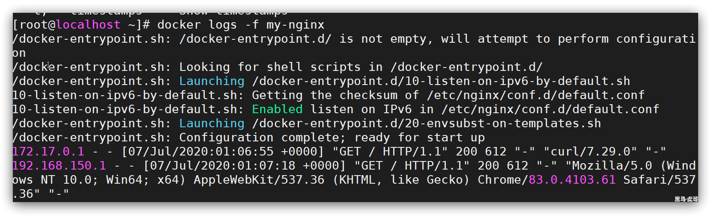


## 4.6.删除容器

通过`docker rm`命令可以删除一个容器，语法：

```
[root@localhost ~]# docker rm --help

Usage:  docker rm [OPTIONS] CONTAINER [CONTAINER...]

Remove one or more containers

Options:
  -f, --force     Force the removal of a running container (uses SIGKILL)
      --help      Print usage
  -l, --link      Remove the specified link
  -v, --volumes   Remove the volumes associated with the container
```

说明：

- OPTIONS：可选项
  - `-f`：`docker rm` 只能删除停止状态的容器，`-f`强制删除一个运行中的容器。
  - `-v`：删除容器的同时，删除关联的数据卷
- CONTAINER：容器名或容器ID


## 4.7.查看容器状态

如果想要查看某个容器的详细信息，可以使用下面的名；

```sh
docker inspect 容器名/容器ID
```


# 5.仓库操作

仓库（`Repository`）是集中存放镜像的地方。

而注册服务器（`Registry`）是管理仓库的具体服务器，每个服务器上可以有多个仓库，而每个仓库下面有多个镜像。

例如Docker Hub就是一个镜像服务器，其中的Nginx就是一个仓库，nginx:latest是其中的一个镜像。

我们使用阿里云的仓库：https://cr.console.aliyun.com/cn-hangzhou/instances

## 5.1.注册账号

因为官方的DockerHub速度较慢，我们可以去阿里云创建自己的镜像仓库。

### 5.1.1.创建命名空间

新版本的进入方式：

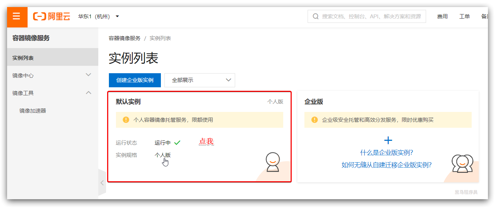

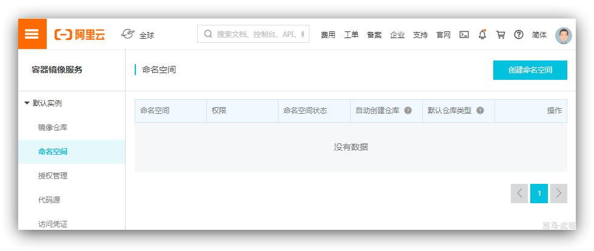

点击`创建命名空间`，然后在弹窗中填写命名空间：

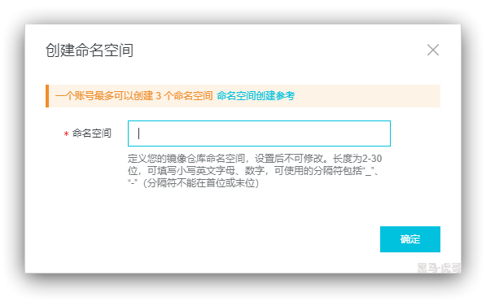

### 5.1.2.创建镜像仓库

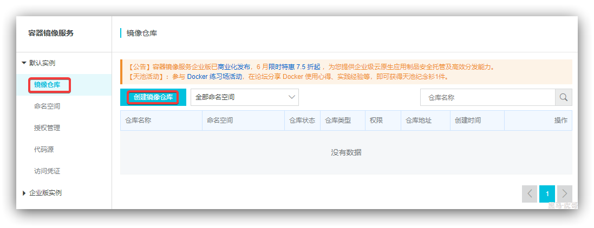

在弹窗中填写：

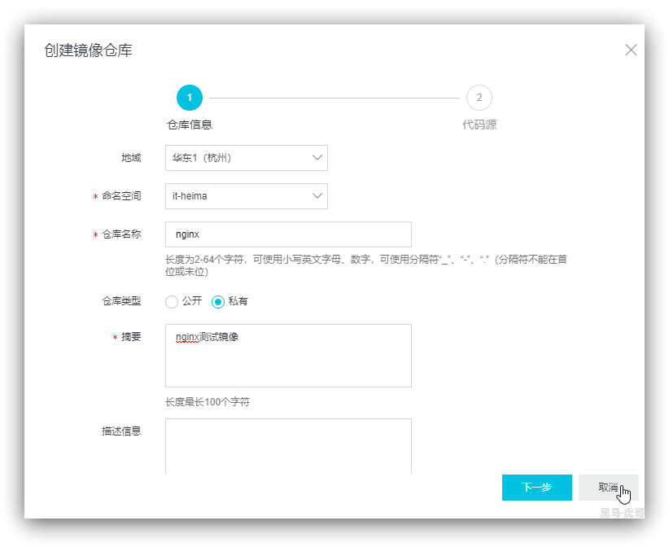

点击下一步，选择本地仓库：

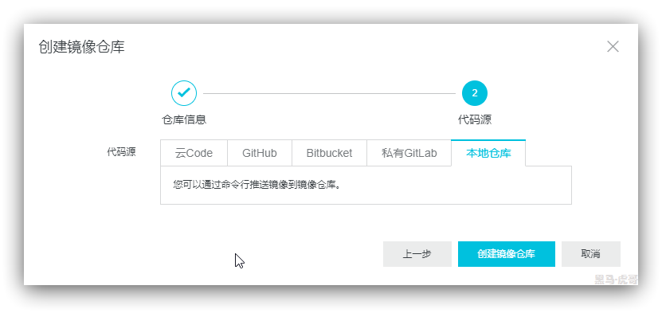

点击创建镜像仓库，完成后：

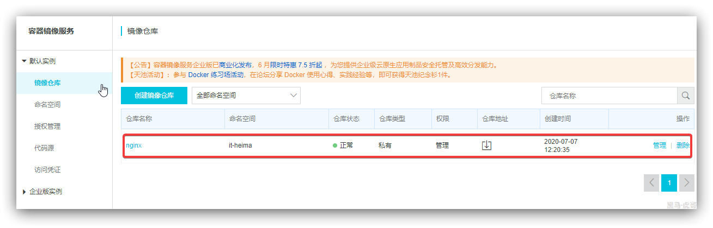

点击仓库，可以查看详细信息：

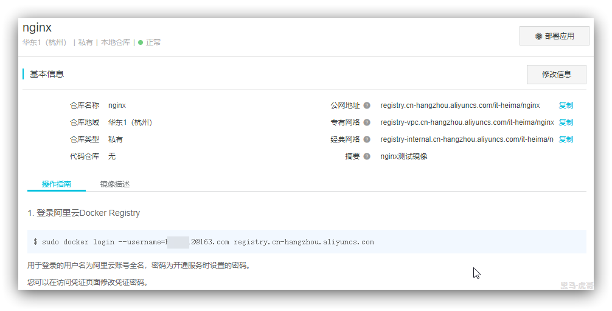

在信息中有登录的命令及地址。


### 5.1.3.配置访问凭证

在左侧菜单中，选择访问凭证：

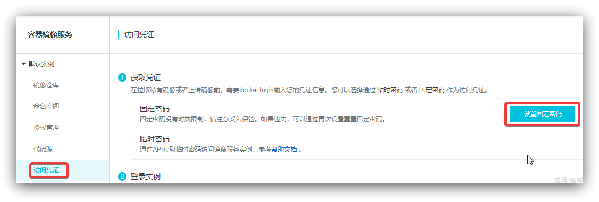

然后，选择设置固定密码，在弹出的窗口中设置一个密码：

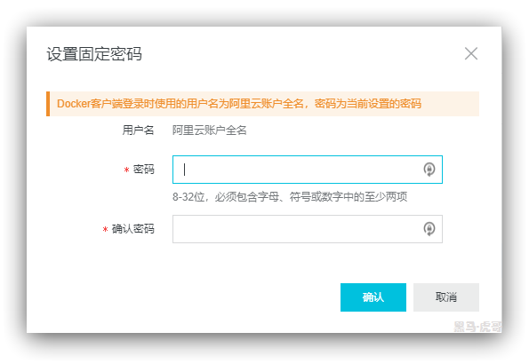


## 5.2.登录

要将本地镜像上传，需要先使用`docker login`命令登录，语法：

```
[root@localhost ~]# docker login --help

Usage:  docker login [OPTIONS] [SERVER]

Log in to a Docker registry

Options:
      --help              Print usage
  -p, --password string   Password
  -u, --username string   Username
```

示例：

```
docker login --username=xxx@163.com registry.cn-hangzhou.aliyuncs.com
```

会要求你输入密码：

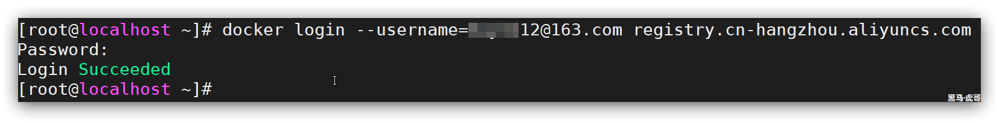

密码输入后，按回车即可看到登录成功。

`docker logout`命令可以登出


## 5.3.上传本地镜像

我们先来打包一个本地的镜像，通过`docker tag`命令：

```
docker tag [ImageId] registry.cn-hangzhou.aliyuncs.com/it-heima/nginx:[镜像版本号]
```

说明：

- `ImageId`：要打包的镜像id
- `registry.cn-hangzhou.aliyuncs.com/it-heima/nginx`：我的镜像仓库名称
- `镜像版本号`：就是自己要打包的tag名称

示例：

```
docker tag 2622e6cca7eb registry.cn-hangzhou.aliyuncs.com/it-heima/nginx:latest
```

然后通过`docker images`查看：

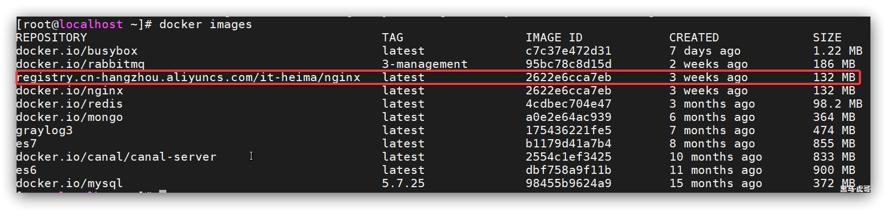

接下来，通过`docker push`命令来推送一个镜像，基本语法：

```
docker push NAME:[TAG]
```

说明：

- NAME：仓库名称
- TAG：版本号

示例：

```
docker push registry.cn-hangzhou.aliyuncs.com/it-heima/nginx:latest
```

结果：

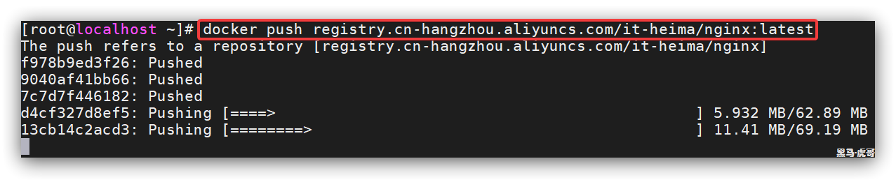

然后，在阿里云上查看：

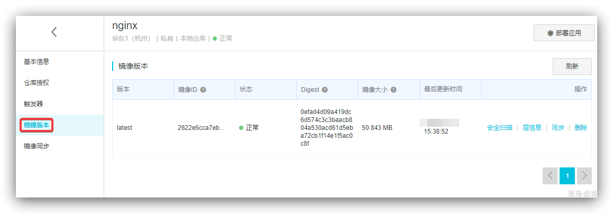


## 5.4.拉取自定义仓库

拉取自定义镜像仓库与拉取官方镜像仓库命令一样，都是用`docker pull`命令。

我们先删除本地的镜像：

```
docker rmi registry.cn-hangzhou.aliyuncs.com/it-heima/nginx:latest
```

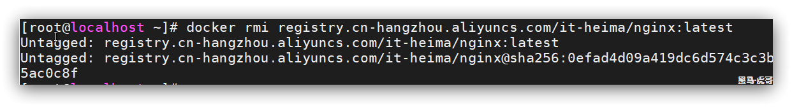

然后从阿里云拉取，示例：

```
docker pull registry.cn-hangzhou.aliyuncs.com/it-heima/nginx:latest
```

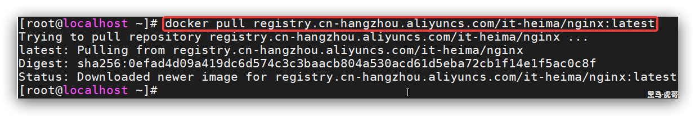


# 6.数据卷管理

刚刚我们利用docker部署了一台nginx服务，但是nginx服务的配置文件、html目录都是在docker内部的。

那么随着程序的运行，我们会有新的web资源需要添加到html目录，或者要修改nginx的配置文件，进入容器修改很不方便。另外，以后如果要对容器升级，以前的数据就都不可用了。

最好的办法是把这些变化的数据记录在容器之外的宿主机上，实现**容器与数据的分离**。

因此，本节会学习如何将docker数据保存在宿主机。

## 6.1.数据卷

`数据卷` 是一个可供一个或多个容器使用的特殊目录，一般是在宿主机的某个特定的目录下。可以提供很多有用的特性：

- `数据卷` 可以在容器之间共享和重用
- 对 `数据卷` 的修改会立马在挂载数据卷的容器中可见
- 对 `数据卷` 的更新，不会影响镜像
- `数据卷` 默认会一直存在，即使容器被删除

通过`docker volume`命令可以管理数据卷，语法包括：

```
[root@localhost ~]# docker volume --help

Usage:  docker volume COMMAND

Manage volumes

Options:
      --help   Print usage

Commands:
  create      Create a volume
  inspect     Display detailed information on one or more volumes
  ls          List volumes
  prune       Remove all unused volumes
  rm          Remove one or more volumes
```

说明：`docker volume COMMAND`

- COMMAND：要运行的数据卷指令
  - create：创建一个数据卷
  - inspect：显示一个或多个指定数据卷的详细信息
  - ls：查看所有的数据卷
  - prune：删除所有未使用的数据卷
  - rm：删除一个或多个指定的数据卷


通过`docker volume create`来实现，示例：

```sh
# 创建一个名为html的数据卷
docker volume create html
```

通过`docker volume ls`查看所有的数据卷：

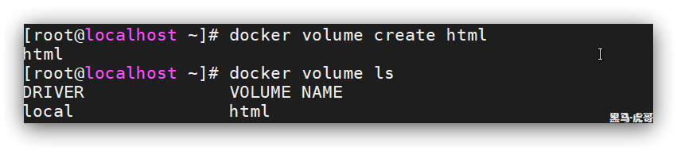

## 6.2.挂载数据卷

只有在创建容器时才可以挂载数据卷。我们先删除之前的nginx容器：

```
docker rm my-nginx -f
```

然后重新创建一个容器，并挂载刚刚指定的数据卷：

```sh
docker run --name mn -p 80:80 -v html:/usr/share/nginx/html -d nginx
```

数据卷挂载的解释：

-  html:	数据卷的名称，不是真实目录，要知道真实目录，需要通过 `docker volume inspect html`查看
- /usr/share/nginx/html：容器内的目录


然后，通过命令查看数据卷html在宿主机的物理地址：

```
docker volume inspect html
```

结果：

```json
[
    {
        "Driver": "local",
        "Labels": {},
        "Mountpoint": "/var/lib/docker/volumes/html/_data",
        "Name": "html",
        "Options": {},
        "Scope": "local"
    }
]
```

进入该目录查看：

```sh
cd /var/lib/docker/volumes/html/_data
```

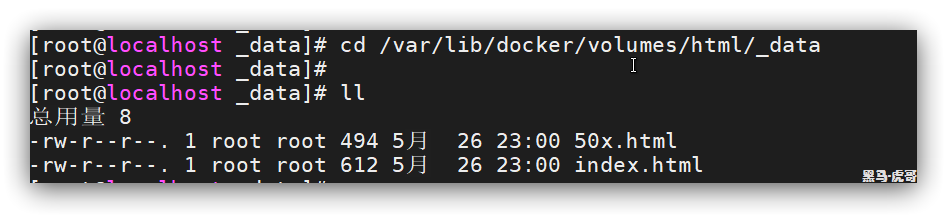

修改这个`index.html`文件：

```html
<!DOCTYPE html>
<html>
<head>
<meta http-equiv="content-type" content="text/html;charset=utf-8">
<title>传智播客官网-好口碑IT培训机构,一样的教育,不一样的品质</title>
<style>
    body {
        width: 35em;
        margin: 0 auto;
        font-family: Tahoma, Verdana, Arial, sans-serif;
    }
</style>
</head>
<body>
<h1>欢迎来黑马程序员学习!</h1>
<p>传智播客专注IT培训,提供多种IT培训服务，如：Java培训,人工智能培训,Python培训,PHP培训,C++培训,大数据培训,UI设计培训,移动开发培训,网络营销培训,web前端培训,全栈工程师培训,产品经理培训等，是业内口碑较好的IT培训机构。.</p>

<p>查看最新开班信息：
<a href="http://www.itcast.cn">传智播客</a>.<br/></p>

<p><em>Thank you for using nginx.</em></p>
</body>
</html>
```

再次访问你的虚拟机地址：http://youIp

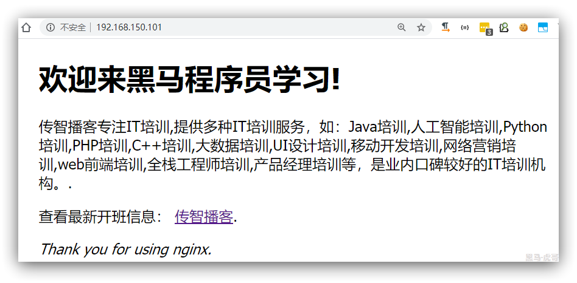


**注意**：如果在运行容器时指定了数据卷，而数据卷不存在，docker会自动创建一个数据卷。


## 6.3.挂载本地文件或文件夹

除了挂载数据卷以外，docker也允许你挂载一个指定的本地目录或者本地文件。比如我希望在运行nginx的同时挂载一个本地的nginx配置文件，方便以后修改nginx配置。


首先，我们在宿主机的任意目录，创建一个文件：nginx.conf，

```sh
# 创建nginx.conf文件
touch nginx.conf
# 编辑nginx.conf文件
vi nginx.conf
```

内容如下：

```nginx
worker_processes  1;
events {
    worker_connections 1024;
}  
http {
    default_type  text/html; # 默认响应类型是html
	
	server {
		listen 80;
		location /s {
            # 以/s开头的路径，会代理到百度
			proxy_pass https://www.baidu.com;
		}
		location / {
			root	/usr/share/nginx/html;
		}
	}
}
```


然后，我们删除之前的nginx容器：

```sh
docker rm mn -f
```

创建一个新的容器：

```sh
docker run \
--name mn \
-p 80:80 \
-v html:/usr/share/nginx/html \
-v $PWD/nginx.conf:/etc/nginx/nginx.conf \
--privileged \
-d \
nginx
```

命令说明：

- `--name mn`：容器名称为mn
- `-p 80:80`：将容器的80端口映射到宿主机的80端口
- `-v html:/usr/share/nginx/html`：挂载html数据卷到容器的`/usr/share/nginx/html`目录
- `-v $PWD/nginx.conf:/etc/nginx/nginx.conf`：
  - `$PWD/nginx.conf`：当前目录下的nginx.conf文件
  - 把宿主机当前目录下的`nginx.conf`文件挂载到容器内的`/etc/nginx/nginx.conf`文件
- `--privileged`：授予本地目录的访问权限
- `-d`：后台运行
- `nginx`：镜像名称


然后，在浏览器访问：http://youIp/s，例如我的：http://192.168.150.101/s：

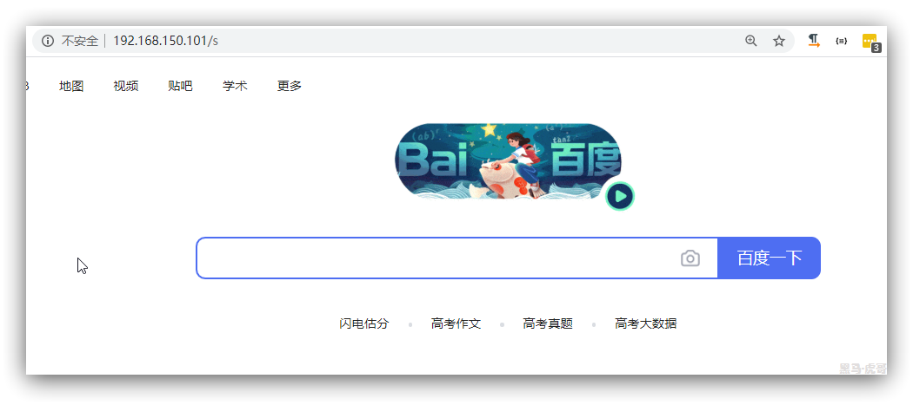

输入一个关键字搜索试试：

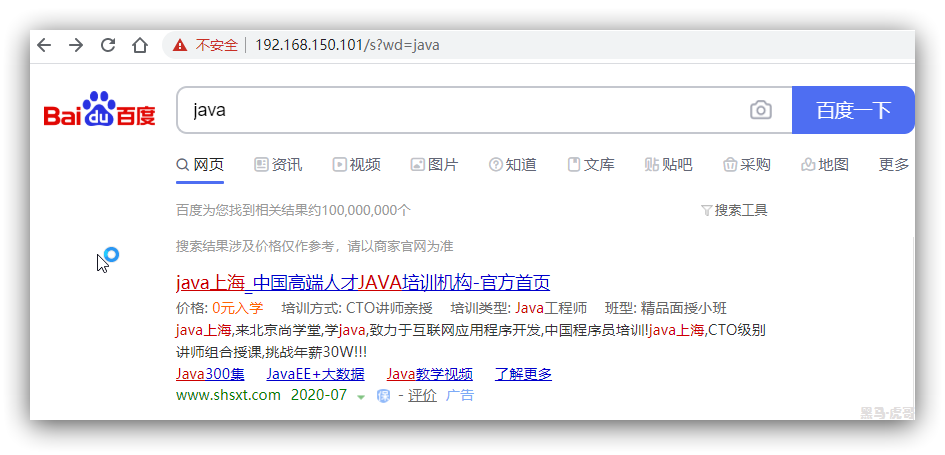


# 7.网络管理

当我们要部署基于docker的微服务群时，往往会需要容器之间互相连接。这时就需要用到Docker中的网络配置了。

通过`docker network`命令可以管理docker网络。

```
[root@localhost ~]# docker network --help

Usage:  docker network COMMAND

Manage networks

Options:
      --help   Print usage

Commands:
  connect     Connect a container to a network
  create      Create a network
  disconnect  Disconnect a container from a network
  inspect     Display detailed information on one or more networks
  ls          List networks
  prune       Remove all unused networks
  rm          Remove one or more networks
```

说明：

- connect：把一个容器连接到指定的network
- create：创建一个network
- disconnect：将一个容器从指定的network断开
- inspect：显示某个network的详细信息
- ls：列出所有的network
- prune：删除未使用的network
- rm：删除指定的一个或多个network

## 7.1.创建network

通过`docker network create`命令来创建，示例：

```sh
docker network create -d bridge my-net
```

说明：

- `-d`：指定网络类型，可以是：bridge、overlay，默认是bridge


## 7.2.查看network

通过`docker network ls`查看network，示例：

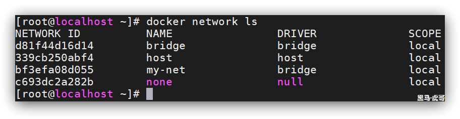

可以看到，除了我们刚刚创建的my-net外，还有几个默认的网络。

另外，还可以通过命令查看具体信息：

```
docker network inspect my-net
```

结果：

```json

[
    {
        "Name": "my-net",
        "Id": "bf3efa08d055d38c44cabee47bbd45145dd69d7d6609028e9b9905cf0f17f7a7",
        "Created": "2020-07-07T16:11:48.193977107+08:00",
        "Scope": "local",
        "Driver": "bridge",
        "EnableIPv6": false,
        "IPAM": {
            "Driver": "default",
            "Options": {},
            "Config": [
                {
                    "Subnet": "172.18.0.0/16",
                    "Gateway": "172.18.0.1"
                }
            ]
        },
        "Internal": false,
        "Attachable": false,
        "Containers": {},
        "Options": {},
        "Labels": {}
    }
]
```


## 7.3.连接network

可以将一个已经运行的容器连接到某个network：

```sh
docker network connect my-net mm
```


也可以在创建容器时，连接一个network：

```sh
docker run -it --rm --name busybox1 --network my-net busybox sh
```

说明：

- `-it`：运行容器并保持一个可交互的shell终端
- `--rm`：容器退出时，自动删除容器
- `--network my-net`：连接到my-net网络
- `busybox`：是一个测试用的简单容器

运行后会自动进入容器，并开启一个shell终端，为了测试网络，我们可以执行命令：

```
ping mn
```

同一个网络内的容器，可以用**容器名**互相访问，因此我们用容器名去测试连接：

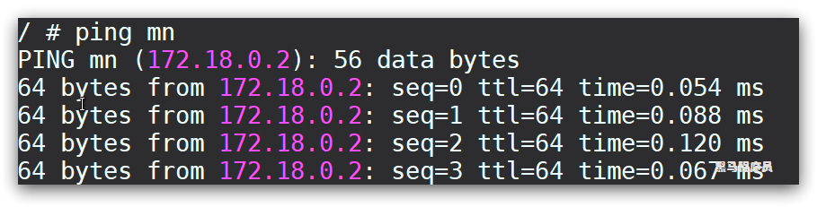


# 8.DockerFile

从DockerHub中拉取的镜像，往往都是一些基础镜像，在实际开发中需要做一些定制和修改。

这就需要自定义镜像的功能了，而自定义镜像就要用到Dockerfile配置文件。

## 8.1.快速入门

我们基于nginx的官方镜像，做一个定制，把自定义的index.html内容添加到官方镜像中。

在任意位置创建一个空文件夹：nginx

```sh
mkdir nginx
```

然后进入nginx目录：

```sh
cd nginx
```

新建一个index.html文件，内容如下：

```html
<!DOCTYPE html>
<html>
<head>
<meta http-equiv="content-type" content="text/html;charset=utf-8">
<title>传智播客官网-好口碑IT培训机构,一样的教育,不一样的品质</title>
<style>
    body {
        width: 35em;
        margin: 0 auto;
        font-family: Tahoma, Verdana, Arial, sans-serif;
    }
</style>
</head>
<body>
<h1>欢迎来黑马程序员学习!</h1>
<p>传智播客专注IT培训,提供多种IT培训服务，如：Java培训,人工智能培训,Python培训,PHP培训,C++培训,大数据培训,UI设计培训,移动开发培训,网络营销培训,web前端培训,全栈工程师培训,产品经理培训等，是业内口碑较好的IT培训机构。.</p>

<p>查看最新开班信息：
<a href="http://www.itcast.cn">传智播客</a>.<br/></p>

<p><em>Thank you for using nginx.</em></p>
</body>
</html>
```


创建一个Dockerfile文件：

```sh
touch Dockerfile
```

内容如下：

```dockerfile
# 从官方的nginx镜像开始
FROM nginx
# 拷贝一个本地的index.html到/usr/share/nginx/html目录中
COPY index.html /usr/share/nginx/html
```

说明：

- `FROM`：代表构建镜像的基础，这里是以nginx镜像为基础
- `COPY`：拷贝一个本地文件到镜像中的指定目录


然后运行命令：

```sh
docker build -t my-nginx:v1 .
```

`docker build`命令的作用是基于Dockerfile构建一个镜像，详细用法可以通过`docker build --help`查看。当前命令说明：

- `-t my-nginx:v1`：`-t`是设置镜像tag，这里设置镜像名为：`my-nginx`，tag为`v1`
- `.`：最后有一个`.`，别看漏了。是指构建镜像的工作目录为当前目录，会读取当前目录的Dockerfile来完成构建。

如图：

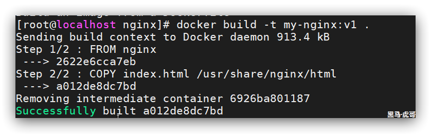

然后通过`docker images`查看镜像：

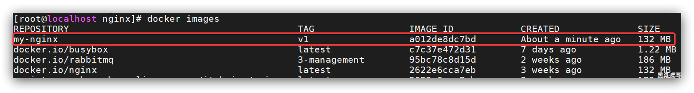

试着运行一下：

```
docker run --name mn -p 8081:80 -d my-nginx:v1
```

然后访问浏览器：

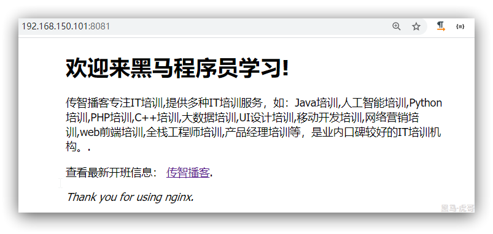


## 8.2.详细语法介绍

除了我们刚刚用到的`FROM`和`COPY`，Dockerfile的指令有很多。详见官网：

https://docs.docker.com/engine/reference/builder/#from

我们列举一些比较常用的。


### 1）FROM

作用是指定基础镜像。自定义镜像，是以一个镜像为基础，在其上进行定制，例如我们从Nginx镜像开始，拷贝一个自己的文件进去。

基础镜像是必须指定的。而 `FROM` 就是指定 **基础镜像**的命令，因此一个 `Dockerfile` 中 `FROM` 是必备的指令，并且**必须是第一条指令**。


### 2）COPY

拷贝一个本地文件或目录到镜像中指定位置，语法格式：

```
COPY [--chown=:] <源路径>... <目标路径>
```

比如：

```docker
COPY index.html /usr/html/
```

`<源路径>` 可以是多个，甚至可以是通配符，其通配符规则要满足 Go 的 [`filepath.Match`](https://golang.org/pkg/path/filepath/#Match) 规则，如：

```docker
COPY my* /mydir/
COPY my?.html /mydir/
```

此外，还需要注意一点，使用 `COPY` 指令，源文件的各种元数据都会保留。比如读、写、执行权限、文件变更时间等。这个特性对于镜像定制很有用。特别是构建相关文件都在使用 Git 进行管理的时候。

在使用该指令的时候还可以加上 `--chown=:` 选项来改变文件的所属用户及所属组。

```docker
COPY --chown=lisi:group1 files* /mydir/
```


### 3）RUN

RUN有2种形式：

- `RUN <command> `
- `RUN ["executable", "param1", "param2"]`

该`RUN`指令将在当前顶部的layer层中执行所有命令，并提交为新镜像。例如：

```
RUN tar -xvf redis.tar.gz
RUN cd redis
RUN make
RUN make install
```

注意，每运行一次RUN命令就会生成一层新的layer层，产生新的镜像，因此应该把多个RUN命令利用`&&`符号串接作为一个命令执行，多行命令用 `\`来换行：

```
RUN tar -xvf redis.tar.gz \
	&& cd redis \
	&& make \
	&& make install 
```


### 4）ENV

ENV格式有两种：

- `ENV <key> <value>  `
- `ENV <key1>=<value1> <key2>=<value2>...`

这个指令很简单，就是设置环境变量而已，后面的其它指令，可以直接使用这里定义的环境变量。

例如：

```dockerfile
# 定义目录
ENV BASE_DIR=/usr/local/src
# 使用
RUN cd $BASE_DIR \
	&& copy /tmp/redis.tar.gz $BASE_DIR
	&& tar -xvf redis.tar.gz
```


### 5）Volume

匿名卷，格式为：

- `VOLUME ["<路径1>", "<路径2>"...]`
- `VOLUME <路径>`

容器运行时应该尽量保持容器存储层不发生写操作，例如运行一个MySQL容器，需要保存动态数据，其数据库文件应该保存于卷(volume)中。

为了防止运行时用户忘记将动态文件所保存目录挂载为卷，在 `Dockerfile` 中，我们可以事先指定某些目录挂载为匿名卷，这样在运行时如果用户不指定挂载，其应用也可以正常运行，不会向容器存储层写入大量数据。


### 6）CMD

语法格式：

- `CMD [命令]`
- `CMD ["可执行命令", "参数1", "参数2" ...]`


Docker的容器，本质是一个被隔离起来的进程，因此启动容器必须要指定所运行的程序及参数。`CMD` 指令就是用于指定默认的容器主进程的启动命令的。

因为容器本身是一个进程，进程结束则容器退出。因此容器的主进程不能是后台运行的进程，因为后台运行的命令结束后，容器就退出了。例如：

```
service nginx start
```

这个命令希望把Nginx作为一个后台服务来运行，但是当`service`命令本身结束，容器就结束了。

正确的做法是直接运行Nginx执行文件，让它前台运行：

```dockerfile
CMD ["nginx", "-g", "daemon off;"]
```


### 7）ENTRYPOINT

`ENTRYPOINT` 的目的和 `CMD` 一样，都是在指定容器启动程序及参数。语法也类似：

- `ENTRYPOINT [命令] 参数 ...`
- `ENTRYPOINT ["可执行命令", "参数1", "参数2" ...]`

既然有了CMD，为什么还需要`ENTRYPOINT`呢？，因为`ENTRYPOINT`可以让我们在运行容器的时候加入自定义参数。而CMD的运行参数都是Dockerfile中配置好的，运行时无法修改。


### 8）EXPOSE

语法格式为：

 ```
EXPOSE <端口1> [<端口2>...]
 ```

`EXPOSE` 指令是声明运行时容器将提供服务端口，这只是一个声明，在运行时并不会因为这个声明应用就会开启这个端口的服务。

也就是说 `EXPOSE` 仅仅是声明容器打算使用什么端口而已，并不会自动在宿主进行端口映射。


## 8.3.从0构建Nginx镜像

我们利用刚才的语法，从0构建一个nginx镜像。

进入刚刚案例中创建的nginx目录，上传一个文件到目录中：

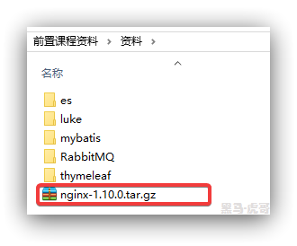 

上传后如图：

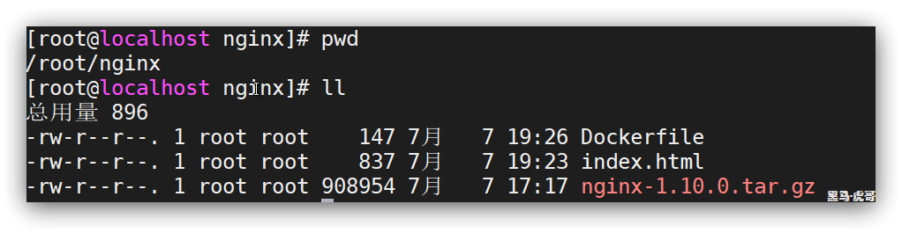

然后，修改目录下的Dockerfile文件，内容如下：

```dockerfile
# 基于centos7安装
FROM centos:7
# 说明
LABEL author="虎哥"
LABEL description="自定义nginx镜像"
LABEL version="1.0"

#拷贝nginx的安装包
COPY nginx-1.10.0.tar.gz /usr/local/src

# 环境变量
ENV NGX_DIR=/opt/nginx

#安装依赖、解压、编译、安装
RUN yum -y install pcre pcre-devel zlib zlib-devel openssl openssl-devel gcc tar \
    && cd /usr/local/src \
	&& tar -xvf nginx-1.10.0.tar.gz \
	&& rm -rf nginx-1.10.0.tar.gz \
	&& cd nginx-1.10.0 \
	&& ./configure --prefix=$NGX_DIR --sbin-path=/usr/bin/nginx \
	&& make \
	&& make install 

#设置数据挂载目录以及工作目录
VOLUME $NGX_DIR/logs

#容器启动后执行该命令
ENTRYPOINT ["nginx", "-g", "daemon off;"]

#设置对外的端口号
EXPOSE 80
```


然后再次构建一个镜像：

```
docker build -t my-nginx:v2 .
```

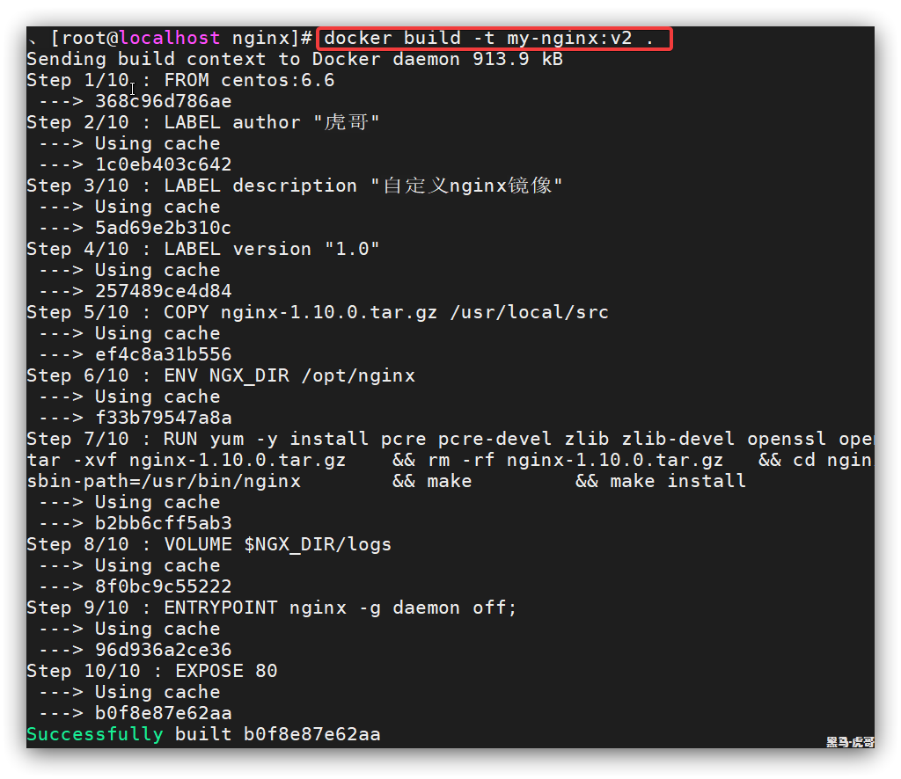

通过`docker images`查看：

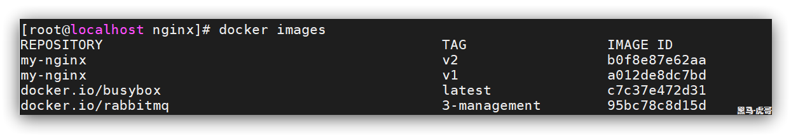

然后可以像之前运行官方镜像一样运行这个镜像了。


# 9.部署项目

接下来，我们演示下常见的一些软件的Docker安装方式。

## 9.1.打包和加载镜像

某些软件的镜像体积非常大，如果网速不好的情况下，拉取会耗费很多时间。因此我们可以把镜像打包到并保存到本地，如果在其它计算机上需要使用，直接加载即可。

### 9.1.1.打包镜像

打包镜像使用`docker save`命令，基本语法：

```sh
docker save -o [文件名] IMAGE [IMAGE...]
```

将一个或多个镜像打包到一个指定的tar文件中。

例如，我们自己的nginx镜像：

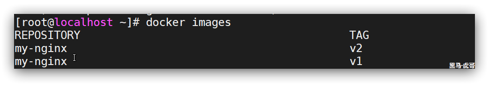

我们可以通过下面的命令来打包：

```
docker save -o mn.tar my-nginx:v1
```

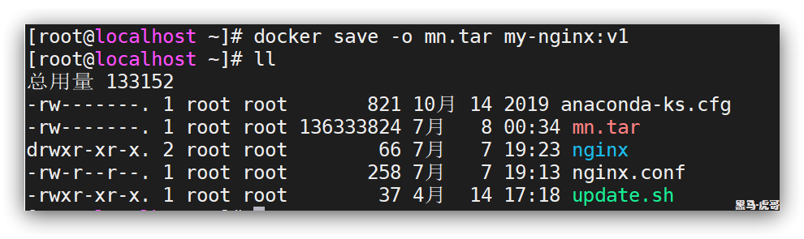


### 9.1.2.加载镜像

打包好的镜像，以后就能分享给其他人去加载使用。加载使用`docker load`命令：

```
docker load [OPTIONS]
```

OPTIONS可以是：

- `-i`：指定一个tar文件，用来加载镜像
- `-q`：静默加载，不在控制台输出加载日志


我们先删除之前自己构建的镜像：`my-nginx:v1`

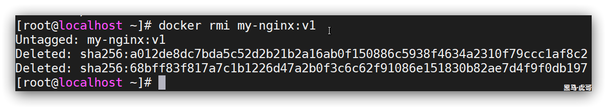

然后，我们从新载入之前打包的`mn.tar:`

```
docker load -i mn.tar
```

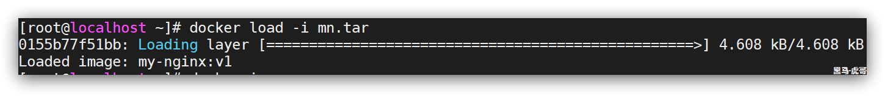


### 9.1.3.上传镜像

在课前资料中，提供给大家了很多的docker镜像，方便大家加载：

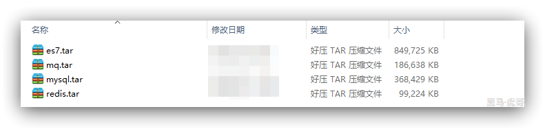

大家可以将这些镜像上传到Linux中的`/tmp`目录中。


## 9.2.安装MySQL

如果之前已经在Linux安装过mysql，可以通过下面的命令来停止：

```sh
# 关闭
systemctl stop [mysql/mysqld]
# 禁用
systemctl disable [mysql/mysqld]
```


### 9.2.1.准备镜像

如果网络环境很好的同学，可以自己拉取镜像：

```
docker pull mysql:5.7.25
```


如果网络环境一般，可以使用课前资料提供的MySQL镜像包，然后，上传到虚拟机中的`/tmp`目录，然后执行命令：

```shell
cd /tmp
# 加载镜像
docker load -i mysql.tar
```


### 9.2.2.挂载本地目录

MySQL中存储的数据会越来越多，为了不影响容器体积，我们需要把MySQL的数据和配置目录挂载到宿主机。


首先 创建一个新用户leyou：

```
useradd leyou
```

设置密码

```
passwd leyou
```

然后会提示要求你输入密码，两次确认后密码设置完成。


进入leyou用户的目录：

```
cd /home/leyou
```


创建文件夹并进入：

```
mkdir mysql
cd mysql
```


### 9.2.3.运行mysql容器

进入/home/leyou/mysql然后执行docker命令：

```
docker run \
 -p 3306:3306 \
 --name mysql \
 -v $PWD/conf:/etc/mysql/conf.d \
 -v $PWD/data:/var/lib/mysql \
 -e MYSQL_ROOT_PASSWORD=123 \
 --privileged \
 -d \
 mysql:5.7.25
```

关键信息说明：

- ` -v $PWD/conf:/etc/mysql/conf.d`：是将当前目录的`conf`目录与docker容器中的`/etc/mysql/conf.d`目录绑定，可以自己指定配置文件
- `-v $PWD/data:/var/lib/mysql`：是将当前目录下的的data目录与MySQL容器中的数据目录`/var/lib/mysql`挂载，我们就可以再data下看到数据
- `-e MYSQL_ROOT_PASSWORD=123`：给root账户设置默认密码为`123`


### 9.2.4.修改配置

自定义配置文件：

```
vi conf/my.cnf
```

然后添加下面内容：

```
[mysqld]
skip-name-resolve
character_set_server=utf8
datadir=/var/lib/mysql
server-id=1000
```

**==注意==**：按下`i`键，进入编辑模式后，再复制内容进去！


重启mysql：

```
docker restart ly-mysql
```


### 9.2.5.测试连接

通过Navicat或其它工具，尝试连接mysql。

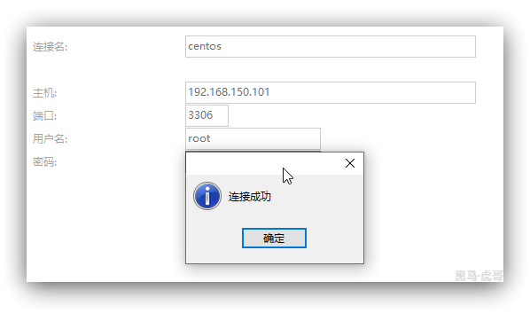


## 9.3.安装Redis

### 9.3.1.导入镜像

方案一：如果自己网络不错，直接下载：

```
docker pull redis:5.0
```

方案二：如果网络不太行，可以用课前资料准备的镜像包`redis.tar`，首先上传到Linux虚拟机，然后执行命令，导入即可：

```
docker load -i redis.tar
```

### 9.3.2.挂载本地文件

然后进入leyou目录：

```
cd /home/leyou
```

创建一个文件夹：

```
mkdir redis
cd redis
mkdir data
```

创建redis 的配置文件：

```
touch redis.conf
```

修改配置：

```
vi redis.conf
```

在redis.conf中添加一些配置：

```yaml
databases 1
dir /data
appendonly yes
appendfilename appendonly.aof
appendfsync everysec
auto-aof-rewrite-percentage 100
auto-aof-rewrite-min-size 64mb
```


### 9.3.3.运行容器

进入redis.conf所在目录，然后执行docker命令：

```
docker run \
 -p 6379:6379 \
 --name redis \
 -v $PWD/redis.conf:/usr/local/etc/redis/redis.conf \
 -v $PWD/data:/data \
 --privileged \
 -d \
 redis \
 redis-server /usr/local/etc/redis/redis.conf
```


安装完成后，可以再控制台执行命令测试：

```
docker exec -it ly-redis redis-cli
```

可以进入Redis控制台：

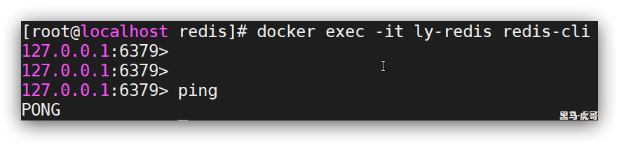


## 9.4.安装RabbitMQ

### 9.4.1.准备镜像

可以使用命令自己拉取，或者使用课前资料中提供好的镜像资料`mq.tar`并导入。导入命令：

```
docker load -i mq.tar
```

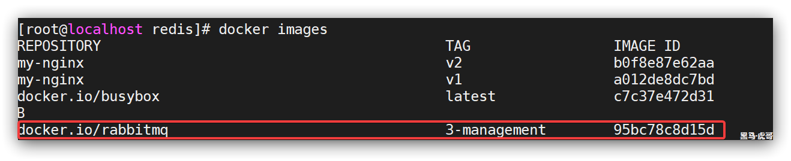

### 9.4.2.运行容器

执行下面的命令来运行MQ容器：

```
docker run \
 -e RABBITMQ_DEFAULT_USER=leyou \
 -e RABBITMQ_DEFAULT_PASS=123321 \
 --name mq \
 --hostname mq1 \
 -p 15672:15672 \
 -p 5672:5672 \
 -d \
 rabbitmq:3-management
```


### 9.4.3.测试连接

在浏览器访问：http://youIp:15672，例如我的是：http://192.168.150.101:15672

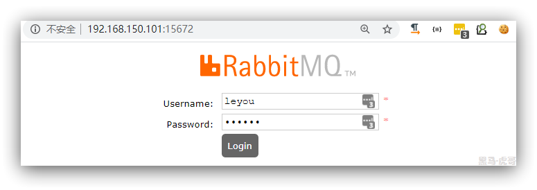


# 10.总结

docker中有关镜像、容器等的命令，一幅图即可概况：

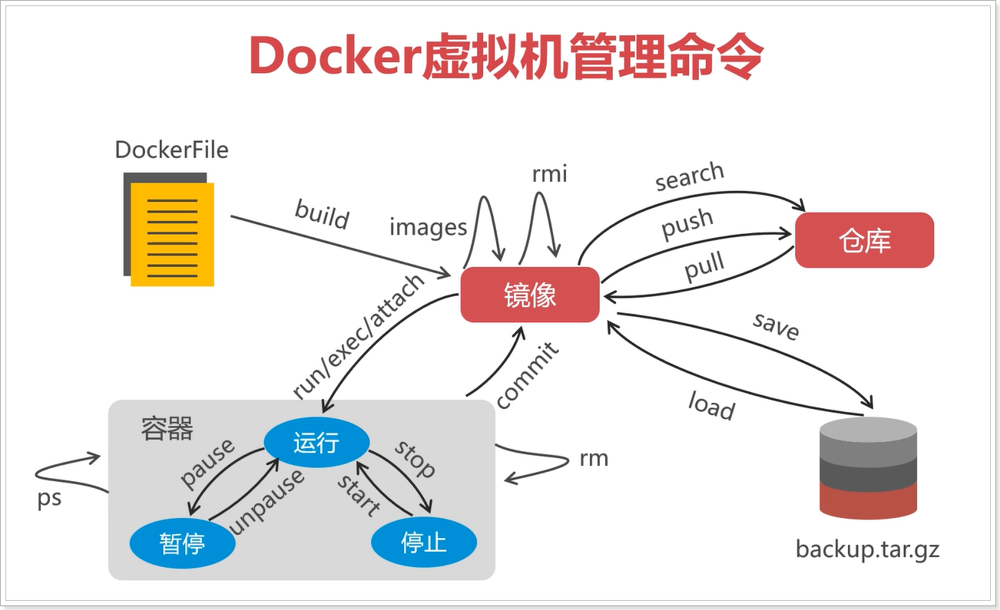

镜像操作：

```
docker build # 构建镜像
docker images # 查看镜像
docker rmi # 删除镜像
docker search # 到仓库搜索镜像
docker push # 提交镜像到仓库
docker pull # 从仓库拉取镜像
docker save # 保存镜像
docker load # 加载本地镜像
```

容器操作：

```
docker run/exec/attach # 运行镜像、进入已经启动镜像
docker stop # 停止镜像
docker start # 启动镜像
docker pause # 暂停镜像
docker unpause # 恢复镜像
docker ps # 查看运行中的镜像
docker rm # 删除镜像
```


完整docker命令：

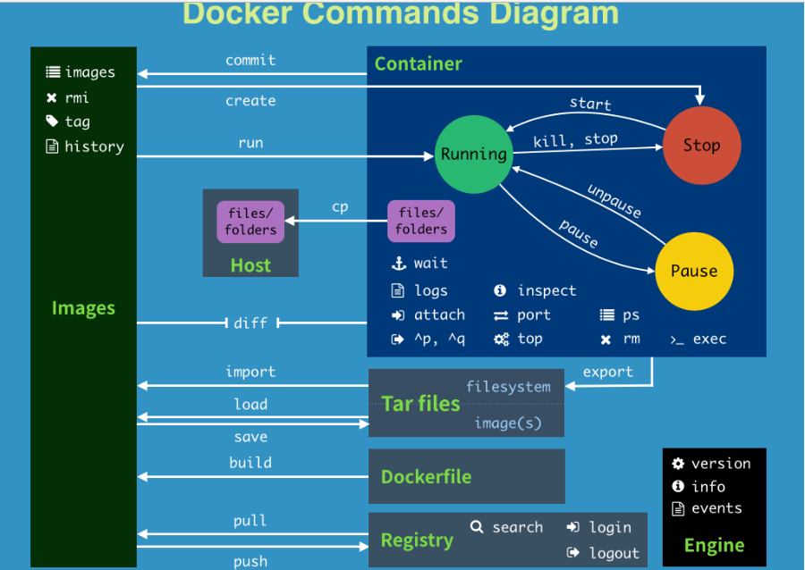	

```shell
attach    Attach to a running container           # 当前 shell 下 attach 连接指定运行镜像
build     Build an image from a Dockerfile            # 通过 Dockerfile 定制镜像
commit    Create a new image from a container changes   # 提交当前容器为新的镜像
cp        Copy files/folders from the containers filesystem to the host path   #从容器中拷贝指定文件或者目录到宿主机中
create    Create a new container                    # 创建一个新的容器，同 run，但不启动容器
diff      Inspect changes on a container's filesystem   # 查看 docker 容器变化
events    Get real time events from the server          # 从 docker 服务获取容器实时事件
exec      Run a command in an existing container        # 在已存在的容器上运行命令
export    Stream the contents of a container as a tar archive   # 导出容器的内容流作为一个 tar 归档文件[对应 import ]
history   Show the history of an image                  # 展示一个镜像形成历史
images    List images                                   # 列出系统当前镜像
import    Create a new filesystem image from the contents of a tarball # 从tar包中的内容创建一个新的文件系统映像[对应export]
info      Display system-wide information               # 显示系统相关信息
inspect   Return low-level information on a container   # 查看容器详细信息
kill      Kill a running container                      # kill 指定 docker 容器
load      Load an image from a tar archive         # 从一个 tar 包中加载一个镜像[对应 save]
login     Register or Login to the docker registry serve # 注册或者登陆一个 docker 源服务器
logout    Log out from a Docker registry server          # 从当前 Docker registry 退出
logs      Fetch the logs of a container                 # 输出当前容器日志信息
port      Lookup the public-facing port which is NAT-ed to PRIVATE_PORT    # 查看映射端口对应的容器内部源端口
pause     Pause all processes within a container        # 暂停容器
ps        List containers                               # 列出容器列表
pull      Pull an image or a repository from the docker registry server   # 从docker镜像源服务器拉取指定镜像或者库镜像
push      Push an image or a repository to the docker registry server    # 推送指定镜像或者库镜像至docker源服务器
restart   Restart a running container                   # 重启运行的容器
rm        Remove one or more containers                 # 移除一个或者多个容器
rmi       Remove one or more images             # 移除一个或多个镜像[无容器使用该镜像才可删除，否则需删除相关容器才可继续或 -f 强制删除]
run       Run a command in a new container              # 创建一个新的容器并运行一个命令
save      Save an image to a tar archive            # 保存一个镜像为一个 tar 包[对应 load]
search    Search for an image on the Docker Hub         # 在 docker hub 中搜索镜像
start     Start a stopped containers                    # 启动容器
stop      Stop a running containers                     # 停止容器
tag       Tag an image into a repository                # 给源中镜像打标签
top       Lookup the running processes of a container   # 查看容器中运行的进程信息
unpause   Unpause a paused container                    # 取消暂停容器
version   Show the docker version information           # 查看 docker 版本号
wait      Block until a container stops, then print its exit # 截取容器停止时的退出状态值
```


