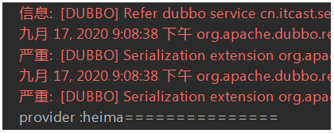
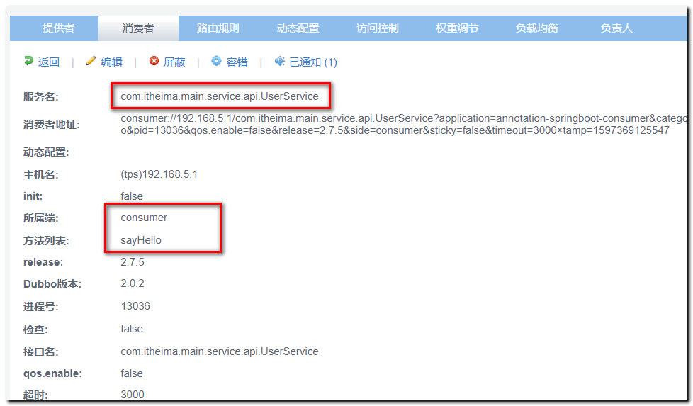
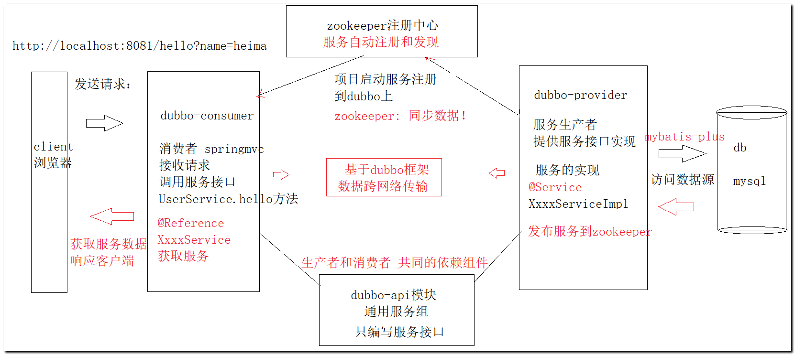
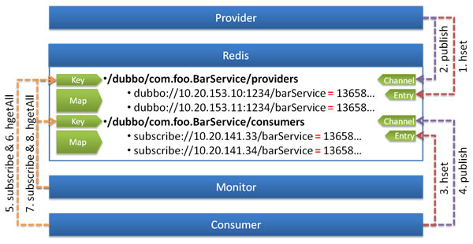
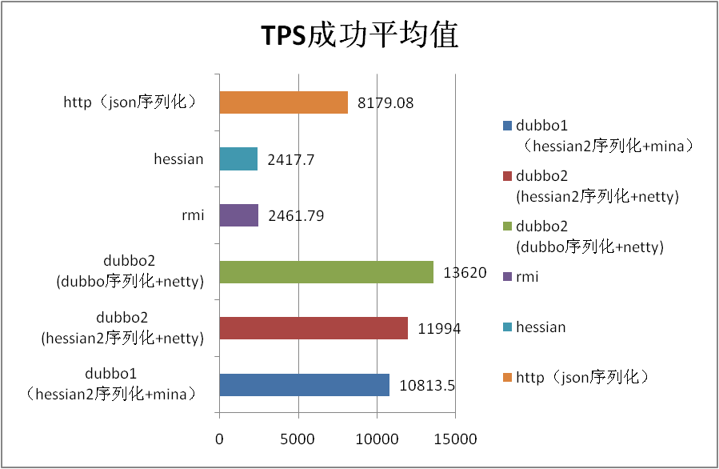
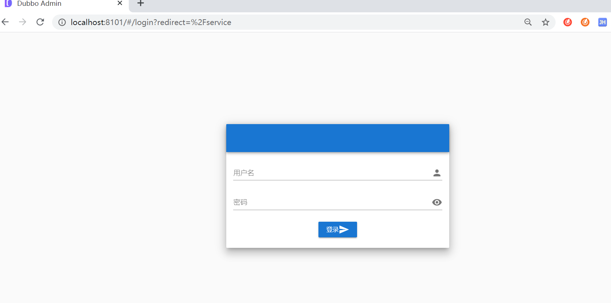
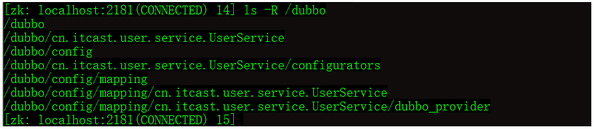

#  分布式RPC框架Apache Dubbo 

## 1.学习目标

1、了解Dubbo框架的开发流程

2、了解RPC远程调用过程

3、掌握Dubbo服务提供者和消费者开发-springboot版

4、熟悉Dubbo常用配置-annotation配置

5、搭建Dubbo管理控制台dubbo-admin


## 2. Apache Dubbo概述

### 2.1 Dubbo简介

```markdown
- Apache Dubbo是一款高性能(NIO)的Java RPC框架。其前身是阿里巴巴公司开源的一个高性能、轻量级的开源Java RPC框架，可以和Spring框架无缝集成。

- 2018年2月9日，Apache 基金会的邮件列表上发起了讨论是否接纳阿里的 Dubbo 项目进入 Apache 孵化器的投票。

- 2018年2月15日，邮件列表显示，Dubbo 获得了 14 张赞成票，在无弃权和反对票的情况下，正式通过投票，顺利成为 Apache 基金会孵化项目。

```

官网地址：<http://dubbo.apache.org/en-us/>

```markdown
dubbo的版本说明 

Apache Dubbo是一款应用广泛的高性能轻量级的Java 远程调用分布式服务框架，支持多种通信协议。当网站安装了Apache Dubbo并且启用http协议进行通信时，攻击者可以向网站发送POST请求，在请求里可以执行一个反序列化的操作，由于没有任何安全校验，这个反序列化过程可以执行任意代码。这里，序列化是指把某个编程对象转换为字节序列的过程，而反序列化是指把字节序列恢复为某个编程对象的过程。

漏洞影响的Apache Dubbo产品版本包括：2.7.0~2.7.4、2.6.0~2.6.7、2.5.x 的所有版本。

- Apache Dubbo官方建议用户网站升级到安全的2.7.5版本。

```

 

**什么是RPC？**

RPC全称为remote procedure call，即**远程过程调用**。

比如两台服务器A和B，A服务器上部署一个应用，B服务器上部署一个应用，A服务器上的应用想调用B服务器上的应用提供的方法，由于两个应用不在一个内存空间，不能直接调用，所以需要通过网络来表达调用的语义和传达调用的数据。

需要注意的是**RPC并不是一个具体的技术，而是指整个网络远程调用过程**。

RPC是一个泛化的概念，严格来说一切远程过程调用手段都属于RPC范畴。各种开发语言都有自己的RPC框架。Java中的RPC框架比较多，广泛使用的有RMI、Hessian、Dubbo等。

Dubbo官网地址：http://dubbo.apache.org

Dubbo提供了三大核心能力：**面向接口的远程方法调用，智能容错和负载均衡，以及服务自动注册和发现。**

本章节我们会先学习dubbo的远程调用技术。负载均衡和容错后续项目2继续学习！

Dubbo高性能的底层实现技术：

##### 性能提升NIO

- 标准的IO基于字节流和字符流进行操作的，而NIO是基于通道（Channel）和缓冲区（Buffer）进行操作，数据总是从通道读取到缓冲区中，或者从缓冲区写入到通道中
- Java NIO可以让你异步的使用IO，例如：当线程从通道读取数据到缓冲区时，线程还是可以进行其他事情。当数据被写入到缓冲区时，线程可以继续处理它。从缓冲区写入通道也类似。
- Java NIO引入了选择器的概念，选择器用于监听多个通道的事件（比如：连接打开，数据到达）。因此，单个的线程可以监听多个数据通道。

##### Netty框架

Netty是由JBOSS提供的一个java开源框架。Netty提供异步的、事件驱动的网络应用程序框架和工具，用以快速开发高性能、高可靠性的网络服务器和客户端程序。

也就是说，Netty 是一个基于NIO的客户、服务器端编程框架，使用Netty 可以确保你快速和简单的开发出一个网络应用，例如实现了某种协议的客户，服务端应用。Netty相当简化和流线化了网络应用的编程开发过程，例如，TCP和UDP的socket服务开发。

**Dubbo基于 Netty框架开发的高性能分布式RPC框架**


### 2.2 Dubbo架构

Dubbo 框架

Dubbo是一款高性能、轻量级的开源Java RPC框架，它提供了三大核心能力：

- ##### 面向接口的远程方法调用，

- ##### 智能容错和负载均衡

- ##### 服务自动注册和发现

### Dubbo框架的通信层 - 利用Netty的实现过程

Dubbo架构图（Dubbo官方提供）如下：


节点角色说明：

| 节点      | 角色名称                                               |
| --------- | ------------------------------------------------------ |
| Provider  | 服务提供方 -  服务的提供者   类似 商家                 |
| Consumer  | 服务消费方 -   使用服务的一方  类似买家                |
| Registry  | 服务注册与发现的注册中心  - 类似京东                   |
| Monitor   | 统计服务的调用次数和调用时间的监控中心  - 类似京东后台 |
| Container | 服务运行容器                                           |

虚线都是异步访问，实线都是同步访问
蓝色虚线:在启动时完成的功能
红色虚线(实线)都是程序运行过程中执行的功能

调用关系说明:

0. 服务容器负责启动，加载，运行服务提供者。
1. 服务提供者在启动时，向注册中心注册自己提供的服务。
2. 服务消费者在启动时，向注册中心订阅自己所需的服务。
3. 注册中心返回服务提供者地址列表给消费者，如果有变更，注册中心将基于长连接推送变更数据给消费者。
4. 服务消费者，从提供者地址列表中，基于软负载均衡算法，选一台提供者进行调用，如果调用失败，再选另一台调用。
5. 服务消费者和提供者，在内存中累计调用次数和调用时间，定时每分钟发送一次统计数据到监控中心。

## 3. Dubbo快速入门开发（了解）

参照官网文档：  API**代码可以从官方直接拷贝**

<http://dubbo.apache.org/zh-cn/docs/user/configuration/api.html>

### 3.1 基于API接口的快速入门案例

**目标：理解rpc调用以及注册中心**

实现步骤说明

```
1.服务提供方独立jvm运行，暴露服务接口
	开发步骤：
	a.创建应用配置
	b.创建协议配置
	c.服务接口暴露
2.服务消费方找到服务接口，并进行调用
	开发步骤:
	a.创建应用配置
	b.引用调用接口
```

打开下发资料，使用idea工具打开

 

模块说明：

- father  父模块
- api   服务接口模块
- consumer  服务消费模块
- provider 服务提供者模块

father模块：

father:pom引入maven依赖：

  说明： **初始案例采用服务器直连数据传输，没有注册中心，先不导入zookeeper依赖**

```xml
 <dependencies>
        <dependency>
            <groupId>org.apache.dubbo</groupId>
            <artifactId>dubbo</artifactId>
            <version>2.7.5</version>
        </dependency>
    </dependencies>
```

子模块：api模块

新建接口：HelloService

 

```java
public interface HelloService {

    public String  sayHello(String hello);
}

```

子模块：provider

pom 依赖通用服务接口模块 api 

```xml
<artifactId>provider</artifactId>
  <dependencies>
      <dependency>
          <groupId>cn.itcast.dubbo</groupId>
          <artifactId>api</artifactId>
          <version>1.0-SNAPSHOT</version>
      </dependency>
  </dependencies>
```

新建接口实现类:

 

```java
public class HelloServiceImpl implements HelloService {
    public String sayHello(String hello) {
        return "provider :"+hello;
    }
}
```

导入日志文件：    resources目录下

 

### 3.1服务提供方开发

创建一个服务启动类: 根据官方文档 api 代码示例： 直接拷贝

```java
package cn.itcast.provider;

import cn.itcast.service.HelloService;
import org.apache.dubbo.config.ApplicationConfig;
import org.apache.dubbo.config.ProtocolConfig;
import org.apache.dubbo.config.RegistryConfig;
import org.apache.dubbo.config.ServiceConfig;

import java.io.IOException;

public class App {

    public static void main(String[] args) throws Exception {
        // 服务实现
        HelloService helloService= new HelloServiceImpl();

// 当前应用配置
        ApplicationConfig application = new ApplicationConfig();
        application.setName("provider-dubbo");

// 连接注册中心配置 -  无配置中心  点对点连接
        RegistryConfig registry = new RegistryConfig(RegistryConfig.NO_AVAILABLE);

// 服务提供者协议配置
        ProtocolConfig protocol = new ProtocolConfig();
        protocol.setName("dubbo");
        protocol.setPort(20880);

// 注意：ServiceConfig为重对象，内部封装了与注册中心的连接，以及开启服务端口

// 服务提供者暴露服务配置
        ServiceConfig<HelloService> service = new ServiceConfig<HelloService>(); // 此实例很重，封装了与注册中心的连接，请自行缓存，否则可能造成内存和连接泄漏
        service.setApplication(application);
        service.setRegistry(registry); // 多个注册中心可以用setRegistries()
        service.setProtocol(protocol); // 多个协议可以用setProtocols()
        service.setInterface(HelloService.class);
        service.setRef(helloService);
        service.setVersion("1.0.0");

// 暴露及注册服务
        service.export();

        //  模拟服务启动--  当前线程阻塞
        System.in.read();
    }
}

```

log4j.properties日志打印:

```properties
#############
# 输出到控制台
#############
log4j.rootLogger=INFO,CONSOLE,logfile
# 配置CONSOLE输出到控制台
log4j.appender.CONSOLE=org.apache.log4j.ConsoleAppender 
# 配置CONSOLE设置为自定义布局模式
log4j.appender.CONSOLE.layout=org.apache.log4j.PatternLayout 
# 配置CONSOLE日志的输出格式  [frame] 2019-08-22 22:52:12,000  %r耗费毫秒数 %p日志的优先级 %t线程名 %C所属类名通常为全类名 %L代码中的行号 %x线程相关联的NDC %m日志 %n换行
log4j.appender.CONSOLE.layout.ConversionPattern=[frame] %d{yyyy-MM-dd HH:mm:ss,SSS} - %-4r %-5p [%t] %C:%L %x - %m%n
```

运行main方法：


暴露的url地址为：**dubbo://192.168.148.1:20880/com.itheima.dubbo.HelloService**?anyhost=true&application=app-provider&bind.ip=192.168.148.1&bind.port=20880&deprecated=false&dubbo=2.0.2&dynamic=true&generic=false&interface=com.itheima.dubbo.HelloService&methods=sayHello&pid=7716&release=2.7.6&side=provider&timestamp=1597373499709

### 3.2服务消费方开发

 

pom

依赖服务接口模块 api 

```xml
<dependencies>
    <dependency>
        <groupId>cn.itcast.dubbo</groupId>
        <artifactId>api</artifactId>
        <version>1.0-SNAPSHOT</version>
    </dependency>
</dependencies>
```

新建消费方测试类：

```java
package cn.itcast.consumer;

import cn.itcast.service.HelloService;
import org.apache.dubbo.config.ApplicationConfig;
import org.apache.dubbo.config.ReferenceConfig;
import org.apache.dubbo.config.RegistryConfig;

public class App {
    public static void main(String[] args) {
        // 当前应用配置
        ApplicationConfig application = new ApplicationConfig();
        application.setName("consumer-dubbo");

// 连接注册中心配置 -  不适用注册中心
        RegistryConfig registry = new RegistryConfig(RegistryConfig.NO_AVAILABLE);

// 注意：ReferenceConfig为重对象，内部封装了与注册中心的连接，以及与服务提供方的连接

// 引用远程服务
        ReferenceConfig<HelloService> reference = new ReferenceConfig<HelloService>(); // 此实例很重，封装了与注册中心的连接以及与提供者的连接，请自行缓存，否则可能造成内存和连接泄漏
        reference.setApplication(application);
        reference.setRegistry(registry); // 多个注册中心可以用setRegistries()
        reference.setInterface(HelloService.class);
        reference.setVersion("1.0.0");
// 如果点对点直连，可以用reference.setUrl()指定目标地址，设置url后将绕过注册中心，
// 将服务端日志发布的url地址拷贝到setUrl方法参数中
        reference.setUrl("dubbo://192.168.3.12:20880/cn.itcast.service.HelloService");

// 和本地bean一样使用xxxService
        HelloService helloService = reference.get(); 
        // 注意：此代理对象内部封装了所有通讯细节，对象较重，请缓存复用

        String heima = helloService.sayHello("heima");

        System.out.println(heima+"===============");

    }
}

```

调用结果：

 

### 3.3开发流程小结

#### 3.3.1 RPC基本概念

RPC（Remote Procedure Call）远程过程调用，简单的理解是一个节点请求另一个节点提供的服务。

**两个独立进程间的相互调用**， 解决：**服务和服务之间的数据传输问题**！rpc调用网络通讯部分根据协议不同，采用的数据传输报文不同。

远程调用过程：

- RPC（Remote Procedure Call）远程过程调用，简单的理解是一个节点请求另一个节点提供的服务

**通俗的描述是：客户端调用存在于远程计算机上的某个对象，就像调用本地应用程序中的对象一样**

#### 3.3.2api接口核心类

| 类名              | 描述                                                         |
| ----------------- | ------------------------------------------------------------ |
| ApplicationConfig | 应用配置                                                     |
| ProtocolConfig    | 协议配置                                                     |
| RegistryConfig    | 注册中心配置                                                 |
| ServiceConfig     | 服务暴露配置，通过方法export暴露服务接口                     |
| ReferenceConfig   | 引用调用配置，通过get方法获取对应的代理对象，调用接口就和本地方法调用一样 |

#### 3.3.3 思考

```markdown
问：消费端直接就使用接口调用，没有任何的实现类去实现可以调用成功吗？

- 答：java程序中如果遇到直接使用接口调用，除了有具体实现类外，还可以通过动态代理来实现。那么在dubbo中就是采用了动态代理机制，源码跟踪:ReferenceConfig.get() --> init() ---> ref = createProxy(map);
如下图：
消费端通过生成代理类： 将消费端的配置参数封装到map中，通过底层netty 发送给服务端, 
当调用服务接口方法时，获取服务端回送的数据！

问:刚才的案例中我们在客户端通过硬编码的方式指定url地址，如果我们暴露的服务有多个，同时线上运行的服务提供者有多个，那么我们这种在代码里面写死url地址会引来一些问题，
如：1.服务提供者可能新增，也可能删除，2.服务端提供的接口不可能这么简单，线上环境是批量的多个接口，那么我们如果要每一个接口引用都去写死地址那开发效率就很低了。有没有什么好的解决方案吗？

- 答:引入注册中心来对我们的服务进行统一管理维护，让消费端自己主动发现服务。
```

 

### 3.4 使用zookeeper注册中心

我们接着在项目的maven 父工程的配置文件pom.xml中引入zkclient依赖：

```xml
       <dependency>
            <groupId>com.101tec</groupId>
            <artifactId>zkclient</artifactId>
            <version>0.10</version>
        </dependency>
        <dependency>
            <groupId>org.apache.curator</groupId>
            <artifactId>curator-framework</artifactId>
            <version>4.2.0</version>
        </dependency>
        <dependency>
            <groupId>org.apache.curator</groupId>
            <artifactId>curator-recipes</artifactId>
            <version>4.2.0</version>
        </dependency>
```

#### 3.4.1 服务提供方

我们前面在注册中心配置属性设置的是不使用注册中心，接下来我们使用zookeeper作为我们的服务注册中心，配置如： 

**RegistryConfig registryConfig = new RegistryConfig("zookeeper://127.0.0.1:2181");**

**修改后的完整代码：**

```java
package cn.itcast.provider;

import cn.itcast.service.HelloService;
import org.apache.dubbo.config.ApplicationConfig;
import org.apache.dubbo.config.ProtocolConfig;
import org.apache.dubbo.config.RegistryConfig;
import org.apache.dubbo.config.ServiceConfig;

import java.io.IOException;

public class ServiceApp {

    public static void main(String[] args) throws Exception {
        // 服务实现
        HelloService helloService= new HelloServiceImpl();

// 当前应用配置
        ApplicationConfig application = new ApplicationConfig();
        application.setName("provider-dubbo");

// 连接注册中心配置
//        RegistryConfig registry = new RegistryConfig(RegistryConfig.NO_AVAILABLE);
        RegistryConfig registry = new RegistryConfig("zookeeper://127.0.0.1:2181");

// 服务提供者协议配置
        ProtocolConfig protocol = new ProtocolConfig();
        protocol.setName("dubbo");
        protocol.setPort(20880);

// 注意：ServiceConfig为重对象，内部封装了与注册中心的连接，以及开启服务端口

// 服务提供者暴露服务配置
        ServiceConfig<HelloService> service = new ServiceConfig<HelloService>(); // 此实例很重，封装了与注册中心的连接，请自行缓存，否则可能造成内存和连接泄漏
        service.setApplication(application);
        service.setRegistry(registry); // 多个注册中心可以用setRegistries()
        service.setProtocol(protocol); // 多个协议可以用setProtocols()
        service.setInterface(HelloService.class);
        service.setRef(helloService);
        service.setVersion("1.0.0");

// 暴露及注册服务
        service.export();

        //  模拟服务启动--  当前线程阻塞
        System.in.read();
    }
}

```

dubbo发布服务源码说明：

**扩展内容：** 关于dubbo服务注册**zookeeper源码出处**：

1. 从 **service.export();**  方法跟踪：


找到实现者： ListenerRegistryWrapper.java 实现 register方法，继续跟进

 

找到发布服务具体实现： FailbackRegistry接口的 **具体实现者**完成服务发布！

断点跟踪： **ZookeeperRegistry** 调用 ZkClient完成节点的创建！


其中： 

**create 方法  创建临时节点**     

**toUrlPath(url)  对地址进行编码 特殊字符处理**

```java
URLEncoder.encode(url, "UTF-8");//  自动对特殊字符进行编码转义
```

url.getParameter() -- true  表示创建：临时节点


#### 3.4.2 服务消费方

```java
package cn.itcast.consumer;

import cn.itcast.service.HelloService;
import org.apache.dubbo.config.ApplicationConfig;
import org.apache.dubbo.config.ReferenceConfig;
import org.apache.dubbo.config.RegistryConfig;

import java.io.IOException;

public class ConsumerApp {
    public static void main(String[] args) throws IOException {
        // 当前应用配置
        ApplicationConfig application = new ApplicationConfig();
        application.setName("consumer-dubbo");

// 连接注册中心配置 -  不适用注册中心
//        RegistryConfig registry = new RegistryConfig(RegistryConfig.NO_AVAILABLE);
        RegistryConfig registry = new RegistryConfig("zookeeper://127.0.0.1:2181");

// 注意：ReferenceConfig为重对象，内部封装了与注册中心的连接，以及与服务提供方的连接

// 引用远程服务
        ReferenceConfig<HelloService> reference = new ReferenceConfig<HelloService>(); // 此实例很重，封装了与注册中心的连接以及与提供者的连接，请自行缓存，否则可能造成内存和连接泄漏
        reference.setApplication(application);
        reference.setRegistry(registry); // 多个注册中心可以用setRegistries()
        reference.setInterface(HelloService.class);
        reference.setVersion("1.0.0");
// 如果点对点直连，可以用reference.setUrl()指定目标地址，设置url后将绕过注册中心，
// 将服务端日志发布的url地址拷贝到setUrl方法参数中
//        reference.setUrl("dubbo://192.168.3.12:20880/cn.itcast.service.HelloService");

// 和本地bean一样使用xxxService
        HelloService helloService = reference.get(); // 注意：此代理对象内部封装了所有通讯细节，对象较重，请缓存复用

        String heima = helloService.sayHello("heima");
        System.out.println(heima+"===============");
        System.in.read();
    }
}

```

**扩展内容：**  服务消费：从注册中心获取服务地址

源码：  **doInvoke() 方法处添加断点：**

**DubboInvoker** 作用：获取zookepper中心发布的服务节点并且调用底层对象完成数据传输！

 

在该构造方法中，参数URL中包含了服务端节点数据，

追踪。。。。是由**ZookeeperRegister对象doSubscribe**方法，获取zookeeper节点数据！

 

 ZookeeperRegister.java找到 **doSubscribe方法** 中：---  对象 中： 获取 服务端发布的服务节点信息:

源码： **191行处**：  获取zookeeper中心服务端临时节点：

  

**193行代码**： 将服务端的地址 特殊字符进行转换


toUrlsWithoutEmpty方法： **将获取服务节点地址进行地址解析！**


至此： **消费端源码解析完成！**

接下来我们只需要测试 服务端和消费端数据交互即可！

#### 3.4.3 启动zookeeper

 

先后重新启动 生产者和消费者

 

在客户端 zkCli.cmd 端 执行查询命令：

ls /dubbo -R   发现生产者和消费已经注册到zookeeper中心上

 

### 3.5 dubbo官方架构图(扩展)

如果想深入学习dubbo,可以参照dubbo官方框架流程图：

<http://dubbo.apache.org/zh-cn/docs/dev/design.html> 

 

#### 图例说明

- 图中左边淡蓝背景的为服务消费方使用的接口，右边淡绿色背景的为服务提供方使用的接口，位于中轴线上的为双方都用到的接口。
- 图中从下至上分为十层，各层均为单向依赖，右边的黑色箭头代表层之间的依赖关系，每一层都可以剥离上层被复用，其中，Service 和 Config 层为 API，其它各层均为 SPI。
- 图中绿色小块的为扩展接口，蓝色小块为实现类，图中只显示用于关联各层的实现类。
- 图中蓝色虚线为初始化过程，即启动时组装链，红色实线为方法调用过程，即运行时调时链，紫色三角箭头为继承，可以把子类看作父类的同一个节点，线上的文字为调用的方法。

#### 各层说明

- **config 配置层**：对外配置接口，以 `ServiceConfig`, `ReferenceConfig` 为中心，可以直接初始化配置类，也可以通过 spring 解析配置生成配置类
- **proxy 服务代理层**：服务接口透明代理，生成服务的客户端 Stub 和服务器端 Skeleton, 以 `ServiceProxy` 为中心，扩展接口为 `ProxyFactory`
- **registry 注册中心层**：封装服务地址的注册与发现，以服务 URL 为中心，扩展接口为 `RegistryFactory`, `Registry`, `RegistryService`
- **cluster 路由层**：封装多个提供者的路由及负载均衡，并桥接注册中心，以 `Invoker` 为中心，扩展接口为 `Cluster`, `Directory`, `Router`, `LoadBalance`
- **monitor 监控层**：RPC 调用次数和调用时间监控，以 `Statistics` 为中心，扩展接口为 `MonitorFactory`, `Monitor`, `MonitorService`
- **protocol 远程调用层**：封装 RPC 调用，以 `Invocation`, `Result` 为中心，扩展接口为 `Protocol`, `Invoker`, `Exporter`
- **exchange 信息交换层**：封装请求响应模式，同步转异步，以 `Request`, `Response` 为中心，扩展接口为 `Exchanger`, `ExchangeChannel`, `ExchangeClient`, `ExchangeServer`
- **transport 网络传输层**：抽象 mina 和 netty 为统一接口，以 `Message` 为中心，扩展接口为 `Channel`, `Transporter`, `Client`, `Server`, `Codec`
- **serialize 数据序列化层**：可复用的一些工具，扩展接口为 `Serialization`, `ObjectInput`, `ObjectOutput`, `ThreadPool`


### 3.6 阶段小结

- dubbo和zookeeper各自的作用：
  - dubbo底层通过rpc实现系统之间的数据通信
  - zookeeper实现服务端和消费端节点的存储


-------

## 4. Dubbo开发-SpringBoot（掌握）

Dubbo作为一个RPC框架，其最核心的功能就是要实现跨网络的远程调用。

本小节就是要创建两个应用，一个作为服务的提供方，一个作为服务的消费方。

通过Dubbo来实现服务消费方远程调用服务提供方的方法。

版本开发要求说明：  开发中所有的版本统一，避免环境问题导致的代码无法运行

- jdk1.8  环境变量配置要OK
- springboot  2.3.0 
- dubbo 2.7.5
- zookeeper   3.5.8 
- maven 环境搭建OK 连接好阿里云远程仓库

## 目标：完成dubbo提供方和消费方代码实现

开发前准备：

**本次开发我们采用apache  2.7.5 文档版本讲解**

注解开发文档参照：

<http://dubbo.apache.org/en-us/docs/user/configuration/annotation.html>

<http://dubbo.apache.org/en-us/> 官方开发步骤参照

 


### 4.0 开发流程说明

以前传统的开发模式：

 

------

采用Dubbo  框架SOA面向服务开发流程图说明：

https://www.processon.com/diagraming/5f5dbaeff346fb47ca9eea57

  

### 4.1 搭建maven多模块工程

开发步骤：建议官方 **get started** ！  注解开发一栏： Annotation Configuaration

官网配置代码

生产者：

 


消费者：

 


按照官方路径说明：

创建3个模块： **模块说明**

- dubbo-api 模块 存放消费者和生产者通用接口组+通用模块
- dubbo-provider  服务提供者 ，生产者 提供业务方法的实现
- dubbo-cosumer 服务消费者，请求服务，获取实现

搭建结构：

 

父模块工程pom.xml

```xml
    <parent>
        <groupId>org.springframework.boot</groupId>
        <artifactId>spring-boot-starter-parent</artifactId>
        <version>2.3.0.RELEASE</version>
    </parent>

    <build>
        <plugins>
            <plugin>
                <groupId>org.apache.maven.plugins</groupId>
                <artifactId>maven-compiler-plugin</artifactId>
                <version>3.5.1</version>
                <configuration>
                    <encoding>UTF-8</encoding>
                </configuration>
            </plugin>
        </plugins>
    </build>
```

api模块  pom.xml

```xml
 因为目前测试。。。暂无依赖配置
```

api模块 编写通用的服务接口: 接口包名可以自定义

```java
public interface UserService {
    public String  sayHello(String name);
}

```

 

### 4.2 开发生产者模块

 生产者作为服务的提供者 dubbo官方提供非常简单的注解配置： 我们只需要学习两个注解即可：

作用：

@Service  注解 来完成服务的发布 注意导包的时候，要导入dubbo官方提供的包。

@EnabledDubbo  在启动类上添加，自动扫描所有的服务类（有@Service注解的类） 注册到zookeeper上发布

1. 创建子模块  pom导入api依赖即可

```XML
 <dependencies>
        <!--springboot 整合dubbo 开始 -->
        <dependency>
            <groupId>org.apache.dubbo</groupId>
            <artifactId>dubbo-spring-boot-starter</artifactId>
            <version>2.7.5</version>
        </dependency>
        <dependency>
            <groupId>org.apache.dubbo</groupId>
            <artifactId>dubbo-dependencies-zookeeper</artifactId>
            <version>2.7.5</version>
            <type>pom</type>
            <exclusions>
                <exclusion>
                    <groupId>org.slf4j</groupId>
                    <artifactId>slf4j-log4j12</artifactId>
                </exclusion>
            </exclusions>
        </dependency>
        <!--springboot 整合dubbo 结束-->
        <dependency>
            <groupId>org.springframework.boot</groupId>
            <artifactId>spring-boot-configuration-processor</artifactId>
        </dependency>
           <dependency>
            <groupId>org.springframework.boot</groupId>
            <artifactId>spring-boot-starter</artifactId>
        </dependency>
       引入同学的自己的api模块坐标
        <dependency>
            <groupId>com.itheima.dubbo</groupId>
            <artifactId>api</artifactId>
            <version>1.0-SNAPSHOT</version>
        </dependency>
     
</dependencies>
<build>
        <plugins>
            <plugin>
                <groupId>org.springframework.boot</groupId>
                <artifactId>spring-boot-maven-plugin</artifactId>
            </plugin>
        </plugins>
    </build>
```

2. 搭建生产者工程目录

 

3.  编写服务类： 注意使用注解 不要导错包 **@Service**

```java

注意 ： @Service注解不要导错包！！！！！

@Service//  该注解 ： 1  生成UserService接口实例对象   2. 提供服务类 后续会结合 @EnableDubbo注解 服务注册到zookeeper中心上
public class UserServiceImpl implements UserService {
    @Override
    public String sayHello(String name) {
        System.out.println("----服务访问了一次------后续访问数据源");
        return "hello dubbo "+name;
    }
}

```

4. 配置dubbo服务发布: 编写 application.properties文件 复制官方模板修改即可

 

修改一下端口号：避免后续启动服务 端口被占用： 8088   **学员可以改造成yml文件编写**

```properties
# dubbo-provider.properties
dubbo.application.name=annotation-springboot-provider
dubbo.registry.address=zookeeper://127.0.0.1:2181
dubbo.protocol.name=dubbo
dubbo.protocol.port=20880
server.port=8088
```

确保本地zookeeper服务启动 ： 黑窗口打开！

 

5. 编写启动类： 启动main方法 发布服务

```java
@SpringBootApplication
@EnableDubbo(scanBasePackages= "com.itheima.service.impl")// 官方提供的模板，修改扫描的包名： 自己的@Service类所在的包名
public class UserApplication {

    public static void main(String[] args) {
        SpringApplication.run(UserApplication.class,args);
        System.out.println("---生产者服务启动-----8088");
    }
}

```

5. 打开 dubbo-admin后台管理界面 查看服务生产者有无注册！

服务生产者发布成功！！！！

 

### 4.3 开发消费者模块

同生产者开发类似：

- **@Reference**  获取、订阅服务  **该注解只要能够被启动类扫描到即可！**

1. 创建子模块，dubbo-consumer  pom依赖 api即可

```xml
 <dependencies>
        <dependency>
            <groupId>org.springframework.boot</groupId>
            <artifactId>spring-boot-starter-web</artifactId>
        </dependency>
        <!--springboot 整合dubbo 开始 -->
        <dependency>
            <groupId>org.apache.dubbo</groupId>
            <artifactId>dubbo-spring-boot-starter</artifactId>
            <version>2.7.5</version>
        </dependency>
        <dependency>
            <groupId>org.apache.dubbo</groupId>
            <artifactId>dubbo-dependencies-zookeeper</artifactId>
            <version>2.7.5</version>
            <type>pom</type>
            <exclusions>
                <exclusion>
                    <groupId>org.slf4j</groupId>
                    <artifactId>slf4j-log4j12</artifactId>
                </exclusion>
            </exclusions>
        </dependency>
        <!--springboot 整合dubbo 结束-->

        <dependency>
            <groupId>org.springframework.boot</groupId>
            <artifactId>spring-boot-configuration-processor</artifactId>
        </dependency>
     
       引入上述api模块坐标
        <dependency>
            <groupId>com.itheima.dubbo</groupId>
            <artifactId>api</artifactId>
            <version>1.0-SNAPSHOT</version>
        </dependency>
     
</dependencies>
<build>
        <plugins>
            <plugin>
                <groupId>org.springframework.boot</groupId>
                <artifactId>spring-boot-maven-plugin</artifactId>
            </plugin>
        </plugins>
    </build>
```

2. 编写Controller 对象 当浏览器发送请求： springmvc接受请求，调用dubbo服务 

```java
@RestController
public class UserController {

    @Reference  //  注解不要导错包  导入dubbo的才行  注册服务到zookeeper
    private UserService userService;

    @GetMapping("hello")
    public  String  hello(String name){

        String s = userService.sayHello(name);

        return "hello"+s;
    }
}
```

3. 编写启动类

```java
@SpringBootApplication
public class ConsumerMain {
    public static void main(String[] args) {
        SpringApplication.run(ConsumerMain.class,args);
        System.out.println("----消费者启动----");
    }
}
```

注意启动类的位置：要能扫描到controller对象

 

4. 配置dubbo服务

编写application.properties   **学员可以改造成yml文件编写**

```properties
# dubbo-consumer.properties
dubbo.application.name=annotation-springboot-consumer
dubbo.registry.address=zookeeper://127.0.0.1:2181
dubbo.consumer.check=false
server.port=8081
```

5. 启动main方法   服务消费者编写完成  查看dubbo-admin窗口

 


测试：

浏览器输入地址： 访问消费者   localhost:8081/hello?name=heima

 

开发完成！

### 4.4 Dubbo快速入门开发小结

1. zookeeper安装和启动
2. 编写服务通用接口模块

3. 编写服务生产者和消费者

4. 启动类，发布服务到zookeeper

 

### 4.5springboot整合dubbo与基于api接口开发的对照关系表

| API接口           | SpringBoot配置              |
| ----------------- | --------------------------- |
| ApplicationConfig | yml文件：spring.application |
| ProtocolConfig    | yml文件：dubbo.protocol     |
| RegistryConfig    | yml文件：dubbo.registry     |
| ServiceConfig     | 注解@Service                |
| ReferenceConfig   | 注解@Reference              |

### 4.6Springboot开发小结

```markdown
1.properties核心配置属性
	dubbo.config-center：服务注册初始化zookeeper连接超时时间
	dubbo.registry.address：设置注册中心类型
	dubbo.protocol.name：设置协议类型，一般设置默认的dubbo
	dubbo.protocol.port：设置dubbo协议端口号，-1表示端口从默认的20880开始，如果有端口占用就进行递增
2.服务提供方对外暴露接口服务使用@Service注解
3.服务消费方引用服务接口使用@Reference注解
```

#### 4.6.1 包扫描

```markdown
      <!--开启生产者和消费者的注解扫描-->
 @EnableDubbo(scanBasePackages= "com.itheima.main.xxx")
       配置的是@Reference 和 @Service类所在的包名
用法一致：
   都是在启动类上添加！！
   
 application.properties文件也可以配置扫描包：其作用一样： 
   这样就可以不用在启动类上添加   @EnableDubbo 注解
 dubbo.scan.base-packages：包扫描配置，扫码包下面的@Service和@Reference注解
 
 springboot整合dubbo之后，消费者端可以不用配置包扫描！ 确保启动类可以扫描到@Reference注解即可！
 
```

**服务发布注解**

```java
@Sericve  :  用于生产者方  发布服务  一般都在服务接口实现类上  XxxServiceImpl上

例如：
   @Service
public class UserServiceImpl implements UserService {


@Reference ： 用于消费者方  消费者发布服务   一般都Controller类里面 注入 服务类使用
例如：
@RestController
public class UserController {

    @Reference  //  获取服务代理实现类  dubbo实现
    private UserService userService;
```


#### 4.6.2 协议

生产者端配置   dubbo://           http://              jdbc://           ftp://

```properties
dubbo.protocol.name=dubbo
dubbo.protocol.port=20880

如果端口号配置 -1 表示
dubbo协议缺省端口为20880，rmi协议缺省端口为1099，http和hessian协议缺省端口为80；如果没有配置port，则自动采用默认端口，如果配置为-1，则会分配一个没有被占用的端口。
Dubbo 2.4.0+，分配的端口在协议缺省端口的基础上增长，确保端口段可控。
```

一般在服务提供者一方配置，可以指定使用的协议名称和端口号。 

其中Dubbo支持的协议有：dubbo、rmi、hessian、http、webservice、rest、redis等。

推荐使用的是dubbo协议。

dubbo 协议采用单一长连接和 NIO 异步通讯，适合于小数据量大并发的服务调用，以及服务消费者机器数远大于服务提供者机器数的情况。不适合传送大数据量的服务，比如传文件，传视频等，除非请求量很低。

也可以在同一个工程中配置多个协议，不同服务可以使用不同的协议

#### 4.6.3 启动时检查

一般都是在消费者端： 启动顺序一般都是 先启动生产者 再启动消费者

如果先启动消费者：控制台会有异常信息： 可以把消费者 check=false 开启 不检测服务！

```properties
dubbo.consumer.check=false
```

上面这个配置需要配置在**服务消费者一方**，如果不配置默认check 和 default 值为true。

Dubbo 缺省会在启动时检查依赖的服务是否可用，不可用时会抛出异常，阻止 Spring 初始化完成，以便上线时，能及早发现问题。可以通过将check值改为false来关闭检查。


建议在开发阶段将check值设置为false，在生产环境下改为true。

**消费端application.properties/yaml配置即可！**

#### 4.6.4 yaml文件配置

开发中我们通常会使用yaml 而不使用propperties文件

修改一下即可：

生产者：

```yml
server:
  port: 8088

dubbo:
  application:
    name: annotation-springboot-provider
  registry:
    address: zookeeper://127.0.0.1:2181
  protocol:
    name: dubbo
    port: 20880

```

消费者：

```yml
# dubbo-consumer.properties
server:
  port: 8081

dubbo:
  consumer:
    check: false
  registry:
    address: zookeeper://127.0.0.1:2181
  application:
    name: annotation-springboot-consumer
```


## 5.dubbo的注册中心（了解）

前面的示例课程中我们用到了注册中心，dubbo在服务提供者和服务消费者在启动的时候都会连接注册中心。dubbo的官方文档中推荐使用zookeeper作为注册中心.

### 5.1 zookeeper(重要)

 

**流程说明**：

- 服务提供者启动时: 向 `/dubbo/com.foo.BarService/providers` 目录下写入自己的 URL 地址
- 服务消费者启动时: 订阅 `/dubbo/com.foo.BarService/providers` 目录下的提供者 URL 地址。并向 `/dubbo/com.foo.BarService/consumers` 目录下写入自己的 URL 地址
- 监控中心启动时: 订阅 `/dubbo/com.foo.BarService` 目录下的所有提供者和消费者 URL 地址。

**使用:**  yml文件直接配置即可

```yaml
dubbo:
  registry:
    address: zookeeper://127.0.0.1:2181
```

### 5.2 redis

   

使用 Redis 的 Key/Map 结构存储数据结构：

- 主 Key 为服务名和类型
- Map 中的 Key 为 URL 地址
- Map 中的 Value 为过期时间，用于判断脏数据，脏数据由监控中心删除

使用，需要在maven中添加依赖：

```xml
       <dependency>
            <groupId>org.apache.commons</groupId>
            <artifactId>commons-pool2</artifactId>
            <version>2.6.2</version>
        </dependency>
        <dependency>
            <groupId>redis.clients</groupId>
            <artifactId>jedis</artifactId>
            <version>3.3.0</version>
        </dependency>
```

配置文件中使用：

```yaml
dubbo:
  registry:
    address: redis://127.0.0.1:6379
```


### 5.3 Multicast

Multicast 注册中心不需要启动任何中心节点，只要广播地址一样，就可以互相发现。

 

1. 提供方启动时广播自己的地址
2. 消费方启动时广播订阅请求
3. 提供方收到订阅请求时，单播自己的地址给订阅者，如果设置了 `unicast=false`，则广播给订阅者
4. 消费方收到提供方地址时，连接该地址进行 RPC 调用。

组播受网络结构限制，只适合小规模应用或开发阶段使用。组播地址段: 224.0.0.0 - 239.255.255.255

### 5.4 Nacos

Nacos 是 Dubbo 生态系统中重要的注册中心实现，其中 [`dubbo-registry-nacos`](https://github.com/apache/incubator-dubbo/tree/master/dubbo-registry/dubbo-registry-nacos) 则是 Dubbo 融合 Nacos 注册中心的实现。

<font color="red">我们后续课程讲spring cloud aliaba还会用到nacos，所以nacos这块咋们本次课程不深入讲解.</font>

### 5.5 Simple

Simple 注册中心本身就是一个普通的 Dubbo 服务，可以减少第三方依赖，使整体通讯方式一致。

服务暴露:

```yaml
dubbo:
  protocol:
    port: 9090
```

引用配置:

```yaml
dubbo:
  registry:
    address: 127.0.0.1:9090
```

## 6.dubbo协议概述(了解)

dubbo框架中支持调用的协议有很多，如：dubbo、hessian、rmi、http等，推荐使用 Dubbo 协议,各协议性能对比：



**Dubbo协议**

Dubbo 缺省协议采用单一长连接和 NIO 异步通讯，适合于小数据量大并发的服务调用，以及服务消费者机器数远大于服务提供者机器数的情况。

反之，Dubbo 缺省协议不适合传送大数据量的服务，比如传文件，传视频等，除非请求量很低。

 

- Transporter: mina, netty, grizzy
- Serialization: dubbo, hessian2, java, json
- Dispatcher: all, direct, message, execution, connection
- ThreadPool: fixed, cached

**特性**

缺省协议，使用基于 mina `1.1.7` 和 hessian `3.2.1` 的 tbremoting 交互。

- 连接个数：单连接
- 连接方式：长连接
- 传输协议：TCP
- 传输方式：NIO 异步传输
- 序列化：Hessian 二进制序列化
- 适用范围：传入传出参数数据包较小（建议小于100K），消费者比提供者个数多，单一消费者无法压满提供者，尽量不要用 dubbo 协议传输大文件或超大字符串。
- 适用场景：常规远程服务方法调用

**约束**

- 参数及返回值需实现 `Serializable` 接口
- 参数及返回值不能自定义实现 `List`, `Map`, `Number`, `Date`, `Calendar` 等接口，只能用 JDK 自带的实现，因为 hessian 会做特殊处理，自定义实现类中的属性值都会丢失。
- Hessian 序列化，只传成员属性值和值的类型，不传方法或静态变量，兼容情况

| 数据通讯 | 情况                                                         | 结果                                           |
| -------- | ------------------------------------------------------------ | ---------------------------------------------- |
| A->B     | 类A多一种 属性（或者说类B少一种 属性）                       | 不抛异常，A多的那 个属性的值，B没有， 其他正常 |
| A->B     | 枚举A多一种 枚举（或者说B少一种 枚举），A使用多 出来的枚举进行传输 | 抛异常                                         |
| A->B     | 枚举A多一种 枚举（或者说B少一种 枚举），A不使用 多出来的枚举进行传输 | 不抛异常，B正常接 收数据                       |
| A->B     | A和B的属性 名相同，但类型不相同                              | 抛异常                                         |
| A->B     | serialId 不相同                                              | 正常传输                                       |

接口增加方法，对客户端无影响，如果该方法不是客户端需要的，客户端不需要重新部署。输入参数和结果集中增加属性，对客户端无影响，如果客户端并不需要新属性，不用重新部署。

输入参数和结果集属性名变化，对客户端序列化无影响，但是如果客户端不重新部署，不管输入还是输出，属性名变化的属性值是获取不到的。

总结：服务器端和客户端对领域对象并不需要完全一致，而是按照最大匹配原则。

**配置协议**：

默认配置：

```yaml
dubbo:
  protocol:
    name: dubbo
```

配置协议选项:

| 属性          | 对应URL参数   | 类型           | 是否必填 | 缺省值                                                       | 作用     | 描述                                                         | 兼容性         |
| :------------ | ------------- | -------------- | -------- | ------------------------------------------------------------ | -------- | ------------------------------------------------------------ | -------------- |
| id            |               | string         | 可选     | dubbo                                                        | 配置关联 | 协议BeanId，可以在<dubbo:service protocol="">中引用此ID，如果ID不填，缺省和name属性值一样，重复则在name后加序号。 | 2.0.5以上版本  |
| name          | <protocol>    | string         | **必填** | dubbo                                                        | 性能调优 | 协议名称                                                     | 2.0.5以上版本  |
| port          | <port>        | int            | 可选     | dubbo协议缺省端口为20880，rmi协议缺省端口为1099，http和hessian协议缺省端口为80；如果**没有**配置port，则自动采用默认端口，如果配置为**-1**，则会分配一个没有被占用的端口。Dubbo 2.4.0+，分配的端口在协议缺省端口的基础上增长，确保端口段可控。 | 服务发现 | 服务端口                                                     | 2.0.5以上版本  |
| host          | <host>        | string         | 可选     | 自动查找本机IP                                               | 服务发现 | -服务主机名，多网卡选择或指定VIP及域名时使用，为空则自动查找本机IP，-建议不要配置，让Dubbo自动获取本机IP | 2.0.5以上版本  |
| threadpool    | threadpool    | string         | 可选     | fixed                                                        | 性能调优 | 线程池类型，可选：fixed/cached                               | 2.0.5以上版本  |
| threads       | threads       | int            | 可选     | 200                                                          | 性能调优 | 服务线程池大小(固定大小)                                     | 2.0.5以上版本  |
| iothreads     | threads       | int            | 可选     | cpu个数+1                                                    | 性能调优 | io线程池大小(固定大小)                                       | 2.0.5以上版本  |
| accepts       | accepts       | int            | 可选     | 0                                                            | 性能调优 | 服务提供方最大可接受连接数                                   | 2.0.5以上版本  |
| payload       | payload       | int            | 可选     | 8388608(=8M)                                                 | 性能调优 | 请求及响应数据包大小限制，单位：字节                         | 2.0.5以上版本  |
| codec         | codec         | string         | 可选     | dubbo                                                        | 性能调优 | 协议编码方式                                                 | 2.0.5以上版本  |
| serialization | serialization | string         | 可选     | dubbo协议缺省为hessian2，rmi协议缺省为java，http协议缺省为json | 性能调优 | 协议序列化方式，当协议支持多种序列化方式时使用，比如：dubbo协议的dubbo,hessian2,java,compactedjava，以及http协议的json等 | 2.0.5以上版本  |
| accesslog     | accesslog     | string/boolean | 可选     |                                                              | 服务治理 | 设为true，将向logger中输出访问日志，也可填写访问日志文件路径，直接把访问日志输出到指定文件 | 2.0.5以上版本  |
| path          | <path>        | string         | 可选     |                                                              | 服务发现 | 提供者上下文路径，为服务path的前缀                           | 2.0.5以上版本  |
| transporter   | transporter   | string         | 可选     | dubbo协议缺省为netty                                         | 性能调优 | 协议的服务端和客户端实现类型，比如：dubbo协议的mina,netty等，可以分拆为server和client配置 | 2.0.5以上版本  |
| server        | server        | string         | 可选     | dubbo协议缺省为netty，http协议缺省为servlet                  | 性能调优 | 协议的服务器端实现类型，比如：dubbo协议的mina,netty等，http协议的jetty,servlet等 | 2.0.5以上版本  |
| client        | client        | string         | 可选     | dubbo协议缺省为netty                                         | 性能调优 | 协议的客户端实现类型，比如：dubbo协议的mina,netty等          | 2.0.5以上版本  |
| dispatcher    | dispatcher    | string         | 可选     | dubbo协议缺省为all                                           | 性能调优 | 协议的消息派发方式，用于指定线程模型，比如：dubbo协议的all, direct, message, execution, connection等 | 2.1.0以上版本  |
| queues        | queues        | int            | 可选     | 0                                                            | 性能调优 | 线程池队列大小，当线程池满时，排队等待执行的队列大小，建议不要设置，当线程池满时应立即失败，重试其它服务提供机器，而不是排队，除非有特殊需求。 | 2.0.5以上版本  |
| charset       | charset       | string         | 可选     | UTF-8                                                        | 性能调优 | 序列化编码                                                   | 2.0.5以上版本  |
| buffer        | buffer        | int            | 可选     | 8192                                                         | 性能调优 | 网络读写缓冲区大小                                           | 2.0.5以上版本  |
| heartbeat     | heartbeat     | int            | 可选     | 0                                                            | 性能调优 | 心跳间隔，对于长连接，当物理层断开时，比如拔网线，TCP的FIN消息来不及发送，对方收不到断开事件，此时需要心跳来帮助检查连接是否已断开 | 2.0.10以上版本 |
| telnet        | telnet        | string         | 可选     |                                                              | 服务治理 | 所支持的telnet命令，多个命令用逗号分隔                       | 2.0.5以上版本  |
| register      | register      | boolean        | 可选     | true                                                         | 服务治理 | 该协议的服务是否注册到注册中心                               | 2.0.8以上版本  |
| contextpath   | contextpath   | String         | 可选     | 缺省为空串                                                   | 服务治理 |                                                              | 2.0.6以上版本  |

## 6.Dubbo管理控制台

我们在开发时，需要知道Zookeeper注册中心都注册了哪些服务，有哪些消费者来消费这些服务。我们可以通过部署一个管理中心来实现。其实管理中心就是一个web应用，部署到tomcat即可。

### 6.1 安装使用

源码下载地址：https://github.com/apache/dubbo-admin.git

代码使用develop分支。

老师下发的资料： **dubbo-admin.jar** 可以直接运行。

```
windows:
 java -jar {dubbo-admin.jar目录}/dubbo-admin.jar

linux:
 nohup java -jar {dubbo-admin.jar目录}/dubbo-admin.jar &
```

运行完以后访问浏览器地址：http://localhost:8101

运行dubbo-admin.jar需要注意的几点:

```markdown
	1.默认端口为8101如果端口存在冲突需要更改默认端口
	
	2.zookeeper连接地址为127.0.0.1:2181如果不是则需要进行更改
	
	更改可以直接用WinRAR打开，
	在BOOT-INF/classes/application.properties中修改，先解压到桌面或其它地方进行编辑，编辑完以后把最新文件拖放到压缩文件进行覆盖，然后再重新运行ok。
```


运行后效果:   浏览器直接访问 地址即可：


点击服务查询菜单会跳转到登入页面:



<font color="red">**此时输入默认的账号密码:root/root进行登入.**</font>


web版本：  下发资料

dubbo.war  ---拷贝   tomcat/webapps    然后启动 zookeeper  再启动tomcat   注意端口不要冲突即可！


### 6.2控制台基本使用

#### 6.2.1服务查询

查询结果列说明:

| 属性名称 | 描述                                                         |
| -------- | ------------------------------------------------------------ |
| 服务名   | 服务提供方暴露的服务接口路径                                 |
| 组       | 服务的组名（<font color="red">dubbo的高级特性会再次使用到</font>） |
| 版本     | 服务的版本号（<font color="red">dubbo的高级特性会再次使用到</font>） |
| 应用     | 服务提供方启动应用时注册的应用名称                           |

#### 6.2.2服务详情

在服务查询的结果页中，如果存在服务数据，那么在操作列对应的每一行具体服务都有一个“详情”按钮，点击详情进入到服务详情页面(可以查看具体的提供者和消费者列表)：


## 7. Dubbo的负载均衡(了解)

### 7.1 什么是负载均衡

```xml
负载均衡，它的职责是将网络请求，或者其他形式的负载“均摊”到不同的机器上。
避免集群中部分服务器压力过大，而另一些服务器比较空闲的情况。
通过负载均衡，可以让每台服务器获取到适合自己处理能力的负载。在为高负载服务器分流的同时，还可以避免资源浪费.

Dubbo是一个分布式服务框架，能避免单点故障和支持服务的横向扩容。一个服务通常会部署多个实例。如何从多个服务 Provider 组成的集群中挑选出一个进行调用，就涉及到一个负载均衡的策略。

负载均衡（Load Balance）：其实就是将请求分摊到多个操作单元上进行执行，从而共同完成工作任务。
```

详细解释： 负载均衡 英文 ： LoadBalance

```markdown
LoadBalance 中文意思为负载均衡，它的职责是将网络请求，或者其他形式的负载“均摊”到不同的机器上。
避免集群中部分服务器压力过大，而另一些服务器比较空闲的情况。
通过负载均衡，可以让每台服务器获取到适合自己处理能力的负载。在为高负载服务器分流的同时，还可以避免资源浪费，一举两得。负载均衡可分为软件负载均衡和硬件负载均衡。

Dubbo 需要对服务消费者的调用请求进行分配，避免少数服务提供者负载过大。服务提供者负载过大，会导致部分请求超时。因此将负载均衡到每个服务提供者上，是非常必要的。

Dubbo 提供了4种负载均衡实现，分别是：

 - 基于权重随机算法的 Random LoadBalance
 - 基于最少活跃调用数算法的 LeastActive LoadBalance
 - 基于加权轮询算法的 RoundRobin LoadBalance。
 
这几个负载均衡算法代码不是很长，下面我们就通过代码来演示负载均衡实际效果： 
```

### 7.2 负载均衡代码演示

代码实现：负载均衡演示  实际开发中需要2台服务器来进行负载均衡！

我们将服务提供者**复制2份 代表2台机器**，分别注册到zookeeper 并且发布HelloService服务

模拟一个消费者 ：  2个生产者

消费端代码：

```java
@RestController
public class HelloController {
     @Reference  //   获取 服务   dubbo生成 代理类 完成rpc数据通信
    private HelloService helloService;
     @GetMapping("hello")
    public String   hello(String name){
        String s = helloService.sayBye(name);
        return  s;
    }
}
```

通过： RpcContext.getContext().getUrl().getPort(); //  查看服务器的响应情况！

业务层对象：使用@Service注解配置 负载均衡

```java
@Service(loadbalance ="random")  //  采用默认随机策略
//  注解发布服务  zookeeper
public class HelloServiceImpl  implements HelloService {

    @Override
    public String sayBye(String name) {
        int remotePort = RpcContext.getContext().getUrl().getPort();  //  获取服务端口号
        System.out.println("====服务端口==="+remotePort);
        return "byebye: "+name;
    }
```

复制两台服务器

 我们的2台服务器搭建完成，只需要启动main方法 即可完成2台服务器的启动

 

2. yaml文件需要修改一下： **port -1**

  

至此我们完成了2台服务器的搭建！

此时我们启动客户端项目，每刷新浏览器一次 获取服务资源！  默认机制： Random ！

其他的均衡策略：  语法 ： **@Service(loadBalance="策略关键字")**   

Dubbo提供了3中负载均衡策略如下：

#### 1、Random LoadBalance 

​        随机，按权重设置随机概率，**默认使用此策略**。

​        在一个截面上碰撞的概率越高，但调用量越大分布越均匀，而且按概率使用权重后也比较均匀，有利于动态调整权重。直接在注解上配置参数即可

启动2台服务器：  main1,2

浏览器访问  localhost:8081/hello?name=lisi  刷新多次 查看控制台访问情况！

#### 2、RoundRobin   LoadBalance           

​        轮询，按公约后的权重设置轮询比率。

​        存在慢的提供者累计请求问题，比如：第二台机器很慢，但没挂，当请求调用到第二台就卡在那儿，久而久之，所有请求都卡在调第二台上。

我们只演示一种：

在业务层@Service注解添加 负载均衡关键字即可：

```java
@Service(loadbalance = "roundrobin")
//  使用roundrobin 配置轮询策略
public class HelloServiceImpl  implements HelloService {

    @Override
    public String sayBye(String name) {
        int remotePort = RpcContext.getContext().getUrl().getPort();  //  获取服务端口号
        System.out.println("====服务端口==="+remotePort);
        return "byebye: "+name;
    }
```

重启动生成者和消费者： 浏览器访问：  轮询的结果：  


#### 3、LeastActive   LoadBalance      

​        最少活跃调用数，相同活跃数的随机，活跃数指调用前后计数差。        

​        使慢的提供者收到更少请求，因为越慢的提供者的调用前后计数差会越大。

说明： 使用场景很少！

```markdown
例如，每个服务维护一个活跃数计数器。当A机器开始处理请求，该计数器加1，此时A还未处理完成。若处理完毕则计数器减1。而B机器接受到请求后很快处理完毕。那么A,B的活跃数分别是1，0。当又产生了一个新的请求，则选择B机器去执行(B活跃数最小)，这样使慢的机器A收到少的请求
```


## 8. Dubbo超时

### 8.1 何谓超时

```xml
服务消费者引用服务提供者的服务时可能由于网络原因导致长时间未返回相应，此时大量的线程将会阻塞，引起性能下降等问题。可以通过引入服务超时来解决该问题,一般配合retries（重试次数）使用。单位毫秒，默认值1000毫秒
```


### 8.2 Dubbo超时的原理

```java
dubbo默认采用了netty做为网络组件，它属于一种NIO的模式。
消费端发起远程请求后，线程不会阻塞等待服务端的返回，而是马上得到一个ResponseFuture，消费端通过不断的轮询机制判断结果是否有返回。
因为是通过轮询，轮询有个需要特别注要的就是避免死循环，所以为了解决这个问题就引入了超时机制，只在一定时间范围内做轮询，如果超时时间就返回超时异常
```


### 8.3 超时解决的是什么问题

```xml
当前端大量请求并发出现时，很有可能将业务线程池中的线程消费完，因为默认缺省的线程池是固定大小，
对调用的服务设置超时时间，是为了避免因为某种原因导致线程被长时间占用，最终出现线程池用完返回拒绝服务的异常。
```


### 8.4 超时代码实现

**作服务的提供者，比服务使用方更清楚服务性能参数，如调用的超时时间、合理的重试次数等**

**往往在 Provider 配置超时，Consumer 不配置则会使用 Provider 的配置值**

远程服务调用超时时间(毫秒)，缺省值为1000.

项目设计超时原则：Provider 上尽量多配置 Consumer 端的属性，让 Provider 实现者一开始就思考 Provider 服务特点、服务质量等问题。

代码演示：

1. 未配置超时演示  ：  如果服务端耗时过长，长时间没有给客户端响应，将会抛出异常

模拟服务器端超时 可以采用延迟服务器端代码执行 添加Thread.sleep 模拟延迟效果

业务实现代码添加   HelloServiceImpl.java 

```java
public class HelloServiceImpl  implements HelloService {

    @Override
    public String sayBye(String name) {
        int remotePort = RpcContext.getContext().getUrl().getPort();  //  获取服务端口号
        try {
            Thread.sleep(3000); // 模拟服务器由于某种原因     导致服务未响应  超时异常
        } catch (InterruptedException e) {
            e.printStackTrace();
        }
        System.out.println("====服务端口==="+remotePort);
        return "byebye: "+name;
    }
```

客户端正常访问： **超时抛出异常**

 

配置超时代码演示  timeout=5000  表示 服务端可以等待5秒给与响应而不会立刻抛出异常

**@Service(timeout = 5000)**

```java
@Service(loadbalance ="roundrobin",timeout = 5000) // 配置超时时间 5s 表示5s 内 服务可用
//  注解发布服务  zookeeper
public class HelloServiceImpl  implements HelloService {

    @Override
    public String sayBye(String name) {
        int remotePort = RpcContext.getContext().getUrl().getPort();  //  获取服务端口号
        try {
            Thread.sleep(3000); // 模拟服务器由于某种原因     导致服务未响应
        } catch (InterruptedException e) {
            e.printStackTrace();
        }
        System.out.println("====服务端口==="+remotePort);
        return "byebye: "+name;
    }
```

再次重启， 浏览器发起通用的请求： 此时服务可用！

此时虽然客户端有延迟，但是服务器端不会立刻抛出异常，在超时时间内，服务器和客户端正常通信！

**超时配置：往往是根据业务场景来配置超时时间的！默认超时时间1秒，** 

企业开发中，由于不同的业务场景，当超时请求时，为了不影响程序核心功能，我们往往会进行 相关的**容错或降级的处理！**

超时的时间不宜太短或过长，在分布式系统中，如果某一个应用程序响应时间过长很可能会导致系统瘫痪或宕机，

因此在实际开发中，**超时的程序一般都会进行服务容错配置或服务降级处理**。


## 9. Dubbo服务降级

### 9.1 Dubbo服务降级目的

**降级的目的是为了保证核心服务可用**

**降级的优势**：

- 可以通过服务降级功能，**临时屏蔽**某个出错的非关键服务，并定义降级后的返回策略。
- 当整个微服务架构整体的负载超出了预设的上限阈值或即将到来的流量预计将会超过预设的阈值时，为了保证重要或基本的服务能正常运行，我们可以将一些**不重要**或 **不紧急**的服务或任务进行服务的**延迟使用**或**暂停使用**。

**降级场景说明**     

```markdown
- 对一些非核心服务进行人工降级，在大促之前通过降级开关关闭那些推荐内容、评价等对主流程没有影响的功能
- 故障降级，比如调用的远程服务挂了，网络故障、或者RPC服务返回异常。 

那么可以直接降级，降级的方案比如设置默 认值、采用兜底数据（系统推荐的行为广告挂了，可以提前准备静态页面做返回）等等

限流降级，在秒杀这种流量比较集中并且流量特别大的情况下，因为突发访问量特别大可能会导致系统支撑不了。这个时候可以采用限流来限制访问量。当达到阀值时，后续的请求被降级，比如进入排队页面，比如跳转到错误页（活动太火爆，稍后重试等）

```

看图理解：

以刚刚的用户管理和订单管理 调用同一个应用服务： 地址服务管理为例，采用分布式架构，用户流量增加，此时很容易出现网络访问延迟现象，**那么一个请求应用如果占用资源时间过长，就会导致整个系统宕机或瘫痪！** 

 这时我们通常会采用服务**降级处理。**

 

**通过对服务降级，我们可以确保系统的核心功能正常运作，其他的资源得以正常运作！**

### 9.2 Dubbo的降级方式

Dubbo的降级方式采用： **Mock方式**    

服务降级： 在客户端编写mock对象，来处理降级业务逻辑: 当服务出现超时或阻塞，（消费者端）编写一个服务处理类，用于处理服务降级业务实现！ 

**通过超时异常来模拟服务异常超时的场景。**

当服务端超时 ，超时后将执行**服务接口名Mock.java**中的提供的二级解决方案（B计划）来降级。

我们可以在消费者端添加如下代码：  

编写代码规则： **需要对哪一个服务进行降级，只需要对该服务接口编写一个实现类实现该服务接口即可！**

实际开发中，

客户端往往对于访问的超时有一定的估算，

如果超时，为了尽快给与用户相应，防止系统资源耗尽，一般客户端都会编写一个超时服务mock对象，进行降级方案的处理，

**大白话就是，A计划失败，那么就执行B计划方案**

代码演示：   上述案例 **演示消费者服务降级处理**：

模拟超时，**客户端访问服务超时，进行服务降级**

降级规则： 

```java
编写Mock对象编写降级业务逻辑   注意 该对象的路径 一定要在服务接口同包名下创建
类名：  服务接口名+Mock  实现服务接口 编写对应的降级业务方法的实现！
Mock类会自动被创建！
```

### 9.3 降级代码演示

模拟客户端超时请求，进行降级处理

服务端服务方法内采用sleep模拟网络延迟情况：

服务端代码：

```java
@Service(loadbalance ="roundrobin",timeout = 5000) // 配置超时时间 5s 表示5s 内 服务可用
//  注解发布服务  zookeeper
public class HelloServiceImpl  implements HelloService {
    
@Override
    public String findProductListByHistory(String product) {
        int remotePort = RpcContext.getContext().getUrl().getPort();
        try {
            Thread.sleep(3000); // 模拟服务器由于某种原因     导致服务未响应
        } catch (InterruptedException e) {
            e.printStackTrace();
        }
        System.out.println("====服务端口==="+remotePort);
        return "byebye: "+product;
    }

    @Override
    public String saveOrder(String order) {
        int remotePort = RpcContext.getContext().getUrl().getPort();
        String user = RpcContext.getContext().getAttachment("user"); //  获取 消费者 传递 隐式参数
        try {
            Thread.sleep(3000); // 模拟服务器由于某种原因     导致服务未响应
        } catch (InterruptedException e) {
            e.printStackTrace();
        }

        System.out.println("====服务端口==="+remotePort+"==="+user);
        return "byebye: "+order;
    }
    
}
```

 

客户端代码：  ProductController 服务降级处理 ，确保  OrderController  服务可用

```java
/**
 *    此时编写 服务降级处理类   提供友好页面
 *      1.服务接口名称+Mock结尾   2.  mock类   位置：  服务接口同包下
 */
@RestController
public class ProductController {
    //  消费者访问服务端 如果超时2s  立刻进行降级处理   执行 mock类 业务方法
     @Reference(timeout = 2000,mock = "com.itheima.dubbo.service.HelloServiceMock")  //   如果客户端和服务器同时和配置超时时间 以 客户端为准   降级处理 提供友好页面给客户端
     //   获取 服务   dubbo生成 代理类 完成rpc数据通信
    private HelloService helloService;
     @GetMapping("product")
    public String   findProductListByHistory(String name){
        String s = helloService.findProductListByHistory(name);
        return  s;
    }
}


@RestController
public class OrderController {
     @Reference  //   获取 服务   dubbo生成 代理类 完成rpc数据通信
    private HelloService helloService;
     @GetMapping("saveOrder")
    public String   saveOrder(String name){
         //  传递隐式参数   消费端 将数据  传递  生产端
         RpcContext.getContext().setAttachment("user","tom");
         //  调用服务之前 添加隐式传参参数
        String s = helloService.saveOrder(name);
        return  s;
    }
}


```

编写mock业务处理类

  

配置降级策略

```java
public class HelloServiceMock implements  HelloService {
    @Override
    public String sayBye(String name) {
        return null;
    }

    //   降级的业务方法 重写
    @Override
    public String findProductListByHistory(String product) {
        return "你好当前页面很火爆，请稍后访问！";
    }

    @Override
    public String saveOrder(String order) {
        return null;
    }
}
```

测试：  分别访问 订单和商品服务请求

商品服务

http://localhost:8081/product?name=%E5%94%87%E8%86%8F

订单服务

 http://localhost:8081/saveOrder?name=%E4%B8%8B%E5%8D%95

查看结果：

商品服务降级

 

订单服务：

 


订单服务可用

**降级业务类编写小结：**

注意： Mock对象编写规则： 一般在客户端编写Mock对象  要求和服务接口包名同名

  

**服务降级在出现分布式集群，由于服务器因各种原因（网络延迟等）响应时间较长造成的资源耗费就可以快速解决，客户有了友好体验，也解决了服务器的压力问题！**

-----

服务降级小结：

客户端超时时间优先级>服务器端超时配置，客户端没有配置，以服务器端配置为主！

**服务降级 一般都是和超时结合一起使用**

- 客户端配置超时和降级：
- 在@Reference注解里面配置 mock实现类和超时时间
- 注意： mock类规则：  **服务接口同包里面！**


### 9.4 Dubbo服务阶段小结

**超时**：   是并发访问的一种消极解决方案！ 网络并发量一旦达到一定的量，极容易造成服务器宕机！

```markdown
服务消费者引用服务提供者的服务时可能由于网络原因导致长时间未返回相应，此时大量的线程将会阻塞，引起性能下降等问题。可以通过引入服务超时来解决该问题!
```

基于网络并发量大，为保证服务器不会宕机、死机！

我们基于超时提供如下的解决方案：

**方案1：**服务容错 通过人为根据实际的网络环境进行调节对应的策略

  ```markdown
为了减少某一个节点故障的影响范围，所以我们才需要去构建容错服务，来优雅的处理这种中断的响应结果!
容错机制：

- 查询语句容错策略建议使用默认Failover Cluster ，

- 而增删改 建议使用 Failfast Cluster 或者 使用 Failover Cluster 策略,防止出现数据 重复添加等等其它问题

  ```

**方案2**：服务降级：**降级的目的是为了保证核心服务可用 ** 丢弃不重要或不紧急的服务，保证核心服务可用

```markdown
- 当整个微服务架构整体的负载超出了预设的上限阈值或即将到来的流量预计将会超过预设的阈值时，为了保证重要或基本的服务能正常运行，我们可以将一些不重要或 不紧急的服务或任务进行服务的延迟使用或暂停使用。

此场景一般都是在集群 高并发量才会产生！ 一般网站 通过负载均衡和超时 基本可以负荷网络并发量！
```


## 10.Dubbo其他配置说明：

##### retries

远程服务调用重试次数，不包括第一次调用，默认值为2  结合超时timeout一起使用！

##### register  服务端配合

该协议的服务是否注册到注册中心

配置服务是否注册  true  服务正常发布   false  服务不会发布出去！

用法： 表示当前服务 不注册到zookeeper上 ，服务不会发布出去！


效果：



#### 隐式传参  

通过RpcContext.getContext().setAttachment()进行传参

说明：远程调用服务之间数据共享，但是不会直接以方法参数形式传递，而是隐式传递！

使用场景：分布式集群环境下： 传递参数使用接口方式，需要在方法参数列表设计参数类型，这样设计接口方法不够优雅，而采用隐式传递，接口设计无需设置传递的参数列表！

演示：

消费端设置传递数据代码：

```java
RpcContext.getContext().setAttachment("name","lisi"); //  隐式传递参数给服务端
```

服务端接收参数代码：

```java
RpcContext.getContext().getAttachment("name"); //  服务端获取隐式传递参数
```


## 11. 综合案例

作业：基于springboot+dubbo完成用户管理系统

基于 vue+elementui+dubbo+springboot 完成案例

资料：

 

- 父模块

```xml
<modules>
    <module>user-consumer</module>
    <module>user-service</module>
    <module>user-api</module>
</modules>
<packaging>pom</packaging>

<parent>
    <groupId>org.springframework.boot</groupId>
    <artifactId>spring-boot-starter-parent</artifactId>
    <version>2.3.0.RELEASE</version>
</parent>
    <build>
        <plugins>
            <plugin>
                <groupId>org.apache.maven.plugins</groupId>
                <artifactId>maven-compiler-plugin</artifactId>
                <version>3.5.1</version>
                <configuration>
                    <encoding>UTF-8</encoding>
                </configuration>
            </plugin>
        </plugins>
    </build>
```

- 通用服务模块

 

- 消费者端目录结构

 

- 生产者端

 


## 12. 当天小结

1. 掌握dubbo服务端和消费端代码开发和相关配置 - 配置不用记忆 ，理解含义和作用即可 
2. 可以使用dubbo-admin查看相关服务者和消费者
3. 了解dubbo负载均衡策略-理解
4. 了解配置超时和服务降级Mock处理
6. **动手实战**：基于springboot+dubbo 完成用户管理系统

# 能力目标

- 基于maven聚合工程，完成生产者和消费者开发以及yaml配置 springboot
- 使用dubbo框架改造之前的用户管理案例
- 能够手动绘制dubbo开发流程图

