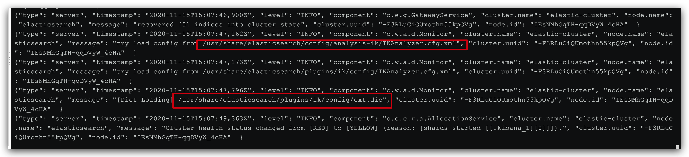
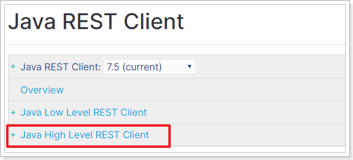

# ElasticSearch 基础

**学习目标**

- 理解什么是倒排索引
- 理解什么是ES搜索引擎
- 掌握ES搜索引擎的索引库操作
- 掌握ES搜索引擎的类型映射
- 掌握ES搜索引擎的文档操作

# 1 搜索技术

搜索技术在我们日常生活的方方面面都会用到，例如：

- 综合搜索网站：百度、谷歌等
- 电商网站：京东、淘宝的商品搜索
- 软件内数据搜索：我们用的开发工具，如Idea的搜索功能

这些搜索业务有一些可以使用数据库来完成，有一些却不行。因此我们今天会学习一种新的搜索方案，解决海量数据、复杂业务的搜索。

## 1.1 关系型数据库搜索

### 1.1.1 数据库查询流程

因为复杂搜索往往是模糊的查找，因此数据库索引基本都会实效，只能逐条数据判断。基本流程如下：

1）用户搜索数据，条件是title符合`"谷歌创始人跳槽"`

2）逐行获取数据，比如id为10的数据

3）判断数据中的title是否符合用户搜索条件

4）如果符合则放入结果集，不符合则丢弃。回到步骤1

如图：


如果有5条数据，则需要遍历并判断5次。如果有100万数据，则需要循环遍历和判断100万次。线性查找和判断，效率极差，一个10mb的硬盘文件，遍历一遍需要3秒。

### 1.1.2 关系型数据库搜索出现的问题

要实现类似百度的复杂搜索，或者京东的商品搜索，如果使用传统的数据库存储数据，那么会存在一系列的问题：

- 性能瓶颈：当数据量越来越大时，数据库搜索的性能会有明显下降。虽然可以通过分库分表来解决存储问题，但是性能问题并不能彻底解决，而且系统复杂度会提高、可用性下降。
- 复杂业务：百度或京东的搜索往往需要复杂的查询功能，例如：拼音搜索、错字的模糊搜索等。这些功能用数据库搜索难以实现，或者实现复杂度较高
- 并发能力：数据库是磁盘存储，虽然也有缓存方案，但是并不实用。因此数据库的读写并发能力较差，难以应对高并发场景

但是，并不是说数据库就一无是处。在一些对业务有强数据一致性需求，事物需求的情况下，数据库是不可替代的。

只是在海量数据的搜索方面，需要有新的技术来解决，就是我们今天要学习的**倒排索引**技术。


## 1.2 全文检索

全文检索：全部都检索，可以按照用户定义的查询规则任意查询，得到目标数据。

内部实现的原理：倒排索引是一种特殊的数据索引方式，虽然于数据库存储的数据结构没有太大差别，但是在检索方式上却大不一样。

### 1.2.1 倒排索引相关概念

- 文档（`Document`）：用来检索的海量数据，其中的每一条数据就是一个文档。例如一个网页、一个商品信息
- 词条（`Term`）：对文档数据或用户搜索数据，利用某种算法分词，得到的具备含义的词语就是词条。

例如，数据库中有下面的数据：

|  id  |                   title                    | url                          |
| :--: | :----------------------------------------: | ---------------------------- |
|  10  |          谷歌地图之父跳槽FaceBook          | http://www.itcast.cn/10.html |
|  20  |          谷歌地图之父加盟FaceBook          | http://www.itcast.cn/20.html |
|  30  |   谷歌地图创始人拉斯离开谷歌加盟Facebook   | http://www.itcast.cn/30.html |
|  40  | 谷歌地图之父跳槽Facebook与Wave项目取消有关 | http://www.itcast.cn/40.html |
|  50  |    谷歌地图之父拉斯加盟社交网站Facebook    | http://www.itcast.cn/50.html |

那么这里的每一行数据就是一条文档（elasticsearch会把文档转为JSON存储），如：

|  id  |          title           | url                          |
| :--: | :----------------------: | ---------------------------- |
|  10  | 谷歌地图之父跳槽FaceBook | http://www.itcast.cn/10.html |

把标题字段分词，可以得到词语如：`谷歌`就是一个词条

现在，假设用户要搜索`"谷歌创始人跳槽"`，来看看倒排索引的传统查找在检索时的区别

### 1.2.2 倒排索引原理

倒排索引的数据存储方式与数据库类似，但检索方式不同。

全文检索主要是通过倒排索引的方式实现，倒排索引主要是分成两大步骤完成：

1. 数据按照规则处理完成后存储到索引库
2. 用户输入关键词按照规则处理完成后在索引库中检索

#### 1.2.2.1 数据存储方式

先看看倒排索引如何处理数据。

**文档列表**：

首先，倒排索引需要把文档数据逐个编号（从0递增），存储到文档表中。并且给每一个编号创建索引，这样根据编号检索文档的速度会非常快。

 

**词条列表（Term Dictionary）：**

然后，对文档中的数据按照算法做分词，得到一个个的词条，记录词条和词条出现的文档的编号、位置、频率信息，如图：

 

然后给词条创建索引，这样根据词条匹配和检索的速度就非常快。


#### 1.2.2.2 检索数据过程

倒排索引的检索流程如下：

1）用户输入条件`"谷歌创始人跳槽"`进行搜索。

2）对用户输入内容**分词**，得到词条：`谷歌`、`创始人`、`跳槽`。

3）拿着词条到词条列表中查找，可以得到包含词条的文档编号：0、1、2、3、4。

4）拿着词条的编号到文档列表中查找具体文档。

如图：


虽然搜索会在两张表进行，但是每次都是根据索引查找，因此速度比传统搜索时的全表扫描速度要快的多。


## 1.3 全文检索技术

### 1.3.1 Lucene

在java语言中，对倒排索引的实现中最广为人知的就是Lucene了，目前主流的java搜索框架都是依赖Lucene来实现的。

- Lucene是一套用于全文检索和搜寻的开源程序库，由Apache软件基金会支持和提供
- Lucene提供了一个简单却强大的应用程序接口（API），能够做全文索引和搜寻，在Java开发环境里Lucene是一个成熟的免费开放源代码工具
- Lucene并不是现成的搜索引擎产品，但可以用来制作搜索引擎产品，比较知名的搜索产品有：Solr、ElasticSearch    
- 官网：http://lucene.apache.org

### 1.3.2 Solr

Solr是建立在Apache Lucene ™之上的流行，快速，开放源代码的企业搜索平台。

Solr具有高度的可靠性，可伸缩性和容错性，可提供分布式索引，复制和负载平衡查询，自动故障转移和恢复，集中式配置等。Solr为许多世界上最大的互联网站点提供搜索和导航功能。

官网：https://lucene.apache.org/solr/

### 1.3.3 ElasticSearch

Elastic官网：https://www.elastic.co/cn/

Elastic是一系列产品的集合，比较知名的是ELK技术栈，其核心就是ElasticSearch：

Elasticsearch官网：https://www.elastic.co/cn/products/elasticsearch

Elasticsearch历史版本：https://www.elastic.co/cn/downloads/past-releases


Elasticsearch是一个基于Lucene的搜索**web服务**，对外提供了一系列的Rest风格的API接口。因此任何语言的客户端都可以**通过发送Http请求来实现ElasticSearch的操作**。

**ES的主要优势特点如下：**

- **速度快**：Elasticsearch 很快，快到不可思议。我们通过有限状态转换器实现了用于全文检索的倒排索引，实现了用于存储数值数据和地理位置数据的 BKD 树，以及用于分析的列存储。而且由于每个数据都被编入了索引，因此您再也不用因为某些数据没有索引而烦心。您可以用快到令人惊叹的速度使用和访问您的所有数据。实现**近实时搜索**，海量数据更新在Elasticsearch中几乎是完全同步的。
- **扩展性高**：可以在笔记本电脑上运行，也可以在承载了 PB 级数据的成百上千台服务器上运行。原型环境和生产环境可无缝切换；无论 Elasticsearch 是在一个节点上运行，还是在一个包含 300 个节点的集群上运行，您都能够以相同的方式与 Elasticsearch 进行通信。它能够**水平扩展**，每秒钟可处理海量事件，同时能够自动管理索引和查询在集群中的分布方式，以实现极其流畅的操作。天生的分布式设计，很容易搭建大型的**分布式集群**（solr使用Zookeeper作为注册中心来实现分布式集群）
- **强大的查询和分析**：通过 Elasticsearch，您能够执行及合并多种类型的搜索（结构化数据、非结构化数据、地理位置、指标），搜索方式随心而变。先从一个简单的问题出发，试试看能够从中发现些什么。找到与查询最匹配的 10 个文档是一回事。但如果面对的是十亿行日志，又该如何解读呢？Elasticsearch 聚合让您能够从大处着眼，探索数据的趋势和模式。如全文检索，同义词处理，相关度排名，复杂数据分析。
- **操作简单**：客户端API支持Restful风格，简单容易上手。


**使用ES的案例场景：**

1、**GitHub**抛弃了Solr，采取ElasticSearch 来做PB级的搜索。 “GitHub使用ElasticSearch搜索20TB 的数据，包括13亿文件和1300亿行代码”

2、维基百科：启动以elasticsearch为基础的核心搜索架构

3、SoundCloud：“SoundCloud使用ElasticSearch为1.8亿用户提供即时而精准的音乐搜索服务”

4、百度：百度目前广泛使用ElasticSearch作为文本数据分析，采集百度所有服务器上的各类指标数据及用户自定义数据，通过对各种数据进行多维分析展示，辅助定位分析实例异常或业务层面异常。目前覆盖百度内部20多个业务线（包括casio、云分析、网盟、预测、文库、直达号、钱包、风控等），单集群最大100台机器，200个ES节点，每天导入30TB+数据。 新浪使用ES 分析处理32亿条实时日志。

5、阿里使用ES 构建自己的日志采集和分析体系 

6、京东到家订单中心 Elasticsearch 演进历程 

Elasticsearch 做为一款功能强大的分布式搜索引擎，支持近实时的存储、搜索数据，在京东到家订单系统中发挥着巨大作用，目前订单中心ES集群存储数据量达到10亿个文档，日均查询量达到5亿。

7、滴滴 2016 年初开始构建 Elasticsearch 平台，如今已经发展到超过 3500+ Elasticsearch 实例，超过 5PB 的数据存储，峰值写入 tps 超过了 2000w/s 的超大规模。

8、携程Elasticsearch应用案例

9、去哪儿：订单中心基于elasticsearch 的解决方案

### 1.3.4 小结

Solr和ElasticSearch如何选择？

企业生产中一般都会使用成熟的搜索产品，例如：Solr或者Elasticsearch，不过从性能来看Elasticsearch略胜一筹，因此我们今天的学习目标就是elasticsearch。

如果把Lucene比喻成一台发动机，那么Solr就是一台家用汽车，而Elasticsearch就是一台c超级跑车。


# 2 ElasticSearch及相关组件安装

本章是基于Docker安装

## 2.1 安装ElasticSearch

开机自启Docker：

```sh
systemctl enable docker
```


创建一个通用网络：

```sh
docker network create my-net
```

安装ES：

```sh
docker run -d \
	--name es \
    -e "ES_JAVA_OPTS=-Xms512m -Xmx512m" \
    -e "discovery.type=single-node" \
    -v es-data:/usr/share/elasticsearch/data \
    -v es-plugins:/usr/share/elasticsearch/plugins \
    --privileged \
    --network my-net \
    -p 9200:9200 \
    -p 9300:9300 \
elasticsearch:7.4.2
```

命令解释：

- `-e "cluster.name=es-docker-cluster"`：设置集群名称
- `-e "http.host=0.0.0.0"`：监听的地址，可以外网访问
- `-e "ES_JAVA_OPTS=-Xms512m -Xmx512m"`：内存大小
- `-e "discovery.type=single-node"`：非集群模式
- `-v es-data:/usr/share/elasticsearch/data`：挂载逻辑卷，绑定es的数据目录
- `-v es-logs:/usr/share/elasticsearch/logs`：挂载逻辑卷，绑定es的日志目录
- `-v es-plugins:/usr/share/elasticsearch/plugins`：挂载逻辑卷，绑定es的插件目录
- `--privileged`：授予逻辑卷访问权
- `--network my-net` ：加入一个名为my-net的网络中
- `-p 9200:9200`：端口映射配置

> restart相关参数如下：
>
> | 选项                     | 作用                                                         |
> | ------------------------ | ------------------------------------------------------------ |
> | --restart=no             | 不自动重启容器. (默认)                                       |
> | --restart=on-failure     | 容器发生error而退出(容器退出状态不为0)重启容器               |
> | on-failure:3             | 在容器非正常退出时重启容器，最多重启3次                      |
> | --restart=unless-stopped | 在容器退出时总是重启容器，但是不考虑在Docker守护进程启动时就已经停止了的容器 |
> | --restart=always         | 在容器已经stop掉或Docker stoped/restarted的时候才重启容器    |
>
> 如果已经启动的容器项目，则使用update更新：
>
> ```sh
> # 设置开机自启elasticsearch
> docker update --restart=always 容器名/ID
> ```
>
> 建议关闭防火墙，如果不想关闭，需要手动开启防火墙端口：
>
> ```sh
> # 开放端口 9200  9300 5601
> firewall-cmd --zone=public --add-port=9200/tcp --permanent
> # 重启防火墙
> firewall-cmd --reload
> # 查看放行端口
> firewall-cmd --list-ports
> ```


在浏览器中输入：http://192.168.150.101:9200 即可看到elasticsearch的响应结果：

 


## 2.2 Kibana

ES提供了多种访问方式，官方推荐使用REST API,也是使用人数最多的访问方式。就是通过http协议，使用Restful的风格，按照es的api去操作数据，访问时我们需要传递给es json 参数,es处理后会给我们返回 json 的结果,不过浏览器不方便操作es 官方推荐使用kibana来操作ES

### 2.2.1 Kibana简介


Kibana是一个基于Node.js的Elasticsearch索引库数据统计工具，可以利用Elasticsearch的聚合功能，生成各种图表，如柱形图，线状图，饼图等。

而且还提供了操作Elasticsearch索引数据的控制台，并且提供了一定的API提示，非常有利于我们学习Elasticsearch的语法。

### 2.2.2 安装Kibana

**1) Linux安装**

```sh
docker run -d \
--name kibana \
-e ELASTICSEARCH_HOSTS=http://es:9200 \
--network=my-net \
-p 5601:5601  \
kibana:7.4.2
```

- `--network my-net` ：加入一个名为my-net的网络中，与elasticsearch在同一个网络中
- `-e ELASTICSEARCH_HOSTS=http://es:9200"`：设置elasticsearch的地址，因为kibana已经与elasticsearch在一个网络，因此可以用容器名直接访问elasticsearch
- `-p 5601:5601`：端口映射配置

kibana启动一般比较慢，需要多等待一会，可以通过命令：

```sh
docker logs -f kibana
```

查看运行日志，当查看到下面的日志，说明成功：


此时，在浏览器输入地址访问：http://192.168.150.101:5601，即可看到结果


**2）Windows安装**

参考课前资料中的安装说明：《Windows安装ElasticSearch及相关组件.md》


安装所需要的内容都在同目录下的《安装包》文件夹中。


## 2.3 分词器

根据我们之前讲解的倒排索引原理，当我们向elasticsearch插入一条文档数据时，elasticsearch需要对数据分词，分词到底如何完成呢？

**ElasticSearch 内置分词器**

* **Standard** Analyzer - 默认分词器，按词切分，小写处理
* Simple Analyzer - 按照非字母切分(符号被过滤), 小写处理
* Stop Analyzer - 小写处理，停用词过滤(the,a,is)
* Whitespace Analyzer - 按照空格切分，不转小写
* Keyword Analyzer - 不分词，直接将输入当作输出
* Patter Analyzer - 正则表达式，默认\W+(非字符分割)
* Language - 提供了30多种常见语言的分词器

### 2.3.1 默认的分词器

kibana中可以测试分词器效果，我们来看看elasticsearch中的默认分词器。

在kibana的DevTools中输入一段命令：

```json
POST /_analyze
{
  "text": "黑马程序员学习Java太棒了!!!",
  "analyzer": "standard"
}
```

请求代表的含义：

- 请求方式：`POST`
- 请求路径：`_analyze`，前面省略了http://es:9200，这个由Kibana帮我们补充
- 请求参数：风格，包含两个属性：
  - `analyzer`：分词器名称，standard是默认的标准分词器
  - `text`：要分词的文本内容

效果：

效果：

```json
{
  "tokens" : [
    {
      "token" : "黑",
      "start_offset" : 0,
      "end_offset" : 1,
      "type" : "<IDEOGRAPHIC>",
      "position" : 0
    },
    {
      "token" : "马",
      "start_offset" : 1,
      "end_offset" : 2,
      "type" : "<IDEOGRAPHIC>",
      "position" : 1
    },
    {
      "token" : "程",
      "start_offset" : 2,
      "end_offset" : 3,
      "type" : "<IDEOGRAPHIC>",
      "position" : 2
    },
    {
      "token" : "序",
      "start_offset" : 3,
      "end_offset" : 4,
      "type" : "<IDEOGRAPHIC>",
      "position" : 3
    },
    {
      "token" : "员",
      "start_offset" : 4,
      "end_offset" : 5,
      "type" : "<IDEOGRAPHIC>",
      "position" : 4
    },
    {
      "token" : "学",
      "start_offset" : 5,
      "end_offset" : 6,
      "type" : "<IDEOGRAPHIC>",
      "position" : 5
    },
    {
      "token" : "习",
      "start_offset" : 6,
      "end_offset" : 7,
      "type" : "<IDEOGRAPHIC>",
      "position" : 6
    },
    {
      "token" : "java",
      "start_offset" : 7,
      "end_offset" : 11,
      "type" : "<ALPHANUM>",
      "position" : 7
    },
    {
      "token" : "太",
      "start_offset" : 11,
      "end_offset" : 12,
      "type" : "<IDEOGRAPHIC>",
      "position" : 8
    },
    {
      "token" : "棒",
      "start_offset" : 12,
      "end_offset" : 13,
      "type" : "<IDEOGRAPHIC>",
      "position" : 9
    },
    {
      "token" : "了",
      "start_offset" : 13,
      "end_offset" : 14,
      "type" : "<IDEOGRAPHIC>",
      "position" : 10
    }
  ]
}

```

一个字分成一个词，实在是太糟糕了。。

### 2.3.2 认识IK分词器

标准分词器并不能很好处理中文，一般我们会用第三方的分词器，例如：IK分词器。

IKAnalyzer是一个开源的，基于java语言开发的轻量级的中文分词工具包，是一个基于Maven构建的项目，具有60万字/秒的高速处理能力，支持用户词典扩展定义。

IK分词器的 地址：https://github.com/medcl/elasticsearch-analysis-ik， 安装非常简单。

IK分词器可以用`ik_max_word`和`ik_smart`两种方式，分词粒度不同。

### 2.3.3安装IK分词器

**1、安装ik插件（在线较慢）**

```shell
# 进入容器内部
docker exec -it elasticsearch /bin/bash

# 在线下载并安装
./bin/elasticsearch-plugin  install https://github.com/medcl/elasticsearch-analysis-ik/releases/download/v7.4.2/elasticsearch-analysis-ik-7.4.2.zip

#退出
exit
#重启容器
docker restart elasticsearch
```

**2、离线安装ik插件（推荐）**

1）查看数据卷目录

安装插件需要知道elasticsearch的plugins目录位置，而我们用了数据卷挂载，因此需要查看elasticsearch的数据卷目录，通过下面命令查看:

```sh
docker volume inspect es-plugins
```

显示结果：

```json
[
    {
        "CreatedAt": "2021-01-09T10:37:00+08:00",
        "Driver": "local",
        "Labels": null,
        "Mountpoint": "/var/lib/docker/volumes/es-plugins/_data",
        "Name": "es-plugins",
        "Options": null,
        "Scope": "local"
    }
]
```

说明plugins目录被挂载到了：`/var/lib/docker/volumes/es-plugins/_data `这个目录中。

2）解压缩分词器安装包

下面我们需要把课前资料中的ik分词器解压缩，重命名为ik


3）上传到插件目录中：


 4）重启容器

```shell
# 4、重启容器
docker restart es
```

```sh
# 查看es日志
docker logs -f es
```


测试：

```json
GET /_analyze
{
  "analyzer": "ik_max_word",
  "text": "黑马程序员学习java太棒了"
}
```

结果：

```json
{
  "tokens" : [
    {
      "token" : "黑马",
      "start_offset" : 0,
      "end_offset" : 2,
      "type" : "CN_WORD",
      "position" : 0
    },
    {
      "token" : "程序员",
      "start_offset" : 2,
      "end_offset" : 5,
      "type" : "CN_WORD",
      "position" : 1
    },
    {
      "token" : "程序",
      "start_offset" : 2,
      "end_offset" : 4,
      "type" : "CN_WORD",
      "position" : 2
    },
    {
      "token" : "员",
      "start_offset" : 4,
      "end_offset" : 5,
      "type" : "CN_CHAR",
      "position" : 3
    },
    {
      "token" : "学习",
      "start_offset" : 5,
      "end_offset" : 7,
      "type" : "CN_WORD",
      "position" : 4
    },
    {
      "token" : "java",
      "start_offset" : 7,
      "end_offset" : 11,
      "type" : "ENGLISH",
      "position" : 5
    },
    {
      "token" : "太棒了",
      "start_offset" : 11,
      "end_offset" : 14,
      "type" : "CN_WORD",
      "position" : 6
    },
    {
      "token" : "太棒",
      "start_offset" : 11,
      "end_offset" : 13,
      "type" : "CN_WORD",
      "position" : 7
    },
    {
      "token" : "了",
      "start_offset" : 13,
      "end_offset" : 14,
      "type" : "CN_CHAR",
      "position" : 8
    }
  ]
}
```

**小结：**

* `ik_smart`：最小切分

* `ik_max_word`：最细切分

### 2.3.4 扩展词词典

随着互联网的发展，“造词运动”也越发的频繁。出现了很多新的词语，在原有的词汇列表中并不存在。比如：“奥力给”，“传智播客” 等。

所以我们的词汇也需要不断的更新，IK分词器提供了扩展词汇的功能。

1）打开IK分词器config目录：


2）IKAnalyzer.cfg.xml配置文件内容添加：

```xml
<?xml version="1.0" encoding="UTF-8"?>
<!DOCTYPE properties SYSTEM "http://java.sun.com/dtd/properties.dtd">
<properties>
        <comment>IK Analyzer 扩展配置</comment>
        <!--用户可以在这里配置自己的扩展字典 *** 添加扩展词典-->
        <entry key="ext_dict">ext.dic</entry>
         <!--用户可以在这里配置自己的扩展停止词字典-->
        <entry key="ext_stopwords"></entry>
        <!--用户可以在这里配置远程扩展字典 -->
        <!-- <entry key="remote_ext_dict">words_location</entry> -->
        <!--用户可以在这里配置远程扩展停止词字典-->
        <!-- <entry key="remote_ext_stopwords">words_location</entry> -->
</properties>
```

3）新建一个 ext.dic，可以参考config目录下复制一个配置文件进行修改

```properties
传智播客
奥力给
```

4）重启elasticsearch 

```sh
docker restart es

# 查看 日志
docker logs -f elasticsearch
```



日志中已经成功加载ext.dic配置文件

5）测试效果：

```json
GET /_analyze
{
  "analyzer": "ik_max_word",
  "text": "传智播客Java就业超过90%,奥力给！"
}
```

> 注意当前文件的编码必须是 UTF-8 格式，严禁使用Windows记事本编辑

### 2.3.5 停用词词典

在互联网项目中，在网络间传输的速度很快，所以很多语言是不允许在网络上传递的，如：关于宗教、政治等敏感词语，那么我们在搜索时也应该忽略当前词汇。

IK分词器也提供了强大的停用词功能，让我们在索引时就直接忽略当前的停用词汇表中的内容。

1）IKAnalyzer.cfg.xml配置文件内容添加：

```xml
<?xml version="1.0" encoding="UTF-8"?>
<!DOCTYPE properties SYSTEM "http://java.sun.com/dtd/properties.dtd">
<properties>
        <comment>IK Analyzer 扩展配置</comment>
        <!--用户可以在这里配置自己的扩展字典-->
        <entry key="ext_dict">ext.dic</entry>
         <!--用户可以在这里配置自己的扩展停止词字典  *** 添加停用词词典-->
        <entry key="ext_stopwords">stopword.dic</entry>
        <!--用户可以在这里配置远程扩展字典  -->
        <!-- <entry key="remote_ext_dict">words_location</entry> -->
        <!--用户可以在这里配置远程扩展停止词字典-->
        <!-- <entry key="remote_ext_stopwords">words_location</entry> -->
</properties>
```

3）在 stopword.dic 添加停用词

```properties
特朗普选举
```

4）重启elasticsearch 

```sh
docker restart elasticsearch
docker restart kibana

# 查看 日志
docker logs -f elasticsearch
```

日志中已经成功加载stopword.dic配置文件

5）测试效果：

```json
GET /_analyze
{
  "analyzer": "ik_max_word",
  "text": "特朗普选举失败"
}
```

> 注意当前文件的编码必须是 UTF-8 格式，严禁使用Windows记事本编辑


# 3 Elasticsearch对比MySQL

## 3.1 核心概念

Elasticsearch虽然是一种NoSql库，但最终的目的是存储数据、检索数据。因此很多概念与MySQL类似的。

| ES中的概念       | 数据库概念         | 说明                                                         |
| ---------------- | ------------------ | ------------------------------------------------------------ |
| 索引库（indices) | 数据库（Database） | ES中可以有多个索引库，就像Mysql中有多个Database一样。        |
| 类型（Type）     | 表（table）        | mysql中database可以有多个table，table用来约束数据结构。而ES中的每个索引库中只有一个`类型`，`类型`中用来约束字段属性的叫做映射(`mapping`)，7.X之后将会被取消，取默认值：`_doc` |
| 映射（mappings） | 表的字段约束       | mysql表对字段有约束，ES中叫做映射，用来约束字段属性，包括：字段名称、数据类型等信息 |
| 文档（document） | 行（Row）          | 存入索引库原始的数据，比如每一条商品信息，就是一个文档，是以JSON格式存储。对应mysql中的每行数据 |
| 字段（field）    | 列（Column）       | 文档中的属性，一个文档可以有多个属性。就像mysql中一行数据可以有多个列。 |

因此，我们对ES的操作，就是对索引库、类型映射、文档数据的操作：

- 索引库操作：主要包含创建索引库、查询索引库、删除索引库等
- 类型映射操作：主要是创建类型映射、查看类型映射
- 文档操作：文档的新增、修改、删除、查询

## 3.2 Rest的API介绍

操作MySQL，主要是database操作、表操作、数据操作，对应在elasticsearch中，分别是对索引库操作、类型映射操作、文档数据的操作：

- 索引库操作：主要包含创建索引库、查询索引库、删除索引库等
- 类型映射操作：主要是创建类型映射、查看类型映射
- 文档操作：文档的新增、修改、删除、查询

而ES中完成上述操作都可以通过Rest风格的API来完成，符合请求要求的Http请求就可以完成数据的操作。

详见官方文档：https://www.elastic.co/guide/en/elasticsearch/reference/current/index.html


# 4 Elasticsearch的索引库操作

按照Rest风格，增删改查分别使用：POST、DELETE、PUT、GET等请求方式，路径一般是资源名称。因此索引库操作的语法类似。

## 4.1 创建索引库

创建索引库的请求格式：

- 请求方式：PUT

- 请求路径：/索引库名

- 请求参数：

  ```json
  {
      "settings": {
          "属性名": "属性值"
      }
  }
  ```

  settings：就是索引库设置，其中可以定义索引库的各种属性，目前我们可以不设置，都走默认。

示例：

```json
put /索引库名
{
    "settings": {
        "属性名": "属性值"
     },
    "mappings":{
        ...
    }
}
```


在Kibana中测试一下：

 

这里我们没有写settings属性，索引库配置都走默认。

## 4.2 查询索引库

- 请求方式：GET

- 请求路径：/索引库名

- 请求参数：无

格式：

```
GET /索引库名
```

在Kibana中测试一下：


可以看到返回的信息也是JSON格式，其中包含这么几个属性：

- mappings：类型映射，目前我们没有给索引库设置映射
- settings：索引库配置，目前是默认配置

## 4.3 删除索引库

- 请求方式：DELETE

- 请求路径：/索引库名

- 请求参数：无

格式：

```
DELETE /索引库名
```

在Kibana中测试一下：

 


## 4.4 小结

索引库操作：

- 创建索引库： `PUT /库名称`
- 查询索引库： `GET /索引库名称`
- 删除索引库： `DELETE /索引库名称`


# 5 mapping映射

MySQL中有表，并且表中有对字段的约束，对应到elasticsearch中就是类型映射`mapping`.

## 5.1 映射属性

索引库数据类型是松散的，不过也需要我们指定具体的字段及字段约束信息。而约束字段信息的就叫做映射（`mapping`）。

映射属性包括很多：

 

参考官网：https://www.elastic.co/guide/en/elasticsearch/reference/7.x/mapping-params.html

elasticsearch字段的映射属性该怎么选，除了字段名称外，我们一般要考虑这样几个问题：

- 1）数据的类型是什么？
  - 这个比较简单，根据字段的含义即可知道，可以通过`type`属性来指定
  
- 2）数据是否参与搜索？
  - 参与搜索的字段将来需要创建倒排索引，作为搜索字段。可以通过`index`属性来指定是否参与搜索，默认为true，也就是每个字段都参与搜索
  
- 3）数据是否需要分词？
  - 一个字段的内容如果不是一个不可分割的整体，例如国家，一般都需要分词存储。
    
    - 如果是身份证号则不需要分词
    
    - **如果分词的话用什么分词器？**
    - 分词器类型很多，中文一般选择IK分词器
      
    - 指定分词器类型可以通过`analyzer`属性指定
      
  
- 4）数据是否存储到es库中，默认一切字段都存储
  - 是否存储取决于用户是否需要将当前字段展示给用户查看


## 5.2 数据类型

elasticsearch提供了非常丰富的数据类型：


比较常见的有：

- string类型，又分两种：
  - **text：可分词**，存储到elasticsearch时会根据分词器分成多个词条
  - **keyword：不可分词**，数据会完整的作为一个词条
- Numerical：数值类型，分两类

  - 基本数据类型：long、interger、short、byte、double、float、half_float
  - 浮点数的高精度类型：scaled_float
    - 需要指定一个精度因子，比如10或100。elasticsearch会把真实值乘以这个因子后存储，取出时再还原。
- Date：日期类型

- Object：对象，对象不便于搜索。因此ES会把对象数据扁平化处理再存储。


比如，我们有这样一个文档数据需要存入ES中：

```json
{
    "title":"Apple Iphone11 Pro",
    "price": [7999.00, 8999.00],
    "images": "http://www.img.com/1.jpg,http://www.img.com/2.jpg,",
    "make":{
        "name": "富士康",
        "year": 2019
    }
}
```

我们分析下每个字段的数据类型：

- title：string类型，将来一定参与搜索，并且内容较多，需要分词，应该使用`text`类型
- price：浮点数。这里可以选择double或float
- images：string类型，不参与搜索，并且不需要分词。因此应该选择keyword类型。
- make：Object类型，需要做扁平化处理，变成两个字段：
  - make.name：string类型，不需要分词，选择keyword类型。
  - make.year：整数类型，可以选择int。

上面的数据存入ES以后，会变成下面这样：

```json
{
    "title":"Apple Iphone11 Pro", # text类型
    "price": [7999.00, 8999.00], # double类型
    "images": "http://www.img.com/1.jpg,http://www.img.com/2.jpg,",# keyword
    "make.name": "富士", # keyword 类型
    "make.year": 2019 # int 类型
}
```


## 5.3 创建类型映射

我们可以给一个已经存在的索引库添加映射关系，也可以创建索引库的同时直接指定映射关系。

### 5.3.1 索引库已存在

我们假设已经存在一个索引库，此时要给索引库添加映射。

* **语法**

请求方式依然是PUT

```json
PUT /索引库名/_mapping
{
  "properties": {
    "字段名1": {
      "type": "类型", # 数据类型
      "index": true, # 是否参与搜索
      "analyzer": "分词器", # 数据使用的分词器的类型
      "store": true # 是否存储
    },
    "字段名2": {
      "type": "类型",
      "index": true，
      "analyzer": "分词器"
    },
    ...
  }
}
```

- 类型名称：就是前面将的type的概念，类似于数据库中的表
  字段名：任意填写，下面指定许多属性，例如：
  - type：类型，可以是text、long、short、date、integer、object等
  - index：是否参与搜索，默认为true
  - analyzer：分词器

* **示例**

发起请求：

```json
PUT /heima/_mapping
{
  "properties": {
    "title": {
      "type": "text",
      "analyzer": "ik_max_word"
    },
    "images": {
      "type": "keyword",
      "index": "false"
    },
    "price": {
      "type": "float"
    },
    "des":{
      "type":"text",
      "index":"true",
      "analyzer":"ik_max_word",
      "store":"false"
    }
  }
}
```

**响应结果：**

```json
{
  "acknowledged": true
}
```

上述案例中，就给heima这个索引库中设置了3个字段：

- title：商品标题 
  - index：标题一般都参与搜索，所以index没有配置，按照默认为true
  - type: 标题是字符串类型，并且参与搜索和分词，所以用text
  - analyzer：标题内容一般较多，查询时需要分词，所以指定了IK分词器
- images：商品图片
  - type：图片是字符串，并且url不需要分词，所以用keyword
  - index：图片url不参与搜索，所以给false
- price：商品价格
  - type：价格，浮点型，这里给了float
  - index：这里没有配置，默认是true，代表参与搜索

并且给这些字段设置了一些属性


### 5.3.2 索引库不存在

如果一个索引库是不存在的，我们就不能用上面的语法，而是这样：

```json
PUT /索引库名
{
	"mappings":{
      "properties": {
        "字段名1": {
          "type": "类型",
          "index": true，
          "analyzer": "分词器"
        },
        "字段名2": {
          "type": "类型",
          "index": true，
          "analyzer": "分词器"
        },
        ...
      }
    }
}
```

* **示例：**

```json
# 创建索引库和映射
PUT /heima2
{
  "mappings": {
    "properties": {
      "title": {
        "type": "text",
        "analyzer": "ik_max_word"
      },
      "images": {
        "type": "keyword",
        "index": "false"
      },
      "price": {
        "type": "float"
      }
    }
  }
}
```

* **结果：**

```json
{
  "acknowledged" : true,
  "shards_acknowledged" : true,
  "index" : "heima2"
}
```

## 5.4 查看映射关系

查看使用Get请求

* **语法：**

```
GET /索引库名/_mapping
```

* **示例：**

```
GET /heima/_mapping
```

* **响应：**

```json
{
  "heima" : {
    "mappings" : {
      "properties" : {
        "images" : {
          "type" : "keyword",
          "index" : false
        },
        "price" : {
          "type" : "float"
        },
        "title" : {
          "type" : "text",
          "analyzer" : "ik_max_word"
        }
      }
    }
  }
}

```


# 6 Document文档的操作

我们把数据库中的每一行数据查询出来，存入索引库，就是文档。文档的主要操作包括新增、查询、修改、删除。

## 6.1 新增文档

### 6.1.1 新增并随机生成id

通过POST请求，可以向一个已经存在的索引库中添加文档数据。ES中，文档都是以JSON格式提交的。

* **语法：**

```json
POST /{索引库名}/_doc
{
    "key":"value"
}
```

* **示例：**

```json
# 新增文档数据
POST /heima/_doc
{
    "title":"小米手机",
    "images":"http://image.leyou.com/12479122.jpg",
    "price":2699.00
}
```

* **响应：**

```json
{
  "_index" : "heima",
  "_type" : "_doc",
  "_id" : "rGFGbm8BR8Fh6kyTbuq8",
  "_version" : 1,
  "result" : "created",
  "_shards" : {
    "total" : 2,
    "successful" : 1,
    "failed" : 0
  },
  "_seq_no" : 0,
  "_primary_term" : 1
}
```

结果解释：

- `_index`：新增到了哪一个索引库。
- `_id`：这条文档数据的`唯一标示`，文档的**增删改查**都依赖这个id作为唯一标示。此处是由ES随即生成的，我们也可以指定使用某个ID
- `result`：执行结果，可以看到结果显示为：`created`，说明文档创建成功。


### 6.1.2 新增并指定id

通过POST请求，可以向一个已经存在的索引库中添加文档数据。ES中，文档都是以JSON格式提交的。

* **语法：**

```json
POST /{索引库名}/_doc/{id}
{
    "key":"value"
}
```

* **示例：**

```json
# 新增文档数据并指定id
POST /heima/_doc/1
{
    "title":"小米手机",
    "images":"http://image.leyou.com/12479122.jpg",
    "price":2699.00
}
```

* **响应：**

```json
{
  "_index" : "heima",
  "_type" : "_doc",
  "_id" : "1",
  "_version" : 1,
  "result" : "created",
  "_shards" : {
    "total" : 2,
    "successful" : 1,
    "failed" : 0
  },
  "_seq_no" : 1,
  "_primary_term" : 1
}
```


## 6.2 查询文档

### 6.2.1 根据ID查询

根据rest风格，新增是post，查询应该是get，不过查询一般都需要条件，这里我们把刚刚生成数据的id带上。

**语法：**

```json
GET /{索引库名称}/_doc/{id}
```

**通过kibana查看数据：**

```js
GET /heima/_doc/rGFGbm8BR8Fh6kyTbuq8
```

**查看结果：**

```json
{
  "_index": "heima",  # 索引库
  "_type": "_doc",  
  "_id": "rGFGbm8BR8Fh6kyTbuq8", # id
  "_version": 1,
  "found": true,
  "_source": {  # 查询数据存放在 _source 中
    "title": "小米手机",
    "images": "http://image.leyou.com/12479122.jpg",
    "price": 2699
  }
}
```

- `_source`：源文档信息，所有的数据都在里面。

### 6.2.2 查询所有文档

**语法：**

```json
# 查询所有
GET /heima/_search
{
  "query": {
    "match_all": {}
  }
}
```


## 6.3 修改文档

把刚才新增的请求方式改为PUT，就是修改了。不过修改必须指定id，

- id对应文档存在，则修改
- id对应文档不存在，则新增

比如，我们把使用id为2，不存在，则应该是新增：

```json
# 新增
PUT /heima/_doc/2
{
    "title":"大米手机",
    "images":"http://image.leyou.com/12479122.jpg",
    "price":2899.00
}
```

结果：

```json
{
  "_index" : "heima",
  "_type" : "_doc",
  "_id" : "2",
  "_version" : 1,
  "result" : "created",
  "_shards" : {
    "total" : 2,
    "successful" : 1,
    "failed" : 0
  },
  "_seq_no" : 2,
  "_primary_term" : 1
}
```

可以看到是`created`，是新增。

我们再次执行刚才的请求，不过把数据改一下：

```json
# 修改
PUT /heima/_doc/2
{
    "title":"大米手机Pro",
    "images":"http://image.leyou.com/12479122.jpg",
    "price":3099.00
}
```

查看结果：

```json
{
  "_index" : "heima",
  "_type" : "_doc",
  "_id" : "2",
  "_version" : 2,
  "result" : "updated", # updated
  "_shards" : {
    "total" : 2,
    "successful" : 1,
    "failed" : 0
  },
  "_seq_no" : 3,
  "_primary_term" : 1
}
```

可以看到结果是：`updated`，显然是更新数据

说明: 

es对API的要求并没有那么严格

如: 

- POST 新增文档时：如果指定了id，并且id在索引库不存在，直接存入索引库；如果id已经存在，则执行修改

- **PUT修改文档时：先根据id删除指定文档，然后加入新的文档**
- PUT修改文档时:  如果对应的文档不存在时，会添加该文档

## 6.4 删除文档

删除使用DELETE请求，同样，需要根据id进行删除：

* **语法：**

```js
DELETE /索引库名/类型名/id值
```

* **示例：**

```json
# 根据id删除数据
DELETE /heima/_doc/rGFGbm8BR8Fh6kyTbuq8
```

* **结果：**

```json
{
  "_index" : "heima",
  "_type" : "_doc",
  "_id" : "rGFGbm8BR8Fh6kyTbuq8",
  "_version" : 2,
  "result" : "deleted",
  "_shards" : {
    "total" : 2,
    "successful" : 1,
    "failed" : 0
  },
  "_seq_no" : 4,
  "_primary_term" : 1
}
```

可以看到结果result为：deleted，说明删除成功了。

## 6.5 默认映射

刚刚我们在新增数据时，添加的字段都是提前在类型中通过mapping定义过的，如果我们添加的字段并没有提前定义过，能够成功吗？

事实上Elasticsearch有一套默认映射规则，如果新增的字段从未定义过，那么就会按照默认映射规则来存储。

测试一下：

```json
# 新增未映射字段
POST /heima/_doc/3
{
    "title":"超大米手机",
    "images":"http://image.leyou.com/12479122.jpg",
    "price":3299.00,
    "stock": 200,
    "saleable":true,
    "subTitle":"超级双摄,亿级像素"
}
```

我们额外添加了stock库存，saleable是否上架，subtitle副标题、3个字段。

来看结果：

```json
{
  "_index" : "heima",
  "_type" : "_doc",
  "_id" : "3",
  "_version" : 1,
  "result" : "created",  # created
  "_shards" : {
    "total" : 2,
    "successful" : 1,
    "failed" : 0
  },
  "_seq_no" : 5,
  "_primary_term" : 1
}
```

成功了！在看下索引库的映射关系:

```json
{
  "heima" : {
    "mappings" : {
      "properties" : {
        "images" : {
          "type" : "keyword",
          "index" : false
        },
        "price" : {
          "type" : "float"
        },
        "saleable" : {
          "type" : "boolean"
        },
        "stock" : {
          "type" : "long"
        },
        "subTitle" : {
          "type" : "text",
          "fields" : {
            "keyword" : {
              "type" : "keyword",
              "ignore_above" : 256
            }
          }
        },
        "title" : {
          "type" : "text",
          "analyzer" : "ik_max_word"
        }
      }
    }
  }
}
```

stock、saleable、subtitle都被成功映射了:

- stock：默认映射为long类型
- saleable：映射为布尔类型
- subtitle是String类型数据，ES无法确定该用text还是keyword，它就会存入两个字段。例如：
  - subtitle：text类型，分词
  - subtitle.keyword：keyword类型，不分词

如图：

 


## 6.6.模板映射

基本语法：


凡是符合`2`中定义的条件的字段，都会按照`3`中定义的规范来映射。

例如：

```json
PUT my_index
{
  "mappings": {
    "dynamic_templates": [
      {
        "string_template": {
          "match_mapping_type": "string", # 匹配的规则
          "mapping": {
            "type": "keyword" # 映射的规范
          }
        }
      }
    ]
  }
}
```

这个模板的含义就是：凡是字符串类型，都按照keyword类映射。


es在新增一个文档时，做字段映射的优先级从高到底分别是：

用户自定义映射 > 动态模板映射 > 系统默认映射


# 7 Java API 操作ElasticSearch

在elasticsearch官网中提供了各种语言的客户端：https://www.elastic.co/guide/en/elasticsearch/client/index.html

而Java的客户端就有两个：

 

不过Java API这个客户端（Transport Client）已经在7.0以后过期了，而且在8.0版本中将直接废弃。所以我们会学习Java REST Client：

 

然后再选择[High Level REST Client](https://www.elastic.co/guide/en/elasticsearch/client/java-rest/7.x/java-rest-high.html)这个。

Java  REST Client 其实就是利用Java语言向 ES服务发 Http的请求，因此请求和操作与前面学习的REST API 一模一样。

## 7.1 工程搭建及初始化

### 7.1.1 创建工程引入依赖

新建基于Maven的Java项目，相关信息如下：

**pom.xml：**

```xml
<properties>
  <project.build.sourceEncoding>UTF-8</project.build.sourceEncoding>
  <project.reporting.outputEncoding>UTF-8</project.reporting.outputEncoding>
  <java.version>1.8</java.version>
</properties>

<dependencies>
  <!--elastic客户端-->
  <dependency>
    <groupId>org.elasticsearch.client</groupId>
    <artifactId>elasticsearch-rest-high-level-client</artifactId>
    <version>7.4.2</version>
  </dependency>
  <!-- Junit单元测试 -->
  <dependency>
    <groupId>junit</groupId>
    <artifactId>junit</artifactId>
    <version>4.12</version>
  </dependency>
  <!--lombok  @Data -->
  <dependency>
    <groupId>org.projectlombok</groupId>
    <artifactId>lombok</artifactId>
    <version>1.18.8</version>
  </dependency>
  <!--JSON工具 -->
  <dependency>
    <groupId>com.alibaba</groupId>
    <artifactId>fastjson</artifactId>
    <version>1.2.49</version>
  </dependency>
  <!--common工具-->
  <dependency>
    <groupId>org.apache.commons</groupId>
    <artifactId>commons-lang3</artifactId>
    <version>3.8.1</version>
  </dependency>
</dependencies>
 <build>
        <plugins>
            <plugin>
                <groupId>org.apache.maven.plugins</groupId>
                <artifactId>maven-compiler-plugin</artifactId>
                <version>3.2</version>
                <configuration>
                    <source>1.8</source>
                    <target>1.8</target>
                    <encoding>UTF-8</encoding>
                </configuration>
            </plugin>
        </plugins>
    </build>
```

实体类：

com.itheima.esdemo.pojo.User

```java
package com.itheima.sh.esdemo.pojo;

import lombok.AllArgsConstructor;
import lombok.Data;

/**
 * @Description:
 * @Version: V1.0
 */
@Data
@AllArgsConstructor
public class User {
    private Long id;
    private String name;// 姓名
    private Integer age;// 年龄
    private String gender;// 性别
    private String note;// 备注
}
```

**扩展：**

使用Lombok需要两个条件：

1）引入依赖：

```xml
<!--lombok-->
<dependency>
  <groupId>org.projectlombok</groupId>
  <artifactId>lombok</artifactId>
  <version>1.18.8</version>
</dependency>
```

2）编辑器idea安装插件：

在线装，参考：https://plugins.jetbrains.com/plugin/6317-lombok


### 7.1.2 初始化连接ES

在官网上可以看到连接ES的教程：https://www.elastic.co/guide/en/elasticsearch/client/java-rest/current/java-rest-high-getting-started-initialization.html

首先需要与ES建立连接，ES提供了一个客户端RestHighLevelClient。

代码如下：

```java
RestHighLevelClient client = new RestHighLevelClient(
        RestClient.builder(
                new HttpHost("localhost", 9200, "http"),
                new HttpHost("localhost", 9201, "http")));
```

ES中的所有操作都是通过RestHighLevelClient来完成的：

 

为了后面测试方便，我们写到一个单元测试中，并且通过`@Before`注解来初始化客户端连接。

com.itheima.sh.esdemo.ElasticSearchTest

```java
package com.itheima.sh.esdemo;

import org.apache.http.HttpHost;
import org.elasticsearch.client.RestClient;
import org.elasticsearch.client.RestHighLevelClient;
import org.junit.After;
import org.junit.Before;

import java.io.IOException;
//ES测试类
public class ElasticSearchTest {
    //客户端对象
    private RestHighLevelClient client;
    /**
     * 建立连接
     */
    @Before
    public void init() throws IOException {
        //创建Rest客户端
        client = new RestHighLevelClient(
                RestClient.builder(
                        //如果是集群，则设置多个主机，注意端口是http协议的端口
                        new HttpHost("192.168.150.105", 9200, "http")
//                        ,new HttpHost("localhost", 9201, "http")
//                        ,new HttpHost("localhost", 9202, "http")
                )
        );
    }
  
    /**
     * 创建索引库-测试
     * @throws Exception
     */
    @Test
    public void testCreateIndex() throws Exception{
        System.out.println(client);
        // org.elasticsearch.client.RestHighLevelClient@6c61a903
    }


    /**
     * 关闭客户端连接
     */
    @After
    public void close() throws IOException {
        client.close();
    }
}

```

## 7.2 创建索引库及映射

开发中，往往库和映射的操作一起完成，官网详细文档地址：https://www.elastic.co/guide/en/elasticsearch/client/java-rest/7.x/_index_apis.html

这里我们主要实现库和映射的创建。查询、删除等功能大家可参考文档自己实现。


### 7.2.1 思路分析

先回顾下我们在kibana中的Rest风格的API：

```json
PUT /heima
{
  "mappings": {
    # ...
  }
}
```

本质是发送一个`PUT`的Http请求，到：http://192.168.150.101:9200/heima这个地址，并且传递json的参数格式：

```json
{
  "mappings": {
    # ...
  }
}
```


而Java的API，其实就是利用java代码，完成上述步骤，因此思路如下：

1. 创建CreateIndexRequest对象，并指定索引库名称，等于 `PUT /heima`
2. 指定请求体，也就是json参数，json参数来指定映射关系
4. 发起请求，得到响应


### 7.2.2 设计映射规则

Java代码中设置mapping，依然与REST中一致，需要JSON风格的映射规则。因此我们先在kibana中给User实体类定义好映射规则。

**谨记三个是否原则**

User包括下面的字段：

- Id：主键，在ES中是唯一标示
  - type：long
- name：姓名
  - type：keyword
  - 是否分词：**不分词**
  - 是否索引：需要在姓名查询，则**需要索引**
  - 是否存储：存储
- age：年龄
  - type：integer
  - 是否分词：不分词
  - 是否索引：索引
  - 是否存储：存储
- gender：性别
  - type：keyword
  - 是否分词：不分词
  - 是否索引：索引
  - 是否存储：存储
- note：备注，用户详细信息
  - type：text
  - 是否分词：分词，`使用ik_max_word`
  - 是否索引：索引
  - 是否存储：存储

映射如下：

```json
PUT /user
{
  "mappings": {
    "properties": {
      "id": {
        "type": "long"
      },
      "name":{
        "type": "keyword"
      },
      "age":{
        "type": "integer"
      },
      "gender":{
        "type": "keyword"
      },
      "note":{
        "type": "text",
        "analyzer": "ik_max_word"
      }
    }
  }
}
```

### 7.2.3 代码实现

我们在上面新建的ElasticDemo类中新建单元测试，完成代码，思路就是之前分析的4步骤：

1. 创建CreateIndexRequest对象，并指定索引库名称
2. 指定请求体，json格式的参数
4. 发起请求，得到响应

```java
package com.heima.es.test;

import com.alibaba.fastjson.JSON;
import com.heima.es.entity.User;
import org.apache.http.HttpHost;
import org.elasticsearch.action.admin.indices.delete.DeleteIndexRequest;
import org.elasticsearch.action.bulk.BulkRequest;
import org.elasticsearch.action.bulk.BulkResponse;
import org.elasticsearch.action.delete.DeleteRequest;
import org.elasticsearch.action.delete.DeleteResponse;
import org.elasticsearch.action.get.GetRequest;
import org.elasticsearch.action.get.GetResponse;
import org.elasticsearch.action.index.IndexRequest;
import org.elasticsearch.action.index.IndexResponse;
import org.elasticsearch.client.RequestOptions;
import org.elasticsearch.client.RestClient;
import org.elasticsearch.client.RestHighLevelClient;
import org.elasticsearch.client.indices.CreateIndexRequest;
import org.elasticsearch.common.xcontent.XContentType;
import org.junit.After;
import org.junit.Before;
import org.junit.Test;

import java.io.IOException;
import java.util.Arrays;
import java.util.List;

/**
 * @author 虎哥
 */
public class ElasticBasicTest {

    private RestHighLevelClient client;
	private RestHighLevelClient client;
    // 准备JSON风格参数，mappings映射
    public static final String SOURCE_TEMPLATE =
            "{\n" +
                    "  \"mappings\": {\n" +
                    "    \"properties\": {\n" +
                    "      \"id\": {\n" +
                    "        \"type\": \"long\"\n" +
                    "      },\n" +
                    "      \"name\":{\n" +
                    "        \"type\": \"keyword\"\n" +
                    "      },\n" +
                    "      \"age\":{\n" +
                    "        \"type\": \"integer\"\n" +
                    "      },\n" +
                    "      \"gender\":{\n" +
                    "        \"type\": \"keyword\"\n" +
                    "      },\n" +
                    "      \"note\":{\n" +
                    "        \"type\": \"text\",\n" +
                    "        \"analyzer\": \"ik_max_word\"\n" +
                    "      }\n" +
                    "    }\n" +
                    "  }\n" +
                    "}";


    @Test
    public void createIndexAndMapping() throws IOException {
        // 1.准备request对象
        CreateIndexRequest request = new CreateIndexRequest("user");
        // 2.给request对象设置json参数（按照kibana的restAPI）
        request.source(SOURCE_TEMPLATE, XContentType.JSON);
        // 3.发送请求
        client.indices().create(request, RequestOptions.DEFAULT);
    }

    @Before
    public void setUp() throws Exception {
        client = new RestHighLevelClient(
                RestClient.builder(
                        new HttpHost("192.168.150.105", 9200, "http")
                )
        );
    }
    @After
    public void tearDown() throws Exception {
        client.close();
    }
}

```


## 7.3.索引库的删除和查询

基本代码：

```java
@Test
public void testGetIndex() throws IOException {
    // 1.创建一个request对象, 等同于 GET /user
    GetIndexRequest request = new GetIndexRequest("user");
    // 3.发出请求
    GetIndexResponse response = client.indices().get(request, RequestOptions.DEFAULT);
    // 4.解析响应
    System.out.println("response = " + response);
}

@Test
public void testDeleteIndex() throws IOException {
    // 1.创建一个request对象, 等同于 DELETE /user
    DeleteIndexRequest request = new DeleteIndexRequest("user");
    // 3.发出请求
    AcknowledgedResponse response = client.indices().delete(request, RequestOptions.DEFAULT);
    // 4.解析响应
    System.out.println("response = " + response);
}
```


## 7.3 文档操作

### 7.3.1 新增&修改文档

文档操作包括：新增文档、查询文档、修改文档、删除文档等。

CRUD官网地址：https://www.elastic.co/guide/en/elasticsearch/client/java-rest/7.x/java-rest-high-supported-apis.html

新增的官网地址：https://www.elastic.co/guide/en/elasticsearch/client/java-rest/7.x/java-rest-high-document-index.html

#### 7.3.1.1 思路分析

来看看Kibana的Rest风格API：

```json
POST /user/_doc/1
{
  "id": 1,
  "name": "Jack",
  "age": 21,
  "gender": "男",
  "note": "Jack is handsome"
}
```

本质是发送了一个http请求：

- 方式：POST

- 路径：`http://ip:9200/user/_doc/1`

- 参数：json风格的user数据：

  ```json
  {
      "id" : 110,
      "name" : "张三",
      "age" : 22,
      "gender" : "0",
      "note" : "上海市浦东新区航头镇黑马程序员"
  }
  ```

因此，Java的实现步骤也是发送http请求，步骤如下：

首先：准备文档数据，就是User对象

2. 创建IndexRequest对象，并指定索引库名称，等于：`POST /user/_doc/{id}`
2. 指定请求参数
   1. 指定id：等于`POST /user/_doc/1`
   2. 指定用户json，需要把User对象序列化为json
3. 发起请求，得到结果

#### 7.3.1.2 代码实现

新增文档：

```java
@Test
public void testAddDocument() throws Exception{
    // 准备数据
    User user = new User(110L, "张三", 22, "0", "上海市浦东新区航头镇黑马程序员");
    // 1. 创建Request对象，并指定索引库名称
    IndexRequest indexRequest = new IndexRequest("user");

    // 2. 设置Request参数
    // 2.1.ID参数
    indexRequest.id(user.getId().toString());
    // 2.2.指定文档json，需要把User对象序列化为json
    String userJson = JSON.toJSONString(user);
    indexRequest.source(userJson, XContentType.JSON);

    // 3. 发起请求，得到结果
    IndexResponse response = client.index(indexRequest, RequestOptions.DEFAULT);
    // 4.解析结果
    System.out.println("indexResponse= "+response.getResult());
}
```

结果：

```
indexResponse = CREATED
```

> 注意：新增的ID一致时，是执行修改操作

我们之前测试过，新增的时候如果ID存在则变成修改，我们试试，再次执行刚才的代码，可以看到结果变了：

```
indexResponse = UPDATED
```

结论：在ES中如果ID一致则执行修改操作，其实质是先删除后添加。


### 7.3.2 根据ID查询文档

官网地址：https://www.elastic.co/guide/en/elasticsearch/client/java-rest/7.x/java-rest-high-document-get.html

#### 7.3.2.1 思路分析

先看下Kibana的Rest请求：

```json
GET /user/_doc/110
```

结果：

```json
{
  "_index" : "user",
  "_type" : "_doc",
  "_id" : "110",
  "_version" : 1,
  "_seq_no" : 0,
  "_primary_term" : 1,
  "found" : true,
  "_source" : {
    "id" : 110,
    "name" : "张三",
    "age" : 22,
    "gender" : "0",
    "note" : "上海市浦东新区航头镇黑马程序员"
  }
}
```

本质是发送一个http请求：

- 方式：GET
- 路径：`http://ip:9200/user/_doc/110`

而查询的结果是一个json，我们要做的是从json结果中获取名为`_source`的这个字段。

因此，Java的API同样是发送请求，解析结果，实现的步骤如下：

1. 创建GetRequest 对象，并指定索引库名称、文档ID，等于：`GET /user/_doc/110`
2. 发起请求，得到结果
3. 从结果中得到source，是json字符串
4. 将JSON反序列化为对象

#### 7.3.2.2 代码实现

```java
@Test
public void testFindDocumentById() throws Exception{
    // 1.创建Request 对象，并指定索引库名称、文档ID
    GetRequest getRequest = new GetRequest("user", "110");
    // 2.发起请求，得到结果
    GetResponse response = client.get(getRequest, RequestOptions.DEFAULT);
    // 3.从结果中得到source，是json字符串
    String sourceAsString = response.getSourceAsString();
    // 4.将JSON反序列化为对象
    User user = JSON.parseObject(sourceAsString, User.class);
    System.out.println(user);
}
```

结果如下：

```
User(id=110, name=张三, age=22, gender=0, note=上海市浦东新区航头镇黑马程序员)
```


### 7.3.3 删除文档

官网地址：https://www.elastic.co/guide/en/elasticsearch/client/java-rest/7.x/java-rest-high-document-delete.html

#### 7.3.3.1 思路分析

先看下Kibana的Rest请求：

```json
DELETE /user/_doc/110
```

本质是发送一个http请求：

- 方式：DELETE
- 路径：`http://ip:9200/user/_doc/110`


因此，Java的API同样是发送请求，结果先忽略，实现的步骤如下：

1. 创建DeleteRequest对象，指定索引库名称、文档ID，等于：`DELETE /user/_doc/110`
2. 发起请求

#### 7.3.3.2 代码实现

```java
/**
     * 根据id删除文档
     * @throws IOException
     */
@Test
public void testDeleteDocumentById() throws IOException {
    // 1.创建DeleteRequest对象，指定索引库名称、文档ID
    DeleteRequest request = new DeleteRequest("user","110");
    // 2.发起请求
    DeleteResponse deleteResponse = client.delete(
        request, RequestOptions.DEFAULT);

    System.out.println("deleteResponse = " + deleteResponse.getResult());
}
```

结果：

```
deleteResponse = DELETED
```


### 7.3.4 批量处理

如果我们需要把数据库中的所有用户信息都导入索引库，可以批量查询出多个用户，但是刚刚的新增文档是一次新增一个文档，这样效率太低了。

因此ElasticSearch提供了批处理的方案：BulkRequest

https://www.elastic.co/guide/en/elasticsearch/client/java-rest/7.x/java-rest-high-document-bulk.html

#### 7.3.4.1 批量导入脚本

```json
POST _bulk
{"index":{"_index":"user","_id":"1"}}
{"age":18,"gender":"1","id":1,"name":"Rose","note":"Rose同学在传智播客学表演11"}
{"index":{"_index":"user","_id":"2"}}
{"age":38,"gender":"1","id":2,"name":"Jack","note":"Jack同学在黑马学JavaEE"}
{"index":{"_index":"user","_id":"3"}}
{"age":23,"gender":"0","id":3,"name":"小红","note":"小红同学在传智播客学唱歌"}
{"index":{"_index":"user","_id":"4"}}
{"age":20,"gender":"1","id":4,"name":"小明","note":"小明同学在黑马学JavaSE"}
{"index":{"_index":"user","_id":"5"}}
{"age":33,"gender":"1","id":5,"name":"达摩","note":"达摩和尚在达摩院学唱歌"}
{"index":{"_index":"user","_id":"6"}}
{"age":24,"gender":"1","id":6,"name":"鲁班","note":"鲁班同学走在乡间小路上"}
{"index":{"_index":"user","_id":"7"}}
{"age":26,"gender":"0","id":7,"name":"孙尚香","note":"孙尚香同学想带阿斗回东吴"}
{"index":{"_index":"user","_id":"8"}}
{"age":27,"gender":"1","id":8,"name":"李白","note":"李白同学在山顶喝着酒唱着歌"}
{"index":{"_index":"user","_id":"9"}}
{"age":28,"gender":"0","id":9,"name":"甄姬","note":"甄姬同学弹奏一曲东风破"}
{"index":{"_index":"user","_id":"10"}}
{"age":27,"gender":"0","id":10,"name":"虞姬","note":"虞姬同学在和项羽谈情说爱"}

```

####  7.3.5.2 思路分析

> A `BulkRequest` can be used to execute multiple index, update and/or delete operations using a single request.

一个BulkRequest可以在一次请求中执行多个 新增、更新、删除请求。

所以，BulkRequest就是把多个其它增、删、改请求整合，然后一起发送到ES来执行。

我们拿批量新增来举例，步骤如下：

首先，准备成吨的文档数据，本例中是User的集合

2. 创建BulkRequest对象
3. 创建多个IndexRequest对象，组织文档数据（参考新增单个文档），并添加到BulkRequest中
4. 发起请求

#### 7.3.4.3 代码实现

```java
    /**
     * 大量数据批量添加
     * @throws IOException
     */
    @Test
    public void testBulkAddDocumentList() throws IOException {
        // 1.从数据库查询文档数据
        //第一步：准备数据源。本案例使用List来模拟数据源。
        List<User> users = Arrays.asList(
      new User(1L, "Rose", 18, "1", "Rose同学在传智播客学表演"),
      new User(2L, "Jack", 38, "1", "Jack同学在黑马学JavaEE"),
      new User(3L, "小红", 23, "0", "小红同学在传智播客学唱歌"),
      new User(4L, "小明", 20, "1", "小明同学在黑马学JavaSE"),
      new User(5L, "达摩", 33, "1", "达摩和尚在达摩院学唱歌"),
      new User(6L, "鲁班", 24, "1", "鲁班同学走在乡间小路上"),
      new User(7L, "孙尚香", 26, "0", "孙尚香同学想带阿斗回东吴"),
      new User(8L, "李白", 27, "1", "李白同学在山顶喝着酒唱着歌"),
      new User(9L, "甄姬", 28, "0", "甄姬同学弹奏一曲东风破"),
      new User(10L, "虞姬", 27, "0", "虞姬同学在和项羽谈情说爱")
        );
        // 2.创建BulkRequest对象
        BulkRequest bulkRequest = new BulkRequest();
        // 3.创建多个IndexRequest对象，并添加到BulkRequest中
        for (User user : userList) {
            bulkRequest.add(new IndexRequest("user")
                    .id(user.getId().toString())
                    .source(JSON.toJSONString(user), XContentType.JSON)
            );
        }
        // 4.发起请求
        BulkResponse bulkResponse = client.bulk(bulkRequest, RequestOptions.DEFAULT);

        System.out.println("status: " + bulkResponse.status());
    }
```

结果如下：

```
status: OK
```

可以再Kibana中通过`GET /user/_search`看到查询的结果。

**提示：**

可以批量处理增删改：


