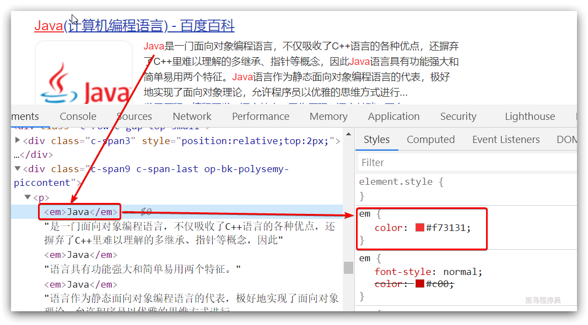
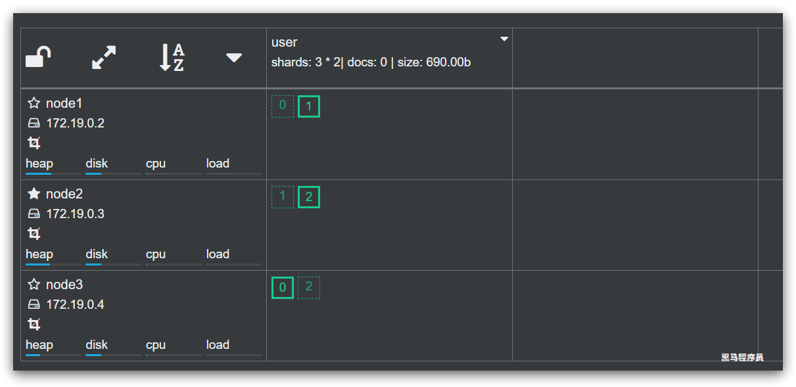

# ElasticSearch 高级

**今日目标：**

* ElasticSearch 搜索功能
* ElasticSearch 集群管理

# 1.ElasticSearch查询

ElasticSearch的强大之处就在于它具备了完善切强大的查询功能。

搜索相关功能主要包括：

- 基本查询
  - 查询所有
  - 分词查询
  - 词条查询
  - 范围查询
  - 布尔查询
    - Filter功能
- source筛选
- 排序
- 分页
- 高亮
- 聚合

官方文档：[https://www.elastic.co/guide/en/elasticsearch/client/java-rest/7.x/java-rest-high-search.html](https://www.elastic.co/guide/en/elasticsearch/client/java-rest/7.x/java-rest-high-search.html)


虽然查询的方式有很多，但是基本语法是一样的：

> 基本语法

```json
GET /索引库名/_search
{
    "query":{
        "查询类型":{
            "查询条件":"查询条件值"
        }
    }
}
```

这里的query代表一个查询对象，里面可以有不同的查询属性

- 查询类型，有许多固定的值，如：
  - match_all：查询所有
  - match：分词查询
  - term：词条查询
  - fuzzy：模糊查询
  - range：范围查询
  - bool：布尔查询
- 查询条件：查询条件会根据类型的不同，写法也有差异，后面详细讲解


## 1.1 查询所有-matchAll

### 1.1.1 Rest实现查询所有

```json
GET /user/_search
{
  "query": {
    "match_all": {}
  }
}
```


### 1.1.2 JavaAPI实现查询所有

#### 1.1.2.1 思路分析

- 0.构建查询条件SearchSourceBuilder对象
  - 添加查询条件QueryBuilders.match_all()
- 1.创建SearchRequest对象，并指定索引库名称，类似于 `GET /user/_search`
- 2.添加查询条件，就是把SearchSourceBuilder对象存到SearchRequest对象source中
- 3.发起请求，得到结果
- 4.解析结果SearchResponse
  - 4.1.获取总条数
  - 4.2.获取SearchHits数组，并遍历
    - 4.2.1获取其中的`_source`，是JSON数据
    - 4.2.2.把`_source`反序列化为User对象

#### 1.1.2.2 代码实现

```java
/**
     * 查询所有
     * @throws IOException
     */
@Test
public void testBasicSearch() throws IOException {
    // 0.构建查询条件SearchSourceBuilder对象
    SearchSourceBuilder sourceBuilder = new SearchSourceBuilder();
    //  0.1.添加查询条件QueryBuilders.match_all()
    sourceBuilder.query(
        QueryBuilders.matchAllQuery()
    );
    // 1.创建SearchRequest对象，并指定索引库名称，类似于 GET /user/_search
    SearchRequest request = new SearchRequest("user");
    // 2.添加查询条件:把SearchSourceBuilder对象存到SearchRequest对象source中
    request.source(sourceBuilder);
    // 3.发起请求，得到结果
    SearchResponse response = client.search(request, RequestOptions.DEFAULT);
    // 4.解析结果
    SearchHits searchHits = response.getHits();
    //  4.1.获取总条数
    long total = searchHits.getTotalHits().value;
    System.out.println("total = " + total);
    //  4.2.获取SearchHit数组，并遍历
    SearchHit[] hits = searchHits.getHits();
    for (SearchHit hit : hits) {
        //  4.2.1.获取其中的`_source`，是JSON数据
        String json = hit.getSourceAsString();
        //  4.2.2.把`_source`反序列化为User对象
        User user = JSON.parseObject(json, User.class);
        System.out.println("user = " + user);
    }
}
```

#### 1.2.2.3 测试运行


## 1.2 词条查询-matchQuery

### 1.2.1 脚本

match查询：

* 会对查询条件进行分词。
* 然后将分词后的查询条件和词条进行等值匹配
* 默认取并集（OR）

```json
# 查看分词效果，得到“学”和“唱歌”
GET /_analyze
{
  "text": "学唱歌"
}
# match查询, “学唱歌”分成“学”和“唱歌”两个词，包含任意一个词条都算匹配成功
GET /user/_search
{
  "query": {
    "match": {
      "note": "学唱歌"
    }
  }
}
```


### 1.2.2 JavaAPI

#### 1.2.2.1 思路分析

- 0.构建查询条件SearchSourceBuilder对象
  - 添加查询条件QueryBuilders.matchQuery()
- 1.创建SearchRequest对象，并指定索引库名称，类似于 `GET /user/_search`
- 2.添加查询条件，就是把SearchSourceBuilder对象存到SearchRequest对象source中
- 3.发起请求，得到结果
- 4.解析结果SearchResponse
  - 4.1.获取总条数
  - 4.2.获取SearchHits数组，并遍历
    - 4.2.1获取其中的`_source`，是JSON数据
    - 4.2.2.把`_source`反序列化为User对象

#### 1.2.2.2 代码实现

```java
/**
     * 词条查询termQuery-不分词
     * @throws Exception
     */
@Test
public void testTermQuery() throws Exception{
    //0. 创建SearchSourceBuilder对象
    SearchSourceBuilder sourceBuilder = new SearchSourceBuilder();
    //   0.1. 添加查询条件QueryBuilders.matchQuery()
    sourceBuilder.query(QueryBuilders.matchQuery("note", "学唱歌"));
    // 1.创建SearchRequest对象，并指定索引库名称，类似于 GET /user/_search
    SearchRequest request = new SearchRequest("user");
    // 2.添加查询条件:把SearchSourceBuilder对象存到SearchRequest对象source中
    request.source(sourceBuilder);
    // 3.发起请求，得到结果
    SearchResponse response = client.search(request, RequestOptions.DEFAULT);
    // 4.解析结果
    SearchHits searchHits = response.getHits();
    //  4.1.获取总条数
    long total = searchHits.getTotalHits().value;
    System.out.println("total = " + total);
    //  4.2.获取SearchHit数组，并遍历
    SearchHit[] hits = searchHits.getHits();
    for (SearchHit hit : hits) {
        //  4.2.1.获取其中的`_source`，是JSON数据
        String json = hit.getSourceAsString();
        //  4.2.2.把`_source`反序列化为User对象
        User user = JSON.parseObject(json, User.class);
        System.out.println("user = " + user);
    }
}
```

#### 1.2.2.3 测试运行


## 1.3 分词匹配查询-termQuery

### 1.3.1 脚本

`term` 查询，词条查询。查询的条件是一个词条，不会被分词。可以是keyword类型的字符串、数值、或者text类型字段中分词得到的某个词条.

如果term查询的条件不是一个词条，而是一个短语（多个词条），则会导致查询失败

```json
# 词条查询
GET /user/_search
{
  "query": {
    "term": {
      "name": {
        "value": "小红"
      }
    }
  }
}
```


### 1.3.2 JavaAPI

#### 1.3.2.1 思路分析

我们通过上面的代码发现，除了搜索条件SearchSourceBuilder的构建有不同，其它代码都是重复的，所以我们来抽取一下通用代码。

我们只需要传递构建的条件对象即可完成查询。

#### 1.3.2.2 代码实现

* **抽取通用方法代码**

```java
    /**
     * 抽取通用构建查询条件执行查询方法
     * @throws Exception
     */
private void parseResponse(SearchSourceBuilder sourceBuilder) throws IOException {
    // 1.准备Request
    SearchRequest request = new SearchRequest("user");
    // 2.准备参数
    request.source(sourceBuilder);
    // 3.发送请求
    SearchResponse response = client.search(request, RequestOptions.DEFAULT);
    // 4.解析结果
    SearchHits searchHits = response.getHits();
    // 4.1.总条数
    long total = searchHits.getTotalHits().value;
    System.out.println("total = " + total);
    // 4.2.数据
    SearchHit[] hits = searchHits.getHits();
    // 4.3.遍历
    for (SearchHit hit : hits) {
        // 获取_source，也就是json数据
        String json = hit.getSourceAsString();
        // json转为Java对象
        User user = JSON.parseObject(json, User.class);
        System.out.println(user);
    }
}
```

* 基于抽取方法测试 termQuery 匹配查询

```java
@Test
public void testTermQuery() throws IOException {
    SearchSourceBuilder sourceBuilder = new SearchSourceBuilder();
    // { "query": { "term": { "note": "唱歌"  } } }
    sourceBuilder.query(QueryBuilders.termQuery("note", "唱歌"));
    // 发起请求，解析响应
    parseResponse(sourceBuilder);
}
```

#### 1.3.2.3 测试运行

结果：

```
total = 2
User(id=3, name=小红, age=23, gender=0, note=小红同学在传智播客学唱歌)
User(id=5, name=达摩, age=33, gender=1, note=达摩和尚在达摩院学唱歌)
```

**小结：**

- term query会去倒排索引中寻找确切的term，它并不知道分词器的存在。这种查询适合**keyword** 、**numeric**、**date**
- match query知道分词器的存在。并且理解是如何被分词的


## 1.4 模糊查询-fuzzy

### 1.4.1 脚本

首先看一个概念，叫做编辑距离：一个词条变为另一个词条需要修改的次数，例如：

javase要修改成javaee需要做的是把 s 修改成e ，一次即可，编辑距离就是1


模糊查询允许用户查询内容与实际内容存在偏差，但是编辑距离不能超过2，示例：

```json
# fuzzy 模糊查询
GET /user/_search
{
  "query": {
    "match": {
      "note": {
        "query": "javase", "fuzziness": 1
      }
    }
  }
}
```


### 1.4.2 JavaAPI

#### 1.4.2.1 思路分析

* 通过 QueryBuilders.matchQuery().fuzziness()
* 并且设置 编辑距离，最大为2

#### 1.4.2.2 代码实现

```java
@Test
public void testFuzzyQuery() throws IOException {
    SearchSourceBuilder sourceBuilder = new SearchSourceBuilder();
    // {"query": {"match": {"note": { "query": "javase", "fuzziness": 1 }}}}
    sourceBuilder.query(QueryBuilders.matchQuery("note", "javase").fuzziness(1));

    // 发起请求，解析响应
    parseResponse(sourceBuilder);
}
```

#### 1.4.2.3 测试运行

结果：

```
total = 3
User(id=4, name=小明, age=20, gender=1, note=小明同学在黑马学JavaSE)
User(id=2, name=Jack, age=38, gender=1, note=Jack同学在黑马学JavaEE)
User(id=2, name=Jack, age=38, gender=1, note=Jack同学在黑马学JavaEE)
```


## 1.5 范围查询-range

### 1.5.1 脚本

```json
# 范围查询
GET /user/_search
{
  "query": {
    "range": {
      "age": {
        "gte": 10,
        "lte": 20
      }
    }
  }
}

```

### 1.5.2 JavaAPI

#### 1.5.2.1 思路分析

* 构建范围查询对象 `QueryBuilders.rangeQuery(field).gte(min).lte(max);`

#### 1.5.2.2 代码实现

* 编写测试方法

```java
/**
 * 条件查询
 * @throws Exception
 */
@Test
public void testRangeQuery() throws IOException {
    SearchSourceBuilder sourceBuilder = new SearchSourceBuilder();
    // { "query": { "range": { "age": {lte: "10", gte: 20}  } } }
    sourceBuilder.query(QueryBuilders.rangeQuery("age").gte(10).lte(20));

    // 发起请求，解析响应
    parseResponse(sourceBuilder);
}
```


#### 1.5.2.3 测试运行

```
total = 2
User(id=1, name=Rose, age=18, gender=1, note=Rose同学在传智播客学表演11)
User(id=4, name=小明, age=20, gender=1, note=小明同学在黑马学JavaSE)
```


## 1.6 bool查询

 boolQuery：对多个查询条件连接。

连接方式：

* must（and）：条件必须成立
* must_not（not）：条件必须不成立
* should（or）：条件可以成立

* filter：条件必须成立，性能比must高。不会计算得分

**得分:**即条件匹配度,匹配度越高，得分越高

默认情况下，所有的查询条件、过滤条件都会影响打分和排名。而对搜索结果打分是比较影响性能的，因此我们一般只对用户输入的搜索条件对应的字段打分，其它过滤项不打分。此时就不能简单实用布尔查询的must来组合条件了，而是实用`filter`方式。

### 1.6.1 脚本

```json
# boolquery
#must和filter配合使用时，max_score（得分）是显示的
#must 默认数组形式
GET user/_search
{
  "query": {
    "bool": {
      "must": [
        {
          "match": {
            "note": "唱歌表演"
          }
        }
      ],
       "filter":[ 
        {
        "term": {
          "gender": "1"
        }
       },
       {
         "range":{
          "age": {
            "gte": 18,
            "lte": 25
         }
         }
       }
      ]
    }
  }
}

```

> bool查询中添加查询条件一般是一个即可，然后在后面根据结果过滤，这样效率会比较高。

### 1.6.2 JavaAPI

#### 1.6.2.1 思路分析

布尔查询：boolQuery 

1. 查询相信信息`note`为: 唱歌表演
2. 过滤性别`gender`为：1
3. 过滤年龄`age`在：18-20

must 、filter为连接方式

term、match为不同的查询方式

#### 1.6.2.2 代码实现

```java
@Test
public void testBoolQuery() throws IOException {
    SearchSourceBuilder sourceBuilder = new SearchSourceBuilder();
    // 1.构建bool条件对象，可以采用链式编程
    BoolQueryBuilder queryBuilder = QueryBuilders.boolQuery()
        // 1.1.构建matchQuery对象,查询相信信息`note`为: 黑马
        .must(QueryBuilders.matchQuery("note", "唱歌表演"))
        // 1.2.过滤姓名`name`包含：小武
        .filter(QueryBuilders.termQuery("gender", "1"))
        // 1.3.过滤年龄`age`在：23-27
        .filter(QueryBuilders.rangeQuery("age").gte(18).lte(20));
    // 2.添加查询条件
    sourceBuilder.query(queryBuilder);

    // 3.发起请求，解析响应
    parseResponse(sourceBuilder);
}
```

#### 1.6.2.3 测试运行

```
total = 1
User(id=1, name=Rose, age=18, gender=1, note=Rose同学在传智播客学表演11)
```


## 1.7.排序

排序、高亮、分页并不属于查询的条件，因此并不是在`query`内部，而是与`query`平级，基本语法：

```json
GET /{索引库名称}/_search
{
  "query": { ... },
  "sort": [
    {
      "{排序字段}": {
        "order": "{asc或desc}"
      }
    }
  ]
}
```

### 1.7.1.Rest的API

例如，我们把年龄在10~26之间的人，根据年龄排序：

```json
GET /user/_search
{
  "query": {
    "range": {
      "age": {
        "gte": 10,
        "lte": 26
      }
    }
  }, 
  "sort": [
    {
      "age": {
        "order": "asc"
      }
    }
  ]
}
```


### 1.7.2.Java实现

基本思路如下：

- 准备SearchSourceBuilder
- 准备查询条件，本例中是range查询，QueryBuilders.rangeQuery().lte().gte()
- 准备排序条件
  - 排序字段
  - 排序方式

具体代码：

```java
@Test
public void testSortQuery() throws IOException {
    // 1.准备SearchSourceBuilder
    SearchSourceBuilder sourceBuilder = new SearchSourceBuilder();
    // 2.准备查询条件，本例中是range查询
    sourceBuilder.query(QueryBuilders.rangeQuery("age").gte(10).lte(26));
    // 3.准备排序条件
    sourceBuilder.sort("age", SortOrder.ASC);
    // 4.发起请求，解析响应
    parseResponse(sourceBuilder);
}
```

结果：

```
total = 5
User(id=1, name=Rose, age=18, gender=1, note=Rose同学在传智播客学表演11)
User(id=4, name=小明, age=20, gender=1, note=小明同学在黑马学JavaSE)
User(id=3, name=小红, age=23, gender=0, note=小红同学在传智播客学唱歌)
User(id=6, name=鲁班, age=24, gender=1, note=鲁班同学走在乡间小路上)
User(id=7, name=孙尚香, age=26, gender=0, note=孙尚香同学想带阿斗回东吴)
```


## 1.8 分页查询-from

ES通过from和size来指定分页的开始位置及每页大小，类似mysql中的 `limit from, size`。默认情况下ES会设置size=10，查询10条记录。

假设page = 1, size = 3 , 则from = (page - 1) * size = 0

### 1.8.1 Rest的API

```json
GET /user/_search
{
  "query": {"match_all": {}},
  "sort": [
    {
      "id": {
        "order": "asc"
      }
    }
  ],
  "from": 0, "size": 3
}
```


### 1.8.2 JavaAPI

#### 1.8.2.1 思路分析

* 设置match_all查询所有
* 设置id排序
* 设置分页查询

#### 1.8.2.2 代码实现

* 新增查询方法，设置查询条件

```java
/**
     * 布尔查询 分页
     * @throws Exception
     */
@Test
public void testPageQuery() throws IOException {
    int page = 1, size = 3;
    // 条件工厂
    SearchSourceBuilder sourceBuilder = new SearchSourceBuilder();
    // 1.query条件
    sourceBuilder.query(QueryBuilders.matchAllQuery());
    // 2.排序
    sourceBuilder.sort("id", SortOrder.ASC);
    // 3.分页
    sourceBuilder.from((page - 1) * size).size(3);

    // 发起请求，解析响应
    parseResponse(sourceBuilder);
}
```


#### 1.8.2.3 测试运行

```
total = 10
User(id=1, name=Rose, age=18, gender=1, note=Rose同学在传智播客学表演11)
User(id=2, name=Jack, age=38, gender=1, note=Jack同学在黑马学JavaEE)
User(id=3, name=小红, age=23, gender=0, note=小红同学在传智播客学唱歌)
```


**小结：**

其本质是逻辑分页，因此为了避免深度分页的问题，ES限制最多查到第10000条。

如果需要查询到10000以后的数据，你可以采用两种方式：

- scroll滚动查询
- search after

详见文档：[https://www.elastic.co/guide/en/elasticsearch/reference/7.5/search-request-body.html#request-body-search-search-after](https://www.elastic.co/guide/en/elasticsearch/reference/7.5/search-request-body.html#request-body-search-search-after)

> 搜索请求占用的堆内存和时间与`from + size`成正比，虽然可以使用`from`和对结果进行分页，但是`size`达到深度分页时，成本变得过高。因此，`index.max_result_window`默认值是10,000 也就是（from + size）< 10000，这是一种保护措施。
>
> 建议使用[scroll](https://www.elastic.co/guide/en/elasticsearch/reference/7.5/search-request-body.html#request-body-search-scroll)的api进行有效的深度滚动，但是滚动上下文的成本很高，因此不建议将其用于实时用户请求。
>
> `search_after`查询参数通过提供活动光标来解决此问题。想法是使用上一页的结果来帮助下一页的检索。

不过，去百度或京东查看搜索结果页，可以发现百度只允许查询到70页左右，京东也类似。from + size深度最多在2000以内，因为用户根本不会查询到那么多页以后的内容。


## 1.9 高亮查询-highlight

高亮是在搜索结果中把搜索关键字标记出来，让后给这些标记的内容添加CSS样式，如图：




### 1.9.1.Rest的API

elasticsearch中实现高亮的语法比较简单：

```json
GET /user/_search
{
  "query": {
    "match": {
      "note": "黑马"
    }
  },
  "highlight": {
    "pre_tags": "<em>",
    "post_tags": "</em>", 
    "fields": {
      "note": {}
    }
  }
}
```

elasticsearch会利用指定的`<em>`标签来包裹搜索关键字并返回给我们。将来页面只需要给`<em>`标签添加css样式，即可实现高亮了。


高亮三要素：

- pre_tags：前置标签，可以省略，默认是em
- post_tags：后置标签，可以省略，默认是em
- fields：需要高亮的字段
  - note：这里声明note字段需要高亮

结果：


可以看到，查询的结果中，高亮部分highlight和`_source`部分是分离的，我们原来查询出`_source`部分，直接转为User对象。这样User中的note是**非高亮的**。

需要从`highlight`中获取高亮的结果，并设置到user中。


### 1.9.2 JavaAPI

#### 1.9.2.1 思路分析

创建搜索条件时：

* 1.创建SearchSourceBuilder
* 2.添加match查询
* 3.添加高亮对象HighlightBuilder，设置高亮三要素

解析时：

* 获取高亮结果
* 判断高亮结果是否存在
* 取出高亮字符串数组，并拼接结果
* 将拼接的高亮结果存入对象中


#### 1.9.2.2 代码实现

* 创建搜索条件：

```java
@Test
public void testHighlightQuery() throws IOException {
    // 1.条件工厂
    SearchSourceBuilder sourceBuilder = new SearchSourceBuilder();
    // 2.query条件
    sourceBuilder.query(QueryBuilders.matchQuery("note", "黑马"));
    // 3.高亮条件，三要素
    sourceBuilder.highlighter(
        new HighlightBuilder().field("note").preTags("<em>").postTags("</em>"));

    // 4.发起请求，解析响应
    parseResponse(sourceBuilder);
}
```

* 在`parseResponse`执行完成后解析结果并封装


完整代码如下：

```java
private void parseResponse(SearchSourceBuilder sourceBuilder) throws IOException {
    // 1.准备Request
    SearchRequest request = new SearchRequest("user");
    // 2.准备参数
    request.source(sourceBuilder);
    // 3.发送请求
    SearchResponse response = client.search(request, RequestOptions.DEFAULT);
    // 4.解析结果
    SearchHits searchHits = response.getHits();
    // 4.1.总条数
    long total = searchHits.getTotalHits().value;
    System.out.println("total = " + total);
    // 4.2.数据
    SearchHit[] hits = searchHits.getHits();
    // 4.3.遍历
    for (SearchHit hit : hits) {
        // 获取的是非高亮结果
        String json = hit.getSourceAsString();
        User user = JSON.parseObject(json, User.class);
        // 获取高亮
        Map<String, HighlightField> map = hit.getHighlightFields();
        // 判断是否为空
        if (map != null && !map.isEmpty()) {
            // 根据高亮字段名称获取高亮值
            HighlightField highlightField = map.get("note");
            // 得到高亮片段
            Text[] fragments = highlightField.getFragments();
            // 拼接片段，得到完整高亮结果
            String hResult = StringUtils.join(fragments);
            // 用高亮结果替换非高亮结果
            user.setNote(hResult);
        }
        System.out.println(user);
    }
}
```


#### 1.9.2.3 测试运行

```
total = 2
User(id=2, name=Jack, age=38, gender=1, note=Jack同学在<em>黑马</em>学JavaEE)
User(id=4, name=小明, age=20, gender=1, note=小明同学在<em>黑马</em>学JavaSE)
```


## 1.10 聚合查询-aggregation

**聚合（aggregations）**可以让我们极其方便的实现对数据的统计、分析。例如：

- 什么品牌的手机最受欢迎？
- 这些手机的平均价格、最高价格、最低价格？
- 这些手机每月的销售情况如何？

实现这些统计功能的比数据库的sql要方便的多，而且查询速度非常快，可以实现近实时搜索效果。

> 要注意：**参与聚合的字段，必须是keyword类型或数字类型**。

Elasticsearch中的聚合，包含多种类型，最常用的两种，一个叫`桶`，一个叫`度量`：

* **<font color="red"><u>桶（bucket）-- 分组</u></font> **

桶的作用，是按照某种方式对**数据进行分组**，每一组数据在ES中称为一个`桶`，例如我们根据国籍对人划分，可以得到`中国桶`、`英国桶`，`日本桶`……或者我们按照年龄段对人进行划分：`0~10,10~20,20~30,30~40`等。

Elasticsearch中提供的划分桶的方式有很多：

- Date Histogram Aggregation：根据日期阶梯分组，例如给定阶梯为周，会自动每周分为一组
- Histogram Aggregation：根据数值阶梯分组，与日期类似，需要知道分组的间隔（interval）
- **Terms** Aggregation：根据词条内容分组，词条内容完全匹配的为一组，类似数据库group by 
- Range Aggregation：数值和日期的范围分组，指定开始和结束，然后按段分组
- ……

综上所述，我们发现bucket aggregations 只负责对数据进行分组，并不进行计算，因此往往bucket中往往会嵌套另一种聚合：metrics aggregations即度量

* **<font color="red"><u>度量（metrics）-- 聚合</u></font> **

分组完成以后，我们一般会对**组中的数据进行聚合运算**，例如求平均值、最大、最小、求和等，这些在ES中称为`度量`

比较常用的一些度量聚合方式：

- Avg Aggregation：求平均值
- Max Aggregation：求最大值
- Min Aggregation：求最小值
- Percentiles Aggregation：求百分比
- Stats Aggregation：同时返回avg、max、min、sum、count等
- Sum Aggregation：求和
- Top hits Aggregation：求前几
- Value Count Aggregation：求总数


**小结：**

* 度量聚合：相当于MySQL的聚合函数。max、min、avg、sum、count、top等

* 桶聚合：相当于MySQL的 group by 操作。不要对text类型的数据进行分组，会失败。

### 1.10.1 桶分组的RestAPI

* 数据准备

```json
# 创建库
PUT /car
{
  "mappings": {
    "properties": {
      "make":{
        "type": "keyword"
      },
      "color": {
        "type": "keyword"
      }
    }
  }
}

# 添加数据
POST /car/_bulk
{ "index": {}}
{ "price" : 10000, "color" : "红", "make" : "本田", "sold" : "2014-10-28" }
{ "index": {}}
{ "price" : 20000, "color" : "红", "make" : "本田", "sold" : "2014-11-05" }
{ "index": {}}
{ "price" : 30000, "color" : "绿", "make" : "福特", "sold" : "2014-05-18" }
{ "index": {}}
{ "price" : 15000, "color" : "蓝", "make" : "丰田", "sold" : "2014-07-02" }
{ "index": {}}
{ "price" : 12000, "color" : "绿", "make" : "丰田", "sold" : "2014-08-19" }
{ "index": {}}
{ "price" : 20000, "color" : "红", "make" : "本田", "sold" : "2014-11-05" }
{ "index": {}}
{ "price" : 80000, "color" : "红", "make" : "宝马", "sold" : "2014-01-01" }
{ "index": {}}
{ "price" : 25000, "color" : "蓝", "make" : "福特", "sold" : "2014-02-12" }
```

* 按照 汽车的制造商`make`来划分桶--分组

```json
# 按照make分组
GET /car/_search
{
  "aggs": {
    "popular_makers": {
      "terms": {
        "field": "make"
      }
    }
  },
  "size": 0
}
```

> 注意：aggregation的类型是terms，因为是按照make字段的值分组。
>
> - size： 查询条数，这里设置为0，因为我们不关心搜索到的数据，只关心聚合结果，提高效率
> - aggs：声明这是一个聚合查询，是aggregations的缩写
>   - popular_makers：给这次聚合起一个名字，可任意指定。
>     - terms：聚合的类型，这里选择terms，是根据词条内容（这里是make）划分
>       - field：划分桶时依赖的字段

可以看到，指定聚合主要是三要素：

- 聚合名称：此处是`popular_makers`
- 聚合类型：此处是`term`
- 聚合字段：此处是`make`


结果：

```json
{
  "took" : 3,
  "timed_out" : false,
  "_shards" : {
    "total" : 1,
    "successful" : 1,
    "skipped" : 0,
    "failed" : 0
  },
  "hits" : {
    "total" : {
      "value" : 8,
      "relation" : "eq"
    },
    "max_score" : null,
    "hits" : [ ]
  },
  "aggregations" : {
    "popular_makers" : {
      "doc_count_error_upper_bound" : 0,
      "sum_other_doc_count" : 0,
      "buckets" : [
        {
          "key" : "本田",
          "doc_count" : 3
        },
        {
          "key" : "丰田",
          "doc_count" : 2
        },
        {
          "key" : "福特",
          "doc_count" : 2
        },
        {
          "key" : "宝马",
          "doc_count" : 1
        }
      ]
    }
  }
}

```

可以看到结果是放在一个名为`aggregations`的属性中，然后在`aggregations`中有一个名为`popular_makers`的属性，也就是我们的聚合名称。

根据这个名称获取到的就是一个数组，其中是一个个的桶（bucket）。

桶中是一个个的对象，每个对象都有两个属性：

- key：代表这一组的make字段结果
- doc_count：是统计的数量


### 1.10.2 桶分组查询JavaAPI

#### 1.10.2.1 思路分析

新建一个测试类`ElasticSearchAggsTest`，实现步骤：

- 1.创建SearchSourceBuilder对象，条件工厂
  - 添加一个聚合：名称叫popular_makers，类型是term类型，字段是make
- 2.创建SearchRequest对象，并指定索引库名称
- 3.添加SearchSourceBuilder对象到SearchRequest对象source中
- 4.发送请求，得到查询结果
- 5.获取聚合结果
  - 5.1.根据聚合名称获取聚合结果，Term聚合，得到的就是Terms
  - 5.2.从聚合结果中，获取buckets数组
  - 5.3.遍历buckets数组，得到每一个bucket
  - 5.4.从bucket中取出key和doc_count


#### 1.10.2.2 代码实现

```java
@Test
public void testAggs() throws IOException {
    // 创建SearchSourceBuilder对象，条件工厂
    SearchSourceBuilder sourceBuilder = new SearchSourceBuilder();
    // 添加一个聚合：名称叫popular_makers，类型是term类型，字段是make
    sourceBuilder.aggregation(
        AggregationBuilders.terms("popular_makers").field("make")
    );

    // 1.创建SearchRequest对象，并指定索引库名称
    SearchRequest request = new SearchRequest("car");
    // 2.添加SearchSourceBuilder对象到SearchRequest对象source中
    request.source(sourceBuilder);
    // 3.发送请求
    SearchResponse response = client.search(request, RequestOptions.DEFAULT);

    // 4.解析响应，获取所有的聚合结果
    Aggregations aggregations = response.getAggregations();
    // 4.1.根据聚合name，获取聚合结果
    Terms makeAgg = aggregations.get("popular_makers");
    // 4.2.获取聚合结果中的桶buckets
    List<? extends Terms.Bucket> buckets = makeAgg.getBuckets();
    // 4.3.遍历桶buckets
    for (Terms.Bucket bucket : buckets) {
        // 获取桶中的key，也就是make的值
        String makeName = bucket.getKeyAsString();
        System.out.println("========== 制造商 : " + makeName + "==========");
        // 获取桶中的doc_count，也就是统计的数量
        long docCount = bucket.getDocCount();
        System.out.println("销量 : " + docCount);
    }

}
```

#### 1.10.2.3 测试运行

```
========== 制造商 : 本田==========
销量 : 3
========== 制造商 : 丰田==========
销量 : 2
========== 制造商 : 福特==========
销量 : 2
========== 制造商 : 宝马==========
销量 : 1
```


### 1.10.3 桶内度量的RestAPI

前面的例子告诉我们每个桶里面的文档数量，这很有用。 但通常，我们的应用需要提供更复杂的文档度量。 例如，每种品牌的汽车的平均价格是多少？

因此，我们需要告诉Elasticsearch`使用哪个字段`，`使用何种度量方式`进行运算，这些信息要嵌套在`桶`内，`度量`的运算会基于`桶`内的文档进行

**需求：各个品牌的车的平均价格、总价格、最小价格、最大价格等**

而同时求最大值、最小值、平均值、求和，就要用到Metrics聚合中的Stats聚合

```json
# 求各个品牌的车的平均价格、总价格、最小价格、最大价格等
GET /car/_search
{
  "aggs": {
    "popular_colors": {
      "terms": {
        "field": "make"
      },
      "aggs": {
        "price_stats": {
          "stats": {
            "field": "price"
          }
        }
      }
    }
  },
  "size": 0
}
```

看清楚嵌套关系：


我们是在make字段的Term聚合（桶聚合）内部，又添加了一个对price字段的Stats聚合（度量聚合）。


### 1.10.4 桶内度量JavaAPI

#### 1.10.4.1 思路分析

新建一个测试类`ElasticSearchAggsTest`，实现步骤：

- 1.创建SearchSourceBuilder对象，条件工厂
  - 1.1.添加一个聚合：名称叫popular_makers，类型是term类型，字段是make
  - 1.2.给popular_makers添加一个子聚合：
    - 名称是price_stats，类型是stats，字段是price
- 2.创建SearchRequest对象，并指定索引库名称
- 3.添加SearchSourceBuilder对象到SearchRequest对象source中
- 4.执行查询，得到查询结果
- 5.获取聚合结果
  - 5.1.根据聚合名称（popular_makers）获取聚合结果，Term聚合，得到的就是Terms
  - 5.2.从聚合结果中，获取buckets数组
  - 5.3.遍历buckets数组，得到每一个bucket
  - 5.4.从bucket中取出key和doc_count
  - 5.5.从bucket中取出所有子聚合（subAggregations）
    - 根据聚合名称（price_stats）获取聚合结果，Stats聚合，得到的就是Stats
    - 从聚合结果中，获取最大值、最小值、平均值、总和


#### 1.10.4.2 代码实现

添加聚合条件时的代码：


解析子聚合的代码：


完整代码：

```java
@Test
public void testAggs() throws IOException {
    // 1.创建SearchSourceBuilder对象，条件工厂
    SearchSourceBuilder sourceBuilder = new SearchSourceBuilder();
    sourceBuilder.aggregation( // 1.1.添加一个聚合：名称叫popular_makers，类型是term类型，字段是make
        AggregationBuilders.terms("popular_makers").field("make")
        // 1.2.给popular_makers添加一个子聚合：名称是price_stats，类型是stats，字段是price
        .subAggregation(AggregationBuilders.stats("price_stats").field("price"))
    );

    // 1.准备Request
    SearchRequest request = new SearchRequest("car");
    // 2.给request添加参数
    request.source(sourceBuilder);
    // 3.发送请求
    SearchResponse response = client.search(request, RequestOptions.DEFAULT);

    // 4.解析响应，获取所有的聚合结果
    Aggregations aggregations = response.getAggregations();
    // 4.1.根据聚合name，获取聚合结果
    Terms makeAgg = aggregations.get("popular_makers");
    // 4.2.获取聚合结果中的桶buckets
    List<? extends Terms.Bucket> buckets = makeAgg.getBuckets();
    // 4.3.遍历桶buckets
    for (Terms.Bucket bucket : buckets) {
        // 获取桶中的key，也就是make的值
        String makeName = bucket.getKeyAsString();
        System.out.println("========== 制造商 : " + makeName + "==========");
        // 获取桶中的doc_count，也就是统计的数量
        long docCount = bucket.getDocCount();
        System.out.println("\t销量 : " + docCount);
        // 5.解析子聚合
        Aggregations subAggregations = bucket.getAggregations();
        // 根据名称取一个子聚合
        Stats priceAgg = subAggregations.get("price_stats");
        // 获取度量结果
        double min = priceAgg.getMin();
        System.out.println("\t最低价格 = " + min);
        double max = priceAgg.getMax();
        System.out.println("\t最高价格 = " + max);
        double sum = priceAgg.getSum();
        System.out.println("\t总价格 = " + sum);
        double avg = priceAgg.getAvg();
        System.out.println("\t平均价格 = " + avg);

    }

}
```

#### 1.10.4.3 测试运行

结果如下：

```
========== 制造商 : 本田==========
	销量 : 3
	最低价格 = 10000.0
	最高价格 = 20000.0
	总价格 = 50000.0
	平均价格 = 16666.666666666668
========== 制造商 : 丰田==========
	销量 : 2
	最低价格 = 12000.0
	最高价格 = 15000.0
	总价格 = 27000.0
	平均价格 = 13500.0
========== 制造商 : 福特==========
	销量 : 2
	最低价格 = 25000.0
	最高价格 = 30000.0
	总价格 = 55000.0
	平均价格 = 27500.0
========== 制造商 : 宝马==========
	销量 : 1
	最低价格 = 80000.0
	最高价格 = 80000.0
	总价格 = 80000.0
	平均价格 = 80000.0
```


## 1.11 相关API总结

### 1.11.1 构建查询条件API

* **<font color="red">SearchSourceBuilder</font> **

在Java客户端中，`SearchSourceBuilder`就是用来构建上面提到的大JSON对象，其中包含了5个方法：

- query(QueryBuilder)：查询条件
- sort(String, SortOrder)：排序条件
- from(int)和size(int)：分页条件
- highlight(HighlightBuilder)：高亮条件
- aggregation(AggregationBuilder)：聚合条件

如图：

 

是不是与REST风格API的JSON对象一致？

接下来，再逐个来看每一个查询子属性。

* **<font color="red">查询条件QueryBuilders</font> **

SearchSourceBuilder的query(QueryBuilder)方法，用来构建查询条件，而查询分为：

- 分词查询：MatchQuery
- 词条查询：TermQuery
- 布尔查询：**BooleanQuery**
- 范围查询：RangeQuery
- 模糊查询：FuzzyQuery
- ...

这些查询有一个统一的工具类来提供：QueryBuilders

 

### 1.11.2 搜索结果API

在Kibana中回顾看一下搜索结果：

 

搜索得到的结果整体是一个JSON对象，包含下列2个属性：

- hits：查询结果，其中又包含两个属性：
  - total：总命中数量
  - hits：查询到的文档数据，是一个数组，数组中的每个对象就包含一个文档结果，又包含：
    - _source：文档原始信息
    - highlight：高亮结果信息
- aggregations：聚合结果对象，其中包含多个属性，属性名称由添加聚合时的名称来确定：
  - gender_agg：这个是我们创建聚合时用的`聚合名称`，其中包含聚合结果
    - buckets：聚合结果数组

Java客户端中的SearchResponse代表整个JSON结果

* <font color="red">**SearchResponse**</font> 

Java客户端中的SearchResponse代表整个JSON结果，包含下面的方法：

 

包含两个方法：

1. getHits()：返回的是SearchHits，代表查询结果
2. getAggregations()：返回的是Aggregations，代表聚合结果


* **<font color="red">SearchHits查询结果</font> **

SearchHits代表查询结果的JSON对象：

 


包含下面的方法：

 

核心方法有3个：

1. getTotalHists()：返回TotalHists，总命中数
2. getHits()：返回SearchHit数组
3. getMaxScore()：返回float，文档的最大得分


* **<font color="red">SearchHit结果对象</font> **

SearchHit封装的就是结果数组中的每一个JSON对象：

 

包含这样的方法：

 

- getSourceAsString()：返回的是`_source`
- getHighLightFields()：返回是高亮结果

# 2 ElasticSearch 集群

那么问题来了：什么是集群呢？

## 2.1.什么是集群

来看下维基百科对集群的介绍：


集群是==一组计算机==高度紧密协作，完成计算工作。其中的每个计算机称为一个==节点==。根据这些计算机的协作方式不同或者目的不同，我们将集群分成三类：

- 高可用集群
- 负载均衡集群
- 科学计算集群（分布式处理）

上述几种集群方式并非必须独立使用，我们在系统架构时经常会组合使用。

### 2.1.1 高可用集群

High availability Cluster高可用群集，简称HAC。其设计思想是为了避免出现单点故障问题，在故障时可以==快速恢复，快速继续提供服务==。


如图所示，集群中两台计算机node01和node02，两者共享资源，处理业务也基本一致，互为==主从==。当node01工作时，node02就处于待命状态。所有业务在Node01上运行，若发生故障服务和资源会转移到Node02上。

这种架构保证了服务的高可用，但是闲置的节点是对资源的一种浪费。

### 2.1.2 负载均衡集群

Load Balancing负载均衡，集群中的每一台计算机都来完成相同业务，不分主次。当用户请求到达时，通过某种算法，让请求均衡的分发到集群中的每个节点，充分利用每个节点的资源。如图所示：


因为每个节点业务相同，如果某个节点出现故障，只需要把请求分发到其它节点即可。


### 2.1.3 科学计算集群

因为硬件设备的限制，单台计算机的处理性能是有上限的，如果计算需要的资源超过了单台计算机的能力，该怎么办呢？此时就可以使用科学计算集群。


我们把复杂任务拆分成一个个小的子任务，然后分配到集群中的不同节点上完成，最后再把计算结果汇总。这样大量低廉的PC机互联起来，组成一个"超级计算机"以解决复杂的计算任务。


这样的方式也称为==**分布式运算或者分布式集群**==，集群中的每个节点完成==**不同任务**==。


## 2.2.WEB应用的集群模式

上述计算机协作的集群方式任何领域都可以使用，在web开发中也是如此，不过有一些细节的不同。我们以一个电商网站为例，看看几种架构方式：

### 2.2.1 单体应用

所有业务在一个系统中完成：


出现的问题：

- 系统庞大，功能耦合，难以维护
- 并发能力差，容易出现单点故障
- 无法针对不同功能进行优化


### 2.2.2 分布式架构

按照上面的分布式集群概念，集群中的每个节点完成不同业务。在web开发中也是如此，我们把完整系统进行拆分，形成独立系统，然后部署到不同的tomcat节点，不同节点通过网络通信，相互协作。


这样就将复杂系统细分，降低了业务间的耦合，但是却带来了另一个问题，就是单个节点故障会导致整个系统不完整。为了保证高可用，还需要对集群做备份，实现负载均衡。

### 2.2.3 高可用分布式集群架构

为了解决上面所述的单点故障问题，我们可以为分布式系统中的每个节点都部署负载均衡节点，即：每个业务系统都有一个负载均衡的小集群。


## 2.2 ES集群相关概念

 es 集群:

* ElasticSearch 天然支持分布式
* ElasticSearch 的设计隐藏了分布式本身的复杂性

**ES集群相关概念**:

* 集群（cluster）：一组拥有共同的 cluster name 的 节点。

* <font color="red">节点（node)</font>   ：集群中的一个 Elasticearch 实例

* 索引（index) ：es存储数据的地方。相当于关系数据库中的database概念

* <font color="red">分片（shard）</font> ：索引可以被拆分为不同的部分进行存储，称为分片。在集群环境下，一个索引的不同分片可以拆分到不同的节点中

  解决问题：数据量太大，单点存储量有限的问题。

  

  > 此处，我们把数据分成3片：shard0、shard1、shard2

* 主分片（Primary shard）：相对于副本分片的定义。

* 副本分片（Replica shard）每个主分片可以有一个或者多个副本，数据和主分片一样。

  ​	

数据备份可以保证高可用，但是每个分片备份一份，所需要的节点数量就会翻一倍，成本实在是太高了！

为了在高可用和成本间寻求平衡，我们可以这样做：

- 首先对数据分片，存储到不同节点
- 然后对每个分片进行备份，放到对方节点，完成互相备份

这样可以大大减少所需要的服务节点数量，如图，我们以3分片，每个分片备份一份为例：


现在，每个分片都有1个备份，存储在3个节点：

- node0：保存了分片0和1
- node1：保存了分片0和2
- node2：保存了分片1和2


## 2.3 集群搭建

本章节基于Docker安装。

### 2.3.1 集群机器规划

为了简化大家开发，我们选择在一台计算机上开启3个docker节点来模拟集群：

| cluster name      | node name | IP Addr         | http端口  / 通信端口 |
| ----------------- | --------- | --------------- | -------------------- |
| es-docker-cluster | node1     | 192.168.150.101 | 9200 / 9300          |
| es-docker-cluster | node2     | 192.168.150.101 | 9201 / 9301          |
| es-docker-cluster | node3     | 192.168.150.101 | 9202 / 9302          |


### 2.3.2 搭建步骤

1）创建一个共享的网络

```sh
docker network create es-net
```

2）开启虚拟机内存限制：

一次性生效：

```sh
sysctl -w vm.max_map_count=262144
```

或者修改文件`/etc/sysctl.conf`：

```sh
# 修改文件
vi /etc/sysctl.conf
# 添加内容：
vm.max_map_count=262144
```


3）在虚拟机（同一台）上执行下面命令

节点1：

"discovery.seed_hosts=es02,es03"：集群中的其它节点的IP地址，这里是容器内，所以用容器名互联。

"cluster.initial_master_nodes=node1,node2,node3"：三个节点都是候选主节点，都可以参与选主


```sh
docker run -d --name es01 \
    -e "node.name=node1" \
    -e "cluster.name=es-docker-cluster" \
    -e "discovery.seed_hosts=es02,es03" \
    -e "cluster.initial_master_nodes=node1,node2,node3" \
    -e "ES_JAVA_OPTS=-Xms256m -Xmx256m" \
    -v es-data01:/usr/share/elasticsearch/data \
    -v es-plugins01:/usr/share/elasticsearch/plugins \
    --privileged \
    --memory-swap=-1 \
    -p 9200:9200 \
    -p 9300:9300 \
    --network=es-net \
elasticsearch:7.4.2
```

节点2：

```sh
docker run -d --name es02 \
    -e "node.name=node2" \
    -e "cluster.name=es-docker-cluster" \
    -e "discovery.seed_hosts=es01,es03" \
    -e "cluster.initial_master_nodes=node1,node2,node3" \
    -e "ES_JAVA_OPTS=-Xms256m -Xmx256m" \
    -v es-data02:/usr/share/elasticsearch/data \
    -v es-plugins02:/usr/share/elasticsearch/plugins \
    --privileged \
    --memory-swap=-1 \
    -p 9201:9200 \
    -p 9301:9300 \
    --network=es-net \
elasticsearch:7.4.2
```

节点3：

```sh
docker run -d --name es03 \
    -e "node.name=node3" \
    -e "cluster.name=es-docker-cluster" \
    -e "discovery.seed_hosts=es01,es02" \
    -e "cluster.initial_master_nodes=node1,node2,node3" \
    -e "ES_JAVA_OPTS=-Xms256m -Xmx256m" \
    -v es-data03:/usr/share/elasticsearch/data \
    -v es-plugins03:/usr/share/elasticsearch/plugins \
    --privileged \
    --memory-swap=-1 \
    -p 9202:9200 \
    -p 9302:9300 \
    --network=es-net \
elasticsearch:7.4.2
```


4）访问http://192.168.150.101:9200/_cat/health?v 查看集群状态


>```properties
>健康状况结果解释：
>cluster: 集群名称
>status: 集群状态 
>	#green代表健康；
>	#yellow代表分配了所有主分片，但至少缺少一个副本，此时集群数据仍旧完整；
>	#red 代表部分主分片不可用，可能已经丢失数据。
>node.total: 代表在线的节点总数量
>node.data: 代表在线的数据节点的数量
>shards: 存活的分片数量
>pri: 存活的主分片数量 正常情况下 shards的数量是pri的两倍。
>relo: 迁移中的分片数量，正常情况为 0
>init: 初始化中的分片数量 正常情况为 0
>unassign: 未分配的分片 正常情况为 0
>pending_tasks: 准备中的任务，任务指迁移分片等 正常情况为 0
>max_task_wait_time: 任务最长等待时间
>active_shards_percent: 正常分片百分比 正常情况为 100%
>```

可以访问：http://192.168.200.153:9200/_cat/nodes?v&pretty  查看集群


或者通过head插件查看：


## 2.4 集群管理

### 2.4.1.cerebro管理集群

cerebro是一个方便的elasticsearch集群管理客户端，使用js实现，非常轻量级。

解压课前资料中提供的安装包：


解压到任意非中文目录，可以看到结构如下：


进入bin目录，运行cerebro.bat即可：


然后能看到下面的运行图：


访问：localhost:9000即可：


输入你的elasticsearch的任意节点的地址和端口，点击connect即可：


绿色的条，代表集群处于绿色（健康状态）。


### 2.4.2.kibana管理集群

 Docker 执行下方命令：

```shell
docker run -di --name kibana -p 5601:5601  -v kibana-config:/usr/share/kibana/config kibana:7.4.2
```

kibana.yml 其他配置：

```yaml
#支持中文
i18n.locale: "zh-CN"
##5601避免与之前的冲突
server.port: 5601
server.host: "0"
server.name: "kibana-itcast-cluster"
elasticsearch.hosts: ["http://192.168.200.151:9200","http://192.168.200.152:9200","http://192.168.200.153:9200"]
#elasticsearch.hosts: ["http://192.168.200.151:9200"]
elasticsearch.requestTimeout: 99999
```

浏览器访问：http://192.168.200.151:5601/app/monitoring#/no-data?_g=()


## 2.5 JavaAPI 访问集群

```java
    //客户端对象
    private RestHighLevelClient client;
    /**
     * 建立连接
     */
    @Before
    public void init() throws IOException {
        //创建Rest客户端
        client = new RestHighLevelClient(
                RestClient.builder(
                        //如果是集群，则设置多个主机，注意端口是http协议的端口
                        new HttpHost("192.168.200.151", 9200, "http")
                        ,new HttpHost("192.168.200.152", 9200, "http")
                        ,new HttpHost("192.168.200.153", 9200, "http")
                )
        );
    }

    /**
     * 关闭客户端连接
     */
    @After
    public void close() throws IOException {
        client.close();
    }
```


## 2.6 分片配置

在创建索引时，如果不指定分片配置，则默认分片数量为5，副本数量为1。

在创建索引时，可以通过settings设置分片


**分片配置**

```json

#分片配置
#"number_of_shards": 3, 分片数量
#"number_of_replicas": 1  分片的副本数量，每一个主分片有一个副本
# 分片数量 = number_of_shards * (number_of_replicas + 1) = 3 * (1 + 1) = 6
PUT user
{
  "settings": {
    "number_of_shards": 3,
    "number_of_replicas": 1
  }, 
  "mappings": {
    "properties": {
      "id": {
        "type": "long"
      },
      "name":{
        "type": "keyword"
      },
      "age":{
        "type": "integer"
      },
      "gender":{
        "type": "keyword"
      },
      "note":{
        "type": "text",
        "analyzer": "ik_max_word"
      }
    }
  }
}
```


1.三个节点正常运行（0、1、2分片标号）



node2是主节点，6个分片分散在各个节点上。


2.node2 挂掉

```sh
 # 让节点2挂掉
 docker stop es02
```


因为没有达成每个分片都有一个副本的要求！节点处于不健康状态（黄色）。


3.将挂掉节点的分片，自平衡到其他节点

等待一段时间后，集群会重新选主，并将挂掉的节点剔除，将数据重新分片：


node3成为新的主节点。elasticsearch自动将6个分片分配到现在存活的2个节点上，确保每个分片至少有一个副本。因此集群状态再次变为绿色的健康状态。


4.node2 恢复正常后，节点分片会再次分散到3个节点中


**分片与自平衡**

•当节点挂掉后，挂掉的节点分片会自平衡到其他节点中

注意：分片数量一旦确定好，不能修改。

**索引分片推荐配置方案：**

1. 每个分片推荐大小10-30GB
2. 分片数量推荐 = 节点数量 * 1~3倍


**思考：比如有1000GB数据，应该有多少个分片？多少个节点**

1. 每个分片20GB   则可以分为50个分片
2. 分片数量推荐 = 节点数量 * 1~3倍 -->  50/2=25   即25个节点


## 2.7 路由原理

 **路由原理**

文档存入对应的分片，ES计算分片编号的过程，称为路由。

Elasticsearch 是怎么知道一个文档应该存放到哪个分片中呢？


查询时，根据文档id查询文档， Elasticsearch 又该去哪个分片中查询数据呢？

* **路由算法 ：shard_index = hash(id) % number_of_primary_shards**


查询id为5的文档：假如hash(5)=17  ，根据算法17%3=2


## 2.8 脑裂

 **ElasticSearch 集群正常状态：**

* 一个正常es集群中只有一个主节点（Master），主节点负责管理整个集群。如创建或删除索引，跟踪哪些节点是群集的一部分，并决定哪些分片分配给相关的节点。
* 集群的所有节点都会选择同一个节点作为主节点。


**脑裂现象：**

* 脑裂问题的出现就是因为从节点在选择主节点上出现分歧导致一个集群出现多个主节点从而使集群分裂，使得集群处于异常状态。


**脑裂产生的原因：**

1. 网络原因：网络延迟

   * 一般es集群会在内网部署，也可能在外网部署，比如阿里云。

   * 内网一般不会出现此问题，外网的网络出现问题的可能性大些。

     

2. 节点负载
  
   * 主节点的角色既为master又为data。数据访问量较大时，可能会导致Master节点停止响应（假死状态）。

​                      	

​							

3. JVM内存回收

   * 当Master节点设置的JVM内存较小时，引发JVM的大规模内存回收，造成ES进程失去响应。


**避免脑裂**：

1. 网络原因：`discovery.zen.ping.timeout` 超时时间配置大一点。默认是3S

2. 节点负载：角色分离策略
   * 候选主节点配置为
     * node.master: true
     * node.data: false
   * 数据节点配置为
     * node.master: false
     * node.data: true

   ​        可以通过`discovery.zen.minimum_master_nodes`来设置最少可工作的候选主节点个数，建议设置为**(候选主节点数 / 2) + 1,** 比如，当有三个候选主节点时，该配置项的值为(3/2)+1=2，也就是保证集群中有半数以上的候选主节点（es7.x以上版本中，已经默认设置了该参数，无需再次指定）。
   
3. JVM内存回收：修改 config/jvm.options 文件的 -Xms 和 -Xmx 为服务器的内存一半

