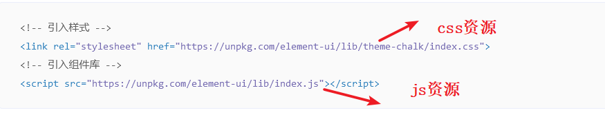
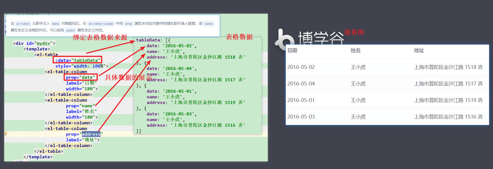

# ElementUI

# 1.ElementUI

~~~
mvvm:前端的一种开发模式
m:数据（model）
v:视图 (view)
vm:数据绑定到视图
vue:侧重于vm的开发的
elmentUI：基于vue的侧重于v的开发的前端框架。

~~~


# 2.ElementUI快速入门

~~~
1.将elementui的所有资源引入到工程中
2.引入elementui中的index.css和index.js资源
3.从官方去抄写组件

注意：需要引入vue.js文件，因为elementui是基于vue开发出来的
~~~


官网中的介绍：




~~~html
<!DOCTYPE html>
<html lang="en">
<head>
    <meta charset="UTF-8">
    <title>Title</title>
</head>
<!-- 引入样式 -->
<link rel="stylesheet" href="element-ui/lib/theme-chalk/index.css">
<!-- 引入组件库 -->
<script src="vue/vue.js"></script>
<script src="element-ui/lib/index.js"></script>
<body>

    <div id="mydiv">
        <el-row>
            <el-button>默认按钮</el-button>
            <el-button type="primary">主要按钮</el-button>
            <el-button type="success">成功按钮</el-button>
            <el-button type="info">信息按钮</el-button>

            <el-button type="danger">危险按钮</el-button>
        </el-row>

        <el-button type="warning">警告按钮</el-button>
    </div>
</body>
<script>

    new Vue({
        el:"#mydiv",
        data:{

        }
    });

</script>
</html>
~~~

# 3.elementui的组件

## 3.1 layout布局

~~~
elementui通过将一行平均分成了24等分，我们根据需要，选择其中指定的份数即可。

 <!--
            elementui将一行平均分成24等分，我们选择一块内容占据其中的指定份数即可。

            el-row:用来指定行，
            el-col:用来指定列的
                    span:用来指定占用24等分中的几份。

            通过 el-col中的属性进行响应式布局
                    :xs="8"    超小频
                    :sm="6"    small 小屏
                    :md="4"    middle 中等屏幕
                    :lg="3"    large 大屏幕
                    :xl="1"    超大屏
        -->
~~~


```html
<!DOCTYPE html>
<html lang="en">
<head>
    <meta charset="UTF-8">
    <title>Title</title>
    <style>
        .el-row {
            margin-bottom: 20px;
        }
        .el-col {
            border-radius: 4px;
        }
        .bg-purple-dark {
            background: #99a9bf;
        }
        .bg-purple {
            background: #d3dce6;
        }
        .bg-purple-light {
            background: #e5e9f2;
        }
        .grid-content {
            border-radius: 4px;
            min-height: 36px;
        }
        .row-bg {
            padding: 10px 0;
            background-color: #f9fafc;
        }
    </style>
</head>
<!-- 引入样式 -->
<link rel="stylesheet" href="element-ui/lib/theme-chalk/index.css">
<!-- 引入组件库 -->
<script src="vue/vue.js"></script>
<script src="element-ui/lib/index.js"></script>
<body>

    <div id="mydiv">
        <!--
            elementui将一行平均分成24等分，我们选择一块内容占据其中的指定份数即可。

            el-row:用来指定行，
            el-col:用来指定列的
                    span:用来指定占用24等分中的几份。

            通过 el-col中的属性进行响应式布局
                    :xs="8"    超小频
                    :sm="6"    small 小屏
                    :md="4"    middle 中等屏幕
                    :lg="3"    large 大屏幕
                    :xl="1"    超大屏
        -->
        <el-row>
            <el-col :span="24"><div class="grid-content bg-purple-dark"></div></el-col>
        </el-row>
        <el-row gutter="10">
            <el-col :span="12"><div class="grid-content bg-purple"></div></el-col>
            <el-col :span="12"><div class="grid-content bg-purple-light"></div></el-col>
        </el-row>
        <el-row>
            <el-col :span="8"><div class="grid-content bg-purple"></div></el-col>
            <el-col :span="8"><div class="grid-content bg-purple-light"></div></el-col>
            <el-col :span="8"><div class="grid-content bg-purple"></div></el-col>
        </el-row>
        <el-row>
            <el-col :span="6"><div class="grid-content bg-purple"></div></el-col>
            <el-col :span="6"><div class="grid-content bg-purple-light"></div></el-col>
            <el-col :span="6"><div class="grid-content bg-purple"></div></el-col>
            <el-col :span="6"><div class="grid-content bg-purple-light"></div></el-col>
        </el-row>
        <el-row>
            <el-col :span="4"><div class="grid-content bg-purple"></div></el-col>
            <el-col :span="4"><div class="grid-content bg-purple-light"></div></el-col>
            <el-col :span="4"><div class="grid-content bg-purple"></div></el-col>
            <el-col :span="4"><div class="grid-content bg-purple-light"></div></el-col>
            <el-col :span="4"><div class="grid-content bg-purple"></div></el-col>
            <el-col :span="4"><div class="grid-content bg-purple-light"></div></el-col>
        </el-row>
        <el-row>
            <el-col :span="7"><div style="height: 100px;" class="grid-content bg-purple"></div></el-col>

        </el-row>

        响应式布局
        <el-row :gutter="10">
            <el-col :xs="8" :sm="6" :md="4" :lg="3" :xl="1"><div class="grid-content bg-purple"></div></el-col>
            <el-col :xs="4" :sm="6" :md="8" :lg="9" :xl="11"><div class="grid-content bg-purple-light"></div></el-col>
            <el-col :xs="4" :sm="6" :md="8" :lg="9" :xl="11"><div class="grid-content bg-purple"></div></el-col>
            <el-col :xs="8" :sm="6" :md="4" :lg="3" :xl="1"><div class="grid-content bg-purple-light"></div></el-col>
        </el-row>
    </div>
</body>
<script>

    new Vue({
        el:"#mydiv",
        data:{

        }
    });

</script>
</html>
```


## 3.2 布局容器


~~~
 <el-container>：外层容器。当子元素中包含 <el-header> 或 <el-footer> 时，全部子元素会垂直上下排列，否则会水平左右排列。

            <el-header>：顶栏容器。

            <el-aside>：侧边栏容器。

            <el-main>：主要区域容器。

            <el-footer>：底栏容器。
~~~


```html
<!DOCTYPE html>
<html lang="en">
<head>
    <meta charset="UTF-8">
    <title>Title</title>
    <style>
        .el-header, .el-footer {
            background-color: #B3C0D1;
            color: #333;
            text-align: center;
            line-height: 60px;
        }

        .el-aside {
            background-color: #D3DCE6;
            color: #333;
            text-align: center;
            line-height: 200px;
        }

        .el-main {
            background-color: #E9EEF3;
            color: #333;
            text-align: center;
            line-height: 160px;
        }

        body > .el-container {
            margin-bottom: 40px;
        }

        .el-container:nth-child(5) .el-aside,
        .el-container:nth-child(6) .el-aside {
            line-height: 260px;
        }

        .el-container:nth-child(7) .el-aside {
            line-height: 320px;
        }
    </style>
</head>
<!-- 引入样式 -->
<link rel="stylesheet" href="element-ui/lib/theme-chalk/index.css">
<!-- 引入组件库 -->
<script src="vue/vue.js"></script>
<script src="element-ui/lib/index.js"></script>
<body>

    <div id="mydiv">
        <!--
            <el-container>：外层容器。当子元素中包含 <el-header> 或 <el-footer> 时，全部子元素会垂直上下排列，否则会水平左右排列。

            <el-header>：顶栏容器。

            <el-aside>：侧边栏容器。

            <el-main>：主要区域容器。

            <el-footer>：底栏容器。

        -->
        <el-container>
            <el-header>header</el-header>
            <!-- 嵌套另外一个容器-->
            <el-container>
                <el-aside>aside</el-aside>
                <el-main>main</el-main>
            </el-container>
        </el-container>
    </div>
</body>
<script>

    new Vue({
        el:"#mydiv",
        data:{

        }
    });

</script>
</html>
```


## 3.3 表单组件

~~~
Form 组件提供了表单验证的功能，只需要通过 rules 属性传入约定的验证规则，并将 Form-Item 的 prop 属性设置为需校验的字段名即可。
~~~

表单校验


```html
<!DOCTYPE html>
<html lang="en">
<head>
    <meta charset="UTF-8">
    <title>Title</title>
</head>
<!-- 引入样式 -->
<link rel="stylesheet" href="element-ui/lib/theme-chalk/index.css">
<!-- 引入组件库 -->
<script src="vue/vue.js"></script>
<script src="element-ui/lib/index.js"></script>
<body>

    <div id="mydiv">
        <el-form ref="form" :rules="rules"  :model="form" label-width="80px">
            <!--
                el-form-item : 定义一个表单向，label属性就是表单前面显示的内容
            -->
            <el-form-item label="活动名称" prop="name">
                <el-input v-model="form.name"></el-input>
            </el-form-item>


            <el-form-item label="活动区域" prop="region">
                <el-select v-model="form.region" placeholder="请选择活动区域">
                    <el-option label="区域一" value="shanghai"></el-option>
                    <el-option label="区域二" value="beijing"></el-option>
                </el-select>
            </el-form-item>


            <el-form-item label="活动时间">
                <el-col :span="11">
                    <el-date-picker type="date" placeholder="选择日期" v-model="form.date1" style="width: 100%;"></el-date-picker>
                </el-col>
                <el-col class="line" :span="2">-</el-col>
                <el-col :span="11">
                    <el-time-picker placeholder="选择时间" v-model="form.date2" style="width: 100%;"></el-time-picker>
                </el-col>
            </el-form-item>


            <el-form-item label="即时配送">
                <el-switch v-model="form.delivery"></el-switch>
            </el-form-item>


            <el-form-item label="活动性质">
                <el-checkbox-group v-model="form.type">
                    <el-checkbox label="美食/餐厅线上活动" name="type"></el-checkbox>
                    <el-checkbox label="地推活动" name="type"></el-checkbox>
                    <el-checkbox label="线下主题活动" name="type"></el-checkbox>
                    <el-checkbox label="单纯品牌曝光" name="type"></el-checkbox>
                </el-checkbox-group>
            </el-form-item>
            <el-form-item label="特殊资源">
                <el-radio-group v-model="form.resource">
                    <el-radio label="线上品牌商赞助"></el-radio>
                    <el-radio label="线下场地免费"></el-radio>
                </el-radio-group>
            </el-form-item>
            <el-form-item label="活动形式">
                <el-input type="textarea" v-model="form.desc"></el-input>
            </el-form-item>
            <el-form-item>
                <el-button type="primary" @click="submitForm('form')">立即创建</el-button>
                <el-button>取消</el-button>
            </el-form-item>
        </el-form>
    </div>
</body>
<script>

    new Vue({
        el:"#mydiv",
        data:{
            form: {
                name: '',
                region: '',
                date1: '',
                date2: '',
                delivery: false,
                type: [],
                resource: '',
                desc: ''
            },
            /**
             *  rule:定义校验的规则
             */
            rules: {
                name: [
                    //具体的校验规则,一个json表示一个规则
                    // {规则，规则校验失败的显示信息，什么情况下触发规则校验}
                    { required: true, message: '请输入活动名称', trigger: 'blur' },
                    { min: 3, max: 5, message: '长度在 3 到 5 个字符', trigger: 'blur' }
                ],
                region: [
                    { required: true, message: '请选择活动区域', trigger: 'change' }
                ],
                date1: [
                    { type: 'date', required: true, message: '请选择日期', trigger: 'change' }
                ],
                date2: [
                    { type: 'date', required: true, message: '请选择时间', trigger: 'change' }
                ],
                type: [
                    { type: 'array', required: true, message: '请至少选择一个活动性质', trigger: 'change' }
                ],
                resource: [
                    { required: true, message: '请选择活动资源', trigger: 'change' }
                ],
                desc: [
                    { required: true, message: '请填写活动形式', trigger: 'blur' }
                ]

            }
        },
        methods: {
            submitForm(formName) {
                this.$refs[formName].validate((valid) => {
                    if (valid) {
                        alert('submit!');
                    } else {
                        console.log('error submit!!');
                        return false;
                    }
                });
            }
        }
    });

</script>
</html>
```


## 3.4 表格组件

~~~
当el-table元素中注入data对象数组后，在el-table-column中用prop属性来对应对象中的键名即可填入数据，用label属性来定义表格的列名。可以使用width属性来定义列宽。
~~~





```html
<!DOCTYPE html>
<html lang="en">
<head>
    <meta charset="UTF-8">
    <title>Title</title>
</head>
<!-- 引入样式 -->
<link rel="stylesheet" href="element-ui/lib/theme-chalk/index.css">
<!-- 引入组件库 -->
<script src="vue/vue.js"></script>
<script src="element-ui/lib/index.js"></script>
<body>

    <div id="mydiv">
        <template>
            <el-table
                    :data="tableData"
                    style="width: 100%">
                <el-table-column
                        prop="date"
                        label="日期"
                        width="180">
                </el-table-column>
                <el-table-column
                        prop="name"
                        label="姓名"
                        width="180">
                </el-table-column>
                <el-table-column
                        prop="address"
                        label="地址">
                </el-table-column>
            </el-table>
        </template>
    </div>
</body>
<script>

    new Vue({
        el:"#mydiv",
        data:{
            tableData: [{
                date: '2016-05-02',
                name: '王小虎',
                address: '上海市普陀区金沙江路 1518 弄'
            }, {
                date: '2016-05-04',
                name: '王小虎',
                address: '上海市普陀区金沙江路 1517 弄'
            }, {
                date: '2016-05-01',
                name: '王小虎',
                address: '上海市普陀区金沙江路 1519 弄'
            }, {
                date: '2016-05-03',
                name: '王小虎',
                address: '上海市普陀区金沙江路 1516 弄'
            }]
        }
    });

</script>
</html>
```


自定义模板：


```html
<!DOCTYPE html>
<html lang="en">
<head>
    <meta charset="UTF-8">
    <title>Title</title>
</head>
<!-- 引入样式 -->
<link rel="stylesheet" href="element-ui/lib/theme-chalk/index.css">
<!-- 引入组件库 -->
<script src="vue/vue.js"></script>
<script src="element-ui/lib/index.js"></script>
<body>

    <div id="mydiv">
        <template>
            <el-table
                    :data="tableData"
                    style="width: 100%">
                <el-table-column
                        prop="date"
                        label="日期"
                        width="180">
                </el-table-column>
                <el-table-column
                        prop="name"
                        label="姓名"
                        width="180">
                </el-table-column>
                <el-table-column
                        prop="address"
                        label="地址">
                </el-table-column>
                <el-table-column
                        prop="url"
                        label="图片">
                    <template slot-scope="scope">
                        <el-image
                                style="width: 100px; height: 100px"
                                :src="scope.row.url"
                                :fit="fit"></el-image>
                    </template>
                </el-table-column>
            </el-table>
        </template>


        <template>
            <el-table
                    :data="tableData"
                    style="width: 100%">
                <el-table-column
                        label="日期"
                        width="180">
                    <template slot-scope="scope">
                        <i class="el-icon-time"></i>
                        <span style="margin-left: 10px">{{ scope.row.date }}</span>
                    </template>
                </el-table-column>
                <el-table-column
                        label="姓名"
                        width="180">
                    <template slot-scope="scope">
                        <el-popover trigger="hover" placement="top">
                            <p>姓名: {{ scope.row.name }}</p>
                            <p>住址: {{ scope.row.address }}</p>
                            <div slot="reference" class="name-wrapper">
                                <el-tag size="medium">{{ scope.row.name }}</el-tag>
                            </div>
                        </el-popover>
                    </template>
                </el-table-column>
                <el-table-column label="操作">
                    <template slot-scope="scope">
                        <el-button
                                size="mini"
                                @click="handleEdit(scope.$index, scope.row.name)">编辑</el-button>
                        <el-button
                                size="mini"
                                type="danger"
                                @click="handleDelete(scope.$index, scope.row)">删除</el-button>
                    </template>
                </el-table-column>
            </el-table>
        </template>
    </div>
</body>
<script>

    new Vue({
        el:"#mydiv",
        data:{
            tableData: [{
                date: '2016-05-02',
                name: '王小虎',
                address: '上海市普陀区金沙江路 1518 弄',
                url:'img/1.jpg'
            }, {
                date: '2016-05-04',
                name: '王小虎',
                address: '上海市普陀区金沙江路 1517 弄',
                url:'img/1.jpg'
            }, {
                date: '2016-05-01',
                name: '王小虎',
                address: '上海市普陀区金沙江路 1519 弄',
                url:'img/1.jpg'
            }, {
                date: '2016-05-03',
                name: '王小虎',
                address: '上海市普陀区金沙江路 1516 弄',
                url:'img/1.jpg'
            }]
        },
        methods: {
            handleEdit(index, row) {
                console.log(index, row);
            },
            handleDelete(index, row) {
                console.log(index, row);
            }
        }
    });

</script>
</html>
```


## 3.5 顶部导航条


```html
<!DOCTYPE html>
<html lang="en">
<head>
    <meta charset="UTF-8">
    <title>Title</title>
</head>
<!-- 引入样式 -->
<link rel="stylesheet" href="element-ui/lib/theme-chalk/index.css">
<!-- 引入组件库 -->
<script src="vue/vue.js"></script>
<script src="element-ui/lib/index.js"></script>
<body>

    <div id="mydiv">

        <el-menu
                :default-active="activeIndex2"
                class="el-menu-demo"
                mode="horizontal"
                @select="handleSelect"
                background-color="#545c64"
                text-color="#fff"
                active-text-color="#ffd04b">
            <el-menu-item index="1">处理中心</el-menu-item>
            <el-submenu index="2">
                <template slot="title">我的工作台</template>
                <el-menu-item index="2-1">选项1</el-menu-item>
                <el-menu-item index="2-2">选项2</el-menu-item>
                <el-menu-item index="2-3">选项3</el-menu-item>
                <el-submenu index="2-4">
                    <template slot="title">选项4</template>
                    <el-menu-item index="2-4-1">选项1</el-menu-item>
                    <el-menu-item index="2-4-2">选项2</el-menu-item>
                    <el-menu-item index="2-4-3">选项3</el-menu-item>
                </el-submenu>
            </el-submenu>
            <el-menu-item index="3" disabled>消息中心</el-menu-item>
            <el-menu-item index="4"><a href="https://www.ele.me" target="_blank">订单管理</a></el-menu-item>
        </el-menu>
    </div>
</body>
<script>

    new Vue({
        el:"#mydiv",
        data:{
            activeIndex: '1',
            activeIndex2: '1'
        },
        methods: {
            handleSelect(key, keyPath) {
                console.log(key, keyPath);
            }
        }
    });

</script>
</html>
```

## 3.6 侧边栏导航条


~~~html
<!DOCTYPE html>
<html lang="en">
<head>
    <meta charset="UTF-8">
    <title>Title</title>
</head>
<!-- 引入样式 -->
<link rel="stylesheet" href="element-ui/lib/theme-chalk/index.css">
<!-- 引入组件库 -->
<script src="vue/vue.js"></script>
<script src="element-ui/lib/index.js"></script>
<body>

    <div id="mydiv">
        <el-col :span="6">
            <h5>自定义颜色</h5>
            <el-menu
                    default-active="2"
                    class="el-menu-vertical-demo"
                    @open="handleOpen"
                    @close="handleClose"
                    background-color="#545c64"
                    text-color="#fff"
                    active-text-color="#ffd04b">
                <el-submenu index="1">
                    <template slot="title">
                        <i class="el-icon-location"></i>
                        <span>导航一</span>
                    </template>
                    <el-menu-item-group>
                        <template slot="title">分组一</template>
                        <el-menu-item index="1-1">选项1</el-menu-item>
                        <el-menu-item index="1-2">选项2</el-menu-item>
                    </el-menu-item-group>
                    <el-menu-item-group title="分组2">
                        <el-menu-item index="1-3">选项3</el-menu-item>
                    </el-menu-item-group>
                    <el-submenu index="1-4">
                        <template slot="title">选项4</template>
                        <el-menu-item index="1-4-1">选项1</el-menu-item>
                    </el-submenu>
                </el-submenu>
                <el-menu-item index="2">
                    <i class="el-icon-menu"></i>
                    <span slot="title">导航二</span>
                </el-menu-item>
                <el-menu-item index="3" disabled>
                    <i class="el-icon-document"></i>
                    <span slot="title">导航三</span>
                </el-menu-item>
                <el-menu-item index="4">
                    <i class="el-icon-setting"></i>
                    <span slot="title">导航四</span>
                </el-menu-item>
            </el-menu>
        </el-col>
    </div>
</body>
<script>

    new Vue({
        el:"#mydiv",
        data:{

        },
        methods: {
            handleOpen(key, keyPath) {
                console.log(key, keyPath);
            },
            handleClose(key, keyPath) {
                console.log(key, keyPath);
            }
        }
    });

</script>
</html>
~~~


# 4.案例（理解）

## 4.1 需求：


## 4.2 实现步骤：


## 4.3 代码实现：

### 4.3.1 布局

```html
<!DOCTYPE html>
<html lang="en">
<head>
    <meta charset="UTF-8">
    <title>Title</title>
    <style>
        .el-header, .el-footer {
            background-color: #B3C0D1;
            color: #333;
            text-align: center;
            line-height: 60px;
        }

        .el-aside {
            background-color: #D3DCE6;
            color: #333;
            text-align: center;
            line-height: 200px;
        }

        .el-main {
            background-color: #E9EEF3;
            color: #333;
            text-align: center;
            line-height: 160px;
        }

        body > .el-container {
            margin-bottom: 40px;
        }

        .el-container:nth-child(5) .el-aside,
        .el-container:nth-child(6) .el-aside {
            line-height: 260px;
        }

        .el-container:nth-child(7) .el-aside {
            line-height: 320px;
        }
    </style>
</head>
<!-- 引入样式 -->
<link rel="stylesheet" href="element-ui/lib/theme-chalk/index.css">
<!-- 引入组件库 -->
<script src="vue/vue.js"></script>
<script src="element-ui/lib/index.js"></script>
<body>

<div id="mydiv">
    <el-container>
        <el-header>Header</el-header>
        <el-container style="height: 580px;">
            <el-aside width="300px">Aside</el-aside>
            <el-main>Main</el-main>
        </el-container>
    </el-container>
</div>
</body>
<script>

    new Vue({
        el:"#mydiv",
        data:{

        }
    });

</script>
</html>
```

### 4.3.2 header实现

```html
<!-- 头部实现start-->
<el-header style="background-color:#545c64 ">
    <el-row>
        <el-col :span="2">
            <!-- 图片
                margin-top: 20px;  让当前标签顶部具体其他标签20px
            -->
            <el-image
                    style="margin-top: 20px;"
                    src="img/export.png"
                    :fit="fit"></el-image>
        </el-col>
        <el-col :span="22" >
            <!--
                 style="float: right;"  让子元素全部靠右
            -->
            <el-menu
                    :default-active="activeIndex2"
                    class="el-menu-demo"
                    mode="horizontal"
                    @select="handleSelect"
                    background-color="#545c64"
                    text-color="#fff"
                    active-text-color="#ffd04b"
                    style="float: right;"
            >
                <el-menu-item index="1">处理中心</el-menu-item>
                <el-submenu index="2">
                    <template slot="title">我的工作台</template>
                    <el-menu-item index="2-1">选项1</el-menu-item>
                    <el-menu-item index="2-2">选项2</el-menu-item>
                    <el-menu-item index="2-3">选项3</el-menu-item>
                    <el-submenu index="2-4">
                        <template slot="title">选项4</template>
                        <el-menu-item index="2-4-1">选项1</el-menu-item>
                        <el-menu-item index="2-4-2">选项2</el-menu-item>
                        <el-menu-item index="2-4-3">选项3</el-menu-item>
                    </el-submenu>
                </el-submenu>

                <el-menu-item index="4"><a href="https://www.ele.me" target="_blank">首页</a></el-menu-item>
            </el-menu>

        </el-col>
    </el-row>
</el-header>
<!-- 头部实现end-->
```

### 4.3.3 aside实现

```html
<el-aside width="300px">

    <el-menu
            default-active="2"
            class="el-menu-vertical-demo"
            @open="handleOpen"
            @close="handleClose"
            style="text-align: left;">
        <el-submenu index="1">
            <template slot="title">
                <i class="el-icon-menu"></i>
                <span>学工部</span>
            </template>
            <el-menu-item-group>
                <el-menu-item index="1-1">
                    <i class="el-icon-help"></i>
                    <span slot="title">在校学生管理</span>

                </el-menu-item>
                <el-menu-item index="1-2">
                    <i class="el-icon-help"></i>
                    <span slot="title">学生升级留级</span>

                </el-menu-item>
                <el-menu-item index="1-3">
                    <i class="el-icon-help"></i>
                    <span slot="title">学生就业情况</span>
                </el-menu-item>
            </el-menu-item-group>

        </el-submenu>
        <el-menu-item index="2">
            <i class="el-icon-menu"></i>
            <span slot="title">咨询部</span>
        </el-menu-item>

        <el-menu-item index="4">
            <i class="el-icon-menu"></i>
            <span slot="title">教研部</span>
        </el-menu-item>
    </el-menu>
</el-aside>
```

### 4.3.4 main实现

注意将抄写的main的样式给删掉。

```html
<!-- 主题内容开始-->
<el-main>
    <el-row>
        <el-col :span="2">
            <span style="color: red;font-size: larger;font-weight: bold;">学生列表</span>
        </el-col>
        <el-col :span="20">&nbsp;</el-col>
        <el-col :span="2">
            <el-button type="primary">添加学生</el-button>
        </el-col>
        
    </el-row>


            <!-- 表格-->
            <template>
                <el-table
                        :data="tableData"
                        style="width: 100%">
                    <el-table-column
                            label="日期"
                            width="180">
                        <template slot-scope="scope">
                            <i class="el-icon-time"></i>
                            <span style="margin-left: 10px">{{ scope.row.date }}</span>
                        </template>
                    </el-table-column>
                    <el-table-column
                            label="姓名"
                            width="180">
                        <template slot-scope="scope">
                            <el-popover trigger="hover" placement="top">
                                <p>姓名: {{ scope.row.name }}</p>
                                <p>住址: {{ scope.row.address }}</p>
                                <div slot="reference" class="name-wrapper">
                                    <el-tag size="medium">{{ scope.row.name }}</el-tag>
                                </div>
                            </el-popover>
                        </template>
                    </el-table-column>
                    <el-table-column
                            prop="address"
                            label="地址"
                            width="180">

                    </el-table-column>

                    <el-table-column label="操作">
                        <template slot-scope="scope">
                            <el-button
                                    size="mini"
                                    @click="handleEdit(scope.$index, scope.row)">编辑</el-button>
                            <el-button
                                    size="mini"
                                    type="danger"
                                    @click="handleDelete(scope.$index, scope.row)">删除</el-button>
                        </template>
                    </el-table-column>
                </el-table>
            </template>

</el-main>
```


### 4.3.5 整体代码

```html
<!DOCTYPE html>
<html lang="en">
<head>
    <meta charset="UTF-8">
    <title>Title</title>
    <style>
        .el-header, .el-footer {
            background-color: #B3C0D1;
            color: #333;
            text-align: center;
            line-height: 60px;
        }

        .el-aside {
            background-color: #D3DCE6;
            color: #333;
            text-align: center;
            line-height: 200px;
        }


        body > .el-container {
            margin-bottom: 40px;
        }

        .el-container:nth-child(5) .el-aside,
        .el-container:nth-child(6) .el-aside {
            line-height: 260px;
        }

        .el-container:nth-child(7) .el-aside {
            line-height: 320px;
        }
    </style>
</head>
<!-- 引入样式 -->
<link rel="stylesheet" href="element-ui/lib/theme-chalk/index.css">
<!-- 引入组件库 -->
<script src="vue/vue.js"></script>
<script src="element-ui/lib/index.js"></script>
<body>

<div id="mydiv">
    <el-container>
        <!-- 头部实现start-->
        <el-header style="background-color:#545c64 ">
            <el-row>
                <el-col :span="2">
                    <!-- 图片
                        margin-top: 20px;  让当前标签顶部具体其他标签20px
                    -->
                    <el-image
                            style="margin-top: 20px;"
                            src="img/export.png"
                            :fit="fit"></el-image>
                </el-col>
                <el-col :span="22" >
                    <!--
                         style="float: right;"  让子元素全部靠右
                    -->
                    <el-menu
                            :default-active="activeIndex2"
                            class="el-menu-demo"
                            mode="horizontal"
                            @select="handleSelect"
                            background-color="#545c64"
                            text-color="#fff"
                            active-text-color="#ffd04b"
                            style="float: right;"
                    >
                        <el-menu-item index="1">处理中心</el-menu-item>
                        <el-submenu index="2">
                            <template slot="title">我的工作台</template>
                            <el-menu-item index="2-1">选项1</el-menu-item>
                            <el-menu-item index="2-2">选项2</el-menu-item>
                            <el-menu-item index="2-3">选项3</el-menu-item>
                            <el-submenu index="2-4">
                                <template slot="title">选项4</template>
                                <el-menu-item index="2-4-1">选项1</el-menu-item>
                                <el-menu-item index="2-4-2">选项2</el-menu-item>
                                <el-menu-item index="2-4-3">选项3</el-menu-item>
                            </el-submenu>
                        </el-submenu>

                        <el-menu-item index="4"><a href="https://www.ele.me" target="_blank">首页</a></el-menu-item>
                    </el-menu>

                </el-col>
            </el-row>
        </el-header>
        <!-- 头部实现end-->
        <el-container style="height: 580px;">
            <!-- 侧边导航栏开始-->
            <el-aside width="300px">

                <el-menu
                        default-active="2"
                        class="el-menu-vertical-demo"
                        @open="handleOpen"
                        @close="handleClose"
                        style="text-align: left;">
                    <el-submenu index="1">
                        <template slot="title">
                            <i class="el-icon-menu"></i>
                            <span>学工部</span>
                        </template>
                        <el-menu-item-group>
                            <el-menu-item index="1-1">
                                <i class="el-icon-help"></i>
                                <span slot="title">在校学生管理</span>

                            </el-menu-item>
                            <el-menu-item index="1-2">
                                <i class="el-icon-help"></i>
                                <span slot="title">学生升级留级</span>

                            </el-menu-item>
                            <el-menu-item index="1-3">
                                <i class="el-icon-help"></i>
                                <span slot="title">学生就业情况</span>
                            </el-menu-item>
                        </el-menu-item-group>

                    </el-submenu>
                    <el-menu-item index="2">
                        <i class="el-icon-menu"></i>
                        <span slot="title">咨询部</span>
                    </el-menu-item>

                    <el-menu-item index="4">
                        <i class="el-icon-menu"></i>
                        <span slot="title">教研部</span>
                    </el-menu-item>
                </el-menu>
            </el-aside>
            <!-- 侧边导航栏结束-->
            <!-- 主题内容开始-->
            <el-main>
                <el-row>
                    <el-col :span="2">
                        <span style="color: red;font-size: larger;font-weight: bold;">学生列表</span>
                    </el-col>
                    <el-col :span="20">&nbsp;</el-col>
                    <el-col :span="2">
                        <el-button type="primary">添加学生</el-button>
                    </el-col>

                </el-row>


                        <!-- 表格-->
                        <template>
                            <el-table
                                    :data="tableData"
                                    style="width: 100%">
                                <el-table-column
                                        label="日期"
                                        width="180">
                                    <template slot-scope="scope">
                                        <i class="el-icon-time"></i>
                                        <span style="margin-left: 10px">{{ scope.row.date }}</span>
                                    </template>
                                </el-table-column>
                                <el-table-column
                                        label="姓名"
                                        width="180">
                                    <template slot-scope="scope">
                                        <el-popover trigger="hover" placement="top">
                                            <p>姓名: {{ scope.row.name }}</p>
                                            <p>住址: {{ scope.row.address }}</p>
                                            <div slot="reference" class="name-wrapper">
                                                <el-tag size="medium">{{ scope.row.name }}</el-tag>
                                            </div>
                                        </el-popover>
                                    </template>
                                </el-table-column>
                                <el-table-column
                                        prop="address"
                                        label="地址"
                                        width="600">

                                </el-table-column>

                                <el-table-column label="操作" fixed="right">
                                    <template slot-scope="scope">
                                        <el-button
                                                size="mini"
                                                @click="handleEdit(scope.$index, scope.row)">编辑</el-button>
                                        <el-button
                                                size="mini"
                                                type="danger"
                                                @click="handleDelete(scope.$index, scope.row)">删除</el-button>
                                    </template>
                                </el-table-column>
                            </el-table>
                        </template>

            </el-main>
            <!-- 主题内容结束-->
        </el-container>
    </el-container>
</div>
</body>
<script>

    new Vue({
        el:"#mydiv",
        data:{
            activeIndex2: '1',

            tableData: [{
                date: '2016-05-02',
                name: '王小虎',
                address: '上海市普陀区金沙江路 1518 弄'
            }, {
                date: '2016-05-04',
                name: '王小虎',
                address: '上海市普陀区金沙江路 1517 弄'
            }, {
                date: '2016-05-01',
                name: '王小虎',
                address: '上海市普陀区金沙江路 1519 弄'
            }, {
                date: '2016-05-03',
                name: '王小虎',
                address: '上海市普陀区金沙江路 1516 弄'
            }]

        },
        methods: {
            handleSelect(key, keyPath) {
                console.log(key, keyPath);
            },
            handleOpen(key, keyPath) {
                console.log(key, keyPath);
            },
            handleClose(key, keyPath) {
                console.log(key, keyPath);
            }
                }
    });

</script>
</html>
```


# 5.综合案例

~~~
后台全部写好了，我们只需要负责前端编写即可。
~~~

## 5.1 登录功能

~~~
1.添加一个用于错误信息显示的组件（elementui官网去找）
2.添加一个flag标记，该标记用于控制错误信息是否展示
3.点击事件，ajax请求登录
	a.提交表单数据
	b.登录成功，进行页面跳转
	c.登录失败，显示错误信息数据框（flag标记重置为true即可）
~~~


## 5.2 查询功能

#### 页面分析：


数据展示：


#### 后台分析：


#### 目的：（实现）


~~~
在sutdentlist.html页面，页面加载完成事件，请求分页的学生信息
1.请求的地址
2.请求的参数（分页参数和请求功能的参数）
3.响应体的处理（list是我们页面需要的数据）
~~~

代码实现：

~~~js
     created:function () {
            //页面加载完成事件，ajax请求所有的学生信息
            axios.get("studentServlet?method=selectByPage",{"params":this.pagination})
                .then(response=>{
                    //将响应体pageBean转换的json中的list取出来，赋值给tableData即可
                    this.tableData = response.data.list;
                })
        },
~~~


## 5.3 分页组件


代码：

```html
<!DOCTYPE html>
<html lang="en">
<head>
    <meta charset="UTF-8">
    <title>Title</title>
</head>
<!-- 引入样式 -->
<link rel="stylesheet" href="element-ui/lib/theme-chalk/index.css">
<!-- 引入组件库 -->
<script src="vue/vue.js"></script>
<script src="element-ui/lib/index.js"></script>
<body>

    <div id="mydiv">
        <div class="block">
            <span class="demonstration">页数较少时的效果</span>
            <el-pagination
                    @size-change="handleSizeChange"
                    @current-change="handleCurrentChange"
                    background
                    :page-size="50"
                    :current-page="2"
                    :page-sizes="[100, 200, 300, 400]"
                    layout="total,sizes,prev, pager, next,jumper"
                    :total="1000">
            </el-pagination>
        </div>
    </div>
</body>
<script>
    new Vue({
        el:"#mydiv",
        data:{

        },
        methods: {
            handleSizeChange(val) {
                console.log(`每页 ${val} 条`);
            },
            handleCurrentChange(val) {
                console.log(`当前页: ${val}`);
            }
        }
    });

</script>
</html>
```


## 5.4 分页组件运用到案例

~~~
实现目的：
1.告知分页组件的总条数
2.当前页码数发生变化，重新查询分页数据 （事件）
3.每页显示的数量发生变化，重新查询分页数据（事件）
~~~

#### 页面分析：


#### 代码实现：


```html
<!DOCTYPE html>
<html lang="en">
<head>
    <meta charset="UTF-8">
    <meta name="viewport" content="width=device-width, initial-scale=1.0">
    <title>学生管理系统</title>
    <link rel="stylesheet" href="element-ui/lib/theme-chalk/index.css">
    <script src="js/vue.js"></script>
    <script src="element-ui/lib/index.js"></script>
    <script src="js/axios-0.18.0.js"></script>
</head>
<body>
<div id="div">
    <b style="color: red; font-size: 20px;">学生列表</b>
    <div style="float: right;">
        <el-button type="primary" @click="showAddStu">添加学生</el-button>
    </div>
    <el-table :data="tableData">
        <el-table-column prop="number" label="学号" width="120">
        </el-table-column>
        <el-table-column prop="name" label="姓名" width="120">
        </el-table-column>
        <el-table-column prop="birthday" label="生日" width="140">
        </el-table-column>
        <el-table-column prop="address" label="地址">
        </el-table-column>
        <el-table-column label="操作" width="180">
          <template slot-scope="props">
              <el-button type="warning" @click="showEditStu(props.row)">编辑</el-button>
              <el-button type="danger" @click="deleteStu(props.row)">删除</el-button>
          </template>
        </el-table-column>
    </el-table>

    <!--
        分页组件
          @size-change： 当改变每页条数时触发的函数
          @current-change：当改变页码时触发的函数
          current-page ：默认的页码
          :page-sizes：每页条数选择框中显示的值
          :page-size : 默认的每页条数
          layout： 分页组件的布局
              total（总条数）, sizes(每页条数), prev（上一页）, pager(所有的页码), next(下一页), jumper（跳转页码）
          :total: 总条数
    -->
    <el-pagination
            @size-change="handleSizeChange"
            @current-change="handleCurrentChange"
            :current-page="pagination.currentPage"
            :page-sizes="[3,5,8]"
            :page-size="pagination.pageSize"
            layout="total, sizes, prev, pager, next, jumper"
            :total="pagination.total">
    </el-pagination>

    <el-dialog title="添加学生信息" :visible.sync="dialogTableVisible4add" @close="resetForm('addForm')">
        <!--
            :model="formData": 关联数据
            :rules: 关联校验规则
            ref： 在获取表单对象时使用
        -->
        <el-form :model="formData" :rules="rules" ref="addForm" label-width="100px" class="demo-ruleForm">
            <el-form-item label="学生学号" prop="number">
                <el-input v-model="formData.number"></el-input>
            </el-form-item>
            <el-form-item label="学生姓名" prop="name">
                <el-input v-model="formData.name"></el-input>
            </el-form-item>
            <el-form-item label="学生生日" prop="birthday">
                <!--v-model : 双向绑定 -->
                <el-input v-model="formData.birthday" type="date"></el-input>
            </el-form-item>
            <el-form-item label="学生地址" prop="address">
                <el-input v-model="formData.address"></el-input>
            </el-form-item>
            <el-form-item align="right">
                <el-button type="primary" @click="addStu()">添加</el-button>
                <el-button @click="resetForm('addForm')">重置</el-button>
            </el-form-item>
        </el-form>
    </el-dialog>

    <el-dialog title="编辑学生信息" :visible.sync="dialogTableVisible4edit" @close="resetForm('editForm')" >
        <!--
            :model="formData": 关联数据
            :rules: 关联校验规则
            ref： 在获取表单对象时使用
        -->
        <el-form :model="editFormData" :rules="rules" ref="editForm" label-width="100px" class="demo-ruleForm">
            <el-form-item label="学生学号" prop="number">
                <el-input v-model="editFormData.number"></el-input>
            </el-form-item>
            <el-form-item label="学生姓名" prop="name">
                <el-input v-model="editFormData.name"></el-input>
            </el-form-item>
            <el-form-item label="学生生日" prop="birthday">
                <!--v-model : 双向绑定 -->
                <el-input v-model="editFormData.birthday" type="date"></el-input>
            </el-form-item>
            <el-form-item label="学生地址" prop="address">
                <el-input v-model="editFormData.address"></el-input>
            </el-form-item>

            <el-form-item align="right">
                <el-button type="warning" @click="updateStu()">修改</el-button>
            </el-form-item>
        </el-form>
    </el-dialog>
</div>
</body>
<script>
    new Vue({
        el:"#div",
        data:{
            dialogTableVisible4add: false,  //添加窗口显示状态
            dialogTableVisible4edit: false, //编辑窗口显示状态
            formData:{},//添加表单的数据
            editFormData: {},//编辑表单的数据
            tableData:[],//表格数据
            pagination: {
                currentPage: 1, //当前页
                pageSize: 5,    //每页显示条数
                total: 0        //总条数
            },
            rules: {
                number: [
                    {required: true, message: '请输入学号', trigger: 'blur'},
                    {min: 2, max: 10, message: '长度在 2 到 10 个字符', trigger: 'blur'}
                ],
                name: [
                    {required: true, message: '请输入姓名', trigger: 'blur'},
                    {min: 2, max: 10, message: '长度在 2 到 10 个字符', trigger: 'blur'}
                ],
                birthday: [
                    {required: true, message: '请选择日期', trigger: 'change'}
                ],
                address: [
                    {required: true, message: '请输入地址', trigger: 'blur'},
                    {min: 2, max: 200, message: '长度在 2 到 200 个字符', trigger: 'blur'}
                ],
            }
        },
        created:function () {
            //页面加载完成事件，ajax请求所有的学生信息
            this.selectByPage();
        },
        methods:{
            //分页查询
            selectByPage:function () {
                axios.get("studentServlet?method=selectByPage",{"params":this.pagination})
                    .then(response=>{
                        //将响应体pageBean转换的json中的list取出来，赋值给tableData即可
                        this.tableData = response.data.list;
                        //获取总页码数
                        this.pagination.total = response.data.sum;
                    })
            },
            //改变每页条数时执行的函数
            handleSizeChange(pageSize) {
                //修改分页查询的参数
                this.pagination.pageSize = pageSize;
                //重新执行查询
                this.selectByPage();
            },
            //改变页码时执行的函数
            handleCurrentChange(pageNum) {
                //修改分页查询的参数
                this.pagination.currentPage = pageNum;
                //重新执行查询
                this.selectByPage();
            },
            showAddStu() {
                //弹出窗口
                this.dialogTableVisible4add = true;
            },
            resetForm(addForm) {
                //双向绑定，输入的数据都赋值给了formData， 清空formData数据
                this.formData = {};
                //清除表单的校验数据
                this.$refs[addForm].resetFields();
            },
            showEditStu(row) {
                //1. 弹出窗口
                this.dialogTableVisible4edit = true;

                //2. 显示表单数据
                this.editFormData = {
                    number:row.number,
                    name:row.name,
                    birthday:row.birthday,
                    address:row.address,
                }
            }
        }
    });
</script>
</html>
```


