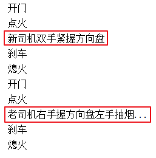

# day01【复习回顾、继承、抽象类】

## 今日内容

- 面向对象复习
- 继承
- 抽象类
- 模板设计模式

## 教学目标

- [ ] 能够写出类的继承格式
- [ ] 能够说出类继承的三个特点
- [ ] 能够说出继承中子类访问成员的特点
- [ ] 能够说出继承中方法重写的使用场景
- [ ] 能够说出this和super的使用方式及其区别
- [ ] 能够定义抽象类和抽象方法
- [ ] 能够使用含有抽象方法的抽象类
- [ ] 能够说出父类抽象方法的存在意义


# 第一章 复习回顾

## 1 如何定义类

类的定义格式如下:

```java
修饰符 class 类名{
    // 类中的五大成分。
    // 1.成员变量（属性）
    // 2.成员方法 (行为) 
    // 3.构造器 （初始化类的对象数据的）
    // 4.内部类
    // 5.代码块
}
```

例如:

```java
public class Student {
    // 1.成员变量
    public String name ;
    public char sex ; // '男'  '女'
    public int age;
}
```


## 2 如何通过类创建对象

```java
类名 对象名称 = new 类名();
```

例如:

```java
Student stu = new Student();
```


## 3 封装

#### 3.1 封装的步骤

1.使用 `private` 关键字来修饰成员变量。

2.使用`public`修饰getter和setter方法。

#### 3.2 封装的步骤实现

1. private修饰成员变量

```java
public class Student {
    private String name;
    private int age;
}
```

2. public修饰getter和setter方法

```java
public class Student {
    private String name;
    private int age;

    public void setName(String n) {
      	name = n;
    }

    public String getName() {
      	return name;
    }

    public void setAge(int a) {
        if (a > 0 && a <200) {
            age = a;
        } else {
            System.out.println("年龄非法！");
        }
    }

    public int getAge() {
      	return age;
    }
}
```


## 4 构造器

### 4.1 构造器的作用

通过调用构造器可以返回一个类的对象，构造器同时负责帮我们把对象的数据（属性和行为等信息）初始化好。

### 4.2 构造器的格式

```java
修饰符 类名(形参列表) {
    // 构造体代码，执行代码
}
```

### 4.3 构造器的应用

首先定义一个学生类，代码如下：

```java
public class Student {
    // 1.成员变量
    public String name;
    public int age;

    // 2.构造器
    public Student() {
		System.out.println("无参数构造器被调用")；
    }
}
```

接下来通过调用构造器得到两个学生对象。

```java
public class CreateStu02 {
    public static void main(String[] args) {
        // 创建一个学生对象
        // 类名 变量名称 = new 类名();
        Student s1 = new Student();
        // 使用对象访问成员变量，赋值
        s1.name = "张三";
        s1.age = 20 ;

        // 使用对象访问成员变量 输出值
        System.out.println(s1.name);
        System.out.println(s1.age); 

        Student s2 = new Student();
        // 使用对象访问成员变量 赋值
        s2.name = "李四";
        s2.age = 18 ;
        System.out.println(s2.name);
        System.out.println(s2.age);
    }
}
```


## 5 this关键字的作用

### 5.1 this关键字的作用

this代表所在类的当前对象的引用（地址值），即代表当前对象。

### 5.2 this关键字的应用

#### 5.2.1 用于普通的gettter与setter方法

this出现在实例方法中，谁调用这个方法（哪个对象调用这个方法），this就代表谁（this就代表哪个对象）。

```java
public class Student {
    private String name;
    private int age;

    public void setName(String name) {
      	this.name = name;
    }

    public String getName() {
      	return name;
    }

    public void setAge(int age) {
        if (age > 0 && age < 200) {
            this.age = age;
        } else {
            System.out.println("年龄非法！");
        }
    }

    public int getAge() {
      	return age;
    }
}
```

#### 5.2.2 用于构造器中

this出现在构造器中，代表构造器正在初始化的那个对象。

```java
public class Student {
    private String name;
    private int age;
    
    // 无参数构造方法
    public Student() {} 
    
    // 有参数构造方法
    public Student(String name,int age) {
    	this.name = name;
    	this.age = age; 
    }
}
```


## 6 匿名对象

**什么是匿名对象：就是指"没有名字"的对象。**

> 有名字的对象：

~~~java
Scanner sc = new Scanner(System.in);
~~~

> 匿名对象：

~~~java
new Scanner(System.in);
~~~

**匿名对象的使用情景**

> 链式编程：

~~~java
public class Demo{
    public static void main(String[] args){
        //如果我们只需要从控制台接收一次数据-一个年龄值
        System.out.println("请输入你的年龄：");
        int age = new Scanner(System.in).nextInt();//匿名对象
        System.out.println("你的年龄是：" + age);
    }
}
~~~

> 作为实参：

~~~java
public class Demo{
    public static void main(String[] args){
        int age = getAge(new Scanner(System.in));//匿名对象
        System.out.println("你的年龄是：" + age);
    }
    //以下方法接收一个Scanner对象，用于从控制台接收一个年龄值并返回
    public static int getAge(Scanner sc){
        System.out.println("请输入你的年龄：");
        int age = sc.nextInt();
        return age
    }
}
~~~


# 第二章 继承 

## 1 概述

### 1.1 引入

假如我们要定义如下类:
学生类,老师类和工人类，分析如下：

1. 学生类
   属性:姓名,年龄
   行为:吃饭,睡觉
2. 老师类
   属性:姓名,年龄，薪水
   行为:吃饭,睡觉，教书
3. 班主任
   属性:姓名,年龄，薪水
   行为:吃饭,睡觉，管理


如果我们定义了这三个类去开发一个系统，那么这三个类中就存在大量重复的信息（属性:姓名，年龄。行为：吃饭，睡觉）。这样就导致了相同代码大量重复，代码显得很臃肿和冗余，那么如何解决呢？

假如多个类中存在相同属性和行为时，我们可以将这些内容抽取到单独一个类中，那么多个类无需再定义这些属性和行为，只要**继承**那一个类即可。如图所示：


其中，多个类可以称为**子类**，单独被继承的那一个类称为**父类**、**超类（superclass）**或者**基类**。


### 1.2 继承的含义

继承描述的是事物之间的所属关系，这种关系是：`is-a` 的关系。例如，兔子属于食草动物，食草动物属于动物。可见，父类更通用，子类更具体。我们通过继承，可以使多种事物之间形成一种关系体系。

**继承**：就是子类继承父类的**属性**和**行为**，使得子类对象可以直接具有与父类相同的属性、相同的行为。子类可以直接访问父类中的**非私有**的属性和行为。

### 1.3 继承的好处

1. 提高**代码的复用性**（减少代码冗余，相同代码重复利用）。
2. 使类与类之间产生了关系。


## 2 继承的格式

通过 `extends` 关键字，可以声明一个子类继承另外一个父类，定义格式如下：

```java
class 父类 {
	...
}

class 子类 extends 父类 {
	...
}
```

**需要注意：Java是单继承的，一个类只能继承一个直接父类，跟现实世界很像，但是Java中的子类是更加强大的。**


## 3 继承案例

### 3.1 案例

请使用继承定义以下类:

1. 学生类
   属性:姓名,年龄
   行为:吃饭,睡觉
2. 老师类
   属性:姓名,年龄，薪水
   行为:吃饭,睡觉，教书
3. 班主任
   属性:姓名,年龄，薪水
   行为:吃饭,睡觉，管理


### 3.2 案例图解分析

老师类，学生类，还有班主任类，实际上都是属于人类的，我们可以定义一个人类，把他们相同的属性和行为都定义在人类中，然后继承人类即可，子类特有的属性和行为就定义在子类中了。

如下图所示。


### 3.3 案例代码实现

**1.父类Human类**

```java
 public class Human {
    // 合理隐藏
    private String name ;
    private int age ;
	
    // 合理暴露
    public String getName() {
        return name;
    }

    public void setName(String name) {
        this.name = name;
    }

    public int getAge() {
        return age;
    }

    public void setAge(int age) {
        this.age = age;
    }
 }
```

**5.子类Teacher类**

```java
public class Teacher extends Human {
    // 工资
    private double salary ;
    
    // 特有方法
    public void teach(){
        System.out.println("老师在认真教技术！")；
    }

    public double getSalary() {
        return salary;
    }

    public void setSalary(double salary) {
        this.salary = salary;
    }
}
```

**3.子类Student类**

```java
public class Student extends Human{
 
}
```

**4.子类BanZhuren类**

```java 
public class Teacher extends Human {
    // 工资
    private double salary ;
    
       // 特有方法
    public void admin(){
        System.out.println("班主任强调纪律问题！")；
    }
    
    public double getSalary() {
        return salary;
    }

    public void setSalary(double salary) {
        this.salary = salary;
    }
}
```

**5.测试类**

```java
  public class Test {
      public static void main(String[] args) {
          Teacher dlei = new Teacher();
          dlei.setName("播仔");
          dlei.setAge("31");
          dlei.setSalary(1000.99);
          System.out.println(dlei.getName());
          System.out.println(dlei.getAge());
          System.out.println(dlei.getSalary());
          dlei.teach();
          
          BanZhuRen linTao = new BanZhuRen();
          linTao.setName("灵涛");
          linTao.setAge("28");
          linTao.setSalary(1000.99);
          System.out.println(linTao.getName());
          System.out.println(linTao.getAge());
          System.out.println(linTao.getSalary());
          linTao.admin();

          Student xugan = new Student();
          xugan.setName("播仔");
          xugan.setAge("31");
          //xugan.setSalary(1000.99); // xugan没有薪水属性，报错！
          System.out.println(xugan.getName());
          System.out.println(xugan.getAge());


      }
  }
```


### 3.4 小结

1. 继承实际上是子类相同的属性和行为可以定义在父类中，子类特有的属性和行为由自己定义，这样就实现了相同属性和行为的重复利用，从而提高了代码复用。

2. 子类继承父类，就可以直接得到父类的成员变量和方法。是否可以继承所有成员呢？请看下节！


## 4 子类不能继承的内容

### 4.1 引入

并不是父类的所有内容都可以给子类继承的：

**子类不能继承父类的构造器，因为子类有自己的构造器。**

**值得注意的是子类可以继承父类的私有成员（成员变量，方法），只是子类无法直接访问而已，可以通过getter/setter方法访问父类的private成员变量。**

### 4.1 演示代码

```java
public class Demo03 {
    public static void main(String[] args) {
        Zi z = new Zi();
        System.out.println(z.num1);
//		System.out.println(z.num2); // 私有的子类无法使用
        // 通过getter/setter方法访问父类的private成员变量
        System.out.println(z.getNum2());

        z.show1();
        // z.show2(); // 私有的子类无法使用
    }
}

class Fu {
    public int num1 = 10;
    private int num2 = 20;

    public void show1() {
        System.out.println("show1");
    }

    private void show2() {
        System.out.println("show2");
    }

    public int getNum2() {
        return num2;
    }

    public void setNum2(int num2) {
        this.num2 = num2;
    }
}

class Zi extends Fu {
}
```


## 5 继承后的特点—成员变量

当类之间产生了继承关系后，其中各类中的成员变量，又产生了哪些影响呢？

### 5.1 成员变量不重名

如果子类父类中出现**不重名**的成员变量，这时的访问是**没有影响的**。代码如下：

```java
class Fu {
	// Fu中的成员变量
	int num = 5;
}
class Zi extends Fu {
	// Zi中的成员变量
	int num2 = 6;
  
	// Zi中的成员方法
	public void show() {
		// 访问父类中的num
		System.out.println("Fu num="+num); // 继承而来，所以直接访问。
		// 访问子类中的num2
		System.out.println("Zi num2="+num2);
	}
}
class Demo04 {
	public static void main(String[] args) {
        // 创建子类对象
		Zi z = new Zi(); 
      	// 调用子类中的show方法
		z.show();  
	}
}

演示结果：
Fu num = 5
Zi num2 = 6
```

### 5.2 成员变量重名

如果子类父类中出现**重名**的成员变量，这时的访问是**有影响的**。代码如下：

```java
class Fu1 {
	// Fu中的成员变量。
	int num = 5;
}
class Zi1 extends Fu1 {
	// Zi中的成员变量
	int num = 6;
  
	public void show() {
		// 访问父类中的num
		System.out.println("Fu num=" + num);
		// 访问子类中的num
		System.out.println("Zi num=" + num);
	}
}
class Demo04 {
	public static void main(String[] args) {
      	// 创建子类对象
		Zi1 z = new Zi1(); 
      	// 调用子类中的show方法
		z1.show(); 
	}
}
演示结果：
Fu num = 6
Zi num = 6
```

子父类中出现了同名的成员变量时，子类会优先访问自己对象中的成员变量。如果此时想访问父类成员变量如何解决呢？我们可以使用super关键字。

### 5.3  super访问父类成员变量

子父类中出现了同名的成员变量时，在子类中需要访问父类中非私有成员变量时，需要使用`super` 关键字，修饰父类成员变量，类似于之前学过的 `this` 。

需要注意的是：**super代表的是父类对象的引用，this代表的是当前对象的引用。**

**使用格式：**

```java
super.父类成员变量名
```

子类方法需要修改，代码如下：

```java
class Fu {
	// Fu中的成员变量。
	int num = 5;
}

class Zi extends Fu {
	// Zi中的成员变量
	int num = 6;
  
	public void show() {
        int num = 1;
      
        // 访问方法中的num
        System.out.println("method num=" + num);
        // 访问子类中的num
        System.out.println("Zi num=" + this.num);
        // 访问父类中的num
        System.out.println("Fu num=" + super.num);
	}
}

class Demo04 {
	public static void main(String[] args) {
      	// 创建子类对象
		Zi1 z = new Zi1(); 
      	// 调用子类中的show方法
		z1.show(); 
	}
}

演示结果：
method num=1
Zi num=6
Fu num=5
```

> 小贴士：Fu 类中的成员变量是非私有的，子类中可以直接访问。若Fu 类中的成员变量私有了，子类是不能直接访问的。通常编码时，我们遵循封装的原则，使用private修饰成员变量，那么如何访问父类的私有成员变量呢？对！可以在父类中提供公共的getXxx方法和setXxx方法。


## 6 继承后的特点—成员方法

当类之间产生了关系，其中各类中的成员方法，又产生了哪些影响呢？

### 6.1 成员方法不重名

如果子类父类中出现**不重名**的成员方法，这时的调用是**没有影响的**。对象调用方法时，会先在子类中查找有没有对应的方法，若子类中存在就会执行子类中的方法，若子类中不存在就会执行父类中相应的方法。代码如下：

```java
class Fu {
	public void show() {
		System.out.println("Fu类中的show方法执行");
	}
}
class Zi extends Fu {
	public void show2() {
		System.out.println("Zi类中的show2方法执行");
	}
}
public  class Demo05 {
	public static void main(String[] args) {
		Zi z = new Zi();
     	//子类中没有show方法，但是可以找到父类方法去执行
		z.show(); 
		z.show2();
	}
}
```

### 6.2 成员方法重名

如果子类父类中出现**重名**的成员方法，则创建子类对象调用该方法的时候，子类对象会优先调用自己的方法。

代码如下：

```java
class Fu {
	public void show() {
		System.out.println("Fu show");
	}
}
class Zi extends Fu {
	//子类重写了父类的show方法
	public void show() {
		System.out.println("Zi show");
	}
}
public class ExtendsDemo05{
	public static void main(String[] args) {
		Zi z = new Zi();
     	// 子类中有show方法，只执行重写后的show方法
		z.show();  // Zi show
	}
}
```


## 7 方法重写

### 7.1 概念

**方法重写** ：子类中出现与父类一模一样的方法时（返回值类型，方法名和参数列表都相同），会出现覆盖效果，也称为重写或者复写。**声明不变，重新实现**。

### 7.2 使用场景与案例

发生在子父类之间的关系。
子类继承了父类的方法，但是子类觉得父类的这方法不足以满足自己的需求，子类重新写了一个与父类同名的方法，以便覆盖父类的该方 法。

例如：我们定义了一个动物类代码如下：

```java
public class Animal  {
    public void run(){
        System.out.println("动物跑的很快！");
    }
    public void cry(){
        System.out.println("动物都可以叫~~~");
    }
}
```

然后定义一个猫类，猫可能认为父类cry()方法不能满足自己的需求

代码如下：

```java
public class Cat extends Animal {
    public void cry(){
        System.out.println("我们一起学猫叫，喵喵喵！喵的非常好听！");
    }
}

public class Test {
	public static void main(String[] args) {
      	// 创建子类对象
      	Cat ddm = new Cat()；
        // 调用父类继承而来的方法
        ddm.run();
      	// 调用子类重写的方法
      	ddm.cry();
	}
}
```

### 7.2 @Override重写注解

- @Override:注解，重写注解校验！

- 这个注解标记的方法，就说明这个方法必须是重写父类的方法，否则编译阶段报错。

- 建议重写都加上这个注解，一方面可以提高代码的可读性，一方面可以防止重写出错！

  加上后的子类代码形式如下：

  ```java
  public class Cat extends Animal {
       // 声明不变，重新实现
      // 方法名称与父类全部一样，只是方法体中的功能重写写了！
      @Override
      public void cry(){
          System.out.println("我们一起学猫叫，喵喵喵！喵的非常好听！");
      }
  }
  ```

### 7.3 注意事项

1. 方法重写是发生在子父类之间的关系。
2. 子类方法覆盖父类方法，必须要保证权限大于等于父类权限。
3. 子类方法覆盖父类方法，返回值类型、函数名和参数列表都要一模一样。


## 8 继承后的特点—构造器

### 8.1 引入

当类之间产生了关系，其中各类中的构造器，又产生了哪些影响呢？
首先我们要回忆两个事情，构造器的定义格式和作用。

1. 构造器的名字是与类名一致的。所以子类是无法继承父类构造方法的。
2. 构造器的作用是初始化对象成员变量数据的。所以子类的初始化过程中，必须先执行父类的初始化动作。子类的构造方法中默认有一个`super()` ，表示调用父类的构造方法，父类成员变量初始化后，才可以给子类使用。（**先有爸爸，才能有儿子**）

**继承后子类构造器特点:子类所有构造器的第一行都会先调用父类的无参构造器，再执行自己**

### 8.2 案例演示

按如下需求定义类:

1. 人类
   成员变量: 姓名,年龄
   成员方法: 吃饭
2. 学生类
   成员变量: 姓名,年龄,成绩
   成员方法: 吃饭

代码如下：

```java
class Person {
    private String name;
    private int age;

    public Person() {
        System.out.println("父类无参");
    }

    // getter/setter省略
}

class Student extends Person {
    private double score;

    public Student() {
        //super(); // 调用父类无参,默认就存在，可以不写，必须再第一行
        System.out.println("子类无参");
    }
    
     public Student(double score) {
        //super();  // 调用父类无参,默认就存在，可以不写，必须再第一行
        this.score = score;    
        System.out.println("子类有参");
     }

}

public class Demo07 {
    public static void main(String[] args) {
        Student s1 = new Student();
        System.out.println("----------");
        Student s2 = new Student(99.9);
    }
}

输出结果：
父类无参
子类无参
----------
父类无参
子类有参
```

### 8.3 小结

- 子类构造器执行的时候，都会在第一行默认先调用父类无参数构造器一次。
- 子类构造器的第一行都隐含了一个**super()**去调用父类无参数构造器，**super()**可以省略不写。


## 9 super(...)和this(...)

### 9.1  引入

请看上节中的如下案例：

```java 
class Person {
    private String name;
    private int age;

    public Person() {
        System.out.println("父类无参");
    }

    // getter/setter省略
}

class Student extends Person {
    private double score;

    public Student() {
        //super(); // 调用父类无参构造器,默认就存在，可以不写，必须再第一行
        System.out.println("子类无参");
    }
    
     public Student(double score) {
        //super();  // 调用父类无参构造器,默认就存在，可以不写，必须再第一行
        this.score = score;    
        System.out.println("子类有参");
     }
      // getter/setter省略
}

public class Demo07 {
    public static void main(String[] args) {
        // 调用子类有参数构造器
        Student s2 = new Student(99.9);
        System.out.println(s2.getScore()); // 99.9
        System.out.println(s2.getName()); // 输出 null
        System.out.println(s2.getAge()); // 输出 0
    }
}
```

我们发现，子类有参数构造器只是初始化了自己对象中的成员变量score，而父类中的成员变量name和age依然是没有数据的，怎么解决这个问题呢，我们可以借助与super(...)去调用父类构造器，以便初始化继承自父类对象的name和age.

### 9.2 super和this的用法格式

super和this完整的用法如下，其中this，super访问成员我们已经接触过了。

```java
this.成员变量    	--    本类的
super.成员变量    	--    父类的

this.成员方法名()  	--    本类的    
super.成员方法名()   --    父类的
```

接下来我们使用调用构造器格式：

```java
super(...) -- 调用父类的构造器，根据参数匹配确认
this(...) -- 调用本类的其他构造器，根据参数匹配确认
```

### 9.3 super(....)用法演示

代码如下：

```java
class Person {
    private String name ="凤姐";
    private int age = 20;

    public Person() {
        System.out.println("父类无参");
    }
    
    public Person(String name , int age){
        this.name = name ;
        this.age = age ;
    }

    // getter/setter省略
}

class Student extends Person {
    private double score = 100;

    public Student() {
        //super(); // 调用父类无参构造器,默认就存在，可以不写，必须再第一行
        System.out.println("子类无参");
    }
    
     public Student(String name ， int age，double score) {
        super(name ,age);// 调用父类有参构造器Person(String name , int age)初始化name和age
        this.score = score;    
        System.out.println("子类有参");
     }
      // getter/setter省略
}

public class Demo07 {
    public static void main(String[] args) {
        // 调用子类有参数构造器
        Student s2 = new Student("张三"，20，99);
        System.out.println(s2.getScore()); // 99
        System.out.println(s2.getName()); // 输出 张三
        System.out.println(s2.getAge()); // 输出 20
    }
}
```

**注意：**

**子类的每个构造方法中均有默认的super()，调用父类的空参构造。手动调用父类构造会覆盖默认的super()。**

**super() 和 this() 都必须是在构造方法的第一行，所以不能同时出现。**

super(..)是根据参数去确定调用父类哪个构造器的。


### 9.4 super(...)案例图解

**父类空间优先于子类对象产生**

在每次创建子类对象时，先初始化父类空间，再创建其子类对象本身。目的在于子类对象中包含了其对应的父类空间，便可以包含其父类的成员，如果父类成员非private修饰，则子类可以随意使用父类成员。代码体现在子类的构造七调用时，一定先调用父类的构造器。理解图解如下：


### 9.5 this(...)用法演示

this(...)

- 默认是去找本类中的其他构造器，根据参数来确定具体调用哪一个构造器。
- 为了借用其他构造器的功能。

```java
package com.itheima._08this和super调用构造器;
/**
 * this(...):
 *    默认是去找本类中的其他构造器，根据参数来确定具体调用哪一个构造器。
 *    为了借用其他构造器的功能。
 *
 */
public class ThisDemo01 {
    public static void main(String[] args) {
        Student xuGan = new Student();
        System.out.println(xuGan.getName()); // 输出:徐干
        System.out.println(xuGan.getAge());// 输出:21
        System.out.println(xuGan.getSex());// 输出： 男
    }
}

class Student{
    private String name ;
    private int age ;
    private char sex ;

    public Student() {
  // 很弱，我的兄弟很牛逼啊，我可以调用其他构造器：Student(String name, int age, char sex)
        this("徐干",21,'男');
    }

    public Student(String name, int age, char sex) {
        this.name = name ;
        this.age = age   ;
        this.sex = sex   ;
    }

    public String getName() {
        return name;
    }

    public void setName(String name) {
        this.name = name;
    }

    public int getAge() {
        return age;
    }

    public void setAge(int age) {
        this.age = age;
    }

    public char getSex() {
        return sex;
    }

    public void setSex(char sex) {
        this.sex = sex;
    }
}
```

### 9.6 小结

- **子类的每个构造方法中均有默认的super()，调用父类的空参构造。手动调用父类构造会覆盖默认的super()。**
- **super() 和 this() 都必须是在构造方法的第一行，所以不能同时出现。**
- **super(..)和this(...)是根据参数去确定调用父类哪个构造器的。**
- super(..)可以调用父类构造器初始化继承自父类的成员变量的数据。
- this(..)可以调用本类中的其他构造器。

## 10 继承的特点

1. Java只支持单继承，不支持多继承。

```java
  // 一个类只能有一个父类，不可以有多个父类。
  class A {}
  class B {}
  class C1 extends A {} // ok
  // class C2 extends A, B {} // error
```

2. 一个类可以有多个子类。

```java
  // A可以有多个子类
  class A {}
  class C1 extends A {}
  class C2 extends  A {}
```

3. 可以多层继承。

```java
  class A {}
  class C1 extends A {}
  class D extends C1 {}
```

> 顶层父类是Object类。所有的类默认继承Object，作为父类。


# 第三章 抽象类

## 1 概述

### 1.1 抽象类引入

父类中的方法，被它的子类们重写，子类各自的实现都不尽相同。那么父类的方法声明和方法主体，只有声明还有意义，而方法主体则没有存在的意义了(因为子类对象会调用自己重写的方法)。换句话说，父类可能知道子类应该有哪个功能，但是功能具体怎么实现父类是不清楚的（由子类自己决定），父类完全只需要提供一个没有方法体的方法签名即可，具体实现交给子类自己去实现。**我们把没有方法体的方法称为抽象方法。Java语法规定，包含抽象方法的类就是抽象类**。

- **抽象方法** ： 没有方法体的方法。
- **抽象类**：包含抽象方法的类。


## 2 abstract使用格式

**abstract是抽象的意思，用于修饰方法方法和类，修饰的方法是抽象方法，修饰的类是抽象类。**

### 2.1 抽象方法

使用`abstract` 关键字修饰方法，该方法就成了抽象方法，抽象方法只包含一个方法名，而没有方法体。

定义格式：

```java
修饰符 abstract 返回值类型 方法名 (参数列表)；
```

代码举例：

```java
public abstract void run()；
```

### 2.2 抽象类

如果一个类包含抽象方法，那么该类必须是抽象类。**注意：抽象类不一定有抽象方法，但是有抽象方法的类必须定义成抽象类。**

定义格式：

```java
abstract class 类名字 { 
  
}
```

代码举例：

```java
public abstract class Animal {
    public abstract void run()；
}
```

### 2.3 抽象类的使用

**要求**：继承抽象类的子类**必须重写父类所有的抽象方法**。否则，该子类也必须声明为抽象类。

代码举例：

```java
// 父类,抽象类
abstract class Employee {
	private String id;
	private String name;
	private double salary;
	
	public Employee() {
	}
	
	public Employee(String id, String name, double salary) {
		this.id = id;
		this.name = name;
		this.salary = salary;
	}
	
	// 抽象方法
	// 抽象方法必须要放在抽象类中
	abstract public void work();
}

// 定义一个子类继承抽象类
class Manager extends Employee {
	public Manager() {
	}
	public Manager(String id, String name, double salary) {
		super(id, name, salary);
	}
	// 2.重写父类的抽象方法
	@Override
	public void work() {
		System.out.println("管理其他人");
	}
}

// 定义一个子类继承抽象类
class Cook extends Employee {
	public Cook() {
	}
	public Cook(String id, String name, double salary) {
		super(id, name, salary);
	}
	@Override
	public void work() {
		System.out.println("厨师炒菜多加点盐...");
	}
}

// 测试类
public class Demo10 {
	public static void main(String[] args) {
		// 创建抽象类,抽象类不能创建对象
		// 假设抽象类让我们创建对象,里面的抽象方法没有方法体,无法执行.所以不让我们创建对象
//		Employee e = new Employee();
//		e.work();
		
		// 3.创建子类
		Manager m = new Manager();
		m.work();
		
		Cook c = new Cook("ap002", "库克", 1);
		c.work();
	}
}
```

此时的方法重写，是子类对父类抽象方法的完成实现，我们将这种方法重写的操作，也叫做**实现方法**。


## 3 抽象类的特征

抽象类的特征总结起来可以说是 **有得有失**

**有得：抽象类得到了拥有抽象方法的能力。**

**有失：抽象类失去了创建对象的能力。**

其他成员（构造器，实例方法，静态方法等）抽象类都是具备的。


## 4 抽象类的注意事项

关于抽象类的使用，以下为语法上要注意的细节，虽然条目较多，但若理解了抽象的本质，无需死记硬背。

1. 抽象类**不能创建对象**，如果创建，编译无法通过而报错。只能创建其非抽象子类的对象。

   > 理解：假设创建了抽象类的对象，调用抽象的方法，而抽象方法没有具体的方法体，没有意义。

2. 抽象类中，可以有构造器，是供子类创建对象时，初始化父类成员使用的。

   > 理解：子类的构造方法中，有默认的super()，需要访问父类构造方法。

3. 抽象类中，不一定包含抽象方法，但是有抽象方法的类必定是抽象类。

   > 理解：未包含抽象方法的抽象类，目的就是不想让调用者创建该类对象，通常用于某些特殊的类结构设计。

4. 抽象类的子类，必须重写抽象父类中**所有的**抽象方法，否则子类也必须定义成抽象类，编译无法通过而报错。 

   > 理解：假设不重写所有抽象方法，则类中可能包含抽象方法。那么创建对象后，调用抽象的方法，没有意义。

5. 抽象类存在的意义是为了被子类继承，抽象类体现的是模板思想。

   > 理解：抽象类中已经实现的是模板中确定的成员，抽象类不确定如何实现的定义成抽象方法，交给具体的子类去实现。


## 5 抽象类存在的意义

抽象类存在的意义是为了被子类继承，否则抽象类将毫无意义，**抽象类体现的是模板思想**，模板是通用的东西抽象类中已经是具体的实现（抽象类中可以有成员变量和实现方法），而模板中不能决定的东西定义成抽象方法，让使用模板（继承抽象类的类）的类去重写抽象方法实现需求，这是典型的模板思想。


## 6 第一个设计模式：模板模式

我们现在使用抽象类设计一个模板模式的应用，例如在小学的时候，我们经常写作文，通常都是有模板可以套用的。假如我现在需要定义新司机和老司机类，新司机和老司机都有开车功能，开车的步骤都一样，只是驾驶时的姿势有点不同，`新司机:开门,点火,双手紧握方向盘,刹车,熄火`，`老司机:开门,点火,右手握方向盘左手抽烟,刹车,熄火`。我们可以将固定流程写到父类中，不同的地方就定义成抽象方法，让不同的子类去重写，代码如下:

```java
// 司机开车的模板类
public abstract class Driver {
    public void go() {
        System.out.println("开门");
        System.out.println("点火");
        // 开车姿势不确定?定义为抽象方法
        ziShi();
        System.out.println("刹车");
        System.out.println("熄火");
    }

    public abstract void ziShi();
}
```

现在定义两个使用模板的司机：

```java
public class NewDriver extends Driver {

    @Override
    public void ziShi() {
        System.out.println("新司机双手紧握方向盘");
    }
}

public class OldDriver extends Driver {
    @Override
    public void ziShi() {
        System.out.println("老司机右手握方向盘左手抽烟...");
    }
}
```

编写测试类

```java
public class Demo02 {
    public static void main(String[] args) {
        NewDriver nd = new NewDriver();
        nd.go();

        OldDriver od = new OldDriver();
        od.go();
    }
}
```

运行效果



**可以看出，模板模式的优势是，模板已经定义了通用架构，使用者只需要关心自己需要实现的功能即可！非常的强大！**