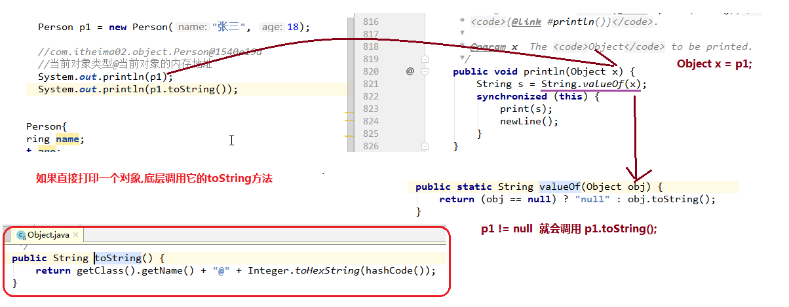

# day03 课堂笔记

## 今日内容 (API)

> API : application programming interface 应用程序接口
>
> 编程所使用的类和方法等

- Object类
- 时间日期类
- Math类
- System类
- BigInteger类
- BigDecimal类
- Arrays类
- 包装类
- String类的常用方法


## 教学目标

- [ ] 能够说出Object类的特点

  > 所有类的父类,包括数组

- [ ] 能够重写Object类的toString 和 equals方法

  >0. 快捷键 alt +insert 
  >1. 重写toString : 打印对象的属性值,方便测试
  >2. 重写equals : 比较属性是否一致

- [ ] 能够使用Date类获取当前系统时间

  > new Date().getTime()
  >
  > 更好用 System.currentTimeMills();

- [ ] 能够使用DateFormat完成日期的格式化和解析

  > sdf = new SimpleDateFormat("yyyy-MM-dd, HH-mm-ss");
  >
  > string = sdf.format(date)
  >
  > date = sdf.parse(string)

- [ ] 能够使用Calendar类的get、set、add方法操作日历时间

- [ ] 能够使用Math类的abs、ceil、floor、pow、round方法

- [ ] 能够使用System类的currentTimeMillis方法获取时间

- [ ] 能够说出BigInteger可以解决的问题

  > 大整数计算问题

- [ ] 能够说出BigDecimal可以解决的问题

  > 小数计算精度问题

- [ ] 能够使用Arrays类的sort、toString方法

- [ ] 能够说出自动装箱、自动拆箱的概念

- [ ] 能够完成基本数据类型与字符串之间的转换

  > int  = Integer.parseInt(String)
  >
  > string = String.valueof(int)

- [ ] 能够熟悉String类常用方法的功能及使用

# 第零章 内部类

```markdown
#内部类
1. 概念
		将一个类A定义在另一个类B里面，里面的那个类A就称为内部类(inner class)，B则称为外部类
2. 按位置分
	1). 成员内部类
		I. 类A在类B成员位置(类中方法外)
		II. 本质上,访问特点跟成员变量或方法是一样的
	2). 方法内部类
		I. 类A在类B的方法中
		II. 本质上,访问特点跟局部变量是一样的
3. 匿名内部类(重点)
	1). 匿名内部类是没有类名的方法内部类
	2). 语法
		 	1). 将类的定义和对象创建二合一的简略语法
            2). 语法
                new 父类的类名/父接口的接口名(){ // 类体
                    重写方法
                }
            3). 特点
                I. 隐藏了类名
                II. 创建的是子类对象
    3). 总结            
 			1. 匿名内部类的运用场景:
                    method1方法的参数类型为(抽象类或接口类型)
                    那么我们在调用method01,经常使用匿名内部类

            2. 匿名内部类是简略语法
                    定义类+创建对象 二合一

            3. 匿名内部类也是类,只能没有类名
                编译出来
                    当前类$数字.class
                    Demo03$1.class
```


```java
package com.itheima01.innerclass;
/*
*   源码.java  -> 字节码 .class  -> 运行
*
*
*   B$A.class  表示  A是B的内部类
*
* */
public class Demo01 {

    public static void main(String[] args) {
        B b = new B();
        b.field = 1;
        B.A a = b.new A();

        a.innerField = 2;
    }
}
/*
*   类体
*   1. 成员变量
*   2. 方法
*   3. 构造方法
*   4. 内部类
*   5. 代码块
* */
class B{
    int field;//成员位置: 类中方法外
    public void method(){
//        A a = new A();
//        a.innerField = 1;
    }

    //成员内部类
    class A{
        int innerField;
        public void innerMethod(){

        }
    }
}

```


```java
package com.itheima01.innerclass;

public class Demo02 {

    public static void main(String[] args) {

        //没有变量名的对象: 匿名对象
        new D();

    }
}
class D{
    //成员内部类
    class A{

    }
    public void method1(){
        //方法内部类
        class E{
            int field;
        }

        E e = new E();
        e.field = 2;
    }
    public void method2(){
        A a = new A();

    }
}
```


```java
package com.itheima01.innerclass;

public class Demo03 {
    void method01(){
        class Wolf extends Animal{
            @Override
            public void sing() {
                System.out.println("狼嗷嗷叫");
            }
        }
    }
    public static void main(String[] args) {

        Dog dog = new Dog();
        method01(dog);

        //匿名对象, 用来传参
        method01(new Cat());

        //方法内部类
        //1.定义类
        class Wolf extends Animal{
            @Override
            public void sing() {
                System.out.println("狼嗷嗷叫");
            }
        }
        //2. 创建对象
        Animal w = new Wolf();
        method01(w);

        /*
            匿名内部类
            1). 将类的定义和对象创建二合一的简略语法
            2). 语法
                new 父类的类名/父接口的接口名(){ // 类体
                    重写方法
                }
            3). 特点
                I. 隐藏了类名
                II. 创建的是子类对象

         */
//        Animal qd = new Animal(); //错的,抽象类不能创建实例
        Animal qd = new Animal(){
            @Override
            public void sing() {
                System.out.println("嘎嘎叫");
            }
        };

        method01(qd);

        /*
            匿名内部类的匿名对象写法
            1. 匿名内部类的运用场景:
                    method1方法的参数类型为(抽象类或接口类型)
                    那么我们在调用method01,经常使用匿名内部列

            2. 匿名内部类是简略语法
                    定义类+创建对象 二合一

            3. 匿名内部类也是类,只能没有类名
                编译出来
                    当前类$数字.class
                    Demo03$1.class
         */

        method01(new Animal(){
            @Override
            public void sing() {
                System.out.println("呱呱叫");
            }
        });
    }

    //让动物唱歌
    private static void method01(Animal a) {
        a.sing();
    }
}
abstract class Animal{
    public abstract void sing();
}
class Dog extends Animal{
    @Override
    public void sing() {
        System.out.println("狗汪汪叫");
    }
}
class Cat extends Animal{
    @Override
    public void sing() {
        System.out.println("猫喵喵叫");
    }
}
```


# 第一章 Object类

## 1 概述

```markdown
# Object类
1. 在java,所有类都直接或间接的继承Object(根类)
	1). 如果一个类不显式继承任何一个类,那么它隐式继承Object
	2). 数组也是引用类型,它的父类也是Object
	
2. Object类中的方法是所有对象都拥有的方法,很重要(今天先学两个)
	1). String toString() 
          返回该对象的字符串表示。 
    2). boolean equals(Object obj) 
          指示其他某个对象是否与此对象“相等”。       
```


## 2 toString方法

```markdown
1. 在java中,直接打印一个对象,底层会调用它的toString方法
2. Object中的toString方法源码:
	public String toString() {
        return getClass().getName() + "@" + Integer.toHexString(hashCode());
    }
    //当前对象的类名 @ 当前对象的内存地址
    
3. toString方法的应用   
	1). 打印一个对象的类型和内存地址往往没有意义
	2). 打印这个对象的属性值更有意义
	3). 所以我们要重写这个类的toString方法
	4). idea也有快捷键: alt + insert -> toString
	
4. 总结:
	1). 在java中,直接打印一个对象,底层会调用它的toString方法
	2). 而我们以后会经常重写一个类的toString方法,改变它的打印内容(打印这个对象的属性值)
	3). idea快捷键: alt + insert -> toString
```


  


```java
package com.itheima02.object;

public class Demo01 {

    public static void main(String[] args) {
        //向上转型
        Object a = new A();

        Object b = new B();

        //数组也是引用类型,存储在堆中
        int[] array = {1,2,3};
        String[] array2 = {"a","b"};

        Object obj = array;
        Object obj2 = array2;
    }
}
class A{

}
class B extends A{

}
```


```java
package com.itheima02.object;

public class Demo02 {

    public static void main(String[] args) {

        Person p1 = new Person("张三", 18);

        //com.itheima02.object.Person@1540e19d
        //当前对象类型@当前对象的内存地址
        System.out.println(p1);
        System.out.println(p1.toString());
    }
}
class Person{
    String name;
    int age;

    public Person(String name, int age) {
        this.name = name;
        this.age = age;
    }

   /* @Override
    public String toString() {
//        String result = "Person(name="+name+",age="+age+")";
//        return result;
        return "Person(name="+name+",age="+age+")";
    }*/

    @Override
    public String toString() {
        return "Person{" +
                "name='" + name + '\'' +
                ", age=" + age +
                '}';
    }
}
```


## 3 equals方法

```markdown
1. Object的equals方法比较的就是内存地址
         public boolean equals(Object obj) {
            return (this == obj);
        }
2. equals方法应用
	1). Object的equals方法这么设计是没有意义的
	2). 如果我们要比较两个对象的内存地址是否一致,直接用 ==
	3). 如果我们要比较一些有意义的内存,需要重写equals方法!!!
		a. String 类已经重写了equals方法 : 比较字面值
	4). idea快捷键
    	alt + insert -> equals and hashcode(先忽略)
```


```java
package com.itheima02.object;

import java.util.Arrays;
import java.util.Objects;

public class Demo03 {

    public static void main(String[] args) {

        Student s1 = new Student("张三", 18);
        Student s2 = new Student("张三", 18);

        //引用类型,比较内存地址
        System.out.println(s1 == s2); //false
        //Object的equals方法比较的就是内存地址
        System.out.println(s1.equals(s2));//false -> true

        int a = 1;
        int b = 1;
        //基本类型比较字面值
        System.out.println(a == b);//true

        String s3 = new String("abc");
        String s4 = new String("abc");
        System.out.println(s3 == s4);//false
        System.out.println(s3.equals(s4));//true
    }
}
class Student{
    String name;
    int age;

    public Student(String name, int age) {
        this.name = name;
        this.age = age;
    }

    //需求: 如果两个对象的所有属性值一一相同,那么从业务上认为是同一个人
    //s1.equals(s2)
    //this = s1
    //obj = s2
    public boolean equals2(Object obj) {
        //判断内存地址如果一致,肯定是同一个人
        if(this == obj){
            return true;
        }
        //obj如果不是Student类型,return false
        if(!(obj instanceof Student)){
            return false;
        }
        //地址不一样,先比较name,再比较age
        //obj是Student类型
        Student s2 = (Student) obj;
//        if(!name.equals(s2.name)){
//            return false;
//        }
//        if(age != s2.age){
//            return false;
//        }
//
//        return true;
        return name.equals(s2.name) && age == s2.age;
    }


    @Override
    public boolean equals(Object o) {
        //判断内存地址如果一致,肯定是同一个人
            // 如果代码块只有一句,可以省略大括号
        if (this == o)  return true;
        // o 如果不是Student类型,return false
            // 短路或,左边为false,右边才执行
            // o肯定不是null,才会执行右边,右边调用o对象的方法,这样设计避免空指针异常
            //  Class<?> getClass()  返回此 Object 的运行时类。
            // 举个例子 Object obj = new Student(); obj的运行时类是Student
            // this.getClass() 是Student
        if (o == null || this.getClass() != o.getClass()) return false;
        //强转, 不会ClassCastException
        Student student = (Student) o;
        //先比较age,再比较name
            // Objects.equals(v1,v2) 等价于v1.equals(v2)
            // 规避了空指针异常
            // return (a == b) || (a != null && a.equals(b));
        // 工具类: Objects 是 Object的工具类,很多工具方法往往是静态的
        return age == student.age &&
                Objects.equals(name, student.name);
    }


    @Override
    public String toString() {
        return "Student{" +
                "name='" + name + '\'' +
                ", age=" + age +
                '}';
    }
}

```


## 4 native本地方法

```markdown
# idea的快捷键:
	shift 连续按两下: idea全局搜索框

1. 引入
	1). Object是所有类的终极父类
	2). 当我们使用某个类的时候, jvm回去加载这个类
	3). 如果这个类存在继承关系,先加载父类,再加载子类
	4). 所以我们使用到任何一个类,都要先加载Object类
	5). static代码块随着类的加载而执行
	6). Object源码
		public class Object {
            private static native void registerNatives();
            static {
                registerNatives();
            }
		...
2. 本地方法
	1). 本地方法用native关键字修饰
	2). 本地方法没有方法体
		I. 抽象方法(abstract) : 真没有
		II. 本地方法 : 实际上有方法体,但是不是用java语言编写,用c/c++写的(在jvm内部), 这些内容跟硬件有关系的代码(内存,cpu)
	3). 编程语言
    	I. 机器语言 (二进制: 0和1)
    		计算机底层: 集成电路(元件,二极管) 开关 
    	II. 汇编语言 , 有阅读性, 运行时还是要转换成二进制
        III. 高级语言
        	a. 面向过程 c (computer language)
        	b. 面向对象 java 
        	
        # 编程语言的发展是牺牲效率为代价,提高阅读性 	
   4). JVM运行内存(5大区域)
   		I. 堆 heap    存储对象
   		II. 栈 stack   执行方法的
   		III. 方法区 method area   存储字节码
   		IIII. 本地方法栈 native method stack  运行本地方法的
   		IIIII. 程序计数器  cpu运行有关
```


## 5 Objects类

在刚才IDEA自动重写equals代码中，使用到了`java.util.Objects`类，那么这个类是什么呢？

在**JDK7**添加了一个Objects工具类，它提供了一些方法来操作对象，它由一些静态的实用方法组成，这些方法是null-save（空指针安全的）或null-tolerant（容忍空指针的），用于计算对象的hashCode、返回对象的字符串表示形式、比较两个对象。

在比较两个对象的时候，Object的equals方法容易抛出空指针异常，而Objects类中的equals方法就优化了这个问题。方法如下：

- `public static boolean equals(Object a, Object b)`:判断两个对象是否相等。

我们可以查看一下源码，学习一下：

```java
public static boolean equals(Object a, Object b) {  
    return (a == b) || (a != null && a.equals(b));  
}
```


# 第二章 Date类

## 1概述

` java.util.Date`类 表示特定的瞬间，精确到毫秒。

```markdown
1. 构造方法
	1). Date()   默认获取系统当前时间
	2). Date(long date)  获取时间原点到date的时间

2. 时间原点: 1970年1月1号 0时分秒  GMT(格林威治标准时间)
```


```java
package com.itheima03.date;
//工具 util
import java.util.Date;

public class Demo01 {

    public static void main(String[] args) {

        /*
            Thu Oct 08  14:05:11 CST 2020

            周四 10月8号 14:05:11 china standard time 2020

            Date记录某个时刻,如果不特意说明,它是系统当前时间
            (java运行在jvm , jvm又在当前系统之上)
         */
        //创建日期对象
        Date date = new Date();
        System.out.println(date);

        /*
        * Thu Jan 01 08:00:00 CST 1970
        * 周四 1月1号 8点  中国标准时间 1970年
        *
        *   时间原点: 1970年1月1号 0时分秒  GMT(格林威治标准时间)
        *       javascript / unix系统
        *
        *  参数: 时间原点 + 参数(毫秒) = 打印的时间
        *       1s = 1000ms
        * */
        Date date2 = new Date(0L);
        System.out.println(date2);

    }
}

```


## 2 常用方法

Date类中的多数方法已经过时，常用的方法有：

- `public long getTime()` 把日期对象转换成对应的时间毫秒值。
- `public void setTime(long time)` 把方法参数给定的毫秒值设置给日期对象

示例代码

```java
package com.itheima03.date;

import java.util.Date;

public class Demo02 {

    public static void main(String[] args) {
        //系统当前时间
        Date date = new Date();
        //获取时间原点到系统当前时间的毫秒值
        long time = date.getTime();
        System.out.println(time); //1602138270447毫秒
        System.out.println(time/1000/60/60/24/365);//50年


        Date date2 = new Date();
        // 时间原点 + 1000毫秒 
        date2.setTime(1000);
        //Thu Jan 01 08:00:01 CST 1970
        System.out.println(date2);

    }
}

```


# 第三章 DateFormat类

## 1概述

`java.text.DateFormat` 是日期/时间格式化子类的抽象类，我们通过这个类可以帮我们完成日期和文本之间的转换,也就是可以在Date对象与String对象之间进行来回转换。

- **格式化**：按照指定的格式，把Date对象转换为String对象。(**format**)
- **解析**：按照指定的格式，把String对象转换为Date对象。(**parse**)


```java
package com.itheima03.date;

import java.text.ParseException;
import java.text.SimpleDateFormat;
import java.util.Date;

public class Demo03 {

    public static void main(String[] args) throws ParseException {
        //获取系统当前时间
        Date date = new Date();
        System.out.println(date);
        /*
            需求: Date对象 格式化成  String对象

            1. 创建日期格式化对象
                抽象父类 DateFormat  (无法实例化)
                子类 SimpleDateFormat

            2. new SimpleDateFormat(String pattern)
                pattern 模式 (模板)
                模式字母:
                    y : year
                    M : month
                    d : day
                    H : hour
                    m : minute
                    s : second
         */
        // SimpleDateFormat sdf = new SimpleDateFormat("yyyy-MM-dd,HH-mm-ss");
        SimpleDateFormat sdf = new SimpleDateFormat("yyyy年MM月dd日,HH时mm分ss秒");
        //格式化: Date对象 按照指定格式  变成String
        String time = sdf.format(date);
        System.out.println(time);

        System.out.println("------------");

        //解析: String -> Date
        String s = "1995-01-01";
        SimpleDateFormat sdf2 = new SimpleDateFormat("yyyy-MM-dd");
        //如果模式跟字符串对应不上,报错 ParseException 解析异常
        Date date2 = sdf2.parse(s);
        //Sun Jan 01 00:00:00 CST 1995
        System.out.println(date2);
    }
}

```


```java
package com.itheima03.date;

import com.sun.org.apache.bcel.internal.generic.NEW;

import java.text.ParseException;
import java.text.SimpleDateFormat;
import java.util.Date;
import java.util.Scanner;

/*
*   需求: 你活了多少天?
*       1. 先接收用户输入的生日(String)
*
*       2. 公式:
*               (当前时间的毫秒值 - 用户生日的毫秒值) / 1000 / 3600 / 24
*
*            当前时间的毫秒值: new Date().getTime();
*
*            用户生日毫秒值
*               String      ->       Date -> getTime
*                   SimpleDateFormat
* */
public class Demo04 {
    public static void main(String[] args) throws ParseException {
        // 1. 先接收用户输入的生日(String)
        System.out.println("请输入你的生日: (yyyy-MM-dd)");
        Scanner sc = new Scanner(System.in);
        String time = sc.nextLine();

        //2. 获取当前时间毫秒值
        long currentTime = new Date().getTime();

        //3. 获取用户生日毫秒值
        SimpleDateFormat sdf = new SimpleDateFormat("yyyy-MM-dd");
        Date date = sdf.parse(time);
        long birthTime = date.getTime();

        //4. 计算
        long day = (currentTime - birthTime) / 1000 /3600/ 24;
        System.out.println("恭喜你,活了" + day +"天了");

    }
}

```


# 第四章 Calendar类

## 1 概述

- java.util.Calendar类表示一个“日历类”，可以进行日期运算。它是一个抽象类，不能创建对象，我们可以使用它的子类：java.util.GregorianCalendar类。
- 有两种方式可以获取GregorianCalendar对象：
  - 直接创建GregorianCalendar对象；
  - 通过Calendar的静态方法getInstance()方法获取GregorianCalendar对象【本次课使用】


## 2 常用方法

| 方法名                                | 说明                                                         |
| ------------------------------------- | ------------------------------------------------------------ |
| public static Calendar getInstance()  | 获取一个它的子类GregorianCalendar对象。                      |
| public int get(int field)             | 获取某个字段的值。field参数表示获取哪个字段的值，<br />可以使用Calender中定义的常量来表示：<br />Calendar.YEAR : 年<br />Calendar.MONTH ：月<br />Calendar.DAY_OF_MONTH：月中的日期<br />Calendar.HOUR：小时<br />Calendar.MINUTE：分钟<br />Calendar.SECOND：秒<br />Calendar.DAY_OF_WEEK：星期 |
| public void set(int field,int value)  | 设置某个字段的值                                             |
| public void add(int field,int amount) | 为某个字段增加/减少指定的值                                  |


```java
package com.itheima04.calendar;

import java.util.Calendar;

public class Demo01 {

    public static void main(String[] args) {

        /*
        *   1.  Calendar.getInstance()
        *       1). 底层会创建Calender子类对象
        *       2). 根据系统当前时区,地区等信息获取该地区所使用的日历
        *           (此方法不受地域限制)
        *
        *    2. 问题:
        *       为什么要这样获取实例,而不是直接创建子类实例
        *
        *    3. 在我们当前的场景下
        *       因为中国大陆使用公历,所以c实际上是GregorianCalendar实例(公历)
        *
        *    4. 西方的月份
        *       0~11 对应的是我们  1~12月
        * */
        Calendar c = Calendar.getInstance();
        System.out.println(c);

        /*
        * 方法
        *  get (field)
        *       获取field对应的值
        *
        *  set (field,value)
        *       设置field对应的值
        *
        *  add(field,value)
        *       在field基础上添加值 (预售期)
        *
        * */
//        c.set(Calendar.YEAR,1919);
//        c.set(Calendar.DAY_OF_MONTH,35);

        c.add(Calendar.DAY_OF_MONTH,30);

        int year = c.get(Calendar.YEAR);//年
        int month = c.get(Calendar.MONTH) + 1; // 月
        int day = c.get(Calendar.DAY_OF_MONTH); // 一个月中的第几天
        int hour = c.get(Calendar.HOUR_OF_DAY); //一天中第几个小时
        int minute = c.get(Calendar.MINUTE); // 分钟
        int second = c.get(Calendar.SECOND); // 秒
        int ms = c.get(Calendar.MILLISECOND); // 毫秒
        System.out.println(year + "-" + month + "-" + day);
        System.out.println(hour + "-" + minute + "-" + second + "-" + ms);


    }
}

```


# 第五章 Math类

## 1 概述

- java.lang.Math(类): Math包含执行基本数字运算的方法。
- 它不能创建对象，它的构造方法被“私有”了。而且他内部都是“静态方法”，通过“类名”直接调用即可。


## 2 常用方法

| 方法名                                       | 说明                |
| -------------------------------------------- | ------------------- |
| public static int abs(int a)                 | 获取参数a的绝对值： |
| public static double ceil(double a)          | 向上取整            |
| public static double floor(double a)         | 向下取整            |
| public static double pow(double a, double b) | 获取a的b次幂        |
| public static long round(double a)           | 四舍五入取整        |


## 3 示例代码

~~~java
package com.itheima05.math;
//language 语言
import java.lang.Math;
public class Demo01 {

    public static void main(String[] args) {

        //absolute : 绝对值
        int abs = Math.abs(-3);
        System.out.println(abs);//3

        // ceil: 天花板(向上取整)
        double ceil = Math.ceil(-3.1);
        System.out.println(ceil);//-3.0

        // floor: 地板(向下取整)
        double floor = Math.floor(3.1);
        System.out.println(floor);//3.0

        // pow : 幂运算(2个10次方)
        double pow = Math.pow(2, 10);
        System.out.println(pow);//1024.0

        // round : 大约(四舍五入)
        long round = Math.round(3.14);
        System.out.println(round);//3
        
    }
}

~~~


# 第六章 System

## 1 概述

`java.lang.System`类中提供了大量的静态方法，可以获取与系统相关的信息或系统级操作。


## 2 常用方法

| 方法名                                   | 说明                                             |
| ---------------------------------------- | ------------------------------------------------ |
| public   static void exit(int status)    | 终止当前运行的   Java   虚拟机，非零表示异常终止 |
| public   static long currentTimeMillis() | 返回当前时间(以毫秒为单位)                       |

```java
package com.itheima05.math;

import java.util.Date;

public class Demo02 {

    public static void main(String[] args) {
        /*
        *   获取当前系统时间毫秒值
        *   推荐:
        *        long time = System.currentTimeMillis();
        *
        *   原因: 无需创建对象,节省内存,提高效率
        * */
        long time = System.currentTimeMillis();
        System.out.println(time);

        Date date = new Date();
        long time2 = date.getTime();
        System.out.println(time2);

        while(true){
            System.out.println("xxxxxx");
            //中止JVM, java程序无法运行
            System.exit(0);
        }
    }
}

```


## 3 练习

在控制台输出1-10000，计算这段代码执行了多少毫秒 

```java
import java.util.Date;
//验证for循环打印数字1-9999所需要使用的时间（毫秒）
public class SystemDemo {
    public static void main(String[] args) {
       	//获取当前时间毫秒值
       System.out.println(System.currentTimeMillis()); 
      //计算程序运行时间
       long start = System.currentTimeMillis();
        for (int i = 1; i <= 10000; i++) {
            System.out.println(i);
        }
        long end = System.currentTimeMillis();
        System.out.println("共耗时毫秒：" + (end - start));
    }  
}
```


# 第七章 BigInteger类

## 1 概述

java.math.BigInteger 类，不可变的任意精度的整数。如果运算中，数据的范围超过了long类型后，可以使用
BigInteger类实现，该类的计算整数是不限制长度的。


## 2 构造方法

BigInteger(String value) 将 BigInteger 的十进制字符串表示形式转换为 BigInteger。超过long类型的范围，已经不能称为数字了，因此构造方法中采用字符串的形式来表示超大整数，将超大整数封装成BigInteger对象。


## 3 成员方法

BigInteger类提供了对很大的整数进行加、减、乘、除的方法，注意：都是与另一个BigInteger对象进行运算。

| 方法声明                   | 描述                                                         |
| -------------------------- | ------------------------------------------------------------ |
| add(BigInteger value)      | 返回其值为 (this + val) 的 BigInteger，超大整数加法运算      |
| subtract(BigInteger value) | 返回其值为 (this - val) 的 BigInteger，超大整数减法运算      |
| multiply(BigInteger value) | 返回其值为 (this * val) 的 BigInteger，超大整数乘法运算      |
| divide(BigInteger value)   | 返回其值为 (this / val) 的 BigInteger，超大整数除法运算，除不尽取整数部分 |

【示例】

~~~java
package com.itheima06.bignumber;

public class Demo01 {

    public static void main(String[] args) {
        /*
        * 8大基本类型:
        *       byte short int long float double   char  boolean
        *               4种整型       2种浮点型
        *
        *   问题一: 整型范围有限
        *
        *      byte 1字节=8位 (256个)   -128~127
        *      int 4字节=32位 (约为43亿) -(2的31次方) ~ (2的31次方-1)
        *      long 8字节 = 64位
        *
        *  解决方案: 大数字计算
        *
        *  问题二 : 浮点型精度可能丢失
        *       float 4个字节(32位)
        *       double 8个字节
        *
        *       float : 大概是, 前4位是底数,后28位是指数
        *
        * */
        long number = 100_0000_0000_0000_0000L; // 最大922亿亿

        double d = 0.09 + 0.01; // 本来0.1
        System.out.println(d); // 0.0999
    }
}

~~~


```java
package com.itheima06.bignumber;

import java.math.BigInteger;

public class Demo02 {

    public static void main(String[] args) {
        /*
        *  大整型计算问题
        *
        * */
        BigInteger bi = new BigInteger("10000000000000000000");

        System.out.println(bi.add(new BigInteger("1")));
        System.out.println(bi.subtract(new BigInteger("1")));
        System.out.println(bi.multiply(new BigInteger("100")));
        System.out.println(bi.divide(new BigInteger("2")));

    }
}

```


# 第八章、BigDecimal类

## 1 引入

使用基本类型做浮点数运算精度问题；

看程序说结果：

```java
public static void main(String[] args) {
    System.out.println(0.09 + 0.01);//0.09999999999999999
    System.out.println(1.0 - 0.32);//0.6799999999999999
    System.out.println(1.015 * 100);//101.49999999999999
    System.out.println(1.301 / 100);//0.013009999999999999
}
```

**对于浮点运算，不要使用基本类型，而使用"BigDecimal类"类型**


## 2 概述

| 相关内容 | 具体描述                                                     |
| -------- | :----------------------------------------------------------- |
| 包       | java.math                                                                  使用时需要导包 |
| 类声明   | public class BigDecimal extends Number implements Comparable<BigDecimal> |
| 描述     | BigDecimal类提供了算术，缩放操作，舍入，比较，散列和格式转换的操作。提供了更加精准的数据计算方式 |


## 3 构造方法

| 构造方法名             | 描述                                            |
| ---------------------- | ----------------------------------------------- |
| BigDecimal(double val) | 将double类型的数据封装为BigDecimal对象          |
| BigDecimal(String val) | 将 BigDecimal 的字符串表示形式转换为 BigDecimal |

注意：推荐使用第二种方式，第一种存在精度问题；


## 4 常用方法

BigDecimal类中使用最多的还是提供的进行四则运算的方法，如下：

| 方法声明                                     | 描述     |
| -------------------------------------------- | -------- |
| public BigDecimal add(BigDecimal value)      | 加法运算 |
| public BigDecimal subtract(BigDecimal value) | 减法运算 |
| public BigDecimal multiply(BigDecimal value) | 乘法运算 |
| public BigDecimal divide(BigDecimal value)   | 除法运算 |

注意：对于divide方法来说，如果除不尽的话，就会出现java.lang.ArithmeticException异常。此时可以使用divide方法的另一个重载方法；

​	BigDecimal divide(BigDecimal divisor, int scale, int roundingMode): divisor：除数对应的BigDecimal对象；	参数说明：scale:精确的位数；roundingMode取舍模式

**小结：Java中小数运算有可能会有精度问题，如果要解决这种精度问题，可以使用BigDecimal**


```java
package com.itheima06.bignumber;

import java.math.BigDecimal;
import java.math.RoundingMode;

public class Demo03 {

    public static void main(String[] args) {
//        BigDecimal bd = new BigDecimal("0.09");
        BigDecimal bd = new BigDecimal("1.005");

        BigDecimal result = bd.add(new BigDecimal("0.01"));
        System.out.println(result);//0.10

        //ArithmeticException 算术异常 (除不尽就报错)
//        BigDecimal divide = bd.divide(new BigDecimal("3"));
        /*
        *   BigDecimal.divide(arg1,arg2,arg3)
        *
        *   arg1: 被除数
        *   arg2: 保留的小数个数
        *   arg3: 约数规则(向上取整,向下取整,四舍五入)
        *                  RoundingMode.CEILING   RoundingMode.FLOOR      RoundingMode.HALF_EVEN

        * */
        BigDecimal divide = bd.divide(new BigDecimal("3"),2, RoundingMode.HALF_EVEN);
        System.out.println(divide);
    }
}

```


# 第九章 Arrays类

## 1 Arrays类概述

​	java.util.Arrays类：该类包含用于操作数组的各种方法（如排序和搜索）

## 2 Arrays类常用方法

- public static void sort(int[] a)：按照数字顺序排列指定的数组

- public static String toString(int[] a)：返回指定数组的内容的字符串表示形式

- 示例代码：

  ~~~java
  package com.itheima07.arrays;
  
  import java.util.Arrays;
  
  public class Demo01 {
  
      public static void main(String[] args) {
          /*
          *   如果是数值类型,按照字面值从小到大顺序排序
          * */
          int[] arr = {432, 53, 6, 323, 765, 7, 254, 37, 698, 97, 64, 7};
          //将数组排序 (从小到大排序)
          Arrays.sort(arr);
          //打印数组
          System.out.println(Arrays.toString(arr));
  
          System.out.println("--------------------------");
  
          /*
          * 如果是字符串,按照底层的编码从小到大排序
          *   (先比第一个,第一个相同才比第二个,以此类推)
          *
          * ASCII码
          *   1. 字符串 0 -> 48
          *   2. 大写A  -> 65
          *   3. 小写a -> 97
          * */
          String[] arr2 = {"abj","a","d","ef","A","0","abd"};
  
          Arrays.sort(arr2);
  
          System.out.println(Arrays.toString(arr2));
      }
  }
  
  ~~~

  打印结果：

  ~~~java
  [6, 7, 7, 37, 53, 64, 97, 254, 323, 432, 698, 765]
  --------------------------
  [0, A, a, abd, abj, d, ef]
  ~~~


# 第十章  包装类

## 1 概述

Java提供了两个类型系统，基本类型与引用类型，使用基本类型在于效率，然而很多情况，会创建对象使用，因为对象可以做更多的功能，如果想要我们的基本类型像对象一样操作，就可以使用基本类型对应的包装类，如下：

| 基本类型 | 对应的包装类（位于java.lang包中） |
| -------- | --------------------------------- |
| byte     | Byte                              |
| short    | Short                             |
| int      | **Integer**                       |
| long     | Long                              |
| float    | Float                             |
| double   | Double                            |
| char     | **Character**                     |
| boolean  | Boolean                           |


## 2 Integer类

- Integer类概述

  包装一个对象中的原始类型 int 的值

- Integer类构造方法及静态方法

| 方法名                                  | 说明                                   |
| --------------------------------------- | -------------------------------------- |
| public Integer(int   value)             | 根据 int 值创建 Integer 对象(过时)     |
| public Integer(String s)                | 根据 String 值创建 Integer 对象(过时)  |
| public static Integer valueOf(int i)    | 返回表示指定的 int 值的 Integer   实例 |
| public static Integer valueOf(String s) | 返回保存指定String值的 Integer 对象    |

- 示例代码

```java
package com.itheima08.pack;

import java.util.Scanner;

/*
*   java 8大基本类型
*       byte short int long float double char boolean
*
*   包装类
*       Byte Short Integer Long Float Double Character Boolean
*
*   1. 包装类
*       把基本类型包装一下,变成引用类型
*
*   2. 为什么要有包装类
*       要调用方法(主要方法是类型转换)
*           数字和字符串之间的转换
*
*   3. 面向对象
*           举个例子: 人打开门
*           两个对象:
*                   人
*                   狗
*                   门(打开)
*
*          封装: 一个属性,一个行为的归属,判断依据,没有谁不行
*
* */
public class Demo01 {

    public static void main(String[] args) {

        System.out.println("请输入你的余额:");
        Scanner sc = new Scanner(System.in);
        //控制台输入的内容其实都是字符串
        String str = sc.nextLine();

//        int i = sc.nextInt();
        //String -> int
        int number = Integer.parseInt(str);
        System.out.println(number + 1);


        double v = Double.parseDouble("3.14");


    }
}

```


## 3 装箱与拆箱

基本类型与对应的包装类对象之间，来回转换的过程称为”装箱“与”拆箱“：

- **装箱**：从基本类型转换为对应的包装类对象。
- **拆箱**：从包装类对象转换为对应的基本类型。

用Integer与 int为例：（看懂代码即可）

基本数值---->包装对象

```java
Integer i = new Integer(4);//使用构造函数函数
Integer iii = Integer.valueOf(4);//使用包装类中的valueOf方法
```

包装对象---->基本数值

```java
int num = i.intValue();
```


## 4 自动装箱与自动拆箱


```java
package com.itheima08.pack;
/*
*   快捷键: ctrl + alt + m (method)
*           抽取代码片段成方法
* */
public class Demo02 {

    public static void main(String[] args) {
//        method01();


        Integer i1 = new Integer(200);
        Integer i2 = new Integer(200);

        System.out.println(i1 == i2); //false
        System.out.println(i1.equals(i2));//true (底层重写了equals方法,比较的是字面值)

        Integer i3 = 200;//自动装箱 : 基本类型变成引用类型
        Integer i4 = 200;
        System.out.println(i3 == i4); //false
        System.out.println(i3.equals(i4)); //true

        //数字的常量池 byte的取值范围(-128~127)
        Integer i5 = 100; //在常量池
        Integer i6 = 100;   //直接引用常量池,不会重新创建
        System.out.println(i5 == i6);//true
        System.out.println(i5.equals(i6));//true
    }

    private static void method01() {
        //装箱 : 基本类型 -> 引用类型
        Integer i1 = new Integer(200);

        //拆箱 : 引用类型 -> 基本类型
        int i = i1.intValue();
        System.out.println(i + 1);

        //JDK5.0 : 自动拆装箱
        //自动装箱
        Integer i2 = 200; // 赋值的时候,基本类型200 变成 引用类型

        int number = i2 + 1;// 计算的时候,引用类型 i2 变成 基本类型200
        System.out.println(number);
    }
}

```


# 第十一章 String类常用方法

## 1 concat

- 方法原型：public String concat (String str)

- 功能：将当前字符串与参数字符串进行"拼接"，返回一个新字符串。

  ```java
  String s1 = "Hello";
  String s2 = "World";
  String result = s1.concat(s2);
  System.out.println("result = " + result);
  System.out.println("s1 = " + s1);
  System.out.println("s2 = " + s2);
  ```

  concat的作用和+符号的不同：

  ​	1). concat只能拼接String类型，不能拼接其它类型。

  ​	     +符号可以拼接任何类型。

  ​	2). concat的效率要高于+符号。


## 2 contains

- 方法原型：public boolean contains (CharSequence s)

  CharSequence是一个接口，String类是它的实现类。

- 功能：判断参数字符串在当前字符串中是否存在(区分大小写)。存在，返回true，否则，返回false。

  ```java
  String s = "我爱Java，我爱学习！";
  System.out.println("字符串中是否包含Java：" + s.contains("Java"));//true
  System.out.println("字符串中是否包含java：" + s.contains("java"))//false
  
  ```


## 3 endsWith

- 方法原型：public boolean endsWith(String suffix)

- 功能：测试此字符串是否以指定的后缀结尾(区分大小写)。

  ```java
  String name = "Test.java";
  System.out.println("判断name是否以java结尾：" + name.endsWith("java"));//true
  System.out.println("判断name是否以Java结尾：" + name.endsWith("Java"));//false
  ```


## 4 startsWith

- 方法原型：public boolean startsWith(String prefix)

- 功能：测试此字符串是否以指定的前缀开始(区分大小写)

  ```java
  String name = "我爱Java";
  System.out.println("字符串是否以‘我’开头：" + name.startsWith("我"));//true
  ```


## 5 indexOf

- 方法原型：public int indexOf(String str)

- 功能：返回指定子字符串第一次出现的字符串内的索引。如果不包含，则返回-1.

  ```java
  String str = "我爱Java，我爱学习！";
  System.out.println("在字符串中，Java第一次出现的位置：" + str.indexOf("Java"));//2
  System.out.println("在字符串中，java第一次出现的位置：" + str.indexOf("java"));//-1
  ```


## 6 lastIndexOf

- 方法原型：public int lastIndexOf(String str)

- 功能：返回指定子字符串最后一次出现的字符串中的索引。 如果不包含，则返回-1.

  ```java
  String str = "我爱Java，我爱学习！";
  System.out.println("在字符串中，'我'最后一次出现的位置：" + str.lastIndexOf("我"));//7
  ```


## 7 replace

- 方法原型：public String replace(CharSequence target,CharSequence replacement)

- 功能：将与字面目标序列匹配的字符串的每个子字符串替换为指定的文字替换序列。 替换从字符串开始到结束，例如，在字符串“aaa”中用“b”替换“aa”将导致“ba”而不是“ab”。 

  ```java
  String str = "我爱吃红烧鲤鱼，我太想吃红烧鲤鱼了！";
  System.out.println("将'红烧鲤鱼'替换为'咸水鸡'：" + str.replace("红烧鲤鱼","咸水鸡"));
  System.out.println("原字符串：" + str);
  ```


## 8 substring

- 方法原型：public String substring(int beginIndex)：将当前字符串从beginIndex开始截取到末尾。

- 方法原型：public String substring(int beginIndex, int endIndex)：将当前字符串从beginIndex开始截取到endIndex - 1处。

- 功能：截取字符串，并将截取后的字符串返回。原字符串不变。

  ```java
  String str = "我爱Java";
  System.out.println("截取'Java'：" + str.substring(2));//Java
  System.out.println("截取'我爱'：" + str.substring(0,2))//我爱
  ```


## 9 toCharArray

- 方法原型：public char[] toCharArray()

- 功能：将当前字符串转换为char[]数组。

  ```java
  String str = "身无彩凤双飞翼";
  char[] chArray = str.toCharArray();
  System.out.println(chArray);
  ```


## 10 toLowerCase

- 方法原型： public String toLowerCase()

- 功能：将当前字符串中的所有英文字符转换为小写，并返回一个转换后的新字符串，原字符串不变。

  ```java
  String str = "我爱Java";
  System.out.println("转换为小写：" + str.toLowerCase());//我爱java
  System.out.println("原字符串：" + str);//我爱Java
  ```


## 11 toUpperCase

- 方法原型：public String toUpperCase()

- 功能：将当前字符串中的所有英文字符转换为大写，并返回一个转换后的新字符串，原字符串不变。

  ```java
  String str = "我爱Java";
  System.out.println("转换为大写：" + str.toUpperCase());//我爱JAVA
  System.out.println("原字符串：" + str);//我爱Java
  ```


## 12 trim

- 方法原型：public String trim()

- 功能：去掉当前字符串的前后空格，并返回一个新字符串，原字符串不变。

  ```java
  String str = "  ad  min     ";
  System.out.println("去掉前后空格后|" + str.trim() + "|");//去掉前后空格后|ad  min|
  System.out.println("原字符串|" + str + "|");//原字符串|  ad  min     |
  ```


## 13 split

- 方法原型：public String[] split(String regex)

- 功能：切割字符串——将字符串以regex作为分隔符进行切割。

  ```java
  String str = "张三,20,男,13513153355";
  String[] arr = str.split(",");
  for(int i = 0;i < arr.length ; i++){
      System.out.println(arr[i]);
  }
  ```

  说明：此方法的参数实际上是一个"正则表达式"，功能很强大，后边学到正则表达式时会再次看到此方法。


