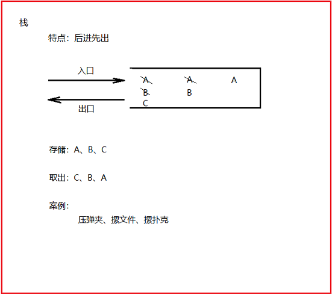
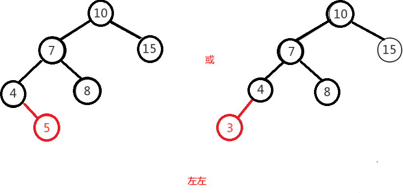
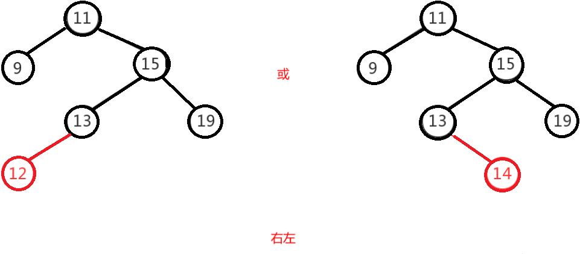
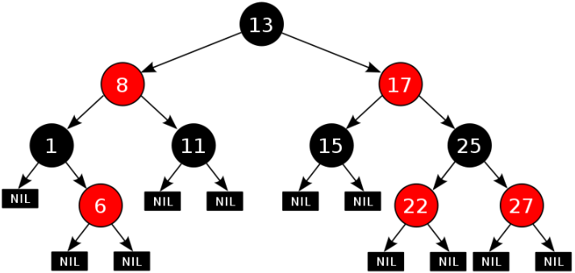

# day04 【Collection集合框架，迭代器，数据结构，List集合】

## 今日内容

- Collection集合
- 迭代器
- 泛型
- 数据结构


## 教学目标

- [ ] 能够在成员变量及其方法上使用引用类型

- [ ] 能够使用Collection集合的常用功能

- [ ] 能够使用迭代器遍历集合

  ```java
  //获取集合的迭代器对象
  Iterator<String> it = coll.iterator();
  
  //直到没有下一个元素,结束循环
  while(it.hasNext()){
      //向后移动一位,并返回指向的元素
          // element会被集合中每个元素进行循环赋值
      String element = it.next();
      System.out.println(element);
  }
  ```

- [ ] 能够使用增强for循环遍历集合和数组

  ```java
  for(String element : coll){
          System.out.println(element);
     
  }
  ```

- [ ] 能够理解泛型的含义

  >1. 在编译时期强制规范引用类型
  >2. 泛型存的意义是 将运行时期类型转换异常提前到编译时期发现
  >3. java的泛型是伪泛型,只存在编译时期,不存在运行时期

- [ ] 能够熟悉泛型上下限的格式

  > ? extends Animal : 上限
  >
  > ? super Animal : 下限

- [ ] 能够说出数组结构特点

  > 模型: 数组的元素内存地址是连续的
  >
  > 特点:查询快,增删慢

- [ ] 能够说出栈结构特点

  > 模型:单开口
  >
  > 特点: 先进后出

- [ ] 能够说出队列结构特点

  >模型:双开口
  >
  >特点: 先进先出

- [ ] 能够说出单向链表结构特点

  > 模型: 每个元素都保存一个地址和下一个的元素地址
  >
  > 特点: 增删快,查询慢

  >模型: 每个元素都保存一个地址和上一个元素,下一个的元素地址
  >
  >特点: 增删快,查询慢,但是结果比单向稳定

- [ ] 能够说出List集合特点

- [ ] 能够说出List的常用子类及其底层结构特点


# 第零章 String类

```java
package com.itheima02.string;

import com.sun.scenario.effect.impl.sw.sse.SSEBlend_SRC_OUTPeer;
//字符串拼接
public class Demo01 {

    public static void main(String[] args) {

        String s1 = "abc";
        String s2 = "def";

        // + 拼接字符串, 底层是StringBuilder.append (JDK8)
        String s3 = s1 + s2;
        System.out.println(s3);

        //引用类型执行+, 先调用自己的toString方法
        String s4 = s1 + new Person("张三", 18);
        System.out.println(s4);

        System.out.println("------------");
        //字符串拼接
        String s5 = s1.concat(s2);
    }
}

class Person {
    String name;
    int age;

    public Person(String name, int age) {
        this.name = name;
        this.age = age;
    }

    @Override
    public String toString() {
        System.out.println("toString被调用");
        return "Person{" +
                "name='" + name + '\'' +
                ", age=" + age +
                '}';
    }
}
```


```java
package com.itheima02.string;

import java.util.Arrays;

/*
*   快捷键: ctrl + alt + u  (选中一个类, 使用这个快捷键,查看到这个类继承体系)
*
* */
public class Demo02 {

    public static void main(String[] args) {

        String s1 = "abcdef";
        /*
          //1. 包含
        *   boolean contains(CharSequence arg)
        *       CharSequence 是一个接口
        *           String/StringBuilder 都是它的实现类
        *
        *   如果字符串中包含arg ,就返回true,否则返回false
        * */
        boolean result = s1.contains("de");
        System.out.println(result); // true

        /*
        * 2. 以...结尾
        *       suffix 后缀  prefix 前缀
        *
        * */
        boolean result2 = s1.endsWith("ef");
        System.out.println(result2); // true

        /*
        *  3. 以...开头
        *       大小写敏感(区分大小写)
        * */
        boolean result3 = s1.startsWith("AB");
        System.out.println(result3); //false

       /*
           4. 参数在字符串中的索引位置(第一个)
                abcdefdefdef

                你只要看第一个位置
                找不到返回-1(因为java中的索引不为负数,所以用-1表示不存在)
        */
         s1 = "abcdefdefdef";
        int index = s1.indexOf("de");
        System.out.println(index);//3

        /*
        *  5. 参数在字符串中的索引位置(最后一个)
        * */
        int index2 = s1.lastIndexOf("de");
        System.out.println(index2);//9

        /*
        *  6. 替换(全部)
        *
        *        String replace(CharSequence target, CharSequence replacement)
        *
        *       将字符串中的所有target替换成 replacement
        *       替换后内容进行返回
        *
        * */
        String s4 = s1.replace("def", "xxx");
        System.out.println(s4);

        /*
        * 7. 子字符串 , 是当前字符串的一部分 (子集)
        *   ab 是 s1的子集
        *   abcdef 是 s1的子集
        *
        *   7.1 String substring(int beginIndex)
        *        从beginIndex到结束
        *
        *   7.2  String substring(int beginIndex,init endIndex)
        *       从beginIndex到endIndex(包头不包尾)
        *
        *   StringIndexOutOfBoundsException : 字符串索引越界异常
        *                                   (集合索引越界, 数组索引越界)
        *       访问了不存在的索引,就会报这个错
        * */
        s1 = "abcdef";
        String sub1 = s1.substring(2);
        System.out.println(sub1);

        String sub2 = s1.substring(2, 4);
        System.out.println(sub2);

        /*
        * 8. 转换成字符数组
        * */
        char[] chars = s1.toCharArray();
        System.out.println(Arrays.toString(chars));

        /*
        * 9. 大小写转换(字母)
        *       toLowerCase 变成小写
        *       toUpperCase 变成大写
        * */
        s1 = "一abcAbc";
        String s5 = s1.toUpperCase();
        System.out.println(s5);

        /*
        * 10. 去掉前后空格
        * */
        s1 = "   100  ";
        String trim = s1.trim();
        int number = Integer.parseInt(trim);
        System.out.println(number * 2);

        /*
        * 11. 分割
        *       String[] array = split(String regex)
        *       按照regex的规则进行分割字符串,分割的每部分都是数组中的元素
        * */
        s1 = "ab=ed=ef=gh";
            // split = {"ab","ed","ef","gh"}
        String[] split = s1.split("=");
        for (int i = 0; i < split.length; i++) {
            System.out.println(split[i]);
        }
    }
}

```


# 第一章 引用类型使用

```markdown
# java中四大类型
	class(类), interface(接口) , enum(枚举), annotation(注解)

1. class 
	1). 普通类型
	2). 抽象类型
	
2. interface

# 使用方式 
	不论是普通类,抽象类,还是接口都可以用作 (统称为引用类型)
		方法的参数类型, 方法的返回值类型,成员变量

# 举个例子
	接口作为方法的返回值类型
	
```


```java
package com.itheima03.reference;

/*
*    基本类型: primitive type
*           jvm里定义的,可以直接使用的
*
*    引用类型: reference type
*
*    举例: 接口作为方法的返回值类型
* */
public class Demo01 {

    public static void main(String[] args) {

        Animal a = buyAnimal(100);
        a.eat();
    }

    //接口作为方法的返回值类型, 方法必然返回这个接口子类对象
    // money >=100,老板给我一只狗,否则啥都不给我
    private static Animal buyAnimal(int money) {
        if(money >= 100){

//            Animal a = new Dog();
//            return a;

//            return new Dog();

//            Animal a = new Animal() {
//                @Override
//                public void eat() {
//                    System.out.println("猫吃鱼");
//                }
//            };
//            return a;

            return new Animal() {
                @Override
                public void eat() {
                    System.out.println("猫吃鱼");
                }
            };
        }
        return null;
    }
}
interface Animal{
    void eat();
}
class Dog implements Animal{
    @Override
    public void eat() {
        System.out.println("狗吃骨头");
    }
}

```


## 1 类名作为方法参数和返回值

```java
public class Person{
  public void eat(){
    System.out.println("吃饭");
  }
}
public class Test{
  public static void main(String[] args){
        method(new Person());
   		Person p = createPerson();
  }
    
  //引用类型作为方法参数,在前面笔记本案例中我们也使用了接口类型作为方法参数
  pubic static void method(Person p){
       p.eat();
  }
    
  //引用类型作为返回值
  public static Person createPerson(){
    	return new Person();
  }
}

```


## 2 抽象类作为方法参数和返回值

- 抽象类作为形参：表示可以接收任何此抽象类的"子类对象"作为实参；
- 抽象类作为返回值：表示"此方法可以返回此抽象类的任何子类对象"；

```java
/* 定义一个抽象类 */
public abstract class Person{
    public void eat(){
        System.out.println("吃饭");
    }
    public abstract void work();
}
/*定义子类Student*/
public class Student extends Person{
    public void work(){
        System.out.println("学生的工作是学习...");
    }
}
public class Teacher extends Person{
    public void work(){
        System.out.println("老师的工作是教书育人...");
    }
}
/*测试类*/
public class Test{
    public static void main(String[] args){
        //1.调用method1()方法，可以传入一个Student对象，也可以传入一个Teacher对象
        method1(new Student());//OK的
        method1(new Teacher());//OK的
        
        //2.调用method2()方法，接收的可能是Student对象，也可能是Teacher对象
        //所以，这里使用Person类型接收
        Person p = method2();
        p.work();//如果是Student对象，则调用的是Student的work()；如果是Teacher对象，调用的是Teacher的work()。
    }
    //-------------------------------------------------------------------------------//
    //抽象类Person作为形参——可以接收任何它的子类对象
    public static void method1(Person p){
        p.eat();
        p.work();
    }
    
    //抽象类Person作为返回值——此方法可以返回一个Student对象，也可以返回一个Teacher对象
    public static Person method2(){
      //  return new Student();//OK的
        return new Teacher();//OK的
    }
    
}
```


## 3 接口作为方法参数和返回值

- 接口作为方法的形参：【同抽象类】
- 接口作为方法的返回值：【同抽象类】

```java
/*定义一个接口*/
public interface USB{
    public void run();
}
/*定义子类*/
public class Keyboard implements USB{
    public void run(){
        System.out.println("使用键盘...");
    }
}
public class Mouse implements USB{
    public void run(){
        System.out.println("使用鼠标...");
    }
}
/*定义测试类*/
public class Test{
    public static void main(String[] args){
        //1.调用method1()方法，需要传入USB的任何子类对象都可以
        method1(new Keyboard());
        method2(new Mouse());
        
        //2.调用method2()方法，此方法可能返回一个Keyboard对象，也可能返回一个Mouse对象
        USB usb = method2();
        usb.run();
    }
    //接口作为形参
    public static void method1(USB usb){
        usb.run();
    }
    //接口作为返回值
    public static USB method2(){
  //      return new Keyboard();//OK的
    	return new Mouse();//OK的    
    }
}
```


## 4 类名作为成员变量

​	我们每个人(Person)都有一个身份证(IDCard) , 为了表示这种关系 , 就需要在Person中定义一个IDCard的成员变量。定义Person类时，代码如下：

```java
class Person {
    String name;//姓名
    int age;//年龄
}
```

​	使用`String` 类型表示姓名 , `int` 类型表示年龄。其实，`String`本身就是引用类型，我们往往忽略了它是引用类型。如果我们继续丰富这个类的定义，给`Person` 增加身份证号 , 身份证签发机关等属性，我们将如何编写呢？这时候就需要编写一个IDCard类了

定义IDCard(身份证)类，添加身份证号 , 签发地等属性：

```java
class IDCard {
    String idNum;//身份证号
    String authority;//签发地
  
  	//getter和setter方法
  	//...
  	
  	//toString方法
  	//...
}
```

修改Person类：

```java
public class Person {
    String name;//姓名
    int age;//年龄

    IDCard idCard;//表示自己的身份证信息

    //name和age的getter、setter方法
    //...

    public IDCard getIdCard() {
        return idCard;
    }

    public void setIdCard(IDCard idCard) {
        this.idCard = idCard;
    }

    @Override
    public String toString() {
        return "Person{" +
                "name='" + name + '\'' +
                ", age=" + age +
                ", idCard=" + idCard +
                '}';
    }
}
```

测试类：

```java
public class TestDemo {
    public static void main(String[] args) {
        //创建IDCard对象
        IDCard idCard = new IDCard();
        //设置身份证号
        idCard.setIdNum("110113201606066666");
        //设置签发地
        idCard.setAuthority("北京市顺义区公安局");

        //创建Person对象
        Person p = new Person();
        //设置姓名
        p.setName("小顺子");
        //设置年龄
        p.setAge(2);
        //设置身份证信息
        p.setIdCard(idCard);

        //打印小顺子的信息
        System.out.println(p);
    }
}
输出结果:
Person{name='小顺子', age=2, idCard=IDCard{idNum='110113201606066666', authority='北京市顺义区公安局'}}
```

> 类作为成员变量时，对它进行赋值的操作，实际上，是赋给它该类的一个对象。同理 , 接口也是如此 , 例如我们笔记本案例中使用usb设备。在此我们只是通过小例子 , 让大家熟识下引用类型的用法 , 后续在咱们的就业班学习中 , 这种方式会使用的很多。  


## 5 抽象类作为成员变量

- 抽象类作为成员变量——为此成员变量赋值时，可以是任何它的子类对象

```java
/*定义抽象类*/
public abstract class Animal{
    public abstract void sleep();
}
/*定义子类*/
public class Cat extends Animal{
    public void sleep(){
        System.out.println("小猫睡觉...");
    }
    public String toString(){
        return "一只可爱的小猫";
    }
}
public class Dog extends Animal{
    public void sleep(){
        System.out.println("小狗睡觉...");
    }
    public String toString(){
        return "一只可爱的小狗";
    }
}
/*定义Student类*/
public class Student{
    private String name;
    private int age;
    private Animal animal;//表示学生有一个动物，可以是Cat，也可以是Dog
    
    public Student(String name,int age,Animal animal){
        this.name = name;
        this.age = age;
        this.animal = animal;
    }
    public void setName(String name){
        this.name = name;
    }
    public String getName(){
        return this.name;
    }
    public void setAge(int age){
        this.age = age;
    }
    public int getAge(){
        return this.age;
    }
    public void setAnimal(Animal animal){
        this.animal = animal;
    }
    public Animal getAnimal(){
        return this.animal;
    }
    
    public String toString(){
        return "Student [name = " + name + 
            	" , age = " + age + 
            	" , animal = " + animal + 
            	"]";
    }
}
/*定义测试类*/
public class Test{
    public static void main(String[] args){
        Student stu = new Student();
        stu.setName("章子怡");
        stu.setAge(19);
    //    stu.setAnimal(new Cat());//表示Student有一只猫
        stu.setAnimal(new Dog());//表示Student有一只狗
        
        System.out.println(stu);//隐式调用stu.toString()，而stu.toString()中会隐式调用animal的toString().
    }
    
}
```


## 6 接口作为成员变量

- 接口类型作为成员变量——【同抽象类】

```java
/*定义接口*/
public interface Animal{
    public abstract void sleep();
}
/*定义子类*/
public class Cat implements Animal{
    public void sleep(){
        System.out.println("小猫睡觉...");
    }
    public String toString(){
        return "一只可爱的小猫";
    }
}
public class Dog implements Animal{
    public void sleep(){
        System.out.println("小狗睡觉...");
    }
    public String toString(){
        return "一只可爱的小狗";
    }
}
/*定义Student类*/
public class Student{
    private String name;
    private int age;
    private Animal animal;//表示学生有一个动物，可以是Cat，也可以是Dog
    
    public Student(String name,int age,Animal animal){
        this.name = name;
        this.age = age;
        this.animal = animal;
    }
    public void setName(String name){
        this.name = name;
    }
    public String getName(){
        return this.name;
    }
    public void setAge(int age){
        this.age = age;
    }
    public int getAge(){
        return this.age;
    }
    public void setAnimal(Animal animal){
        this.animal = animal;
    }
    public Animal getAnimal(){
        return this.animal;
    }
    
    public String toString(){
        return "Student [name = " + name + 
            	" , age = " + age + 
            	" , animal = " + animal + 
            	"]";
    }
}
/*定义测试类*/
public class Test{
    public static void main(String[] args){
        Student stu = new Student();
        stu.setName("章子怡");
        stu.setAge(19);
    //    stu.setAnimal(new Cat());//表示Student有一只猫
        stu.setAnimal(new Dog());//表示Student有一只狗
        
        System.out.println(stu);//隐式调用stu.toString()，而stu.toString()中会隐式调用animal的toString().
    }
    
}
```


# 第二章 Collection集合

## 1 集合概述

在前面基础班我们已经学习过并使用过集合ArrayList<E> ,那么集合到底是什么呢?

- **集合**：集合是java中提供的一种容器，可以用来存储多个数据。

集合和数组既然都是容器，它们有什么区别呢？

- 数组的长度是固定的。集合的长度是可变的。
- 数组中存储的是同一类型的元素，可以存储任意类型数据。集合存储的都是引用数据类型。如果想存储基本类型数据需要存储对应的包装类型。


```java
package com.itheima04.container;

import java.util.ArrayList;

/*
*   java中的容器
*       1. 数组
*           1). 长度不可变
*           2). 可以存基本类型,也能存引用类型
*           3). 数组存储的元素类型必须一致
*
*       2. 集合
*           1). 长度可变
*           2). 只能存引用类型(如果是基本类型,自动装箱成引用类型)
*           3). 集合存储的元素类型可以不一致(后来引入泛型,强制存储的元素类型一致)
*               
* */
public class Demo01 {

    public static void main(String[] args) {
        Person p1 = new Person();
        Person p2 = new Person();
        Person[] array = {p1,p2};

        int[] array2 = {1,2,3};

        ArrayList list = new ArrayList();
        list.add(1);//自动装箱 int -> Integer, Integer才是Object子类,然后向上转型
        list.add("abc");
    }
}
class Person{

}
```


## 2  集合常用类的继承体系

Collection：单列集合类的根接口，用于存储一系列符合某种规则的元素，它有两个重要的子接口，分别是`java.util.List`和`java.util.Set`。其中，**`List`的特点是元素有序、元素可重复 ; `Set`的特点是元素不可重复**。`List`接口的主要实现类有`java.util.ArrayList`和`java.util.LinkedList`，`Set`接口的主要实现类有`java.util.HashSet`和`java.util.LinkedHashSet`。

从上面的描述可以看出JDK中提供了丰富的集合类库，为了便于初学者进行系统地学习，接下来通过一张图来描述集合常用类的继承体系


注意:这张图只是我们常用的集合有这些，不是说就只有这些集合。

集合本身是一个工具，它存放在java.util包中。在`Collection`接口定义着单列集合框架中最最共性的内容。


## 3 Collection 常用功能

Collection是所有单列集合的父接口，因此在Collection中定义了单列集合(List和Set)通用的一些方法，这些方法可用于操作所有的单列集合。方法如下：

- `public boolean add(E e)`：  把给定的对象添加到当前集合中 。
- `public void clear()` :清空集合中所有的元素。
- `public boolean remove(E e)`: 把给定的对象在当前集合中删除。
- `public boolean contains(Object obj)`: 判断当前集合中是否包含给定的对象。
- `public boolean isEmpty()`: 判断当前集合是否为空。
- `public int size()`: 返回集合中元素的个数。
- `public Object[] toArray()`: 把集合中的元素，存储到数组中

> tips: 有关Collection中的方法可不止上面这些，其他方法可以自行查看API学习。

```java
package com.itheima05.collection;

import java.util.ArrayList;
import java.util.Collection;

/*
*
*   Collection 是单列集合顶层接口
*
*   - public boolean add(E e)：  把给定的对象添加到当前集合中 。
    - public void clear() :清空集合中所有的元素。
    - public boolean remove(E e): 把给定的对象在当前集合中删除。
    - public boolean contains(Object obj): 判断当前集合中是否包含给定的对象。
    - public boolean isEmpty(): 判断当前集合是否为空。
    - public int size(): 返回集合中元素的个数。
    - public Object[] toArray(): 把集合中的元素，存储到数组中

    Collection没有带索引的方法!!!
* */
public class Demo01 {

    public static void main(String[] args) {

        //学习思路: 继承 (从上往下学)
        //写代码: 多态 (向上转型)
            // Collection是接口不能创建实例,必须创建其子类对象
            // 但是左边是Collection,为了限制方法的调用,只想调用Collection接口中的方法 (编译看左边)
        Collection<String> coll = new ArrayList<>();
        coll.add("张三");
        coll.add("李四");
        coll.add("王五");

        System.out.println(coll); //[张三, 李四, 王五]
//        coll.clear(); //没有元素的集合,不是null
//        System.out.println(coll);

//        Collection<String> coll2 = new ArrayList<>();//没有元素的集合(有内存地址) 没有苹果的篮子
//        Collection<String> coll3 = null; // 集合不存在(没有内存地址) 连篮子都没有

        coll.remove("张三");
        System.out.println(coll); //[ 李四, 王五]

        boolean result = coll.contains("李四");
        System.out.println(result); //true

        //coll不能为null, 只是判断这个集合是否有元素
        boolean empty = coll.isEmpty();
        System.out.println(empty); //false

        int size = coll.size();
        System.out.println(size);//2

        System.out.println("------------------------");
        Object[] objects = coll.toArray();
        for (int i = 0; i < objects.length; i++) {
            System.out.println(objects[i]);
        }


        for (int i = 0; i < coll.size(); i++) {
            //collection是没有get方法的,不能用fori直接遍历
        }

    }
}

```


# 第三章 Iterator迭代器

## 1 Iterator接口

```markdown
# 1. 概念
1). 遍历
		全部经历
	遍历集合, 就是把集合中的每个元素都过一遍
2). 迭代
	相同的动作不断的重复,称之为迭代
	版本迭代 : 
		特斯拉1.0 : 设计 , 研发 , 生产 ,  测试 , 上市
		特斯拉2.0 : 设计 , 研发 , 生产 ,  测试 , 上市
		...
	
3). 迭代器
	迭代器主要是用来实现集合遍历的
	遍历的时候: 取一个元素这个操作,不断重复,重复到无可重复,即为遍历

4). 集合中的迭代器
	a. Collection有自己的迭代器
	b. 这个迭代器的主要工作
		I. 判断是否有下一个元素
        II. 移动到下一位,获取当前指向的元素

	c. 迭代器是所有Collection实现类通用的遍历方式
```


```java
package com.itheima06.iterator;

import java.util.ArrayList;
import java.util.Collection;
import java.util.Iterator;

public class Demo01 {

    public static void main(String[] args) {

//        method01();

        Collection<String> coll = new ArrayList<>();
        coll.add("张三");
        coll.add("李四");
        coll.add("王五");

        Iterator<String> it = coll.iterator();

        //直到没有下一个元素,结束循环
        while(it.hasNext()){
            //向后移动一位,并返回指向的元素
            String element = it.next();
            System.out.println(element);
        }


    }

    private static void method01() {
        Collection<String> coll = new ArrayList<>();
        coll.add("张三");
        coll.add("李四");
        coll.add("王五");

        /*
            1. 获取集合的迭代器对象
             Iterator  it =  Collection.iterator();

             在当前的案例中,迭代器是ArrayList实现的
         */
        Iterator<String> it = coll.iterator();

        boolean result = it.hasNext();
        if(result){
            String element = it.next();
            System.out.println(element);
        }

        boolean result2 = it.hasNext();
        if(result2){
            String element = it.next();
            System.out.println(element);
        }

        boolean result3 = it.hasNext();
        if(result3){
            String element = it.next();
            System.out.println(element);
        }

        boolean result4 = it.hasNext();
        if(result4){
            String element = it.next();
            System.out.println(element);
        }
    }
}

```


## 2 迭代器的实现原理

​        我们在之前案例已经完成了Iterator遍历集合的整个过程。当遍历集合时，首先通过调用t集合的iterator()方法获得迭代器对象，然后使用hashNext()方法判断集合中是否存在下一个元素，如果存在，则调用next()方法将元素取出，否则说明已到达了集合末尾，停止遍历元素。

​        Iterator迭代器对象在遍历集合时，内部采用指针的方式来跟踪集合中的元素。在调用Iterator的next方法之前，迭代器的索引位于第一个元素之前，不指向任何元素，当第一次调用迭代器的next方法后，迭代器的索引会向后移动一位，指向第一个元素并将该元素返回，当再次调用next方法时，迭代器的索引会指向第二个元素并将该元素返回，依此类推，直到hasNext方法返回false，表示到达了集合的末尾，终止对元素的遍历。


## 3 增强for

```markdown
1. 概念
	1). 普通for循环
		for(int i=0; i< 10; i++){
            
           
		}
	2). 增强for循环 (foreach循环)  JDK1.5
		增强for循环是迭代器的语法糖
2. 语法
		变量名会被集合中每个元素进行循环赋值
       for(集合元素类型 变量名 : 被遍历集合的变量名){
       
       }
    
3. 使用范围
	1). 所有Collection实现类都支持迭代器,所以都能使用增强for循环
		增强for 是迭代器的语法糖
	2). 数组也能用
		增强for 是普通for的语法糖
		


```


```java
package com.itheima06.iterator;

import java.util.ArrayList;
import java.util.Collection;

public class Demo02 {

    public static void main(String[] args) {
//        method01();

        int[] array = {1,2,3};

//        for (int i = 0; i < array.length; i++) {
//
//        }
        //数组中的增强for循环是普通for循环的语法糖
            //没有索引,无法修改特定的元素
            //增强for循环: 适合查看的时候
        for(int element : array){
            System.out.println(element);
        }

    }

    private static void method01() {
        Collection<String> coll = new ArrayList<>();
        coll.add("张三");
        coll.add("李四");
        coll.add("王五");

       /* for (int i = 0; i < coll.size(); i++) {

        }*/

        /*
        *   集合中的增强for循环, 底层就是迭代器
        *
        *   1. element会被集合中每个元素进行循环赋值
        *   2. 语法:
        *        for(集合元素类型 变量名 : 被遍历集合的变量名){
        *
        *        }
        *   3. 语法糖(syntax sugar)
        *    原理相同,语法更为简洁
        *
        *    增强for循环是迭代器的语法糖
        *
        * */
        for (String element : coll) {
            System.out.println(element);
        }
    }
}

```


# 第四章 泛型

## 1  泛型概述

```java
package com.itheima07.generic;

import java.util.ArrayList;
import java.util.Iterator;

/*
*   1. 为什么要有泛型?
*       在集合的使用过程中,发生大量的场景,其实都只需要存放同一种类型的元素
*       没有泛型,语法上可以存放任意类型元素,可能不小心写错了
*       造成运行时发生类型转换异常!!!
*
*       有了泛型,运行时异常提前到编译时就发现了
*
*       源码 -> 编译  -> 运行
*
*   2. 泛型是什么?
*       1). 泛型是一种特殊的语法,作用主要是在编译时检查引用类型是否正确
*
*       2). java中的泛型是伪泛型
*           只存在编译时期, 在运行时期会被擦除
* */
public class Demo01 {

    public static void main(String[] args) {

//        method01();

        ArrayList<String> list1 = new ArrayList<>();
        ArrayList<Integer> list2 = new ArrayList<>();
        // list1和list2运行时的类型一样的
        //class java.util.ArrayList
        System.out.println(list1.getClass());
        System.out.println(list2.getClass());
    }

    private static void method01() {
        ArrayList<String> list = new ArrayList();
        list.add("tony");
        list.add("lisa");
        list.add("nono");
//        list.add(false); //本来想写String ,不小心写成Boolean
        list.add("false");

        Iterator it = list.iterator();
        while(it.hasNext()){
            //我们以为都是String,所以就强转成String,才能调用length()方法
            Object element = it.next();
            //运行时,发生类型转换异常
            String name = (String) element;
            System.out.println(name.length());
        }
        
    }
}

```


## 2  使用泛型的好处

上一节只是讲解了泛型的引入，那么泛型带来了哪些好处呢？

- 将运行时期的ClassCastException，转移到了编译时期变成了编译失败。
- 避免了类型强转的麻烦。

通过我们如下代码体验一下：

```java
public class GenericDemo2 {
	public static void main(String[] args) {
        Collection<String> list = new ArrayList<String>();
        list.add("itheima");
        list.add("itcast");
        // list.add(666);//当集合明确类型后，存放类型不一致就会编译报错
        // 集合已经明确具体存放的元素类型，那么在使用迭代器的时候，迭代器也同样会知道具体遍历元素类型
        Iterator<String> it = list.iterator();
        while(it.hasNext()){
            String str = it.next();
            //当使用Iterator<String>控制元素类型后，就不需要强转了。获取到的元素直接就是String类型
            System.out.println(str.length());
        }
	}
}
```

> tips:泛型是数据类型的一部分，我们将类名与泛型合并一起看做数据类型。


## 3  泛型的定义与使用

我们在集合中会大量使用到泛型，这里来完整地学习泛型知识。

泛型，用来灵活地将数据类型应用到不同的类、方法、接口当中。将数据类型作为参数进行传递。

### 定义和使用含有泛型的类

```java
package com.itheima07.generic;

import java.util.ArrayList;
/*
    快捷键: ctrl + F12 (快速查找这个类的属性或方法)
*
* */
public class Demo02 {

    public static void main(String[] args) {

        ArrayList<String> list = new ArrayList<>();
       

        MyList<Integer> mylist = new MyList<>();
        mylist.add(1);
    }
}
/*
*  泛型类: 带有泛型声明的类 (Generic)
*  1. 泛型类的声明
*
*       class 类名<E>{
*
*       }
*
*       E : 软性规范,大写字母   --> (泛型变量)
*           element首字母
*
*   2. 泛型的使用
          E 只能赋值引用类型, 一旦赋值,全局改变

          E=String

    3. 泛型类的赋值
        在创建该类对象的时候指定E的值 = String
        该对象的内部所有E = String

        如果创建该类对象不指定E的值,那么E=Object
* */
class MyList<E>{

    public void add(E e){

    }
}
```


### 含有泛型的方法

```java
package com.itheima07.generic;

public class Demo04 {

    public static void main(String[] args) {
        int a = 1;
        System.out.println(a);

        MyClass mc = new MyClass();
        String[] array = {"abc","def"};
        //String[]父类是Object
        mc.show(array);
        //Object[]父类是Object
        Object[] array2 = {};
        mc.show(array2);
        
        
    }
}
/*
*  泛型方法: 声明了泛型的方法
*   1. 在方法的返回值类型之前声明
*   2. 在调用方法的时候对泛型进行赋值
* */
class MyClass{
    //当前参数类型必须是数组,但可以是任意引用类型数组
    // Integer[],String[] ,Object[]
    public <T>void show(T[] t){

    }
    

   /* public void show(Object obj){

    }*/
}
```


### 含有泛型的接口

```java
package com.itheima07.generic;

import java.util.Properties;

public class Demo03 {

    public static void main(String[] args) {

        B<String> b = new B<>();
        
    }
}
/*
*  泛型接口
*  1. 第一种: 实现接口,不保留泛型
*
*  2. 第二种: 实现接口,保留泛型
* */
interface MyInter<T>{

    void add(T t);
}
// 实现接口的同时, T=String
class A implements MyInter<String>{
    @Override
    public void add(String s) {

    }
}
// 实现接口的时候,泛型被保留,当前类就得声明泛型
class B<T> implements MyInter<T>{
    @Override
    public void add(T t) {

    }
}
```


## 4  泛型通配符

```java
package com.itheima07.generic;

import java.util.ArrayList;
/*
*   泛型通配符 ?
*       1. ? 可以是任意引用类型
*       2. 只写?跟不写没有区别
*
*   赖子: A ~ K 都可以
*   赖子被限制: 3~7中随便一张
*
*   泛型通配符的上下限
*       1. 上限: ? extends Animal
*           这个类型必须是Animal或Animal的子类
*           
*       2. 下限: ? super Animal
*           这个类型必须是Animal 或 其父类
* */
public class Demo05 {

    public static void main(String[] args) {

        ArrayList<Object> list1 = new ArrayList<>();
        method01(list1);

        ArrayList<String> list2 = new ArrayList<>();
        //泛型存在编译时期,不存在运行时期
        method01(list2);
    }

    //设计一个方法,可以遍历所有的ArrayList集合
    public static void method01(ArrayList<?> list){
        for (Object element : list) {
            System.out.println(element);
        }
    }

    /*public static <T>void method01(ArrayList<T> list){
        for (Object element : list) {
            System.out.println(element);
        }
    }*/

    /*public static void method01(ArrayList list){
        for (Object element : list) {
            System.out.println(element);
        }
    }*/
}


```

```java
package com.itheima07.generic;

import java.util.ArrayList;

public class Demo06 {

    public static void main(String[] args) {

        ArrayList<Animal> list = new ArrayList<>();
        method02(list);

        ArrayList<Cat> list2 = new ArrayList<>();
        method02(list2);

//        ArrayList<String> list3 = new ArrayList<>();
//        method02(list3); //报错的

        ArrayList<Animal> list3 = new ArrayList<Animal>();
        //将list集合中所有元素存到list3中
        //那么list的泛型最高只能Animal,或者Animal子类也行
        list3.addAll(list);
        list3.addAll(list2);

        method03(list);

    }

    private static void method02(ArrayList<? extends Animal> list) {

    }

    private static void method03(ArrayList<? super Animal> list) {

    }
}
class Animal{

}
class Cat extends Animal{

}
```


# 第五章 数据结构

## 1 数据结构介绍

数据结构 : 数据用什么样的方式组合在一起。


## 2 常见数据结构

数据存储的常用结构有：栈、队列、数组、链表和红黑树。我们分别来了解一下：

#### 栈

- **栈**：**stack**,又称堆栈，它是运算受限的线性表，其限制是仅允许在标的一端进行插入和删除操作，不允许在其他任何位置进行添加、查找、删除等操作。

简单的说：采用该结构的集合，对元素的存取有如下的特点

- 先进后出（即，存进去的元素，要在后它后面的元素依次取出后，才能取出该元素）。例如，子弹压进弹夹，先压进去的子弹在下面，后压进去的子弹在上面，当开枪时，先弹出上面的子弹，然后才能弹出下面的子弹。

- 栈的入口、出口的都是栈的顶端位置。

  


这里两个名词需要注意：

- **压栈**：就是存元素。即，把元素存储到栈的顶端位置，栈中已有元素依次向栈底方向移动一个位置。
- **弹栈**：就是取元素。即，把栈的顶端位置元素取出，栈中已有元素依次向栈顶方向移动一个位置。

#### 队列

- **队列**：**queue**,简称队，它同堆栈一样，也是一种运算受限的线性表，其限制是仅允许在表的一端进行插入，而在表的另一端进行取出并删除。

  简单的说，采用该结构的集合，对元素的存取有如下的特点：

  - 先进先出（即，存进去的元素，要在后它前面的元素依次取出后，才能取出该元素）。例如，小火车过山洞，车头先进去，车尾后进去；车头先出来，车尾后出来。
  - 队列的入口、出口各占一侧。例如，下图中的左侧为入口，右侧为出口。


#### 数组

- **数组**:**Array**,是有序的元素序列，数组是在内存中开辟一段连续的空间，并在此空间存放元素。就像是一排出租屋，有100个房间，从001到100每个房间都有固定编号，通过编号就可以快速找到租房子的人。

简单的说,采用该结构的集合，对元素的存取有如下的特点：

- 查找元素快：通过索引，可以快速访问指定位置的元素

  

- 增删元素慢

- **指定索引位置增加元素**：需要创建一个新数组，将指定新元素存储在指定索引位置，再把原数组元素根据索引，复制到新数组对应索引的位置。如下图

- **指定索引位置删除元素：**需要创建一个新数组，把原数组元素根据索引，复制到新数组对应索引的位置，原数组中指定索引位置元素不复制到新数组中。如下图


#### 链表

- **链表**:**linked list**,由一系列结点node（链表中每一个元素称为结点）组成，结点可以在运行时动态生成。每个结点包括两个部分：一个是存储数据元素的数据域，另一个是存储下一个结点地址的指针域。我们常说的链表结构有单向链表与双向链表，那么这里给大家介绍的是**单向链表**。

  

  简单的说，采用该结构的集合，对元素的存取有如下的特点：

  - 多个结点之间，通过地址进行连接。例如，多个人手拉手，每个人使用自己的右手拉住下个人的左手，依次类推，这样多个人就连在一起了。

  - 查找元素慢：想查找某个元素，需要通过连接的节点，依次向后查找指定元素。

  - 增删元素快：

  


## 3. 树基本结构介绍(Tree)

树具有的特点：

1. 每一个节点有零个或者多个子节点
2. 没有父节点的节点称之为根节点，一个树最多有一个根节点。
3. 每一个非根节点有且只有一个父节点

 

| 名词     | 含义                                                         |
| -------- | ------------------------------------------------------------ |
| 节点     | 指树中的一个元素                                             |
| 节点的度 | 节点拥有的子树的个数，二叉树的度不大于2                      |
| 叶子节点 | 度为0的节点，也称之为终端结点                                |
| 高度     | 叶子结点的高度为1，叶子结点的父节点高度为2，以此类推，根节点的高度最高 |
| 层       | 根节点在第一层，以此类推                                     |
| 父节点   | 若一个节点含有子节点，则这个节点称之为其子节点的父节点       |
| 子节点   | 子节点是父节点的下一层节点                                   |
| 兄弟节点 | 拥有共同父节点的节点互称为兄弟节点                           |

### 二叉树

如果树中的每个节点的子节点的个数不超过2，那么该树就是一个二叉树。


### 二叉查找树(binary search tree)	

二叉查找树的特点：

1. 左子树上所有的节点的值均小于等于他的根节点的值
2. 右子树上所有的节点值均大于或者等于他的根节点的值
3. 每一个子节点最多有两个子树

案例演示(20,18,23,22,17,24,19)数据的存储过程；


遍历获取元素的时候可以按照"左中右"的顺序进行遍历；

注意：二叉查找树存在的问题：会出现"瘸子"的现象，影响查询效率

> 造成的原因: 添加元素的顺序不一样
>
> 17,24,19,18,20,23


### 平衡二叉树(AVL Tree)

#### 概述

为了避免出现"瘸子"的现象，减少树的高度，提高我们的搜素效率，又存在一种树的结构："平衡二叉树"

规则：**它的左右两个子树的高度差的绝对值不超过1，并且左右两个子树都是一棵平衡二叉树**

如下图所示：


如下图所示，左图是一棵平衡二叉树，根节点10，左右两子树的高度差是1，而右图，虽然根节点左右两子树高度差是0，但是右子树15的左右子树高度差为2，不符合定义，

所以右图不是一棵平衡二叉树。


#### 旋转

>左左 : 右旋即可
>
>左右 : 先左旋变成左左,再右旋
>
>右右 : 左旋即可
>
>右左: 先右旋变右右,再左旋
>
>资料图示: 算法图解 -> 点击index.html

在构建一棵平衡二叉树的过程中，当有新的节点要插入时，检查是否因插入后而破坏了树的平衡，如果是，则需要做旋转去改变树的结构。

左旋：

**左旋就是将节点的右支往左拉，右子节点变成父节点，并把晋升之后多余的左子节点出让给降级节点的右子节点；**


右旋：

**将节点的左支往右拉，左子节点变成了父节点，并把晋升之后多余的右子节点出让给降级节点的左子节点**


举个例子，像上图是否平衡二叉树的图里面，左图在没插入前"19"节点前，该树还是平衡二叉树，但是在插入"19"后，导致了"15"的左右子树失去了"平衡"，

所以此时可以将"15"节点进行左旋，让"15"自身把节点出让给"17"作为"17"的左树，使得"17"节点左右子树平衡，而"15"节点没有子树，左右也平衡了。如下图，

 


由于在构建平衡二叉树的时候，当有**新节点插入**时，都会判断插入后时候平衡，这说明了插入新节点前，都是平衡的，也即高度差绝对值不会超过1。当新节点插入后，

有可能会有导致树不平衡，这时候就需要进行调整，而可能出现的情况就有4种，分别称作**左左，左右，右左，右右**。


##### 左左

左左即为在原来平衡的二叉树上，在节点的左子树的左子树下，有新节点插入，导致节点的左右子树的高度差为2，如下即为"10"节点的左子树"7"，的左子树"4"，插入了节点"5"或"3"导致失衡。

 


左左调整其实比较简单，只需要对节点进行右旋即可，如下图，对节点"10"进行右旋，

 


 


##### 左右

左右即为在原来平衡的二叉树上，在节点的左子树的右子树下，有新节点插入，导致节点的左右子树的高度差为2，如上即为"11"节点的左子树"7"，的右子树"9"，

插入了节点"10"或"8"导致失衡。

 

左右的调整就不能像左左一样，进行一次旋转就完成调整。我们不妨先试着让左右像左左一样对"11"节点进行右旋，结果图如下，右图的二叉树依然不平衡，而右图就是接下来要

讲的右左，即左右跟右左互为镜像，左左跟右右也互为镜像。

 


左右这种情况，进行一次旋转是不能满足我们的条件的，正确的调整方式是，将左右进行第一次旋转，将左右先调整成左左，然后再对左左进行调整，从而使得二叉树平衡。

即先对上图的节点"7"进行左旋，使得二叉树变成了左左，之后再对"11"节点进行右旋，此时二叉树就调整完成，如下图:

 


##### 右左

右左即为在原来平衡的二叉树上，在节点的右子树的左子树下，有新节点插入，导致节点的左右子树的高度差为2，如上即为"11"节点的右子树"15"，的左子树"13"，

插入了节点"12"或"14"导致失衡。

 


前面也说了，右左跟左右其实互为镜像，所以调整过程就反过来，先对节点"15"进行右旋，使得二叉树变成右右，之后再对"11"节点进行左旋，此时二叉树就调整完成，如下图:

 


##### 右右

右右即为在原来平衡的二叉树上，在节点的右子树的右子树下，有新节点插入，导致节点的左右子树的高度差为2，如下即为"11"节点的右子树"13"，的左子树"15"，插入了节点

"14"或"19"导致失衡。

 


右右只需对节点进行一次左旋即可调整平衡，如下图，对"11"节点进行左旋。

 


### 红黑树(red-black tree)

#### 概述

**红黑树是一种自平衡的二叉查找树**，是计算机科学中用到的一种数据结构，它是在1972年由Rudolf Bayer发明的，当时被称之为平衡二叉B树，后来，在1978年被

Leoj.Guibas和Robert Sedgewick修改为如今的"红黑树"。它是一种特殊的二叉查找树，红黑树的每一个节点上都有存储位表示节点的颜色，可以是红或者黑；

红黑树不是高度平衡的，它的平衡是通过"红黑树的特性"进行实现的；

红黑树的特性：

1. 每一个节点或是红色的，或者是黑色的。
2. 根节点必须是黑色
3. 每个叶节点(Nil)是黑色的；（如果一个节点没有子节点或者父节点，则该节点相应的指针属性值为Nil，这些Nil视为叶节点）
4. 如果某一个节点是红色，那么它的子节点必须是黑色(不能出现两个红色节点相连的情况)
5. 对每一个节点，从该节点到其所有后代叶节点的简单路径上，均包含相同数目的黑色节点；

如下图所示就是一个

 


在进行元素插入的时候，和之前一样； 每一次插入完毕以后，使用黑色规则进行校验，如果不满足红黑规则，就需要通过变色，左旋和右旋来调整树，使其满足红黑规则；

```tex
1. AVL树是严格的平衡二叉树，平衡条件必须满足（所有节点的左右子树高度差不超过1）。不管我们是执行插入还是删除操作，只要不满足上面的条件，就要通过旋转来保持平衡，而有的旋转非常耗时，由此我们可以知道AVL树适合用于插入与删除次数比较少，但查找多的情况
2. 红黑树通过对任何一条从根到叶子的路径上各个节点着色的方式的限制，可以确保没有一条路径会比其它路径长出两倍，因此，红黑树是一种弱平衡二叉树（由于是弱平衡，可以看到，在相同的节点情况下，AVL树的高度低于红黑树），相对于要求严格的AVL树来说，它的旋转次数少，所以对于搜索，插入，删除操作较多的情况下，我们就用红黑树。
```


# 第六章 List接口

```markdown
#Collection接口
	1. 特点
		1. 所有单列集合顶层接口
		2. 没有带索引的方式
	2. 所有Collection集合的遍历方式
		迭代器	
		语法糖:foreach循环
	3. 语法 : 泛型

#List接口:
	1. 特点
		1. 存取有序
		2. 允许元素重复
		3. 有索引
	2. 实现类
		1. ArrayList 数组(查询快,增删慢)
		2. LinkedList 双向链表(查询慢,增删快)
```


## 1 List接口介绍

`java.util.List`接口继承自`Collection`接口，是单列集合的一个重要分支，习惯性地会将实现了`List`接口的对象称为List集合。在List集合中允许出现重复的元素，所有的元素是以一种线性方式进行存储的，在程序中可以通过索引来访问集合中的指定元素。另外，List集合还有一个特点就是元素有序，即元素的存入顺序和取出顺序一致。

看完API，我们总结一下：

List接口特点：

1. 它是一个元素存取有序的集合。例如，存元素的顺序是11、22、33。那么集合中，元素的存储就是按照11、22、33的顺序完成的）。
2. 它是一个带有索引的集合，通过索引就可以精确的操作集合中的元素（与数组的索引是一个道理）。
3. 集合中可以有重复的元素，通过元素的equals方法，来比较是否为重复的元素。

> tips:我们在基础班的时候已经学习过List接口的子类java.util.ArrayList类，该类中的方法都是来自List中定义。


## 2 List接口中常用方法

List作为Collection集合的子接口，不但继承了Collection接口中的全部方法，而且还增加了一些根据元素索引来操作集合的特有方法，如下：

- `public void add(int index, E element)`: 将指定的元素，添加到该集合中的指定位置上。
- `public E get(int index)`:返回集合中指定位置的元素。
- `public E remove(int index)`: 移除列表中指定位置的元素, 返回的是被移除的元素。
- `public E set(int index, E element)`:用指定元素替换集合中指定位置的元素,返回值的更新前的元素。

List集合特有的方法都是跟索引相关，我们在基础班都学习过。

> tips:我们之前学习Colletion体系的时候，发现List集合下有很多集合，它们的存储结构不同，这样就导致了这些集合它们有各自的特点，供我们在不同的环境下使用，那么常见的数据结构有哪些呢？在下一章我们来介绍：


## 3 ArrayList集合

`java.util.ArrayList`集合数据存储的结构是数组结构。元素增删慢，查找快，由于日常开发中使用最多的功能为查询数据、遍历数据，所以`ArrayList`是最常用的集合。

许多程序员开发时非常随意地使用ArrayList完成任何需求，并不严谨，这种用法是不提倡的。


## 4 LinkedList集合

`java.util.LinkedList`集合数据存储的结构是链表结构。方便元素添加、删除的集合。

> LinkedList是一个双向链表，那么双向链表是什么样子的呢，我们用个图了解下

 

实际开发中对一个集合元素的添加与删除经常涉及到首尾操作，而LinkedList提供了大量首尾操作的方法。这些方法我们作为**了解即可**：

- `public void addFirst(E e)`:将指定元素插入此列表的开头。
- `public void addLast(E e)`:将指定元素添加到此列表的结尾。
- `public E getFirst()`:返回此列表的第一个元素。
- `public E getLast()`:返回此列表的最后一个元素。
- `public E removeFirst()`:移除并返回此列表的第一个元素。
- `public E removeLast()`:移除并返回此列表的最后一个元素。
- `public E pop()`:从此列表所表示的堆栈处弹出一个元素。
- `public void push(E e)`:将元素推入此列表所表示的堆栈。
- `public boolean isEmpty()`：如果列表不包含元素，则返回true。


LinkedList是List的子类，List中的方法LinkedList都是可以使用，这里就不做详细介绍，我们只需要了解LinkedList的特有方法即可。在开发时，LinkedList集合也可以作为堆栈，队列的结构使用。

```java
package com.itheima01.list;

import java.util.Iterator;
import java.util.LinkedList;
import java.util.List;

/*

LinkedList特有方法

 - public void addFirst(E e):将指定元素插入此列表的开头。
- public void addLast(E e):将指定元素添加到此列表的结尾。
- public E getFirst():返回此列表的第一个元素。
- public E getLast():返回此列表的最后一个元素。
- public E removeFirst():移除并返回此列表的第一个元素。
- public E removeLast():移除并返回此列表的最后一个元素。

- public E pop():从此列表所表示的堆栈处弹出一个元素。
- public void push(E e):将元素推入此列表所表示的堆栈。
- public boolean isEmpty()：如果列表不包含元素，则返回true。

* */
public class Demo01 {

    public static void main(String[] args) {

//        method01();

        LinkedList<String> list = new LinkedList<>();
        list.add("张三"); // 队列操作, 先进先出
        list.add("王五");
        list.add("李四");
        list.add("王五");

//        list.addFirst("第一个");
//        list.addLast("最后一个");

        String first = list.getFirst();
        System.out.println("first:" + first);
        String last = list.getLast();
        System.out.println("last:" + last);

//        list.removeFirst();
//        list.removeLast();

//        public E pop():从此列表所表示的堆栈处弹出一个元素。
        String pop = list.pop(); // 等价于removeFirst
        System.out.println("pop:" + pop);

        //public void push(E e):将元素推入此列表所表示的堆栈。
        list.push("栈顶"); // 等价于addFirst


        System.out.println(list); //存取有序
    }

    private static void method01() {
        LinkedList<String> list = new LinkedList<>();
        list.add("张三");
        list.add("王五");
        list.add("李四");
        list.add("王五");

        /*
            List的遍历有三种方式
            1. fori 普通for循环
            2. foreach 增强for循环
            3. 迭代器
         */
        //带索引 , 取出特定位置的元素
        for (int i = 0; i < list.size(); i++) {
            String s = list.get(i);
        }
        //不带索引,只适合查看
        for (String s : list) {

        }

        Iterator<String> it = list.iterator();
        while(it.hasNext()){
            String element = it.next();
        }
    }
}

```


## 5 LinkedList源码分析

- LinkedList的成员变量源码分析：

  ```java
  public class LinkedList<E> extends AbstractSequentialList<E>
      				implements List<E>, Deque<E>, Cloneable, java.io.Serializable{
      transient int size = 0;
      /**
       *存储第一个节点的引用
       */
      transient Node<E> first;
  
      /**
       * 存储最后一个节点的引用
       */
      transient Node<E> last;
      
      //......
      //......
  }
  ```

- LinkedList的内部类Node类源码分析：

  ```java
  public class LinkedList<E> extends AbstractSequentialList<E>
      				implements List<E>, Deque<E>, Cloneable, java.io.Serializable{
      //......
      private static class Node<E> {
          E item;//被存储的对象
          Node<E> next;//下一个节点
          Node<E> prev;//前一个节点
  
          //构造方法
          Node(Node<E> prev, E element, Node<E> next) {
              this.item = element;
              this.next = next;
              this.prev = prev;
          }
      }
      //......
  }
  ```

- LinkedList的add()方法源码分析：

  ```java
  public boolean add(E e) {
  	linkLast(e);//调用linkLast()方法
  	return true;//永远返回true
  }
  void linkLast(E e) {
    final Node<E> l = last;//一个临时变量，存储最后一个节点
    final Node<E> newNode = new Node<>(l, e, null);//创建一个Node对象
    last = newNode;//将新Node对象存储到last
    if (l == null)//如果没有最后一个元素，说明当前是第一个节点
   	first = newNode;//将新节点存为第一个节点
    else
   	l.next = newNode;//否则不是第一个节点，就赋值到当前的last的next成员
    size++;//总数量 + 1
    modCount++;//
  }
  ```

- LinkedList的get()方法：

  ```java
  public E get(int index) {
      checkElementIndex(index);//检查索引的合法性(必须在0-size之间)，如果不合法，此方法抛出异常
      return node(index).item;
  }
  Node<E> node(int index) {//此方法接收一个索引，返回一个Node
          // assert isElementIndex(index);
          if (index < (size >> 1)) {//判断要查找的index是否小于size / 2，二分法查找
              Node<E> x = first;// x = 第一个节点——从前往后找
              for (int i = 0; i < index; i++)//从0开始，条件：i < index，此循环只控制次数
                  x = x.next;//每次 x = 当前节点.next;
              return x;//循环完毕，x就是index索引的节点。
          } else {
              Node<E> x = last;// x = 最后一个节点——从后往前找
              for (int i = size - 1; i > index; i--)//从最后位置开始，条件：i > index
                  x = x.prev;//每次 x = 当前节点.prev;
              return x;//循环完毕，x就是index索引的节点
          }
      }
  ```


```java
package com.itheima01.list;

/*
*   位移运算符
*   1. 举个例子
*       4 (10进制) -> 0000 0100  (2进制)
*
*   2. 右移 >>
*       4 >> 1
*                   0000 0100 -> 0000 0010
*      结果是10进制的2
*
*      3 >> 1
*                   0000 0011 -> 0000 0001
*
*      结果是10进制的1
*
*      结论: 右移1位相当于除以2
*
*      int = int / int
*
*  3. 左移 <<
*       4 << 1 结果是8
*       3 << 1 结果是6
*       (正码,补码,反码)
*
*  4. 问题: 为什么不直接使用算术运算符
*       4 << 1(位移) 相当于  4/2(算术)
*
*       计算机的底层是二进制,位移是直接对二进制数据进行计算的,效率比算术运算符高
* */
public class Demo02 {

    public static void main(String[] args) {
        int result = 4 >> 1;
        System.out.println(result);
    }
}

```


