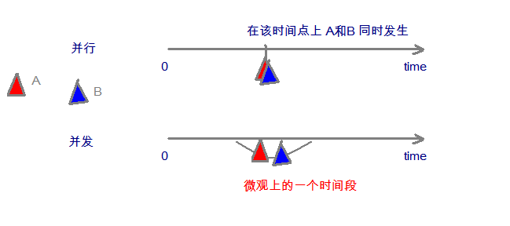
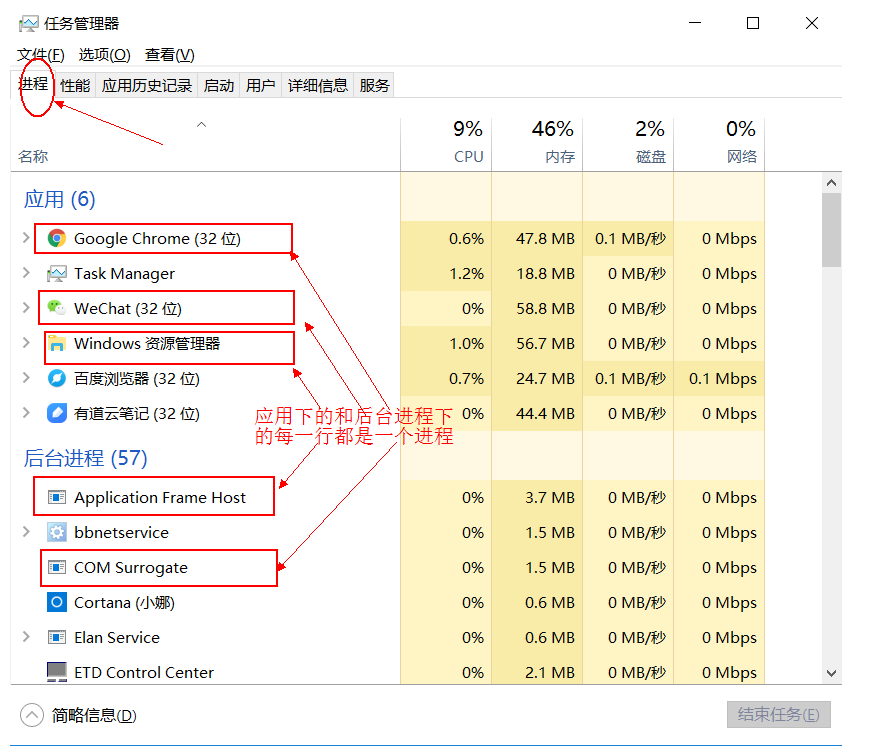
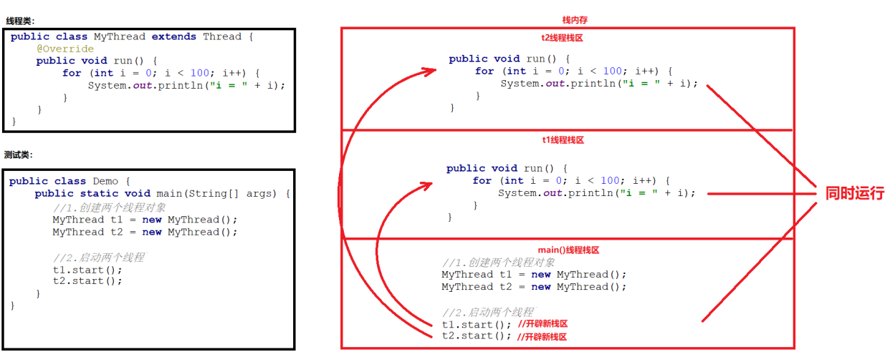
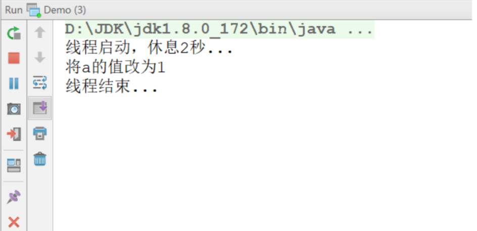
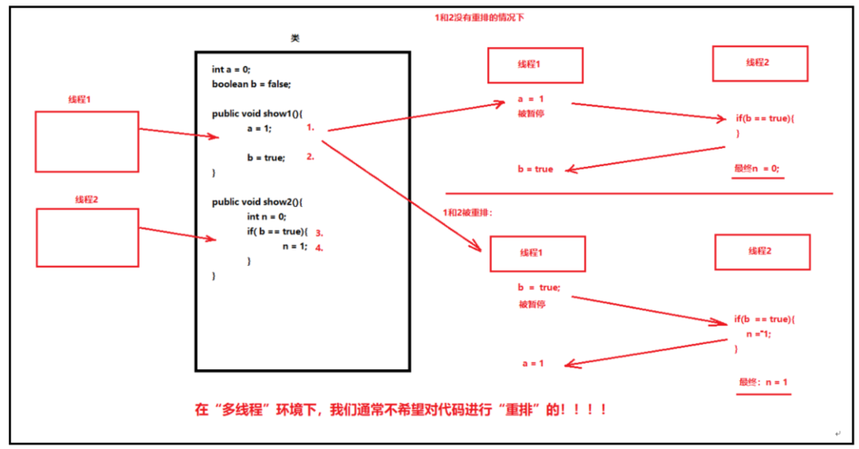
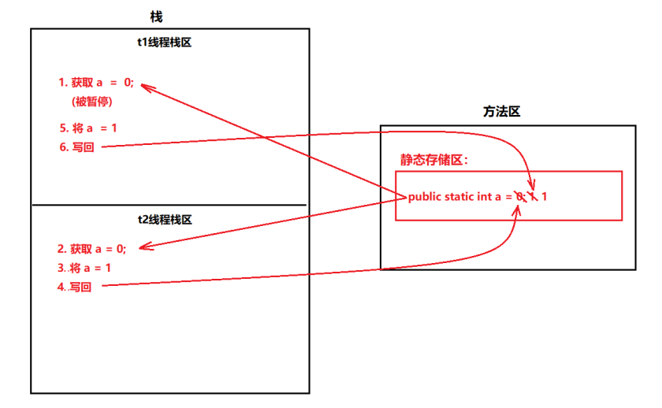
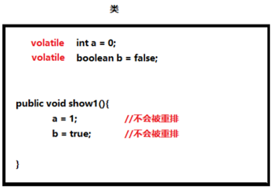
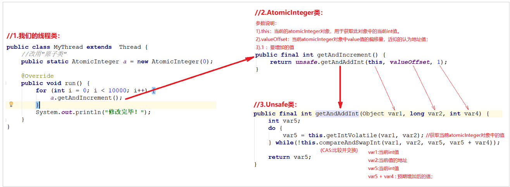

# day07【线程安全，volatile，synchronized关键字，JUC并发包】

## 今日内容

- 线程安全问题

- volatile关键字

- 原子类

- synchronized关键字

- 并发包


## 教学目标


- [ ] 能够理解并发中线程安全问题
- [ ] 能够说出volatile关键字的作用
- [ ] 能够使用原子类AtomicInteger解决线程安全问题
- [ ] 能够理解原子类的CAS工作机制
- [ ] 能够使用同步代码块解决线程安全问题
- [ ] 能够使用同步方法解决线程安全问题
- [ ] 能够说明volatile关键字和synchronized关键字的区别
- [ ] 能够说出CopyOnWriteArrayList类的作用
- [ ] 能够说出CopyOnWriteArraySet类的作用
- [ ] 能够说出ConcurrentHashMap类的作用

# 第零章 多线程

我们在之前，学习的程序在没有跳转语句的前提下，都是由上至下依次执行，那现在想要设计一个程序，边打游戏边听歌，怎么设计？

要解决上述问题,咱们得使用多进程或者多线程来解决.

## 1 并发与并行

- **并行**：指两个或多个事件在**同一时刻**发生（同时执行）。
- **并发**：指两个或多个事件在**同一个时间段内**发生(交替执行)。  



在操作系统中，安装了多个程序，并发指的是在一段时间内宏观上有多个程序同时运行，这在单 CPU 系统中，每一时刻只能有一道程序执行，即微观上这些程序是分时的交替运行，只不过是给人的感觉是同时运行，那是因为分时交替运行的时间是非常短的。

而在多个 CPU 系统中，则这些可以并发执行的程序便可以分配到多个处理器上（CPU），实现多任务并行执行，即利用每个处理器来处理一个可以并发执行的程序，这样多个程序便可以同时执行。目前电脑市场上说的多核 CPU，便是多核处理器，核越多，并行处理的程序越多，能大大的提高电脑运行的效率。

> 注意：单核处理器的计算机肯定是不能并行的处理多个任务的，只能是多个任务在单个CPU上并发运行。同理,线程也是一样的，从宏观角度上理解线程是并行运行的，但是从微观角度上分析却是串行运行的，即一个线程一个线程的去运行，当系统只有一个CPU时，线程会以某种顺序执行多个线程，我们把这种情况称之为线程调度。


## 2 线程与进程

- **进程**：是指一个内存中运行的应用程序，每个进程都有一个独立的内存空间，一个应用程序可以同时运行多个进程；进程也是程序的一次执行过程，是系统运行程序的基本单位；系统运行一个程序即是一个进程从创建、运行到消亡的过程。
- **线程**：是进程中的一个执行单元，负责当前进程中程序的执行，一个进程中至少有一个线程。一个进程中是可以有多个线程的，这个应用程序也可以称之为多线程程序。

**进程**



**线程**


**进程与线程的区别**

- 进程：有独立的内存空间，进程中的数据存放空间（堆空间和栈空间）是独立的，至少有一个线程。
- 线程：堆空间是共享的，栈空间是独立的，线程消耗的资源比进程小的多。

> **注意：**下面内容为了解知识点
>
> 1:因为一个进程中的多个线程是并发运行的，那么从微观角度看也是有先后顺序的，哪个线程执行完全取决于 CPU 的调度，程序员是干涉不了的。而这也就造成的多线程的随机性。
>
> 2:Java 程序的进程里面至少包含两个线程，主进程也就是 main()方法线程，另外一个是垃圾回收机制线程。每当使用 java 命令执行一个类时，实际上都会启动一个 JVM，每一个 JVM 实际上就是在操作系统中启动了一个线程，java 本身具备了垃圾的收集机制，所以在 Java 运行时至少会启动两个线程。
>
> 3:由于创建一个线程的开销比创建一个进程的开销小的多，那么我们在开发多任务运行的时候，通常考虑创建多线程，而不是创建多进程。

**线程调度:**

- 分时调度

  ​	所有线程轮流使用 CPU 的使用权，平均分配每个线程占用 CPU 的时间。

- 抢占式调度

  ​	优先让优先级高的线程使用 CPU，如果线程的优先级相同，那么会随机选择一个(线程随机性)，Java使用的为抢占式调度。

   

## 3 Thread类

线程开启我们需要用到了`java.lang.Thread`类，API中该类中定义了有关线程的一些方法，具体如下：

**构造方法：**

- `public Thread()`:分配一个新的线程对象。
- `public Thread(String name)`:分配一个指定名字的新的线程对象。
- `public Thread(Runnable target)`:分配一个带有指定目标新的线程对象。
- `public Thread(Runnable target,String name)`:分配一个带有指定目标新的线程对象并指定名字。

**常用方法：**

- `public String getName()`:获取当前线程名称。
- `public void start()`:导致此线程开始执行; Java虚拟机调用此线程的run方法。
- `public void run()`:此线程要执行的任务在此处定义代码。
- `public static void sleep(long millis)`:使当前正在执行的线程以指定的毫秒数暂停（暂时停止执行）。
- `public static Thread currentThread()  `:返回对当前正在执行的线程对象的引用。

翻阅API后得知创建线程的方式总共有两种，一种是继承Thread类方式，一种是实现Runnable接口方式，方式一我们上一天已经完成，接下来讲解方式二实现的方式。


## 4 创建线程方式一_继承方式

Java使用`java.lang.Thread`类代表**线程**，所有的线程对象都必须是Thread类或其子类的实例。每个线程的作用是完成一定的任务，实际上就是执行一段程序流即一段顺序执行的代码。Java使用线程执行体来代表这段程序流。Java中通过继承Thread类来**创建**并**启动多线程**的步骤如下：

1. 定义Thread类的子类，并重写该类的run()方法，该run()方法的方法体就代表了线程需要完成的任务,因此把run()方法称为线程执行体。
2. 创建Thread子类的实例，即创建了线程对象
3. 调用线程对象的start()方法来启动该线程

代码如下：

测试类：

```java
public class Demo01 {
	public static void main(String[] args) {
		//创建自定义线程对象
		MyThread mt = new MyThread("新的线程！");
		//开启新线程
		mt.start();
		//在主方法中执行for循环
		for (int i = 0; i < 200; i++) {
			System.out.println("main线程！"+i);
		}
	}
}
```

自定义线程类：

```java
public class MyThread extends Thread {
	//定义指定线程名称的构造方法
	public MyThread(String name) {
		//调用父类的String参数的构造方法，指定线程的名称
		super(name);
	}
  	public MyThread() {
		//不指定线程的名字,线程有默认的名字Thread-0
	}
	/**
	 * 重写run方法，完成该线程执行的逻辑
	 */
	@Override
	public void run() {
		for (int i = 0; i < 200; i++) {
			System.out.println(getName()+"：正在执行！"+i);
		}
	}
}
```


## 5 创建线程方式二_实现方式

采用`java.lang.Runnable`也是非常常见的一种，我们只需要重写run方法即可。

步骤如下：

1. 定义Runnable接口的实现类，并重写该接口的run()方法，该run()方法的方法体同样是该线程的线程执行体。
2. 创建Runnable实现类的实例，并以此实例作为Thread的target来创建Thread对象，该Thread对象才是真正的线程对象。
3. 调用线程对象的start()方法来启动线程。

代码如下：

```java
public class MyRunnable implements Runnable{
	@Override
	public void run() {
		for (int i = 0; i < 20; i++) {
			System.out.println(Thread.currentThread().getName()+" "+i);
		}
	}
}
```

```java
public class Demo {
    public static void main(String[] args) {
        //创建自定义类对象  线程任务对象
        MyRunnable mr = new MyRunnable();
        //创建线程对象
        Thread t = new Thread(mr, "小强");
        t.start();
        for (int i = 0; i < 20; i++) {
            System.out.println("旺财 " + i);
        }
    }
}
```

通过实现Runnable接口，使得该类有了多线程类的特征。run()方法是多线程程序的一个执行目标。所有的多线程代码都在run方法里面。Thread类实际上也是实现了Runnable接口的类。

在启动的多线程的时候，需要先通过Thread类的构造方法Thread(Runnable target) 构造出对象，然后调用Thread对象的start()方法来运行多线程代码。

实际上所有的多线程代码都是通过运行Thread的start()方法来运行的。因此，不管是继承Thread类还是实现Runnable接口来实现多线程，最终还是通过Thread的对象的API来控制线程的，熟悉Thread类的API是进行多线程编程的基础。

> tips:Runnable对象仅仅作为Thread对象的target，Runnable实现类里包含的run()方法仅作为线程执行体。而实际的线程对象依然是Thread实例，只是该Thread线程负责执行其target的run()方法。

**Thread和Runnable的区别**

如果一个类继承Thread，则不适合资源共享。但是如果实现了Runable接口的话，则很容易的实现资源共享。

**总结：**

**实现Runnable接口比继承Thread类所具有的优势：**

1. 适合多个相同的程序代码的线程去共享同一个资源。
2. 可以避免java中的单继承的局限性。
3. 增加程序的健壮性，实现解耦操作，代码可以被多个线程共享，代码和线程独立。
4. 线程池只能放入实现Runable或Callable类线程，不能直接放入继承Thread的类。


## 6 匿名内部类方式

使用线程的内匿名内部类方式，可以方便的实现每个线程执行不同的线程任务操作。

使用匿名内部类的方式实现Runnable接口，重新Runnable接口中的run方法：

```java
public class NoNameInnerClassThread {
   	public static void main(String[] args) {	   	
//		new Runnable(){
//			public void run(){
//				for (int i = 0; i < 20; i++) {
//					System.out.println("张宇:"+i);
//				}
//			}  
//	   	}; //---这个整体  相当于new MyRunnable()
        Runnable r = new Runnable(){
            public void run(){
                for (int i = 0; i < 20; i++) {
                  	System.out.println("张宇:"+i);
                }
            }  
        };
        new Thread(r).start();

        for (int i = 0; i < 20; i++) {
          	System.out.println("费玉清:"+i);
        }
   	}
}
```


# 第一章 高并发及线程安全

## 1.1 高并发及线程安全

- **高并发**：是指在某个时间点上，有大量的用户(线程)同时访问同一资源。例如：天猫的双11购物节、12306的在线购票在某个时间点上，都会面临大量用户同时抢购同一件商品/车票的情况。
- **线程安全**：在某个时间点上，当大量用户(线程)访问同一资源时，由于多线程运行机制的原因，可能会导致被访问的资源出现"数据污染"的问题。

## 1.2 多线程的运行机制

- 当一个线程启动后，JVM会为其分配一个独立的"线程栈区"，这个线程会在这个独立的栈区中运行。

- 看一下简单的线程的代码：

  > 1. 一个线程类：

  ```java
  public class MyThread extends Thread {
      @Override
      public void run() {
          for (int i = 0; i < 100; i++) {
              System.out.println("i = " + i);
          }
      }
  }
  ```

  > 1. 测试类：

  ```java
  public class Demo {
      public static void main(String[] args) {
          //1.创建两个线程对象
          MyThread t1 = new MyThread();
          MyThread t2 = new MyThread();
  
          //2.启动两个线程
          t1.start();
          t2.start();
      }
  }
  ```

- **启动后，内存的运行机制：**

   

  **多个线程在各自栈区中独立、无序的运行，当访问一些代码，或者同一个变量时，就可能会产生一些问题**


## 1.3 多线程的安全性问题-可见性

- 例如下面的程序，先启动一个线程，在线程中将一个变量的值更改，而主线程却一直无法获得此变量的新值。

  > 1. 线程类：

  ```java
  public class MyThread extends Thread {
      public static int a = 0;
      @Override
      public void run() {
          System.out.println("线程启动，休息2秒...");
          try {
              Thread.sleep(1000 * 2);
          } catch (InterruptedException e) {
              e.printStackTrace();
          }
          System.out.println("将a的值改为1");
          a = 1;
          System.out.println("线程结束...");
      }
  }
  ```

  > 1. 测试类：

  ```java
  public class Demo {
      public static void main(String[] args) {
          //1.启动线程
          MyThread t = new MyThread();
          t.start();
  
          //2.主线程继续
          while (true) {
              if (MyThread.a == 1) {
                  System.out.println("主线程读到了a = 1");
              }
          }
      }
  }
  ```

  > 1. 启动后，控制台打印：

   


## 1.4 多线程的安全性问题-有序性

- 有些时候“编译器”在编译代码时，会对代码进行“重排”，例如：

  ​             int a = 10;     //1

  ​             int b = 20;     //2

  ​             int c = a + b;   //3

  第一行和第二行可能会被“重排”：可能先编译第二行，再编译第一行，总之在执行第三行之前，会将1,2编译完毕。1和2先编译谁，不影响第三行的结果。

- 但在“多线程”情况下，代码重排，可能会对另一个线程访问的结果产生影响：  

  

  **多线程环境下，我们通常不希望对一些代码进行重排的！！**


## 1.5 多线程的安全性问题-原子性

- 请看以下示例：

  > 1.制作线程类

  ```java
  public class MyThread extends  Thread {
      public static int a = 0;
  
      @Override
      public void run() {
          for (int i = 0; i < 10000; i++) {
              a++;
          }
          System.out.println("修改完毕！");
      }
  }
  
  ```


  > 2.制作测试类

  ```java
  public class Demo {
      public static void main(String[] args) throws InterruptedException {
          //1.启动两个线程
          MyThread t1 = new MyThread();
          MyThread t2 = new MyThread();
  
          t1.start();
          t2.start();
  
          Thread.sleep(1000);
          System.out.println("获取a最终值：" + MyThread.a);//总是不准确的。原因：两个线程访问a的步骤不具有：原子性
  
      }
  }
  
  ```

  >   > 内存工作原理图示：
  >
  >   

  线程t1先读取a 的值为：0

  t1被暂停

  线程t2读取a的值为：0

  t2将a = 1

  t2将a写回主内存

  t1将a = 1

  t1将a写回主内存(将t2更改的1，又更改为1)

  所以两次加1，但结果仍为1，少加了一次。

  **原因：两个线程访问同一个变量a的代码不具有"原子性"**


# 第二章 volatile关键字  

## 2.1 什么是volatile关键字

- volatile是一个"变量修饰符"，它只能修饰"成员变量"，它能强制线程每次从主内存获取值，并能保证此变量不会被编译器优化。
- volatile能解决变量的可见性、有序性；
- volatile不能解决变量的原子性


## 2.2 volatile解决可见性  

- 将1.3的线程类MyThread做如下修改：

  > 1. 线程类：

  ```java
  public class MyThread extends Thread {
      public static volatile int a = 0;//增加volatile关键字
      @Override
      public void run() {
          System.out.println("线程启动，休息2秒...");
          try {
              Thread.sleep(1000 * 2);
          } catch (InterruptedException e) {
              e.printStackTrace();
          }
          System.out.println("将a的值改为1");
          a = 1;
          System.out.println("线程结束...");
      }
  }
  ```

  > 1. 测试类

  ```java
  public class Demo {
      public static void main(String[] args) {
          //1.启动线程
          MyThread t = new MyThread();
          t.start();
  
          //2.主线程继续
          while (true) {
              if (MyThread.a == 1) {
                  System.out.println("主线程读到了a = 1");
              }
          }
      }
  }
  ```

  **当变量被修饰为volatile时，会迫使线程每次使用此变量，都会去主内存获取，保证其可见性**


## 2.3 volatile解决有序性

- 当变量被修饰为volatile时，会禁止代码重排

   


## 2.4 volatile不能解决原子性  

- 对于示例1.5，加入volatile关键字并不能解决原子性：

  > 1. 线程类：

  ```java
  public class MyThread extends  Thread {
      public static volatile int a = 0;
  
      @Override
      public void run() {
          for (int i = 0; i < 10000; i++) {
              //线程1：取出a的值a=0(被暂停)
              a++;
              //写回
          }
          System.out.println("修改完毕！");
      }
  }
  
  ```

  > 1. 测试类：

  ```java
  public class Demo {
      public static void main(String[] args) throws InterruptedException {
          //1.启动两个线程
          MyThread t1 = new MyThread();
          MyThread t2 = new MyThread();
  
          t1.start();
          t2.start();
  
          Thread.sleep(1000);
          System.out.println("获取a最终值：" + MyThread.a);//最终结果仍然不正确。
  
      }
  }
  
  ```

  **所以，volatile关键字只能解决"变量"的可见性、有序性问题，并不能解决原子性问题**


# 第三章 原子类  

## 3.1 原子类概述

在java.util.concurrent.atomic包下定义了一些对“变量”操作的“原子类”:

​    1). `java.util.concurrent.atomic.AtomicInteger`：对int变量操作的“原子类”;

​    2). `java.util.concurrent.atomic.AtomicLong`：对long变量操作的“原子类”;

​    3). `java.util.concurrent.atomic.AtomicBoolean`：对boolean变量操作的“原子类”;


**它们可以保证对“变量”操作的：原子性、有序性、可见性。**


## 3.2 AtomicInteger类示例

- 我们可以通过AtomicInteger类，来看看它们是怎样工作的

  > 1. 线程类：

  ```java
  public class MyThread extends  Thread {
      //public static volatile int a = 0;//不直接使用基本类型变量
  
      //改用"原子类"
      public static AtomicInteger a = new AtomicInteger(0);
  
      @Override
      public void run() {
          for (int i = 0; i < 10000; i++) {
  			// a++;
              a.getAndIncrement();//先获取，再自增1：a++
          }
          System.out.println("修改完毕！");
      }
  }
  
  ```

  > 1. 测试类：

  ```java
  public class Demo {
      public static void main(String[] args) throws InterruptedException {
          //1.启动两个线程
          MyThread t1 = new MyThread();
          MyThread t2 = new MyThread();
  
          t1.start();
          t2.start();
  
          Thread.sleep(1000);
          System.out.println("获取a最终值：" + MyThread.a.get());
      }
  }
  
  ```

  **我们能看到，无论程序运行多少次，其结果总是正确的！**


## 3.3 AtomicInteger类的工作原理-CAS机制

- 先来看一下调用过程：

  

- 在Unsafe类中，调用了一个：compareAndSwapInt()方法，此方法的几个参数：

  - var1：传入的AtomicInteger对象
  - var2：AtommicInteger内部变量的偏移地址
  - var5：之前取出的AtomicInteger中的值；
  - var5 + var4：预期结果

  此方法使用了一种"比较并交换(Compare And Swap)"的机制，它会用var1和var2先获取内存中AtomicInteger中的值，然后和传入的，之前获取的值var5做一下比较，也就是比较当前内存的值和预期的值是否一致，如果一致就修改为var5 + var4，否则就继续循环，再次获取AtomicInteger中的值，再进行比较并交换，直至成功交换为止。

- compareAndSwapInt()方法是"线程安全"的。

- 我们假设两个线程交替运行的情况，看看它是怎样工作的：

  - 初始AtomicInteger的值为0

  - 线程A执行：var5 = this.getIntVolatile(var1,var2);获取的结果为：0

  - 线程A被暂停

  - 线程B执行：var5 = this.getIntVolatile(var1,var2);获取的结果为：0

  - 线程B执行：this.compareAndSwapInt(var1,var2,var5,var5 + var4)

  - 线程B成功将AtomicInteger中的值改为1

  - 线程A恢复运行，执行：this.compareAndSwapInt(var1,var2,var5,var5 + var4)

    此时线程A使用var1和var2从AtomicInteger中获取的值为：1，而传入的var5为0，比较失败，返回false，继续循环。

  - 线程A执行：var5 = this.getIntVolatile(var1,var2);获取的结果为：1

  - 线程A执行：this.compareAndSwapInt(var1,var2,var5,var5 + var4)

    此时线程A使用var1和var2从AtomicInteger中获取的值为：1，而传入的var5为1，比较成功，将其修改为var5 + var4，也就是2，将AtomicInteger中的值改为2，结束。

- CAS机制也被称为：乐观锁。因为大部分比较的结果为true，就直接修改了。只有少部分多线程并发的情况会导致CAS失败，而再次循环。


## 3.4 AtomicIntegerArray类示例

- 常用的数组操作的原子类：
  1). `java.util.concurrent.atomic.AtomicIntegetArray`:对int数组操作的原子类。

  2). `java.util.concurrent.atomic.AtomicLongArray`：对long数组操作的原子类。

  3). `java.utio.concurrent.atomic.AtomicReferenceArray`：对引用类型数组操作的原子类。

- 数组的多线程并发访问的安全性问题：

  > 1. 线程类：

  ```java
  public class MyThread extends Thread {
      private static int[] intArray = new int[1000];//不直接使用数组
  
      @Override
      public void run() {
          for (int i = 0; i < arr.length(); i++) {
              intArray[i]++;
          }
      }
  }
  
  ```

  > 1. 测试类：

  ```java
  public class Demo {
      public static void main(String[] args) throws InterruptedException {
          for (int i = 0; i < 1000; i++) {
              new MyThread().start();//创建1000个线程，每个线程为数组的每个元素+1
          }
  
          Thread.sleep(1000 * 5);//让所有线程执行完毕
  
          System.out.println("主线程休息5秒醒来");
          for (int i = 0; i < MyThread.intArray.length(); i++) {
              System.out.println(MyThread.intArray[i]);
          }
      }
  }
  
  ```

  正常情况，数组的每个元素最终结果应为：1000，而实际打印：

  ```java
  1000
  1000
  1000
  1000
  999
  999
  999
  999
  999
  999
  999
  999
  1000
  1000
  1000
  1000
  ```

  可以发现，有些元素并不是1000.

- 为保证数组的多线程安全，改用AtomicIntegerArray类，演示：

  > 1. 线程类：

  ```java
  public class MyThread extends Thread {
      private static int[] intArray = new int[1000];//定义一个数组
      //改用原子类，使用数组构造
      public static AtomicIntegerArray arr = new AtomicIntegerArray(intArray);
      @Override
      public void run() {
          for (int i = 0; i < arr.length(); i++) {
              arr.addAndGet(i, 1);//将i位置上的元素 + 1
          }
      }
  }
  
  ```

  > 1. 测试类：

  ```java
  public class Demo {
      public static void main(String[] args) throws InterruptedException {
          for (int i = 0; i < 1000; i++) {
              new MyThread().start();
          }
          Thread.sleep(1000 * 5);//让所有线程执行完毕
  
          System.out.println("主线程休息5秒醒来");
          for (int i = 0; i < MyThread.arr.length(); i++) {
              System.out.println(MyThread.arr.get(i));
          }
      }
  }
  ```

  先在能看到，每次运行的结果都是正确的。


# 第四章 synchronized关键字

## 4.1 多行代码的原子性问题

- 之前的AtomicInteger类只能保证"变量"的原子性操作，而对多行代码进行"原子性"操作，使用AtomicInteger类就不能达到效果了。

- 我们通过一个案例，演示线程的安全问题：

  电影院要卖票，我们模拟电影院的卖票过程。假设要播放的电影是 “葫芦娃大战奥特曼”，本次电影的座位共100个(本场电影只能卖100张票)。

  我们来模拟电影院的售票窗口，实现多个窗口同时卖 “葫芦娃大战奥特曼”这场电影票(多个窗口一起卖这100张票)需要窗口，采用线程对象来模拟；需要票，Runnable接口子类来模拟。

模拟票：

```java
public class Ticket implements Runnable {
    private int ticket = 100;
    /*
     * 执行卖票操作
     */
    @Override
    public void run() {
        //每个窗口卖票的操作 
        //窗口 永远开启 
        while (true) {
            if (ticket > 0) {//有票 可以卖
                //出票操作
                //使用sleep模拟一下出票时间 
                try {
                    Thread.sleep(100);
                } catch (InterruptedException e) {
                    // TODO Auto-generated catch block
                    e.printStackTrace();
                }
                //获取当前线程对象的名字 
                String name = Thread.currentThread().getName();
                System.out.println(name + "正在卖:" + ticket--);
            }
        }
    }
}
```

测试类：

```java
public class Demo {
	public static void main(String[] args) {
		//创建线程任务对象
		Ticket ticket = new Ticket();
		//创建三个窗口对象
		Thread t1 = new Thread(ticket, "窗口1");
		Thread t2 = new Thread(ticket, "窗口2");
		Thread t3 = new Thread(ticket, "窗口3");
		
		//同时卖票
		t1.start();
		t2.start();
		t3.start();
	}
}
```

结果中有一部分这样现象：


发现程序出现了两个问题：

1. 相同的票数,比如5这张票被卖了两回。
2. 不存在的票，比如0票与-1票，是不存在的。

这种问题，几个窗口(线程)票数不同步了，这种问题称为线程不安全。

> 线程安全问题都是由全局变量及静态变量引起的。而每个线程操作这个变量都需要很多步骤：获取变量的值、打印变量的值、更改变量的值，而一个线程在执行某一步骤时都可能被暂停，而另一个线程会执行，这同样会导致多个线程访问同一个变量，最终导致这个变量的值不准确。


## 4.2 synchronized关键字概述

- synchronized关键字：表示“同步”的。它可以对“多行代码”进行“同步”——将多行代码当成是一个完整的整体，一个线程如果进入到这个代码块中，会全部执行完毕，执行结束后，其它线程才会执行。这样可以保证这多行的代码作为完整的整体，被一个线程完整的执行完毕。

- synchronized被称为“重量级的锁”方式，也是“悲观锁”——效率比较低。

- synchronized有几种使用方式：
  a).同步代码块

  b).同步方法【常用】

当我们使用多个线程访问同一资源的时候，且多个线程中对资源有写的操作，就容易出现线程安全问题。

要解决上述多线程并发访问一个资源的安全性问题:也就是解决重复票与不存在票问题，Java中提供了同步机制(**synchronized**)来解决。

根据案例简述：

```
窗口1线程进入操作的时候，窗口2和窗口3线程只能在外等着，窗口1操作结束，窗口1和窗口2和窗口3才有机会进入代码去执行。也就是说在某个线程修改共享资源的时候，其他线程不能修改该资源，等待修改完毕同步之后，才能去抢夺CPU资源，完成对应的操作，保证了数据的同步性，解决了线程不安全的现象。
```


## 4.3 同步代码块

- **同步代码块**：`synchronized`关键字可以用于方法中的某个区块中，表示只对这个区块的资源实行互斥访问。

格式: 

```java
synchronized(同步锁){
     需要同步操作的代码
}
```

**同步锁**:

对象的同步锁只是一个概念,可以想象为在对象上标记了一个锁.

1. 锁对象 可以是任意类型。
2. 多个线程对象  要使用同一把锁。

> 注意:在任何时候,最多允许一个线程拥有同步锁,谁拿到锁就进入代码块,其他的线程只能在外等着(BLOCKED)。

使用同步代码块解决代码：

```java
public class Ticket implements Runnable{
	private int ticket = 100;
	
	Object lock = new Object();
	/*
	 * 执行卖票操作
	 */
	@Override
	public void run() {
		//每个窗口卖票的操作 
		//窗口 永远开启 
		while(true){
			synchronized (lock) {
				if(ticket>0){//有票 可以卖
					//出票操作
					//使用sleep模拟一下出票时间 
					try {
						Thread.sleep(50);
					} catch (InterruptedException e) {
						// TODO Auto-generated catch block
						e.printStackTrace();
					}
					//获取当前线程对象的名字 
					String name = Thread.currentThread().getName();
					System.out.println(name+"正在卖:"+ticket--);
				}
			}
		}
	}
}
```

当使用了同步代码块后，上述的线程的安全问题，解决了。


## 4.4 同步方法

- **同步方法**:使用synchronized修饰的方法,就叫做同步方法,保证A线程执行该方法的时候,其他线程只能在方法外等着。

格式：

```java
public synchronized void method(){
   	可能会产生线程安全问题的代码
}
```

> 同步锁是谁?
>
> ​      对于非static方法,同步锁就是this。  
>
> ​      对于static方法,我们使用当前方法所在类的字节码对象(类名.class)。

使用同步方法代码如下：

```java
public class Ticket implements Runnable{
	private int ticket = 100;
	/*
	 * 执行卖票操作
	 */
	@Override
	public void run() {
		//每个窗口卖票的操作 
		//窗口 永远开启 
		while(true){
			sellTicket();
		}
	}
	
	/*
	 * 锁对象 是 谁调用这个方法 就是谁 
	 *   隐含 锁对象 就是  this
	 *    
	 */
	public synchronized void sellTicket(){
        if(ticket>0){//有票 可以卖	
            //出票操作
            //使用sleep模拟一下出票时间 
            try {
              	Thread.sleep(100);
            } catch (InterruptedException e) {
              	// TODO Auto-generated catch block
              	e.printStackTrace();
            }
            //获取当前线程对象的名字 
            String name = Thread.currentThread().getName();
            System.out.println(name+"正在卖:"+ticket--);
        }
	}
}
```


## 4.5 Lock锁

`java.util.concurrent.locks.Lock`机制提供了比**synchronized**代码块和**synchronized**方法更广泛的锁定操作,同步代码块/同步方法具有的功能Lock都有,除此之外更强大

Lock锁也称同步锁，加锁与释放锁方法化了，如下：

- `public void lock() `:加同步锁。
- `public void unlock()`:释放同步锁。

使用如下：

```java
public class Ticket implements Runnable{
	private int ticket = 100;
	
	Lock lock = new ReentrantLock();
	/*
	 * 执行卖票操作
	 */
	@Override
	public void run() {
		//每个窗口卖票的操作 
		//窗口 永远开启 
		while(true){
			lock.lock();
			if(ticket>0){//有票 可以卖
				//出票操作 
				//使用sleep模拟一下出票时间 
				try {
					Thread.sleep(50);
				} catch (InterruptedException e) {
					// TODO Auto-generated catch block
					e.printStackTrace();
				}
				//获取当前线程对象的名字 
				String name = Thread.currentThread().getName();
				System.out.println(name+"正在卖:"+ticket--);
			}
			lock.unlock();
		}
	}
}
```


# 第五章 并发包 

在JDK的并发包里提供了几个非常有用的并发容器和并发工具类。供我们在多线程开发中进行使用。


## 5.1 CopyOnWriteArrayList

- ArrayList的线程不安全：

  > 1. 定义线程类：

  ~~~java
  public class MyThread extends Thread {
      public static List<Integer> list = new ArrayList<>();//线程不安全的
      @Override
      public void run() {
          for (int i = 0; i < 10000; i++) {
              list.add(i);
          }
          System.out.println("添加完毕！");
      }
  }
  
  ~~~

  > 2. 定义测试类：

  ~~~java
  public class Demo {
      public static void main(String[] args) throws InterruptedException {
          MyThread t1 = new MyThread();
          MyThread t2 = new MyThread();
  
          t1.start();
          t2.start();
  
          Thread.sleep(1000);
  
          System.out.println("最终集合的长度：" + MyThread.list.size());
      }
  }
  
  ~~~

  最终结果可能会抛异常，或者最终集合大小是不正确的。

- CopyOnWriteArrayList是线程安全的：

  > 1. 定义线程类：

  ~~~java
  public class MyThread extends Thread {
  //    public static List<Integer> list = new ArrayList<>();//线程不安全的
      //改用：线程安全的List集合:
      public static CopyOnWriteArrayList<Integer> list = new CopyOnWriteArrayList<>();
  
      @Override
      public void run() {
          for (int i = 0; i < 10000; i++) {
              list.add(i);
          }
          System.out.println("添加完毕！");
      }
  }
  
  ~~~

  > 2. 测试类：

  ~~~java
  public class Demo {
      public static void main(String[] args) throws InterruptedException {
          MyThread t1 = new MyThread();
          MyThread t2 = new MyThread();
  
          t1.start();
          t2.start();
  
          Thread.sleep(1000);
  
          System.out.println("最终集合的长度：" + MyThread.list.size());
      }
  }
  
  ~~~

  结果始终是正确的。


## 5.2 CopyOnWriteArraySet

- **HashSet仍然是线程不安全的：**

  > 1. 线程类：

  ~~~java
  public class MyThread extends Thread {
  	public static Set<Integer> set = new HashSet<>();//线程不安全的
      @Override
      public void run() {
          for (int i = 0; i < 10000; i++) {
              set.add(i);
          }
          System.out.println("添加完毕！");
      }
  }
  
  ~~~

  > 2. 测试类：

  ~~~java
  public class Demo {
      public static void main(String[] args) throws InterruptedException {
          MyThread t1 = new MyThread();
          t1.start();
  
          //主线程也添加10000个
          for (int i = 10000; i < 20000; i++) {
              MyThread.set.add(i);
  
          }
          Thread.sleep(1000 * 3);
          System.out.println("最终集合的长度：" + MyThread.set.size());
      }
  }
  
  ~~~

  最终结果可能会抛异常，也可能最终的长度是错误的！！

- **CopyOnWriteArraySet是线程安全的：**

  > 1. 线程类：

  ~~~java
  public class MyThread extends Thread {
  //    public static Set<Integer> set = new HashSet<>();//线程不安全的
      //改用：线程安全的Set集合:
      public static CopyOnWriteArraySet<Integer> set = new CopyOnWriteArraySet<>();
  
      @Override
      public void run() {
          for (int i = 0; i < 10000; i++) {
              set.add(i);
          }
          System.out.println("添加完毕！");
      }
  }
  
  ~~~

  > 2. 测试类：

  ~~~java
  public class Demo {
      public static void main(String[] args) throws InterruptedException {
          MyThread t1 = new MyThread();
          t1.start();
  
          //主线程也添加10000个
          for (int i = 10000; i < 20000; i++) {
              MyThread.set.add(i);
  
          }
          Thread.sleep(1000 * 3);
          System.out.println("最终集合的长度：" + MyThread.set.size());
      }
  }
  
  ~~~

  可以看到结果总是正确的！！


## 5.3 ConcurrentHashMap

- **HashMap是线程不安全的。**

  > 1. 线程类：

  ~~~java
  public class MyThread extends Thread {
      public static Map<Integer, Integer> map = new HashMap<>();
      @Override
      public void run() {
          for (int i = 0; i < 10000; i++) {
              map.put(i, i);
          }
      }
  }
  
  ~~~

  > 2. 测试类：

  ~~~java
  public class Demo {
      public static void main(String[] args) throws InterruptedException {
          MyThread t1 = new MyThread();
          t1.start();
  
          for (int i = 10000; i < 20000 ; i++) {
              MyThread.map.put(i, i);
  
          }
          Thread.sleep(1000 * 2);
  
          System.out.println("map最终大小：" + MyThread.map.size());
      }
  }
  
  ~~~

  运行结果可能会出现异常、或者结果不准确！！

- **Hashtable是线程安全的，但效率低：**

  我们改用JDK提供的一个早期的线程安全的Hashtable类来改写此例，注意：我们加入了"计时"。

  > 1. 线程类：

  ~~~java
  public class MyThread extends Thread {
      public static Map<Integer, Integer> map = new Hashtable<>();
      @Override
      public void run() {
          long start = System.currentTimeMillis();
          for (int i = 0; i < 100000; i++) {
              map.put(i, i);
          }
          long end = System.currentTimeMillis();
          System.out.println((end - start) + " 毫秒");
      }
  }
  
  ~~~

  > 2. 测试类：

  ~~~java
  public class Demo {
      public static void main(String[] args) throws InterruptedException {
          for (int i = 0; i < 1000; i++) {
              new MyThread().start();//开启1000个线程
          }
  
          Thread.sleep(1000 * 20);//由于每个线程执行时间稍长，所以这里多停顿一会
  
          System.out.println("map的最终大小：" + MyThread.map.size());
         
      }
  }
  
  ~~~

  > 3. 最终打印结果：

  ~~~java
  ...
  ...
  15505 毫秒
  15509 毫秒
  15496 毫秒
  15501 毫秒
  15539 毫秒
  15540 毫秒
  15542 毫秒
  15510 毫秒
  15541 毫秒
  15502 毫秒
  15533 毫秒
  15647 毫秒
  15544 毫秒
  15619 毫秒
  map的最终大小：100000
  ~~~

  能看到结果是正确的，但耗时较长。

- **改用ConcurrentHashMap**

  > 1. 线程类：

  ~~~java
  public class MyThread extends Thread {
      public static Map<Integer, Integer> map = new ConcurrentHashMap<>();
  
      @Override
    public void run() {
          long start = System.currentTimeMillis();
        for (int i = 0; i < 100000; i++) {
              map.put(i, i);
          }
          long end = System.currentTimeMillis();
          System.out.println((end - start) + " 毫秒");
      }
  }
  ~~~

  > 2. 测试类：

~~~java
  public class Demo {
    public static void main(String[] args) throws InterruptedException {
          for (int i = 0; i < 1000; i++) {
              new MyThread().start();
          }
  
          Thread.sleep(1000 * 20);
  
          System.out.println("map的最终大小：" + MyThread.map.size());
      }
  }
~~~

  > 3. 最终结果：

  ~~~java
  ...
  ...
  3995 毫秒
  3997 毫秒
  4007 毫秒
  4007 毫秒
  4008 毫秒
  4010 毫秒
  4019 毫秒
  4022 毫秒
  4026 毫秒
  3985 毫秒
  4152 毫秒
  4292 毫秒
  map的最终大小：100000
  ~~~

  可以看到效率提高了很多！！！

- HashTable效率低下原因：

```java
public synchronized V put(K key, V value) 
public synchronized V get(Object key)
```

HashTable容器使用synchronized来保证线程安全，但在线程竞争激烈的情况下HashTable的效率非常低下。因为当一个线程访问HashTable的同步方法，其他线程也访问HashTable的同步方法时，会进入阻塞状态。如线程1使用put进行元素添加，线程2不但不能使用put方法添加元素，也不能使用get方法来获取元素，所以竞争越激烈效率越低。


**ConcurrentHashMap高效的原因：CAS + 局部(synchronized)锁定**


