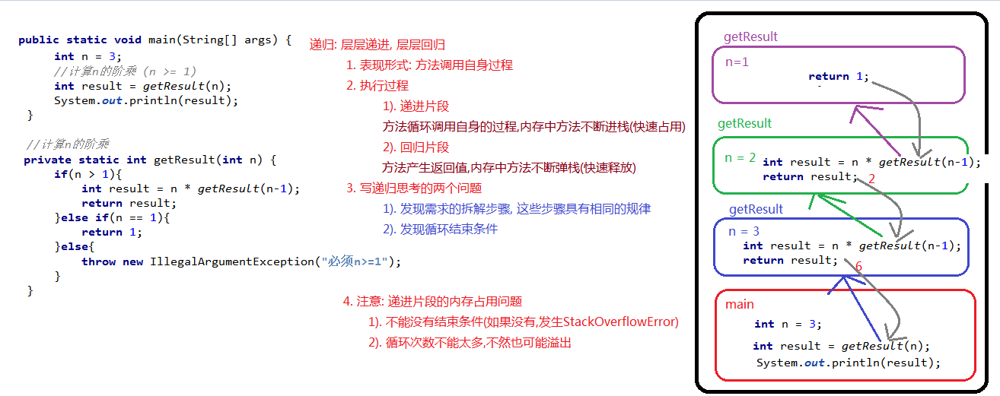
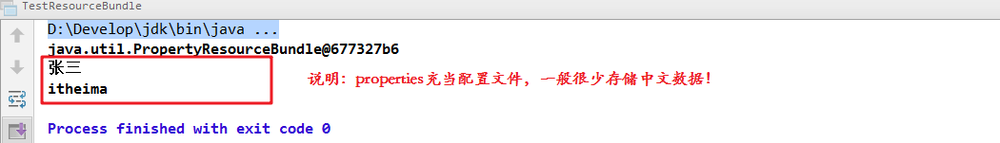

# day10【递归，字节流，字符流，IO异常处理，Properties】

## 今日内容

- 递归
- IO流
- 字节流
- 字符流
- Properties
- ResourceBundle

## 教学目标  

- [ ]  能够描述递归在代码中的体现
- [ ]  能够使用递归完成文件夹的遍历
- [ ]  能够描述递归内存溢出隐患的原因
- [ ]  能够说出IO流的分类和对应功能
- [ ]  能够使用字节输出流写出数据到文件
- [ ]  能够使用字节输入流读取数据到程序
- [ ]  能够使用字节流完成文件的复制
- [ ]  能够使用FileWriter写出字符数据到文件
- [ ]  能够说出FileWriter中关闭和刷新方法的区别
- [ ]  能够使用FileWriter写数据实现换行和追加写
- [ ]  能够使用FileReader读取文本文件
- [ ]  能够使用Properties加载属性文件中配置信息
- [ ]  能够使用ResourceBundle加载属性文件中配置信息


# 第一章 递归

## 1 概述

- **递归**：指在当前方法内调用自己的这种现象。

```java
public static void a(){
    a();
}
```


## 2 递归

```java
package com.itheima01.recursion;
/*
*   递归: recursion
*       表现形式: 方法调用自身的过程
*
*       发现两点:
*           1. 把方法当成一个步骤,这个步骤需要循环调用
*           2. 循环要有结束条件
*
*   入门案例: 计算 n 的阶乘
*       n = 3;
*            3!
*              =  3 * 2!
*                      = 2 * 1!
*                             = 1
*      每一步的规律: 当 n >1的时候 n! = n * (n-1)!
*      结束条件: 当 n = 1, return 1;
* */
public class Demo02 {

    public static void main(String[] args) {
        /*
            java.lang.StackOverflowError  栈溢出错误
         */
//        main(args);

//        method01();

        int n = 100000;
        //计算n的阶乘 (n >= 1)
        int result = getResult(n);
        System.out.println(result);
    }
    //计算n的阶乘
    private static int getResult(int n) {
        if(n > 1){
            int result = n * getResult(n-1);
            return result;
        }else if(n == 1){
            return 1;
        }else{
            throw new IllegalArgumentException("必须n>=1");
        }
    }
    //能用循环,不要用递归
    private static void method01() {
        int n = 6;
        int result = 1;
        for (int i = n; i >= 1; i--) {
            result *= i;
//            result = result * i;
        }
        System.out.println(result);
    }
}
```


  


```java
package com.itheima01.recursion;
/*
*  斐波那契数列 : 不死神兔
*       例子: 首先有一对兔子, 经过两个月的发育,到了第三个月开始,每个月就会出现一对兔子,其余的兔子也符合相同的特点,
*           并且兔子永远不死.
*           请问,第20个月,兔子有几对?
*
*
*       1. 拆解步骤,每个步骤具有相同的规律
*           当 n >= 3, n兔 = (n-1)兔 + (n-2)兔
*
*       2. 结束条件
*           当 n=1 or n=2, return 1;
*
*           1,1,2,3,5,8,13,21,34,55..
*
* */
public class Demo03 {

    public static void main(String[] args) {

        int n = 20;
        //计算第n个月的兔子总数
        int result = getResult(n);
        System.out.println(result);
    }
    //计算第n个月的兔子总数
    private static int getResult(int n) {
        if(n >= 3){
            int result = getResult(n-1) + getResult(n-2);
            return result;
        }else if(n==1 || n==2){
            return 1;
        }else{
            throw new IllegalArgumentException("必须n>=1");
        }
    }
}

```


```java

package com.itheima01.recursion;

import java.io.File;

/*
* # 问题一:删除非空文件夹
*       delete方法只能删除空文件夹, 文件
*       1). 拆解步骤,步骤相同具有相同的规律
*          a. 列出当前文件夹下的所有子文件/子文件夹
*          b. 遍历这些子文件/子文件夹,判断是文件还是文件夹
*          c. 如果是文件,直接删除
*          d. 如果是文件夹, abcde继续循环, 循环之后也删除了文件夹内部的东西
*          e. 此时文件夹自身就变成空文件夹, 再删除文件夹自身即可
*
*          abcde合并成一个方法,然后在d这一步骤,递归调动自身即可
*
*       2). 结束条件
*         文件夹层数有限的情况下, 遍历到最后,肯定都是文件
*
*         补充: 大家可以尝试递归创建多层文件夹,顶多50~100层就结束了
*         注意: 这个delete不走回收站
*
* # 问题二 : 计算非空文件夹的大小
*           length() 只能计算文件大小,不能计算文件夹大小
*
*     windows操作系统下的空间最小: 4kb
*
* */
public class Demo01 {

    public static void main(String[] args) {

        File dir = new File("c:/test/filedoc");

//        deleteFile(dir);
//        System.out.println("删除成功");
        //calculate

        int result = calcFile(dir);
        System.out.println(result);
    }

    private static int calcFile(File dir) {
        int sum = 0;
        File[] files = dir.listFiles();
        for (File sonFile : files) {
            if(sonFile.isFile()){
                sum += sonFile.length();
            }else{
                sum += calcFile(sonFile);
            }
        }
        return sum;
    }

    //第一次循环: C:\test\FileDoc
    //第二次循环: C:\test\FileDoc\folder
    //第三次循环: C:\test\FileDoc\folder\folder
    private static void deleteFile(File dir) {
//        a. 列出当前文件夹下的所有子文件/子文件夹
        File[] files = dir.listFiles();
//         b. 遍历这些子文件/子文件夹,判断是文件还是文件夹
        for (File sonFile : files) {
            //c. 如果是文件,直接删除
            // d. 如果是文件夹, abcde继续循环, 循环之后也删除了文件夹内部的东西
            if(sonFile.isFile()){
                sonFile.delete();
            }else{
                deleteFile(sonFile);
            }
        }
//         e. 此时文件夹自身就变成空文件夹, 再删除文件夹自身即可
        dir.delete();
    }
}

```


# 第二章 IO概述

## 1 什么是IO

生活中，你肯定经历过这样的场景。当你编辑一个文本文件，忘记了`ctrl+s` ，可能文件就白白编辑了。当你电脑上插入一个U盘，可以把一个视频，拷贝到你的电脑硬盘里。那么数据都是在哪些设备上的呢？键盘、内存、硬盘、外接设备等等。

我们把这种数据的传输，可以看做是一种数据的流动，按照流动的方向，以内存为基准，分为`输入input` 和`输出output` ，即流向内存是输入流，流出内存的输出流。

Java中I/O操作主要是指使用`java.io`包下的内容，进行输入、输出操作。**输入**也叫做**读取**数据，**输出**也叫做作**写出**数据。


## 2 IO的分类

根据数据的流向分为：**输入流**和**输出流**。

- **输入流** ：把数据从`其他设备`上读取到`内存`中的流。 
- **输出流** ：把数据从`内存` 中写出到`其他设备`上的流。

根据数据的类型分为：**字节流**和**字符流**。

- **字节流** ：以字节为单位，读写数据的流。
- **字符流** ：以字符为单位，读写数据的流。


## 3 IO的流向说明图解


## 4 顶级父类们

|            |           **输入流**            |              输出流              |
| :--------: | :-----------------------------: | :------------------------------: |
| **字节流** | 字节输入流<br />**InputStream** | 字节输出流<br />**OutputStream** |
| **字符流** |   字符输入流<br />**Reader**    |    字符输出流<br />**Writer**    |


# 第三章 字节流

## 1 一切皆为字节

一切文件数据(文本、图片、视频等)在存储时，都是以二进制数字的形式保存，都是一个一个的字节，那么传输时一样如此。所以，字节流可以传输任意文件数据。在操作流的时候，我们要时刻明确，无论使用什么样的流对象，底层传输的始终为二进制数据。


## 2 字节输出流【OutputStream】

`java.io.OutputStream `抽象类是表示字节输出流的所有类的超类，将指定的字节信息写出到目的地。它定义了字节输出流的基本共性功能方法。

- `public void close()` ：关闭此输出流并释放与此流相关联的任何系统资源。  
- `public void flush() ` ：刷新此输出流并强制任何缓冲的输出字节被写出。  
- `public void write(byte[] b)`：将 b.length字节从指定的字节数组写入此输出流。  
- `public void write(byte[] b, int off, int len)` ：从指定的字节数组写入 len字节，从偏移量 off开始输出到此输出流。  
- `public abstract void write(int b)` ：将指定的字节输出流。

> 小贴士：
>
> close方法，当完成流的操作时，必须调用此方法，释放系统资源。


## 3 FileOutputStream类

`OutputStream`有很多子类，我们从最简单的一个子类开始。

`java.io.FileOutputStream `类是文件输出流，用于将数据写出到文件。

### 构造方法

- `public FileOutputStream(File file)`：创建文件输出流以写入由指定的 File对象表示的文件。 
- `public FileOutputStream(String name)`： 创建文件输出流以指定的名称写入文件。  
- public FileOutputStream(File file, boolean append)`： 创建文件输出流以写入由指定的 File对象表示的文件。  
- `public FileOutputStream(String name, boolean append)`： 创建文件输出流以指定的名称写入文件。  

当你创建一个流对象时，必须传入一个文件路径。该路径下，如果没有这个文件，会创建该文件。如果有这个文件，会清空这个文件的数据。

- 构造举例，代码如下：

```java
package com.itheima03.output;

import java.io.File;
import java.io.FileNotFoundException;
import java.io.FileOutputStream;

/*
* 构造方法
    无论如何都会创建新文件
- public FileOutputStream(File file)：创建文件输出流以写入由指定的 File对象表示的文件。
- public FileOutputStream(String name)： 创建文件输出流以指定的名称写入文件。

    如果有旧文件,不会创建新文件,往上面追加内容
- public FileOutputStream(File file, boolean append)： 创建文件输出流以写入由指定的 File对象表示的文件。
- public FileOutputStream(String name, boolean append)： 创建文件输出流以指定的名称写入文件。


* */
public class Demo01 {

    public static void main(String[] args) throws FileNotFoundException {
        /*
        * 1. 如果文件不存在,就会创建
        * 2. 如果文件存在,也会创建,原文件就会被覆盖
        * 父路径不存在就会抛出FileNotFoundException
        * */
//        FileOutputStream fos = new FileOutputStream("day10/b.txt");
        /*
        * 此方法是
        * 1. 如果文件不存在,则创建
        * 2. 如果文件存在,则不会创建
        *       基于原文件追加内容
        *       append = true,如果为false跟上面一样
        * */
//        FileOutputStream fos = new FileOutputStream("day10/c.txt",true);

        File file = new File("day10/doc/a.txt");
        //如果父路径则创建
        if(!file.getParentFile().exists()){
            file.getParentFile().mkdirs();
        }
        FileOutputStream fos = new FileOutputStream(file);


    }
}
```

### 写出数据

```java
package com.itheima03.output;

import java.io.FileNotFoundException;
import java.io.FileOutputStream;
import java.io.IOException;

/*
*    void write(byte[] b)
          将 b.length 个字节从指定的 byte 数组写入此输出流。
     void write(byte[] b, int off, int len)
              将指定 byte 数组中从偏移量 off 开始的 len 个字节写入此输出流。
    void write(int b)
              将指定的字节写入此输出流。

     void close() 
          关闭此输出流并释放与此流有关的所有系统资源。
* */
public class Demo02 {

    public static void main(String[] args) throws IOException {

//        FileOutputStream fos = new FileOutputStream("day10/b.txt");
        FileOutputStream fos = new FileOutputStream("day10/b.txt",true);
        /*
            一次写一个字节
             void write(int b)
         */
        fos.write(65);
        fos.write(66);
        fos.write(67);

        /*
            一次写一个字节数组
            void write(byte[] b)
         */
        byte[] buffer = {48,49,50,51,52};
        fos.write(buffer);

        /*
            一次写一个字节数组的一部分
        * void write(byte[] b, int off, int len)
        *   从数组b的索引offset开始,写length个长度
        * */
        fos.write(buffer,0,3);

        /*
               void close()
               IO流用完了要释放资源

               IO流建立内存和硬盘的通讯管道,这是很消耗资源的,c/c++写的
               用完了要手动释放

         */
        fos.close();

    }
}

```


### 写出换行

Windows系统里，换行符号是`\r\n` 。把

以指定是否追加续写了，代码使用演示：

```java
package com.itheima03.output;

import java.io.FileNotFoundException;
import java.io.FileOutputStream;
import java.io.IOException;

public class Demo03 {

    public static void main(String[] args) throws IOException {
        FileOutputStream fos = new FileOutputStream("day10/b.txt",true);

        String str = "我爱中国";
        byte[] bytes = str.getBytes();
        /*
        *   换行: \r\n是windows操作系统的换行符
        *   Unix :  Linux, MacOS
        *       \n
        *   
        *    String lineSeparator = System.lineSeparator()
        *       根据当前的操作系统,获取对应的换行符
        *       (兼容不同的系统)
        * */
        String lineSeparator = System.lineSeparator();
//        fos.write("\r\n".getBytes());
        fos.write(lineSeparator.getBytes());
        fos.write(bytes);

        fos.close();
    }
}

```

> - 回车符`\r`和换行符`\n` ：
>   - 回车符：回到一行的开头（return）。
>   - 换行符：下一行（newline）。
> - 系统中的换行：
>   - Windows系统里，每行结尾是 `回车+换行` ，即`\r\n`；
>
>   - Unix系统里，每行结尾只有 `换行` ，即`\n`；
>
>   - Mac系统里，每行结尾是 `回车` ，即`\r`。从 Mac OS X开始与Linux统一。


## 4 字节输入流【InputStream】

`java.io.InputStream `抽象类是表示字节输入流的所有类的超类，可以读取字节信息到内存中。它定义了字节输入流的基本共性功能方法。

- `public void close()` ：关闭此输入流并释放与此流相关联的任何系统资源。    
- `public abstract int read()`： 从输入流读取数据的下一个字节。 
- `public int read(byte[] b)`： 从输入流中读取一些字节数，并将它们存储到字节数组 b中 。

> 小贴士：
>
> close方法，当完成流的操作时，必须调用此方法，释放系统资源。


## 5 FileInputStream类

`java.io.FileInputStream `类是文件输入流，从文件中读取字节。

### 构造方法

- `FileInputStream(File file)`： 通过打开与实际文件的连接来创建一个 FileInputStream ，该文件由文件系统中的文件对象 file命名。 
- `FileInputStream(String name)`： 通过打开与实际文件的连接来创建一个 FileInputStream ，该文件由文件系统中的路径名 name命名。  

当你创建一个流对象时，必须传入一个文件路径。该路径下，如果没有该文件,会抛出`FileNotFoundException` 

- 构造举例，代码如下：

```java
package com.itheima02.input;

import java.io.File;
import java.io.FileInputStream;
import java.io.FileNotFoundException;
import java.io.IOException;

/*
    InputStream

# FileInputStream 类
* - FileInputStream(File file)： 通过打开与实际文件的连接来创建一个 FileInputStream ，该文件由文件系统中的文件对象 file命名。
  - FileInputStream(String name)： 通过打开与实际文件的连接来创建一个 FileInputStream ，该文件由文件系统中的路径名 name命名。

* */
public class Demo01 {

    public static void main(String[] args) throws IOException {
         /*

         * FileNotFoundException :文件找不到
         *  1). 编译异常: 编译时期必须处理
         *  2). 如何触发: 此 FileInputStream关联的文件不存在
         *
         * */
//        FileInputStream fis = new FileInputStream("day10/a.txt");

        File file = new File("day10/c.txt");
        if(!file.exists()){
            file.createNewFile();
        }
        FileInputStream fis = new FileInputStream(file);

    }
}

```


### 读取方法

```java
package com.itheima02.input;

import java.io.FileInputStream;
import java.io.FileNotFoundException;
import java.io.IOException;
import java.util.Arrays;

/*

 int read()
          从此输入流中读取一个数据字节。
 int read(byte[] b)
          从此输入流中将最多 b.length 个字节的数据读入一个 byte 数组中。
 int read(byte[] b, int off, int len)
          从此输入流中将最多 len 个字节的数据读入一个 byte 数组中。
        
        读取一个字节数组, 读取去offset(偏移量)索引,读取length长度
* */
public class Demo02 {

    public static void main(String[] args) throws IOException {

        FileInputStream fis = new FileInputStream("day10/a.txt");
//        method01(fis);


        /*
        *  int read(byte[] b)
        *  1. 一次读取一个字节数组
        *  2. 初始位置在第一个字节之前,然后一次读取一个字节数组,
        *       读到的数据存到数组中,并返回读取到的字节数,读到末尾返回-1
        *
        *  优化:
        *       1. 代码优化
        *       2. 细节优化:
        * */

       /*
               // buffer = {0,0,0}
        byte[] buffer = new byte[3];

       int length = fis.read(buffer);
        System.out.println(Arrays.toString(buffer)); //[97, 98, 99] abc
        System.out.println(length); // 3

        int length2 = fis.read(buffer);
        System.out.println(Arrays.toString(buffer)); // [100, 101, 102] def
        System.out.println(length2);// 3

        int length3 = fis.read(buffer);
        System.out.println(Arrays.toString(buffer)); // [103, 104, 102] ghf
        System.out.println(length3);//2

        int length4 = fis.read(buffer);
        System.out.println(Arrays.toString(buffer)); // [103, 104, 102]
        System.out.println(length4); // -1*/

       int length;
        byte[] buffer = new byte[3];
       while((length = fis.read(buffer)) != -1){
           //字节数组 -> 字符串
//           String str = new String(buffer);
           //从0索引开始,截取length长度
           String str = new String(buffer, 0, length);
           System.out.println(str);
           System.out.println(length);
       }

    }

    private static void method01(FileInputStream fis) throws IOException {
    /*
       read():
        1). 一次读取1个字节 (a -> 97)
        2). 初始位置在第一个字节之前, 每次读取往后移动1个字节,并且返回当前读取到的字节数据
        3). 读取到末尾,返回-1

     */
      /*  int read = fis.read();
        System.out.println(read); // 97

        int read2 = fis.read();
        System.out.println(read2); // 98

        int read3 = fis.read();
        System.out.println(read3); // 99

        int read4 = fis.read();
        System.out.println(read4);// -1*/

      /*  int read = fis.read(); //初始化
        while(read != -1){
            System.out.println(read);
            read = fis.read();  //循环赋值
        }*/
        int read;
        while((read = fis.read()) != -1){ //初始化,循环赋值
            System.out.println(read);
        }
    }
}

```


## 6 字节流练习：图片复制

### 复制原理图解


### 案例实现

复制图片文件，代码使用演示：

```java
package com.itheima04.copy;

import java.io.FileInputStream;
import java.io.FileNotFoundException;
import java.io.FileOutputStream;
import java.io.IOException;

/*
*   # 复制文件
*   1. 读 源文件
*   2. 写 新文件
*
*   方案一: 一次读写一个字节
*
*   方案二 : 一次读写一个字节数组  (非常重要!!!)
*
*   方案二效率高:
*
* */
public class Demo01 {

    public static void main(String[] args) throws IOException {
//        method01(); // 1700ms

//        method02(); // 48ms

       method03();

    }

    private static void method03() {
        long start = System.currentTimeMillis();
        for (int i = 0; i < 400*1024; i++) {

        }
        long end = System.currentTimeMillis();
        System.out.println(end - start);
    }

    private static void method02() throws IOException {
        long start = System.currentTimeMillis();
        //创建一个输入流,指向源文件
        FileInputStream fis = new FileInputStream("day10/柳岩.jpg");
        //创建一个输出流,指向目标文件
        FileOutputStream fos = new FileOutputStream("day10/yl3.jpg");

        int length;
        byte[] buffer = new byte[1024];// 1kb = 1024byte

        while((length = fis.read(buffer)) != -1){
            fos.write(buffer,0,length);
        }

        fos.close();
        fis.close();
        long end = System.currentTimeMillis();
        System.out.println(end - start);
    }

    private static void method01() throws IOException {
        long start = System.currentTimeMillis();
        //创建一个输入流,指向源文件
        FileInputStream fis = new FileInputStream("day10/柳岩.jpg");
        //创建一个输出流,指向目标文件
        FileOutputStream fos = new FileOutputStream("day10/yl.jpg");

        int read;
        while((read = fis.read()) != -1){
            fos.write(read);
        }

        fos.close();
        fis.close();
        long end = System.currentTimeMillis();
        System.out.println(end - start);
    }
}

```

> 小贴士：
>
> 流的关闭原则：先开后关，后开先关。


# 第四章 字符流

当使用字节流读取文本文件时，可能会有一个小问题。就是遇到中文字符时，可能不会显示完整的字符，那是因为一个中文字符可能占用多个字节存储。所以Java提供一些字符流类，以字符为单位读写数据，专门用于处理文本文件。

```java
package com.itheima05.character;

import java.io.FileInputStream;
import java.io.FileNotFoundException;
import java.io.FileReader;
import java.io.IOException;
/*
*   编码表: encode
*       字符编码表(字符集) character set
*
*      字符 和 二进制的对应规则
*
*   1. ASCII码表 (美国)
*       用一个字节(第一位恒为0,第二位开始使用)
*       0000 0000 ~ 0111 1111 (128个字符)
*
*       0110 0001  -> a (97)
*                     A (65)
*                     0 (48)
*
*   2. ISO-8859-1 (欧码, 拉丁码 Latin1)
*       兼容ASCII
*       用一个字节
*       0000 0000 ~ 1111 1111 (256个字符)
*
*   3. GBK (windows简体中文版 默认编码)
*       兼容ASCII
*       一个汉字对应一个二进制
*       两个字节表示一个汉字 (65536)
*
*   4. Unicode
*       UTF-8 (开发中最常用)
*       (兼容ASCII码表)
*       1). 一个字母用1个字节
*       2). 一个汉字用3个字节
*
*   # 问题:
*   1). 字符集是什么? 为什么要有字符集?
*       字符集是 二进制和字符的对应关系的集合(字典)
*      计算机保存二进制,然后我们根据字符集将二进制转成字符,以便阅读
*      我们写字符, 根据字符集转成二进制, 以便计算机保存
*
*   2). 概念
*       编码(encode) : 将字符 -> 二进制的过程, 为了保存在计算机上
*       解码(decode) : 将二进制 -> 字符的过程, 为了人类阅读
*
*       乱码(messy code) : 编码和解码使用的字符集不一致,就会乱码
* */
public class Demo01 {

    public static void main(String[] args) throws IOException {
        //字节输入流
//        FileInputStream fis = new FileInputStream("day10/b.txt");

        //字符输入流
        FileReader fis = new FileReader("day10/b.txt");

        int read;
        /*
            一次读一个字节
                我们发现:
                    一个英文字符对应1个字节
                    一个中文字符对应3个字节

           一次读一个字符
                发现 三个英文字符,三个中文字符
                        一次读一字节  一次读3字节
                问题:
                    字符流是怎么能够判断什么时候该读取几个字节?

           字符流 = 字节流 + 编码表

           FileReader = FileInputStream + 当前平台所使用的编码表(idea默认UTF-8)

         */
        while((read = fis.read()) != -1){
            System.out.println(read);
        }
        fis.close();
    }
}

```


## 1 字符输入流【Reader】

`java.io.Reader`抽象类是表示用于读取字符流的所有类的超类，可以读取字符信息到内存中。它定义了字符输入流的基本共性功能方法。

- `public void close()` ：关闭此流并释放与此流相关联的任何系统资源。    
- `public int read()`： 从输入流读取一个字符。 
- `public int read(char[] cbuf)`： 从输入流中读取一些字符，并将它们存储到字符数组 cbuf中 。


## 2 FileReader类

`java.io.FileReader `类是读取字符文件的便利类。构造时使用系统默认的字符编码和默认字节缓冲区。

> 小贴士：
>
> 1. 字符编码：字节与字符的对应规则。Windows系统的中文编码默认是GBK编码表。
>
>    idea中UTF-8
>
> 2. 字节缓冲区：一个字节数组，用来临时存储字节数据。


### 构造方法

- `FileReader(File file)`： 创建一个新的 FileReader ，给定要读取的File对象。   
- `FileReader(String fileName)`： 创建一个新的 FileReader ，给定要读取的文件的名称。  

当你创建一个流对象时，必须传入一个文件路径。类似于FileInputStream 。

- 构造举例，代码如下：

```java
public class FileReaderConstructor throws IOException{
    public static void main(String[] args) {
   	 	// 使用File对象创建流对象
        File file = new File("a.txt");
        FileReader fr = new FileReader(file);
      
        // 使用文件名称创建流对象
        FileReader fr = new FileReader("b.txt");
    }
}
```

### 读取字符数据

1. **读取字符**：`read`方法，每次可以读取一个字符的数据，提升为int类型，读取到文件末尾，返回`-1`，循环读取，代码使用演示：

```java
package com.itheima05.character;

import java.io.*;

/*
Reader(字符输入流的顶层抽象类)
FileReader 子类

* - public void close() ：关闭此流并释放与此流相关联的任何系统资源。
    - public int read()： 从输入流读取一个字符。
- public int read(char[] cbuf)： 从输入流中读取一些字符，并将它们存储到字符数组 cbuf中 。


* */
public class Demo02 {

    public static void main(String[] args) throws IOException {

//        FileReader fr = new FileReader("day10/b.txt");
        /*
        * 乱码原因: 编码和解码所使用的字符集不一样
        *
        *  编码: 在windows写a.txt的时候发生的,用的是GBK字符集
        *       中 -> 10010 (两个字节)
        *               0000 1111 0000 1111
        *       国 -> 10019  (两个字节)
        *               1111 0000 1111 0000
        *
        *  解码:  在程序中读取a.txt的时候发生的,用的是UTF-8字符集
        *       0000 1111 -> 查不到对应的内容 ?
        *
        *   方案一: 修改程序中的字符集为GBK
        *   方案二: 修改文件的字符集为utf-8
        *
        *   开发中所使用的文件都统一 utf-8
        * */
        FileReader fr = new FileReader("c:/test/a.txt");
//        InputStreamReader fr = new InputStreamReader(new FileInputStream("c:/test/a.txt"),"gbk");

        int read;
        //一次读一个字符
        while((read = fr.read()) != -1){
//            System.out.println(read); // 二进制转换10进制
            System.out.println((char)read);//解码: 二进制变成字符
        }

        fr.close();
    }
}

```


```java
public class FISRead {
    public static void main(String[] args) throws IOException {
      	// 使用文件名称创建流对象
       	FileReader fr = new FileReader("read.txt");
      	// 定义变量，保存有效字符个数
        int len ；
        // 定义字符数组，作为装字符数据的容器
        char[] cbuf = new char[2];
        // 循环读取
        while ((len = fr.read(cbuf))!=-1) {
            System.out.println(new String(cbuf,0,len));
        }
    	// 关闭资源
        fr.close();
    }
}

输出结果：
黑马
程序
员
```


## 3 字符输出流【Writer】

`java.io.Writer `抽象类是表示用于写出字符流的所有类的超类，将指定的字符信息写出到目的地。它定义了字节输出流的基本共性功能方法。

- `public abstract void close()` ：关闭此输出流并释放与此流相关联的任何系统资源。  
- `public abstract void flush() ` ：刷新此输出流并强制任何缓冲的输出字符被写出。  
- `public void write(int c)` ：写出一个字符。
- `public void write(char[] cbuf)`：将 b.length字符从指定的字符数组写出此输出流。  
- `public abstract void write(char[] b, int off, int len)` ：从指定的字符数组写出 len字符，从偏移量 off开始输出到此输出流。  
- `public void write(String str)` ：写出一个字符串。


## 4 FileWriter类

`java.io.FileWriter `类是写出字符到文件的便利类。构造时使用系统默认的字符编码和默认字节缓冲区。

### 构造方法

- `FileWriter(File file)`： 创建一个新的 FileWriter，给定要读取的File对象。   
- `FileWriter(String fileName)`： 创建一个新的 FileWriter，给定要读取的文件的名称。  

当你创建一个流对象时，必须传入一个文件路径，类似于FileOutputStream。

- 构造举例，代码如下：

```java
public class FileWriterConstructor {
    public static void main(String[] args) throws IOException {
   	 	// 使用File对象创建流对象
        File file = new File("a.txt");
        FileWriter fw = new FileWriter(file);
      
        // 使用文件名称创建流对象
        FileWriter fw = new FileWriter("b.txt");
    }
}
```

### 基本写出数据

**写出字符**：`write(int b)` 方法，每次可以写出一个字符数据，代码使用演示：

```java
package com.itheima05.character;

import java.io.FileOutputStream;
import java.io.FileWriter;
import java.io.IOException;

/*
* FileWriter = FileOutputStream  + 字符集(utf-8)
*   字符输出流
*
*
* 所有文件操作 : 字节流
*
* 文本文件操作: 字符流比较方便
*       读取文本: 用字符输入流方便
*       写出文本: 用字符输出流方便
*
* 文件复制: 字节流
*
* 文本文件复制 : 字节流
*    如果字符流去读 : 解码
*    用字符流去写 : 编码
*    用字节流读写 不涉及编解码,效率更高
*
*
*   字符流 = 字节流  + 编码表 + 缓存数组
*           缓存数组 : 用来暂放字节数据的
*
*   FileReader. read () 一次读一个字符
*       中文有3个字节, 底层用字节流去读, 读了前2个字节,放在缓存数组,
*       等读了第3个字节,才会跟前2个字节合并,形成一个完整的中文字符
*
*  flush(): 将缓存数组中的数据先放到硬盘上
*       这个方法
        1. flush这个方法对字符流用意义,对字节流没有意义
        2. close方法底层在释放资源之前,先flush一下

   flush和close的区别
   1. flush之后,IO流还能用
   2. close之后,IO流不能用了
 * */
public class Demo03 {

    public static void main(String[] args) throws IOException {
        //字符流底层有缓存数组,有什么先存到数组中,不会立马输出到硬盘
        FileWriter fw = new FileWriter("day10/a.txt");
        fw.write("我爱你,中国2");
        fw.flush();
        fw.write("呵呵,可以");
        fw.close();
//        fw.write("嘻嘻,不行");

        //字节流底层没有缓存数组,有什么就直接输出到硬盘上
//        FileOutputStream fos = new FileOutputStream("day10/a.txt");
//        fos.write("我爱你,美国".getBytes());
//        fos.flush();


    }
}

```

> 小贴士：
>
> 1. 虽然参数为int类型四个字节，但是只会保留一个字符的信息写出。
> 2. 未调用close方法，数据只是保存到了缓冲区，并未写出到文件中。

### 关闭和刷新

因为内置缓冲区的原因，如果不关闭输出流，无法写出字符到文件中。但是关闭的流对象，是无法继续写出数据的。如果我们既想写出数据，又想继续使用流，就需要`flush` 方法了。

- `flush` ：刷新缓冲区，流对象可以继续使用。
- `close` ：关闭流，释放系统资源。关闭前会刷新缓冲区。

代码使用演示：

```java
public class FWWrite {
    public static void main(String[] args) throws IOException {
        // 使用文件名称创建流对象
        FileWriter fw = new FileWriter("fw.txt");
        // 写出数据，通过flush
        fw.write('刷'); // 写出第1个字符
        fw.flush();
        fw.write('新'); // 继续写出第2个字符，写出成功
        fw.flush();
      
      	// 写出数据，通过close
        fw.write('关'); // 写出第1个字符
        fw.close();
        fw.write('闭'); // 继续写出第2个字符,【报错】java.io.IOException: Stream closed
        fw.close();
    }
}
```

> 小贴士：即便是flush方法写出了数据，操作的最后还是要调用close方法，释放系统资源。

### 写出其他数据

1. **写出字符数组** ：`write(char[] cbuf)` 和 `write(char[] cbuf, int off, int len)` ，每次可以写出字符数组中的数据，用法类似FileOutputStream，代码使用演示：

```java
public class FWWrite {
    public static void main(String[] args) throws IOException {
        // 使用文件名称创建流对象
        FileWriter fw = new FileWriter("fw.txt");     
      	// 字符串转换为字节数组
      	char[] chars = "黑马程序员".toCharArray();
      
      	// 写出字符数组
      	fw.write(chars); // 黑马程序员
        
		// 写出从索引2开始，2个字节。索引2是'程'，两个字节，也就是'程序'。
        fw.write(b,2,2); // 程序
      
      	// 关闭资源
        fos.close();
    }
}
```

1. **写出字符串**：`write(String str)` 和 `write(String str, int off, int len)` ，每次可以写出字符串中的数据，更为方便，代码使用演示：

```java
public class FWWrite {
    public static void main(String[] args) throws IOException {
        // 使用文件名称创建流对象
        FileWriter fw = new FileWriter("fw.txt");     
      	// 字符串
      	String msg = "黑马程序员";
      
      	// 写出字符数组
      	fw.write(msg); //黑马程序员
      
		// 写出从索引2开始，2个字节。索引2是'程'，两个字节，也就是'程序'。
        fw.write(msg,2,2);	// 程序
      	
        // 关闭资源
        fos.close();
    }
}
```

1. **续写和换行**：操作类似于FileOutputStream。

```java
public class FWWrite {
    public static void main(String[] args) throws IOException {
        // 使用文件名称创建流对象，可以续写数据
        FileWriter fw = new FileWriter("fw.txt"，true);     
      	// 写出字符串
        fw.write("黑马");
      	// 写出换行
      	fw.write("\r\n");
      	// 写出字符串
  		fw.write("程序员");
      	// 关闭资源
        fw.close();
    }
}
输出结果:
黑马
程序员
```

> 小贴士：字符流，只能操作文本文件，不能操作图片，视频等非文本文件。
>
> 当我们单纯读或者写文本文件时  使用字符流 其他情况使用字节流


# 第五章 IO资源的异常处理

## 1 JDK7前处理

之前的入门练习，我们一直把异常抛出，而实际开发中并不能这样处理，建议使用`try...catch...finally` 代码块，处理异常部分，代码使用演示：

```java  
package com.itheima06.release;

import java.io.FileInputStream;
import java.io.FileOutputStream;
import java.io.IOException;
/*
* # 异常处理
*   开发中不会throws, 会try...catch
*
*   1). ctrl + alt + t(template)模板 -> try..catch..finally
*   
*   2). JDK7之前都这么干
* */
public class Demo01 {

    public static void main(String[] args)  {

        //外面定义,里面赋值
        FileInputStream fis = null;
        FileOutputStream fos = null;
        try {
            fis = new FileInputStream("day10/柳岩.jpg"); //编译异常 FileNotFoundException
            fos = new FileOutputStream("day10/copy.jpg");
            int length;
            byte[] buffer = new byte[1024];
            while((length = fis.read(buffer)) != -1){
                fos.write(buffer,0,length);
            }
            //资源释放,不应该放在try代码块中, 因为前面read/write一旦出错,就不会执行了
//            fos.close();
//            fis.close();
        } catch (IOException e) {
            e.printStackTrace();
        } finally {
            if(fos != null){ //避免空指针
                try {
                    fos.close();
                } catch (IOException e) {
                    e.printStackTrace();
                }
            }
            if(fis != null){
                try {
                    fis.close();
                } catch (IOException e) {
                    e.printStackTrace();
                }
            }
         
        }
    }
}

```


## 2 JDK7的处理

还可以使用JDK7优化后的`try-with-resource` 语句，该语句确保了每个资源在语句结束时关闭。所谓的资源（resource）是指在程序完成后，必须关闭的对象。

格式：

```java
try (创建流对象语句，如果多个,使用';'隔开) {
	// 读写数据
} catch (IOException e) {
	e.printStackTrace();
}
```

代码使用演示：

```java
package com.itheima06.release;

import java.io.FileInputStream;
import java.io.FileNotFoundException;
import java.io.FileOutputStream;
import java.io.IOException;
/*
* JDK7的语法优化
*
* try(IO流的初始化){  // 小括号里的IO流用完了自动释放,不需要手动调用close了
*    写代码
* }catch(IOException e){
*
* }
* */
public class Demo02 {

    public static void main(String[] args) {

        try( FileInputStream fis = new FileInputStream("day10/柳岩.jpg");
             FileOutputStream fos = new FileOutputStream("day10/copy.jpg")
        ){
            int length;
            byte[] buffer = new byte[1024];
            while((length = fis.read(buffer)) != -1){
                fos.write(buffer,0,length);
            }
        }catch (IOException e){
            e.printStackTrace();
        }

    }
}

```


# 第六章 属性集

## 1 概述

`java.util.Properties ` 继承于` Hashtable` ，来表示一个持久的属性集。它使用键值结构存储数据，每个键及其对应值都是一个字符串。该类也被许多Java类使用，比如获取系统属性时，`System.getProperties` 方法就是返回一个`Properties`对象。


## 2 Properties类

### 构造方法

- `public Properties()` :创建一个空的属性列表。

### 基本的存储方法

- `public Object setProperty(String key, String value)` ： 保存一对属性。  
- `public String getProperty(String key) ` ：使用此属性列表中指定的键搜索属性值。
- `public Set<String> stringPropertyNames() ` ：所有键的名称的集合。

```java
public class ProDemo {
    public static void main(String[] args) throws FileNotFoundException {
        // 创建属性集对象
        Properties properties = new Properties();
        // 添加键值对元素
        properties.setProperty("filename", "a.txt");
        properties.setProperty("length", "209385038");
        properties.setProperty("location", "D:\\a.txt");
        // 打印属性集对象
        System.out.println(properties);
        // 通过键,获取属性值
        System.out.println(properties.getProperty("filename"));
        System.out.println(properties.getProperty("length"));
        System.out.println(properties.getProperty("location"));

        // 遍历属性集,获取所有键的集合
        Set<String> strings = properties.stringPropertyNames();
        // 打印键值对
        for (String key : strings ) {
          	System.out.println(key+" -- "+properties.getProperty(key));
        }
    }
}
输出结果：
{filename=a.txt, length=209385038, location=D:\a.txt}
a.txt
209385038
D:\a.txt
filename -- a.txt
length -- 209385038
location -- D:\a.txt
```

### 与流相关的方法

- `public void load(InputStream inStream)`： 从字节输入流中读取键值对。 

参数中使用了字节输入流，通过流对象，可以关联到某文件上，这样就能够加载文本中的数据了。文本数据格式:

```
filename=a.txt
length=209385038
location=D:\a.txt
```

加载代码演示：

```java
public class ProDemo2 {
    public static void main(String[] args) throws FileNotFoundException {
        // 创建属性集对象
        Properties pro = new Properties();
        // 加载文本中信息到属性集
        pro.load(new FileInputStream("read.txt"));
        // 遍历集合并打印
        Set<String> strings = pro.stringPropertyNames();
        for (String key : strings ) {
          	System.out.println(key+" -- "+pro.getProperty(key));
        }
     }
}
输出结果：
filename -- a.txt
length -- 209385038
location -- D:\a.txt
```

> 小贴士：文本中的数据，必须是键值对形式，可以使用空格、等号、冒号等符号分隔。


# 第七章 ResourceBundle工具类

前面我们学习了Properties工具类，它能够读取资源文件，当资源文件是以.properties结尾的文件时，我们可以使用JDK提供的另外一个工具类ResourceBundle来对文件进行读取，使得操作更加简单。

## 1. ResourceBundle类的介绍

java.util.ResourceBundle它是一个抽象类，我们可以使用它的子类PropertyResourceBundle来读取以.properties结尾的配置文件。


## 2. ResourceBundle类对象的创建

在ResourceBundle类中提供了一个静态方法，用于获得它的子类对象(抽象类不能创建对象！)。

```java
// 使用指定的基本名称，默认语言环境和调用者的类加载器获取资源包。  
static ResourceBundle getBundle(String baseName); 
```

> 注意：
>
> ​		①properties配置文件需要放置在类的根路径src下面
>
> ​		②给定参数只需要配置文件的名称，不要扩展名。


```java
public class TestResourceBundle {
    public static void main(String[] args) {
        // 获得ResourceBundle类的对象(properties文件要放置在src目录下，给定参数只要文件名称，不要扩展名！)
        ResourceBundle bundle = ResourceBundle.getBundle("data");// 父类引用指向子类对象(多态)
        System.out.println(bundle);
    }
}
```

**测试结果：**


## 3. ResourceBundle读取配置文件操作

ResourceBundle类提供了一个getString(String key)方法用于读取配置文件中指定key的值。

```java
String getString(String key) 从此资源束或其父项之一获取给定密钥的字符串。  
```

**代码演示(数据在上图中)：**

```java
public class TestResourceBundle {
    public static void main(String[] args) {
        // 获得ResourceBundle类的对象(properties文件要放置在src目录下，给定参数只要文件名称，不要扩展名)
        ResourceBundle bundle = ResourceBundle.getBundle("data");
        System.out.println(bundle);

        // 读取指定key(username)的值
        String username = bundle.getString("username");
        System.out.println(username); // 张三

        // 读取指定key(password)的值
        String password = bundle.getString("password");
        System.out.println(password); // itheima
    }
}
```

**运行结果：**




