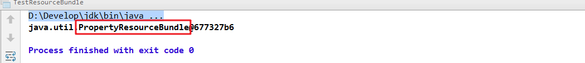

# day10【递归，字节流，字符流，IO异常处理，Properties】

## 今日内容

- 递归
- IO流
- 字节流
- 字符流
- Properties
- ResourceBundle

## 教学目标  

- [ ]  能够描述递归在代码中的体现
- [ ]  能够使用递归完成文件夹的遍历
- [ ]  能够描述递归内存溢出隐患的原因
- [ ]  能够说出IO流的分类和对应功能
- [ ]  能够使用字节输出流写出数据到文件
- [ ]  能够使用字节输入流读取数据到程序
- [ ]  能够使用字节流完成文件的复制
- [ ]  能够使用FileWriter写出字符数据到文件
- [ ]  能够说出FileWriter中关闭和刷新方法的区别
- [ ]  能够使用FileWriter写数据实现换行和追加写
- [ ]  能够使用FileReader读取文本文件
- [ ]  能够使用Properties加载属性文件中配置信息
- [ ]  能够使用ResourceBundle加载属性文件中配置信息


# 第一章 递归

## 1 概述

- **递归**：指在当前方法内调用自己的这种现象。

```java
public static void a(){
    a();
}
```


## 2 递归累和

### 计算1 ~ n的和

**分析**：num的累和 = num + (num-1)的累和，所以可以把累和的操作定义成一个方法，递归调用。

**实现代码**：

```java
public class DiGuiDemo {
	public static void main(String[] args) {
		//计算1~num的和，使用递归完成
		int num = 5;
      	// 调用求和的方法
		int sum = getSum(num);
      	// 输出结果
		System.out.println(sum);
		
	}
  	/*
  	  通过递归算法实现.
  	  参数列表:int 
  	  返回值类型: int 
  	*/
	public static int getSum(int num) {
      	/* 
      	   num为1时,方法返回1,
      	   相当于是方法的出口,num总有是1的情况
      	*/
		if(num == 1){
			return 1;
		}
      	/*
          num不为1时,方法返回 num +(num-1)的累和
          递归调用getSum方法
        */
		return num + getSum(num-1);
	}
}
```

### 代码执行图解


> 小贴士：递归一定要有条件限定，保证递归能够停止下来，次数不要太多，否则会发生栈内存溢出。


## 3 递归求阶乘

- **阶乘**：所有小于及等于该数的正整数的积。

```java
n的阶乘：n! = n * (n-1) *...* 3 * 2 * 1 
```

**分析**：这与累和类似,只不过换成了乘法运算，学员可以自己练习，需要注意阶乘值符合int类型的范围。

```
推理得出：n! = n * (n-1)!
```

**代码实现**：

```java
public class DiGuiDemo {
  	//计算n的阶乘，使用递归完成
    public static void main(String[] args) {
        int n = 3;
      	// 调用求阶乘的方法
        int value = getValue(n);
      	// 输出结果
        System.out.println("阶乘为:"+ value);
    }
	/*
  	  通过递归算法实现.
  	  参数列表:int 
  	  返回值类型: int 
  	*/
    public static int getValue(int n) {
      	// 1的阶乘为1
        if (n == 1) {
            return 1;
        }
      	/*
      	  n不为1时,方法返回 n! = n*(n-1)!
          递归调用getValue方法
      	*/
        return n * getValue(n - 1);
    }
}
```


## 4 文件搜索

输出d:\aaa目录中的所有.java文件的绝对路径。

**分析**：

1. 目录搜索，无法判断多少级目录，所以使用递归，遍历所有目录。
2. 遍历目录时，获取的子文件，通过文件名称，判断是否符合条件。

**代码实现**：

```java
public class DiGuiDemo3 {
    public static void main(String[] args) {
        // 创建File对象
        File dir  = new File("D:\\aaa");
      	// 调用打印目录方法
        printDir(dir);
    }

    public static void printDir(File dir) {
      	// 获取子文件和目录
        File[] files = dir.listFiles();
      	
      	// 循环打印
        for (File file : files) {
            if (file.isFile()) {
              	// 是文件，判断文件名并输出文件绝对路径
                if (file.getName().endsWith(".java")) {
                    System.out.println("文件名:" + file.getAbsolutePath());
                }
            } else {
                // 是目录，继续遍历,形成递归
                printDir(file);
            }
        }
    }
}
```


# 第二章 IO概述

## 1 什么是IO

生活中，你肯定经历过这样的场景。当你编辑一个文本文件，忘记了`ctrl+s` ，可能文件就白白编辑了。当你电脑上插入一个U盘，可以把一个视频，拷贝到你的电脑硬盘里。那么数据都是在哪些设备上的呢？键盘、内存、硬盘、外接设备等等。

我们把这种数据的传输，可以看做是一种数据的流动，按照流动的方向，以内存为基准，分为`输入input` 和`输出output` ，即流向内存是输入流，流出内存的输出流。

Java中I/O操作主要是指使用`java.io`包下的内容，进行输入、输出操作。**输入**也叫做**读取**数据，**输出**也叫做作**写出**数据。


## 2 IO的分类

根据数据的流向分为：**输入流**和**输出流**。

- **输入流** ：把数据从`其他设备`上读取到`内存`中的流。 
- **输出流** ：把数据从`内存` 中写出到`其他设备`上的流。

根据数据的类型分为：**字节流**和**字符流**。

- **字节流** ：以字节为单位，读写数据的流。
- **字符流** ：以字符为单位，读写数据的流。


## 3 IO的流向说明图解


## 4 顶级父类们

|            |           **输入流**            |              输出流              |
| :--------: | :-----------------------------: | :------------------------------: |
| **字节流** | 字节输入流<br />**InputStream** | 字节输出流<br />**OutputStream** |
| **字符流** |   字符输入流<br />**Reader**    |    字符输出流<br />**Writer**    |


# 第三章 字节流

## 1 一切皆为字节

一切文件数据(文本、图片、视频等)在存储时，都是以二进制数字的形式保存，都是一个一个的字节，那么传输时一样如此。所以，字节流可以传输任意文件数据。在操作流的时候，我们要时刻明确，无论使用什么样的流对象，底层传输的始终为二进制数据。


## 2 字节输出流【OutputStream】

`java.io.OutputStream `抽象类是表示字节输出流的所有类的超类，将指定的字节信息写出到目的地。它定义了字节输出流的基本共性功能方法。

- `public void close()` ：关闭此输出流并释放与此流相关联的任何系统资源。  
- `public void flush() ` ：刷新此输出流并强制任何缓冲的输出字节被写出。  
- `public void write(byte[] b)`：将 b.length字节从指定的字节数组写入此输出流。  
- `public void write(byte[] b, int off, int len)` ：从指定的字节数组写入 len字节，从偏移量 off开始输出到此输出流。  
- `public abstract void write(int b)` ：将指定的字节输出流。

> 小贴士：
>
> close方法，当完成流的操作时，必须调用此方法，释放系统资源。


## 3 FileOutputStream类

`OutputStream`有很多子类，我们从最简单的一个子类开始。

`java.io.FileOutputStream `类是文件输出流，用于将数据写出到文件。

### 构造方法

- `public FileOutputStream(File file)`：创建文件输出流以写入由指定的 File对象表示的文件。 
- `public FileOutputStream(String name)`： 创建文件输出流以指定的名称写入文件。  

当你创建一个流对象时，必须传入一个文件路径。该路径下，如果没有这个文件，会创建该文件。如果有这个文件，会清空这个文件的数据。

- 构造举例，代码如下：

```java
public class FileOutputStreamConstructor throws IOException {
    public static void main(String[] args) {
   	 	// 使用File对象创建流对象
        File file = new File("a.txt");
        FileOutputStream fos = new FileOutputStream(file);
      
        // 使用文件名称创建流对象
        FileOutputStream fos = new FileOutputStream("b.txt");
    }
}
```

### 写出字节数据

1. **写出字节**：`write(int b)` 方法，每次可以写出一个字节数据，代码使用演示：

```java
public class FOSWrite {
    public static void main(String[] args) throws IOException {
        // 使用文件名称创建流对象
        FileOutputStream fos = new FileOutputStream("fos.txt");     
      	// 写出数据
      	fos.write(97); // 写出第1个字节
      	fos.write(98); // 写出第2个字节
      	fos.write(99); // 写出第3个字节
      	// 关闭资源
        fos.close();
    }
}
输出结果：
abc
```

> 小贴士：
>
> 1. 虽然参数为int类型四个字节，但是只会保留一个字节的信息写出。
> 2. 流操作完毕后，必须释放系统资源，调用close方法，千万记得。

1. **写出字节数组**：`write(byte[] b)`，每次可以写出数组中的数据，代码使用演示：

```java
public class FOSWrite {
    public static void main(String[] args) throws IOException {
        // 使用文件名称创建流对象
        FileOutputStream fos = new FileOutputStream("fos.txt");     
      	// 字符串转换为字节数组
      	byte[] b = "黑马程序员".getBytes();
      	// 写出字节数组数据
      	fos.write(b);
      	// 关闭资源
        fos.close();
    }
}
输出结果：
黑马程序员
```

1. **写出指定长度字节数组**：`write(byte[] b, int off, int len)` ,每次写出从off索引开始，len个字节，代码使用演示：

```java
public class FOSWrite {
    public static void main(String[] args) throws IOException {
        // 使用文件名称创建流对象
        FileOutputStream fos = new FileOutputStream("fos.txt");     
      	// 字符串转换为字节数组
      	byte[] b = "abcde".getBytes();
		// 写出从索引2开始，2个字节。索引2是c，两个字节，也就是cd。
        fos.write(b,2,2);
      	// 关闭资源
        fos.close();
    }
}
输出结果：
cd
```

### 数据追加续写

经过以上的演示，每次程序运行，创建输出流对象，都会清空目标文件中的数据。如何保留目标文件中数据，还能继续添加新数据呢？

- `public FileOutputStream(File file, boolean append)`： 创建文件输出流以写入由指定的 File对象表示的文件。  
- `public FileOutputStream(String name, boolean append)`： 创建文件输出流以指定的名称写入文件。  

这两个构造方法，参数中都需要传入一个boolean类型的值，`true` 表示追加数据，`false` 表示清空原有数据。这样创建的输出流对象，就可以指定是否追加续写了，代码使用演示：

```java
public class FOSWrite {
    public static void main(String[] args) throws IOException {
        // 使用文件名称创建流对象
        FileOutputStream fos = new FileOutputStream("fos.txt"，true);     
      	// 字符串转换为字节数组
      	byte[] b = "abcde".getBytes();
		// 写出从索引2开始，2个字节。索引2是c，两个字节，也就是cd。
        fos.write(b);
      	// 关闭资源
        fos.close();
    }
}
文件操作前：cd
文件操作后：cdabcde
```

### 写出换行

Windows系统里，换行符号是`\r\n` 。把

以指定是否追加续写了，代码使用演示：

```java
public class FOSWrite {
    public static void main(String[] args) throws IOException {
        // 使用文件名称创建流对象
        FileOutputStream fos = new FileOutputStream("fos.txt");  
      	// 定义字节数组
      	byte[] words = {97,98,99,100,101};
      	// 遍历数组
        for (int i = 0; i < words.length; i++) {
          	// 写出一个字节
            fos.write(words[i]);
          	// 写出一个换行, 换行符号转成数组写出
            fos.write("\r\n".getBytes());
        }
      	// 关闭资源
        fos.close();
    }
}

输出结果：
a
b
c
d
e
```

> - 回车符`\r`和换行符`\n` ：
>   - 回车符：回到一行的开头（return）。
>   - 换行符：下一行（newline）。
> - 系统中的换行：
>   - Windows系统里，每行结尾是 `回车+换行` ，即`\r\n`；
>
>   - Unix系统里，每行结尾只有 `换行` ，即`\n`；
>
>   - Mac系统里，每行结尾是 `回车` ，即`\r`。从 Mac OS X开始与Linux统一。


## 4 字节输入流【InputStream】

`java.io.InputStream `抽象类是表示字节输入流的所有类的超类，可以读取字节信息到内存中。它定义了字节输入流的基本共性功能方法。

- `public void close()` ：关闭此输入流并释放与此流相关联的任何系统资源。    
- `public abstract int read()`： 从输入流读取数据的下一个字节。 
- `public int read(byte[] b)`： 从输入流中读取一些字节数，并将它们存储到字节数组 b中 。

> 小贴士：
>
> close方法，当完成流的操作时，必须调用此方法，释放系统资源。


## 5 FileInputStream类

`java.io.FileInputStream `类是文件输入流，从文件中读取字节。

### 构造方法

- `FileInputStream(File file)`： 通过打开与实际文件的连接来创建一个 FileInputStream ，该文件由文件系统中的文件对象 file命名。 
- `FileInputStream(String name)`： 通过打开与实际文件的连接来创建一个 FileInputStream ，该文件由文件系统中的路径名 name命名。  

当你创建一个流对象时，必须传入一个文件路径。该路径下，如果没有该文件,会抛出`FileNotFoundException` 

- 构造举例，代码如下：

```java
public class FileInputStreamConstructor throws IOException{
    public static void main(String[] args) {
   	 	// 使用File对象创建流对象
        File file = new File("a.txt");
        FileInputStream fos = new FileInputStream(file);
      
        // 使用文件名称创建流对象
        FileInputStream fos = new FileInputStream("b.txt");
    }
}
```

### 读取字节数据

1. **读取字节**：`read`方法，每次可以读取一个字节的数据，提升为int类型，读取到文件末尾，返回`-1`，代码使用演示：

```java
public class FISRead {
    public static void main(String[] args) throws IOException{
      	// 使用文件名称创建流对象
       	FileInputStream fis = new FileInputStream("read.txt");
      	// 读取数据，返回一个字节
        int read = fis.read();
        System.out.println((char) read);
        read = fis.read();
        System.out.println((char) read);
        read = fis.read();
        System.out.println((char) read);
        read = fis.read();
        System.out.println((char) read);
        read = fis.read();
        System.out.println((char) read);
      	// 读取到末尾,返回-1
       	read = fis.read();
        System.out.println( read);
		// 关闭资源
        fis.close();
    }
}
输出结果：
a
b
c
d
e
-1
```

循环改进读取方式，代码使用演示：

```java
public class FISRead {
    public static void main(String[] args) throws IOException{
      	// 使用文件名称创建流对象
       	FileInputStream fis = new FileInputStream("read.txt");
      	// 定义变量，保存数据
        int b ；
        // 循环读取
        while ((b = fis.read())!=-1) {
            System.out.println((char)b);
        }
		// 关闭资源
        fis.close();
    }
}
输出结果：
a
b
c
d
e
```

> 小贴士：
>
> 1. 虽然读取了一个字节，但是会自动提升为int类型。
> 2. 流操作完毕后，必须释放系统资源，调用close方法，千万记得。

1. **使用字节数组读取**：`read(byte[] b)`，每次读取b的长度个字节到数组中，返回读取到的有效字节个数，读取到末尾时，返回`-1` ，代码使用演示：

```java
public class FISRead {
    public static void main(String[] args) throws IOException{
      	// 使用文件名称创建流对象.
       	FileInputStream fis = new FileInputStream("read.txt"); // 文件中为abcde
      	// 定义变量，作为有效个数
        int len ；
        // 定义字节数组，作为装字节数据的容器   
        byte[] b = new byte[2];
        // 循环读取
        while (( len= fis.read(b))!=-1) {
           	// 每次读取后,把数组变成字符串打印
            System.out.println(new String(b));
        }
		// 关闭资源
        fis.close();
    }
}

输出结果：
ab
cd
ed
```

错误数据`d`，是由于最后一次读取时，只读取一个字节`e`，数组中，上次读取的数据没有被完全替换，所以要通过`len` ，获取有效的字节，代码使用演示：

```java
public class FISRead {
    public static void main(String[] args) throws IOException{
      	// 使用文件名称创建流对象.
       	FileInputStream fis = new FileInputStream("read.txt"); // 文件中为abcde
      	// 定义变量，作为有效个数
        int len ；
        // 定义字节数组，作为装字节数据的容器   
        byte[] b = new byte[2];
        // 循环读取
        while (( len= fis.read(b))!=-1) {
           	// 每次读取后,把数组的有效字节部分，变成字符串打印
            System.out.println(new String(b，0，len));//  len 每次读取的有效字节个数
        }
		// 关闭资源
        fis.close();
    }
}

输出结果：
ab
cd
e
```

> 小贴士：
>
> 使用数组读取，每次读取多个字节，减少了系统间的IO操作次数，从而提高了读写的效率，建议开发中使用。


## 6 字节流练习：图片复制

### 复制原理图解


### 案例实现

复制图片文件，代码使用演示：

```java
public class Copy {
    public static void main(String[] args) throws IOException {
        // 1.创建流对象
        // 1.1 指定数据源
        FileInputStream fis = new FileInputStream("D:\\test.jpg");
        // 1.2 指定目的地
        FileOutputStream fos = new FileOutputStream("test_copy.jpg");

        // 2.读写数据
        // 2.1 定义数组
        byte[] b = new byte[1024];
        // 2.2 定义长度
        int len;
        // 2.3 循环读取
        while ((len = fis.read(b))!=-1) {
            // 2.4 写出数据
            fos.write(b, 0 , len);
        }

        // 3.关闭资源
        fos.close();
        fis.close();
    }
}
```

> 小贴士：
>
> 流的关闭原则：先开后关，后开先关。


# 第四章 字符流

当使用字节流读取文本文件时，可能会有一个小问题。就是遇到中文字符时，可能不会显示完整的字符，那是因为一个中文字符可能占用多个字节存储。所以Java提供一些字符流类，以字符为单位读写数据，专门用于处理文本文件。

## 1 字符输入流【Reader】

`java.io.Reader`抽象类是表示用于读取字符流的所有类的超类，可以读取字符信息到内存中。它定义了字符输入流的基本共性功能方法。

- `public void close()` ：关闭此流并释放与此流相关联的任何系统资源。    
- `public int read()`： 从输入流读取一个字符。 
- `public int read(char[] cbuf)`： 从输入流中读取一些字符，并将它们存储到字符数组 cbuf中 。


## 2 FileReader类

`java.io.FileReader `类是读取字符文件的便利类。构造时使用系统默认的字符编码和默认字节缓冲区。

> 小贴士：
>
> 1. 字符编码：字节与字符的对应规则。Windows系统的中文编码默认是GBK编码表。
>
>    idea中UTF-8
>
> 2. 字节缓冲区：一个字节数组，用来临时存储字节数据。

### 构造方法

- `FileReader(File file)`： 创建一个新的 FileReader ，给定要读取的File对象。   
- `FileReader(String fileName)`： 创建一个新的 FileReader ，给定要读取的文件的名称。  

当你创建一个流对象时，必须传入一个文件路径。类似于FileInputStream 。

- 构造举例，代码如下：

```java
public class FileReaderConstructor throws IOException{
    public static void main(String[] args) {
   	 	// 使用File对象创建流对象
        File file = new File("a.txt");
        FileReader fr = new FileReader(file);
      
        // 使用文件名称创建流对象
        FileReader fr = new FileReader("b.txt");
    }
}
```

### 读取字符数据

1. **读取字符**：`read`方法，每次可以读取一个字符的数据，提升为int类型，读取到文件末尾，返回`-1`，循环读取，代码使用演示：

```java
public class FRRead {
    public static void main(String[] args) throws IOException {
      	// 使用文件名称创建流对象
       	FileReader fr = new FileReader("read.txt");
      	// 定义变量，保存数据
        int b ；
        // 循环读取
        while ((b = fr.read())!=-1) {
            System.out.println((char)b);
        }
		// 关闭资源
        fr.close();
    }
}
输出结果：
黑
马
程
序
员
```

> 小贴士：虽然读取了一个字符，但是会自动提升为int类型。

1. **使用字符数组读取**：`read(char[] cbuf)`，每次读取多个字符到数组中，返回读取到的有效字符个数，读取到末尾时，返回`-1` ，代码使用演示：

```java
public class FRRead {
    public static void main(String[] args) throws IOException {
      	// 使用文件名称创建流对象
       	FileReader fr = new FileReader("read.txt");
      	// 定义变量，保存有效字符个数
        int len ；
        // 定义字符数组，作为装字符数据的容器
         char[] cbuf = new char[2];
        // 循环读取
        while ((len = fr.read(cbuf))!=-1) {
            System.out.println(new String(cbuf));
        }
		// 关闭资源
        fr.close();
    }
}
输出结果：
黑马
程序
员序
```

获取有效的字符改进，代码使用演示：

```java
public class FISRead {
    public static void main(String[] args) throws IOException {
      	// 使用文件名称创建流对象
       	FileReader fr = new FileReader("read.txt");
      	// 定义变量，保存有效字符个数
        int len ；
        // 定义字符数组，作为装字符数据的容器
        char[] cbuf = new char[2];
        // 循环读取
        while ((len = fr.read(cbuf))!=-1) {
            System.out.println(new String(cbuf,0,len));
        }
    	// 关闭资源
        fr.close();
    }
}

输出结果：
黑马
程序
员
```


## 3 字符输出流【Writer】

`java.io.Writer `抽象类是表示用于写出字符流的所有类的超类，将指定的字符信息写出到目的地。它定义了字节输出流的基本共性功能方法。

- `public abstract void close()` ：关闭此输出流并释放与此流相关联的任何系统资源。  
- `public abstract void flush() ` ：刷新此输出流并强制任何缓冲的输出字符被写出。  
- `public void write(int c)` ：写出一个字符。
- `public void write(char[] cbuf)`：将 b.length字符从指定的字符数组写出此输出流。  
- `public abstract void write(char[] b, int off, int len)` ：从指定的字符数组写出 len字符，从偏移量 off开始输出到此输出流。  
- `public void write(String str)` ：写出一个字符串。


## 4 FileWriter类

`java.io.FileWriter `类是写出字符到文件的便利类。构造时使用系统默认的字符编码和默认字节缓冲区。

### 构造方法

- `FileWriter(File file)`： 创建一个新的 FileWriter，给定要读取的File对象。   
- `FileWriter(String fileName)`： 创建一个新的 FileWriter，给定要读取的文件的名称。  

当你创建一个流对象时，必须传入一个文件路径，类似于FileOutputStream。

- 构造举例，代码如下：

```java
public class FileWriterConstructor {
    public static void main(String[] args) throws IOException {
   	 	// 使用File对象创建流对象
        File file = new File("a.txt");
        FileWriter fw = new FileWriter(file);
      
        // 使用文件名称创建流对象
        FileWriter fw = new FileWriter("b.txt");
    }
}
```

### 基本写出数据

**写出字符**：`write(int b)` 方法，每次可以写出一个字符数据，代码使用演示：

```java
public class FWWrite {
    public static void main(String[] args) throws IOException {
        // 使用文件名称创建流对象
        FileWriter fw = new FileWriter("fw.txt");     
      	// 写出数据
      	fw.write(97); // 写出第1个字符
      	fw.write('b'); // 写出第2个字符
      	fw.write('C'); // 写出第3个字符
      	fw.write(30000); // 写出第4个字符，中文编码表中30000对应一个汉字。
      
      	/*
        【注意】关闭资源时,与FileOutputStream不同。
      	 如果不关闭,数据只是保存到缓冲区，并未保存到文件。
        */
        // fw.close();
    }
}
输出结果：
abC田
```

> 小贴士：
>
> 1. 虽然参数为int类型四个字节，但是只会保留一个字符的信息写出。
> 2. 未调用close方法，数据只是保存到了缓冲区，并未写出到文件中。

### 关闭和刷新

因为内置缓冲区的原因，如果不关闭输出流，无法写出字符到文件中。但是关闭的流对象，是无法继续写出数据的。如果我们既想写出数据，又想继续使用流，就需要`flush` 方法了。

- `flush` ：刷新缓冲区，流对象可以继续使用。
- `close` ：关闭流，释放系统资源。关闭前会刷新缓冲区。

代码使用演示：

```java
public class FWWrite {
    public static void main(String[] args) throws IOException {
        // 使用文件名称创建流对象
        FileWriter fw = new FileWriter("fw.txt");
        // 写出数据，通过flush
        fw.write('刷'); // 写出第1个字符
        fw.flush();
        fw.write('新'); // 继续写出第2个字符，写出成功
        fw.flush();
      
      	// 写出数据，通过close
        fw.write('关'); // 写出第1个字符
        fw.close();
        fw.write('闭'); // 继续写出第2个字符,【报错】java.io.IOException: Stream closed
        fw.close();
    }
}
```

> 小贴士：即便是flush方法写出了数据，操作的最后还是要调用close方法，释放系统资源。

### 写出其他数据

1. **写出字符数组** ：`write(char[] cbuf)` 和 `write(char[] cbuf, int off, int len)` ，每次可以写出字符数组中的数据，用法类似FileOutputStream，代码使用演示：

```java
public class FWWrite {
    public static void main(String[] args) throws IOException {
        // 使用文件名称创建流对象
        FileWriter fw = new FileWriter("fw.txt");     
      	// 字符串转换为字节数组
      	char[] chars = "黑马程序员".toCharArray();
      
      	// 写出字符数组
      	fw.write(chars); // 黑马程序员
        
		// 写出从索引2开始，2个字节。索引2是'程'，两个字节，也就是'程序'。
        fw.write(b,2,2); // 程序
      
      	// 关闭资源
        fos.close();
    }
}
```

1. **写出字符串**：`write(String str)` 和 `write(String str, int off, int len)` ，每次可以写出字符串中的数据，更为方便，代码使用演示：

```java
public class FWWrite {
    public static void main(String[] args) throws IOException {
        // 使用文件名称创建流对象
        FileWriter fw = new FileWriter("fw.txt");     
      	// 字符串
      	String msg = "黑马程序员";
      
      	// 写出字符数组
      	fw.write(msg); //黑马程序员
      
		// 写出从索引2开始，2个字节。索引2是'程'，两个字节，也就是'程序'。
        fw.write(msg,2,2);	// 程序
      	
        // 关闭资源
        fos.close();
    }
}
```

1. **续写和换行**：操作类似于FileOutputStream。

```java
public class FWWrite {
    public static void main(String[] args) throws IOException {
        // 使用文件名称创建流对象，可以续写数据
        FileWriter fw = new FileWriter("fw.txt"，true);     
      	// 写出字符串
        fw.write("黑马");
      	// 写出换行
      	fw.write("\r\n");
      	// 写出字符串
  		fw.write("程序员");
      	// 关闭资源
        fw.close();
    }
}
输出结果:
黑马
程序员
```

> 小贴士：字符流，只能操作文本文件，不能操作图片，视频等非文本文件。
>
> 当我们单纯读或者写文本文件时  使用字符流 其他情况使用字节流


# 第五章 IO资源的处理

## 1 JDK7前处理

之前的入门练习，我们一直把异常抛出，而实际开发中并不能这样处理，建议使用`try...catch...finally` 代码块，处理异常部分，代码使用演示：

```java  
public class HandleException1 {
    public static void main(String[] args) {
      	// 声明变量
        FileWriter fw = null;
        try {
            //创建流对象
            fw = new FileWriter("fw.txt");
            // 写出数据
            fw.write("黑马程序员"); //黑马程序员
        } catch (IOException e) {
            e.printStackTrace();
        } finally {
            try {
                if (fw != null) {
                    fw.close();
                }
            } catch (IOException e) {
                e.printStackTrace();
            }
        }
    }
}
```


## 2 JDK7的处理

还可以使用JDK7优化后的`try-with-resource` 语句，该语句确保了每个资源在语句结束时关闭。所谓的资源（resource）是指在程序完成后，必须关闭的对象。

格式：

```java
try (创建流对象语句，如果多个,使用';'隔开) {
	// 读写数据
} catch (IOException e) {
	e.printStackTrace();
}
```

代码使用演示：

```java
public class HandleException2 {
    public static void main(String[] args) {
      	// 创建流对象
        try ( FileWriter fw = new FileWriter("fw.txt"); ) {
            // 写出数据
            fw.write("黑马程序员"); //黑马程序员
        } catch (IOException e) {
            e.printStackTrace();
        }
    }
}
```


# 第六章 属性集

## 1 概述

`java.util.Properties ` 继承于` Hashtable` ，来表示一个持久的属性集。它使用键值结构存储数据，每个键及其对应值都是一个字符串。该类也被许多Java类使用，比如获取系统属性时，`System.getProperties` 方法就是返回一个`Properties`对象。


## 2 Properties类

### 构造方法

- `public Properties()` :创建一个空的属性列表。

### 基本的存储方法

- `public Object setProperty(String key, String value)` ： 保存一对属性。  
- `public String getProperty(String key) ` ：使用此属性列表中指定的键搜索属性值。
- `public Set<String> stringPropertyNames() ` ：所有键的名称的集合。

```java
public class ProDemo {
    public static void main(String[] args) throws FileNotFoundException {
        // 创建属性集对象
        Properties properties = new Properties();
        // 添加键值对元素
        properties.setProperty("filename", "a.txt");
        properties.setProperty("length", "209385038");
        properties.setProperty("location", "D:\\a.txt");
        // 打印属性集对象
        System.out.println(properties);
        // 通过键,获取属性值
        System.out.println(properties.getProperty("filename"));
        System.out.println(properties.getProperty("length"));
        System.out.println(properties.getProperty("location"));

        // 遍历属性集,获取所有键的集合
        Set<String> strings = properties.stringPropertyNames();
        // 打印键值对
        for (String key : strings ) {
          	System.out.println(key+" -- "+properties.getProperty(key));
        }
    }
}
输出结果：
{filename=a.txt, length=209385038, location=D:\a.txt}
a.txt
209385038
D:\a.txt
filename -- a.txt
length -- 209385038
location -- D:\a.txt
```

### 与流相关的方法

- `public void load(InputStream inStream)`： 从字节输入流中读取键值对。 

参数中使用了字节输入流，通过流对象，可以关联到某文件上，这样就能够加载文本中的数据了。文本数据格式:

```
filename=a.txt
length=209385038
location=D:\a.txt
```

加载代码演示：

```java
public class ProDemo2 {
    public static void main(String[] args) throws FileNotFoundException {
        // 创建属性集对象
        Properties pro = new Properties();
        // 加载文本中信息到属性集
        pro.load(new FileInputStream("read.txt"));
        // 遍历集合并打印
        Set<String> strings = pro.stringPropertyNames();
        for (String key : strings ) {
          	System.out.println(key+" -- "+pro.getProperty(key));
        }
     }
}
输出结果：
filename -- a.txt
length -- 209385038
location -- D:\a.txt
```

> 小贴士：文本中的数据，必须是键值对形式，可以使用空格、等号、冒号等符号分隔。


# 第七章 ResourceBundle工具类

前面我们学习了Properties工具类，它能够读取资源文件，当资源文件是以.properties结尾的文件时，我们可以使用JDK提供的另外一个工具类ResourceBundle来对文件进行读取，使得操作更加简单。

## 1. ResourceBundle类的介绍

java.util.ResourceBundle它是一个抽象类，我们可以使用它的子类PropertyResourceBundle来读取以.properties结尾的配置文件。


## 2. ResourceBundle类对象的创建

在ResourceBundle类中提供了一个静态方法，用于获得它的子类对象(抽象类不能创建对象！)。

```java
// 使用指定的基本名称，默认语言环境和调用者的类加载器获取资源包。  
static ResourceBundle getBundle(String baseName); 
```

> 注意：
>
> ​		①properties配置文件需要放置在类的根路径src下面
>
> ​		②给定参数只需要配置文件的名称，不要扩展名。


```java
public class TestResourceBundle {
    public static void main(String[] args) {
        // 获得ResourceBundle类的对象(properties文件要放置在src目录下，给定参数只要文件名称，不要扩展名！)
        ResourceBundle bundle = ResourceBundle.getBundle("data");// 父类引用指向子类对象(多态)
        System.out.println(bundle);
    }
}
```

**测试结果：**




## 3. ResourceBundle读取配置文件操作

ResourceBundle类提供了一个getString(String key)方法用于读取配置文件中指定key的值。

```java
String getString(String key) 从此资源束或其父项之一获取给定密钥的字符串。  
```

**代码演示(数据在上图中)：**

```java
public class TestResourceBundle {
    public static void main(String[] args) {
        // 获得ResourceBundle类的对象(properties文件要放置在src目录下，给定参数只要文件名称，不要扩展名)
        ResourceBundle bundle = ResourceBundle.getBundle("data");
        System.out.println(bundle);

        // 读取指定key(username)的值
        String username = bundle.getString("username");
        System.out.println(username); // 张三

        // 读取指定key(password)的值
        String password = bundle.getString("password");
        System.out.println(password); // itheima
    }
}
```

**运行结果：**


