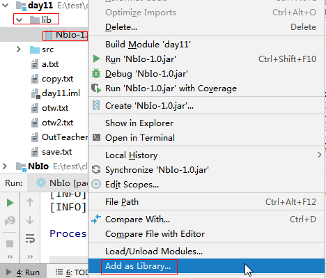
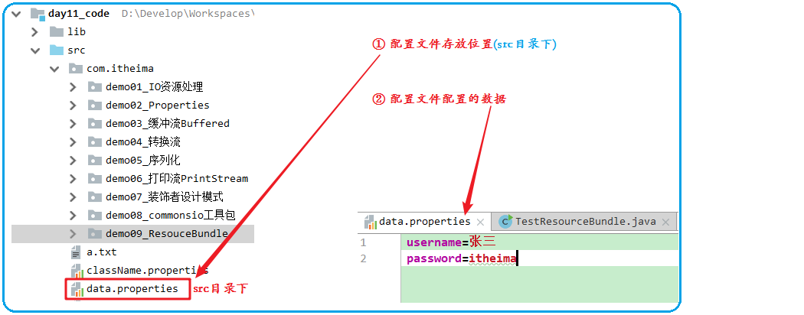
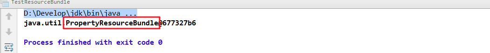
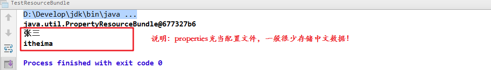

# day11【缓冲流、转换流、序列化流、装饰者模式、commons-io工具包】

## 今日内容

- 缓冲流

- 转换流

- 序列流

- 打印流

- 装饰设计模式


## 教学目标

- [ ] 能够使用字节缓冲流BufferedInputStream读取数据到程序
- [ ] 能够使用字节缓冲流BufferedOutputStream写出数据到文件
- [ ] 能够使用字符缓冲流BufferedReader读取字符数据
- [ ] 能够使用字符缓冲流BufferedWriter写出字符数据
- [ ] 能够使用字符缓冲流的按行读取和写换行的特殊功能
- [ ] 能够描述字符编码和解码的过程
- [ ] 能够使用转换流读取指定编码的文本文件
- [ ] 能够使用转换流写入指定编码的文本文件
- [ ] 能够使用序列化流写出对象到文件
- [ ] 能够使用反序列化流读取文件到程序中
- [ ] 能够理解装饰模式的实现步骤
- [ ] 能够使用commons-io工具包


# 第一章 缓冲流

昨天学习了基本的一些流，作为IO流的入门，今天我们要见识一些更强大的流。比如能够高效读写的缓冲流，能够转换编码的转换流，能够持久化存储对象的序列化流等等。这些功能更为强大的流，都是在基本的流对象基础之上创建而来的，就像穿上铠甲的武士一样，相当于是对基本流对象的一种增强。

## 1.1 概述

缓冲流,也叫高效流，是对4个基本的`FileXxx` 流的增强，所以也是4个流，按照数据类型分类：

* **字节缓冲流**：`BufferedInputStream`，`BufferedOutputStream` 
* **字符缓冲流**：`BufferedReader`，`BufferedWriter`

缓冲流的基本原理，是在创建流对象时，会创建一个内置的默认大小的缓冲区数组，通过缓冲区读写，减少系统IO次数，从而提高读写的效率。


## 1.2 字节缓冲流

### 构造方法

* `public BufferedInputStream(InputStream in)` ：创建一个 新的缓冲输入流。 
* `public BufferedOutputStream(OutputStream out)`： 创建一个新的缓冲输出流。

构造举例，代码如下：

```java
// 创建字节缓冲输入流
BufferedInputStream bis = new BufferedInputStream(new FileInputStream("bis.txt"));
// 创建字节缓冲输出流
BufferedOutputStream bos = new BufferedOutputStream(new FileOutputStream("bos.txt"));
```

### 

```java
package com.itheima01.buffer;

import java.io.*;

/*
*   字节缓冲流
*       1. InputStream
*           1). FileInputStream
*           2). BufferedInputStream  缓冲字节输入流
*           
*           new BufferedInputStream(new FileInputStream("day11/a.txt"));
*           
*       2. OutputStream
*           1). FileOutputStream
*           2). BufferedOutputStream   缓冲字节输出流
*           
*           new BufferedOutputStream(new FileOutputStream("day11/copy.txt"))
*
*     缓冲流 = 字节流 + 缓冲数组(默认8K)
*       用空间换时间
*
*       # 装饰设计模式 (代理模式)
* */
public class Demo01 {

    public static void main(String[] args) throws IOException {
//        method01();

        BufferedOutputStream fos = new BufferedOutputStream(new FileOutputStream("day11/b.txt"));
            /*
                字节先放到缓冲数组中,那么什么时候缓冲数组中的数据同步到硬盘上呢?
                1. 缓冲数组满了
                2. flush方法
                3. close方法: 释放资源先调用flush
             */
      /*  for (int i = 0; i < 1000; i++) {
            fos.write("hello world".getBytes());
        }*/
        fos.write("hello world".getBytes());
        fos.flush();


    }

    private static void method01() throws IOException {
        //        FileInputStream fis = new FileInputStream("day11/a.txt");
//        FileOutputStream fos = new FileOutputStream("day11/copy.txt");

//        BufferedInputStream fis = new BufferedInputStream(new FileInputStream("day11/a.txt"));
        BufferedInputStream fis = new BufferedInputStream(new FileInputStream("day11/a.txt"));
        BufferedOutputStream fos = new BufferedOutputStream(new FileOutputStream("day11/copy.txt"));

        int length;
        byte[] buffer = new byte[1024 * 8];

        while((length = fis.read(buffer)) != -1){
            fos.write(buffer,0,length);
        }
        fos.close();
        fis.close();
    }
}

```


## 1.3 字符缓冲流

### 构造方法

* `public BufferedReader(Reader in)` ：创建一个 新的缓冲输入流。 
* `public BufferedWriter(Writer out)`： 创建一个新的缓冲输出流。

构造举例，代码如下：

```java
// 创建字符缓冲输入流
BufferedReader br = new BufferedReader(new FileReader("br.txt"));
// 创建字符缓冲输出流
BufferedWriter bw = new BufferedWriter(new FileWriter("bw.txt"));
```

### 特有方法

字符缓冲流的基本方法与普通字符流调用方式一致，不再阐述，我们来看它们具备的特有方法。

* BufferedReader：`public String readLine()`: 读一行文字。 
* BufferedWriter：`public void newLine()`: 写一行行分隔符,由系统属性定义符号。 

`readLine`方法演示，代码如下：

```java
package com.itheima01.buffer;

import java.io.*;

/*
*   字符缓冲流
*       1. Reader
*           1). FileReader
*           2). BufferedReader
*
*       2. Writer
*           1). FileWriter
*           2). BufferedWriter
*
*     - public BufferedReader(Reader in) ：创建一个 新的缓冲输入流。
      - public BufferedWriter(Writer out)： 创建一个新的缓冲输出流。

      BufferedReader : FileReader + 缓冲数组(8K char)

      - BufferedReader：public String readLine(): 读一行文字。
      - BufferedWriter：public void newLine(): 写一行行分隔符,由系统属性定义符号。

* */
public class Demo02 {

    public static void main(String[] args) throws IOException {

//        method01();

        BufferedReader br = new BufferedReader(new FileReader("day11/c.txt"));
        //一次读一行,读到末尾返回null
//        String line = br.readLine();
//        System.out.println(line);

        String line;
        while((line = br.readLine()) != null){
            System.out.println(line);
        }
        br.close();
    }

    private static void method01() throws IOException {
        BufferedWriter bw = new BufferedWriter(new FileWriter("day11/c.txt",true));
        //BufferedWriter特有方法
//        bw.write(System.lineSeparator());
        bw.newLine();
        bw.write("我爱你,中国");
        bw.close();
    }
}

```


## 1.4 练习:文本排序

请将文本信息恢复顺序。

```
3.侍中、侍郎郭攸之、费祎、董允等，此皆良实，志虑忠纯，是以先帝简拔以遗陛下。愚以为宫中之事，事无大小，悉以咨之，然后施行，必得裨补阙漏，有所广益。
8.愿陛下托臣以讨贼兴复之效，不效，则治臣之罪，以告先帝之灵。若无兴德之言，则责攸之、祎、允等之慢，以彰其咎；陛下亦宜自谋，以咨诹善道，察纳雅言，深追先帝遗诏，臣不胜受恩感激。
4.将军向宠，性行淑均，晓畅军事，试用之于昔日，先帝称之曰能，是以众议举宠为督。愚以为营中之事，悉以咨之，必能使行阵和睦，优劣得所。
2.宫中府中，俱为一体，陟罚臧否，不宜异同。若有作奸犯科及为忠善者，宜付有司论其刑赏，以昭陛下平明之理，不宜偏私，使内外异法也。
1.先帝创业未半而中道崩殂，今天下三分，益州疲弊，此诚危急存亡之秋也。然侍卫之臣不懈于内，忠志之士忘身于外者，盖追先帝之殊遇，欲报之于陛下也。诚宜开张圣听，以光先帝遗德，恢弘志士之气，不宜妄自菲薄，引喻失义，以塞忠谏之路也。
9.今当远离，临表涕零，不知所言。
6.臣本布衣，躬耕于南阳，苟全性命于乱世，不求闻达于诸侯。先帝不以臣卑鄙，猥自枉屈，三顾臣于草庐之中，咨臣以当世之事，由是感激，遂许先帝以驱驰。后值倾覆，受任于败军之际，奉命于危难之间，尔来二十有一年矣。
7.先帝知臣谨慎，故临崩寄臣以大事也。受命以来，夙夜忧叹，恐付托不效，以伤先帝之明，故五月渡泸，深入不毛。今南方已定，兵甲已足，当奖率三军，北定中原，庶竭驽钝，攘除奸凶，兴复汉室，还于旧都。此臣所以报先帝而忠陛下之职分也。至于斟酌损益，进尽忠言，则攸之、祎、允之任也。
5.亲贤臣，远小人，此先汉所以兴隆也；亲小人，远贤臣，此后汉所以倾颓也。先帝在时，每与臣论此事，未尝不叹息痛恨于桓、灵也。侍中、尚书、长史、参军，此悉贞良死节之臣，愿陛下亲之信之，则汉室之隆，可计日而待也。
```

### 案例分析

1. 逐行读取文本信息。
2. 解析文本信息到集合中。
3. 遍历集合，按顺序，写出文本信息。

### 案例实现

```java
package com.itheima01.buffer;

import java.io.*;
import java.util.ArrayList;
import java.util.Collections;
import java.util.Comparator;
import java.util.HashMap;

/*
* 需求: 文本排序
* 1. 容器: HashMap<Integer,String> map
* 2. 一次读一行, 对每行进行分割(按.分割) , number - 正文  ,存到 map
* 3. fori 1~9 , 遍历map, value = map.get(i) ,最后写到新文件
* */
public class Demo03 {
    public static void main(String[] args) throws IOException {

//        method01();

        ArrayList<String> list = new ArrayList<>();
        BufferedReader br = new BufferedReader(new FileReader("day11/OutTeacherWatch.txt"));
        String line;
        while((line = br.readLine()) != null){
            list.add(line);
        }
        //字符串排序, 按首字母的ASCII码值升序
        Collections.sort(list);

        BufferedWriter bw = new BufferedWriter(new FileWriter("day11/otw2.txt"));
        for (String s : list) {
            bw.write(s);
            bw.newLine();
        }
        bw.close();
    }

    private static void method01() throws IOException {
        HashMap<Integer, String> map = new HashMap<>();

        BufferedReader br = new BufferedReader(new FileReader("day11/OutTeacherWatch.txt"));
        String line;
        while((line = br.readLine()) != null){
            // 对应.进行转义 (学了正则表达式就知道了)
            // 对点进行切割,返回切割后的元素数组
            String[] split = line.split("\\.");
            Integer number = Integer.parseInt(split[0]);
            String value = split[1];

            map.put(number,value);
        }

        BufferedWriter bw = new BufferedWriter(new FileWriter("day11/otw.txt"));
        for (int i = 1; i <= 9; i++) {
            String value = map.get(i);
            bw.write(i+"."+value);
            bw.newLine();
        }
        bw.close();
    }
}

```


# 第二章 转换流

## 2.1 字符编码和字符集

### 字符编码

计算机中储存的信息都是用二进制数表示的，而我们在屏幕上看到的数字、英文、标点符号、汉字等字符是二进制数转换之后的结果。按照某种规则，将字符存储到计算机中，称为**编码** 。反之，将存储在计算机中的二进制数按照某种规则解析显示出来，称为**解码** 。比如说，按照A规则存储，同样按照A规则解析，那么就能显示正确的文本f符号。反之，按照A规则存储，再按照B规则解析，就会导致乱码现象。

* **字符编码`Character Encoding`** : 就是一套自然语言的字符与二进制数之间的对应规则。

### 字符集

* **字符集 `Charset`**：也叫编码表。是一个系统支持的所有字符的集合，包括各国家文字、标点符号、图形符号、数字等。

计算机要准确的存储和识别各种字符集符号，需要进行字符编码，一套字符集必然至少有一套字符编码。常见字符集有ASCII字符集、GBK字符集、Unicode字符集等。

可见，当指定了**编码**，它所对应的**字符集**自然就指定了，所以**编码**才是我们最终要关心的。

* **ASCII字符集** ：
  * ASCII（American Standard Code for Information Interchange，美国信息交换标准代码）是基于拉丁字母的一套电脑编码系统，用于显示现代英语，主要包括控制字符（回车键、退格、换行键等）和可显示字符（英文大小写字符、阿拉伯数字和西文符号）。
  * 基本的ASCII字符集，使用7位（bits）表示一个字符，共128字符。ASCII的扩展字符集使用8位（bits）表示一个字符，共256字符，方便支持欧洲常用字符。
* **ISO-8859-1字符集**：
  * 拉丁码表，别名Latin-1，用于显示欧洲使用的语言，包括荷兰、丹麦、德语、意大利语、西班牙语等。
  * ISO-5559-1使用单字节编码，兼容ASCII编码。
* **GBxxx字符集**：
  * GB就是国标的意思，是为了显示中文而设计的一套字符集。
  * **GB2312**：简体中文码表。一个小于127的字符的意义与原来相同。但两个大于127的字符连在一起时，就表示一个汉字，这样大约可以组合了包含7000多个简体汉字，此外数学符号、罗马希腊的字母、日文的假名们都编进去了，连在ASCII里本来就有的数字、标点、字母都统统重新编了两个字节长的编码，这就是常说的"全角"字符，而原来在127号以下的那些就叫"半角"字符了。
  * **GBK**：最常用的中文码表。是在GB2312标准基础上的扩展规范，使用了双字节编码方案，共收录了21003个汉字，完全兼容GB2312标准，同时支持繁体汉字以及日韩汉字等。
  * **GB18030**：最新的中文码表。收录汉字70244个，采用多字节编码，每个字可以由1个、2个或4个字节组成。支持中国国内少数民族的文字，同时支持繁体汉字以及日韩汉字等。
* **Unicode字符集** ：
  * Unicode编码系统为表达任意语言的任意字符而设计，是业界的一种标准，也称为统一码、标准万国码。
  * 它最多使用4个字节的数字来表达每个字母、符号，或者文字。有三种编码方案，UTF-8、UTF-16和UTF-32。最为常用的UTF-8编码。
  * UTF-8编码，可以用来表示Unicode标准中任何字符，它是电子邮件、网页及其他存储或传送文字的应用中，优先采用的编码。互联网工程工作小组（IETF）要求所有互联网协议都必须支持UTF-8编码。所以，我们开发Web应用，也要使用UTF-8编码。它使用一至四个字节为每个字符编码，编码规则：
    1. 128个US-ASCII字符，只需一个字节编码。
    2. 拉丁文等字符，需要二个字节编码。 
    3. 大部分常用字（含中文），使用三个字节编码。
    4. 其他极少使用的Unicode辅助字符，使用四字节编码。


## 2.2 编码引出的问题

在IDEA中，使用`FileReader` 读取项目中的文本文件。由于IDEA的设置，都是默认的`UTF-8`编码，所以没有任何问题。但是，当读取Windows系统中创建的文本文件时，由于Windows系统的默认是GBK编码，就会出现乱码。

```java
public class ReaderDemo {
    public static void main(String[] args) throws IOException {
        FileReader fileReader = new FileReader("E:\\File_GBK.txt");
        int read;
        while ((read = fileReader.read()) != -1) {
            System.out.print((char)read);
        }
        fileReader.close();
    }
}
输出结果：
���
```

那么如何读取GBK编码的文件呢？ 


## 2.3 InputStreamReader类  

```java
package com.itheima02.transfer;

import java.io.*;

/*
* *   字符流
 *       1. Reader
 *           1). InputStreamReader  转换流
 *               自定义字节流  + 自定义字符集
 *
 *                    FileReader = FileInputStream + 程序默认编码表(utf-8)
 *                     字符流  =  字节流 + 字符集
 *
 *           2). BufferedReader
 *
 *       2. Writer
 *           1). OutputStreamWriter 转换流
 *                  FileWriter
 *           2). BufferedWriter
 *
 *      乱码原因: 编解码所使用的字符集不一致
 *
 *      编码 : windows的GBK
 *      解码 : 程序的utf-8
 *
 *      解决乱码: 统一编解码字符集
 *      方案一: 修改文件的编码
 *           这个文件是程序归属的文件
 *      方案二: 修改程序的编码
 *          这个文件属于用户的
 *
 *      # 什么时候使用转换流?
 *          当我们不使用utf-8的时候,就需要用转换流自定义字符集.
* */
public class Demo01 {

    public static void main(String[] args) throws IOException {
//        FileReader fr = new FileReader("c:/test/a.txt");

            /*
            InputStreamReader 转换流
                1. 自定义字节流  + 自定义字符集
                2. 构造
                    InputStreamReader(InputStream in, String charsetName)
                    in : 指定这个字符流底层所使用的字节流
                    charsetName :字符集名称 (大小写不敏感)
       */
// *
        InputStreamReader fr = new InputStreamReader(new FileInputStream("c:/test/a.txt"), "gbk");

        int read;
        while((read = fr.read()) != -1){
            System.out.println((char)read);
        }

        fr.close();
    }
}
```

## 2.5 练习：转换文件编码

将GBK编码的文本文件，转换为UTF-8编码的文本文件。

### 案例分析

1. 指定GBK编码的转换流，读取文本文件。
2. 使用UTF-8编码的转换流，写出文本文件。

### 案例实现

```java
package com.itheima02.transfer;

import java.io.*;

/*
*   需求: 把GBK编码的文件  复制成utf-8编码的文件
*
*   1. 源文件: GBK  (编码)   字符 -> 二进制
*       读的流: GBK  (解码)  二进制 -> 字符
*
*       写的流: utf-8(编码)  字符 -> 二进制
*   2. 目标文件: UTF-8
* */
public class Demo02 {

    public static void main(String[] args) throws IOException {

        InputStreamReader isr = new InputStreamReader(new FileInputStream("c:/test/a.txt"), "gbk");
        OutputStreamWriter osw = new OutputStreamWriter(new FileOutputStream("c:/test/b.txt"), "utf-8");
//        FileWriter fw = new FileWriter("c:/test/b.txt"); //同上

        int length;
        char[] buffer = new char[1024];
        while((length = isr.read(buffer)) != -1){
            osw.write(buffer,0,length);
        }

        osw.close();
        isr.close();
    }
}

```

# 第三章 序列化

## 3.1 概述

Java 提供了一种对象**序列化**的机制。用一个字节序列可以表示一个对象，该字节序列包含该`对象的数据`、`对象的类型`和`对象中存储的属性`等信息。字节序列写出到文件之后，相当于文件中**持久保存**了一个对象的信息。 

反之，该字节序列还可以从文件中读取回来，重构对象，对它进行**反序列化**。`对象的数据`、`对象的类型`和`对象中存储的数据`信息，都可以用来在内存中创建对象。看图理解序列化： 

```java
package com.itheima04.serializable;

import java.io.*;

/*
*   # 1. 概念 (serializable)
*       1). 序列化: 将对象或数据结构 转成 二进制的过程 , 目的是为了保存到硬盘上
*                                   (编码:将 xx 转成二进制)
*                    存档: 序列化过程
*                   序列化存档因为不是字符转的,所以用文本编辑器打开看不懂
*
*       2). 反序列化 :  二进制 转成 对象 或数据结构
*                   读档 : 反序列化
*
*   # 2. API
*       ObjectOutputStream : 序列化流
*           ObjectOutputStream(OutputStream out)
*               这个序列化流, 底层用out去写,自己掌握序列化编码规则
*
*           writeObject(Object ) : 将一个对象序列化到硬盘上
*
*       ObjectInputStream : 反序列化流
*
*           Object obj = ois.readObject();
*           
*   # 3. 总结      
*       被序列化的类
*       1). 必须实现Serializable接口
*       2). 一般都要设置 serialVersionUID 
*           (以后修改类,而序列化的数据依然可反序列化)
*       3). 不想被序列化的属性,用transient修饰
* */
public class Demo01 {

    public static void main(String[] args) throws IOException, ClassNotFoundException {
        //序列化
//        method01();

        //反序列化
        method02();


    }

    private static void method02() throws IOException, ClassNotFoundException {
        ObjectInputStream ois = new ObjectInputStream(new FileInputStream("day11/save.txt"));
//        Object obj = ois.readObject();
        Hero obj = (Hero) ois.readObject();
        System.out.println(obj);
        ois.close();
    }

    private static void method01() throws IOException {
        Hero h = new Hero(33, 10, "亚索");

        //序列化流
        ObjectOutputStream oos = new ObjectOutputStream(new FileOutputStream("day11/save.txt"));
        oos.writeObject(h);

        oos.close();
    }
}

```


```java
package com.itheima04.serializable;

import java.io.Serializable;

/*
* 1. 第一个异常
*   java.io.NotSerializableException: com.itheima04.serializable.Hero
*   不可序列化异常 : Hero
*
*    解决: 让Hero实现Serializable接口
*       Serializable接口 里面啥都没有 (标识接口)
*       安全机制:一个类实现Serializable接口,意味这个类的对象允许被保存
*
* 2. 第二个异常
*   java.io.InvalidClassException: com.itheima04.serializable.Hero;
*       local class incompatible: stream classdesc serialVersionUID = 5399142703223566981,
*        local class serialVersionUID = 3915260582851071140
*
*    无效的类异常: Hero
*       本地的类不兼容 , 反序列化流的 类描述的 uid = 5399142703223566981
*       本地的类的 uid = 3915260582851071140
*
*   解释:
*       序列化的时候, Hero没有bigSkill属性, 这个时候, 底层会随机给它一个身份证号3915260582851071140
*
*       反序列化之前, Hero添加bigSkill属性,这个属性, 底层重新随机给了它一个身份号 5399142703223566981
*
*   解决方案:
*       不能让底层随机分配 serialVersionUID (序列版本号), 类改一下, 就会随机生成一个
*       我们自己手动执行一个 serialVersionUID
*
*            private static final long serialVersionUID = 1L;
*
*       注意事项:
*           1). 一个项目不能存在两个serialVersionUID相同值的类
*           2). 变量名必须 serialVersionUID
*
*  3. 如果有一个属性不想被保存
*       关键字: transient (瞬态 : 瞬间的状态,不可持久化)
*
*       用这个关键字修饰的属性,就不可以被序列化/反序列化
* */
public class Hero implements Serializable {
    private static final long serialVersionUID = 1L;
    int hp;
    transient int mp;
    String name;
    String bigSkill;
    String smallSkill;

    public Hero(int hp, int mp, String name) {
        this.hp = hp;
        this.mp = mp;
        this.name = name;
    }

    @Override
    public String toString() {
        return "Hero{" +
                "hp=" + hp +
                ", mp=" + mp +
                ", name='" + name + '\'' +
                '}';
    }
}

```


## 3.4 练习：序列化集合

1. 将存有多个自定义对象的集合序列化操作，保存到`list.txt`文件中。
2. 反序列化`list.txt` ，并遍历集合，打印对象信息。

### 案例分析

1. 把若干学生对象 ，保存到集合中。
2. 把集合序列化。
3. 反序列化读取时，只需要读取一次，转换为集合类型。
4. 遍历集合，可以打印所有的学生信息

### 案例实现

```java
public class SerTest {
	public static void main(String[] args) throws Exception {
		// 创建 学生对象
		Student student = new Student("老王", "laow");
		Student student2 = new Student("老张", "laoz");
		Student student3 = new Student("老李", "laol");

		ArrayList<Student> arrayList = new ArrayList<>();
		arrayList.add(student);
		arrayList.add(student2);
		arrayList.add(student3);
		// 序列化操作
		// serializ(arrayList);
		
		// 反序列化  
		ObjectInputStream ois  = new ObjectInputStream(new FileInputStream("list.txt"));
		// 读取对象,强转为ArrayList类型
		ArrayList<Student> list  = (ArrayList<Student>)ois.readObject();
		
      	for (int i = 0; i < list.size(); i++ ){
          	Student s = list.get(i);
        	System.out.println(s.getName()+"--"+ s.getPwd());
      	}
	}

	private static void serializ(ArrayList<Student> arrayList) throws Exception {
		// 创建 序列化流 
		ObjectOutputStream oos = new ObjectOutputStream(new FileOutputStream("list.txt"));
		// 写出对象
		oos.writeObject(arrayList);
		// 释放资源
		oos.close();
	}
}
```


#  第四章 打印流

## 4.1 概述

平时我们在控制台打印输出，是调用`print`方法和`println`方法完成的，这两个方法都来自于`java.io.PrintStream`类，该类能够方便地打印各种数据类型的值，是一种便捷的输出方式。


## 4.2 PrintStream类

* `public PrintStream(String fileName)  `： 使用指定的文件名创建一个新的打印流。

构造举例，代码如下：  

```java
PrintStream ps = new PrintStream("ps.txt")；
```

`System.out`就是`PrintStream`类型的，只不过它的流向是系统规定的，打印在控制台上。不过，既然是流对象，我们就可以玩一个"小把戏"，将数据输出到指定文本文件中。

```java
package com.itheima03.print;

import java.io.IOException;
import java.io.PrintStream;

/*
*  PrintStream : 打印流
*   1. 父类 : OutputStream
*
*   2. 子类特有方法
*       print方法: 不换行
*           底层是write方法
*           但是重载了很多 print(String,boolean,int... )
*       println方法: 换行  (line)
*
*
*   # 区别
*       1. 我们自己创建的打印流
*               打印输出在文件上
*       2. System的打印流
*               打印在控制台(console)
*
*          public final static PrintStream out = null;
*          out调用方法没有空指针,说明out是有值
*          但是java规定final修饰的变量,无法修改
*          out不是用java代码赋值
*            public static void setOut(PrintStream out) {
                 checkIO();
                setOut0(out);//本地方法
             }
* */
public class Demo01 {

    public static void main(String[] args) throws IOException {
//        method01();

        PrintStream ps = new PrintStream("day11/a.txt");
        ps.print("哈哈");
        ps.println("哈哈");
        ps.write("哈哈".getBytes());

        ps.close();

        //修改System.out的初始值, 这样打印就不会出现在控制台了
        System.setOut(new PrintStream("day11/b.txt"));
        System.out.println("呵呵");
        
        System.err.print("红的");
        
    }

    private static void method01() throws IOException {
        /*
        *   1. out是System类的静态属性
        *   2. println 方法 属于 out的
        * */
        System.out.println("呵呵");
        System.out.print(true);
        System.out.write("呵呵2".getBytes());

//        String str = MySystem.outer;
//        str.split(",");

        MySystem.outer.split(",");
    }
}
class MySystem{
    public static String outer = "aa,bb";
}
```

# 第五章 装饰设计模式

在我们今天所学的缓冲流中涉及到java的一种设计模式，叫做装饰模式，我们来认识并学习一下这个设计模式。

## 5.1 装饰模式概述

​	装饰模式指的是在不改变原类, 不使用继承的基础上，动态地扩展一个对象的功能。


```java
package com.itheima05.decorate;

import java.io.BufferedReader;
import java.io.FileReader;
import java.io.Reader;

/*
*   需求1:
*       公益演出,请刘德华免费唱跳
*
*   需求2:
*       商业演出,请刘德华不免费唱跳
*
*
*           注意:  不能够直接修改 LiuDeHua这个类
*
*    解决方式一: 继承
*           创建LiuDeHua类的子类,子类重写父类的方法进行增强/扩展
*
*    解决方式二: 装饰设计模式
*
*    # 对比继承和装饰设计模式
*       0). 同样都能对一个类的方法进行增强/扩展
*       1). 装饰设计模式更好, 更具备复用性
*           经纪人可以为所有Star的实现类进行方法增强/扩展
*           不单单是刘德华,还有张学友....
*
*       2). 继承复用性差
*            刘德华的子类,只对刘德华的方法进行增强/扩展
*            假设还有张学友, 还需要创建张学友的子类
*
*
*     # 装饰设计模式
*
*     1. 接口/抽象类                 Star
*     2. 装饰者 (花瓶: 装饰功能)      Agent
*     3. 被装饰者(花:具备真正功能)    LiuDeHua / ZhangXueYou
*     4. 增强或扩展的方法             接口/抽象类中的方法
*
*     5. 装饰者 和 被装饰者 需要继承相同的接口/抽象类
*     6. 装饰者内部需要包装被装饰者
*         因为装饰者本身不具备真正操作的方法,底层需要操作被装饰者
*
*     # 装饰这么写 : 假设对A类的某方法进行增强/扩展
*     1. 将A类(被装饰者)的某方法抽取到一个接口中,让A继承这个接口
*     2. 定义B类(装饰者)
*       1). 实现A接口
*       2). 将接口类型变量作为B类的属性,通过B类构造赋值
*       3). 重写需要增强的方法
*
*     3. 使用装饰: A作为B类对象的参数,然后调用B的方法(B的底层调用A的方法)
*
*     IO流中装饰设计模式的应用: 缓冲流
*       BufferedReader fr = new BufferedReader(new FileReader("a.txt"));
        fr.read();

        1). 接口/抽象类  Reader
        2). 装饰者: BufferedReader
        3). 被装饰者 : FileReader (Reader的所有非抽象子类)
        4). 主要了增强 : 为几个read方法添加缓冲区  8K
        
        当我们调用BufferedReader,实际底层调用FileReader
*
* */
public class Demo01 {

    public static void main(String[] args) {
        //公益演出
        LiuDeHua ldh = new LiuDeHua();
        ldh.sing(0);
        ldh.dance(0);

        System.out.println("-----------");
        //商业演出 : 找刘德华儿子
        Son son = new Son();
        son.sing(101);
        son.dance(150);

        System.out.println("---------");
        //商业演出: 找刘德华经纪人
        Agent agent = new Agent(new LiuDeHua());
        agent.sing(200);
        agent.dance(300);
        System.out.println("---------");
        //商业演出: 找张学友经纪人
        Agent agent2 = new Agent(new ZhangXueYou());
        agent2.sing(200);
        agent2.dance(300);

    }
}

```

```java
package com.itheima05.decorate;

public interface Star {
    void sing(double money);
    void dance(double money);
}

class Agent implements Star{
    Star star;//这个是明星
        //明星具体是谁,需要通过构造传进来
    public Agent(Star star){
        this.star = star;
    }
    @Override
    public void sing(double money) {
        if(money > 100){
            star.sing(money * 0.8);
        }else{
            System.out.println("钱不够,不唱");
        }
    }

    @Override
    public void dance(double money) {
        if(money > 200){
            star.dance(money * 0.8);
        }else{
            System.out.println("钱不够,不跳");
        }
    }
}
class ZhangXueYou implements Star{
    @Override
    public void sing(double money) {
        System.out.println("张学友收到" +money+",唱饿狼传说");
    }

    @Override
    public void dance(double money) {
        System.out.println("张学友收到" +money+",跳热舞");
    }
}
```

```java
package com.itheima05.decorate;
/*
*   经纪人: 本身不会真的唱跳, 只是对明星的包装
*       客户先跟经纪人对接, 条件谈妥了, 经纪人才会让明星出马唱跳
*
*   客户跟经纪人谈唱歌跳舞, 经纪人可以让明星唱歌跳舞
*
*   经纪人 不具备唱歌跳舞的能力,但是具备唱歌跳舞的功能
*
*   # 明星愿意对外出售的能力,必须赋予给经纪人
*
*    1. 对刘德华这类的明星进行共性能力抽取 接口/抽象类
*    2. 刘德华继承这个接口
*    3. 定义一个经纪人实现这个接口, 经纪人也具备明星的功能
*    4. 给经纪人设置一个属性: 明星(真正具备唱跳能力的对象)
*    5. 给惊人设置一个构造: 给属性赋值
* */
public class LiuDeHua implements Star{

    public void sing(double money){

        System.out.println("刘德华收到"+money+",唱忘情水");
    }

    public void dance(double money){
        System.out.println("刘德华收到"+money+",跳舞");
    }
}
class Son extends LiuDeHua{

    @Override
    public void sing(double money) {
        if(money > 100){
            super.sing(money*0.7);
        }else{
            System.out.println("钱不够,不唱");
        }
    }

    @Override
    public void dance(double money) {
        if(money > 200){
            super.dance(money *0.7);
        }else{
            System.out.println("钱不够,不跳");
        }
    }
}

```


# 第六章 commons-io工具包

## 原理

```java
package com.itheima06.utils;


import com.itheima.nb.MyIoUtil;

import java.io.IOException;
/*
*   需求: 不同的项目都需要写同一段代码
*           代码重复写了
*   解决: 工具类
*
*   以后的运用:
*       将工具类复制出来迁移到其他项目
*       如果类很多怎么办?
*
*       将所有工具类的 .class文件打成jar包
*
*   jar包: java archives (java档案包)
*       本质上是 需要.class文件压缩包
*
*   #使用jar包
*   1. 软件规范: 在当前模块创建一个lib目录(library库)
*   2. 将jar包放到lib目录下
*   3. 选中jar包,右单击, add as library -> as module
*
*    # 总结
*    1. jar包是什么: .class文件的压缩包
*    2. jar包可以跟随项目进行迁移, 这样避免重复写代码
*    3. 使用jar包: 导jar包, 添加到项目关联
*
*    编译: .java -> .class  (compile)
*    反编译: .class -> .java  (decompile)
* */
public class Demo01 {

    public static void main(String[] args) throws IOException {

        MyIoUtil.copyFile("day11/a.txt","day11/copy.txt",8192);
        System.out.println("复制成功");

    }
}

```

```java
package com.itheima.nb;

import java.io.FileInputStream;
import java.io.FileOutputStream;
import java.io.IOException;

/*
*   封装工具类:
*   1. 工具方法往往是static的, 这样可以用类名可以调用
*   2. 定义方法:
*           方法名 : 见名知意
*           参数 : 动态变化的值
*           返回值 : 调用方法希望得到的结果
*
*
* */
public class MyIoUtil {

    public static void copyFile(String src,String dest) throws IOException {
        //源文件
        FileInputStream fis = new FileInputStream(src);
        //目标文件
        FileOutputStream fos = new FileOutputStream(dest);

        int length;
        byte[] buffer = new byte[1024];
        while((length = fis.read(buffer)) != -1){
            fos.write(buffer,0,length);
        }

        fos.close();
        fis.close();
    }

    public static void copyFile(String src,String dest,int bufferSize) throws IOException {
        //源文件
        FileInputStream fis = new FileInputStream(src);
        //目标文件
        FileOutputStream fos = new FileOutputStream(dest);

        int length;
        byte[] buffer = new byte[bufferSize];
        while((length = fis.read(buffer)) != -1){
            fos.write(buffer,0,length);
        }

        fos.close();
        fis.close();
    }

}

```


## 6.1  概述

commons-io是apache开源基金组织提供的一组有关IO操作的类库，可以挺提高IO功能开发的效率。commons-io工具包提供了很多有关io操作的类，见下表：

| 包                                  | 功能描述                                     |
| ----------------------------------- | :------------------------------------------- |
| org.apache.commons.io               | 有关Streams、Readers、Writers、Files的工具类 |
| org.apache.commons.io.input         | 输入流相关的实现类，包含Reader和InputStream  |
| org.apache.commons.io.output        | 输出流相关的实现类，包含Writer和OutputStream |
| org.apache.commons.io.serialization | 序列化相关的类                               |


## 6.2 使用

步骤：

1. 下载commons-io相关jar包；http://commons.apache.org/proper/commons-io/
2. 把commons-io-2.6.jar包复制到指定的Module的lib目录中
3. 将commons-io-2.6.jar加入到classpath中
4.   


## 6.3 常用API介绍

- commons-io提供了一个工具类  org.apache.commons.io.IOUtils，封装了大量IO读写操作的代码。其中有两个常用方法：

```java
public static int copy(InputStream in, OutputStream out):把input输入流中的内容拷贝到output输出流中，返回拷贝的字节个数(适合文件大小为2GB以下)
    
public static long copyLarge(InputStream in, OutputStream out):把input输入流中的内容拷贝到output输出流中，返回拷贝的字节个数(适合文件大小为2GB以上)

```

文件复制案例演示：

~~~java
 public static void main(String[] args) throws Exception {
     // 文件路径需要修改,改成自己文件的路径
     File file = new File("src/test.txt");
     FileInputStream is = new FileInputStream(file);
	 // 文件路径需要修改
     File file1 = new File("src/test1.txt");
     FileOutputStream os = new FileOutputStream(file1);
     // 文件复制
     IOUtils.copy(is, os);
 }
~~~

- commons-io还提供了一个工具类org.apache.commons.io.FileUtils，封装了一些对文件操作的方法：

```java
public static void copyFileToDirectory(final File srcFile, final File destFile): 复制文件到另外一个目录下。
public static void copyDirectoryToDirectory( file1 , file2 ): 复制file1目录到file2位置。

```

案例演示：

~~~java
public static void main(String[] args) throws IOException {
	//1.将d:\\视频.itcast文件复制到e:\\下
    FileUtils.copyFileToDirectory(new File("d:\\视频.itcast"), new File("e:\\"));
    //2.将"d:\\多级目录"复制到"e:\\"下。
    FileUtils.copyDirectoryToDirectory(new File("d:\\多级目录"), new File("e:\\"));
}
~~~


# 第七章 属性集

## 1 概述

`java.util.Properties ` 继承于` Hashtable` ，来表示一个持久的属性集。它使用键值结构存储数据，每个键及其对应值都是一个字符串。该类也被许多Java类使用，比如获取系统属性时，`System.getProperties` 方法就是返回一个`Properties`对象。


## 2 Properties类

### 构造方法

- `public Properties()` :创建一个空的属性列表。

### 基本的存储方法

- `public Object setProperty(String key, String value)` ： 保存一对属性。  
- `public String getProperty(String key) ` ：使用此属性列表中指定的键搜索属性值。
- `public Set<String> stringPropertyNames() ` ：所有键的名称的集合。

```java
public class ProDemo {
    public static void main(String[] args) throws FileNotFoundException {
        // 创建属性集对象
        Properties properties = new Properties();
        // 添加键值对元素
        properties.setProperty("filename", "a.txt");
        properties.setProperty("length", "209385038");
        properties.setProperty("location", "D:\\a.txt");
        // 打印属性集对象
        System.out.println(properties);
        // 通过键,获取属性值
        System.out.println(properties.getProperty("filename"));
        System.out.println(properties.getProperty("length"));
        System.out.println(properties.getProperty("location"));

        // 遍历属性集,获取所有键的集合
        Set<String> strings = properties.stringPropertyNames();
        // 打印键值对
        for (String key : strings ) {
          	System.out.println(key+" -- "+properties.getProperty(key));
        }
    }
}
输出结果：
{filename=a.txt, length=209385038, location=D:\a.txt}
a.txt
209385038
D:\a.txt
filename -- a.txt
length -- 209385038
location -- D:\a.txt
```

### 与流相关的方法

- `public void load(InputStream inStream)`： 从字节输入流中读取键值对。 

参数中使用了字节输入流，通过流对象，可以关联到某文件上，这样就能够加载文本中的数据了。文本数据格式:

```
filename=a.txt
length=209385038
location=D:\a.txt
```

加载代码演示：

```java
package com.itheima07.properties;

import java.io.FileInputStream;
import java.io.FileNotFoundException;
import java.io.IOException;
import java.util.Properties;
import java.util.Set;

/*
* Properties 本质是Map (属性集)
*
*   - public Object setProperty(String key, String value) ： 保存一对属性。
*                   put
    - public String getProperty(String key) ：使用此属性列表中指定的键搜索属性值。
                    get
    - public Set<String> stringPropertyNames() ：所有键的名称的集合。
                    keySet

    与流相关的方法
        - public void load(InputStream inStream)： 从字节输入流中读取键值对。

    写一个文件(xx.properties)
        1. 名字软性规范:  xx.properties
        2. 格式  name=value  (注意前后不要有空格,中间有空格没事)

    原理:
        字节输入流去读取这个文件
        然后将这个文件的数据,按照map格式设置properties

    运用: 框架中读取配置文件的

    问题: 中文乱码
        1. 因为idea中默认创建xx.properties文件会跟当前系统同步(GBK)
        2. 程序是UTF-8

    解决: 修改idea中的xx.properties文件编码为utf-8

* */
public class Demo01 {

    public static void main(String[] args) throws IOException {

//        method01();

//        method02();

        Properties p = new Properties();
        p.load(new FileInputStream("day11/src/note.properties"));

        Set<String> keySet = p.stringPropertyNames();
        for (String key : keySet) {
            String value = p.getProperty(key);
            System.out.println(key + "-" + value);
        }
    }

    private static void method02() {
        Properties p = new Properties();
        p.setProperty("1","张三");
        p.setProperty("2","李四");
        p.setProperty("3","王五");

        Set<String> keySet = p.stringPropertyNames();
        for (String key : keySet) {
            String value = p.getProperty(key);
            System.out.println(key + "-" + value);
        }
    }

    private static void method01() {
        Properties p = new Properties();
        p.put("1","张三");
        p.put("2","李四");
        p.put("3","王五");

        Set<Object> keySet = p.keySet();
        for (Object key : keySet) {
            Object value = p.get(key);
            System.out.println(key + "-" + value);
        }
    }
}

```

> 小贴士：文本中的数据，必须是键值对形式，可以使用空格、等号、冒号等符号分隔。


# 第八章 ResourceBundle工具类

前面我们学习了Properties工具类，它能够读取资源文件，当资源文件是以.properties结尾的文件时，我们可以使用JDK提供的另外一个工具类ResourceBundle来对文件进行读取，使得操作更加简单。

## 1. ResourceBundle类的介绍

java.util.ResourceBundle它是一个抽象类，我们可以使用它的子类PropertyResourceBundle来读取以.properties结尾的配置文件。


## 2. ResourceBundle类对象的创建

在ResourceBundle类中提供了一个静态方法，用于获得它的子类对象(抽象类不能创建对象！)。

```java
// 使用指定的基本名称，默认语言环境和调用者的类加载器获取资源包。  
static ResourceBundle getBundle(String baseName); 
```

> 注意：
>
> ​		①properties配置文件需要放置在类的根路径src下面
>
> ​		②给定参数只需要配置文件的名称，不要扩展名。



```java
public class TestResourceBundle {
    public static void main(String[] args) {
        // 获得ResourceBundle类的对象(properties文件要放置在src目录下，给定参数只要文件名称，不要扩展名！)
        ResourceBundle bundle = ResourceBundle.getBundle("data");// 父类引用指向子类对象(多态)
        System.out.println(bundle);
    }
}
```

**测试结果：**




## 3. ResourceBundle读取配置文件操作

ResourceBundle类提供了一个getString(String key)方法用于读取配置文件中指定key的值。

```java
String getString(String key) 从此资源束或其父项之一获取给定密钥的字符串。  
```

**代码演示(数据在上图中)：**

```java
public class TestResourceBundle {
    public static void main(String[] args) {
        // 获得ResourceBundle类的对象(properties文件要放置在src目录下，给定参数只要文件名称，不要扩展名)
        ResourceBundle bundle = ResourceBundle.getBundle("data");
        System.out.println(bundle);

        // 读取指定key(username)的值
        String username = bundle.getString("username");
        System.out.println(username); // 张三

        // 读取指定key(password)的值
        String password = bundle.getString("password");
        System.out.println(password); // itheima
    }
}
```

**运行结果：**




```java
package com.itheima07.properties;

import java.io.FileInputStream;
import java.io.FileNotFoundException;
import java.io.IOException;
import java.util.Properties;
import java.util.ResourceBundle;

public class Demo02 {

    public static void main(String[] args) throws IOException {

//        Properties p = new Properties();
//        p.load(new FileInputStream("day11/src/note.properties"));
//
//        String sex = p.getProperty("sex");
//        System.out.println(sex);

        /*
        *   ResourceBundle
        *   1. 简化properties代码编写
        *   2. 底层:
        *       1). 去类路径下用输入流加载 xx (.properties)
        *           (当前项目,src路径就是类路径)
        *           note.properties后缀名不要写,因为底层补上.properties后缀名
        *
        *       2). 加载结束放到map中
        *
        *   API:
        *          ResourceBundle bundle = ResourceBundle.getBundle("文件名");
        *           1). 文件必须是.properties结尾 ,  文件名不要写后缀
        *           2). 文件必须放在类路径下(当前项目是src目录)
        *
        *          String sex = bundle.getString("sex");
        *           通过name获取value
        * */
        ResourceBundle bundle = ResourceBundle.getBundle("note");
        String sex = bundle.getString("sex");
        System.out.println(sex);
    }
}

```


# 总结

```markdown
# 字节流
1. OutputStream (抽象类)
	1). FileOutputStream (最常用)
	
	2). BufferedOutputStream (缓冲流)
		a. 装饰设计模式
		b. 包装了OutputStream子类 + 8K byte[] 缓冲区
	3). PrintStream (打印流)
    	println(String,int,boolean,Object...)
    4). ObjectOutputStream (序列化流)
    	序列化: 对象或数据结构 转换成 二进制 (为了保存)
    	方法: writeObject(Object obj)
    	I. 序列化的类必须实现seriablizable接口
    	II. 类还需要加上 serialVersionUID 序列化版本号 (去String里抄)
    	III. transient 关键字修饰不想被序列化/反序列化的属性

2. InputStream (抽象类)

# 字符流
1. Writer(抽象类)
	1). OutputStreamWriter(转换流)	
			底层: 自定义字节流 + 编码表
		I). FileWriter (最常用)
			底层: FileOutputStream + 程序默认编码表(utf-8)
	2). BufferedWriter(缓冲流)
		a. 装饰设计模式
		b. 包装了Writer子类 + 8K char[] 缓冲区
		c. 特有方法: newLine	
2. Reader(抽象类)


# IO流使用总结
1. 复制文件用什么?
	字节流
	
2. 读取utf-8文本文件  -> FileReader

3. 读取GBK文本文件(不能改编码) -> InputStreamReader(自定义编码表)

4. 想要缓冲区, 一个可以手写,另一个用缓冲流

5. 想要保存和读取对象数据: 序列化流/反序列化流
		
```

