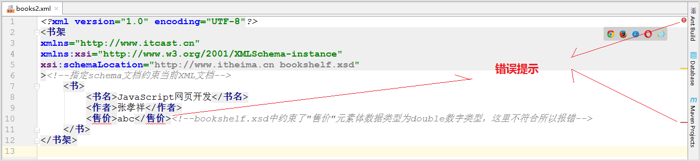
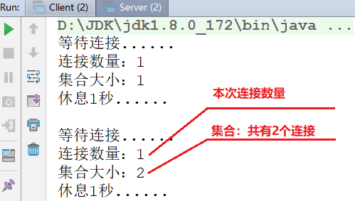
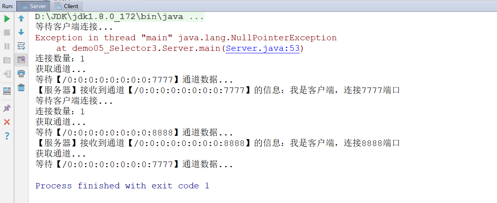
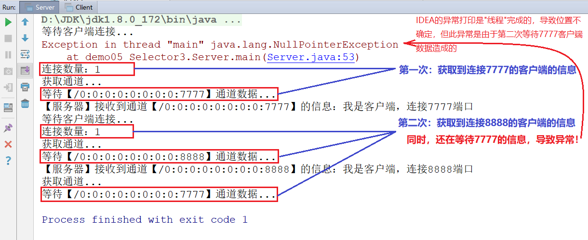
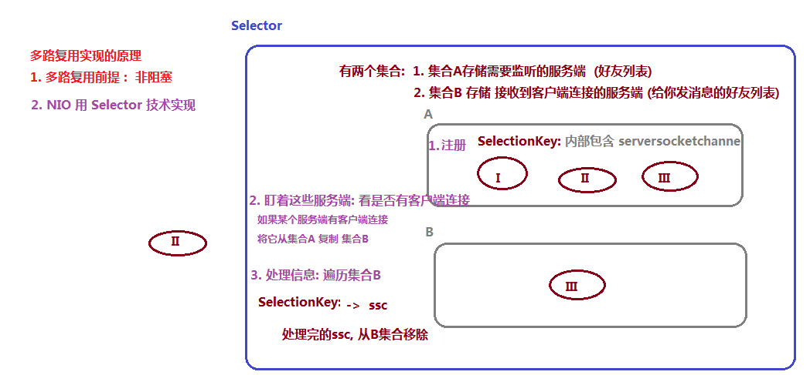

# day14【NIO多路复用，AIO，反射】

## 今日内容

- NIO多路复用技术
- AIO
- 反射
- 注解

## 教学目标

- [ ] 能够理解多路复用技术中，SelectionKey，SelectableChannel，Selector三者之间的关系
- [ ] 能够代码实现NIO的多路复用技术，实现客户端监听多个通道
- [ ] 能够说出AIO的特点
- [ ] 能够使用AIO完成TCP异步非阻塞方式连接
- [ ] 能够使用AIO完成TCP异步非阻塞方式读写
- [ ] 能够使用AIO完成TCP异步阻塞方式读写
- [ ] 能够使用反射技术获取Class字节码对象
- [ ] 能够通过反射技术获取构造方法对象，并创建对象。
- [ ] 能够通过反射获取成员方法对象，并且调用方法。
- [ ] 能够通过反射获取属性对象，并且能够给对象的属性赋值和取值。


# 第一章 Selector(选择器)

```markdown
# NIO  非阻塞式IO流  (jdk1.4)
1. buffer 缓冲
		byte[] buffer
2. channel 管道	
		支持双向读写
3. selector 选择器
		多路复用
# NIO2 : AIO(jdk1.7) 异步IO
1. 同步和异步 : 消息通知到底谁在通知
	1). 服务端同步: 你是服务端, 主动获取消息
	2). 服务端异步: 你是服务端,被动获取消息(有人通知你)
				代码体现: 接口回调
2. 阻塞和非阻塞 : 执行一个任务,是否等待
	1). 等待就是阻塞
	2). 不等待就是非阻塞
	
3. 回顾
	1). BIO: 同步阻塞
	2). NIO: 同步非阻塞
	3). AIO: 异步非阻塞
		被动获取消息,而且不等待 

# 反射(非常重要)
```


## 1 多路复用的概念

选择器`Selector`是NIO中的重要技术之一。它与`SelectableChannel`联合使用实现了非阻塞的多路复用。使用它可以节省CPU资源，提高程序的运行效率。

**"多路"是指：服务器端同时监听多个“端口”的情况。每个端口都要监听多个客户端的连接。**


- 服务器端的非多路复用效果

  

  **如果不使用“多路复用”，服务器端需要开很多线程处理每个端口的请求。如果在高并发环境下，造成系统性能下降。**

- 服务器端的多路复用效果

  

  **使用了多路复用，只需要一个线程就可以处理多个通道，降低内存占用率，减少CPU切换时间，在高并发、高频段业务环境下有非常重要的优势**


## 2 选择器Selector

Selector被称为：选择器，也被称为：多路复用器，它可以注册到很多个Channel上，监听各个Channel上发生的事件，并且能够根据事件情况决定Channel读写。这样，通过一个线程管理多个Channel，就可以处理大量网络连接了。

有了Selector，我们就可以利用一个线程来处理所有的Channels。线程之间的切换对操作系统来说代价是很高的，并且每个线程也会占用一定的系统资源。所以，对系统来说使用的线程越少越好。

- **如何创建一个Selector**

Selector 就是您注册对各种 I/O 事件兴趣的地方，而且当那些事件发生时，就是这个对象告诉您所发生的事件。

```java
Selector selector = Selector.open();
```

- **注册Channel到Selector**

为了能让Channel和Selector配合使用，我们需要把Channel注册到Selector上。通过调用 channel.register（）方法来实现注册：

```java
channel.configureBlocking(false);
SelectionKey key =channel.register(selector,SelectionKey.OP_READ);
```

注意，注册的Channel 必须设置成异步模式才可以,否则异步IO就无法工作，这就意味着我们不能把一个FileChannel注册到Selector，因为FileChannel没有异步模式，但是网络编程中的SocketChannel是可以的。

**register()方法的第二个参数：**是一个int值，意思是在**通过Selector监听Channel时对什么事件感兴趣**。可以监听四种不同类型的事件，而且可以使用SelectionKey的四个常量表示：

    1. 连接就绪--常量：SelectionKey.OP_CONNECT
    
    2. 接收就绪--常量：SelectionKey.OP_ACCEPT      (ServerSocketChannel在注册时只能使用此项)
    
    3. 读就绪--常量：SelectionKey.OP_READ
    
    4. 写就绪--常量：SelectionKey.OP_WRITE

   **注意：对于ServerSocketChannel在注册时，只能使用OP_ACCEPT，否则抛出异常。**

- 示例：下面的例子，服务器创建3个通道，同时监听3个端口，并将3个通道注册到一个选择器中

~~~java
import java.net.InetSocketAddress;
import java.nio.channels.SelectionKey;
import java.nio.channels.Selector;
import java.nio.channels.ServerSocketChannel;

public class Server {
    public static void main(String[] args) throws Exception {
        //创建3个通道，同时监听3个端口
        ServerSocketChannel channelA = ServerSocketChannel.open();
        channelA.configureBlocking(false);
        channelA.bind(new InetSocketAddress(7777));

        ServerSocketChannel channelB = ServerSocketChannel.open();
        channelB.configureBlocking(false);
        channelB.bind(new InetSocketAddress(8888));

        ServerSocketChannel channelC = ServerSocketChannel.open();
        channelC.configureBlocking(false);
        channelC.bind(new InetSocketAddress(9999));

        //获取选择器
        Selector selector = Selector.open();

        //注册三个通道
        channelA.register(selector, SelectionKey.OP_ACCEPT);
        channelB.register(selector, SelectionKey.OP_ACCEPT);
        channelC.register(selector, SelectionKey.OP_ACCEPT);
    }
}

~~~

接下来，就可以通过选择器selector操作三个通道了。


## 3 多路连接

- **Selector的keys()方法**

  - 此方法返回一个Set<SelectionKey>集合，表示：已注册通道的集合。每个已注册通道封装为一个SelectionKey对象。

- **Selector的selectedKeys()方法**

  - 此方法返回一个Set<SelectionKey>集合，表示：当`前已连接的通道的集合。每个已连接通道同一封装为一个SelectionKey对象。

- **Selector的select()方法**

  - 此方法会阻塞，直到有至少1个客户端连接。

  - 此方法会返回一个int值，表示有几个客户端连接了服务器。

- **示例：**
  客户端：启动两个线程，模拟两个客户端，同时连接服务器的7777和8888端口：

  ~~~java
  import java.io.IOException;
  import java.net.InetSocketAddress;
  import java.nio.channels.SocketChannel;
  
  public class Client {
      public static void main(String[] args) {
          new Thread(()->{
              try (SocketChannel socket = SocketChannel.open()) {
                  System.out.println("7777客户端连接服务器......");
                  socket.connect(new InetSocketAddress("localhost", 7777));
                  System.out.println("7777客户端连接成功....");
                  break;
              } catch (IOException e) {
                  System.out.println("7777异常重连");
              }
              
          }).start();
  
          new Thread(()->{
              
              try (SocketChannel socket = SocketChannel.open()) {
                  System.out.println("8888客户端连接服务器......");
                  socket.connect(new InetSocketAddress("localhost", 8888));
                  System.out.println("8888客户端连接成功....");
                  break;
              } catch (IOException e) {
                  System.out.println("8888异常重连");
              }
              
          }).start();
      }
  }
  
  ~~~

服务器端：

~~~java
  import java.net.InetSocketAddress;
  import java.nio.channels.SelectionKey;
  import java.nio.channels.Selector;
  import java.nio.channels.ServerSocketChannel;


  public class Server {
      public static void main(String[] args) throws Exception {
          //创建3个通道，同时监听3个端口
          ServerSocketChannel channelA = ServerSocketChannel.open();
          channelA.configureBlocking(false);
          channelA.bind(new InetSocketAddress(7777));

          ServerSocketChannel channelB = ServerSocketChannel.open();
          channelB.configureBlocking(false);
          channelB.bind(new InetSocketAddress(8888));
      
          ServerSocketChannel channelC = ServerSocketCh·annel.open();
          channelC.configureBlocking(false);
          channelC.bind(new InetSocketAddress(9999));
      
          //获取选择器
          Selector selector = Selector.open();
      
          //注册三个通道
          channelA.register(selector, SelectionKey.OP_ACCEPT);
          channelB.register(selector, SelectionKey.OP_ACCEPT);
          channelC.register(selector, SelectionKey.OP_ACCEPT);
      
          Set<SelectionKey> keys = selector.keys();//获取已注册通道的集合
          System.out.println("注册通道数量：" + keys.size());
          Set<SelectionKey> selectionKeys = selector.selectedKeys();//获取已连接通道的集合
          System.out.println("已连接的通道数量：" + selectionKeys.size());
          System.out.println("----------------------------------------------");
          
          System.out.println("【服务器】等待连接......");
          int selectedCount = selector.select();//此方法会"阻塞"
          System.out.println("连接数量：" + selectedCount);
          
        System.out.println("----------------------------------------------");
          Set<SelectionKey> keys1 = selector.keys();
        System.out.println("注册通道数量：" + keys1.size());
          Set<SelectionKey> selectionKeys1 = selector.selectedKeys();
        System.out.println("已连接的通道数量：" + selectionKeys1.size());
      }
  }

~~~

  测试采用两种运行方式：

  1. 先启动服务器，再启动客户端。会看到"服务器端"打印：

     ~~~java
     注册通道数量：3
     已连接的通道数量：0
     ----------------------------------------------
      【服务器】等待连接......
     连接数量：1
     ----------------------------------------------
      注册通道数量：3
      已连接的通道数量：1
     ~~~

****

  在**"服务器端"**加入循环，确保接收到每个通道的连接：(下面的代码去掉了一些测试代码)

  ~~~java
  public static void main(String[] args) throws Exception {
        //创建3个通道，同时监听3个端口
          ServerSocketChannel channelA = ServerSocketChannel.open();
          channelA.configureBlocking(false);
          channelA.bind(new InetSocketAddress(7777));
  
          ServerSocketChannel channelB = ServerSocketChannel.open();
          channelB.configureBlocking(false);
          channelB.bind(new InetSocketAddress(8888));
  
          ServerSocketChannel channelC = ServerSocketChannel.open();
          channelC.configureBlocking(false);
          channelC.bind(new InetSocketAddress(9999));
  
          //获取选择器
          Selector selector = Selector.open();
  
          //注册三个通道
          channelA.register(selector, SelectionKey.OP_ACCEPT);
          channelB.register(selector, SelectionKey.OP_ACCEPT);
          channelC.register(selector, SelectionKey.OP_ACCEPT);
  
          while(true) {
              System.out.println("等待连接......");
              int selectedCount = selector.select();
              System.out.println("连接数量：" + selectedCount);
              //获取已连接的通道对象
              Set<SelectionKey> selectionKeys = selector.selectedKeys();
              System.out.println("集合大小：" + selectionKeys.size());
  
              System.out.println("休息1秒......");
              Thread.sleep(1000);
              System.out.println();//打印一个空行
  
          }
  
      }
  ~~~

  先运行"服务器"，再运行"客户端"。服务器打印如下：

  

  

  **注意：此例会有一个问题——服务器端第一次select()会阻塞，获取到一次连接后再次循环时，select()将不会再阻塞，从而造成死循环，所以这里加了一个sleep()，这个我们后边解决！！！**

****

  接下来，我们获取"已连接通道"的集合，并遍历：

  **客户端**

  ~~~java
使用上例的客户端即可
  ~~~

  

  **服务器端**

  ~~~java
  
  import java.net.InetSocketAddress;
  import java.nio.channels.SelectionKey;
  import java.nio.channels.Selector;
  import java.nio.channels.ServerSocketChannel;
  import java.util.Set;
  
  public class Server {
      public static void main(String[] args) throws Exception {
          //创建3个通道，同时监听3个端口
          ServerSocketChannel channelA = ServerSocketChannel.open();
          channelA.configureBlocking(false);
          channelA.bind(new InetSocketAddress(7777));
  
          ServerSocketChannel channelB = ServerSocketChannel.open();
          channelB.configureBlocking(false);
          channelB.bind(new InetSocketAddress(8888));
  
          ServerSocketChannel channelC = ServerSocketChannel.open();
          channelC.configureBlocking(false);
          channelC.bind(new InetSocketAddress(9999));
  
          //获取选择器
          Selector selector = Selector.open();
  
          //注册三个通道
          channelA.register(selector, SelectionKey.OP_ACCEPT);
          channelB.register(selector, SelectionKey.OP_ACCEPT);
          channelC.register(selector, SelectionKey.OP_ACCEPT);
  
          while(true) {
              System.out.println("等待连接......");
              int selectedCount = selector.select();
              System.out.println("连接数量：" + selectedCount);
              //获取已连接的通道对象
              Set<SelectionKey> selectionKeys = selector.selectedKeys();
              System.out.println("集合大小：" + selectionKeys.size());
  
              //遍历已连接通道的集合
              Iterator<SelectionKey> it = selectionKeys.iterator();
              while (it.hasNext()) {
                  //获取当前连接通道的SelectionKey
                  SelectionKey key = it.next();
                  //从SelectionKey中获取通道对象
                  ServerSocketChannel channel = (ServerSocketChannel) key.channel();
                  //看一下此通道是监听哪个端口的
                  System.out.println("监听端口：" + channel.getLocalAddress());
              }
              System.out.println("休息1秒......");
              Thread.sleep(1000);
              System.out.println();//打印一个空行
  
          }
  
      }
  }
  
  ~~~

  - 先启动服务器端，再启动客户端。可以看到"服务器端"如下打印：

    ~~~java
    等待连接......
    连接数量：1
    集合大小：1
    监听端口：/0:0:0:0:0:0:0:0:8888
    休息1秒......
    
    等待连接......
    连接数量：1
    集合大小：2
    监听端口：/0:0:0:0:0:0:0:0:8888
    监听端口：/0:0:0:0:0:0:0:0:7777
    休息1秒......
    ~~~


- **关于SelectionKey**


    - 当一个"通道"注册到选择器Selector后，选择器Selector内部就创建一个SelectionKey对象，里面封装了这个通道和这个选择器的映射关系。
    - 通过SelectionKey的channel()方法，可以获取它内部的通道对象。

- **解决select()不阻塞，导致服务器端死循环的问题**


  - 原因：在将"通道"注册到"选择器Selector"时，我们指定了关注的事件SelectionKey.OP_ACCEPT，而我们获取到管道对象后，并没有处理这个事件，所以导致select()方法一直循环。

  - 解决：处理SelectionKey.OP_ACCEPT事件

    **更改服务器端代码**

    ~~~java
    public class Server {
        public static void main(String[] args) throws Exception {
            //创建3个通道，同时监听3个端口
            ...略...
    
            //获取选择器
            ...略...
    
            //注册三个通道
            ...略...
    
            while(true) {
                ......
                ......
                while (it.hasNext()) {
                    //获取当前连接通道的SelectionKey
                    SelectionKey key = it.next();
                    //从SelectionKey中获取通道对象
                    ServerSocketChannel channel = (ServerSocketChannel) key.channel();
                    //看一下此通道是监听哪个端口的
                    System.out.println("监听端口：" + channel.getLocalAddress());
                    SocketChannel accept = channel.accept();//处理accept事件(非阻塞)
                }
            }
    
        }
    }
    ~~~

    现在我们的服务器端可以很好的接收客户端连接了，但还有一个小问题，在接下来的互发信息的例子中我们可以看到这个问题并解决它。

    ****

## 4 多路信息接收

- 服务器端代码：

  ~~~java
  import java.io.IOException;
  import java.net.InetSocketAddress;
  import java.nio.ByteBuffer;
  import java.nio.channels.SelectionKey;
  import java.nio.channels.Selector;
  import java.nio.channels.ServerSocketChannel;
  import java.nio.channels.SocketChannel;
  import java.util.Iterator;
  import java.util.Set;
  
  public class Server {
      public static void main(String[] args) throws Exception {
          //1.同时监听三个端口：7777,8888,9999
          ServerSocketChannel serverChannel1 = ServerSocketChannel.open();
          serverChannel1.bind(new InetSocketAddress(7777));
          serverChannel1.configureBlocking(false);
  
          ServerSocketChannel serverChannel2 = ServerSocketChannel.open();
          serverChannel2.bind(new InetSocketAddress(8888));
          serverChannel2.configureBlocking(false);
  
          ServerSocketChannel serverChannel3 = ServerSocketChannel.open();
          serverChannel3.bind(new InetSocketAddress(9999));
          serverChannel3.configureBlocking(false);
  
          //2.获取一个选择器
          Selector selector = Selector.open();
  
          //3.注册三个通道
          SelectionKey key1 = serverChannel1.register(selector, SelectionKey.OP_ACCEPT);
          SelectionKey key2 = serverChannel2.register(selector, SelectionKey.OP_ACCEPT);
          SelectionKey key3 = serverChannel3.register(selector, SelectionKey.OP_ACCEPT);
  
          //4.循环监听三个通道
          while (true) {
              System.out.println("等待客户端连接...");
              int keyCount = selector.select();
              System.out.println("连接数量：" + keyCount);
  
              //遍历已连接的每个通道的SelectionKey
              Set<SelectionKey> keys = selector.selectedKeys();
              Iterator<SelectionKey> it = keys.iterator();
              while (it.hasNext()) {
                  SelectionKey nextKey = it.next();
                  System.out.println("获取通道...");
                  ServerSocketChannel channel = (ServerSocketChannel) nextKey.channel();
                  System.out.println("等待【" + channel.getLocalAddress() + "】通道数据...");
                  SocketChannel socketChannel = channel.accept();
                  //接收数据
                  ByteBuffer inBuf = ByteBuffer.allocate(100);
                  socketChannel.read(inBuf);
                  inBuf.flip();
                  String msg = new String(inBuf.array(), 0, inBuf.limit());
                  System.out.println("【服务器】接收到通道【" + channel.getLocalAddress() + "】的信息：" + msg);
  
              }
          }
      }
  }
  ~~~

- 客户端代码：

  ~~~java
  import java.io.IOException;
  import java.net.InetSocketAddress;
  import java.nio.ByteBuffer;
  import java.nio.channels.SocketChannel;
  
  public class Client {
      public static void main(String[] args) throws InterruptedException {
          //两个线程，模拟两个客户端，分别连接服务器的7777,8888端口
          new Thread(()->{
             
                  try(SocketChannel socket = SocketChannel.open())  {
  
                      System.out.println("7777客户端连接服务器......");
                      socket.connect(new InetSocketAddress("localhost", 7777));
                      System.out.println("7777客户端连接成功....");
                      //发送信息
                      ByteBuffer outBuf = ByteBuffer.allocate(100);
                      outBuf.put("我是客户端，连接7777端口".getBytes());
                      outBuf.flip();
                      socket.write(outBuf);
                  } catch (IOException e) {
                      System.out.println("7777异常重连");
                  }
              
          }).start();
          new Thread(()->{
              
                  try(SocketChannel socket = SocketChannel.open())  {
                      System.out.println("8888客户端连接服务器......");
                      socket.connect(new InetSocketAddress("localhost", 8888));
                      System.out.println("8888客户端连接成功....");
                      //发送信息
                      ByteBuffer outBuf = ByteBuffer.allocate(100);
                      outBuf.put("我是客户端，连接8888端口".getBytes());
                      outBuf.flip();
                      socket.write(outBuf);
                   
                  } catch (IOException e) {
                      System.out.println("8888异常重连");
                  }
              
          }).start();
      }
  }
  ~~~

  ------

  先启动服务器，再启动客户端，打印结果：

  

------

可以看到，出现了异常，为什么会这样？



问题就出现在获取selectedKeys()的集合。

- 第一次的7777连接，selectedKeys()获取的集合中只有一个SelectionKey对象。

- 第二次的8888连接，selectedKeys()获取的集合中有2个SelectionKey对象，一个是连接7777客户端的，另一个是连接8888客户端的。而此时应该只处理连接8888客户端的，所以在上一次处理完7777的数据后，应该将其SelectionKey对象移除。

**更改服务器端代码：**

~~~java
public class Server {
    public static void main(String[] args) throws Exception {
        //1.同时监听三个端口：7777,8888,9999
        ServerSocketChannel serverChannel1 = ServerSocketChannel.open();
        serverChannel1.bind(new InetSocketAddress(7777));
        serverChannel1.configureBlocking(false);

        ServerSocketChannel serverChannel2 = ServerSocketChannel.open();
        serverChannel2.bind(new InetSocketAddress(8888));
        serverChannel2.configureBlocking(false);

        ServerSocketChannel serverChannel3 = ServerSocketChannel.open();
        serverChannel3.bind(new InetSocketAddress(9999));
        serverChannel3.configureBlocking(false);

        //2.获取一个选择器
        Selector selector = Selector.open();

        //3.注册三个通道
        SelectionKey key1 = serverChannel1.register(selector, SelectionKey.OP_ACCEPT);
        SelectionKey key2 = serverChannel2.register(selector, SelectionKey.OP_ACCEPT);
        SelectionKey key3 = serverChannel3.register(selector, SelectionKey.OP_ACCEPT);

        //4.循环监听三个通道
        while (true) {
            System.out.println("等待客户端连接...");
            int keyCount = selector.select();
            System.out.println("连接数量：" + keyCount);

            //遍历已连接的每个通道的SelectionKey
            Set<SelectionKey> keys = selector.selectedKeys();
            Iterator<SelectionKey> it = keys.iterator();
            while (it.hasNext()) {
                SelectionKey nextKey = it.next();
                System.out.println("获取通道...");
                ServerSocketChannel channel = (ServerSocketChannel) nextKey.channel();
                System.out.println("等待【" + channel.getLocalAddress() + "】通道数据...");
                SocketChannel socketChannel = channel.accept();
                //接收数据
                ByteBuffer inBuf = ByteBuffer.allocate(100);
                socketChannel.read(inBuf);
                inBuf.flip();
                String msg = new String(inBuf.array(), 0, inBuf.limit());
                System.out.println("【服务器】接收到通道【" + channel.getLocalAddress() + "】的信息：" + msg);
				//移除此SelectionKey
                it.remove();
            }
        }
    }
}
~~~

测试：先启动服务器，再启动客户端，可以正常接收客户端数据了(客户端可以再添加一个线程连接9999端口)。


## 案例

  

```java
package com.itheima01.selector;

import java.io.IOException;
import java.net.InetSocketAddress;
import java.net.SocketAddress;
import java.nio.ByteBuffer;
import java.nio.channels.*;
import java.util.Iterator;
import java.util.Set;

/*
* shift + f6 : 修改变量名,类名,方法名(同步修改引用的地方)
* */
public class Server01 {

    public static void main(String[] args) throws IOException {
        //三个服务端
        ServerSocketChannel ssc1 = ServerSocketChannel.open();
        ssc1.bind(new InetSocketAddress(7777));
        ssc1.configureBlocking(false);//非阻塞

        ServerSocketChannel ssc2 = ServerSocketChannel.open();
        ssc2.bind(new InetSocketAddress(8888));
        ssc2.configureBlocking(false);//非阻塞

        ServerSocketChannel ssc3 = ServerSocketChannel.open();
        ssc3.bind(new InetSocketAddress(9999));
        ssc3.configureBlocking(false);//非阻塞

        //创建选择器
        Selector selector = Selector.open();

        //1. 注册 (三个ssc进入到selector底层集合A中)
        ssc1.register(selector, SelectionKey.OP_ACCEPT);
        ssc2.register(selector, SelectionKey.OP_ACCEPT);
        ssc3.register(selector, SelectionKey.OP_ACCEPT);

        //2. 死循环轮询
        while(true){
            System.out.println("开启轮询,查看有没有服务端被连接");
            // 轮询A集合, 返回的是被连接服务端的数量
            int count = selector.select();//阻塞, 直到至少一个服务端被连接
            System.out.println("count:" + count);

            //3. 获取B集合,然后进行遍历(因为上面方法是阻塞的,执行到这里b集合肯定有东西)
            Set<SelectionKey> b = selector.selectedKeys();
            Iterator<SelectionKey> it = b.iterator();
            while(it.hasNext()){
                SelectionKey element = it.next();
//                SelectableChannel channel = element.channel();
                ServerSocketChannel ssc = (ServerSocketChannel) element.channel();
                SocketAddress localAddress = ssc.getLocalAddress();
                System.out.println("当前被连接的服务端:" + localAddress);

                SocketChannel sc = ssc.accept();
                ByteBuffer buffer = ByteBuffer.allocate(1024);
                while(sc.read(buffer) != -1){
                    buffer.flip();
                    String str = new String(buffer.array(), 0, buffer.limit());
                    System.out.println(localAddress + "接收到信息:" + str);
                    buffer.clear();
                }
//                sc.close();
                it.remove();//处理完的ssc,要从集合中移除
            }

        }


    }
}

```


```java
package com.itheima01.selector;

import java.io.IOException;
import java.net.InetSocketAddress;
import java.nio.ByteBuffer;
import java.nio.channels.SocketChannel;

public class Client01 {

    public static void main(String[] args) throws IOException {

//        SocketChannel sc = SocketChannel.open(new InetSocketAddress("127.0.0.1",7777));

        SocketChannel sc = SocketChannel.open();
        sc.connect(new InetSocketAddress("127.0.0.1",7777));

        ByteBuffer wrap = ByteBuffer.wrap("hello boy".getBytes());
        sc.write(wrap);

        sc.close();
    }
}

```


# 第二章 NIO2-AIO(异步、非阻塞)

在 Java 7 中，NIO 有了进一步的改进，也就是 NIO 2，引入了异步非阻塞 IO 方式，也有很多人叫它 AIO（Asynchronous IO）。异步 IO 操作基于事件和回调机制，可以简单理解为，应用操作直接返回，而不会阻塞在那里，当后台处理完成，操作系统会通知相应线程进行后续工作。

## 1 AIO概述

AIO是异步IO的缩写，虽然NIO在网络操作中，提供了非阻塞的方法，但是NIO的IO行为还是同步的。对于NIO来说，我们的业务线程是在IO操作准备好时，得到通知，接着就由这个线程自行进行IO操作，IO操作本身是同步的。

但是对AIO来说，则更加进了一步，它不是在IO准备好时再通知线程，而是在IO操作已经完成后，再给线程发出通知。因此AIO是不会阻塞的，此时我们的业务逻辑将变成一个回调函数，等待IO操作完成后，由系统自动触发。

与NIO不同，当进行读写操作时，只须直接调用API的read或write方法即可。这两种方法均为异步的，对于读操作而言，当有流可读取时，操作系统会将可读的流传入read方法的缓冲区，并通知应用程序；对于写操作而言，当操作系统将write方法传递的流写入完毕时，操作系统主动通知应用程序。 即可以理解为，read/write方法都是异步的，完成后会主动调用回调函数。 在JDK1.7中，这部分内容被称作NIO.2，主要在Java.nio.channels包下增加了下面四个异步通道：

* AsynchronousSocketChannel  
* AsynchronousServerSocketChannel
* AsynchronousFileChannel
* AsynchronousDatagramChannel

在AIO socket编程中，服务端通道是AsynchronousServerSocketChannel，这个类提供了一个open()静态工厂，一个bind()方法用于绑定服务端IP地址（还有端口号），另外还提供了accept()用于接收用户连接请求。在客户端使用的通道是AsynchronousSocketChannel,这个通道处理提供open静态工厂方法外，还提供了read和write方法。

在AIO编程中，发出一个事件（accept read write等）之后要指定事件处理类（回调函数），AIO中的事件处理类是CompletionHandler<V,A>，这个接口定义了如下两个方法，分别在异步操作成功和失败时被回调。

void completed(V result, A attachment);

void failed(Throwable exc, A attachment);


## 2 AIO 异步非阻塞连接

- 服务器端：

~~~java
package com.itheima02.asynchronous;

import java.io.IOException;
import java.net.InetSocketAddress;
import java.nio.channels.AsynchronousServerSocketChannel;
import java.nio.channels.AsynchronousSocketChannel;
import java.nio.channels.CompletionHandler;

/*
* - AsynchronousSocketChannel
  - AsynchronousServerSocketChannel

    服务端异步获取连接
* */
public class Server01 {

    public static void main(String[] args) throws IOException, InterruptedException {

        AsynchronousServerSocketChannel assc = AsynchronousServerSocketChannel.open();
        assc.bind(new InetSocketAddress(9999));

//        assc.accept(); //还是阻塞的

        System.out.println("服务端非阻塞接收连接");
        assc.accept(null, new CompletionHandler<AsynchronousSocketChannel, Object>() {
            @Override
            public void completed(AsynchronousSocketChannel result, Object attachment) {
                System.out.println(Thread.currentThread().getName() +":服务端获取连接成功");
            }

            @Override
            public void failed(Throwable exc, Object attachment) {
                System.out.println("服务端获取连接失败");
            }
        });

        System.out.println("服务端开启获取连接之后,继续运行");

//        Thread.sleep(10000);//睡10秒
        while(true){

        }

    }
}

~~~

- 客户端代码

~~~java
package com.itheima02.asynchronous;

import java.io.IOException;
import java.net.InetSocketAddress;
import java.nio.channels.AsynchronousSocketChannel;
import java.nio.channels.CompletionHandler;
import java.util.concurrent.ExecutionException;
import java.util.concurrent.Future;

public class Client01 {

    public static void main(String[] args) throws IOException, ExecutionException, InterruptedException {

        AsynchronousSocketChannel asc = AsynchronousSocketChannel.open();
        //同步连接
//        Future<Void> future = asc.connect(new InetSocketAddress("127.0.0.1", 9999));
//        System.out.println(Thread.currentThread().getName() + ":" + future.get());

        //客户端异步连接
        System.out.println("客户端开始连接");
        InetSocketAddress remote = new InetSocketAddress("127.0.0.1", 9999);
        asc.connect(remote, null, new CompletionHandler<Void, Object>() {
            @Override
            public void completed(Void result, Object attachment) {
                System.out.println(Thread.currentThread().getName() + ":客户端连接成功");
            }

            @Override
            public void failed(Throwable exc, Object attachment) {
                System.out.println(Thread.currentThread().getName() + ":客户端连接失败");
            }
        });
        System.out.println("客户端继续干活");
        Thread.sleep(10000);
//        asc.close();
    }
}

~~~

- 服务器端打印：

  ~~~java
  服务器端继续....//非阻塞
  服务器端接收到连接...//异步——回调函数被执行
  ~~~

- 客户端打印：

  ~~~java
  客户端继续		//非阻塞
  客户端连接成功	   //异步——回调函数被执行
  ~~~

```java
package com.itheima02.asynchronous;
/*
*   非阻塞的体现: accept 不等
*   异步的体现: 没有轮询,被动接收结果的
*
*       当前线程不会被阻塞,不用轮询结果, 获取连接之后不需要等待结果,可以直接干别的事,
*       结果到了,通知当前程序
* */
public class Demo {

    public static void main(String[] args) {
        //模拟服务端异步接收连接
        accept(new MyCompletionHandler() {//回调函数: 调用方法的线程不是当前写代码的线程
            @Override
            public void completed() {
                System.out.println(Thread.currentThread().getName() +":服务端接收客户端连接成功");
            }

            @Override
            public void failed() {
                System.out.println(Thread.currentThread().getName() +":服务端接收客户端连接失败");
            }
        });
        System.out.println(Thread.currentThread().getName() +":主线程接收完连接,继续干活");
        while(true){

        }
    }

    private static void accept(MyCompletionHandler mch) {
        //模拟底层监听是否有客户端连接
        int status = 0;// 状态的值根据客户端和服务端的交互决定的,0表示失败,1表示成功
        new Thread(new Runnable() {
            @Override
            public void run() {
                try {
                    //假设过了10秒,有客户端连接
                    Thread.sleep(10_000);
                    //如果有客户端连接,底层调用
                    if(status == 1){
                        mch.completed();
                    }else if(status == 0){
                        mch.failed();
                    }
                } catch (InterruptedException e) {
                    e.printStackTrace();
                }

            }
        }).start();
    }
}
interface MyCompletionHandler{
    void completed();

    void failed();
}

```


## 3 AIO同步非阻塞读写

- 服务器端代码：

~~~java
import java.io.IOException;
import java.net.InetSocketAddress;
import java.nio.ByteBuffer;
import java.nio.channels.AsynchronousServerSocketChannel;
import java.nio.channels.AsynchronousSocketChannel;
import java.nio.channels.CompletionHandler;
import java.util.concurrent.ExecutionException;
import java.util.concurrent.Future;

public class Server {
    public static void main(String[] args) throws IOException {
        AsynchronousServerSocketChannel serverSocketChannel = AsynchronousServerSocketChannel.open()
                .bind(new InetSocketAddress(8888));
        //异步的accept()
        serverSocketChannel.accept(null, 
                            new CompletionHandler<AsynchronousSocketChannel, Void>() {
            //有客户端连接成功的回调函数
            @Override
            public void completed(AsynchronousSocketChannel result, Void attachment) {
                System.out.println("服务器端接收到连接...");
                ByteBuffer byteBuffer = ByteBuffer.allocate(20);
                Future<Integer> readFuture = result.read(byteBuffer);//同步读
                try {
                    System.out.println("读取信息：" + 
                                   new String(byteBuffer.array(),0,readFuture.get()));
                    result.close();
                } catch (InterruptedException e) {
                    e.printStackTrace();
                } catch (ExecutionException e) {
                    e.printStackTrace();
                } catch (IOException e) {
                    e.printStackTrace();
                }
            }
            //IO操作失败时的回调函数
            @Override
            public void failed(Throwable exc, Void attachment) {
                System.out.println("IO操作失败！");
            }
        });
        System.out.println("服务器端继续....");
        while (true) {

        }
    }
}
~~~

- 客户端代码：

~~~java
import java.io.IOException;
import java.net.InetSocketAddress;
import java.nio.ByteBuffer;
import java.nio.channels.AsynchronousSocketChannel;
import java.nio.channels.CompletionHandler;
import java.util.concurrent.ExecutionException;
import java.util.concurrent.Future;

public class Client {
    public static void main(String[] args) throws Exception {
        AsynchronousSocketChannel socketChannel = AsynchronousSocketChannel.open();
        socketChannel.connect(new InetSocketAddress("localhost", 8888), null, 
                              						new CompletionHandler<Void, Void>() {
            @Override
            public void completed(Void result, Void attachment) {
                try {
                    Thread.sleep(1000);
                } catch (InterruptedException e) {
                    e.printStackTrace();
                }
                System.out.println("客户端连接成功");
                Future<Integer> writeFuture = socketChannel.write(
                    			     ByteBuffer.wrap("我来自客户端...".getBytes()));//同步写
                try {
                    System.out.println("写入大小：" + writeFuture.get());
                    socketChannel.close();
                } catch (InterruptedException e) {
                    e.printStackTrace();
                } catch (ExecutionException e) {
                    e.printStackTrace();
                } catch (IOException e) {
                    e.printStackTrace();
                }

            }

            @Override
            public void failed(Throwable exc, Void attachment) {
                System.out.println("客户端失败！");
            }
        });
        System.out.println("客户端继续");
        Thread.sleep(30000);
    }
}

~~~

- 服务器端执行结果：

  ~~~java
  服务器端继续....
  服务器端接收到连接...
  读取信息：我来自客户端..
  ~~~

- 客户端执行结果：

  ~~~java
  客户端继续
  客户端连接成功
  写入大小：21
  ~~~


## 4 AIO 异步非阻塞读写

- 服务器端代码：

~~~java
import java.io.IOException;
import java.net.InetSocketAddress;
import java.nio.ByteBuffer;
import java.nio.channels.AsynchronousServerSocketChannel;
import java.nio.channels.AsynchronousSocketChannel;
import java.nio.channels.CompletionHandler;
import java.util.concurrent.TimeUnit;

public class Server {
    public static void main(String[] args) throws IOException {
        AsynchronousServerSocketChannel serverSocketChannel = 
            							AsynchronousServerSocketChannel.open().
                                        bind(new InetSocketAddress(8888));
        serverSocketChannel.accept(null, 
                               new CompletionHandler<AsynchronousSocketChannel, Void>() {
            @Override
            public void completed(AsynchronousSocketChannel ch, Void attachment) {
                serverSocketChannel.accept(null, this);
                ByteBuffer byteBuffer = ByteBuffer.allocate(Integer.MAX_VALUE / 300);
                System.out.println("【服务器】read开始...");
                ch.read(byteBuffer, 10, TimeUnit.SECONDS, null, 
                        			new CompletionHandler<Integer, Void>() {
                    @Override
                    public void completed(Integer result, Void attachment) {
                        if (result == -1) {
                            System.out.println("客户端没有传输数据就close了...");
                        }
                        System.out.println("服务器读取数据：" + 
                                           new String(byteBuffer.array(),0,result));
                        try {
                            ch.close();
                            System.out.println("服务器关闭！");
                        } catch (IOException e) {
                            e.printStackTrace();
                        }
                    }

                    @Override
                    public void failed(Throwable exc, Void attachment) {
                        exc.printStackTrace();
                        System.out.println(attachment);
                        System.out.println("【服务器】异常");
                    }
                });
                System.out.println("【服务器】read结束...");

            }

            @Override
            public void failed(Throwable exc, Void attachment) {

            }
        });
        System.out.println("服务器开始循环...");
        while (true) {

        }
    }
}
~~~

- 客户端代码：

~~~java
import java.io.IOException;
import java.net.InetSocketAddress;
import java.nio.ByteBuffer;
import java.nio.channels.AsynchronousSocketChannel;
import java.nio.channels.CompletionHandler;

public class Client {
    public static void main(String[] args) throws IOException, InterruptedException {
        AsynchronousSocketChannel socketChannel = AsynchronousSocketChannel.open();
        socketChannel.connect(new InetSocketAddress("localhost", 8888), null, new CompletionHandler<Void, Void>() {
            @Override
            public void completed(Void result, Void attachment) {

                socketChannel.write(
                        ByteBuffer.wrap("你好服务器".getBytes()), null,
                        new CompletionHandler<Integer, Void>() {
                            @Override
                            public void completed(Integer result, Void attachment) {
                                System.out.println("输出完毕！");
                            }

                            @Override
                            public void failed(Throwable exc, Void attachment) {
                                System.out.println("输出失败！");
                            }
                        });

                try {
                    socketChannel.close();
                } catch (IOException e) {
                    e.printStackTrace();
                }
            }

            @Override
            public void failed(Throwable exc, Void attachment) {
                System.out.println("【客户端】异常！");
            }
        });
        Thread.sleep(1000);
    }
}

~~~

- 服务器端结果：

  ~~~java
  服务器开始循环...
  【服务器】read开始...
  【服务器】read结束...
  服务器读取数据：你好服务器
  服务器关闭！
  ~~~

- 客户端结果：

  ~~~java
  输出完毕！
  ~~~


# 第三章 反射 (非常重要!!!)

## 1 类加载器

### 1.1 类的加载

```markdown
#java编写到运行:

	源码(java)   ->   编译(class)     ->  运行(runtime)
		Student.java  Student.class    Class<Student>
# 类加载
1. 发生时期: 编译之后,代码运行的之前,发生类加载
2. 例子: 
        Student s = new Student();
        s.name = "张三";
        s.speak();
   	1). jvm检测到到程序使用了Student这个类,就会去加载这个类(内存: 方法区)
    2). Student.class 被加载到 jvm内存的方法区的同时,会在堆中会生成一个Class<Student>对象
    
3. 解释
	1). Class对象 : 是一个类在运行时的描述
	2). 类加载器(ClassLoader): 将.class文件加载到内存(特殊的输入流)

4. 类加载的时机
	0). 基本上,我们在代码使用了某个类,就要先加载这个类
	1. 创建类的实例。
	2. 类的静态变量，或者为静态变量赋值。
	3. 类的静态方法。
	4. 使用反射方式来强制创建某个类或接口对应的java.lang.Class对象。
	5. 初始化某个类的子类。
	6. 直接使用java.exe命令来运行某个主类。
  	 以上六种情况的任何一种，都可以导致JVM将一个类加载到方法区。

5. 类加载器
	0). 作用: 将.class文件加载到内存的方法区(特殊的输入流)
	1). 三种类加载
        1. 启动类加载器(Bootstrap ClassLoader)
            用于加载系统类库<JAVA_HOME>\bin目录下的class，例如：rt.jar。

        2. 扩展类加载器(Extension ClassLoader)：用于加载扩展类库<JAVA_HOME>\lib\ext目录下的class。

        3. 应用程序类加载器(Application ClassLoader)：用于加载程序员自己编写的类。
   2). 三种类加载器存在继承关系
   		启动类加载器(父类) -> 扩展类加载器(子类) -> 应用程序类加载器(子类的子类)
   3). 发现:
   		启动类加载器 : 用c/c++写的
   		扩展类加载器 / 应用程序类加载器 : java写的
   		"组合"  combination 式继承, 不是java的extends 继承
   		
	4). 双亲委托机制
		I. 目的: 保证一个类只会被加载一次
		II. 原理:
			当jvm需要加载一个类的时候, 三种类加载器都有可能被调用				其中一个类加载器接收到某个类加载指令的时候,不会立马启动加载,会先向上传递给启动类加载器
			由启动类加载器开始判定,是否能够加载,如果不能往下传递到扩展类加载器, 接着判定能否加载...
			
6. 扫坑
	1). 当前类名.class 作为同步代码块的锁对象
		I. Class对象是类加载器加载类的时候创建的
		II. 双亲委托机制保证一个类只会加载一次,这个类的Class对象只会被创建一次
		III. 唯一, 而且还不浪费内存
	2). ResourceBundle为什么要求properties文件必须放在src下
    	src路径 -> 编译输出路径 (类路径)
    	ResourceBundle底层用的就是类加载器
	
	
```

```java
package com.itheima03.clazz;

import java.util.ArrayList;
/*
* java.lang 不用导包
* */
public class Demo01 {
    static{

    }
    public static void main(String[] args) throws ClassNotFoundException {
//        method01();

        //Student的Class对象
        Class<Student> clazz = Student.class;
        ClassLoader loader = clazz.getClassLoader();
        //sun.misc.Launcher$AppClassLoader@18b4aac2
        System.out.println(loader);

        ClassLoader loader2 = loader.getParent();
        //sun.misc.Launcher$ExtClassLoader@1540e19d
        System.out.println(loader2);

        ClassLoader loader3 = loader2.getParent();
        /*
            null : 启动类加载器 (用C/C++写的)
         */
        System.out.println(loader3);

        Son son = new Son();
        son.getClass().getSuperclass();
    }

    private static void method01() {
        //        1. 创建类的实例。
//        Student student = new Student();
//        2. 类的静态变量，或者为静态变量赋值。
//        Student.age = 2;static{
//
//    }
//        3. 类的静态方法。
//          Student.speak();
//        4. 使用反射方式来强制创建某个类或接口对应的java.lang.Class对象。
//        Class<Student> clazz = (Class<Student>) Class.forName("com.itheima03.clazz.Student");
//        5. 初始化某个类的子类。
//        Son son = new Son();// 先加载父类,后加载子类
//        6. 直接使用java.exe命令来运行某个主类。

        Object obj = new Object();
        ArrayList<String> list = new ArrayList<>();
    }

}


class Student{
    static int age;
    String name;
    static void speak(){

    }
}
class Son extends Student{

}
```


```java
package com.itheima03.clazz;

import java.io.FileInputStream;
import java.io.IOException;
import java.io.InputStream;
import java.util.Properties;
import java.util.ResourceBundle;

public class Demo02 {
    Object obj = new Object(); //浪费内存
    public static void main(String[] args) throws IOException {
        //Demo02.class就算不用也存在
        synchronized (Demo02.class){

        }

        Properties p = new Properties();
//        FileInputStream is = new FileInputStream("day14/src/a.properties");

        Class<Demo02> clazz = Demo02.class;
        InputStream is = clazz.getClassLoader().getResourceAsStream("a.properties");
        p.load(is);

        String name = p.getProperty("name");
        System.out.println(name);

        /*
            javase工程,文件必须放在src下(底层用的类加载器)

            类路径:
                1. 类加载器的工作路径
                    .class文件 加载内存中
                2. 源码
                    src下的内容 编译到 类路径去
         */
        ResourceBundle bundle = ResourceBundle.getBundle("a");
        String name2 = bundle.getString("name");
        System.out.println(name2);
    }
}

```


- 当我们的程序在运行后，第一次使用某个类的时候，会将此类的class文件读取到内存，并将此类的所有信息存储到一个Class对象中


​	**说明：**

> 1. 上图：Class对象是指：java.lang.Class类的对象，此类由Java类库提供，专门用于存储类的信息。
> 2. 我们程序中可以通过："类名.class"，或者"对象.getClass()"方法获取这个Class对象


### 1.2 类的加载时机

1. 创建类的实例。

2. 类的静态变量，或者为静态变量赋值。

3. 类的静态方法。

4. 使用反射方式来强制创建某个类或接口对应的java.lang.Class对象。

5. 初始化某个类的子类。

6. 直接使用java.exe命令来运行某个主类。

   以上六种情况的任何一种，都可以导致JVM将一个类加载到方法区。


### 1.3 类加载器

​	**类加载器：是负责将磁盘上的某个class文件读取到内存并生成Class的对象的机器。**

Java中有三种类加载器，它们分别用于加载不同种类的class：

- 启动类加载器(Bootstrap ClassLoader)：用于加载系统类库<JAVA_HOME>\bin目录下的class，例如：rt.jar。
- 扩展类加载器(Extension ClassLoader)：用于加载扩展类库<JAVA_HOME>\lib\ext目录下的class。
- 应用程序类加载器(Application ClassLoader)：用于加载我们自定义类的加载器。


~~~java
public class Test{
  public static void main(String[] args){
    System.out.println(Test.class.getClassLoader());//sun.misc.Launcher$AppClassLoader
    System.out.println(String.class.getClassLoader());//null(API中说明：一些实现可能使用null来表示引导类加载器。 如果此类由引导类加载器加载，则此方法将在此类实现中返回null。 )
  }
}
~~~

### 1.4 双亲委派机制

​	

​	上图展示了"类加载器"的层次关系，这种关系称为类加载器的"双亲委派模型"：

- "双亲委派模型"中，除了顶层的启动类加载器外，其余的类加载器都应当有自己的"父级类加载器"。

- 这种关系不是通过"继承"实现的，通常是通过"组合"实现的。通过"组合"来表示父级类加载器。

- "双亲委派模型"的工作过程：

  - 某个"类加载器"收到类加载的请求，它首先不会尝试自己去加载这个类，而是把请求交给父级类加载器。
  - 因此，所有的类加载的请求最终都会传送到顶层的"启动类加载器"中。
  - 如果"父级类加载器"无法加载这个类，然后子级类加载器再去加载。


### 1.5 双亲委派机制的好处

​		双亲委派机制的一个显而易见的好处是：Java的类随着它的类加载器一起具备了一种带有优先级的层次关系。例如：java.lang.Object。它存放在rt.jar中。无论哪一个类加载器要加载这个类，最终都是委派给处于顶端的"启动类加载器"进行加载，因此java.lang.Object类在程序的各种类加载器环境中都是同一个类。

​		相反，如果没有"双亲委派机制"，如果用户自己编写了一个java.lang.Object，那么当我们编写其它类时，这种隐式的继承使用的将会是用户自己编写的java.lang.Object类，那将变得一片混乱。


## 2 Class对象

```markdown
# Class对象
1. Class对象: 反射前提
2. 介绍: Class对象是类运行时的描述
3. Class对象的创建
		1). .class文件被类加载器加载到方法区的时候,jvm会在堆中创建Class对象 
		2). Class对象是又jvm创建的, 我们无需创建Class对象
		3). 因为类加载器双亲委托机制的特点,Class对象只会有一个
4. Class对象的获取
	* 方式1: 通过类名.class获得
	* 方式2：通过对象名.getClass()方法获得
	* 方式3：通过Class类的静态方法获得： static Class forName("类全名")
    	* 每一个类的Class对象都只有一个。
    	
5. 以下代码非常熟练(!!!!!!!!!!!!!!!!!!!!!!!!!!!!!!!!!!!!!!)
```

```java
package com.itheima03.clazz;

/*
* Class对象的获取
 * 方式1: 通过类名.class获得
 * 方式2：通过对象名.getClass()方法获得
 * 方式3：通过Class类的静态方法获得： static Class forName("类全名")
 * 每一个类的Class对象都只有一个。
* */
public class Demo03 {

    public static void main(String[] args) throws ClassNotFoundException {
        //方式1: 通过类名.class获得
        Class<Person> clazz = Person.class;
        //class com.itheima03.clazz.Person
        System.out.println(clazz);

        //方式2：通过对象名.getClass()方法获得
        Person p = new Person();
        Class clazz2 = p.getClass();
        System.out.println(clazz2);

//        方式3：通过Class类的静态方法获得： static Class forName("类全名")
        Class<?> clazz3 = Class.forName("com.itheima03.clazz.Person");
        System.out.println(clazz3);

        System.out.println(clazz2 == clazz3);//true

        //这个是获取当前Class对象的类加载器
        ClassLoader classLoader = clazz.getClassLoader();
        //sun.misc.Launcher$AppClassLoader@18b4aac2
        System.out.println(classLoader);
    }
}
class Person{
    String name;
    int age;
    public void speak(){

    }
}
```


## 3 反射

```markdown
# 反射 (reflection)
1. 反射技术: 在程序运行时操作类
2. 反射: 类的反射 -> 我们可以看见并操作这个类所有东西(构造,方法,属性)
3. 类的反射:
	1). 构造的反射(非常重要)
	2). 方法的反射(非常重要)
	3). 属性的反射(不重要)

4. 反射运用
	1). idea(开发工具)的自动提示
	2). 框架 (反射具备解耦的特点)
```


```java
package com.itheima04.reflection;

import org.junit.Test;

import java.lang.reflect.Constructor;
import java.lang.reflect.InvocationTargetException;

/*
*   构造的反射: 在程序运行时操作类的构造
*       1. constructor 构造器,构造方法
*       2. method  方法
*       3. field  属性
*       
*       最终的目的: 创建对象
* */
public class Demo01 {

    @Test
    public void method01(){
        //用构造方法创建对象
        Person p = new Person();
        System.out.println(p);

    }

    @Test
    public void method02() throws NoSuchMethodException, IllegalAccessException, InvocationTargetException, InstantiationException {
        //1. 获取Class对象(三种) : 反射前提
        Class<Person> clazz = Person.class;
        /*
            2. 获取类中的一个构造器对象
                public Constructor<T> getConstructor(Class<?>... parameterTypes)
                 parameterTypes : 参数类型(可变参数 0 ~ 无穷大)
         */
        Constructor<Person> constructor = clazz.getConstructor(); //空参构造
//        Constructor<Person> constructor = clazz.getConstructor(String.class,int.class); //空参构造

        /*
            3. 用构造器创建对象
            public T newInstance(Object ... initargs)
                传递的参数,这个参数列表要跟构造器一一对应
         */
        Person p = constructor.newInstance();
//        constructor.newInstance("张三",18);
        System.out.println(p);
    }

    @Test
    public void method03() throws Exception{
        Class<?> clazz = Class.forName("com.itheima04.reflection.Person");
        /*
            默认使用空参构造创建对象
         */
        Person p = (Person) clazz.newInstance();
        System.out.println(p);
    }

    @Test
    public void method04() throws NoSuchMethodException, ClassNotFoundException, IllegalAccessException, InvocationTargetException, InstantiationException {
        Class<?> clazz = Class.forName("com.itheima04.reflection.Person");
        /*
        * getConstructor : 只能获取public修饰的构造方法
        * getDeclaredConstructor : 获取声明的构造方法(所有权限都能获取)
        * */
//        Constructor<?> constructor = clazz.getConstructor(String.class, int.class);
        Constructor<?> constructor = clazz.getDeclaredConstructor(String.class, int.class);
            //暴力反射: 临时修改可访问权限 
            //暴力反射会破坏类的封装性,通常情况下不推荐
        constructor.setAccessible(true);
        //IllegalAccessException : 非法访问异常(因为private方法不能调用)
        Person p = (Person) constructor.newInstance("张三", 18);
        System.out.println(p);

    }
}

```


## 工厂设计模式

```java
package com.itheima05.ioc;

interface Singer{
    void sing();
}
public class LiuDeHua implements Singer{

    public void sing(){
        System.out.println("刘德华唱忘情水~~");
    }
}
class ZhangXueYou implements Singer{

    public void sing(){
        System.out.println("张学友唱吻别~~");
    }
}
// 1. 定义类,实现接口 2. 写配置文件
class CaiXuKun implements Singer{
    @Override
    public void sing() {
        System.out.println("蔡徐坤唱鸡你太美~~~");
    }
}
```

```java
package com.itheima05.ioc;

import java.util.ResourceBundle;
/*
*   工厂: 生产商品
*
*   歌手工厂: 创建歌手对象的
*
*   工厂设计模式:
*       1. 工厂类 :  封装创建商品对象的方法的工具类  SingerFactory
*       2. 商品类 :
*               抽象商品 : Singer (耦合)
*               实际商品 : Singer实现类 (配置文件)
*       3. 工厂设计模式: 对象创建的最佳方式
*
*
*    框架 :  SingerFactory + 配置文件
*
*    IOC: inversion of control 控制反转 (spring 两大基础思想之一)
*       1. 控制: 对象的创建控制权
*
*      2. 反转
*            最初: 对象的创建是由业务类控制的
 *            用了框架: 对象的创建是由工厂类控制的
 *
 *     好处: 解耦
*
**/
public class SingerFactory {
    private static Singer singer;
    static{
        try {
            ResourceBundle bundle = ResourceBundle.getBundle("singer");
            String className = bundle.getString("singer");
            Class<?> clazz = Class.forName(className);
            singer = (Singer) clazz.newInstance();
        } catch (Exception e) {
            e.printStackTrace();
        }
    }
    public static Singer getSinger(){

        return singer;
    }
}

```

```properties
singer=com.itheima05.ioc.CaiXuKun
```


```java
package com.itheima05.ioc;

import com.itheima04.reflection.Person;

import java.util.ResourceBundle;

/*
*   #创建对象
*   1. 创建对象
*
*   2. 获取对象
*
*   # 解耦
*       1. 耦合: A类使用B类的东西,直接调用的越多,耦合越高
*       2. 解耦: 降低耦合度,提高代码复用性
*
*    # 多态
*       接口类型 引用 = 接口实现类对象
*       优势: 解耦, 提高代码复用性
*
*    # 进一步解耦: 反射 + 配置文件
*       源码修改,重新编译,重新运行部署
*
*       需求变动,代码不改
* */
public class Demo01 {

    public static void main(String[] args) throws ClassNotFoundException, IllegalAccessException, InstantiationException {

        //需求: 请刘德华唱歌
        //需求变了: 请张学友唱歌
//        LiuDeHua singer = new LiuDeHua();
//        ZhangXueYou singer = new ZhangXueYou();
        //多态
//        Singer singer = new LiuDeHua();
        //反射 + properties配置文件
//        Class<?> clazz = Class.forName("com.itheima05.ioc.LiuDeHua");

//        ResourceBundle bundle = ResourceBundle.getBundle("singer");
//        String className = bundle.getString("singer");
//        Class<?> clazz = Class.forName(className);
//        Singer singer = (Singer) clazz.newInstance();

        //工厂模式
        Singer singer = SingerFactory.getSinger();
        singer.sing();


    }
}

```


### 3.2 Class类常用方法

```java
String getSimpleName(); 获得类名字符串：类名
String getName();  获得类全名：包名+类名
T newInstance() ;  创建Class对象关联类的对象
```

- 示例代码

```java
public class ReflectDemo02 {
    public static void main(String[] args) throws Exception {
        // 获得Class对象
        Class c = Student.class;
        // 获得类名字符串：类名
        System.out.println(c.getSimpleName());
        // 获得类全名：包名+类名
        System.out.println(c.getName());
        // 创建对象
        Student stu = (Student) c.newInstance();
        System.out.println(stu);
    }
}
```


## 4 反射之操作构造方法

### 4.1 Constructor类概述

```java
反射之操作构造方法的目的
    * 获得Constructor对象来创建类的对象。

Constructor类概述
    * 类中的每一个构造方法都是一个Constructor类的对象
```

### 4.2 Class类中与Constructor相关的方法 

```java
1. Constructor getConstructor(Class... parameterTypes)
        * 根据参数类型获得对应的Constructor对象。
        * 只能获得public修饰的构造方法
 2. Constructor getDeclaredConstructor(Class... parameterTypes)
        * 根据参数类型获得对应的Constructor对象
    	* 可以是public、protected、(默认)、private修饰符的构造方法。
 3. Constructor[] getConstructors()
        获得类中的所有构造方法对象，只能获得public的
 4. Constructor[] getDeclaredConstructors()
        获得类中的所有构造方法对象
    	可以是public、protected、(默认)、private修饰符的构造方法。
```

### 1.4.3 Constructor对象常用方法

```java
1. T newInstance(Object... initargs)"——
 	根据指定的参数创建对象
2. void setAccessible(true)
   设置"暴力反射"——是否取消权限检查，true取消权限检查，false表示不取消
```

### 4.4 示例代码

~~~java
public class Student{
    private String name;
    private String sex;
    private int age;
    
    //公有构造方法
    public Student(String name,String sex,int age){
        this.name = name;
        this.sex = sex;
        this.age = age;
    }
    //私有构造方法
    private Student(String name,String sex){
        this.name = name;
        this.sex = sex;
    }
}
~~~


```java
public class ReflectDemo03 {

    /*
      Constructor[] getConstructors()
           获得类中的所有构造方法对象，只能获得public的
      Constructor[] getDeclaredConstructors()
            获得类中的所有构造方法对象，包括private修饰的
    */
    @Test
    public void test03() throws Exception {
        // 获得Class对象
        Class c = Student.class;
        //  获得类中的所有构造方法对象，只能获得public的
        // Constructor[] cons = c.getConstructors();
        // 获取类中所有的构造方法，包括public、protected、(默认)、private的
        Constructor[] cons = c.getDeclaredConstructors();
        for (Constructor con:cons) {
            System.out.println(con);
        }
    }

    /*
       Constructor getDeclaredConstructor(Class... parameterTypes)
           根据参数类型获得对应的Constructor对象
    */
    @Test
    public void test02() throws Exception {
        // 获得Class对象
        Class c = Student.class;
        // 获得两个参数构造方法对象
        Constructor con = c.getDeclaredConstructor(String.class,String.class);
        // 取消权限检查(暴力反射)
        con.setAccessible(true);
        // 根据构造方法创建对象
        Object obj = con.newInstance("rose","女");
        System.out.println(obj);
    }

    /*
        Constructor getConstructor(Class... parameterTypes)
            根据参数类型获得对应的Constructor对象
     */
    @Test
    public void test01() throws Exception {
        // 获得Class对象
        Class c = Student.class;
        // 获得无参数构造方法对象
        Constructor con = c.getConstructor();
        // 根据构造方法创建对象
        Object obj = con.newInstance();
        System.out.println(obj);

        // 获得有参数的构造方法对象
        Constructor con2 = c.getConstructor(String.class, String.class,int.class);
        // 创建对象
        Object obj2 = con2.newInstance("jack", "男",18);
        System.out.println(obj2);
    }
}
```


## 5 反射之操作成员方法

### 5.1 Method类概述

```java
反射之操作成员方法的目的
    * 操作Method对象来调用成员方法
Method类概述
    * 每一个成员方法都是一个Method类的对象。
```

### 5.2 Class类中与Method相关的方法

```java
* Method getMethod(String name,Class...args);
    * 根据方法名和参数类型获得对应的构造方法对象，只能获得public的

* Method getDeclaredMethod(String name,Class...args);
    * 根据方法名和参数类型获得对应的构造方法对象，包括public、protected、(默认)、private的

* Method[] getMethods();
    * 获得类中的所有成员方法对象，返回数组，只能获得public修饰的且包含父类的

* Method[] getDeclaredMethods();
    * 获得类中的所有成员方法对象，返回数组,只获得本类的，包括public、protected、(默认)、private的
```

### 5.3 Method对象常用方法

```java
*  Object invoke(Object obj, Object... args)
    * 调用指定对象obj的该方法
    * args：调用方法时传递的参数
*  void setAccessible(true)
    设置"暴力访问"——是否取消权限检查，true取消权限检查，false表示不取消
```

### 1.5.4 示例代码

~~~java
package com.itheima01.reflection;

public class Person {

    public String name;
    private int age;

    public Person(){

    }

    private Person(String name, int age) {
        this.name = name;
        this.age = age;
    }

    @Override
    public String toString() {
        return "Person{" +
                "name='" + name + '\'' +
                ", age=" + age +
                '}';
    }

    public boolean speak(String a, int b){
        System.out.println("speak:" + a + "," + b);
        return true;
    }

    private void show(String c){
        System.out.println("show:" + c);
    }

    public String getName() {
        return name;
    }

    public void setName(String name) {
        this.name = name;
    }

    public int getAge() {
        return age;
    }

    public void setAge(int age) {
        this.age = age;
    }
}

~~~


```java
package com.itheima01.reflection;

import org.junit.Test;

import java.lang.reflect.InvocationTargetException;
import java.lang.reflect.Method;

/*
*  反射: 在运行时操作类 (构造,方法,属性)
*
*  0. 反射的前提: Class对象
*       1). 是什么: 类在运行时的描述
*       2). 创建的: 类(字节码文件)被加载到jvm内存的方法区时,jvm会在堆中创建这个类的Class对象
*       3). 特点: 一个类就一个Class对象
*       4). 类加载器 (输入流)
*            I: 作用: 将类(字节码文件)被加载到jvm内存的方法区
*            II. 三种:  (继承: 组合)
*               Bootstrap ClassLoader (C/C++)
*               Extension ClassLoader
*               Application ClassLoader
*            III. 双亲委托机制 : 保证一个类只会被加载一次
*
*   1.  构造
*           主要作用: 创建对象
*   2.  方法
*           主要作用: 调用方法
*   3.  属性 (不重要)
*           主要作用: 赋值和取值
*
*
* */
public class Demo01 {

    @Test
    public void method01(){
        Person p = new Person();
        p.speak("字符串", 1);
    }

    @Test
    public void method02() throws NoSuchMethodException, InvocationTargetException, IllegalAccessException {
        //1. 获取Class对象
        Person p = new Person();
        Class<?> clazz = p.getClass();
        /*
            2. 获取方法对象

            Method getMethod(String name, Class<?>... parameterTypes)
            1. name : 要获取的方法的名字 (方法名)
            2. parameterTypes : 参数类型
         */
        Method method = clazz.getMethod("speak", String.class, int.class);

        /*
        * 3. 调用方法
        *        Object invoke(Object obj, Object... args)
        *        1. obj : 调用方法的对象
        *        2. args : 调用方法传入的参数
        *       return : 调用方法之后返回的结果 (返回值)
        * */
        boolean value = (Boolean) method.invoke(p, "字符串2", 2); //Boolean
        System.out.println(value);
    }


    @Test
    public void method03() throws NoSuchMethodException, InvocationTargetException, IllegalAccessException {
        Person p = new Person();
        Class<?> clazz = p.getClass();
          /*
            getMethod() : 只能获取public修饰的方法
            getDeclaredMethod() : 获取所有权限的方法
           */
        Method method = clazz.getDeclaredMethod("show", String.class);
            //暴力反射
        method.setAccessible(true);

        method.invoke(p, "呵呵");
    }

}

```


## 6 反射之操作成员变量【自学】

### 6.1 Field类概述

```java
反射之操作成员变量的目的
    * 通过Field对象给对应的成员变量赋值和取值

Field类概述
    * 每一个成员变量都是一个Field类的对象。
```

### 6.2 Class类中与Field相关的方法

```java
* Field getField(String name);
    *  根据成员变量名获得对应Field对象，只能获得public修饰
* Field getDeclaredField(String name);
    *  根据成员变量名获得对应Field对象，包括public、protected、(默认)、private的
* Field[] getFields();
    * 获得所有的成员变量对应的Field对象，只能获得public的
* Field[] getDeclaredFields();
    * 获得所有的成员变量对应的Field对象，包括public、protected、(默认)、private的
```

### 6.3 Field对象常用方法

```java
void  set(Object obj, Object value) 
void setInt(Object obj, int i) 	
void setLong(Object obj, long l)
void setBoolean(Object obj, boolean z) 
void setDouble(Object obj, double d) 

Object get(Object obj)  
int	getInt(Object obj) 
long getLong(Object obj) 
boolean getBoolean(Object ob)
double getDouble(Object obj) 

void setAccessible(true);暴力反射，设置为可以直接访问私有类型的属性。
Class getType(); 获取属性的类型，返回Class对象。
```

> setXxx方法都是给对象obj的属性设置使用，针对不同的类型选取不同的方法。
>
> getXxx方法是获取对象obj对应的属性值的，针对不同的类型选取不同的方法。

### 6.4 示例代码

~~~java
package com.itheima01.reflection;

public class Person {

    public String name;
    private int age;

    public Person(){

    }

    private Person(String name, int age) {
        this.name = name;
        this.age = age;
    }

    @Override
    public String toString() {
        return "Person{" +
                "name='" + name + '\'' +
                ", age=" + age +
                '}';
    }

    public boolean speak(String a, int b){
        System.out.println("speak:" + a + "," + b);
        return true;
    }

    private void show(String c){
        System.out.println("show:" + c);
    }

    public String getName() {
        return name;
    }

    public void setName(String name) {
        this.name = name;
    }

    public int getAge() {
        return age;
    }

    public void setAge(int age) {
        this.age = age;
    }
}

~~~


```java
package com.itheima01.reflection;

import org.junit.Test;

import java.lang.reflect.Field;

/*
*   属性的反射 Field (字段)
*       作用: 赋值,取值
* */
public class Demo02 {

    @Test
    public void method01(){
        Person p = new Person();
        p.name = "张三"; //赋值

        String str = p.name; //取值
        System.out.println(str);
    }

    @Test
    public void method02() throws ClassNotFoundException, NoSuchFieldException, IllegalAccessException {
        Class<?> clazz = Class.forName("com.itheima01.reflection.Person");
        /*
        * Field getField(String name)  获取属性
        *    name :属性名
        * */
        Field filed = clazz.getField("name");

        Person p = new Person();

        /*
        * void set(Object obj, Object value)
        *   1. obj : 被访问的属性对象
        *   2. value : 赋的值
        * */
        filed.set(p, "张三");

        System.out.println(p);
        /*
        * Object get(Object obj)
        *   1. obj : 被访问的属性对象
        *   2. 返回值: 此对象的此属性对应值
        * */
        Object value = filed.get(p);
        System.out.println(value);
    }

    @Test
    public void method03() throws NoSuchFieldException, IllegalAccessException, InstantiationException {
        Class<Person> clazz = Person.class;

        Field age = clazz.getDeclaredField("age");

        age.setAccessible(true);

        Person p = clazz.newInstance();
        age.set(p, 18);

        System.out.println(p);


    }
}

```


