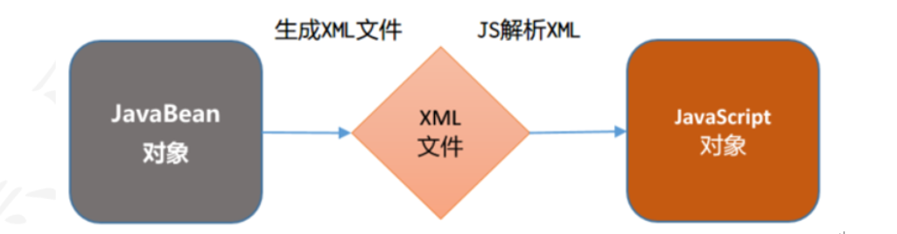
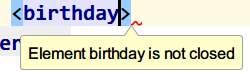
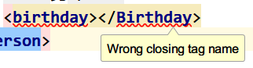
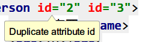
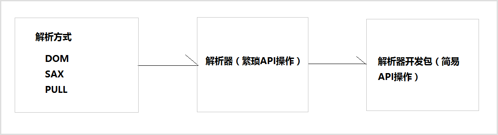
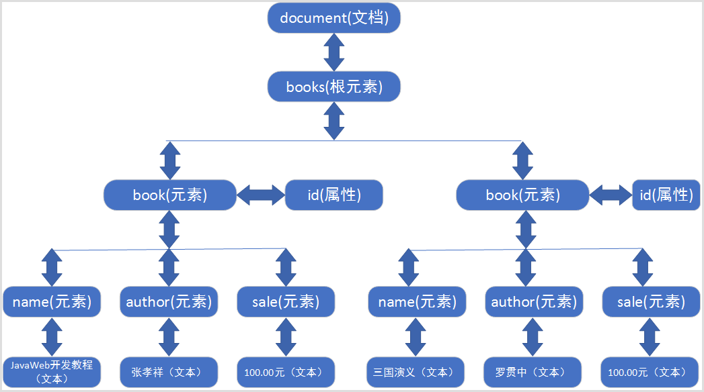
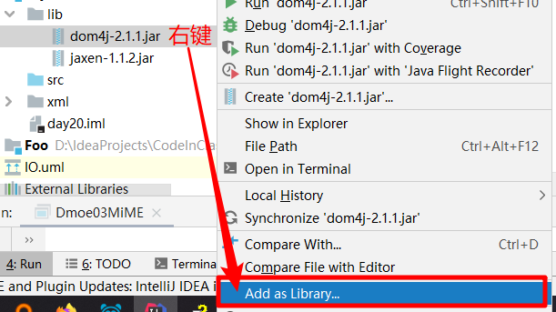
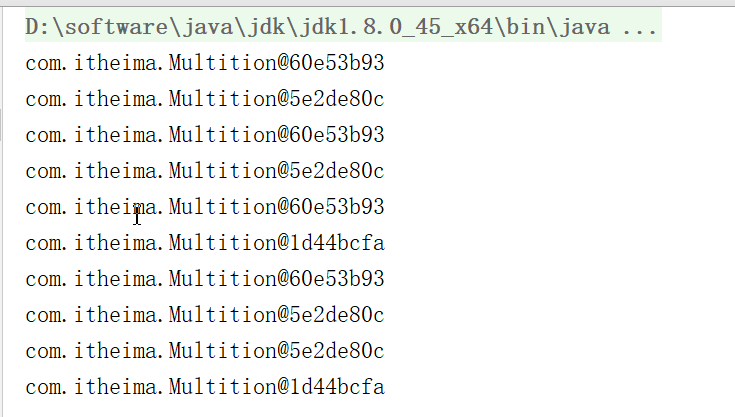

# day15【注解，XML，Dom4j，设计模式】

## 今日目标

- 注解
- XML
- Dom4j
- 单例设计模式
- 多例设计模式
- 工厂设计模式

## 教学目标

- [ ] 能够说出注解的作用 
- [ ] 能够自定义注解和使用注解
- [ ] 能够说出常用的元注解及其作用
- [ ] 能够解析注解并获取注解中的数据
- [ ] 能够说出xml的作用
- [ ] 能够说出xml约束有哪两种
- [ ] 能够使用DOM4J技术解析xml文件
- [ ] 能够使用xpath技术解析xml文件
- [ ] 能够说出单例设计模式的好处
- [ ] 能够说出多例模式的好处
- [ ] 能够使用简单工厂模式编写java程序


# 第一章 注解

## 1 注解的概述

### 1.1 注解的概念

- 注解是JDK1.5的新特性。

- 注解相当一种标记，是类的组成部分，可以给类携带一些额外的信息。

- 标记(注解)可以加在包，类，字段，方法，方法参数以及局部变量上。

- 注解是给编译器或JVM看的，编译器或JVM可以根据注解来完成对应的功能。

  ###### *注解(Annotation)相当于一种标记，在程序中加入注解就等于为程序打上某种标记，以后，javac编译器、开发工具和其他程序可以通过反射来了解你的类及各种元素上有无何种	标记，看你的程序有什么标记，就去干相应的事，标记可以加在包、类，属性、方法，方法的参数以及局部变量上。*

### 1.2 注解的作用

 **注解的作用就是给程序带入参数。**

以下几个常用操作中都使用到了注解：

1. **生成帮助文档**：**@author和@version**

   - **@author**：用来标识作者姓名。

   - **@version**：用于标识对象的版本号，适用范围：文件、类、方法。

     - 使用**@author和@version**注解就是告诉**Javadoc工具**在生成帮助文档时把作者姓名和版本号也标记在文档中。如下图：

       

2. **编译检查**：**@Override**

   - **@Override**：用来修饰方法声明。

     - 用来告诉**编译器**该方法是重写父类中的方法，如果父类不存在该方法，则编译失败。如下图

     

3. **框架的配置(框架=代码+配置)**

   - 具体使用请关注框架课程的内容的学习。

### 1.3 常见注解

1. **@author**：用来标识作者名，eclipse开发工具默认的是系统用户名。
2. **@version**：用于标识对象的版本号，适用范围：文件、类、方法。
3. **@Override** ：用来修饰方法声明，告诉编译器该方法是重写父类中的方法，如果父类不存在该方法，则编译失败。


## 2 自定义注解

### 2.1 定义格式

```java
public @interface 注解名{

}
如：定义一个名为Student的注解
public @interface Student {

} 
```

### 2.2 注解的属性

1. **属性的格式**

   - **格式1：数据类型 属性名();**
   - **格式2：数据类型 属性名() default 默认值;**

2. **属性定义示例**

   ```java
   // 姓名
   String name();
   // 年龄
   int age() default 18;
   // 爱好
   String[] hobby();
   ```

3. **属性适用的数据类型**

   ```java
   * 八种数据数据类型(int，short，long，double，byte，char，boolean，float)
   * String，Class，注解类型，枚举类
   * 以上类型的数组形式
   ```


## 3 使用自定义注解

### 3.1 定义和注解

1. **定义一个注解：Book**
   - 包含属性：String value()   书名
   - 包含属性：double price()  价格，默认值为 100
   - 包含属性：String[] authors() 多位作者    
2. 代码实现

```java
@Target({ElementType.METHOD,ElementType.TYPE})
@Retention(RetentionPolicy.RUNTIME)
public @interface Book {
    String value();
    double price() default 100;
    String[] authros();
}
```

### 3.2 使用注解

1. **定义类在成员方法上使用Book注解**

```java
public class AnnotationDemo01 {
    @Book(value = "JavaEE开发详解",authros = {"黑马程序员","传智学院"})
    public void show(){
        
    }
}
```

2. 使用注意事项
   - 如果属性有默认值，则使用注解的时候，这个属性可以不用赋值。
   - 如果属性没有默认值，那么在使用注解时一定要给属性赋值。 

### 3.3 特殊属性value

```java
/**
    特殊属性value
        * 如果注解中只有一个属性且名字叫value，则在使用该注解时可以直接给该属性赋值，而不需要给出属性名。
        * 如果注解中除了value属性之外还有其他属性且只要有一个属性没有默认值，则在给属性赋值时
            value属性名也不能省略了。
    小结：如果注解中只有一个属性时，一般都会将该属性名命名为value
 */
@interface TestA{
   String[] value();
   int age() default 100;
   String name();
}

@interface TestB{
    String name();
}

@TestB(name = "zzz")
@TestA(name = "yyy",value = {"xxx","xxx"})
public class AnnotationDemo02 {

}
```


## 4 注解之元注解

```java
元注解概述
    * Java官方提供的注解
    * 用来定义注解的注解
    * 任何官方提供的非元注解的定义都使用到了元注解。

常用的元注解
    * @Target
        * 作用：用来标识注解使用的位置，如果没有使用该注解标识，则自定义的注解可以使用在任意位置。
        * 可使用的值定义在ElementType枚举类中，常用值如下
            TYPE，类，接口
            FIELD, 成员变量
            METHOD, 成员方法
            PARAMETER, 方法参数
            CONSTRUCTOR, 构造方法
            LOCAL_VARIABLE, 局部变量

    * @Retention
        * 作用：用来标识注解的生命周期(有效范围)
        * 可使用的值定义在RetentionPolicy枚举类中，常用值如下
            * SOURCE：注解只作用在源码阶段，生成的字节码文件中不存在
            * CLASS：注解作用在源码阶段，字节码文件阶段，运行阶段不存在，默认值
            * RUNTIME：注解作用在源码阶段，字节码文件阶段，运行阶段
```


## 5 注解解析

```java
  什么是注解解析
        * 使用Java技术获得注解上数据的过程则称为注解解析。
    与注解解析相关的接口
        * Annotation: 注解类，该类是所有注解的父类。
        * AnnotatedElement:该接口定义了与注解解析相关的方法
             T getAnnotation(Class<T> annotationClass) 根据注解类型获得对应注解对象
             Annotation[]	getAnnotations()
                * 获得当前对象上使用的所有注解，返回注解数组，包含父类继承的
             Annotation[]	getDeclaredAnnotations()
                * 获得当前对象上使用的所有注解，返回注解数组,只包含本类的
             boolean	isAnnotationPresent(Class<Annotation> annotationClass)
                * 判断当前对象是否使用了指定的注解，如果使用了则返回true，否则false

        获取注解数据的原理
            * 注解作用在哪个成员上就会得该成员对应的对象来获得注解
                * 比如注解作用成员方法，则要获得该成员方法对应的Method对象
                * 比如注解作用在类上，则要该类的Class对象
                * 比如注解作用在成员变量上，则要获得该成员变量对应的Field对象。
            * Field,Method,Constructor，Class等类都是实现了AnnotatedElement接口
```

#### 3.5.1 需求说明

1. 定义注解Book，要求如下：
   - 包含属性：String value()   书名
   - 包含属性：double price()  价格，默认值为 100
   - 包含属性：String[] authors() 多位作者  
   - 限制注解使用的位置：类和成员方法上
   - 指定注解的有效范围：RUNTIME
2. 定义BookStore类，在类和成员方法上使用Book注解
3. 定义TestAnnotation测试类获取Book注解上的数据

#### 3.5.2 代码实现

1. **注解Book**

```java
@Target({ElementType.METHOD,ElementType.TYPE})
@Retention(RetentionPolicy.RUNTIME)
public @interface Book {
    String value();
    double price() default 100;
    String[] authros();
}
```

1. BookShelf类

```java
@Book(value = "红楼梦",authros = {"曹雪芹"})
public class BookShelf  {

    @Book(value = "西游记",authros = {"吴承恩","白求恩"},price = 200)
    public void showBook(){

    }
}
```

1. **TestAnnotation类**

```java
/**
    什么是注解解析
        * 使用Java技术获得注解上数据的过程则称为注解解析。
    与注解解析相关的接口
        * Annotation: 注解类，该类是所有注解的父类。
        * AnnotatedElement:该接口定义了与注解解析相关的方法
             T getAnnotation(Class<T> annotationClass) 根据注解类型获得对应注解对象
             Annotation[]	getAnnotations()
                * 获得当前对象上使用的所有注解，返回注解数组，包含父类继承的
             Annotation[]	getDeclaredAnnotations()
                * 获得当前对象上使用的所有注解，返回注解数组,只包含本类的
             boolean	isAnnotationPresent(Class<Annotation> annotationClass)
                * 判断当前对象是否使用了指定的注解，如果使用了则返回true，否则false

        获取注解数据的原理
            * 注解作用在哪个成员上就会得该成员对应的对象来获得注解
                * 比如注解作用成员方法，则要获得该成员方法对应的Method对象
                * 比如注解作用在类上，则要该类的Class对象
                * 比如注解作用在成员变量上，则要获得该成员变量对应的Field对象。
            * Field,Method,Constructor，Class等类都是实现了AnnotatedElement接口
 */
public class AnnotationDemo04 {
    /*
        获得类上使用的注解数据
     */
    @Test
    public void test02() throws Exception {
        // 获得Class对象
        Class c = BookShelf.class;
        // 判断类上是否使用Book注解
        if(c.isAnnotationPresent(Book.class)){
            // 根据注解的Class对象获得对应的注解对象
            Book annotation = (Book) c.getAnnotation(Book.class);
            // 获得书名
            System.out.println(annotation.value());
            // 获得作者
            System.out.println(Arrays.toString(annotation.authros()));
            // 获得价格
            System.out.println(annotation.price());
        }
        // 获得当前对象上使用的所有注解，返回注解数组
        // Annotation[] annotations = c.getAnnotations();
        Annotation[] annotations = c.getDeclaredAnnotations();
        System.out.println(Arrays.toString(annotations));
    }

    /*
       获得成员方法上注解的数据
    */
    @Test
    public void test01() throws Exception {
        // 获得Class对象
        Class c = BookShelf.class;
        // 获得成员方法对应的Method对象
        Method m = c.getMethod("showBook");
        // 根据注解的Class对象获得对应的注解对象
        Book annotation = m.getAnnotation(Book.class);
        // 获得书名
        System.out.println(annotation.value());
        // 获得作者
        System.out.println(Arrays.toString(annotation.authros()));
        // 获得价格
        System.out.println(annotation.price());
    }
}
```


## 6 注解案例

### 6.1 案例说明

- 模拟Junit测试的@Test

### 6.2 案例分析

1. 模拟Junit测试的注释@Test，首先需要编写自定义注解@MyTest，并添加元注解，保证自定义注解只能修饰方法，且在运行时可以获得。
2. 然后编写目标类（测试类），然后给目标方法（测试方法）使用 @MyTest注解，编写三个方法，其中两个加上@MyTest注解。
3. 最后编写调用类，使用main方法调用目标类，模拟Junit的运行，只要有@MyTest注释的方法都会运行。

### 6.3 案例代码

```java
import java.lang.annotation.ElementType;
import java.lang.annotation.Retention;
import java.lang.annotation.RetentionPolicy;
import java.lang.annotation.Target;

@Retention(RetentionPolicy.RUNTIME)
@Target(ElementType.METHOD)
public @interface MyTest {

}

public class TestMyTest {

    @MyTest
    public void tests01(){
        System.out.println("test01");
    }


    public void tests02(){
        System.out.println("test02");
    }

    @MyTest
    public void tests03(){
        System.out.println("test03");
    }
}

/**
 * @author pkxing
 * @version 1.0
 * @Package com.itheima
 */
public class AnnotationDemo05 {
    public static void main(String[] args) throws Exception {
        // 获得Class对象
        Class c = TestMyTest.class;
        Object obj = c.newInstance();
        // 获得所有成员方法
        Method[] methods = c.getMethods();
        for(Method m:methods){
            // 判断m方法是否使用了MyTest注解
            if(m.isAnnotationPresent(MyTest.class)){
                // 调用方法
                m.invoke(obj);
            }
        }
    }
}
```


# 第二章 XML

## 1 XML概述

### 目标

1. 什么是XML
2. 编写第1个XML文件

### 什么是XML

1. 英文：eXtensible Markup Language 可扩展的标记语言，由各种标记(标签，元素)组成。
2. 可扩展：所有的标签都是自定义的，可以随意扩展的。如：\<abc/>，<姓名>
3. 标记语言：整个文档由各种标签组成。清晰，数据结构化！
4. XML是通用格式标准，全球所有的技术人员都知道这个东西，都会按照XML的规范存储数据，交互数据！！

### XML作用

1) 数据交换：不同的计算机语言之间，不同的操作系统之间，不同的数据库之间，进行数据交换。                                                  

2)  配置文件：在后期我们主要用于各种框架的配置文件基本天天见。

比如我们很快会学到连接池：c3p0-config.xml

 


### 小结

1. 主要有哪两个作用？
   1. 数据交换
   2. 配置文件


## 2 编写第1个XML文件

### 需求

编写xml文档，用于描述人员信息，person代表一个人员，id是人员的属性代表人员编号。人员信息包括age年龄、name姓名、sex性别信息。

使用Java类去描述：

```java
class Person{
	String id;
  int age;
  String name;
  String sex;
}

Person p = new Person("1","张三",18,"男");
```


### 效果

 

### 步骤

1. 选择当前项目鼠标右键新建

 

2. 编写person.xml文件

   ```xml
   <?xml version="1.0" encoding="UTF-8" ?>
   <person id="100">
       <age>18</age>
       <name>张三</name>
       <sex>男</sex>
   </person>
   ```

3. 通过浏览器解析XML的内容

    

- **注：XML以后通过Java来进行解析，很少直接在浏览器上显示。**


## 3 XML的组成：声明和元素

### 目标

2. XML文档中的声明
3. XML文档中的元素

### XML组成

1. 声明
2. 元素(标签)
3. 属性
4. 注释
5. 转义字符
6. CDATA 字符区

### 文档声明

```xml
<?xml version="1.0" encoding="utf-8" ?>
```

1. 使用IDE创建xml文件时就带有文档声明.

2. 文档声明必须为<?xml开头，以？>结束 

3. 文档声明必须从文档的1行1列位置开始,==**必须在xml文档中的首行首列**==

    

4. 文档声明中常见的两个属性：

   - version：指定XML文档版本。必须属性，这里一般选择1.0；
   - encoding：指定当前文档的编码，可选属性，默认值是utf-8；

   

### 元素


```xml
格式1:<person> </person>   有标签体的标签
格式2:<person/>  没有标签体的标签
```

1. 元素是XML文档中最重要的组成部分；

2. 普通元素的结构由开始标签、元素体、结束标签组成。

3. 元素体：元素体可以是元素，也可以是文本，例如：

   ```xml
   <person> 
     <name>张三</name> 
   </person>
   ```

   

4. 空元素：空元素只有标签，而没有结束标签，但元素必须自己闭合，例如：

   ```xml
   <sex/>
   ```

5. 元素命名

   - 区分大小写
   - 不能使用空格，不能使用冒号
   - 不建议以XML、xml、Xml开头
   - 标签名不能数字开头

6. ==格式化良好的XML文档，有且仅有一个根元素。==


错误演示：

元素没有结束

 

元素大写小写不一致

 

xml中多个根 

 


### 小结

1. 声明有哪两个常用的属性？

   version="1.0"

   encoding="utf-8"

   位置要求：首行首列位置

2. 一个XML有几个根元素？ 

   一个

3. XML标签命名不能有什么符号？  

   不能有冒号，不能有空格，可以有数字但是不能以数字开头，可以使用下划线，中划线也行但不能开头。


## 4 XML的组成：属性、注释和转义字符

1. XML文档中属性
2. XML文档中的注释
3. XML文档中实体字符

### 属性的语法

```xml
<person id="110">
```

1. 属性是元素的一部分，它必须出现在元素的开始标签中
2. 属性的定义格式：属性名=“属性值”，其中属性值必须使用单引或双引号括起来
3. 一个元素可以有0~N个属性，但一个元素中不能出现同名属性 
4. 属性名不能使用空格 , 建议不要使用冒号等特殊字符，且必须以字母开头


### 注释

```xml
<!--注释内容-->
```

XML的注释与HTML相同，既以``<!--``开始，``-->``结束。不能嵌套。

Java中注释：

```
// 单行
/* */ 多行注释
/** */ 文档注释
```

XML注释：

```xml
<!-- 注释内容 -->
```

```xml
<!--<person>注释</person>-->  <!-- 快捷键：Ctrl+/ :可以将整行进行注释-->
<person>三生三世</person> <!-- 快捷键：Ctrl+Shift+/:局部注释-->
```


### 转义字符

​	XML中的实体字符与HTML一样。因为很多符号已经被文档结构所使用，所以在元素体或属性值中想使用这些符号就必须使用实体字符


| 字符 | 预定义的转义字符 |        说明        |
| :--: | :--------------: | :----------------: |
|  <   |     ``&lt;``     | 小于（less than）  |
|  >   |    `` &gt;``     | 大于(greater than) |
|  "   |   `` &quot;``    | 双引号(quotation)  |
|  '   |   `` &apos;``    | 单引号(apostrophe) |
|  &   |    `` &amp;``    |  和号(ampersand )  |

*注意：严格地讲，在 XML 中仅有字符 "<"和"&" 是非法的。省略号、引号和大于号是合法的，但是把它们替换为实体引用是个好的习惯。*

转义字符应用示例：

​	假如您在 XML 文档中放置了一个类似 "<" 字符，那么这个文档会产生一个错误，这是因为解析器会把它解释为新元素的开始。因此你不能这样写：

```xml
<message>if salary < 1000 then </message>
```

为了避免此类错误，需要把字符 "<" 替换为实体引用，就像这样：

```xml
<message>if salary &lt; 1000 then</message>
```


### 小结

1. 属性必须出现在标签哪个位置?

   开始标签

2. 同一个标签是否可以有同名的属性？

   不能

3. 为什么要有转义字符、实体字符？

   1. 因为> 或者 < 与XML文件本身冲突，必须用转义字符代替！！

4. 注释的快捷？

   ```java
   <!-- 注释内容 -->
   ```

   Ctrl+/ : 整行注释

   Ctrl+Shift+/:局部注释


## 5 XML的组成：字符区(了解)

当大量的转义字符出现在xml文档中时，会使XML文档的可读性大幅度降低。这时如果使用CDATA段就会好一些。

CDATA (Character Data)字符数据区，格式如下：

```xml
<![CDATA[
	文本数据
]]>
```

1.  CDATA 指的是不应由 XML 解析器进行解析的文本数据（Unparsed Character Data）
2.  CDATA 部分由 `<![CDATA[`开始，由 `]]>` 结束；

例如：

~~~java
<![CDATA[
    if salary < 1000 then
]]
~~~

快捷模板：CD 回车

 


*注意：*

​	CDATA 部分不能包含字符串 "]]>"。也不允许嵌套的 CDATA 部分。

​	标记 CDATA 部分结尾的 "]]>" 不能包含空格或折行。


## 6 XML约束：DTD约束

### 目标

1. XML有哪两种约束
2. 了解DTD约束

### 1. XML约束

在XML技术里，可以编写一个文档来约束一个XML文档的书写规范，这称之为XML约束。

常见的xml约束：DTD、Schema

> 注意:我们对于约束的要求是能通过已写好的约束文件编写xml文档.


### 2. 约束体验

体验效果说明：当编写xml文档时不符合指定dtd约束时，进行提示xml编写错误，如下图：


体验步骤:

步骤1：复制bookshelf.dtd文件

步骤2：bookshelf.dtd文件内容如下

```dtd
<!ELEMENT 书架 (书+)>
<!ELEMENT 书 (书名,作者,售价)><!--约束元素书的子元素必须为书名、作者、售价-->
<!ELEMENT 书名 (#PCDATA)>
<!ELEMENT 作者 (#PCDATA)>
<!ELEMENT 售价 (#PCDATA)>
```

步骤三：新建books.xml，代码如下

```
引用 <!DOCTYPE 根元素 SYSTEM "dtd约束文件的路径"> 
```

```xml
<?xml version="1.0" encoding="UTF-8"?>
<!DOCTYPE 书架 SYSTEM "bookshelf.dtd"><!--指定使用bookshelf.dtd文件约束当前xml文档-->
<书架>
    <书>
        <书名>JavaWeb开发教程</书名>
        <作者>张孝祥</作者>
        <售价>100.00元</售价>
    </书>
    <书>
        <书名>三国演义</书名>
        <作者>罗贯中</作者>
        <售价>100.00元</售价>
        <测试>hello</测试><!--不符合约束，书的子元素必须为书名、作者、售价-->
    </书>
</书架>
```

步骤四：idea开发工具books.xml的dtd约束验证不通过的效果如下


  

### 3. DTD学习要求

​	在企业实际开发中，我们很少自己编写DTD约束文档，通常情况下通过框架提供的DTD约束文档编写对应的XML文档。所以这一知识点的要求是可以根据DTD约束文档内容编写XML文档。


## 7 XML约束：Schema约束

### 目标

了解Schema约束

### 1 概念

Schema 语言也可作为 XSD（XML Schema Definition）。

Schema 比DTD强大，是DTD代替者。

Schema 本身也是XML文档，单Schema文档扩展名为xsd，而不是xml。

Schema 功能更强大，数据类型约束更完善。

### 2 约束体验

体验效果说明：体验schema约束XML文档中对元素体数据类型的约束。效果如下：


DTD约束无法对具体数据类型进行约束,所以开发工具没有任何错误提示，如下效果：


**实现步骤**

步骤1：复制schema约束文件bookshelf.xsd，其中已对售价约束了数据类型，代码如下

```scheme
<?xml version="1.0" encoding="UTF-8" ?>
<!--
	传智播客DTD教学实例文档.将注释中的以下内容复制到要编写的xml的声明下面
	复制内容如下:
	<书架 xmlns="http://www.itcast.cn"
		  xmlns:xsi="http://www.w3.org/2001/XMLSchema-instance"
		  xsi:schemaLocation="http://www.itcast.cn bookshelf.xsd"
    >
 -->
<xs:schema xmlns:xs="http://www.w3.org/2001/XMLSchema"
           targetNamespace="http://www.itcast.cn"
           elementFormDefault="qualified">
        <xs:element name='书架' >
                <xs:complexType>
                        <xs:sequence maxOccurs='unbounded' >
                                <xs:element name='书' >
                                        <xs:complexType>
                                                <xs:sequence>
                                                     <xs:element name='书名' type='xs:string' />
                                                     <xs:element name='作者' type='xs:string' />
                                                     <xs:element name='售价' type='xs:double' />
                                                </xs:sequence>
                                        </xs:complexType>
                                </xs:element>
                        </xs:sequence>
                </xs:complexType>
        </xs:element>
</xs:schema>

```

步骤2：新建books2.xml使用schema约束文件bookshelf.xsd，代码如下

```xml
<?xml version="1.0" encoding="UTF-8"?>
<书架
xmlns="http://www.itcast.cn"
xmlns:xsi="http://www.w3.org/2001/XMLSchema-instance"
xsi:schemaLocation="http://www.itcast.cn bookshelf.xsd"
><!--指定schema文档约束当前XML文档-->
    <书>
        <书名>JavaScript网页开发</书名>
        <作者>张孝祥</作者>
        <售价>abc</售价>
    </书>
</书架>
```

步骤3：开发工具提示效果


### 3 名称空间

​	一个XML文档最多可以使用一个DTD文件,但一个XML文档中使用多个Schema文件，若这些Schema文件中定义了相同名称的元素时,使用的时候就会出现名字冲突。这就像一个Java文件中使用了`import java.util.*`和`import java.sql.*`时，在使用Date类时，那么就不明确Date是哪个包下的Date了。同理 , 在XML文档中就需要通过名称空间(namespace)来区分元素和属性是来源于哪个约束中的。名称空间就在在根元素后面的内容 , 使用xmlns到引入约束 。

​	当一个XML文档中需要使用多个Schema文件的时候 , 有且仅有一个使用缺省的 , 其他的名称空间都需要起别名 。参考资料中的 applicationContext.xml文件(spring框架的配置文件)

```schema
 xmlns="http://www.itcast.cn"    
 	<!-- 缺省的名称空间.使用此约束中的元素的时候只需要写元素名即可 例如:<书></书> -->
 
 xmlns:aa="http://java.sun.com"
 	<!-- aa就是此约束的别名,使用此约束中的元素的时候就需要加上别名 例如:<aa:书></aa:书> -->
```

​	总之名称空间就是用来处理元素和属性的名称冲突问题，与Java中的包是同一用途。如果每个元素和属性都有自己的名称空间，那么就不会出现名字冲突问题，就像是每个类都有自己所在的包一样，那么类名就不会出现冲突。


### 4 schema学习要求

​	虽然schema功能比dtd强大，但是编写要比DTD复杂，同样以后我们在企业开发中也很少会自己编写schema文件。

​	xml编写与约束内容已经完成了，根据xml的作用我们了解到，无论是xml作为配置文件还是数据传输，我们的程序都要获取xml文档中的数据以便我们进行具体的业务操作，接下来我们就要学习XML解析技术Dom4j。


# 第三章 Dom4j


## 1 XML解析

### 1.1 解析概述

​	当将数据存储在XML后，我们就希望通过程序获取XML的内容。我们使用Java基础所学的IO知识是可以完成的，不过需要非常繁琐的操作才可以完成，且开发中会遇到不同问题（只读、读写）。人们为不同问题提供不同的解析方式，使用不同的解析器进行解析，方便开发人员操作XML。


### 1.2 解析方式和解析器

开发中比较常见的解析方式有三种，如下：

1. **DOM**：要求解析器把整个XML文档装载到内存，并解析成一个Document对象

   a）优点：元素与元素之间保留结构关系，故可以进行增删改查操作。

   b）缺点：XML文档过大，可能出现内存溢出

   

2. **SAX**：是一种速度更快，更有效的方法。它逐行扫描文档，一边扫描一边解析。并以事件驱动的方式进行具体解析，每执行一行，都触发对应的事件。

   a）优点：处理速度快，可以处理大文件

   b）缺点：只能读，逐行后将释放资源，解析操作繁琐。

   

3. **PULL**：Android内置的XML解析方式，类似SAX。（了解）


解析器，就是根据不同的解析方式提供具体实现。有的解析器操作过于繁琐，为了方便开发人员，有提供易于操作的解析开发包



**常见的解析器**

 


## 2 Dom4j的基本使用

### 2.1 DOM解析原理及结构模型

**解析原理**

将整个XML文档加载到内存，生成一个DOM树，并获得一个Document对象，通过Document对象就可以对DOM树进行操作。以下面books.xml文档为例。

```xml
<?xml version="1.0" encoding="UTF-8"?>
<books>
    <book id="0001">
        <name>JavaWeb开发教程</name>
        <author>张孝祥</author>
        <sale>100.00元</sale>
    </book>
    <book id="0002">
        <name>三国演义</name>
        <author>罗贯中</author>
        <sale>100.00元</sale>
    </book>
</books>
```

**结构模型**

DOM中的核心概念就是节点，在XML文档中的元素、属性、文本，在DOM中都是节点！所有的节点都封装到了Document对象中。




**引入dom4j的jar包**

去官网下载 zip 包。<http://www.dom4j.org/>
  


**通常我们会在项目中创建lib文件夹，将需要依赖的库放在这里。**

库导入方式：

1. 在IDEA中，选择项目鼠标右键--->弹出菜单-->open Module settings”-->Dependencies-->+-->JARs or directories...   找到dom4j-1.6.1.jar,成功添加之后点击"OK" 即可。

2. 直接右键选择：Add as Library

    


### 2.2 常用的方法

dom4j 必须使用核心类SaxReader加载xml文档获得Document，通过Document对象获得文档的根元素，然后就可以操作了。

#### SAXReader对象

| 方法                      | 作用            |
| ------------------------- | --------------- |
| new SAXReader()           | 构造器          |
| Document read(String url) | 加载执行xml文档 |


#### Document对象

| 方法                     | 作用       |
| ------------------------ | ---------- |
| Element getRootElement() | 获得根元素 |

#### Element对象

| 方法                                   | 作用                                     |
| -------------------------------------- | ---------------------------------------- |
| List elements(String ele )             | 获得指定名称的所有子元素。可以不指定名称 |
| Element element([String ele])          | 获得指定名称第一个子元素。可以不指定名称 |
| String getName()                       | 获得当前元素的元素名                     |
| String attributeValue(String attrName) | 获得指定属性名的属性值                   |
| String elementText(Sting ele)          | 获得指定名称子元素的文本值               |
| String getText()                       | 获得当前元素的文本内容                   |


### 2.3 方法演示

复制资料下的常用xml中"books.xml",内容如下:

```xml
<?xml version="1.0" encoding="UTF-8"?>
<books>
    <book id="0001">
        <name>JavaWeb开发教程</name>
        <author>张孝祥</author>
        <sale>100.00元</sale>
    </book>
    <book id="0002">
        <name>三国演义</name>
        <author>罗贯中</author>
        <sale>100.00元</sale>
    </book>
</books>
```

> 注意:为了便于解析,此xml中没有添加约束

解析此文件,获取每本书的id值,以及书本名称,作者名称和价格.

步骤分析：

1. 创建一个SaxReader对象，调用read方法加载一个xml文件获得文档对象
2. 通过文档对象，获取根元素
3. 通过根元素一层一层的进行解析子元素。

```java
public class Demo01 {
    public static void main(String[] args) throws DocumentException {
        //11. 创建一个SaxReader对象，调用read方法加载一个xml文件获得文档对象
        SAXReader sr = new SAXReader();
        Document doc = sr.read("day20/books.xml");
        //2. 通过文档对象，获取根元素
        Element root = doc.getRootElement();
        //获取根元素的名字
        String rootName = root.getName();
        System.out.println("rootName = " + rootName);
        //3. 通过根元素一层一层的进行解析子元素。
        //指定获取book子元素
        List<Element> books = root.elements("book");
        for (Element book : books) {
            //System.out.println(book.getName());
            //获取book的属性值
            String id = book.attributeValue("id");
            System.out.println("id = " + id);

            //直接获取子元素内容
            String name = book.elementText("name");
            System.out.println("name = " + name);
            String author = book.elementText("author");
            System.out.println("author = " + author);
            String sale = book.elementText("sale");
            System.out.println("sale = " + sale);


     /*
       //获取子元素然后再获取内容
       List<Element> subElements = book.elements();//获取所有该book的子元素
            for (Element subElement : subElements) {
                System.out.println(subElement.getName()+"::"+subElement.getText());//原始数据包含空格
                System.out.println(subElement.getName()+"::"+subElement.getTextTrim());//去前后空格获取文本
            }*/

        }


    }
}

```


需求二：

将xml中文件数据解析成为java对象，每个book解析为一个book类型的对象。然后将book对象放到一个集合中存储。

```xml
<?xml version="1.0" encoding="UTF-8"?>
<books>
    <book id="0001">
        <name>JavaWeb开发教程</name>
        <author>张孝祥</author>
        <sale>100.00元</sale>
    </book>
    <book id="0002">
        <name>三国演义</name>
        <author>罗贯中</author>
        <sale>100.00元</sale>
    </book>
</books>
```

步骤分析：

1. 先创建一个Book类对应book元素
2. 创建一个ArrayList集合用来存储解析后的book对象
3. 创建SaxReader对象，调用read方法加载xml文件，得到文档对象
4. 通过文档对象获取根元素，然后层层解析

代码实现：

```java
public class Demo02 {
    public static void main(String[] args) throws DocumentException {
        //1. 先创建一个Book类对应book元素
        //2. 创建一个ArrayList集合用来存储解析后的book对象
        ArrayList<Book> list = new ArrayList<>();
        //3. 创建SaxReader对象，调用read方法加载xml文件，得到文档对象
        SAXReader sr = new SAXReader();
        Document doc = sr.read("day13/books.xml");
        //4. 通过文档对象获取根元素，然后层层解析
        Element root = doc.getRootElement();

        //开始解析book子元素的内容
        List<Element> books = root.elements("book");
        for (Element book : books) {
            Book obj = parse(book);//设计一个方法，将一个元素变为对象
            list.add(obj);
        }

        //遍历集合
        for (Book book : list) {
            System.out.println("book = " + book);
        }
    }

    private static Book parse(Element book) {
        Book obj = new Book();
        obj.setId(book.attributeValue("id"));//获取book元素的id，设置到对象中
        obj.setName(book.elementTextTrim("name"));//获取book子元素name的文本数据
        obj.setAuthor(book.elementTextTrim("author"));//获取book子元素author的文本数据
        obj.setPrice(book.elementTextTrim("sale"));//获取book子元素sale的文本数据
        return obj;
    }
}

class Book {
    private String id;
    private String name;
    private String author;
    private String price;

    public Book() {
    }

    public Book(String id, String name, String author, String price) {
        this.id = id;
        this.name = name;
        this.author = author;
        this.price = price;
    }

    public String getId() {
        return id;
    }

    public void setId(String id) {
        this.id = id;
    }

    public String getName() {
        return name;
    }

    public void setName(String name) {
        this.name = name;
    }

    public String getAuthor() {
        return author;
    }

    public void setAuthor(String author) {
        this.author = author;
    }

    public String getPrice() {
        return price;
    }

    public void setPrice(String price) {
        this.price = price;
    }

    @Override
    public boolean equals(Object o) {
        if (this == o) return true;
        if (o == null || getClass() != o.getClass()) return false;
        Book book = (Book) o;
        return Objects.equals(id, book.id) &&
                Objects.equals(name, book.name) &&
                Objects.equals(author, book.author) &&
                Objects.equals(price, book.price);
    }

    @Override
    public int hashCode() {
        return Objects.hash(id, name, author, price);
    }

    @Override
    public String toString() {
        return "Book{" +
                "id='" + id + '\'' +
                ", name='" + name + '\'' +
                ", author='" + author + '\'' +
                ", price='" + price + '\'' +
                '}';
    }
}
```


## 3 Dom4J结合XPath解析XML

### 3.1 介绍

XPath 使用路径表达式来选取XML/HTML 文档中的元素节点或属性节点。节点是通过沿着路径 (path) 来选取的。XPath在解析XML/HTML文档方面提供了一独树一帜的路径思想。

### 3.2 XPath使用步骤

步骤1：导入jar包(dom4j和jaxen-1.1-beta-6.jar)

步骤2：通过dom4j的SaxReader获取Document对象

步骤3： 利用Xpath提供的api,结合xpaht的语法完成选取XML文档元素节点进行解析操作。


Node接口中存在以下方法：

| 方法                                  | 作用                     |
| ------------------------------------- | ------------------------ |
| `List<Element> selectNodes("表达式")` | 获取符合表达式的元素集合 |
| `Element selectSingleNode("表达式")`  | 获取符合表达式的唯一元素 |

我们熟知的Document，Element等都是Node的子类型，因此也能使用上述selectNode的方法。如下图

 


### 3.3 XPath语法(了解)

- XPath表达式，就是用于选取XML，HTML文档中节点的表达式字符串。

  获取XML文档节点元素一共有如下4种XPath语法方式：

  1. **绝对路径表达式方式**	     例如: /元素/子元素/子子元素...
  2. **相对路径表达式方式**          例如: 子元素/子子元素..    或者   ./子元素/子子元素..
  3. **全文搜索路径表达式方式**  例如: //子元素//子子元素
  4. **谓语（条件筛选）方式**      例如: //元素[@attr]

  


- 获取不同节点语法

  | 获取类型     | 语法代码  |
  | ------------ | --------- |
  | 获取元素节点 | 元素名称  |
  | 获取属性节点 | @属性名称 |


#### 3.3.1 绝对路径表达式(了解)

**格式：**

```java
String xpath="/元素/子元素/子子元素...";
```

绝对路径是以“/”开头，一级一级描述标签的层级路径就是绝对路径，***这里注意不可以跨层级***


- 演示需求(将素材中的Contact.xml拷贝到项目中)

  ```
  采用绝对路径获取从根节点开始逐层的查找name节点列表并打印信息
  String path="/contactList/contact/";
  ```


#### 3.3.2 相对路径表达式(了解)

- 相对路径介绍

  格式：	

  ```java
  String xpath2="./子元素/子子元素";		// "./"代表当前元素路径位置
  ```

- 需求：
  先采用绝对路径获取 contactList 节点再采用相对路径获取下一级contact 节点的name子节点并打印信息。

```
  Element root = doc.getRootElement();
        List<Node> nodes2 = root.selectNodes("./contact/name");
        for (Node node : nodes2) {
            System.out.println(node.getName() + "::" + node.getText());
        }
```


#### 3.3.3 全文搜索路径表达式(了解)

- 全文搜索路径介绍

  格式：	

  ```java
  String xpath1="//子元素//子子元素";
  ```

  “/”符号，代表逐级写路径

  “//”符号，不用逐级写路径，可以直接选取到对应的节点，是全文搜索匹配的不需要按照逐层级

  | **举例**            | **说明**                                                   |
  | ------------------- | ---------------------------------------------------------- |
  | **//contact**       | 找contact元素，无论元素在哪里                              |
  | **//contact/name**  | 找contact，无论在哪一级，但name一定是contact的子节点       |
  | **//contact//name** | contact无论在哪一种，name只要是contact的子孙元素都可以找到 |

- 需求：直接全文搜索所有的 name元素并打印

```java
List<Node> nodes3 = doc.selectNodes("//name");
for (Node node : nodes3) {
   System.out.println(node.getName() + "::" + node.getText());
}
```


#### 3.3.4 谓语（条件筛选 了解）

- 介绍

  谓语，又称为条件筛选方式，就是根据条件过滤判断进行选取节点

  格式：	

  ```java
  String xpath1="//元素[@属性名]";//查找元素对象，全文中只要含有该属性名的元素
  String xpath2="//元素[@attr1>value]/@attr1";//获取元素属性attr1>value的d的所有attr1的值
  String xpath3="//元素[@attr1=value]/text()";//获取符合条件元素体的自有文本数据
  String xpath4="//元素[@attr1=value]/html()";//获取符合条件元素体的自有html代码数据。
  String xpath3="//元素[@attr1=value]/allText()";//获取符合条件元素体的所有文本数据（包含子元素里面的文本）
  ```

- 需求：

  查找含有id属性的contact元素

  ```java
          //2. 查找含有id属性的contact元素
          List<Node> nodes = doc.selectNodes("//contact[@id]");
          for (Node node : nodes) {
              System.out.println(node.getName() + "::" + ((Element)node).elementText("name"));
  
          }
          System.out.println("===============================");
        
  ```

  

  


# 第四章 设计模式

## 1 单例设计模式

正常情况下一个类可以创建多个对象

```java
public static void main(String[] args) {
	// 正常情况下一个类可以创建多个对象
	Person p1 = new Person();
	Person p2 = new Person();
	Person p3 = new Person();
}
```

### 1.1 单例设计模式的作用

单例模式，是一种常用的软件设计模式。通过单例模式可以保证系统中，应用该模式的这个类只有一个实例。即一个类只有一个对象实例。


### 1.2 单例设计模式实现步骤

1. 将构造方法私有化，使其不能在类的外部通过new关键字实例化该类对象。
2. 在该类内部产生一个唯一的实例化对象，并且将其封装为private static类型的成员变量。
3. 定义一个静态方法返回这个唯一对象。


### 1.3 单例设计模式的类型

根据实例化对象的时机单例设计模式又分为以下两种:

1. 饿汉单例设计模式
2. 懒汉单例设计模式


### 1.4 饿汉单例设计模式

饿汉单例设计模式就是使用类的时候已经将对象创建完毕，不管以后会不会使用到该实例化对象，先创建了再说。很着急的样子，故被称为“饿汉模式”。

代码如下：

```java
public class Singleton {
    // 1.将构造方法私有化，使其不能在类的外部通过new关键字实例化该类对象。
    private Singleton() {}

    // 2.在该类内部产生一个唯一的实例化对象，并且将其封装为private static类型的成员变量。
    private static final Singleton instance = new Singleton();
    
    // 3.定义一个静态方法返回这个唯一对象。
    public static Singleton getInstance() {
        return instance;
    }
}
```


### 1.5 懒汉单例设计模式

懒汉单例设计模式就是调用getInstance()方法时实例才被创建，先不急着实例化出对象，等要用的时候才实例化出对象。不着急，故称为“懒汉模式”。

代码如下：

```java
public class Singleton {

    // 2.在该类内部产生一个唯一的实例化对象，并且将其封装为private static类型的成员变量。
    private static Singleton instance;
    
    // 1.将构造方法私有化，使其不能在类的外部通过new关键字实例化该类对象。
    private Singleton() {}
    
    // 3.定义一个静态方法返回这个唯一对象。要用的时候才例化出对象
    public static synchronized Singleton getInstance() {
        if(instance == null) {
            instance = new Singleton();
        }
        return instance;
    }
}
```

> 注意：懒汉单例设计模式在多线程环境下可能会实例化出多个对象，不能保证单例的状态，所以加上关键字：synchronized，保证其同步安全。


### 1.6 小结

单例模式可以保证系统中一个类只有一个对象实例。

实现单例模式的步骤：

1. 将构造方法私有化，使其不能在类的外部通过new关键字实例化该类对象。
2. 在该类内部产生一个唯一的实例化对象，并且将其封装为private static类型的成员变量。
3. 定义一个静态方法返回这个唯一对象。


## 2 多例设计模式

一般情况下一个类可以创建多个对象

```java
public static void main(String[] args) {
	// 正常情况下一个类可以创建多个对象
	Person p1 = new User();
	Person p2 = new User();
	Person p3 = new User();
}
```

### 2.1 多例设计模式的作用

多例模式，是一种常用的软件设计模式。通过多例模式可以保证系统中，应用该模式的类有固定数量的实例。多例类要自我创建并管理自己的实例，还要向外界提供获取本类实例的方法。


### 2.2 实现步骤

​	1.创建一个类,  将构造方法私有化，使其不能在类的外部通过new关键字实例化该类对象。

​	2.在类中定义该类被创建的总数量

​	3.在类中定义存放类实例的list集合

​	4.在类中提供静态代码块,在静态代码块中创建类的实例

​	5.提供获取类实例的静态方法


### 2.3.实现代码

```java
import java.util.ArrayList;
import java.util.List;
import java.util.Random;
public class Multition {
    // 定义该类被创建的总数量
    private static final int maxCount = 3;
    // 定义存放类实例的list集合
    private static List instanceList = new ArrayList();
    // 构造方法私有化,不允许外界创建本类对象
    private Multition() {
    }
    static {
        // 创建本类的多个实例,并存放到list集合中
        for (int i = 0; i < maxCount; i++) {
            Multition multition = new Multition();
            instanceList.add(multition);
        }
    }
    // 给外界提供一个获取类对象的方法
    public static Multition getMultition(){
        Random random = new Random();
        // 生成一个随机数
        int i = random.nextInt(maxCount);
        // 从list集合中随机取出一个进行使用
        return (Multition)instanceList.get(i);
    }
}
```


### 2.4.测试结果

```java
public static void main(String[] args) {
    // 编写一个循环从中获取类对象
    for (int i = 0; i < 10; i++) {
        Multition multition = Multition.getMultition();
        System.out.println(multition);
    }
}
```

 


### 2.3小结

多例模式可以保证系统中一个类有固定个数的实例, 在实现需求的基础上, 能够提高实例的复用性.

实现多例模式的步骤：

1. 创建一个类,  将构造方法私有化，使其不能在类的外部通过new关键字实例化该类对象。
2. 在类中定义该类被创建的总数量
3. 在类中定义存放类实例的list集合
4. 在类中提供静态代码块,在静态代码块中创建类的实例
5. 提供获取类实例的静态方法


## 3 工厂设计模式

### 3.1概述

​	工厂模式（Factory Pattern）是 Java 中最常用的设计模式之一。这种类型的设计模式属于创建型模式，它提供了一种创建对象的最佳方式。之前我们创建类对象时, 都是使用new 对象的形式创建, 除new 对象方式以外, 工厂模式也可以创建对象.


### 3.2作用

​	解决类与类之间的耦合问题


### 3.3实现步骤

1. 编写一个Car接口, 提供run方法
2. 编写一个Falali类实现Car接口,重写run方法
3. 编写一个Benchi类实现Car接口
4. 提供一个CarFactory(汽车工厂),用于生产汽车对象
5. 定义CarFactoryTest测试汽车工厂


### 3.4实现代码

1.编写一个Car接口, 提供run方法

```java
public interface Car {
    public void run();
}
```

2.编写一个Falali类实现Car接口,重写run方法

```java
public class Falali implements Car {
    @Override
    public void run() {
        System.out.println("法拉利以每小时500公里的速度在奔跑.....");
    }
}
```

3.编写一个Benchi类实现Car接口

```java
public class Benchi implements Car {
    @Override
    public void run() {
        System.out.println("奔驰汽车以每秒1米的速度在挪动.....");
    }
}
```

4.提供一个CarFactory(汽车工厂),用于生产汽车对象

```java
public class CarFactory {
    /**
     * @param id : 车的标识
     *           benchi : 代表需要创建Benchi类对象
     *           falali : 代表需要创建Falali类对象
     *           如果传入的车标识不正确,代表当前工厂生成不了当前车对象,则返回null
     * @return
     */
    public Car createCar(String id){
        if("falali".equals(id)){
            return new Falali();
        }else if("benchi".equals(id)){
            return new Benchi();
        }
        return null;
    }
}
```

5.定义CarFactoryTest测试汽车工厂

```java
public class CarFactoryTest {
    public static void main(String[] args) {
        CarFactory carFactory = new CarFactory();
        Car benchi = carFactory.createCar("benchi");
        benchi.run();
        Car falali = carFactory.createCar("falali");
        falali.run();
    }
}
```


### 3.5小结

工厂模式的存在可以改变创建类的方式,解决类与类之间的耦合.

实现步骤:

1. 编写一个Car接口, 提供run方法
2. 编写一个Falali类实现Car接口,重写run方法
3. 编写一个Benchi类实现Car接口
4. 提供一个CarFactory(汽车工厂),用于生产汽车对象
5. 定义CarFactoryTest测试汽车工厂