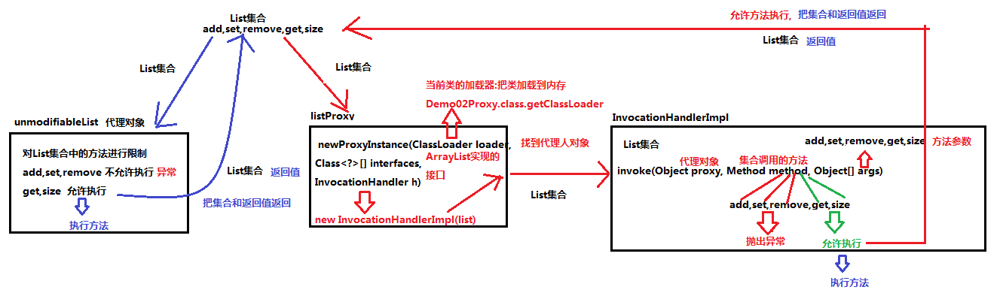
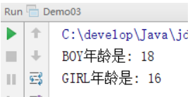

# day16【动态代理，JDK8新特性，正则表达式】

## 今日目标

- 动态代理
- 枚举
- 新特性
- 正则表达式

## 教学目标

- [ ] 能够说出动态代理模式的作用
- [ ] 能够定义枚举，并访问枚举常量
- [ ] 能够使用四种方法的引用
- [ ] 能够使用Base64对基本数据、URL和MIME类型进行编解码
- [ ] 能够理解正则表达式的作用
- [ ] 能够使用正则表达式的字符类
- [ ] 能够使用正则表达式的逻辑运算符
- [ ] 能够使用正则表达式的预定义字符类
- [ ] 能够使用正则表达式的数量词符号
- [ ] 能够使用正则表达式的分组
- [ ] 能够在String的split，replaceAll方法中使用正则表达式


# 第一章 动态代理 

## 1.1 代理模式【Proxy Pattern】

​		为什么要有“代理”？生活中就有很多例子，例如委托业务等等，**代理就是被代理者没有能力或者不愿意去完成某件事情，需要找个人代替自己去完成这件事**，这才是“代理”存在的原因。例如，我现在需要出国，但是我不愿意自己去办签证、预定机票和酒店（觉得麻烦 ，那么就可以找旅行社去帮我办，这时候旅行社就是代理，而我自己就是被代理了。

​		在我们的代码中，假如有以下业务情景：

​		用户登录到我们的系统后，我们的系统会为其产生一个ArrayList<String>集合对象，内部存储了一些用户信息，而后，这个对象需要被传给后面的很多其它对象，但要求其它对象不能对这个ArrayList<String>对象执行添加、删除、修改操作，只能get()获取元素。那么为了防止后面的对象对集合对象进行添加、修改、删除操作，我们应该怎样办呢？

​		要想实现这种要求，方案有很多种。"代理模式"就是其中的一种，而且是非常合适的一种。我们看一下用代理模式怎样实现这种需求：

> 1. 为ArrayList定义一个代理类：ArrayListProxy

```java
import java.util.*;

public class ArrayListProxy implements List<String> {
    //被代理的List集合
    private List<String> list;

    //通过构造方法将被代理的集合传入
    public ArrayListProxy(List<String> list) {
        this.list = list;
    }
    /*
        以下方法都是List接口中的方法：
        	允许被使用的方法：调用被代理对象的原方法
        	不允许被使用的方法：抛出异常
     */
    @Override
    public int size() {
        return this.list.size();
    }
    @Override
    public boolean isEmpty() {
        return this.list.isEmpty();
    }
    @Override
    public boolean contains(Object o) {
        return this.list.contains(o);
    }
    @Override
    public Iterator<String> iterator() {//不允许使用
        throw new UnsupportedOperationException();
    }
    @Override
    public Object[] toArray() {
        return this.list.toArray();
    }
    @Override
    public <T> T[] toArray(T[] a) {
        return this.list.toArray(a);
    }
    @Override
    public boolean add(String s) {//不允许使用
        throw new UnsupportedOperationException();
    }
    @Override
    public boolean remove(Object o) {//不允许使用
        throw new UnsupportedOperationException();
    }
    @Override
    public boolean containsAll(Collection<?> c) {
        return this.list.containsAll(c);
    }
    @Override
    public boolean addAll(Collection<? extends String> c) {//不允许使用
        throw new UnsupportedOperationException();
    }
    @Override
    public boolean addAll(int index, Collection<? extends String> c) {//不允许使用
        throw new UnsupportedOperationException();
    }
    @Override
    public boolean removeAll(Collection<?> c) {//不允许使用
        throw new UnsupportedOperationException();
    }
    @Override
    public boolean retainAll(Collection<?> c) {//不允许使用
        throw new UnsupportedOperationException();
    }
    @Override
    public void clear() {//不允许使用
        throw new UnsupportedOperationException();
    }
    @Override
    public String get(int index) {
        return this.list.get(index);
    }
    @Override
    public String set(int index, String element) {//不允许使用
        throw new UnsupportedOperationException();
    }
    @Override
    public void add(int index, String element) {//不允许使用
        throw new UnsupportedOperationException();
    }
    @Override
    public String remove(int index) {//不允许使用
        throw new UnsupportedOperationException();
    }
    @Override
    public int indexOf(Object o) {
        return this.list.indexOf(o);
    }
    @Override
    public int lastIndexOf(Object o) {
        return this.list.lastIndexOf(o);
    }
    @Override
    public ListIterator<String> listIterator() {//不允许使用
        throw new UnsupportedOperationException();
    }
    @Override
    public ListIterator<String> listIterator(int index) {//不允许使用
        throw new UnsupportedOperationException();
    }
    @Override
    public List<String> subList(int fromIndex, int toIndex) {//不允许使用
        throw new UnsupportedOperationException();
    }
}

```

> 1. 在测试类中定义一个方法，接收一个ArrayList<String>对象，然后返回这个代理对象，并在main()方法中测试：

```java
import java.util.ArrayList;
import java.util.List;

public class Demo {
    public static void main(String[] args) {
        //定义一个集合对象
        ArrayList<String> list = new ArrayList<>();

        list.add("张三");
        list.add("李四");
        list.add("王五");
        
		//调用getList()方法，根据这个集合获取一个它的"不可变"对象
        List<String> listProxy = getList(list);
        for (int i = 0; i < listProxy.size(); i++) {//OK的
            System.out.println(listProxy.get(i));//OK的

        }
		//其它方法都会抛出异常
//        listProxy.add("赵六");//UnsupportedOperationException
//        listProxy.remove(0);//UnsupportedOperationException
//        listProxy.set(0, "张老三");//UnsupportedOperationException

    }
	//此方法接收一个List<String>对象，返回一个不可变的"代理对象"
    public static List<String> getList(List<String> list) {
        ArrayListProxy proxy = new ArrayListProxy(list);
        return proxy;
    }
}
```


## 1.2  动态代理概述

​		动态代理简单来说是：**拦截对真实对象方法的直接访问，增强真实对象方法的功能**

​		动态代理详细来说是：代理类在程序运行时创建的代理对象被称为动态代理，也就是说，这种情况下，代理类并不是在Java代码中定义的，而是在运行时根据我们在Java代码中的“指示”动态生成的。也就是说你想获取哪个对象的代理，动态代理就会动态的为你生成这个对象的代理对象。**动态代理可以对被代理对象的方法进行增强**，**可以在不修改方法源码的情况下，增强被代理对象方法的功能**，**在方法执行前后做任何你想做的事情**。动态代理技术都是在框架中使用居多，例如：Struts1、Struts2、Spring和Hibernate等后期学的一些主流框架技术中都使用了动态代理技术。


## 1.3 案例引出

**演示Java已经实现的动态代理**

```java
java.util.Collections:操作集合的工具类

static <T> List<T> unmodifiableList(List<? extends T> list)
		返回指定列表的不可修改视图。
		此方法允许模块为用户提供对内部列表的“只读”访问。
		在返回的列表上执行的查询操作将“读完”指定的列表。
		试图修改返回的列表（不管是直接修改还是通过其迭代器进行修改）将导致抛出 		
		UnsupportedOperationException:不支持操作异常
unmodifiableList作用:传递List接口,方法内部对List接口进行代理,返回一个被代理后的List接口
		对List进行代理之后,调用List接口的方法会被拦截
		如果使用的size,get方法,没有对集合进行修改,则允许执行
		如果使用的add,remove,set方法,对集合进行了修改,则抛出运行时异常
```

**代码实现:**

```java
public class Demo01Proxy {
	@Test
	public void show(){
		//使用多态创建List集合,并添加元素
		List<String> list = new ArrayList<String>();
		list.add("a");
		list.add("b");
		list.add("c");
		//调用Collections中的方法unmodifiableList对List集合进行代理
		list = Collections.unmodifiableList(list);
		//如果使用的size,get方法,没有对集合进行修改,则允许执行
		System.out.println(list.size());
		System.out.println(list.get(1));
		//如果使用的add,remove,set方法,对集合进行了修改,则抛出运行时异常
		//list.add("d");//UnsupportedOperationException
		//list.remove(0);//UnsupportedOperationException
		list.set(1, "www");//UnsupportedOperationException
	}
}
```


## 1.4 重点类和方法

java.lang.reflect.Proxy：这是 Java 动态代理机制的主类，它提供了一个静态方法来为一组接口的实现类动态地生成代理类及其对象。

- **newProxyInstance方法的三个参数的详解:**

该方法用于为指定类装载器、一组接口及调用处理器生成动态代理类实例

```java
public static Object newProxyInstance(ClassLoader loader, Class[] interfaces, InvocationHandler h)

1、obj.getClass().getClassLoader()目标对象通过getClass方法获取类的所有信息后，调用getClassLoader() 方法来获取类加载器。获取类加载器后，可以通过这个类型的加载器，在程序运行时，将生成的代理类加载到JVM即Java虚拟机中，以便运行时需要！ 

2、obj.getClass().getInterfaces()获取被代理类的所有接口信息，以便于生成的代理类可以具有代理类接口中的所有方法。 

3、InvocationHandler 这是调用处理器接口，它自定义了一个 invoke 方法，用于集中处理在动态代理类对象上的方法调用，通常在该方法中实现对委托类方法的处理以及访问.
```

- **InvocationHandler接口的invoke方法及参数详解**

```java
public Object invoke(Object proxy, Method method, Object[] args)
1、Object proxy: 方法内部创建的代理人对象。 
2、Method method：方法内部会使用反射技术,自动被代理人使用的方法。
3、Object[] args：被代理方法中的参数。这里因为参数个数不定，所以用一个对象数组来表示。
```


## 1.5 动态代理综合案例

**需求:**
​	模拟unmodifiableList方法,对List接口进行代理
​		调用List接口的方法会被拦截
​		如果使用的size,get方法,没有对集合进行修改,则允许执行
​		如果使用的add,remove,set方法,对集合进行了修改,则抛出运行时异常

**分析:**
​	1.定义一个代理方法proxyList
​		参数:传递List集合
​		返回值:被代理之后的List集合
​	2.方法内部可以使用Proxy类中的方法实现动态代理

**代码实现:**

```java
@SuppressWarnings("all")
public class Demo02Proxy {
	//1.定义一个代理方法proxyList
	public List proxyList(List<String> list){
		//2.方法内部可以使用Proxy类中的方法实现动态代理
		List<String> pList = (List<String>) Proxy.newProxyInstance(Demo02Proxy.class.getClassLoader(),
				list.getClass().getInterfaces(),
				new InvocationHandlerImpl(list));
		return pList;
	}

	@Test
	public void show(){
		//使用多态创建List集合,并添加元素
		List<String> list = new ArrayList<String>();
		list.add("a");
		list.add("b");
		list.add("c");
		//调用Collections中的方法unmodifiableList对List集合进行代理
		list = proxyList(list);
		//如果使用的size,get方法,没有对集合进行修改,则允许执行
		System.out.println(list.size());
		System.out.println(list.get(1));
		//如果使用的add,remove,set方法,对集合进行了修改,则抛出运行时异常
		//list.add("d");//UnsupportedOperationException
		//list.remove(0);//UnsupportedOperationException
		//list.set(1, "www");//UnsupportedOperationException
	}
}
```

```java
public class InvocationHandlerImpl implements InvocationHandler{
	//定义一个List集合变量
	private List<String> list;

	//给List集合赋值
	public InvocationHandlerImpl(List<String> list) {
		super();
		this.list = list;
	}

	@Override
	public Object invoke(Object proxy, Method method, Object[] args) throws Throwable {
		//invoke方法会获取List集合的方法,在invoke方法内部对List集合的方法进行拦截
		//获取List集合方法的名字
		String listMethodName = method.getName();
		//对获取的名字进行判断
		//如果使用的add,remove,set方法,对集合进行了修改,则抛出运行时异常
		if("add".equals(listMethodName)){
			throw new UnsupportedOperationException("add no run");
		}
		if("remove".equals(listMethodName)){
			throw new UnsupportedOperationException("remove no run");
		}
		if("set".equals(listMethodName)){
			throw new UnsupportedOperationException("set no run");
		}
		//如果使用的size,get方法,没有对集合进行修改,则允许执行
		Object v = method.invoke(list,args);
		return v;
	}
}
```

**动态代理案例流程图**



## 1.6 总结

动态代理非常的灵活，可以为任意的接口实现类对象做代理

动态代理可以为被代理对象的所有接口的所有方法做代理，动态代理可以在不改变方法源码的情况下，实现对方法功能的增强，

动态代理类的字节码在程序运行时由Java反射机制动态生成，无需程序员手工编写它的源代码。 
动态代理类不仅简化了编程工作，而且提高了软件系统的可扩展性，因为Java 反射机制可以生成任意类型的动态代理类。

动态代理同时也提高了开发效率。

缺点：只能针对接口的实现类做代理对象，普通类是不能做代理对象的。


# 第二章 枚举

## 2.1 不使用枚举存在的问题

假设我们要定义一个人类，人类中包含姓名和性别。通常会将性别定义成字符串类型，效果如下：

```java
public class Person {
    private String name;
    private String sex;

    public Person() {
    }

    public Person(String name, String sex) {
        this.name = name;
        this.sex = sex;
    }
	
    // 省略get/set/toString方法
}
```

```java
public class Demo01 {
    public static void main(String[] args) {
        Person p1 = new Person("张三", "男");
        Person p2 = new Person("张三", "abc"); // 因为性别是字符串,所以我们可以传入任意字符串
    }
}
```

不使用枚举存在的问题：可以给性别传入任意的字符串，导致性别是非法的数据，不安全。


## 2.2 作用

枚举的作用：一个方法接收的参数是固定范围之内的时候，那么即可使用枚举。


## 2.3 基本语法

### 2.3.1 枚举的概念

枚举是一种特殊类。枚举是有固定实例个数的类型，我们可以把枚举理解成有固定个数实例的多例模式。

### 2.3.2 定义枚举的格式

```java
enum 枚举名 {
    第一行都是罗列枚举实例,这些枚举实例直接写大写名字即可。
}
```

### 2.3.3 入门案例

1. 定义枚举：BOY表示男，GIRL表示女

```java
enum Sex {
    BOY, GIRL; // 男，女
}
```

2. Perosn中的性别有String类型改为Sex枚举类型

```java
public class Person {
    private String name;
    private Sex sex;

    public Person() {
    }

    public Person(String name, Sex sex) {
        this.name = name;
        this.sex = sex;
    }
    // 省略get/set/toString方法
}
```

3. 使用是只能传入枚举中的固定值

```java
public class Demo02 {
    public static void main(String[] args) {
        Person p1 = new Person("张三", Sex.BOY);
        Person p2 = new Person("张三", Sex.GIRL);
        Person p3 = new Person("张三", "abc");
    }
}
```

### 2.3.4 枚举的其他内容

枚举的本质是一个类，我们刚才定义的Sex枚举最终效果如下：

```java
enum Sex {
    BOY, GIRL; // 男，女
}

// 枚举的本质是一个类，我们刚才定义的Sex枚举相当于下面的类
final class SEX extends java.lang.Enum<SEX> {
    public static final SEX BOY = new SEX();
    public static final SEX GIRL = new SEX();
    public static SEX[] values();
    public static SEX valueOf(java.lang.String);
    static {};
}
```

枚举的本质是一个类，所以枚举中还可以有成员变量，成员方法等。

```java
public enum Sex {
    BOY(18), GIRL(16);

    public int age;

    Sex(int age) {
        this.age = age;
    }

    public void showAge() {
        System.out.println("年龄是: " + age);
    }
}
```

```java
public class Demo03 {
    public static void main(String[] args) {
        Person p1 = new Person("张三", Sex.BOY);
        Person p2 = new Person("张三", Sex.GIRL);

        Sex.BOY.showAge();
        Sex.GIRL.showAge();
    }
}
```

运行效果：




## 2.4 使用场景

**枚举的应用：枚举通常可以用于做信息的分类，如性别，方向，季度等。**

枚举表示性别：

```java
public enum Sex {
    MAIL, FEMAIL;
}
```

枚举表示方向：

```java
public enum Orientation {
    UP, RIGHT, DOWN, LEFT;
}
```

枚举表示季度

```java
public enum Season {
    SPRING, SUMMER, AUTUMN, WINTER;
}
```


## 2.5 小结

- 枚举类在第一行罗列若干个枚举对象。（多例）

- 第一行都是常量，存储的是枚举类的对象。

- 枚举是不能在外部创建对象的，枚举的构造器默认是私有的。

- 枚举通常用于做信息的标志和分类。


# 第三章JDK8新特性

> JDK新特性：
>
> **Lambda 表达式**【已学习过】
>
> **默认方法**【已学习过】
>
> **Stream API** 【已学习过】
>
> **方法引用**
>
> **Base64**

## 3.1 方法引用

### 3.1.1 方法引用概述

方法引用使得开发者可以直接引用现存的方法、Java类的构造方法或者实例对象。方法引用和Lambda表达式配合使用，使得java类的构造方法看起来紧凑而简洁，没有很多复杂的模板代码。

### 2.1.2 方法引用基本使用

方法引用使用一对冒号 **::** 。

下面，我们在 Car 类中定义了 4 个方法作为例子来区分 Java 中 4 种不同方法的引用。

```java
public class Car {
    public static Car create( final Supplier< Car > supplier ) {
        return supplier.get();
    }              

    public static void collide( final Car car ) {
        System.out.println( "Collided " + car.toString() );
    }

    public void follow( final Car another ) {
        System.out.println( "Following the " + another.toString() );
    }

    public void repair() {   
        System.out.println( "Repaired " + this.toString() );
    }
}
```

第一种方法引用的类型是**构造器引用**，语法是**Class::new**，或者更一般的形式：**Class<T>::new**。注意：这个构造器没有参数。

```java
final Car car = Car.create( Car::new );
final List< Car > cars = Arrays.asList( car );
```

第二种方法引用的类型是**静态方法引用**，语法是**Class::static_method**。注意：这个方法接受一个Car类型的参数。

```java
cars.forEach( Car::collide );
```

第三种方法引用的类型是**某个类的成员方法的引用**，语法是**Class::method**，注意，这个方法没有定义入参：

```java
cars.forEach( Car::repair );
```

第四种方法引用的类型是**某个实例对象的成员方法的引用**，语法是**instance::method**。注意：这个方法接受一个Car类型的参数：

```java
final Car police = Car.create( Car::new );
cars.forEach( police::follow );
```

### 3.1.3 基于静态方法引用的代码演示

```java
public static void main(String args[]) {
    List names = new ArrayList();

    names.add("大明");
    names.add("二明");
    names.add("小明");

    names.forEach(System.out::println);
}
```

上面的代码，我们将 System.out::println 方法作为静态方法来引用。

测试结果为：

```java
大明
二明
小明
```


## 3.2 Base64

### 3.2.1 Base64概述

Base64是网络上最常见的用于传输8Bit字节码的编码方式之一，Base64就是一种基于64个可打印字符来表示二进制数据的方法。

在Java 8中，Base64编码已经成为Java类库的标准。

Java 8 内置了 Base64 编码的编码器和解码器。

Base64工具类提供了一套静态方法获取下面三种BASE64编解码器：

- **基本：**输出被映射到一组字符A-Za-z0-9+/，编码不添加任何行标，输出的解码仅支持A-Za-z0-9+/。
- **URL：**输出映射到一组字符A-Za-z0-9+_，输出是URL和文件。
- **MIME：**输出隐射到MIME友好格式。输出每行不超过76字符，并且使用'\r'并跟随'\n'作为分割。编码输出最后没有行分割。

### 3.2.2 Base64内嵌类和方法描述

**内嵌类**

| 序号 | 内嵌类 & 描述                                                |
| :--- | :----------------------------------------------------------- |
| 1    | **static class Base64.Decoder**该类实现一个解码器用于，使用 Base64 编码来解码字节数据。 |
| 2    | **static class Base64.Encoder**该类实现一个编码器，使用 Base64 编码来编码字节数据 |

**方法**

| 序号 | 方法名 & 描述                                                |
| :--- | :----------------------------------------------------------- |
| 1    | **static Base64.Decoder getDecoder()**返回一个 Base64.Decoder ，解码使用基本型 base64 编码方案。 |
| 2    | **static Base64.Encoder getEncoder()**返回一个 Base64.Encoder ，编码使用基本型 base64 编码方案。 |
| 3    | **static Base64.Decoder getMimeDecoder()**返回一个 Base64.Decoder ，解码使用 MIME 型 base64 编码方案。 |
| 4    | **static Base64.Encoder getMimeEncoder()**返回一个 Base64.Encoder ，编码使用 MIME 型 base64 编码方案。 |
| 5    | **static Base64.Encoder getMimeEncoder(int lineLength, byte[] lineSeparator)**返回一个 Base64.Encoder ，编码使用 MIME 型 base64 编码方案，可以通过参数指定每行的长度及行的分隔符。 |
| 6    | **static Base64.Decoder getUrlDecoder()**返回一个 Base64.Decoder ，解码使用 URL 和文件名安全型 base64 编码方案。 |
| 7    | **static Base64.Encoder getUrlEncoder()**返回一个 Base64.Encoder ，编码使用 URL 和文件名安全型 base64 编码方案。 |

> **注意：**Base64 类的很多方法从 **java.lang.Object** 类继承。

### 3.2.3 Base64代码演示

```java
public static void main(String args[]) {
        try {

            // 使用基本编码
            String base64encodedString = Base64.getEncoder().encodeToString("itheima?java8".getBytes("utf-8"));
            System.out.println("Base64 编码字符串 (基本) :" + base64encodedString);

            // 解码
            byte[] base64decodedBytes = Base64.getDecoder().decode(base64encodedString);
            System.out.println("原始字符串: " + new String(base64decodedBytes, "utf-8"));
            
            // URL
            base64encodedString = Base64.getUrlEncoder().encodeToString("itheima?java8".getBytes("utf-8"));
            System.out.println("Base64 编码字符串 (URL) :" + base64encodedString);

            // MIME
            StringBuilder stringBuilder = new StringBuilder();

            for (int i = 0; i < 10; ++i) {
                stringBuilder.append(UUID.randomUUID().toString());
            }

            byte[] mimeBytes = stringBuilder.toString().getBytes("utf-8");
            String mimeEncodedString = Base64.getMimeEncoder().encodeToString(mimeBytes);
            System.out.println("Base64 编码字符串 (MIME) :" + mimeEncodedString);

        }catch(UnsupportedEncodingException e){
            System.out.println("Error :" + e.getMessage());
        }
    }
```

运行结果：

```java
Base64 编码字符串 (基本) :aXRoZWltYT9qYXZhOA==
原始字符串: itheima?java8
Base64 编码字符串 (URL) :aXRoZWltYT9qYXZhOA==
Base64 编码字符串 (MIME) :ODM1MWI4MzMtZGZmZi00MDAwLTkwNTAtZjUxMjkzODMwY2E2YTVjZmMwN2QtYzM0My00ZjdhLTll
MDktMDFkMWZmZjA0MWRkOTE5Nzk0YzMtNTkyOC00Yjk0LThhYWEtMmIyNmFhN2Y3YzFmY2I2NDNl
ZmEtY2ZmNC00NTU4LWIzZDktZjAzMmE1M2FiOWM1ZDAyMzAyYzktZTM3MS00MDk3LWI2YWEtZTMz
MzZlMjE4NDdkZmEzYTA0NjktYWFhZC00M2ZiLTkzYTQtYTA0ZDIzMjIxY2RiMTMxYTU1MzgtZjZi
OS00NDcyLWJjOTYtZjViODVkNzdkNjMyODNhZTJhNDktZmU0Ni00ZDI5LWI0MDUtZWRkZGFmYjM2
MDliZTcyNWMxY2ItMWE3Ny00NmM4LTk2ZWUtZjBhYjY4YzgwMzU3N2Q3YWFiMTYtNzBjYi00MzNh
LTkxN2UtNzJmNWE0MjQzMGUx
```


# 第四章 正则表达式

## 4.1 概念及演示

- 在Java中，我们经常需要验证一些字符串，例如：年龄必须是2位的数字、用户名必须是8位长度而且只能包含大小写字母、数字等。正则表达式就是用来验证各种字符串的规则。它内部描述了一些规则，我们可以验证用户输入的字符串是否匹配这个规则。
- 先看一个不使用正则表达式验证的例子：下面的程序让用户输入一个QQ号码，我们要验证：
  - QQ号码必须是5--15位长度
  - 而且必须全部是数字
  - 而且首位不能为0

~~~java
public class Demo {
	public static void main(String[] args) {
		Scanner sc = new Scanner(System.in);
		
		System.out.println("请输入你的QQ号码：");
		String qq = sc.next();
		
		System.out.println(checkQQ(qq));
	}
	//我们自己编写代码，验证QQ号码
	private static boolean checkQQ(String qq) {
		//1.验证5--15位
		if(qq.length() < 5 || qq.length() > 15){
			return false;
		}
		//2.必须都是数字；
		for(int i = 0;i < qq.length() ; i++){
			char c = qq.charAt(i);
			if(c < '0' || c > '9'){
				return false;
			}
		}
		//3.首位不能是0；
		char c = qq.charAt(0);
		if(c == '0'){
			return false;
		}
		return true;//验证通过
	}
	
}
~~~

- 使用正则表达式验证：

~~~java
public class Demo {
	public static void main(String[] args) {
		Scanner sc = new Scanner(System.in);
		
		System.out.println("请输入你的QQ号码：");
		String qq = sc.next();
		
		System.out.println(checkQQ2(qq));
	}
	//使用正则表达式验证
	private static boolean checkQQ2(String qq){
		String regex = "[1-9]\\d{4,14}";//正则表达式
		return qq.matches(regex);
	}
}
~~~

上面程序checkQQ2()方法中String类型的变量regex就存储了一个"正则表达式 "，而这个正则表达式就描述了我们需要的三个规则。matches()方法是String类的一个方法，用于接收一个正则表达式，并将"本对象"与参数"正则表达式"进行匹配，如果本对象符合正则表达式的规则，则返回true，否则返回false。

**我们接下来就重点学习怎样写正则表达式**


## 4.2 字符类

- 语法示例：

  1. \[abc\]：代表a或者b，或者c字符中的一个。
  2. \[^abc\]：代表除a,b,c以外的任何字符。
  3. [a-z]：代表a-z的所有小写字符中的一个。
  4. [A-Z]：代表A-Z的所有大写字符中的一个。
  5. [0-9]：代表0-9之间的某一个数字字符。
  6. [a-zA-Z0-9]：代表a-z或者A-Z或者0-9之间的任意一个字符。
  7. [a-dm-p]：a 到 d 或 m 到 p之间的任意一个字符。 

- 代码示例：

~~~java
public class Demo {
	public static void main(String[] args) {
		String str = "ead";
		
		//1.验证str是否以h开头，以d结尾，中间是a,e,i,o,u中某个字符
		String regex = "h[aeiou]d";
		System.out.println("1." + str.matches(regex));
		
		//2.验证str是否以h开头，以d结尾，中间不是a,e,i,o,u中的某个字符
		regex = "h[^aeiou]d";
		System.out.println("2." +  str.matches(regex));
		
		//3.验证str是否a-z的任何一个小写字符开头，后跟ad
		regex = "[a-z]ad";
		System.out.println("3." + str.matches(regex));
		
		//4.验证str是否以a-d或者m-p之间某个字符开头，后跟ad
		regex = "[[a-d][m-p]]ad";
		System.out.println("4." + str.matches(regex));
	}
}

~~~


## 4.3 逻辑运算符

- 语法示例：
  1. &&：并且
  2. |    ：或者

- 代码示例：

~~~java
public class Demo {
	public static void main(String[] args) {
		String str = "had";
		
		//1.要求字符串是否是除a、e、i、o、u外的其它小写字符开头，后跟ad
		String regex = "[a-z&&[^aeiou]]ad";
		System.out.println("1." + str.matches(regex));
		
		//2.要求字符串是aeiou中的某个字符开头，后跟ad
		regex = "[a|e|i|o|u]ad";//这种写法相当于：regex = "[aeiou]ad";
		System.out.println("2." + str.matches(regex));
	}
}

~~~


## 4.4 预定义字符

- 语法示例：
  1. "." ： 匹配任何字符。
  2. "\d"：任何数字[0-9]的简写；
  3. "\D"：任何非数字\[^0-9\]的简写；
  4. "\s"： 空白字符：[ \t\n\x0B\f\r] 的简写
  5. "\S"： 非空白字符：\[^\s\] 的简写
  6. "\w"：单词字符：[a-zA-Z_0-9]的简写
  7. "\W"：非单词字符：\[^\w\]

- 代码示例：

~~~java
public class Demo {
	public static void main(String[] args) {
		String str = "258";
		
		//1.验证str是否3位数字
		String regex = "\\d\\d\\d";
		System.out.println("1." + str.matches(regex));
		
		//2.验证手机号：1开头，第二位：3/5/8，剩下9位都是0-9的数字
        str = "13513153355";//要验证的字符串
		regex = "1[358]\\d\\d\\d\\d\\d\\d\\d\\d\\d";//正则表达式
		System.out.println("2." + str.matches(regex));
		
		//3.验证字符串是否以h开头，以d结尾，中间是任何字符
		str = "had";//要验证的字符串
		regex = "h.d";//正则表达式
		System.out.println("3." + str.matches(regex));
		
		//4.验证str是否是：had.
        str = "had.";//要验证的字符串
		regex = "had\\.";//\\.代表'.'符号，因为.在正则中被预定义为"任意字符"，不能直接使用
		System.out.println("4." + str.matches(regex));
		
	}
}
~~~


## 4.5 数量词

- 语法示例：
  1. X? : 0次或1次
  2. X* : 0次到多次
  3. X+ : 1次或多次
  4. X{n} : 恰好n次
  5. X{n,} : 至少n次
  6. X{n,m}: n到m次(n和m都是包含的)

- 代码示例：

~~~java
public class Demo {
	public static void main(String[] args) {
		String str = "";
		
		//1.验证str是否是三位数字
        str = "012";
		String regex = "\\d{3}";
		System.out.println("1." + str.matches(regex));
		
		//2.验证str是否是多位数字
        str = "88932054782342";
		regex = "\\d+";
		System.out.println("2." + str.matches(regex));
		
		//3.验证str是否是手机号：
        str = "13813183388";
		regex = "1[358]\\d{9}";
		System.out.println("3." + str.matches(regex));
		
		//4.验证小数:必须出现小数点，但是只能出现1次
		String s2 = "3.1";
		regex = "\\d*\\.{1}\\d+";
		System.out.println("4." + s2.matches(regex));
		
		//5.验证小数：小数点可以不出现，也可以出现1次
		regex = "\\d+\\.?\\d+";
		System.out.println("5." + s2.matches(regex));
		
		//6.验证小数：要求匹配：3、3.、3.14、+3.14、-3.
        s2 = "-3.";
		regex = "[+-]\\d+\\.?\\d*";
		System.out.println("6." + s2.matches(regex));
		
		//7.验证qq号码：1).5--15位；2).全部是数字;3).第一位不是0
        s2 = "1695827736";
		regex = "[1-9]\\d{4,14}";
		System.out.println("7." + s2.matches(regex));
	}
}

~~~


## 4.6 分组括号( )

~~~java
public class Demo {
	public static void main(String[] args) {
		String str = "DG8FV-B9TKY-FRT9J-99899-XPQ4G";
		
		//验证这个序列号：分为5组，每组之间使用-隔开，每组由5位A-Z或者0-9的字符组成
		String regex = "([A-Z0-9]{5}-){4}[A-Z0-9]{5}";
		System.out.println(str.matches(regex));
	}
}

~~~


## 4.7 String的split方法中使用正则表达式

- String类的split()方法原型：

  ```java
  public String[] split(String regex)//参数regex就是一个正则表达式。可以将当前字符串中匹配regex正则表达式的符号作为"分隔符"来切割字符串。
  ```

- 代码示例：

~~~java
public class Demo {
	public static void main(String[] args) {
		String str = "18  4 567       99     56";
		String[] strArray = str.split(" +");
		for (int i = 0; i < strArray.length; i++) {
			System.out.println(strArray[i]);
		}
	}
}

~~~


## 4.8 String类的replaceAll方法中使用正则表达式

- String类的replaceAll()方法原型：

~~~java
public String replaceAll(String regex,String newStr)//参数regex就是一个正则表达式。可以将当前字符串中匹配regex正则表达式的字符串替换为newStr。
~~~

- 代码示例：

~~~java
public class Demo {
    public static void main(String[] args) {
        //将下面字符串中的"数字"替换为"*"
        String str = "jfdk432jfdk2jk24354j47jk5l31324";
        System.out.println(str.replaceAll("\\d+", "*"));
    }
}
~~~


