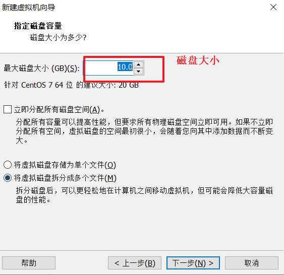
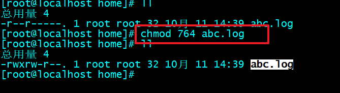

# linux基础命令

# 1.什么是系统

~~~
项目开发好了之后，打成war包，我们要发布。

windows面向企业存在的问题：
1.收费
2.系统不稳定
3.不安全。 不开源。

liunx系统完美解决上面的问题。

开发部：  开发代码，
运维部门： 管理项目的运行和维护
~~~

# 2.linux系统

# 3.虚拟介绍

~~~
常用了2款虚拟机：
1.wmware:   
2.VirtualBox    甲骨文
~~~

# 4.安装虚拟机

~~~
安装需要的注意是：
1.如果在安装的时候，就安装不起来，提示redist ，那么安装资料中的VC_redist.x64
2.安装成功之后，需要检查电脑的网卡，应该会多2张网卡，VMnet1  VMnet8
~~~

# 5.配置虚拟机

重要步骤：

# 6.系统安装

详细见笔记资料

最重要的网卡配置：

# 7.客户端远程连接

# 8.linux命令

## 8.0 linxu系统的目录结构

~~~

~~~

## 8.1  cd  mkdir  ls  pwd

~~~

~~~

​	

## 8.2 find  mv  cp  rm

~~~
find  目录  参数   ： 在指定的目录下查找内容
mv(move)  :   剪切
cp(copy)  ：  复制
rm(remove):  删除
~~~

## 8.3 查看文件的内容

~~~
cat : 查看全部的内容，一般适用于文件内容较少的情况
more/less: 都是翻页查看，适用于文件内容较多的情况。  more：空格就是翻页
head -n 20 文件名 :  查看文件的头部20行信息
tail -n 20 -f 文件名 : 查看文件的最后20行信息，并且循环读取。
~~~

## 8.4 文件编辑操作

touch 文件名 ： 创建文件

## 8.5 打包和解压

参数含义：

~~~
打包并且压缩： tar -zcvf   压缩文件名  要打包的文件     
解压到当前目录 ： tar -zxvf  压缩文件名
解压到指定目录： tar -zxvf 压缩文件名  -C  目录名
~~~

## 8.6 进程相关

~~~
ps -ef   查看所有进程信息
|   管道符，将管道符左边的内容作为管道符右边的命令的参数存在
grep 检索

ps -ef | grep vi  在所有的进程中，检索vi相关的进程
kill -9  进程的id，用来杀死进程
~~~

## 8.7 系统状态相关（了解）

~~~
free -m  以兆为单位，显示内存情况
df -h 友好显示磁盘使用情况
shutdown  now  : 关机
reboot :重启
top： 查看系统状态
~~~

## 8.8 文件的权限（了解）

### 添加权限

### 修改权限

### 删除权限

### 数字权限方式

## 8.9 定时任务（了解）

~~~
定时任务是什么？到点自动执行
~~~

~~~
crontab -l  显示所有的定时任务
crontab -e 编辑定时任务，一行就是一个定时任务
定时任务编辑的语法格式：   
  分 时  日  月 周  命令（定时任务要干的事情）
~~~

编辑定时任务，每分钟输出时间到mydate文件中

~~~
crontab -e  编辑定时任务
* * * * * date > /home/mydate.log
退出编辑自动执行
~~~

## 8.10 系统服务相关

~~~
常用服务名：
network   网卡服务
mysqld    mysql数据库服务
crond     定时任务服务
firewalld  防火墙服务
~~~

~~~
linux中所有服务的操作语法

systemctl  start  服务名  启动服务
systemctl  stop  服务名   停止服务
systemctl  restart 服务名  重启服务
systemctl  status  服务名   查看服务的状态
systemctl  reload  服务名  重新加载配置
systemctl  disabled 服务名   关闭服务的开机自动启动
systemctl  enabled  服务名   开启服务的开机自动自动
~~~

## 8.11 网卡操作（了解）

~~~
ifconfig  : 查看网卡相关信息，包含网卡的ip地址信息

/etc/sysconfig/network-scripts/ifcfg-ens33   就是ens33这张网卡的配置文件
~~~

设置静态ip

~~~
1.通过设置BOOTPROTO=static 设置静态分配
2.设置静态ip地址和子网掩码等等。。。

IPADDR=192.168.248.99
GATEWAY=192.168.248.2
NETMASK=255.255.255.0
DNS1=8.8.8.8
~~~

# 10.虚拟化问题

~~~

~~~

# 11.阿里云服务器租聘

密码：   Itheima115