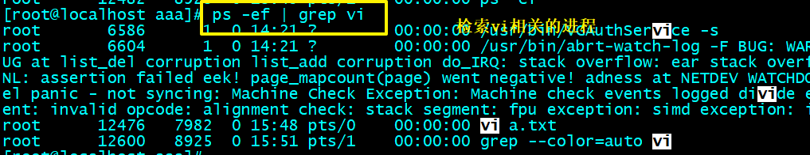
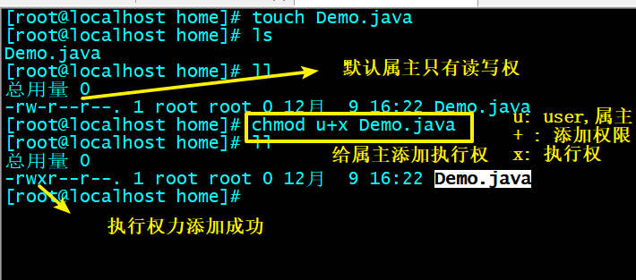

# 课堂笔记

# 1.linux介绍

~~~
系统： 运行在机器上的软件环境。
	举例子：  安卓手机（安卓系统）和苹果手机（ios系统）。

个人pc也需要系统，都是安装的windows（面向普通用户）系统。	
华为鸿蒙系统。

linux和windows一样是用于计算机的系统。

为什么需要学习linux？
我们的项目开发好了，需要部署。部署需要安装软件（tomcat，jdk..），软件需要运行在系统上。
window系统是需要收费的，windows系统卡顿。

linux系统：相对路windows系统来说，免费，稳定。

	
~~~

# 2.软件安装

## 2.1 安装虚拟机

~~~
虚拟机：使用软件，模拟了一台电脑，这台虚拟的电脑，有cpu，有内存，有网卡等等...这些环境，都是占用了我们真实的电脑。

vmware傻瓜式安装即可。
~~~

**注意：**

~~~
1.如果你以前安装过，一定要确保卸载成功。然后才能继续安装，要不安装不上去。（快要安装结束的时候，全部回退了） CCCleaner软件清理注册表这类。
2.安装成功，一定要检查你电脑的网卡，会有vmnet1和vmnet8 两张网卡。如果没有，可以使用驱动精灵，更新网卡驱动。
~~~

#### 问题：

如果出现VC的什么错误。。。或者c++错误。。

#### 虚拟机卸载干净的办法

https://www.cnblogs.com/psy-code/p/9311104.html

## 2.2 虚拟机配置（创建虚拟计算机）

1. 点击 文件 -> 新建虚拟机 创建一台新虚拟机

    

2. 在弹出框中选择典型安装

   

   

3. 选择稍后安装系统

    

4. 选择引导系统是Linux并选择系统版本是CentOS(如果看不到64位,请查看附件图片: 开启虚拟化)

    

5. 选择安装位置

   

   

   

   

   

    

6. 确定磁盘的最大使用空间

7. 

   

   

   

    

8. 准备安装前的硬件设置

   

    

9. 设置网络适配器为NAT连接网络模式

   ​	NAT英文全称是“Network Address Translation”，中文意思是“网络地址转换”，NAT 可以让内部网络连接到Internet或其它IP网络上。

   1. 虚拟机中的linux系统与windows主机形成一个局域网
   2. 并共享windows主机外网网络。

   

#### 问题：

出现这个错误，表示你的电脑没有开启虚拟化配置。需要进入bios界面去配置。

在bios界面找     virtual  [technology](https://fanyi.so.com/?src=onebox#science%20and%20technology)   ,把它的值改成enable.

## 2.3 安装系统

启动安装系统：

1. 开启虚拟机

    

2. 启动机器安装系统

    

3. 引导安装，点击next

    

4. 软件选择，选择"基本网页服务器"-> "开发工具"

   

5. 点击安装位置

    

6. 设置外网网卡打开

   

7. 设置网卡自动连接

   

8. 网络配置完成

   

9. 配置完成，点开始安装系统

    

10. 复制文件的过程中可以设置root管理员密码

     

11. 密码设置为root，因为密码太短，点完成两次

     

12. 重新引导系统

    

## 2.4 远程连接

绿色版直接使用：

需要知道linux系统的ip地址

在windows系统中确定vmnet8

所发发现linux的ip地址和windows的ip地址处于同一个局域网（前3个数一样），所以才能够远程连接。

乱码问题：

## 2.5 阿里云租聘

1.注册阿里云账号，并且进行实名认证。

2.选择云服务器ECS

系统

流量

密码：ITheima119

# 3.基础命令

## 3.1 linux的目录

~~~
/etc   里面用来存放系统相关的配置文件的，例如，环境变量的配置文件profile   网络配置文件
/home  是普通用户的目录
/root  管理员用户所在的目录，其他用户无法访问
/usr   可以安装一些软件
~~~

## 3.2 目录相关操作

~~~
pwd : 确定自己所在的位置
cd  : 切换目录
ls  : 简略查看当前目录下的资源文件
ll  : 详细查看目录下的资源文件
mkdir:  make directory 创建文件夹
     -p  ：parent 没有父目录的情况下，创建父目录
     -v  : view   显示详细信息
rmdir ： remove directory 删除文件夹
rm -rf : 递归删除文件夹和其内容
     -r : 递归，从内往外删
     -f : 不询问，强制删除
~~~

ll查看文件详细信息：

## 3.3 复制剪切

~~~
find 要检索的目录   -name   要检索的文件的名字
mv 源文件  目标位置  : move，剪切
touch  文件名  ： 创建文件，虽然都是文本文档，但是建议建议加上后缀。
cp 源文件  目标位置  : copy,复制
~~~

## 3.4 查看文件的内容（tail重要）

~~~
cat  文件名    ： 查看文件的所有内容
more 文件名    :  翻页查看文件的内容，空格进行翻页
less 文件名    :  翻页查看，空格进行翻页，向下的箭头可以一行一行的查看。 
tail -n  20  -f 文件名  ： 实时的查看文件最新的内容，显示20行
head 文件      :  默认查看文件头部的10行信息
~~~

（模拟日志的命令）ping 127.0.0.1 > ip.log     将向127.0.0.1ping的信息写入到ip.log文件中

## 3.5 编辑文件(重要)

~~~
vi编辑器编辑软件，有3种模式。
命令模式：接受键盘录入的命令，进行高级操作
底行模式：用于回到终端的
编辑模式：键盘录入内容，进行文件的编辑操作
~~~

## 3.6 压缩和解压

命令： tar -zcvf  压缩包的名字    要打包和压缩的内容

解压：tar -zxvf  要解压的压缩包名字

解压到指定目录下  tar -zxvf 要解压的压缩包名字  -C  指定的目录

小结：

~~~
tar -zcvf  压缩包的名字   要压缩的内容    :压缩
tar -zxvf  压缩包的名字  -C  目录        ：解压到指定目录下 
~~~

## 3.7 进程相关（了解）

~~~
类似windows中的任务管理器

ps -ef ： 查看所有的进程信息
|   ： 管道符，将管道符左边的命令的结果作为管道符右边命令的参数
grep : 检索，条件筛选，类似mysql中的where关键字

kill -9  进程的id  ： 强制杀死进程
~~~

从所有的进程中检索我们需要的进程 ： ps -ef | grep  检索内容

## 3.8 系统属性相关（了解）

~~~
free: 查看内存情况	
	-m  以兆为单位显示
df : 查看磁盘情况
	-h  以g为单位去显示
	
top: 查看系统相关属性

shutdown now  ： 立即关机
reboot  ： 重启
~~~

## 3.9 权限相关 （了解）

### 3.9.1 权限相关

### 3.9.2 权限操作

权限的增删改：

数字权限

~~~
需求：给属主赋予读写执行权，数组读写权，其他用户写的权限
~~~

## 3.10 定时任务 （了解）

~~~
定时任务：根据指定的时间去执行的一件事。
crontab   -l  查看所有的定时任务
crontab   -e  编辑定时任务
crontab   -r  删除所有的定时任务

定时任务的编写规范： 
1.一行代表一个定时任务
2.每个定时任务的格式都是一样的  ：  分  时  日  月  周   命令 
~~~

例子：

需求：

每隔一分钟，让Linux输出当前的系统时间到/home/mydate.log文件中。

~~~
步骤：
1.crontab -e  进行定时任务的编辑
2.编辑的内容   *  *  *  *  *  date >  /home/mydate.log 
3.退出编辑
4.crontab -l  查看之前编辑的定时任务
5.等待时间，查看文件
~~~

## 3.11 系统服务管理 

~~~
systemctl  start   系统服务名  ： 开启服务
systemctl  stop    系统服务名  :  关闭服务
systemctl  restart  系统服务名 :  重启服务
systemctl  status   系统服务名 :  查看服务状态
systemctl  reload  系统服务名  :  重新加载配置
systemctl  enable  系统服务名  : 开机自动启动
systemctl  disable  系统服务名  : 关闭开启自启
~~~

## 3.12 网卡相关（了解）

centos7中网卡的配置文件：/etc/sysconfig/network-scripts/ifcfg-ens33

查看网卡的先关信息：

分配静态ip地址：

查看当前虚拟机的网关和子网掩码：

   

~~~
步骤：
1.将dhcp改成static
2.配置静态ip
	IPADDR=192.168.248.99   静态ip（和window中的vmnet8的网卡同一个局域网即可）
    GATEWAY=192.168.248.2    网关
    NETMASK=255.255.255.0   子网掩码
    DNS1=8.8.8.8            dns服务器（谷歌的）
3.重启网卡服务
	systemctl restart network
~~~

