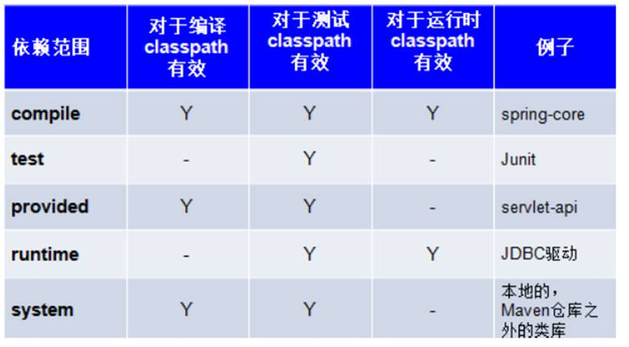

---

typora-copy-images-to: img
---

#  maven

## 学习目标

1. 能够了解Maven的作用
2. 能够理解Maven仓库的作用
3. 能够理解Maven的坐标概念
4. 能够掌握Maven的安装
5. 能够掌握IDEA配置本地Maven
6. 能够使用IDEA创建javase的Maven工程
7. 能够使用IDEA创建javaweb的Maven工程
8. 能够自定义javeweb的Maven工程
9. 能够掌握依赖引入的配置方式
10. 能够了解依赖范围的概念


## 一、maven概述

### 1.1、项目开发中的问题 


​		在之前中的项目中,我们大量导入jar包, 这会导致如下的问题：

1)    造成包的冗余：每个项目需要复制一次这些包，占用大量的空间。

2)    不易管理：不同的开发者使用的jar包的版本不同，导致包不统一，甚至出现包的冲突。

3)    阅读性差 :  应该导入哪些jar包，这些包又依赖了哪些包并不清楚。

### 2.1、maven是什么

#### 2.1.1  maven定义  

~~~markdown
Apache Maven是一个软件项目管理和综合工具。基于项目对象模型（POM）的概念，Maven可以从一个中心资料片管理项目构建，报告和文件。
 maven：本质上是一个管理项目的软件																maven是Apache出品, 也是用java写的 											
~~~

#### 2.2.1 maven的作用

1. **项目构建管理：** maven提供一套对项目生命周期管理的标准，开发人员、和测试人员统一使用maven进行项目构建。项目生命周期管理：编译、测试、打包、部署、运行。

2. **管理依赖（jar包）：** maven能够帮我们统一管理项目开发中需要的jar包； 

3. **管理插件：** maven能够帮我们统一管理项目开发过程中需要的插件；


## 二、maven快速入门

### 2.1、maven的下载与安装

**下载** 

~~~
官方网站：http://maven.apache.org/
下载页面：http://maven.apache.org/download.cgi
~~~


注：本教程使用的是3.2.3版本的maven。

**安装** 

​	maven安装包下载完成后是一个压缩文件，如下图所示：

 

​	我们需要将压缩包解压到一个没有中文，空格或其他特殊字符的文件夹内即可使用：

 

  

### 2.2、maven安装目录简介


### 2.3、maven配置-MAVEN_HOME

#### 2.3.1 配置JAVA_HOME

​	3.x版本的maven软件依赖1.7或以上版本的JDK，所以安装maven之前需要确认jdk的版本和JAVA_HOME是否正确配置：

 

 


注意：JAVA_HOME路径需要设置成**bin目录的上一级目录**；

#### 2.3.2配置MAVEN_HOME

​	按照上面JAVA_HOME的配置方式，将maven的安装目录配置到环境变量中。MAVEN_HOME=maven压缩包解压目录。

 第一步：新增环境变量：MAVEN_HOME

 

第二步：在path环境变量中添加：%MAVEN_HOME%\bin;

 

第三步：测试：在cmd控制台中输入命令： mvn -v ；如果出现以下maven的版本信息，则说明maven的安装与环境变量的配置均正确；

 


### 2.4、maven仓库配置

maven的仓库可以分为3种：

| 仓库名称 | **作用**                                                     |
| -------- | ------------------------------------------------------------ |
| 本地仓库 | 相当于缓存，工程第一次会从远程仓库（互联网）去下载jar 包，将jar包存在本地仓库（在程序员的电脑上）。第二次不需要从远程仓库去下载。先从本地仓库找，如果找不到才会去远程仓库找。 |
| 中央仓库 | 是远程仓库，仓库中jar由专业团队（maven团队）统一维护。中央仓库的地址：<http://repo1.maven.org/maven2> |
| 私服     | 是远程仓库, 一般是在公司内部架设一台私人服务器对外公开。开发中经常使用的国内私服：阿里云 http://maven.aliyun.com/nexus/content/groups/public |

​			

​	注: 由于中央仓库服务器在国外,网速比较慢,我们一般远程仓库使用私服. 


#### 2.4.1 配置本地仓库

​	本地仓库的位置是通过maven的核心配置文件（settings.xml）来配置的。settings.xml文件位于maven安装目录：..\apache-maven-3.5.2\conf\settings.xml 。

 

​	打开settings.xml文件：


发现本地仓库默认的地址为当前用户的/.m2/repository目录。


一般情况下，我们需要自己重新设置本地仓库的地址，设置方法如下：

1. 第一步：在maven的安装目录下创建一个repository文件夹（一般习惯将仓库地址和maven安装目录放置在一起）。


2. 第二步：在核心配置文件setting.xml中，将仓库存放的位置设置成：D:\software\maven\apache-maven-3.5.2\repository（以自己的安装路径为准）；


#### 2.4.2 配置私服

​	打开settins.xml文件，找到<mirrors>标签节点，在这个标签中添加一些配置信息中的任意一个：

【传智局域网私服】- 局域网用

~~~xml
 <mirror>
      <id>my</id>
      <mirrorOf>*</mirrorOf>
      <name>Human Readable Name for this Mirror.</name>
      <url>http://192.168.50.187:8081/repository/maven-public/</url>
 </mirror>
~~~

【阿里云私服】--连外网时使用

~~~xml
<mirror>
     <id>nexus-aliyun</id>
     <mirrorOf>*</mirrorOf>
     <name>Nexus aliyun</name>
     <url>http://maven.aliyun.com/nexus/content/groups/public</url>
 </mirror>
~~~

**注:  千万注意, 只可配置一个(另一个要注释!)   不然两个可能发生冲突 ,导致jar包下不下来 !!!!!!!**

## 三、IDEA创建maven工程【重点】

​	maven中提供了一个插件archetype，这个插件可以帮助我们创建maven的标准项目。命令是：

`mvn archetype:generate ` 但是，开发过程中我们往往不使用命令来创建，而是直接使用工具创建maven项目。

(**大家第一次使用maven, 要联网** ) 

### 1、IDEA配置本地maven

​	使用idea创建maven工程之前需要将本地的maven配置到idea环境中，配置方法如下：

#### 1.1 配置本地maven

1. 第一步：打开default settings(对以后的新建工程生效)：

 

2. 第二步：配置maven_home和settings.xml的路径：


#### 1.2 配置maven参数

​	使用idea创建maven项目后，默认会去网络中下载一些配置资源。需要设置参数archetypeCatalog。设置方法如下：将-DarchetypeCatalog=internal 设置到Maven--Runner--VM Options中。


~~~
参数：-DarchetypeCatalog=internal
~~~


### 2、创建maven的java工程

​	使用maven创建的项目可分为3种类型：**普通java项目**，**web项目**和**maven的父工程**。 这三种项目对象的打包方式分别是：jar，war和pom。本课程只涉及到普通的java项目和web项目的创建。

#### 2.1 创建步骤

1. 第一步：File--New--Project

 

2. 第二步：选择maven然后下一步：

 

3. 第三步：填写项目的坐标信息：

 

附：

~~~
GroupID是项目组织唯一的标识符， 比如我的项目叫test001  那么GroupID应该 com.itheima.test001   域名.公司名.项目名

ArtifactID就是项目的唯一的标识符， 一般是 项目名-xxx   比如test001-model 
~~~

4. 第四步：指定项目名称和路径：idea会把项目名中的`-` 去掉，我们给添加上即可。

 


#### 2.2 java工程目录简介


#### 2.3 测试

在java目录下创建包：com.heima.maven。然后，创建一个java类MavenTest，编写以下代码进行测试：

~~~java
package com.heima.maven;

public class MavenTest {
    public static void main(String[] args) {
        System.out.println("Hello World!");
    }
}
~~~

运行程序：点击main方法左侧的绿色小三角，点击**图标1** 或者**图标2** 运行程序：

 

运行结果：如果控制台上能够正常打印如下信息，则说明工程创建没问题：

 


### 3、创建web项目 (练三遍)

#### 3.1 创建步骤

##### 第一步：创建普通java项目

​	参照创建maven的java项目步骤进行创建。

##### 第二步：配置打包方式

​	web项目的打包方式为war，打开maven项目的pom文件。在项目的坐标信息下添加<packaging>标签，设置打包方式。


【import Changes】


##### 第三步：配置webapp目录和web.xml

打开**Project Structure** 视图

 

**新增web.xml文件**：按照数字图标的顺序操作


**设置web.xml的路径** ：点击web.xml后会自动弹出一个窗口设置路径

 

点击Applay，OK即可：


##### 第四步：创建完成

​	设置完成之后，main目录下会创建webapp-WEB-INF-web.xml。

 


#### 3.2 发布web项目

##### 第一步：Edit Configurations


##### 第二步：添加local tomcat

​	按照下图数字图标顺序操作： ＋ --> Tomcat Server --> Local


##### 第三步：配置tomcat


##### 第四步：启动测试

​	在webapp目录下新建一个hello.html文件，文件内容如下：

~~~html
<!DOCTYPE html>
<html lang="en">
<head>
    <meta charset="UTF-8">
    <title>测试</title>
</head>
<body>
    <h1>Hello Maven!</h1>
</body>
</html>
~~~

​	启动tomcat后，访问hello.html。如果能正确访问到hello.html。说明项目创建OK。

 


## 四、maven项目构建的生命周期

### 1、maven项目构建的生命周期

#### 1.1 生命周期是什么

​	在Maven出现之前，项目构建的生命周期就已经存在，软件开发人员每天都在对项目进行清理，编译，测试及部署。虽然大家都在不停地做构建工作，但公司和公司间，项目和项目间，往往使用不同的方式做类似的工作。

​	Maven的生命周期就是为了对所有的构建过程进行抽象和统一。Maven从大量项目和构建工具中学习和反思，单后总结了一套高度完美的，易扩展的生命周期。这个生命周期包含了项目的清理，初始化，编译，测试，打包，集成测试，验证，部署和站点生成等几乎所有构建步骤。

​	Maven的生命周期是抽象的，这意味着生命周期本身不做任何实际工作，在Maven的设计中，实际任务（如源代码编译）都交由插件来完成。

#### 1.2 maven的三套生命周期

​	maven拥有三套相互独立的生命周期，分别是clean，default和site。**clean** 生命周期的目的是**清理项目** ，**default** 生命周期的作用是**构建项目** ，**site** 生命周期的目的是**构建项目站点** 。

##### clean生命周期

​	clean生命周期的目的是清理项目，它包含三个阶段：

1. **pre-clean** 执行一些清理前需要完成的工作；
2. **clean** 清理上一次构建生成的文件；
3. **post-clean** 执行一些清理后需要完成的工作；


##### default生命周期

​	default生命周期定义了真正构建项目需要执行的所有步骤，它是所有生命周期中最核心的部分。其中的重要阶段如下：

1. **compile** ：编译项目的源码，一般来说编译的是src/main/java目录下的java文件至项目输出的主classpath目录中；

2. **test** ：使用单元测试框架运行测试，测试代码不会被打包或部署；

3. **package** ：接收编译好的代码，打包成可以发布的格式，如jar和war；

4. **install**： 将包安装到本地仓库，共其他maven项目使用；

5. **deploy** ：将最终的包复制到远程仓库，供其他开发人员或maven项目使用；


**注意: 在maven中，只要在同一个生命周期，你执行后面的阶段，那么前面的阶段也会被执行，而且不需要额外去输入前面的阶段。**

##### site生命周期

​	site生命周期的目的是建立和发布项目站点，maven能够基于pom文件所包含的项目信息，自动生成一个友好站点，方便团队交流和发布项目信息。该生命周期中最重要的阶段如下：

1. **site** ：生成项目站点文档；


### 2、maven生命周期相关命令

​	我们使用以下命令可以完成maven生命周期

~~~
mvn clean：调用clean生命周期的clean阶段，清理上一次构建项目生成的文件；
mvn compile ：编译src/main/java中的java代码；
mvn test ：编译并运行了test中内容 ；
mvn package：将项目打包成可发布的文件，如jar或者war包； 
mvn install ：发布项目到本地仓库 ；
~~~

#### 2.1、mvn clean

​	clean命令的作用是清理项目编译或打包后生成的文件，具体对应maven项目中的target目录；

 


#### 2.2、mvn compile

​	compile命令的作用是编译src/main/java中的java代码编译成可直接运行的class文件。编译完成后maven项目会自动创建一个target目录来存储这些文件。

 


#### 2.3、mvn test

​	test命令的作用是编译并运行maven项目的src/test目录下的junit测试代码。

编译后生成的文件：


运行日志：

 


#### 2.4、 mvn package

​	package命令是将项目打包成可以发布的包。maven项目常见的打包方式有两种，maven的java project会打成jar包。maven的web project会打成war包。打包完成后将生成的文件存放在target目录中。

 


#### 2.5、 mvn install

​	install命令是将当前的项目打包并发布到本地仓库中，供本地的其他maven项目使用。项目发布的路径：**本地仓库路径/groupId/artifactId/** 


 


### 3、maven生命周期相关插件

​	maven的核心分发包只有几兆大小，核心包中仅仅定义了抽象的生命周期。生命周期的各个阶段都是由插件完成的，它会在需要的时候下载并使用插件，例如我们在执行mvn compile命令时实际是在调用maven的compile插件来编译java源码：


​	我们使用IDEA创建maven项目后，就不需要再手动输入maven的命令来构建maven的生命周期了。IDEA给每个maven构建项目生命周期各个阶段都提供了图形化界面的操作方式。具体操作如下：

#### 3.1 打开maven视图

​	依次打开：View--》Tool Windows--》Maven Projects


打开IDEA编辑区右侧:Maven Projects会弹出如下窗口，打开窗口中的Lifecycle即可看到相关命令。

 


#### 3.2 执行命令

​	双击Lifecycle下的相关命令图标即可执行对应的命令。


## 五、maven应用详解【重点】

​	maven是一个项目管理工具，他的作用：1.构建项目及项目的生命周期；2.依赖管理；3.插件管理；

### 1、pom配置详解

​	pom（Project Object Model）指的是项目对象模型，用来描述当前的maven项目。使用pom.xml文件来实现。

【补充】

> ​	setting.xml主要用于配置maven的运行环境等一系列通用的属性，是全局级别的配置文件；而pom.xml主要描述了项目的maven坐标，依赖关系，开发者需要遵循的规则，缺陷管理系统，组织和licenses，以及其他所有的项目相关因素，是项目级别的配置文件。

pom.xml

~~~xml
<?xml version="1.0" encoding="UTF-8"?>
<project xmlns="http://maven.apache.org/POM/4.0.0"
         xmlns:xsi="http://www.w3.org/2001/XMLSchema-instance"
         xsi:schemaLocation="http://maven.apache.org/POM/4.0.0 http://maven.apache.org/xsd/maven-4.0.0.xsd">
    <modelVersion>4.0.0</modelVersion>
    <groupId>com.heima.maven</groupId>
    <artifactId>maven-web2</artifactId>
    <version>1.0-SNAPSHOT</version>
  	<packaging>war</packaging>
</project>
~~~

**【pom文件详解】** 

~~~xml
1. <project> ：pom文件的根节点；
2. <modelVersion>： 声明项目描述符遵循哪一个POM模型版本。模型本身的版本很少改变，虽然如此，但它仍然是必不可少的，目前POM模型版本是4.0.0；
3. <groupId> ：maven项目组织id标识符，一般是公司域名倒过来写；
4. <artifactId>：项目的标识符--项目名。
5. <version>：项目的版本号；
6. <packaging>：maven项目的打包方式一般配置jar或者war；
~~~


### 2、依赖管理【重点】

​	Maven的一个核心的作用就是管理项目的依赖，引入我们所需的各种jar包等。为了能自动化的解析任何一个Java构件，Maven必须将这些Jar包或者其他资源进行唯一标识，这是管理项目的依赖的基础，也就是我们要说的坐标。包括我们自己开发的项目，也是要通过坐标进行唯一标识的，这样才能才其它项目中进行依赖引用。

#### 2.1 Maven坐标

​	Maven的一个核心的作用就是管理项目的依赖，引入我们所需的各种jar包等。为了能自动化的解析任何一个Java构件，Maven必须将这些Jar包或者其他资源进行唯一标识，这是管理项目的依赖的基础，也就是我们要说的坐标。包括我们自己开发的项目，也是要通过坐标进行唯一标识的，这样才能才其它项目中进行依赖引用。坐标的定义元素如下：

1. groupId：定义当前项目（jar包）隶属的实际项目组。
2. artifactId：定义当前项目（jar包）的名称；
3. version：定义当前项目（jar包）的版本号；

通过上面三个参数我们就能够确定一个唯一版本号的jar包。


#### 2.2 依赖导入

##### 1、从本地仓库中导入(注意:只能搜索到已下载到本地的jar包)：

​	IDEA中给我们提供了一种搜索jar包的方式，帮助我们快速导入jar包。使用方法如下：

1. 第一步：鼠标光标移入到在pom.xml文件中，按Alt+Insert键。会弹出一个选择框：

 

2. 选择Dependency后会弹出一个搜索框：输入要添加的jar包的名字


​	选择需要的jar包后按回车键即可自动添加此依赖；

 


##### 2、从远程仓库中获取坐标：

​	如果我们导入的依赖本地仓库中没有，使用IDEA搜索就搜索不到了，我们需要从网络中查找这个依赖的坐标，然后将其添加到pom文件中。添加完成之后，maven会帮我们从私服或中央仓库中下载该依赖。

​	搜索依赖坐标的方法：

1. 在中央仓库中查找：<http://mvnrepository.com/>


​	将以下坐标复制到pom文件中即可：


​	pom文件中引入依赖后，会去私服或者中央仓库中下载依赖：如果项目结构的External Librarites中出现刚引入的依赖，则说明依赖引入成功。


**私服**

 	1. 阿里云:   <https://maven.aliyun.com/mvn/search>
		2. 传智: http://192.168.50.22:8081/nexus

### 3、依赖配置

​	我们通过坐标引入需要的依赖之后，有时候不能直接使用当前的依赖。需要对这些依赖进行配置。这些配置包括：**依赖范围设置**，**依赖版本维护**。

#### 3.1  依赖范围设置

前文说到maven是通过坐标来引入jar的，在添加jar的同时也可以指定这个jar包的作用范围。

maven的依赖范围包括： compile，provide，runtime，test，system。

```tex
compile：表示编译范围，指A在编译时依赖B，该范围为默认依赖范围。编译范围的依赖会用在编译，测试，运行，由于运行时需要，所以编译范围的依赖会被打包。

provide：provide依赖只有当jdk或者一个容器已提供该依赖之后才使用。provide依赖在编译和测试时需要，在运行时不需要。例如：servlet api被Tomcat容器提供了。

runtime：runtime依赖在运行和测试系统时需要，但在编译时不需要。例如：jdbc的驱动包。由于运行时需要，所以runtime范围的依赖会被打包。

test：test范围依赖在编译和运行时都不需要，只在测试编译和测试运行时需要。例如：Junit。由于运行时不需要，所以test范围依赖不会被打包。

system：system范围依赖与provide类似，但是必须显示的提供一个对于本地系统中jar文件的路径。一般不推荐使用。

```

上述各种依赖范围与三种classpath的关系如下图所示：




##### 指定依赖范围的方法

​	我们在导入依赖的时候，在<dependency>标签中使用<scope>设置即可，如下所示：

~~~xml
<dependency>
  <groupId>org.springframework</groupId>
  <artifactId>spring-core</artifactId>
  <version>4.3.9.RELEASE</version>
  <!--compile是默认的依赖范围，可以不用写出来-->
  <scope>compile</scope>
</dependency>

<dependency>
  <groupId>junit</groupId>
  <artifactId>junit</artifactId>
  <version>4.12</version>
  <scope>test</scope>
</dependency>

<dependency>
  <groupId>javax.servlet</groupId>
  <artifactId>servlet-api</artifactId>
  <version>2.5</version>
  <scope>provided</scope>
</dependency>

<dependency>
  <groupId>mysql</groupId>
  <artifactId>mysql-connector-java</artifactId>
  <version>5.0.8</version>
  <scope>runtime</scope>
</dependency>

<dependency>
  <groupId>oracle</groupId>
  <artifactId>ojdbc</artifactId>
  <version>1.0</version>
  <scope>system</scope>
  <systemPath>D:/software/maven/apache-maven-3.5.2/repository/ojdbc6.jar</systemPath>
</dependency>
~~~

下图是system实例 (了解)

 

​	然后在pom文件中导入依赖：

```xml
<dependency>
  <groupId>oracle</groupId>
  <artifactId>ojdbc</artifactId>
  <version>1.0</version>
  <scope>system</scope>
  <systemPath>D:/software/maven/apache-maven-3.5.2/repository/ojdbc6.jar</systemPath>
</dependency>
```


#### 3.2 依赖版本维护

​	如果pom文件中引入的依赖太多，各种依赖又有不同的版本，为了统一维护版本。我们可以将依赖的版本号抽取出来进行统一管理。抽取方法如下：

第一步 ：在pom.xml中使用<propeties>属性定义jar包的版本 

~~~xml
<properties>
  <spring.version>4.2.4.RELEASE</spring.version>
  <struts.version>2.3.8</struts.version>
</properties>
~~~

第二步 ：在依赖的<version>中使用${}引入前面定义好的版本

~~~xml
<properties>
  <spring.version>4.2.4.RELEASE</spring.version>
  <struts.version>2.3.8</struts.version>
</properties>

<dependencies>
  <dependency>
    <groupId>org.springframework</groupId>
    <artifactId>spring-context</artifactId>
    <version>${spring.version}</version>
  </dependency>
  <dependency>
    <groupId>org.apache.struts</groupId>
    <artifactId>struts2-spring-plugin</artifactId>
    <version>${struts.version}</version>
  </dependency>
</dependencies>
~~~

好处：方便对项目中使用的jar包版本的统一管理。


### 4、maven插件

>插件, 外挂(plugin) :  指定的系统平台的补充性程序, 脱离平台不能单独运行

​	我们都知道Maven本质上是一个插件框架，它的核心并不执行任何具体的构建任务，所有这些任务都交给插件来完成。例如编译源代码是由maven-compiler-plugin完成的，但是这些插件都是maven默认的插件，如果需要配置自己的插件，则需要通过插件的坐标来引入插件。插件的坐标可以从maven官方提供的插件列表进行下载：

Maven官方有两个插件列表：

~~~
第一个列表的GroupId为org.apache.maven.plugins，这里的插件最为成熟，具体地址为：http://maven.apache.org/plugins/index.html。

第二个列表的GroupId为org.codehaus.mojo，这里的插件没有那么核心，但也有不少十分有用，其地址为：http://mojo.codehaus.org/plugins.html。
~~~

常用的插件有编译插件和tomcat插件，这两个插件的坐标及配置如下：

#### 4.1 编译插件 maven-compiler-plugin

maven运行默认使用1.5版本JDK, 我们需要换成1.8

~~~xml
<build>
        <plugins>
            <!--JDK编译插件-->
            <plugin>
                <groupId>org.apache.maven.plugins</groupId>
                <artifactId>maven-compiler-plugin</artifactId>
                <version>3.2</version>
                <configuration>
                    <source>1.8</source>
                    <target>1.8</target>
                    <encoding>UTF-8</encoding>
                </configuration>
            </plugin>
        </plugins>
    </build>
~~~


#### 4.2 测试插件maven-surefire-plugin

maven的test指令运行测试代码存在中文乱码问题, 用这个插件可以解决

~~~xml
<!--test插件-->
<plugin>
  <groupId>org.apache.maven.plugins</groupId>
  <artifactId>maven-surefire-plugin</artifactId>
  <version>2.16</version>
  <configuration>
    <forkMode>once</forkMode>
    <argLine>-Dfile.encoding=UTF-8</argLine>
  </configuration>
</plugin>
~~~


#### 4.3 tomcat插件

我们可以使用本地安装的tomcat,也可以使用tomcat插件来运行我们的项目

~~~xml
<!-- tomcat7插件 -->
<plugin>
  <groupId>org.apache.tomcat.maven</groupId>
  <artifactId>tomcat7-maven-plugin</artifactId>
  <version>2.2</version>
  <configuration>
    <port>80</port>
    <path>/</path>
  </configuration>
</plugin>
~~~

需要进行如下配置 : 重置配置一个tomcat


#### 4.3 插件完整配置

​	所有的插件必须配置在<build>--><plugins>中

~~~xml
 <build>
        <plugins>
            <!--JDK编译插件-->
            <plugin>
                <groupId>org.apache.maven.plugins</groupId>
                <artifactId>maven-compiler-plugin</artifactId>
                <version>3.2</version>
                <configuration>
                    <source>1.8</source>
                    <target>1.8</target>
                    <encoding>UTF-8</encoding>
                </configuration>
            </plugin>
            <!--test插件-->
            <plugin>
                <groupId>org.apache.maven.plugins</groupId>
                <artifactId>maven-surefire-plugin</artifactId>
                <version>2.16</version>
                <configuration>
                    <forkMode>once</forkMode>
                    <argLine>-Dfile.encoding=UTF-8</argLine>
                </configuration>
            </plugin>
            <!-- tomcat7插件 -->
            <plugin>
              <groupId>org.apache.tomcat.maven</groupId>
              <artifactId>tomcat7-maven-plugin</artifactId>
              <version>2.2</version>
              <configuration>
                <port>80</port>
                <path>/</path>
              </configuration>
            </plugin>
        </plugins>
 </build>
~~~


## 六、综合练习【重点】

​	需求：将《用户管理系统》改成maven的web项目；

​	要求：分别配置本地tomcat启动和插件启动tomcat。

### 1、创建maven的web项目

* 第一步：创建maven的web项目，并配置webapp和web.xml;

 


* 第二步：修改pom文件中打包方式为war；


### 2、复制用户管理系统代码到本项目

* 第一步：复制静态页面到webapp目录下：


* 第二步：复制java代码到src/main/java目录中：

* 第三步：将原项目src目录下的配置文件全部复制到maven项目的resources目录中()：

  >注意,如果要在resources下创建目录 : com/itheima/dao(directory) 之类的, 千万别写 com.itheima.dao(package)


### 3、对照原项目jar包导入依赖

~~~xml
<dependency>
  <groupId>junit</groupId>
  <artifactId>junit</artifactId>
  <version>4.12</version>
  <scope>test</scope>
</dependency>


<!--commons-beanutils-->
<dependency>
  <groupId>commons-beanutils</groupId>
  <artifactId>commons-beanutils</artifactId>
  <version>1.8.3</version>
</dependency>
<!--commons-logging-->
<dependency>
  <groupId>commons-logging</groupId>
  <artifactId>commons-logging</artifactId>
  <version>1.1.1</version>
</dependency>
<!--servlet3-->
<dependency>
  <groupId>javax.servlet</groupId>
  <artifactId>javax.servlet-api</artifactId>
  <version>3.0.1</version>
</dependency>

<!--jstl-->
<dependency>
  <groupId>jstl</groupId>
  <artifactId>jstl</artifactId>
  <version>1.2</version>
</dependency>
<!--mysql驱动-->
<dependency>
  <groupId>mysql</groupId>
  <artifactId>mysql-connector-java</artifactId>
  <version>5.1.18</version>
</dependency>
<!--mybatis-->
<dependency>
    <groupId>org.mybatis</groupId>
    <artifactId>mybatis</artifactId>
    <version>3.2.8</version>
</dependency>
<dependency>
    <groupId>org.slf4j</groupId>
    <artifactId>slf4j-log4j12</artifactId>
    <version>1.6.4</version>
</dependency>
~~~


### 4、给依赖添加作用域

1. servlet： provided；
2. mysql驱动：runtime；


### 

### 5、配置tomcat启动


### 6、配置插件

添加编译插件：

~~~xml
<build>
    <plugins>
        <!--JDK编译插件-->
        <plugin>
            <groupId>org.apache.maven.plugins</groupId>
            <artifactId>maven-compiler-plugin</artifactId>
            <version>3.2</version>
            <configuration>
              <source>1.8</source>
              <target>1.8</target>
              <encoding>UTF-8</encoding>
            </configuration>
        </plugin>
    </plugins>
</build>
~~~


### 附一：完整的pom.xml配置

~~~xml
<?xml version="1.0" encoding="UTF-8"?>
<project xmlns="http://maven.apache.org/POM/4.0.0"
         xmlns:xsi="http://www.w3.org/2001/XMLSchema-instance"
         xsi:schemaLocation="http://maven.apache.org/POM/4.0.0 http://maven.apache.org/xsd/maven-4.0.0.xsd">
    <modelVersion>4.0.0</modelVersion>

    <groupId>com.heima.maven.usermanager-maven</groupId>
    <artifactId>usermanager-maven</artifactId>
    <version>2.0-SNAPSHOT</version>
    <packaging>war</packaging>
    <!--统一管理依赖版本-->
    <properties>
        <c3p0.version>0.9.1.2</c3p0.version>
        <beanutils.version>1.8.3</beanutils.version>
        <commons.logging.version>1.1.1</commons.logging.version>
        <fastjson.version>1.2.47</fastjson.version>
        <servlet.version>3.0.1</servlet.version>
        <jstl.version>1.2</jstl.version>
        <mysql.connector.version>5.1.18</mysql.connector.version>
    </properties>

    <dependencies>
        <!--c3p0-->
        <dependency>
            <groupId>c3p0</groupId>
            <artifactId>c3p0</artifactId>
            <version>${c3p0.version}</version>
        </dependency>
        <!--commons-beanutils-->
        <dependency>
            <groupId>commons-beanutils</groupId>
            <artifactId>commons-beanutils</artifactId>
            <version>${beanutils.version}</version>
        </dependency>
        <!--commons-logging-->
        <dependency>
            <groupId>commons-logging</groupId>
            <artifactId>commons-logging</artifactId>
            <version>${commons.logging.version}</version>
        </dependency>
        <!--fastjson-->
        <dependency>
            <groupId>com.alibaba</groupId>
            <artifactId>fastjson</artifactId>
            <version>${fastjson.version}</version>
        </dependency>
        <!--servlet3-->
        <dependency>
            <groupId>javax.servlet</groupId>
            <artifactId>javax.servlet-api</artifactId>
            <version>${servlet.version}</version>
            <scope>provided</scope>
        </dependency>

        <!--jstl-->
        <dependency>
            <groupId>jstl</groupId>
            <artifactId>jstl</artifactId>
            <version>${jstl.version}</version>
        </dependency>
        <!--mysql驱动-->
        <dependency>
            <groupId>mysql</groupId>
            <artifactId>mysql-connector-java</artifactId>
            <version>${mysql.connector.version}</version>
            <scope>runtime</scope>
        </dependency>
        <!--mybatis-->
        <dependency>
          <groupId>org.mybatis</groupId>
          <artifactId>mybatis</artifactId>
          <version>3.2.8</version>
        </dependency>
        <dependency>
          <groupId>org.slf4j</groupId>
          <artifactId>slf4j-log4j12</artifactId>
          <version>1.6.4</version>
        </dependency>
        	 <!--jedis-->
         <dependency>
          <groupId>redis.clients</groupId>
          <artifactId>jedis</artifactId>
          <version>2.8.1</version>
        </dependency>
        	 <!--Junit测试框架-->
        <dependency>
          <groupId>junit</groupId>
          <artifactId>junit</artifactId>
          <version>RELEASE</version>
        </dependency>
        	 <!--JackSon-->
        <dependency>
          <groupId>com.fasterxml.jackson.core</groupId>
          <artifactId>jackson-core</artifactId>
          <version>2.9.4</version>
        </dependency>
        <dependency>
          <groupId>com.fasterxml.jackson.core</groupId>
          <artifactId>jackson-databind</artifactId>
          <version>2.9.4</version>
        </dependency>
    </dependencies>

    <!--设置插件-->
    <build>
        <plugins>
            <!--JDK编译插件-->
            <plugin>
                <groupId>org.apache.maven.plugins</groupId>
                <artifactId>maven-compiler-plugin</artifactId>
                <version>3.2</version>
                <configuration>
                    <source>1.8</source>
                    <target>1.8</target>
                    <encoding>UTF-8</encoding>
                </configuration>
            </plugin>
            <!--测试插件-->
            <plugin>
                <groupId>org.apache.maven.plugins</groupId>
                <artifactId>maven-surefire-plugin</artifactId>
                <version>2.12.4</version>
                <configuration>
                    <forkMode>once</forkMode>
                    <argLine>-Dfile.encoding=UTF-8</argLine>
                </configuration>

            </plugin>
        </plugins>
    </build>
</project>
~~~


### 附二：清理maven仓库

​	初始情况下，我们的本地仓库是没有任何jar包的，此时会从私服去下载（如果没有配置，就直接从中央仓库去下载），可能由于网络的原因，jar包下载不完全，这些不完整的jar包都是以lastUpdated结尾。此时，maven不会再重新帮你下载，需要你删除这些以lastUpdated结尾的文件。如果本地仓库中有很多这样的以lastUpadted结尾的文件，可以执行如下脚本来删除：


 

在上面的bat文件上**右键---》编辑** 。修改文件：


修改完毕后，双击运行即可删除maven仓库中的残留文件。


### 附三：更新依赖索引

​	有时候给idea配置完maven仓库信息后，在idea中依然搜索不到仓库中的jar包。这是因为仓库中的jar包索引尚未更新到idea中。这个时候我们就需要更新idea中maven的索引了，具体做法如下：

 打开设置----搜索maven----Repositories----选中本地仓库-----点击Update


## 七、小结

1. 会使用IDEA创建maven的java项目和web项目；
2. 会使用maven引入依赖；


