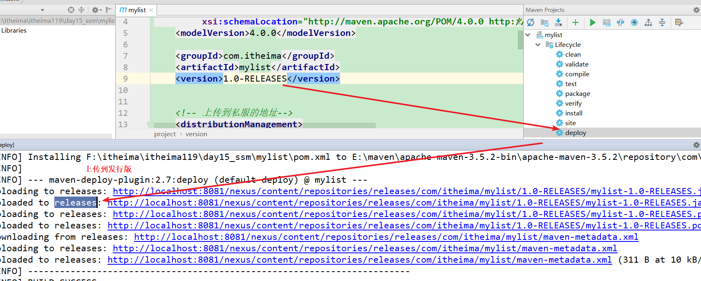
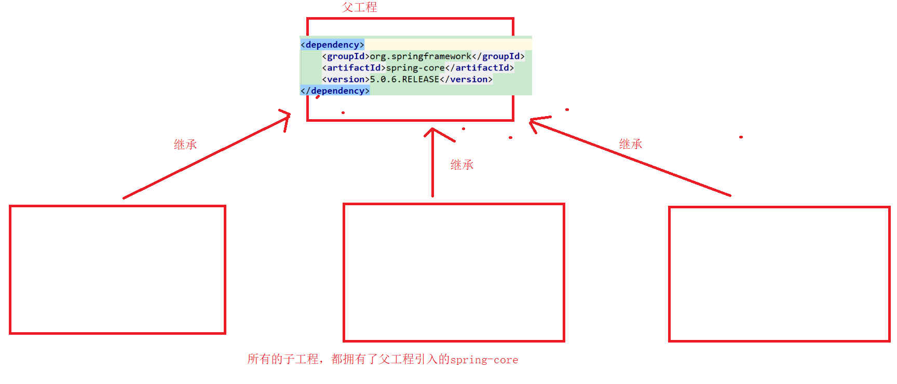

# maven课堂笔记

# 1.回顾maven基础

~~~
1maven是一款管理项目的工具
  a.声明周期的管理，编译，测试，打包等等
  b.依赖管理，插件管理
  c.分模块构建

2.maven的坐标：用来引入依赖的
  通过groupId+artifactId+version三者合一去仓库寻找依赖

3.maven的仓库
	本地仓库：个人电脑上的仓库
	私服： 第三方公司搭建的服务器
	中央仓库： maven团队维护的
~~~


# 2.私服搭建（重点理解）

## 2.1 nexus软件的安装

~~~
步骤：
1.解压
2.执行文件
~~~

解压：


私服配置文件中的端口号：


双击或者鼠标右击，管理员执行


启动成功：


## 2.2 私服的使用

### 2.2.0 访问首页

浏览器输入地址：http://localhost:8081/nexus


登录


登录成功


### 2.2.1 仓库介绍

~~~
私服中仓库类型的介绍：
group:组，所有仓库的入口
hosted:宿主仓库，用于管理非中央仓库的依赖
proxy: 代理，中央仓库的代理
virtual: maven1版本的支持，不用。

仓库介绍：
Public Repositories: 仓库组，所有仓库的统一入口。
3rd party: 宿主仓库，用于存放中央仓库没有并且是第三方公司开发的jar。
Apache Snapshots: 代理仓库，apache仓库的代理
central: 代理仓库，中央仓库的代理
Central M1 shadow : maven1版本的支持，不管
Releases: 宿主仓库，用来存放我们自己开发的依赖的发行版
Snapshots: 宿主仓库，用来存放我们自己开大的依赖的快照版

发行版（正式发布会）：解决了快照版出现的bug，不会频繁的更新。
快照版（抢先体验）：一些bug，会频繁的更新bug
~~~


### 2.2.2 从私服下载资源

~~~
演示步骤：
1.删除本地仓库中mysql依赖。
2.修改私服中central代理的远程仓库为阿里云
3.修改maven的settings配置文件中，配置私服为我们自己搭建的私服
4.打开工程，引入被删除的mysql依赖，
~~~


1.删除本地仓库中mysql依赖。


2.修改私服中central代理的远程仓库为阿里云


阿里云私服地址： http://maven.aliyun.com/nexus/content/groups/public

3.修改maven的settings配置文件中，配置私服为我们自己搭建的私服


4.打开工程，引入被删除的mysql依赖，


### 2.2.3 将资源上传到私服

#### 第三方宿主仓库 (3rd party)

~~~
用于存放阿里云没有但是是第三方开发的jar包。

演示：
1.自定义一个依赖，打成jar包，代表第三方公司的依赖
2.上传到3rd party
3.开启一个工程，引入这个依赖
4.查看引入情况即可
~~~

演示：
1.自定义一个依赖，打成jar包，代表第三方公司的依赖


2.上传到3rd party


3.开启一个工程，引入这个依赖

4.查看引入情况即可


#### 自定义快照版仓库

~~~
演示步骤：

1.自定开启maven工程，编写一个mylist工具类。并且打成jar包
2.在maven工程的pom.xml中配置远程仓库的登录用户名和密码
3.在maven的settings.xml中配置远程仓库的地址
4.deploy命令进行上传
5.再另起工程， 通过坐标引入
~~~


1.自定开启maven工程，编写一个mylist工具类。并且打成jar包


2.在maven工程的pom.xml中配置远程仓库的地址

~~~xml
<distributionManagement>
    <!--当前项目版本后缀为：RELEASES的上传目录-->
    <repository>
        <id>releases</id>
        <name>Internal Releases</name>
        <url>http://localhost:8081/nexus/content/repositories/releases/</url>
    </repository>
    <!--当前项目版本后缀为：SNAPSHOT上传目录-->
    <snapshotRepository>
        <id>snapshots</id>
        <name>Internal Snapshots</name>
        <url>http://localhost:8081/nexus/content/repositories/snapshots/</url>
    </snapshotRepository>
</distributionManagement>
~~~


3.在maven的settings.xml中配置用户名和密码

~~~xml
 <server>
        <!-- 仓库的唯一标识， -->
        <id>snapshots</id>
        <username>admin</username>
        <password>admin123</password>
    </server>
    <server>
        <id>releases</id>
        <username>admin</username>
        <password>admin123</password>
    </server>
~~~


4.deploy命令进行上传


5.再另起工程， 通过坐标引入


#### 自定义发行版仓库





上传成功


其他公共私服地址

~~~~
1、http://www.sonatype.org/nexus/  私服nexus工具使用
2、http://mvnrepository.com/ （推荐）

3、http://repo1.maven.org/maven2

4、http://maven.aliyun.com/nexus/content/groups/public/  阿里云  （强力推荐）

5、http://repo2.maven.org/maven2/ 私服nexus工具使用

6、http://uk.maven.org/maven2/

7、http://repository.jboss.org/nexus/content/groups/public

8、http://maven.oschina.net/content/groups/public/  oschina可惜啦，以前一直用这个，不过现在有阿里云来擦屁股啦

9、http://mirrors.ibiblio.org/maven2/

10、http://maven.antelink.com/content/repositories/central/

11、http://nexus.openkoala.org/nexus/content/groups/Koala-release/

12、http://maven.tmatesoft.com/content/groups/public/
~~~~


# 3.maven高级

## 3.1 依赖范围

~~~

~~~

## 3.2 依赖传递

~~~
依赖传递：
如果A依赖于B,当我们引入依赖A的时候，maven会自动的一如A所依赖的B.

例如：
spring-context 依赖于spring-core等等。
所以我们引入spring-context，会自动的引入spring-core。
~~~


## 3.3 依赖可选

~~~
A依赖于B,当我们引入A的时候，maven会自动的一如A所依赖的B。
对于我们来说，不一定需要B。所以如何解决。
1.依赖可选，A在引入B的时候，添加声明，B依赖是可选的。其他工程引入A的时候，就不会引入B了。
2.依赖排除，工程在引入A的时候，添加声明，不需要B依赖。所以就不会引入B依赖。
~~~


演示：

~~~
1.创建工程Demo_A,引入依赖Junit,配置依赖可选
2.创建工程Demo_B,引入工程Demo_A. 根据依赖传递，Demo_B应该自动的引入Junit.
~~~

1.1.创建工程Demo_A,引入依赖Junit,配置依赖可选,B工程引入A


2.A工程配置依赖可选


## 3.4 依赖排除

演示：

~~~
Demo_A工程直接引入junit，
Demo_B工程引入依赖Demo_A,Demo_B在引入Demo_A的时候，声明需要排除的依赖。
~~~


## 3.5 依赖冲突

~~~
Demo_A,Demo_B,Demo_C
Demo_A引入spring-context(5.0.6),依赖传递spring-core
Demo_B引入spring-core(4.1.2),
Demo_C引入Demo_A和Demo_B,Demo_C同时依赖spring-core的2个版本，版本冲突。

maven解决版本冲突的原则：
1.路径最短者优先。
2.路径相同，先声明者优先。
~~~

路径最短者优先演示：（ctrl+alt+u） 查看maven的依赖路径


路径相同先声明者优先

~~~
将Demo_A的依赖切换成spring-core的5.0.6的版本
~~~


# 4.ssm工程改造成分层构建

~~~
maven的继承和聚合是2个不一样的概念，此处我们分开讲，但是企业开发都是一起使用的。
~~~

## 4.1 maven的继承

### 4.1.2 父子工程的创建

~~~
java中的继承：用于抽取共性代码的
maven的继承：用于抽取公共配置的，例如：依赖。
   
 maven的继承：
 1.用于抽取公共配置
 2.方便所有子工程的依赖版本的统一维护
 3.父工程中，没有java代码。
~~~




**maven继承的演示**

~~~
步骤：
1.创建父工程Demo_parent,声明打包方式为pom.（idea工具做好了）
2.创建子工程Demo_child_A，通过标签声明父工程（idea工具做好了）
3.父工程引入依赖，mysql依赖
~~~

步骤：
1.创建父工程Demo_parent,声明打包方式为pom.（idea工具做好了）

创建普通工程：


2.创建子工程Demo_child_A，通过标签声明父工程（idea工具做好了）


此时继承相关配置，idea全部都自动配置好了

父工程打pom包


子工程中需要声明父工程


3.父工程引入依赖，mysql依赖


### 4.1.3 继承的一些应用

~~~~
父工程中：
1.针对于所有子工程需要的依赖，才去<dependencies>中声明，方便所有子工程的继承。
2.非所有子工程需要的依赖，我们在<dependencyManagement>声明，只会锁定版本，不会真的引入
   哪个子工程需要，再次编写坐标（不包含version）配置引入
3.所有依赖的版本统一在<properties>中声明。
4.插件也是上述管理操作
  
~~~~


父工程配置：

```xml
<?xml version="1.0" encoding="UTF-8"?>
<project xmlns="http://maven.apache.org/POM/4.0.0"
         xmlns:xsi="http://www.w3.org/2001/XMLSchema-instance"
         xsi:schemaLocation="http://maven.apache.org/POM/4.0.0 http://maven.apache.org/xsd/maven-4.0.0.xsd">
    <modelVersion>4.0.0</modelVersion>

    <groupId>com.itheima</groupId>
    <artifactId>Demo_parent</artifactId>
    <!-- 父工程必须打pom包 -->
    <packaging>pom</packaging>
    <version>1.0-SNAPSHOT</version>
    <modules>
        <module>Demo_child_A</module>
    </modules>


    <properties>
        <project.build.sourceEncoding>UTF-8</project.build.sourceEncoding>

        <!-- 依赖版本的统一声明-->
        <junit.version>4.12</junit.version>
        <mysql.version>5.1.38</mysql.version>
        <mybatis.version>3.4.6</mybatis.version>
    </properties>


    <dependencies>
        <!--

           1. 此处只会声明所有子工程都需要的依赖 ，例如junit测试。
           2. 对于其他依赖，maven的父工程需要做依赖版本的统一管理。
                a.将非所有子工程需要 依赖 配置到<dependencyManagement>中
                b.将所有的依赖的版本统一声明到<properties>标签中
                c.子工程需要引入依赖的话，再次声明，但是不需要做版本的配置。
        -->
        <!--<dependency>-->
            <!--<groupId>mysql</groupId>-->
            <!--<artifactId>mysql-connector-java</artifactId>-->
            <!--<version>5.1.38</version>-->
        <!--</dependency>-->
        <!-- junit是所有子工程需要的，所以配置到此处。-->
        <dependency>
            <groupId>junit</groupId>
            <artifactId>junit</artifactId>
            <version>${junit.version}</version>
        </dependency>
    </dependencies>


    <dependencyManagement>
        <!--
            不会真的去引入标签，只是用于锁定依赖的版本的。一般用于父工程，

            此处声明的依赖，不是每个子工程需要的
        -->
        <dependencies>
            <dependency>
                <groupId>org.mybatis</groupId>
                <artifactId>mybatis</artifactId>
                <version>${mybatis.version}</version>
            </dependency>

            <dependency>
                <groupId>mysql</groupId>
                <artifactId>mysql-connector-java</artifactId>
                <version>${mysql.version}</version>
            </dependency>
        </dependencies>
    </dependencyManagement>

    <build>
        <plugins>
            <!-- java编译插件 -->
            <plugin>
                <groupId>org.apache.maven.plugins</groupId>
                <artifactId>maven-compiler-plugin</artifactId>
                <version>3.2</version>
                <configuration>
                    <source>1.8</source>
                    <target>1.8</target>
                </configuration>
            </plugin>
            <!-- tomcat7插件,命令： mvn tomcat7:run -DskipTests -->
            <plugin>
                <groupId>org.apache.tomcat.maven</groupId>
                <artifactId>tomcat7-maven-plugin</artifactId>
                <version>2.2</version>
                <configuration>
                    <uriEncoding>utf-8</uriEncoding>
                    <port>8080</port>
                    <path>/</path>
                </configuration>
            </plugin>
        </plugins>
    </build>
</project>
```


子工程配置


## 4.2 maven的聚合

~~~
maven的聚合：多模块开发。
当我们的工程比较庞大的时候，此时我们一个开发者负责一个模块。
而我们之前的工程，所有的代码全部放在一起。此时也就意味着我哪怕负责单个模块，也需要将所有的代码拉取到本地。而且如果不小心动了其他模块的代码呢。
所以在针对于上述这些情况，我们针对我们的工程进行分模块构建，
例如：用户模块单独做成一个工程，订单模块单独做成一个工程，
	A组负责用户模块的开发
	B组负责订单模块的开发。
好处：
1.方便企业开发的分工合作
2.方便分布式项目的管理

说白了：maven的聚合就是将一个工程，拆分成多个工程进行管理。
如何拆分：
1.纵向拆分：
	按照项目的层次结构进行拆分。service层作为一个模块，dao层作为一个模块。	
2.横向拆分：
	按照功能模块进行拆分，用户模块，订单模块，物流模块，支付模块
~~~


上述继承时，已经使用了聚合了。


父工程中自动添加了子模块的声明：


## 4.3 ssm工程分层构建

~~~
步骤：
1.按照层次结构去拆分：

    1.ssm_parent: 父工程
    2.ssm_web: web工程，包含了controller层
    3.ssm_service: service层
    4.ssm_dao：dao层
    5.ssm_pojo:实体层

2. 设置工程的打包方式
	父工程打pom包，web工程打war包，其他工程打jar包

3. 配置模块和模块之间的依赖关系

4. 移植代码

5.测试即可

~~~

步骤：
1.按照层次结构去拆分：

    1.ssm_parent: 父工程
    2.ssm_web: web工程，包含了controller层
    3.ssm_service: service层
    4.ssm_dao：dao层
    5.ssm_pojo:实体层


2.设置工程的打包方式
	父工程打pom包，web工程打war包，其他工程打jar包


3.配置模块和模块之间的依赖关系


dao依赖于pojo


service依赖于dao


web依赖于service


web工程需要的代码


4.移植代码


父工程的pom.xml，依赖管理偷懒

```xml
<dependencies>
    <!-- 驱动-->
    <dependency>
        <groupId>mysql</groupId>
        <artifactId>mysql-connector-java</artifactId>
        <version>5.1.38</version>
    </dependency>
    <!-- mybatis依赖-->
    <dependency>
        <groupId>org.mybatis</groupId>
        <artifactId>mybatis</artifactId>
        <version>3.4.6</version>
    </dependency>
    <!-- junit测试-->
    <dependency>
        <groupId>junit</groupId>
        <artifactId>junit</artifactId>
        <version>4.12</version>
    </dependency>
    <!-- spring的ioc相关-->
    <dependency>
        <groupId>org.springframework</groupId>
        <artifactId>spring-context</artifactId>
        <version>5.0.6.RELEASE</version>
    </dependency>
    <!-- 德鲁伊连接池-->
    <dependency>
        <groupId>com.alibaba</groupId>
        <artifactId>druid</artifactId>
        <version>1.0.9</version>
    </dependency>
    <!-- mybatis和spring整合的工具类，必须要求1.3以上-->
    <dependency>
        <groupId>org.mybatis</groupId>
        <artifactId>mybatis-spring</artifactId>
        <version>1.3.0</version>
    </dependency>
    <!-- spring的单元测试-->
    <dependency>
        <groupId>org.springframework</groupId>
        <artifactId>spring-test</artifactId>
        <version>5.0.6.RELEASE</version>
    </dependency>
    <!-- spring对于数据库的支持-->
    <dependency>
        <groupId>org.springframework</groupId>
        <artifactId>spring-jdbc</artifactId>
        <version>5.0.6.RELEASE</version>
    </dependency>
    <!-- 日志 -->
    <dependency>
        <groupId>org.slf4j</groupId>
        <artifactId>slf4j-log4j12</artifactId>
        <version>1.6.1</version>
    </dependency>
    <!-- webmvc相关-->
    <dependency>
        <groupId>org.springframework</groupId>
        <artifactId>spring-webmvc</artifactId>
        <version>5.0.6.RELEASE</version>
    </dependency>
    <!--servlet-->
    <dependency>
        <groupId>javax.servlet</groupId>
        <artifactId>javax.servlet-api</artifactId>
        <version>3.0.1</version>
        <scope>provided</scope>
    </dependency>
    <!-- jstl标签-->
    <dependency>
        <groupId>jstl</groupId>
        <artifactId>jstl</artifactId>
        <version>1.2</version>
    </dependency>


</dependencies>
```

5.测试即可

~~~
注意：
此处必须点击install，因为我们模块的依赖，是依赖的本地仓库中的模块，所以当我们代码复制之后，要把最新的代码安装包本地仓库，然后才能进行打包。要不然打的war包，里面没有java文件的。
~~~


小结；

~~~
一定要注意我们修改了某个模块的代码，一定要将模块通过install更新到本地仓库
~~~


# 5.总结

~~~
1.私服的搭建，操作一遍，理解私服中各种仓库的含义。
2.maven的高级特性：
	a.依赖范围
	b.依赖传递： A依赖B,工程引入依赖A，那么工程也会引入依赖B
	c.解决传递依赖
	   1).依赖可选 <optional>true</...>
	   2).依赖排除   <exclusions></exclusions>
	d.依赖冲突： A依赖mysql，B也依赖mysql，C引入A和B,所以C会依赖mysql的2个版本。冲突！！！
       maven解决冲突的远侧：
       	1.最短路径者优先
       	2.路径相同，先声明者优先
3.maven的继承和聚合：
	maven继承：用于抽取相同配置的。一般用于管理所依赖和插件的版本的。
	maven的聚合：将工程拆分成多个模块，方便企业开发的分工合作，方便分布式项目的模块之间的管理。
	企业开发：继承和聚合都是一起使用的。
	
	
一定要注意我们修改了某个模块的代码，一定要将模块通过install更新到本地仓库	
~~~


