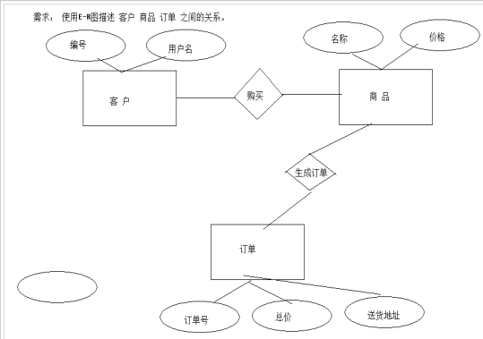
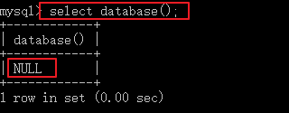
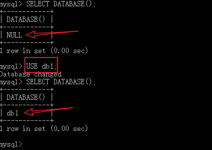
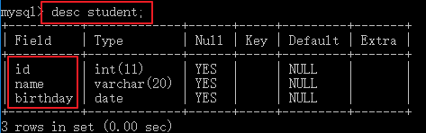
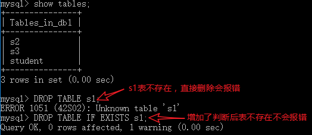
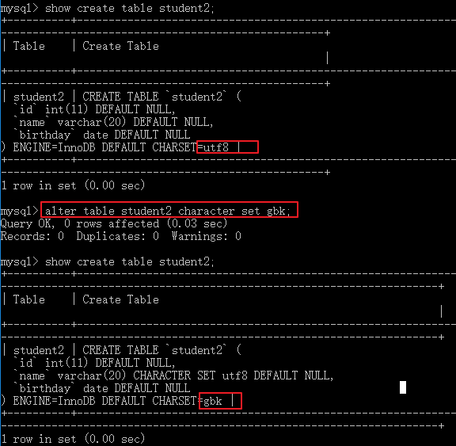
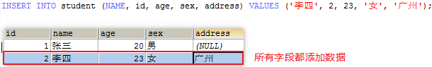
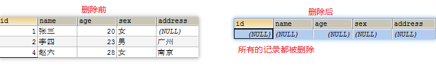
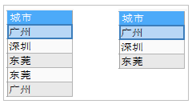

# MYSQL基础语法

## 学习目标
1. 能够理解数据库的概念
2. 能够安装MySQL数据库
3. 能够启动,关闭及登录MySQL
4. 能够使用SQL语句操作数据库
5. 能够使用SQL语句操作表结构
6. 能够使用SQL语句进行数据的添加修改和删除的操作(掌握)
7. 能够使用SQL语句简单查询数据(掌握)


# 学习内容
## 1.数据库的基本知识

### 目标

1. 能够掌握数据库的概念
2. 能够说出常用的数据库

### 讲解

#### 什么是数据库

保存数据的仓库。它体现我们电脑中，就是一个软件或者文件系统。然后把数据都保存这些特殊的文件中，并且需要使用固定的语言（**SQL语言/语句**）去操作文件中的数据。

### 数据的存储方式

需求：开发一个学生选课系统，学生系统中含有学生信息、老师信息、课程信息。需要将关系和数据进行保存，保存到哪里合适呢？

1. **数据保存在内存**

   ```java
   Student s = new Student("张三",18,"上海");
   Teacher t = new Teacher("锁哥",19,"上海");
   Course c = new Course("语文",90);
   ```

   new出来的对象存储在堆中.堆是内存中的一小块空间

   优点：存储速度快
   缺点：断电/程序退出,数据就清除了

2. **数据使用IO流技术保存在硬盘的普通文件中**
   优点：永久保存
   缺点：IO流的查找，增加，修改，删除数据比较麻烦。同时使用IO流技术需要频繁调用系统资源和将系统资源还给系统，这样操作效率比较低

3. **数据保存在数据库**
   优点：永久保存,通过SQL语句比较方便的操作数据库。是方式一和方式二的结合。可以解决上述两种方式的缺点。

#### 数据库的优点
​	数据库是按照特定的格式将数据存储在文件中，通过SQL语句可以方便的对大量数据进行增、删、改、查操作，数据库是对大量的信息进行管理的高效的解决方案。

#### 常见数据库
​	我们开发应用程序的时候，程序中的所有数据，最后都需要保存到专业软件中。这些专业的保存数据的软件我们称为数据库。我们学习数据库，并不是学习如何去开发一个数据库软件，我们学习的是如何使用数据库以及数据库中的数据记录的操作。而数据库软件是由第三方公司研发。

**Oracle**：它是Oracle公司的大型关系型数据库。系统可移植性好、使用方便、功能强，适用于各类大、中、小、微机环境。它是一种高效率、安全可靠的。但是它是收费的。
**MYSQL**：早期由瑞典一个叫MySQL AB公司开发的，后期被sun公司收购，再后期被Oracle收购。体积小、速度快、总体拥有成本低，尤其是[开放源码](https://baike.baidu.com/item/%E5%BC%80%E6%94%BE%E6%BA%90%E7%A0%81)这一特点，一般中小型网站的开发都选择 MySQL 作为网站数据库。MySQL6.x版本也开始收费。
**DB2** ：IBM公司的数据库产品,收费的。常应用在银行系统中.
**SQLServer**：MicroSoft 公司收费的中型的数据库。C#、.net等语言常使用。
**SyBase**：Sybase公司的。 已经淡出历史舞台。提供了一个非常专业数据建模的工具PowerDesigner。

**常用数据库**：Java开发应用程序主要使用的数据库：MySQL（5.6）、Oracle、DB2。
在web应用中，使用的最多的就是MySQL数据库，原因如下：

1. 开源、免费
2. 功能足够强大，足以应付web应用开发（最高支持千万级别的并发访问）

### 小结

1. 说出数据库的概念：存储数据的仓库
2. 说出常用的数据库：MYSQL, Oracle,DB2

## 2.关系型数据库 

在开发软件的时候，软件中的数据之间必然会有一定的关系存在。比如商品和客户之间的关系，一个客户是可以买多种商品，而一种商品是可以被多个客户来购买的。

需要把这些数据保存在数据库中，同时也要维护数据之间的关系，这时就可以直接使用上述的那些数据库。而上述的所有数据库都属于关系型数据库。

关系型数据：设计数据库的时候，需要使用E-R实体关系图来描述。 

E-R 是两个单词的首字母，E表示Entity 实体   R表示Relationship  关系。

实体：可以理解成我们Java程序中的一个对象。比如商品，客户等都是一个实体对象。在E-R图中使用 矩形(长方形) 表示。

属性：实体对象中是含有属性的，比如商品名、价格等。针对一个实体中的属性，我们称为这个实体的数据，在E-R图中使用椭圆表示。

关系：实体和实体之间的关系：在E-R图中使用菱形表示。

需求： 使用E-R图描述 客户、商品、订单之间的关系。

 


## 3.数据库的安装

### 目标

能够安装mysql数据库软件

### 讲解

安装过程：

1．在今天的资料下有Mysql的安装包,找到如下所示文件后双击

```
mysql-installer-community-5.6.22.0.msi
```

2.双击之后会出现如下图所示界面，询问是否同意，将我同意的选框勾选上，然后点击next,如下：


3.选择自定义安装,点击下一步


4.根据电脑配置选择要安装的MySql版本,然后点击next


5.如果出现当前界面,则可以配置安装目录,如果出现的不是这个界面请点击Back返回


6.点击back返回后,点击高级选项,配置安装路径,配置成功后点击下一步


说明：安装路径最好不要有中文和空格以及特殊符号。

注意：一定要保证Install  Directory和data  Directory保存的路径一致，这样才可以保证卸载MySql的时候会很方便。


7.当出现绿色对号时表名安装成功,然后点击下一步


8.开始配置mysql,点击下一步


9.配置MySql开发模式以及端口号相关配置,然后点击下一步


说明：MySql默认端口是3306.这里不要修改，我们访问数据库的时候输入端口号3306即可。

10.设置密码账户信息,然后点击next


11.使用默认配置就可以了,然后点击下一步


12.日志配置


13.点击Execute安装


14.全部画上绿色对勾之后,安装成功点击finish->next->finish


15.配置环境变量,找到MySql的安装目录的bin目录下,将路径复制下来


16.打开电脑的高级设置中的 path 路径,将复制的路径添加进去


### 小结

1. MySQL安装过程的步骤：
   按照上述一步一步安装即可
2. MySQL端口号是：3306
3. 管理员名字：root
4. 将mysql的bin目录配置到path环境变量中

## 4.命令行客户端连接服务器(测试是否安装成功)

### 目标

1. 能够打开和关闭mysql服务
2. 能够连接到mysql

### 讲解

**1、打开和关闭mysql服务.**

查看windows服务 ，mysql数据库是否启动。


**2、连接mysql**


​	MySQL是一个需要账户名密码登录的数据库，登陆后使用，它提供了一个默认的root账号，使用安装时设置的密码即可登录
1. 登录格式1：`mysql -u用户名 -p密码`
   例如：

   ```sql
   mysql -uroot -p1234
   ```

   在打开的dos窗口中输入mysql -uroot -p命令：

   

   
   后输入密码方式：

   ```sql
   mysql -u root -p
   下一行输入密码
   ```

   

2. 登录格式2：

    **mysql** **[**-h 连接的主机ip -P端口3306**]** **-u 用户名 -p 密码**

   例如：

   ```sql
    mysql -h 192.168.1.251 -P 3306 -u root -p 1234 
   ```

   ​    如果连接的是本机：可以省略 -h  -P  主机IP和端口。这样就可以登录mysql数据库了。

3. 退出MySQL：`exit`
   

### 小结

1. 打开和关闭mysql服务？
2. 连接到本机的mysql？mysql -uroot -p1234
3. 连接到指定主机的mysql？ **mysql** **[**-h 连接的主机ip -P端口3306**]** **-u 用户名 -p 密码**

## 5、图形界面SQLyog客户端

### 目标

1. 能够掌握SQLyog的安装
2. 能够使用SQLyog连接mysql数据库

### 讲解


​	在dos窗口中使用sql语句操作mysql数据库相对来说，太麻烦了，我们在实际开发中不会使用dos窗口来操作的，一定要使用可视化工具来操作mysql数据库，而会有多种可视化工具来操作mysql数据库，比如：Navicat、SQLyog等。我们这里使用SQLyog可视化工具。


1.解压和安装：

 

 

2.如果是第一次使用，会弹出一个提示框，需要输入注册码。注册码在如下文件夹中。

 

 

3.输入完成之后，创建桌面快捷方式，然后打开该可视化界面软件。会出现如下图所示界面：

 

 

点击链接：

 

然后就会弹出如下界面：

 


### 小结

2. 使用SQLyog连接mysql? 在链接界面输入数据账号,密码,端口号
3. 如果ip地址是localhost连接不上数据库，可以使用127.0.0.1尝试

## 6、卸载

1、找到mysql的安装目录：在mysql的安装目录中。找到my.ini 文件。


找到datadir 并且记录路径。 

```
datadir="D:/MySoft/MySql2/data/Data/"
```

说明：

​	1）datadir路径是用来保存mysql的数据文件的目录，以后我们向Mysql数据库存储的数据都会存放到这个路径；

​	2）在安装数据库的时候，要求这个路径的下的data文件夹要和数据库在同一文件夹下，这样在卸载的时候会比较方便，直接删除即可。如果没有安装到同一目录，那么找到该data文件夹进行删除；

2、在电脑左下角window图标处-----》右键----》选择控制面板；

3、找到程序和功能；

4、找到Mysql---->卸载mysql

5、删除mysql的安装目录，删除mysql的数据文件目录datadir.第一步中记录的文件目录。

注意：mysql默认的数据文件目录，在ProgramData这个目录下，并且ProgramData这个目录是隐藏目录，需要设置显示隐藏目录。

删除ProgramData下的mysql的相关目录。

6、打开运行窗口-----》输入regedit----》打开注册表-----》删除

HKEY_LOCAL_MACHINE\SYSTEM\ControlSet001\Services\Eventlog\Application\MySQL文件夹

注意：一般情况下执行前5步即可，如果还不能安装，就执行步骤6，运行regedit,试着删除注册表中的数据，或者也可以使用360或者安全管家清理垃圾试试。

## 7、服务器与数据库、表、记录的关系

### 目标

能够理解mysql服务器与数据库、表、记录的关系

### 讲解


#### 实体类与表的对应关系


说明：

1、一个数据库软件可以安装多个数据仓库，数据仓库可以简称为数据库，在数据库中创建数据表来保存数据。

2、数据库的一行称为记录，可以理解成java实例化后的一个对象。

3、数据库的一列称为字段，理解成java类中的属性。

4、一个数据仓库中是可以有多张表的。

未来关于数据库我们学习的目标：

1）对数据库进行增删改查(CRUD);(主要对整个数据库进行操作，比如删除一个数据库和增加一个数据库)。create(增) read(查) update(改) delete(删)

2）对数据表结构进行增删改查(CRUD);(主要对整张表，比如删除一张表和增加一张表)。

3）**对表中的数据进行增删改查(CRUD);(主要对表中的具体数据，比如删除一个表中的一行记录和增加一行数据)。**

注意：关于对数据库表的操作，查询是开发中最难的，也是最重要的；

### 小结

一个数据库软件，可以管理多个数据仓库（数据库）。

一个数据仓库可以管理多张数据表。

每个数据表中可以存储多行数据记录。

提示：每创建一个数据仓库，会在mysql的数据文件目录(data)中多一个文件夹。


## 8、SQL语句的分类和语法

### 目标

1. 能够掌握SQL的概念和作用

### 讲解

#### 什么是SQL
Structured Query Language结构化查询语言。SQL语句不依赖于任何平台，对所有的数据库是通用的。学会了SQL语句的使用，可以在任何的数据库使用,但都有特有内容。SQL语句功能强大、[简单](http://baike.baidu.com/subview/66543/5094958.htm)易学、使用方便。

#### SQL特点

SQL语句是一个非过程性的语言，每一条SQL执行完都会有一个具体的结果出现。多条语句之间没有影响。

过程性语言：例如java。

int a = 10;

int b = 20;

int sum = a +b;

#### SQL作用

SQL语句主要是操作数据库，数据表，**数据表中的数据记录**。

#### SQL语句分类

SQL是用来存取关系数据库的语言，具有定义、操纵、控制和查询关系型数据库的四方面功能。所以针对四方面功能，我们将SQL进行了分类。

1. DDL(Data Definition Language)数据定义语言
   用来定义数据库对象：数据库，表，列等。关键字：create drop alter truncate(清空数据记录) show等

2. DML(Data Manipulation Language)数据操作语言★★★

   在数据库表中更新，增加和删除记录。如 update(更新)， insert(插入)， delete(删除) 不包含查询

3. DQL(Data Query Language) 数据查询语言★★★★★
   数据表记录的查询。关键字select。

4. DCL(**Data Control Language**)数据控制语言(了解)

   是用来设置或更改数据库用户或角色权限的语句，如grant(设置权限)，revoke(撤销权限)，begin transaction等。这个比较少用到。

#### SQL学习方向

我们学习SQL语句的路线：

1、学习SQL数据对数据库的操作；

2、学习SQL语句对数据表整体结构的操作；

3、学习SQL语句对数据表中的数据记录操作(★★★★★)；

4、数据仓库中的数据备份和恢复；

#### SQL通用语法
1. SQL语句可以单行或多行书写，以分号结尾。

2. 可使用空格和缩进来增强语句的可读性。

3. MySQL数据库的SQL语句不区分大小写，关键字开发中一般大写。
   ```sql
   SELECT * FROM student;
   ```

4. 3种注释
   单行注释: -- 注释内容
   多行注释: /* 注释 */

   **\#** 注释内容(mysql特有的单行注释)
### 小结

1. SQL的作用？对数据库进行操作的语句,增删改查
2. SQL的分类？
   DDL:操作数据和表
   DML:对表中的记录进行增删改
   DQL:对表中的记录进行查询
3. SQL的语法特点？
   可以写一行,也可以写成多行,最好是以;结尾
   关键字建议大写
   可以任意缩进
   单行注释: -- 开头  # 开头
   多行注释: /* */

## 9、DDL创建数据库

### 目标

能够掌握创建数据库的三种语法

### 讲解

#### 创建数据库

1. 直接创建数据库

   ```sql
   CREATE DATABASE 数据库名;
   ```

2. 判断是否存在并创建数据库

   ```sql
   CREATE DATABASE IF NOT EXISTS 数据库名;
   ```

3. 创建数据库并指定字符集(编码表)

   ```sql
   CREATE DATABASE 数据库名 character set 字符集;
   说明：字符集就是编码表名。在mysql中utf8 latin1 
   ```

4. 具体操作：
* 直接创建数据库db1
  ```sql
  CREATE DATABASE db1;
  ```
  

* 判断是否存在并创建数据库db2
  ```sql
  CREATE DATABASE IF NOT EXISTS db2;
  ```
  

* 创建数据库db3并指定字符集为gbk
  ```sql
  CREATE DATABASE db2 CHARACTER SET gbk;
  ```
  

#### 查看数据库
1. 查看所有的数据库
```sql
SHOW DATABASES;
```
   
2. 查看某个数据库的定义信息
```sql
SHOW CREATE DATABASE 数据库名;
```
   

### 小结

1. 创建数据库语法：CREATE DATABASE 数据库名;
2. 查看有哪些数据库：SHOW DATABASES;

## 10、DDL修改和删除数据库

### 目标

1. 能够修改数据库的字符集
2. 能够删除数据库

### 讲解

#### 修改数据库字符集

```sql
ALTER 表示修改：
ALTER DATABASE 数据库 default character set 新的字符集;
```

具体操作：
* 将db3数据库的字符集改成utf8
  ```sql
  ALTER DATABASE db3 DEFAULT CHARACTER SET utf8;
  ```
  注意：如果修改数据库指定的编码表是utf8,记住不能写utf-8.。utf-8 是错误的

  (mysql不认识utf-8)。

  java中的常用编码        :      UTF-8; GBK;GB2312;ISO-8859-1;

  对应mysql数据库中的编码: utf8;  gbk;gb2312; latin1;

  
#### 删除数据库

```sql
drop --表示删除数据库或表
DROP DATABASE 数据库名;
```

具体操作：
* 删除db2数据库
  ```sql
  DROP DATABASE db2;
  ```
  

### 小结

1. 修改数据库的字符集格式？alter database 数据库 character set 新的字符集;
2. 删除数据库格式？drop database 数据库名;

## 11、DDL使用数据库

### 目标

1. 能够掌握切换数据库语法
2. 能够查看正在使用的数据库

### 讲解

1.查看正在使用的数据库

```sql
select -- 查询
SELECT DATABASE();
```

2.使用/切换数据库

```sql
USE 数据库名;
```

具体操作：
* 查看正在使用的数据库
  ```sql
  SELECT DATABASE();
  ```
  
* 使用db1数据库
  ```sql
  USE db1;
  ```
  

### 小结

| DDL语句操作 | 关键字                               |
| ----------- | ------------------------------------ |
| 创建        | create database 数据库名;            |
| 修改        | alter database character set 字符集; |
| 查看        | show databases;                      |
| 删除        | drop database 数据库名;              |


## 12、DDL创建表

### 目标

1. 能够掌握SQL创建表

### 讲解

>**前提先使用某个数据库**（db1）
#### 创建表
```sql
CREATE TABLE 表名 (字段名1 字段类型1, 字段名2 字段类型2...);
```

建议写成如下格式:
```sql
javase
public class Student{
	int age;
}
CREATE TABLE 表名 (
    字段名1 字段类型1, 
    字段名2 字段类型2
);
最后一个字段不加逗号
```
关键字说明：
```sql
CREATE -- 表示创建
TABLE -- 表示表
```
#### MySQL数据类型

MySQL中的我们常使用的数据类型如下：


详细的数据类型如下(不建议详细阅读！)


具体操作: 

创建student表包含id,name,birthday字段

```sql
CREATE TABLE student (
      id INT,
      name VARCHAR(20),
      birthday DATE
);
```

### 小结

1. 创建表语句：CREATE TABLE 表名 (字段名 类型, 字段名 字段类型...);
2. 常用数据类型：int, double, varchar, date

## 13、DDL查看表

### 目标

1. 能够查看某个数据库中的所有表
2. 能够查看表结构

### 讲解

1. 查看某个数据库中的所有表

   ```sql
   SHOW TABLES;
   ```

2. 查看表结构

   ```sql
   DESC 表名;
   ```

3. 查看创建表的SQL语句

   ```sql
   SHOW CREATE TABLE 表名;
   ```

  具体操作：
* 查看mysql数据库中的所有表
  ```sql
  SHOW TABLES;
  ```
  

* 查看student表的结构
  ```sql
  DESC student;
  ```
  
* 查看student的创建表SQL语句
  ```sql
  SHOW CREATE TABLE student;
  ```
  

### 小结

1. 查看某个数据库中的所有表：show tables;
2. 查看表结构：desc 表名;
3. 查看创建表的SQL语句：show create table 表名;

## 14、DDL删除表

### 目标

1. 能够掌握删除表语法
2. 能够掌握快速创建一个表结构相同的表

### 讲解

#### 快速创建一个表结构相同的表

```sql
CREATE TABLE 表名 LIKE 其他表;
```

具体操作：

- 创建s1表，s1表结构和student表结构相同

  ```sql
  CREATE TABLE s1 LIKE student;
  ```


#### 删除表

1. 直接删除表

   ```sql
   DROP TABLE 表名;
   ```

2. 判断表是否存在并删除表

   ```sql
   DROP TABLE IF EXISTS 表名;
   ```

具体操作：
* 直接删除表s1表
  ```sql
  DROP TABLE s1;
  ```
  
* 判断表是否存在并删除s1表
  ```sql
  DROP TABLE IF EXISTS s1;
  ```
  

### 小结

1. 快速创建一个表结构相同的表：CREATE TABLE 表名 LIKE 其他表;
2. 删除表语法：DROP TABLE 表名;

## 15、DDL修改表结构(了解)

### 目标

能够掌握修改表结构的语法

### 讲解

> 修改表结构使用不是很频繁，只需要了解，等需要使用的时候再回来查即可
1. 添加表列

   ```sql
   ALTER TABLE 表名 ADD 字段名/列名 类型;
   ```

   具体操作：
   * 为学生表添加一个新的字段remark,类型为varchar(20)
     ```sql
     ALTER TABLE student ADD remark VARCHAR(20);
     ```
     

2. 修改列类型

   ```sql
   ALTER TABLE 表名 MODIFY 字段名 新的类型;
   ```

   具体操作：

   * 将student表中的remark字段的改成varchar(100)
     ```sql
     ALTER TABLE student MODIFY remark VARCHAR(100);
     ```
     

3. 修改列名

   ```sql
   ALTER TABLE 表名 CHANGE 旧字段名 新字段名 类型;
   ```

   具体操作：

   * 将student表中的remark字段名改成intro，类型varchar(30)
     ```sql
     ALTER TABLE student CHANGE remark intro varchar(30);
     ```
     

4. 删除列

   ```sql
   ALTER TABLE 表名 DROP 字段名;
   ```

   具体操作：

   * 删除student表中的字段intro
     ```sql
     ALTER TABLE student DROP intro;
     ```
     

5. 修改表名

   ```sql
   RENAME TABLE 旧表名 TO 新表名;
   ```

   具体操作：

   * 将学生表student改名成student2.
     ```sql
      RENAME TABLE student TO student2;
     ```
     

6. 修改字符集

   ```sql
   ALTER TABLE 表名 character set 字符集;
   ```

   具体操作：

   * 将sutden2表的编码修改成gbk
     ```sql
     ALTER TABLE student2 character set gbk;
     ```
      

### 小结

1. 所有修改表前面的语法都是相同的？ALTER TABLE 表名
2. 添加一列：add 字段名 类型
3. 修改类型：modify 字段名 新的类型
4. 修改字段名和类型：change 旧字段名 新字段名 类型
5. 删除一列：drop 字段名


## 16、使用SQLyon操作数据库

### 目标

使用SQLyon操作数据库

### 讲解

​	在dos窗口中使用sql语句操作mysql数据库相对来说，太麻烦了，我们在实际开发中不会使用dos窗口来操作的，一定要使用可视化工具SQLyon来操作mysql数据库的。而上述我们为了简单熟悉sql语句，所以一直在dos窗口中操作mysql,而接下来我们要在SQLyon中操作mysql数据库了。

1.简单熟悉下可视化工具。

 

2.一般的可视化工具，都能从界面看到 数据库-》数据库表-》表数据。

 

6.在可视化工具中给内容添加注释快捷键是：ctrl+shift+c

 

这样我们就简单熟悉了下可视化工具，接下来我们所有的操作都会在该可视化工具中进行操作。

## 17、DML插入记录(重点)

### 目标

能够掌握往表中添加记录

### 讲解

创建student表包含id,name,age,birthday,sex,address字段。

```sql
CREATE TABLE student (
      id INT,
      name VARCHAR(20),
      age int,
      birthday DATE,
      sex char(2),
      address varchar(50)
);
```

#### 插入全部字段
* 所有的字段名都写出来

  ```sql
  INSERT -- 表示往表里插入记录
  INSERT INTO 表名 (字段名1, 字段名2...) VALUES (字段值1, 字段值2...);
  ```

* 不写字段名

  ```sql
  INSERT INTO 表名 VALUES (字段值1, 字段值2...);
  ```

#### 插入部分数据
```sql
INSERT INTO 表名 (字段名1, 字段名2...) VALUES (字段值1, 字段值2...);
```

说明：插入部分数据的时候，要求列名一定书写出来。

#### 批量插入数据

~~~sql
INSERT INTO 表名 values(字段值1, 字段值2...),(字段值1, 字段值2...),(字段值1, 字段值2...);
~~~


没有添加数据的字段会使用NULL

1. 关键字说明
   ```sql
   INSERT INTO 表名 – 表示往哪张表中添加数据
   (字段名1, 字段名2, …)  --  要给哪些字段设置值
   VALUES (值1, 值2, …); -- 设置具体的值
   注意：使用   select * from 表名 --查看该表的所有信息。
   ```

2. 具体操作:

   * 插入部分数据，往学生表中添加 id, name, age, sex数据
   ```sql
   INSERT INTO student (id, name, age, sex) VALUES (1, '张三', 20, '男');
   ```
   

   * 向表中插入所有字段
     * 所有的字段名都写出来
     ```sql
      INSERT INTO student (id, name, age, sex, address) VALUES (2, '李四',  23, '女', '广州');
     ```
     

     * 不写字段名
     ```sql
     INSERT INTO student VALUES (3, '王五', 18, '男', '北京');
     ```
     
     
     批量插入数据
     
     ~~~sql
     INSERT INTO student VALUES (4, '赵六', 18, '男', '上海'),(5, '田七', 20, '男', '杭州');
     ~~~

#### 注意

> - 值与列一一对应。有多少个列，就需要写多少个值。如果某一个列没有值。可以使用null。表示插入空。
>
> - 值的数据类型，与列被定义的数据类型要相匹配。并且值的长度，不能够超过定义的列的长度。
>
> - 字符串：插入字符类型的数据，建议写英文单引号括起来。在mysql中，使用单引号表示字符串
>
> - date 时间类型的数据也得使用英文单引号括起来： 如’yyyy-MM-dd’
>
>   


### 小结

1.向表中添加一条完整记录：
所有的字段都写出来: INSERT INTO 表名 (字段1, 字段2, ....) VALUES (值1, 值2, ...);

```
insert into student(id,name,birthday,sex,address) values(1,"幂幂",'2000-10-10','女','上海');
```

**2.不写字段名: INSERT INTO 表名 VALUES  (值1, 值2, ...);**开发使用

```
insert into student values(3,'冰冰',null,'女','北京');
```

3.向表中添加一条记录部分列：必须写字段名,否则不知道添哪个字段.
INSERT INTO 表名 (字段1, 字段2, ....) VALUES (值1, 值2, ...);

```
insert into student(id,name,address) values(2,'岩岩','湖南');
```

4.批量插入数据

~~~
INSERT INTO 表名 values(字段值1, 字段值2...),(字段值1, 字段值2...),(字段值1, 字段值2...)
~~~


## 18、DML更新表记录

### 目标

能够掌握更新表记录

### 讲解

1. 不带条件修改数据

   ```sql
   UPDATE 表名 SET 字段名=新的值,字段名=新的值,..;
   ```

2. 带条件修改数据

   ```sql
   UPDATE 表名 SET 字段名=新的值,字段名=新的值,.. WHERE 条件
   ```

3. 关键字说明
   ```sql
   UPDATE: 表示修改记录 
   SET: 要改哪个字段
   WHERE: 设置条件
   ```

4. 具体操作：
   * 不带条件修改数据，将所有的性别改成女
     ```sql
     UPDATE student SET sex='女';
     ```
     

   * 带条件修改数据，将id号为2的学生性别改成男
     ```sql
     UPDATE student SET sex='男' WHERE id=2;
     ```
     

   * 一次修改多个列，把id为3的学生，年龄改成26岁，address改成北京
     ```sql
     UPDATE student SET age=26, address='北京' WHERE id=3;
     ```
     

### 小结

1. 不带条件的更新数据库记录：UPDATE 表名 SET 字段名=新的值;
2. 带条件：UPDATE 表名  SET 字段名=新的值 WHERE 条件;

## 19、DML删除表记录

### 目标

能够掌握删除表记录

### 讲解

1. 不带条件删除数据

   ```sql
   DELETE -- 删除记录
   DELETE FROM 表名;
   表还在，可以操作，只是删除数据。
   ```

2. 带条件删除数据

   ```sql
   DELETE FROM 表名 WHERE 条件;
   ```

3. truncate删除表记录 属于DDL

   ```sql
   TRUNCATE TABLE 表名;
   ```

   >truncate和delete的区别：
   >* delete是将表中的数据一条一条删除
   >* truncate是将整个表摧毁，重新创建一个新的表,新的表结构和原来表结构一模一样
   >  

4. 具体操作：
   * 带条件删除数据，删除id为3的记录
     ```sql
     DELETE FROM student WHERE id=3;
     ```

     

   * 带条件删除数据，删除id为1和2的记录
   
   ~~~
   DELETE FROM student WHERE id in(1,2);
   ~~~
   
   
   
   * 不带条件删除数据,删除表中的所有数据
     
     ```sql
     DELETE FROM student;
     ```
     

### 小结

1. 指定条件删除：DELETE FROM 表名 WHERE 条件;
2. 没有条件删除所有的记录：DELETE FROM 表名;
3. 删除表结构再创建表：TRUNCATE TABLE 表名;

## 20、DQL没有条件的简单查询

### 目标

能够掌握简单查询

### 讲解

>注意：查询不会对数据库中的数据进行修改，只是一种显示数据的方式。
#### 查询表中所有列数据
1. 写出查询每列的名称
```sql
SELECT -- 表示查询
SELECT 字段名1, 字段名2, ... FROM 表名;
```
   具体操作：

   ```sql
SELECT id, name ,age, sex, address FROM student;
   ```
   

2. 使用*表示所有列

   ```sql
   SELECT * FROM 表名;
   ```

   具体操作：

   ```sql
   SELECT * FROM student;
   ```
   

#### 查询表中指定列数据

查询指定列的数据,多个列之间以逗号分隔
```sql
SELECT 字段名1, 字段名2 FROM 表名;
```

具体操作：
查询student表中的name 和 age 列

```sql
SELECT name, age FROM student;
```


#### 别名查询
1. 查询时给列、表指定别名需要使用AS关键字
2. 使用别名的好处是方便观看和处理查询到的数据
   `SELECT 字段名1 AS 别名, 字段名2 AS 别名... FROM 表名;`
   `SELECT 字段名1 AS 别名, 字段名2 AS 别名... FROM 表名 AS 表别名;`
   注意:

   >查询给表取别名目前还看不到效果，需要到多表查询的时候才能体现出好处
   >AS关键字可以省略

3. 具体操作：
   * 查询sudent表中name 和 age 列，name列的别名为”姓名”，age列的别名为”年龄”
   ```sql
   SELECT NAME AS 姓名, age AS 年龄 FROM student;
   ```
   

#### 清除重复值
1. 查询指定列并且结果不出现重复数据

   ```sql
   SELECT DISTINCT 字段名,字段名,.. FROM 表名;
   ```

2. 具体操作：
   * 查询address列并且结果不出现重复的address
   ```sql
   SELECT DISTINCT address 城市 FROM student;
   ```
   

#### 查询结果参与运算
1. 某列数据和固定值运算

   ```sql
   SELECT 列名1 FROM 表名;
   SELECT 列名1 + 固定值 FROM 表名;
   ```

2. 某列数据和其他列数据参与运算

   ```sql
   SELECT 列名1 + 列名2 FROM 表名;
   ```

   >注意: 参与运算的必须是数值类型

3. 需求：
   * 添加数学，英语成绩列，给每条记录添加对应的数学和英语成绩
   * 查询的时候将数学和英语的成绩相加

4. 实现：

* 修改student表结构,添加数学和英语成绩列
  ```sql
  ALTER TABLE student ADD math INT;
  ALTER TABLE student ADD english INT;
  ```
* 给每条记录添加对应的数学和英语成绩
     
* 查询math + english的和
  ```sql
  SELECT math + english FROM student;
  ```
  

  >结果确实将每条记录的math和english相加，但是效果不好看

* 查询math + english的和使用别名”总成绩”
  ```sql
  SELECT math + english 总成绩 FROM student;
  ```
  

* 查询所有列与math + english的和并使用别名”总成绩”
  ```sql
  SELECT *, math + english 总成绩 FROM student;
  ```
  

* 查询姓名、年龄，将每个人的数学增加10分
  ```sql
  SELECT name, age,math + 10 FROM student;
  ```

### 小结

1. 简单查询格式：SELECT 字段名,字段名.... FROM 表名;
2. 定义别名：SELECT 字段名 AS 别名 FROM 表名;
3. 去除重复行：SELECT DISTINCT 字段名  FROM 表名;
4. 数值列，可以进行计算，不会影响表中数据

| DML和简单DQL语句操作 | 关键字                                                    |
| -------------------- | --------------------------------------------------------- |
| 添加                 | INSERT INTO 表名 (字段名...) VALUES (值...);              |
| 修改                 | UPDATE 表名 SET 字段名=新的值 ,字段名=新的值..WHERE 条件; |
| 删除                 | DELETE  FROM 表名 WHERE 条件; truncate table 表名         |
| 查询                 | SELETE 字段名,字段名  FROM 表名;                          |

## 21、蠕虫复制

### 目标

了解蠕虫复制

### 讲解

什么是蠕虫复制：在已有的数据基础之上，将原来的数据进行复制，插入到对应的表中
语法格式：

```sql
insert into 表名1 select * from 表名2;
```

作用:将`表名2`中的数据复制到`表名1`中

具体操作:

* 创建student2表，student2结构和student表结构一样

```sql
create table student2 like student;
```

* 将student表中的数据添加到student2表中

```sql
insert into student2 select * from student;
```

>注意：如果只想复制student表中name,age字段数据到student2表中使用如下格式
>`insert into student2(name, age) SELECT name, age FROM student;`
>


## 22、DQL查询语句-条件查询(掌握)

### 目标

能够掌握条件查询语法格式

### 讲解

​	前面我们的查询都是将所有数据都查询出来，但是有时候我们只想获取到`满足条件`的数据
语法格式：

```sql
SELECT 字段名... FROM 表名 WHERE 条件;
```

流程：取出表中的每条数据，满足条件的记录就返回，不满足条件的记录不返回

#### 准备数据

```sql
CREATE TABLE student3 (
  id int,
  name varchar(20),
  age int,
  sex varchar(5),
  address varchar(100),
  math int,
  english int
);

INSERT INTO student3(id,NAME,age,sex,address,math,english) VALUES (1,'马云',55,'男','杭州',66,78),(2,'马化腾',45,'女','深圳',98,87),(3,'马景涛',55,'男','香港',56,77),(4,'柳岩',20,'女','湖南',76,65),(5,'柳青',20,'男','湖南',86,NULL),(6,'刘德华',57,'男','香港',99,99),(7,'马德',22,'女','香港',99,99),(8,'德玛西亚',18,'男','南京',56,65);
```

#### 比较运算符

`>`大于 
`<`小于
`<=`小于等于
`>=`大于等于
`=`等于
`<>`、`!=`不等于

具体操作：

- 查询math分数大于80分的学生

```sql
SELECT * FROM student3 WHERE math>80;
```


- 查询english分数小于或等于80分的学生

```sql
SELECT * FROM student3 WHERE english<=80;
```


- 查询age等于20岁的学生

```sql
SELECT * FROM student3 WHERE age=20;
```


- 查询age不等于20岁的学生

```sql
SELECT * FROM student3 WHERE age!=20;
SELECT * FROM student3 WHERE age<>20;
```


#### 逻辑运算符

`and(&&)` 多个条件同时满足 一假即假
`or(||)` 多个条件其中一个满足 一真即真
`not(!)` 不满足 取反

具体操作：

- 查询age大于35且性别为男的学生(两个条件同时满足)

```sql
SELECT * FROM student3 WHERE  age>35 AND sex='男';
```


- 查询age大于35或性别为男的学生(两个条件其中一个满足)

```sql
SELECT * FROM student333 WHERE age>35 OR sex='男';
```


- 查询id是1或3或5的学生

```sql
SELECT * FROM student3 WHERE id=1 OR id=3 OR id=5;
```


**in关键字**
语法格式：

```sql
SELECT * FROM 表名 WHERE 字段 in (值1, 值2, 值3);
```

`in`里面的每个数据都会作为一次条件，只要满足条件的就会显示

具体操作：

- 查询id是1或3或5的学生

```sql
SELECT * FROM student3 WHERE id IN (1,3,5);
```


- 查询id不是1或3或5的学生

```sql
SELECT * FROM student3 WHERE id NOT IN (1,3,5);
```


#### 范围

```sql
BETWEEN 值1 AND 值2 -- 表示从值1到值2范围，包头又包尾
```

比如：`age BETWEEN 80 AND 100`
相当于： `age>=80 && age<=100` 

具体操作：

- 查询english成绩大于等于75，且小于等于90的学生

```sql
SELECT * FROM student3 WHERE english>=75 AND english<=90;
SELECT * FROM student3 WHERE english BETWEEN 75 AND 90;
```


## 23、模糊查询like(掌握)

### 目标

能够掌握模糊查询语法格式


### 讲解

`LIKE`表示模糊查询

```sql
SELECT * FROM 表名 WHERE 字段名 LIKE '通配符字符串';
```

满足`通配符字符串`规则的数据就会显示出来
所谓的`通配符字符串`就是`含有通配符的字符串`
MySQL通配符有两个：
`%`: 表示零个一个多个字符(任意多个字符)
`_`: 表示一个字符

```sql
例如：  name like '张%' 所有姓张学员。 

name like '%张%' 只要有张就可以。

name like '张_' 所有姓张名字为两个字学员。

name like '_张_'  只有中间是张，前面一个字，后面一个字。
```

具体操作：

- 查询姓马的学生

```sql
SELECT * FROM student3 WHERE NAME LIKE '马%';
```


- 查询姓名中包含'德'字的学生

```sql
SELECT * FROM student3 WHERE NAME LIKE '%德%';
```


- 查询姓马，且姓名有三个字的学生

```sql
SELECT * FROM student3 WHERE NAME LIKE '马__';
```


### 小结

模糊查询格式: SELECT 字段 FROM 表名 WHERE  字段 LIKE '通配符字符串';

`%`:表示零个一个多个字符(任意多个字符)
`_`:表示一个字符

## 24、DQL查询语句-排序(掌握)

### 目标

1. 能够掌握对查询的数据进行排序


### 讲解

通过`ORDER BY`子句，可以将查询出的结果进行排序(排序只是显示方式，不会影响数据库中数据的顺序)

```sql
SELECT 字段 FROM 表名 ORDER BY 排序的字段 [ASC|DESC];
```

**ASC**: 升序排序(默认)
**DESC**: 降序排序

1. 单列排序

单列排序就是使用一个字段排序

具体操作：

- 查询所有数据,使用年龄降序排序

```sql
SELECT * FROM student3 ORDER BY age DESC;
```


1.2.2 组合排序

组合排序就是先按第一个字段进行排序，如果第一个字段相同，才按第二个字段进行排序，依次类推。
上面的例子中，年龄是有相同的。当年龄相同再使用math进行排序

```sql
SELECT 字段名 FROM 表名 WHERE 字段=值 ORDER BY 字段名1 [ASC|DESC], 字段名2 [ASC|DESC];
注意： order by a asc,b  asc
		a, b              
		1, 2
		1, 3
		4, 5
		3, 1
结果：
       1,2
       1,3
       3,1
       4,5
```

具体操作：

- 查询所有数据,在年龄降序排序的基础上，如果年龄相同再以数学成绩降序排序

```sql
SELECT * FROM student3 ORDER BY age DESC, math DESC;
```


### 小结

1. 排序的关键字：ORDER BY 字段名
2. 升序：ASC 默认的
3. 降序：DESC

## 25、DQL查询语句-聚合函数(掌握)

### 目标

能够掌握五个聚合函数的使用

### 讲解

之前我们做的查询都是横向查询，它们都是根据条件一行一行的进行判断，而使用聚合函数查询是纵向查询，它是对一列的值进行计算，然后返回一个结果值。另外聚合函数会忽略空值。对于null不作为统计。

五个聚合函数：
`count`：在根据指定的列统计的时候，如果这一列中有null的行，该行 不会被统计在其中。按照列去统计有多少行数据。
`sum`： 计算指定列的数值和，如果不是数值类型，那么计算结果为0
`max`： 计算指定列的最大值
`min`： 计算指定列的最小值
`avg`： 计算指定列的平均值

聚合函数的使用：写在 SQL语句`SELECT`后 `字段名`的地方

```sql
SELECT 字段名... FROM 表名;
SELECT 聚合函数(字段) FROM 表名;
```

具体操作：

- 查询学生总数

```sql
SELECT COUNT(english) FROM student3;
```


我们发现对于NULL的记录不会统计.

统计数量常用:

```sql
SELECT COUNT(*) FROM student3;
```


- 查询年龄大于40的总数

```sql
SELECT COUNT(*) FROM student3 WHERE age>40;
```


- 查询数学成绩总分

```sql
SELECT SUM(math) FROM student3;
```


- 统计数学与英语的总和值。

  方法一：

  ```sql
  -- 统计数学与英语的总和值
  select sum(math) + sum(english) from student3;
  ```

  

  方法二：

  ```sql
  -- 统计数学与英语的总和值
  select sum(math + english) from student3;
  ```

  

  我们发现按照方法二的做法，结果是有问题的。结果少了86。

  产生问题的原因：

  上述写法会先将每一行的数学分数值和英语分数值进行相加，然后再把每一行的数学分数值和英语分数值相加后的值进行求和。

  ​	这样写会出现一个问题，因为在mysql中null值和任何值相加为null,导致在进行柳青的数学和英语相加的时候，柳青的数学和英语和值就变为了null。而最后sum求和的时候，就把柳青的数学和英语和值null给排除，因此最后的和值会缺少柳青的数学和英语和值86。

   

  解决方案：在sql语句中我们可以使用数据库提供的函数ifnull(列名, 默认值)来解决上述问题。

  ifnull(列名, 默认值)函数表示判断该列名是否为null,如果为null，返回默认值，如果不为null，返回实际的值。

  例子：

  english 的值是null

  ​	ifnull(english,2) ====english列的值是null，返回值是 2

  english的值是3

  ​    ifnull(english,2) ===== english列的值不是null，返回实际值是3


- 查询数学成绩最高分

```sql
SELECT MAX(math) FROM student3;
```


- 查询数学成绩最低分

```sql
SELECT MIN(math) FROM student3;
```


- 查询数学成绩平均分

```sql
SELECT AVG(math) FROM student3;
```


### 小结

| **sum(列名)**   | 求和                    |
| --------------- | ----------------------- |
| **count(列名)** | 统计数量 根据列统计行数 |
| **max(列名)**   | 最大值                  |
| **min(列名)**   | 最小值                  |
| **avg(列名)**   | 平均值                  |

## 26、DQL查询语句-分组(掌握)

### 目标

能够对查询后的结果进行分组

### 讲解

1.官方定义：分组： 按照某一列或者某几列。把相同的数据，进行合并输出。

2.完整写法：select … from … group by 列名，列名,....

​	按照某一列进行分组。

​	目的：仍然是统计使用。

3.分组生活举例：假设去超市买东西，我买了肥皂、洗衣粉、洗衣液、苹果、香蕉、葡萄等。我们在计算总价格之前先对所买的商品进行分类计算价格，然后在相加计算总价格。比如我们先将肥皂、洗衣粉、洗衣液分为一组计算出价格，然后再将苹果、香蕉、葡萄分为一组计算出价格，最后将两组的价格相加就是商品的总价格。

说明：分组其实就是按列进行分类，然后可以对分类完的数据使用聚合函数进行运算。


上述数据表示纸巾和洗衣粉属于不同品牌，但是价格是一样的。

注意：

​	1、聚合函数：分组之后进行计算；

​	2、通常 select后面的内容是被分组的列，以及聚合函数；

4.数据准备：

```java
create table orders(
	id int,
	product varchar(20),
	price float
);

insert into orders(id,product,price) values(1,'纸巾',16);
insert into orders(id,product,price) values(2,'纸巾',16);
insert into orders(id,product,price) values(3,'红牛',5);
insert into orders(id,product,price) values(4,'洗衣粉',60);
insert into orders(id,product,price) values(5,'苹果',8);
insert into orders(id,product,price) values(6,'洗衣粉',60);
```

5.需求1：查询购买的每种商品的总价。

分析：

查询的内容：product,sum(price) 按照商品名称进行分类。

按照商品分组，应该分成如下几组数据：


分组之后查询的结果应该是：

苹果    8

纸巾    32

红牛    5

洗衣粉  120

最终答案：


说明：先按照product进行分组，分组完成之后再给每一组进行求和。

注意：分组有一个特点：

一旦使用了分组函数，那么最终在显示的时候，只能显示被分组的列或者聚合函数。

举例：修改上述的查询语句：查询结果添加一个id。

select id,product,sum(price) from orders group by product;

结果如下所示：


原来的数据：


说明：

通过查询的结果和原来的数据比较发现，虽然添加id之后可以查询出结果，但是对于纸巾商品来说有问题，查询结果显示id是1，而纸巾的结果的id除了1还有2，同是纸巾，牌子还不一样，所以查询结果有问题。

 

修改上述数据库表中的数据：

将纸巾id为2的price价格修改为20。


然后修改查询语句，要求是先按照商品名分组，然后在按照价格进行分组。


出现上述结果的原因是：


说明：先按照商品名字进行分组，然后再按照商品的价格进行分组。

 

需求2：查询每一种商品的总价大于30的商品，并显示总价。

分析：

显示商品和总价，要求条件是商品的总价大于30的商品。

书写的sql语句如下所示：


可是执行上述sql语句时，会报如下错误：


是因为上述的sql语句的使用有错误。

主要原因：在sql语句中的where 后面不允许添加聚合函数，添加就会报上述错误。

那么既然这里不能使用where来解决问题，但是我们还依然要进行过滤，所以在sql语句中，如果分组之后，还需要一些条件。

可以使用having条件，表示分组之后的条件，在having后面可以书写聚合函数。

关于 having 的用法解释：

**having必须和group by 一起使用**，having和where的用法一模一样，where怎么使用having就怎么使用，where不能使用的，having也可以使用，比如说where后面不可以使用聚合函数，但是在having后面是可以使用聚合函数的。

 

修改后的sql语句如下所示：


关于以上sql语句可以实现的最终结果的原因如下所示：


总结：

一、关于group by 和having一起使用的规则如下所示：

group by 列名 having 条件 

分组之后加过滤条件。

二、where 和 having 的区别。

1、having 通常与group by 分组结合使用。 where 和分组无关。

2、having 可以书写聚合函数 (聚合函数出现的位置： having 之后)

  例如having中的 聚合函数（count，sum，avg，max，min），是不可以出现where条件中。

3、where 是在分组之前进行过滤的。having 是在分组之后进行过滤的。

sql语句举例：


上述sql语句执行顺序如下图所示：


select ... from ... where 条件1 ... group by ... having 条件2 order by...

执行顺序：

条件1 会先执行过滤

进行分组

条件2进行过滤

开发中什么情况下使用分组？小技巧。

当在需求中遇到每种，每个等字眼的时候就使用分组。


### 小结

1. 分组的语法格式？SELECT 字段5 FROM 表名1 WHERE 条件2 GROUP BY 字段3 HAVING 条件4 order by6... ;

   123456

2. 分组的原理？先将相同数据作为一组,返回每组的第一条数据,单独分组没有意义,分组后跟聚合函数操作

3. where和having的区别？
   having是在分组后对数据进行过滤.
   where是在分组前对数据进行过滤
   having后面可以使用聚合函数
   where后面不可以使用聚合函数

4. **分组使用：只要带每就分组。**


## 总结

1. 能够理解数据库的概念
   存储数据的仓库
2. 能够安装MySQL数据库
   一直下一步:解压,复制
   配置MYSQL服务器:下一步
3. 能够启动,关闭及登录MySQL
   在服务里面找到MySql,右键启动/关闭
   登录MySQL: mysql -uroot -proot
4. 能够使用SQL语句操作数据库
   创建数据库: CREATE DATABASE 数据库名;
   查看所有数据库: SHOW DATABASES;
   删除数据库: DROP DATABASE 数据库名;
   **切换数据库: USE 数据库名;**
5. 能够使用SQL语句操作表结构
   **创建表: CREATE TABLE 表名 (字段名 类型, 字段名 类型, ...);**
   **查看所有表: SHOW TABLES;**
   修改表: ALTER TABLE 表名;
      添加一列: ADD 字段名 类型
      修改字段类型: MODIFY 字段名 新的类型;
      修改字段名: CHANGE 旧字段名 新字段名 新的类型;
      删除一列: DROP 字段名;
   修改表名: REANME TABLE 表名 TO 新表名
   **删除表: DROP TABLE 表名;**
6. **能够使用SQL语句进行数据的添加修改和删除的操作**
   添加数据: INSERT INTO 表名 (字段名) VALUES (值);
   修改数据: UPDATE 表名 SET 字段名=新的值 WHERE 条件;
   删除数据: DELETE FROM 表名 WHERE 条件;
7. truncate 表名 清空表 属于DDL 删除整个表 重新创建一个表
8. 能够使用SQL语句简单查询数据
   SELECT 字段名1, 字段名2, ... FROM 表名;

# 作业:

## 作业1:实操题

```java
参考讲义完成mysql数据库的安装与配置
```

## 作业2:sql题

```java
1.编写sql语句创建demo1数据库
2.编写sql语句在demo1数据库中创建student表
    表字段:
		id int类型
        name 字符串类型,长度50
        gender 字符串类型,长度2
        address 字符串类型,长度50
3.修改表结构,向student表中添加age字段,字段类型为int
4.编写sql,向student表中添加三条数据
     1	袁隆平	男	江西	90
     2	钟南山	男	福建	84
     3	邓稼先	男	安徽	62
5.编写sql,修改id为1的数据信息,年龄改为100
6.删除id为3的数据信息
```

## 作业3:

```sql
练习课上相关sql
```

