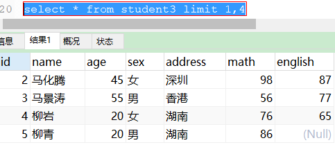
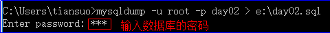
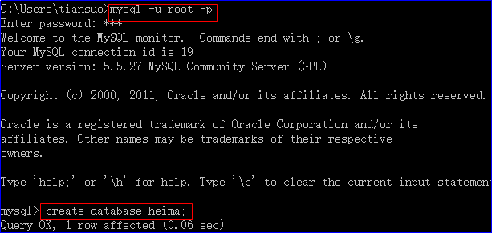
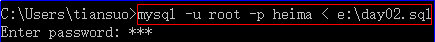
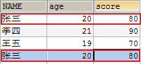
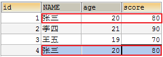
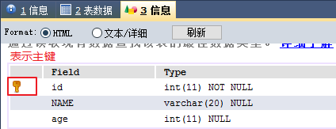
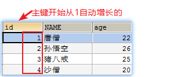
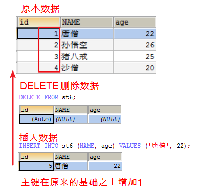
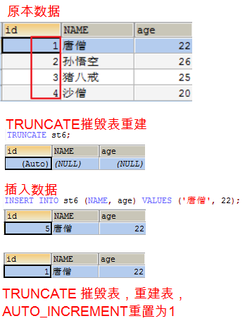

# MYSQL基础语法


# 学习内容

## 1、DQL查询语句-limit语句(掌握)

### 目标

能够掌握limit语句的使用

### 讲解

**作用：**

LIMIT`是`限制`的意思，所以`LIMIT`的作用就是限制查询记录的条数。

**LIMIT语句格式**:

```sql
select * from 表名 limit  offset, row_count;
mysql中limit的用法：返回前几条或者中间某几行数据
select * from 表名 limit 1,4。
1表示索引，注意这里的索引从0开始。对应表中第一行数据
4表示查询记录数。
上述就表示从第2条记录开始查询，一共查询4条，即到第5条。

```

具体步骤：

- 查询学生表中数据，跳过前面1条，显示4条

```sql
我们可以认为跳过前面1条，取4条数据
SELECT * FROM student3 LIMIT 1,4;
```



**LIMIT的使用场景**：分页

比如我们登录京东，淘宝，返回的商品信息可能有几万条，不是一次全部显示出来。是一页显示固定的条数。假设我们一每页显示5条记录的方式来分页。


假设我们一每页显示5条记录的方式来分页，SQL语句如下：

```sql
-- 每页显示5条
-- 第一页： LIMIT 0,5;	跳过0条，显示5条
-- 第二页： LIMIT 5,5;  跳过5条，显示5条
-- 第三页： LIMIT 10,5; 跳过10条，显示5条
SELECT * FROM student3 LIMIT 0,5;
SELECT * FROM student3 LIMIT 5,5;
SELECT * FROM student3 LIMIT 10,5;
```


> **注意**：
>
> - 如果第一个参数是0可以简写：
>   `SELECT * FROM student3 LIMIT 0,5;`
>   `SELECT * FROM student3 LIMIT 5;`
> - LIMIT 10，5; -- 不够5条，有多少显示多少

### 小结

1. LIMIT语句的使用格式？

   ```sql
   SELECT 字段 FROM 表名 LIMIT 跳过的条数, 显示条数;
   跳过的条数：表示索引，从0开始，一直变化
    显示条数：每页显示的行数，固定不变的
   ```

2. ```sql
   SELECT 字段名(5) FROM 表名(1) WHERE 条件(2) GROUP BY 分组列名(3) HAVING 条件(4) ORDER BY 排序列名(6) LIMIT 跳过行数, 返回行数(7);
   执行顺序：1234567
   ```

## 2、DCL创建用户，给用户授权，撤销授权(了解)

### 目标

能够使用DCL创建用户，给用户授权，撤销授权

### 讲解

#### 回顾SQL

1）DDL： create / alter / drop 操作数据库和整个表

2）DML：insert /update/delete 操作数据库表中的数据

3）DQL ：select  查询数据库表中的数据

4）DCL ：grant /revoke 给用户授权和撤销权限的

​	我们现在默认使用的都是root用户，超级管理员，拥有全部的权限。但是，一个公司里面的数据库服务器上面可能同时运行着很多个项目的数据库。所以，我们应该可以根据不同的项目建立不同的用户，分配不同的权限来管理和维护数据库。 

注：mysqld.exe是MySQL的主程序，服务器端。Mysql.exe是MySQL的命令行工具，客户端。

   

#### 创建用户

```sql
语法：
CREATE USER '用户名'@'主机名' IDENTIFIED BY '密码';
```

**关键字说明：**

```
  1. `用户名`：将创建的用户名，例如user1
  2. `主机名`：指定该用户在哪个主机上可以登陆，如果是本地用户可用localhost，如果想让该用户可以从任意远程主机登陆，可以使用通配符%
  3. `密码`：该用户的登陆密码，密码可以为空，如果为空则该用户可以不需要密码登陆服务器
```

**具体操作：**

需求1：创建u1用户，只能在localhost这个服务器登录mysql服务器，密码为1234.

说明：给普通用户授权，需要使用管理员root登录才可以实现。

创建用户语句：

```sql
-- u1用户只能在localhost这个IP登录mysql服务器 
create user 'u1'@'localhost' identified by '1234';
```

具体的操作如下：

1）先打开一个dos窗口，然后使用root用户登录，并创建一个普通的用户。


2）然后再打开一个dos窗口，使用新创键的普通用户u1进行登录。


需求2：创建u2用户可以在任何电脑上登录mysql服务器，密码为1234

创建用户语句：

```sql
create user 'u2'@'%' identified by '1234';
```

具体的操作如下：

1）使用root用户再创建一个新的普通用户u2


2）使用新创键的用户u2登录


**注：创建的用户名都在mysql数据库中的user表中可以查看到，密码经过了加密。**


#### 授权用户

用户创建之后，基本没什么权限！需要给用户授权


**授权格式**：

```sql
GRANT 权限1, 权限2... ON 数据库名.表名 TO '用户名'@'主机名';
```

**关键字说明**：

```sql
  1. `GRANT` 授权关键字
  2. 授予用户的权限，如`SELECT`，`INSERT`，`UPDATE`等。如果要授予所有的权限则使用`ALL`
  3. `数据库名.表名`：该用户可以操作哪个数据库的哪些表。如果要授予该用户对所有数据库和表的相应操作权限则可用*表示，如`*.*`
  4. `'用户名'@'主机名'`: 给哪个用户授权
```

**具体操作：**

1. 给u1用户分配对heima01这个数据库操作的权限：创建表，修改表，插入记录，更新记录，查询.

   A:使用root管理员创建一个heima01的数据库。

   

   B:使用root管理员给普通用户u1进行上述需求的授权。

   ```sql
   语句：grant create,alter,insert,update,select on heima01.* to 'u1'@'localhost';
   ```

   

2. 使用u1用户创建表person,并插入一条数据

   

```sql
语句：create table person(age int);
```


向person表中插入一条记录：


```sql
语句：insert into person values(18);
```

注意：由于上述没有给普通用户授权删除表中的数据，所以当我们删除的时候，会出现如下错误：


#### 撤销授权

```sql
REVOKE  权限1, 权限2... ON 数据库.表名 FROM '用户名'@'主机名';
举例：revoke all on heima01.* from 'user1'@'localhost'; 
```

**注意：撤销用户权限必须使用root管理员。**

关键字说明：

```sql
REVOKE…ON…FROM	：撤销授权的关键字
权限	：用户的权限，如CREATE、ALTER、SELECT、INSERT、UPDATE等，所有的权限则使用ALL
数据库名.表名	：对哪些数据库的哪些表，如果要取消该用户对所有数据库和表的操作权限则可用*表示，如*.*
'用户名'@'主机名':给哪个用户撤销 
```

**具体操作：**

- 撤销u1用户对heima01数据库所有表的操作的权限.

  1) 首先使用root权限撤销用户u1的所有权限。

  

  2) 使用用户u1登录，操作heima01数据库中的表。

  

  

### 小结

1. 创建用户：

   ```
   CREATE USER '用户'@'主机' ON 数据库名.表名 IDENDIFIED BY '密码';
   ```

2. 添加权限：

   ```
   GRANT 权限1, 权限2,... ON 数据库名.表名 TO '用户'@'主机';
   ```

3. 撤销权限：

   ```
   REVOKE 权限1, 权限2,... ON 数据库名.表名 FROM '用户'@'主机'
   ```

## 3、DCL删除用户，修改用户密码(了解)

### 目标

能够掌握DCL删除用户，修改用户密码

### 讲解

#### 删除用户

```sql
DROP USER '用户名'@'主机名';
```

**具体操作：**

- 删除u2

  ```sql
  drop user 'u2'@'%';
  ```

  


#### 修改管理员密码

> 注意：需要在未登陆MySQL的情况下操作。新密码不需要加上引号。

```sql
-- 新密码不需要加上引号
mysqladmin -u root -p password 新密码
```

**具体操作：**

```sql
1)将root管理员的新密码改成123456 
2)要求输入旧密码
3)使用新密码登录
```

   

#### 修改普通用户密码

> 注意：需要使用root用户登陆MySQL的情况下操作。新密码要加单引号。

```sql
set password for '用户名'@'主机名' = password('新密码');
```

**具体操作：**

1) 将'u1'@'localhost'的密码改成'666'

使用root用户更改：


2) 使用新密码登录，老密码登录不了


### 小结

1. 删除用户？DROP USER '用户名'@'主机名';
2. 修改用户密码？
   修改root用户: 不需要登录 mysqladmin -uroot -p密码 password 新密码
   修改普通用户:使用root登录: set password for '用户'@'主机' = password('新密码');


## 4、数据库备份和还原(理解)

### 目标

1. 能够使用命令行的方式备份和还原表中的数据
2. **能够使用图形客户端来备份和还原数据**

### 讲解

备份的应用场景

​	在服务器进行数据传输、数据存储和数据交换，就有可能产生数据故障。比如发生意外停机或存储介质损坏。这时，如果没有采取数据备份和数据恢复手段与措施，就会导致数据的丢失，造成的损失是无法弥补与估量的。


#### 命令行方式备份与还原

**备份格式**：

```sql
mysqldump -u 用户名 -p 数据库名 > 磁盘SQL文件路径 
```

注意：这个操作不用登录.由于mysqldump命令不是sql命令，需要在dos窗口下使用在mysql的安装目录的bin目录下有mysqldump命令，可以完成对数据库的备份。

**还原格式**：

注意：恢复数据库，需要手动的先创建数据库：

create database heima;

```sql
恢复数据库语法：mysql -u 用户名 -p 导入库名 < 硬盘SQL文件绝对路径
```

**具体操作**：

一、需求：

​	1、重新开启一个新的dos窗口。

​	2、将day02数据库导出到硬盘文件e:\day02 .sql 中。

具体的执行命令如下所示：



说明：在备份数据的时候，数据库不会被删除。可以手动删除数据库。同时在恢复数据的时候，不会自动的给我们创建数据库，仅仅只会恢复数据库中的表和表中的数据。


二、需求：

​	1、创建heima数据库。

​	2、重新开启一个新的dos窗口。将day02备份的数据表和表数据 恢复到heima中。

具体做法如下所示：

​	1）创建heima数据库。



​	2）重新开启一个新的dos窗口。将day02备份的数据表和表数据 恢复到heima中。

注意：在cmd下使用，不是登录mysql后使用，和备份比较类似，只不过mysql后面不带dump，并且箭头是<,指向需要导入数据的新的数据库。这种恢复的方式，也需要数据库提前存在。

恢复数据库语法：mysql -u 用户名 -p 导入库名 < 硬盘SQL文件绝对路径 

这里导入的一定是之前命令窗口备份的文件。



导入后的表结构：


#### 图形化界面备份与还原

使用可视化工具可以实现对数据库表中的数据进行备份和恢复。

- 备份：

  1）

   

  2）

   

  3）

   

   

- 使用可视化工具将之前备份的数据导入：

  **首先将之前的数据库删除掉。然后点击空白处导入数据库。**

  1）

   

  2）

   

  3）

   

  恢复后的结果：

   

## 5、数据库约束的概述

### 目标

能够说出数据库约束的作用

### 讲解

#### 数据库约束的作用

​	对表中的数据进行进一步的限制，保证数据的**正确性**、**有效性**和**完整性**。

#### 约束种类

- `PRIMARY KEY`: 主键约束
- `UNIQUE`: 唯一约束
- `NOT NULL`: 非空约束
- `DEFAULT`: 默认值 了解
- `FOREIGN KEY`: 外键约束

### 小结

1. 数据库约束的作用？
   对表中的数据进行进一步的限制，保证数据的**正确性**、**有效性**和**完整性**。

## 6、主键约束(掌握)

### 目标

1. 能够说出主键约束的作用
2. 能够添加主键

### 讲解

#### 主键的作用

**用来唯一标识一条记录**。

#### 为什么需要主键约束

有些记录的 name,age,score 字段的值都一样时,那么就没法区分这些数据,造成数据库的记录不唯一,这样就不方便管理数据。



每张表都应该有一个主键，并且每张表只能有一个主键。

#### 哪个字段作为表的主键

​	**通常不用业务字段作为主键**，单独给每张表设计一个id的字段，把id作为主键。主键是给数据库和程序使用的，不是给最终的客户使用的。所以主键有没有含义没有关系，只要不重复，非空就行。

#### 创建主键

主键：`PRIMARY KEY`
**主键的特点**：

- 主键必须包含唯一的值
- 主键列不能包含NULL值

**创建主键方式**：

1. **在创建表的时候给字段添加主键**

   ```
   字段名 字段类型 PRIMARY KEY
   ```

2. **在已有表中添加主键(了解)**

   ```sql
   ALTER TABLE 表名 ADD PRIMARY KEY(字段名);
   ```

具体操作：

- 创建表学生表st5, 包含字段(id, name, age)将id做为主键

```sql
CREATE TABLE st5 (
	id INT PRIMARY KEY, -- id是主键
	NAME VARCHAR(20),
	age INT
);
```



- 添加数据

```sql
INSERT INTO st5 (id, NAME,age) VALUES (1, '唐伯虎',20);
INSERT INTO st5 (id, NAME,age) VALUES (2, '周文宾',24);
INSERT INTO st5 (id, NAME,age) VALUES (3, '祝枝山',22);
INSERT INTO st5 (id, NAME,age) VALUES (4, '文征明',26);
```

- 插入重复的主键值

```sql
-- 主键是唯一的不能重复：Duplicate entry '1' for key 'PRIMARY'
INSERT INTO st5 (id, NAME,age) VALUES (1, '文征明2',30);
```

- 插入NULL的主键值

```sql
-- 主键是不能为空的：Column 'id' cannot be null
INSERT INTO st5 (id, NAME,age) VALUES (NULL, '文征明3',18);
```

### 小结

1. 说出主键约束的作用？唯一,区分一条记录

2. 主键的特点？唯一,不能为NULL

3. 添加主键？
   **字段名 字段类型 PRIMARY KEY**

   ALTER TABLE 表名 ADD PRIMARY KEY(字段名);

## 7、主键自增

### 目标

能够设置主键为自动增长

### 讲解

​	主键如果让我们自己添加很有可能重复,我们通常希望在每次插入新记录时,数据库自动生成主键字段的值

```sql
字段名 字段类型 PRIMARY KEY AUTO_INCREMENT
```

`AUTO_INCREMENT` 表示自动增长(**字段类型必须是整数类型**)

具体操作：

- 创建学生表st6, 包含字段(id, name, age)将id做为主键并自动增长

```sql
CREATE TABLE st6 (
	id INT PRIMARY KEY AUTO_INCREMENT,
	NAME VARCHAR(20),
	age INT
);
```

- 插入数据

```sql
-- 主键默认从1开始自动增长
INSERT INTO st6 (NAME, age) VALUES ('唐僧', 22);
INSERT INTO st6 (NAME, age) VALUES ('孙悟空', 26);
INSERT INTO st6 (NAME, age) VALUES ('猪八戒', 25);
INSERT INTO st6 (NAME, age) VALUES ('沙僧', 20);
```




DELETE和TRUNCATE的区别

- DELETE 删除表中的数据，但不重置AUTO_INCREMENT的值。
  
- TRUNCATE 摧毁表，重建表，AUTO_INCREMENT重置为1
  

### 小结

1. 设置主键为自动增长格式？
   字段名 数据类型 PRIMARY KEY AUTO_INCREMENT


## 8、唯一约束

### 目标

1. 能够说出唯一约束的作用
2. 能够添加唯一约束

### 讲解

#### 唯一约束的作用

在这张表中这个字段的值不能重复

#### 唯一约束的基本格式

```sql
字段名 字段类型 UNIQUE
```

具体步骤：

* 创建学生表st7, 包含字段(id, name),name这一列设置唯一约束,不能出现同名的学生

```sql
CREATE TABLE st7 (
	id INT,
	NAME VARCHAR(20) UNIQUE
);
```

* 添加一些学生

```sql
INSERT INTO st7 VALUES (1, '貂蝉');
INSERT INTO st7 VALUES (2, '西施');
INSERT INTO st7 VALUES (3, '王昭君');
INSERT INTO st7 VALUES (4, '杨玉环');

-- 插入相同的名字出现name重复: Duplicate entry '貂蝉' for key 'name'
INSERT INTO st7 VALUES (5, '貂蝉');

-- 出现多个null的时候会怎样？因为null是没有值，所以不存在重复的问题
INSERT INTO st3 VALUES (5, NULL);
INSERT INTO st3 VALUES (6, NULL);
```

### 小结

1. 说出唯一约束的作用？让这个字段的值不能重复
2. 添加唯一约束格式？字段名 字段类型 UNIQUE

## 9、非空约束

### 目标

1. 能够说出非空约束的作用
2. 能够添加非空约束

### 讲解

#### 非空约束的作用

这个字段必须设置值,不能是NULL

#### 非空约束的基本语法格式

```sql
字段名 字段类型 NOT NULL
```

具体操作：

* 创建表学生表st8, 包含字段(id,name,gender)其中name不能为NULL

```sql
CREATE TABLE st8 (
	id INT,
	NAME VARCHAR(20) NOT NULL,
	gender CHAR(2)
);
```

* 添加一些完整的记录

```sql
INSERT INTO st8 VALUES (1, '郭富城', '男');
INSERT INTO st8 VALUES (2, '黎明', '男');
INSERT INTO st8 VALUES (3, '张学友', '男');
INSERT INTO st8 VALUES (4, '刘德华', '男');

-- 姓名不赋值出现姓名不能为null: Column 'name' cannot be null
INSERT INTO st8 VALUES (5, NULL, '男');
```

### 小结

非空约束的格式:

字段名 数据类型 NOT NULL

## 10、默认值(了解)

### 目标

1. 能够说出默认值的作用
2. 能够给字段添加默认值

### 讲解

#### 默认值的作用

往表中添加数据时,如果不指定这个字段的数据,就使用默认值

#### 默认值格式

```sql
字段名 字段类型 DEFAULT 默认值
```

具体步骤：

* 创建一个学生表 st9，包含字段(id,name,address)， 地址默认值是广州

```sql
CREATE TABLE st9 (
	id INT,
	NAME VARCHAR(20),
	address VARCHAR(50) DEFAULT '广州'
);
```

* 添加一条记录,使用默认地址

```sql
INSERT INTO st9 (id, NAME) VALUES (1, '刘德华');
```


* 添加一条记录,不使用默认地址

```sql
INSERT INTO st9 VALUES (2, '张学友', '香港'); 
```

**面试题:**

如果一个字段设置了非空与唯一约束，该字段与主键的区别? 

1.一张表只有一个主键

2.一张表可以多个字段添加非空与唯一约束

3.主键可以自动增长,自己添加的非空与唯一约束字段无法自动增长

### 小结

1. 说出默认值的作用？不添加这个字段,就会使用默认值
2. 给字段添加默认值格式？ 字段名 字段类型 DEFAULT 默认值


## 11、表关系的概念和外键约束 

在真实的开发中，一个项目中的数据，一般都会保存在同一个数据库中，但是不同的数据需要保存在不同的数据表中。这时不能把所有的数据都保存在同一张表中。

那么在设计保存数据的数据表时，我们就要根据具体的数据进行分析，然后把同一类数据保存在同一张表中，不同的数据进行分表处理。

数据之间必然会有一定的联系，我们把不同的数据保存在不同的数据表中之后，同时还要在数据表中维护这些数据之间的关系。这时就会导致表和表之间必然会有一定的联系。这时要求设计表的人员，就需要考虑不同表之间的具体关系。

在数据库中，表总共存在三种关系，这三种关系如下描述：真实的数据表之间的关系：

**多对多关系、一对多（多对一）**、一对一(极少)。(一对一关系就是我们之前学习的Map集合的key-value关系)

### 多对多(掌握)

例如：程序员和项目的关系、老师和学生，学生和课程，顾客和商品的关系等


分析：

程序员和项目：

一个程序员可以参与多个项目的开发，一个项目可以由多个程序员来开发。这种关系就称为多对多关系。

当我们把数据之间的关系分析清楚之后，一般我们需要通过E([Entity](http://www.baidu.com/link?url=rpryZnlAzlLz_ez3TXcVy0ddHYAE3F6-D3bgX0ATjHLPTcGaIrJkGmxBTt4-HDM4_VI3x5d_CIBiBaOUrf545PXUkdzVzHUzVGiDbe5xi8e))-R([relation](http://www.baidu.com/link?url=bg-fPjiiFec0kNbN3Zu6kG5tpqliu5ijcLfNSHEawJYvagtSaz0ocr1r67_97ec82hZl1A-YTeCCSpR_pcsNjTRVH2UXAqvABXgtyT2h8vq))图来展示。 实体 关系 图

一个Java对象，可以对应数据库中的一张表，而Java中类的属性，可以对应表中的字段。

而在E-R图中：

一张表，可以称为一个实体，使用矩形表示，每个实体的属性（字段，表的列），使用椭圆表示。

表和表之间的关系，使用菱形表示。

实体(程序员)：编号、姓名、薪资。

实体(项目)：编号、名称。

程序员和项目存在关系：一个程序员可以开发多个项目，一个项目可以被多个程序员开发。

**说明：如果两张表是多对多的关系，需要创建第三张表，并在第三张表中增加两列，引入其他两张表的主键作为自己的外键。**

关系图总结:


创建表的sql语句:

```sql
-- 创建程序员表
create table coder(
	id int primary key auto_increment,
	name varchar(50),
	salary double
);
-- 创建项目表
create table project(
	id int primary key auto_increment,
	name varchar(50)
);
-- 创建中间关系表
create table coder_project(
	coder_id int,
	project_id int
);


-- 添加测试数据
insert into coder values(1,'张三',12000);
insert into coder values(2,'李四',15000);
insert into coder values(3,'王五',18000);

insert into project values(1,'QQ项目');
insert into project values(2,'微信项目');

insert into coder_project values(1,1);
insert into coder_project values(1,2);
insert into coder_project values(2,1);
insert into coder_project values(2,2);
insert into coder_project values(3,2);
```

### 外键约束(掌握)

创建第三张关系表即中间表，来维护程序员表和项目表之间的关系。

使用中间表的目的是维护两表多对多的关系：

1 中间表插入的数据 必须在多对多的主表中存在。

2 如果主表的记录在中间表维护了关系，就不能随意删除。如果可以删除，中间表就找不到对应的数据了，这样就没有意义了。

上述是中间表存在的意义，可是我们这里所创建的中间表并没有起到上述的作用，而是存在缺点的：

 缺点1: 我们是可以向中间表插入不存在的项目编号和程序员编号的。


说明：在程序员和项目表中是不存在编号是30和20的，但是这里依然可以插入不存在的编号。这样做是不可以的，失去了中间表的意义。

 

 缺点2 : 如果中间表存在程序员的编号, 我们是可以删除程序员表对应的记录的。

在中间表中是存在编号为1的程序员的：


可是我们却可以删除程序员表coder中的编号为1的程序员：


编号为1的程序员张三已经被我们删除，但是在中间表coder_project中仍然还存在编号为1的程序员，这样对于中间表没有意义了。

 

说明：

创建第三张表的语句：

```sql
create table coder_project(

   coder_id int ,--这个外键来自于coder表中的主键

   project_id int--这个外键来自于project表中的主键

);
```

我们在创建第三张关系表时，表中的每一列，都是在使用其他两张表中的列，这时我们需要对第三张表中的列进行相应的约束。

**当前第三张表中的列由于都是引用其他表中的列，我们把第三张表中的这些列称为引用其他表的外键约束。**

 

给某个表中的某一列添加外键约束：

  简化语法：

```sql
foreign key( 当前表中的列名 )  references 被引用表名(被引用表的列名);
foreign key( coder_id )  references coder(id);

```

注意：一般在开发中，被引用表的列名都是被引用表中的主键。

举例：

```sql
constraint [外键约束名称] foreign key(当前表中的列名) references  被引用表名(被引用表的列名)
举例：constraint coder_project_id foreign key(coder_id) references coder(id);
```

**关键字解释**：
constraint: 添加约束，可以不写
foreign key(当前表中的列名): 将某个字段作为外键
references 被引用表名(被引用表的列名) : 外键引用主表的主键

给第三张表添加外键约束有两种方式：

第一种方式：给已经存在的表添加外键约束：

```sql
-- 来自于程序员表
alter table coder_project add constraint c_id_fk foreign key(coder_id) references coder(id);
-- 来自于项目表
alter table coder_project add constraint p_id_fk foreign key(project_id) references project(id);
```

第二种方式：创建表时就添加外键约束：

```sql
create table coder_project(
	coder_id int,
	project_id int,
    constraint c_id_fk foreign key(coder_id) references coder(id),
    constraint p_id_fk foreign key(project_id) references project(id)
);
```

 

了解完如何给第三张表添加外键约束以后，我们就开始给上述创建好的第三张表添加外键约束。

在添加外键约束之前，由于刚才已经修改了表中的数据，所以我们先清空三张表，然后在添加外键约束。

操作步骤：

1、清空上述三张表：


2、增加外键约束：


3、添加完外键约束以后，就会在可视化工具中的架构设计器上查看表之间的关系

先选中表


然后点击右下角：


最后的表关系如下：


3、向三张表中分别插入数据：

```sql
-- 插入数据

insert into coder values(null,'张三',12000);
insert into coder values(null,'李四',15000);
insert into coder values(null,'王五',18000);

insert into project values(null,'QQ项目');
insert into project values(null,'微信项目');

insert into coder_project values(1,1);
insert into coder_project values(1,2);
insert into coder_project values(2,1);
insert into coder_project values(2,2);
insert into coder_project values(3,1);
```

4、测试外键约束是否起到作用：

A:执行以下语句：


B:执行以下语句：


再次执行上述语句的时候，发现报错了，而数据库表中的数据都没有改变，说明外键约束起到了作用。

### 外键的级联(掌握)

在修改和删除主表的主键时，同时更新或删除从表的外键值，称为级联操作
`ON UPDATE CASCADE` -- 级联更新，主键发生更新时，外键也会更新
`ON DELETE CASCADE` -- 级联删除，主键发生删除时，外键也会删除

具体操作：

- 删除三张表coder、coder_project、project表
- 重新创建三张表，添加级联更新和级联删除

```sql
-- 创建程序员表
create table coder(
	id int primary key auto_increment,
	name varchar(50),
	salary double
);
-- 创建项目表
create table project(
	id int primary key auto_increment,
	name varchar(50)
);
create table coder_project(
	coder_id int,
	project_id int,
    -- 添加外键约束,并且添加级联更新和级联删除
    constraint c_id_fk foreign key(coder_id) references coder(id) ON UPDATE CASCADE ON DELETE CASCADE,
    constraint p_id_fk foreign key(project_id) references project(id) ON UPDATE CASCADE ON DELETE CASCADE
);
```

再次添加数据到三张表：

```sql
-- 添加测试数据
insert into coder values(1,'张三',12000);
insert into coder values(2,'李四',15000);
insert into coder values(3,'王五',18000);

insert into project values(1,'QQ项目');
insert into project values(2,'微信项目');

insert into coder_project values(1,1);
insert into coder_project values(1,2);
insert into coder_project values(2,1);
insert into coder_project values(2,2);
insert into coder_project values(3,2);
```

**需求1：修改主表coder表的id为3变为4.**


**需求2：删除主表coder表的id是4的行数据。**


**小结：**

**级联更新：ON UPDATE CASCADE 主键修改后,外键也会跟着修改**

**级联删除：ON DELETE CASCADE 主键删除后,外键对应的数据也会删除**


### 一对多(掌握)

一对多的关系表：其中也有2个实体，但是其中A实体中的数据可以对应另外B实体中的多个数据，反过来B实体中的多个数据只能对应A实体中的一个数据。

例如：作者和小说关系,班级和学生，部门和员工，客户和订单


分析：

作者和小说：

一个作者可以写多部小说，但每一部小说，只能对应具体的一个作者。

具体的关系如下图所示：


注意：如果是一对多的关系，那么设计表的时候需要在多的一方增加一列，引入一的一方的主键作为自己的外键。


### 一对一

一对一关系表在实际开发中使用的并不多，其中也是2个实体，其中A实体中的数据只能对应B实体中的一个数据，同时B实体中的数据也只能对应A实体中的一个数据。例如：人和身份证对应关系，老公和老婆的对应关系。

而一对一在建表的时候，可以在任意一方的表中添加另外一方的主键作为外键即可。

建表原理如下图所示：


## 12、表设计案例(练习)

### 目标

设计学生成绩管理系统数据表(按照给定需求设计即可)

1、每个教师可以教多门课程

2、每个课程由一个老师负责

3、每门课程可以由多个学生选修

4、每个学生可以选修多门课程

5、学生选修课程要有成绩

### 讲解

具体操作：

1）分析：

​	当我们拿到一个需求之后，首先应该分析这个需求中到底有多少名词，或者是当前这个需求中可以抽象出具体几个E-R图中的实体对象。

分析需求中存在的实体：	实体使用矩形表示。

学生、课程、老师。

当分析清楚具体的实体之后，接着要分析实体具备哪些属性？属性使用椭圆形表示。

学生：学号、姓名等。

课程：课程编号、课程名称等。

老师：工号、姓名等。

最后就要考虑实体和实体之间的关系问题：

老师和课程之间：一对多关系。一个老师可以教授多门课程，一个课程只能由一个老师负责。

学生和课程之间：多对多关系。每个学生可以选修多门课程，每门课程可以被多个学生来选修。

2）关于设计学生成绩管理系统的数据表的E-R图如下所示：


3）创建表sql语句：

画完E-R图之后，接下来我们就根据E-R图来创建具体的数据库表了。

学生选课管理系统的表创建：

思考：先创建哪张表？

不能先创建课程表，因为课程表需要有教师的工号，也不能创建中间表，因为中间表需要课程表和学生表的id，所以我们可以创建表的顺序如下：

-- 1、教师表

-- 2、课程表

-- 3、学生表

-- 4、学生课程表(中间关系表要有成绩属性)

创建表的语句如下：

```sql
-- 1、教师表
create table teacher(
	id int primary key auto_increment,
	name varchar(50)
);
-- 2、课程表
create table course(
	id int primary key auto_increment,
	name varchar(50),
	teacher_id int,
	foreign key(teacher_id) references teacher(id)
);
-- 3、学生表
create table student(
	id int primary key auto_increment,
	name varchar(50)
);
-- 4、学生课程表(中间关系表要有成绩属性)
create table studentcourse(
	student_id int,
	course_id int,
	score double,
	foreign key(student_id) references student(id),
	foreign key(course_id) references course(id)
);
```

创建表之后的结构：


## 作业:多表练习

### 一对多关系练习

以下案例是我们JavaWeb课程最后的小项目.我们拿出其中一部分需求,根据需求来设计数据库表之间的关系

一个旅游线路分类中有多条旅游线路 , 一条旅游线路属于某一个分类 . 旅游线路表是多表 ,可以在多表上添加一个外键来执行分类表中的主键.


<div style='background-color:#999;'>具体操作:<div>


* 创建旅游线路分类表

```sql
CREATE TABLE tab_category (
   cid INT PRIMARY KEY AUTO_INCREMENT, -- 旅游线路分类主键
   cname VARCHAR(100) NOT NULL UNIQUE -- 旅游线路分类名称
);
```

* 添加旅游线路分类数据

```sql
INSERT INTO tab_category (cname) VALUES ('周边游'), ('出境游'), ('国内游'), ('港澳游');
```

* 创建旅游线路表

```sql
CREATE TABLE tab_route (
   rid INT PRIMARY KEY AUTO_INCREMENT, -- 旅游线路主键
   rname VARCHAR(100) NOT NULL UNIQUE, -- 旅游线路名称
   price DOUBLE NOT NULL,  -- 价格
   cid INT NOT NULL, -- 所属分类
   CONSTRAINT ro_cid_ref_cate_id FOREIGN KEY(cid) REFERENCES tab_category(cid)
);
```

* 添加旅游线路测试数据(自行添加)

### 多对多关系练习

一个用户可以收藏多个线路，一个线路可以被多个用户收藏 ,所以用户和线路之间是多对多的关系.对于多对多的关系我们需要增加一张中间表来维护他们之间的关系


<div style='background-color:#999;'>具体操作:<div>


* 创建用户表

```sql
CREATE TABLE tab_user (
   uid INT PRIMARY KEY AUTO_INCREMENT, -- 用户id
   username VARCHAR(100) NOT NULL UNIQUE -- 用户名
);
```

* 添加用户数据

```sql
INSERT INTO tab_user VALUES
(NULL, '老王'),
(NULL, '小王');
```

* 创建收藏表

```sql
CREATE TABLE tab_favorite (
   fid INT PRIMARY KEY AUTO_INCREMENT, -- 收藏主键
   rid INT NOT NULL, -- 旅游线路id
   DATE DATE NOT NULL, -- 收藏时间
   uid INT NOT NULL -- 用户id
);
```

> 注意 : 可以自己尝试着给收藏表添加外键约束

* 增加收藏表测试数据(自行添加)