# MySQL多表查询和函数


# 回顾

## MySQL管理数据库

创建数据库

```
CREATE DATABASE IF NOT EXISTS 数据库名;
```

删除数据库

```
DROP DATABASE 数据库名;
```

## 表的管理

查看所有表

```
use 数据库名; 选中一个数据库
show tables;
```

创建表:student(整数id,字符串name,整数age)

```
CREATE TABLE sutdent (id int, name varchar(20), age int);
```

## 查看一个表结构

```
desc 表名;
```

查看创建表的sql语句

```
SHOW CREATE TABLE 表名;
```

## 修改表结构

ALTER TABLE 表名 ...

向学生表中添加1列remark varchar(100)

```
ALTER TABLE student ADD remark varchar(100)
```

删除学生表列remark

```
ALTER TABLE student DROP remark;
```

修改表student名字为student1

```
REANME TABLE sutdent TO student1;
```


## 删除表

```
DROP TABLE 表名;
```

## 管理数据：数据增删改DML

插入数据

```
INSERT INTO 表名 (字段名1, 字段名2..) VALUES (值1, 值2...);
```

修改数据

```
UPDATE 表名 SET 字段名=新的值 WHERE 条件;
```

删除表中的所有数据

```
DELETE FROM 表名;
```

# 学习目标

1. 能够数据库三大范式(了解)
2. 能够说出多表查询概念(掌握)
3. 能够理解笛卡尔积问题(掌握)
4. 能够使用连接查询查询多表(掌握)
5. 能够使用子查询查询多表(掌握)
6. 能够使用mysql自带函数(理解)

# 学习内容

## 1、数据库的三大范式

### 目标

能够说数据库中有哪三大范式？每个范式的含义是什么？

### 讲解

#### 什么是范式

**范式是指**:设计数据库表的规则(Normal Form)
​	好的数据库设计对数据的存储性能和后期的程序开发，都会产生重要的影响。建立科学的，规范的数据库就需要满足一些规则来优化数据的设计和存储

#### 范式的基本分类

​	目前关系数据库有六种范式：第一范式（1NF）、第二范式（2NF）、第三范式（3NF）、巴斯-科德范式（BCNF）、第四范式(4NF）和第五范式（5NF，又称完美范式）。满足最低要求的范式是第一范式（1NF）。在第一范式的基础上进一步满足更多规范要求的称为第二范式（2NF），其余范式以次类推。**一般说来，数据库只需满足第三范式(3NF）就行了。**

#### 第一范式

​	数据库表的每一列都是不可分割的原子数据项。即表中的某个列有多个值时，必须拆分为不同的列。直到不能拆分为止。简而言之，第一范式每一列不可再拆分，称为原子性。

**第一范式**：表中每一列不能再拆分
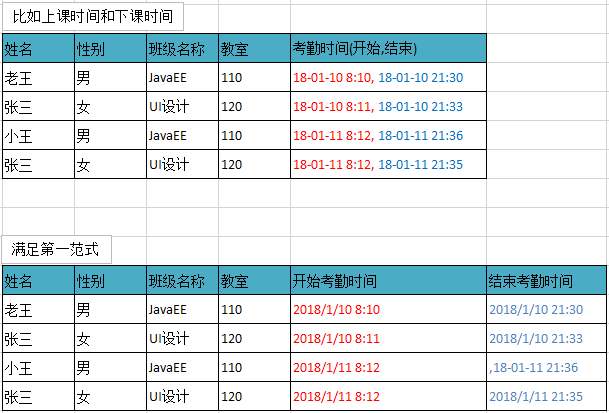

> 总结：如果不遵守第一范式，查询出数据还需要进一步处理（查询不方便）。遵守第一范式，需要什么字段的数据就查询什么数据（方便查询）。

#### 第二范式

​	在满足第一范式的前提下，表中的每一个字段都完全依赖于主键。所谓完全依赖是指不能存在仅依赖主键一部分的列。简而言之，第二范式就是在第一范式的基础上所有列完全依赖于主键列。当存在一个复合主键包含多个主键列的时候，才会发生不符合第二范式的情况。比如有一个主键有两个列，不能存在这样的属性，它只依赖于其中一个列，这就是不符合第二范式。

**第二范式的特点：**

1) 一张表只描述一件事情。

2) 表中的每一列都完全依赖于主键

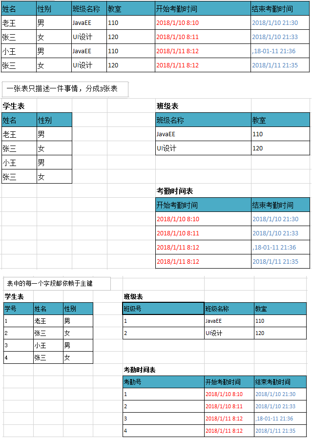

> 总结：如果不遵守第二范式，数据冗余，相同数据无法区分。遵守第二范式减少数据冗余，通过主键区分相同数据。

#### 第三范式

​	在满足第二范式的前提下，表中的每一列都直接依赖于主键，而不是通过其它的列来间接依赖于主键。简而言之，第三范式就是所有列不依赖于其它非主键列，也就是在满足2NF的基础上，任何非主键列不得传递依赖于主键。所谓传递依赖，指的是如果存在"A → B → C"的决定关系，则C传递依赖于A。因此，满足第三范式的数据库表应该不存在如下依赖关系：主键列 → 非主键列x → 非主键列y。这里：非主键列y间接依赖于主键列了，所以不满足第三范式。

**第三范式**：从表的外键必须使用主表的主键
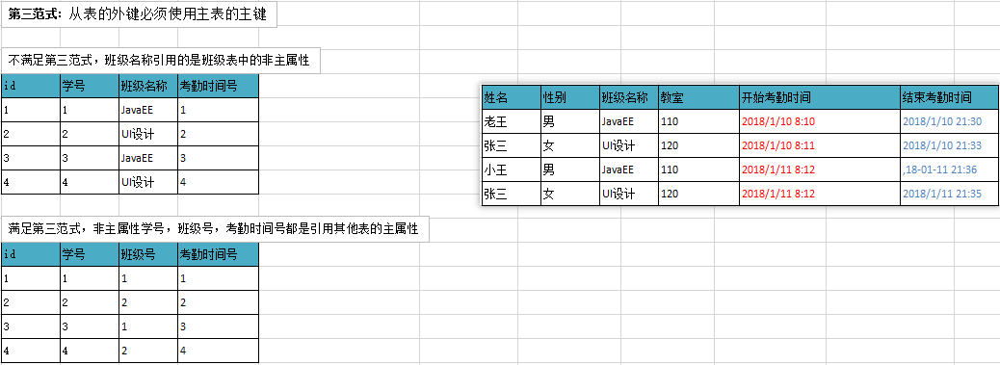

> 总结：如果不遵守第三范式，可能会有相同数据无法区分，修改数据的时候多张表都需要修改（不方便修改）。遵守第三范式通过id可以区分相同数据，修改数据的时候只需要修改一张表（方便修改）。

####  反三范式 

反三范式相对于三范式的，没有冗余的数据库未必是最好的数据库，有时为了提高数据库的运行效率，就必须降低范式标准，适当保留冗余数据。

具体做法是： 在概念数据模型设计时遵守第三范式，降低范式标准的工作放到物理数据模型设计时考虑。降低范式就是增加适当的字段，**减少了查询时的关联，提高查询效率**，因为在数据库的操作中查询的比例要远远大于DML的比例。但是反范式化一定要适度，并且在原本已满足三范式的基础上再做调整


### 小结

第一范式要求? 
​	表中的字段不能再拆分（字段原子性）

第二范式要求? 
​	1.一张表描述一件事情
​	2.每个表都提供主键

第三范式要求?
​	从表的外键必须使用主表的主键

## 2、多表查询介绍(掌握)

### 目标

了解什么是多表查询，及多表查询的两种方式

### 讲解

#### 什么是多表查询

**同时查询多张表获取到需要的数据**
比如：我们想查询水果的对应价格，需要将水果表和价格表同时进行查询

一种水果一种价格。

一种价格多种水果。

价格和水果属于一对多。

将一方即价格的主键作为多方即水果的外键。

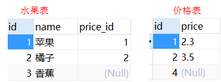

#### 多表查询的分类

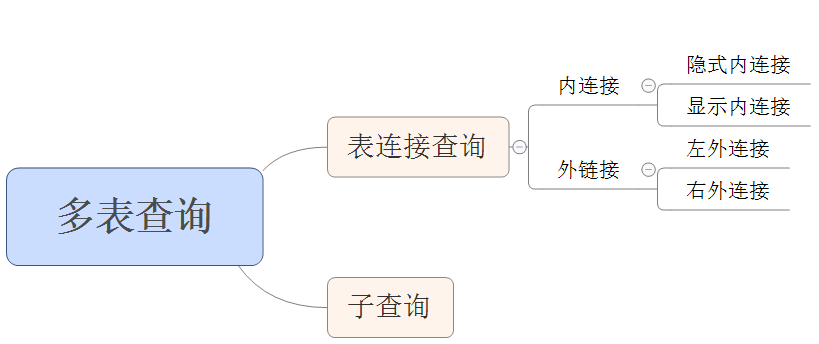

### 小结

什么是多表查询？通过查询多张表获取我们想要的数据

## 3、笛卡尔积现象

### 目标

能够说出什么是笛卡尔积，以及如何消除笛卡尔积

### 讲解

#### 准备数据

有两张表，一张是水果表fruit,一张是价格表price。

分析：

一种水果一种价格。

一个价格对应多种水果。

价格和水果是1对多  

价格是1  水果是多

**表设计原则：将价格的主键作为水果的外键**

建表：

```sql
-- 价格 1
create table price( 
   id int primary key auto_increment,
   price double
);
-- 水果 n
create table fruit(
  id int primary key auto_increment,
  name varchar(20) not null,
  price_id int,
  foreign key(price_id) references price(id)
);
insert into price values(1,2.30);
insert into price values(2,3.50);
insert into price values(4,null);

insert into fruit values(1,'苹果',1);
insert into fruit values(2,'橘子',2);
insert into fruit values(3,'香蕉',null);
-- 一种水果有一个价格 一个价格对应多种水果
-- 价格 1 水果 n 水果将价格主键作为外键
```

#### 什么是笛卡尔积现象

需求：查询两张表中关于水果的信息，要显示水果名称和水果价格。

具体操作：

```sql
多表查询语法：select * from fruit,price;
```

查询结果：

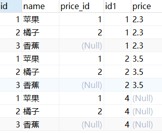

产生上述查询结果的原因：

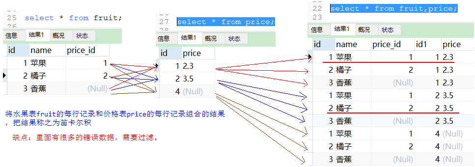

说明：

fruit表中的每一条记录，都和price表中的每一条进行匹配连接。所得到的最终结果是：fruit表中的条目数乘以price表中的数据的条目数。

将fruit表的每行记录和price表的每行记录组合的结果就是笛卡尔积。

笛卡尔积问题：把多张表放在一起，同时去查询，会得到一个结果，而这结果并不是我们想要的数据，这个结果称为笛卡尔积。

笛卡尔积缺点：查询到的结果冗余了，里面有很多错误的数据，需要过滤。

举例：上述的笛卡尔积结果中只有两行结果是正确的：

1              苹果            1          1	   2.3

2              橘子            2           2	   3.5

笛卡尔积的数据，对程序是没有意义的， 我们需要对笛卡尔积中的数据再次进行过滤。

对于多表查询操作，需要过滤出满足条件的数据，需要把多个表进行连接，连接之后需要加上过滤的条件。

#### 如何清除笛卡尔积现象的影响

解决上述查询的方案：在查询两张表的同时添加条件进行过滤，比如fruit表的id和必须和price表的id相同。

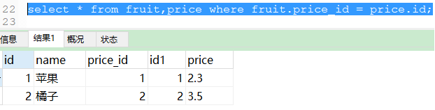

### 小结

1. 能够说出什么是笛卡尔积?
   左表的每条记录和右表的每条记录会组合起来
2. 如何消除笛卡尔积
   只查询满足要求的数据，通常都是外键等于主键

## 4、内连接

### 目标

能够掌握内连接的使用

### 讲解

#### 什么是内连接

用左边表的记录去匹配右边表的记录，如果符合条件的则显示。内连接查询的结果：两表的公共部分。

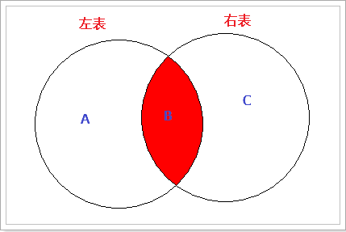

#### 隐式内连接

隐式内连接：看不到`JOIN`关键字，条件使用`WHERE`指定

```sql
语法：
select 列名 , 列名 .... from 表名1,表名2 where 表名1.列名 = 表名2.列名;
select * from fruit,price where fruit.price_id = price.id;
```

说明：在产生两张表的笛卡尔积的数据后，通过条件筛选出正确的结果。

#### 显示内连接(掌握)

显示内连接：使用`INNER JOIN ... ON`语句, 可以省略`INNER`

```sql
语法：
select * from 表名1  inner join 表名2 on 条件;
或者
select * from 表名1  join 表名2 on 条件 
```

具体操作：

- 使用显示内连接解决上述笛卡尔积问题

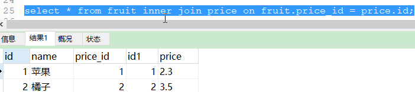

说明：显示的内连接，一般称为标准的内连接，有inner join，查询到的数据为两个表经过on条件过滤后的笛卡尔积。

- **应用**

---

查询苹果的信息，显示苹果id,名字，和价格。

1.确定查询哪些表

2.确定表连接条件，水果表.price_id = 价格表.id 的数据才是有效的

3.确定查询条件，我们查询的是苹果的信息，水果表.name='苹果'

4.确定查询字段，查询苹果的信息，显示苹果id,名字，和价格

5.我们发现写表名有点长，可以给表取别名，显示的字段名也使用别名

~~~sql
-- 1.确定查询哪些表
select * from fruit f inner join price p;
-- 2.确定表连接条件
select * from fruit f inner join price p on f.price_id = p.id;
-- 3.确定查询条件，我们查询的是苹果的信息，水果表.name='苹果'
select * from fruit f inner join price p on f.price_id = p.id where f.name='苹果';
-- 4. 确定查询哪些列
select f.id,f.name,p.id,p.price from fruit f inner join price p on f.price_id = p.id where f.name='苹果';
~~~


### 小结

1. 什么是隐式内连接和显示内连接？
   隐式内连接：看不到JOIN：select 列名 , 列名 .... from 表名1,表名2 where 表名1.列名 = 表名2.列名;
   显示内连接：看得到JOIN：select * from 表名1  inner join 表名2 on 条件;
2. 内连接查询步骤？
   1.确定查询几张表
   2.确定表连接条件
   3.根据需要在操作

## 5、左外连接

### 目标

能够掌握左外连接查询

### 讲解

左外连接原理如下所示：

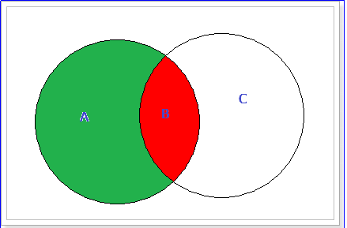

**左外连接**可以理解为：用左边表去右边表中查询对应记录，不管是否找到，都将显示左边表中全部记录。

举例：上述案例中虽然右表没有香蕉对应的价格，也要把他查询出来。

左外连接：使用`LEFT OUTER JOIN ... ON`，`OUTER`可以省略

```sql
select * from 表1 left outer join 表2 on 条件;
把left 关键字之前的表，是定义为左侧。 left关键字之后的表，定义右侧。
查询的内容，以左侧的表为主，如果左侧有数据，右侧没有对应的数据，仍然会把左侧数据进行显示。
```

具体操作：

- 不管能否查到水果对应的价格，都要把水果显示出来。

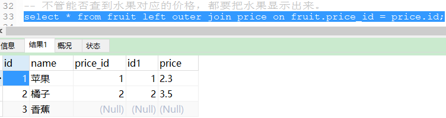

分析：香蕉是没有价格的，但是由于香蕉位于左边的表中，所以即使香蕉的价格是null，也会将香蕉的信息显示出来。

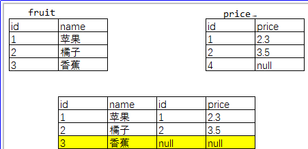

### 小结

1. 掌握左外连接查询格式？

   ```sql
   select * from 表1 left outer join 表2 on 条件;
   ```

2. 左外连接查询特点？
   在满足要求的基础上保证左表的数据全部显示

## 6、右外连接

### 目标

能够掌握右外连接查询

### 讲解

右外连接原理如下所示：

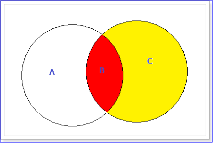

用右边表去左边表查询对应记录，不管是否找到，右边表全部记录都将显示。

举例：上述案例中不管在左方表能否找到右方价格对应的水果，都要把右方的价格显示出来。

右外连接：使用`RIGHT OUTER JOIN ... ON`，`OUTER`可以省略

```sql
语法：select * from 表1 right outer join 表2 on 条件;
说明：如果右侧有数据，左侧没匹配到，把右侧的数据显示出来。
right之前的是左侧，right之后的是右侧。
```

具体操作：

- 需求：不管能否查到价格对应的水果，都要把价格显示出来。

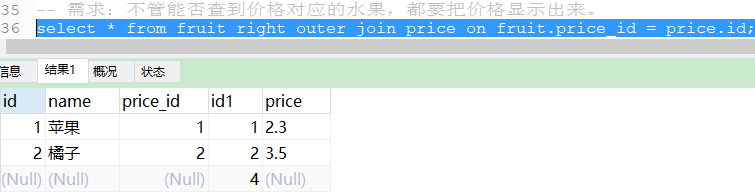

分析：在price表中id为4到fruit表中查询是没有对应水果描述的，但是使用右外连接也会将price表中的价格查询出来。

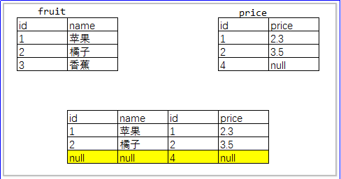

**注意：**其实关于左外连接和右外连接只记住一种就可以，只需将表的前后位置换一下就可以达到互换。

需求：使用左外连接达到上述右外连接的效果。

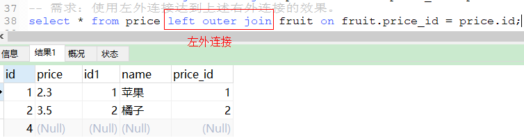


### 小结

1. 掌握右外连接查询格式？

   ```
   select * from 表1 right outer join 表2 on 条件;
   ```

2. 右外连接查询特点？
   在满足要求的基础上,保证右表的数据全部显示.

## 7、子查询

### 目标

能够掌握子查询的概念

能够理解子查询的三种情况

### 讲解

准备数据：

```sql
-- 创建部门表 1
CREATE TABLE dept (
  id INT PRIMARY KEY AUTO_INCREMENT,
  NAME VARCHAR(20)
);

INSERT INTO dept (NAME) VALUES ('开发部'),('市场部'),('财务部');

-- 创建员工表 n
CREATE TABLE emp (
  id INT PRIMARY KEY AUTO_INCREMENT,
  NAME VARCHAR(10),
  gender CHAR(1),   -- 性别
  salary DOUBLE,   -- 工资
  join_date DATE,  -- 入职日期
  dept_id INT,
  foreign key(dept_id) references dept(id)
);

INSERT INTO emp(NAME,gender,salary,join_date,dept_id) VALUES('孙悟空','男',7200,'2013-02-24',1);
INSERT INTO emp(NAME,gender,salary,join_date,dept_id) VALUES('猪八戒','男',3600,'2010-12-02',2);
INSERT INTO emp(NAME,gender,salary,join_date,dept_id) VALUES('唐僧','男',9000,'2008-08-08',2);
INSERT INTO emp(NAME,gender,salary,join_date,dept_id) VALUES('白骨精','女',5000,'2015-10-07',3);
INSERT INTO emp(NAME,gender,salary,join_date,dept_id) VALUES('蜘蛛精','女',4500,'2011-03-14',1);
```


#### 什么是子查询

##### **一条查询语句结果作为另一条查询语法一部分。**

```sql
SELECT 查询字段 FROM 表 WHERE 条件;
举例：
SELECT * FROM employee WHERE salary=(SELECT MAX(salary) FROM employee);
```

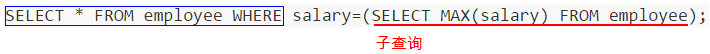
说明：子查询需要放在（）中

#### 子查询结果的三种情况

1. 子查询的结果是单行单列的时候
   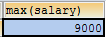
2. 子查询的结果是多行单列的时候
   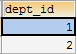
3. 子查询的结果是多行多列
   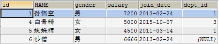

### 小结

1. 什么是子查询？
   一个查询的结果作为另一个查询语句的一部分
2. 子查询结果的三种情况？
   单行单列
   多行单列
   多行多列

## 8、子查询的结果是单行单列的时候

### 目标

能够掌握子查询的结果是单行单列的查询

### 讲解

子查询结果是`单列`，在`WHERE`后面作为`条件`
`SELECT 查询字段 FROM 表 WHERE 字段=（子查询）;`

1. **查询工资最高的员工是谁？** 

   1. 查询最高工资是多少

   ```sql
   SELECT MAX(salary) FROM emp;
   ```

     

   1. 根据最高工资到员工表查询到对应的员工信息

   ```sql
     SELECT * FROM emp WHERE salary=(SELECT MAX(salary) FROM emp);
   ```

     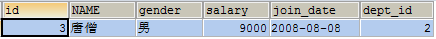

2. **查询工资小于平均工资的员工有哪些？**

   1. 查询平均工资是多少

   ```sql
   SELECT AVG(salary) FROM emp;
   ```

     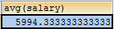

   1. 到员工表查询小于平均的员工信息

   ```sql
   SELECT * FROM emp WHERE salary < (SELECT AVG(salary) FROM emp);
   ```

     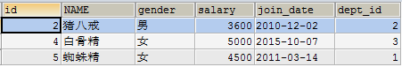

### 小结

子查询的结果是单行单列时父查询如何处理？
SELECT 查询字段 FROM 表 WHERE 字段=（子查询）;

通常作为父查询的条件

## 9、子查询结果是多行单列的时候

### 目标

能够掌握子查询的结果是多行单列的查询

### 讲解

子查询结果是多行单列，结果集类似于一个数组，在`WHERE`后面作为`条件`，父查询使用`IN`运算符

```sql
SELECT 查询字段 FROM 表 WHERE 字段 IN （子查询）;

```

1. **查询工资大于5000的员工，来自于哪些部门的名字**  

   1. 先查询大于5000的员工所在的部门id

   ```sql
   SELECT dept_id FROM emp WHERE salary > 5000;
   ```

     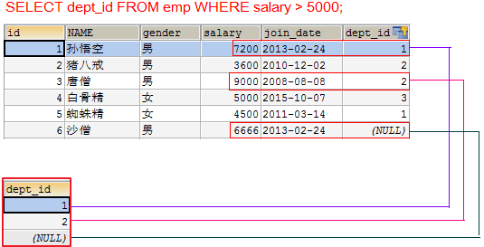

   1. 再查询在这些部门id中部门的名字

   ```sql
   SELECT dept.name FROM dept WHERE dept.id IN (SELECT dept_id FROM emp WHERE salary > 5000);
   ```

     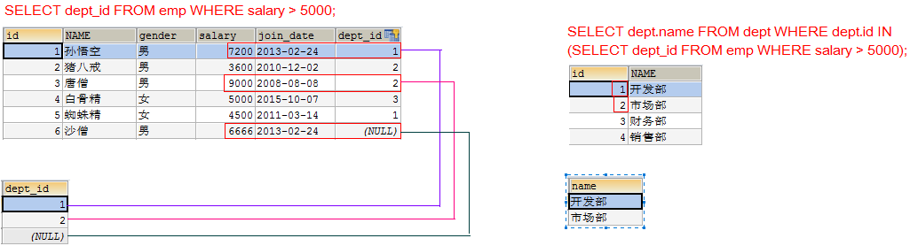

2. **查询开发部与财务部所有的员工信息**

   1. 先查询开发部与财务部的id

   ```sql
   SELECT id FROM dept WHERE NAME IN('开发部','财务部');
   ```

   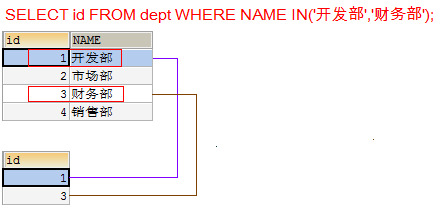

   1. 再查询在这些部门id中有哪些员工

   ```sql
   SELECT * FROM emp WHERE dept_id IN (SELECT id FROM dept WHERE NAME IN('开发部','财务部'));
   ```

   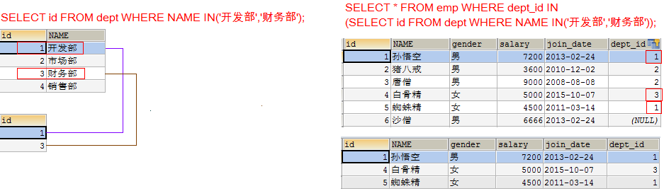

### 小结

子查询的结果是多行单列时父查询如何处理？
放在父查询的条件位置,使用in

## 10、子查询的结果是多行多列

### 目标

能够掌握子查询的结果是多行多列的查询

### 讲解

子查询结果是`多列`，在`FROM`后面作为`表`

```sql
SELECT 查询字段 FROM （子查询） 表别名 WHERE 条件;
```

**注意：子查询作为表需要取别名，使用as，可以省略。否则这张表没用名称无法访问表中的字段**

- **查询出2011年以后入职的员工信息，包括部门名称**

  1. 在员工表中查询2011-1-1以后入职的员工

  ```sql
  SELECT * FROM emp WHERE join_date > '2011-1-1';
  ```

  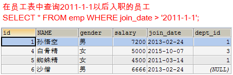

  1. 查询所有的部门信息，与上面的虚拟表中的信息组合，找出所有部门id等于dept_id

  ```sql
  SELECT * FROM dept d, (SELECT * FROM emp WHERE join_date > '2011-1-1') e WHERE e.dept_id = d.id;
  ```

  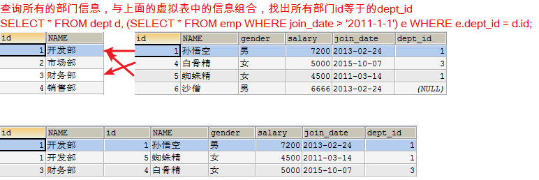

使用表连接：

```sql
SELECT d.*, e.* FROM dept d INNER JOIN emp e ON d.id = e.dept_id WHERE e.join_date > '2011-1-1';
```

### 小结

三种子查询情况：单行单列，多行单列，多行多列
单行单列：作为父查询的条件
多行单列：作为父查询的条件,通常使用 IN
多行多列：作为父查询的一张表(虚拟表)

## 11、多表查询案例(子查询)

​	我们在公司开发中，根据不同的业务需求往往需要通过2张及以上的表中去查询需要的数据。所以我们有必要学习2张及以上的表的查询。其实不管是几张表的查询，都是有规律可循的。

### 准备数据

重新新建一个数据库，然后在新建的数据库中创建如下数据表，并插入数据：

teacher 教师表

student 学生表

cource 课程表

studentcource 选课表  学生和课程的关系表

```sql
create table teacher (
  id int(11) primary key auto_increment,
  name varchar(20) not null unique
 );
create table student (
  id int(11)  primary key auto_increment,
  name varchar(20) NOT NULL unique,
  city varchar(40) NOT NULL,
  age int 
) ;
create table course(
  id int(11)  primary key auto_increment,
  name varchar(20) not null unique,
  teacher_id int(11) not null,
  foreign key(teacher_id) references teacher (id)
);

create table studentcourse (
   student_id int NOT NULL,
   course_id int NOT NULL,
   score double NOT NULL,
   foreign key (student_id) references student (id),
   foreign key (course_id) references course (id)
);

insert into teacher values(null,'关羽');
insert into teacher values(null,'张飞');
insert into teacher values(null,'赵云');

insert into student values(null,'小王','北京',20);
insert into student values(null,'小李','上海',18);
insert into student values(null,'小周','北京',22);
insert into student values(null,'小刘','北京',21);
insert into student values(null,'小张','上海',22);
insert into student values(null,'小赵','北京',17);
insert into student values(null,'小蒋','上海',23);
insert into student values(null,'小韩','北京',25);
insert into student values(null,'小魏','上海',18);
insert into student values(null,'小明','广州',20);

insert into course values(null,'语文',1);
insert into course values(null,'数学',1);
insert into course values(null,'生物',2);
insert into course values(null,'化学',2);
insert into course values(null,'物理',2);
insert into course values(null,'英语',3);

insert into studentcourse values(1,1,80);
insert into studentcourse values(1,2,90);
insert into studentcourse values(1,3,85);
insert into studentcourse values(1,4,78);
insert into studentcourse values(2,2,53);
insert into studentcourse values(2,3,77);
insert into studentcourse values(2,5,80);
insert into studentcourse values(3,1,71);
insert into studentcourse values(3,2,70);
insert into studentcourse values(3,4,80);
insert into studentcourse values(3,5,65);
insert into studentcourse values(3,6,75);
insert into studentcourse values(4,2,90);
insert into studentcourse values(4,3,80);
insert into studentcourse values(4,4,70);
insert into studentcourse values(4,6,95);
insert into studentcourse values(5,1,60);
insert into studentcourse values(5,2,70);
insert into studentcourse values(5,5,80);
insert into studentcourse values(5,6,69);
insert into studentcourse values(6,1,76);
insert into studentcourse values(6,2,88);
insert into studentcourse values(6,3,87);
insert into studentcourse values(7,4,80);
insert into studentcourse values(8,2,71);
insert into studentcourse values(8,3,58);
insert into studentcourse values(8,5,68);
insert into studentcourse values(9,2,88);
insert into studentcourse values(10,1,77);
insert into studentcourse values(10,2,76);
insert into studentcourse values(10,3,80);
insert into studentcourse values(10,4,85);
insert into studentcourse values(10,5,83);
```

分析4张表的关系：

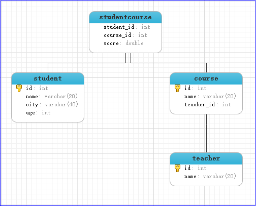


### 练习1

#### 目标

查询获得最高分的学生信息。

#### 讲解

具体操作：

分析：

1）在中间表中找最高分；

2）在中间表中找最高分对应的学生编号；

3）在学生表中根据学生编号找学生信息；

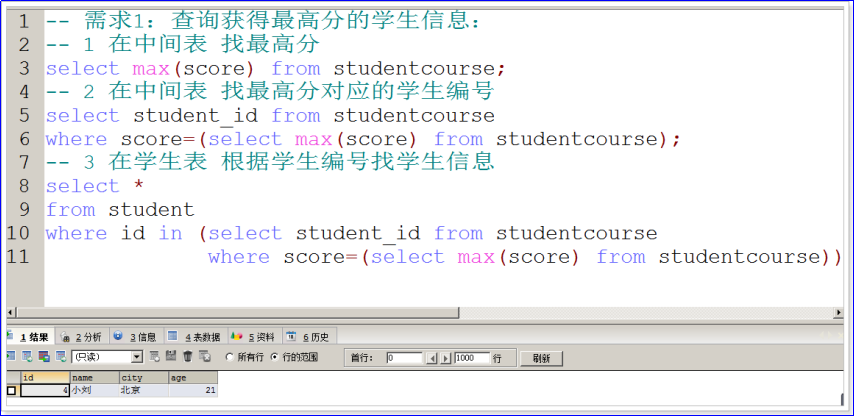

### 练习2

#### 目标

查询编号是2的课程比编号是1的课程最高成绩高的学生信息。

#### 讲解

具体操作：

课程编号和对应的成绩的部分数据：

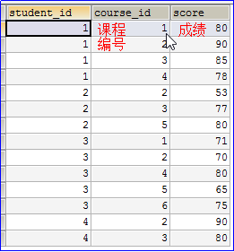

分析：

1）在中间表中 找编号是1的课程的最高成绩;

2）在中间表中 找编号是2的成绩 > 编号1最高成绩 的学生id;

3）在学生表中 根据学生的编号 找对应的学生信息;

Sql语句如下所示：

```sql
-- 需求2：查询编号2课程 比 编号1课程最高成绩高学生信息：
-- 2.1 在中间表 找编号1课程的最高成绩
select max(score)
from studentcourse 
where course_id=1;
-- 2.2 在中间表 编号2的成绩 > 编号1最高成绩 的学生id
select student_id
from studentcourse
where course_id=2 and score>(select max(score)
							 from studentcourse 
							 where course_id=1);
-- 2.3 在学生表 根据编号 找对应的学生信息
select *
from student
where id in (select student_id
			 from studentcourse
			 where course_id=2 and score>(select max(score)
										  from studentcourse 
										  where course_id=1));
```

查询结果：

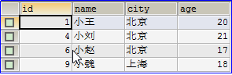

### 练习3

#### 目标

查询编号是2的课程比编号是1的课程最高成绩高的学生姓名和成绩。

#### 讲解

具体操作：

分析：

1）在中间表中 找编号是1的课程的最高成绩;

2）在中间表中 找编号是2的成绩 > 编号1最高成绩 的学生id和成绩;

3）将上述查询出来的内容作为临时表 和 学生表关联, 查询姓名和成绩

```sql
-- 需求3：查询编号2课程比编号1课程最高成绩高学生姓名和成绩 （临时表）		
-- 2.1 在中间表 找编号1课程的最高成绩
select max(score)
from studentcourse 
where course_id=1;
-- 2.2 在中间表 编号2的成绩 > 编号1最高成绩 的学生id,成绩
select student_id,score
from studentcourse
where course_id=2 and score>(select max(score)
							 from studentcourse 
							 where course_id=1);
-- 2.3 将上述查询出来的内容作为临时表 和 学生表关联, 查询姓名和成绩
select student.name, temp.score
from student, (select student_id,score
			   from studentcourse
			   where course_id=2 and score>(select max(score)
										    from studentcourse 
										    where course_id=1)) as temp
where student.id=temp.student_id;
```

### 练习4

#### 目标

查询每个同学的学号、姓名、选课数、总成绩。

#### 讲解

分析：

1）、在中间表中查询每个学生的选课数和总成绩，遇到每个，分组，按照学生学号进行分组;

2）、由于还得显示学号和姓名，并且姓名在student表中，所以我们将上述结果作为临时表和学生表关联。

目的是查找临时表和student表中学号相等时查找学号，姓名，选课数，总成绩。

```sql
-- 2、查询所有同学的学号、姓名、选课数、总成绩
-- 2.1 在中间表 查询每个学生的选课数和总成绩
select student_id,count(*),sum(score)
from studentcourse
group by student_id;
-- 2.2 将2.1的结果作为临时表和学生表关联,
-- 目的: 显示 学号、姓名、选课数、总成绩
select student.id,student.name,temp.cou,temp.sumScore
from student,(select student_id,count(*) as cou,sum(score) as sumScore
			  from studentcourse
			  group by student_id) as temp
where student.id=temp.student_id;
```

注意：

如果我们想使用聚合函数作为查找的结果，并且聚合函数存在子查询语句中，那么我们不能直接将聚合函数写在select后面，我们此时应该给聚合函数取别名。


## 12、 多表查询案例(连接查询)

​	我们在公司开发中，根据不同的业务需求往往需要通过2张及以上的表中去查询需要的数据。所以我们有必要学习2张及以上的表的查询。其实不管是几张表的查询，都是有规律可循的。

### 1.准备数据

```sql
-- 部门表
CREATE TABLE dept (
  id INT PRIMARY KEY PRIMARY KEY, -- 部门id
  dname VARCHAR(50), -- 部门名称
  loc VARCHAR(50) -- 部门位置
);

-- 添加4个部门
INSERT INTO dept(id,dname,loc) VALUES 
(10,'教研部','北京'),
(20,'学工部','上海'),
(30,'销售部','广州'),
(40,'财务部','深圳');

-- 职务表，职务名称，职务描述
CREATE TABLE job (
  id INT PRIMARY KEY,
  jname VARCHAR(20),
  description VARCHAR(50)
);

-- 添加4个职务
INSERT INTO job (id, jname, description) VALUES
(1, '董事长', '管理整个公司，接单'),
(2, '经理', '管理部门员工'),
(3, '销售员', '向客人推销产品'),
(4, '文员', '使用办公软件');

-- 员工表
CREATE TABLE emp (
  id INT PRIMARY KEY, -- 员工id
  ename VARCHAR(50), -- 员工姓名
  job_id INT, -- 职务id
  mgr INT , -- 上级领导
  joindate DATE, -- 入职日期
  salary DECIMAL(7,2), -- 工资
  bonus DECIMAL(7,2), -- 奖金
  dept_id INT, -- 所在部门编号
  CONSTRAINT emp_jobid_ref_job_id_fk FOREIGN KEY (job_id) REFERENCES job (id),
  CONSTRAINT emp_deptid_ref_dept_id_fk FOREIGN KEY (dept_id) REFERENCES dept (id)
);

-- 添加员工
INSERT INTO emp(id,ename,job_id,mgr,joindate,salary,bonus,dept_id) VALUES 
(1001,'孙悟空',4,1004,'2000-12-17','8000.00',NULL,20),
(1002,'卢俊义',3,1006,'2001-02-20','16000.00','3000.00',30),
(1003,'林冲',3,1006,'2001-02-22','12500.00','5000.00',30),
(1004,'唐僧',2,1009,'2001-04-02','29750.00',NULL,20),
(1005,'李逵',4,1006,'2001-09-28','12500.00','14000.00',30),
(1006,'宋江',2,1009,'2001-05-01','28500.00',NULL,30),
(1007,'刘备',2,1009,'2001-09-01','24500.00',NULL,10),
(1008,'猪八戒',4,1004,'2007-04-19','30000.00',NULL,20),
(1009,'罗贯中',1,NULL,'2001-11-17','50000.00',NULL,10),
(1010,'吴用',3,1006,'2001-09-08','15000.00','0.00',30),
(1011,'沙僧',4,1004,'2007-05-23','11000.00',NULL,20),
(1012,'李逵',4,1006,'2001-12-03','9500.00',NULL,30),
(1013,'小白龙',4,1004,'2001-12-03','30000.00',NULL,20),
(1014,'关羽',4,1007,'2002-01-23','13000.00',NULL,10);

-- 工资等级表
CREATE TABLE salarygrade (
  grade INT PRIMARY KEY,
  losalary INT, -- 最低薪资
  hisalary INT -- 最高薪资
);

-- 添加5个工资等级
INSERT INTO salarygrade(grade,losalary,hisalary) VALUES 
(1,7000,12000),
(2,12010,14000),
(3,14010,20000),
(4,20010,30000),
(5,30010,99990);
```

分析4张表的关系：通过4张表可以查出一个员工的所有信息


说明：一个部门有多种职务，例如销售部有经理和销售员。一种职务可以在多个部门，例如文员可以在学工部和教研部。


### 2 练习

#### 1.1 练习1

查询所有员工信息。显示员工编号，员工姓名，工资，职务名称，职务描述。


具体操作：
   1.确定要查询哪些表：emp e, job j

   ```sql
   SELECT * FROM emp e INNER JOIN job j;
   ```

   

   2.确定表连接条件： e.job_id=j.id

   ```sql
   SELECT * FROM emp e INNER JOIN job j ON e.job_id=j.id;
   ```

   
   

   3.确定查询字段：员工编号，员工姓名，工资，职务名称，职务描述

   ```sql
   SELECT e.id, e.ename, e.salary, j.jname, j.description FROM emp e INNER JOIN job j ON e.job_id=j.id;
   ```

   


#### 1.2 练习2

查询所有员工信息。显示员工编号，员工姓名，工资，职务名称，职务描述，部门名称，部门位置

具体操作：

   1. 确定要查询哪些表，emp e, job j, dept d

      

   ```sql
   SELECT * FROM emp e INNER JOIN job j INNER JOIN dept d;
   ```

   
   

      2. 确定表连接条件 e.job_id=j.id and e.dept_id=d.id

   ```sql
   SELECT * FROM emp e INNER JOIN job j INNER JOIN dept d ON e.job_id=j.id AND e.dept_id=d.id;
   ```

   
   

      3. 确定查询字段：员工编号，员工姓名，工资，职务名称，职务描述，部门名称，部门位置

   ```sql
   SELECT e.id, e.ename, e.salary, j.jname, j.description, d.dname, d.loc FROM emp e INNER JOIN job j INNER JOIN dept d ON e.job_id=j.id AND e.dept_id=d.id;
   
   或者：
   SELECT e.id,e.ename,e.salary,j.jname,j.description,d.dname,d.loc
FROM emp e INNER JOIN job j ON e.job_id = j.id INNER JOIN dept d on e.dept_id = d.id;
   ```

   

#### 1.3 练习3

查询所有员工信息。显示员工姓名，工资，职务名称，职务描述，部门名称，部门位置，工资等级。


具体操作：
      1. 确定要查询哪些表，emp e, job j, dept d, salarygrade s

   ```sql
   SELECT * FROM emp e INNER JOIN job j INNER JOIN dept d INNER JOIN salarygrade s;
   ```

   
   

      2. 确定表连接条件 e.job_id=j.id and e.dept_id=d.id and e.salary between s.losalary and s.hisalary

   ```sql
   SELECT * FROM emp e INNER JOIN job j INNER JOIN dept d INNER JOIN salarygrade s ON e.job_id=j.id AND e.dept_id=d.id AND e.salary BETWEEN s.losalary AND s.hisalary;
   ```

   
   

      3. 确定查询字段：员工姓名，工资，职务名称，职务描述，部门名称，部门位置，工资等级

   ```sql
   SELECT e.ename, e.salary, j.jname, j.description, d.dname, d.loc, s.grade FROM emp e INNER JOIN job j INNER JOIN dept d INNER JOIN salarygrade s ON e.job_id=j.id AND e.dept_id=d.id AND e.salary BETWEEN s.losalary AND s.hisalary;
   ```

   

##### 1.3.1 多表查询规律总结

1. 不管我们查询几张表，表连接查询会产出笛卡尔积，我们需要消除笛卡尔积，拿到正确的数据。我们需要找到表与表之间通过哪个字段关联起来的（通常是`外键=主键`）
2. 消除笛卡尔积规律：2张表需要1个条件，3张表需要2个条件，4张表需要3个条件。（条件数量=表的数量-1），每张表都要参与进来
3. 多表连接查询步骤：
   3.1. 确定要查询哪些表
   3.2. 确定表连接条件
   3.3. 确定查询字段

#### 1.4 练习4

查询经理的信息。显示员工姓名，工资，职务名称，职务描述，部门名称，部门位置，工资等级

具体操作：
      1. 确定要查询哪些表，emp e, job j, dept d, salarygrade s

   ```sql
     SELECT * FROM emp e INNER JOIN job j INNER JOIN dept d INNER JOIN salarygrade s;
   ```

   
   

      2. 确定表连接条件 e.job_id=j.id and e.dept_id=d.id and e.salary between s.losalary and s.hisalary

   ```sql
   SELECT * FROM emp e INNER JOIN job j INNER JOIN dept d INNER JOIN salarygrade s ON e.job_id=j.id AND e.dept_id=d.id AND e.salary BETWEEN s.losalary AND s.hisalary;
   ```

   
   

   额外条件：只需要查询经理的信息（j.jname='经理'）
   

      3. 确定查询字段：员工姓名，工资，职务名称，职务描述，部门名称，部门位置，工资等级

   ```sql
   SELECT e.ename, e.salary, j.jname, j.description, d.dname, d.loc, s.grade FROM emp e INNER JOIN job j INNER JOIN dept d INNER JOIN salarygrade s ON e.job_id=j.id AND e.dept_id=d.id AND e.salary BETWEEN s.losalary AND s.hisalary AND j.jname='经理';
   ```

   

#### 1.5 练习5

查询出每个部门的部门编号、部门名称、部门位置、部门人数

具体操作：

      1. 去员工表中找到每个部门的人数和部门id

   ```sql
   SELECT dept_id, COUNT(*) FROM emp GROUP BY dept_id;
   ```

   

      2. 再和部门表连接查询

   ```sql
   SELECT * FROM dept d INNER JOIN (SELECT dept_id, COUNT(*) FROM emp GROUP BY dept_id) e ON e.dept_id=d.id;
   ```

   
   

      3. 显示对应的字段

   ```sql
   SELECT d.id, d.dname, d.loc, e.total 部门人数 FROM dept d INNER JOIN (SELECT dept_id, COUNT(*) total FROM emp GROUP BY dept_id) e ON e.dept_id=d.id;
   ```

   
   最终效果：
   


# 学习总结

1. 能够理解三大范式

   | **范式**     | **特点**                                     |
   | ------------ | -------------------------------------------- |
   | **第一范式** | 原子性：表中每列不可再拆分                   |
   | **第二范式** | 不产生局部依赖，表中每列完全依赖于主键       |
   | **第三范式** | 不产生传递依赖，表中和每列都是直接依赖于主键 |

   

5. 能够使用内连接进行多表查询

   ```mysql
   select 列名 from 左表,右表 where 条件
   select 列名 from 左表 inner join 右表 on 条件
   ```

   

6. 能够使用左外连接和右外连接进行多表查询

   ```mysql
   select 列名 from 左表 left join 右表 on 条件
   ```

   ```mysql
   select 列名 from 左表 right join 右表 on 条件
   ```

   

7. 能够使用子查询进行多表查询

   1. 单行单列：父查询使用比较运算符
   2. 多行单列：父查询使用in all any
   3. 多行多列：将查询结果做成一张虚拟表，再次查询

   

8. 能够理解多表查询的规律

  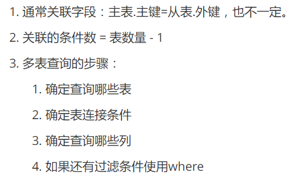 

   

# 作业:

## 多表查询

**sql脚本与表关系**


```sql
CREATE DATABASE demo3;
USE demo3;
##部门表
CREATE TABLE dept(
	deptno INT  PRIMARY KEY,##部门编号
	dname VARCHAR(14) ,	##部门名称
	loc VARCHAR(13)  	##部门地址
);
#部门表数据
INSERT INTO dept VALUES	(10,'财务部','北京'),(20,'市场部','上海'),(30,'销售部','广州'),(40,'运营部','深圳'); 
	
##员工表	
CREATE TABLE emp(
	empno INT  PRIMARY KEY,	#员工编号
	ename VARCHAR(10),		#员工姓名
	job VARCHAR(20),			#员工工作
	mgr INT, 				#员工直属领导编号
	hiredate DATE, 			#入职时间
	sal DOUBLE,				#工资
	comm DOUBLE,			#奖金
	deptno INT				#对应dept表的外键
);  
## 添加 部门 和 员工 之间的主外键关系
ALTER TABLE emp ADD CONSTRAINT FOREIGN KEY emp(deptno) REFERENCES dept (deptno);

INSERT INTO emp VALUES(7369,'smith','保洁工作',7902,"1980-12-17",800,NULL,20);
INSERT INTO emp VALUES(7499,'allen','销售工作',7698,'1981-02-20',1600,300,30);
INSERT INTO emp VALUES(7521,'ward','销售工作',7698,'1981-02-22',1250,500,30);
INSERT INTO emp VALUES(7566,'jones','管理工作',7839,'1981-04-02',2975,NULL,20);
INSERT INTO emp VALUES(7654,'martin','销售工作',7698,'1981-09-28',1250,1400,30);
INSERT INTO emp VALUES(7698,'blake','管理工作',7839,'1981-05-01',2850,NULL,30);
INSERT INTO emp VALUES(7782,'clark','管理工作',7839,'1981-06-09',2450,NULL,10);
INSERT INTO emp VALUES(7788,'scott','策划工作',7566,'1987-07-03',3000,NULL,20);
INSERT INTO emp VALUES(7839,'king','大BOSS',NULL,'1981-11-17',5000,NULL,10);
INSERT INTO emp VALUES(7844,'turner','销售工作',7698,'1981-09-08',1500,0,30);
INSERT INTO emp VALUES(7876,'adams','保洁工作',7788,'1987-07-13',1100,NULL,20);
INSERT INTO emp VALUES(7900,'james','保洁工作',7698,'1981-12-03',950,NULL,30);
INSERT INTO emp VALUES(7902,'ford','策划工作',7566,'1981-12-03',3000,NULL,20);
INSERT INTO emp VALUES(7934,'miller','保洁工作',7782,'1981-01-23',1300,NULL,10);

# 工资等级表
CREATE TABLE salgrade( 
	grade INT,	#等级
	losal DOUBLE,	#最低工资
	hisal DOUBLE 	#最高工资
);	

INSERT INTO salgrade VALUES (1,700,1200),(2,1201,1400),(3,1401,2000),(4,2001,3000),(5,3001,9999);
```

题目:

```sql
#1.返回拥有员工的部门名、部门号。
	
#2.工资水平多于smith的员工信息。
	
#3.返回员工和所属经理的姓名。

#4.返回雇员的雇佣日期早于其经理雇佣日期的员工及其经理姓名
	
#5.返回员工姓名及其所在的部门名称。
	
#6.返回从事"保洁工作"的员工姓名和所在部门名称。
	
#7.返回部门号及其本部门的最低工资。
	
#8.返回"销售部"所有员工的姓名。
	
#9.返回工资水平多于平均工资的员工。
	
#10.返回与SCOTT从事相同工作的员工。
	
#11.返回与30部门员工工资相同的员工姓名与工资。
	
#12.返回工资高于30部门所有员工工资的员工信息。	
	
#13.返回部门号、部门名、部门所在位置及其每个部门的员工总数。
	
#14.返回员工的姓名、所在部门名及其工资。
	
#15.返回员工的详细信息。(包括部门名)

#16.返回员工工作及其从事此工作的最低工资。
	
#17.计算出员工的年薪，并且以年薪排序。
	
#18.返回工资处于第四级别的员工的姓名。
	
#19.返回工资为二等级的职员名字、部门所在地、和二等级的最低工资和最高工资
	
#20.工资等级多于smith的员工信息。
```

