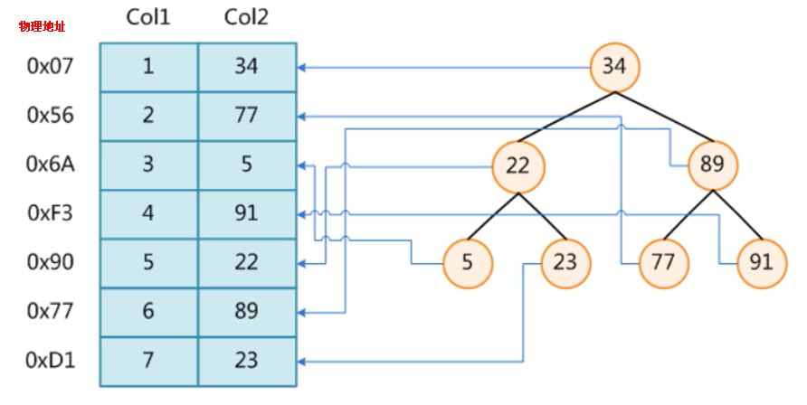
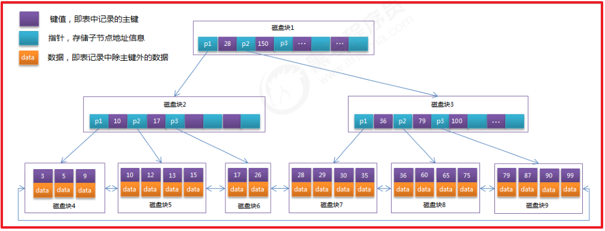
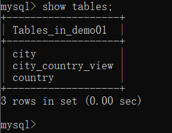
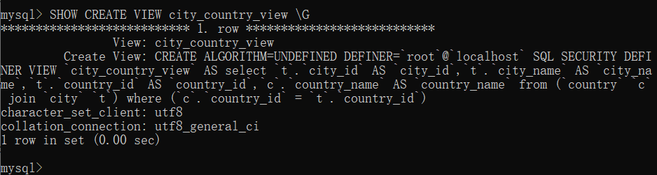
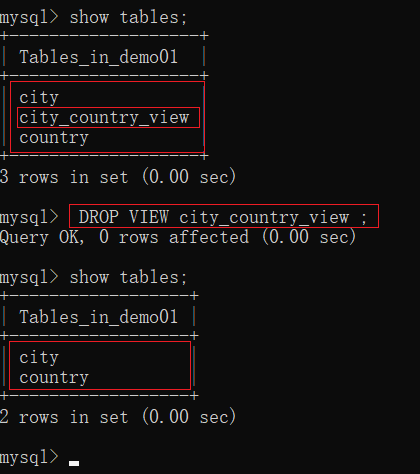

# day03-mysql高级

# 学习目标

- 能够理解事务的相关概念
- 能够在Mysql中使用事务
- 能够理解脏读,不可重复读,幻读的概念及解决办法
- 能够理解索引的作用
- 能够理解索引的结构
- 能够在表中创建索引、查看索引，删除索引
- 能够理解视图的作用
- 能够在Mysql中使用视图
- 能够理解触发器并使用触发器

# 第一章 MySQL常用函数(理解)

## 1 字符串函数

| 函数                     | 描述                                                         | 实例                                     |
| ------------------------ | ------------------------------------------------------------ | ---------------------------------------- |
| CHAR_LENGTH(s)           | 返回字符串 s 的字符数                                        | SELECT CHAR_LENGTH('itheima') AS '长度'; |
| **CONCAT(s1,s2...sn)**   | 字符串 s1,s2 等多个字符串合并为一个字符串                    | SELECT CONCAT('I','love','you');         |
| LOWER(s)                 | 将字符串 s 的所有字母变成小写字母                            | SELECT LOWER('ITHEIMA');                 |
| UPPER(s)                 | 将字符串转换为大写                                           | SELECT UPPER("itheima");                 |
| SUBSTR(s,  start,length) | 从字符串 s 的 start 位置(从1开始)截取长度为 length 的子字符串 | SELECT SUBSTR("itheima",1,2);            |
| TRIM(s)                  | 去掉字符串 s 开始和结尾处的空格                              | SELECT TRIM(' itheima ')                 |

<div style='background-color:#42C0A3;'>示例: </div>
```sql
SELECT CHAR_LENGTH('itheima') AS '长度';
--执行结果为: 7
SELECT CONCAT('I','love','you');
--执行结果为: Iloveyou
SELECT LOWER('ITHEIMA');
--执行结果为: itheima
SELECT UPPER("itheima");
--执行结果为: ITHEIMA
SELECT SUBSTR("itheima",1,2);
--执行结果为: it
SELECT TRIM(' it heima ');
--执行结果为: it heima
```

## 2 数字函数

| 函数                                  | 描述                     | 实例                                |
| ------------------------------------- | ------------------------ | ----------------------------------- |
| RAND()                                | 返回 0 到 1 的随机数     | SELECT RAND();                      |
| ROUND(小数 , 小数点后保留小数位数)    | 四舍五入保留几位小数     | SELECT ROUND(3.1415926,2) ;         |
| TRUNCATE(小数 , 小数点后保留小数位数) | 不会四舍五入保留几位小数 | SELECT  TRUNCATE(3.1415926,3);      |
| LEAST(expr1, expr2, expr3, ...)       | 返回列表中的最小值       | SELECT LEAST(13, 14, 521, 74, 1)    |
| GREATEST(expr1,  expr2,expr3, ...)    | 返回列表中的最大值       | SELECT GREATEST(13, 14, 521, 74, 1) |

<div style='background-color:#42C0A3;'>示例: </div>
```sql
SELECT RAND();	-- 返回0-1之间的随机数 0.21809973867433122
SELECT ROUND(3.1415926,3) ; -- 执行结果: 3.142
select TRUNCATE(3.1415926,3);-- 执行结果:3.141
SELECT LEAST(13, 14, 521, 74, 1);	-- 执行结果: 1
SELECT GREATEST(13, 14, 521, 74, 1); -- 执行结果: 521
```

## 3 日期函数

| 函数名             | 描述                     | 实例                               |
| :----------------- | :----------------------- | :--------------------------------- |
| NOW() 和 SYSDATE() | 返回系统的当前日期和时间 | SELECT NOW(); 或 SELECT SYSDATE(); |
| CURDATE()          | 返回当前日期             | SELECT CURDATE();                  |
| CURTIME()          | 返回当前系统时间         | SELECT CURTIME();                  |
| YEAR(d)            | 返回d的中的年份          | SELECT YEAR(NOW());                |
| MONTH(d)           | 返回d的中的月份          | SELECT MONTH(NOW());               |
| DAY(d)             | 返回d中的日              | SELECT DAY(NOW());                 |

<div style='background-color:#42C0A3;'>示例: </div>
```sql
SELECT NOW(); 或 SELECT SYSDATE(); -- 返回系统的当前时间: 年-月-日 时:分:秒 
SELECT CURDATE(); -- 返回系统当前日期: 年-月-日
SELECT CURTIME(); -- 返回系统当前时间: 时:分:秒
SELECT YEAR(NOW()); -- 返回当前日期中的年份
SELECT MONTH(NOW()); -- 返回当前日期中的月份
SELECT DAY(NOW()); -- 返回当前日期中的日
```

## 4 高级函数

| 函数名                                                       | 描述                                            | 实例                             |
| :----------------------------------------------------------- | :---------------------------------------------- | :------------------------------- |
| CURRENT_USER()                                               | 返回当前用户                                    | SELECT CURRENT_USER();           |
| [IFNULL(v1,v2)](https://www.runoob.com/mysql/mysql-func-ifnull.html) | 如果 v1 的值不为 NULL，则返回 v1，否则返回 v2。 | SELECT IFNULL(null,'Hello Word') |
| ISNULL(expression)                                           | 判断表达式是否为 NULL                           | SELECT ISNULL(NULL);             |

~~~sql
select current_user() -- 结果：root@localhost
select ifnull(null,'itheima')-- 结果：itheima
select ifnull('黑马程序员','itheima')-- 结果：黑马程序员
select isnull(null); -- 结果：1 表示真 是null
select isnull('锁哥'); -- 结果：0 表示假 不是null
~~~


# 第二章 事务(掌握)

## 1、事务的概念

### 目标

能够理解事务的概念

### 讲解

#### 事务的应用场景说明

关于事务在实际中的应用场景：

假设我在淘宝买了一部手机，然后当我付完款，钱已经从我的账户中扣除。正当此时，淘宝转账系统崩溃了，那么此时淘宝还没有收到钱，而我的账户的钱已经减少了，这样就会导致我作为买家钱已经付过，而卖家还没有收到钱，他们不会发货物给我。这样做显然是不合理。实际生活中是如果淘宝出问题，作为用户的账户中钱是不应该减少的。这样用户就不会损失钱。

还有种情况，就是当我付完款之后，卖家看到我付款成功，然后直接发货了，我如果有权限操作，我可以撤销，这样就会导致我的钱没有减少，但是卖家已经发货，同样这种问题在实际生活中也是不允许出现的。

关于上述两种情况，使用数据库中的事务可以解决。具体解决方案如下图所示：


**说明：在数据库中查询不会涉及到使用事务，都是增删改。**

#### 什么是事务

​	在实际的业务开发中，有些业务操作要多次访问数据库。一个业务要发送多条SQL语句给数据库执行。需要将多次访问数据库的操作视为一个整体来执行，要么所有的SQL语句全部执行成功。如果其中有一条SQL语句失败，就进行事务的回滚，所有的SQL语句全部执行失败。

简而言之，事务指的是逻辑上的一组操作,组成这组操作的各个单元要么全都成功,要么全都失败。

 事务作用：保证在一个事务中多次操作数据库表中数据时，要么全都成功,要么全都失败。

### 小结

什么是事务？多条SQL组合再一起完成某个功能.

## 2、手动提交事务

### 目标

能够使用手动的方式提交事务

### 讲解

MYSQL中可以有两种方式进行事务的操作：

1. 手动提交事务：先开启，再提交
2. 自动提交事务(默认的):即执行一条sql语句提交一次事务。

 事务有关的SQL语句：

| SQL语句            | 描述             |
| ------------------ | ---------------- |
| start transaction; | 开启手动控制事务 |
| commit;            | 提交事务         |
| rollback;          | 回滚事务         |

#### 手动提交事务使用步骤

​    第1种情况：开启事务 -> 执行SQL语句 -> 成功 -> 提交事务
​    第2种情况：开启事务 -> 执行SQL语句 -> 失败 -> 回滚事务
   

准备数据:

```sql
# 创建一个表：账户表.
create database day04_db;
# 使用数据库
use day04_db;
# 创建账号表
create table account(
	id int primary key auto_increment,
	name varchar(20),
	money double
);
# 初始化数据
insert into account values (null,'a',1000);
insert into account values (null,'b',1000);
```


**案例演示1**：需求：演示提交事务，a给b转账100元。


---

**案例演示2**：演示回滚事务，a给b转账100元。（失败）


注意：

事务是如何处理正常情况的呢？

a=1000 b=1000

开启事务(start transaction;)

update account set money = money -100 where name='a';	

update account set money = money +100 where name='b'; 

提交事务(commit;) (事务提交之后，sql语句对数据库产生的操作才会被永久的保存)

 

事务是如何处理异常情况的呢？

a=1000 b=1000 

开启事务(start transaction;)

update t_account set money = money -100 where name='a'; a=900

出现异常

update t_account set money = money +100 where name='b';

事务的回滚(rollback;)(撤销已经成功执行的sql语句，回到开启事务之前的状态)

a=1000 b=1000;

注意：只要提交事务，那么数据就会长久保存了，就不能回滚事务了。即提交或者回滚事务都是代表结束当前事务的操作。


### 小结

1. 如何开启事务: start transaction;
2. 如何提交事务: commit;
3. 如何回滚事务: rollback;

## 3、自动提交事务

### 目标

了解自动提交事务

能够关闭自动提交事务

### 讲解

​	MySQL的每一条DML(增删改)语句都是一个单独的事务，每条语句都会自动开启一个事务，执行完毕自动提交事务，MySQL默认开始自动提交事务。自动提交，通过修改mysql全局变量“autocommit”进行控制。

1.通过以下命令可以查看当前autocommit模式：

```sql
show variables like '%commit%';
```


2.设置自动提交的参数为OFF:

```sql
set autocommit = 0;  -- 0:OFF  1:ON
```


### 小结

1）MySql默认自动提交。即执行一条sql语句提交一次事务。

2）设置autocommit为off状态，只是临时性的，下次重新启动mysql，autocommit依然变为on状态。

3）如果设置autocommit为off状态，那么当我们执行一条sql语句，就不会自动提交事务，重新启动可视化工具，数据并没有改变。

4）如果设置autocommit为on状态，如果我们先执行 start transaction; 然后在执行修改数据库的语句：

update account set money = money-100 where name='a';

update account set money = money+100 where name='b';

那么此时就表示上述修改数据库的sql语句都在同一个事务中，此时必须手动提交事务，即commit;

换句话说，如果我们手动开启事务 start transaction; 那么此时mysql就不会自动提交事务，必须手动提交事务。

5）如果设置autocommit为on状态，如果我们不执行 start transaction; 直接执行修改数据库的语句：

update account set money = money-100 where name='a';

update account set money = money+100 where name='b';

那么此时mysql就会自动提交事务。即上述每条sql语句就是一个事务。


课堂代码演示：

```sql
show variables like '%commit%';

set autocommit = 0;
start transaction;

update account set money = money-100 where name='a';

update account set money = money+100 where name='b';

commit;

rollback;
```

## 4、事务的回滚点和执行原理

### 目标

1. 事务的回滚点
2. 事务的原理

### 什么是回滚点

上面的操作，如果回滚，直接回滚到事务开始前。有时我们并不需要回滚到最开始的状态，可能只需要回滚到中间的某个位置，就可以设置回滚点。

### 语句

| **回滚点的操作语句** | **语句**         |
| -------------------- | ---------------- |
| **设置回滚点**       | savepoint 名字   |
| **回到回滚点**       | rollback to 名字 |

### 操作1

1. 将数据还原到1000

2. 开启事务

3. 让a用户减2次钱，每次100块

4. 回滚事务

5. commit提交事务---数据没有更改

   代码演示如下：

~~~sql
-- 没有设置回滚点，回到开启事务之前的状态
-- 开启事务
start transaction;
-- a用户扣除100
update account set money = money - 100 where name='a';
-- a用户再次扣除100
update account set money = money - 100 where name='a';
-- 回滚事务
rollback;
commit;
~~~

### 操作2

1. 将数据还原到1000
2. 开启事务
3. 让a用户先减100块
4. 设置回滚点：savepoint itcast; 
5. 然后让a用户再次减100块
6. 回到回滚点：rollback to itcast
7. 最后commit提交事务

 代码演示如下：

~~~sql
-- 设置回滚点
-- 开启事务
start transaction;
-- a用户扣除100
update account set money = money - 100 where name='a';
-- 设置回滚点
savepoint itcast;
-- a用户再次扣除100
update account set money = money - 100 where name='a';
-- 回滚事务
-- rollback;
-- 回到回滚点
rollback to itcast; 
commit;
~~~


### 原理图


### 原理说明

1. 一个用户登录成功以后，服务器会创建一个临时日志文件。日志文件用来保存用户事务状态。
2. 如果没有使用事务，则所有的操作直接写到数据库中，不会使用日志文件。
3. 如果开启事务，将所有的写操作写到日志文件中。
4. 如果这时用户提交了事务，则将日志文件中所有的操作写到数据库中。
5. 如果用户回滚事务，则日志文件会被清空，不会影响到数据库的操作。


### 事务操作小结

说出事务原理？
开启事务后,SQL语句会放在临时的日志文件中,如果提交事务,将日志文件中SQL的结果放在数据库中

如果回滚事务清空日志文件.

| **事务的操作**             | **MySQL操作事务的语句**            |
| -------------------------- | ---------------------------------- |
| **手动开启事务**           | start transaction                  |
| **手动提交事务**           | commit                             |
| **手动回滚事务**           | rollback                           |
| **设置回滚点**             | savepoint 名字                     |
| **回到回滚点**             | rollback to 名字                   |
| **查询事务的自动提交情况** | show variables like '%commit%';    |
| **设置事务的手动提交方式** | set autocommit = 0 -- 关闭自动提交 |

## 5、事务的四大特性(ACID)(面试)

### 目标

了解事务的四大特性

### 讲解

数据库的事务必须具备ACID特性，ACID是指 Atomicity（原子性）、Consistensy（一致性）、Isolation（隔离性）和Durability（持久性）的英文缩写。

**1、隔离性（Isolation）**

多个用户并发的访问数据库时，一个用户的事务不能被其他用户的事务干扰，多个并发的事务之间要相互隔离。

 一个事务的成功或者失败对于其他的事务是没有影响。2个事务应该相互独立。

举例：

a 给b转账 -----》叫做事务A

c 给d 转账 -----》叫做事务B

事务A和事务B之间不会相互影响。

**2、持久性（Durability）**

指一个事务一旦被提交，它对数据库的改变将是永久性的，哪怕数据库发生异常，重启之后数据亦然存在。

举例：

a=1000、b=1000转账

开启事务

a-100

b+100

提交

结果： a 900 b 1100

即使事务提交以后再发生异常，a和b的数据依然不会变。a就是900  b就是1100。

**3、原子性（Atomicity）** 

**原子性是指事务**包装的一组sql(一组业务逻辑)是一个不可分割的工作单位，事务中的操作要么都发生，要么都不发生。

**4、一致性（Consistency）**

一个事务在执行之前和执行之后 数据库都必须处于一致性状态。

如果事务成功的完成，那么数据库的所有变化将生效。

如果事务执行出现错误，那么数据库的所有变化将会被回滚（撤销），返回到原始状态。

**事务的成功与失败，最终数据库的数据都是符合实际生活的业务逻辑。一致性绝大多数依赖业务逻辑和原子性。**

举例1： a=1000、b=1000 转账 100

a - 100

b + 100

结果： a + b = 2000

如果a转账失败了，那么b也得失败。不能因为a失败了，a依然是1000.但是b却成功了，b却变成了1100.那么结果是2100了，这样是不符合事务的一致性的。

### 小结

事务四个特性？
原子性
一致性
隔离性
持久性

| 事务特性              | 含义                                                         |
| --------------------- | ------------------------------------------------------------ |
| 一致性（Consistency） | 事务前后数据的完整性必须保持一致                             |
| 原子性（Atomicity）   | 事务是一个不可分割的工作单位，事务中的操作要么都发生，要么都不发生。 |
| 隔离性（Isolation）   | 是指多个用户并发访问数据库时，一个用户的事务不能被其它用户的事务所干扰，多个并发事务之间数据要相互隔离，不能相互影响。 |
| 持久性（Durability）  | 指一个事务一旦被提交，它对数据库中数据的改变就是永久性的，接下来即使数据库发生故障也不应该对其有任何影响 |


## 6、事务的并发访问引发的三个问题(面试)

### 目标

能够理解并发访问的三个问题

### 讲解

事务在操作时的理想状态：多个事务之间互不影响，如果隔离级别设置不当就可能引发并发访问问题。

| 并发访问的问题 | 含义                                                         |
| -------------- | ------------------------------------------------------------ |
| 脏读           | 一个事务读取到了另一个事务中尚未提交的数据。最严重，杜绝发生。 |
| 不可重复读     | 一个事务中两次读取的数据内容不一致，要求的是一个事务中多次读取时数据是不一致的，这是事务update时引发的问题 |
| 幻读           | 一个事务内读取到了别的事务插入或者删除的数据，导致前后读取记录行数不同。这是insert或delete时引发的问题 |

   **1.脏读：指一个事务读取了另外一个事务未提交的数据。(非常危险)**

​	脏读具体解释如下图所示：注意脏读的前提是没有事务的隔离性。


说明：事务a首先执行转账操作，然后事务a还没有提交数据的情况下，事务b读取了数据库的数据。紧接着事务a执行回滚操作，导致事务b读取的结果和数据库的实际数据是不一样的。

一个事务读取了另一个事务未提交的数据叫做脏读。

举例：

a 转账 给b  100，未提交

b 查询账户多了100

a 回滚

b 查询账户那100不见了。 

一个事务读取了另一个事务没有提交的数据，非常严重，必须避免脏读。

**2.不可重复读：在一个事务内多次读取表中的数据，多次读取的结果不同。**


说明：事务b首先读取数据库的数据，然后事务a对数据修改并提交。之后事务b对数据库再次进行读取。这时发现在事务b中2次读取的结果不一致。

一个事务内读取了另一个事务提交的数据。这个叫做不可重复读。

不可重复读和脏读的区别：

脏读：强调的是读取了未提交的数据。

不可重复读：一个事务内2次读取，其中一次读取了另一个事务提交了的数据。

例如: 银行想查询A账户的余额，第一次查询的结果是200元，A向账户中又存了100元。此时，银行再次查询的结果变成了300元。两次查询的结果不一致，银行就会很困惑，以哪次为准。

和脏读不同的是：脏读读取的是前一事务未提交的数据，不可重复度 读取的是前一事务已提交的事务。

很多人认为这有啥好困惑的，肯定是以后面的结果为准了。我们需要考虑这样一种情况，查询A账户的余额，一个打印到控制台，一个输出到硬盘上，同一个事务中只是顺序不同，两次查询结果不一致，到底以哪个为准，你会不会困惑呢？

当前事务查询A账户的余额为100元，另外一个事务更新余额为300元并提交，导致当前事务使用同一查询结果却变成了300元。

**3.幻读（虚读）:一个事务内读取到了别的事务插入或者删除的数据，导致前后读取记录行数不同**


说明：事务b首先读取数据的数量，然后事务a添加了一条数据，并且提交了。接着事务b再次读取了数据的数量。2次读取不一致。

同一个事务内，2次读取的数据的数量不一致，叫做幻读或者虚读。

虚读(幻读)和不可重复读的区别：

不可重复读：强调的是数据内容的不一致。另一个事务是update操作。

虚读(幻读)：强调的数据的数量(记录数)的不一致。另一个事务是insert或者delete操作。

注意：

指在一个事务中 读取 另一个事务 插入或删除 数据记录，导致当前事务读取数据的记录数前后不一致。

一个事务读取另一个事务已经提交的数据，强调的是记录数的变化，常用sql类型为 insert和 delete。

### 小结

1. 能够理解并发访问的三个问题
   赃读:一个事务读取另一个事务还没有提交的数据
   不可重复读:一个事务读取多次数据内容不一样
   幻读:一个事务读取多次数量不一样

## 7、事务的隔离级别

### 目标

能够说出mysql的四种隔离级别

### 讲解

1、通过以上问题演示，我们发现如果不考虑事务的隔离性，会遇到脏读、不可重复读和虚读等问题。所以在数据库中我们要对上述三种问题进行解决。MySQL数据库规范规定了4种隔离级别，分别用于描述两个事务并发的所有情况。

上面的级别最低，下面的级别最高。“是”表示会出现这种问题，“否”表示不会出现这种问题。

| 级别 | 名字     | 隔离级别         | 脏读 | 不可重复读 | 幻读 | 数据库默认隔离级别 |
| ---- | -------- | ---------------- | ---- | ---------- | ---- | ------------------ |
| 1    | 读未提交 | read uncommitted | 是   | 是         | 是   |                    |
| 2    | 读已提交 | read committed   | 否   | 是         | 是   | Oracle和SQL Server |
| 3    | 可重复读 | repeatable read  | 否   | 否         | 是   | MySQL              |
| 4    | 串行化   | serializable     | 否   | 否         | 否   |                    |

2、安全和性能对比

安全性：serializable > repeatable read > read committed > read uncommitted

性能 ： serializable < repeatable read < read committed < read uncommitted

3、注意：其实三个问题，开发中最严重的问题就是脏读，这个问题一定要避免，而关于不可重复读和虚读其实只是感官上的错误，并不是逻辑上的错误。就是数据的时效性，所以这种问题并不属于很严重的错误。如果对于数据的时效性要求不是很高的情况下，我们是可以接受不可重复读和虚读的情况发生的。

### 小结

能够说出mysql的四种隔离级别
读未提交:read uncommitted
读已提交:read committed
可重复读:repeatable read
串行化:serializable

## 8、脏读的演示

### 目标

1. 能够设置mysql的隔离级别
2. 能够解决赃读

### 讲解

#### 查询和设置隔离级别

1. 查询全局事务隔离级别

   ```sql
   show variables like '%isolation%';
   -- 或
   select @@tx_isolation;
   ```

   

2. 设置事务隔离级别，需要退出MSQL再进入MYSQL才能看到隔离级别的变化

   ```sql
   set global transaction isolation level 隔离级别;
   -- 如:
   set global transaction isolation level read uncommitted;
   ```

   

#### 脏读的演示

脏读：一个事务读取到了另一个事务中尚未提交的数据。

1. 打开一个窗口,设置为A窗口，登录MySQL，设置全局的隔离级别为最低

   ```sql
   -- 设置窗口名字A
   title A
   -- 登录mysql数据库
   mysql -u root -p
   1234
   -- 设置事务隔离级别
   set global transaction isolation level read uncommitted;
   ```

   

**注意：设置事务隔离级别，需要重新打开一个窗口才能看到隔离级别的变化.**

2.重新打开一个新的窗口,设置为B窗口，登录mysql

```sql
-- 设置窗口名字B
title B;
-- 登录mysql数据库
mysql -u root -p
1234
-- 查询隔离级别
select @@tx_isolation;
```


3.AB窗口都开启事务

```sql
use day05_db;
start transaction;
```


4.A窗口更新2个人的账户数据，未提交

```sql
update account set money=money-500 where id=1;
update account set money=money+500 where id=2;
```


5.B窗口查询账户

```sql
select * from account;
```


6.A窗口回滚

```sql
rollback;
```


7.B窗口查询账户，钱没了


脏读非常危险的，比如张三向李四购买商品，张三开启事务，向李四账号转入500块，然后打电话给李四说钱已经转了。李四一查询钱到账了，发货给张三。张三收到货后回滚事务，李四的再查看钱没了。

**解决脏读的问题**：将全局的隔离级别进行提升

1. 在A窗口设置全局的隔离级别为`read committed`

   ```sql
   set global transaction isolation level read committed;
   ```

   

2. B窗口退出MySQL，B窗口再进入MySQL
   

3. AB窗口同时开启事务
   

4. A更新2个人的账户，未提交

   ```sql
   update account set money=money-500 where id=1;
   update account set money=money+500 where id=2;
   ```

   

5. B窗口查询账户
   

6. A窗口commit提交事务
   

7. B窗口查看账户
   

>结论：read committed的方式可以避免脏读的发生

### 小结

1. 查询全局事务隔离级别？
   show variables like '%isolation%';
   select @@tx_isolation;
2. 设置全局事务隔离级别？
   set global transaction isolation level 隔离级别字符串;
3. 如何解决赃读?
   将隔离级别设置为:read committed

# 第三章 MySQL性能(掌握)

## 2.1 分析-数据库查询效率低下

​	我们进入公司进行项目开发往往关注的是业务需求和功能的实现，但是随着项目运行的时间增加，数据量也就增加了，这时会影响到我们数据库的查询性能。所以我们要提高操作数据库的性能，有如下两种方式：

1.硬优化：就是软优化之后性能还很低，只能采取硬优化，最后的步骤了，就是公司花钱购买服务器。在硬件上进行优化。我们在这里不关注。我们关注的软优化。

**2.软优化:  在操作和设计数据库方面上进行优化，例如下面讲解的索引。这是我们本课程学习的重点。（重点）**

## 2.2 分析-执行次数比较多的语句

1.执行次数比较多的语句分类

```markdown
* 1）查询密集型
	我们使用查询频率较高，8：2 左右
		我们就可以使用索引来进行优化

* 2）修改密集型
	在实际开发中修改密集型一般在订单中使用较多，例如用户增加商品，那么订单中的商品数量增加，或者用户修改商品数	 量，订单也会修改或者删除等
	现在市面比较火的的是ElasticSearch简称ES.
```

2.查询累计插入和返回数据条数，即查看当前数据库属于查询密集型还是修改密集型。

```sql
-- 查询累计插入和返回数据条数
show global status like 'Innodb_rows%';
```

说明：Innodb数据一种存储引擎。我们后续会讲解。

 

## 2.3 查看-sql语句的执行效率

我们想学习mysql的性能问题，这里需要准备千万条数据，这样才可以看出效果。

**1.插入千万条记录**

直接将如下sql语句复制到可视化工具中执行即可。涉及到的存储过程我们后续讲解。

```sql
create database itcast01;

use itcast01;

-- 1. 准备表
CREATE TABLE user(
	id INT,
	username VARCHAR(32),
	password VARCHAR(32),
	sex VARCHAR(6),
	email VARCHAR(50)
);

-- 2. 创建存储过程，实现批量插入记录
DELIMITER $$ -- 声明存储过程的结束符号为$$
-- 可以将下面的存储过程理解为java中的一个方法，插入千万条数据之后，在调用存储过程
CREATE PROCEDURE auto_insert()
BEGIN
    DECLARE i INT DEFAULT 1;
	START TRANSACTION; -- 开启事务
    WHILE(i<=10000000)DO
        INSERT INTO user VALUES(i,CONCAT('jack',i),MD5(i),'male',CONCAT('jack',i,'@itcast.cn'));
        SET i=i+1;
    END WHILE;
	COMMIT; -- 提交
END$$ -- 声明结束
DELIMITER ; -- 重新声明分号为结束符号

-- 3. 查看存储过程
SHOW CREATE PROCEDURE auto_insert;

-- 4. 调用存储过程
CALL auto_insert();
```

**锁哥电脑需要预计5分钟左右**


 说明：由于每个人的电脑配置不一样，所以插入千万条数据的时间也是不一样的，有的人是2分钟，有的人十几分钟或者半个小时。

需求：查询id是22的用户。


大概需要8秒。时间太长了。那么我们需要使用接下来讲解的索引进行优化。

# 第四章 索引(掌握)

## 3.1 什么是索引

MySQL官方对索引的定义为：索引（index）是帮助MySQL高效获取数据的数据结构（有序）。在数据之外，数据库系统还维护着满足特定查找算法的数据结构，这些数据结构以某种方式引用（指向）数据， 这样就可以在这些数据结构上实现高级查找算法，这种数据结构就是索引。

将数据进行排序整理的过程就称为== 索引 ==

我们根据索引去查，提高效率

MySQL索引的建立对于MySQL的高效运行是很重要的，索引可以大大提高MySQL的检索速度。

如果合理的设计且使用索引的MySQL是一辆兰博基尼的话，那么没有设计和使用索引的MySQL就是一

个人力三轮车。


## 3.2 MySQL索引分类

```markdown
* 主键（约束）索引
		主键约束+提高查询效率
		
* 唯一（约束）索引
		唯一约束+提高查询效率

* 普通索引
		仅提高查询效率

* 组合（联合）索引
		多个字段组成索引

* 全文索引
		solr、es

* hash索引
		根据key-value 效率非常高
```

说明：

​	1.我们创建表时就会指定主键和唯一约束，那么就相当于给表的字段添加了主键和唯一索引。

## 3.3 MySQL索引语法

### 3.3.1 创建索引

#### ① 在已有表的字段上直接创建【了解】

```sql
-- 创建普通索引
create index 索引名 on 表名(字段);

-- 创建唯一索引
create unique index 索引名 on 表名(字段);

-- 创建普通组合索引
create index 索引名 on 表名(字段1,字段2,..);

-- 创建唯一组合索引
create unique index 索引名 on 表名(字段1,字段2,..);
```

说明：

​	1.如果在同一张表中创建多个索引，要保证索引名是不能重复的

​	2.上述创建索引的方式比较麻烦，还需要指定索引名

​	**3.采用上述方式不能添加主键索引**

【准备的创建表的SQL语句】

~~~sql
create database day04;

use day04;
-- 创建学生表
CREATE TABLE student(
 id INT,
 name VARCHAR(32),
 telephone VARCHAR(11)
);
~~~


【给上述表的字段设置索引】

1.给name字段设置普通索引

~~~sql
CREATE INDEX name_idx ON student(name);
~~~

2.给telephone字段设置唯一索引

~~~sql
CREATE UNIQUE INDEX telephone_uni_idx ON student(telephone);
~~~

设置好之后可以通过图形化工具查看设置的索引：


#### ② 在已有表的字段上修改表时指定【了解】

```sql
-- 添加一个主键，这意味着索引值必须是唯一的，且不能为NULL
alter table 表名 add primary key(字段);  --默认索引名：primary

-- 添加唯一索引（除了NULL外，NULL可能会出现多次）
alter table 表名 add unique(字段); -- 默认索引名：字段名

-- 添加普通索引，索引值可以出现多次。
alter table 表名 add index(字段); -- 默认索引名：字段名
```

【准备的创建表的SQL语句】

~~~sql
-- 创建学生表
CREATE TABLE student2(
 id INT,
 name VARCHAR(32),
 telephone VARCHAR(11)
);
~~~

【给上述表的字段设置索引】

1.指定id为主键索引

~~~sql
ALTER TABLE student2 ADD PRIMARY KEY(id);
~~~

2.指定name为普通索引

~~~sql
ALTER TABLE student2 ADD INDEX(name);
~~~

3.指定telephone为唯一索引

```sql
ALTER TABLE student2 ADD UNIQUE(telephone);
```

设置好之后可以通过图形化工具查看设置的索引：


#### ③ 创建表时指定【掌握】

```sql
-- 创建学生表
CREATE TABLE student3(
 id INT PRIMARY KEY AUTO_INCREMENT, -- 主键索引
 name VARCHAR(32),
 telephone VARCHAR(11) UNIQUE, -- 唯一索引
 sex VARCHAR(5),
 birthday DATE,
 INDEX(name) -- 普通索引
);
```


### 3.3.2查看索引

~~~sql
show index from 表名; 
~~~

【查看student3表的索引信息】

~~~sql
show index from student3; 
~~~

【结果】


### 3.3.3 删除索引

- 语法

【语法1】直接删除

~~~sql
-- 直接删除
drop index 索引名 on 表名;
~~~

【语法2】修改表时删除

```sql
-- 修改表时删除
alter table 表名 drop index 索引名;
```

- 练习

  【1】删除student表的name普通索引

~~~sql
DROP INDEX name_idx ON student;
~~~

​		【2】删除student表的telephone唯一索引

~~~sql
ALTER TABLE student DROP INDEX telephone_uni_idx;
~~~

## 3.4 千万表记录索引效果演示

使用之前创建好的user数据表中的千万条数据进行测试。注意user表中是没有索引的。


**【1.先来测试没有索引情况下查询】**

```sql
-- 1.指定id查询
select * from user where id = 8888888;
-- 2.指定username精准查询
select * from user  where username = 'jack1234567';
```


**【2.给这2个字段添加索引】**

说明：给表的字段添加索引时，底层通过排序方式进行关联组合。所以需要消耗一些时间，并且索引也会占硬盘空间。所以大家使用索引时还需要慎重。

没有添加索引之前，数据占硬盘空间大小：


按照如下方式给以下字段添加索引

```sql
-- 指定id为主键索引
ALTER TABLE USER ADD PRIMARY KEY(id);
-- 指定username为普通索引
ALTER TABLE USER ADD INDEX(username);
```


添加索引之后，数据占硬盘空间大小：


如果在多添加索引，那么占硬盘空间大小还会增加。如果表很复杂，索引加多的话，有可能比原来多几个G也是有可能的。


**【3.再测试有索引情况下查询】**

```sql
-- 1.指定id查询
select * from user where id = 8888888;
-- 2.指定username精准查询
select * from user  where username = 'jack1234567';
```

 

说明：通过以上结果可以看出有了索引之后，查询速度比之前快了几十倍。快的飞起。

## 3.5 索引的优缺点

### 优势

1） 类似于书籍的目录索引，提高数据检索的效率，降低数据库的IO成本。
2） 索引底层就是排序，通过索引列对数据进行排序，降低数据排序的成本，降低CPU的消耗。

### 劣势

- 在数据库建立过程中，需花费较多的时间去建立并维护索引，特别是随着数据总量的增加，所花费的时间将不断递增。
- 在数据库中创建的索引需要占用一定的物理存储空间，这其中就包括数据表所占的数据空间以及所创建的每一个索引所占用的物理空间。
- 在对表中的数据进行修改时，例如对其进行增加、删除或者是修改操作时，索引还需要进行动态的维护，这给数据库的维护速度带来了一定的麻烦。


## 3.6 索引创建原则

索引的设计可以遵循一些已有的原则，创建索引的时候请尽量考虑符合这些原则，便于提升索引的使用效率，更高效的使用索引。

```markdown
1. 字段内容可识别度不能低于70%，字段内数据唯一值的个数不能低于70%
	例如：一个表数据只有50行，那么性别和年龄哪个字段适合创建索引，明显是年龄，因为年龄的唯一值个数比较多，性别只有两个选项 。性别的识别度是50%。

2. 经常使用where条件搜索的字段，例如user表的id name等字段。

3. 经常使用表连接的字段（内连接、外连接），可以加快连接的速度。

4. 经常排序的字段 order by，因为索引已经是排过序的，这样一来可以利用索引的排序，加快排序查 询速度。

* 注意: 那是不是在数据库表字段中尽量多建索引呢?肯定是不是的。因为索引的建立和维护都是需要耗时的 创建表时需要通过数据库去维护索引，添加记录、更新、修改时，也需要更新索引，会间接影响数据库的 效率。
```

## 3.7 索引的数据结构【了解】

### 3.7.1 概述

我们知道**索引**是帮助MySQL高效获取**排好序**的**数据结构**。

为什么使用索引后查询效率提高很多呢？

肯定和mysql底层的数据结构有关的，接下来我们就分析下mysql中的索引底层的数据结构。



​	每一行数据都对应一个磁盘地址，假设我要想查找数据6，那么如果没有索引，那么内存读取磁盘会进行6次的磁盘IO。	

​	在没有索引的情况下我们执行一条sql语句，那么是表进行全局遍历，磁盘寻址，上述最左边的是数据记录的物理地址（注意逻辑上相邻的记录在磁盘上也并不是一定物理相邻的）。每个存储数据的磁盘片有可能是分开的。

```sql
select  * from user where col1=6;
```

​	为了加快的查找效率，可以维护一个右边所示的二叉查找树，每个节点分别包含索引键值和一个指向对应数据记录物理地址的指针，这样就可以运用二叉查找快速获取到相应数据。

```sql
select  * from user where col2=89;
```


### 3.7.2 索引的数据结构

**数据结构学习网站(美国旧金山大学)**

```http
https://www.cs.usfca.edu/~galles/visualization/Algorithms.html
```

1. 二叉查找树：左边的子节点比父节点小，右边的子节点比父节点大
    

   说明：类似上述数据比较特殊的情况下，那么如果存储在二叉查找树中就会出现类似链表的情况，那么会大大降低查找效率。

2. 红黑树：平衡二叉树（左旋、右旋、变色）
    

说明：如果数据结构是红黑树x，那么查询1000万条数据，根据计算树的高度大概是23左右，这样确实比之前的方式快了很多，但是如果高并发访问，那么一个用户有可能需要23次磁盘IO.那么100万用户，那么会造成效率极其低下。所以为了减少红黑树的高度，那么就得增加树的宽度，就是不再像红黑树一样每个节点只能保存一个数据，可以引入另外一种数据结构，一个节点可以保存多个数据，这样宽度就会增加从而降低树的高度。这种数据结构例如BTree就满足。

​	3.BTree：多路平衡搜索树
 

说明：

1.上述数据结构称为BTree,翻译过来是多路平衡搜索树，B 通常认为是Balance的简称。并不是二叉的。

2.一个节点可以有多个元素，按照上述BTree数据结构，第一个节点即根节点含有3个元素。

3.BTree增加了树的宽度，一个节点可以存储多个元素,每个元素由索引、指针域、数据域组成。

4.一个节点大概有16KB大小，不是节点越大越好。假设一个节点占1G，那么高并发时会占大量的服务器内存，反而会降低效率.

5.内存读取硬盘的内容一次读取单位:页(page 每页大小是4KB)

举例：假设读取一个字符a,那么会读取字符a的前后内容，大小是4KB,然后在读取的内容中找到字符a.读取一个字符是4KB,10个字符也会读取4KB.

6.一个元素=索引(bigint 8字节)+指针域(6字节)+数据域(data 假设是1KB).而一个节点大概有16KB大小，这样计算下来一个节点能存储15个元素。那么log以15为底的1000W的对数大概是6左右，这样就一下将原来红黑树的高度23降为6，宽度增加，高度降低就会大大提高查找效率。

7.BTree有效的控制了树的高度，但是还会有如下问题：

​	1)树的高度还是有点高

​	2)范围查询磁盘IO次数较多。例如上述数据查找比15索引大的数据，由于15索引对应的元素具有指针域指定，所以到比15大的数据域中进行查找，那么IO次数还是比较多


**4.B+Tree：优化BTree（非叶子节点：索引+指针、叶子节点：索引+数据【地址】）**
 

说明：

1.非叶子节点： 不是树结构最下面的节点.存储的是：索引+指针域。

2.叶子节点 ： 就是最后一层子节点 , 数据存储在叶子节点。存储的是：所有索引+数据或者数据的地址值

​		注：

​			1）不同的存储引擎叶子节点存储的内容不一样，有可能是：索引+数据。也有可能是索引+数据的地址			值。

​			2）B+Tree是可以允许有冗余索引出现的，每个节点都有索引，例如上述索引15，明显是冗余的。

3.非叶子节点都是由索引+指针域组成的，一个索引占8字节，一个指针域占6字节，一个元素大概需要14字节。而一个节点总共容量是16KB.那么可以计算出一个节点可以存储的元素个数：

~~~
16*1024字节 / (8+6)=1170个元素
~~~

4.对于根节点中可以存储1170个元素，那么根据每个元素的地址值又会找到下面的子节点，每个子节点也会存储1170个元素，那么第二层即第二次IO的时候就会找到数据大概是：1170*1170=135W。也就是说B+Tree数据结构中只需要经历两次磁盘IO就可以找到135W条数据。

5.对于第二层每个元素有指针域，那么会找到第三层，第三层由索引+数据域组成，假设索引+数据域总大小是1KB.而每个节点一共能存储16KB.所以一个第三层一个节点大概可以存储16个元素即16条记录。那么结合第二层每个元素通过指针域找到第三层的节点，第二层一共是135W个元素，那么第三层总元素大小就是：135W*16结果就是2000W+的元素个数。

6.结合上述讲解B+Tree我们发现有如下优点：

​	1）千万条数据，B+Tree可以控制在小于等于3的高度。

​	2）所有的数据都存储在叶子节点上，并且底层已经实现了按照索引进行排序，还可以支持范围查询，叶子节点是一个双向链表，支持从小到大或者从大到小查找。

​		补充：由于叶子节点按照索引已经排好序，每次查找范围的数据不用再像BTree还得回到根节点查找，直接在叶子节点中查找即可.


**小结：**

B+Tree好处：

​	1）降低树的高度

​	2)   叶子节点按照索引排好序，支持范围查找，速度会很快。

​	3）还有一点是mysql将根节点都加载到内存中，每张表有一个根节点，大小是16KB.那么这样的好处，按照上述如果是千万条数据，那么只有2次磁盘IO.这就是为什么我们加完索引之后瞬间查到数据的原因了。


### 3.7.3  MySQL中的B+Tree

```sql
-- 查看mysql索引节点大小
show global status like 'innodb_page_size';
```

MySql索引数据结构对经典的B+Tree进行了优化。在原B+Tree的基础上，增加一个指向相邻叶子节点的链表指针，就形成了带有顺序指针的B+Tree，提高区间访问的性能。

MySQL中的 B+Tree 索引结构示意图：





# 第五章 视图(掌握)

**sql脚本**

说明：创建国家和城市表。

1.  1个国家有多个城市，一个城市只属于一个国家
2.  国家和城市是：1对多


```sql
use day0401;
-- 1个国家有多个城市，一个城市只属于一个国家
-- 国家和城市是：1对多
CREATE TABLE country (
    country_id int(11) PRIMARY KEY AUTO_INCREMENT,
    country_name varchar(100) NOT NULL
) ENGINE=InnoDB DEFAULT CHARSET=utf8;
CREATE TABLE city (
    city_id int(11) PRIMARY KEY AUTO_INCREMENT,
    city_name varchar(50) NOT NULL,
    country_id int(11) NOT NULL,
    constraint ref_country_fk foreign key(country_id) references country(country_id)
) ENGINE=InnoDB DEFAULT CHARSET=utf8;


insert into country values(1,'China');
insert into country values(2,'America');
insert into country values(3,'Japan');
insert into country values(4,'UK');


insert into city values(1,'西安',1);
insert into city values(2,'NewYork',2);
insert into city values(3,'北京',1);
insert into city values(4,'上海',1);
```


## 4.1 视图介绍

### 1.概述

​	MySQL从5.0.1版本开始提供视图功能。视图（View）是一种虚拟存在的表，行和列的数据来源于定义视图的查询中使用的表，并且是在使用视图时动态生成的。和普通表一样使用，但是视图并不在数据库中实际存在。**通俗的讲，视图就是一条SELECT语句执行后返回的结果集。**

### 2.应用场景

1）多个地方用到同样的查询结果

2）该查询结果使用的sql语句较复杂

生活举例：例如黑马程序员所有学科有30个班级，每个班级相当于一个数据库的表。假设消防大队过一段时间需要来检查有关的消防演习，所以会在每个班级抽取几名同学参加演习，然后组成一个临时班称为消防演习班，这个班实际上是不存在的，只是临时的。只要消防大队来检查，那么就会召集原来的人进行演习，演习完毕学员各自回到自己的班级。

其实视图的作用就和上述例子中的临时的消防班一样。属于临时的。

【示例】

需求：在城市和国家表中查看所有国家和对应城市的信息。

没有使用视图：

~~~sql
-- 在城市和国家表中查看所有国家和对应城市的信息
select t.*,c.country_name from country c inner join city t on c.country_id = t.country_id;
~~~

使用视图：

~~~sql
-- 创建视图
create view city_country_view
as 
select t.*,c.country_name from country c inner join city t on c.country_id = t.country_id;

select * from city_country_view; -- city_country_view表示创建的视图名
~~~


### 3.视图和表的区别

~~~markdown
	 使用方式	  占用物理空间

视图	完全相同	 不占用，仅仅保存的是sql逻辑，磁盘上只有表结构，没有数据

表	 完全相同	  占用
~~~

### 4.视图的好处

~~~markdown
* 1、sql语句提高重用性，效率高
* 2、和表实现了分离，提高了安全性，使用视图的用户只能访问他们被允许查询的结果集
~~~

## 4.2 创建视图

创建视图的语法为：

~~~sql
create view 视图名
as
查询语句;
~~~

<div style='background-color:#42C0A3;'>示例: </div>
需求：在城市和国家表中查看所有国家和对应城市的信息。

创建city_country_view视图 , 执行如下SQL :

```sql
-- 创建视图
create view city_country_view
as 
select t.*,c.country_name from country c inner join city t on c.country_id = t.country_id;
-- 查看视图
select * from city_country_view; -- city_country_view表示创建的视图名
```


## 4.3修改视图

修改视图的语法有两种方式：

【1】方式一：

~~~sql
create or replace view 视图名
as
查询语句;
-- 说明：如果存在该视图名就是修改视图，如果不存在该视图名则创建视图。
~~~

案例：修改上述视图city_country_view，select语句变为查询城市名是上海的城市信息和所属国家信息

~~~sql
create or replace view city_country_view
as
select t.*,c.country_name from country c inner join city t on c.country_id = t.country_id
where t.city_name='上海';

-- 查看视图
select * from city_country_view;
~~~

【结果】


【2】方式二：

~~~sql
alter view 视图名
as
查询语句;
~~~

案例：修改上述视图city_country_view，select语句变为查询城市名是北京的城市信息和所属国家信息

~~~sql
alter view city_country_view
as
select t.*,c.country_name from country c inner join city t on c.country_id = t.country_id
where t.city_name='北京';

-- 查看视图
select * from city_country_view;
~~~

【结果】


## 4.4 查看视图

说明：查看视图时最好在dos窗口中查看，这样可以看得更详细些，可视化工具看的不详细。

查看视图有以下几种方式：

1）从 MySQL 5.1 版本开始，使用 SHOW TABLES 命令的时候不仅显示表的名字，同时也会显示视图的名字，而不存在单独显示视图的 SHOW VIEWS 命令。



2）同样，在使用 **desc 视图名**; 可以查看视图的结构。


3）如果需要查询某个视图的定义，可以使用 **show create view 视图名**  命令进行查看 ：



说明：\G表示格式化的意思。这样显示的结果看起来更舒服一些。

## 4.5 删除视图

语法:

```sql
drop view 视图名,视图名,.....;
```

<div style='background-color:#42C0A3;'>示例: </div>
删除 city_country_view 视图

```sql
 DROP VIEW city_country_view ;
```



# 第六章 触发器(了解)

## 5.1 触发器概述

​	触发器是与表有关的数据库对象，指在 insert/update/delete 之前或之后，触发并执行触发器中定义的SQL语句集合。触发器的这种特性可以协助应用在数据库端确保数据的完整性 , 日志记录 , 数据校验等操作 。

​	也可以这样理解触发器主要是通过事件进行触发而被执行的。提前给某张表的所有记录(行)绑定一段代码，如果执行的操作触发，这段提前准备好的代码就会自动执行。

​	使用别名 OLD 和 NEW 来引用触发器中发生变化的记录内容，这与其他的数据库是相似的。

说明：OLD表示操作前的对象，NEW 表示操作之后的对象。

| 触发器类型      | NEW 和 OLD的使用                                             |
| --------------- | ------------------------------------------------------------ |
| INSERT 型触发器 | **NEW 表示将要或者已经新增的数据**，插入之前没有数据，所以不能使用OLD |
| UPDATE 型触发器 | **OLD 表示修改之前的数据 , NEW 表示将要或已经修改后的数据**  |
| DELETE 型触发器 | **OLD 表示将要或者已经删除的数据**,删除之后没有数据了，所以不能使用NEW |

## 5.2 创建触发器

<div style='background-color:orange;'>语法: </div>
```sql
create trigger trigger_name
before/after insert/update/delete
on tbl_name
for each row   -- 行级触发器
	trigger_stmt ;
说明：
	1）before/after位置称为触发时机，一个触发器只能选择一个
	2）insert/update/delete位置称为触发事件，一个触发器只能选择一个
	3）for each row称为行级触发器，触发器绑定实质是表中的所有行，因此当每一行发生指定改变的时候，就会触发触发器。
```

<div style='background-color:#42C0A3;'>示例: </div>
**需求: 通过触发器记录 emp 表的数据变更日志 , 包含增加, 修改 , 删除 ; **

sql脚本:创建员工表，员工信息

~~~sql
create table emp(
	id int primary key auto_increment,
    name varchar(30) not null,
    age int,
    salary int
);
insert into emp(id,name,age,salary) values(null, '金毛狮王',40,2500);
insert into emp(id,name,age,salary) values(null, '蝙蝠王',38,3100);
~~~

sql脚本: 创建一张日志表,存放日志信息

```sql
create table emp_logs(
    id int(11) primary key auto_increment,
    operation varchar(20) not null comment '操作类型, insert/update/delete',
    operate_time datetime not null comment '操作时间',
    operate_id int(11) not null comment '操作表的ID,emp表数据的id',
    operate_params varchar(500) comment '操作参数,插入emp中的数据'
)engine=innodb default charset=utf8;
```

**创建 insert 型触发器，完成插入数据时的日志记录 :**

```sql
create trigger emp_logs_insert_trigger
after insert
on emp
for each row
insert into emp_logs values(null,'insert',now(),new.id,
concat('插入后(id:',new.id,', name:',new.name,',age:',new.age,', salary:',new.salary,')'));
```

【向emp表中插入数据:】

~~~sql
insert into emp values(null, '光明左使',30,3500);
~~~


说明：我们发现向emp表中插入数据之后，日志表中自动添加插入的信息。

**创建 update 型触发器，完成更新数据时的日志记录 :**

```sql
create trigger emp_logs_update_trigger
after update
on emp
for each row
insert into emp_logs
values(null,'update',now(),new.id,concat('修改前(id:',old.id,',name:',old.name,',age:',old.age,', salary:',old.salary,') , 修改后(id:',new.id, 'name:',new.name,',age:',new.age,', salary:',new.salary,')')); 
```

【将emp中id是3的用户更新为：name=张无忌,age=20,salary=20000】

~~~sql
update emp set name='张无忌',age=20,salary=20000 where id = 3;
~~~


更新emp表的数据，日志表就会添加数据。


**创建delete 行的触发器 , 完成删除数据时的日志记录 :**

```sql
create trigger emp_logs_dalete_trigger
after delete
on emp
for each row
insert into emp_logs 
values(null,'delete',now(),old.id,concat('删除前(id:',old.id,',name:',old.name,', age:',old.age,', salary:',old.salary,')')); 
```

【删除id是3的用户】

```sql
delete from emp where id=3;
```


## 5.3 查看触发器

可以通过执行 SHOW TRIGGERS 命令查看触发器的状态、语法等信息。

```sql
show triggers ;
```

可视化工具：


命令行：


## 5.4 删除触发器

```sql
drop trigger trigger_name 
```


# 作业

```java
练习课上所讲内容,理解事务,索引,视图,触发器的作用和应用场景
```


