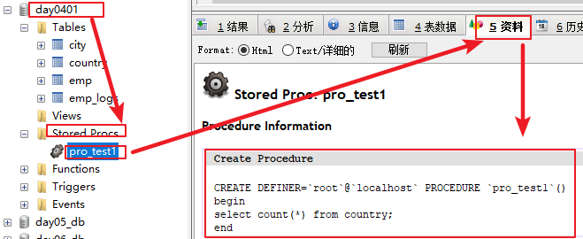
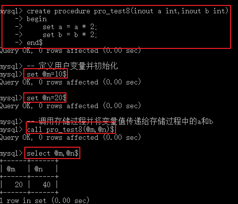

---

typora-copy-images-to: img
---

# 学习目标

- 理解存储过程和存储函数的作用
- 能够独立编写、调用、查看、删除存储过程
- 能够在存储过程中定义变量、并赋值
- 能够在存储过程中使用 if 语句
- 能够给存储过程传入参数、并返回结果
- 能够在存储过程中使用 case when... 语句
- 能够在存储过程中使用while循环语句
- 能够在存储过程中使用repeat循环语句
- 能够在存储过程中使用loop循环语句
- 能够在存储过程中使用游标保存查询结果

# 第一章 存储过程和函数

## 1 存储过程和函数概述

存储过程和函数类似于java中的方法，将一段代码封装起来，然后使用的时候直接调用即可。

java中的方法好处：

​	1.提高代码的重用性

​	2.简化操作

**【概念】**：mysql中的存储过程和函数是 **一组预先编译并存储在数据库中的SQL 语句的集合**，我们可以通过调用存储过程和函数来执行一组SQL语句的集合。

**【好处】**：

​	  **1.提高代码的重用性**


说明：我们可以将多条sql语句存储在存储过程和函数中，然后以后使用的时候直接通过存储过程的名字调用即可，不用在书写sql语句。	 

​       **2.简化操作**

​	   **3.减少编译次数并且减少了和数据库服务器的连接次数，提高了效率。**

​		说明：存储过程执行一次，由于之前已经编译过了，那么以后在执行的时候就不会在编译了，直接运行存储过程中的sql语句。


1).如果不使用存储过程和函数，那么每执行一次sql语句都要和数据库服务器建立连接，并且都要编译一次

2).有了存储过程和函数之后，将sql语句放到存储过程和函数中，多条sql语句只连接一次，并且只编译一次，以后就直接使用

3)存储过程和函数中的sql都是在数据库服务器中编译和存储，客户端使用的时候通过存储过程的名字来调用即可

4）调用存储过程和函数可以简化应用开发人员的很多工作，减少数据在数据库和应用服务器之间的传输，对于提高数据处理的效率是有好处的。

存储过程和函数的区别在于函数必须有返回值，而存储过程没有。

函数 ： 是一个有返回值的过程 ；
过程 ： 是一个没有返回值的函数 ；

## 2 创建存储过程

说明：演示存储过程的时候，图形化界面对于一些语法演示不出效果，所以我们都在dos窗口中进行演示。

【语法】

```sql
-- 因为存储过程和函数类似于java中的函数，所以我们理解的语法格式
CREATE procedure 存储过程名(参数列表){
	方法体
}
-- 实际格式(正确格式)
CREATE procedure 存储过程名(参数列表)
begin
	-- 存储过程体(一组合法的sql语句集合)
end
```

【说明】

​	1.参数列表包含三部分：

~~~sql
		参数模式    参数名        参数类型
举例：   IN		 stuname     varchar(20)

~~~

​		参数模式：

~~~sql
IN:该参数可以作为输入，也就是该参数需要调用者传入值
OUT:该参数可以作为输出，也就是该参数可以作为返回值
INOUT:该参数既可以作为输入又可以作为输出，也就是该参数既需要传入值，又可以返回值
~~~

​	2.如果存储过程体仅仅只有一句话，begin  end可以省略。

存储过程体中的每条sql语句的结尾要求必须加分号，而在mysql中默认的结束分隔符是分号，如果此时在sql语句后面加分号，那么mysql会认为存储过程结束了，其实必须执行完end才会结束。所以我们可以在存储过程的结尾即end后面使用delimiter重新设置结束分隔符。

语法：

~~~sql
delimiter 结束标记
举例：
delimiter $
说明：这种声明只是针对当前窗口有效，属于临时性的，下次重新连接mysql无效。
~~~

<div style='background-color:#42C0A3;'>示例: </div>
- 需求：创建存储过程查询之前创建的country表中的行记录数。

- 步骤：

  - 打开dos窗口连接到操作的数据库

    

  - 创建如下存储过程并执行

    ~~~sql
    delimiter $
    create procedure pro_test1()
    begin
    select count(*) from country;
    end $
    ~~~

    


## 3 调用存储过程

存储过程被创建好之后，就相当于java中的函数一样创建好之后必须被调用，否则不会执行，所以接下来我们学习下存储过程的调用语法：

```sql
call 存储过程名(实参列表)$
```

- 需求：调用上述创建好的存储过程pro_test1

  ~~~sql
  -- 由于是pro_test1是无参的，所以调用的时候不需要传递参数
  call pro_test1()$
  ~~~

  

  说明:由于上述我们使用delimiter $声明结束分隔符是$，所以这里必须使用$结束了

## 4 查看存储过程

- 从mysql中的表结构中查询存储过程

  ~~~sql
  --  查询指定数据库中的所有的存储过程
  select * from mysql.proc where db='数据库名' \G$
  举例：
  select * from mysql.proc where db='day0401' \G$
  ~~~

  

说明：其实上述语法是从mysql数据库自带的数据仓库mysql下面的proc表中查找存储过程：


- 查看创建某个存储过程的语句信息

  ~~~sql
  -- 查看创建某个存储过程的语句信息
  show create procedure 存储过程名$
  -- 举例：
  show create procedure pro_test1 \G$
  ~~~

  

- 直接在图形化界面中查看某个数据库的存储过程

  


## 5 删除存储过程

```sql
drop procedure 存储过程名$
-- 举例：
drop procedure pro_test1$
```


直接在可视化工具中查看发现存储过程pro_test1已经被删除


## 6 存储过程语法

我们通过上述学习已经知道存储过程中是一组SQL语句的集合，那么在存储过程中是可以编程的，意味着可以使用变量，表达式，控制结构 ， 来完成比较复杂的功能。使SQL语句完成过程化语言的能力。

### 6.1 变量

- declare

  通过 declare 可以定义一个局部变量，该变量的作用范围只能在 BEGIN…END 块中。

  <div style='background-color:orange;'>语法: </div>
```sql
  declare 变量名1,变量名2,...  变量的数据类型 [default 默认值] 
```

<div style='background-color:#42C0A3;'>示例:定义变量num默认值是5，并查询默认值 </div>
  ```sql
-- 1.创建存储过程
  delimiter $
  create procedure pro_test2()
  begin
      declare num int default 5;
      select concat('num的值是:',num);
  end$
  
  -- 2.调用存储过程
  call pro_test2()$
  ```

  


- SET

  直接赋值使用 SET，可以赋常量或者赋表达式

  <div style='background-color:orange;'>语法: </div>
```sql
  SET 变量名1 = 表达式1,变量名2=表达式2,... 
```

<div style='background-color:#42C0A3;'>示例:定义变量num默认值是0，设置num值+10 ，并查询</div>
  ```sql
-- 1.创建存储过程
  create procedure pro_test3()
  begin
  	declare num int default 0;
  	set num = num + 10;
  	select num;
  end$
  -- 2.调用存储过程
  call pro_test3()$
  ```

  

  

  【扩展】

  也可以通过select ... into 方式进行赋值操作 :

  <div style='background-color:#42C0A3;'>示例:定义变量num，没有默认值，通过select ... into设置num值为city表的行记录数 ，并查询</div>
```sql
  -- 1.创建存储过程
create procedure pro_test4()
  begin
  	declare num int;
  	select count(*) into num from city;
  	select concat('city表中的记录数为:',num);
  end$
  -- 2.调用存储过程
  call pro_test4()$
```


### 6.2 if条件判断

<div style='background-color:orange;'>语法: </div>
```sql
-- if条件后面为真执行对应then后面的语句，不满足就执行后面的elseif，如果elseif条件也不满足则继续向下执行判断，如果都不满足条件就执行else后面的语句
if 条件1 then 语句1;
[elseif 条件2 then 语句2;]
...
[else 语句n;]
end if;
```

**注意：1）上述if只能用在begin end中.2）elseif不能分开写，必须在一起，否则报错**

需求：

```java
根据定义的体重变量，判定当前体重的所属的身材类型
    170 及以上 ----------> 身材肥胖
    150 - 170 ---------> 标准身材
    150 以下 ----------> 身材偏瘦
```

<div style='background-color:#42C0A3;'>示例: </div>
```sql
-- 创建存储过程
delimiter $
create procedure pro_test5()
begin
    declare weight int default 175;
    declare description varchar(50) default '';
    if weight >= 170 then
      set description = '身材肥胖';
    elseif weight >= 150 and weight < 170 then
      set description = '标准身材';
    else
      set description = '身材偏瘦';
    end if;
    select concat('体重:',weight,'对应的身材类型为:',description);
end$

-- 调用存储过程
call pro_test5()$
```

调用结果为 :


### 6.3 传递参数

上述案例中对于weight的值我们是在声明该变量的时候给其默认值175.那么我们还可以通过如下方式in传入参数来接收调用存储过程时传入的数据。

<div style='background-color:orange;'>语法: </div>
```sql
create procedure procedure_name([in/out/inout]  参数名  参数类型)
...

IN :  该参数可以作为输入，也就是需要调用方传入值 , 默认
OUT:  该参数作为输出，也就是该参数可以作为返回值
INOUT: 既可以作为输入参数，也可以作为输出参数
```

#### IN 输入 

IN :  该参数可以作为输入，也就是需要调用方传入值 , 默认。

调用格式：

~~~sql
call 存储过程名(数据)$
~~~

需求:

```java
根据传入的体重变量，判定当前体重的所属的身材类型 
```

<div style='background-color:#42C0A3;'>示例: </div>
```sql
-- 创建存储过程，不用声明weight变量了，已经在小括号中定义了
delimiter $
create procedure pro_test6(in weight int)
begin
    declare description varchar(50) default '';
    if weight >= 170 then
      set description = '身材肥胖';
    elseif weight >= 150 and weight < 170 then
      set description = '标准身材';
    else
      set description = '身材偏瘦';
    end if;
    select concat('体重:',weight,'对应的身材类型为:',description);
end$
-- 调用存储过程
call pro_test6(160)$
```

执行结果:


#### OUT 输出

OUT:  该参数作为输出，也就是该参数可以作为返回值

<div style='background-color:#42C0A3;'>示例: </div>
需求:

```sql
根据传入的体重变量，获取当前体重的所属的身材类型
```

【创建存储过程的sql语句】

```sql
-- 创建存储过程
delimiter $
-- 不用声明weight和description变量了，已经在小括号中定义了,description表示返回，我们在调用存储过程的时候需要使用变量接收
create procedure pro_test7(in weight int,out description varchar(100))
begin
    if weight >= 170 then
      set description = '身材肥胖';
    elseif weight >= 150 and weight < 170 then
      set description = '标准身材';
    else
      set description = '身材偏瘦';
    end if;
end$
```

说明：由于我们需要在调用存储过程中接收返回的description的值，所以我们不用在存储过程中使用select查看description的值了。

上述我们只是创建了有返回值的存储过程，那么接下来我们需要调用存储过程，调用有返回值的存储过程需要使用变量接收返回值。

那么这里我们可以按照如下方式接收返回值：

【调用存储过程】

~~~sql
-- 调用存储过程
call pro_test7(168,@desc)$
~~~

<b><font color='red'>知识小贴士</font></b>
@desc : 这种变量要在变量名称前面加上“@”符号，叫做用户会话变量，代表整个会话过程他都是有作用的。@后面属于标识符，随便定义。

作用域：针对当前会话(连接)有效，同于会话变量的作用域。

【查看返回值变量接收的结果】

~~~sql
select @desc$
~~~

执行结果:


说明：本身存储过程是没有返回值的函数，是一个过程，没有结果。上述所说的返回值其实不是真正返回值，只是我们传递一个变量到存储过程中，在存储过程中修改了该变量值，然后在调用存储过程的位置在获取修改后的变量值。

举例：类似于java中在方法外部定义变量，在方法中修改变量，然后在方法外部获取修改后的变量是一个意思。

#### INOUT输入输出

INOUT: 既可以作为输入参数，也可以作为输出参数

需求：创建带inout模式参数的存储过程。

传入a和b两个值，最终将a和b都乘以2并返回。

【创建存储过程】

~~~sql
create procedure pro_test8(inout a int,inout b int)
begin
    set a = a * 2;
    set b = b * 2;
end$
~~~

【调用存储过程】

说明：我们在调用存储过程的时候需要给a和b传入两个数据，首先我们不能直接传递常量，因为我们还要使用select进行对结果的查询。所以这里我们先使用set命令定义两个变量。

自定义用户变量，声明并初始化：

~~~sql
set @变量名=值$
举例：
set @m=10$
~~~

代码：

~~~sql
-- 定义用户变量并初始化
set @m=10$
set @n=20$
-- 调用存储过程并将变量值传递给存储过程中的a和b
call pro_test8(@m,@n)$
~~~

【查看存储过程返回的值】

~~~sql
select @m,@n$
~~~

【结果】




### 6.4 case结构

<div style='background-color:orange;'>语法: </div>
```sql
方式一 :
-- 拿case后面的值和when后面的值依次比较，相等就执行then后面的语句，如果都不相等，就执行else后面的语句
CASE 值
    WHEN 值1 THEN 语句1;
    [WHEN 值2 THEN 语句2] ...
    [ELSE 语句3]
END CASE;

方式二 :
-- 说明：WHEN后面的任意一个 条件表达式 是true，就执行then后面的语句，如果都是false，那么执行else后面的语句，多个when只会执行一个
CASE
    WHEN 条件表达式1 THEN 语句1;
    [WHEN 条件表达式2 THEN 语句2;] ...
    [ELSE 语句3]
END CASE;
```

<div style='background-color:#42C0A3;'>示例: </div>
需求:

```java
给定一个月份 , 然后计算出所在的季度
```

sql

```sql
-- 创建存储过程
delimiter $
create procedure pro_test9(in month int)
begin
    declare result varchar(20);
    
    case
     when month >= 1 and month <=3 then
       set result = '第一季度';
     when month >= 4 and month <=6 then
       set result = '第二季度';
     when month >= 7 and month <=9 then
       set result = '第三季度';
     else
       set result = '第四季度';
    end case;
    
    select concat('您输入的月份为 :', month , ',该月份为 : ' , result) as content ;
end$
-- 调用存储过程
call pro_test9(2)$
```

直接结果:


### 6.5 mysql存储过程中的三种循环

#### 6.5.1 while循环

<div style='background-color:orange;'>语法: </div>
```sql
-- 如果循环条件为true，则一直执行do后面的sql语句，如果循环条件为false，则结束while循环
while 循环条件 do

	sql语句

end while;
```

<div style='background-color:#42C0A3;'>示例: </div>
需求:

```java
计算从 1加到n的值
```

sql

```sql
delimiter $	
-- 创建存储过程，使用变量n接收传入的参数
create procedure pro_test10(in n int)
begin
	-- 声明变量total保存最后的和值，默认值是0
    declare total int default 0;
    -- 声明变量num初始化值是1作为循环的初始化
    declare num int default 1;
    -- num<=n 表示循环条件，如果为true，满足循环条件执行do后面的sql语句即循环体
    while num<=n do
    	-- 每次循环设置total的值为total + num
      	set total = total + num;
      	-- 每次循环让num进行+1
    	set num = num + 1;
    end while;
    -- 查看和值total
    select total;
end$

-- 调用存储过程
call pro_test10(3)$
```

直接结果:


#### 6.5.2  repeat结构

有条件的循环控制语句, **当满足条件的时候退出循环，不满足条件执行循环体sql语句** 。while 是满足条件才执行，repeat 是满足条件就退出循环。

<div style='background-color:orange;'>语法: </div>
```sql
-- 如果不满足until后面的循环条件则执行循环体代码，直到满足循环条件就结束循环体代码
repeat
	-- 循环体
    sql语句
    until  循环条件 -- 注意：循环条件后面不能加分号，不满足语法规则
end repeat;
```

<div style='background-color:#42C0A3;'>示例: </div>
需求:

```java
计算从 1加到n的值
```

sql

```sql
delimiter $
-- 创建存储过程
-- 使用参数n接收调用存储过程传入的数据
create procedure pro_test11(in n int)
begin
	-- 声明变量total保存和值，初始化值是0
    declare total int default 0;
    -- 使用repeat循环
    repeat
    	-- 每次循环设置total等于total + n 就是求n+(n-1)....+1
      	set total = total + n;
      	-- 每次循环将n进行减1
      	set n = n - 1;
      	-- 当n等于0时停止repeat循环，这里不能加分号否则报错
    	until n=0 
    end repeat;
    -- 查看总和值total
    select total ;
end$

-- 调用存储过程
call pro_test11(3)$
```

执行结果:


#### 6.5.3 loop语句

loop 实现简单的循环，退出循环的条件需要使用其他的语句定义，通常可以使用 leave 语句实现

<div style='background-color:orange;'>语法: </div>
```sql
循环标记:loop
    -- 循环体
    sql语句
end loop 循环标记;
```

如果不在 sql语句中增加退出循环的语句，那么  loop 语句可以用来实现简单的死循环。

#### 6.5.4 leave语句(结束loop循环)

用来从标注的流程中退出，通常和loop循环一起使用。

<div style='background-color:#42C0A3;'>示例: </div>
需求: 使用loop和leave实现数字累加

sql:

```sql
delimiter $
-- 创建存储过程
-- 使用参数n接收调用存储过程传入的数据
create procedure pro_test12(in n int)
begin
	-- 声明变量total保存和值，初始化值是0
    declare total int default 0;
    -- 使用loop循环,c表示循环别名
    c:loop
    	-- 每次循环设置total等于total + n 就是求n+(n-1)....+1
      	set total = total + n;
      	-- 每次循环将n进行减1
      	set n = n - 1;
      	-- 判断n是否小于等于0，如果是结束loop循环
      	if n<= 0 then
      		-- 说明n小于等于0了，使用leave结束loop循环
      		leave c;
      	end if;
    -- 结束loop循环后面加一个loop循环的别名
    end loop c;
    -- 查看总和值total
    select total ;
end$

-- 调用存储过程
call pro_test12(3)$
```

执行结果:


### 6.6 游标/光标(了解) 

游标是用来存储**查询结果集**的 , 在存储过程和函数中可以使用光标对结果集进行循环的处理。光标的使用包括光标的declare(声明)、open(打开)、fetch(获取游标中的数据)和 close(关闭)

<div style='background-color:orange;'>语法: </div>
```sql
declare 游标名 cursor for 查询数据的结果集的sql语句 ;  -- 声明游标，执行完查询的sql语句之后将结果集放到游标中了
open 游标名 ; -- 打开游标
fetch 游标名  INTO 变量名,变量名 ... ; -- 获取游标中的数据并赋给指定变量，执行一次fetch获取游标中的一行数据，然后游标中的指针就会向下移动一次
close 游标名; -- 关闭游标
```


<div style='background-color:#42C0A3;'>示例: </div>
初始化sql脚本:

```sql
create table emp(
    id int(11) not null auto_increment ,
    name varchar(50) not null comment '姓名',
    age int(11) comment '年龄',
    salary int(11) comment '薪水',
    primary key(id)
)engine=innodb default charset=utf8 $

insert into emp(id,name,age,salary) 
values(null,'金毛狮王',55,3800),(null,'白眉鹰王',60,4000),
(null,'青翼蝠王',38,2800),(null,'紫衫龙王',42,1800)$
```

【结果】


<b>方式1-实例sql:查询emp中所有的数据存储到游标中，并取出游标中的数据</b>

```sql
delimiter $
-- 创建存储过程
create procedure pro_test13()
begin
	-- 声明和数据表列对应的列来存储列值
	declare e_id int(11);
    declare e_name varchar(50);
    declare e_age int(11);
    declare e_salary int(11);
    -- 创建游标
    -- emp_result 表示游标名  cursor for 固定的关键字
    -- 整体表示将从emp表中查询所有的数据存储到游标emp_result中
    declare emp_result cursor for select * from emp;
  
    open emp_result; -- 打开游标
    -- 取出游标中的第一行数据放到对应的变量中
    fetch emp_result into e_id,e_name,e_age,e_salary;
    -- 查询变量的结果
     select concat('id=',e_id , ', name=',e_name, ', age=', e_age, ', 薪资为:
    ',e_salary);
    --  取出游标中的第2行数据放到对应的变量中
    fetch emp_result into e_id,e_name,e_age,e_salary;
     select concat('id=',e_id , ', name=',e_name, ', age=', e_age, ', 薪资为:
    ',e_salary);
    -- 取出游标中的第3行数据放到对应的变量中
    fetch emp_result into e_id,e_name,e_age,e_salary;
     select concat('id=',e_id , ', name=',e_name, ', age=', e_age, ', 薪资为:
    ',e_salary);
    -- 取出游标中的第4行数据放到对应的变量中
    fetch emp_result into e_id,e_name,e_age,e_salary;
     select concat('id=',e_id , ', name=',e_name, ', age=', e_age, ', 薪资为:
    ',e_salary);
    
    close emp_result; -- 关闭游标
end$

-- 调用存储过程
call pro_test13()$
```

**方式1-直接结果:**


上述获取游标中所有数据，sql语句比较重复，我们可以使用我们之前学习的循环替换，哪种循环都可以。

**方式2-实例sql:**

说明：使用循环实现上述过程，但是循环需要结束条件，那么我们在这里怎样书写结束条件呢？


有两种方式：

​	1）查询数据表的所有数据 select count(*).....将行记录数赋值给变量num,每次循环num都减1，当变量变为0停		止循环。

​	2）我们希望当游标的指针移动到最后找不到数据就不找了，对于这种情况mysql提供一种思想就是句柄(出错处理器)，当找不到使用句柄(出错处理器)方式可以实现，**要求声明句柄(出错处理器)和声明游标必须放在一起，并且声明句柄(出错处理器)放在声明游标下面**：

~~~sql
 -- 创建游标
 declare emp_result cursor for select * from emp;
 -- 声明句柄
 -- declare 表示声明  exit 退出 handler 处理器 set 变量 = 初始化值 设置值
 declare exit handler for not found set 变量 = 初始化值;
~~~

sql语句演示：

```sql
delimiter $
-- 创建存储过程
create procedure pro_test14()
begin
	-- 声明和数据表列对应的列来存储列值
	declare e_id int(11);
    declare e_name varchar(50);
    declare e_age int(11);
    declare e_salary int(11);
    -- 声明变量has_data作为游标中的指针是否还可以找到数据，默认值是1表示有数据，0表示没有数据
    declare has_data int default 1;
    -- 创建游标
    -- emp_result 表示游标名  cursor for 固定的关键字
    -- 整体表示将从emp表中查询所有的数据存储到游标emp_result中
    declare emp_result cursor for select * from emp;
  	declare exit handler for not found set has_data = 0;
    open emp_result; -- 打开游标
   
    -- 循环
    repeat
     -- 取出游标中的第一行数据放到对应的变量中
    fetch emp_result into e_id,e_name,e_age,e_salary;
     -- 查询变量的结果
     select concat('id=',e_id , ', name=',e_name, ', age=', e_age, ', 薪资为:
    ',e_salary);
    until has_data = 0
    end repeat;
    close emp_result; -- 关闭游标
end$

-- 调用存储过程
call pro_test13()$
```

**方式2-执行结果:**


扩展：使用循环另一种实现方式(自己完成)

~~~sql
create procedure pro_test16()
begin
	-- 声明用户变量保存查询的数据
	declare e_id int(11);
	declare e_name varchar(50);
	declare e_age int(11);
	declare e_salary int(11);
	-- 声明变量num作为游标中是否还可以找到数据
	declare num int default 0;
	
	-- 声明游标
	declare emp3_result cursor for select * from emp3;
	select count(*) into num from emp3;
	-- 打开游标
	open emp3_result;
	repeat

	-- 获取游标的第一行数据
	fetch emp3_result into e_id,e_name,e_age,e_salary;
	select concat('id:',e_id,',e_name:',e_name,',e_age:',e_age,',e_salary:',e_salary);
	set num = num -1;
	until num=0
	end repeat;

	-- 关闭游标
	close emp3_result;
end $

call pro_test16()$
~~~


## 7 存储函数(了解)

我们在最开始介绍存储过程和函数的时候介绍了存储过程和函数：

函数 ： 是一个有返回值的过程 ；
过程 ： 是一个没有返回值的函数 ；

本身存储过程是没有返回值的函数，是一个过程，没有结果。上述所说的返回值其实不是真正返回值，只是我们传递一个变量到存储过程中，在存储过程中修改了该变量值，然后在调用存储过程的位置在获取修改后的变量值。

如果存储过程想实现有返回值的业务，我们就必须使用out类型的参数，即便是存储过程使用了out类型的参数，其本质也不是真的有了返回值，而是在存储过程内部给out类型参数赋值，在执行完毕后，我们直接拿到输出类型参数的值。

所以存储过程可以替代存储函数。我们对存储函数了解下即可。

<div style='background-color:orange;'>语法: </div>
```sql
-- 创建存储函数
create function 存储函数名(参数名 参数类型)
returns 返回值的数据类型
begin
...
  return 值;
end$

-- 调用存储函数
select 存储函数名(实参)$
```

<div style='background-color:#42C0A3;'>示例: </div>
需求: 定义一个存储函数,在city表中根据传入的国家id,计算满足条件的总记录数

```sql
delimiter $
-- 创建存储函数
create function fn1(countryId int)
returns int
begin
	declare cnum int ;
	select count(*) into cnum from city where country_id = countryId;
	return cnum;
end$

-- 调用存储函数
select fn1(1)$
```

执行结果:


注意：如果创建函数时报如下错误：

~~~java
This function has none of DETERMINISTIC, NO SQL, or READS SQL DATA in its......
~~~

原因在于是未开启函数功能,mysql的设置默认是不允许创建函数。

通过如下命令可以查看函数开启状态：

~~~sql
show variables like '%func%';
~~~


解决办法1:开启函数功能即可。

在MySQL中创建函数时出现这种错误的解决方法：

~~~sql
 set global log_bin_trust_function_creators=1;
~~~


不过这种做法重启mysql服务， 就失效了，又会变为off.

解决办法2：

在my.ini里面设置

~~~sql
log-bin-trust-function-creators=1
~~~

不过这个需要重启服务.

## 8 存储过程练习

需求:

```sql
将转账的业务,写入存储过程,调用存储过程实现转账的业务
存储过程四个参数：
	IN:
		fromSub 从哪位用户转账
		toSub 转给的用户
		m 转账金额
	OUT:flag 标记，1表示转账成功  0表示转账失败
```

说明：

该案例需要使用到ROW_COUNT()函数，该函数表示返回前一个SQL进行UPDATE，DELETE，INSERT操作所影响的行数。

sql

```sql
--  创建表的sql
CREATE TABLE account(
	id INT(11) PRIMARY KEY AUTO_INCREMENT,
    name VARCHAR(20),
    money FLOAT
);
INSERT INTO account VALUES(NULL,"tom",1000),(NULL,"rose",1000);
/*
	参数：
		fromSub 从哪位用户转账
		toSub 转给的用户
		m 转账金额
		flag 标记，1表示转账成功  0表示转账失败
*/
-- 存储过程sql
DELIMITER $
CREATE  procedure transfer(fromSub VARCHAR(20),toSub VARCHAR(20),m FLOAT,OUT flag INT)
BEGIN
		-- i1变量存储转出账的ROW_COUNT()结果
        declare i1 INT DEFAULT 0;
        -- i2变量存储转入账的ROW_COUNT()结果
        declare i2 INT DEFAULT 0;
        START TRANSACTION;
        -- 转出账 扣钱
        UPDATE account SET money = money - m WHERE name=fromSub;
        -- 将ROW_COUNT()即上次修改影响的行数1保存到变量i1中
        SELECT ROW_COUNT() INTO i1;
         -- 转入账 
        UPDATE account SET money = money + m WHERE name=toSub;
        -- 将ROW_COUNT()即上次修改影响的行数1保存到变量i2中
        SELECT ROW_COUNT() INTO i2;
        IF i1>0 AND i2>0 THEN
        		-- 提交事务
                COMMIT;
                SET flag = 1;
        ELSE
        		-- 回滚事务
                ROLLBACK;
                SET flag = 0;
        END IF;
        SELECT CONCAT(i1,'---',i2);        
END $
```

调用存储过程:

~~~sql
call transfer('tom','rose',100,@flag)$
~~~

查看变量：

~~~sql
select @flag$
~~~


# 第二章 Mysql体系结构(了解)


## 整个 MySQL Server由以下组成

- Connection Pool :  连接池组件。**连接池**： 管理、缓冲用户的连接，线程处理等需要缓存的需求。
- Management Services & Utilities :  管理服务和工具组件。系统管理和控制工具，例如备份恢复、Mysql复制、集群等 
- SQL Interface : SQL 接口组件。接受用户的SQL命令，并且返回用户需要查询的结果。
- Parser :  查询分析器组件。SQL命令传递到解析器的时候会被解析器验证和解析(权限、语法结构) 
- Optimizer :  优化器组件。SQL语句在查询之前会使用查询优化器对查询进行优化
- Caches & Buffers :  缓冲池组件。如果查询缓存有命中的查询结果，查询语句就可以直接去查询缓存中取数据
- Pluggable Storage Engines :  存储引擎。存储引擎说白了就是如何管理操作数据（存储数据、如何更新、查询数据等）的一种方法。因为在关系数据库中数据的存储是以表的形式存储的，所以存储引擎也可以称为表类型（即存储和操作此表的类型）
- File System :  文件系统。存储的文件系统不仅包含数据，还包括索引、错误日志和慢查询日志等

## 连接层

最上层是一些客户端和链接服务，包含本地socket 通信和大多数基于客户端/服务端工具实现的类似于 TCP/IP的通信。主要完成一些类似于连接处理、授权认证、及相关的安全方案。在该层上引入了线程池的概念，为通过认证安全接入的客户端提供线程。同样在该层上可以实现基于SSL的安全链接。服务器也会为安全接入的每个客户端验证它所具有的操作权限。

## 服务层

第二层架构主要完成大多数的核心服务功能，如 SQL接口，并完成缓存的查询，SQL的分析和优化，部分内置函数的执行。所有跨存储引擎的功能也在这一层实现，如 过程、函数等。在该层，服务器会解析查询并创建相应的内部解析树，并对其完成相应的优化如确定表的查询的顺序，是否利用索引等， 最后生成相应的执行操作。如果是select语句，服务器还会查询内部的缓存，如果缓存空间足够大，这样在解决大量读操作的环境中能够很好的提升系统的性能。

## 引擎层

存储引擎层， 存储引擎真正的负责了MySQL中数据的存储和提取，服务器通过API和存储引擎进行通信。不同的存储引擎具有不同的功能，这样我们可以根据自己的需要，来选取合适的存储引擎。

## 存储层

数据存储层， 主要是将数据存储在文件系统之上，并完成与存储引擎的交互。存储的文件系统不仅包含数据，还包括索引、错误日志和慢查询日志等

## mysql的不同

和其他数据库相比，MySQL有点与众不同，它的架构可以在多种不同场景中应用并发挥良好作用。主要体现在存储引擎上，插件式的存储引擎架构，将查询处理和其他的系统任务以及数据的存储提取分离。这种架构可以根据业务的需求和实际需要选择合适的存储引擎。

# 第三章 存储引擎

## 1 存储引擎概述

MySQL中是有存储引擎的, 针对不同的存储需求可以选择最优的存储引擎。

存储引擎就是存储数据，建立索引，更新查询数据等技术的实现方式 。**存储引擎是基于表的，而不是基于库的**。就是在创建每张表的时候可以指定不同的存储引擎。所以存储引擎也可被称为表类型。

MySQL5.0支持的存储引擎包含 ： InnoDB 、MyISAM 、BDB、MEMORY、MERGE、EXAMPLE、NDB Cluster、ARCHIVE、CSV、BLACKHOLE、FEDERATED等，其中InnoDB和BDB提供事务安全表，其他存储引擎是非事务安全表。

**可以通过指定 show engines ， 来查询当前数据库支持的存储引擎 ：**


创建新表时如果不指定存储引擎，那么系统就会使用默认的存储引擎， MySQL5.5之前的默认存储引擎是
MyISAM，5.5之后就改为了InnoDB。

**查看Mysql数据库默认的存储引擎 ， 指令**

```sql
show variables like '%storage_engine%';
```


## 2 存储引擎特性

下面重点介绍几种常用的存储引擎， 并对比各个存储引擎之间的区别， 如下表所示 ：

| 特点         | InnoDB                                                       | MyISAM                                             | MEMORY | MERGE | NDB  |
| ------------ | ------------------------------------------------------------ | -------------------------------------------------- | ------ | ----- | ---- |
| 存储限制     | 64TB                                                         | 有                                                 | 有     | 没有  | 有   |
| 事务安全     | <span style='background-color:yellow;'>支持</span>           |                                                    |        |       |      |
| 锁机制       | <span style='background-color:yellow;'>行锁(适合高并发)</span> | <span style='background-color:yellow;'>表锁</span> | 表锁   | 表锁  | 行锁 |
| B树索引      | 支持                                                         | 支持                                               | 支持   | 支持  | 支持 |
| 哈希索引     |                                                              |                                                    | 支持   |       |      |
| 全文索引     | 支持(5.6版本后)                                              | 支持                                               |        |       |      |
| 集群索引     | 支持                                                         |                                                    |        |       |      |
| 数据索引     | 支持                                                         |                                                    | 支持   |       | 支持 |
| 索引缓存     | 支持                                                         | 支持                                               | 支持   | 支持  | 支持 |
| 数据可压缩   |                                                              | 支持                                               |        |       |      |
| 空间使用     | 高                                                           | 低                                                 | N/A    | 低    | 低   |
| 内存使用     | 高                                                           | 低                                                 | 中等   | 低    | 高   |
| 批量插入速度 | 低                                                           | 高                                                 | 高     | 高    | 高   |
| 支持外键     | <span style='background-color:yellow;'>支持</span>           |                                                    |        |       |      |

下面我们将重点介绍最长使用的两种存储引擎： InnoDB、MyISAM ， 另外几种 了解即可。

### InnoDB（聚集索引）

MySQL5.5版本之后默认存储引擎

> 特点：支持事务、支持外键约束

```sql
-- 创建 innodb存储引擎表
CREATE TABLE tab_innodb(
 id INT,
 name VARCHAR(32)
)ENGINE = INNODB; -- 这里不指定ENGINE = INNODB默认也是INNODB
```

上述创建好数据表之后，在对应的mysql安装目录的数据库下面会创建如下两个文件：

 

说明：

​	1.InnoDB存储引擎是将数据和索引都存储在一个文件中即.ibd中了。所以InnoDB存储引擎也称为聚集索引，因为将数据和索引放在一个文件中了。

​	2.InnoDB存储引擎是Mysql的默认存储引擎。InnoDB存储引擎提供了具有提交、回滚、恢复能力的事务安全。但是对比MyISAM的存储引擎，InnoDB写的处理效率差一些。

 

### MyISAM（非聚集索引）

MySQL5.5版本之前默认存储引擎

> 特点：不支持事务、不支持外键约束


```sql
-- 创建 myisam存储引擎表
CREATE TABLE tab_myisam(
 id INT,
 name VARCHAR(32)
)ENGINE=MYISAM;
```

 

说明：

​	1.MyISAM存储引擎将数据和索引存入两个不同的文件。

​	2.MyISAM 不支持事务、也不支持外键，其优势是访问的速度快，对事务的完整性没有要求可以使用这个引擎来创建表 。


## 3 存储引擎选择

在选择存储引擎时，应该根据应用系统的特点选择合适的存储引擎。对于复杂的应用系统，还可以根据实际情况选择多种存储引擎进行组合。以下是几种常用的存储引擎的使用环境。

- InnoDB :  是Mysql的默认存储引擎，用于事务处理应用程序，支持外键。如果应用对事务的完整性有比较高的要求，在并发条件下要求数据的一致性，数据操作除了插入和查询以外，还包含很多的更新、删除操作，那么InnoDB存储引擎是比较合适的选择。InnoDB存储引擎除了有效的降低由于删除和更新导致的锁定， 还可以确保事务的完整提交和回滚，对于类似于计费系统或者财务系统等对数据准确性要求比较高的系统，InnoDB是最合适的选择。
- MyISAM  ： 如果应用是以读操作和插入操作为主，只有很少的更新和删除操作，并且对事务的完整性、并发性要求不是很高，那么选择这个存储引擎是非常合适的。


# 第四章 锁

## 1 锁概述

锁是计算机协调多个进程或线程并发访问某一资源的机制（避免争抢）。

在数据库中，除传统的计算机资源（如 CPU、I/O 等）的争用以外，数据也是一种供许多用户共享的资源。如何保证数据并发访问的一致性、有效性是所有数据库必须解决的一个问题，锁冲突也是影响数据库并发访问性能的一个重要因素。从这个角度来说，锁对数据库而言显得尤其重要，也更加复杂。

## 2 锁分类

从对数据操作的粒度分 ：

-  表锁：操作时，会锁定整个表。

-  行锁：操作时，会锁定当前操作行。

从对数据操作的类型分：

- 读锁（共享锁）：针对同一份数据，多个读操作可以同时进行而不会互相影响。

- 写锁（排它锁）：当前操作没有完成之前，它会阻断其他线程的写锁和读锁。

## 3 mysql锁

MySQL这3种锁的特性可大致归纳如下 ：


从上述特点可见，很难笼统地说哪种锁更好，只能就具体应用的特点来说哪种锁更合适！仅从锁的角度来说：表级锁更适合于以查询为主，只有少量按索引条件更新数据的应用，如Web 应用；而行级锁则更适合于有大量按索引条件并发更新少量不同数据，同时又有并发查询的应用，如一些在线事务处理系统。


相对其他数据库而言，MySQL的锁机制比较简单，其最显著的特点是不同的存储引擎支持不同的锁机制。下表中罗列出了各存储引擎对锁的支持情况：

| 存储引擎 | 表级锁 | 行级锁     | 页面锁(了解) |
| -------- | ------ | ---------- | ------------ |
| MyISAM   | 支持   | 不支持     | 不支持       |
| InnoDB   | 支持   | 支持(默认) | 不支持       |


## 4 MyISAM 表锁

MyISAM 存储引擎只支持表锁，这也是MySQL开始几个版本中唯一支持的锁类型。

### 如何加表锁

MyISAM 在执行查询语句（SELECT）前，会自动给涉及的所有表加读锁，在执行更新操作（UPDATE、DELETE、INSERT 等）前，会自动给涉及的表加写锁，这个过程并不需要用户干预，因此，用户一般不需要直接用

 LOCK    TABLE 命令给 MyISAM 表显式加锁。如果显示加表锁，那么就不会自动加表锁。

<div style='background-color:orange;'>加表锁语法: </div>
```sql
加读锁 : lock table 表名 read;
加写锁 : lock table 表名 write；
```

### 读锁案例

#### 准备环境

```sql
create database demo03;
use demo03;

CREATE TABLE tb_book (
    id INT(11) auto_increment,
    name VARCHAR(50) DEFAULT NULL,
    publish_time DATE DEFAULT NULL,
    status CHAR(1) DEFAULT NULL,
    PRIMARY KEY (id)
) ENGINE=myisam DEFAULT CHARSET=utf8 ;

INSERT INTO tb_book (id, name, publish_time, status) VALUES(NULL,'java编程思
想','2088-08-01','1');
INSERT INTO tb_book (id, name, publish_time, status) VALUES(NULL,'solr编程思
想','2088-08-08','0');

CREATE TABLE tb_user (
    id INT(11) auto_increment,
    name VARCHAR(50) DEFAULT NULL,
    PRIMARY KEY (`id`)
) ENGINE=myisam DEFAULT CHARSET=utf8 ;

INSERT INTO tb_user (id, name) VALUES(NULL,'令狐冲');
INSERT INTO tb_user (id, name) VALUES(NULL,'田伯光');
```

#### 示例

##### 【练习一：给tb_book表在一个客户端dos窗口加读锁，在两个不同的客户端即dos窗口查看tb_book表数据】

**客户端 一:**

1 获得tb_book 表的读锁:

```sql
lock table tb_book read;
```

2 执行查询操作

```sql
select * from tb_book;
```


可以正常执行 ， 查询出数据。

**客户端 二 ：**

3 执行查询操作

```sql
select * from tb_book; 
```


说明：在客户端一中给tb_book表加了读锁，在客户端二中也可以查看到数据的原因是，读锁也称为共享锁，针对同一份数据，多个读操作可以同时进行而不会互相影响。


##### 【练习二：在客户端一dos窗口中查看未加锁的tb_user表的数据】

**客户端 一 ：**

4 查询未锁定的表

```sql
select name from tb_user; 
```


说明：报错原因是上述在客户端一中给tb_book表加了读锁，而此时tb_book表正在占有锁，tb_user表无法拿到锁所以不让查询，必须得等到tb_book表释放锁之后，tb_user才可以获取锁并进行查询操作。如果这里使用lock table命令给tb_user表加锁，那么tb_book就会释放锁，tb_user表就可以获取到锁了。

##### 【练习三：在客户端二中查看未锁定的tb_user表】

**客户端 二 ：**

5 查询未锁定的表

```sql
select name from tb_user; 
```


说明：可以正常查询出未锁定的表，因为客户端二没有对表进行加锁。

##### 【练习四：在客户端一中向tb_book中插入一条数据】

**客户端 一 ：**

6 执行插入操作

```sql
insert into tb_book values(null,'Mysql 高级','2088-01-01','1');
```


执行插入， 直接报错 ， 由于当前tb_book 获得的是 读锁， 不能执行更新(增删改)操作。

##### 【练习五：在客户端二中向tb_book中插入一条数据】

**客户端 二 ：**

7  执行插入操作

```sql
insert into tb_book values(null,'Mysql 高级','2088-01-01','1'); 
```


上述出现阻塞现象，等待现象。

当在客**户端一**中释放锁指令 unlock tables; 后 ， 客户端二中的 inesrt 语句 ， 立即执行 ；


客户端二效果：


小结：如果给某个表加读锁，不会阻塞其他线程即客户端的读操作，但是会阻塞其他线程的写操作。


### 写锁案例

#### 【练习一:在客户端一dos窗口给tb_book表加写锁，在当前客户端演示查询和更新操作】

1 获得tb_book 表的写锁

```sql
lock table tb_book write; 
```

2 执行查询操作

```sql
select * from tb_book; 
```


​	查询操作执行成功；

3 执行更新操作

```sql
update tb_book set name = 'java 编程思想（第二版）' where id = 1; 
```


#### 【练习二:在客户端二dos窗口执行查询操作】

4 执行查询操作

```sql
select * from tb_book; 
```


说明：在客户端二发现阻塞了，因为给客户端一加写锁（排它锁）：当前操作没有完成之前，它会阻断其他线程即窗口客户端写锁和读锁。

当在客户端一中释放锁指令 unlock tables 后 ， 客户端二中的 select 语句 ， 立即执行 ；


### 结论

锁模式的相互兼容性如表中所示：


由上表可见：

1） 对MyISAM 表的读操作，不会阻塞其他用户对同一表的读请求，但会阻塞对同一表的写请求；

2） 对MyISAM 表的写操作，则会阻塞其他用户对同一表的读和写操作；

简而言之，就是读锁会阻塞写，但是不会阻塞读。而写锁，则既会阻塞读，又会阻塞写。


此外，MyISAM 的读写锁调度是写优先，这也是MyISAM不适合做写为主的表的存储引擎的原因。因为写锁后，其他线程不能做任何操作，大量的更新会使查询很难得到锁，从而造成永远阻塞。


### 查看锁的争用情况

```sql
show open tables;
```


In_use:  表示当前表被查询使用的次数。如果该数为零，则表是打开的，但是当前没有被使用。

Name_locked：表名称是否被锁定。名称锁定	用于对表进行重命名等操作。

```sql
show status like 'Table_locks%'; 
```


Table_locks_immediate  ： 指的是能够立即获得表级锁的次数，每立即获取锁，值加1。

Table_locks_waited ： 指的是不能立即获取表级锁而需要等待的次数，每等待一次，该值加1，此值高说明存在着较为严重的表级锁争用情况。

演示上述情况：

在窗口1给tb_book加读锁：


在窗口2中对tb_book进行更新操作：

~~~sql
update tb_book set name = 'java 编程思想（第二版）' where id = 2;
~~~

此时会阻塞，如下所示：


在窗口1中查看锁争用情况：


## 5 InnoDB 行锁

### 行锁介绍

行锁特点 ：InnoDB 存储引擎默认方式，开销大，加锁慢；会出现死锁；锁定粒度最小，发生锁冲突的概率最低,并发度也最高。
InnoDB 与 MyISAM 的最大不同有两点：一是InnoDB 支持事务；二是 InnoDB 采用了行级锁。行级锁也是和事务有关的。

### InnoDB的行锁模式

- InnoDB 实现了以下两种类型的行锁。
  共享锁（ S）：又称为读锁，简称S锁，共享锁就是多个事务对于同一数据可以共享一把锁，都能访问到数据，但是只能读不能修改。
- 排他锁（ X）：又称为写锁，简称X锁，排他锁就是不能与其他锁并存，如一个事务获取了一个数据行的排他锁，其他事务就不能再获取该行的其他锁，但是获取排他锁的当前的事务是可以对数据就行读取和修改。

对于UPDATE、DELETE和INSERT语句，InnoDB会自动给涉及数据集加排他锁（X)；

对于普通SELECT语句，InnoDB不会加任何锁；


可以通过以下语句显示给记录集加共享锁或排他锁 。

```sql
共享锁（ S）: SELECT * FROM table_name WHERE ... LOCK IN SHARE MODE
排他锁（X) : SELECT * FROM table_name WHERE ... FOR UPDATE
```

### 案例准备工作

```sql
create table test_innodb_lock(
    id int(11),
    name varchar(16),
    sex varchar(1) -- 0表示女 1表示男
)engine = innodb default charset=utf8;

insert into test_innodb_lock values(1,'100','1');
insert into test_innodb_lock values(3,'3','1');
insert into test_innodb_lock values(4,'400','0');
insert into test_innodb_lock values(5,'500','1');
insert into test_innodb_lock values(6,'600','0');
insert into test_innodb_lock values(7,'700','0');
insert into test_innodb_lock values(8,'800','1');
insert into test_innodb_lock values(9,'900','1');
insert into test_innodb_lock values(1,'200','0');

create index idx_test_innodb_lock_id on test_innodb_lock(id);
create index idx_test_innodb_lock_name on test_innodb_lock(name);
```

### 行锁基本演示


更新语句：

~~~sql
update test_innodb_lock set name='3000' where id=3;
~~~


说明：

1.由于执行更新语句的时候，InnoDB会自动给涉及数据集加排他锁（X)，其他事务即窗口2就不能再获取该行的其他锁，所以阻塞。只能等待窗口1提交事务之后，窗口1的事务释放锁，然后窗口2才可以获取到排它锁来执行更新语句。

2.注意，由于刚开始关闭了自动提交事务，即使窗口2执行了更新语句也要提交事务，否则再打开新的窗口是看不到窗口2更新后的数据。


以上， 操作的都是同一行的数据，接下来，演示不同行的数据 ：


说明：执行不同行的更新操作，不会有相互影响。

### 行锁升级为表锁

如果通过索引条件检索数据，但是索引类型和定义的类型不一致时，存在类型转换，索引失效，最终行锁变为表锁 。那么InnoDB将对表中的所有记录加锁，实际效果跟表锁一样。

【效果演示】

查看当前表的索引 ： 

```sql
show index from test_innodb_lock \G;
```


窗口1执行的更新语句：

~~~sql
update test_innodb_lock set sex='0' where name=30;
~~~

窗口2执行的更新语句：

~~~sql
update test_innodb_lock set sex='0' where id=9;
~~~


正常情况下，上述两个更新语句不是更新同一行数据，不应该产生阻塞现象，但是由于执行更新时 ， name字段本来为varchar类型， 我们是作为整数类型使用，存在类型转换，索引失效，最终行锁变为表锁 ；

### 间隙锁

当我们用范围条件，而不是使用相等条件检索数据，并请求共享或排他锁时，InnoDB会给符合条件的已有数据进行加锁； 对于键值在条件范围内但并不存在的记录，叫做 "间隙（GAP）" ， InnoDB也会对这个 "间隙" 加锁，这种锁机制就是所谓的 间隙锁（Next-Key锁） 。

举例：

~~~sql
数据库存在数据的主键是：
1
3
4
6
9
如果条件是：id < 10
这里id缺少的是2 5 7 8 。他们就称为间隙，InnoDB也会对这些间隙进行加锁，这种锁机制就是所谓的 间隙锁
~~~


需求：

​		更新id小于4的name为'6666'.

​		同时插入id是2的数据.

sql语句：

~~~sql
-- 更新语句
update test_innodb_lock set name='6666' where id < 4;
-- 插入语句
insert into test_innodb_lock values(2,'8888','0');
~~~


<div style='background-color:#42C0A3;'>示例: </div>


说明：上述由于更新是id小于4，而没有id是2的数据，此时id是2的数据就是间隙，这里执行的是update更新语句，所以会加排它锁，那么同时也会给id是2的数据加间隙锁(不存在也会加间隙锁)，所以另一个窗口即事务执行insert插入id是2的数据，就会阻塞，直到窗口1即事务1提交事务才不会阻塞。


### InnoDB行锁争用情况

```sql
show status  like 'innodb_row_lock%';
```


```sql
Innodb_row_lock_current_waits:  当前正在等待锁定的数量

Innodb_row_lock_time: 从系统启动到现在锁定总时间长度

Innodb_row_lock_time_avg:每次等待所花平均时长

Innodb_row_lock_time_max:从系统启动到现在等待最长的一次所花的时间

Innodb_row_lock_waits: 系统启动后到现在总共等待的次数

```


### 总结

InnoDB 存储引擎由于实现了行级锁定，虽然在锁定机制的实现方面带来了性能损耗可能比表锁会更高一些，但是在整体并发处理能力方面要远远优于MyISAM的表锁的。当系统并发量较高的时候，InnoDB的整体性能和MyISAM相比就会有比较明显的优势。

但是，InnoDB的行级锁同样也有其脆弱的一面，当我们使用不当的时候，可能会让InnoDB的整体性能表现不仅不能比MyISAM高，甚至可能会更差。

优化建议：

- 尽可能让所有数据检索都能通过索引来完成，使用索引操作时注意数据类型，避免行锁升级为表锁。
- 合理设计索引，尽量缩小锁的范围
- 尽可能减少索引条件，及索引范围，避免间隙锁
- 尽量控制事务大小，减少锁定资源量和时间长度
- 尽量使用低级别事务隔离（但是需要业务层面满足需求）


# 第五章 JDBC

## 1、JDBC的概念

### 目标

1. 能够掌握JDBC的概念
2. 能够理解JDBC的作用

### 讲解

客户端操作MySQL数据库的方式

1. 使用第三方客户端来访问MySQL：SQLyog、Navicat

2. 使用MySQL自带的命令行方式

3. **通过Java来访问MySQL数据库，今天要学习的内容**

   **如何通过Java代码去操作数据库呢？**

   Java中给我们提供专门的一套技术，可以通过其中的某些类和接口操作任何的数据库，这个技术就是今天要学习的JDBC。

   **什么是JDBC**：Sun公司为了简化、统一对数据库的操作，定义了一套java操作数据库的接口的规范，称之为JDBC。JDBC的全称为：java database connection (java和 数据库的连接 ) 就是使用java代码来操作数据库。
   **JDBC的作用**：Java通过JDBC就可以操作数据库


#### JDBC的由来

1. **java程序依赖于jdk,jdk和数据库是2个不同的应用程序，那他们是怎么进行访问的呢？**

   要想搞清楚这个问题，我们必须了解下电脑是如何和其他硬件设备交互的。假设我们电脑安装完系统之后是一个无驱动的操作系统。那么当我们电脑想播放声音，即安装音响，必须得安装声卡驱动。同时电脑想和u盘硬件进行交互，也必须在电脑上安装对应的驱动。如果驱动安装失败，很显然他们是不能正常的交互的。这个安装驱动的其实就是为了定义他们两个相互交互的规则。只有统一了规则，才能交互。

   具体的解释如下图所示：

   

同理：java程序想和数据库进行交互，也必须得安装数据库驱动，这样才能交互。但是，我们数据库有多种，这样就会导致不同的数据库具备不同的数据库驱动。

从而会导致在开发中作为程序员由于安装不同的数据库驱动而浪费很多时间，同时和数据库交互的java代码也得重新书写，这样都会导致效率很低。所以说，sun公司就会制定一套规则，这套规则就是用来java程序连接数据库的，然后各大数据库厂商只需要实现这个规则即可。这个规则就是jdbc技术，即接口。

换句话就是说，就是数据库厂商使用sun公司提供的接口，然后作为java程序员实现接口中的方法即可。**接口中的方法体由具体的数据库厂商来实现。**


#### JDBC的好处

1. 我们只需要会调用JDBC接口中的方法即可，使用简单
2. JDBC有关的类和接口：都在java.sql 和 javax.sql(扩展包) 包下
3. 方法体由具体的数据库厂商来完成的
4. 使用同一套Java代码，进行少量的修改就可以访问其他JDBC支持的数据库

### 小结

1. 说出JDBC的概念？Java数据库连接(Java操作数据库的标准规范)
2. 说出JDBC的作用？Java通过JDBC就可以操作数据库

## 2、JDBC核心API的介绍

### 目标

能够理解JDBC四个核心对象

### 讲解

#### JDBC会用到的包

1. java.sql：JDBC访问数据库的基础包，在JavaSE中的包。如：java.sql.Connection
2. javax.sql： JDBC访问数据库的扩展包
3. 数据库的驱动，各大数据库厂商来实现。如：MySQL的驱动：com.mysql.jdbc.Driver

#### JDBC四个核心对象

这几个类都是在java.sql包中

1. DriverManager(类):  数据库驱动管理类。这个类的作用：1）注册驱动; 2)创建java代码和数据库之间的连接，即获取Connection接口;
2. Connection(接口): 是一个接口, 建立数据库连接的一个接口。作用：建立数据库和java代码之间的连接。表示与数据库创建的连接
3. Statement(接口)、PreparedStatement(接口) (解决安全隐患问题，比如sql注入的问题)： 数据库操作，向数据库发送sql语句。执行SQL语句的对象
4. ResultSet: 结果集或一张虚拟表。 Statement 发送sql语句，得到的结果 封装在 ResultSet 中。
   

#### JDBC访问数据库的步骤

1. 由DriverManager注册驱动程序

2. 创建和数据库的连接对象Connection

3. 由客户端发送SQL语句给服务器执行，SQL语句封装成Statement对象

4. 查询到的结果集封装成ResultSet对象

5. 在客户端可以从ResultSet中取出数据，处理结果集

6. 释放资源，关闭连接对象


### 小结

JDBC四个核心对象？

1. DriverManager(类): 用于注册驱动
2. Connection(接口): 表示与数据库创建的连接
3. Statement(接口): 执行SQL语句的对象
4. ResultSet(接口): 结果集或一张虚拟表

## 3、JDBC注册驱动

`Connection`表示Java程序与数据库之间的连接，只有拿到Connection才能操作数据库。

**JDBC获取连接步骤**

1.导入mysql驱动Jar包
2.注册驱动
3.获取连接

### 目标

能够导入mysql驱动Jar包

能够通过JDBC注册数据库驱动

### 讲解

#### 准备工作

1、确定启动mysql数据库。

此电脑-------》右键管理-------》选择服务


找到MySQL服务，查看MySQL服务是否已经启动了，如果启动是灰色，说明已经启动了。


2、创建数据库和创建user表，并添加信息，sql语句如下。

打开可视化工具，将如下sql语句添加到可视化工具中，并执行以下sql语句即可。


```sql
-- 创建数据库
create database day04_db;

-- 切换数据库
use day04_db;

-- 用户表
create table user (
  id int primary key auto_increment,
  username varchar(30) unique not null,
  password varchar(30)
);

insert into user(username, password) values('zhangsan','123');
insert into user(username, password) values('lisi','123');
insert into user(username, password) values('wangwu','123');

select * from user;
```

执行结果：


#### 导入驱动Jar包

1、新建项目day04，在项目day04上新建lib文件夹


2、将mysql驱动的jar包导入到lib文件夹下


3、在导入的mysql的jar包上右键，选择Add as Library...


#### 注册驱动

我们Java程序需要通过数据库驱动才能连接到数据库，因此需要注册驱动。
MySQL的驱动的入口类是：`com.mysql.jdbc.Driver`


##### API介绍

`java.sql.DriverManager`类用于注册驱动。提供如下方法注册驱动

```java
static void registerDriver(Driver driver) 
向 DriverManager 注册给定驱动程序。 
```

说明：

​	1)执行完上述语句之后，DriverManager就可以管理mysql驱动了。

​	2)当前的DriverManager.registerDriver(Driver driver);方法的参数是Driver，这是jdbc的一个接口，所以我们需要给定实现该接口的实现类。如果我们连接的是mysql数据库，那么需要导入mysql数据库提供的包，也就是com.mysql.jdbc.Driver; 下的Driver类。如果我们连接的是oracle数据库，那么需要导入oracle数据库提供的包。

##### 使用步骤

1.DriverManager.registerDriver(驱动对象); 传入对应参数即可

##### 案例代码

```java
public class Demo01 {
	public static void main(String[] args) throws Exception {
		// 注册驱动
		DriverManager.registerDriver(new com.mysql.jdbc.Driver());
	}
}
```

说明：这里的new Driver()的类Driver就是来自mysql数据库。

通过查询com.mysql.jdbc.Driver源码，我们发现Driver类“主动”将自己进行注册

```java
public class Driver extends NonRegisteringDriver implements java.sql.Driver {
    static {
        try {
            // 自己自动注册
            java.sql.DriverManager.registerDriver(new Driver());
        } catch (SQLException E) {
            throw new RuntimeException("Can't register driver!");
        }
    }
    public Driver() throws SQLException {
    }
}
```


>注意：使用`DriverManager.registerDriver(new com.mysql.jdbc.Driver());`，存在以下方面不足
>
>1. 驱动被注册两次

使用`Class.forName("com.mysql.jdbc.Driver");`加载驱动，这样驱动只会注册一次

```sql
public class Demo01 {
	public static void main(String[] args) throws Exception {
		Class.forName("com.mysql.jdbc.Driver"); // 后期可以将"com.mysql.jdbc.Driver"字符串写在文件中.
	}
}
```

演示：`Class.forName("包名.类名");`会走这个类的静态代码块


通常开发我们使用Class.forName() 加载驱动。`Class.forName("com.mysql.jdbc.Driver");`会走Driver类的静态代码块。在静态代码块中注册一次驱动。


>总结：注册MySQL驱动使用`Class.forName("com.mysql.jdbc.Driver");`

### 小结

1. 导入mysql驱动Jar包

2. 通过JDBC注册数据库驱动？

   ```sql
   Class.forName("com.mysql.jdbc.Driver");
   ```

## 4、获取连接

能够通过JDBC获取数据库连接

### 讲解

#### API介绍

`java.sql.DriverManager`类中有如下方法获取数据库连接

```java
static Connection getConnection(String url, String user, String password) 
连接到给定数据库 URL ，并返回连接。 
```

#### 参数说明

1. `String url`：连接数据库的URL，用于说明连接数据库的位置
2. `String user`：数据库的账号
3. `String password`：数据库的密码

连接数据库的URL地址格式：`协议名:子协议://服务器名或IP地址:端口号/数据库名?参数=参数值`

MySQL写法：`jdbc:mysql://localhost:3306/day04_db`
如果是本地服务器，端口号是默认的3306，则可以简写：`jdbc:mysql:///day04_db`


#### 注意事项

>如果数据出现乱码需要加上参数: ?useUnicode=true&characterEncoding=utf8，表示让数据库以UTF8编码来处理数据。
>如: jdbc:mysql://localhost:3306/day04_db?useUnicode=true&characterEncoding=utf8

#### 使用步骤

1.DriverManager.getConnection(url, user, password); 传入对应参数即可

#### 案例代码

```java
public class Demo01 {
	public static void main(String[] args) throws Exception {
		Class.forName("com.mysql.jdbc.Driver");
		// 连接到MySQL
		// url: 连接数据库的URL
		// user: 数据库的账号
		// password: 数据库的密码
		Connection conn = DriverManager.getConnection("jdbc:mysql://localhost:3306/day04_db", "root", "1234");
		System.out.println(conn);
	}
}
```

#### 案例效果

1.连接成功

2.连接失败


### 小结

1. JDBC获取数据库连接使用哪个API？

   ```
   DriverManager.getConnection(数据库url, 账号, 密码)
   ```

2. 通过JDBC连接mysql的URL写法？

   ```sql
   jdbc:mysql://localhost:3306/数据库
   ```

## 5、JDBC实现对单表数据增、删、改、查

### 目标

通过JDBC实现对单表数据增、删、改、查

### 讲解

#### JDBC实现对单表数据增、删、改

我们要对数据库进行增、删、改、查，需要使用`Statement`对象来执行SQL语句。

##### API介绍

获取Statement对象

在`java.sql.Connection`接口中有如下方法获取到`Statement`对象

```java
Statement createStatement() 
创建一个 Statement 对象来将 SQL 语句发送到数据库
```

Statement的API介绍

1. ```java
   int executeUpdate(String sql)
   根据执行的DML（INSERT、UPDATE、DELETE）语句，返回受影响的行数
   ```

2. ```java
   ResultSet executeQuery(String sql)
   根据查询语句返回结果集,只能执行SELECT语句
   ```

   >注意：在MySQL中，只要不是查询就是修改。
   >executeUpdate：用于执行增删改
   >executeQuery：用于执行查询

#### 使用步骤

1. 注册驱动
2. 获取连接
3. 获取Statement对象
4. 使用Statement对象执行SQL语句
5. 释放资源

#### 案例代码

```java
public class Demo03 {
	public static void main(String[] args) throws Exception {
		Class.forName("com.mysql.jdbc.Driver");

		Connection conn = DriverManager.getConnection("jdbc:mysql:///day04_db", "root", "1234");
		System.out.println(conn);

		// 从连接中拿到一个Statement对象
		Statement stmt = conn.createStatement();

		// 1.插入记录
		String sql = "insert into user values(null, 'zhaoliu', 'abc')";
		int i = stmt.executeUpdate(sql);
		System.out.println("影响的行数:" + i);

		// 2.修改记录
		sql = "update user set username='tianqi' where username='zhaoliu'";
		i = stmt.executeUpdate(sql);
		System.out.println("影响的行数:" + i);

		// 3.删除记录
		sql = "delete from user where id=4";
		i = stmt.executeUpdate(sql);
		System.out.println("影响的行数:" + i);
		
		// 释放资源
		stmt.close();
		conn.close();
	}
}
```


# 作业

```java
练习上课做讲内容
```

