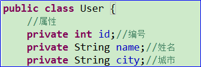
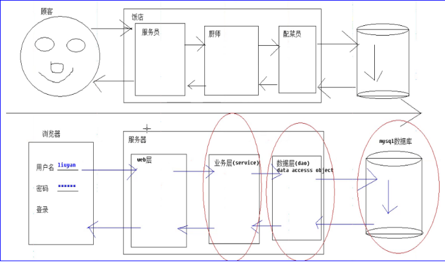
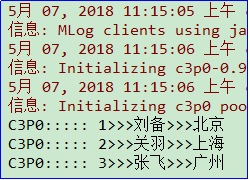
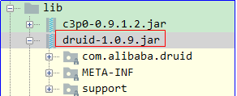

# 1.JDBC
## 学习目标

5. 能够使用ResultSet接口(掌握)
6. 能够使用JDBC实现对单表数据增、删、改、查(掌握)
7. 能够使用JDBC操作事务(掌握)
8. 能够编写JDBC工具类(掌握)
9. 能够完成JDBC实现登录案例(掌握)


## 1、JDBC实现对单表数据查询

### 目标

能够掌握JDBC实现对单表数据查询

### 讲解

`ResultSet`用于保存执行查询SQL语句的结果。
我们不能一次性取出所有的数据，需要一行一行的取出。

#### ResultSet的原理

1. ResultSet内部有一个指针,刚开始记录开始位置
2. 调用next方法, ResultSet内部指针会移动到下一行数据
3. 我们可以通过ResultSet得到一行数据 getXxx得到某列数据
   

#### ResultSet获取数据的API

其实ResultSet获取数据的API是有规律的get后面加数据类型。我们统称`getXXX()`


​     例如：

 

对于上图中的一行数据，我要获取username为zhangsan这列的值，有如下2种写法：

 1) rs.getString(“username”);  通过列名获取该列的值。

 2) rs.getString(2);        通过username列所在的第二个位置获取该列的值。

#### 使用JDBC查询数据库中的数据的步骤

1. 注册驱动
2. 获取连接
3. 获取到Statement
4. 使用Statement执行SQL
5. ResultSet处理结果
6. 关闭资源

#### 案例代码

```java
public class Demo04 {
	public static void main(String[] args) throws Exception {
		Class.forName("com.mysql.jdbc.Driver");
		
		Connection conn = DriverManager.getConnection("jdbc:mysql:///day04_db", "root", "1234");
		Statement stmt = conn.createStatement();
		
		String sql = "select * from user";
		ResultSet rs = stmt.executeQuery(sql);
		
		// 内部有一个指针,只能取指针指向的那条记录
        while(rs.next()){// 指针移动一行,有数据才返回true
				int id = rs.getInt("id");
				String name = rs.getString(2);
				String pwd= rs.getString(3);
				System.out.println(id+"+++"+name+"++++"+pwd);
			}
		
		// 关闭资源
		rs.close();
		stmt.close();
		conn.close();
	}
}
```


### 小结

其实我们使用JDBC操作数据库的步骤都是固定的。不同的地方是在编写SQL语句

1. 注册驱动
2. 获取连接
3. 获取到Statement
4. 使用Statement执行SQL
5. ResultSet处理结果
6. 关闭资源

ResultSet如何获取数据？

1. 调用next方法, ResultSet内部指针会移动到下一行数据
2. 我们可以通过ResultSet得到一行数据 getXxx得到某列数据


## 2、编写JDBC工具类

### 目标

能够编写JDBC获取连接与关闭连接工具类

### 讲解

​	在上面的学习过程中，我们发现我们有很多重复的操作。那么这样一方面来说对我们开发带来了不便，更多的时候是当我遇到如下的问题：

数据库的用户名发生了变化，这时候我们发现，我们需要修改每处获取连接的用户名参数。这样是对于我们后期的维护是非常繁琐的。所以我们需要对jdbc操作数据库的步骤的一些常用的方法抽出来，放到一个外部的工具类中。

#### 获得连接的初步抽取

首先创建一个JDBCUtils 工具类：然后将jdbc中获取连接的方法抽取到工具类中。

```java
public class JDBCUtils {
	// 获得连接
	public static Connection getConnection(){
Connection con = null;
		try {
             // 注册驱动
			Class.forName("com.mysql.jdbc.Driver");
			// 创建连接
		    String url = "jdbc:mysql://localhost:3306/day04_db";
		    String user = "root";
		    String password = "123";
		    con = DriverManager.getConnection(url, user, password);
		} catch (Exception e) {
			e.printStackTrace();
		}
		return con;
	}
}
```

#### 获得连接第二次优化

紧接着，将刚刚获取连接的方法中所用的参数 都以变量的形式抽离出来，这样方便这些参数的统一管理。

```java
public class JDBCUtils {
	static String driverClass = null;
	static String url = null;
	static String user = null;
	static String password = null;

	static {
		driverClass = "com.mysql.jdbc.Driver";
		url = "jdbc:mysql://localhost:3306/day04_db";
		user = "root";
		password = "123";
		// 注册驱动
		try {
			Class.forName(driverClass);
		} catch (Exception e) {
			e.printStackTrace();
		}
	}
	// 获得连接
	public static Connection getConnection() {
Connection con = null;
		  try {
		    con = DriverManager.getConnection(url, user, password);
		   } catch (Exception e) {
			e.printStackTrace();
		   }
		   return con;
	}
}
```

#### 在项目day04目录下创建jdbc.properties

问题：上面的操作已经完成了我们工具类获取连接的方法的抽取。但是如果说当数据库的用户名，或者说密码，或者说数据库的地址放生变化的时候，

  我们发现我们需要修改java代码，这也就意味着我们的.class文件需要重新编译。并且每次修改java代码有可能还会带来没有必要的风险。

那么针对这样的问题我们该如何进行优化呢？

显然，我们不能将这些配置参数放在java代码中，只能将这些参数存放在外部文件中，而我们在java代码中通过io流的方式将文件读取出来就行了。当我们需要修改这些参数的时候，只需要修改配置文件中的值，java代码并不需要编译，只需要将应用程序重新启动一下，io重新读取一下。这样就行了。所以接下来我们需要将jdbc获取连接中需要的参数存放在外部的.properties文件中。

创建properties文件的步骤：

第一步：选中项目day04,右键----》new-----》File


第二步：将文件以properties为后缀名进行保存。


jdbc.properties文件中的配置信息：

```java
driverClass=com.mysql.jdbc.Driver
url=jdbc:mysql://localhost:3306/day04_db
user=root
password=123
```

第三步：如何读取外部文件的内容呢？

分析：

使用Properties集合和字节流读取可以实现。

具体的测试代码如下所示：

```java
public static void main(String[] args) {
		// 需求： 通过properties对象读取 外部配置的内容
		Properties prop = new Properties();
		try {
            //对于FileInputStream流相对的路径是当前模块
             FileInputStream in=new FileInputStream("jdbc.properties");
			// 加载外部的配置文件
			prop.load(in);
		} catch (IOException e) {
			// TODO Auto-generated catch block
			e.printStackTrace();
		}
		// 读取外部配置文件的内容
		String driverClass = prop.getProperty("driverClass");
		String url = prop.getProperty("url");
		String user = prop.getProperty("user");
		String password = prop.getProperty("password");

		System.out.println(driverClass);
	}
```

#### 获得连接的最终优化版

```java
public class JDBCUtils {
	static String driverClass = null;
	static String url = null;
	static String user = null;
	static String password = null;

	static {
		// 需求： 通过properties对象读取 外部配置的内容
		Properties prop = new Properties();

		try {
			 FileInputStream in=new FileInputStream("jdbc.properties");
			// 加载外部的配置文件
			prop.load(in);
			// 读取外部配置文件的内容
		    driverClass = prop.getProperty("driverClass");
		    url = prop.getProperty("url");
		    user = prop.getProperty("user");
		    password = prop.getProperty("password");
			// 注册驱动
			Class.forName(driverClass);
		} catch (Exception e) {
			// TODO Auto-generated catch block
			e.printStackTrace();
		}
	}
// 获得连接
	public static Connection getConnection() {
		Connection con = null;
		  try  {
		          con = DriverManager.getConnection(url, user, password);
		        } catch (Exception e) 
				{
			        e.printStackTrace();
		         }
         return con;
	}
}
```

#### 关闭资源

```java
// 释放资源
	public static void release(Connection conn, Statement stmt, ResultSet rs) {
		// 释放资源
		try {
			if (rs != null) {
				rs.close();
			}
		} catch (SQLException e) {
			// TODO Auto-generated catch block
			e.printStackTrace();
		}

		try {
			if (stmt != null) {
				stmt.close();
			}
		} catch (SQLException e) {
			// TODO Auto-generated catch block
			e.printStackTrace();
		}

		try {
			if (conn != null) {
				conn.close();
			}
		} catch (SQLException e) {
			// TODO Auto-generated catch block
			e.printStackTrace();
		}
	}
```

#### 优化后的delete 方法

 需求: 删除id=3的记录。

```java
@Test
	public void delete() {
		// 需求: 删除id=3的记录
		Connection conn = null;
		Statement stmt = null;

		try {
			// 获得连接
			conn = JDBCUtils.getConnection();
			// 获得发送sql的对象
			stmt = conn.createStatement();
			// 执行sql 获得结果
			String sql = "delete from user where id=3";
			int sum = stmt.executeUpdate(sql);
			// 处理结果
			System.out.println(sum);
		} catch (Exception e) {
			e.printStackTrace();
		} finally {
			// 释放资源
			JDBCUtils.release(conn, stmt, null);
		}
	}
```


## 3、JDBC事务

### 目标

能够掌握JDBC操作事务

### 讲解

之前我们是使用MySQL的命令来操作事务。接下来我们使用JDBC来操作银行转账的事务。
#### 准备数据
```sql
# 创建一个表：账户表.
create database day05_db;
# 使用数据库
use day05_db;
# 创建账号表
create table account(
	id int primary key auto_increment,
	name varchar(20),
	money double
);
# 初始化数据
insert into account values (null,'a',1000);
insert into account values (null,'b',1000);
```
#### JDBC操作事务


#### API介绍

`Connection`接口中与事务有关的方法

1. ```java
   void setAutoCommit(boolean autoCommit) throws SQLException;
   false：开启事务， true：关闭事务
   ```

2. ```java
   void commit() throws SQLException;
   提交事务
   ```

3. ```java
   void rollback() throws SQLException;
   回滚事务
   ```

说明：

注意：在jdbc事务操作中，事务的控制都是通过Connection对象完成的，当一个完整的业务操作前，我们首先使用conn.setAutoCommit(false)来开启事务。默认情况下是true的，表示关闭事务，那么一条sql语句就是一个事务，默认提交事务。如果设置为false，那么表示开启事务，所有的sql语句就会都在一个事务中。

当业务操作完成之后，如果整个操作没有问题，我们需要使用conn.commit()来提交事务。当然了，如果出现了异常，我们需要使用conn.rollback()撤销所有的操作，所以出现异常，需要进行事务的回滚。

#### 使用步骤

1. 注册驱动
2. 获取连接
3. **开启事务**
4. 获取到Statement
5. 使用Statement执行SQL
6. **提交或回滚事务**
7. 关闭资源

#### 案例代码

如下是使用jdbc操作事务的转账案例代码。

需求：a转给b 100元。

分析：

a用户 money=money-100

b用户 money=money+100

```java
 /*
        jdbc事务
        需求：a给b转账100元
        a-100
        b+100
     */
    @Test
    public void jdbcTransac() {
        Connection conn = null;
        //捕获异常代码快捷键：ctrl+alt+T
        try {
            //1.注册驱动
            Class.forName("com.mysql.jdbc.Driver");
            //2.获取连接
            conn = DriverManager.getConnection("jdbc:mysql:///day03_db", "root", "1234");
            //设置事务手动提交
            conn.setAutoCommit(false);
            //3.获取发送sql语句的对象
            Statement st = conn.createStatement();
            //4.发送sql语句
            //a-100
            st.executeUpdate("UPDATE account SET money = money - 100 WHERE name='a'");

            ////////////////////发生异常////////////////////////////
            int x = 1 / 0;


            //b+100
            st.executeUpdate("UPDATE account SET money = money + 100 WHERE name='b'");
            //一切正常，提交事务
            conn.commit();
        } catch (Exception e) {
            e.printStackTrace();
            try {
                //回滚事务
                //为了避免空指针异常这里对conn进行判断
                if(conn != null){
                    conn.rollback();
                }
            } catch (Exception e1) {
                e1.printStackTrace();
            }
        }


    }
```

### 小结

JDBC中与事务相关的API？`Connection`接口中setAutoCommit，commit，rollback

JDBC操作事务的步骤？

1. 注册驱动
2. 获取连接
3. 获取到Statement
4. **开启事务**
5. 使用Statement执行SQL
6. **提交或回滚事务**
7. 关闭资源


## 4、JDBC实现登录案例

### 目标
模拟用户输入账号和密码登录网站

1. 输入正确的账号，密码，显示登录成功
2. 输入错误的账号，密码，显示登录失败

### 讲解

#### 案例分析

1. 使用数据库保存用户的账号和密码
2. 使用SQL根据用户的账号和密码去数据库查询数据
3. 如果查询到数据，说明登录成功
4. 如果查询不到数据，说明登录失败

#### 实现步骤
1.使用SQL根据用户的账号和密码去数据库查询数据.


```java
@Test
	public void login() {
		// 需求: 根据用户名和密码 查询用户信息
		Connection conn = null;
		Statement stmt = null;
		ResultSet rs = null;

		try {
			// 获得连接
			conn = JDBCUtils.getConnection();
			// 获得发送sql的对象
			stmt = conn.createStatement();
			// 执行sql 获得结果
			String uname = "zhangsan";
			String upwd = "1234";
			String sql = "select * from user where username='" + uname + "' and password='" + upwd + "'";
			System.out.println(sql);
			rs = stmt.executeQuery(sql);
			// 处理结果
			if (rs.next()) {
				int id = rs.getInt("id");
				String username = rs.getString("username");
				String pwd = rs.getString("password");
				System.out.println(id + ":::" + username + "===" + pwd);
                System.out.println("登录成功");
			} else {
				System.out.println("登录失败");
			}
		} catch (Exception e) {
			e.printStackTrace();
		} finally {
			// 释放资源
			JDBCUtils.release(conn, stmt, rs);
		}
}
```

### 小结

登录案例步骤

1. 使用数据库保存用户的账号和密码
2. 让用户输入账号和密码
3. 使用SQL根据用户的账号和密码去数据库查询数据
4. 如果查询到数据，说明登录成功
5. 如果查询不到数据，说明登录失败


## 5、PreparedSatement预编译对象

### 目标

能够理解什么是SQL注入

能够理解PreparedSatement的执行原理

### 讲解

#### SQL注入问题

sql注入：由于没有对用户输入进行充分检查，而SQL又是拼接而成，在用户输入参数时，在参数中添加一些SQL 关键字，达到改变SQL运行结果的目的，也可以完成恶意攻击。

简单来说就是：用户在页面提交数据的时候人为的添加一些特殊字符，使得sql语句的结构发生了变化，最终可以在没有用户名或者密码的情况下进行登录。

 案例：模拟登陆。

#### sql注入原因演示_模拟登陆：

sql注入代码演示：

 需求: 根据用户名和密码 查询用户信息(只知道用户名,不知道密码)。

恶意注入方式：在sql语句中添加 -- 是mysql的注释。

用户名username输入 zhangsan' 空格--空格 ，密码password 随意。

select * from user where username ='zhangsan' -- ' and password ='kajajha''' ;

对上述sql语句进行说明：

 -- ' and password ='kajajha''' ; -- 表示注释的意思，这样就会将密码都给注释掉了，就相当于只根据用户名zhangsan来查询了。


注意：以上的 zhangsan' 空格--空格 中的用户名zhangsan是数据库存在的。

```java
@Test
	public void ZhuRu2() {
		// 需求: 根据用户名和密码 查询用户信息(只知道用户名,不知道密码)
		Connection conn = null;
		Statement stmt = null;
		ResultSet rs = null;
		try {
			// 获得连接
			conn = JDBCUtils.getConnection();
			// 获得发送sql的对象
			stmt = conn.createStatement();
			// 执行sql 获得结果
			String uname = "zhangsan' -- ";
			String upwd = "skjflskfjslfksf";
			String sql = "select * from user where username='" + uname + "' and password='" + upwd + "'";
//上述sql语句等同于sql="select * from user where username='zhangsan' -- ' and password='skjflskfjslfksf'";
			System.out.println(sql);
			rs = stmt.executeQuery(sql);
			// 处理结果
			if (rs.next()) {
				int id = rs.getInt("id");
				String username = rs.getString("username");
				String pwd = rs.getString("password");

				System.out.println(id + ":::" + username + "===" + pwd);
			} else {
				System.out.println("没有查到对应的用户信息!");
			}
		} catch (Exception e) {
			e.printStackTrace();
		} finally {
			// 释放资源
			JDBCUtils.release(conn, stmt, rs);
		}
	}
```

### 小结

**问题根本原因：**

之所以有sql注入的问题，无非是在参数中设置了一些特殊字符，使sql语句在拼接这些参数的时候因为特殊字符的原因改变了sql语句原来的规则。

**问题的解决方案：**

使用PreparedStatement 解决SQL注入问题，运行在SQL中参数以 ? 占位符的方式表示。

## 6、PreparedStatement解决SQL注入方案

### 目标

掌握PreparedStatement是如何解决SQL注入问题的

### 讲解

1.获取PreparedStatement对象

PreparedStatement是Statement的子接口，可以防止sql注入问题。可以通过Connection接口中的prepareStatement(sql)方法获得PreparedStatement的对象。

方法如下所示：

```java
 PreparedStatement	prepareStatement(String sql)  创建一个 PreparedStatement 对象来将参数化的 SQL 语句发送到数据库。
```

注意：sql提前创建好的。sql语句中需要参数。使用？进行占位。

举例：

select *from user where username='zhangsan' and password = '123456';

使用？进行占位

select *from user where username=? and password = ?;

 

String sql=”select *from user where username=? and password = ?”;

步骤一：PreparedStatement  pstmt =  conn.prepareStatement(sql); -----需要你事先传递sql。如果sql需要参数，使用？进行占位。

步骤二：设置参数（执行sql之前）：pstmt.setXXX(int index, 要放入的值) -----根据不同类型的数据进行方法的选择。第一个参数index表示的是？出现的位置。从1开始计数，有几个问号，就需要传递几个参数。

方法的参数说明：

第一个参数：int index ;表示的是问号出现的位置。 问号是从1开始计数

第二个参数：给问号的位置传入的值。

步骤三、执行，不需要在传递sql了。

   pstmt.executeQuery();---执行select

   pstmt.executeUpdate();---执行insert，delete，update

## 7、PreparedStatement的 应用(掌握)

### 目标

能够掌握PreparedSatement实现查询和添加数据

### 讲解

**1、需求: 根据用户名和密码查询用户信息。**

代码如下所示：

说明：导包必须都得使用java.sql包下的。

```java
@Test
	public void demo1() {
		// 需求: 根据用户名和密码 查询用户信息
		Connection conn = null;
		PreparedStatement pstmt = null;
		ResultSet rs = null;

		try {
			// 获得连接
			conn = JDBCUtils.getConnection();
			// 获得发送sql的对象
			String sql = "select * from user where username=? and password=?";
			pstmt = conn.prepareStatement(sql);
			// 如果有问号,需要 设置参数,注意:下标从1开始
			pstmt.setString(1, "lisi");
			pstmt.setString(2, "abc");
			// 执行sql 获得结果
			rs = pstmt.executeQuery();
			// 处理结果
			if (rs.next()) {
				int id = rs.getInt("id");
				String username = rs.getString("username");
				String pwd = rs.getString("password");

				System.out.println(id + ":::" + username + "===" + pwd);
			} else {
				System.out.println("没有查到对应的用户信息!");
			}
		} catch (Exception e) {
			e.printStackTrace();
		} finally {
			JDBCUtils.release(conn, pstmt, rs);
		}
	}
```

**2、 需求: 插入用户名 liuyan ，密码123.**

```java
@Test
	public void demo2() {
		// 需求: 插入 用户 liuyan 123
		Connection conn = null;
		PreparedStatement pstmt = null;

		try {
			// 获得连接
			conn = JDBCUtils.getConnection();
			// 获得发送sql的对象
			String sql = "insert into user values(null, ?, ?)";
			pstmt = conn.prepareStatement(sql);
			// 如果有问号 必须设置
			pstmt.setString(1, "liuyan");
			pstmt.setString(2, "123");
			// 执行sql 获得结果
			int sum = pstmt.executeUpdate();
			// 处理结果
			System.out.println(sum);
		} catch (Exception e) {
			e.printStackTrace();
		} finally {
			JDBCUtils.release(conn, pstmt,null);
		}
	}
```

## 8.<font color="red">执行DQL封装成集合的操作</font>

在实际开发中我们使用三层架构进行开发，层与层之间会将传递的参数封装成实体对象，那么接下来我们来看一下dao(数据处理层)层是如何将查询出的结果封装成user对象的：

说明：封装到User类的对象中是因为我们要把查询的结果进行显示和其他的处理。

举例：

用户想在浏览器查询自己的个人信息，那么我们需要到数据库查询出来，然后把个人的全部信息封装到User类的对象中。然后在将User类的对象传递给前台，最后经过相关技术显示到页面浏览器中，达到显示个人信息的效果。

其实我们生活中到淘宝网站购买商品，查看某个商品信息也是这样做的，将数据库中有关商品信息都先全部封装到Product类的对象中。最后显示到页面中。

按照如下操作，书写代码：

新建一个User类，具体属性如下所示：



在DAO层使用JDBC将查询的数据封装到User类的对象中的代码，如下所示：

```java
@Test
	public void show() {
		// 初始化值
		Connection conn = null;
		ResultSet rs = null;
		PreparedStatement pst = null;
		try {
			conn = JDBCUtils.getConnection();
			String sql = "select * from emp";
			// 获取发送sql的对象
			pst = conn.prepareStatement(sql);
			// 执行sql
			rs = pst.executeQuery();
			//定义集合将遍历结果集封装到List集合中
			List<User> list=new ArrayList<User>();
			// 处理结果
			while (rs.next()) {
				//由于数据库中有多行，所以需要多个User类的对象
				User u = new User();
				u.setId(rs.getInt("id"));
				u.setName(rs.getString("name"));
				u.setCity(rs.getString("city"));
				// 将对象添加到集合中
				list.add(u);
			}
			System.out.println(list.size());//3
		} catch (Exception e) {
			e.printStackTrace();
			
		} finally {
			JDBCUtils.release(rs, pst, conn);// 不要关闭连接，每次使用完之后，把连接还给连接池
		}
	}
```

说明：

上述将从数据库中查询的数据封装到User类的对象中，相对来说比较复杂。我们这里用户属性相对比较少，如果属性多的话会更加复杂。所以，我们完全可以使用更为简单的方式来对数据进行封装到User类的对象中。可以使用后面学习的mybatis进行封装。

## 9、使用JDBC调用存储过程

需求：使用jdbc技术调用之前编写的转账的存储过程，如下：

~~~sql
/*
	参数：
		fromSub 从哪位用户转账
		toSub 转给的用户
		m 转账金额
		flag 标记，1表示转账成功  0表示转账失败
*/
-- 存储过程sql
DELIMITER $
CREATE  procedure transfer(in fromSub VARCHAR(20),in toSub VARCHAR(20),in m FLOAT,OUT flag INT)
BEGIN
		-- i1变量存储转出账的ROW_COUNT()结果
        declare i1 INT DEFAULT 0;
        -- i2变量存储转入账的ROW_COUNT()结果
        declare i2 INT DEFAULT 0;
        START TRANSACTION;
        -- 转出账 扣钱
        UPDATE account SET money = money - m WHERE name=fromSub;
        -- 将ROW_COUNT()即上次修改影响的行数1保存到变量i1中
        SELECT ROW_COUNT() INTO i1;
         -- 转入账 
        UPDATE account SET money = money + m WHERE name=toSub;
        -- 将ROW_COUNT()即上次修改影响的行数1保存到变量i2中
        SELECT ROW_COUNT() INTO i2;
        IF i1>0 AND i2>0 THEN
        		-- 提交事务
                COMMIT;
                SET flag = 1;
        ELSE
        		-- 回滚事务
                ROLLBACK;
                SET flag = 0;
        END IF;
        SELECT CONCAT(i1,'---',i2);        
END $
~~~

mysql调用存储过程：

~~~sql
call transfer('tom','rose',100,@flag)$
~~~

在jdbc中调用存储过程使用CallableStatement接口完成。


说明：

1.CallableStatement属于预编译接口PreparedStatement子接口，而PreparedStatement属于Statement子接口。

2.CallableStatement接口用于执行 SQL 存储过程的接口。

3.CallableStatement接口调用存储过程有两种形式：

​	1）一个是包含结果参数的形式，结果参数就是一种输出  (OUT)  参数，是储存过程的返回值。如果使用结果参数，则**必须将其注册为 OUT 参数**

​	2）另一个是不包含结果参数的形式

补充：两种形式都可带有数量可变的输入（IN  参数）、输出（OUT  参数）或输入和输出（INOUT  参数）的参数。**问号将用作参数的占位符。**

4.使用步骤：

1）获取连接Connection的对象

2）使用连接Connection的对象调用连接Connection的对象接口中的方法获取CallableStatement接口对象

~~~java
 CallableStatement prepareCall(String sql) 创建一个 CallableStatement 对象来调用数据库存储过程。 
     参数：
		sql - 可以包含一个或多个 '?' 参数占位符的 SQL 语句。通常此语句是使用 JDBC 调用转义语法指定的。
     	说明：参数sql中书写的是存储过程语句，语法是固定的写法：
     		1）带参数的存储过程写法：
     		String sql="{call 存储过程名(?,?, ...)}";
				IN 参数值是使用继承自 PreparedStatement 的 set 方法设置的.
                    从左向右第一个占位符编号是 1，第二个占位符编号是2，依次递增。
              void setString(int parameterIndex, String x)将指定参数设置为给定Java String 值。 
              void setInt(int parameterIndex, int x)  将指定参数设置为给定 Java int 值。 
                 参数：parameterIndex表示第几个占位符 x 表示给占位符赋的实际值
         	在执行存储过程之前，必须注册所有 OUT 参数的类型。注册参数类型使用registerOutParameter   			  方法来完成的。
                void registerOutParameter(int parameterIndex, int sqlType) 
          			按顺序位置 parameterIndex 将 OUT 参数注册为 JDBC 类型 sqlType。      
                    	参数：
                    	parameterIndex：第一个参数是 1，第二个参数是 2，依此类推
                    	sqlType：java.sql.Types 定义的 JDBC 类型代码。例如：Types.INTEGER
              语句执行完后，CallableStatement的getXXX方法将取回参数值:
				 int getInt(int parameterIndex) 以 Java 编程语言中 int 值的形式获取指定的 JDBC 					INTEGER 参数的值。 
                     参数：表示获取的值属于第几个占位符，上述占位符中属于第四个，所以这里写4
				
			2)　不带参数的储存过程的语法：
            String sql="{call 存储过程名}"; 
返回：
包含预编译 SQL 语句的新的默认 CallableStatement 对象 

~~~

3）使用CallableStatement接口的父接口PreparedStatement的方法执行存储过程的sql语句：

~~~java
 boolean execute() 在此 PreparedStatement 对象中执行 SQL 语句，该语句可以是任何种类的 SQL 语句。 
~~~

4)使用CallableStatement的getXXX方法将取回参数值:

~~~java
int getInt(int parameterIndex) 以 Java 编程语言中 int 值的形式获取指定的 JDBC的INTEGER 参数的值。 
    参数：表示获取的值属于第几个占位符，上述占位符中属于第四个，所以这里写4
~~~

5）输出存储过程的结果

6）释放资源

```java
package com.itheima.sh.test_01;

import com.itheima.sh.utils.JDBCUtils01;
import org.junit.Test;

import java.sql.CallableStatement;
import java.sql.Connection;
import java.sql.ResultSet;
import java.sql.Types;

public class Test01 {

    @Test
    public void test() throws Exception{
        //1）获取连接Connection的对象
        Connection conn = JDBCUtils01.getConnection();
        //2.编写sql
        // 存储过程中的参数使用 ? 占位
        //存储过程：CREATE  procedure transfer(fromSub VARCHAR(20),toSub VARCHAR(20),m FLOAT,OUT flag INT)
        String sql = "{call transfer(?,?,?,?)}";//transfer表示调用的存储过程的名字
        //3.获取CallableStatement
        /*
            CallableStatement prepareCall(String sql) 创建一个 CallableStatement 对象来调用数据库存储过程。
         */
        CallableStatement cst = conn.prepareCall(sql);
        //4.设置真实参数
        cst.setString(1,"tom"); // 给第一个?设置真实值
        cst.setString(2,"rose"); // 给第二个?设置真实值
        cst.setFloat(3,100f); // 给第三个?设置真实值
        /*
            	在执行存储过程之前，必须注册所有 OUT 参数的类型。注册参数类型使用registerOutParameter方法来完成的。
                void registerOutParameter(int parameterIndex, int sqlType)
          			按顺序位置 parameterIndex 将 OUT 参数注册为 JDBC 类型 sqlType。
                    	参数：
                    	parameterIndex：第一个参数是 1，第二个参数是 2，依此类推
                    	sqlType：java.sql.Types 定义的 JDBC 类型代码。例如：Types.INTEGER
         */
        cst.registerOutParameter(4, Types.INTEGER);
        //5.执行sql:boolean execute() 在此 PreparedStatement 对象中执行 SQL 语句，该语句可以是任何种类的 SQL 语句。
        cst.execute();
        /*
            6.获取返回值:使用CallableStatement的getXXX方法将取回参数值:
            int getInt(int parameterIndex) 以 Java 编程语言中 int 值的形式获取指定的 JDBC的INTEGER 参数的值。
            参数：表示获取的值属于第几个占位符，上述占位符中属于第四个，所以这里写4
         */
        int result = cst.getInt(4);
        System.out.println("返回结果为: "+result);
        //关流
        JDBCUtils01.release(conn,cst,null);
    }
}
```


## 10、三层开发业务的案例分析(掌握)

1、开发中，常使用分层思想

​	1) 不同的层次结构分配不同的解决过程，各个层次间组成严密的封闭系统

​	2)不同层级结构彼此平等

​	3)分层的目的是：

​		a:解耦，就是降低代码之间的依赖关系。

​		b:可维护性，哪一层出现问题，直接维护哪一层。

​		c:可扩展性，哪一层需要添加代码，直接添加即可。

​		d:可重用性，一个方法可以被其它层重复调用。

2、不同层次，使用不同的包表示

​	1）com.itheima.web   web层	公司域名倒写。和前端页面直接交互。

​	2）com.itheima.service	service层。也叫做业务层。专门用来处理业务的，比如事务。

​	3）com.itheima.dao		dao层。数据处理层。操作数据库的代码都书写在这一层。直接和数据库交互。

​	4）com.itheima.domain/bean/pojo	javabean 存放实体类。临时存放数据

​	5）com.itheima.utils		存放工具类。

具体的三层开发如下图所示：



# 2.连接池

## 1、连接池介绍

### 目标

能够理解连接池的原理和好处

### 讲解

#### 没有连接池的现状

首先我们通过画图的形式来分析一下我们目前所学的jdbc程序的结构。


说明：以前使用的jdbc的缺点：

1、操作数据库都需要创建连接，操作完成还需要关闭连接

2、创建连接和关闭连接需要可能比执行sql需要的时间都长

3、一个网站需要高频繁的访问数据库，如果短时间频繁的访问数据库服务器，就容易造成服务器的宕机，即死机。

####  连接池解决现状问题的原理

注意：

通过画图分析得出：当前的jdbc程序每次访问数据库都需要创建一个新的连接，访问完毕之后，还需要释放资源。那么在这样的一个过程中，连接的创建和销毁所消耗的资源是远远大于我们发送sql并执行的时间的。基于这样的情况，我们发现我们的jdbc程序将大量的资源浪费在了连接的创建和销毁上。

举例：就像在上海坐地铁，就一站2分钟的路程，往往在买地铁票的过程需要等待至少10分钟以上的时间。这样是不合理的。所以我们 需要对这样的结构进行优化。

 

思考上面的结构，大部分的时间浪费在了创建和销毁上。那么我们能不能实现将这些连接回收和利用呢？这样我们就不需要不停的创建和销毁了。只需要创建一次，放在指定的地方。当我们使用的时候，直接从里面拿就行了。用完放回原来的地方。不去销毁，当我再次使用的时候，去拿就行了。而这样的解决方案就是我们需要的。

 

优化后的结构如下：

说明：首先创建一定数量的连接，然后放到指定的地方。当我们需要获取连接的时候，直接从指定的地方获取。用完了，我们再将连接放回去。这样就能将我们连接的回收利用。并且不用花费大量时间在创建和销毁连接上。

解决方案如下图所示：


#### 连接池好处

连接池中保存了一些数据库连接，这些连接是可以重复使用的。节省数据库的资源消耗。

#### 常用连接池的介绍

`javax.sql.DataSource`表示数据库**连接池**，DataSource本身只是Sun公司提供的一个接口,没有具体的实现，它的实现由连接池的数据库厂商去实现。我们只需要学习这个工具如何使用即可。

该接口如下：

```java
public interface DataSource {
	Connection getConnection();
}
```

常用的连接池实现组件有以下这些：

1. **阿里巴巴-德鲁伊Druid连接池：Druid是阿里巴巴开源平台上的一个项目，整个项目由数据库连接池、插件框架和SQL解析器组成。该项目主要是为了扩展JDBC的一些限制，可以让程序员实现一些特殊的需求。**
2. **C3P0是一个开源的JDBC连接池，支持JDBC3规范和JDBC2的标准扩展。目前使用它的开源项目有Hibernate，Spring等。C3P0有自动回收空闲连接功能。**
3. DBCP(DataBase Connection Pool)数据库连接池，是Apache上的一个Java连接池项目。dbcp没有自动回收空闲连接的功能。

### 小结

连接池的好处？
连接池内部会保存好一些连接,这些连接可以反复使用,提高连接的使用率,降低数据库资源消耗
连接池的原理?
1.创建连接池时,连接池内部就会创建一些连接
2.当需要使用连接时,就直接从连接池里面取出连接
3.当连接使用完毕时,重新放回连接池

## 2、C3P0连接池

准备数据：

~~~sql
create database day04_db;

use day04_db;

create table emp(
	id int primary key auto_increment,
	name varchar(50),
	city varchar(50)
);

insert into emp values(null, '刘备', '北京');
insert into emp values(null, '关羽', '上海');
insert into emp values(null, '张飞', '广州');

select * from emp;
~~~

### 目标

能够使用C3P0连接池

### 讲解


#### C3P0连接池简介

C3P0 是一个开源的JDBC连接池，目前spring 和 hibernate框架对C3P0是支持的。

使用c3p0数据库连接池之前，首先需要在资料中找到如下的jar包，加载到项目中。

C3P0的核心jar包：`c3p0-0.9.1.2.jar`


对上述核心包进行Add as Library...

最后生成如下内容：


#### C3P0常用的配置参数解释

| 参数            | 说明                                                         |
| --------------- | ------------------------------------------------------------ |
| driverClass     | 数据库驱动类。例如：com.mysql.jdbc.Driver                    |
| jdbcUrl         | 连接数据库的url地址。例如：jdbc:mysql://localhost:3306/day05_db |
| user            | 连接数据库的用户名。例如：root                               |
| password        | 连接数据库的密码。例如：1234                                 |
| initialPoolSize | 刚创建好连接池的时候连接数量                                 |
| maxPoolSize     | 连接池中最多可以放多少个连接                                 |

#### C3P0配置文件方式获取数据库连接

​	我们看到要使用C3P0连接池，需要设置一些参数。那么这些参数怎么设置最为方便呢？使用配置文件方式。

​	我们可以找到c3p0的主页index.html。即c3p0的API帮助文档。


打开该页面，如下图所示：


这里我们采用xml的配置方式：


点击进去，如下模板：


那么接下来就会有几个问题，这些配置信息存放的配置文件叫什么？


通过读取API得知，要求c3p0数据库连接池的配置文件的名字必须叫做：c3p0-config.xml。

配置文件存放到哪里？


说明：WEB-INF/classes 属于web项目中的目录，在javase项目下就相当于src目录。

所以我们需要将c3p0-config.xml配置文件存放到src目录下。

这样C3P0数据库连接池自己就会去找这个文件，并且读取文件中信息。

具体操作步骤如下所示：

1）点击src-----》右键new--------》选择File


2) 在弹出的框中输入配置文件的名字c3p0-config.xml--------》点击OK


3）配置文件创建好之后，将API中的配置信息存放到c3p0-config.xml文件中，并修改配置文件，如下所示：

```xml
<?xml version="1.0" encoding="UTF-8"?>
<c3p0-config>
  <default-config>
    <property name="driverClass">com.mysql.jdbc.Driver</property>
    <property name="jdbcUrl">jdbc:mysql://localhost:3306/day05_db</property>
    <property name="user">root</property>
    <property name="password">1234</property>
  </default-config>

  <named-config name="intergalactoApp"> 
  </named-config>
</c3p0-config>
```

配置文件配置完成之后，接下来我们开始学习相关的API

#### API介绍

`com.mchange.v2.c3p0.ComboPooledDataSource`类表示C3P0的连接池对象，常用2种创建连接池的方式：

`1.无参构造，使用默认配置`，

`2.有参构造，使用命名配置`

1. ```java
   public ComboPooledDataSource()
   无参构造使用默认配置（使用xml中default-config标签中对应的参数）
   ```

2. ```java
   public ComboPooledDataSource(String configName)
   有参构造使用命名配置（configName：xml中配置的名称，使用xml中named-config标签中对应的参数）
   ```

3. ```java
   public Connection getConnection() throws SQLException
   从连接池中取出一个连接
   ```

#### 使用步骤

1. 导入jar包`c3p0-0.9.1.2.jar`
2. 编写`c3p0-config.xml`配置文件，配置对应参数
3. 将配置文件放在src目录下
4. 创建连接池对象`ComboPooledDataSource`，使用默认配置或命名配置
5. 从连接池中获取连接对象
6. 使用连接对象操作数据库
7. 关闭资源

#### 注意事项

C3P0配置文件名称必须为`c3p0-config.xml`
C3P0命名配置可以有多个

#### 案例代码

需求：查询表中所有数据并输出到控制台。

2. java代码

   ```java
   @Test
   	public void demo2() throws PropertyVetoException {
   		// 需求：遍历emp的用户。
   		// 首先创建c3p0的数据库连接池
   		ComboPooledDataSource cpds = new ComboPooledDataSource();
   
   		Connection conn = null;
   		PreparedStatement stmt = null;
   		ResultSet rs = null;
   
   		try {
   			// 从连接池中获取连接
   			conn = cpds.getConnection();
   			// 获得发送sql的对象
   			String sql = "select * from emp";
   			stmt = conn.prepareStatement(sql);
   			// 执行sql 获得结果
   			rs = stmt.executeQuery();
   			// 处理结果
   			while (rs.next()) {
   				int id = rs.getInt("id");
   				String name = rs.getString("name");
   				String city = rs.getString("city");
   			     System.out.println("C3P0::::: " + id + ">>>" + name + ">>>" + city);
   			}
   		} catch (Exception e) {
   			e.printStackTrace();
   		} finally {
   			// 释放资源: 关闭stmt 和 rs
   			JDBCUtils.release(conn, stmt, rs);
   		}
   
   	}
   ```

#### 案例效果



**说明：**

**1）、我们发现在创建c3p0数据库连接池对象的时候，没有进行设置参数，就可以和数据库建立连接了。说明在创建数据库连接池对象的时候，数据库连接池就会去src下找c3p0-config.xml,并且读取该配置文件中的配置信息从而来连接数据库。因为C3P0 自己按照约定去找src目录下的 c3p0-config.xml 文件，**

**2）、上述打印红色的内容是在创建c3p0核心类ComboPooledDataSource对象和调用conn = cpds.getConnection();方法时打印的。**

**3）、关于打印主要信息解释：**

**驱动类：driverClass -> com.mysql.jdbc.Driver** 

**连接池可以存放的最大连接数：maxPoolSize -> 15**

**连接池可以存放的最小连接数：minPoolSize -> 3**

> 注意：配置文件名称必须为：`c3p0-config.xml`，将配置文件放在src目录下

#### 使用命名配置操作指定的数据库

需求：现在想读取day04_db数据库下面的user表中的信息。

1、修改c3p0-config.xml配置文件中的配置信息：

```xml
<?xml version="1.0" encoding="UTF-8"?>
<c3p0-config>
  <default-config>
    <property name="driverClass">com.mysql.jdbc.Driver</property>
    <property name="jdbcUrl">jdbc:mysql://localhost:3306/day_05db</property>
    <property name="user">root</property>
    <property name="password">123</property>
  </default-config>

  <named-config name="day04">
    <property name="driverClass">com.mysql.jdbc.Driver</property>
    <property name="jdbcUrl">jdbc:mysql://localhost:3306/day_04db</property>
    <property name="user">root</property>
    <property name="password">123</property> 
  </named-config>
</c3p0-config>
```

2、java代码

```java
@Test
	public void demo2() throws PropertyVetoException {
		// 需求：遍历emp的用户。
		// 首先创建c3p0的数据库连接池构造方法ComboPooledDataSource(configName) configName表示新增的名字
		ComboPooledDataSource cpds = new ComboPooledDataSource(“day04”);

		Connection conn = null;
		PreparedStatement stmt = null;
		ResultSet rs = null;

		try {
			// 从连接池中获取连接
			conn = cpds.getConnection();
			// 获得发送sql的对象
			String sql = "select * from user";
			stmt = conn.prepareStatement(sql);
			// 执行sql 获得结果
			rs = stmt.executeQuery();
			// 处理结果
			while (rs.next()) {
				int id = rs.getInt("id");
				String username = rs.getString("name");
				String password= rs.getString("password");

				System.out.println("C3P0::::: " + id + ">>>" + username + ">>>" + password);
			}
		} catch (Exception e) {
			e.printStackTrace();
		} finally {
			// 释放资源: 关闭stmt 和 rs
			JDBCUtils.release(conn, stmt, rs);
		}
}
```

小结：

如何快速切换不同的数据源呢？ 根据实例化数据源ComboPooledDataSource(String configName) 指定不同的参数


只需要单独修改配置文件，不用修改代码
多个配置的好处：

1. 可以连接不同的数据库：db1,db2
2. 可以使用不同的连接池参数：maxPoolSize
3. 可以连接不同厂商的数据库：Oracle或MySQL

### 小结

CP30使用步骤？

1.导入jar包
2.复制配置文件到src下:c3p0-config.xml
3.修改配置信息
4.创建ComboPooledDataSource()连接池
5.使用连接池获取连接:getConnection();
6.后续操作
7.关闭资源

注意：

1、配置文件名称是 c3p0-config.xml 文件，并且必须在src 目录下

2、c3p0会自动寻找这个文件，加载里面的配置信息。

## 3、Druid连接池

### 目标

能够掌握Druid连接池的使用

### 讲解

#### DRUID简介

​	Druid是阿里巴巴开发的号称为监控而生的数据库连接池(可以监控访问数据库的性能)，Druid是目前最好的数据库连接池。在功能、性能、扩展性方面，都超过其他数据库连接池。Druid已经在阿里巴巴部署了超过600个应用，经过一年多生产环境大规模部署的严苛考验。如：一年一度的双十一活动，每年春运的抢火车票。

Druid的下载地址：<https://github.com/alibaba/druid>  

DRUID连接池使用的jar包：druid-1.0.9.jar


#### Druid常用的配置参数

| **url**             | **数据库**连接字符串**jdbc:mysql://localhost:3306/数据库名** |
| ------------------- | ------------------------------------------------------------ |
| **username**        | **数据库的用户名**                                           |
| **password**        | **数据库的密码**                                             |
| **driverClassName** | **驱动类名。根据url自动识别，这一项可配可不配，如果不配置druid会根据url自动识别数据库的类型，然后选择相应的数据库驱动名** |
| **initialSize**     | **初始化时建立的物理连接的个数。初始化发生在显式调用init方法，或者第一次获取连接对象时** |
| **maxActive**       | **连接池中最大连接数**                                       |
| **maxWait**         | **获取连接时最长等待时间，单位是毫秒。**                     |

#### Druid连接池基本使用

##### API介绍

核心类：**DruidDataSourceFactory**

获取数据源的方法：使用**com.alibaba.druid.pool.DruidDataSourceFactory**类中的静态方法：

```java
public static DataSource createDataSource(Properties properties)
创建一个连接池，连接池的参数使用properties中的数据
```

配置信息在properties属性对象中。

我们可以看到Druid连接池在创建的时候需要一个Properties对象来设置参数，所以我们使用properties文件来保存对应的参数。

Druid连接池的配置文件名称随便，放到src目录或者项目根目录下面加载
`druid.properties`文件内容：

```properties
# 数据库连接参数
url=jdbc:mysql://localhost:3306/day05_db
username=root
password=123
driverClassName=com.mysql.jdbc.Driver
```

#### 使用步骤

1) 导入核心包druid-1.0.9.jar



2) 在项目下创建一个properties文件，文件名随意，设置对应参数


3) 加载properties文件的内容到Properties对象中

4) 创建DRUID连接池，使用配置文件中的参数

5) 从DRUID连接池中取出连接

6) 执行SQL语句

7) 关闭资源

#### 案例代码

1. 属性文件：在项目下新建一个druid配置文件，命名为：druid.properties 

```properties
# 数据库连接参数
url=jdbc:mysql://localhost:3306/day05_db
username=root
password=123
driverClassName=com.mysql.jdbc.Driver
```

2.java代码

```java
public class Demo03 {
    public static void main(String[] args) throws Exception {
      //加载properties文件的内容到Properties对象中
        Properties info = new Properties();
        //加载项目下的属性文件 相对项目根目录
//        FileInputStream fis = new FileInputStream("druid.properties");
        //相对src目录
        InputStream fis = Test01.class.getClassLoader().getResourceAsStream("druid.properties");
        //从输入流中加载属性
        info.load(fis);
        System.out.println(info);
        //创建DRUID连接池，使用配置文件中的参数
        DataSource dataSource = DruidDataSourceFactory.createDataSource(info);
        //从DRUID连接池中取出连接
        //Connection conn = dataSource.getConnection();
        //System.out.println("conn = " + conn);
// 需求: 根据用户名和密码 查询用户信息
        Connection conn = null;
        PreparedStatement pstmt = null;
        ResultSet rs = null;

        try {
            // 获得连接
            conn = dataSource.getConnection();
            // 获得发送sql的对象
            String sql = "select * from emp where name=? and city=?";
            pstmt = conn.prepareStatement(sql);
            // 如果有问号,需要 设置参数,注意:下标从1开始
            pstmt.setString(1, "刘备");
            pstmt.setString(2, "北京");
            // 执行sql 获得结果
            rs = pstmt.executeQuery();
            // 处理结果
            if (rs.next()) {
                int id = rs.getInt("id");
                String name = rs.getString("name");
                String city = rs.getString("city");

                System.out.println(id + ":::" + name + "===" + city);
            } else {
                System.out.println("没有查到对应的用户信息!");
            }
        } catch (Exception e) {
        } finally {
//            JDBCUtils.release(conn, pstmt, rs);
        }
    }
}
```

#### 案例效果

