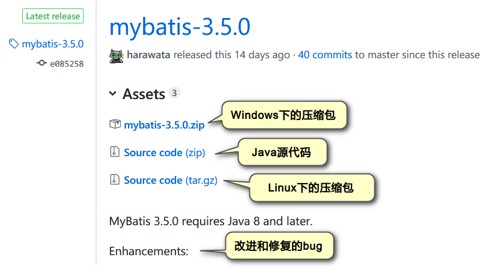

# MyBatis(第1天)

# 学习目标

1. 连接池
   1. 能够理解连接池解决现状问题的原理
   2. 能够使用C3P0连接池
   3. 能够使用DRUID连接池
2. 能够了解什么是框架
3. <font color="red">掌握mybatis框架开发快速入门</font>

   

# 1.框架概述

## 目标

1. 什么是框架

2. 框架解决了哪些问题

3. 分层开发下常见的框架

## 什么是框架

程序开发中的框架往往是对常见功能的封装，**通常与具体业务无关**，也可以认为是软件的半成品。程序框架理解为基础或者机械标准件(例如螺丝螺母标准的机械部件)。

假如你要造一辆马车，在没有框架的情况下，你需要自己去伐木，去把木头做成木板，木棍，然后组成轮子，门，等部件，然后组装起来。但如果你用了框架，就相当于你有现成的轮子，门等部件，你只需要组装一下就可以了。

一个框架是一组可复用的设计构件。


框架(Framework)是整个或者部分系统的可重用设计，是JavaEE底层技术的封装。

框架是可以被开发者定制的应用骨架。

框架是一个半成品，软件是成品。我们在它的基础上开发出成品(软件)。   

## 框架解决的问题

### 解决了技术通用的问题

在JavaEE体系中，有着各种各样的技术。不同的软件企业，根据自身的业务需求选择不同的技术，容易造成应用依赖技术，增加了项目开发实现的复杂性和技术风险性。而框架技术就可以解决上述问题。

### 提升了开发效率

企业项目中使用框架，只需要专注实现业务需求。使用框架的方便性，提升了开发效率。

### 提升了系统稳定性

一个成熟的框架，经过了在众多企业项目中的验证使用，稳定性有保障。


### 小结

1. 理解为软件中标准件，程序员可以利用这些半成品来开发软件。
2. 提高开发效率，降低开发成本。
3. 以后我们在企业中开发项目基本上都是使用框架来开发

 


# 2.mybatis框架介绍

## 目标

1. mybatis框架介绍

2. mybatis框架官网和jar包下载

## mybatis框架介绍

~~~java
	mybatis是Apache软件基金会下的一个开源项目，前身是iBatis框架。2010年这个项目由apache 软件基金会迁移到google code下，改名为mybatis。2013年11月又迁移到了github(GitHub 是一个面向开源及私有 软件项目的托管平台)。
	MyBatis 是一款优秀的持久层框架，它支持定制化 SQL、存储过程以及高级映射(多表)。MyBatis 避免了几乎所有的 JDBC 代码和手动设置参数以及获取结果集。它对 jdbc 的操作数据库的过程进行封装，使开发者只需要关注 SQL 本身，而不需要花费精力去处理例如注册驱动、创建 connection、创建 statement、手动设置参数、结果集检索等 jdbc 繁杂的过程代码。MyBatis 可以使用简单的 XML 或注解来配置和映射原生类型、接口和 Java 的 POJO（Plain Old Java Objects，普通老式 Java 对象）为数据库中的记录。  
~~~


### mybatis的优点

1. 简单易学：mybatis本身就很小且简单。没有任何第三方依赖，最简单安装只要两个jar文件+配置几个SQL映射文件即可。  
2. 使用灵活：Mybatis不会对应用程序或者数据库的现有设计强加任何影响。SQL语句写在XML里，便于统一管理和优化。
3. 解除SQL与程序代码的耦合：通过提供DAO层，将业务逻辑和数据访问逻辑分离，使系统的设计更清晰，更易维护，更易进行单元测试。SQL语句和代码的分离，提高了可维护性。

### mybatis的不足

1. 编写SQL语句时工作量很大，尤其是字段多、关联表多时，更是如此。
2. SQL语句依赖于数据库，导致数据库移植性差，不能更换数据库。
3. 框架还是比较简陋，功能尚有缺失。


### 官方网站及框架包下载

官网地址：http://www.mybatis.org/mybatis-3/ 

           

 


源码和包下载地址：https://github.com/mybatis/mybatis-3/releases

 

下载后的包位于课后资料中：


###  mybatis框架整体架构


```html
1、配置文件
	全局配置文件（核心配置文件）：mybatis-config.xml，作用：配置数据源（配置数据库连接信息），引入映射文件
	映射文件：XxMapper.xml，作用：配置sql语句、参数、结果集封装类型等
	
2、SqlSessionFactory
	作用：获取SqlSession
	通过new SqlSessionFactoryBuilder().build(inputStream)来构建，inputStream：读取配置文件的IO流

3、SqlSession
	作用：执行CRUD操作
	
4、Executor
	执行器，SqlSession通过调用它来完成具体的CRUD
	
5、Mapped Statement
	在映射文件里面配置，包含3部分内容：
		具体的sql，sql执行所需的参数类型，sql执行结果的封装类型
	参数类型和结果集封装类型包括3种：
		HashMap，基本数据类型，pojo
```

### **MyBatis的ORM方式**

---

Object Relational Mapping 对象关系映射


**MyBatis的两种映射方式：**

1. 通过XML映射
2. 通过注解


### 【小结】

~~~html
1、mybatis解决了三层(web,service,dao)中哪一层的问题？
	dao(数据持久层)
2、mybatis框架是对什么技术进行的封装？
	JDBC
3、mybatis框架中的核心组件有哪些？
	SqlSessionFactoryBuilder:SqlSessionFactory工厂的创造类
	SqlSessionFactory：加载配置信息，提供SqlSession
	SqlSession： 数据操作的对象 sql语句
~~~


# 3.MyBatis框架入门开发【掌握】

## 4.1入门案例：环境的搭建和代码实现

### 目标

1.     mybatis开发环境的搭建

2.     了解mybatis的开发步骤

### 需求

利用mybatis框架，从MySQL中查询所有的用户

                                                  

### 准备数据

要查询的表

```mysql
create table user (
  id int primary key auto_increment,
  username varchar(20) not null,
  birthday date,
  sex char(1) default '男',
  address varchar(50)
);

insert into user values (null, '孙悟空','1980-10-24','男','花果山水帘洞');
insert into user values (null, '白骨精','1992-11-12','女','白虎岭白骨洞');
insert into user values (null, '猪八戒','1983-05-20','男','福临山云栈洞');
insert into user values (null, '蜘蛛精','1995-03-22','女','盤丝洞');

select * from user;
```


### 步骤

我们完全可以按照mybatis官网入门步骤进行开发即可：


1. 创建项目

2. 创建lib目录，复制以下包

   1. 日志记录包：mybatis在执行过程中输出的一些信息，mybatis底层需要使用log4j日志框架

       log4j.jar

   2. mysql驱动

       

   3. mybatis框架的包

       

      

3. 创建实体类User

~~~java
package com.itheima.sh.pojo;
import java.sql.Date;
public class User {
    private Integer id;
    private String username;
    private Date birthday;
    private String sex;
    private String address;

    public User() {
    }

    public User(Integer id, String username, Date birthday, String sex, String address) {
        this.id = id;
        this.username = username;
        this.birthday = birthday;
        this.sex = sex;
        this.address = address;
    }

    public Integer getId() {
        return id;
    }

    public void setId(Integer id) {
        this.id = id;
    }

    public String getUsername() {
        return username;
    }

    public void setUsername(String username) {
        this.username = username;
    }

    public Date getBirthday() {
        return birthday;
    }

    public void setBirthday(Date birthday) {
        this.birthday = birthday;
    }

    public String getSex() {
        return sex;
    }

    public void setSex(String sex) {
        this.sex = sex;
    }

    public String getAddress() {
        return address;
    }

    public void setAddress(String address) {
        this.address = address;
    }

    @Override
    public String toString() {
        return "User{" +
                "id=" + id +
                ", username='" + username + '\'' +
                ", birthday=" + birthday +
                ", sex='" + sex + '\'' +
                ", address='" + address + '\'' +
                '}';
    }
}
~~~


4.在src下面创建核心配置文件：**mybatis-config.xml**         

~~~java
	XML 配置文件中包含了对 MyBatis 系统的核心设置，包含获取数据库连接实例的数据源（DataSource）和决定事务作用域和控制方式的事务管理器（TransactionManager）。 XML 配置文件的详细内容后面再探讨，这里先给出一个简单的示例：
~~~


~~~xml
<?xml version="1.0" encoding="UTF-8" ?>
<!DOCTYPE configuration
        PUBLIC "-//mybatis.org//DTD Config 3.0//EN"
        "http://mybatis.org/dtd/mybatis-3-config.dtd">
<configuration>
    <!--mybatis环境的配置-->
    <environments default="development">
        <!--通常我们只需要配置一个就可以了， id是环境的名字 -->
        <environment id="development">
            <!--事务管理器：由JDBC来管理-->
            <transactionManager type="JDBC"/>
            <!--数据源的配置：mybatis自带的连接池-->
            <dataSource type="POOLED">
                <property name="driver" value="com.mysql.jdbc.Driver"/>
                <property name="url" value="jdbc:mysql://localhost:3306/db4"/>
                <property name="username" value="root"/>
                <property name="password" value="1234"/>
            </dataSource>
        </environment>
    </environments>
    <mappers>
        <!--加载映射文件,放到src下即可-->
        <mapper resource="userMapper.xml"/>
    </mappers>
</configuration>
~~~

4.在src下创建映射文件**userMapper.xml**

~~~xml
<?xml version="1.0" encoding="UTF-8" ?>
<!DOCTYPE mapper
        PUBLIC "-//mybatis.org//DTD Mapper 3.0//EN"
        "http://mybatis.org/dtd/mybatis-3-mapper.dtd">
<mapper namespace="org.mybatis.example.BlogMapper">
    <!--
        查询语句
        resultType：返回的实体类的类型，类全名
    -->
    <select id="findAllUsers" resultType="com.itheima.sh.pojo.User">
        select * from user
    </select>
</mapper>
~~~

5.编写测试类代码

- 三大对象作用和生命周期 13918584084

在mybatis中一个会话相当于一次访问数据库的过程，**一个会话对象类似于一个Connection连接对象**。

1. **SqlSessionFactoryBuilder**：这是一个临时对象，用完就不需要了。通过这个工厂建造类来创建一个会话工厂。
2. **SqlSessionFactory**：从一个工厂类中得到一个会话对象，一个项目中只需要创建一个会话工厂对象即可。通过会话工厂对象来创建会话对象。
3. **SqlSession**： 每次访问数据库都需要创建一个会话对象，这个会话对象不能共享。访问完成以后会话需要关闭。                   

~~~java
public class MyBatisTest01 {
    //从MySQL中查询所有的用户
    @Test
    public void test01() throws Exception{
        //1.从xml文件中构建SqlSessionFactory
        //定义核心配置文件路径
        String resource = "mybatis-config.xml";
        //加载核心配置文件获取输入流
        InputStream inputStream = Resources.getResourceAsStream(resource);
        SqlSessionFactory sqlSessionFactory = new SqlSessionFactoryBuilder().build(inputStream);

        //2.从SqlSessionFactory中获取session
        SqlSession session = sqlSessionFactory.openSession();

        //3.使用session操作数据库 CRUD
        //通过参数：org.mybatis.example.BlogMapper.findAllUsers找到映射文件userMapper.xml中的sql语句
        List<User> userList = session.selectList("org.mybatis.example.BlogMapper.findAllUsers");
        for (User user : userList) {
            System.out.println("user = " + user);
        }
        //关闭会话
        session.close();
    }
}
~~~

编写流程：Resources工具类直接可以读取src目录下配置文件，转成输入流。


6.运行结果：


说明：我们通过运行结果发现mybatis框架发出警告，因为没有使用log4j日志。所以我们需要在src下再次创建一个日志配置文件：log4j.properties

~~~properties
### 设置Logger输出级别和输出目的地 ###
log4j.rootLogger=debug, stdout

### 把日志信息输出到控制台 ###
log4j.appender.stdout=org.apache.log4j.ConsoleAppender
log4j.appender.stdout.Target=System.out
log4j.appender.stdout.layout=org.apache.log4j.SimpleLayout

~~~

作用：用来设置日志记录的格式，因为mybaits需要使用到log4j来记录它的日志。日志记录程序运行过程中各种事件。


mybatis配置文件分两种

1. 核心配置文件：mybatis-config.xml 配置连接数据库参数
2. 映射文件：UserMapper.xml编写SQL语句


### 项目结构


## 4.2入门案例：mybatis执行流程分析


说明：

1.第一步：是从核心配置文件mybatis-config.xml中构建SqlSessionFactory对象，由于核心配置文件mybatis-config.xml中关联了映射文件UserMapper.xml,所以在SqlSessionFactory中也存在映射文件的内容

2.第二步：是从SqlSessionFactory中获取SqlSession会话对象，其实SqlSession会话对象底层封装的就是conn连接对象

3.第三步：是通过SqlSession会话对象调用查询方法selectList然后根据参数找到映射文件中中的sql语句并将数据封装到pojo的User对象中


## 4.3入门案例：核心配置文件 mybatis-config.xml

在src目录下核心配置文件


- 可以在mybatis官网入门中找到配置模板：

  http://www.mybatis.org/mybatis-3/zh/getting-started.html

```xml
<?xml version="1.0" encoding="UTF-8" ?>
<!DOCTYPE configuration
        PUBLIC "-//mybatis.org//DTD Config 3.0//EN"
        "http://mybatis.org/dtd/mybatis-3-config.dtd">
<configuration>
    <!--mybatis环境的配置-->
    <environments default="development">
        <!--通常我们只需要配置一个就可以了， id是环境的名字 -->
        <environment id="development">
            <!--事务管理器：由JDBC来管理-->
            <transactionManager type="JDBC"/>
            <!--数据源的配置：mybatis自带的连接池-->
            <dataSource type="POOLED">
                <property name="driver" value="com.mysql.jdbc.Driver"/>
                <property name="url" value="jdbc:mysql://localhost:3306/db4"/>
                <property name="username" value="root"/>
                <property name="password" value="1234"/>
            </dataSource>
        </environment>
    </environments>
    <mappers>
        <!--加载映射文件,放到src下即可-->
        <mapper resource="userMapper.xml"/>
    </mappers>
</configuration>
```


- 可以在idea中定义模板，以后重用。


## 4.4入门案例：常见错误

- 在映射文件userManager.xml中的resultType位置没有书写类的全名

  

- 在核心配置文件中没有引入映射文件


小结：

1、mybatis框架的核心组件：

   SqlSessionFactoryBuilder;会话工厂构造类创建会话工厂对象

​	SqlSessionFactory：会话工厂类创建会话对象
​	SqlSession：会话类

2、入门程序开发流程：
	【1】从xml文件中构建：___SqlSessionFactory____
	【2】从SqlSessionFactory中获取：____SqlSession_____
	【3】通过__SqlSession____执行___映射文件___文件中的sql语句


# 4.mybatis的dao层动态代理实现【掌握】

​	在上述入门案例中，我们使用了mybatis框架的SqlSession完成了对数据库的查询操作。但是，mybatis是持久层（dao层）的框架，在实际开发中，mybatis应该在持久层起作用。关于mybatis在持久层的使用。官方描述如下：


## 【目标】

```html
创建dao层接口UserMapper，通过SqlSession获取UserMapper接口的动态代理对象实现查询所有数据；
```

## 【步骤】

```html
第一步：新建接口 UserMapper；
第二步：将接口和映射文件绑定；
第三步：在映射文件中书写SQL语句；
第四步：获取UserMapper的动态代理对象完成查询；
```

## 【实现】

【1】新建UserMapper接口：

```java
public interface UserMapper {
    /**
     查询所有的用户
     */
    List<User> findAllUsers();
}
```

【2】将接口和映射文件绑定：

```html
映射文件的	namespace值==接口的全路径
映射文件的sql语句的	id值 ==接口中的方法名
```


【3】获取UserMapper接口的动态代理对象执行查询：

```java
    @Test
    public void test02() throws Exception{
        //1.从xml文件中构建SqlSessionFactory
        //定义核心配置文件路径
        String resource = "mybatis-config.xml";
        //加载核心配置文件获取输入流
        InputStream inputStream = Resources.getResourceAsStream(resource);
        SqlSessionFactory sqlSessionFactory = new SqlSessionFactoryBuilder().build(inputStream);

        //2.从SqlSessionFactory中获取session
        SqlSession session = sqlSessionFactory.openSession();

        //3.使用session获取接口的动态代理对象
        UserMapper mapper = session.getMapper(UserMapper.class);
        //4.使用接口对象调用接口中的方法
        List<User> userList = mapper.findAllUsers();
        //5.遍历集合
        for (User user : userList) {
            System.out.println(user);
        }
        //关闭会话
        session.close();
    }
```


## 【小结】

```html
mybatis动态代理对象实现过程：
【1】书写dao层： UserMapper.java接口 --定义方法
【2】把接口和映射文件绑定：
		1、映射文件的namespace="接口的全限定类名";
		2、映射文件中sql语句的id值必须为 接口中方法名
【3】获取接口的动态代理对象：
	 UserMapper userMapper = sqlSession.getMapper(UserMapper.class);
	 List<User> userList = userMapper.findAllUser();

 直接使用SqlSession进行查询：
SqlSession session = sqlSessionFactory.openSession();
List<User> userList =  session.selectList("org.mybatis.example.BlogMapper.findAllUsers");
说明：原来的方式在selectList方法的参数中直接书写字符串，容易写错，并且也不知道是哪个模块，开发中模块会有多个，而上述接口方式我们能看出到底用户模块还是商品模块
```


# 5.mybatis核心配置

**【mybatis全局配置介绍】**

​	mybatis-config.xml，是MyBatis的全局配置文件，包含全局配置信息，如数据库连接参数、插件等。整个框架中只需要一个即可。

```html
1、mybatis全局配置文件是mybatis框架的核心配置，整个框架只需一个；
2、mybatis全局配置文件中的配置顺序：注意如果配置多项，必须按照以下顺序进行配置
	properties：属性配置
	settings：设置
	typeAliases：类型别名设置
	typeHandlers：类型处理器
	enviroments：环境配置
		environment（环境变量）
		transactionManager（事务管理器）
		dataSource（数据源）
	mappers：映射器
```


## 5.1、properties(属性)

### 【作用】

```html
1、加载外部的java资源文件（properties文件）；
2、通过子标签property设置属性；
```

### 【需求】

```html
使用properties属性，配置数据库连接参数；
```

#### 【1】property标签设置

```html
1、通过properties的子标签设置属性；
2、使用${key}获取设置的属性值；
```

【通过properties的子标签property设置属性】了解

~~~xml
<?xml version="1.0" encoding="UTF-8" ?>
<!DOCTYPE configuration
        PUBLIC "-//mybatis.org//DTD Config 3.0//EN"
        "http://mybatis.org/dtd/mybatis-3-config.dtd">
<configuration>
    <!--
        一、properties（属性）
            【1】作用：定义参数或者加载外部的资源文件中的参数
            【2】用法：
            用法一：通过子标签 property 设置属性名和属性值；
            用法二：通过标签属性resource，加载外部的资源文件中参数；
    -->
    <properties>
        <property name="driver" value="com.mysql.jdbc.Driver"/>
    </properties>

    <!--mybatis环境的配置-->
    <environments default="development">
        <!--通常我们只需要配置一个就可以了， id是环境的名字 -->
        <environment id="development">
            <!--事务管理器：由JDBC来管理-->
            <transactionManager type="JDBC"/>
            <!--数据源的配置：mybatis自带的连接池-->
            <dataSource type="POOLED">
                <!--
                    这里的value="${driver}"  driver 是子标签property的name属性值
                -->
                <property name="driver" value="${driver}"/>
                <property name="url" value="jdbc:mysql://localhost:3306/db4"/>
                <property name="username" value="root"/>
                <property name="password" value="1234"/>
            </dataSource>
        </environment>
    </environments>
    <mappers>
        <!--加载映射文件,放到src下即可-->
        <mapper resource="userMapper.xml"/>
    </mappers>
</configuration>
~~~


#### 【2】加载外部properties

##### 第一步：新建资源文件

新建jdbc.properties文件，将连接参数抽取到配置文件中：

```properties
driver=com.mysql.jdbc.Driver
url=jdbc:mysql://localhost:3306/db4
username=root
password=1234
```

##### 第二步：引入资源文件

在mybatis-config.xml文件中加载jdbc.properties文件；**通过properties的属性resource引入；**


 **【注意事项】**：子标签和属性resource同时加载一个变量，先加载子标签，然后在加载resource关联的外部文件的值，那么子标签中的内容会被覆盖。此时子标签存在就没有意义了。


## 5.2、settings(设置)

settings参数有很多，今天咱们先学习驼峰匹配-mapUnderscoreToCamelCase。翻译过来就是映射下划线到驼峰式命名。


### 【作用】


```html
开启驼峰匹配：完成经典的数据库命名到java属性的映射
		经典数据库命名：如果多个单词之间，通常使用下划线进行连接。
		java中命名：第二个单词首字母大写。
驼峰匹配：相当于去掉数据库的数据中的名字的下划线，和java进行匹配  
```


### 【应用场景】

```html
从数据库中查到数据的字段名user_name和实体类属性名userName，不一致，导致查到的数据无法封装到实体类中。
但是，实体类中的属性userName符合驼峰命名，数据库字段名user_name符合数据库经典字段命名。
```


如果此时直接查询数据，那么用户名是null。


#### 【1】配置驼峰映射

​	在mybatis-config.xml中做如下配置：

~~~xml
settings设置：
 mapUnderscoreToCamelCase ：驼峰自动映射配置 ,值是true表示开启驼峰自动映射。满足条件：数据库字段名  user_name   ,实体类属性名 userName
~~~


~~~xml
<!--
    2、settings设置：
 mapUnderscoreToCamelCase ：驼峰自动映射配置 满足条件：数据库字段名  user_name   ,实体类属性名 userName
 -->
<settings>
  <setting name="mapUnderscoreToCamelCase" value="true"/>
</settings>
~~~


​	运行测试，查看结果：

 

【小结】

```html
1、开启驼峰自动映射的作用：user_name ====> userName；
2、注意事项：字段名必须符合user_name格式，属性名必须符合驼峰命名规则；
```


#### 【2】解决字段名和属性名不一致的方法

```html
	如果数据库字段名和属性名不一致，或者是也不满足上面的命名规则。可以通过在SQL语句中为字段名取别名进行映射。
```


## 5.3、typeAliases(类型别名)

### 【1】作用

类型别名是给类的全限定名称(包名.类名) 取一个短名称。存在的意义仅在于用来减少类完全限定名的冗余。例如：


​	这些全限定类名可通过设置类型别名--短名称代替。类型别名的设置有以下几种方式：

```html
方式一：使用typeAliases标签的子标签typeAlias手动设置类型别名；
方式二：使用typeAliases标签的子标签package包扫描映射别名；
```


### 【2】应用

#### 【方式一】typeAlias

第一步：在mybatis-config.xml核心配置文件中通过typeAlias设置User的全限定类名为User；

~~~xml
<!--
        三、typeAliases（类型别名）
            【1】作用：给类的全限定名称 取一个短名称   com.heima.mybatis.pojo.User==>User
            【2】用法：
                1、单独取别名：<typeAlias type="com.heima.mybatis.pojo.User" alias="User"/>       
    -->
    <typeAliases>
        <!--
            type 关联的类的全名
            alias：属于别名，随便定义，但是这里定义什么那么在映射文件UserMapper.xml中就使用什么
        -->
        <typeAlias type="com.itheima.sh.pojo.User" alias="User"/>
    </typeAliases>
~~~

第二步：在UserMapper.xml文件中直接使用短名称--User取代全限定类名；


【小结】

```html
1、优点：通过typeAlias可以为全限定类名设置短名称，使用比较方便；
2、缺点：如果实体类很多，需要设置的别名就会很多；就是<typeAlias type="com.itheima.sh.pojo.User" alias="User"/>标签会很多，例如Order Product都对应一个typeAlias标签，比较麻烦
```


#### 【方式二】package

​	扫描指定包下的所有类，扫描之后的别名就是类名，大小写不敏感（不区分大小写），建议使用的时候和类名一致。

设置别名：

~~~xml
<!--
        三、typeAliases（类型别名）
            【1】作用：给类的全限定名称 取一个短名称   com.heima.mybatis.pojo.User==>User
            【2】用法：
                1、单独取别名：<typeAlias type="com.heima.mybatis.pojo.User" alias="User"/>
                2、批量取别名：<package name="com.heima.mybatis.pojo"/> 扫描到当前包下的所有类
                              类的类名==》别名
    -->
    <typeAliases>
        <!--
            type 关联的类的全名
            alias：属于别名，随便定义，但是这里定义什么那么在映射文件UserMapper.xml中就使用什么
        -->
        <!--<typeAlias type="com.itheima.sh.pojo.User" alias="u"/>-->
        <!--扫描com.itheima.sh.pojo包下所有的类，类名直接作为别名(别名不区分大小写)-->
        <package name="com.itheima.sh.pojo"/>
    </typeAliases>
~~~

使用别名：


#### 【内置别名】

​	这是一些为常见的 Java 类型内建的相应的类型别名。它们都是不区分大小写的，注意对基本类型名称重复采取的特殊命名风格。

| 别名       | 映射的类型 |
| ---------- | ---------- |
| _byte      | byte       |
| _long      | long       |
| _short     | short      |
| _int       | int        |
| _integer   | int        |
| _double    | double     |
| _float     | float      |
| _boolean   | boolean    |
| string     | String     |
| byte       | Byte       |
| long       | Long       |
| short      | Short      |
| int        | Integer    |
| integer    | Integer    |
| double     | Double     |
| float      | Float      |
| boolean    | Boolean    |
| date       | Date       |
| decimal    | BigDecimal |
| bigdecimal | BigDecimal |
| object     | Object     |
| map        | Map        |
| hashmap    | HashMap    |
| list       | List       |
| arraylist  | ArrayList  |
| collection | Collection |
| iterator   | Iterator   |

【代码演示】

~~~xml
<!--parameterType="int" 表示sql语句参数id的类型，int是Integer的别名-->
    <select id="queryById" resultType="user" parameterType="int">
        select * from user where id = #{id}
    </select>
~~~


## 5.4、typeHandlers(类型处理器)【了解】

​	无论是 MyBatis 在预处理语句（PreparedStatement）中设置一个参数时，还是从结果集中取出一个值时， 都会用类型处理器将获取的值以合适的方式转换成 Java 类型。下表描述了一些默认的类型处理器。


~~~xml
<!--
        四、typeHandlers（类型处理器）
            数据库数据类型：varchar    ===StringTypeHandler===> 实体类：String
            数据库数据类型：double   DoubleTypeHandler  实体类中的数据： java.lang.Double 
-->
~~~


## 5.5、environments【了解】

```html
	MyBatis 可以配置成适应多种环境，例如，开发、测试和生产环境需要有不同的配置；
尽管可以配置多个环境，每个 SqlSessionFactory 实例只能选择其一。
虽然，这种方式也可以做到很方便的分离多个环境，但是实际使用场景下，我们更多的是选择使用spring来管理数据源，来做到环境的分离。
```

~~~xml
      父标签： environments（环境配置）
			子标签：
                environment（环境变量）
                transactionManager（事务管理器）
                dataSource（数据源） 
~~~


### 【1】默认环境设置

第一步：在environments标签中配置多个environment，通过属性default指定一个默认环境配置；


第二步：在构建SqlSessionFactory时，可指定具体环境，如果不指定就使用默认的环境配置；


### 【2】指定环境设置

第一步：在environments中配置多个环境


第二步：在构建SqlSessionFactory时，通过environment的id指定环境


代码演示：

~~~xml
<!--mybatis环境的配置-->
    <!--
        五、 environments（数据库环境配置）
                开发过程中会使用第三方的连接池：druid,C3P0
                Spring框架管理连接池
    -->
    <!--<environments default="test">-->
    <environments default="development">
        <!--通常我们只需要配置一个就可以了， id是环境的名字 -->
        <environment id="development">
            <!--事务管理器：由JDBC来管理-->
            <transactionManager type="JDBC"/>
            <!--数据源的配置：mybatis自带的连接池-->
            <dataSource type="POOLED">
                <!--
                    这里的value="${driver}"  driver 是子标签property的name属性值
                -->
                <property name="driver" value="${driver}"/>
                <property name="url" value="jdbc:mysql://localhost:3306/db4"/>
                <property name="username" value="root"/>
                <property name="password" value="1234"/>
            </dataSource>
        </environment>


        <!--通常我们只需要配置一个就可以了， id是环境的名字 -->
        <environment id="test">
            <!--事务管理器：由JDBC来管理-->
            <transactionManager type="JDBC"/>
            <!--数据源的配置：mybatis自带的连接池-->
            <dataSource type="POOLED">
                <!--
                    这里的value="${driver}"  driver 是子标签property的name属性值
                -->
                <property name="driver" value="${driver}"/>
                <property name="url" value="jdbc:mysql://localhost:3306/db4"/>
                <property name="username" value="root"/>
                <property name="password" value="12345"/>
            </dataSource>
        </environment>
    </environments>
~~~

~~~java
    @Test
    public void queryById( ) throws Exception {
        //获取mapper接口的动态代理实现

        //1、从xml中构建SqlSessionFactory
        String resource = "mybatis-config.xml";
        InputStream inputStream = Resources.getResourceAsStream(resource);
        //这里指定了环境为test
//        SqlSessionFactory sqlSessionFactory = new SqlSessionFactoryBuilder().build(inputStream,"test");
        //build不方法不指定环境就使用默认的 <environments default="development">
        SqlSessionFactory sqlSessionFactory = new SqlSessionFactoryBuilder().build(inputStream);

        //2、获取SqlSession
        SqlSession sqlSession = sqlSessionFactory.openSession();

        //3、获取UserMapper接口的动态代理对象
        UserMapper userMapper = sqlSession.getMapper(UserMapper.class);

        User user = userMapper.queryById(1);
        System.out.println("user = " + user);
    }
~~~


【注意事项】

```html
	虽然，这种方式也可以做到很方便的分离多个环境，但是实际使用场景下，我们更多的是选择使用第三方的连接池：druid,C3P0。并且使用spring来管理数据源(连接池)，来做到环境的分离。 
```


## 5.6、mappers(映射器)

mappers（映射器）：UserMapper.xml====>UserMapper.java接口 关联.

作用：维护接口和映射文件之间的关系.

​	既然 MyBatis 的行为已经由上述元素配置完了，我们现在就要定义 SQL 映射语句了。 但是首先我们需要告诉 MyBatis 到哪里去找到这些语句。 Java 在自动查找这方面没有提供一个很好的方法，所以最佳的方式是告诉MyBatis 到哪里去找映射文件。 你可以使用相对于类路径的资源引用， 或完全限定资源定位符（包括 `file:///` 的 URL），或类名和包名等。方式如下：

使用方式：
                  1、加载映射文件，关联UserMapper.java接口
                        【1】<mapper resource="UserMapper.xml"/> 从src下加载映射文件；
                        【2】<mapper url=""/>  从本地磁盘中加载映射文件,但是需要添加`file:///`协议

​				   2、加载接口，关联映射文件
​                     条件：**1、接口名和映射文件名保持一致；2、路径保持一致；**
​                    【1】class：加载单独的接口：<mapper class="com.heima.mybatis.dao.UserMapper"/>
​                    【2】批量加载class：<package name="com.heima.mybatis.dao"/>

### 方式一：加载映射文件方式resource

​	在mybatis-config.xml文件中，通过mapper标签的resource属性引入当前工程src下的映射文件。

 

**【缺点】**

```html
有多少个映射文件就要配置多少次，麻烦。
```


### 方式二：加载映射文件方式url【了解】

将UserMapper.xml映射文件放入e盘下，然后在全局配置文件中引入该映射文件。
引入硬盘目录下的映射文件：


缺点：
1、	硬盘的位置可能随着项目的部署或迁移，路径发生变化
2、	每新增一个映射文件，就要在全局配置文件中引入


### 方式三：加载接口，关联映射文件方式class

条件：**1、接口名和映射文件名保持一致；2、路径保持一致；**

在mybatis-config.xml配置mapper接口的全路径：

~~~xml
   <mappers>
       <!-- <mapper resource="UserMapper.xml"/>-->
        <mapper class="com.heima.mybatis.mapper.UserMapper"/>
    </mappers>
~~~

在与UserMapper.java相同目录结构的包下面新建映射文件UserMapper.xml，内容如下：


```xml
<?xml version="1.0" encoding="UTF-8" ?>
<!DOCTYPE mapper
        PUBLIC "-//mybatis.org//DTD Mapper 3.0//EN"
        "http://mybatis.org/dtd/mybatis-3-mapper.dtd">
<mapper namespace="com.heima.mybatis.mapper.UserMapper">
    <!--根据id查询-->
    <select id="queryById" resultType="User">
        select *,user_name AS  userName from user where id = #{id}
    </select>
</mapper>
```


**【注意事项】**

```html
class配置条件：
 1、映射文件名必须与接口同名（UserMapper.xml ===> UserMapper.java）；
 2、映射文件必须与接口的目录结构相同（UserMapper.xml和UserMapper.java在同一个包下面）；
 3、映射文件的namespace必须是接口的全路径：namespace="com.heima.mapper.UserMapper"；
```


**【缺点】**

```html
需要为每一个接口都配置一个class，接口名称必须与映射文件名相同，而且目录结构相同。
```


### 方式四：加载接口，关联映射文件方式package

在mybatis-config.xml中，开启包扫描：扫描包下的所有接口和对应的映射文件。

条件：**1、接口名和映射文件名保持一致；2、路径保持一致；**

~~~xml
    <mappers>
        <package name="com.itheima.sh.dao"/>
    </mappers>
~~~


**【原理】：**

```html
扫描目标包目录下的mapper接口，并按照class的方式找到接口对应的映射文件。
```

其条件和设置class的条件一样：

```html
1、映射文件和mapper接口在同一个目录下
2、文件名必须一致
3、映射文件的namespace必须和mapper接口的全路径保持一致
```

**【缺点】：**

```html
1、需要遵守的条件太多
2、mapper.xml和mapper.java没有分离。
```


#### 【mappers小结】：

```html
mappers:配置映射文件
	mapper
		resource:配置类路径下的映射文件(掌握)
		url：配置磁盘位置的映射文件
		class:配置接口
            1、要求接口和映射文件在同一个包下
            2、要求接口和映射文件同名
            3、要求namesapce的值必须为接口的全限定类名
	   package：配置接口包扫描(掌握)
            1、要求接口和映射文件在同一个包下
            2、要求接口和映射文件同名
            3、要求namesapce的值必须为接口的全限定类名

【推荐使用】resource加载映射文件，如果使用注解开发只能使用	class  和 package方式，建议使用package方式，注解开发不能使用加载配置文件的方式，因为注解已经取代了xml文件。所有注解都使用在接口的方法上。
```


## 5.7、全局配置小结

```html
一、全局配置：如果需要配置多个，必须按照以下顺序
    properties（属性）
    settings（设置）
    typeAliases（类型别名）
    typeHandlers（类型处理器）
    environments（环境配置）
        environment（环境变量）
        transactionManager（事务管理器）
        dataSource（数据源）
    mappers（映射器）
二、常用配置：
	1、properties（属性）
		【作用】定义一些属性或者加载外部的资源文件
		【用法】
			1、通过子标签定义：
				<properties>
					<property name="driver" value="com.mysql.jdbc.Driver"></property>
				</properties>
    	 		获取参数： ${driver}
		   2、加载外部的资源文件（src， jdbc.properties）
				<properties resource="jdbc.properties"></properties>
				获取参数： ${driver}
	2、settings(设置)：
		驼峰自动映射：数据库下划线命名：user_name  ===》实体类属性命名：userName
			    <settings>
                      <setting name="mapUnderscoreToCamelCase" value="true"/>
                  </settings>
			说明：如果不满足驼峰式命名，查询时起别名。
   3、typeAliases（类型别名）
		【作用】给类的全名称 取 短名称  com.heima.pojo.User===>User
		【配置】
			 <typeAliases>
                <!--<typeAlias type="com.heima.mybatis.pojo.User" alias="User"/>-->
                <package name="com.heima.mybatis.pojo"/>
            </typeAliases>

   4、mappers（映射器）
		【作用】把映射文件   和  接口 进行绑定
		【配置】
			加载xml文件：
				1、mapper resource="src下的映射文件"    多
				2、mapper url="本地磁盘中的文件"
			加载接口：【1】映射文件和接口名称必须一致； 【2】路径一致
				1、一个接口： mapper  class="com.heima.mybatis.dao.UserMapper"
				2、接口扫描： package name="com.heima.mybatis.dao" 多
```


# 6.编写会话工具类

---

1. 在静态代码块中创建会话工厂对象
2. 编写静态方法得到会话对象
3. 编写静态方法得到会话工厂对象

**代码**

---

```java
package com.itheima.utils;

import org.apache.ibatis.io.Resources;
import org.apache.ibatis.session.SqlSession;
import org.apache.ibatis.session.SqlSessionFactory;
import org.apache.ibatis.session.SqlSessionFactoryBuilder;

import java.io.IOException;
import java.io.InputStream;

public class SessionFactoryUtils {

    // 声明一个工厂对象
    private static SqlSessionFactory factory;

    // 在静态代码块中创建会话工厂
    static {
        SqlSessionFactoryBuilder builder = new SqlSessionFactoryBuilder();
        try (
                // 获取配置文件的输入流
                InputStream inputStream = Resources.getResourceAsStream("sqlMapConfig.xml");
                ) {
            factory = builder.build(inputStream);
        } catch (IOException e) {
            e.printStackTrace();
        }
    }

    /**
     * 获取会话工厂
     */
    public static SqlSessionFactory getSessionFactory() {
        return factory;
    }

    /**
     * 得到会话对象
     */
    public static SqlSession getSession() {
        return factory.openSession();
    }
}

```

# 7.mybatis环境搭建

## 1、需求

~~~html
搭建mybatis环境，完成dao层根据id查询用户数据功能；
~~~

~~~sql
create table user (
  id int primary key auto_increment,
  username varchar(20) not null,
  age int,
  birthday date,
  sex char(1) default '男',
  address varchar(50)
);

insert into user values (null, '孙悟空',30,'1980-10-24','男','花果山水帘洞');
insert into user values (null, '白骨精',20,'1992-11-12','女','白虎岭白骨洞');
insert into user values (null, '猪八戒',20,'1983-05-20','男','福临山云栈洞');
insert into user values (null, '蜘蛛精',30,'1995-03-22','女','盤丝洞');

select * from user;
~~~

注意：我们在数据库中创建好表并添加数据之后，每次操作数据都要切换idea中，这样会比较麻烦，我们其实可以在idea中直接连接mysql数据库服务器，这样操作起来会更加简单，不用总是切换到数据库的图形化界面，那么接下来我们就开始学习下如何在idea中操作数据库服务器。

【步骤】

1.点击idea右边的database数据库工具栏


​	说明：如果你的idea没有，请按照如下操作：


2.


3.配置连接数据库的参数


4.操作数据库的界面


补充：如果驱动下载完毕。还是连接不上，需要按照如下做：修改mysql时间：

~~~java
set global time_zone='+8:00';
~~~

## 2、环境搭建

~~~html
1、创建项目，导入jar包；
2、准备接口和实体类：UserMapper.java，User.java
~~~

### 【1】创建项目，导入jar包；


### 【2】准备实体类和接口：User.java，UserMapper.java


User.java

~~~java
public class User {

    private Integer id;
    private String username;
    private Integer age;
    private Date birthday;
    private String sex;
    private String address;
  

    ......
}

~~~

UserMapper.java

~~~java
public interface UserMapper {
    //根据id查询
    User queryById(Integer id);
}
~~~


## 3、mybatis配置

~~~html
1、配置mybatis全局配置：mybatis-config.xml
2、配置mybatis映射文件：UserMapper.xml
3、测试
~~~

### 【1】配置mybatis全局配置：mybatis-config.xml

~~~xml
<?xml version="1.0" encoding="UTF-8" ?>
<!DOCTYPE configuration
        PUBLIC "-//mybatis.org//DTD Config 3.0//EN"
        "http://mybatis.org/dtd/mybatis-3-config.dtd">
<configuration>
    <environments default="development">
        <environment id="development">
            <transactionManager type="JDBC"/>
            <dataSource type="POOLED">
                <property name="driver" value="com.mysql.jdbc.Driver"/>
                <property name="url" value="jdbc:mysql:///heima87_ssm"/>
                <property name="username" value="root"/>
                <property name="password" value="1234"/>
            </dataSource>
        </environment>
    </environments>
    <mappers>
        <mapper resource="UserMapper.xml"/>
    </mappers>
</configuration>
~~~


### 【2】配置mybatis映射文件：UserMapper.xml

~~~xml
<?xml version="1.0" encoding="UTF-8" ?>
<!DOCTYPE mapper
        PUBLIC "-//mybatis.org//DTD Mapper 3.0//EN"
        "http://mybatis.org/dtd/mybatis-3-mapper.dtd">
<mapper namespace="com.heima.mybatis.mapper.UserMapper">
    <!--根据id查询-->
    <select id="queryById" resultType="com.heima.mybatis.pojo.User">
        select * from user where id = #{id}
    </select>
</mapper>
~~~


### 【3】测试

~~~java
public class MyBatisTest {
    @Test
    public void queryById( ) throws Exception {
        //获取mapper接口的动态代理实现

        //1、从xml中构建SqlSessionFactory
        String resource = "mybatis-config.xml";
        InputStream inputStream = Resources.getResourceAsStream(resource);
        SqlSessionFactory sqlSessionFactory = new SqlSessionFactoryBuilder().build(inputStream);

        //2、获取SqlSession
        SqlSession sqlSession = sqlSessionFactory.openSession();

        //3、获取UserMapper接口的动态代理对象
        UserMapper userMapper = sqlSession.getMapper(UserMapper.class);

        User user = userMapper.queryById(1);
        System.out.println("user = " + user);
    }
}
~~~


# 8.mybatis映射文件配置

**【注意】**

​	Mapper映射文件中定义了操作数据库的sql,每一个sql都被包含在一个statement中。映射文件是mybatis操作数据库的核心。


​	在映射文件中我们需要研究的内容有：SQL语句，入参，返回值


## 8.1、SQL语句-CRUD

​	映射文件中需要直接书写SQL语句对数据库进行操作，对数据库操作SQL语句主要有CRUD这四类。这四类对应到映射文件中的配置为四类标签：`select`，`insert`,`update`，`delete` 。

- 接口

  ~~~java
  public interface UserMapper {
      /*
          查询所有用户
       */
      List<User> findAllUsers();
      //根据id查询
      User queryById(Integer id);
      //添加
      void saveUser(User user);
  
      //修改
      void updateUser(User user);
  
      //根据id删除
      void deleteUser(Integer id);
  }
  ~~~

  

### 【1】select

Select标签：用来编写查询语句的statement

#### **【语法】**

UserMapper.xml代码：

```xml
<!--根据id查询用户数据-->
<!--parameterType="int" 表示sql语句参数id的类型，int是Integer的别名-->
<select id="queryById" resultType="user" parameterType="int">
    select * from user where id = #{id}
</select>
```

#### **【属性】**

| 属性名        | 说明                                      | 是否必须 |
| ------------- | ----------------------------------------- | -------- |
| id            | 这条SQL语句的唯一标识，和接口的方法名一致 | 是       |
| parameterType | 入参类型                                  | 否       |
| resultType    | 返回值类型                                | 是       |

【java代码】

~~~java
public class MyBatisTest01 {
   private static UserMapper userMapper;
    @BeforeClass
    public static void berofeClass() throws Exception {
        //1、从xml中构建SqlSessionFactory
        String resource = "mybatis-config.xml";
        InputStream inputStream = Resources.getResourceAsStream(resource);
        //这里指定了环境为test
//        SqlSessionFactory sqlSessionFactory = new SqlSessionFactoryBuilder().build(inputStream,"test");
        //build不方法不指定环境就使用默认的 <environments default="development">
        SqlSessionFactory sqlSessionFactory = new SqlSessionFactoryBuilder().build(inputStream);

        //2、获取SqlSession
        SqlSession sqlSession = sqlSessionFactory.openSession(true);

        //3、获取UserMapper接口的动态代理对象
         userMapper = sqlSession.getMapper(UserMapper.class);
    } 
	@Test
    public void queryById() throws Exception {
        //获取mapper接口的动态代理实现
        User user = userMapper.queryById(1);
        System.out.println("user = " + user);
    }
 }
~~~

说明：userMapper只需要创建一个对象即可，所以在这里需要将获取userMapper的对象代码放到@BeforeClass注解修饰的方法中。下面直接使用同一个userMapper对象即可。


### 【2】insert

insert标签：编写新增语句的statement

#### **【语法】**

```xml
 <!--新增
	注意：#{username},#{birthday},#{sex},#{address} 大括号里面的值必须和pojo的实体类User类中的属性名一致，否则会报错。其实这里看的是User类中的getXxx()的get后面的xxx内容
例如 getUserName---看的是userName ,就是将get去掉，U变为小写u,后面不变
-->
<insert id="saveUser">
    insert into user values (null ,#{username},#{birthday},#{sex},#{address})
</insert>
```

**注意：#{username},#{birthday},#{sex},#{address} 大括号里面的值必须和pojo的实体类User类中的属性名一致，否则会报错。其实这里看的是User类中的getXxx()的get后面的xxx内容**
**例如 getUserName---看的是userName ,就是将get去掉，U变为小写u,后面不变**

#### **【属性】**

| 属性 | 说明                                      | 是否必须 |
| ---- | ----------------------------------------- | -------- |
| id   | 这条SQL语句的唯一标识，和接口的方法名一致 | 是       |

#### 【测试】

注意：需要改为自动提交事务。

 SqlSession sqlSession = sqlSessionFactory.openSession(**true**);

测试新增方法

```java
/*
        mysql是自动提交事务，但是如果mysql将事务交给mybatis处理，而mybatis属于手动处理事务，需要使用
         SqlSession sqlSession = sqlSessionFactory.openSession(true);
         来开启自动提交事务
     */
    @Test
    public void saveUser() throws Exception {
        User user = new User();
        user.setUsername("蔡徐坤");
        user.setBirthday(new Date());
        user.setSex("男");
        user.setAddress("上海");

        userMapper.saveUser(user);
    }
```

说明：

 mysql是自动提交事务，但是如果mysql将事务交给mybatis处理，而mybatis属于手动处理事务，需要使用
 SqlSession sqlSession = sqlSessionFactory.openSession(**true**);
 来开启自动提交事务


### 【3】update

update标签：编写更新语句的statement

#### 【语法】

```xml
 <!--修改-->
    <!--
        username = #{username}
        1.等号左边表示数据表列名
        2.#{username} 这里的username需要和pojo中的get和set方法后面的标识符一致
    -->
    <update id="updateUser">
        update user set username = #{username},birthday=#{birthday},sex=#{sex},address=#{address} where id = #{id}
    </update>
```

#### 【属性】

| 属性 | 说明                                  | 是否必须 |
| ---- | ------------------------------------- | -------- |
| id   | SQL语句的唯一标识，和接口的方法名一致 | 是       |

#### 【测试】

```java
	@Test
    public void updateUser(){
        User user = new User();
        user.setUsername("锁哥");
        user.setBirthday(new Date());
        user.setSex("男");
        user.setAddress("黑龙江");

        user.setId(6);
        userMapper.updateUser(user);
    }
```


【注意事项】

```html
	使用SQL语句修改数据时需要根据id修改，所以id必须传入；
```


### 【4】delete

#### 【语法】

```xml
<!--删除-->
<delete id="deleteUser" >
    delete from user where id = #{id}
</delete>
```

#### 【属性】

| 属性 | 说明                                  | 是否必须 |
| ---- | ------------------------------------- | -------- |
| id   | SQL语句的唯一标识，和接口的方法名一致 | 是       |

#### 【测试】

```java
 @Test
public void deleteUser(){
    userMapper.deleteUser(6);
}
```


## 8.2、传入的参数

### 【1】parameterType

​	CRUD标签都有一个属性parameterType，底层的statement通过它指定接收的参数类型。入参数据有以下几种类型：HashMap，基本数据类型（包装类），实体类；

```html
	设置传入这条语句的参数类的完全限定名或别名。这个属性是可选的，因为 MyBatis 可以通过类型处理器（TypeHandler） 推断出具体传入语句的参数类型。
```


说明：

**在mybatis中入参的数据类型分为2种：**

1. 基本数据类型：int,string,long,Date;

2. 复杂数据类型：类(JavaBean)和Map;

​	说明：如果传递参数是数组或者集合，底层都会封装到Map集合中。

【示例】

~~~java
public interface UserMapper {
    //根据id查询
    User queryById(Integer id);
}
~~~


```xml
【基本类型数据】
<!--根据id查询-->
<!--parameterType="int" 表示sql语句参数id的类型，int是Integer的别名.MyBatis 可以通过类型处理器（TypeHandler） 根据接口中的方法User queryById(Integer id)参数类型推断出具体传入语句的参数类型。-->
<select id="queryById" resultType="user" parameterType="int">
    select * from user where id = #{id}
</select>

【pojo类型】
<insert id="savetUser" parameterType="User">
  INSERT INTO user(...)
</insert>
```

说明：对于parameterType属性可以不书写，那么MyBatis 就会通过类型处理器（TypeHandler） 根据接口中的方法User queryById(Integer id)参数类型推断出具体传入语句的参数类型。

### 【2】自增主键回填（了解）

【需求】

```html
新增一条数据成功后，将这条数据的主键封装到实体类中，并查看主键的值。
```

【实现】

测试类代码：

~~~java
    @Test
    public void saveUser() throws Exception {
        User user = new User();
        user.setUsername("蔡徐坤");
        user.setBirthday(new Date());
        user.setSex("男");
        user.setAddress("上海");

        userMapper.saveUser(user);

        //查看新的数据的主键值
        System.out.println(user.getId());//null
    }
~~~

直接获取的结果是null。

有两种方式可以实现添加好数据直接将主键封装到实体类对象中，如下：

#### **实现一：使用insert标签的子标签selectKey实现；**


| 属性        | 说明                                                         |
| ----------- | ------------------------------------------------------------ |
| keyColumn   | 主键在表中对应的列名                                         |
| keyProperty | 主键在实体类中对应的属性名                                   |
| resultType  | 主键的数据类型                                               |
| order       | BEFORE:会首先选择主键,设置 keyProperty 然后执行插入语句 <br />AFTER: 在添加语句后执行查询主键的语句 |

【映射文件】

mysql中的函数：**last_insert_id()** 得到最后添加的主键

```xml
<!--
添加用户
因为增删改没有查询的结果集，所以不用配置resultType
有返回值，返回影响的行数
 -->
<insert id="saveUser" parameterType="user">
    insert into user values (null,#{username},#{birthday},#{sex},#{address})
   <!--
    keyColumn:主键在表中对应的列名
    keyProperty:主键在实体类中对应的属性名
    resultType:主键的数据类型
    order:
        BEFORE: 在添加语句前执行查询主键的语句
        AFTER: 在添加语句后执行查询主键的语句
    -->
    <selectKey keyColumn="id" keyProperty="id" resultType="int" order="AFTER">
        select last_insert_id()
    </selectKey>
</insert>
```

测试代码

通过getId()得到新增的主键值

```java
/**
 添加1个用户
 在mybatis中增删改，默认是手动提交事务
 1. 设置成自动提交 factory.openSession(true);
 2. 自己手动提交 session.commit();
 */
    @Test
    public void saveUser() throws Exception {
        User user = new User();
        user.setUsername("蔡徐坤");
        user.setBirthday(new Date());
        user.setSex("男");
        user.setAddress("上海");

        userMapper.saveUser(user);

        //查看新的数据的主键值
        System.out.println(user.getId());//8
    }
```

 

#### **实现二：使用insert标签的属性useGeneratedKeys，keyProperty，keyColumn实现；**

| 属性             | 说明                                                   |
| ---------------- | ------------------------------------------------------ |
| useGeneratedKeys | true 获取自动生成的主键，相当于select last_insert_id() |
| keyColumn        | 表中主键的列名                                         |
| keyProperty      | 实体类中主键的属性名                                   |

映射文件

```xml
<insert id="saveUser" useGeneratedKeys="true" keyColumn="id" keyProperty="id">
        insert into user values (null ,#{username},#{birthday},#{sex},#{address})
</insert>
```

- 说明：直接在insert标签中增加属性的方式，只适合于支持自动增长主键类型的数据库，比如MySQL或SQL Server。

#### 小结

1. 添加用户使用哪个标签？

   insert

2. 得到主键值有哪两种方式？

   1. 子标签：selectKey
   2. 在insert中添加属性

3. 在mysql中得到主键的函数： last_insert_id()


### 【3】单个参数，多个参数(重点)

主要是针对基本类型的数据(int,string,long,Date)等数据进行入参处理。

#### 【单个参数】

```html
单个参数：接口方法传入一个参数
```

##### 【接口传参】

```java
 User queryById(Integer id);
```

##### 【接收参数】

**1、通过#{参数名}接收**

```xml
    <!--根据id查询-->
    <select id="queryById" resultType="User" parameterType="int">
        select *,user_name AS  userName from user where id = #{id}
    </select>
```

**2、通过#{任意变量名}接收**

```xml
    <!--根据id查询-->
    <select id="queryById" resultType="User" parameterType="int">
        select *,user_name AS  userName from user where id = #{abc}
    </select>
```

##### 【结论】

```html
当接口方法传入一个参数时，mybatis不做特殊处理，只需要#{任意变量名}都可接收；
```


#### 【多个参数】

需求：根据用户名和性别查询用户

##### 【接口传参】

```java
//根据用户名和性别查询
User queryByUserNameAndSex(String userName, String sex);
```

【UserMapper.xml】

~~~xml
<select id="queryByUserNameAndSex" resultType="User">
        select * from user where username=#{username} and sex=#{sex}
</select>
~~~

【测试类】

~~~java
    @Test
    public void queryByUserNameAndSex() throws Exception {
        User user = userMapper.queryByUserNameAndSex("孙悟空", "男");
        System.out.println("user = " + user);
    }
~~~

【结果】


上述报异常了，当传入多个参数时，mybatis底层进行了处理。我们需要按照如下几种方式解决异常：

##### 【接收参数】

**1、使用参数索引获取：arg0,arg1**(了解)

```xml
<!--根据用户名和性别查询-->
<select id="queryByUserNameAndSex" resultType="User">
        select * from user where username=#{arg0} and sex=#{arg1}
</select>
```

说明：

这里的sql语句的参数书写顺序：select * from user where username=#{arg0} and sex=#{arg1}

和User user = userMapper.queryByUserNameAndSex("孙悟空", "男"); 传递实参顺序一致。

也就是说：username=#{arg0}  ---》arg0的值是姓名孙悟空。

sex=#{arg1}---》arg1的值是性别男。


**2、使用参数位置获取：param1,param2**(了解)

```xml
    <!--根据用户名和性别查询-->
   <select id="queryByUserNameAndSex" resultType="User">
        select * from user where username=#{param1} and sex=#{param2}
    </select>
```

**3、使用命名参数获取，明确指定传入参数的名称：**(掌握)

  步骤一：在接口中传入参数时通过@Param指定参数名称

```java
//根据用户名和性别查询
User queryByUserNameAndSex(@Param("username") String userName, @Param("sex") String sex);
```

  步骤二：在接收参数时，通过指定的名称获取参数值；

```xml
    <!--根据用户名和性别查询-->
    <select id="queryByUserNameAndSex" resultType="User">
        <!--#{username}这里的username是@Param("username")，也就是说@Param("标识符")标识符是什么，这里就写什么-->
        select * from user where username=#{username} and sex=#{sex}
    </select>
```


##### 【小结】

```html
1、传入多个参数时，mybatis底层处理 ，先放到一个Object数组中，然后放到了Map集合中， Object[] == > Map<Key,Value>  key-param1 key-username
  Key值为：param1,param2......  
  Value值为具体的内容；

2、多个参数的取值方式：
  	参数索引：#{arg0} #{arg1}
    参数位置：#{param1} #{param2} 
    命名参数：#{参数名}  
3、无论使用的是单个参数还是多个参数，建议都使用命名参数进行传值；
```


### 【4】pojo参数【重点】

```html
使用pojo来传递参数
```

**接口添加方法：**

```java
    //新增
    void saveUser(User user);
```

**映射文件：**

```xml
<!--新增-->
<insert id="saveUser">
    insert into user values (null ,#{username},#{birthday},#{sex},#{address})
</insert>
```

说明：接口方法传入pojo类型的数据时，mybatis底层直接使用pojo封装数据。  sql语句中  #{username}取值==》到pojo中调用 getUsername(){}

**测试:**

```java
    @Test
    public void saveUser() throws Exception {
        User user = new User();
        user.setUsername("蔡徐坤");
        user.setBirthday(new Date());
        user.setSex("男");
        user.setAddress("上海");
        userMapper.saveUser(user);
    }
```

 

### 【5】HashMap参数

需求：模拟用户登录，登录方法参数是Map集合，泛型都是String类型分别表示用户名和性别。

在UserMapper接口中添加以下方法：

```java
/**
 * 用户登陆，参数为map
 * @return
 */
User login(Map<String,String> map);
```


**UserMapper配置文件：**

```xml
<!--
   将map的key作为参数名称来传递参数
-->
<select id="login" resultType="User">
     select * from user where username=#{username} and sex=#{sex}
</select>
```


**测试用例：**

```java
    @Test
    public void login(){
        Map<String, String> map = new HashMap<>();
        map.put("username","孙悟空");
        map.put("sex","男");
        User user = userMapper.login(map);
        System.out.println(user);
    }
```


**注意事项：**

```html
参数map中的key值是与SQL语句中 #{} 的取值名称一致。
```

### 【6】入参小结：接口方法传入的参数

~~~html
mybatis中能够接收2种类型的参数传入：

【1】基本类型数据：
	 单个数据： queryById(Integer id);
		 mybatis底层不做处理，使用任意变量都可接收   #{abc}
	 多个数据： queryByUsernameAndSex(@Param("username")String username,@Param("sex")String sex);
		mybatis底层：
			第一步：把多个参数存储进数组  Object[]{arg0,arg1}    #{arg0} #{arg1}
			第二步：把数组中的数据转入Map中：
					username参数： param1-白骨精   username-白骨精
		     多个参数sql取值： #{param1}  #{param2}
							#{username}
    最佳实践： 使用命名参数取值   queryByUsernameAndSex(@Param("username")String username);
			 sql取值：  #{username}


【2】复杂数据类型：
	1.pojo类型数据：mybatis底层直接使用pojo封装数据
			sql取值：  #{pojo的属性名}   #{username}==>调用pojo的 getUsername(){}
		

	2.map集合数据：mybatis底层直接使用map封装参数
			Map<String,String>  put("username","白骨精")
              #{username}
~~~


## 8.3、参数值的获取


说明：我们上述一直在讲解接口中的方法传入的参数，那么接下来我们要讲解如何在sql语句中获取传入的数据，其实我们之前也在一直使用一种方式就是**#{}**的方式。	

参数值的获取指的是，statement获取接口方法中传入的参数。获取参数，有两种方式：**#{}**和**${}**；

 


### 【1】#{}和${}取值

**`#{}` 取值：**

 

mybatis后台处理：

 


**`${}` 取值：**

 

mybatis后台处理：

【接口方法】

~~~java
//根据id查询
User queryById(@Param("id") Integer id);
~~~

【测试类】

~~~java
    @Test
    public void queryById() throws Exception {
        //获取mapper接口的动态代理实现
        User user = userMapper.queryById(1);
        System.out.println("user = " + user);
    }
~~~


 

【注意】${id} 获取id值时，必须使用命名参数取值：

 

如果不使用命名参数取值，即不在接口中加入@Param("id")，就会报异常：


**【小结】**

```html
1、SQL语句中获取参数的方式：
	#{xxx}  sql:select * from user where id = ?
	${xxx} sql:select * from user where id = 1
2、取值的相同点：
	都能够获取接口方法传入的参数值
3、取值的不同点：
	#{}取值：是以预编译的形式将参数设置到SQL语句中。PreparedStatement 防止SQL注入；
	${}取值：直接把获取到的参数值，拼接到sql语句中，会有安全问题；不能防止SQL注入；
4、小结：
	SQL传入参数的获取使用#{}；
	拼接参数使用${}；
```


### 【2】${}取值的应用场景

​	在一些特殊的应用场景中，需要对SQL语句部分（不是参数）进行拼接，这个时候就必须使用${}来进行拼接，不能使用#{}.例如：

```html
	1、企业开发中随着数据量的增大，往往会将数据表按照年份进行分表，如：2017_user，2018_user....，对这些表进行查询就需要动态把年份传入进来，而年份是表名的一部分，并不是参数，JDBC无法对其预编译，所以只能使用${}进行拼接：  
	SELECT * FROM ${year}_user；
	
	2、根据表名查询数据总记录数：
		SELECT COUNT(*) FROM user
		SELECT COUNT(*) FROM order
		SELECT COUNT(*) FROM  ${tableName}
简言之：如果需要设置到SQL中的不是查询的条件，只能使用${}拼接；
```

**示例：**

需求：查询user表中的总记录数。

【映射文件】：

```xml
 <select id="selectCountByTableName" resultType="int">
      select count(*) from ${tableName}
 </select>
```

【接口】：

~~~java
 //需求：查询user表中的总记录数。
 int selectCountByTableName(@Param("tableName") String table);
~~~

【测试类】

~~~java
   @Test
    public void selectCountByTableName(){
        int count = userMapper.selectCountByTableName("user");
        System.out.println("count = " + count);
    }
~~~

**小结：**

```html
SQL中非参数部分的拼接使用${}
举例：
	select * from user where username=#{username} and sex=#{sex} 这里 #{username} #{sex} 都属于参数部分，所以是#{}
	 select count(*) from ${tableName} 这里${tableName} 属于表名，不是参数部分，所以使用${}
```

### 【3】${}取值注意事项

**【 ${}获取单个值】**了解

​	`${}` 获取单个值时，最好是通过命名参数的形式获取。如果不指定参数的，也可以使用${value}来获取传入的单个值；

传入参数：没有指定参数名称

 

获取参数：通过${value获取}

 


**【${}获取配置文件中的值】**

有时候，我们如果非要使用$来接收参数，将login修改如下：

```xml
    <!--根据用户名和性别查询-->
    <select id="queryByUserNameAndSex" resultType="User">
        SELECT  * FROM  user WHERE  user_name = '${username}' AND  sex = #{sex}
    </select>
```

说明：上述sql语句中：SELECT  * FROM  user WHERE  user_name = **'${username}'** AND  sex = #{sex}

对于 '${username}' 加单引号是因为${}获取数据的方式直接将获取的数据拼接到字符串上，并不会加引号，如果获取的值是数值型，没有问题，但是如果是字符类型就会有问题，所以需要加上引号进行拼接。

假设${username}获取的值是锁哥，那么不加单引号效果是：

~~~sql
SELECT  * FROM  user WHERE  user_name = 锁哥 AND  sex = #{sex} 
显然是不可以的，而加上单引号效果就是：
SELECT  * FROM  user WHERE  user_name = '锁哥' AND  sex = #{sex} 
~~~


**测试方法：**

```java
    @Test
    public void queryByUserNameAndPassword( ){
        User user = userMapper.queryByUserNameAndSex("孙悟空", "男");
        System.out.println("user = " + user);
    }
```

**执行测试：**发现测试方法中传递的参数明明是孙悟空，却获取到了jdbc.properties资源文件中的root.

                             

 

**原因：**`$`可以获取资源文件中的数据，比如mybatis-config.xml中使用`$`获取连接信息就是。

```
<property name="driver" value="${driver}"/>
```

由于映射文件中使用的${username}的参数名称正好和资源文件jdbc.properties中的key相同，因此获取到了资源文件中的数据。

​	这种错误发生的根本原因是因为资源文件中的key和参数名称重名了，为了解决这个文件，我们只需要将资源文件中的key设置成唯一的不会被重复的key即可。

解决方案：在资源文件中的key中添加前缀

**修改资源文件：**

```properties
jdbc.driverClass=com.mysql.jdbc.Driver
jdbc.url=jdbc:mysql://localhost:3306/heima37
jdbc.username=root
jdbc.password=root
```

**修改mybatis-config.xml：**

```xml
<dataSource type="POOLED">
    <!-- 配置连接信息 -->
    <property name="driver" value="${jdbc.driverClass}" />
    <property name="url" value="${jdbc.url}" />
    <property name="username" value="${jdbc.username}" />
    <property name="password" value="${jdbc.password}" />
</dataSource>
```


### 【小结】

```html
1、#{}和${}取值的相同点：
	  都能够获取传入的命名参数

2、#{}和${}取值的不同点：
	#{}: 以预编译的方式将参数设置到sql语句中  防止SQL注入 。可以自动加单引号
	${}: 把参数直接拼接到sql语句中  不能够防止sql注入。不能自动加单引号。
3、具体应用：
	#{}获取sql语句中的条件参数
	${}应用于sql语句拼接和读取配置文件
	
```


## 8.4、结果映射

我们已经学习了入参和获取参数的方式，接下来学习最后的返回值。


```html
	在使用原生的JDBC操作时，对于结果集ResultSet，需要手动处理。mybatis框架提供了resultType和resultMap来对结果集进行封装。
```

**注意：只要一个方法有返回值需要处理，那么 resultType和resultMap必须有一个**

### 【1】resultType

```html
	从sql语句中返回的期望类型的类的完全限定名或别名。 注意如果返回的是集合，那应该设置为集合包含的类型，而不是集合本身。可以使用 resultType 或 resultMap，但不能同时使用。
```

#### 返回值是基本类型

例如 int ,string ===>resultType="书写对应的基本类型别名或者全名即可"


#### 返回值为一个pojo(User)对象时

【定义resultType为User】

 

 【使用User来接收返回值】


#### 返回值为一个List\<User>时

​	当返回值为List集合时，resultType需要设置成集合中存储的具体的pojo数据类型：

【映射文件】


【接口】


【测试类】

~~~java
//1.使用接口对象调用接口中的方法
List<User> userList = mapper.findAllUsers();
//2.遍历集合
for (User user : userList) {
    System.out.println(user);
}
~~~


#### 返回值为map

##### 【1】返回一条数据，封装到map中

需求：查询id是1的数据，将查询的结果封装到Map<String,Object>中

接口方法：

~~~java
 //需求：查询id是1的数据，将查询的结果封装到Map<String,Object>中
 Map<String,Object> selectByIdReturnMap(Integer id);
~~~

SQL语句：

~~~xml
<select id="selectByIdReturnMap" resultType="map">
        select * from user where id=#{id}
</select> 
~~~

测试：原来封装到对象中的数据也能够封装到map中

~~~java
@Test
public void selectByIdReturnMap(){
    Map<String, Object> map = userMapper.selectByIdReturnMap(1);
    System.out.println("map = " + map);
}
~~~

结果：

~~~java
map = {birthday=1980-10-24, address=花果山水帘洞, sex=男, id=1, username=孙悟空}
~~~

通过上述结果我们发现如果返回一条数据放到Map中，那么列名会作为Map集合的key,结果作为Map集合的value:


##### 【2】返回多条数据，封装到map中

​	需求：查询数据表所有的数据封装到Map<String,User>集合中

​	要求： Key值为一条记录的主键，Value值为pojo的对象.

​	

​	如下所示：

 

接口方法：接口方法上面通过注解 @MapKey指定key值封装的列数据

~~~java
   //需求：查询数据表所有的数据封装到Map<String,User>集合中
    @MapKey("id")
    Map<String, User> selectReturnMap();
~~~

说明：需要在接口的方法上使用注解@MapKey指定数据表中哪一列作为Map集合的key，否则mybatis不知道具体哪个列作为Map集合的key.

SQL语句：

~~~xml
<select id="selectReturnMap" resultType="map">
        select * from user
</select>
~~~

测试代码：

~~~java
    @Test
    public void selectReturnMap(){
        Map<String, User> map = userMapper.selectReturnMap();
        System.out.println("map = " + map);
    }
~~~

结果：

~~~java
map = {1={birthday=1980-10-24, address=花果山水帘洞, sex=男, id=1, username=孙悟空}, 2={birthday=1992-11-12, address=白虎岭白骨洞, sex=女, id=2, username=白骨精}, 3={birthday=1983-05-20, address=福临山云栈洞, sex=男, id=3, username=猪八戒}, 4={birthday=1995-03-22, address=盤丝洞, sex=女, id=4, username=蜘蛛精}, 7={birthday=2020-06-05, address=上海, sex=男, id=7, username=蔡徐坤}, 8={birthday=2020-06-05, address=上海, sex=男, id=8, username=蔡徐坤}, 9={birthday=2020-06-05, address=上海, sex=男, id=9, username=蔡徐坤}, 10={birthday=2020-06-05, address=上海, sex=男, id=10, username=蔡徐坤}, 11={birthday=2020-06-06, address=上海, sex=男, id=11, username=蔡徐坤}}

~~~


### 【2】resultMap(掌握)

ResultMap是mybatis中最重要最强大的元素，使用ResultMap可以解决两大问题：

1. POJO属性名和表结构字段名不一致的问题（有些情况下也不是标准的驼峰格式，比如id和userId）
2. 完成高级查询，比如说，一对一、一对多、多对多。(后面多表中会涉及到)

 查询数据的时候，查不到userName的信息，原因：数据库的字段名是user_name，而POJO中的属性名字是userName
两端不一致，造成mybatis无法填充对应的字段信息。修改方法：在sql语句中使用别名
**解决方案1**：在sql语句中使用别名

~~~xml
<select id="queryById" resultType="user" parameterType="int">
   select *,name as username from user where id = #{id}
</select>
~~~

**解决方案2**：参考驼峰匹配 --- mybatis-config.xml 的时候

```xml
<settings>
   <setting name="mapUnderscoreToCamelCase" value="true" />
</settings>
```

注意：这种解决方案只能解决列名是下划线命名.

**解决方案3**：resultMap自定义映射

通过案例掌握resultMap的使用方式之一，手动配置实体类中属性和表中字段的映射关系

#### 【需求】

```html
使用resultMap完成结果集的封装（resultSet===》JavaBean）
```

#### 【实现步骤】

```html
手动配置实体类属性和表字段映射关系的步骤如下：
1、	配置自定义结果集<resultMap>
2、	配置id映射
3、	配置其他普通属性的映射
```

**步骤一：**将驼峰匹配注释掉
​	一旦注释掉驼峰匹配，那么再通过queryUserById查询的结果中，用户名就无法封装了，此时我们可以尝试使用ResultMap来解决这个问题。

**步骤二：**配置resultMap

resultMap标签的作用:自定义结果集，自行设置结果集的封装方式

```html
id属性：resultMap标签的唯一标识，不能重复，一般是用来被引用的
type属性：结果集的封装类型
autoMapping属性：操作单表时，不配置默认为true,如果pojo对象中的属性名称和表中字段名称相同，则自动映射。
```

在映射文件中自定义结果集类型：

```html
    <!--
            type="user" 表示结果集的封装类型是user
    -->
<resultMap id="userResultMap" type="User" autoMapping="true">
   <!--配置主键映射关系-->
   <id column="id" property="id"></id>
   <!--配置用户名的映射关系  column 表示数据表列  property表示pojo的属性-->
  <result column="name" property="username"></result>
</resultMap>
```

**步骤三**：修改查询语句的statement
在查询语句的select标签中通过resultMap属性可以引用自定义结果集作为数据的封装方式。

```xml
<!--
     resultMap属性：引用自定义结果集作为数据的封装方式.属性值是自定义resultMap标签的id属性值，这里表示通过id引入自定义的resultMap标签
-->
<select id="queryById" resultMap="userResultMap">
    select * from user where id = #{id}
</select>
```

测试代码：

~~~java
    @Test
    public void queryById() throws Exception {
        //获取mapper接口的动态代理实现
        User user = userMapper.queryById(1);
        System.out.println("user = " + user);
    }
~~~

**注意：**测试完记得将驼峰命名的配置重新开启，因为其他的测试方法还要用。


#### 【小结】

resultMap可以用来手动配置属性和字段的映射关系：

**属性：**

```html
1、id属性
定义唯一标识，用来被sql语句的声明引用的

2、type属性
配置结果集类型，将查询的数据往哪个类型中封装

3、autoMapping属性的值
	为true时：在字段和属性名称相同时，会进行自动映射。如果不配置，则默认为true。
	为false时：只针对resultMap中已经配置的字段作映射。
```

**子标签：**

```html
1、id子标签
	配置主键的映射关系
2、result子标签
	配置其他普通属性和字段的映射关系
```


# 9.SQL片段

在java代码中，为了提高代码的重用性，针对一些出现频率较高的代码，抽离出来一个共同的方法或者类
那么针对一些重复出现的sql片段，mybatis有没有一个比较好的解决方案呢？

​	Mybatis当然想到了这一点，它就是**sql标签**。

​	SQL片段有两种使用方式：**1、引用当前文件中的SQL片段；2、引入独立文件中的SQL片段；**


## 9.1、引用当前文件中的SQL片段

​	sql标签可以定义一个sql片段，在需要使用该sql片段的地方，通过<include refid="sql片段id"/>标签来使用。

### 【1】定义SQL片段

```xml
<!--定义SQL片段-->
<sql id="commonSql">
         id,
         user_name AS userName,
  		age,
          sex,
          birthday,
      	  address
    </sql>
```

注意：SQL片段必须设置id属性；

### 【2】使用SQL片段

​	在SQL语句中通过`<include>`标签引入SQL片段；

```xml
  <select id="queryById"  resultType="User">
        select <include refid="commonSql"/> from user where id = #{id}
    </select>
```


**【测试】**


## 9.2、引入独立文件中的SQL片段；

​	很多时候同一个sql片段，可能在多个映射文件中都有使用，如果每一个映射文件都编写一个相同的sql就比较麻烦，因此可以将通用的sql片段都定义在一个专门存放sql片段的映射文件中，然后由其他映射文件引用它即可。
如下，在src目录下新增CommonSQL.xml文件：

### 【1】新建SQL片段文件

​	复制一份映射文件，将SQL片段写入即可

**【CommonSQL.xml】**

```xml
<?xml version="1.0" encoding="UTF-8" ?>
<!DOCTYPE mapper
        PUBLIC "-//mybatis.org//DTD Mapper 3.0//EN"
        "http://mybatis.org/dtd/mybatis-3-mapper.dtd">

<mapper namespace="CommonSQL">
    <sql id="commonSql">
         id,
         user_name AS userName,
      	age,
          sex,
          birthday,
      	  address
    </sql>
</mapper>
```


### 【2】在mybatis核心配置文件mybatis-config.xml引入SQL片段文件

​	定义好sql片段的映射文件之后，接下来就该使用它了，首先应该把该映射文件引入到mybatis的全局配置文件中（mybatis-config.xml）：

 


### 【3】引用SQL片段

​	最后在需要使用该sql片段的地方通过include标签的refId属性引用该sql片段：`<include refId=”名称空间.sql片段的id” />`
在UserMapper.xml的映射文件中，进一步改造根据用户名查询用户信息


## 【小结】

Sql片段的出现是为了提高sql语句的复用性，其使用方式如下：

```html
1、在映射文件中使用sql标签编写sql片段
2、在映射文件中使用include标签引用sql片段
	1）当前映射文件中的使用：直接通过sql标签中的id引用
	2）如果是在其他映射文件中引用： namespace.id来引用
```


