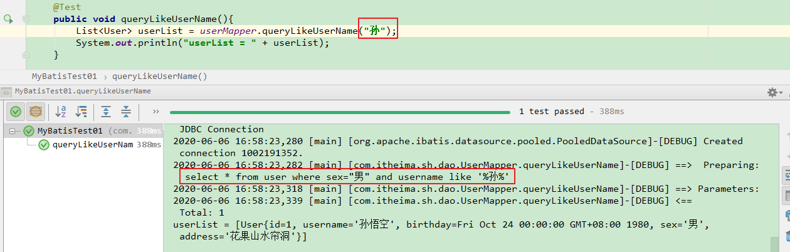
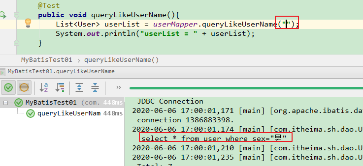
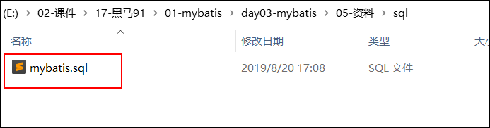
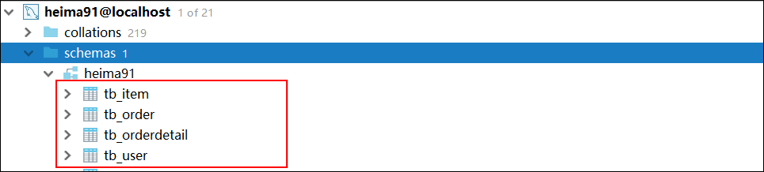
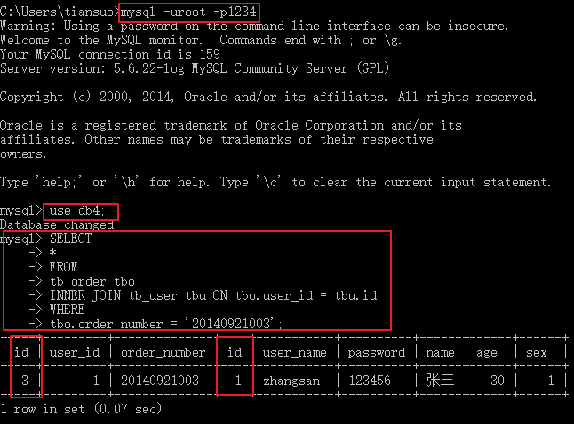
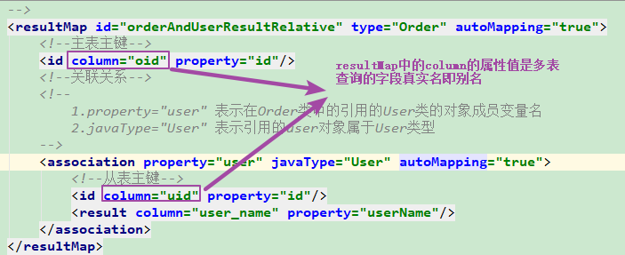
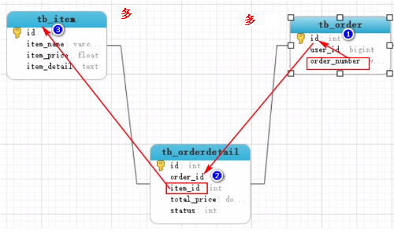
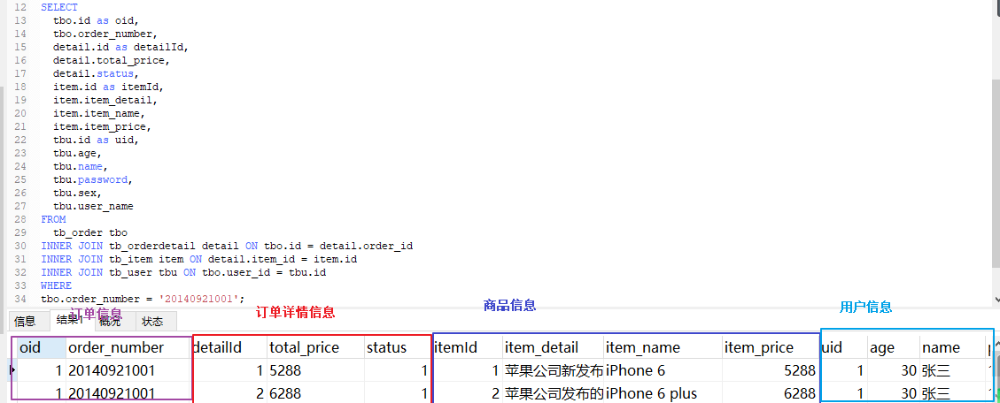
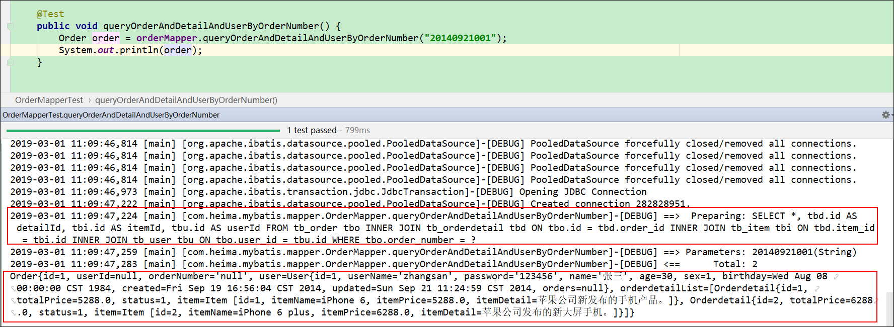
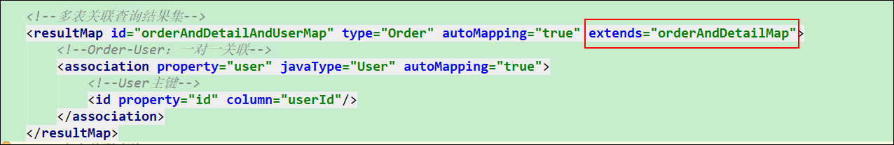

# day07-mybatis实现动态sql、多表查询和注解开发

## 学习目标

~~~html
1. 掌握sqlMapConfig.xml中常用标签
2. 掌握mybatis框架在DAO层的开发
3. 能够完成单表的CRUD操作
4. 掌握mybatis框架的输入输出映射
5. 掌握MyBatis动态SQL
~~~

## 回顾

~~~java
1、数据库： DataBase-数据存储
2、数据操作：CRUD-增删改查
	【1】使用MySQL默认的客户端：  输入sql脚本操作数据
	【2】JDBC：java代码操作数据库中的数据（sql脚本）

3、JDBC：
	【1】导入mysql驱动包： java程序==》数据库软件
	【2】编码：JDBC
			//1、注册驱动：Class.forName("com.mysql.jdbc.Driver");
			//2、获取连接：Connection conn = DriverManager.getConnection(url,user,password);
			//3、创建操作：
					String sql = "SELECT * FROM user WHERE id = ?";
					PreparedStatement stmt = conn.preparedStatement(sql);
					stmt.setInt(1,1);
			//4、执行sql语句：
					ResultSet rs = stmt.executeQuery();
			//5、处理结果集：
                  while(rs.next()){
					int id = 	rs.getInt("id");
					String username = rs.getString("username");
					//获取其他字段数据..........
					
					//封装数据： User user = new User();
					 user.setId(id);
					 user.setUsername(username);
                  }
			//6、释放资源：close()

4、持久层框架：对JDBC进行封装--mybatis
		1、导入mybatis相关jar包；
		2、提供配置文件；
		3、框架开发；

~~~


## 第一章、动态SQL

​        MyBatis 的强大特性之一便是它的动态 SQL。如果你有使用 JDBC 或其它类似框架的经验，你就能体会到根据不同条件拼接 SQL 语句的痛苦。例如拼接时要确保不能忘记添加必要的空格，还要注意去掉列表最后一个列名的逗号。利用动态 SQL 这一特性可以彻底摆脱这种痛苦。


例如，下面需求就会使用到拼接sql语句：

【需求】：查询**男性**用户，**如果输入了用户名，按用户名模糊查询**,如果**没有输入用户名，就查询所有男性用户**。

正常的sql语句：查询男性并且用户名中包含zhang


```sql
select * from tb_user where sex = "男" and user_name like '%zhang%'
```


```sql
select * from tb_user where  sex = "男"  
```

​	实现需求时还要判断用户是否输入用户名来做不同的查询要求，而这里似乎没有办法判断是否输入了用户名，因此可以考虑使用动态sql来完成这个功能。


​	动态 SQL 元素和后面学习的 JSTL 或基于之前学习的类似 XML 的文本处理器相似。在 MyBatis 之前的版本中，有很多元素需要花时间了解。MyBatis 3 开始精简了元素种类，现在只需学习原来一半的元素便可。MyBatis 采用功能强大的 OGNL 的表达式来淘汰其它大部分元素。

常见标签如下：

```tex
if：判断   if(1 gt 2){}
choose (when, otherwise)：分支判断    switch:多选一
trim (where, set)：去除
foreach：循环遍历标签
```

动态SQL中的业务逻辑判断需要使用到以下运算符： ognl表达式

```tex
1.   e1 or e2 满足一个即可
2.   e1 and e2 都得满足
3.    e1 == e2,e1 eq e2 判断是否相等
4.    e1 != e2,e1 neq e2 不相等
5.    e1 lt e2：小于   lt表示less than 
6.    e1 lte e2：小于等于，其他gt（大于）,gte（大于等于） gt 表示greater than
7.    e1 in e2 
8.    e1 not in e2
9.    e1 + e2,e1 * e2,e1/e2,e1 - e2,e1%e2
10.   !e,not e：非，求反
11.   e.method(args)调用对象方法
12.   e.property对象属性值
13.   e1[ e2 ]按索引取值，List,数组和Map
14.   @class@method(args)调用类的静态方法
15.   @class@field调用类的静态字段值
```


### 1、if标签

格式：

```xml
 <if test="判断条件">
   满足条件执行的代码
 </if>
说明：
 1）if标签：判断语句，用于进行逻辑判断的。如果判断条件为true，则执行if标签的文本内容
 2）test属性：用来编写表达式，支持ognl；
```

【需求】：查询**男性**用户，**如果输入了用户名，按用户名模糊查询**,如果**没有输入用户名，就查询所有男性用户**。

正常的sql语句：查询男性并且用户名中包含zhang


```sql
select * from tb_user where sex = "男" and user_name like '%zhang%'
```


```sql
select * from tb_user where  sex = "男"  
```

​	实现需求时还要判断用户是否输入用户名来做不同的查询要求，而这里似乎没有办法判断是否输入了用户名，因此可以考虑使用动态sql来完成这个功能。

​	上述动态sql语句部分： and user_name like '%zhang%' 

#### 1.1、定义接口方法

​	在UserMapper接口中，定义如下方法：

```java
   /**
     * 根据用户名模糊查询
     * @param userName
     * @return
     */
    List<User> queryLikeUserName(@Param("userName") String userName);
```


#### 1.2、编写SQL

​	在UserMapper.xml文件中编写与方法名同名的sql语句：

```xml
  <select id="queryLikeUserName" resultType="user">
       select * from user where sex='男'
       <if test="userName!=null and userName.trim()!=''">
           and username like '%${userName}%'
       </if>
   </select>
```

【注】`<if>` 判断中：

1、if标签：用来判断；

2、test属性：使用OGNL表达式，完成具体的判断业务逻辑；

**3、这里使用的字符串拼接，所以这里不能是#取值，只能使用$取值，否则会报错**


#### 1.3、测试

【userName有值】




对应的SQL语句是：select * from user where sex="男" and username like '%孙%' 

【userName没有值】




对应的SQL语句是：select * from user where sex="男" 

【小结】

```tex
1、if标签：用来在sql中处理判断是否成立的情况；
2、属性：test中书写OGNL表达式，如果结果为true，if标签的文本中的内容会被拼接到SQL中，反之不会被拼接到SQL中；
3、if标签的应用场景：适用于 二选一 
```


### 2、choose，when，otherwise

```tex
choose标签：分支选择（多选一，遇到成立的条件即停止）
	when子标签：编写条件，不管有多少个when条件，一旦其中一个条件成立，后面的when条件都不执行。
           test属性：编写ognl表达式
	otherwise子标签：当所有条件都不满足时，才会执行该条件。
```


 需求：

```tex
编写一个查询方法，设置两个参数，一个是用户名，一个是住址。

根据用户名或者住址查询所有男性用户:
	如果输入了用户名则按照用户名模糊查找，
	否则就按照住址查找，两个条件只能成立一个，
	如果都不输入就查找用户名为“孙悟空”的用户。
```

【需求分析】

1、查询所有男性用户,如果输入了用户名则按照用户名模糊查找;

```sql
SELECT * FROM  user WHERE  sex = "男" AND  username LIKE  '%孙%';
```

2、查询所有男性用户,如果输入了住址则按照住址查询；

```sql
SELECT * FROM  user WHERE  sex = "男" AND  address = "花果山水帘洞";
```

3、查询所有男性用户，如果都不输入就查找用户名为“孙悟空”的用户。

```sql
SELECT * FROM  user WHERE  sex = "男" AND username = '孙悟空';
```


#### 2.1、定义接口方法

在UserMapper接口中，定义接口方法：

```java
 /*
    查询用户名或者地址
  */
 List<User> queryByUserNameOrAddress(@Param("userName") String userName, @Param("address") String address);
```


#### 2.2、编写SQL

在UserMapper.xml中编写对应的SQL语句

```xml
<!--
        根据用户名或者住址查询所有男性用户:
            如果输入了用户名则按照用户名模糊查找，
            否则就按照住址查找，两个条件只能成立一个，
            如果都不输入就查找用户名为“孙悟空”的用户。
  -->
    <select id="queryByUserNameOrAddress" resultType="user">
        select * from user where sex='男'
        <choose>
            <when test="userName!=null and userName.trim()!=''">
                and username like '%${userName}%'
            </when>
            <when test="address!=null and address.trim()!=''">
                and address = #{address}
            </when>
            <otherwise>
                and username='孙悟空'
            </otherwise>
        </choose>
    </select>
```

#### 2.3、测试

编写测试类，对这个方法进行测试：

```java
@Test
public void queryByUserNameOrAddress(){
    List<User> userList = userMapper.queryByUserNameOrAddress("", null);
    System.out.println("userList = " + userList);
}
```

【小结】

```tex
1、choose，when，otherwise标签组合的作用类似于java中的switch语句，使用于多选一；
```


### 3、where

 where标签：拼接多条件查询时 1、能够添加where关键字； 2、能够去除多余的and或者or关键字

案例：按照如下条件查询所有用户，

```tex
如果输入了用户名按照用户名进行查询，
如果输入住址，按住址进行查询，
如果两者都输入，两个条件都要成立。
```

【需求分析】

1、如果输入了用户名按照用户名进行查询，

```sql
SELECT * FROM  user WHERE user_name = '孙悟空';
```

2、如果输入住址，按住址进行查询，

```sql
SELECT * FROM  user WHERE address='花果山水帘洞';
```

3、如果两者都输入，两个条件都要成立。

```sql
SELECT * FROM  user WHERE user_name = '孙悟空' AND address='花果山水帘洞';
```

#### 3.1、定义接口方法

在UserMapper接口中定义如下方法：

```java
List<User> queryByUserNameAndAge(@Param("userName") String userName, @Param("address") String address);
```


#### 3.2、编写SQL

在UserMapper.xml中编写SQL

```xml
 <!--
        如果输入了用户名按照用户名进行查询，
        如果输入住址，按住址进行查询，
        如果两者都输入，两个条件都要成立。

        说明：如果按照如下写sql语句会有问题，假设用户名username是空，那么用户名的sql语句不参与条件，此时
        sql语句就会变为：SELECT * FROM  user where AND address = #{address}
        where后面直接书写了and显然不满足sql语句语法，这里会报错
        我们可以使用where标签解决上述问题：
             where标签：拼接多条件查询时 1、能够添加where关键字； 2、能够去除多余的and或者or关键字
    -->
   <!-- <select id="queryByUserNameAndAge" resultType="user">
        SELECT * FROM  user where
            <if test="userName != null and userName.trim()!=''">
                username = #{userName}
            </if>
            <if test="address!=null and address.trim()!=''">
                AND address = #{address}
            </if>
    </select>-->
    <!-- SELECT * FROM user WHERE address = ?
        where子标签将and去掉了
    -->
    <select id="queryByUserNameAndAge" resultType="user">
        SELECT * FROM  user
        <where>
            <if test="userName != null and userName.trim()!=''">
                username = #{userName}
            </if>
            <if test="address!=null and address.trim()!=''">
                AND address = #{address}
            </if>
        </where>
    </select>
```

说明：

1.说明：如果按照如下写sql语句会有问题，假设用户名username是空，那么用户名的sql语句不参与条件，此时
        sql语句就会变为：SELECT * FROM  user where AND address = #{address}
        where后面直接书写了and显然不满足sql语句语法，这里会报错
        我们可以使用where标签解决上述问题：
             where标签：拼接多条件查询时 1、能够添加where关键字； 2、能够去除多余的and或者or关键字

2.SELECT * FROM user WHERE address = ?
       where子标签将and去掉了


#### 3.3、测试

```java
@Test
    public void queryByUserNameAndAge() {
        List<User> userList = userMapper.queryByUserNameAndAge("", "花果山水帘洞");
        System.out.println("userList = " + userList);
    }
```


只传入住址，此时where子标签去掉了and.

【小结】

```tex
1、<where>标签作用：用于拼接多选一或者同时成立的SQL情况；
2、<where>还会根据情况，动态的去掉SQL语句中的AND或者or；
```


### 4、set

set标签：在update语句中,可以自动添加一个set关键字，并且会将动态sql最后多余的逗号去除。

案例：修改用户信息，如果参数user中的某个属性为null，则不修改。

如果在正常编写更新语句时，如下：


 ~~~sql
update user SET username = ?, birthday=?, sex=?, where id = ? 
 ~~~

那么一旦在传递的参数中没有address，此时生成的sql语句就会因为多了一个逗号而报错。


#### 4.1、定义接口方法

在UserMapper接口中定义如下方法：

```java
void updateSelectiveUser(User user);
```


#### 4.2、编写SQL

在UserMapper.xml文件中编写如下SQL:

```xml
    <!--选择性地对user数据进行修改-->
   <update id="updateSelectiveUser">
        update user
        <set>
            <if test="username != null and username.trim()!=''">
                username = #{username},
            </if>
            <if test="birthday != null">
                birthday=#{birthday},
            </if>
            <if test="sex != null and sex.trim()!=''">
                sex=#{sex},
            </if>
            <if test="address != null and address.trim()!=''">
                address=#{address}
            </if>
        </set>
        where id = #{id}
    </update>
```


#### 4.3、测试

```java
 @Test
    public void updateSelectiveUser() {
        User user = new User();
        user.setUsername("锁哥1");
        user.setBirthday(new Date());
        user.setSex("男");
        user.setAddress("");

        user.setId(7);
        userMapper.updateSelectiveUser(user);
    }
```

【结果】

~~~sql
 update user SET username = ?, birthday=?, sex=? where id = ? 
~~~


【小结】

```tex
1、<set>标签替代了sql语句中的set关键字；
2、<set>标签还能把sql中多余的,去掉；
```


### 5、foreach

```xml
foreach标签：遍历集合或者数组
<foreach collection="集合名或者数组名" item="元素" separator="标签分隔符" open="以什么开始" close="以什么结束">
   #{元素}
</foreach>
	collection属性：接收的集合或者数组,集合名或者数组名
	item属性：集合或者数组参数中的每一个元素 
	separator属性：标签分隔符 
	open属性：以什么开始 
	close属性：以什么结束
```

需求：按照id值是1，2，3来查询用户数据；

#### 5.1、定义接口方法

在UserMapper接口中定义如下方法：

```java
List<User> queryByIds(@Param("arrIds") Integer[] arrIds);
```

**这里一定加@Param("arrIds")，否则报错**

#### 5.2、编写SQL

```xml
	<!--根据多个id值查询-->
    <select id="queryByIds" resultType="user">
        SELECT * FROM  user WHERE id IN
        <foreach collection="arrIds" item="ID" separator="," open="(" close=")">
            #{ID}
        </foreach>
    </select>
```

#### 5.3、测试

```java
    @Test
    public void queryByIds() {
        Integer[] arrIds = {1,2,3};
        List<User> userList = userMapper.queryByIds(arrIds);
        System.out.println("userList = " + userList);
    }
```


【小结】

```tex
<foreach>标签的作用：用于对查询参数进行遍历取值；
```


### 6、小结

```tex
If标签：条件判断
	test属性：编写ognl表达式

where标签：用于sql动态条件拼接，添加where关键字，可以将动态sql多余的第一个and或者or去除。

set标签: 用于更新语句的拼接，添加set关键字，并可以将动态sql中多余的逗号去除

foreach标签：用于遍历参数中的数组或者集合
	collection属性：参数中的数组或者集合
	item属性：表示数组或者集合中的某个元素
	separator属性：分隔符
	open:以什么开始
	close:以什么结束
```

## 第二章、特殊字符处理

​	我们在编写Mapper映射文件时，有时候需要使用到一些诸如：`>`,`<`之类的特殊字符。这些字符不能直接书写在xml文件中，需要我们对其处理。处理方式：使用转义字符代替特殊字符。其实这种方式不属于新技术点，我们早在学习xml的时候就已经进行讲解。我们这里只是复习下。

### 1、使用转义字符

使用xml中的字符实体

               

【示例】

 

修改如下即可:

 


## 第三章 mybatis高级查询【掌握】

### 1、准备工作

#### 【1】包结构

创建java项目，导入jar包和log4j日志配置文件以及连接数据库的配置文件；


#### 【2】导入SQL脚本

运行资料中的sql脚本：**mybatis.sql**

 



#### 【3】创建实体来包，导入资料中的pojo


#### 【4】UserMapper接口

~~~java
package com.itheima.sh.dao;
import com.itheima.sh.pojo.User;
public interface UserMapper {
    //完成根据id查询用户数据；
    User selectById(Long id);
}
~~~

#### 【5】UserMapper.xml

~~~xml
<?xml version="1.0" encoding="UTF-8" ?>
<!DOCTYPE mapper
        PUBLIC "-//mybatis.org//DTD Mapper 3.0//EN"
        "http://mybatis.org/dtd/mybatis-3-mapper.dtd">
<mapper namespace="com.heima.mybatis.mapper.UserMapper">

    <!--根据id查询:statement-->
    <select id="selectById"  resultType="User">
        SELECT *  FROM  tb_user WHERE  id=#{id}
    </select>

</mapper>
~~~

#### 【6】测试

~~~java
package com.itheima.sh.test;

import com.itheima.sh.dao.UserMapper;
import com.itheima.sh.pojo.User;
import org.apache.ibatis.io.Resources;
import org.apache.ibatis.session.SqlSession;
import org.apache.ibatis.session.SqlSessionFactory;
import org.apache.ibatis.session.SqlSessionFactoryBuilder;
import org.junit.BeforeClass;
import org.junit.Test;

import java.io.IOException;
import java.io.InputStream;

public class MybatisTest01 {
    private static UserMapper mapper = null;

    @BeforeClass
    public static void beforeClass() throws Exception {
        //1.构建SessionFactory
        String resouce = "mybatis-config.xml";
        InputStream is = Resources.getResourceAsStream(resouce);
        SqlSessionFactory build = new SqlSessionFactoryBuilder().build(is);
        //2.获取session
        SqlSession sqlSession = build.openSession(true);
        //3.获取接口对象
        mapper = sqlSession.getMapper(UserMapper.class);
    }

    @Test
    public void selectById() {
        User user = mapper.selectById(1L);
        System.out.println(user);
    }
}
~~~


### 2、表介绍和表关系说明

导入资料中mybatis.sql脚本。新建以下4张表

```html
tb_user：用户表
tb_order：订单表
tb_item：商品表
tb_orderdetail：订单详情表
```


【表关系】

```tex
1.tb_user和 tb_order表关系
	tb_user  《==》  tb_order：一对多， 一个人可以下多个订单
	tb_order 《==》 tb_user：一对一，一个订单只能属于一个人
	结论：tb_user和tb_order属于一对多的关系，需要将一方tb_user的主键作为多方tb_order的外键维护关系
2.tb_order 和 tb_item 表关系
	tb_order 《==》 tb_item ：一个订单可以有多个商品
	tb_item 《==》 tb_order：一个商品可以在多个订单上
	结论：tb_order和tb_item属于多对多的关系，需要创建中间表tb_orderdetail维护两个表的关系，并且将两张表	的主键作为中间表的外键
```


### 3、一对一查询

需求：通过订单编号20140921003查询出**订单信息**，并查询出**下单人信息**。

#### 【实现：关联查询】

【目标】使用多表关联查询，完成根据订单号查询订单信息和下单人信息（订单号：20140921003）

【分析】

一个订单编号对应一个订单，一个订单只能属于一个人。所以上述需求实现是一对一的实现。

【步骤】

```tex
1、首先，编写接口方法。编写SQL语句；
2、第二步：分析SQL，封装数据（关联对象）；
3、处理多表之间的数据封装（数据库字段名---》实体类的属性名之间的映射）
```

【实现】

##### 第一步：需求分析

​	编写多表关联查询SQL，根据订单号查询**订单信息**及**下单人**信息；

查询语句以及查询结果：


```sql
    #方式一：分步查询
	#第一步：根据order_number查询订单信息；
	SELECT * FROM tb_order WHERE order_number = '20140921003';
	#第二步：根据订单信息中的user_id查询出下单人的信息；
	SELECT * FROM tb_user WHERE id = 1;

  #方式二：多表关联查询，内连接
	SELECT * FROM tb_order tbo inner join tb_user tbu on tbo.user_id = tbu.id where 
  tbo.order_number='20140921003'
	#多表数据封装问题：
	#关联对象封装数据(在Order中引用User)
```

##### 第二步：添加关联

修改Order：

​	在Order类中，添加关联对象User，并添加getter和setter方法；

```java
package com.itheima.sh.pojo;
/**
 * 订单表
 * 
 */
public class Order {
    private Integer id;
    private String orderNumber;
    //关联User对象
    private User user;
    public Integer getId() {
        return id;
    }

    public void setId(Integer id) {
        this.id = id;
    }

    public String getOrderNumber() {
        return orderNumber;
    }
    public void setOrderNumber(String orderNumber) {
        this.orderNumber = orderNumber;
    }
    public User getUser() {
        return user;
    }
    public void setUser(User user) {
        this.user = user;
    }
    @Override
    public String toString() {
        return "Order{" +
                "id=" + id +
                ", orderNumber='" + orderNumber + '\'' +
                ", user=" + user +
                '}';
    }
}
```


##### 第三步：添加方法

编写OrderMapper接口

 

```java
public interface OrderMapper {
       /**
     * 根据订单号查询订单及下单人的信息：方式二
     * @param orderNumber
     * @return
     */
    Order queryOrderAndUserByOrderNumber2(@Param("orderNumber")String orderNumber);
}

```


##### 第四步：编写SQL

在OrderMapper.xml中编写对应的SQL，并将OrderMapper.xml加入到mybatis-config.xml全局配置中；


【OrderMapper.xml代码；】

说明：

~~~java
association：配置关联对象（User）的映射关系
 <association property="user" javaType="User" autoMapping="true">
           
  </association>
	属性：
		property：关联对象在主表实体类中的属性名；property="user" 表示在Order类中的引用的User类的对象		   成员变量名
		javaType：关联对象的类型；javaType="User" 表示引用的user对象属于User类型
~~~


~~~xml
<?xml version="1.0" encoding="UTF-8" ?>
<!DOCTYPE mapper
        PUBLIC "-//mybatis.org//DTD Mapper 3.0//EN"
        "http://mybatis.org/dtd/mybatis-3-mapper.dtd">
<!--
映射文件
namespace 指定接口的类全名
-->
<mapper namespace="com.itheima.sh.dao.OrderMapper">
    <!--
        1.autoMapping="true" 表示只需要给当前表的id然后自动映射当前表的其他列值到
        对应实体类的属性中，这属于偷懒行为，开发中我们最好都书写出来
        2.id标签表示id的映射关系
        3.result标签表示其他列和pojo类的属性映射关系
        4.一对一映射关系使用子标签association来表示引用的另一个pojo类的对象
    -->
    <resultMap id="orderAndUserResultRelative" type="Order" autoMapping="true">
        <!--主表主键-->
        <id column="id" property="id"/>
        <!--关联关系-->
        <!--
            1.property="user" 表示在Order类中的引用的User类的对象成员变量名
            2.javaType="User" 表示引用的user对象属于User类型
        -->
        <association property="user" javaType="User" autoMapping="true">
            <!--从表主键-->
            <id column="id" property="id"/>
            <!--<result column="user_name" property="userName"/>-->
        </association>
    </resultMap>

    <!--多表关联查询：一对一-->
    <select id="queryOrderAndUserByOrderNumber2" resultMap="orderAndUserResultRelative">
        SELECT
            *
        FROM
            tb_order tbo
            INNER JOIN tb_user tbu ON tbo.user_id = tbu.id
        WHERE
            tbo.order_number = #{orderNumber}
    </select>
</mapper>
~~~

说明：

~~~java
1、由于queryOrderAndUserByOrderNumber2查询的结果Order对象中需要封装User信息，所以返回值不能够再使用单纯的resultType来操作；

2、定义resultMap进行关联查询的配置，其中：
	属性：
		id：标识这个resultMap；
		type：返回的结果类型
    	autoMapping="true"： 表示只需要给当前表的id然后自动映射当前表的其他列值到对应实体类的属性中，这		  属于偷懒行为，开发中我们最好都书写出来
	子元素：
		id：主表主键映射
		result：主表普通字段的映射
		association:关联对象的映射配置
		
3、association：配置关联对象（User）的映射关系
	属性：
		property：关联对象在主表实体类中的属性名；property="user" 表示在Order类中的引用的User类的对象		   成员变量名
		javaType：关联对象的类型；javaType="User" 表示引用的user对象属于User类型
~~~

##### 第五步：测试

~~~java
package com.itheima.sh.test;

import com.itheima.sh.dao.OrderMapper;
import com.itheima.sh.dao.UserMapper;
import com.itheima.sh.pojo.Order;
import com.itheima.sh.pojo.User;
import org.apache.ibatis.io.Resources;
import org.apache.ibatis.session.SqlSession;
import org.apache.ibatis.session.SqlSessionFactory;
import org.apache.ibatis.session.SqlSessionFactoryBuilder;
import org.junit.BeforeClass;
import org.junit.Test;
import java.io.InputStream;
public class MybatisTest02 {
    private static OrderMapper mapper = null;
    @BeforeClass
    public static void beforeClass() throws Exception {
        //1.构建SessionFactory
        String resouce = "mybatis-config.xml";
        InputStream is = Resources.getResourceAsStream(resouce);
        SqlSessionFactory build = new SqlSessionFactoryBuilder().build(is);
        //2.获取session
        SqlSession sqlSession = build.openSession(true);
        //3.获取接口对象
        mapper = sqlSession.getMapper(OrderMapper.class);
    }
    @Test
    public void selectById() {
        Order order = mapper.queryOrderAndUserByOrderNumber2("20140921003");
        System.out.println("order = " + order);
    }
}
~~~

【测试结果】


##### 注意事项

通过上述测试结果，我们发现User的id是错误的，不是3，正确结果是1：


因为tb_user表的主键是id，tb_order的主键也是id。查询的结果中有两列相同的id字段。在将查询结果封装到实体类的过程中就会封装错误。

注意：user表查询的是id不是id1,由于SQLyog图形化界面显示的原因。可以在cmd窗口查看结果：




【解决方案】

```html
1、建议将所要查询的所有字段显示地写出来；
2、将多表关联查询结果中，相同的字段名取不同的别名；
```


resultMap中应该如下配置：



【正确结果】


##### 【小结】

```xml
一对一关联查询：
1、需要在Order实体类中关联User对象；最终将数据封装到Order中；
2、在OrderMapper.xml文件中书写关联语句并配置关系；
3、关联关系配置：
	    <resultMap id="orderAndUserResultRelative" type="Order" autoMapping="true">
            <!--主表主键-->
            <id column="oid" property="id"/>
            <!--关联关系-->
            <association property="user" javaType="User" autoMapping="true">
                <!--从表主键-->
                <id column="uid" property="id"/>
            </association>
        </resultMap>
```


### 4、一对多查询

【目标】查询id为1的用户及其订单信息

【分析】

​	一个用户可以有多个订单。

​	一个订单只能属于一个用户。

用户(1)-----订单(n)

【步骤】

```tex
第一步：查询SQL分析；
第二步：添加关联关系；
第三步：编写接口方法；
第四步：编写映射文件；
第五步：测试
```

【实现】

##### 第一步：需求分析

编写SQL实现**查询id为1的用户及其订单信息**

查询语句及查询结果：


```sql
#查询id为1的用户及其订单信息
select * from tb_user where id=1;
select * from tb_order where user_id=1;

#一对多 内连接查询
select * from tb_user tbu inner join tb_order tbo on tbu.id = tbo.user_id where tbu.id=1;
# 封装数据：关联对象，一个用户关联多个订单  User(List<Order> orderList)
```

说明：一个用户关联多个订单  User(List<Order> orderList) ，在User类中定义一个List集合存储多个订单Order对象。


##### 第二步：添加映射关系

​	因为一个用户可以拥有多个订单，所以**用户**和**订单**是**一对多**的关系；需要在User类中添加一个`List<Order>` 属性；

```java
package com.itheima.sh.pojo;

import java.io.Serializable;
import java.util.List;

public class User implements Serializable {

    private Long id;

    // 用户名
    private String userName;

    // 密码
    private String password;

    // 姓名
    private String name;

    // 年龄
    private Integer age;
	//0 女性 1 男性
    private Integer sex;

    //订单
    List<Order> orders;

    public Long getId() {
        return id;
    }

    public void setId(Long id) {
        this.id = id;
    }

    public String getUserName() {
        return userName;
    }

    public void setUserName(String userName) {
        this.userName = userName;
    }

    public String getPassword() {
        return password;
    }

    public void setPassword(String password) {
        this.password = password;
    }

    public String getName() {
        return name;
    }

    public void setName(String name) {
        this.name = name;
    }

    public Integer getAge() {
        return age;
    }

    public void setAge(Integer age) {
        this.age = age;
    }

    public Integer getSex() {
        return sex;
    }

    public void setSex(Integer sex) {
        this.sex = sex;
    }

    public List<Order> getOrders() {
        return orders;
    }

    public void setOrders(List<Order> orders) {
        this.orders = orders;
    }

    @Override
    public String toString() {
        return "User{" +
                "id=" + id +
                ", userName='" + userName + '\'' +
                ", password='" + password + '\'' +
                ", name='" + name + '\'' +
                ", age=" + age +
                ", sex=" + sex +
                ", orders=" + orders +
                '}';
    }
}

```


##### 第三步：编写接口方法

在**UserMapper接口**中，添加关联查询；

```java
  /**
     * 根据用户id查询用户及其订单信息
     * @param id
     * @return
     */
    User oneToManyQuery(@Param("id") Long id);
```


##### 第四步：编写SQL

​	在**UserMapper.xml**文件中编写SQL语句完成一对多的关联查询；

说明：

~~~xml
1.一对多使用collection子标签进行关联多方Order
  <collection property="类中引用多方的成员变量名" javaType="存放多方容器的类型" ofType="多方类型" autoMapping="true">
  </collection>
2.属性：
    1）property="orders" 这里的orders表示User类的成员变量orders
    2）javaType="List" 表示User类的成员变量orders存储的Order对象使用的类型，这里是List
    3) ofType="Order" 表示List集合中存储数据的类型 Order
3.一定要记住这里给user表的id起别名是uid,order表的id起别名是oid.在resultMap标签的id子标签中的column属性值书写对应的uid和oid.
~~~


```xml
    <!--自定义结果集-->
    <resultMap id="oneToManyResult" type="User" autoMapping="true">
        <!--User的主键-->
        <id column="uid" property="id"/>
        <!--Order关联映射-->
        <!--
            1.一对多使用collection子标签进行关联多方Order
            2.属性：
                1）property="orders" 这里的orders表示User类的成员变量orders
                2）javaType="List" 表示User类的成员变量orders存储的Order对象使用的类型，这里是List
                3) ofType="Order" 表示List集合中存储数据的类型 Order
        -->

        <collection property="orders" javaType="List" ofType="Order" autoMapping="true">
            <!--Order的主键-->
            <id column="oid" property="id" />
        </collection>
    </resultMap>

    <!--根据用户ID查询用户及其订单数据-->
    <select id="oneToManyQuery" resultMap="oneToManyResult">
        SELECT
            tbo.id as oid,
            tbo.order_number,
            tbu.id as uid,
            tbu.user_name,
            tbu.password,
            tbu.name,
            tbu.age,
            tbu.sex
        FROM
            tb_user tbu
            INNER JOIN tb_order tbo ON tbu.id = tbo.user_id
        WHERE
            tbu.id = #{id}
    </select>
```

##### 第五步：测试

在用户的测试类中

```java
public class MybatisTest01 {
    private static UserMapper mapper = null;

    @BeforeClass
    public static void beforeClass() throws Exception {
        //1.构建SessionFactory
        String resouce = "mybatis-config.xml";
        InputStream is = Resources.getResourceAsStream(resouce);
        SqlSessionFactory build = new SqlSessionFactoryBuilder().build(is);
        //2.获取session
        SqlSession sqlSession = build.openSession(true);
        //3.获取接口对象
        mapper = sqlSession.getMapper(UserMapper.class);
    }  
	//根据用户ID查询用户及其订单数据
    @Test
    public void oneToManyQuery() {
        User user = mapper.oneToManyQuery(1L);
        System.out.println("user = " + user);
    }
}
```


##### 【小结】

```tex
一对多关系配置：
1、在对象中添加映射关系；
2、编写接口方法，编写SQL；
3、编写resultMap处理数据库字段和实体类之间数据的封装；
```


### 5、多对多

【需求】：查询订单号为20140921001的订单的详情信息即查询订单信息+订单中的商品信息；

**【步骤】**

```tex
第一步：需求分析；
第二步：添加关联关系；
第三步：编写SQL；
第四步：配置关联关系；
第五步：运行；
```

##### 第一步：【需求分析】



~~~
1、查询订单详情信息即：查询订单信息+订单中的商品信息；
2、订单信息在tb_order中，订单中的商品信息在tb_item中，这两个表是通过中间表 tb_orderdetail进行关联的。
3、关联查询思路：先查询订单表，通过订单表中的id关联中间表order_id,然后查询中间表，根据中间表的item_id关联商品表的id,最后查询商品表；
~~~

【SQL查询及结果】


```sql
# 【需求】：查询订单号为20140921001的订单的详情信息 订单的详情信息 = 订单+商品
SELECT
	*
FROM
	tb_order tbo
INNER JOIN tb_orderdetail detail ON tbo.id = detail.order_id
INNER JOIN tb_item item ON detail.item_id = item.id
WHERE
tbo.order_number = '20140921001';
```


##### 第二步：添加关联关系

**【修改Order】**

​	一个订单表中关联了多个订单详情信息，所以在订单表中添加`List<Orderdetail>`属性：

【Order.java】

```java
package com.itheima.sh.pojo;
import java.util.List;
/**
 * 订单表
 * 
 */
public class Order {
    private Integer id;
    private String orderNumber;
    //关联User对象
    private User user;
    //关联订单详情列表
    private List<Orderdetail> detailList;
    public Integer getId() {
        return id;
    }

    public void setId(Integer id) {
        this.id = id;
    }

    public String getOrderNumber() {
        return orderNumber;
    }

    public void setOrderNumber(String orderNumber) {
        this.orderNumber = orderNumber;
    }

    public User getUser() {
        return user;
    }

    public void setUser(User user) {
        this.user = user;
    }

    public List<Orderdetail> getDetailList() {
        return detailList;
    }

    public void setDetailList(List<Orderdetail> detailList) {
        this.detailList = detailList;
    }

    @Override
    public String toString() {
        return "Order{" +
                "id=" + id +
                ", orderNumber='" + orderNumber + '\'' +
                ", user=" + user +
                ", detailList=" + detailList +
                '}';
    }
}
```


**【修改Orderdetail】**

​	每一条订单详情记录中都包含了一条商品信息，所以需要在Orderdetail中添加一个Item属性；

【Orderdetail.java】

```java
package com.itheima.sh.pojo;
public class Orderdetail {   
    private Integer id;  
    private Double totalPrice;  
    private Integer status;
    //商品信息
    private Item item;
    public Integer getId() {
        return id;
    }
    public void setId(Integer id) {
        this.id = id;
    }

    public Double getTotalPrice() {
        return totalPrice;
    }

    public void setTotalPrice(Double totalPrice) {
        this.totalPrice = totalPrice;
    }

    public Integer getStatus() {
        return status;
    }

    public void setStatus(Integer status) {
        this.status = status;
    }

    public Item getItem() {
        return item;
    }

    public void setItem(Item item) {
        this.item = item;
    }
    @Override
    public String toString() {
        return "Orderdetail{" +
                "id=" + id +
                ", totalPrice=" + totalPrice +
                ", status=" + status +
                ", item=" + item +
                '}';
    }
}
```


##### 第三步：编写接口方法

​	在OrderMapper接口中新增，根据orderNumber查询订单及订单详情的方法：

```java
public interface OrderMapper {
    /**
     * 根据orderNumber查询订单及其详情信息
     * @param orderNumber
     * @return
     */
    Order queryOrderAndDetailByOrderNumber(@Param("orderNumber") String orderNumber);
}
```


##### 第四步：编写SQL

说明：一定要记住这里给order表的id起别名是oid,订单详情表的id起别名是detailId，商品表item的id起别名是itemId。在resultMap标签的id子标签中的column属性值书写对应的oid、detailId和itemId.

```xml
 <!--订单及订单详情结果集-->
    <resultMap id="orderAndDetailMap" type="Order" autoMapping="true">
        <!--tb_order表 和 Order实体类-->
        <!--订单表主键-->
        <id property="id" column="oid"/>
        <!--多个订单详情 1对多：detailList-->
        <collection property="detailList" javaType="List" ofType="Orderdetail" autoMapping="true">
            <!--tb_order_detail表  和 Orderdetail实体类-->
            <!--订单详情主键  detailId表示下面sql语句的别名-->
            <id property="id" column="detailId"/>

            <!--关联商品对象  一对一：orderdetail-Item-->
            <association property="item" javaType="Item" autoMapping="true">
                <!--tb_item表 和 Item实体类  itemId 表示下面的sql语句别名-->
                <id property="id" column="itemId"/>
            </association>
        </collection>
    </resultMap>

    <!--多对多查询-->
    <select id="queryOrderAndDetailByOrderNumber" resultMap="orderAndDetailMap">
        SELECT
            tbo.id as oid,
            tbo.order_number,
            detail.id as detailId,
            detail.total_price,
            detail.status,
            item.id as itemId,
            item.item_detail,
            item.item_name,
            item.item_price
        FROM
            tb_order tbo
            INNER JOIN tb_orderdetail detail ON tbo.id = detail.order_id
            INNER JOIN tb_item item ON detail.item_id = item.id
        WHERE
            tbo.order_number = #{orderNumber};
    </select>
```


##### 第五步：测试

~~~java
    @Test
    public void queryOrderAndDetailByOrderNumber() {
        Order order = mapper.queryOrderAndDetailByOrderNumber("20140921001");
        System.out.println("order = " + order);
    }
~~~


【结果】


#### 【扩展】

【需求】根据订单号（20140921001）

​		**查询订单信息**

​		**查询订单所属用户信息**

​		**查询订单中的详细商品信息**


【SQL实现及查询结果】

​	通过分析，实现这个查询就在上面的查询基础上再关联一个一对一的User信息；




```sql
#查询订单详情
SELECT
	tbo.id as oid,
	tbo.order_number,
	detail.id as detailId,
	detail.total_price,
	detail.status,
	item.id as itemId,
	item.item_detail,
	item.item_name,
	item.item_price,
	tbu.id as uid,
	tbu.age,
	tbu.name,
	tbu.password,
	tbu.sex,
	tbu.user_name
FROM
	tb_order tbo
INNER JOIN tb_orderdetail detail ON tbo.id = detail.order_id
INNER JOIN tb_item item ON detail.item_id = item.id
INNER JOIN tb_user tbu ON tbo.user_id = tbu.id
WHERE
tbo.order_number = '20140921001';
```

【添加关联关系】

都已经在实体类添加完毕，直接操作即可

##### 【编写接口方法】

在OrderMapper接口中再扩展一个方法：queryOrderAndDetailAndUserByOrderNumber

```java
    /**
     * 根据orderNumber查询 订单，详情，商品及用户数据
     * @param orderNumber
     * @return
     */
    Order queryOrderAndDetailAndUserByOrderNumber(@Param("orderNumber") String orderNumber);
```

##### 【编写SQL】

```xml
 <!--订单及订单详情结果集-->
    <resultMap id="orderAndDetailMapPlus" type="Order" autoMapping="true">
        <!--tb_order表 和 Order实体类-->
        <!--订单表主键-->
        <id property="id" column="oid"/>
        <!--Order-User：一对一关联-->
        <association property="user" javaType="User" autoMapping="true">
            <!--User主键-->
            <id property="id" column="uid"/>
        </association>
        <!--多个订单详情 1对多：detailList-->
        <collection property="detailList" javaType="List" ofType="Orderdetail" autoMapping="true">
            <!--tb_order_detail表  和 Orderdetail实体类-->
            <!--订单详情主键-->
            <id property="id" column="detailId"/>

            <!--关联商品对象  一对一：orderdetail-Item-->
            <association property="item" javaType="Item" autoMapping="true">
                <!--tb_item表 和 Item实体类-->
                <id property="id" column="itemId"/>
            </association>
        </collection>
    </resultMap>
    <select id="queryOrderAndDetailAndUserByOrderNumber" resultMap="orderAndDetailMapPlus">
        SELECT
            tbo.id as oid,
            tbo.order_number,
            detail.id as detailId,
            detail.total_price,
            detail.status,
            item.id as itemId,
            item.item_detail,
            item.item_name,
            item.item_price,
            tbu.id as uid,
            tbu.age,
            tbu.name,
            tbu.password,
            tbu.sex,
            tbu.user_name
        FROM
            tb_order tbo
            INNER JOIN tb_orderdetail detail ON tbo.id = detail.order_id
            INNER JOIN tb_item item ON detail.item_id = item.id
            INNER JOIN tb_user tbu ON tbo.user_id = tbu.id
        WHERE
            tbo.order_number = #{orderNumber};
    </select>
```


##### 【测试】



【结果】


### 6、ResultMap继承

​	如果两个结果集有重叠的部分，如下图所示。我们可以使用结果集继承来实现重叠的结果集的复用。


`orderAndDetailAndUserMap`结果集可以继承`orderAndDetailMap`结果集。




### 7、高级查询小结

```tex
resutlType无法帮助我们自动的去完成映射，所以只有使用resultMap手动的进行映射
resultMap: 
	属性：
        type 结果集对应的数据类型  Order
        id 唯一标识，被引用的时候，进行指定
        autoMapping 开启自动映射
        extends 继承
	子标签：
	 id:配置id属性
	 result:配置其他属性
      association：配置一对一的映射
          property 定义对象的属性名
          javaType 属性的类型
          autoMapping 开启自动映射
      collection：配置一对多的映射
          property 定义对象的属性名
          javaType 集合的类型
          ofType 集合中的元素类型 泛型
  		  autoMapping 开启自动映射
```


## 第四章 mybatis延迟加载【了解】

### 1、延迟加载概述

1. 应用场景

   ​	如果查询订单并且关联查询用户信息。如果先查询订单信息即可满足要求，当我们需要查询用户信息时再查询用户信息。把对用户信息的按需去查询就是延迟加载。

2. 延迟加载的好处

   ​	先从单表查询、需要时再从关联表去关联查询，大大提高 数据库性能，因为查询单表要比关联查询多张表速度要快。

3. 延迟加载的条件：

   1）resultMap可以实现高级映射（使用association、collection实现一对一及一对多映射），association、collection具备延迟加载功能。

   2）**延迟加载是针对分步查询而言的**

### 2、开启延迟加载

**Mybatis的延迟加载功能默认是关闭的**

```tex
需要在mybatis-config.xml全局配置文件中通过setting标签配置来开启延迟加载功能
```

**需要在mybatis-config.xml全局配置文件中通过setting标签配置来开启延迟加载功能开启延迟加载的属性：**

```tex
lazyLoadingEnabled：全局性设置懒加载。默认为false，true表示开启延迟加载
aggressiveLazyLoading：false表示关闭积极加载
说明：这两个属性必须一起设置
```

【示例】

```xml
<settings>
     <!--开启延迟加载-->
     <setting name="lazyLoadingEnabled" value="true"/>
     <!--关闭积极加载-->
     <setting name="aggressiveLazyLoading" value="false"/>
 </settings>
```


### 3、延迟加载测试

延迟加载需求：通过订单编号20140921003查询order并延迟加载user。就是演示上述演示过的一对一的表关系案例。

如果通过订单编号查询order并且查询user信息，在正常情况下的查询语句应该是：


#### 分析：

如果改成延迟加载，也就意味着，先查询order,等需要的时候再去查询user,那就相当于将上面的一条语句变成了两条语句：

1、通过订单编号查询order


2、通过查询出来的order中的user_id查询user


sql语句：

~~~sql
分步查询:
	#第一步：根据order_number查询订单信息；
	SELECT * FROM tb_order WHERE order_number = '20140921003';
	#第二步：根据订单信息中的user_id查询出下单人的信息；
	SELECT * FROM tb_user WHERE id = 1;
~~~


#### 第一步：编写接口方法

在OrderMapper接口中新建：queryOrderUserLazy方法

```java
    /**
     * 根据orderNumber懒加载查询订单及用户信息
     * @param orderNumber
     * @return
     */
    Order queryOrderUserLazy(@Param("orderNumber") String orderNumber);
```


#### 第二步：编写SQL

【OrderMapper.xml】

~~~xml
 <!--懒加载结果集-->
    <resultMap id="orderUserLazyResultMap" type="Order">
        <id property="id" column="id"/>
        <!--
             1.column属性：延迟加载的sql语句中所需的参数,就是SELECT * FROM tb_user WHERE id = ?;
             该sql语句的?位置。这里书写 user_id因为执行  SELECT * FROM tb_order WHERE order_number = #{orderNumber} 语句查询的用户id对应的列名就是user_id

             2.select属性：调用指定sql语句来执行延迟加载，就是指定sql语句所在的位置，根据用户id查询用户信息位于UserMapper.xml文件中,具体地址是：namespace.id
             3.执行流程：
                先执行SELECT * FROM tb_order WHERE order_number = #{orderNumber} 根据订单号获取订单信息(包括用户id)
                然后根据 select="com.itheima.sh.dao.UserMapper.selectById" 找到UserMapper.xml文件中的：
                    <select id="selectById" resultType="User">
                        select * from tb_user where id = #{id}
                    </select>
              并将column="user_id" 对应的列值传递过去
              并将查询的结果封装到User对象中，最后将User对象封装到Order对象中
          -->
        <association property="user" javaType="User" column="user_id"  select="com.itheima.sh.dao.UserMapper.selectById"></association>
    </resultMap>
    <select id="queryOrderUserLazy" resultMap="orderUserLazyResultMap">
        SELECT * FROM tb_order WHERE order_number = #{orderNumber}
    </select>
~~~

【UserMapper.xml】

~~~xml
<mapper namespace="com.itheima.sh.dao.UserMapper">
    <!--
    查询语句
    id: 接口中方法的名字
    resultType：返回的实体类的类型，类全名
    -->
    <select id="selectById" resultType="User">
        select * from tb_user where id = #{id}
    </select>
    
</mapper>
~~~

说明：


     1.column属性：延迟加载的sql语句中所需的参数,就是SELECT * FROM tb_user WHERE id = ?;
       该sql语句的?位置。这里书写 user_id因为执行  SELECT * FROM tb_order WHERE order_number = #{orderNumber} 语句查询的用户id对应的列名就是user_id
     2.select属性：调用指定sql语句来执行延迟加载，就是指定sql语句所在的位置，根据用户id查询用户信息位于
     UserMapper.xml文件中,具体地址是：namespace.id
     3.执行流程：
       先执行SELECT * FROM tb_order WHERE order_number = #{orderNumber} 根据订单号获取订单信息(包括用户id)
       然后根据 select="com.itheima.sh.dao.UserMapper.selectById" 找到UserMapper.xml文件中的：
       <select id="selectById" resultType="User">
      	 select * from tb_user where id = #{id}
       </select>
      并将column="user_id" 对应的列值传递过去
     并将查询的结果封装到User对象中，最后将User对象封装到Order对象中

【注意】

1. 懒加载首先是把SQL拆分；
2. 然后在resultMap中，通过关联映射配置中的，select属性引入需要懒加载进来的对象；

#### 第三步：开启懒加载

在mybatis-config.xml全局配置文件中，开启懒加载


```xml
    <!--settings属性配置-->
    <settings>
        <!--开启延迟加载-->
        <setting name="lazyLoadingEnabled" value="true"/>
        <!--关闭积极加载-->
        <setting name="aggressiveLazyLoading" value="false"/>
    </settings>
```


#### 第四步：测试

【没有访问关联对象】

在没有访问关联对象的属性时，只发送了一条SQL。


【访问关联对象的属性】


访问关联对象属性时，发送了两条SQL语句。按需查询-----懒加载！


## 第五章 mybatis注解开发【掌握】

### 1、概述

​	上述我们已经学习mybatis的**SQL映射文件**可以使用**xml的方式配置**，但是我们发现不同的用户模块接口都对应一个映射文件，并且在映射文件中书写sql语句也比较麻烦。所以Mybatis为用户提供了快速的开发方式，因为有时候大量的XML配置文件的编写时非常繁琐的，因此Mybatis也提供了更加简便的基于注解(Annnotation)的配置方式。

​	**注解配置的方式在很多情况下能够取代mybatis的映射文件，提高开发效率。**

### 2、注解实现CRUD

**说明：在演示注解开发之前，为了避免和之前的映射文件混淆，所以可以将之前书写的代码放到一个新的工程中，删除映射文件即可。**

#### 2.0、CRUD相关注解

【注解】

```tex
@Insert：保存  
         Value：sql语句（和xml的配置方式一模一样）
         
@Update：更新 
         Value：sql语句
         
@Delete: 删除
         Value：sql语句
         
@Select: 查询
         Value：sql语句
         
@Options：可选配置（获取主键）
         userGeneratedKeys：开关,值为true表示可以获取主键  相当于select last_insert_id()
         keyProperty     ：对象属性
         keyColumn       : 列名
```

【使用方式】

【第一步】将mybatis全局配置文件mybatis-config.xml中的mapper路径改为包扫描或者class路径；

说明：因为没有了映射文件，所以我们这里采用加载接口方式，需要告知mybatis哪个接口的方法上的注解需要被执行。


【第二步】编写接口和注解；

【第三步】测试


#### 2.1、新增

目标：使用注解`@Insert`的方式新增数据

步骤：

```tex
第一步：UserMapper接口中新增用户方法上面编写注解；
第二步：测试
```

实现：

**第一步**：在UserMapper接口中的saveUser()方法上面添加`@Insert`注解，并设置该注解的value属性值为具体的SQL语句；

```java
public interface UserMapper {
    //1、新增数据  #{userName} 这里的userName是方法saveUser(User user)参数User类的成员变量
    @Insert("INSERT INTO tb_user VALUES(NULL,#{userName},#{password},#{name},#{age},#{sex})")
    void saveUser(User user);
}
```


**第二步**：测试

在UserMapperTest类下面对save方法进行测试：

~~~java
public class MybatisTest01 {
    private static UserMapper userMapper;
    @BeforeClass
    public static void berofeClass() throws Exception {
        //1、从xml中构建SqlSessionFactory
        String resource = "mybatis-config.xml";
        InputStream inputStream = Resources.getResourceAsStream(resource);
        //这里指定了环境为test
//        SqlSessionFactory sqlSessionFactory = new SqlSessionFactoryBuilder().build(inputStream,"test");
        //build不方法不指定环境就使用默认的 <environments default="development">
        SqlSessionFactory sqlSessionFactory = new SqlSessionFactoryBuilder().build(inputStream);

        //2、获取SqlSession
        SqlSession sqlSession = sqlSessionFactory.openSession(true);

        //3、获取UserMapper接口的动态代理对象
        userMapper = sqlSession.getMapper(UserMapper.class);
    }

    @Test
    public void saveUser(){
        User user = new User();
        user.setUserName("锁哥");
        user.setAge(18);
        user.setName("黑旋风");
        user.setPassword("1234");
        user.setSex(1);
        userMapper.saveUser(user);
    }
}
~~~

小结：

新增数据的注解为：`@Insert` ，作用等同于映射文件中的`<insert>`具体使用时，需要给其value属性设置具体的SQL。


#### 2.2、删除

目标：使用注解`@Delete`删除id值为1的数据

步骤：

```tex
第一步：在根据id删除数据的方法上面编写注解@Delete;
第二步：测试
```

实现：

第一步：在UserMapper接口中的deleteUserById方法上编写`@Delete`，并设置其value属性值为具体的删除SQL；

~~~java
    /*
        2.根据id删除用户
     */
    @Delete("delete from user where id=#{id}")
    void deleteUserById(Long id);
~~~


第二步：测试

~~~java
    @Test
    public void deleteUserById(){
        userMapper.deleteUserById(1L);
    }
~~~

小结：

删除数据的注解：`@Delete`，作用等同于映射文件中的`<delete>`,具体使用时，需要设置其value属性值为具体的删除SQL；

#### 2.3、修改

目标：修改id为1的用户的数据

步骤：

```tex
第一步：在根据id修改用户数据方法上面添加注解@Update，然后在其value属性值中编写具体的SQL；
第二步：测试
```

实现：

第一步：在UserMapper接口的updateUser方法上添加注解：`@Update`，然后将其value属性值设置成update的SQL；

```java
  /**
     * 3.修改用户数据
     * @param user
     */
    @Update("UPDATE tb_user SET user_name=#{userName}, password=#{password} ,name=#{name} ,age=#{age},sex=#{sex} where id=#{id}")
    void updateUser(User user);
```


第二步：测试

~~~java
    @Test
    public void updateUser(){
        User user = new User();
        user.setId(1L);
        user.setUserName("柳岩");
        user.setSex(0);
        user.setPassword("3456");
        user.setName("岩岩");
        user.setAge(20);
        userMapper.updateUser(user);
    }
~~~


小结：修改数据的注解：`@Update`，作用等同于映射文件中的`<update>`。 

#### 2.4、查询

目标：使用注解查询所有的用户数据

步骤：

```tex
第一步：在接口中查询所有的用户数据的方法上面添加注解：@Select，然后设置其value属性值为具体的SQL查询语句；
第二步：测试
```

实现：

第一步：在UserMapper接口的queryAllUsers方法上添加注解：`@Select`，然后设置其value属性值为具体的查询SQL；

```java
  /*
     * 4.查询所有用户数据
     */
    @Select("SELECT * FROM tb_user")
    List<User> queryAllUsers();
```


第二步：测试

~~~java
    @Test
    public void queryAllUsers(){
        List<User> list = userMapper.queryAllUsers();
        System.out.println("list = " + list);
    }
~~~

小结：

查询数据注解：`@Select` ，作用等同于映射文件中的`<select>`标签。

### 3、返回新增数据的id(自增主键回填)了解

问题：上面注解实现CRUD的测试中，数据新增成功，但是id值没有正常返回.


目标：使用注解完成数据新增，新增成功后返回数据的主键id值

步骤：

```tex
1、在新增数据注解 @Insert下面，添加@Options；
2、在Options注解中，设置useGeneratedKeys值为true，keyProperty为id，keyColumn id；
```

实现：

第一步：在新增数据注解 @Insert下面，添加@Options，设置useGeneratedKeys值为true，keyProperty为id,keyColumn 为id；

```java
    //1、新增数据  #{userName} 这里的userName是方法saveUser(User user)参数User类的成员变量
    @Insert("INSERT INTO tb_user VALUES(NULL,#{userName},#{password},#{name},#{age},#{sex})")
    @Options(useGeneratedKeys = true,keyColumn = "id",keyProperty = "id")
    void saveUser(User user);
```


第二步：测试：


小结：注解`@Options`：


### 4、注解实现别名映射

根据之前的学习，如果数据表的列名和pojo实体类的属性名不一致，会导致数据表的数据无法封装到实体类属性值中，对此我们又如下解决方案：

【1】查询的时候给列起别名，别名和实体类的属性名一致

~~~sql
select user_name as userName from tb_user where id =1;
~~~

【2】在mybatis的核心配置文件中按照如下配置：

~~~xml
<settings>
    <!--开启驼峰自动映射-->
    <setting name="mapUnderscoreToCamelCase" value="true"/>
</settings>
~~~

【3】在映射文件中，我们可以通过在ResultMap中，通过result标签中，给指定的column映射到实体类中指定的属性上。

~~~xml
 <resultMap id="orderAndUserResultRelative" type="Order">
     <result column="user_name" property="userName"/>
 </resultMap>
~~~

而在注解中也有相应的解决方案：这里就必须使用注解：`@Results`

`@Results`注解相当于之前映射文件中的ResultMap，该注解如下：

~~~java
public @interface Results {
    Result[] value() default {};
}
~~~

我们发现value属于Result数组类型，而Result属于一个注解，注解的属性如下：

~~~java
public @interface Result {
    //对应数据表的列
    String column() default "";
	//对应pojo类的属性
    String property() default "";
	//javaType：返回的对象类型
    Class<?> javaType() default void.class;
	//one： 一对一配置
    One one() default @One;
	//many： 一对多配置
    Many many() default @Many;
}
~~~


目标：使用注解的方式给取别名后的字段，映射到实体类中

步骤：

~~~xml
第一步：将之前核心配置文件中的开启驼峰自动映射设置为false
 <settings>
        <!--开启驼峰自动映射-->
        <setting name="mapUnderscoreToCamelCase" value="false"/>
 </settings>
第二步：在接口中查询的方法上面添加注解@Results；
第三步：测试；
~~~

实现：

第一步：将之前核心配置文件中的开启驼峰自动映射设置为false。这样才可以演示出@Results的效果。

~~~xml
 <settings>
        <!--开启驼峰自动映射-->
        <setting name="mapUnderscoreToCamelCase" value="false"/>
 </settings>
~~~

第二步：在接口中查询方法上面添加注解：`@Results` ，然后通过`@Result`完成字段的别名和实体类的属性名之间的映射配置；

说明：这里我们使用之前的查询所用用户方法即可，也可以在接口中在定义一个根据id查询用户的方法。

```java
	/*
        根据id查询用户
     */
    @Select("SELECT * FROM tb_user WHERE id = #{id}")
    @Results(value={
            @Result(column = "user_name",property = "userName")
    })
    User selectById(@Param("id") Long id);
```

第三步：测试

~~~java
   @Test
    public void selectById(){
        User user = userMapper.selectById(1L);
        System.out.println("user = " + user);
    }
~~~

【结果】


小结：给别名映射到实体类中可以通过添加注解：`@Results` 中的 `@Result`实现；


##  总结

~~~html
一、全局配置：能够影响mybatis的运行
	【1】能够配置的参数：
			properties:
			settings:
			typeAliases:
			mappers:
	【2】properties：属性
		作用：设置参数 ，加载外部的资源文件中的参数
		用法：
			1、设置参数：
				<properties>
					<property name="driver" value="com.mysql.jdbc.Driver"></property>
				</properties>
			   取参数： ${driver}
			2、加载外部的资源文件：从src路径下加载
				<properties resource="jdbc.properties"></properties>
				获取资源文件中的参数： ${key}

	【3】settings设置：
			开启驼峰自动映射：
				<settings>
                  		<setting name="mapUnderscoreToCamelCase" value="true"/>
				</settings>
			作用： 数据库下划线命名： user_name    驼峰命名：userName
	【4】typeAliases：类型别名 
			作用：给全限定类名 取一个 短名称  com.heima.mybatis.pojo.User ==> User
			用法：
				1、单独设置：
					<typeAliases>
                      	<typeAliase type="com.heima.mybatis.pojo.User" alias="User"></typeAliase>
					</typeAliases>

				2、批量设置：包扫描
					<typeAliases>
                      	<package name="com.heima.mybatis.pojo"></package>
          			</typeAliases>
	【5】mappers 映射器：
		【作用】管理映射文件 和  接口
		【配置】
			1、加载xml文件
				 从src下加载：resource="UserMapper.xml"
				 从本地磁盘： url="file:///E://aaa.xml"

			2、加载接口: 接口和映射文件同名，在相同的包下面
				 单独加载： class="com.heima.mybatis.dao.UserMapper"
				 批量加载： package="com.heima.mybatis.dao"


二、映射文件配置
	【1】作用：配置sql相关信息 
			 1、CRUD四类标签：
			 2、sql标签：sql片段
			 3、resultMap：
	【2】CRUD四类标签：
			增： <insert></insert>
			删： <delete></delete>
			改：<update></update>
			查：<select></select>

	【3】入参相关：<select resultType="User" paramType="int">
      				SELECT * FROM user WHERE id = #{id}
				</select>
			
		paramType：设置传入的参数的类型，可以省略
		insert语句相关：自增主键回填--数据插入到数据库之后，返回这条数据在数据库中的主键值
			【1】子标签：<selectKey></selectKey>
		<selectKey keyColumn="id" keyProperty="id" resultType="int" order="AFTER">
            SELECT LAST_INSERT_ID() ;
        </selectKey>
			【2】属性：
				useGeneratedKeys="true" keyColumn="id" keyProperty="id" 


	【4】sql参数传入：
			能够接收的参数类型： 基本类型数据，pojo，map

	【5】传入基本类型数据：string,int
		 单个数据传入： queryById(Integer id)        WHERE id = #{id}
		多个数据传入：queryByNameAndSex(String name,String sex):  
						WHERE username=#{} and sex= #{}
		最佳实践：命名参数取值  
				queryByNameAndSex(@Param("name")String name,@Param("sex")String sex):  
				WHERE username=#{name} and sex= #{sex}

	【6】传入pojo和map数据：
			pojo： User{id,username}   #{username}
			map:  Map<Key,Value>      #{key}
	
     【7】映射文件中sql语句取值： #{}  ${}
              相同点：都能够获取命名参数值
              不同点：
              		#{} 取值使用预编译方式设置参数
              		${} 直接标签获取的参数拼接到sql语句中
           最佳实践： 获取查询参数，防止SQL注入 使用  #{}取值
              
      【8】${}应用场景： 拼接SQL语句
       
       
       【9】sql返回值处理：
              resultType:基本类型数据，pojo，map
              	基本类型数据： resultType="int"
              	pojo类型：
              		单个pojo，多个pojo：   resultType="pojo"
              	map：
              		单条数据：map  默认    resulteType="map"
              		多条数据：map    @MapKey("id")
             
              resultMap:
				【1】设置数据库的列名  和  实体类的属性名之间  映射关系
              	 【2】多表关联配置：
              
        【10】SQL片段： <sql>id,username</sql>
         【11】动态sql：
              	判断： if，分支
              	trim： where，set
              	foreach：遍历

~~~


