#  day08-mybatis注解开发和缓存

## 学习目标

1. mybatis高级查询
2. mybatis延迟加载
3. mybatis注解开发
4. mybatis缓存

# 第一章 注解开发

### 1、 动态sql(了解)

【需求】：查询**男性**用户，**如果输入了用户名，按用户名模糊查询**,如果**没有输入用户名，就查询所有男性用户**。

正常的sql语句：查询男性并且用户名中包含zhang


```sql
select * from tb_user where sex = "男" and user_name like '%zhang%'
```


```sql
select * from tb_user where  sex = "男"  
```

​	实现需求时还要判断用户是否输入用户名来做不同的查询要求，而这里似乎没有办法判断是否输入了用户名，因此可以考虑使用动态sql来完成这个功能。

​	上述动态sql语句部分： and user_name like '%zhang%' 

注解开发时,Mybatis给我们提供了三种编写动态sql的方式:

#### 方式1: 脚本标签

在接口上添加: <script></script>标签,标签体中编写sql语句,sql语句与之前配置文件中的一致

```java
//【需求】：查询**男性**用户，**如果输入了用户名，按用户名模糊查询**,如果**没有输入用户名，就查询所有男性用户**。
   @Select("<script>select * from tb_user where sex=#{sex} <if test=\"username!=null and username.trim()!=''\">and user_name like concat('%',#{username},'%')</if></script>")
    List<User> queryUsersBySexOrUsername(@Param("sex") String sex,@Param("username") String username);
```

说明：这种方式在写法上面和 XML 中的写法是一样，支持 XML 的动态SQL语法，可以在上面的字符串中写 **<foreach> 等** 标签的语法。 

测试类：

~~~java
    @Test
    public void queryUsersBySexOrUsername() {
        List<User> list = mapper.queryUsersBySexOrUsername("男", "lisi");
        System.out.println("list = " + list);
    }
~~~


#### 方式2:@SelectProvider

使用 @SelectProvider 注解，注解中的type 参数是提供构建 SQL 的类，method 是构建 SQL 的方法。构建 SQL 的方法的参数要和接口的参数一致，并且多个参数要使用命名参数。

接口:

```java
 @SelectProvider(type= ProviderUtils.class,method = "queryUsersBySexOrUsernameSQL")
 List<User> queryUsersBySexOrUsername(@Param("sex") String sex,@Param("username") String username);
```

动态sql生成类

```java
package com.itheima.sh.utils;
import org.apache.ibatis.annotations.Param;
public class ProviderUtils {
    public String queryUsersBySexOrUsernameSQL(@Param("sex") String sex, @Param("username") String username){

        String sql = "select * from tb_user  where sex = #{sex}";
        if (username!=null && !"".equals(username)){
            sql += "and user_name like concat('%',#{username},'%')";
        }
        return  sql;
    }
}
```

测试类：

~~~java
    @Test
    public void queryUsersBySexOrUsername() {
        List<User> list = mapper.queryUsersBySexOrUsername("男", "lisi");
        System.out.println("list = " + list);
    }
~~~

#### 方式3:@SelectProvider

接口:

```java
@SelectProvider(type= ProviderUtils.class,method = "queryUsersBySexOrUsernameSQL2")
    List<User> queryUsersBySexOrUsername(@Param("sex") String sex,@Param("username") String username);
```

动态sql生成类：

借助mybatis提供的一个对象：SQL。

创建SQL对象

SQL sql = new SQL();

链式编程，每个方法返回值都是SQL类对象

```java
public class ProviderUtils {
    public String queryUsersBySexOrUsernameSQL2(@Param("sex") String sex, @Param("username") String username) {
        //借助mybatis提供的一个对象：SQL
        //创建SQL对象
       SQL sql = new SQL();
       //链式编程，每个方法返回值都是SQL类对象
       sql.SELECT("*").FROM("tb_user").WHERE("sex = #{sex}");
       //判断用户是否为空，不为空就继续链式编程，即继续拼接
       if(username != null && !"".equals(username)){
           sql.WHERE("user_name like concat('%',#{username},'%')");
       }
       //SELECT * FROM user WHERE (sex=? AND user_name like concat('%',?,'%')) 
       //转换为字符串并返回
       return sql.toString();   
    }
}

```

测试类：

~~~java
 	@Test
    public void queryUsersBySexOrUsername() {
        List<User> list = mapper.queryUsersBySexOrUsername("男", "lisi");
        System.out.println("list = " + list);
    }
~~~


### 2、注解实现多表查询(了解)

注意：使用注解方式实现多表查询只能按照分步查询，不能使用连接查询。

#### 2.1、一对一

【需求】注解方式实现，查询订单编号20140921003订单信息，并查询出下单人信息。

【步骤】

```tex
第一步：根据需求书写分步查询的sql语句
第二步：在根据order_number查询订单及下单人信息的方法上面添加注解；
第三步：配置一对一映射关系；
第四步：查询测试；
```

【实现】

第一步：根据需求书写分步查询的sql语句

~~~sql
#根据订单号查询：订单信息，用户信息 order-user  一对一   分步查询实现
#一个订单号对应一个订单，一个订单只能属于一个人 一对一
SELECT * FROM tb_order WHERE order_number = '20140921003';
SELECT * FROM tb_user WHERE id =1
~~~


第二步：在**OrderMapper**接口的queryOrderAndUserByOrderNumber方法上面，添加注解：

1. `@Select`注解，完成主表tb_order，根据order_number查询订单信息；
2. `@Results`注解，完成一对一映射配置；

```java
public interface OrderMapper {
    /**
     * 根据orderNumber查询订单和用户数据
     * @param orderNumber
     * @return
     */
    @Select(value = "SELECT * FROM tb_order WHERE order_number= #{orderNumber}")
    @Results(value = {
            /*
                1.该配置是针对 tb_order表 ，
                2.column = "id" 表示tb_order表中的列名
                3.property = "id"表示tb_order表对应的实体类Order中的属性是id
                4.id = true 表示id是主键
             */
            @Result(column = "id",property = "id",id = true),
            //普通属性
            /*
                1.column = "order_number" 表示tb_order表中的列名
                2.property = "orderNumber" 表示tb_order表对应的实体类Order中的属性是orderNumber
             */
            @Result(column = "order_number",property = "orderNumber"),
            /*
             * 映射关系：
             * 1、column = "user_id" 传入的查询条件，就是SELECT * FROM tb_order WHERE order_number= #{orderNumber} 查询结果中的user_id作为另一个查询语句的 SELECT * FROM tb_user WHERE id = #{id}条件，因为在tb_order表中列名是user_id，所以这里书写user_id
             * 2、property：关联对象的属性名；Order类的属性名user，查询的结果封装到user对象中
             * 3、javaType：返回的对象类型，user对象所属类型，这里给Class类型
             * 4、one： 一对一配置，使用注解@One中的select属性引入另一个sql语句所在的接口的方法
             * */
            @Result(column = "user_id",property = "user",javaType = User.class,one = @One(select = "com.itheima.sh.dao.UserMapper.selectById"))
    })
    Order queryOrderAndUserByOrderNumber(@Param("orderNumber") String orderNumber);
}
```

UserMapper接口代码：

~~~java
/*
 根据id查询用户
*/
@Select("SELECT * FROM tb_user WHERE id = #{id}")
User selectById(@Param("id") Long id);
~~~

说明：

1.@Result解释：

~~~xml
/*
    1.column = "id" 表示tb_order表中的列名
    2.property = "id"表示tb_order表对应的实体类Order中的属性是id
    3.id = true 表示id是主键
*/
@Result(column = "id",property = "id",id = true),
~~~

2.一对一关系：

~~~java
/*
* 映射关系：
* 1、column = "user_id" 传入的查询条件，就是SELECT * FROM tb_order WHERE order_number= #{orderNumber}
* 查询结果中的user_id作为另一个查询语句的 SELECT * FROM tb_user WHERE id = #{id}条件，因为在tb_order表中列名是user_id,所以这里书写user_id
* 2、property：关联对象的属性名；Order类的属性名user，查询的结果封装到user对象中
* 3、javaType：返回的对象类型，user对象所属类型，这里给Class类型
* 4、one： 一对一配置，使用注解@One中的select属性引入另一个sql语句所在的接口的方法
* */
@Result(column = "user_id",property = "user",javaType = User.class,one = @One(select = "com.itheima.sh.dao.UserMapper.selectById"))
~~~


第二步：测试

~~~java
    @Test
    public void queryOrderAndUserByOrderNumber(){
        Order order = mapper.queryOrderAndUserByOrderNumber("20140921003");
        System.out.println("order = " + order);
    }
~~~


【结果】


#### 2.2、一对多

【需求】查询id为1的用户及其订单信息 分步查询

​	说明：查询id是1的用户，一个用户可以有多个订单。所以用户和订单是一对多关系。

【目标】使用注解方式完成一对多映射配置

【步骤】

```tex
第一步：根据需求书写分步查询的sql语句
第二步：在一对多查询方法上，添加注解@Select，完成根据id查询用户信息；
第二步：添加@Results注解，完成一对多的配置；
第三步：测试
```

【实现】

第一步：根据需求书写分步查询的sql语句

~~~sql
#需求：查询id为1的用户及其订单信息 分步查询
#使用注解方式完成一对多映射配置 
#1.在tb_user中根据id的值1查询用户信息
SELECT * FROM tb_user WHERE id = 1;
#2.在tb_order表中根据用户id值查询订单信息
select * from tb_order where user_id = 1;
~~~

第二步：在**UserMapper**接口的queryByUserId方法上，添加`@Select`和`@Result`注解，根据id查询用户数据，并完成一对多映射配置；

```java
public interface UserMapper {
    //根据id查询 一对多
    @Select("SELECT * FROM tb_user WHERE id = #{id}")
    @Results({
            /*
                1.column = "id"表示tb_user中的主键id
                2.property = "id" 表示tb_user表对应的实体类User的属性id
                3.id = true表示是一个主键
             */
            @Result(column = "id",property = "id",id = true),
            /*
                1.column = "user_name" 表示tb_user中的中列名user_name
                2.property = "userName" 表示tb_user表对应的实体类User的属性userName
             */
            @Result(column = "user_name",property = "userName"),
            //关联订单的查询
            /*
                1、column = "id" 传入的查询条件，就是SELECT * FROM tb_user WHERE id = #{id}
             * 查询结果中的id作为另一个查询语句的 SELECT * FROM tb_order WHERE user_id = #{userId}条件，
             * 因为在tb_user表中列名是id, 所以这里书写id
             * 2、property = "orders" 关联对象的属性名；User类的属性名orders，查询的结果放到list集合中
             * 3、javaType = List.class 返回的对象类型，orders对象所属类型，这里给Class类型
             * 4、many： 一对多配置，使用注解@Many中的select属性引入另一个sql语句所在的接口的方法
             */
            @Result(column = "id",property = "orders",javaType = List.class,many = @Many(
                    select = "com.itheima.sh.dao.OrderMapper.queryByUserId"
            ))
    })
    User queryByUserId(@Param("id") Long id);
}
```

【注意】**OrderMapper**接口中，需要新增根据用户id查询订单方法：

~~~java
//根据用户id查询订单信息
@Select("SELECT * FROM tb_order WHERE user_id = #{userId}")
List<Order> queryByUserId(@Param("userId") Long id);
~~~

说明：

1.

~~~java
/*
   1.column = "id"表示tb_user中的主键id
   2.property = "id" 表示tb_user表对应的实体类User的属性id
   3.id = true表示是一个主键
*/
@Result(column = "id",property = "id",id = true),
~~~

2.关联订单的查询

~~~java
/*
   1、column = "id" 传入的查询条件，就是SELECT * FROM tb_user WHERE id = #{id}
   查询结果中的id作为另一个查询语句的 SELECT * FROM tb_order WHERE user_id = #{userId}条件，
   因为在tb_user表中列名是id, 所以这里书写id
   2、property = "orders" 关联对象的属性名；User类的属性名orders，查询的结果放到list集合中
   3、javaType = List.class 返回的对象类型，orders对象所属类型，这里给Class类型
   4、many： 一对多配置，使用注解@Many中的select属性引入另一个sql语句所在的接口的方法
*/
@Result(column = "id",property = "orders",javaType = List.class,many = @Many(select = "com.itheima.sh.dao.OrderMapper.queryByUserId"))
~~~

第三步：测试

~~~java
    @Test
    public void queryByUserId(){
        User user = userMapper.queryByUserId(1L);
        System.out.println("user = " + user);
    }
~~~

【结果】


### 3、注解实现延迟加载

【目标】在根据订单号查询订单及下单人（一对一）查询中，查询到订单后按需查询下单人信息

【步骤】

```tex
第一步：完成根据订单号查询订单及下单人（一对一）的注解查询；
第二步：在注解中添加延迟加载
```

【实现】 

先将全局配置文件：mybatis-config.xml中延迟加载开关注释

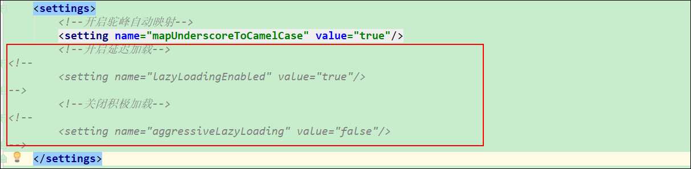

第一步：注解实现根据订单号查询订单及下单人（一对一）查询中，查询到订单后按需查询下单人信息

【OrderMapper接口】

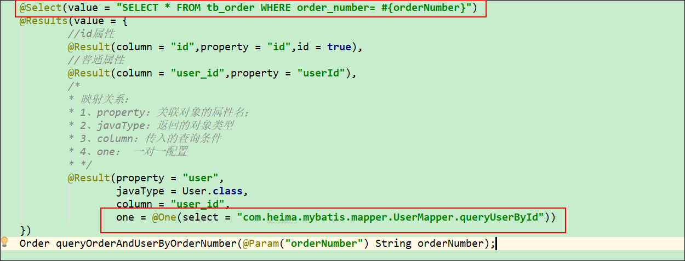

【UserMapper接口】

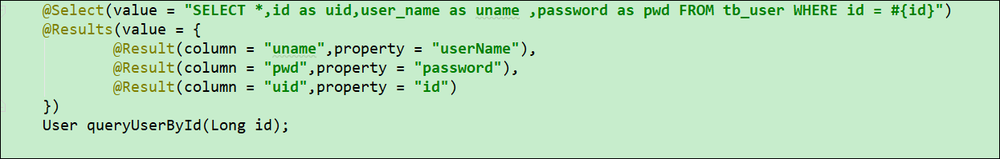

【查询结果】---立即加载

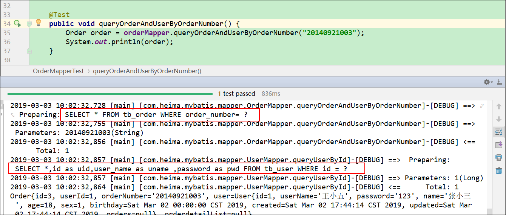


第二步：配置延迟加载

在配置一对一映射关系时，添加延迟加载

**【OrderMapper接口】**

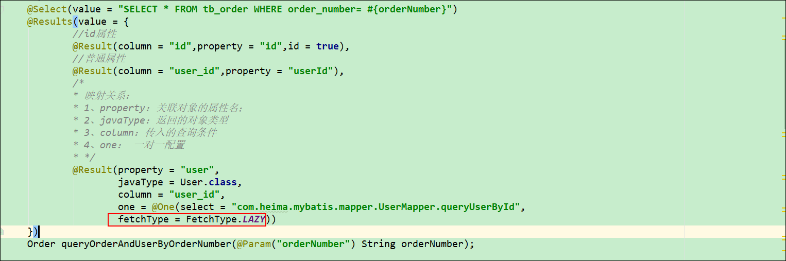

说明：One注解中除了有一个select属性，还有一个fetchType属性，给其赋值为  **FetchType.LAZY** 就可以完成延迟加载了。


第三步：测试

【不访问关联对象属性时】只查询主表（tb_order）的信息；

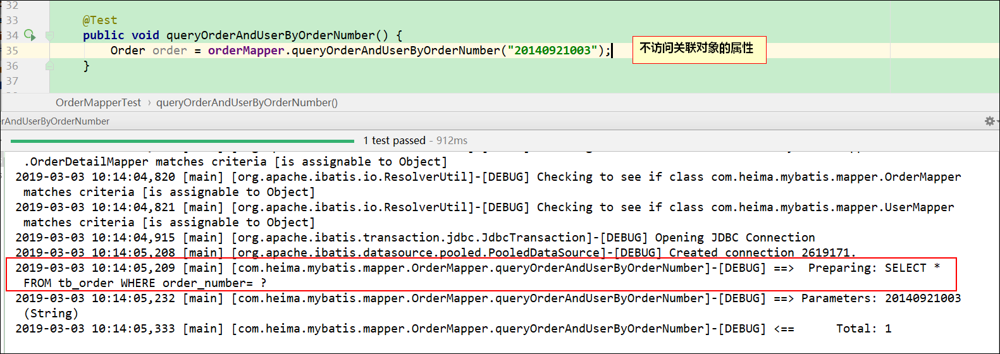

【访问关联对象属性时】查询主表（tb_order）信息，同时也加载了从表（tb_user）表的信息；

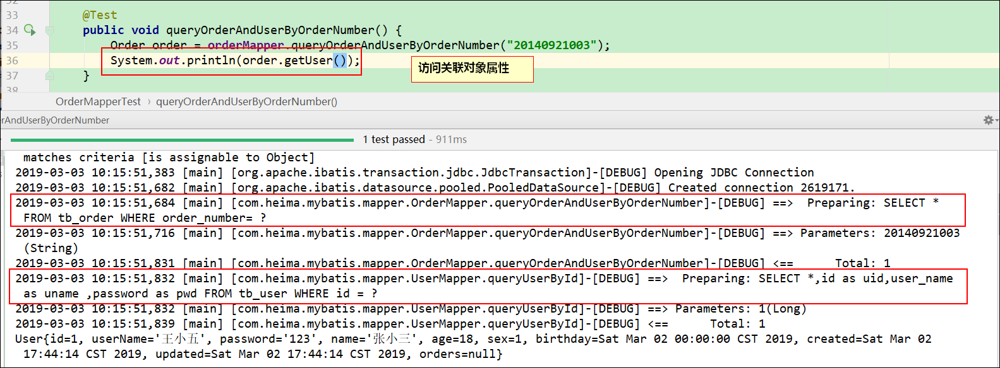


# 第二章、mybatis缓存【了解】

​	缓存就是用来提高查询访问速度，就是将每次的访问记录缓存在一地方，在下次进行查询时首先访问的不是数据库，而是缓存，如果在缓存中查询到了该次查询条件的结果集就直接返回结果，不再访问数据库。这样就对数据库的操作次数上就减少了很多，从而提高访问速度。当然，在查询缓存的机制中有两种不同的作用域（生命周期），分别是**一级缓存**与**二级缓存**。

### 1、一级缓存

```tex
	MyBatis的一级查询缓存是由 org.apache.ibatis.cache.impl.PerpetualCache 类的 HashMap本地缓存实现的，它的作用域则是SqlSession，它的作用域也就是生命周期，假如同一个SqlSession中执行两次sql语句的查询，这两次的查询的位置是不同的，第一次查询时，由于没有缓存结果则是从数据库中进行查询结果，得到结果后写入缓存并将结果返回给查询语句，而在进行第二次查询时，这时缓存中已经有符合条件的结果集，这次的查询就会在缓存获得结果并返回，而不会向数据库进行查询。当SqlSession结束后相应的缓存也就销毁了。 
	
ps：myBatis默认一级查询时开启状态，而且不能关闭
```

说明：

​	1.概念：一级缓存属于本地缓存，SqlSession级别的;

​	2.原理：

​		1）在同一个SqlSession，发生了一次查询，查询的结果会存入一级缓存;

​		2）第二次再发生相同查询时，直接从缓存中获取数据，不再与数据库建立连接查询数据

​	3.注意：一级缓存，默认是开启的，无法关闭。

#### 1.1、测试一级缓存

【测试】

需求：完成根据id查询用户数据；

接口：

~~~java
public interface UserMapper {

    //完成根据id查询用户数据；
    User selectById(Long id);
}
~~~

映射文件：

~~~xml
  <select id="selectById" resultType="User">
        select * from tb_user where id = #{id}
  </select>
~~~

测试类：

```java
package com.itheima.sh.test;

import com.itheima.sh.dao.UserMapper;
import com.itheima.sh.pojo.User;
import org.apache.ibatis.io.Resources;
import org.apache.ibatis.session.SqlSession;
import org.apache.ibatis.session.SqlSessionFactory;
import org.apache.ibatis.session.SqlSessionFactoryBuilder;
import org.junit.BeforeClass;
import org.junit.Test;

import java.io.InputStream;

public class CacheTest03 {
    private static UserMapper userMapper;
    @BeforeClass
    public static void berofeClass() throws Exception {
        //1、从xml中构建SqlSessionFactory
        String resource = "mybatis-config.xml";
        InputStream inputStream = Resources.getResourceAsStream(resource);
        //这里指定了环境为test
//        SqlSessionFactory sqlSessionFactory = new SqlSessionFactoryBuilder().build(inputStream,"test");
        //build不方法不指定环境就使用默认的 <environments default="development">
        SqlSessionFactory sqlSessionFactory = new SqlSessionFactoryBuilder().build(inputStream);

        //2、获取SqlSession
        SqlSession sqlSession = sqlSessionFactory.openSession(true);

        //3、获取UserMapper接口的动态代理对象
        userMapper = sqlSession.getMapper(UserMapper.class);
    }

    @Test
    public void testfirstCache(){
        User user1 = userMapper.selectById(1l);
        System.out.println(user1);
        System.out.println("=================第二次查询==================");
        User user2 = userMapper.selectById(1l);
        System.out.println(user2);
    }
}
```

​	由于一级缓存的存在，此时在log日志中，应该只会在第一次查询是执行sql语句，第二次查询时直接从缓存中命中，即不再执行sql语句。

结果：只发送了一条sql语句。

【结果】

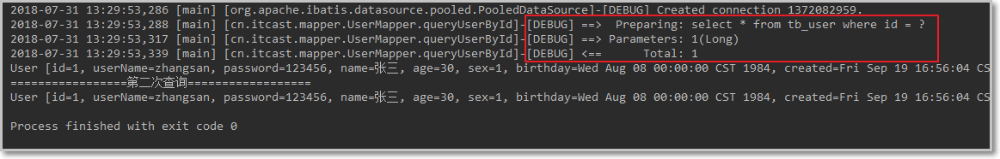


#### 1.2一级缓存失效的情况

1.查询条件不一致:


2、sqlSession不同；

~~~java
package com.itheima.sh.test;

import com.itheima.sh.dao.UserMapper;
import com.itheima.sh.pojo.User;
import org.apache.ibatis.io.Resources;
import org.apache.ibatis.session.SqlSession;
import org.apache.ibatis.session.SqlSessionFactory;
import org.apache.ibatis.session.SqlSessionFactoryBuilder;
import org.junit.BeforeClass;
import org.junit.Test;

import java.io.InputStream;

public class CacheTest03 {
    private static UserMapper userMapper;
    private static UserMapper userMapper2;
    @BeforeClass
    public static void berofeClass() throws Exception {
        //1、从xml中构建SqlSessionFactory
        String resource = "mybatis-config.xml";
        InputStream inputStream = Resources.getResourceAsStream(resource);
        //这里指定了环境为test
//        SqlSessionFactory sqlSessionFactory = new SqlSessionFactoryBuilder().build(inputStream,"test");
        //build不方法不指定环境就使用默认的 <environments default="development">
        SqlSessionFactory sqlSessionFactory = new SqlSessionFactoryBuilder().build(inputStream);

        //2、获取SqlSession
        SqlSession sqlSession = sqlSessionFactory.openSession(true);
        SqlSession sqlSession2 = sqlSessionFactory.openSession(true);

        //3、获取UserMapper接口的动态代理对象
        userMapper = sqlSession.getMapper(UserMapper.class);
        userMapper2 = sqlSession2.getMapper(UserMapper.class);
    }

    @Test
    public void testfirstCache(){
        User user1 = userMapper.selectById(1l);
        System.out.println(user1);
        System.out.println("=================第二次查询==================");
        User user2 = userMapper2.selectById(1l);
        System.out.println(user2);
    }
}

~~~

【结果】


3、两次查询期间存在增删改操作；

在执行update、insert、delete的时候,即使操作的不是和一级缓存中的是同一条记录，都会清空一级缓存。

在测试方法中添加删除的操作：

接口：

~~~java
public interface UserMapper {
    //完成根据id查询用户数据；
    User selectById(Long id);
    //通过id删除
    void deleteUser(Long id);
}
~~~

映射文件：

~~~xml
<delete id="deleteUser">
    delete from tb_user where id = #{id}
</delete>
~~~

测试类：

~~~java
    @Test
    public void testfirstCache(){
        User user1 = userMapper.selectById(1l);
        System.out.println(user1);

        userMapper.deleteUser(20L);

        System.out.println("=================第二次查询==================");
        User user2 = userMapper.selectById(1l);
        System.out.println(user2);
    }
~~~

由于insert、update、delete会清空缓存，所以第二次查询时，依然会输出sql语句，即从数据库中查询。


4、手动清除一级缓存；

使用：sqlSession.clearCache();可以强制清除缓存

步骤一：修改加载配置文件的方法

```java
public class CacheTest03 {
    private static UserMapper userMapper;
    private static UserMapper userMapper2;
    private static SqlSession sqlSession;
    @BeforeClass
    public static void berofeClass() throws Exception {
        //1、从xml中构建SqlSessionFactory
        String resource = "mybatis-config.xml";
        InputStream inputStream = Resources.getResourceAsStream(resource);
        //这里指定了环境为test
//        SqlSessionFactory sqlSessionFactory = new SqlSessionFactoryBuilder().build(inputStream,"test");
        //build不方法不指定环境就使用默认的 <environments default="development">
        SqlSessionFactory sqlSessionFactory = new SqlSessionFactoryBuilder().build(inputStream);

        //2、获取SqlSession
         sqlSession = sqlSessionFactory.openSession(true);
        SqlSession sqlSession2 = sqlSessionFactory.openSession(true);

        //3、获取UserMapper接口的动态代理对象
        userMapper = sqlSession.getMapper(UserMapper.class);
        userMapper2 = sqlSession2.getMapper(UserMapper.class);
    }
}
```

步骤二：编写测试方法

```java
	@Test
    public void testfirstCache(){
        User user1 = userMapper.selectById(1l);
        System.out.println(user1);

//        userMapper.deleteUser(20L);
        //清空一级缓存
        sqlSession.clearCache();
        System.out.println("=================第二次查询==================");
        User user2 = userMapper.selectById(1l);
        System.out.println(user2);
    }
```

在执行第二次查询之前清空缓存，再去执行查询。这时无法从缓存中命中，便会去执行sql从数据库中查询。


#### 【小结】

```html
1、一级缓存：（本地缓存）SqlSession级别
	mybatis第一次查询到数据后，会将数据存入到一级缓存中。当再次查询相同的数据时，mybatis会将缓存中的数据直接拿出来返回，不再从数据库中查询；

2、一级缓存失效：
	1、不同的查询条件；
	2、不同的SqlSession；
	3、两次查询之间有增，删，改操作；
	4、手动清除一级缓存；
```


### 2、二级缓存

- 概念：全局缓存   namespace级别

mybatis 的二级缓存的作用域：mapper范围的（即映射文件级别的，多个sqlSession可以共享二级缓存数据）

```tex
1、同一个mapper的namespace，在同一个namespace中查询sql可以从缓存中命中。
2、跨sqlSession，不同的SqlSession可以从二级缓存中命中
```

- 原理：

  -  在一个sqlSession，进行了一次查询，会把查询结果存入一级缓存；
  -  当sqlSession关闭之后，mybatis会把一级缓存中的数据存入二级缓存中；
  -   当我们再次发生相同的查询时，会从二级缓存中命中；
    - 场景：在用户通过id查询一个商品信息，执行完查询方法之后会将sqlSession释放掉，当再次发送请求查询同一个商品信息时会再次获取一个sqlSession来执行查询，那么此时如果配置了二级缓存的话，就可以直接从二级缓存中获取信息，而不用再次去数据库查询了。

-  二级缓存条件：

  1.手动开启：

  ~~~xml
  全局配置中：<setting name="cacheEnabled" value="true"/> 默认已开启。
  映射文件中：<cache/>
  注解方式：或者在接口上添加注解 @CacheNamespace(blocking = true)
  ~~~

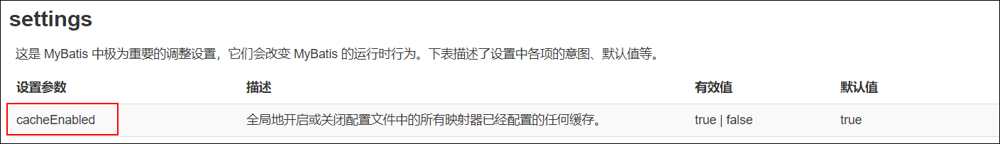		2.第一个session必须关闭；

​			说明：由于缓存数据是在sqlSession调用close方法时，放入二级缓存的，因此在测试二级缓存时必须先将第一个sqlSession关闭

​		3.二级缓存的对象必须序列化，例如：User对象必须实现Serializable接口。

​			说明：因为二级缓存的原理就是将对象进行序列化。


#### 2.1、测试二级缓存

步骤一：在映射文件中开启二级缓存

开启二级缓存，在映射文件(UserMapper.xml)中添加<cache />：

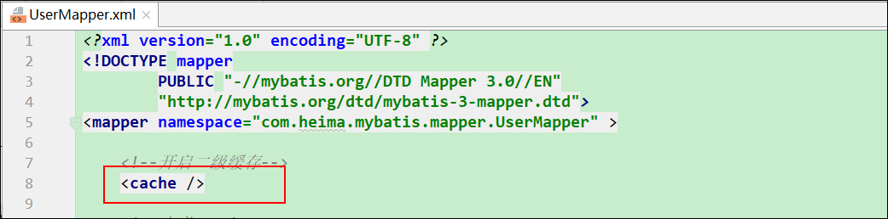

说明：表示当前映射文件中的sql语句操作的数据都会放到二级缓存中。

**\<cache>或者@CacheNamespace标签作用**

1. 所有在映射文件里的 select 语句都将被缓存。
2. 所有在映射文件里 insert,update 和 delete 语句会清空缓存。
3. 缓存使用“最近很少使用”算法来回收
4. 每个缓存可以存储 1024 个列表或对象的引用。

步骤二：修改测试方法

```java
public class CacheTest03 {
    private static UserMapper userMapper;
    private static UserMapper userMapper2;
    private static SqlSession sqlSession;
    private static SqlSession sqlSession2;

    @BeforeClass
    public static void berofeClass() throws Exception {
        //1、从xml中构建SqlSessionFactory
        String resource = "mybatis-config.xml";
        InputStream inputStream = Resources.getResourceAsStream(resource);
        //这里指定了环境为test
//        SqlSessionFactory sqlSessionFactory = new SqlSessionFactoryBuilder().build(inputStream,"test");
        //build不方法不指定环境就使用默认的 <environments default="development">
        SqlSessionFactory sqlSessionFactory = new SqlSessionFactoryBuilder().build(inputStream);

        //2、获取SqlSession
        sqlSession = sqlSessionFactory.openSession(true);
        sqlSession2 = sqlSessionFactory.openSession(true);

        //3、获取UserMapper接口的动态代理对象
        userMapper = sqlSession.getMapper(UserMapper.class);
        userMapper2 = sqlSession2.getMapper(UserMapper.class);
    }

   

    @Test
    public void testSecondCache() {
        User user1 = userMapper.selectById(1l);
        System.out.println(user1);

        System.out.println("=================第二次查询==================");
        User user2 = userMapper2.selectById(1l);
        System.out.println(user2);
    }
}
```


测试结果：发现二级缓存没有起作用，第二次查询还是发送了sql

原因：二级缓存只有在sqlSession被close()的时候才会将数据存入二级缓存中，因此我们需要手动关闭第一个sqlSession.

步骤四：手动关闭第一个sqlSession

```java
@Test
    public void testSecondCache() {
        User user1 = userMapper.selectById(1l);
        System.out.println(user1);
        //二级缓存会在第一个sqlSession关闭时生效
        sqlSession.close();
        System.out.println("=================第二次查询==================");
        User user2 = userMapper2.selectById(1l);
        System.out.println(user2);
    }
```

再次执行测试，发现又报错如下：原因是使用二级缓存要求对象必须序列化

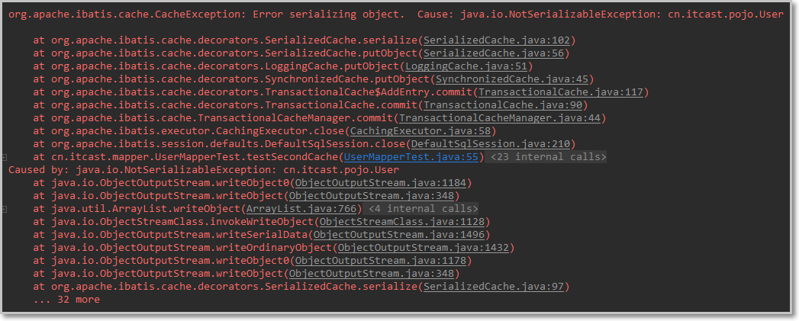

将对象实现序列化接口：

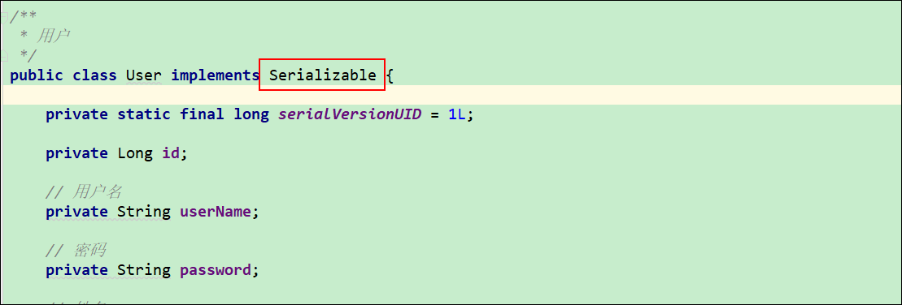

【结果】


#### 2.2二级缓存失效的情况

1.二级缓存:第二个sqlSession在执行update、insert、delete的时候，也同样会清空二级缓存中的内容。

~~~java
    @Test
    public void testSecondCache() {
        User user1 = userMapper.selectById(1l);
        System.out.println(user1);
        //二级缓存会在第一个sqlSession关闭时生效
        sqlSession.close();
        //删除另外一条数据
        userMapper2.deleteUser(20L);
        
        System.out.println("=================第二次查询==================");
        User user2 = userMapper2.selectById(1l);
        System.out.println(user2);
    }
~~~


测试结果：发现一旦进行了增删改操作，二级缓存也被清空了。


#### 【小结】

```html
二级缓存：全局缓存，namespace级别的缓存。一个namespace对应一个二级缓存

工作机制：
   1、一个会话，查询一次数据，mybatis会把这次查询的结果存入一级缓存；
   2、如果会话关闭，一级缓存中的数据会存入二级缓存中。新的会话查询的数据可以参照二级缓存

使用：
   1、开启全局二级缓存配置：开启缓存 <setting name="cacheEnabled" value="true"/>
   2、在具体的mapper.xml中使用二级缓存：<cache/>或者@CacheNamespace(blocking = true)
   3、pojo需要实现序列化接口

结果：
   1、第二次查询会从二级缓存中命中；
   2、注意：第一次查询的结果会放在一级缓存中，但只有第一次的SqlSession关闭后，数据才会转移到二级缓存中。

```


### 3、缓存小结

```html
1、MyBatis的二级缓存相对于一级缓存来说，实现了SqlSession之间缓存数据的共享，同时粒度更加的细，能够到namespace级别，通过Cache接口实现类不同的组合，对Cache的可控性也更强。--说白了就是二级缓存作用域更大

2、MyBatis在多表查询时，极大可能会出现脏数据，有设计上的缺陷，安全使用二级缓存的条件比较苛刻。

3、在分布式环境下，由于默认的MyBatis Cache实现都是基于本地的，分布式环境下必然会出现读取到脏数据，需要使用集中式缓存将MyBatis的Cache接口实现，有一定的开发成本，直接使用Redis,Memcached等分布式缓存可能成本更低，安全性也更高。
```

~~~html
Redis，MongoDB
~~~


# 第三章 小结

~~~html
第一章、高级查询【重点】 多表关联查询

	1、多表之间存在关系：1对1,  1对多 ，多对多；
	2、多表查询实现方式：
			【1】分步实现：  多条sql语句
			【2】关联查询实现： 一条sql语句
	3、一对一查询实现： 根据订单号查询  1个订单信息==》1个用户
		【1】分析SQL语句：关联查询
			SELECT * FROM tb_order tbo INNER JOIN tb_user ON tbo.user_id=tbu.id WHERE tbo.order_number=#{orderNumber}
		【2】数据封装问题：关联对象     
				在 Order实体类中新建一个属性 User    Order{ User user  }
		【3】书写接口方法：OrderMapper
			    Order queryOneToOne(@Param("orderNumber") String orderNumber);
		【4】映射文件中书写SQL语句：使用resultMap封装结果数据
				 <!--一对一查询： orderNumber  Order-User-->
                  <select id="queryOneToOne" resultMap="oneToOneResult">
                      SELECT
                          tbo.id AS oid,
                          tbo.order_number,
                          tbu.id AS uid,
                          tbu.user_name,
                          tbu.`password`,
                          tbu.`name`,
                          tbu.age,
                          tbu.sex
                      FROM
                          tb_order tbo
                      INNER JOIN tb_user tbu ON tbo.user_id = tbu.id
                      WHERE
                          tbo.order_number = #{orderNumber}
                  </select>
		【5】定义resultMap
			 <!--配置一对一的关系-->
            <resultMap id="oneToOneResult" type="Order" autoMapping="true">
                <!--配置订单表列名和实体类的属性名之间的映射-->
                <id column="oid" property="id"/>
                <result column="order_number" property="orderNumber"/>
                <!--
                    一对一配置：Order-User
					class Order{
					User user；
				}
                -->
                <association property="user" javaType="User" autoMapping="true">
                    <!--user表和user实体类-->
                    <id column="uid" property="id"/>
                    <result column="user_name" property="userName"/>
                    <result column="password" property="password"/>
                </association>
            </resultMap>
	  【6】测试


	4、一对一，一对多的配置：
			【1】一对一
			 <association property="user" javaType="User" autoMapping="true">
                    <!--user表和user实体类-->
                    <id column="uid" property="id"/>
                    <result column="user_name" property="userName"/>
                    <result column="password" property="password"/>
                </association>

			【2】一对多： User{List<Order> orderList  }

                  <collection property="orderList" javaType="List" ofType="Order" autoMapping="true">
                      <!--tb_order 和 Order-->
                      <id column="oid" property="id"/>
                  </collection>

	
第二章、注解【重点】
       【1】CRUD基本注解：添加在接口方法上面，取代映射文件
              @Insert("sql语句")
              @Delete("sql语句")
              @Update("sql语句")
              @Select("sql语句")
       【2】 需要将接口注册到mybatsi-config.xml中
                  <!--映射器配置-->
                  <mappers>
                      <package name="com.heima.mybatis.dao"/>
                  </mappers>
       【3】自增主键回填设置：
    @Insert("INSERT INTO tb_user VALUES(NULL,#{userName},#{password},#{name},#{age},#{sex})")
    @Options(useGeneratedKeys = true,keyColumn = "id",keyProperty = "id")
    void saveUser(User user);
    void saveUser(User user);
              
        【4】设置 数据库列 和实体类的属性之间的映射： @Results
              @Results({
              	@Result(coloum="id",property="id",id=true),
                @Result(coloum="user_name",property="userName")
              })
              
	【5】注解实现多表关联查询：只能使用分步查询实现  【了解】
              

第三章、延迟加载【了解】
	【1】作用：在多表分步查询中，被关联的查询根据需求进行加载（发送sql语句查询）；
    【2】配置：
      <settings>
        <!--开启延迟加载-->
        <setting name="lazyLoadingEnabled" value="true"/>
        <!--关闭积极加载-->
        <setting name="aggressiveLazyLoading" value="false"/>
    </settings>

第四章、缓存【了解】
	  一级缓存，二级缓存
~~~


