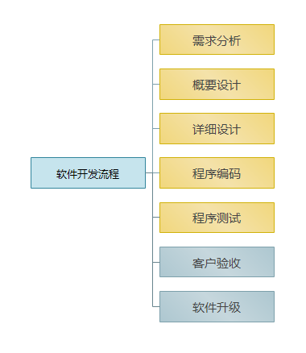
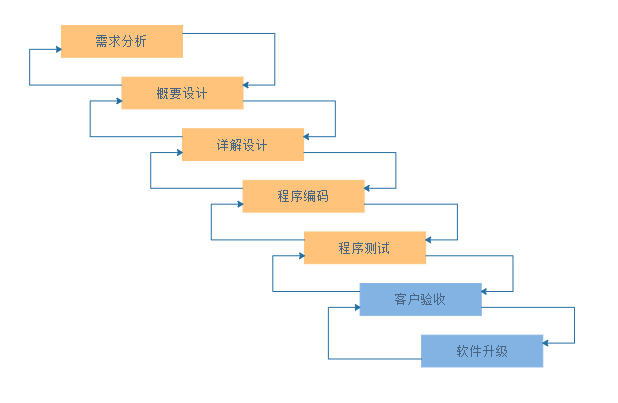
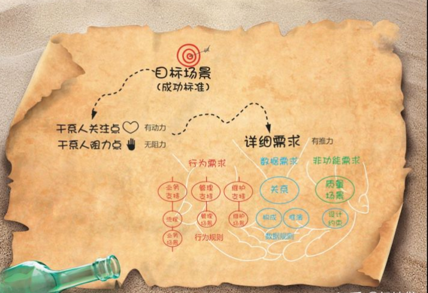
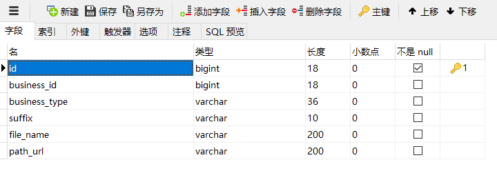
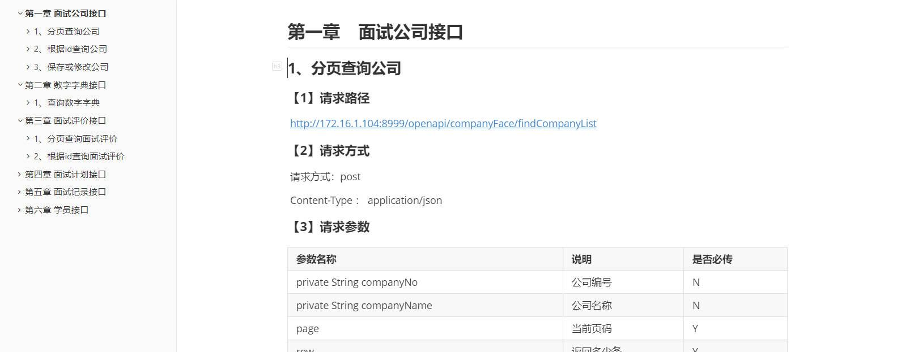

# day01-黑马旅游

## 目录

[TOC]

## 学习目标

```html
1、了解软件开发流程
2、掌握需求分析
3、掌握概要设计
4、掌握详细设计
```

## 第一章 软件开发流程

### 1、企业中开发流程？






【敏捷开发】

​		以用户的需求进化为核心，采用迭代、循序渐进的方法进行软件开发。在敏捷开发中，软件项目在构建初期被切分成多个子项目，各个子项目的成果都经过测试，具备可视、可集成和可运行使用的特征。换言之，就是把一个大项目分为多个相互联系，但也可独立运行的小项目，并分别完成，在此过程中软件一直处于可使用状态。

### 2、需求分析

~~~
需求文档。
~~~

​		一个软件没有出现之前，有一个人（小智）有一个想法，需要一个这样的东西用来管理什么什么，这个时候需求就出现了。但小智并不知道这个想法的可行性，于是就找了软件公司。软件公司的需求分析师会听小智提出的需求，根据小智的描述【大白话】，通过绘图工具画出对应原型图给小智看。经过几次确认后，需求分析师会最后确认功能是否完善，是否可行，从而确定是否要接手这个软件的研发。当我们接手时就标志着软件怀孕了,我们整个团队要安全的把`软件`这个孩子造出来。



- 行为需求：【需求分析师考虑】

  ```properties
  目标与干系人需求分析: 
  	明确软件系统对客户(主要是投资人、发起人)的业务价值;同时分析关键干系人的关注点和阻力点
  
  业务功能需求分析:
  	梳理软件系统要支持的业务有哪些,也就是涉及哪些业务流程、业务场景、用户场景;然后分析业务场景,并定义出所需的产品功能.
  
  平台管理者功能分析:
  	梳理系统要为管理者提供什么样的支持;也就是先定义出管理需求,然后进行数据指标分析,最后明确需要用什么的报表、大数据来实现.
  ```

- 数据需求【系统架构层次需要考虑的】

  ```properties
  明确系统应该存储哪些数据,这些数据之间是什么关系，也称为领域建模
  ```

- 质量需求【售前咨询、售后维护】

  ```properties
  根据系统的运行环境、使用环境,分析潜在的质量威胁,以明确最重要的质量属性是什么,并使用质量场景明确出具体的需求
  ```

  

### 3、概要设计

~~~
概要设计文档
~~~


​		这个功能主要是干嘛的呢？很多的公司觉得没必要，其实是很有必要的，这个就是相当于先规划一下怎么平安度过怀孕期，对于软件来说就是软件的处理逻辑，大概的一个流程是怎么走的，大概需要哪些模块，怎么运行，需要大概多少接口，后期怎么维护等问题

其实在概要设计阶段，业务架构和系统架构已经由架构师完成

**业务架构例如：**


**技术架构例如**


### 4、详细设计

~~~
详细设计文档
~~~


​    	有人说，详细设计是很麻烦的一步，其实不是很麻烦的一步，应该是最难的一步，详细设计主要是用来确认细节的，例如: 接口的名字，控制器的名字，多少个控制器，谁来调用谁，这个不可以有错，因为后期码农是需要看这个开发的，你怎么起名字，他们就怎么写，所以这里出错也就意味着编码的时候也会错，最后会有一份详细<b>详细设计说明文档</b>出现，这个就是告诉孕妇具体吃什么，怎么吃，多少量。

​	**模块依赖关系**


**数据库例如**



**接口文档例如：**




### 5、程序编码

​		编码就是我们俗称的搬砖，看着`详细设计说明文档`直接写代码就可以了，理论是这样的，但是为什么还有很多的bug出现呢？很大一部分原因并不是设计的原因（当然也有可能），很大原因是不按照设计文档编写造成的。这就相当于给孕妇设计了食谱，她的丈夫认为是这样的，她妈认为这那样的……最后孩子生不出来了。

**程序编码总原则**：

- 先求正确后求快
- 先求清晰后求快
- 保持程序整洁以求快
- 不要因效率而牺牲清晰

**好程序标准**：

- 设计简单
- 可读性高
- 易于测试
- 易于维护
- 易于扩展

**结构化程序设计**：

<div style="color:red;">强调使用几种基本控制结构、由粗到细，一步步展开</div>

​	主要原则：使用语言中的顺序、选择、重复等有限的基本控制结构表示程序逻辑。

​	选用的控制结构只准许有一个入口和一个出口

​	复杂结构应该用基本控制结构进行组合嵌套来实现

**自顶向下，逐步细化的过程**

### 6、软件测试

~~~
禅道
~~~


​		世界上不存在没有bug的代码。这一步是开发中很重要的一步，测试！！！我们不可能说写好直接就给用户用了，这个是负责任的，我们需要做的是先给测试部门进行系统的测试，当然这个测试不是按照用户的想法来的，他们会很暴力，举个栗子，一个按钮，正常的用户使用的时候会直接点击一次，看到效果就可以了，但是测试的时候不是，他们会疯狂的点击，知道他们觉得这个世界上不会有人比他们暴力的时候他们会停止，当然这是一个好的测试人员，很多的测试不会是这样的，他们觉得正常使用没问题就是没事的，其实一个软件好不好，很大一部分在于测试人员的测试力度。最后写一份测试报告就可以了。

### 7、客户验收

​		在软件测试证明软件达到要求后，软件开发者应向用户提交开发的目标安装程序、数据库的[数据字典]、《用户安装手册》、《用户使用指南》、需求报告、设计报告、测试报告等双方合同约定的产物。

 	《用户安装手册》应详细介绍安装软件对运行环境的要求、安装软件的定义和内容、在客户端、服务器端及[中间件]的具体安装步骤、安装后的系统配置。

 	《用户使用指南》应包括软件各项功能的使用流程、操作步骤、相应业务介绍、特殊提示和注意事项等方面的内容，在需要时还应举例说明

### 8、软件升级

- 需求调整分析

- 软件功能拓展

- 优化系统

  

~~~
sit测试环境： 系统集成测试
uat测试环境：  用户验收测试。
生产环境： 真实使用的环境。

需求团队
开发组
运维组：  负责项目的维护和发布的
dba：    数据库管理员。
测试组：
~~~


## 第二章 黑马旅游项目

### 1、需求文档

​		产品需求文档（Product Requirements Document）是对某一产品的所有需求的文档。它是为了让人们理解产品应该做什么而编写的。然而，一般避免固定产品将如何做，以便以后允许接口设计者和工程师利用他们的专业知识为需求提供最佳的解决方案。

<div style = "color:red">
    详情请参考课件中【黑马旅游官网-设计文档-第二章】
</div>


### 2、概要设计

[概要设计]说明书又可称[系统设计]说明书，这里所说的系统是指程序系统。编制的目的是说明对程序 系统的设计考虑，包括程序系统的基本处理流程、程序系统的组织结构、模块划分、功能分配、接口设计、运行设计、安全设计、数据结构设计和出错处理设计等，为程序的[详细设计)提供基础。

<div style = "color:red">
    详情请参考课件中【黑马旅游官网-设计文档-第三章】
</div>


### 3、详细设计

详细设计，是[软件工程]中软件开发的一个步骤，就是对[概要设计]的一个细化，就是详细设计每个模块实现算法，所需的局部结构。在[详细设计]阶段，主要是通过需求分析的结果，设计出满足用户需求的软件系统产品。

<div style = "color:red">
    详情请参考课件中【黑马旅游官网-设计文档-第四章】
</div>

