## 黑马旅游-设计文档

| 版本   | 修改时间   | 状态 | 修改概要说明       | 修改申请编号 | 修改人 | 负责人 |
| ------ | ---------- | ---- | ------------------ | ------------ | ------ | ------ |
| v1.0.0 | 2020.08.20 | N    | 用户确认原型后修改 | v1.0.0       | 束文奇 |        |
| v1.1.0 | 2020.09.08 | C    | 校验               | v1.1.0       | 许帅   |        |
|        |            |      |                    |              |        |        |

注：状态中，N是新建，A是追加，M是修改，D是删除，C是校验。

## 第一章 总体说明

### 1、引言

​		此需求规格说明书对项目的背景、范围、验收标准和需求等信息进行说明，包括功能性需求和非功能性需求，确保对用户需求的理解一致，而概要设计是对项目中涉及的业务、技术总体架构、接口数量、数据库表的一个初步设计。详细设计会定义出项目模块、模块的依赖关系、数据库表字段、接口使用的约束条件、传入参数、返回参数的统一设计。

### 2、系统概述

​		黑马旅游为用户提供一个方便的电子网络平台。该系统分前台官网部分和后台系统管理部分。旅行社通过后台管理系统将旅游信息发布在该平台上，并对整个旅游线路进行有效的控制、管理和统计；消费者通过系统官网方便快捷的选择或关注需要的旅游方案，享受旅行社或平台提供的各种旅游服务。

### 3、用户特性

​		本软件的最终用户将是官网用户（旅游者），旅行社管理人员

​		官网用户：只要求有基本的电脑操作知识，互联网知识即可。

​		旅行社管理人员：要求了解基本的电脑操作知识，经过一定时间的使用培训即可

## 第二章  需求文档

需求文档编写：用户大白话==》功能点的过程

### 1、注册

#### 【1】功能描述

定义：描述此模块有什么样的功能

```
1、用户填写完基本信息后，点击注册，可以为用户创建账号==》对应的用户表
2、注册页面上点击“立即登录”跳转登录页面
```

#### 【2】加载方法

定义：观察它的加载方式：自动加载、点击加载、超链接加载、异步请求加载

```
1、首页中右上角，如果当前用户处于【未登录】状态，显示“注册”，点击“注册”可以跳转到注册页面
2、登录页面也点击【注册】可以跳转到注册页面
```

#### 【3】页面操作

定义：它的衍生功能点有那些

| 功能操作 | 功能操作描述                   | 重要度 |
| -------- | ------------------------------ | ------ |
| 注册     | 点击【注册】，创建当前用户     | 高     |
| 立即登录 | 点击【立即登录】，跳转登录页面 | 高     |

#### 【4】约束条件

定义：操作此页面或者功能时，需要前置校验或者前置判定的条件

1、注册页面，提交表单时，需要的约束条件【用户表】

| 字段   | 是否必须 | 是否唯一 |
| ------ | -------- | -------- |
| 用户名 | Y        | Y        |
| 密码   | Y        | N        |
| Email  | Y        | Y        |
| 姓名   | Y        | N        |
| 手机   | Y        | Y        |
| 性别   | Y        | N        |
| 生日   | Y        | N        |

#### 【5】页面跳转

定义：他操作之后能够跳转的页面

```
1、注册成功，自动完成登录过程，跳转首页
2、注册失败，本页面不做跳转，返回错误提示信息
```

### 2、登录

#### 【1】功能描述

```
在登录页面上
	用户填写完账号和密码后，点击登录按钮时，完成登录，跳转到首页
	登录成功：在首页显示登录成功后的用户信息
	登录失败：在登录页面回显对应的提示信息
登录实际：登录成功后，需要把当前用户信息放入session
```

#### 【2】加载方法

```
1、首页中右上角，如果当前用户处于【未登录】状态，显示“登录”超链接，点击“登录”超链接时跳转到登录页面
2、用户点击“我的收藏”，"关注"，如果当前用用户处于【未登录】状态，直接跳转到登录页面
3、如果直接访问我的收藏、路线详情的时候，如果未登录，则被拦截，跳转到登录页面
```

#### 【3】页面操作

| 功能操作 | 功能操作描述                  | 重要度 |
| -------- | ----------------------------- | ------ |
| 登录     | 点击【登录】，提交后台        | 高     |
| 立刻注册 | 点击【立刻注册】,跳转注册页面 | 高     |

#### 【4】约束条件

用户提交登录时，需要的表单约束条件【用户表有关】

| 字段   | 是否必须 |
| ------ | -------- |
| 用户名 | Y        |
| 密码   | Y        |
| 验证码 | Y        |

#### 【5】页面跳转

```
1、登录成功，跳转首页
2、登录失败，本页面不做跳转，返回错误提示信息
```

### 3、退出

#### 【1】功能描述

```
1、用户退出
2、切换账户
3、退出的实际：清空session
```

#### 【2】加载方法

```
首页中右上角，如果当前用户处于【登录】状态，显示“退出”超链接，点击“退出”超链接时,退出当前账户并显示“登陆”的超链接
```

#### 【3】页面操作

```
首页中右上角，如果当前用户处于【登录】状态，显示“退出”，点击“退出”，显示“登陆”
```

#### 【4】约束条件

用户表

```
当前用户处于【登录】状态
```

#### 【5】页面跳转

【重点】：焦点功能

```
点击“退出”跳转到首页
```

### 4、我的收藏

用户表

用户-->路线表==》id 、routeId、 userId

#### 【1】功能描述

```
首页中右上角，如果当前用户处于【登录】状态，显示“我的收藏”超链接，点击“我的收藏”跳转到收藏列表页面,显示当前用户收藏的线路信息
```

#### 【2】加载方法

```
首页中右上角，如果当前用户处于【登录】状态，显示“我的收藏”,点击我的收藏超链接时,跳转到收藏页面,在收藏页面加载成功后,显示当前用户收藏的线路信息
```

#### 【3】页面操作

```
当前用户处于【登录】状态，点击“我的收藏”跳转到收藏列表页面
点击收藏列表，可以跳转到详情页面
以分页的方式展示
```

#### 【4】约束条件

```
当前用户处于【登录】状态
```

#### 【5】页面跳转

```
跳转到myfavorite.html页面上展示信息
```

### 5、首页

#### 【1】搜索

线路表

##### 【1.1】功能描述

```
提供针对“线路名称”，“简介”等内容的搜索，搜索后跳转搜索结果页面
```

##### 【1.2】加载方法

```
用户访问首页时，加载
```

##### 【1.3】页面操作

```
搜索后跳转搜索结果页面
```

##### 【1.4】约束条件

```
提供针对“线路名称”，“简介”等内容的搜索
```

##### 【1.5】页面跳转

```
搜索后跳转搜索结果页面
```

#### 【2】导航分类

线路分类表==》线路表的分类

##### 【2.1】功能描述

```
1、显示当前系统中的一级菜单
2、跳转对应的功能模块
```

##### 【2.2】加载方法

```
用户访问首页时，加载
```

##### 【2.3】页面操作

```
跳转对应的功能模块
```

##### 【2.4】约束条件

无

##### 【2.5】页面跳转

```
跳转对应的功能模块
```

#### 【3】线路分类加载

##### 【3.1】功能描述

```
1、按分类“黑马精选”、“国内游”、“国外游”，分别展示数据
2、点击展现线路，跳转线路详情
```

##### 【3.2】加载方法

```
用户访问首页时，加载
```

##### 【3.3】页面操作

```
点击展现线路，跳转线路详情
```

##### 【3.4】约束条件

无

##### 【3.5】页面跳转

```
跳转线路详情
```

### 6、线路详情

#### 【1】功能描述

```
1、展现线路详情，包括不限于：景点图片、景点简介、供应商、价格、关注、收藏、收藏次数
2、关注，如果当前用用户处于【登录】状态，为此用户添加关注记录，且修改此线路被关注的次数
```

#### 【2】加载方法

```
1、首页点击线路图标
2、搜索后点击线路图标
```

#### 【4】页面操作

```
关注，如果当前用用户处于【登录】状态，为此用户添加关注记录，且修改此线路被关注的次数
```

#### 【3】约束条件

```
1、点击“关注”，如果当前用用户处于【未登录】状态，直接跳转到登录页面
```

#### 【5】页面跳转

无


### 7、收藏

#### 【1】功能描述

```
1.在详细信息展示界面，显示收藏按钮。
2.没有收藏的时候，或者用户未登录的时候显示收藏按钮
3.点击收藏按钮，未登录的情况，跳转到登录页面
4.如果已经登录，收藏次数+1,显示取消按钮
```

#### 【2】加载方法

```
1.点击收藏按钮，添加收藏
2.按钮的显示，应该在页面加载成功的情况下，自动进行判断，显示正确的按钮
  
```

#### 【4】页面操作

```
收藏：点击，用户收藏当前旅游线路。，未登录，跳转到登录页面。

```

#### 【3】约束条件

```
收藏按钮：用户未登录的情况下或者用户未收藏的情况下显示，才能点击。
取消按钮：用户已经收藏的情况下才能点击

```

#### 【5】页面跳转

无


## 第三章  概要设计

### 1、业务架构

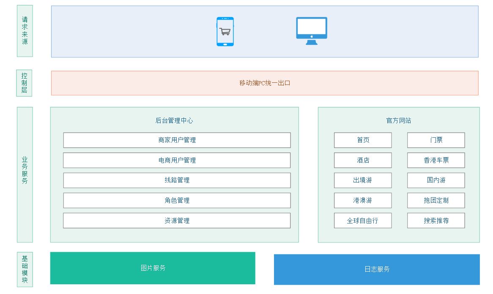

**层级划分**

控制层：使用springmvc做响应的同时使用拦截器处理

业务层：主体业务分为后台管理中心与官方网站，其中后台管理主要负责商家及电商用户管理、角色管理、资源管理和线路管理，官方网站：主要负责主体业务对客户的呈现

基础模块：图片服务、日志服务、

### 2、技术架构


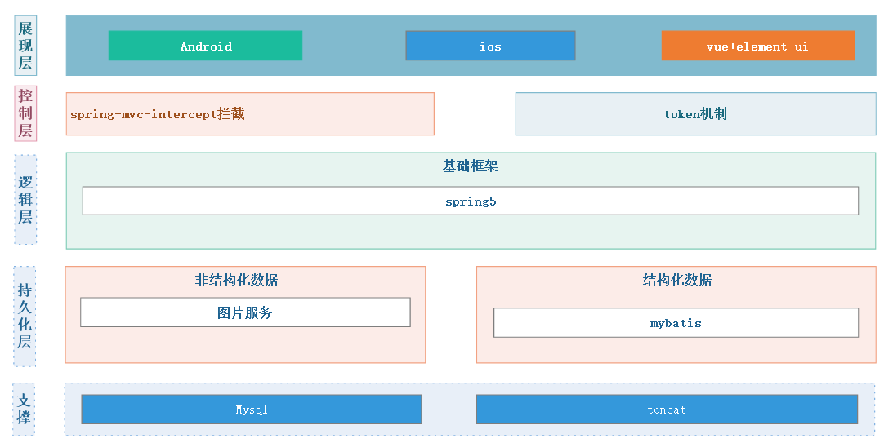


### 3、数据库概要设计

#### 【1】业务表

| 表名         | 描述           |
| ------------ | -------------- |
| tab_affix    | 图片表【附件】 |
| tab_category | 分类表         |
| tab_favorite | 收藏表         |
| tab_route    | 路线表         |
| tab_seller   | 商家表         |
| tab_user     | 用户表         |

#### 【2】业务表关系

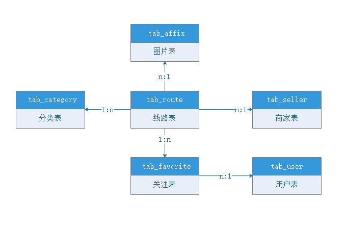

| 表名         | 描述                                                       |
| ------------ | ---------------------------------------------------------- |
| tab_affix    | 多个图片属于同一个线路                                     |
| tab_category | 一个分类下面可以有多条线路                                 |
| tab_favorite | 多条收藏属于同一个用户                                     |
| tab_route    | 一条线路有多个图片、被关注多次、属于某个商家、属于某个分类 |
| tab_seller   | 一个商家可以发布多条线路                                   |
| tab_user     | 一个用户可以关注多条线路                                   |


### 4、接口概要设计

#### 【1】用户模块

| 接口名称     | 接口描述                 |
| ------------ | ------------------------ |
| registerUser | 注册接口                 |
| loginUser    | 登录接口                 |
| logoutUser   | 退出接口                 |
| isLogin      | 是否登录接口【隐藏功能】 |

#### 【2】收藏模块

| 接口名称       | 接口描述 |
| -------------- | -------- |
| findMyFavorite | 我的收藏 |
| addFavorited   | 添加收藏 |
| isFavorited    | 是否收藏 |

#### 【3】分类模块

| 接口名称        | 接口描述     |
| --------------- | ------------ |
| findAllCategory | 查询所有分类 |

#### 【4】线路模块

| 接口名称        | 接口描述           |
| --------------- | ------------------ |
| findRouteByPage | 多条件线路查询分页 |
| findRouteById   | 线路详情           |

## 第四章 详细设计

### 1、架构模块

#### 【1】依赖关系


#### 【2】模块职能

<div style="color:red">【travel-parent】</div>

```
1、统一定义jar和plugin的插件版本
2、定义管理其他模块
3、定义依赖声明
4、定义deploy的私服信息
```

<div style="color:red">【travel-core】</div>

```
1、mybatis的配置支持
2、mybatis的主键生成策略interceptor的定义
3、mybatis的主键生成策略支持工具类
4、spring的配置文件
5、spring-mvc的配置文件
```

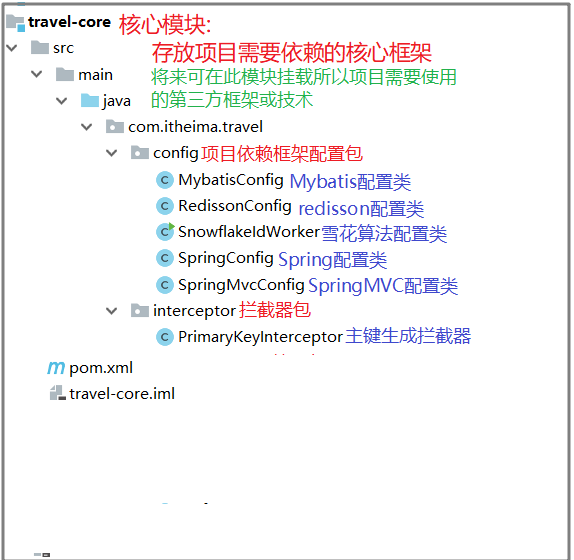

<div style="color:red">【travel-commons】</div>

```
1、constant常量定义
2、exception异常定义
3、mybatis-plugin插件定义
5、工具类
```

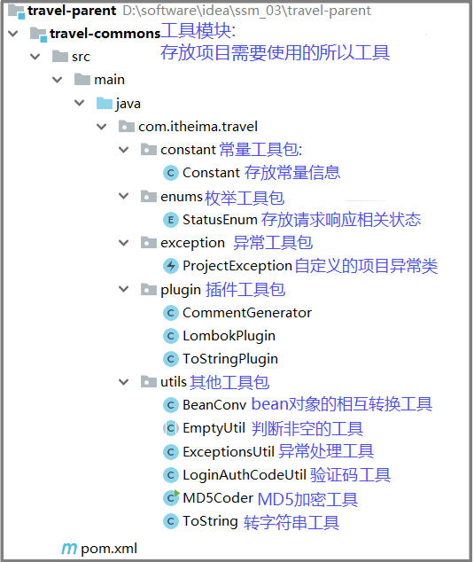

<div style="color:red">【travel-dao】</div>

```
1、mapper层接口
2、pojo层对象
3、自定义mapperExt的支持
```

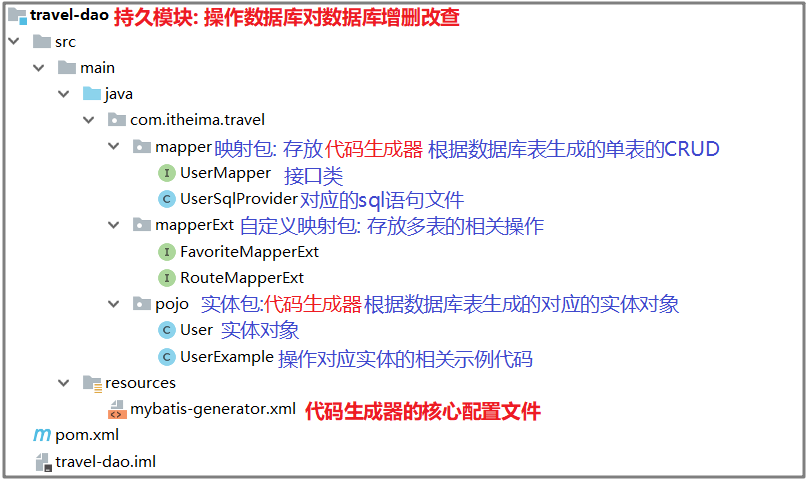

<div style="color:red">【travel-service】</div>

```
1、主体业务的实现
```

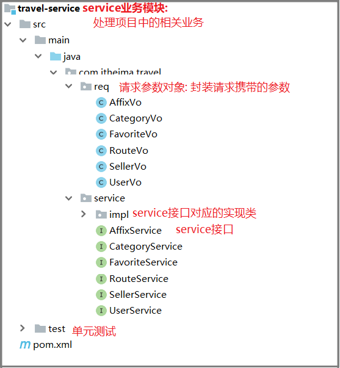

<div style="color:red">【travel-web-admin】</div>

后台项目-管理平台

```
1、projectInitCofing的初始化配置文件
2、统一响应web层
```

<div style="color:red">【travel-web-platform】</div>

```
1、projectInitCofing的初始化配置文件
2、统一响应网关路由web层
3、登录interceptors的定义
```

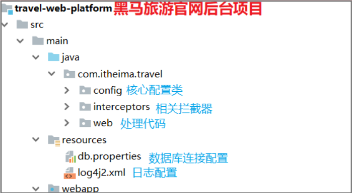

### 2、数据库

#### 【1】业务表总目录

| 表名         | 描述           |
| ------------ | -------------- |
| tab_affix    | 图片表【附件】 |
| tab_category | 分类表         |
| tab_favorite | 关注表         |
| tab_route    | 路线表         |
| tab_seller   | 商家表         |
| tab_user     | 用户表         |

#### 【2】tab_affix【图片表】

功能：负责整个系统的所有图片的上传信息的存储

| 字段          | 类型    | 长度 | 是否为空 | 注释         |
| ------------- | ------- | ---- | -------- | ------------ |
| id            | bigint  | 18   | N        | 主键         |
| business_id   | bigint  | 18   | Y        | 业务主键     |
| business_type | varchar | 36   | Y        | 业务类型     |
| suffix        | varchar | 10   | Y        | 后缀         |
| file_name     | varchar | 200  | Y        | 文件名称     |
| path_url      | varchar | 200  | Y        | 文件访问路径 |

#### 【3】tab_category【分类表】

功能：负责首页导航条的分类管理

| 字段          | 类型    | 长度 | 是否为空 | 注释     |
| ------------- | ------- | ---- | -------- | -------- |
| id            | bigint  | 18   | N        | 主键     |
| category_name | varchar | 100  | N        | 分类名称 |
| category_url  | varchar | 255  | N        | 分类链接 |

#### 【4】tab_favorite【关注表】

功能：用户收藏的线路关联表，需要注意的是路线信息需要关联查询出来

| 字段     | 类型   | 长度 | 是否为空 | 注释   |
| -------- | ------ | ---- | -------- | ------ |
| id       | bigint | 18   | N        | 主键   |
| user_id  | bigint | 18   | N        | 用户Id |
| route_id | bigint | 18   | N        | 路线Id |

#### 【5】tab_route【线路表】

功能：路线信息表，用于商家定义路线信息，及路线信息的展现，需要注意的是对于的图片信息需要从文件附件表中查询出来，商家信息需要从商家表中关联查询出来

| 字段            | 类型    | 长度     | 是否为空 | 注释         |
| --------------- | ------- | -------- | -------- | ------------ |
| id              | bigint  | 18       | N        | 主键         |
| route_name      | varchar | 200      | N        | 线路名称     |
| price           | decimal | （12,4） | N        | 分类链接     |
| route_Introduce | varchar | 2000     | Y        | 线路描述     |
| flag            | char    | 1        | N        | 标记         |
| is_theme_tour   | char    | 1        | N        | 是否主题之旅 |
| attention_count | int     | 11       | N        | 关注数       |
| category_id     | bigint  | 18       | N        | 分类ID       |
| seller_id       | bigint  | 18       | N        | 商家ID       |

#### 【6】tab_seller【商家】

功能：商家信息的定义，商家登录后台时的账户信息

| 字段        | 类型     | 长度 | 是否为空 | 注释     |
| ----------- | -------- | ---- | -------- | -------- |
| id          | bigint   | 18   | N        | 主键     |
| seller_name | varchar  | 200  | N        | 商家姓名 |
| telephone   | varchar  | 12   | N        | 电话     |
| address     | varchar  | 200  | Y        | 地址     |
| username    | varchar  | 100  | N        | 账户     |
| password    | varchar  | 32   | N        | 密码     |
| birthday    | datetime | 0    | Y        | 生日     |

#### 【7】tab_user【用户表】

功能：用户信息的定义，商家登录商城时的账户信息

| 字段      | 类型     | 长度 | 是否为空 | 注释 |
| --------- | -------- | ---- | -------- | ---- |
| id        | bigint   | 18   | N        | 主键 |
| real_name | varchar  | 200  | N        | 姓名 |
| telephone | varchar  | 12   | N        | 电话 |
| sex       | char     | 200  | Y        | 地址 |
| username  | varchar  | 100  | N        | 账户 |
| password  | varchar  | 32   | N        | 密码 |
| birthday  | datetime | 0    | Y        | 生日 |
| email     | varchar  | 100  | Y        | 邮箱 |

### 3、用户模块

#### 【1】注册接口

##### 【1.1】功能描述

```
1、在register.html页面上,当用户填写完基本信息后，点击注册按钮时，为用户创建账号
2、注册页面点击“立即登录”跳转login.html页面
```

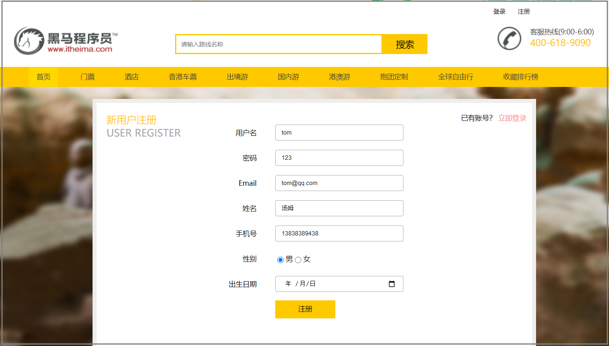

##### 【1.2】加载方法

1、首页中右上角，如果当前用户处于【未登录】状态，显示“注册”，点击“注册”可以跳转到注册页面


2、用户登录页面，右下方点击立刻注册可以跳转到注册页面

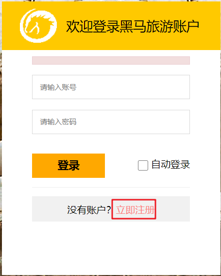

##### 【1.3】页面操作

| 功能操作 | 功能操作描述                   | 重要度 |
| -------- | ------------------------------ | ------ |
| 注册     | 点击【注册】，创建当前用户     | 高     |
| 立即登录 | 点击【立即登录】，跳转登录页面 | 高     |

##### 【1.4】约束条件

1、注册页面，提交表单时，需要的约束条件

| 字段   | 是否必须 | 是否唯一 |
| ------ | -------- | -------- |
| 用户名 | Y        | Y        |
| 密码   | Y        | N        |
| Email  | Y        | Y        |
| 姓名   | Y        | N        |
| 手机   | Y        | Y        |
| 性别   | Y        | N        |
| 生日   | Y        | N        |

##### 【1.5】页面跳转

1、注册成功，自动完成登录过程，跳转首页


2、注册失败，本页面不做跳转，返回错误提示信息

##### 【1.6】接口详情

###### 【1.6.1】请求路径

 http://127.0.0.1:8080/user/register

###### 【1.6.2】请求方式

 请求方式：post

 Content-Type ： application/json 

###### 【1.6.3】方法信息

接口类信息：com.itheima.travel.web.UserController

方法名：registerUser

###### 【1.6.4】请求参数

| 字段      | 类型   | 长度 | 注释     | 是否为空 |
| --------- | ------ | ---- | -------- | -------- |
| realName  | String | 200  | 真实姓名 | Y        |
| telephone | String | 12   | 电话     | N        |
| sex       | String | 200  | 性别     | N        |
| username  | String | 100  | 用户名称 | N        |
| password  | String | 32   | 密码     | N        |
| birthday  | Date   | 0    | 生日     | Y        |
| email     | String | 100  | 邮箱     | N        |

请求json字符串

```json
{
  "birthday": "2020-11-03T06:52:08.320Z",
  "email": "59948528@qq.com",
  "password": "pass",
  "realName": "束XX",
  "sex": "1",
  "telephone": "15156403088",
  "username": "shu"
}
```

###### 【1.6.5】返回信息

类型：布尔类型

```json
{
  "code": "200",
  "msg": "操作成功",
  "operationTime": "2020-11-06 03:17:22",
  "data": true,
  "webSite": null
}
```

###### 【1.6.6】业务逻辑

```
1、保存用户信息到数据库
2、注册成功后，自动登录，把用户信息放入session中，并且跳转首页
```

#### 【2】登录接口

##### 【2.1】功能描述

```
在login.html页面上,用户填写完账号和密码后，点击登录按钮时,发送登录的请求，完成登录并跳转首页
```

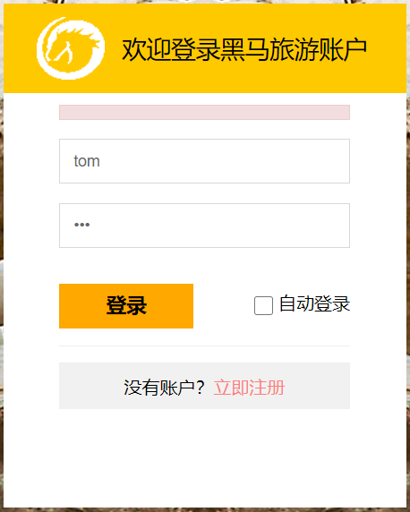

##### 【2.2】加载方法

1、首页中右上角，如果当前用户处于【未登录】状态，显示“登录”，点击“登录”可以跳转到登录页面


2、用户点击“我的收藏”，"点击收藏"，如果当前用用户处于【未登录】状态，直接跳转到登录页面


##### 【2.3】页面操作

| 功能操作 | 功能操作描述                  | 重要度 |
| -------- | ----------------------------- | ------ |
| 登录     | 点击【登录】，提交后台        | 高     |
| 立刻注册 | 点击【立刻注册】,跳转注册页面 | 高     |

##### 【2.4】约束条件

用户提交登录时，需要的表单约束条件

| 字段   | 是否必须 |
| ------ | -------- |
| 用户名 | Y        |
| 密码   | Y        |

##### 【2.5】页面跳转

1、登录成功，跳转首页


2、登录失败，本页面不做跳转，返回错误提示信息

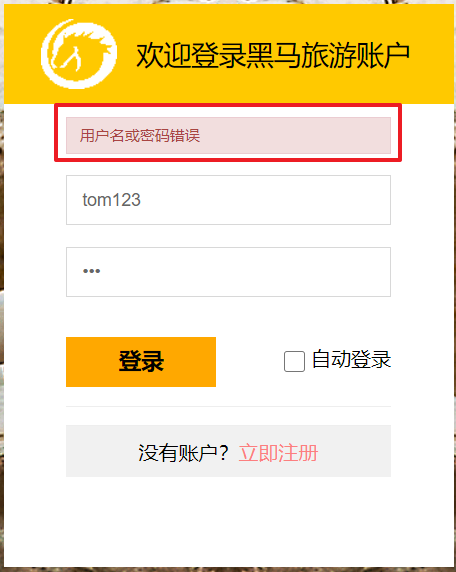

##### 【2.6】接口详情

###### 【2.6.1】请求路径

 http://127.0.0.1:8080/user/login

###### 【2.6.2】请求方式

 请求方式：post

 Content-Type ： application/json 

###### 【2.6.3】方法信息

接口类信息：com.itheima.travel.web.UserController

方法名：loginUser

###### 【2.6.4】请求参数

| 字段     | 类型   | 长度 | 注释     | 是否为空 |
| -------- | ------ | ---- | -------- | -------- |
| username | String | 100  | 用户名称 | N        |
| password | String | 32   | 密码     | N        |

请求json字符串

```json
{
    "username":"admin",
    "password":"pass"
}
```

###### 【2.6.5】返回信息

```json
{
  "code": "200",
  "msg": "操作成功",
  "operationTime": "2020-11-06 03:24:47",
  "data": {
    "id": 1,
    "username": "admin",
    "password": "1a1dc91c907325c69271ddf0c944bc72",
    "realName": "束XX",
    "birthday": 1598579633000,
    "sex": "1",
    "telephone": "15156408888",
    "email": "15156408888@qq.com",
    "sessionId": "985F126DCFBE32EB29278062D825FE57"
  },
  "webSite": null
}
```

###### 【2.6.6】业务逻辑

```
1、使用MD5加密用户传入的password字段，根据用户名和密码去数据库中查询用户信息，查到则认为登录成功，差不多则认为登录失败
2、登录后，把用户信息放入session中，并且跳转首页
```

#### 【3】退出接口

##### 【3.1】功能描述

```
1、用户退出
2、切换账户
```


##### 【3.2】加载方法

首页中右上角，如果当前用户处于【登录】状态，显示“退出”，点击“退出”,显示“登陆”

##### 【3.3】页面操作

首页中右上角，如果当前用户处于【登录】状态，显示“退出”，点击“退出”,显示“登陆”

##### 【3.4】约束条件

当前用户处于【登录】状态

##### 【3.5】页面跳转

无

##### 【3.6】接口详情

###### 【2.6.1】请求路径

 http://127.0.0.1:8080/user/logout

###### 【2.6.2】请求方式

 请求方式：get

 Content-Type ： application/json 

###### 【2.6.3】方法信息

接口类信息：com.itheima.travel.web.UserController

方法名：logoutUser

###### 【2.6.4】请求参数

无

###### 【2.6.5】返回信息

类型：布尔类型

```json
{
  "code": "200",
  "msg": "操作成功",
  "operationTime": "2020-11-06 03:38:08",
  "data": true,
  "webSite": null
}
```

###### 【2.6.6】业务逻辑

```
1、用户处于【登录】状态，显示“退出”，点击“退出”,显示“登陆”
2、后台中从session中清除对应的用户信息
```

#### 【4】是否登录接口

##### 【4.1】功能描述

```
1、判断当前用户是否登录
```


##### 【4.2】加载方法

无

##### 【4.3】页面操作

无

##### 【4.4】约束条件

```
当前用户处于【登录】状态
```

##### 【4.5】页面跳转

无

##### 【4.6】接口详情

###### 【4.6.1】请求路径

 http://127.0.0.1:8080/user/islogin

###### 【4.6.2】请求方式

 请求方式：get

 Content-Type ： application/json 

###### 【4.6.3】方法信息

接口类信息：com.itheima.travel.web.UserController

方法名：isLogin

###### 【4.6.4】请求参数

无

###### 【4.6.5】返回信息

类型：布尔类型

```json
{
  "code": "200",
  "msg": "操作成功",
  "operationTime": "2020-11-06 03:31:33",
  "data": true,
  "webSite": null
}
```

###### 【4.6.6】业务逻辑

```
1、后台中从session中获得对应的用户信息，获取到则为登录，获取不到则为未登录
2、首页在访问时候，用于判定是否显示“登录”、“我的收藏”链接
```

### 4、收藏模块

#### 【1】我的收藏

##### 【1.1】功能描述

```
首页中右上角，如果当前用户处于【登录】状态，显示“我的收藏”，点击“我的收藏”可以跳转到收藏列表页面
```


##### 【1.2】加载方法

首页中右上角，如果当前用户处于【登录】状态，显示“我的收藏”

##### 【1.3】页面操作

当前用户处于【登录】状态，点击“我的收藏”可以跳转到收藏列表页面

##### 【1.4】约束条件

当前用户处于【登录】状态

##### 【1.5】页面跳转


##### 【1.6】接口详情

###### 【1.6.1】请求路径

http://127.0.0.1:8080/favorite/1/10

###### 【1.6.2】请求方式

 请求方式：post

 Content-Type ： application/json 

###### 【1.6.3】方法信息

接口类信息：com.itheima.travel.service.FavoriteService

方法名：findMyFavorite

###### 【1.6.4】请求参数

body中传递参数

| 字段     | 类型    | 长度 | 注释     | 是否为空 |
| -------- | ------- | ---- | -------- | -------- |
| pageNum  | Integer | 12   | 当前页码 | N        |
| pageSize | Integer | 12   | 分页大小 | N        |

json请求格式

```json
{
	"pageNum":1,
	"pageSize":2
}
```


###### 【1.6.5】返回信息

```json
{
  "code": "200",
  "msg": "操作成功",
  "operationTime": "2020-11-06 03:43:49",
  "data": {
    "total": 4,
    "list": [
      {
        "id": 1,
        "routeName": "【旅展 半价特惠 重走丝路•漫游宁夏 双飞4天】银川西部影视城 穆民新村 】",
        "price": 999,
        "routeIntroduce": "走进【宁夏沙坡头】，西北大漠风情、体会“大漠孤烟直，长河落日圆”的塞上风光！",
        "flag": "1",
        "isThemeTour": "0",
        "attentionCount": 18,
        "categoryId": 4,
        "sellerId": 1,
        "createdTime": 1604648518000,
        "minPrice": null,
        "maxPrice": null,
        "affixVoList": [
          {
            "id": 1,
            "businessId": 1,
            "businessType": "route_big",
            "suffix": ".jpg",
            "fileName": "m2a0b210f47a778170efe260bd75a2fd01.jpg",
            "pathUrl": "platform_img/big_img/m2a0b210f47a778170efe260bd75a2fd01.jpg"
          },
          {
            "id": 31,
            "businessId": 1,
            "businessType": "route_big",
            "suffix": ".jpg",
            "fileName": "m2a0b210f47a778170efe260bd75a2fd01.jpg",
            "pathUrl": "platform_img/big_img/m2a0b210f47a778170efe260bd75a2fd01.jpg"
          },
          {
            "id": 32,
            "businessId": 1,
            "businessType": "route_big",
            "suffix": ".jpg",
            "fileName": "m2a48c6c269665e675902beef5d3fdd06e.jpg",
            "pathUrl": "platform_img/big_img/m2a48c6c269665e675902beef5d3fdd06e.jpg"
          },
          {
            "id": 33,
            "businessId": 1,
            "businessType": "route_big",
            "suffix": ".jpg",
            "fileName": "m2a9767d7b337e8423768cbe94b4ad1227.jpg",
            "pathUrl": "platform_img/big_img/m2a9767d7b337e8423768cbe94b4ad1227.jpg"
          },
          {
            "id": 25016538135568384,
            "businessId": 1,
            "businessType": "shuwenqi",
            "suffix": ".png",
            "fileName": "25016537644834816",
            "pathUrl": "shuwenqi/25016537644834816.png"
          }
        ]
      }
    ],
    "pageNum": 1,
    "pageSize": 1,
    "size": 1,
    "startRow": 1,
    "endRow": 1,
    "pages": 4,
    "prePage": 0,
    "nextPage": 2,
    "isFirstPage": true,
    "isLastPage": false,
    "hasPreviousPage": false,
    "hasNextPage": true,
    "navigatePages": 8,
    "navigatepageNums": [
      1,
      2,
      3,
      4
    ],
    "navigateFirstPage": 1,
    "navigateLastPage": 4
  },
  "webSite": "http://127.0.0.1/file-service"
}
```

###### 【1.6.6】业务逻辑

```
首页中右上角，如果当前用户处于【登录】状态，显示“我的收藏”，点击“我的收藏”可以跳转到收藏列表页面
```

#### 【2】添加收藏 

##### 【2.1】功能描述

```
在线路详情页，用于用户添加收藏线路,点击后对当前页码已收藏次数进行叠加，同时让点击按钮不可点击
```

点击收藏前:


点击收藏后:

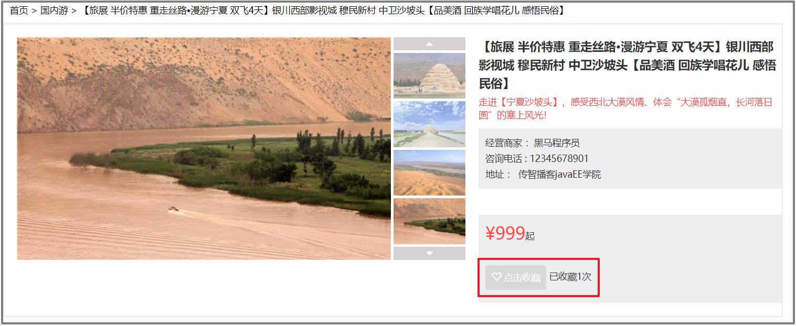

##### 【2.2】加载方法

在线路详情页，如果当前用户已经收藏过此路线，则“点击收藏”为不可点击，反则可以点击

##### 【2.3】页面操作

如果当前用户已经收藏过此路线，则“点击收藏”为不可点击，反则可以点击

##### 【2.4】约束条件

如果当前用户已经收藏过此路线，则“点击收藏”为不可点击，反则可以点击

##### 【2.5】页面跳转

无

##### 【2.6】接口详情

###### 【2.6.1】请求路径

 http://127.0.0.1:8080/favorite/addFavorite

###### 【2.6.2】请求方式

 请求方式：post

 Content-Type ： application/json 

###### 【2.6.3】方法信息

接口类信息：com.itheima.travel.web.FavoriteController

方法名：addFavorite

###### 【2.6.4】请求参数

body中传递参数

| 字段    | 类型    | 长度 | 注释   | 是否为空 |
| ------- | ------- | ---- | ------ | -------- |
| routeId | Integer | 12   | 线路ID | N        |

json请求格式

```json
{
	"routeId":1
}
```

###### 【2.6.5】返回信息

{
  "code": "200",
  "msg": "操作成功",
  "operationTime": "2020-11-06 03:41:58",
  "data": 18,
  "webSite": null
}

备注：如果返回的编码不为200，则在页面上显示对于的提示信息即可

###### 【2.6.6】业务逻辑

```
在线路详情页，用于用户添加收藏线路,点击后对当前页码已收藏次数进行叠加，同时让点击按钮不可点击
```

#### 【3】是否收藏

##### 【3.1】功能描述

```
加载线路详情时，如果当前用户已经收藏过此路线，则“点击收藏”为不可点击，反则可以点击
```


##### 【3.2】加载方法

在线路详情页，如果当前用户已经收藏过此路线，则“点击收藏”为不可点击，反则可以点击

##### 【3.3】页面操作

无

##### 【3.4】约束条件

如果当前用户已经收藏过此路线，则“点击收藏”为不可点击，反则可以点击

##### 【3.5】页面跳转

无

##### 【3.6】接口详情

###### 【3.6.1】请求路径

 http://127.0.0.1:8080/favorite/1

###### 【3.6.2】请求方式

 请求方式：post

 Content-Type ： application/json 

###### 【3.6.3】方法信息

接口类信息：com.itheima.travel.web.FavoriteController

方法名：isFavorited

###### 【3.6.4】请求参数

body中传递参数

| 字段    | 类型    | 长度 | 注释   | 是否为空 |
| ------- | ------- | ---- | ------ | -------- |
| routeId | Integer | 12   | 线路ID | N        |

json请求格式

```json
{
   "routeId":1
}
```

###### 【3.6.5】返回信息

```json
{
  "code": "200",
  "msg": "操作成功",
  "operationTime": "2020-11-06 03:41:58",
  "data": true,
  "webSite": null
}
```

备注：如果返回的编码不为200，则在页面上显示对于的提示信息即可

###### 【3.6.6】业务逻辑

```
在线路详情页，用于用户添加收藏线路,点击后对当前页码已收藏次数进行叠加，同时让点击按钮不可点击
```

### 5、分类模块

##### 【3.1】功能描述

~~~
公共头部的导航栏中，显示所有的旅游线路的类别信息
~~~


##### 【3.2】加载方法

~~~
1.任意一个前端页面，都包含了这个公共头部
2.页面加载完成， 自动的发送请求，获取所有的类别信息
~~~

##### 【3.3】页面操作

~~~
点击对应的类别信息，应该跳转到响应的页面，显示对应类别的旅游线路信息
~~~

##### 【3.4】约束条件

无

##### 【3.5】页面跳转

~~~
点击对应的类别，跳转到相应的页面。
~~~


##### 【3.6】接口详情

###### 【3.6.1】请求路径

 <http://127.0.0.1:8080/category/findAllCategory>

###### 【3.6.2】请求方式

 请求方式：post

 Content-Type ： application/json 

###### 【3.6.3】方法信息

接口类信息：com.itheima.travel.web.CategoryController

方法名：findAllCategory

###### 【3.6.4】请求参数

无参

###### 【3.6.5】返回信息

~~~
{
    code:200,
    msg:"操作成功"，
    operationTime:"2020-12-23 14:35:00",
    data:[
        {
            id:1,
            categoryName:"国内游",
            url:"route_list.html"
        },
        {
            id:2,
            categoryName:"港澳游",
            url:"route_list.html"
        },
        {
            id:3,
            categoryName:"出境游",
            url:"route_list.html"
        }
    ]
    webSite:null
}
~~~


###### 【3.6.6】业务逻辑

~~~
查询所有的类别信息即可。
~~~


### 6、线路模块

#### 6.1多条件查询分页

##### 6.1.1 功能描述

~~~
1.用户填写查询的条件
2.点击搜索按钮
3.分页按照收藏的次数排序展示满足查询条件的旅游线路信息
~~~

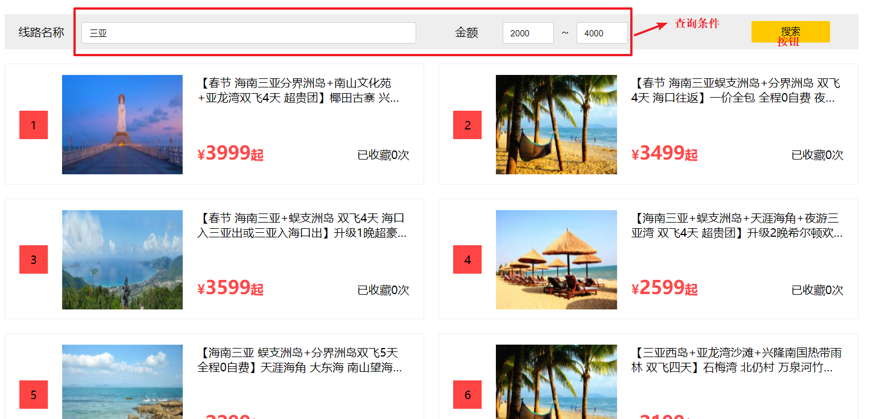


##### 6.1.2 加载方式

~~~
点击搜索按钮时候发送请求，查询数据
~~~

##### 6.1.3 页面操作

~~~
搜索按钮
~~~

##### 6.1.4 约束条件

~~~
1.金额不能为负数
2.最小和最大值，最大金额必须要大于最小金额
~~~

##### 6.1.5 页面跳转

没有跳转

##### 6.1.6 接口详情

###### 请求路径

http://localhost:8080/route/favoriteRankByPageAndCondition

###### 请求方式

post:

content-Type : appliation/json

###### 方法信息

接口类信息：com.itheima.travel.web.RouteController

方法名：favoriteRankByPageAndCondition

###### 请求参数

~~~json
{
    pageSize:6,
    currentPage:1,
    rname:"三亚",
    minPrice:2000,
    maxPrice:4000
}
~~~


###### 返回信息

~~~
{
    code:200,
    msg:"操作成功",
    operationTime:"2020-12-23 12:00:00",
    data:{
        count:6,
        list:[{
			"rid": 134,
			"rname": "【春节 海南三亚分界洲岛+南山文化苑+亚龙湾双飞4天 超贵团】椰田古寨 兴隆南国热带雨林【祈福南山 邂逅美女岛 品尝美食大餐】",
			"price": 3999.0,
			"routeIntroduce": "全程升级超豪华酒店；品海南四大名菜、海鲜餐、琼海温泉鹅、南山禅悦苑素斋！",
			"rflag": "1",
			"rdate": "2018-02-09 01:13:32",
			"isThemeTour": "0",
			"count": 0,
			"cid": 5,
			"rimage": "img/product/small/m339fc97b006caec2baf3ca8ff462c0c1c.jpg",
			"sid": 1,
			"sourceId": "20955",
			"category": null,
			"seller": null,
			"routeImgList": null
		}, {
			"rid": 172,
			"rname": "【春节 海南三亚蜈支洲岛+分界洲岛 双飞4天 海口往返】一价全包 全程0自费 夜游三亚湾 南山观音祈福【经典皇牌 至尊双岛】",
			"price": 3499.0,
			"routeIntroduce": "赠送价值200元/人夜游三亚湾，乘坐游船畅游美丽的三亚湾；与激情沙滩吧，聚首狂欢，独享自在海岛风情；",
			"rflag": "1",
			"rdate": "2018-02-09 01:13:37",
			"isThemeTour": "0",
			"count": 0,
			"cid": 5,
			"rimage": "img/product/small/m31bb179bb190f2077ff0bafa3f46eb591.jpg",
			"sid": 1,
			"sourceId": "20029",
			"category": null,
			"seller": null,
			"routeImgList": null
		}, {
			"rid": 181,
			"rname": "【春节 海南三亚+蜈支洲岛 双飞4天 海口入三亚出或三亚入海口出】升级1晚超豪华酒店 体验价值298元/人的沙滩项目",
			"price": 3599.0,
			"routeIntroduce": "全程豪华酒店，升级一晚超豪华酒店；独家定制沙滩项目：体验价值298元/人的沙滩项目：海上自行车、沙滩排球、沙滩足球、独木舟、冲浪板、蹦床等",
			"rflag": "1",
			"rdate": "2018-02-09 01:13:38",
			"isThemeTour": "0",
			"count": 0,
			"cid": 5,
			"rimage": "img/product/small/m3fd7637f5a1a26457acf474e1b6e19504.jpg",
			"sid": 1,
			"sourceId": "19937",
			"category": null,
			"seller": null,
			"routeImgList": null
		}, {
			"rid": 182,
			"rname": "【海南三亚+蜈支洲岛+天涯海角+夜游三亚湾 双飞4天 超贵团】升级2晚希尔顿欢朋酒店 升级1餐海鲜风味大餐",
			"price": 2599.0,
			"routeIntroduce": "全程超豪华酒店，三亚两晚国际品牌-希尔顿欢朋酒店（若满房则安排备选酒店）；赠送升级1餐海鲜风味大餐！",
			"rflag": "1",
			"rdate": "2018-02-09 01:13:38",
			"isThemeTour": "0",
			"count": 0,
			"cid": 5,
			"rimage": "img/product/small/m3cc0ae9ebf1a693d03ec69d94a5b79a75.jpg",
			"sid": 1,
			"sourceId": "19851",
			"category": null,
			"seller": null,
			"routeImgList": null
		}, {
			"rid": 459,
			"rname": "【海南三亚 蜈支洲岛+分界洲岛双飞5天 全程0自费】天涯海角 大东海 南山望海观音 2晚入住海景房 品疍家海鲜火锅【超贵团】",
			"price": 2299.0,
			"routeIntroduce": "3晚入住豪华酒店，琼海升级1晚超豪华酒店，其中2晚升级入住海景房。",
			"rflag": "1",
			"rdate": "2018-02-09 01:14:11",
			"isThemeTour": "0",
			"count": 0,
			"cid": 5,
			"rimage": "img/product/small/m3ab024d539778cfee109fddf4e08a31fd.jpg",
			"sid": 1,
			"sourceId": "21716",
			"category": null,
			"seller": null,
			"routeImgList": null
		}, {
			"rid": 509,
			"rname": "【三亚西岛+亚龙湾沙滩+兴隆南国热带雨林 双飞四天】石梅湾 北仍村 万泉河竹筏漂流【贵宾团】",
			"price": 2199.0,
			"routeIntroduce": "全程入住豪华酒！店指定南航，博鳌往返；优选海南热门景点：万泉河竹筏漂流、兴隆南国热带雨林、西岛、石梅湾、亚龙湾海滩等。",
			"rflag": "1",
			"rdate": "2018-02-09 01:14:16",
			"isThemeTour": "1",
			"count": 0,
			"cid": 5,
			"rimage": "img/product/small/m31bb179bb190f2077ff0bafa3f46eb591.jpg",
			"sid": 1,
			"sourceId": "22830",
			"category": null,
			"seller": null,
			"routeImgList": null
		}]
    }
    webSite:""
}
~~~


###### 业务逻辑

~~~
1.分页查询
2.根据收藏次数进行排序
3.sql语句要使用动态sql
~~~


