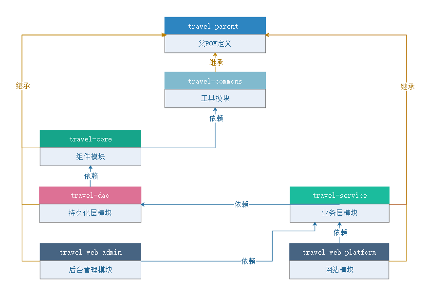
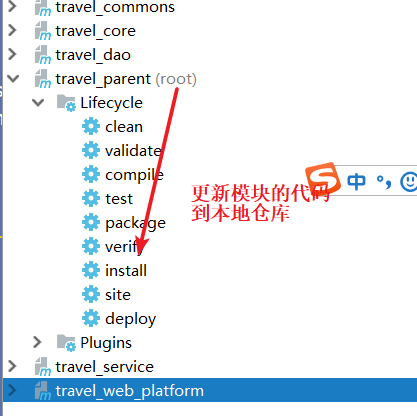
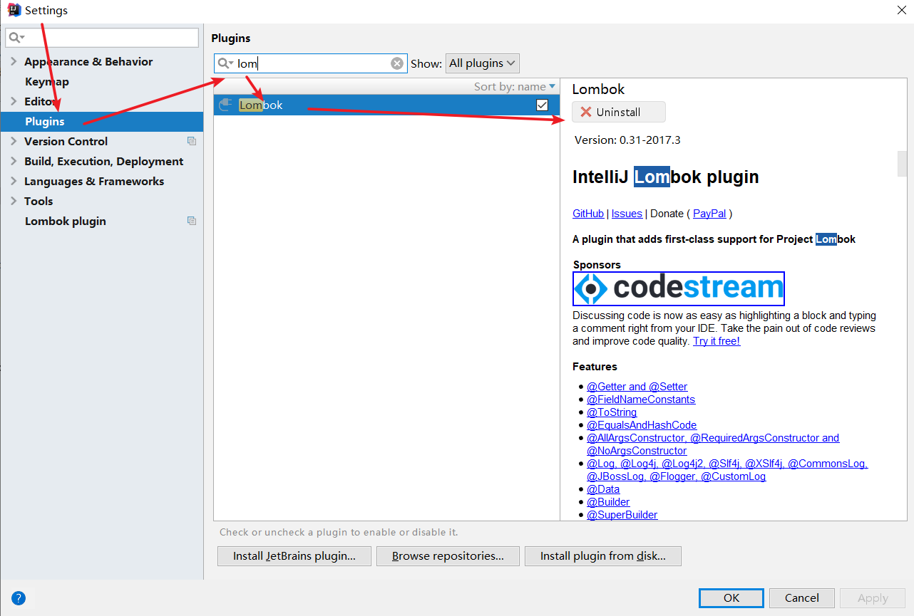
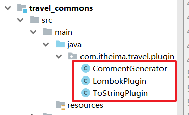
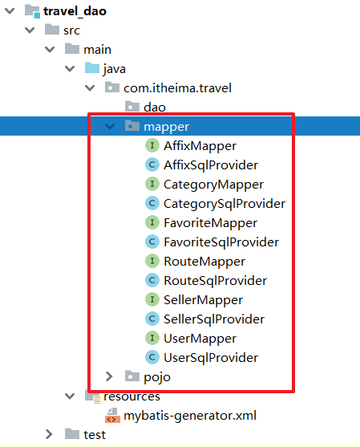
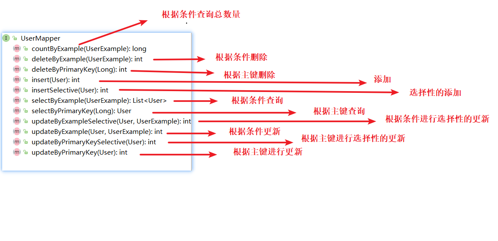

# 黑马旅游笔记

# 1.项目搭建

## 1.1 模块构建




~~~
创建项目
travel-parent： 父工程
travel-commons: 通用模块
travel-core:  框架集成
travel-dao: dao层
travel-service: 业务层
travel-web-platform: controller层

~~~


## 1.2 构建模块间依赖

模块间的依赖管理如上图

~~~
1.父工程统一声明所有子模块的版本
2.根据图构建模块之间的依赖关系
~~~

1.父工程统一声明所有子模块的版本

```xml
<properties>
     <project.build.sourceEncoding>UTF-8</project.build.sourceEncoding>
     <!-- 管理模块的版本号-->
     <travel.version>1.0-SNAPSHOT</travel.version>
 </properties>

 <!--
    父工程中统一声明子模块的版本号
-->
 <dependencyManagement>
     <dependencies>
         <dependency>
             <groupId>com.itheima.travel</groupId>
             <artifactId>travel_commons</artifactId>
             <version>${travel.version}</version>
         </dependency>
         <dependency>
             <groupId>com.itheima.travel</groupId>
             <artifactId>travel_service</artifactId>
             <version>${travel.version}</version>
         </dependency>
         <dependency>
             <groupId>com.itheima.travel</groupId>
             <artifactId>travel_dao</artifactId>
             <version>${travel.version}</version>
         </dependency>
         <dependency>
             <groupId>com.itheima.travel</groupId>
             <artifactId>travel_core</artifactId>
             <version>${travel.version}</version>
         </dependency>
         <dependency>
             <groupId>com.itheima.travel</groupId>
             <artifactId>travel_web_platform</artifactId>
             <version>${travel.version}</version>
         </dependency>
     </dependencies>
 </dependencyManagement>
```

2.根据图构建模块之间的依赖关系

例如：

core依赖于commons

~~~xml
  <dependencies>
        <!-- core依赖commons-->
        <dependency>
            <groupId>com.itheima.travel</groupId>
            <artifactId>travel_commons</artifactId>
        </dependency>
    </dependencies>
~~~

3.测试模块


# 2基础集成

## 2.1 travel_parent

**注意：对于模块的声明，校验模块的坐标是否和你们自己的一致。**

~~~
父工程：
1.统一管理所有的依赖版本
2.统一管理插件的版本
~~~

```xml
<?xml version="1.0" encoding="UTF-8"?>
<project xmlns="http://maven.apache.org/POM/4.0.0"
         xmlns:xsi="http://www.w3.org/2001/XMLSchema-instance"
         xsi:schemaLocation="http://maven.apache.org/POM/4.0.0 http://maven.apache.org/xsd/maven-4.0.0.xsd">
    <modelVersion>4.0.0</modelVersion>

    <groupId>com.itheima.travel</groupId>
    <artifactId>travel_parent</artifactId>
    <packaging>pom</packaging>
    <version>1.0-SNAPSHOT</version>
    <modules>
        <module>travel_commons</module>
        <module>travel_core</module>
        <module>travel_dao</module>
        <module>travel_service</module>
        <module>travel_web_platform</module>
    </modules>


    <properties>
        <project.build.sourceEncoding>UTF-8</project.build.sourceEncoding>
        <!-- 管理模块的版本号-->
        <travel.version>1.0-SNAPSHOT</travel.version>

        <!--servlet版本-->
        <servlet.version>4.0.1</servlet.version>
        <!--spring 版本-->
        <spring.version>5.2.0.RELEASE</spring.version>

        <!--mysql驱动版本-->
        <mysql.version>5.1.30</mysql.version>
        <!--druid版本-->
        <druid.version>1.0.29</druid.version>
        <!-- mybatis版本 -->
        <mybatis.version>3.5.5</mybatis.version>
        <!-- mybatis-spring整合包版本 -->
        <mybatis.spring.version>2.0.5</mybatis.spring.version>
        <!--generator-->
        <mybatis-generator.version>1.3.5</mybatis-generator.version>
        <!--pagehelper-->
        <pagehelper.version>5.1.11</pagehelper.version>

        <!--jackson版本-->
        <jackson.version>2.9.0</jackson.version>
        <!--fastJson-->
        <fastjson.version>1.2.47</fastjson.version>
        <!-- 日志版本 -->
        <log4j.version>2.8.2</log4j.version>
        <!--lombok-->
        <lombok.version>1.16.20</lombok.version>
        <!--文件上传-->
        <commons-fileupload>1.4</commons-fileupload>
        <!--lang3-->
        <commons.lang3.version>3.8.1</commons.lang3.version>
        <!--commons-beanutils-->
        <commons-beanutils.version>1.8.3</commons-beanutils.version>
        <!--commons-codec-->
        <commons-codec.version>1.8</commons-codec.version>
        <!--swagger2版本支持-->
        <swagger2>2.10.5</swagger2>
        <!--redisson版本-->
        <redisson.version>3.11.5</redisson.version>
    </properties>


    <dependencies>
        <dependency>
            <groupId>junit</groupId>
            <artifactId>junit</artifactId>
            <version>4.12</version>
            <scope>test</scope>
        </dependency>
        <!--lombok-->
        <dependency>
            <groupId>org.projectlombok</groupId>
            <artifactId>lombok</artifactId>
            <version>${lombok.version}</version>
        </dependency>

        <dependency>
            <groupId>org.springframework</groupId>
            <artifactId>spring-test</artifactId>
            <version>${spring.version}</version>
            <scope>test</scope>
        </dependency>
    </dependencies>
    <!--
       父工程中统一声明子模块的版本号
   -->
    <dependencyManagement>
        <dependencies>
            <dependency>
                <groupId>com.itheima.travel</groupId>
                <artifactId>travel_commons</artifactId>
                <version>${travel.version}</version>
            </dependency>
            <dependency>
                <groupId>com.itheima.travel</groupId>
                <artifactId>travel_service</artifactId>
                <version>${travel.version}</version>
            </dependency>
            <dependency>
                <groupId>com.itheima.travel</groupId>
                <artifactId>travel_dao</artifactId>
                <version>${travel.version}</version>
            </dependency>
            <dependency>
                <groupId>com.itheima.travel</groupId>
                <artifactId>travel_core</artifactId>
                <version>${travel.version}</version>
            </dependency>
            <dependency>
                <groupId>com.itheima.travel</groupId>
                <artifactId>travel_web_platform</artifactId>
                <version>${travel.version}</version>
            </dependency>

            <!-- 依赖版本 -->
            <!--servlet 容器依赖-->
            <dependency>
                <groupId>javax.servlet</groupId>
                <artifactId>javax.servlet-api</artifactId>
                <version>${servlet.version}</version>
                <scope>provided</scope>
            </dependency>

            <!--spring 容器依赖-->
            <dependency>
                <groupId>org.springframework</groupId>
                <artifactId>spring-context</artifactId>
                <version>${spring.version}</version>
            </dependency>

            <!--spring aop依赖-->
            <dependency>
                <groupId>org.springframework</groupId>
                <artifactId>spring-aspects</artifactId>
                <version>${spring.version}</version>
            </dependency>

            <!--spring mvc容器依赖-->
            <dependency>
                <groupId>org.springframework</groupId>
                <artifactId>spring-webmvc</artifactId>
                <version>${spring.version}</version>
            </dependency>

            <!-- mysql驱动依赖 -->
            <dependency>
                <groupId>mysql</groupId>
                <artifactId>mysql-connector-java</artifactId>
                <version>${mysql.version}</version>
            </dependency>

            <!--spring-jdbc依赖-->
            <dependency>
                <groupId>org.springframework</groupId>
                <artifactId>spring-jdbc</artifactId>
                <version>${spring.version}</version>
            </dependency>

            <!--druid依赖-->
            <dependency>
                <groupId>com.alibaba</groupId>
                <artifactId>druid</artifactId>
                <version>${druid.version}</version>
            </dependency>

            <!--mybatis依赖-->
            <dependency>
                <groupId>org.mybatis</groupId>
                <artifactId>mybatis</artifactId>
                <version>${mybatis.version}</version>
            </dependency>

            <!--mybatis-spring依赖-->
            <dependency>
                <groupId>org.mybatis</groupId>
                <artifactId>mybatis-spring</artifactId>
                <version>${mybatis.spring.version}</version>
            </dependency>

            <!-- 分页插件 -->
            <dependency>
                <groupId>com.github.pagehelper</groupId>
                <artifactId>pagehelper</artifactId>
                <version>${pagehelper.version}</version>
            </dependency>

            <dependency>
                <groupId>org.mybatis.generator</groupId>
                <artifactId>mybatis-generator-core</artifactId>
                <version>${mybatis-generator.version}</version>
            </dependency>

            <!--jackson依赖包-->
            <dependency>
                <groupId>com.fasterxml.jackson.core</groupId>
                <artifactId>jackson-core</artifactId>
                <version>${jackson.version}</version>
            </dependency>
            <dependency>
                <groupId>com.fasterxml.jackson.core</groupId>
                <artifactId>jackson-databind</artifactId>
                <version>${jackson.version}</version>
            </dependency>
            <dependency>
                <groupId>com.fasterxml.jackson.core</groupId>
                <artifactId>jackson-annotations</artifactId>
                <version>${jackson.version}</version>
            </dependency>

            <!--fastjson依赖包-->
            <dependency>
                <groupId>com.alibaba</groupId>
                <artifactId>fastjson</artifactId>
                <version>${fastjson.version}</version>
            </dependency>

            <!-- log4j2驱动依赖 -->
            <dependency>
                <groupId>org.apache.logging.log4j</groupId>
                <artifactId>log4j-api</artifactId>
                <version>${log4j.version}</version>
            </dependency>

            <dependency>
                <groupId>org.apache.logging.log4j</groupId>
                <artifactId>log4j-core</artifactId>
                <version>${log4j.version}</version>
            </dependency>

            <dependency>
                <groupId>org.apache.logging.log4j</groupId>
                <artifactId>log4j-web</artifactId>
                <version>${log4j.version}</version>
            </dependency>


            <!--文件上传-->
            <dependency>
                <groupId>commons-fileupload</groupId>
                <artifactId>commons-fileupload</artifactId>
                <version>${commons-fileupload}</version>
            </dependency>

            <!--工具包-->
            <dependency>
                <groupId>org.apache.commons</groupId>
                <artifactId>commons-lang3</artifactId>
                <version>${commons.lang3.version}</version>
            </dependency>

            <dependency>
                <groupId>commons-codec</groupId>
                <artifactId>commons-codec</artifactId>
                <version>${commons-codec.version}</version>
            </dependency>

            <dependency>
                <groupId>commons-beanutils</groupId>
                <artifactId>commons-beanutils</artifactId>
                <version>${commons-beanutils.version}</version>
            </dependency>
        </dependencies>
    </dependencyManagement>


    <build>
        <plugins>
            <!-- java编译插件 -->
            <plugin>
                <groupId>org.apache.maven.plugins</groupId>
                <artifactId>maven-compiler-plugin</artifactId>
                <version>3.2</version>
                <configuration>
                    <source>1.8</source>
                    <target>1.8</target>
                </configuration>
            </plugin>
            <!-- maven-surefire-plugin 测试包 -->
            <plugin>
                <groupId>org.apache.maven.plugins</groupId>
                <artifactId>maven-surefire-plugin</artifactId>
                <version>2.4.2</version>
                <configuration>
                    <!-- 全局是否执行maven生命周期中的测试：是否跳过测试 -->
                    <skipTests>true</skipTests>
                    <!-- 解决测试中文乱码-->
                    <forkMode>once</forkMode>
                    <argLine>-Dfile.encoding=UTF-8</argLine>
                </configuration>
            </plugin>
        </plugins>
        <pluginManagement>
            <plugins>
                <!-- 声明打包时，不需要web.xml -->
                <plugin>
                    <groupId>org.apache.maven.plugins</groupId>
                    <artifactId>maven-war-plugin</artifactId>
                    <version>2.4</version>
                </plugin>
                <!-- tomcat7插件,命令： mvn tomcat7:run -DskipTests -->
                <plugin>
                    <groupId>org.apache.tomcat.maven</groupId>
                    <artifactId>tomcat7-maven-plugin</artifactId>
                    <version>2.2</version>
                </plugin>
                <!-- mybatis插件 -->
                <plugin>
                    <groupId>org.mybatis.generator</groupId>
                    <artifactId>mybatis-generator-maven-plugin</artifactId>
                    <version>1.3.5</version>
                </plugin>
            </plugins>
        </pluginManagement>
    </build>
</project>
```


## 2.2 travel-core的集成

~~~
步骤：
1.引入相关的依赖
2.纯注解开发
~~~

travel-core引入相关依赖

~~~xml
 <!--servlet 容器依赖-->
    <dependency>
        <groupId>javax.servlet</groupId>
        <artifactId>javax.servlet-api</artifactId>
        <scope>provided</scope>
    </dependency>

    <!--spring 容器依赖-->
    <dependency>
        <groupId>org.springframework</groupId>
        <artifactId>spring-context</artifactId>
    </dependency>

    <!--spring aop依赖-->
    <dependency>
        <groupId>org.springframework</groupId>
        <artifactId>spring-aspects</artifactId>
    </dependency>

    <!--spring mvc容器依赖-->
    <dependency>
        <groupId>org.springframework</groupId>
        <artifactId>spring-webmvc</artifactId>
    </dependency>

    <!-- mysql驱动依赖 -->
    <dependency>
        <groupId>mysql</groupId>
        <artifactId>mysql-connector-java</artifactId>
    </dependency>

    <!--spring-jdbc依赖-->
    <dependency>
        <groupId>org.springframework</groupId>
        <artifactId>spring-jdbc</artifactId>
    </dependency>

    <!--druid依赖-->
    <dependency>
        <groupId>com.alibaba</groupId>
        <artifactId>druid</artifactId>
    </dependency>

    <!--mybatis依赖-->
    <dependency>
        <groupId>org.mybatis</groupId>
        <artifactId>mybatis</artifactId>
    </dependency>

    <!--mybatis-spring依赖-->
    <dependency>
        <groupId>org.mybatis</groupId>
        <artifactId>mybatis-spring</artifactId>
    </dependency>

    <!-- 分页插件 -->
    <dependency>
        <groupId>com.github.pagehelper</groupId>
        <artifactId>pagehelper</artifactId>
    </dependency>

    <!--fastjson依赖包-->
    <dependency>
        <groupId>com.alibaba</groupId>
        <artifactId>fastjson</artifactId>
    </dependency>

    <!-- log4j2驱动依赖 -->
    <dependency>
        <groupId>org.apache.logging.log4j</groupId>
        <artifactId>log4j-api</artifactId>
    </dependency>

    <dependency>
        <groupId>org.apache.logging.log4j</groupId>
        <artifactId>log4j-core</artifactId>
    </dependency>

    <dependency>
        <groupId>org.apache.logging.log4j</groupId>
        <artifactId>log4j-web</artifactId>
    </dependency>


    <!--文件上传-->
    <dependency>
        <groupId>commons-fileupload</groupId>
        <artifactId>commons-fileupload</artifactId>
    </dependency>

    <!--工具包-->
    <dependency>
        <groupId>org.apache.commons</groupId>
        <artifactId>commons-lang3</artifactId>
    </dependency>

    <dependency>
        <groupId>commons-codec</groupId>
        <artifactId>commons-codec</artifactId>
    </dependency>

    <dependency>
        <groupId>commons-beanutils</groupId>
        <artifactId>commons-beanutils</artifactId>
    </dependency>
~~~

纯注解开发：

~~~
1.在travel-core中创建包结构com.itheima.travel.config
2.复制4个配置类
3.检查4个配置类的配置内容是否需要不全
	mybait配置扫描的dao层的包需要创建出来
	springmvc扫描的controller包需要创建
	mybatis中加载的外部配置需要创建jdbc.properties
4.在controller中编写handler进行测试
5.测试之前，因为动了其他模块的代码，所以需要在父工程中点击install按钮，更新代码到本地仓库，然后再启动web工程
~~~

模块结构：


1.在travel-core中创建包结构com.itheima.travel.config

2.复制4个配置类

spring的配置

```java
package com.itheima.travel.config;

import org.springframework.context.annotation.*;
import org.springframework.stereotype.Controller;
import org.springframework.transaction.annotation.EnableTransactionManagement;

@Configuration //声明当前类是一个配置类
@ComponentScan(value = "com.itheima",
        excludeFilters = @ComponentScan.Filter(Controller.class)) //注解扫描，排除注解Controller
@PropertySource("classpath:jdbc.properties") //加载外部配置
@Import(MyBatisConfig.class)
@EnableTransactionManagement //开启注解事务
@EnableAspectJAutoProxy //开启注解aop
public class SpringConfig {
}
```

spring整合mybatis的配置

```java
package com.itheima.travel.config;

import com.alibaba.druid.pool.DruidDataSource;
import org.apache.ibatis.session.Configuration;
import org.apache.ibatis.session.SqlSessionFactory;
import org.mybatis.spring.SqlSessionFactoryBean;
import org.mybatis.spring.annotation.MapperScan;
import org.springframework.beans.factory.annotation.Qualifier;
import org.springframework.beans.factory.annotation.Value;
import org.springframework.context.annotation.Bean;
import org.springframework.jdbc.datasource.DataSourceTransactionManager;
import org.springframework.transaction.annotation.Transactional;

import javax.sql.DataSource;


@MapperScan(basePackages = "com.itheima.travel.dao",sqlSessionFactoryRef ="sqlSessionFactory" )
public class MyBatisConfig {

    @Value("${jdbc.password}")
    private String password;

    @Value("${jdbc.url}")
    private String url;

    @Value("${jdbc.username}")
    private String username;

    @Value("${jdbc.driverClass}")
    private String driverClassName;


    @Bean
    public DataSource dataSource(){

        DruidDataSource dataSource = new DruidDataSource();
        dataSource.setPassword(password);
        dataSource.setUsername(username);
        dataSource.setDriverClassName(driverClassName);
        dataSource.setUrl(url);

        return dataSource;
    }


    /**
     * @Description 配置事务管理器
     * 细节：名称必须是：transactionManager，如果更换需要在使用时指定
     */
    @Bean("transactionManager")
    public DataSourceTransactionManager transactionManager(DataSource dataSource){
        return new DataSourceTransactionManager(dataSource);
    }


    @Bean
    public SqlSessionFactory sqlSessionFactory(DataSource dataSource){
        SqlSessionFactoryBean sqlSessionFactoryBean = new SqlSessionFactoryBean();

        //属性设置，设置数据源
        sqlSessionFactoryBean.setDataSource(dataSource);

        //设置包扫描
        sqlSessionFactoryBean.setTypeAliasesPackage("com.itheima.pojo");

        //设置configuration
        Configuration configuration = new Configuration();
        configuration.setMapUnderscoreToCamelCase(true);
        sqlSessionFactoryBean.setConfiguration(configuration);


        SqlSessionFactory sqlSessionFactory = null;
        try {
            //spring创建对象的第四种方式，实现FactroyBean接口，会调用getObject()方法创建对象
            sqlSessionFactory = sqlSessionFactoryBean.getObject();
        } catch (Exception e) {
            e.printStackTrace();
        }

        return sqlSessionFactory;
    }

}
```


springmvc的配置

```java
package com.itheima.travel.config;

import org.springframework.context.annotation.Bean;
import org.springframework.context.annotation.ComponentScan;
import org.springframework.web.multipart.commons.CommonsMultipartResolver;
import org.springframework.web.servlet.config.annotation.DefaultServletHandlerConfigurer;
import org.springframework.web.servlet.config.annotation.EnableWebMvc;
import org.springframework.web.servlet.config.annotation.WebMvcConfigurationSupport;
import org.springframework.web.servlet.view.InternalResourceViewResolver;

@ComponentScan("com.itheima.travel.controller") //包扫描
@EnableWebMvc  //开启注解驱动
public class SpringMVCConfig extends WebMvcConfigurationSupport {


    /**
     * @Description 文件上传
     */
    @Bean
    public CommonsMultipartResolver multipartResolver(){
        CommonsMultipartResolver multipartResolver = new CommonsMultipartResolver();
        multipartResolver.setDefaultEncoding("UTF-8");
        multipartResolver.setMaxUploadSize(104857600);
        multipartResolver.setMaxInMemorySize(4096);
        return multipartResolver;
    }


}
```

代替web.xml的配置

```java
package com.itheima.travel.config;

import org.springframework.web.filter.CharacterEncodingFilter;
import org.springframework.web.servlet.support.AbstractAnnotationConfigDispatcherServletInitializer;

import javax.servlet.FilterRegistration;
import javax.servlet.ServletContext;
import javax.servlet.ServletException;

public class WebProjectInitConfig extends AbstractAnnotationConfigDispatcherServletInitializer {


    @Override
    public void onStartup(ServletContext servletContext) throws ServletException {

        //注册过滤器
        FilterRegistration.Dynamic encodingFilter = servletContext.addFilter("characterEncodingFilter", new CharacterEncodingFilter());

        //配置过滤器的初始化参数
        encodingFilter.setInitParameter("encoding","utf-8");

        //配置过滤器的映射路径
        encodingFilter.addMappingForUrlPatterns(null,false,"/*");

        super.onStartup(servletContext);
    }

    //spring的配置类
    @Override
    protected Class<?>[] getRootConfigClasses() {
        return new Class[]{SpringConfig.class};
    }

    //springmvc的配置类
    @Override
    protected Class<?>[] getServletConfigClasses() {
        return new Class[]{SpringMVCConfig.class};
    }

    // 前端控制器DispatcherServlet的映射路径
    @Override
    protected String[] getServletMappings() {
        return new String[]{"/"};
    }
}
```

3.检查4个配置类的配置内容是否需要不全
	mybait配置扫描的dao层的包需要创建出来
	springmvc扫描的controller包需要创建
	mybatis中加载的外部配置需要创建jdbc.properties
4.在controller中编写handler进行测试

```java
package com.itheima.travel.controller;

import org.springframework.http.HttpStatus;
import org.springframework.stereotype.Controller;
import org.springframework.web.bind.annotation.RequestMapping;
import org.springframework.web.bind.annotation.ResponseStatus;

@Controller
@RequestMapping("/demo")
public class DemoController {

    @ResponseStatus(HttpStatus.OK) //没有任何响应体
    @RequestMapping("/demo")
    public void demo(){
        System.out.println("controller执行了");
    }
}
```

5.测试之前，因为动了其他模块的代码，所以需要在父工程中点击install按钮，更新代码到本地仓库，然后再启动web工程




测试结果：


## 2.3 mybatis逆向工程

~~~
步骤：
0.idea中安装plugins，lombok插件
1.需要在travel-dao层引入mybatis-generator相关的依赖和插件
2.需要mybatis-generator的核心配置
3.需要在travel-commons中引入mybatis-generator需要的工具类
4.先在travel-parent中执行install命令，然后再在travel-dao层执行generator插件。
~~~

0.idea中安装plugins，lombok插件



1.需要在travel-dao层引入mybatis-generator相关的依赖和插件

注意：这个插件依赖的工具类在travel_commons中，检查这个模块的坐标配置

```xml
<plugins>
    <!--代码生成器：mybatis-generator-maven-plugin-->
    <plugin>
        <groupId>org.mybatis.generator</groupId>
        <artifactId>mybatis-generator-maven-plugin</artifactId>
        <dependencies>
            <!--代码生成器：mysql依赖-->
            <dependency>
                <groupId>mysql</groupId>
                <artifactId>mysql-connector-java</artifactId>
                <version>${mysql.version}</version>
            </dependency>
            <!--代码生成器：mybatis-generator-core依赖-->
            <dependency>
                <groupId>org.mybatis.generator</groupId>
                <artifactId>mybatis-generator-core</artifactId>
                <version>1.3.5</version>
            </dependency>
            <!--代码生成器：自定义插件依赖-->
            <dependency>
                <groupId>com.itheima.travel</groupId>
                <artifactId>travel_commons</artifactId>
                <version>${travel.version}</version>
            </dependency>
        </dependencies>
        <executions>
            <execution>
                <id>Generate MyBatis Artifacts</id>
                <phase>package</phase>
                <goals>
                    <goal>generate</goal>
                </goals>
            </execution>
        </executions>
        <configuration>
            <!--允许移动生成的文件 -->
            <verbose>true</verbose>
            <!-- 是否覆盖 -->
            <overwrite>true</overwrite>
            <!-- 自动生成的配置 -->
            <configurationFile>
                src/main/resources/mybatis-generator.xml
            </configurationFile>
        </configuration>
    </plugin>
</plugins>
```

2.需要mybatis-generator的核心配置

mybatis的接口放在了mapper包下，需要改mybatis配置扫描的包


~~~
注意：此配置抄写过来，一般需要手动改写的配置
1.mysql驱动的位置
2.mysql连接配置
3.生成的实体位置
4.xml方式的话，注意映射文件的位置
5.mapper接口的位置
6.表明和实体名的映射
~~~


```xml
<?xml version="1.0" encoding="UTF-8"?>
<!DOCTYPE generatorConfiguration
        PUBLIC "-//mybatis.org//DTD MyBatis Generator Configuration 1.0//EN"
        "http://mybatis.org/dtd/mybatis-generator-config_1_0.dtd">

<generatorConfiguration>
    <!--导入mysql的驱动-->
    <classPathEntry
            location="E:\maven\apache-maven-3.5.2-bin\apache-maven-3.5.2\repository\mysql\mysql-connector-java\5.1.38\mysql-connector-java-5.1.38.jar"/>

    <!-- context 是逆向工程的主要配置信息 -->
    <!-- id：起个名字 -->
    <!-- targetRuntime：设置生成的文件适用于那个 mybatis 版本 -->
    <context id="default" targetRuntime="MyBatis3">

        <!-- 数据库注释,数据库注释到实体的乱码 -->
        <!--<property name="javaFileEncoding" value="UTF-8"/>-->
        <!--  插件-->
        <!--  帮助实体类生成toString方法的  -->
        <plugin type="com.itheima.travel.plugin.ToStringPlugin"/>
        <!-- 帮助生成的实体类，采用lombok注解 -->
        <plugin type="com.itheima.travel.plugin.LombokPlugin"/>
        <!-- 序列化-->
        <plugin type="org.mybatis.generator.plugins.SerializablePlugin"/>

        <!-- 根据数据库列的注释，生成的实体的属性也会自动添加注释 -->
        <commentGenerator type="com.itheima.travel.plugin.CommentGenerator">
            <property name="suppressAllComments" value="false"/>
        </commentGenerator>

        <!--optional,旨在创建class时，对注释进行控制-->
        <!--<commentGenerator>-->
        <!--<property name="suppressDate" value="false" />-->
        <!--&lt;!&ndash; 是否去除自动生成的注释 true：是 ： false:否 &ndash;&gt;-->
        <!--<property name="suppressAllComments" value="true" />-->
        <!--</commentGenerator>-->

        <!--jdbc的数据库连接-->
        <jdbcConnection driverClass="com.mysql.jdbc.Driver"
                        connectionURL="jdbc:mysql://127.0.0.1:3306/spring-travel"
                        userId="root"
                        password="root" />

        <!--非必须，类型处理器，在数据库类型和java类型之间的转换控制-->
        <javaTypeResolver>
            <!-- 默认情况下数据库中的 decimal，bigInt 在 Java 对应是 sql 下的 BigDecimal 类 -->
            <!-- 不是 double 和 long 类型 -->
            <!-- 使用常用的基本类型代替 sql 包下的引用类型 -->
            <property name="forceBigDecimals" value="false" />
        </javaTypeResolver>

        <!-- targetPackage：生成的实体类所在的包 -->
        <!-- targetProject：生成的实体类所在的硬盘位置 -->
        <javaModelGenerator targetPackage="com.itheima.travel.pojo"
                            targetProject="src/main/java">
            <property name="javaFileEncoding" value="UTF-8"/>
            <!-- 是否允许子包 -->
            <property name="enableSubPackages" value="false" />
            <!-- 是否对modal添加构造函数 -->
            <property name="constructorBased" value="false" />
            <!-- 是否清理从数据库中查询出的字符串左右两边的空白字符 -->
            <property name="trimStrings" value="true" />
            <!-- 建立modal对象是否不可改变 即生成的modal对象不会有setter方法，只有构造方法 -->
            <property name="immutable" value="false" />
        </javaModelGenerator>

        <!-- targetPackage 和 targetProject：生成的 mapper 文件的包和位置 -->
        <sqlMapGenerator targetPackage="sqlMapper"
                         targetProject="src/main/resources">
            <!-- 针对数据库的一个配置，是否把 schema 作为字包名 -->
            <property name="enableSubPackages" value="false" />
        </sqlMapGenerator>

        <!-- targetPackage 和 targetProject：生成的 interface 文件的包和位置 XMLMAPPER：生成XML方式，ANNOTATEDMAPPER：生成注解方式-->
        <javaClientGenerator type="ANNOTATEDMAPPER"
                             targetPackage="com.itheima.travel.mapper" targetProject="src/main/java">
            <!-- 针对 oracle 数据库的一个配置，是否把 schema 作为字包名 -->
            <property name="enableSubPackages" value="false" />
        </javaClientGenerator>

        <!-- 所有表与实体名的映射 -->
        <table tableName="tab_affix" domainObjectName="Affix">
            <generatedKey column="id" sqlStatement="MySql" identity="true"/>
        </table>

        <table tableName="tab_category" domainObjectName="Category" >
            <generatedKey column="id" sqlStatement="MySql" identity="true"/>
        </table>

        <table tableName="tab_favorite" domainObjectName="Favorite">
            <generatedKey column="id" sqlStatement="MySql" identity="true"/>
        </table>

        <table tableName="tab_seller" domainObjectName="Seller">
            <generatedKey column="id" sqlStatement="MySql" identity="true"/>
        </table>

        <table tableName="tab_user" domainObjectName="User">
            <generatedKey column="id" sqlStatement="MySql" identity="true"/>
        </table>

        <table tableName="tab_route" domainObjectName="Route">
            <generatedKey column="id" sqlStatement="MySql" identity="true"/>
        </table>

    </context>
</generatorConfiguration>
```

3.需要在travel-commons中引入mybatis-generator需要的工具类和依赖


```xml
<dependencies>

        <!-- log4j2驱动依赖 -->

        <dependency>

            <groupId>org.apache.logging.log4j</groupId>

            <artifactId>log4j-api</artifactId>

        </dependency>
  
	<dependency>
        <groupId>org.apache.logging.log4j</groupId>
        <artifactId>log4j-core</artifactId>
    </dependency>

    <dependency>
        <groupId>org.apache.logging.log4j</groupId>
        <artifactId>log4j-web</artifactId>
    </dependency>
    <!--工具包-->
    <dependency>
        <groupId>org.apache.commons</groupId>
        <artifactId>commons-lang3</artifactId>
    </dependency>

    <dependency>
        <groupId>commons-beanutils</groupId>
        <artifactId>commons-beanutils</artifactId>
    </dependency>

    <dependency>
        <groupId>commons-codec</groupId>
        <artifactId>commons-codec</artifactId>
    </dependency>

    <dependency>
        <groupId>org.mybatis.generator</groupId>
        <artifactId>mybatis-generator-core</artifactId>
    </dependency>

    <!--jackson依赖包-->
    <dependency>
        <groupId>com.fasterxml.jackson.core</groupId>
        <artifactId>jackson-core</artifactId>
    </dependency>
    <dependency>
        <groupId>com.fasterxml.jackson.core</groupId>
        <artifactId>jackson-databind</artifactId>
    </dependency>
    <dependency>
        <groupId>com.fasterxml.jackson.core</groupId>
        <artifactId>jackson-annotations</artifactId>
    </dependency>
</dependencies>
```



4.先在travel-parent中执行install命令，然后再在travel-dao层执行generator插件。




## 2.4 逆向工程详解

mapper接口和接口需要的sql语句的提供类：


实体和查询条件的组装类。


Mybatis逆向工程的mapper接口详解：



选择性的（Selective）：


条件查询(ByExample):


测试类：

```java
package com.itheima.travel.mapper;

import com.itheima.travel.config.SpringConfig;
import com.itheima.travel.pojo.User;
import com.itheima.travel.pojo.UserExample;
import org.junit.Test;
import org.junit.runner.RunWith;
import org.springframework.beans.factory.annotation.Autowired;
import org.springframework.test.context.ContextConfiguration;
import org.springframework.test.context.junit4.SpringJUnit4ClassRunner;

import java.util.Date;
import java.util.List;

import static org.junit.Assert.*;

@RunWith(SpringJUnit4ClassRunner.class)
@ContextConfiguration(classes = SpringConfig.class)
public class UserMapperTest {

    @Autowired
    private UserMapper userMapper;

    @Test
    public void countByExample() {
    }

    @Test
    public void deleteByExample() {
    }

    @Test
    public void deleteByPrimaryKey() {
    }

    @Test
    public void insert() {
        //lombok的builder创建对象方式
        User user = User.builder()
                .username("zhangsan")
                .password("123")

                .sex("0")
                .realName("张三")
                .email("123@qq.com")
                .birthday(new Date())
                .build();
        userMapper.insert(user);
    }

    @Test
    public void insertSelective() {
        //lombok的builder创建对象方式
        User user = User.builder()
                .username("zhangsan")
                .password("123")
                .realName("张三")
                .email("123@qq.com")
                .build();
        userMapper.insertSelective(user);

    }

    @Test
    public void selectByExample() {

        //组装查询的条件
        UserExample userExample = new UserExample();
        userExample.setOrderByClause("sex desc"); // 性别排序
        userExample.createCriteria()
                .andUsernameLike("%shu%"); //用户名模糊查询
                //.andIdEqualTo(1l);//id等于1的

        List<User> userList = userMapper.selectByExample(userExample);
        for(User user:userList){
            System.out.println(user);
        }
    }

    @Test
    public void selectByPrimaryKey() {
        User user = userMapper.selectByPrimaryKey(1l);
        System.out.println(user);
    }

    @Test
    public void updateByExampleSelective() {
    }

    @Test
    public void updateByExample() {
    }

    @Test
    public void updateByPrimaryKeySelective() {
    }

    @Test
    public void updateByPrimaryKey() {
    }
}
```


# 3.业务层

## 3.1 vo和pojo

~~~
vo:view Object。表现层对象。
pojo:: 普通无规则对象。
dto:data transfer object.  数据传输对象。
po: 普通的持久化对象

为何需要这么划分实体？
问题：数据表有20个字段。
     pojo用于对应表，java中的数据持久化到数据库。
     页面展示：需要分页信息，pojo能封装吗？ 所以针对页面需要展示的数据，我们需要创建实体（VO）来封装。
     数据传输：但是我传输用户数据只需要传输5个字段。使用pojo可以传，但是其他15个字段在进行json字符串转换的时候也会转换，所以传输数据时这些数据也会传递，但是无意义。所以浪费字眼，影响性能，所以需要dto，只声明数据传输时需要的字段。

此处我们只是用vo和pojo.
~~~


小结：

~~~
web层需要使用Vo类型，
dao层需要使用pojo类型。
service涉及到vo和pojo的转换
~~~

## 3.2 用户模块业务

拷贝vo实体


实现步骤：

~~~
0.拷贝utils工具类到travel-commons模块
1.根据接口文档，编写service接口
2.编写service实现类，根据接口文档，实现接口中的方法
3.编写测试类，测试即可，注意通过@WebAppConfiguration 模拟web环境进行测试
~~~


0.拷贝utils工具类到travel-commons模块


1.根据接口文档，编写service接口

```java
package com.itheima.travel.service;

import com.itheima.travel.req.UserVo;

public interface UserService {

    /**
     *
     * @param userVo  请求中的数据封装成的vo类型
     * @return 注册成功与否
     */
    public boolean registerUser(UserVo userVo);

    /**
     *
     * @param userVo 包含用户名和密码
     * @return 登录成功与否
     */
    public boolean loginUser(UserVo userVo);

    /**
     *  退出
     */
    public void logoutUser();


    /**
     * 是否登录
     * @return
     */
    public boolean isLogin();
}
```

2.编写service实现类，根据接口文档，实现接口中的方法

```java
package com.itheima.travel.service.impl;

import com.itheima.travel.mapper.UserMapper;
import com.itheima.travel.pojo.User;
import com.itheima.travel.pojo.UserExample;
import com.itheima.travel.req.UserVo;
import com.itheima.travel.service.UserService;
import com.itheima.travel.utils.BeanConv;
import com.itheima.travel.utils.MD5Coder;
import org.springframework.beans.factory.annotation.Autowired;
import org.springframework.stereotype.Service;

import javax.servlet.http.HttpSession;
import java.util.List;

@Service  //创建service对象
public class UserServiceImpl implements UserService {

    @Autowired //依赖的自动注入
    private UserMapper userMapper;

    @Autowired
    private HttpSession session;

    @Override
    public boolean registerUser(UserVo userVo) {

        //属性拷贝，拷贝到User类型的对象中
        User user = BeanConv.toBean(userVo, User.class);

        //对原密码进行加密
        //加盐
        //user.setPassword(MD5Coder.md5Encode("ITHEIMA_"+user.getPassword()));
        user.setPassword(MD5Coder.md5Encode(user.getPassword()));

        //1.将数据保存到数据库
        int num = userMapper.insert(user);
        //2.自动登录的功能,将用户信息保存到session中
        if(num==1){
            String key = session.getId();
            session.setAttribute(key,user);
        }
        return num==1;
    }

    @Override
    public boolean loginUser(UserVo userVo) {

        //对密码进行加密
        userVo.setPassword(MD5Coder.md5Encode(userVo.getPassword()));

        //创建查询条件
        UserExample userExample = new UserExample();
        userExample.createCriteria()
                .andUsernameEqualTo(userVo.getUsername())
                .andPasswordEqualTo(userVo.getPassword());
        //查询
        List<User> list = userMapper.selectByExample(userExample);

        if(list.size()==1){
            //登录成功,用户信息保存到session
            session.setAttribute(session.getId(),list.get(0));
        }

        return list.size()==1;
    }

    @Override
    public void logoutUser() {

        //清空session
        session.invalidate();//销毁session
    }

    @Override
    public boolean isLogin() {

        //获取session中的用户信息
        Object user = session.getAttribute(session.getId());

        return user!=null;
    }
}

```

3.编写测试类，测试即可，注意通过@WebAppConfiguration 模拟web环境进行测试

```java
package com.itheima.travel.service;

import com.itheima.travel.config.SpringConfig;
import com.itheima.travel.req.UserVo;
import org.junit.Test;
import org.junit.runner.RunWith;
import org.springframework.beans.factory.annotation.Autowired;
import org.springframework.test.context.ContextConfiguration;
import org.springframework.test.context.junit4.SpringJUnit4ClassRunner;
import org.springframework.test.context.web.WebAppConfiguration;

import java.util.Date;

import static org.junit.Assert.*;

@RunWith(SpringJUnit4ClassRunner.class)
@ContextConfiguration(classes = SpringConfig.class)
@WebAppConfiguration //模拟web测试环境
public class UserServiceTest {


    @Autowired
    private UserService userService;
    @Test
    public void registerUser() {
        UserVo userVo = UserVo.builder()
                .telephone("12345612345")
                .sex("1")
                .realName("李四")
                .email("123@qq.com")
                .birthday(new Date())
                .username("lisi")
                .password("12345")
                .build();

        userService.registerUser(userVo);
    }

    @Test
    public void loginUser() {

        //判断是否登录
        boolean flag = userService.isLogin();
        System.out.println("此时登录状态:"+flag);


        //登录
        UserVo userVo = UserVo.builder()
                .username("lisi")
                .password("12345")
                .build();
        boolean flag2 = userService.loginUser(userVo);
        System.out.println("登录结果:"+flag2);

        //判断是否登录
        boolean flag3 = userService.isLogin();
        System.out.println("此时登录状态:"+flag3);

        //退出
        userService.logoutUser();

        //判断是否登录
        boolean flag4 = userService.isLogin();
        System.out.println("此时登录状态:"+flag4);

    }

    @Test
    public void logoutUser() {
    }

    @Test
    public void isLogin() {
    }
}
```


**md5介绍**

~~~
算法：一种运算规则，这种规则的反向规则，就对应了解密。
所以很多时候，我们希望更安全，不容易破解。
md5不可逆的。只能通过明文生成密文，无法通过密文推导明文。
~~~


## 3.3 分类模块

~~~
1.编写service
2.抽取公共测试配置类
3.其他配置类，继承公共测试配置类
~~~


1.编写service


```java
package com.itheima.travel.service;

import com.itheima.travel.req.CategoryVo;

import java.util.List;

public interface CategoryService {

    /**
     * 查询所有的类别信息
     * @return CategoryVo的集合
     */
    public List<CategoryVo> findAllCategories();
}
```


```java
package com.itheima.travel.service.impl;

import com.itheima.travel.mapper.CategoryMapper;
import com.itheima.travel.pojo.Category;
import com.itheima.travel.req.CategoryVo;
import com.itheima.travel.service.CategoryService;
import com.itheima.travel.utils.BeanConv;
import org.springframework.beans.factory.annotation.Autowired;
import org.springframework.stereotype.Service;

import java.util.List;

@Service
public class CategoryServiceImpl implements CategoryService {

    @Autowired
    private CategoryMapper categoryMapper;

    @Override
    public List<CategoryVo> findAllCategories() {

        //没有任何条件
        List<Category> categoryList = categoryMapper.selectByExample(null);

        //属性拷贝
        List<CategoryVo> categoryVoList = BeanConv.toBeanList(categoryList, CategoryVo.class);


        return categoryVoList;
    }
}
```


2.抽取公共测试配置类

```java
package com.itheima.travel.service;

import com.itheima.travel.config.SpringConfig;
import org.junit.runner.RunWith;
import org.springframework.beans.factory.annotation.Autowired;
import org.springframework.test.context.ContextConfiguration;
import org.springframework.test.context.junit4.SpringJUnit4ClassRunner;
import org.springframework.test.context.web.WebAppConfiguration;

@RunWith(SpringJUnit4ClassRunner.class)
@ContextConfiguration(classes = SpringConfig.class)
@WebAppConfiguration //模拟web测试环境
public abstract class TestConfig {

    @Autowired
    public UserService userService;

    @Autowired
    public CategoryService categoryService;
}
```

3.其他配置类，继承公共测试配置类


~~~java
package com.itheima.travel.service;

import com.itheima.travel.req.CategoryVo;
import org.junit.Test;

import java.util.List;

import static org.junit.Assert.*;

public class CategoryServiceTest extends TestConfig {

    @Test
    public void findAllCategories() {

        List<CategoryVo> categoryVoList = categoryService.findAllCategories();
        for(CategoryVo categoryVo:categoryVoList){
            System.out.println(categoryVo);
        }
    }
}
~~~


测试结果：


## 3.4 收藏模块

~~~
1.编写接口和实现类
2.添加扩展mapperExt
3.注意添加收藏需要添加事务
4.编写测试类

注意：针对于扩展的mapper接口，放在mapperExt包下，并且spring整合mybatis配置需要扫描扩展接口包
~~~

service模块：


dao模块：添加扩展mapper


core模块扫描扩展包


1.编写接口和实现类

```java
package com.itheima.travel.service;

import com.itheima.travel.req.FavoriteVo;

public interface FavoriteService {


    public void findMyFavorite();

    /**
     * 是否收藏
     * @param favoriteVo
     * @return
     */
    public boolean isFavorited(FavoriteVo favoriteVo);


    /**
     * 添加收藏
     * @param favoriteVo
     * @return 收藏成功后，收藏的次数
     */
    public int addFavorited(FavoriteVo favoriteVo);
}
```


2.添加扩展mapper


```java
package com.itheima.travel.mapperExt;

import org.apache.ibatis.annotations.Param;
import org.apache.ibatis.annotations.Update;

public interface RouteMapperExt {


    @Update("update tab_route set attention_count=attention_count+1 where id=#{routeId}")
    public int updateRouteAttentionCount(@Param("routeId") long routeId);
}
```


2.注意添加收藏需要添加事务

```java
package com.itheima.travel.service.impl;

import com.itheima.travel.mapper.FavoriteMapper;
import com.itheima.travel.mapper.RouteMapper;
import com.itheima.travel.mapperExt.RouteMapperExt;
import com.itheima.travel.pojo.Favorite;
import com.itheima.travel.pojo.FavoriteExample;
import com.itheima.travel.pojo.Route;
import com.itheima.travel.pojo.User;
import com.itheima.travel.req.FavoriteVo;
import com.itheima.travel.service.FavoriteService;
import org.springframework.beans.factory.annotation.Autowired;
import org.springframework.stereotype.Service;
import org.springframework.transaction.annotation.Transactional;

import javax.servlet.http.HttpSession;
import java.util.List;

@Service
public class FavoriteServiceImpl implements FavoriteService {

    @Autowired
    private HttpSession session;

    @Autowired
    private FavoriteMapper favoriteMapper;

    @Autowired
    private RouteMapperExt routeMapperExt;

    @Autowired
    private RouteMapper routeMapper;

    @Override
    public void findMyFavorite() {

    }

    @Override
    public boolean isFavorited(FavoriteVo favoriteVo) {


        /**
         * 此处的登录判断是多个地方都需要的，所以我们可以做登录拦截器,
         * 此处能进来，都表示拦截器放行。直接获取登录的用户信息。
         */
        User user= (User)session.getAttribute(session.getId());
//        if(user==null){
//            //未登录，也代表了未收藏，显示红色按钮
//            return  false;
//        }

        //根据用户的id和旅游线路的id去tab_favorite表查询数据
        FavoriteExample favoriteExample = new FavoriteExample();
        favoriteExample.createCriteria()
                .andUserIdEqualTo(user.getId())//当前登录的用户的id
                .andRouteIdEqualTo(favoriteVo.getRouteId()); //旅游线路的id，前端传递过来
        //查询
        List<Favorite> favoriteList = favoriteMapper.selectByExample(favoriteExample);

        return favoriteList.size()==1;
    }

    @Transactional //添加事务即可
    @Override
    public int addFavorited(FavoriteVo favoriteVo) {

        //1.修改tab_route表的attention_count字段
        routeMapperExt.updateRouteAttentionCount(favoriteVo.getRouteId());
        //2.向tab_favorite表添加一条数据
        //int i = 1/0;
        //获取登录的用户信息
        User user = (User) session.getAttribute(session.getId());

        Favorite favorite = new Favorite();
        favorite.setUserId(user.getId());
        favorite.setRouteId(favoriteVo.getRouteId());
        favoriteMapper.insert(favorite);

        //3.重新查询tab_route表的attention_count字段
        Route route = routeMapper.selectByPrimaryKey(favoriteVo.getRouteId());


        return route.getAttentionCount();
    }
}
```

3.编写测试类

```java
package com.itheima.travel.service;

import com.itheima.travel.req.FavoriteVo;
import com.itheima.travel.req.UserVo;
import org.junit.Before;
import org.junit.Test;

import static org.junit.Assert.*;

public class FavoriteServiceTest extends TestConfig {

    //所有测试方法之前执行，
    @Before
    public void login(){
        //登录
        UserVo userVo = UserVo.builder()
                .username("lisi")
                .password("12345")
                .build();
        boolean flag2 = userService.loginUser(userVo);


    }

    @Test
    public void findMyFavorite() {
    }

    @Test
    public void isFavorited() {

        FavoriteVo favoriteVo = FavoriteVo.builder()
                .routeId(1l)
                .build();
        //判断用户是否收藏
        boolean flag = favoriteService.isFavorited(favoriteVo);
        System.out.println("收藏的结果："+flag);
    }

    @Test
    public void addFavorited() {
        FavoriteVo favoriteVo = FavoriteVo.builder()
                .routeId(3l)
                .build();
        int attentionCount = favoriteService.addFavorited(favoriteVo);
        System.out.println("收藏后的次数："+attentionCount);
    }
}
```