目录3123315

[TOC]


## 学习目标

```html
1、按架构模块搭建分层构建项目
2、掌握各个模块的职能
3、掌握mybatis-generator的使用方法
4、掌握mybatis-generator自动生成mapper类的CURD；
5、掌握主键生成策略
```

## 第一章 项目结构

### 1、模块依赖关系

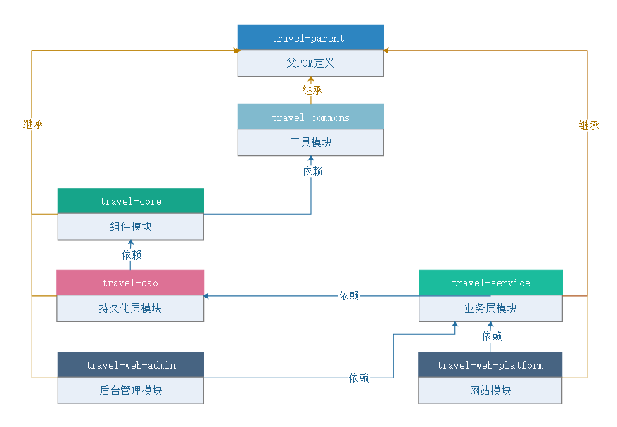

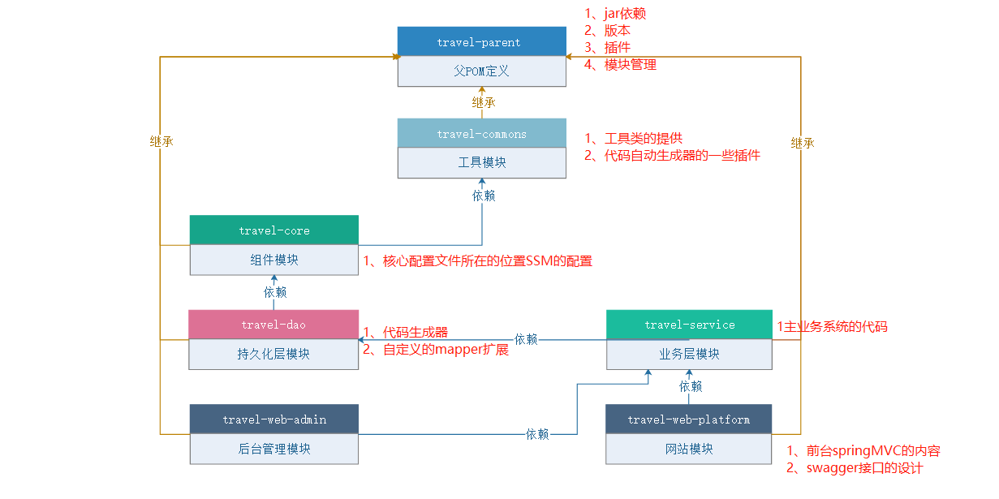

### 2、搭建过程

#### 【1】构建基础模块

##### 【1.1】travel-parent

磁盘中新建一个文件夹【E:\project-sk\itheima-travel-day02】，在idea中打开新的工作空间flie-->Open

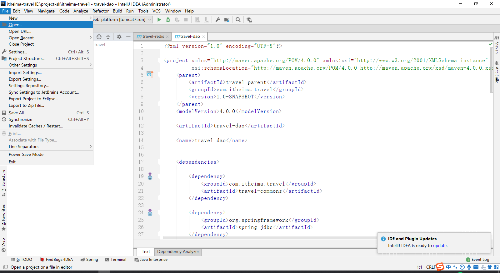

选择新的工作空间，右键New->modeule

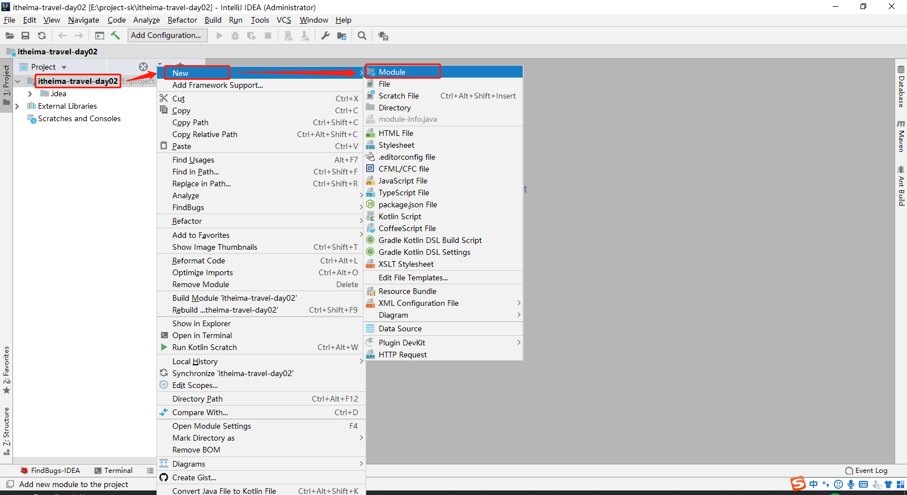

选择JDK，使用骨架生成一个jar项目

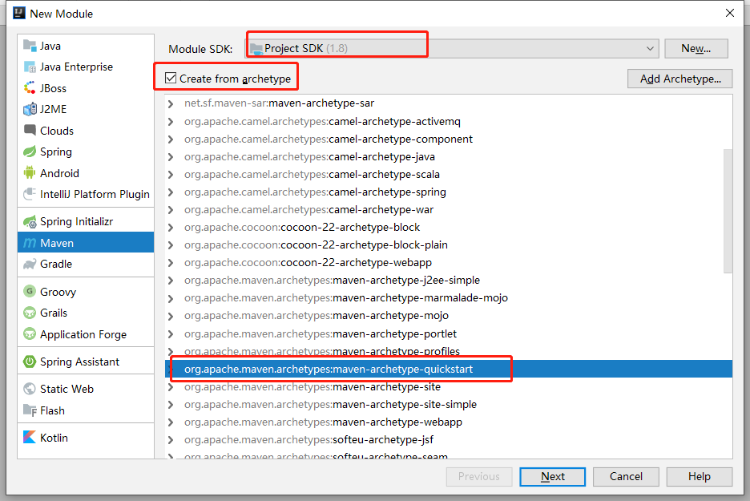

指定项目的坐标

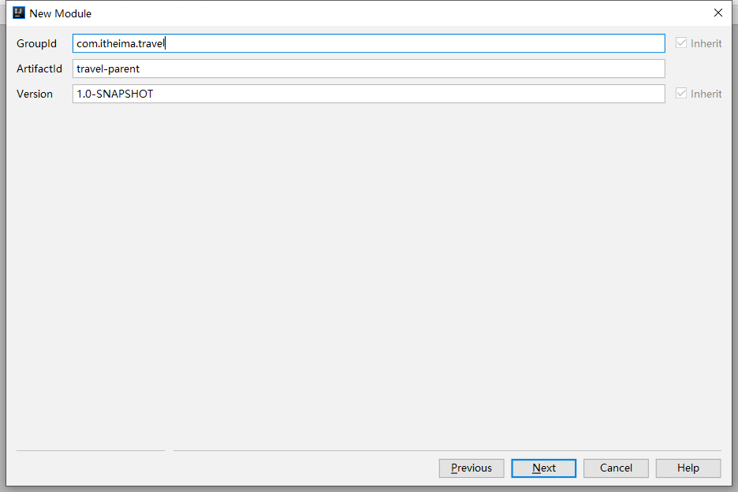

点击“Next”


修改module name 为 travel-parent

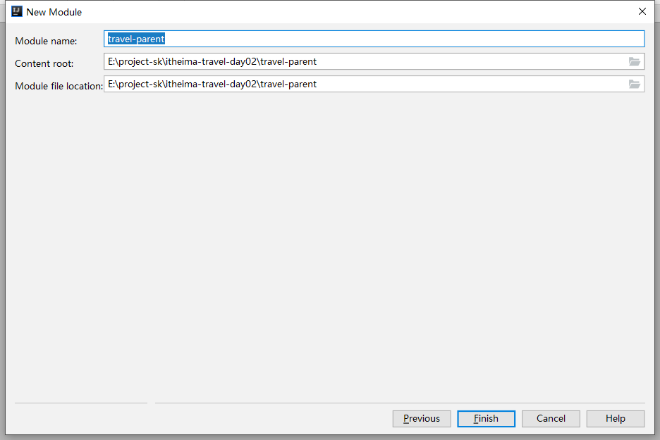

点击Finish，完成构建

因为travel-parent的项目为pom类型，只做定义不做具体业务代码的编写所以删除src目录

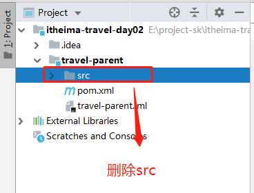


修改travel-parent的pom.xml机构如下

```xml
<?xml version="1.0" encoding="UTF-8"?>

<project xmlns="http://maven.apache.org/POM/4.0.0" xmlns:xsi="http://www.w3.org/2001/XMLSchema-instance"
  xsi:schemaLocation="http://maven.apache.org/POM/4.0.0 http://maven.apache.org/xsd/maven-4.0.0.xsd">
  <modelVersion>4.0.0</modelVersion>

  <groupId>com.itheima.travel</groupId>
  <artifactId>travel-parent</artifactId>
  <version>1.0-SNAPSHOT</version>
  <packaging>pom</packaging>

  <name>travel-parent</name>
  <!-- FIXME change it to the project's website -->
  <url>http://www.example.com</url>

  <properties>
    <project.build.sourceEncoding>UTF-8</project.build.sourceEncoding>
  </properties>

  <dependencies>
    <dependency>
      <groupId>junit</groupId>
      <artifactId>junit</artifactId>
      <version>4.11</version>
      <scope>test</scope>
    </dependency>
  </dependencies>

  <build>
  </build>
</project>

```

##### 【1.2】travel-commons

选择travel-parent模块，右键New->modeule，建立方式和travel-core一致

##### 【1.3】travel-core

选择travel-parent模块，右键New->modeule

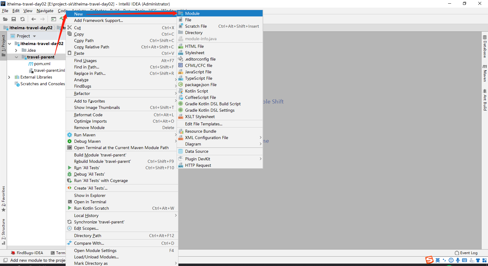

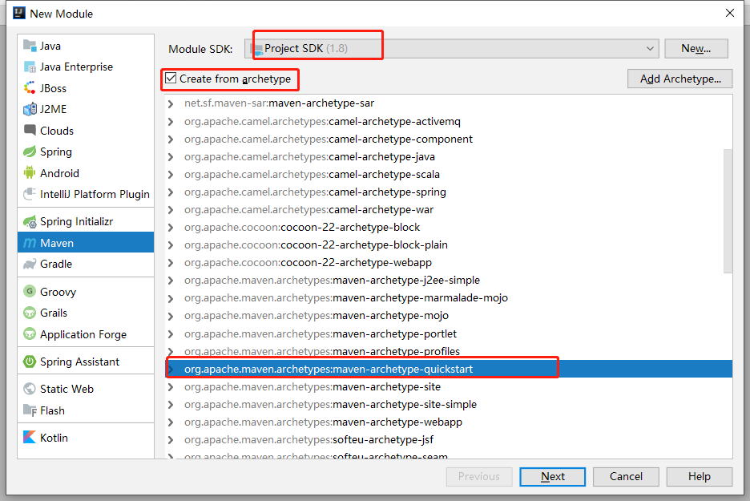

定义模块，需要注意的是这里的groupId是继承travel-parent父模块的groupId

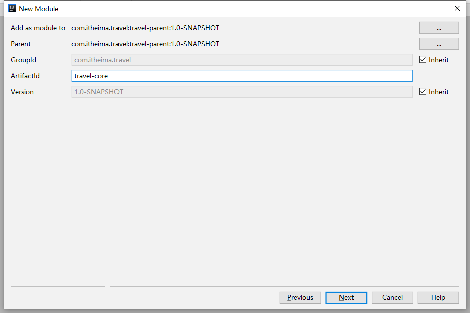

点击“Next”

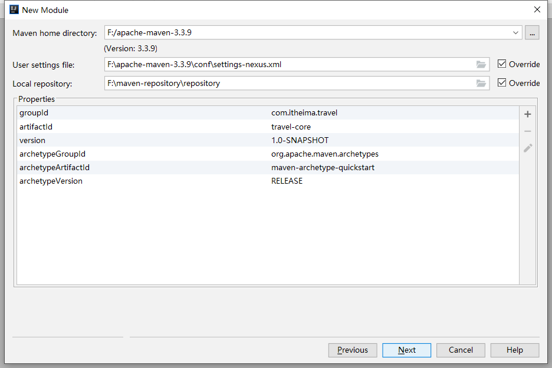

点击“Next”，修改module name 为 travel-core

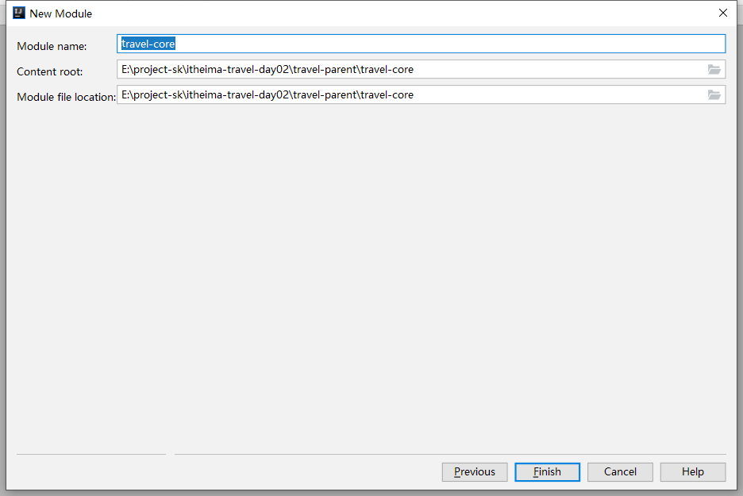

点击Finish

修改travel-core的pom.xml

```xml
<?xml version="1.0" encoding="UTF-8"?>

<project xmlns="http://maven.apache.org/POM/4.0.0" xmlns:xsi="http://www.w3.org/2001/XMLSchema-instance"
         xsi:schemaLocation="http://maven.apache.org/POM/4.0.0 http://maven.apache.org/xsd/maven-4.0.0.xsd">
    <parent>
        <artifactId>travel-parent</artifactId>
        <groupId>com.itheima.travel</groupId>
        <version>1.0-SNAPSHOT</version>
    </parent>
    <modelVersion>4.0.0</modelVersion>

    <artifactId>travel-core</artifactId>

    <name>travel-core</name>

    <dependencies>

    </dependencies>

    <build>
    </build>
</project>

```

##### 【1.4】travel-dao

构建过程和【travel-core】模块相同，修改travel-dao模块的pom.xml

```xml
<?xml version="1.0" encoding="UTF-8"?>

<project xmlns="http://maven.apache.org/POM/4.0.0" xmlns:xsi="http://www.w3.org/2001/XMLSchema-instance"
         xsi:schemaLocation="http://maven.apache.org/POM/4.0.0 http://maven.apache.org/xsd/maven-4.0.0.xsd">
    <parent>
        <artifactId>travel-parent</artifactId>
        <groupId>com.itheima.travel</groupId>
        <version>1.0-SNAPSHOT</version>
    </parent>
    <modelVersion>4.0.0</modelVersion>

    <artifactId>travel-dao</artifactId>

    <name>travel-dao</name>

    <dependencies>

    </dependencies>

    <build>
    </build>
</project>

```

##### 【1.5】travel-service

构建过程和【travel-core】模块相同，修改travel-service模块的pom.xml

```xml
<?xml version="1.0" encoding="UTF-8"?>

<project xmlns="http://maven.apache.org/POM/4.0.0" xmlns:xsi="http://www.w3.org/2001/XMLSchema-instance"
         xsi:schemaLocation="http://maven.apache.org/POM/4.0.0 http://maven.apache.org/xsd/maven-4.0.0.xsd">
    <parent>
        <artifactId>travel-parent</artifactId>
        <groupId>com.itheima.travel</groupId>
        <version>1.0-SNAPSHOT</version>
    </parent>
    <modelVersion>4.0.0</modelVersion>

    <artifactId>travel-service</artifactId>

    <name>travel-service</name>

    <dependencies>

    </dependencies>

    <build>

    </build>
</project>

```

##### 【1.6】travel-web-admin

选择travel-parent模块，右键New->modeule


需要注意的是这里选择的为骨架里面的web项目骨架

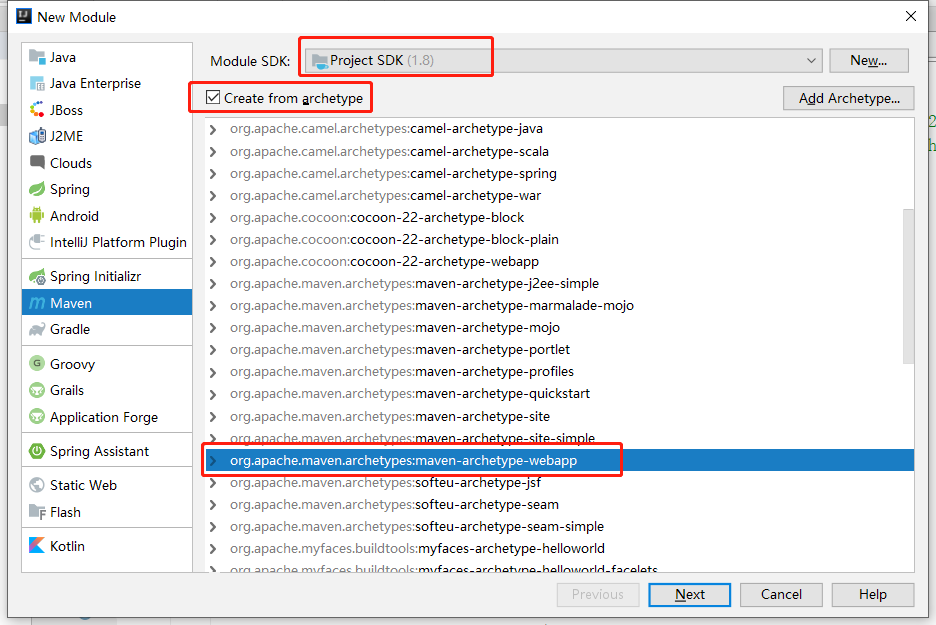

添加artifactId: travel-web-admin

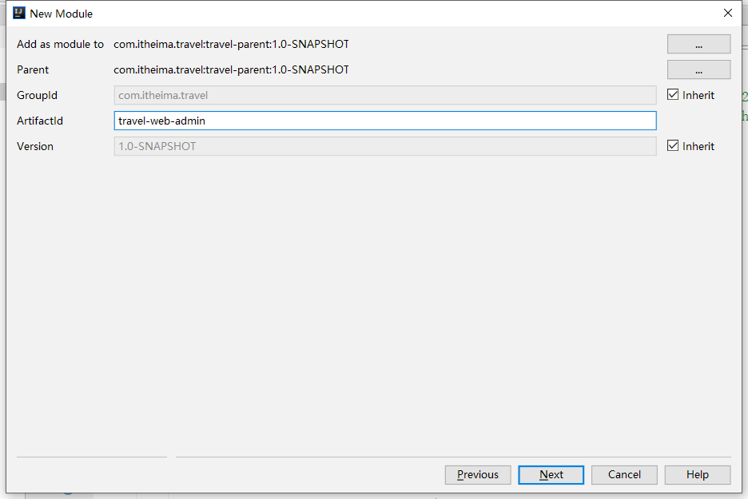

点击“Next”

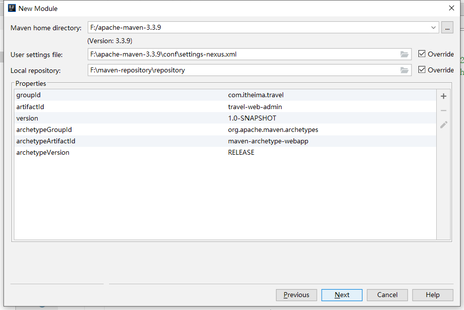

点击“Next”，修改module name 为 travel-web-admin

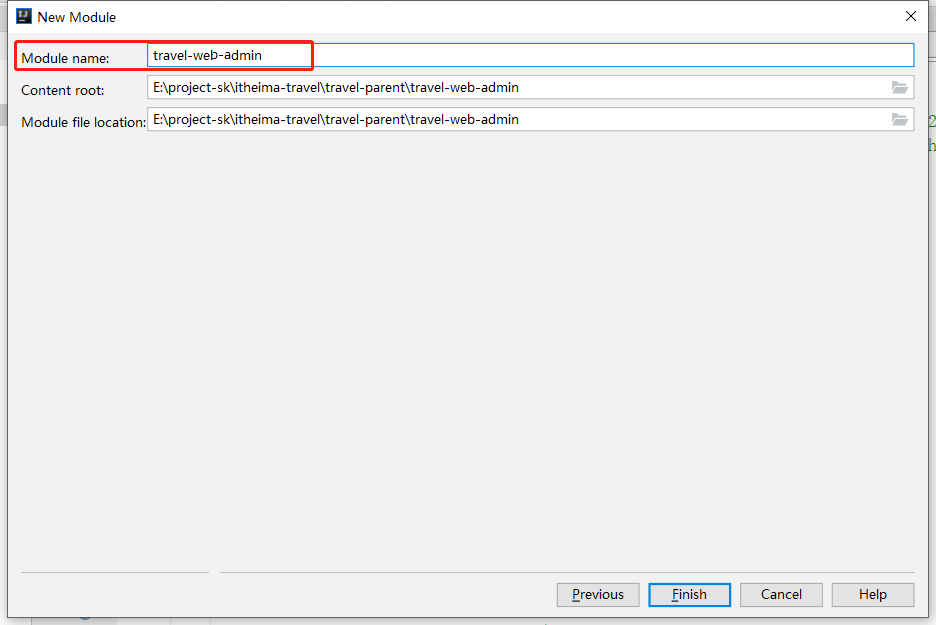

点击“Finish”

修改travel-web-admin模块的pom.xml

```xml
<?xml version="1.0" encoding="UTF-8"?>

<project xmlns="http://maven.apache.org/POM/4.0.0" xmlns:xsi="http://www.w3.org/2001/XMLSchema-instance"
         xsi:schemaLocation="http://maven.apache.org/POM/4.0.0 http://maven.apache.org/xsd/maven-4.0.0.xsd">
    <parent>
        <artifactId>travel-parent</artifactId>
        <groupId>com.itheima.travel</groupId>
        <version>1.0-SNAPSHOT</version>
    </parent>
    <modelVersion>4.0.0</modelVersion>

    <artifactId>travel-web-admin</artifactId>
    <packaging>war</packaging>

    <name>travel-web-admin Maven Webapp</name>

    <dependencies>

    </dependencies>

    <build>
        <finalName>travel-web-admin</finalName>
    </build>
</project>

```

##### 【1.7】travel-web-platform

构建过程和【travel-web-admin】模块相同，修改travel-web-platform模块的pom.xml

```xml
<?xml version="1.0" encoding="UTF-8"?>

<project xmlns="http://maven.apache.org/POM/4.0.0" xmlns:xsi="http://www.w3.org/2001/XMLSchema-instance"
         xsi:schemaLocation="http://maven.apache.org/POM/4.0.0 http://maven.apache.org/xsd/maven-4.0.0.xsd">
    <parent>
        <artifactId>travel-parent</artifactId>
        <groupId>com.itheima.travel</groupId>
        <version>1.0-SNAPSHOT</version>
    </parent>
    <modelVersion>4.0.0</modelVersion>

    <artifactId>travel-web-platform</artifactId>
    <packaging>war</packaging>

    <name>travel-web-platform Maven Webapp</name>

    <dependencies>
    </dependencies>

    <build>
        <finalName>travel-web-platform</finalName>
    </build>
</project>

```

#### 【2】构建依赖关系

完成【1】构建基础模块   所有步骤后，travel-parent模块的pom.xml文件内容如下

```xml
<?xml version="1.0" encoding="UTF-8"?>

<project xmlns="http://maven.apache.org/POM/4.0.0" xmlns:xsi="http://www.w3.org/2001/XMLSchema-instance"
  xsi:schemaLocation="http://maven.apache.org/POM/4.0.0 http://maven.apache.org/xsd/maven-4.0.0.xsd">
  <modelVersion>4.0.0</modelVersion>

  <groupId>com.itheima.travel</groupId>
  <artifactId>travel-parent</artifactId>
  <version>1.0-SNAPSHOT</version>
  <modules>
    <module>travel-core</module>
    <module>travel-commons</module>
    <module>travel-dao</module>
    <module>travel-service</module>
    <module>travel-web-admin</module>
    <module>travel-web-platform</module>
  </modules>
  <packaging>pom</packaging>

  <name>travel-parent</name>

  <properties>
    <project.build.sourceEncoding>UTF-8</project.build.sourceEncoding>
  </properties>

  <dependencies>
    <dependency>
      <groupId>junit</groupId>
      <artifactId>junit</artifactId>
      <version>4.11</version>
      <scope>test</scope>
    </dependency>
  </dependencies>

  <build>
  </build>
</project>

```

为了方便管理，这里我们需要定义统一的项目版本，并且做基础摸的声明，修改travel-parent模块的pom.xml

在properties标签下追加

```xml
<!--定义项目整体版本-->
<itheima.version>1.0-SNAPSHOT</itheima.version>
```

在project标签下追加

```xml
<dependencyManagement>
    <dependencies>

      <!--基础模块声明 start-->
      <dependency>
        <groupId>com.itheima.travel</groupId>
        <artifactId>travel-commons</artifactId>
        <version>${itheima.version}</version>
      </dependency>
      <dependency>
        <groupId>com.itheima.travel</groupId>
        <artifactId>travel-core</artifactId>
        <version>${itheima.version}</version>
      </dependency>
      <dependency>
        <groupId>com.itheima.travel</groupId>
        <artifactId>travel-dao</artifactId>
        <version>${itheima.version}</version>
      </dependency>
      <dependency>
        <groupId>com.itheima.travel</groupId>
        <artifactId>travel-service</artifactId>
        <version>${itheima.version}</version>
      </dependency>
      <!--基础模块声明 end-->

    </dependencies>
  </dependencyManagement>
```

##### 【2.1】travel-core

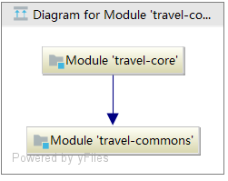

编辑travel-core模块的pom.xml文件，完成对travel-commons模块的依赖

```xml
<?xml version="1.0" encoding="UTF-8"?>

<project xmlns="http://maven.apache.org/POM/4.0.0" xmlns:xsi="http://www.w3.org/2001/XMLSchema-instance"
         xsi:schemaLocation="http://maven.apache.org/POM/4.0.0 http://maven.apache.org/xsd/maven-4.0.0.xsd">
    <parent>
        <artifactId>travel-parent</artifactId>
        <groupId>com.itheima.travel</groupId>
        <version>1.0-SNAPSHOT</version>
    </parent>
    <modelVersion>4.0.0</modelVersion>

    <artifactId>travel-core</artifactId>

    <name>travel-core</name>

    <dependencies>

        <dependency>
            <groupId>com.itheima.travel</groupId>
            <artifactId>travel-commons</artifactId>
        </dependency>

    </dependencies>

    <build>
    </build>
</project>

```


##### 【2.2】travel-dao

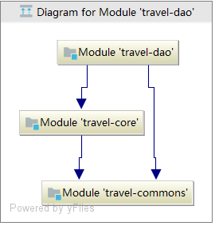

编辑travel-dao模块的pom.xml文件，完成对travel-core、travel-commons模块的依赖

```xml
<?xml version="1.0" encoding="UTF-8"?>

<project xmlns="http://maven.apache.org/POM/4.0.0" xmlns:xsi="http://www.w3.org/2001/XMLSchema-instance"
         xsi:schemaLocation="http://maven.apache.org/POM/4.0.0 http://maven.apache.org/xsd/maven-4.0.0.xsd">
    <parent>
        <artifactId>travel-parent</artifactId>
        <groupId>com.itheima.travel</groupId>
        <version>1.0-SNAPSHOT</version>
    </parent>
    <modelVersion>4.0.0</modelVersion>

    <artifactId>travel-dao</artifactId>

    <name>travel-dao</name>

    <dependencies>


        <dependency>
            <groupId>com.itheima.travel</groupId>
            <artifactId>travel-core</artifactId>
        </dependency>

    </dependencies>

    <build>
    </build>
</project>

```

##### 【2.3】travel-service

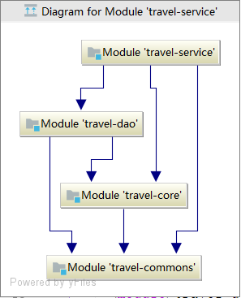

编辑travel-service模块的pom.xml文件，完成对travel-dao,travel-redis模块的依赖

```xml
<?xml version="1.0" encoding="UTF-8"?>

<project xmlns="http://maven.apache.org/POM/4.0.0" xmlns:xsi="http://www.w3.org/2001/XMLSchema-instance"
         xsi:schemaLocation="http://maven.apache.org/POM/4.0.0 http://maven.apache.org/xsd/maven-4.0.0.xsd">
    <parent>
        <artifactId>travel-parent</artifactId>
        <groupId>com.itheima.travel</groupId>
        <version>1.0-SNAPSHOT</version>
    </parent>
    <modelVersion>4.0.0</modelVersion>

    <artifactId>travel-service</artifactId>

    <name>travel-service</name>

    <dependencies>

        <dependency>
            <groupId>com.itheima.travel</groupId>
            <artifactId>travel-dao</artifactId>
        </dependency>

    </dependencies>

    <build>

    </build>
</project>

```

##### 【2.4】travel-web-admin

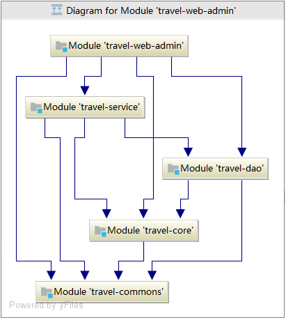

编辑travel-web-admin模块的pom.xml文件，完成对travel-service模块的依赖

```xml
<?xml version="1.0" encoding="UTF-8"?>

<project xmlns="http://maven.apache.org/POM/4.0.0" xmlns:xsi="http://www.w3.org/2001/XMLSchema-instance"
         xsi:schemaLocation="http://maven.apache.org/POM/4.0.0 http://maven.apache.org/xsd/maven-4.0.0.xsd">
    <parent>
        <artifactId>travel-parent</artifactId>
        <groupId>com.itheima.travel</groupId>
        <version>1.0-SNAPSHOT</version>
    </parent>
    <modelVersion>4.0.0</modelVersion>

    <artifactId>travel-web-admin</artifactId>
    <packaging>war</packaging>

    <name>travel-web-admin Maven Webapp</name>

    <dependencies>

        <dependency>
            <groupId>com.itheima.travel</groupId>
            <artifactId>travel-service</artifactId>
        </dependency>

    </dependencies>

    <build>
        <finalName>travel-web-admin</finalName>
    </build>
</project>

```

##### 【2.5】travel-web-platform

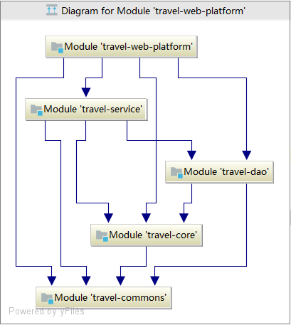

编辑travel-web-platform模块的pom.xml文件，完成对travel-service模块的依赖

```xml
<?xml version="1.0" encoding="UTF-8"?>

<project xmlns="http://maven.apache.org/POM/4.0.0" xmlns:xsi="http://www.w3.org/2001/XMLSchema-instance"
         xsi:schemaLocation="http://maven.apache.org/POM/4.0.0 http://maven.apache.org/xsd/maven-4.0.0.xsd">
    <parent>
        <artifactId>travel-parent</artifactId>
        <groupId>com.itheima.travel</groupId>
        <version>1.0-SNAPSHOT</version>
    </parent>
    <modelVersion>4.0.0</modelVersion>

    <artifactId>travel-web-platform</artifactId>
    <packaging>war</packaging>

    <name>travel-web-platform Maven Webapp</name>

    <dependencies>

        <dependency>
            <groupId>com.itheima.travel</groupId>
            <artifactId>travel-service</artifactId>
        </dependency>

    </dependencies>

    <build>
        <finalName>travel-web-platform</finalName>
    </build>
</project>

```

#### 【3】校验基础框架

在maven的控制面板中执行travel-parent下的clean，在控制台中显示所有项目清理成功

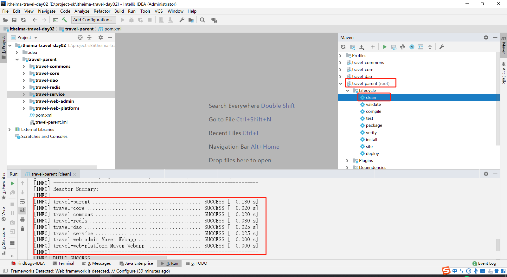

在maven的控制面板中执行travel-parent下的install，在控制台中显示所有项目安装成功

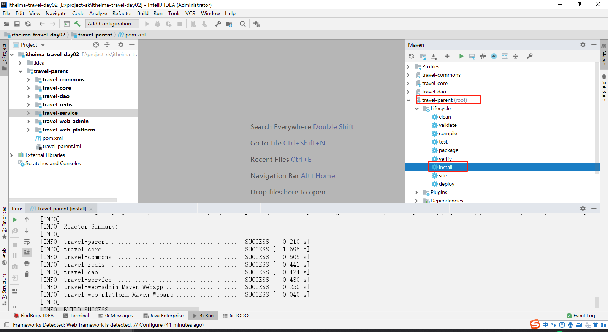

## 第二章  基础集成

### 1、父工程【travel-parent】

编辑travel-parent的pom.xml文件完成如下定义：

#### 【1】声明依赖版本

```xml
  <name>travel-parent</name>

  <properties>
    <project.build.sourceEncoding>UTF-8</project.build.sourceEncoding>

    <!--定义项目整体版本-->
    <itheima.version>1.0-SNAPSHOT</itheima.version>

    <!--servlet版本-->
    <servlet.version>4.0.1</servlet.version>
    <!--spring 版本-->
    <spring.version>5.2.0.RELEASE</spring.version>

    <!--mysql驱动版本-->
    <mysql.version>5.1.30</mysql.version>
    <!--druid版本-->
    <druid.version>1.0.29</druid.version>
    <!-- mybatis版本 -->
    <mybatis.version>3.5.5</mybatis.version>
    <!-- mybatis-spring整合包版本 -->
    <mybatis.spring.version>2.0.5</mybatis.spring.version>
    <!--generator-->
    <mybatis-generator.version>1.3.5</mybatis-generator.version>
    <!--pagehelper-->
    <pagehelper.version>5.1.11</pagehelper.version>

    <!--jackson版本-->
    <jackson.version>2.9.0</jackson.version>
    <!--fastJson-->
    <fastjson.version>1.2.47</fastjson.version>
    <!-- 日志版本 -->
    <log4j.version>2.8.2</log4j.version>
    <!--lombok-->
    <lombok.version>1.16.20</lombok.version>
    <!--文件上传-->
    <commons-fileupload>1.4</commons-fileupload>
    <!--lang3-->
    <commons.lang3.version>3.8.1</commons.lang3.version>
    <!--commons-beanutils-->
    <commons-beanutils.version>1.8.3</commons-beanutils.version>
    <!--commons-codec-->
    <commons-codec.version>1.8</commons-codec.version>
    <!--swagger2版本支持-->
    <swagger2>2.10.5</swagger2>
    <!--redisson版本-->
    <redisson.version>3.11.5</redisson.version>

  </properties>
```

#### 【2】声明依赖

```xml
<dependencies>
    <dependency>
      <groupId>junit</groupId>
      <artifactId>junit</artifactId>
      <version>4.12</version>
      <scope>test</scope>
    </dependency>
    <!--lombok-->
    <dependency>
      <groupId>org.projectlombok</groupId>
      <artifactId>lombok</artifactId>
      <version>${lombok.version}</version>
    </dependency>

    <dependency>
      <groupId>org.springframework</groupId>
      <artifactId>spring-test</artifactId>
      <version>${spring.version}</version>
      <scope>test</scope>
    </dependency>
  </dependencies>

  <dependencyManagement>
    <dependencies>

      <!--基础模块声明 start-->
      <dependency>
        <groupId>com.itheima.travel</groupId>
        <artifactId>travel-commons</artifactId>
        <version>${itheima.version}</version>
      </dependency>
      <dependency>
        <groupId>com.itheima.travel</groupId>
        <artifactId>travel-core</artifactId>
        <version>${itheima.version}</version>
      </dependency>
      <dependency>
        <groupId>com.itheima.travel</groupId>
        <artifactId>travel-dao</artifactId>
        <version>${itheima.version}</version>
      </dependency>
      <dependency>
        <groupId>com.itheima.travel</groupId>
        <artifactId>travel-service</artifactId>
        <version>${itheima.version}</version>
      </dependency>
      <!--基础模块声明 end-->

      <!--servlet 容器依赖-->
      <dependency>
        <groupId>javax.servlet</groupId>
        <artifactId>javax.servlet-api</artifactId>
        <version>${servlet.version}</version>
        <scope>provided</scope>
      </dependency>

      <!--spring 容器依赖-->
      <dependency>
        <groupId>org.springframework</groupId>
        <artifactId>spring-context</artifactId>
        <version>${spring.version}</version>
      </dependency>

      <!--spring aop依赖-->
      <dependency>
        <groupId>org.springframework</groupId>
        <artifactId>spring-aspects</artifactId>
        <version>${spring.version}</version>
      </dependency>

      <!--spring mvc容器依赖-->
      <dependency>
        <groupId>org.springframework</groupId>
        <artifactId>spring-webmvc</artifactId>
        <version>${spring.version}</version>
      </dependency>

      <!-- mysql驱动依赖 -->
      <dependency>
        <groupId>mysql</groupId>
        <artifactId>mysql-connector-java</artifactId>
        <version>${mysql.version}</version>
      </dependency>

      <!--spring-jdbc依赖-->
      <dependency>
        <groupId>org.springframework</groupId>
        <artifactId>spring-jdbc</artifactId>
        <version>${spring.version}</version>
      </dependency>

      <!--druid依赖-->
      <dependency>
        <groupId>com.alibaba</groupId>
        <artifactId>druid</artifactId>
        <version>${druid.version}</version>
      </dependency>

      <!--mybatis依赖-->
      <dependency>
        <groupId>org.mybatis</groupId>
        <artifactId>mybatis</artifactId>
        <version>${mybatis.version}</version>
      </dependency>

      <!--mybatis-spring依赖-->
      <dependency>
        <groupId>org.mybatis</groupId>
        <artifactId>mybatis-spring</artifactId>
        <version>${mybatis.spring.version}</version>
      </dependency>

      <!-- 分页插件 -->
      <dependency>
        <groupId>com.github.pagehelper</groupId>
        <artifactId>pagehelper</artifactId>
        <version>${pagehelper.version}</version>
      </dependency>

      <dependency>
        <groupId>org.mybatis.generator</groupId>
        <artifactId>mybatis-generator-core</artifactId>
        <version>${mybatis-generator.version}</version>
      </dependency>

      <!--jackson依赖包-->
      <dependency>
        <groupId>com.fasterxml.jackson.core</groupId>
        <artifactId>jackson-core</artifactId>
        <version>${jackson.version}</version>
      </dependency>
      <dependency>
        <groupId>com.fasterxml.jackson.core</groupId>
        <artifactId>jackson-databind</artifactId>
        <version>${jackson.version}</version>
      </dependency>
      <dependency>
        <groupId>com.fasterxml.jackson.core</groupId>
        <artifactId>jackson-annotations</artifactId>
        <version>${jackson.version}</version>
      </dependency>

      <!--fastjson依赖包-->
      <dependency>
        <groupId>com.alibaba</groupId>
        <artifactId>fastjson</artifactId>
        <version>${fastjson.version}</version>
      </dependency>

      <!-- log4j2驱动依赖 -->
      <dependency>
        <groupId>org.apache.logging.log4j</groupId>
        <artifactId>log4j-api</artifactId>
        <version>${log4j.version}</version>
      </dependency>

      <dependency>
        <groupId>org.apache.logging.log4j</groupId>
        <artifactId>log4j-core</artifactId>
        <version>${log4j.version}</version>
      </dependency>

      <dependency>
        <groupId>org.apache.logging.log4j</groupId>
        <artifactId>log4j-web</artifactId>
        <version>${log4j.version}</version>
      </dependency>


      <!--文件上传-->
      <dependency>
        <groupId>commons-fileupload</groupId>
        <artifactId>commons-fileupload</artifactId>
        <version>${commons-fileupload}</version>
      </dependency>

      <!--工具包-->
      <dependency>
        <groupId>org.apache.commons</groupId>
        <artifactId>commons-lang3</artifactId>
        <version>${commons.lang3.version}</version>
      </dependency>

      <dependency>
        <groupId>commons-codec</groupId>
        <artifactId>commons-codec</artifactId>
        <version>${commons-codec.version}</version>
      </dependency>

      <dependency>
        <groupId>commons-beanutils</groupId>
        <artifactId>commons-beanutils</artifactId>
        <version>${commons-beanutils.version}</version>
      </dependency>

    </dependencies>
  </dependencyManagement>
```

#### 【3】声明plugin插件依赖

```xml
<build>
    <!-- 声明JDK的版本 -->
    <plugins>
      <plugin>
        <groupId>org.apache.maven.plugins</groupId>
        <artifactId>maven-compiler-plugin</artifactId>
        <configuration>
          <source>8</source>
          <target>8</target>
        </configuration>
      </plugin>
      <!-- maven-surefire-plugin 测试包 -->
      <plugin>
        <groupId>org.apache.maven.plugins</groupId>
        <artifactId>maven-surefire-plugin</artifactId>
        <version>2.4.2</version>
        <configuration>
          <!-- 全局是否执行maven生命周期中的测试：是否跳过测试 -->
          <skipTests>true</skipTests>
          <!-- 解决测试中文乱码-->
          <forkMode>once</forkMode>
          <argLine>-Dfile.encoding=UTF-8</argLine>
        </configuration>
      </plugin>
    </plugins>

    <pluginManagement>
      <plugins>
        <!-- 声明打包时，不需要web.xml -->
        <plugin>
          <groupId>org.apache.maven.plugins</groupId>
          <artifactId>maven-war-plugin</artifactId>
          <version>2.4</version>
        </plugin>
        <!-- tomcat7插件,命令： mvn tomcat7:run -DskipTests -->
        <plugin>
          <groupId>org.apache.tomcat.maven</groupId>
          <artifactId>tomcat7-maven-plugin</artifactId>
          <version>2.2</version>
        </plugin>
        <!-- mybatis插件 -->
        <plugin>
          <groupId>org.mybatis.generator</groupId>
          <artifactId>mybatis-generator-maven-plugin</artifactId>
          <version>1.3.5</version>
        </plugin>
      </plugins>
    </pluginManagement>
  </build>
```

### 2、组件层【travel-core】

#### 【1】导入依赖

编辑travel-core模块下的pom文件添加必要的jar依赖

```xml
<dependencies>

    <dependency>
        <groupId>com.itheima.travel</groupId>
        <artifactId>travel-commons</artifactId>
    </dependency>

    <!--servlet 容器依赖-->
    <dependency>
        <groupId>javax.servlet</groupId>
        <artifactId>javax.servlet-api</artifactId>
        <scope>provided</scope>
    </dependency>

    <!--spring 容器依赖-->
    <dependency>
        <groupId>org.springframework</groupId>
        <artifactId>spring-context</artifactId>
    </dependency>

    <!--spring aop依赖-->
    <dependency>
        <groupId>org.springframework</groupId>
        <artifactId>spring-aspects</artifactId>
    </dependency>

    <!--spring mvc容器依赖-->
    <dependency>
        <groupId>org.springframework</groupId>
        <artifactId>spring-webmvc</artifactId>
    </dependency>

    <!-- mysql驱动依赖 -->
    <dependency>
        <groupId>mysql</groupId>
        <artifactId>mysql-connector-java</artifactId>
    </dependency>

    <!--spring-jdbc依赖-->
    <dependency>
        <groupId>org.springframework</groupId>
        <artifactId>spring-jdbc</artifactId>
    </dependency>

    <!--druid依赖-->
    <dependency>
        <groupId>com.alibaba</groupId>
        <artifactId>druid</artifactId>
    </dependency>

    <!--mybatis依赖-->
    <dependency>
        <groupId>org.mybatis</groupId>
        <artifactId>mybatis</artifactId>
    </dependency>

    <!--mybatis-spring依赖-->
    <dependency>
        <groupId>org.mybatis</groupId>
        <artifactId>mybatis-spring</artifactId>
    </dependency>

    <!-- 分页插件 -->
    <dependency>
        <groupId>com.github.pagehelper</groupId>
        <artifactId>pagehelper</artifactId>
    </dependency>

    <!--fastjson依赖包-->
    <dependency>
        <groupId>com.alibaba</groupId>
        <artifactId>fastjson</artifactId>
    </dependency>

    <!-- log4j2驱动依赖 -->
    <dependency>
        <groupId>org.apache.logging.log4j</groupId>
        <artifactId>log4j-api</artifactId>
    </dependency>

    <dependency>
        <groupId>org.apache.logging.log4j</groupId>
        <artifactId>log4j-core</artifactId>
    </dependency>

    <dependency>
        <groupId>org.apache.logging.log4j</groupId>
        <artifactId>log4j-web</artifactId>
    </dependency>


    <!--文件上传-->
    <dependency>
        <groupId>commons-fileupload</groupId>
        <artifactId>commons-fileupload</artifactId>
    </dependency>

    <!--工具包-->
    <dependency>
        <groupId>org.apache.commons</groupId>
        <artifactId>commons-lang3</artifactId>
    </dependency>

    <dependency>
        <groupId>commons-codec</groupId>
        <artifactId>commons-codec</artifactId>
    </dependency>

    <dependency>
        <groupId>commons-beanutils</groupId>
        <artifactId>commons-beanutils</artifactId>
    </dependency>

</dependencies>
```

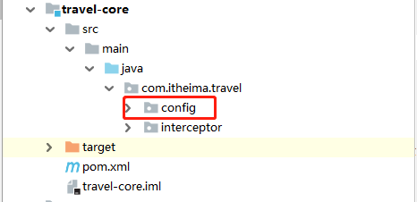

#### 【2】Spring集成

在travel-core模块下com.itheima.travel.config添加配置类SpringConfig

```java
package com.itheima.travel.config;

import org.springframework.context.annotation.ComponentScan;
import org.springframework.context.annotation.Configuration;
import org.springframework.context.annotation.EnableAspectJAutoProxy;
import org.springframework.context.annotation.FilterType;
import org.springframework.stereotype.Controller;
import org.springframework.transaction.annotation.EnableTransactionManagement;
import org.springframework.web.bind.annotation.ControllerAdvice;

/**
 * @Description：声明spring的配置
 * Configuration:声明此类为配置类，这里替换原有的spring.xml文件
 * ComponentScan:约定大于配置，扫描除web之外的所有的类
 * EnableTransactionManagement:开启事务管理器
 * EnableAspectJAutoProxy:开启aop的支持
 */
@Configuration
@ComponentScan(value = "com.itheima.travel",
        excludeFilters = {@ComponentScan.Filter(type = FilterType.ANNOTATION,
                classes = {Controller.class, ControllerAdvice.class})})
@EnableTransactionManagement
@EnableAspectJAutoProxy
public class SpringConfig {
}

```

#### 【3】MyBatis集成

在travel-core模块下com.itheima.travel.config添加配置类MybatisConfig

```java
package com.itheima.travel.config;

import com.alibaba.druid.pool.DruidDataSource;
import org.apache.ibatis.logging.log4j2.Log4j2Impl;
import org.mybatis.spring.SqlSessionFactoryBean;
import org.mybatis.spring.annotation.MapperScan;
import org.springframework.beans.factory.annotation.Qualifier;
import org.springframework.beans.factory.annotation.Value;
import org.springframework.context.annotation.Bean;
import org.springframework.context.annotation.Configuration;
import org.springframework.context.annotation.PropertySource;
import org.springframework.jdbc.datasource.DataSourceTransactionManager;

import javax.sql.DataSource;

/**
 * @Description：声明mybatis的配置
 */
@Configuration
//读取外部配置文件
@PropertySource(value = "classpath:db.properties")
@MapperScan(basePackages = {"com.itheima.travel.mapper","com.itheima.travel.mapperExt"},sqlSessionFactoryRef = "sqlSessionFactoryBean")
public class MybatisConfig {

    @Value("${dataSource.driverClassName}")
    private String driverClassName;

    @Value("${dataSource.url}")
    private String url;

    @Value("${dataSource.username}")
    private String username;

    @Value("${dataSource.password}")
    private String password;

   @Value("${seq.workerId}")
    private String workerId;

    @Value("${seq.datacenterId}")
    private String datacenterId;

    /**
     * @Description 数据源配置
     * 细节：默认不指定名称使用当前方法名为bean的名称
     */
    @Bean("druidDataSource")
    public DruidDataSource dataSource(){
        DruidDataSource dataSource = new DruidDataSource();
        dataSource.setDriverClassName(driverClassName);
        dataSource.setUrl(url);
        dataSource.setUsername(username);
        dataSource.setPassword(password);
        return dataSource;
    }

    /**
     * @Description 配置事务管理器
     * 细节：名称必须是：transactionManager，如果更换需要在使用时指定
     */
    @Bean("transactionManager")
    public DataSourceTransactionManager transactionManager(@Qualifier("druidDataSource") DataSource dataSource){
        return new DataSourceTransactionManager(dataSource);
    }

    /**
     * @Description 配置会话管理器
     */
    @Bean("sqlSessionFactoryBean")
    public SqlSessionFactoryBean sqlSessionFactoryBean(@Qualifier("druidDataSource") DataSource dataSource){
        SqlSessionFactoryBean sqlSessionFactoryBean = new SqlSessionFactoryBean();
        //指定数据源
        sqlSessionFactoryBean.setDataSource(dataSource);
        //指定对应的别名
        sqlSessionFactoryBean.setTypeAliasesPackage("com.itheima.travel.pojo");
        //指定核心xml的配置
//        try {
//            sqlSessionFactoryBean.setMapperLocations(
//                    new PathMatchingResourcePatternResolver()
//                    .getResources("sqlMapper/*Mapper.xml"));
//        } catch (IOException e) {
//            e.printStackTrace();
//        }
        //指定高级配置：驼峰、是否返回主键、缓存、日志
        org.apache.ibatis.session.Configuration configuration = new org.apache.ibatis.session.Configuration();
        configuration.setLogImpl(Log4j2Impl.class);
        sqlSessionFactoryBean.setConfiguration(configuration);
        return sqlSessionFactoryBean;
    }
    
}

```

#### 【4】Spring-MVC集成

在travel-core模块下com.itheima.travel.config添加配置类SpringMvcConfig

```java
package com.itheima.travel.config;

import org.springframework.context.annotation.Bean;
import org.springframework.context.annotation.Configuration;
import org.springframework.web.multipart.commons.CommonsMultipartResolver;
import org.springframework.web.servlet.config.annotation.DefaultServletHandlerConfigurer;
import org.springframework.web.servlet.config.annotation.EnableWebMvc;
import org.springframework.web.servlet.config.annotation.WebMvcConfigurationSupport;
import org.springframework.web.servlet.config.annotation.WebMvcConfigurerAdapter;

/**
 * @Description：声明spring-mvc的配置类
 */
@Configuration
public class SpringMvcConfig extends WebMvcConfigurationSupport {


    /**
     * @Description 文件上传
     */
    @Bean
    public CommonsMultipartResolver multipartResolver(){
        CommonsMultipartResolver multipartResolver = new CommonsMultipartResolver();
        multipartResolver.setDefaultEncoding("UTF-8");
        multipartResolver.setMaxUploadSize(104857600);
        multipartResolver.setMaxInMemorySize(4096);
        return multipartResolver;
    }

}

```


### 3、持久层【travel-dao】

#### 【1】mybatis-generator概述

​		“工欲善其事，必先利其器”，古人说的很对，虽然不能做一个单纯的“工具帝”，但是自己有合适的工具集真的很关键。MyBatis Generator是一个可以用来生成Mybatis dao,pojo,mapper文件的一个工具,在项目的过程中可以省去很多重复的工作,我们只要在MyBatis Generator的配置文件中配置好要生成的表名与包名，然后运行一条命令就会生成一堆文件。

它一共有2个文件，

mybatis-generator-core-1.3.5.jar ：代码生成的 JAR 文件，

mybatis-generator.xml： 代码生成的 XML定义文件

#### 【2】集成方式

##### 【2.1】travel-commons依赖支持

自定义插件依赖需要【travel-commons】模块的组件支持

###### 【2.1.1】travel-commons的pom.xml的依赖

补全travel-commons依赖支持

```xml
<dependencies>
        <!-- log4j2驱动依赖 -->
        <dependency>
            <groupId>org.apache.logging.log4j</groupId>
            <artifactId>log4j-api</artifactId>
        </dependency>

        <dependency>
            <groupId>org.apache.logging.log4j</groupId>
            <artifactId>log4j-core</artifactId>
        </dependency>

        <dependency>
            <groupId>org.apache.logging.log4j</groupId>
            <artifactId>log4j-web</artifactId>
        </dependency>
        <!--工具包-->
        <dependency>
            <groupId>org.apache.commons</groupId>
            <artifactId>commons-lang3</artifactId>
        </dependency>

        <dependency>
            <groupId>commons-beanutils</groupId>
            <artifactId>commons-beanutils</artifactId>
        </dependency>

        <dependency>
            <groupId>commons-codec</groupId>
            <artifactId>commons-codec</artifactId>
        </dependency>

        <dependency>
            <groupId>org.mybatis.generator</groupId>
            <artifactId>mybatis-generator-core</artifactId>
        </dependency>
    
        <!--jackson依赖包-->
        <dependency>
            <groupId>com.fasterxml.jackson.core</groupId>
            <artifactId>jackson-core</artifactId>
        </dependency>
        <dependency>
            <groupId>com.fasterxml.jackson.core</groupId>
            <artifactId>jackson-databind</artifactId>
        </dependency>
        <dependency>
            <groupId>com.fasterxml.jackson.core</groupId>
            <artifactId>jackson-annotations</artifactId>
        </dependency>
    </dependencies>
```

###### 【2.1.1】travel-commons的plugin目录

copy课件中：综合练习\黑马旅游-day02\02-课程资料目录下的plugin文件夹到travel-commons的com.itheima.travel.plugin目录下

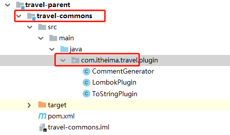

这里给同学们提供了3个基本插件的支持

```properties
CommentGenerator:生成实体类时，为其添加对于数据库中的注释
LombokPlugin:对Lombok的支持
ToStringPlugin:为每个实体类添加toSring方法
```

##### 【2.2】代码生成器maven支持

在travel-dao模块pom中添加对于的mybatis-generator的插件依赖

```xml
<plugins>
    <!--代码生成器：mybatis-generator-maven-plugin-->
    <plugin>
        <groupId>org.mybatis.generator</groupId>
        <artifactId>mybatis-generator-maven-plugin</artifactId>
        <dependencies>
            <!--代码生成器：mysql依赖-->
            <dependency>
                <groupId>mysql</groupId>
                <artifactId>mysql-connector-java</artifactId>
                <version>${mysql.version}</version>
            </dependency>
            <!--代码生成器：mybatis-generator-core依赖-->
            <dependency>
                <groupId>org.mybatis.generator</groupId>
                <artifactId>mybatis-generator-core</artifactId>
                <version>1.3.5</version>
            </dependency>
            <!--代码生成器：自定义插件依赖-->
            <dependency>
                <groupId>com.itheima.travel</groupId>
                <artifactId>travel-commons</artifactId>
                <version>${itheima.version}</version>
            </dependency>
        </dependencies>
        <executions>
            <execution>
                <id>Generate MyBatis Artifacts</id>
                <phase>package</phase>
                <goals>
                    <goal>generate</goal>
                </goals>
            </execution>
        </executions>
        <configuration>
            <!--允许移动生成的文件 -->
            <verbose>true</verbose>
            <!-- 是否覆盖 -->
            <overwrite>true</overwrite>
            <!-- 自动生成的配置 -->
            <configurationFile>
                src/main/resources/mybatis-generator.xml
            </configurationFile>
        </configuration>
    </plugin>
</plugins>
```

##### 【2.3】代码生器 XML定义

在travel-dao模块下的resources中添加mybatis-generator.xml

```xml
<?xml version="1.0" encoding="UTF-8"?>
<!DOCTYPE generatorConfiguration
        PUBLIC "-//mybatis.org//DTD MyBatis Generator Configuration 1.0//EN"
        "http://mybatis.org/dtd/mybatis-generator-config_1_0.dtd">

<generatorConfiguration>
    <!--导入mysql的驱动-->
    <classPathEntry
            location="D://Java/maven/repository2/mysql/mysql-connector-java/5.1.44/mysql-connector-java-5.1.44.jar"/>

    <!-- context 是逆向工程的主要配置信息 -->
    <!-- id：起个名字 -->
    <!-- targetRuntime：设置生成的文件适用于那个 mybatis 版本 -->
    <context id="default" targetRuntime="MyBatis3">

        <plugin type="com.itheima.travel.plugin.ToStringPlugin"/>
        <plugin type="com.itheima.travel.plugin.LombokPlugin"/>
        <plugin type="org.mybatis.generator.plugins.SerializablePlugin"/>

        <commentGenerator type="com.itheima.travel.plugin.CommentGenerator">
            <property name="suppressAllComments" value="false"/>
        </commentGenerator>

        <!--optional,旨在创建class时，对注释进行控制-->
        <!--<commentGenerator>-->
        <!--<property name="suppressDate" value="false" />-->
        <!--&lt;!&ndash; 是否去除自动生成的注释 true：是 ： false:否 &ndash;&gt;-->
        <!--<property name="suppressAllComments" value="true" />-->
        <!--</commentGenerator>-->

        <!--jdbc的数据库连接-->
        <jdbcConnection driverClass="com.mysql.jdbc.Driver"
                        connectionURL="jdbc:mysql://127.0.0.1:3306/spring-travel"
                        userId="root"
                        password="root" />

        <!--非必须，类型处理器，在数据库类型和java类型之间的转换控制-->
        <javaTypeResolver>
            <!-- 默认情况下数据库中的 decimal，bigInt 在 Java 对应是 sql 下的 BigDecimal 类 -->
            <!-- 不是 double 和 long 类型 -->
            <!-- 使用常用的基本类型代替 sql 包下的引用类型 -->
            <property name="forceBigDecimals" value="false" />
        </javaTypeResolver>

        <!-- targetPackage：生成的实体类所在的包 -->
        <!-- targetProject：生成的实体类所在的硬盘位置 -->
        <javaModelGenerator targetPackage="com.itheima.travel.pojo"
                            targetProject="src/main/java">
            <property name="javaFileEncoding" value="UTF-8"/>
            <!-- 是否允许子包 -->
            <property name="enableSubPackages" value="false" />
            <!-- 是否对modal添加构造函数 -->
            <property name="constructorBased" value="false" />
            <!-- 是否清理从数据库中查询出的字符串左右两边的空白字符 -->
            <property name="trimStrings" value="true" />
            <!-- 建立modal对象是否不可改变 即生成的modal对象不会有setter方法，只有构造方法 -->
            <property name="immutable" value="false" />
        </javaModelGenerator>

        <!-- targetPackage 和 targetProject：生成的 mapper 文件的包和位置 -->
        <sqlMapGenerator targetPackage="sqlMapper"
                         targetProject="src/main/resources">
            <!-- 针对数据库的一个配置，是否把 schema 作为字包名 -->
            <property name="enableSubPackages" value="false" />
        </sqlMapGenerator>

        <!-- targetPackage 和 targetProject：生成的 interface 文件的包和位置 XMLMAPPER：生成XML方式，ANNOTATEDMAPPER：生成注解方式-->
        <javaClientGenerator type="ANNOTATEDMAPPER"
                             targetPackage="com.itheima.travel.mapper" targetProject="src/main/java">
            <!-- 针对 oracle 数据库的一个配置，是否把 schema 作为字包名 -->
            <property name="enableSubPackages" value="false" />
        </javaClientGenerator>

        <table tableName="tab_affix" domainObjectName="Affix">
            <generatedKey column="id" sqlStatement="MySql" identity="true"/>
        </table>

        <table tableName="tab_category" domainObjectName="Category" >
            <generatedKey column="id" sqlStatement="MySql" identity="true"/>
        </table>

        <table tableName="tab_favorite" domainObjectName="Favorite">
            <generatedKey column="id" sqlStatement="MySql" identity="true"/>
        </table>

        <table tableName="tab_seller" domainObjectName="Seller">
            <generatedKey column="id" sqlStatement="MySql" identity="true"/>
        </table>

        <table tableName="tab_user" domainObjectName="User">
            <generatedKey column="id" sqlStatement="MySql" identity="true"/>
        </table>

        <table tableName="tab_route" domainObjectName="Route">
            <generatedKey column="id" sqlStatement="MySql" identity="true"/>
        </table>

    </context>
</generatorConfiguration>

```

#### 【3】逆向生成

##### 【3.1】数据库脚本

​	参考：综合练习\黑马旅游-day02\02-课程资料目录下的spring-travel.sql文件

##### 【3.2】执行逆向生成

点击Maven面板中选择travel-dao-->Plugins--->mybatis-generator--->mybatis-generator:generate

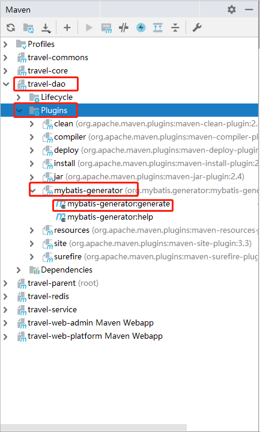

执行成功

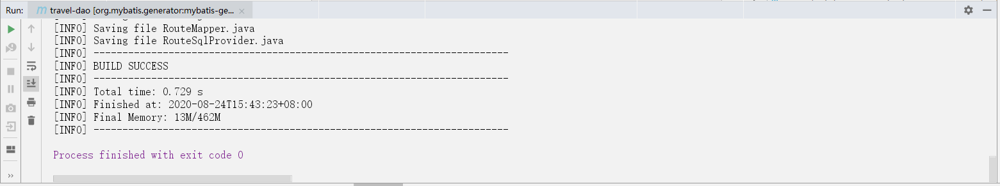

查看travel-dao项目

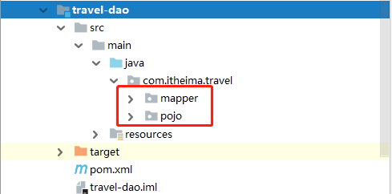


#### 【4】mapper接口介绍

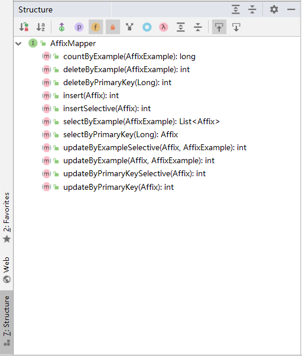

生成的mapper类规则做下详细介绍，这里以AffixMapper为例

```java
package com.itheima.travel.mapper;

import com.itheima.travel.pojo.Affix;
import com.itheima.travel.pojo.AffixExample;
import org.apache.ibatis.annotations.Mapper;
import org.apache.ibatis.annotations.Param;

import java.util.List;

@Mapper
public interface AffixMapper {

    /**
     * @Description 按条件统计
     * @param example 查询条件
     * @return 统计结果
     */
    long countByExample(AffixExample example);

    /**
     * @Description 按条件删除
     * @param example 查询条件
     * @return 影响行数
     */
    int deleteByExample(AffixExample example);

    /**
     * @Description 按主键删除
     * @param id 主键
     * @return 影响行数
     */
    int deleteByPrimaryKey(Long id);

    /**
     * @Description 插入记录：insert则会插入所有字段，会插入null
     * @param record 插入对象
     * @return 影响行数
     */
    int insert(Affix record);

    /**
     * @Description 插入记录：insertSelective：只会插入数据不为null的字段值
     * @param record 插入对象
     * @return 影响行数
     */
    int insertSelective(Affix record);

    /**
     * @Description 按条件查询
     * @param example 查询条件
     * @return 符合条件的结果集
     */
    List<Affix> selectByExample(AffixExample example);

    /**
     * @Description 按主键查询对象
     * @param id 主键
     * @return 符合条件的结果
     */
    Affix selectByPrimaryKey(Long id);

    /**
     * @Description 按条件修改数据
     * @param record 要修改的部分值组成的对象，其中有些属性为null则表示该项不修改
     * @param example 修改条件
     * @return 影响行数
     */
    int updateByExampleSelective(@Param("record") Affix record, @Param("example") AffixExample example);

    /**
     * @Description 按条件修改数据
     * @param record 要修改的部分值组成的对象，其中有些属性为null会被修改
     * @param example 修改条件
     * @return 影响行数
     */
    int updateByExample(@Param("record") Affix record, @Param("example") AffixExample example);

    /**
     * @Description 按主键修改数据
     * @param record 要修改的部分值组成的对象，其中有些属性为null则表示该项不修改
     * @return 影响行数
     */
    int updateByPrimaryKeySelective(Affix record);

    /**
     * @Description 按主键修改数据
     * @param record 要修改的部分值组成的对象，其中有些属性为null会被修改
     * @return 影响行数
     */
    int updateByPrimaryKey(Affix record);
}

```

Af1fixSqlProvider则为动态SQL的拼接处理类，用于SQL的条件拼接

## 第三章  基础业务【travel-service】

### 1、pojo、vo、dto、po

#### 【1】概念概述

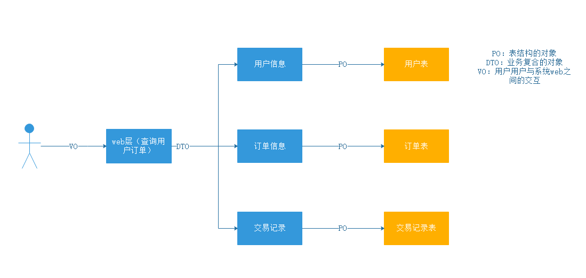

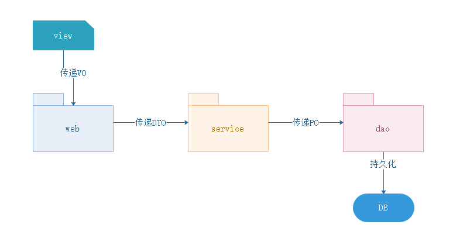

POJO ：plain ordinary java object 无规则简单java对象

一个中间对象，可以转化为PO、DTO、VO。

​		1 ．POJO持久化之后==〉PO

​		2 ．POJO传输过程中==〉DTO

​		3 ．POJO用作表示层==〉VO

VO ：value object 值对象 / view object 表现层对象

​		1 ．主要对应页面显示（web页面/swt、swing界面）的数据对象。

​		2 ．可以和表对应，也可以不，这根据业务的需要

DTO（TO）：Data Transfer Object 数据传输对象

​		1 ．用在需要跨进程或远程传输时，它不应该包含业务逻辑。

​		2 ．比如一张表有100个字段，那么对应的PO就有100个属性（大多数情况下，DTO内的数据来自多个表）。但view层只需显示10个字段，没有必要把整个PO对象传递到client，这时我们就可以用只有这10个属性的DTO来传输数据到client，这样也不会暴露server端表结构。到达客户端以后，如果用这个对象来对应界面显示，那此时它的身份就转为VO

PO：原则上一个表就是一个PO对象

​		1、用于持久化对对象的保存

#### 【2】构建系统VO对象

在travel-service模块中新建package目录com.itheima.travel.req，copy\综合练习\黑马旅游-day02\02-课程资料中的req

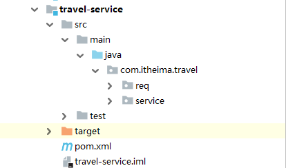

### 2、用户模块

#### 【1】接口定义

在travel-service的main/java目录下com.itheima.travel.service目录建立UserService如下：

```java
package com.itheima.travel.service;

import com.itheima.travel.req.UserVo;

/**
 * @Description 用户服务
 */
public interface UserService {

    /**
     * @Description 用户注册
     * @param userVo
     * @return 注册是否成功
     */
    Boolean registerUser(UserVo userVo);

    /**
     * @Description 用户登录
     * @param userVo
     * @return 登录成功后返回
     */
    UserVo loginUser(UserVo userVo);

    /**
     * @Description 用户退出
     */
    void loginOutUser();

    /**
     * @Description 用户是否登录
     */
    Boolean isLogin();
}

```

#### 【2】接口实现

拷贝SSM-黑马旅游-day02\02-课程资料\utils到travel-commons的com.itheima.travel.utils

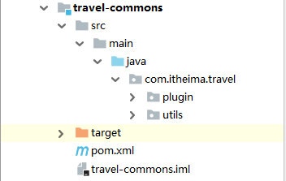

在travel-service的main/java目录下com.itheima.travel.service.impl目录建立UserServiceImpl如下：

```java
package com.itheima.travel.service.impl;

import com.itheima.travel.mapper.UserMapper;
import com.itheima.travel.pojo.User;
import com.itheima.travel.pojo.UserExample;
import com.itheima.travel.req.UserVo;
import com.itheima.travel.service.UserService;
import com.itheima.travel.utils.BeanConv;
import com.itheima.travel.utils.EmptyUtil;
import com.itheima.travel.utils.MD5Coder;
import org.springframework.beans.factory.annotation.Autowired;
import org.springframework.stereotype.Service;

import javax.servlet.http.HttpSession;
import java.util.List;

@Service
public class UserServiceImpl implements UserService {

    @Autowired
    private UserMapper userMapper;

    @Autowired
    HttpSession session;


    @Override
    public Boolean registerUser(UserVo userVo) {
        User user = BeanConv.toBean(userVo, User.class);
        user.setPassword(MD5Coder.md5Encode(user.getPassword()));
        int flag = userMapper.insert(user);
        return flag>0;
    }

    @Override
    public UserVo loginUser(UserVo userVo) {
        //组装条件
        UserExample example = new UserExample();
        example.createCriteria().andUsernameEqualTo(userVo.getUsername())
                .andPasswordEqualTo(MD5Coder.md5Encode(userVo.getPassword()));
        //查询list结果集
        List<User> users = userMapper.selectByExample(example);
        //转换VO
        List<UserVo> list = BeanConv.toBeanList(users, UserVo.class);
        //判断结果
        if (list.size()==1){
            UserVo userVoResult = list.get(0);
            //放入会话
            String sessionId = session.getId();
            userVoResult.setSessionId(sessionId);
            session.setAttribute(sessionId,userVoResult);
            return userVoResult;
        }
        return null;
    }

    @Override
    public void loginOutUser() {
        //从会话中删除当前对象
        session.removeAttribute(session.getId());
    }

    @Override
    public Boolean isLogin() {
        //根据当前用户是否存在判断登录状态
        Object sessionObject = session.getAttribute(session.getId());
        return !EmptyUtil.isNullOrEmpty(sessionObject);
    }
}

```

#### 【3】单元测试

##### 【3.1】TestConfig配置

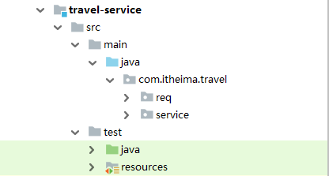

在travel-service的test目录下添加java和resources目录，java为测试资源目录，resources为测试加载测试资源文件

com.itheima.travel.basic下添加TestConfig，Testconfig做测试统一配置类，需要注意的是这个类必须是抽象类

```java
package com.itheima.travel.basic;

import com.itheima.travel.config.SpringConfig;
import com.itheima.travel.service.UserService;
import org.junit.runner.RunWith;
import org.springframework.beans.factory.annotation.Autowired;
import org.springframework.test.context.ContextConfiguration;
import org.springframework.test.context.junit4.SpringJUnit4ClassRunner;
import org.springframework.test.context.web.WebAppConfiguration;

/**
 * @Description：基础测试类：此类必须为抽象类，要不会报错
 * WebAppConfiguration 加载WEB环境测试: 注解在类上,
 * 用来声明加载的ApplicationContex是一个WebApplicationContext
 */
@RunWith(SpringJUnit4ClassRunner.class)
@ContextConfiguration(classes = {SpringConfig.class})
@WebAppConfiguration
public abstract class TestConfig {
	@Autowired
    public UserService userService;
}

```

因为当前需要指出web环境容器，所以需要在travel-service中添加servlet支持

```xml
<dependency>
       <groupId>javax.servlet</groupId>
       <artifactId>javax.servlet-api</artifactId>
       <scope>provided</scope>
</dependency>
```

db.properties

```properties
dataSource.driverClassName=com.mysql.jdbc.Driver
dataSource.url=jdbc:mysql://127.0.0.1:3306/spring-travel
dataSource.username=root
dataSource.password=root

seq.workerId =10
seq.datacenterId=10

upLoad.pathRoot=F:/file-service/platform_img
upLoad.webSite=http://127.0.0.1/file-service/

context.test=true


```


##### 【3.2】测试用户模块

在test目录下的com.itheima.travel.service下添加UserServiceTest

```java
package com.itheima.travel.service;

import com.itheima.travel.basic.TestConfig;
import com.itheima.travel.req.UserVo;
import lombok.extern.log4j.Log4j2;
import org.junit.Test;

import java.util.Date;

/**
 * @Description：UserService测试类
 */
@Log4j2
public class UserServiceTest extends TestConfig {

    @Test
    public void testRegisterUser(){
        log.info("testRegisterUser----开始");
        UserVo userVo = UserVo.builder()
                .username("shuwenqi")
                .password("pass")
                .realName("束XX")
                .birthday(new Date())
                .sex("1")
                .telephone("15156408888")
                .email("15156408888@qq.com").build();
        boolean flag = userService.registerUser(userVo);
        log.info("testRegisterUser----通过--->{}",flag);
    }

    @Test
    public void testLoginUser(){
        log.info("testLoginUser----开始");
        UserVo userVo = UserVo.builder()
                .username("admin")
                .password("pass")
                .build();
        UserVo userVoResult = userService.loginUser(userVo);
        log.info("testLoginUser----通过--->{}",userVoResult);
    }

    @Test
    public void testLoginOutUser(){
        log.info("testLoginUser----开始");
        UserVo userVo = UserVo.builder()
                .username("admin")
                .password("pass")
                .build();
        UserVo userVoResult = userService.loginUser(userVo);
        log.info("testLoginUser----通过--->{}",userVoResult.toString());

        log.info("testLoginOutUser----开始");
        userService.loginOutUser();
        log.info("testLoginOutUser----通过--->{}");
    }

    @Test
    public void testIsLogin(){
        log.info("testLoginUser----开始");
        UserVo userVo = UserVo.builder()
                .username("admin")
                .password("pass")
                .build();
        UserVo userVoResult = userService.loginUser(userVo);
        log.info("testLoginUser----通过--->{}",userVoResult.toString());

        log.info("testIsLogin----开始");
        Boolean flag = userService.isLogin();
        log.info("testIsLogin----通过--->{}",flag);
    }

}

```

测试结果

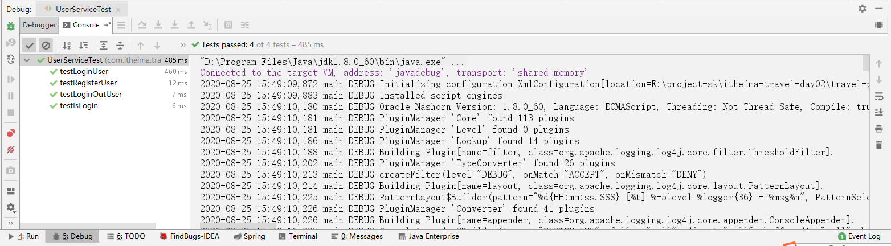

### 3、收藏模块

#### 【1】接口定义

在travel-service的main/java目录下com.itheima.travel.service目录建立FavoriteService如下：

```java
package com.itheima.travel.service;

import com.github.pagehelper.PageInfo;
import com.itheima.travel.req.FavoriteVo;
import com.itheima.travel.req.RouteVo;

public interface FavoriteService {


    /**
     * @Description 添加收藏
     * @return 当前路线新收藏个数
     */
    Integer addFavorite(FavoriteVo favoriteVo);

    /**
     * @Description 查询当前用户我的收藏
     * @return RouteVo 路线信息
     */
    PageInfo<RouteVo> findMyFavorite(FavoriteVo favoriteVo, int pageNum, int pageSize);

    /**
     * @Description 是否收藏
     * @param favoriteVo 关注请求参数
     * @return 是否收藏
     */
    Boolean isFavorited(FavoriteVo favoriteVo);
}

```

#### 【2】接口实现


##### 【2.1】实现方式

在travel-service的main/java目录下com.itheima.travel.service.impl目录建立FavoriteServiceImpl如下：

```java
package com.itheima.travel.service.impl;

import com.github.pagehelper.PageHelper;
import com.github.pagehelper.PageInfo;
import com.itheima.travel.mapper.FavoriteMapper;
import com.itheima.travel.mapper.RouteMapper;
import com.itheima.travel.mapperExt.FavoriteMapperExt;
import com.itheima.travel.mapperExt.RouteMapperExt;
import com.itheima.travel.pojo.Favorite;
import com.itheima.travel.pojo.FavoriteExample;
import com.itheima.travel.pojo.Route;
import com.itheima.travel.req.FavoriteVo;
import com.itheima.travel.req.RouteVo;
import com.itheima.travel.req.UserVo;
import com.itheima.travel.service.FavoriteService;
import com.itheima.travel.utils.BeanConv;
import com.itheima.travel.utils.EmptyUtil;
import org.springframework.beans.factory.annotation.Autowired;
import org.springframework.stereotype.Service;
import org.springframework.transaction.annotation.Transactional;

import javax.servlet.http.HttpSession;
import java.util.List;

/**
 * @Description：收藏服务类
 */
@Service
public class FavoriteServiceImpl implements FavoriteService {

    @Autowired
    FavoriteMapper favoriteMapper;

    @Autowired
    FavoriteMapperExt favoriteMapperExt;

    @Autowired
    RouteMapper routeMapper;

    @Autowired
    RouteMapperExt routeMapperExt;

    @Autowired
    HttpSession session;

    @Transactional
    @Override
    public Integer addFavorite(FavoriteVo favoriteVo) {
        //1、获得当前用户
        Object object = session.getAttribute(session.getId());
        UserVo userVo = null;
        if (!EmptyUtil.isNullOrEmpty(object)){
            userVo= (UserVo) object;
        }else {
            return null;
        }
        favoriteVo.setUserId(userVo.getId());
        //2.向tab_favorite表插入一条数据
        favoriteMapper.insert(BeanConv.toBean(favoriteVo, Favorite.class));
        //3.更新tab_route表的count字段+1
        Long flag = routeMapperExt.updateRouteCountById(favoriteVo.getRouteId());
        if (flag==0){
            throw new RuntimeException("修改统计表出错");
        }
        //4.重新查询tab_route表的count字段
        Route route = routeMapper.selectByPrimaryKey(favoriteVo.getRouteId());
        return route.getAttentionCount();
    }

    @Override
    public PageInfo<RouteVo> findMyFavorite(FavoriteVo favoriteVo,int pageNum, int pageSize) {
        //使用分页
        PageHelper.startPage(pageNum, pageSize);
        //获取当前登录用户
        Object object = session.getAttribute(session.getId());
        UserVo userVo = null;
        if (!EmptyUtil.isNullOrEmpty(object)){
            userVo= (UserVo) object;
        }else {
            return null;
        }
        //需要注意的是不要直接使用BeanConv对list进行copy,这样会到导致统计页面出错
        List<Route> list = favoriteMapperExt.findFavoriteByUserId(userVo.getId());
        PageInfo<Route> pageInfo = new PageInfo<>(list);
        PageInfo<RouteVo> pageInfoVo = new PageInfo<>();
        //外部对象拷贝
        BeanConv.toBean(pageInfo, pageInfoVo);
        //结果集转换
        List<RouteVo> routeVoList = BeanConv.toBeanList(pageInfo.getList(), RouteVo.class);
        pageInfoVo.setList(routeVoList);
        return pageInfoVo;
    }

    @Override
    public Boolean isFavorited(FavoriteVo favoriteVo) {
        //获取当前登录用户
        Object object = session.getAttribute(session.getId());
        UserVo userVo = null;
        if (!EmptyUtil.isNullOrEmpty(object)){
            userVo= (UserVo) object;
        }else {
            return false;
        }
        FavoriteExample favoriteExample = new FavoriteExample();
        favoriteExample.createCriteria().andRouteIdEqualTo(favoriteVo.getRouteId())
                .andUserIdEqualTo(userVo.getId());
        List<Favorite> favoriteList = favoriteMapper.selectByExample(favoriteExample);
        return favoriteList.size()>0;
    }
}

```

##### 【2.2】扩展mapper

在FavoriteServiceImpl类中，有2个特殊的成员变量：favoriteMapperExt和routeMapperExt，这2个类是我们自定义的mapper，那么这里是怎么支持的呢？

首先我们看下MybatisConfig的配置类：

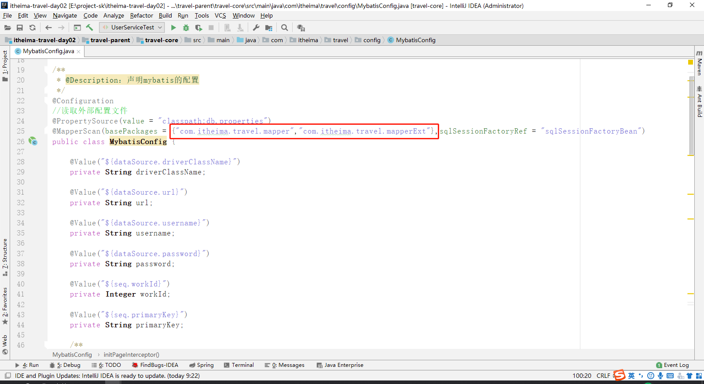

从上面的类中我们看到，@MapperScan注解属性basePackages扫描了2个路径，那为什么要分开呢？

```
1、当数据库结构发生变化时，我们需要使用mybatis-generator进行自动生成代码时候，会覆盖mapper，而我们不希望覆盖
2、在做维护时，我们需要明确哪些类是自动生成的，哪些类是自定义的
```

在travel-dao中新增内容如下

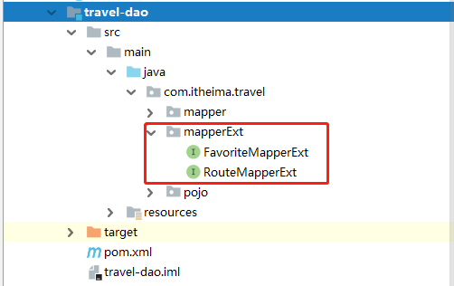


FavoriteMapperExt:

```
package com.itheima.travel.mapperExt;

import com.itheima.travel.pojo.Route;
import org.apache.ibatis.annotations.Mapper;
import org.apache.ibatis.annotations.Result;
import org.apache.ibatis.annotations.Results;
import org.apache.ibatis.annotations.Select;
import org.apache.ibatis.type.JdbcType;

import java.util.List;

/**
 * @Description：收藏扩展Mapper
 */
@Mapper
public interface FavoriteMapperExt {

    @Select({
            "select",
            "r.id, r.route_name, r.price, r.route_Introduce, r.flag, r.is_theme_tour, r.attention_count, r.category_id, ",
            "r.seller_id, created_time",
            "from tab_favorite f left join tab_route r on f.route_id = r.id ",
            "where f.user_id = #{userId,jdbcType=BIGINT}"
    })
    @Results({
            @Result(column="id", property="id", jdbcType= JdbcType.BIGINT, id=true),
            @Result(column="route_name", property="routeName", jdbcType=JdbcType.VARCHAR),
            @Result(column="price", property="price", jdbcType=JdbcType.DECIMAL),
            @Result(column="route_Introduce", property="routeIntroduce", jdbcType=JdbcType.VARCHAR),
            @Result(column="flag", property="flag", jdbcType=JdbcType.CHAR),
            @Result(column="is_theme_tour", property="isThemeTour", jdbcType=JdbcType.CHAR),
            @Result(column="attention_count", property="attentionCount", jdbcType=JdbcType.INTEGER),
            @Result(column="category_id", property="categoryId", jdbcType=JdbcType.BIGINT),
            @Result(column="seller_id", property="sellerId", jdbcType=JdbcType.BIGINT),
            @Result(column="created_time", property="createdTime", jdbcType=JdbcType.TIMESTAMP)
    })
    List<Route> findFavoriteByUserId(Long userId);
}

```

RouteMapperExt:

```java
package com.itheima.travel.mapperExt;

import org.apache.ibatis.annotations.Update;

/**
 * @Description：线路扩展mapper
 */
@Mapper
public interface RouteMapperExt {
    /**
     * @Description 修改线路统计
     * @param routeId 线路ID
     * @return
     */
   	@Update("update tab_route set attention_count = attention_count+1 where id = #{routeId}" )
    Long updateRouteCountById(Long routeId);
}

```

##### 【2.3】PageHelp分页工具

###### 【2.3.1】原理

**PageHelper实际做的事情是在 ThreadLocal中设置了分页参数，之后在查询执行的时候，获取当线程中的分页参数，执行查询的时候通过拦截器在sql语句中添加分页参数，之后实现分页查询，查询结束后在 finally 语句中清除ThreadLocal中的查询参数**

最核心的逻辑在 PageInterceptor 中，PageInterceptor 是一个拦截器。

在 Mybatis中有个地方提供了拦截的机会 Executor

分页插件拦截的是 Executor ，也就是在sql执行的时候

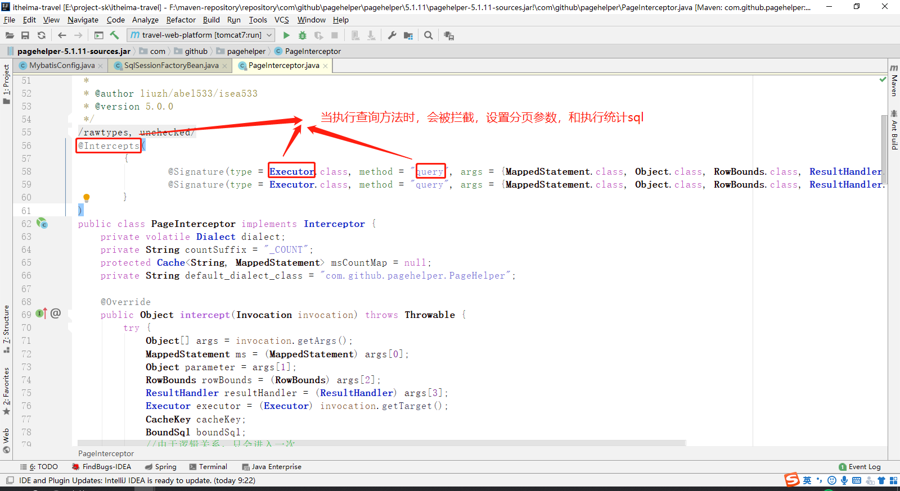

###### 【2.3.2】添加依赖

在travel-core的pom文件中添加依赖

```xml
<!-- 分页插件 -->
<dependency>
    <groupId>com.github.pagehelper</groupId>
    <artifactId>pagehelper</artifactId>
</dependency>
```

###### 【2.3.3】编辑MybatisConfig

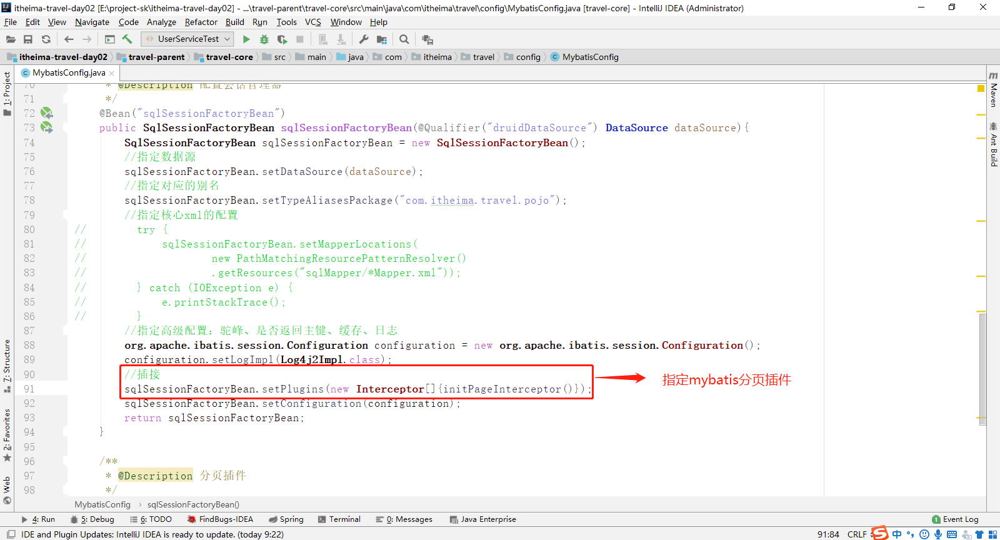

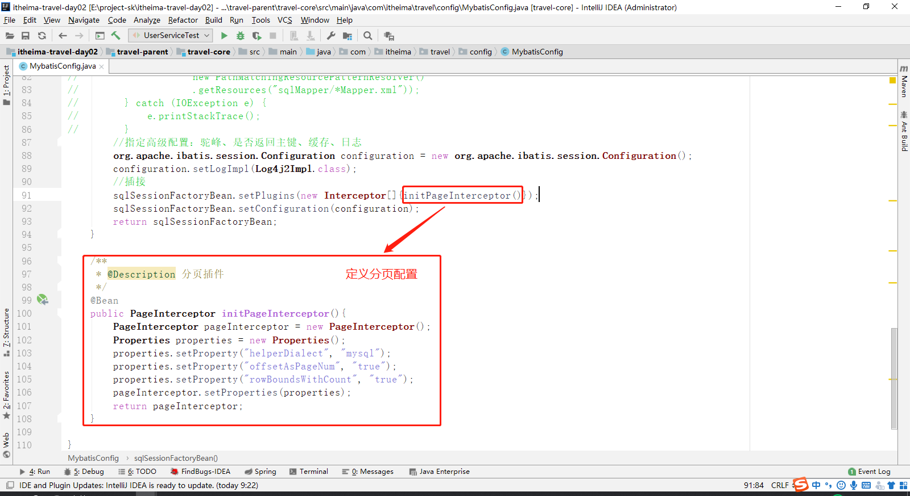

travel-core模块中找到com.itheima.travel.config.MybatisConfig，对SqlSessionFactoryBean如下编辑

```java
/**
     * @Description 配置会话管理器
     */
    @Bean("sqlSessionFactoryBean")
    public SqlSessionFactoryBean sqlSessionFactoryBean(@Qualifier("druidDataSource") DataSource dataSource){
        SqlSessionFactoryBean sqlSessionFactoryBean = new SqlSessionFactoryBean();
        //指定数据源
        sqlSessionFactoryBean.setDataSource(dataSource);
        //指定对应的别名
        sqlSessionFactoryBean.setTypeAliasesPackage("com.itheima.travel.pojo");
        //指定核心xml的配置
//        try {
//            sqlSessionFactoryBean.setMapperLocations(
//                    new PathMatchingResourcePatternResolver()
//                    .getResources("sqlMapper/*Mapper.xml"));
//        } catch (IOException e) {
//            e.printStackTrace();
//        }
        //指定高级配置：驼峰、是否返回主键、缓存、日志
        org.apache.ibatis.session.Configuration configuration = new org.apache.ibatis.session.Configuration();
        configuration.setLogImpl(Log4j2Impl.class);
        sqlSessionFactoryBean.setConfiguration(configuration);
        //插接
        sqlSessionFactoryBean.setPlugins(new Interceptor[]{initPageInterceptor()});
        return sqlSessionFactoryBean;
    }
```

添加initPageInterceptor()方法

```java
/**
     * @Description 分页插件
     */
@Bean
public PageInterceptor initPageInterceptor(){
    PageInterceptor pageInterceptor = new PageInterceptor();
    Properties properties = new Properties();
    properties.setProperty("helperDialect", "mysql");
	//该参数默认为false
	//设置为true时，会将RowBounds第一个参数offset当成pageNum页码使用 
    properties.setProperty("offsetAsPageNum", "true");
    //使用RowBounds分页会进行count查询。
    properties.setProperty("rowBoundsWithCount", "true");
    pageInterceptor.setProperties(properties);
    return pageInterceptor;
}
```


#### 【3】单元测试

##### 【3.1】TestConfig配置

com.itheima.travel.basic下TestConfig，注入FavoriteService

```java
package com.itheima.travel.service;

import com.github.pagehelper.PageInfo;
import com.itheima.travel.basic.TestConfig;
import com.itheima.travel.req.FavoriteVo;
import com.itheima.travel.req.RouteVo;
import com.itheima.travel.req.UserVo;
import lombok.extern.log4j.Log4j2;
import org.junit.Before;
import org.junit.Test;

/**
 * @Description：FavoriteService测试类
 */
@Log4j2
public class FavoriteServiceTest extends TestConfig {

    /**
     * @Description 模拟用户登录
     */
    @Before
    public void before(){
        UserVo userVo = UserVo.builder()
                .username("admin")
                .password("pass")
                .build();
        UserVo userVoResult = userService.loginUser(userVo);
    }

    @Test
    public void testAddFavorite(){
        log.info("testAddFavorite----开始");
        FavoriteVo favoriteVo = FavoriteVo.builder()
                .routeId(1L)
                .userId(1L)
                .build();
        int flag = favoriteService.addFavorite(favoriteVo);
        log.info("testAddFavorite----结束:{}",flag);
    }

    @Test
    public void testFindMyFavorite(){
        log.info("testFindMyFavorite----开始");
        FavoriteVo favoriteVo = FavoriteVo.builder()
                .userId(1L)
                .build();
        PageInfo<RouteVo> page = favoriteService.findMyFavorite(favoriteVo, 1, 2);
        log.info("testFindMyFavorite----结束：{}",page.toString());
    }

    @Test
    public void isFavorited(){
        log.info("isFavorited----开始");
        FavoriteVo favoriteVo = FavoriteVo.builder()
                .routeId(1L)
                .build();
        boolean flag = favoriteService.isFavorited(favoriteVo);
        log.info("isFavorited----结束:{}",flag);
    }

}

```

##### 【3.2】测试收藏模块

在test目录下的com.itheima.travel.service下添加FavoriteServiceTest

```java
package com.itheima.travel.service;

import com.github.pagehelper.PageInfo;
import com.itheima.travel.basic.TestConfig;
import com.itheima.travel.req.FavoriteVo;
import com.itheima.travel.req.RouteVo;
import com.itheima.travel.req.UserVo;
import lombok.extern.log4j.Log4j2;
import org.junit.Before;
import org.junit.Test;

/**
 * @Description：FavoriteService测试类
 */
@Log4j2
public class FavoriteServiceTest extends TestConfig {

    /**
     * @Description 模拟用户登录
     */
    @Before
    public void before(){
        UserVo userVo = UserVo.builder()
                .username("admin")
                .password("pass")
                .build();
        UserVo userVoResult = userService.loginUser(userVo);
    }

    @Test
    public void testAddFavorite(){
        log.info("testAddFavorite----开始");
        FavoriteVo favoriteVo = FavoriteVo.builder()
                .routeId(1L)
                .build();
        int flag = favoriteService.addFavorite(favoriteVo);
        log.info("testAddFavorite----结束:{}",flag);
    }

    @Test
    public void testFindMyFavorite(){
        log.info("testFindMyFavorite----开始");
        FavoriteVo favoriteVo = FavoriteVo.builder()
                .build();
        PageInfo<RouteVo> page = favoriteService.findMyFavorite(favoriteVo, 1, 2);
        log.info("testFindMyFavorite----结束：{}",page.toString());
    }

    @Test
    public void isFavorited(){
        log.info("isFavorited----开始");
        FavoriteVo favoriteVo = FavoriteVo.builder()
                .routeId(1L)
                .build();
        boolean flag = favoriteService.isFavorited(favoriteVo);
        log.info("isFavorited----结束:{}",flag);
    }

}

```

测试结果

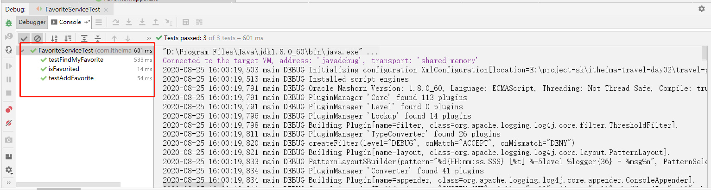

### 4、分类模块

#### 【1】接口定义

在travel-service的main/java目录下com.itheima.travel.service目录建立CategoryService如下：

```java
package com.itheima.travel.service;

import com.itheima.travel.req.CategoryVo;

import java.util.List;

/**
 * @Description 分类服务接口
 */
public interface CategoryService {

    /**
     * @Description 查询所分类
     */
    List<CategoryVo> findAllCategory();
}

```


#### 【2】接口实现

在travel-service的main/java目录下com.itheima.travel.service.impl目录建立CategoryServiceImpl如下

```java
package com.itheima.travel.service.impl;

import com.itheima.travel.mapper.CategoryMapper;
import com.itheima.travel.pojo.Category;
import com.itheima.travel.pojo.CategoryExample;
import com.itheima.travel.req.CategoryVo;
import com.itheima.travel.service.CategoryService;
import com.itheima.travel.utils.BeanConv;
import com.itheima.travel.utils.EmptyUtil;
import org.springframework.beans.factory.annotation.Autowired;
import org.springframework.stereotype.Service;

import java.util.List;

/**
 * @Description 分类服务实现
 */
@Service
public class CategoryServiceImpl implements CategoryService {

    @Autowired
    private CategoryMapper categoryMapper;


    @Override
    public List<CategoryVo> findAllCategory() {
        CategoryExample example = new CategoryExample();
        List<Category> categories = categoryMapper.selectByExample(example);
        if (!EmptyUtil.isNullOrEmpty(categories)){
            return BeanConv.toBeanList(categories, CategoryVo.class);
        }
        return null;
    }
}

```


#### 【3】单元测试

##### 【3.1】TestConfig配置

com.itheima.travel.basic下TestConfig，注入CategoryService

```java
package com.itheima.travel.service;

import com.itheima.travel.basic.TestConfig;
import com.itheima.travel.req.CategoryVo;
import com.itheima.travel.req.UserVo;
import lombok.extern.log4j.Log4j2;
import org.junit.Before;
import org.junit.Test;

import java.util.List;

/**
 * @Description：分类测试类
 */
@Log4j2
public class CategoryServiceTest extends TestConfig {

    @Test
    public void testFindAllCategory(){
        log.info("testFindAllCategory----开始");
        List<CategoryVo> allCategory = categoryService.findAllCategory();
        log.info("testFindAllCategory----结束:{}",allCategory);
    }
}

```

##### 【3.2】测试分类模块

在test目录下的com.itheima.travel.service下添加CategoryServiceTest

```java
package com.itheima.travel.service;

import com.itheima.travel.basic.TestConfig;
import com.itheima.travel.req.CategoryVo;
import com.itheima.travel.req.UserVo;
import lombok.extern.log4j.Log4j2;
import org.junit.Before;
import org.junit.Test;

import java.util.List;

/**
 * @Description：分类测试类
 */
@Log4j2
public class CategoryServiceTest extends TestConfig {

    @Before
    public void before(){
        UserVo userVo = UserVo.builder()
                .username("admin")
                .password("pass")
                .build();
        UserVo userVoResult = userService.loginUser(userVo);
    }


    @Test
    public void testFindAllCategory(){
        log.info("testFindAllCategory----开始");
        List<CategoryVo> allCategory = categoryService.findAllCategory();
        log.info("testFindAllCategory----结束:{}",allCategory);
    }
}

```

测试结果

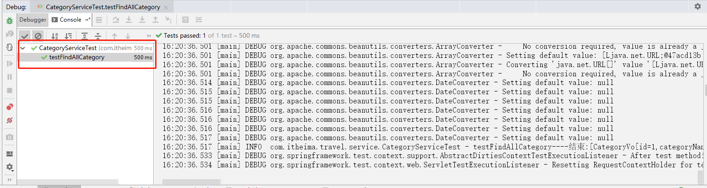

### 5、线路模块

#### 【1】接口定义

在travel-service的main/java目录下com.itheima.travel.service目录建立RouteService如下：

```java
package com.itheima.travel.service;


import com.github.pagehelper.PageInfo;
import com.itheima.travel.req.RouteVo;

public interface RouteService {

    /**
     * @Description 添加路线
     * @param routeVo 路径请求参数
     * @return 影响行数
     */
    Integer addRoute(RouteVo routeVo);

    /**
     * @Description 编辑线路
     * @param routeVo 线路请求参数
     * @return 影响行数
     */
    Integer updateRoute(RouteVo routeVo);

    /**
     * @Description 查询线路
     * @param routeVo 路径请求参数
     * @return 线路详情
     */
    RouteVo findRouteById(RouteVo routeVo);

    /**
     * @Description 分页查询
     * @param routeVo 路径请求参数
     * @return 线路分页
     */
    PageInfo<RouteVo> findRouteByPage(RouteVo routeVo, int pageNum, int pageSize);

}

```


#### 【2】接口实现

在travel-service的main/java目录下com.itheima.travel.service.impl目录建立RouteServiceImpl如下

```java
package com.itheima.travel.service.impl;

import com.github.pagehelper.PageHelper;
import com.github.pagehelper.PageInfo;
import com.itheima.travel.mapper.FavoriteMapper;
import com.itheima.travel.mapper.RouteMapper;
import com.itheima.travel.pojo.Route;
import com.itheima.travel.pojo.RouteExample;
import com.itheima.travel.req.RouteVo;
import com.itheima.travel.req.SellerVo;
import com.itheima.travel.service.RouteService;
import com.itheima.travel.utils.BeanConv;
import com.itheima.travel.utils.EmptyUtil;
import org.springframework.beans.factory.annotation.Autowired;
import org.springframework.stereotype.Service;

import javax.servlet.http.HttpSession;
import java.util.List;

@Service
public class RouteServiceImpl implements RouteService {

    @Autowired
    private RouteMapper routeMapper;

    @Autowired
    private FavoriteMapper favoriteMapper;

    @Autowired
    HttpSession session;

    @Override
    public Integer addRoute(RouteVo routeVo) {
        SellerVo sellerVo = (SellerVo) session.getAttribute(session.getId());
        routeVo.setSellerId(sellerVo.getId());
        //保存
        return routeMapper.insert(BeanConv.toBean(routeVo, Route.class));
    }

    @Override
    public Integer updateRoute(RouteVo routeVo) {
        if (EmptyUtil.isNullOrEmpty(routeVo.getId())){
            return 0;
        }
        int flag = routeMapper.updateByPrimaryKey(BeanConv.toBean(routeVo, Route.class));
        return flag;
    }

    @Override
    public RouteVo findRouteById(RouteVo routeVo) {
        return BeanConv.toBean(routeMapper.selectByPrimaryKey(routeVo.getId()), RouteVo.class);
    }

    @Override
    public PageInfo<RouteVo> findRouteByPage(RouteVo routeVo, int pageNum, int pageSize) {
        PageHelper.startPage(pageNum, pageSize);
        RouteExample example = new RouteExample();
        RouteExample.Criteria criteria = example.createCriteria();
        //多条件查询
        if (!EmptyUtil.isNullOrEmpty(routeVo.getCategoryId())){
            criteria.andCategoryIdEqualTo(routeVo.getCategoryId());
        }
        if (!EmptyUtil.isNullOrEmpty(routeVo.getRouteName())){
            criteria.andRouteNameLike("%"+routeVo.getRouteName+"%");
        }
        if (!EmptyUtil.isNullOrEmpty(routeVo.getRouteName())){
            criteria.andRouteNameLike("%"+routeVo.getRouteName()+"%");
        }
        if (!EmptyUtil.isNullOrEmpty(routeVo.getMinPrice())){
            criteria.andPriceGreaterThan(routeVo.getMinPrice());
        }
        if (!EmptyUtil.isNullOrEmpty(routeVo.getMaxPrice())){
            criteria.andPriceLessThan(routeVo.getMaxPrice());
        }
        List<Route> routes = routeMapper.selectByExample(example);
        PageInfo<Route> pageInfo = new PageInfo<>(routes);
        PageInfo<RouteVo> pageInfoVo = new PageInfo<>();
        //外部对象拷贝
        BeanConv.toBean(pageInfo, pageInfoVo);
        //结果集转换
        List<RouteVo> routeVoList = BeanConv.toBeanList(pageInfo.getList(), RouteVo.class);
        pageInfoVo.setList(routeVoList);
        return pageInfoVo;
    }

}

```


#### 【3】单元测试

##### 【3.1】TestConfig配置

com.itheima.travel.basic下TestConfig，注入CategoryService

```java
package com.itheima.travel.basic;

import com.itheima.travel.config.SpringConfig;
import com.itheima.travel.pojo.Favorite;
import com.itheima.travel.service.CategoryService;
import com.itheima.travel.service.FavoriteService;
import com.itheima.travel.service.RouteService;
import com.itheima.travel.service.UserService;
import org.junit.runner.RunWith;
import org.springframework.beans.factory.annotation.Autowired;
import org.springframework.test.context.ContextConfiguration;
import org.springframework.test.context.junit4.SpringJUnit4ClassRunner;
import org.springframework.test.context.web.WebAppConfiguration;

/**
 * @Description：基础测试类：此类必须为抽象类，要不会报错
 * WebAppConfiguration 加载WEB环境测试: 注解在类上,
 * 用来声明加载的ApplicationContex是一个WebApplicationContext
 */
@RunWith(SpringJUnit4ClassRunner.class)
@ContextConfiguration(classes = {SpringConfig.class})
@WebAppConfiguration
public abstract class TestConfig {

    @Autowired
    public UserService userService;

    @Autowired
    public FavoriteService favoriteService;

    @Autowired
    public CategoryService categoryService;

    @Autowired
    public RouteService routeService;
}

```

##### 【3.2】测试线路模块

在test目录下的com.itheima.travel.service下添加RouteServiceTest

```java
package com.itheima.travel.service;

import com.github.pagehelper.PageInfo;
import com.itheima.travel.basic.TestConfig;
import com.itheima.travel.req.RouteVo;
import com.itheima.travel.req.SellerVo;
import com.itheima.travel.req.UserVo;
import lombok.extern.log4j.Log4j2;
import org.junit.Before;
import org.junit.Test;

import java.math.BigDecimal;

/**
 * @Description：
 */
@Log4j2
public class RouteServiceTest extends TestConfig {

    @Before
    public void before(){
        UserVo userVo = UserVo.builder()
                .username("admin")
                .password("pass")
                .build();
        UserVo userVoResult = userService.loginUser(userVo);

    }

    @Test
    public void addRoute(){
        log.info("addRoute----开始");
        RouteVo routeVo = RouteVo.builder()
                .routeName("【春节】三亚 双飞3天2晚 自由行套票【含广州直飞往返机票+2晚海居铂尔曼酒店高级花园房+每日中西式自助早餐+VIP专车接送机服务】")
                .price(new BigDecimal(1010))
                .routeIntroduce("含广州直飞三亚往返机票+2晚海居铂尔曼酒店高级花园房+每日中西式自助早餐+VIP专车接送机服务！")
                .flag("1")
                .isThemeTour("1")
                .attentionCount(100)
                .categoryId(1L)
                .sellerId(1L)
                .build();
        Integer flag = routeService.addRoute(routeVo);
        log.info("addRoute----结束:{}",flag);
    }

    @Test
    public void updateRoute(){
        log.info("updateRoute----开始");
        RouteVo routeVo = RouteVo.builder()
                .id(22L)
                .routeName("测试")
                .price(new BigDecimal(1010))
                .routeIntroduce("测试")
                .flag("1")
                .isThemeTour("1")
                .attentionCount(100)
                .categoryId(1L)
                .sellerId(1L)
                .build();
        Integer flag = routeService.updateRoute(routeVo);
        log.info("updateRoute----结束:{}",flag);
    }

    @Test
    public void findRouteById(){
        log.info("findRouteById----开始");
        RouteVo routeVo = RouteVo.builder()
                .id(1L)
                .build();
        RouteVo routeById = routeService.findRouteById(routeVo);
        log.info("findRouteById----结束:{}",routeById.toString());
    }

    @Test
    public void findRouteByPage(){
        log.info("findRouteByPage----开始");
        PageInfo<RouteVo> routeByPage = routeService.findRouteByPage(new RouteVo(), 1, 2);
        log.info("findRouteByPage----结束:{}",routeByPage.toString());
    }

}

```

测试结果

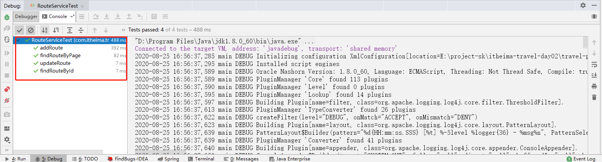

### 6、附件模块

#### 【1】接口定义

在travel-service的main/java目录下com.itheima.travel.service目录建立AffixService如下：

```java
package com.itheima.travel.service;

import com.itheima.travel.pojo.Affix;
import com.itheima.travel.req.AffixVo;
import org.springframework.web.multipart.MultipartFile;

import java.io.IOException;
import java.util.List;

/**
 * @Description：文件上传业务
 */
public interface AffixService {

    /**
     * @Description 文件上传
     * @param multipartFile 上传对象
     * @param affixVo 附件对象
     * @return
     */
    AffixVo upLoad(MultipartFile multipartFile,
                   AffixVo affixVo) throws IOException;

    /**
     * @Description 为上传绑定对应的业务Id
     * @param  affixVo 附件对象
     * @return
     */
    Boolean bindBusinessId(AffixVo affixVo);

    /**
     * @Description 按业务ID查询附件
     * @param  affixVo 附件对象
     * @return
     */
    List<AffixVo> findAffixByBusinessId(AffixVo affixVo);
}

```

#### 【2】接口实现

在travel-service的main/java目录下com.itheima.travel.service.impl目录建立RouteServiceImpl如下

```java
package com.itheima.travel.service.impl;

import com.itheima.travel.config.SnowflakeIdWorker;
import com.itheima.travel.mapper.AffixMapper;
import com.itheima.travel.pojo.Affix;
import com.itheima.travel.pojo.AffixExample;
import com.itheima.travel.req.AffixVo;
import com.itheima.travel.service.AffixService;
import com.itheima.travel.utils.BeanConv;
import org.springframework.beans.factory.annotation.Autowired;
import org.springframework.beans.factory.annotation.Value;
import org.springframework.stereotype.Service;
import org.springframework.web.multipart.MultipartFile;

import java.io.File;
import java.io.IOException;
import java.util.List;
import java.util.UUID;

/**
 * @Description：文件上传实现
 */
@Service
public class AffixServiceImpl implements AffixService {

    @Autowired
    AffixMapper affixMapper;

    @Autowired
    SnowflakeIdWorker snowflakeIdWorker;

    @Value("${upLoad.pathRoot}")
    String pathRoot;

    @Override
    public AffixVo upLoad(MultipartFile multipartFile,
                          AffixVo affixVo) throws IOException {
        //判断文件是否为空
        if (multipartFile==null){
            return null;
        }
        String businessType = affixVo.getBusinessType();
        //关联业务
        affixVo.setBusinessType(businessType);
        //原始上传的文件名称aaa.jpg
        String originalFilename = multipartFile.getOriginalFilename();
        //后缀名称.jpg
        String suffix = originalFilename.substring(originalFilename.lastIndexOf("."));
        affixVo.setSuffix(suffix);
        //文件名称
        String fileName = String.valueOf(snowflakeIdWorker.nextId());
        affixVo.setFileName(fileName);
        //构建访问路径
        String pathUrl = businessType+"/"+fileName+suffix;
        //判断业务类型的文件夹是否存在
        File file = new File(pathRoot+businessType);
        //文件夹不存在则创建
        if (!file.exists()){
            file.mkdir();
        }
        file = new File(pathRoot+"/"+pathUrl);
        multipartFile.transferTo(file);
        affixVo.setPathUrl(pathUrl);
        Affix affix = BeanConv.toBean(affixVo, Affix.class);
        affixMapper.insert(affix);
        return BeanConv.toBean(affix, AffixVo.class);
    }

    @Override
    public Boolean bindBusinessId(AffixVo affixVo) {
        Affix affix = BeanConv.toBean(affixVo, Affix.class);
        int flag = affixMapper.updateByPrimaryKeySelective(affix);
        return flag>0;
    }

    @Override
    public List<AffixVo> findAffixByBusinessId(AffixVo affixVo) {
        AffixExample example = new AffixExample();
        example.createCriteria().andBusinessIdEqualTo(affixVo.getBusinessId());
        List<Affix> affixes = affixMapper.selectByExample(example);
        return BeanConv.toBeanList(affixes, AffixVo.class);
    }
}

```

#### 【3】单元测试

牵涉页面图片内容，这边我们等swagger2接口进行测试

### 7、商家模块

#### 【1】接口定义

```java
package com.itheima.travel.service;

import com.itheima.travel.req.SellerVo;

/**
 * @Description：
 */
public interface SellerService {

    /**
     * @Description 用户注册
     * @param sellerVo
     * @return 注册是否成功
     */
    Boolean registerSeller(SellerVo sellerVo);

    /**
     * @Description 用户登录
     * @param sellerVo
     * @return 登录成功后返回
     */
    SellerVo loginSeller(SellerVo sellerVo);

    /**
     * @Description 用户退出
     */
    void loginOutSeller();

    /**
     * @Description 用户是否登录
     */
    Boolean isLogin();

    /**
     * @Description 按照商家Id查询商家用户
     */
    SellerVo findSellerVoById(SellerVo sellerVo);
}

```

#### 【2】接口实现

```java
package com.itheima.travel.service.impl;

import com.itheima.travel.mapper.SellerMapper;
import com.itheima.travel.pojo.Seller;
import com.itheima.travel.pojo.SellerExample;
import com.itheima.travel.req.SellerVo;
import com.itheima.travel.service.SellerService;
import com.itheima.travel.utils.BeanConv;
import com.itheima.travel.utils.EmptyUtil;
import com.itheima.travel.utils.MD5Coder;
import org.springframework.beans.factory.annotation.Autowired;
import org.springframework.stereotype.Service;

import javax.servlet.http.HttpSession;
import java.util.List;

/**
 * @Description：后台用户管理
 */
@Service
public class SellerServiceImpl implements SellerService {

    @Autowired
    private SellerMapper sellerMapper;

    @Autowired
    HttpSession session;

    @Override
    public Boolean registerSeller(SellerVo sellerVo) {
        Seller seller = BeanConv.toBean(sellerVo, Seller.class);
        seller.setPassword(MD5Coder.md5Encode(seller.getPassword()));
        int flag = sellerMapper.insert(seller);
        return flag>0;
    }

    @Override
    public SellerVo loginSeller(SellerVo sellerVo) {
        //组装条件
        SellerExample example = new SellerExample();
        example.createCriteria().andUsernameEqualTo(sellerVo.getUsername())
                .andPasswordEqualTo(MD5Coder.md5Encode(sellerVo.getPassword()));
        //查询list结果集
        List<Seller> sellers = sellerMapper.selectByExample(example);
        //转换VO
        List<SellerVo> list = BeanConv.toBeanList(sellers, SellerVo.class);
        //判断结果
        if (list.size()==1){
            SellerVo sellerVoResult = list.get(0);
            //放入会话
            String sessionId = session.getId();
            sellerVoResult.setSessionId(sessionId);
            session.setAttribute(sessionId,sellerVoResult);
            return sellerVoResult;
        }
        return null;
    }

    @Override
    public void loginOutSeller() {
        //从会话中删除当前对象
        session.removeAttribute(session.getId());
    }

    @Override
    public Boolean isLogin() {
        //根据当前用户是否存在判断登录状态
        Object sessionObject = session.getAttribute(session.getId());
        return !EmptyUtil.isNullOrEmpty(sessionObject);
    }

    @Override
    public SellerVo findSellerVoByid(SellerVo sellerVo) {
        return BeanConv.toBean(sellerMapper.selectByPrimaryKey(sellerVo.getId()),SellerVo.class);
    }
}

```

#### 【3】单元测试

##### 【3.1】TestConfig配置

com.itheima.travel.basic下TestConfig，注入CategoryService

```java
package com.itheima.travel.service;

import com.itheima.travel.basic.TestConfig;
import com.itheima.travel.req.SellerVo;
import lombok.extern.log4j.Log4j2;
import org.junit.Test;

import java.util.Date;

/**
 * @Description：
 */
@Log4j2
public class SellerServiceTest extends TestConfig {

    @Test
    public void testRegisterSeller(){
        log.info("testRegisterSeller----开始");
        SellerVo sellerVo = SellerVo.builder()
                .username("shuwenqi")
                .password("pass")
                .birthday(new Date())
                .telephone("15156408888")
                .build();
        boolean flag = sellerService.registerSeller(sellerVo);
        log.info("testRegisterSeller----通过--->{}",flag);
    }

    @Test
    public void testLoginSeller(){
        log.info("testLoginSeller----开始");
        SellerVo sellerVo = SellerVo.builder()
                .username("admin")
                .password("pass")
                .build();
        SellerVo sellerVoResult = sellerService.loginSeller(sellerVo);
        log.info("testLoginSeller----通过--->{}",sellerVoResult.toString());
    }

    @Test
    public void testLoginOutSeller(){
        log.info("testLoginSeller----开始");
        SellerVo sellerVo = SellerVo.builder()
                .username("admin")
                .password("pass")
                .build();
        SellerVo sellerVoResult = sellerService.loginSeller(sellerVo);
        log.info("testLoginSeller----通过--->{}",sellerVoResult.toString());

        log.info("testLoginOutSeller----开始");
        sellerService.loginOutSeller();
        log.info("testLoginOutSeller----通过--->{}");
    }

    @Test
    public void testIsLogin(){
        log.info("testLoginSeller----开始");
        SellerVo sellerVo = SellerVo.builder()
                .username("admin")
                .password("pass")
                .build();
        SellerVo sellerVoResult = sellerService.loginSeller(sellerVo);
        log.info("testLoginSeller----通过--->{}",sellerVoResult.toString());

        log.info("testIsLogin----开始");
        Boolean flag = sellerService.isLogin();
        log.info("testIsLogin----通过--->{}",flag);
    }

    @Test
    public void testFindSellerVoById(){
        log.info("testFindSellerVoByid----开始");
        SellerVo sellerVo = SellerVo.builder()
                .id(1L)
                .build();
        SellerVo sellerVoResult = sellerService.findSellerVoById(sellerVo);
        log.info("testFindSellerVoByid----通过--->{}",sellerVoResult.toString());

    }
}

```

##### 【3.2】测试商家模块

```java
package com.itheima.travel.service;

import com.itheima.travel.basic.TestConfig;
import com.itheima.travel.req.SellerVo;
import lombok.extern.log4j.Log4j2;
import org.junit.Test;

import java.util.Date;

/**
 * @Description：
 */
@Log4j2
public class SellerServiceTest extends TestConfig {

    @Test
    public void testRegisterSeller(){
        log.info("testRegisterSeller----开始");
        SellerVo sellerVo = SellerVo.builder()
                .username("shuwenqi")
                .password("pass")
                .birthday(new Date())
                .telephone("15156408888")
                .build();
        boolean flag = sellerService.registerSeller(sellerVo);
        log.info("testRegisterSeller----通过--->{}",flag);
    }

    @Test
    public void testLoginSeller(){
        log.info("testLoginSeller----开始");
        SellerVo sellerVo = SellerVo.builder()
                .username("admin")
                .password("pass")
                .build();
        SellerVo sellerVoResult = sellerService.loginSeller(sellerVo);
        log.info("testLoginSeller----通过--->{}",sellerVoResult.toString());
    }

    @Test
    public void testLoginOutSeller(){
        log.info("testLoginSeller----开始");
        SellerVo sellerVo = SellerVo.builder()
                .username("admin")
                .password("pass")
                .build();
        SellerVo sellerVoResult = sellerService.loginSeller(sellerVo);
        log.info("testLoginSeller----通过--->{}",sellerVoResult.toString());

        log.info("testLoginOutSeller----开始");
        sellerService.loginOutSeller();
        log.info("testLoginOutSeller----通过--->{}");
    }

    @Test
    public void testIsLogin(){
        log.info("testLoginSeller----开始");
        SellerVo sellerVo = SellerVo.builder()
                .username("admin")
                .password("pass")
                .build();
        SellerVo sellerVoResult = sellerService.loginSeller(sellerVo);
        log.info("testLoginSeller----通过--->{}",sellerVoResult.toString());

        log.info("testIsLogin----开始");
        Boolean flag = sellerService.isLogin();
        log.info("testIsLogin----通过--->{}",flag);
    }
}
```

## 第四章 主键生成策略

### 1、有哪些主键生成策略

#### 【1】中心化生成

中心化生成算法经典的方案

​		1、主要有基于SEQUENCE区间方案

​		2、各数据库按特定步长自增

​		3、基于redis生成自增序列三种

##### 【1.1】基于SEQUENCE区间

​		淘宝分布式数据层TDDL就是采用SEQUENCE方案实现了分库分表、Master/Salve、动态数据源配置等功能。大致原理是：所有应用服务器去同一个库获取可使用的sequence（乐观锁保证一致性），得到（sequence，sequence+步长]个可被这个数据源使用的id，当应用服务器插入“步长”个数据后，再次去争取新的sequence区间。
优势：生成一个 全局唯一 的 连续 数字类型主键，延用单库单表时的主键id。
劣势：无法保证 全局递增 。需要开发各种数据库类型id生成器。扩容历史数据不好迁移

##### 【1.2】步长自增

​		可以继续采用数据库生成自增主键的方式，为每个不同的分库设置不同的初始值，并按步长设置为分片的个数即可，这种方式对分片个数有依赖，一旦再次水平扩展，原有的分布式主键不易迁移。为了预防后续库表扩容，这边可以采用提前约定最大支持的库表数量，后续扩容为2的指数倍扩容。
比如：我们规定最大支持1024张分表，数据库增长的步长为1024（即使现在的表数量只有64）。
优势：生成一个全局唯一的数字类型主键，延用单库单表时的主键id。当分表数没有达到约定的1024张分表，全局不连续。
劣势：无法保证全局递增，也不保证单机连续。需要开发各种数据库类型id生成器。需要依赖一个中心库表sequence。

##### 【1.3】基于redis的方案

另一种中心化生成分布式主键的方式是采用Redis在内存中生成自增序列，通过redis的原子自增操作(incr接口)生成一个自增的序列。

```properties
优势：生成一个 全局连续递增 的数字类型主键。
劣势：此种方式新增加了一个外部组件的依赖，一旦Redis不可用，则整个数据库将无法在插入，可用性会大大下降，另外Redis的单点问题也需要解决，部署复杂度较高。
```

#### 【2】去中心生成

去中心化方式无需额外部署，以jar包方式被加载，可扩展性也很好，因此更推荐使用。目前主流的去中心化生成算法有：

​		1、UUID及其变种

​		2、snowflake算法

##### 【2.1】UUID及其变种

​		UUID 是 通用唯一识别码（Universally Unique Identifier）的缩写，是一种软件建构的标准，亦为开放软件基金会组织在分布式计算环境领域的一部分。其目的，是让分布式系统中的所有元素，都能有唯一的辨识信息，而不需要通过中央控制端来做辨识信息的指定。UUID有很多变种实现，目前最广泛应用的UUID，是微软公司的全局唯一标识符（GUID）。
UUID是一个由4个连字号(-)将32个字节长的字符串分隔后生成的字符串，总共36个字节长。算法的核心思想是结合机器的网卡、当地时间、一个随即数来生成GUID。从理论上讲，如果一台机器每秒产生10000000个GUID，则可以保证（概率意义上）3240年不重复。

```properties
优势：全局唯一，各种语言都有UUID现成实现，Mysql也有UUID实现。
劣势：36个字符组成，按照目前Mysql最常用的编码Utf-8，每一个字符对应的索引成本是3字节，也就是一个UUID需要108个字节的索引存储成本，是最大数字类型（8字节）的13.5倍的存储成本
```

##### 【2.2】snowflake算法

​		Snowflake算法产生是为了满足Twitter每秒上万条消息的请求，每条消息都必须分配一条唯一的id，这些id还需要一些大致的顺序（方便客户端排序），并且在分布式系统中不同机器产生的id必须不同。Snowflake算法把时间戳，工作机器id，序列号组合在一起生成一个64 个 bit 结构如下：

​		bit（比特）是表示信息的最小单位，是二进制数的一位包含的信息或2个选项中特别指定1个的需要信息量。一个Byte由8 bits组成，是数据存储的基础单位，1Byte又称为一个字节，用一个字节（Byte）储存，可区别256个数字，每一bit 可以代表0 或 1 的数位讯号。

| 63     | 62-22                      | 21-12      | 11-0       |
| :----- | :------------------------- | :--------- | :--------- |
| 1位：2 | 41位：支持69.7年（单位ms） | 10位：1024 | 12位：4096 |

​		这 64 个 bit 中，其中 1 个 bit 是不用的，然后用其中的 41 bit 作为毫秒数，用 10 bit 作为工作机器 id，12 bit 作为序列号。

给大家举个例子吧，比如下面那个 64 bit 的 long 型数字：

- 第一个部分，是 1 个 bit：0，这个是无意义的。
- 第二个部分是 41 个 bit：表示的是时间戳。
- 第三个部分是 5 个 bit：表示的是机房 id，10001。
- 第四个部分是 5 个 bit：表示的是机器 id，1 1001。
- 第五个部分是 12 个 bit：表示的序号，就是某个机房某台机器上这一毫秒内同时生成的 id 的序号，0000 00000000。

 

总之就是用一个 64 bit 的数字中各个 bit 位来设置不同的标志位，区分每一个 id。

​		工作作机器id可以使用IP+Path来区分工作进程。如果工作机器比较少，可以使用配置文件来设置这个id是一个不错的选择，如果机器过多配置文件的维护是一个灾难性的事情，

```properties
优势：在服务器规模不是很大（不超过1024节点） 全局唯一 ，单机递增 ，是数字类型，存储索引成本低。
劣势：机器规模大于1024无法支持，需要运维配合解决单机部署多个同服务进程问题。
```

### 2、基于mybatis集成雪花算法

#### 【1】添加SnowflakeIdWorker

在travel-core模块com.itheima.travel.config下创建SnowflakeIdWorker，这个类不需要大家写，直接拿来用就可以

```java
package com.itheima.travel.config;

/**
 * Twitter_Snowflake<br>
 * SnowFlake的结构如下(每部分用-分开):<br>
 * 0 - 0000000000 0000000000 0000000000 0000000000 0 - 00000 - 00000 - 000000000000 <br>
 * 1位标识，由于long基本类型在Java中是带符号的，最高位是符号位，正数是0，负数是1，所以id一般是正数，最高位是0<br>
 * 41位时间截(毫秒级)，注意，41位时间截不是存储当前时间的时间截，而是存储时间截的差值（当前时间截 - 开始时间截)
 * 得到的值），这里的的开始时间截，一般是我们的id生成器开始使用的时间，由我们程序来指定的（如下下面程序IdWorker类的startTime属性）。41位的时间截，可以使用69年，年T = (1L << 41) / (1000L * 60 * 60 * 24 * 365) = 69<br>
 * 10位的数据机器位，可以部署在1024个节点，包括5位datacenterId和5位workerId<br>
 * 12位序列，毫秒内的计数，12位的计数顺序号支持每个节点每毫秒(同一机器，同一时间截)产生4096个ID序号<br>
 * 加起来刚好64位，为一个Long型。<br>
 * SnowFlake的优点是，整体上按照时间自增排序，并且整个分布式系统内不会产生ID碰撞(由数据中心ID和机器ID作区分)，并且效率较高，经测试，SnowFlake每秒能够产生26万ID左右。
 */
public class SnowflakeIdWorker {
    // ==============================Fields===========================================
    /** 开始时间截 (2020-08-28) */
    private final long twepoch = 1598598185157L;

    /** 机器id所占的位数 */
    private final long workerIdBits = 5L;

    /** 数据标识id所占的位数 */
    private final long datacenterIdBits = 5L;

    /** 支持的最大机器id，结果是31 (这个移位算法可以很快的计算出几位二进制数所能表示的最大十进制数) */
    private final long maxWorkerId = -1L ^ (-1L << workerIdBits);

    /** 支持的最大数据标识id，结果是31 */
    private final long maxDatacenterId = -1L ^ (-1L << datacenterIdBits);

    /** 序列在id中占的位数 */
    private final long sequenceBits = 12L;

    /** 机器ID向左移12位 */
    private final long workerIdShift = sequenceBits;

    /** 数据标识id向左移17位(12+5) */
    private final long datacenterIdShift = sequenceBits + workerIdBits;

    /** 时间截向左移22位(5+5+12) */
    private final long timestampLeftShift = sequenceBits + workerIdBits + datacenterIdBits;

    /** 生成序列的掩码，这里为4095 (0b111111111111=0xfff=4095) */
    private final long sequenceMask = -1L ^ (-1L << sequenceBits);

    /** 工作机器ID(0~31) */
    private long workerId;

    /** 数据中心ID(0~31) */
    private long datacenterId;

    /** 毫秒内序列(0~4095) */
    private long sequence = 0L;

    /** 上次生成ID的时间截 */
    private long lastTimestamp = -1L;

    //==============================Constructors=====================================
    /**
     * 构造函数
     * @param workerId 工作ID (0~31)
     * @param datacenterId 数据中心ID (0~31)
     */
    public SnowflakeIdWorker(long workerId, long datacenterId) {
        if (workerId > maxWorkerId || workerId < 0) {
            throw new IllegalArgumentException(String.format("worker Id can't be greater than %d or less than 0", maxWorkerId));
        }
        if (datacenterId > maxDatacenterId || datacenterId < 0) {
            throw new IllegalArgumentException(String.format("datacenter Id can't be greater than %d or less than 0", maxDatacenterId));
        }
        this.workerId = workerId;
        this.datacenterId = datacenterId;
    }

    // ==============================Methods==========================================
    /**
     * 获得下一个ID (该方法是线程安全的)
     * @return SnowflakeId
     */
    public synchronized long nextId() {
        long timestamp = timeGen();

        //如果当前时间小于上一次ID生成的时间戳，说明系统时钟回退过这个时候应当抛出异常
        if (timestamp < lastTimestamp) {
            throw new RuntimeException(
                    String.format("Clock moved backwards.  Refusing to generate id for %d milliseconds", lastTimestamp - timestamp));
        }

        //如果是同一时间生成的，则进行毫秒内序列
        if (lastTimestamp == timestamp) {
            sequence = (sequence + 1) & sequenceMask;
            //毫秒内序列溢出
            if (sequence == 0) {
                //阻塞到下一个毫秒,获得新的时间戳
                timestamp = tilNextMillis(lastTimestamp);
            }
        }
        //时间戳改变，毫秒内序列重置
        else {
            sequence = 0L;
        }

        //上次生成ID的时间截
        lastTimestamp = timestamp;

        //移位并通过或运算拼到一起组成64位的ID
         long id = ((timestamp - twepoch) << timestampLeftShift) //
                | (datacenterId << datacenterIdShift) //
                | (workerId << workerIdShift) //
                | sequence;
        return id;
    }

    /**
     * 阻塞到下一个毫秒，直到获得新的时间戳
     * @param lastTimestamp 上次生成ID的时间截
     * @return 当前时间戳
     */
    protected long tilNextMillis(long lastTimestamp) {
        long timestamp = timeGen();
        while (timestamp <= lastTimestamp) {
            timestamp = timeGen();
        }
        return timestamp;
    }

    /**
     * 返回以毫秒为单位的当前时间
     * @return 当前时间(毫秒)
     */
    protected long timeGen() {
        return System.currentTimeMillis();
    }

    //==============================Test=============================================
    /** 测试 */
    public static void main(String[] args) {
        SnowflakeIdWorker idWorker = new SnowflakeIdWorker(0, 0);
        for (int i = 0; i < 1000; i++) {
            long id = idWorker.nextId();
            System.out.println(id);
        }
    }
}

```

#### 【2】添加mybatis拦截器

在travel-core模块新建com.itheima.travel.interceptor包，添加PrimaryKeyInterceptor，这个类的实现方式与pagehelp插件类型，不同的是，在执行update操作的时候进行处理，当然这里的所值的update操作指定的sql操作：instert语句

```java
package com.itheima.travel.interceptor;

import com.itheima.travel.config.SnowflakeIdWorker;
import com.itheima.travel.utils.EmptyUtil;
import lombok.extern.log4j.Log4j2;
import org.apache.commons.beanutils.BeanUtils;
import org.apache.ibatis.executor.Executor;
import org.apache.ibatis.mapping.MappedStatement;
import org.apache.ibatis.mapping.SqlCommandType;
import org.apache.ibatis.plugin.*;
import org.springframework.beans.factory.annotation.Autowired;

import java.lang.reflect.Field;
import java.lang.reflect.InvocationTargetException;
import java.util.List;
import java.util.Map;
import java.util.Properties;

/**
 * @Description 主键雪花算法
 */
@Intercepts({@Signature(type = Executor.class, method = "update", args ={MappedStatement.class,Object.class})})
@Log4j2
public class PrimaryKeyInterceptor implements Interceptor {

    //主键生成策略
    private SnowflakeIdWorker snowflakeIdWorker;

    //主键标识
    private String primaryKey ;

    public PrimaryKeyInterceptor() {

    }

    public PrimaryKeyInterceptor(SnowflakeIdWorker snowflakeIdWorker) {
        this.snowflakeIdWorker = snowflakeIdWorker;
    }

    @Override
    public Object intercept(Invocation invocation) throws Throwable {
        Object[] args = invocation.getArgs();
        if (args == null || args.length != 2) {
            return invocation.proceed();
        } else {
            MappedStatement ms = (MappedStatement) args[0];
            // 操作类型
            SqlCommandType sqlCommandType = ms.getSqlCommandType();
            // 只处理insert操作
            if (!EmptyUtil.isNullOrEmpty(sqlCommandType) && sqlCommandType == SqlCommandType.INSERT) {
                if (args[1] instanceof Map) {
                    // 批量插入
                    List list = (List) ((Map) args[1]).get("list");
                    for (Object obj : list) {
                        setProperty(obj, primaryKey, snowflakeIdWorker.nextId());
                    }
                } else {
                    setProperty(args[1], primaryKey, snowflakeIdWorker.nextId());
                }
            }
        }
        return invocation.proceed();
    }

    @Override
    public Object plugin(Object o) {

        return Plugin.wrap(o, this);
    }

    @Override
    public void setProperties(Properties properties) {
        //指定主键
        primaryKey = properties.getProperty("primaryKey");
        if (EmptyUtil.isNullOrEmpty(primaryKey)){
            primaryKey="id";
        }
    }

    /**
     * 设置对象属性值
     *
     * @param obj      对象
     * @param property 属性名称
     * @param value    属性值
     */
    private void setProperty(Object obj, String property, Object value)
            throws NoSuchFieldException,
            IllegalAccessException,
            InvocationTargetException {

        Field field = obj.getClass().getDeclaredField(property);
        if (!EmptyUtil.isNullOrEmpty(field)) {
            field.setAccessible(true);
            Object val = field.get(obj);
            if (EmptyUtil.isNullOrEmpty(val)) {
                BeanUtils.setProperty(obj, property, value);
            }
        }
    }

    public void setSnowflakeIdWorker(SnowflakeIdWorker snowflakeIdWorker) {
        this.snowflakeIdWorker = snowflakeIdWorker;
    }
}

```

在MybatisConfig中添加拦截器PrimaryKeyInterceptor

```java
/**
* @Description 配置会话管理器
*/
@Bean("sqlSessionFactoryBean")
public SqlSessionFactoryBean sqlSessionFactoryBean(@Qualifier("druidDataSource") DataSource dataSource){
    SqlSessionFactoryBean sqlSessionFactoryBean = new SqlSessionFactoryBean();
    //指定数据源
    sqlSessionFactoryBean.setDataSource(dataSource);
    //指定对应的别名
    sqlSessionFactoryBean.setTypeAliasesPackage("com.itheima.travel.pojo");
    //指定核心xml的配置
    //        try {
    //            sqlSessionFactoryBean.setMapperLocations(
    //                    new PathMatchingResourcePatternResolver()
    //                    .getResources("sqlMapper/*Mapper.xml"));
    //        } catch (IOException e) {
    //            e.printStackTrace();
    //        }
    //指定高级配置：驼峰、是否返回主键、缓存、日志
    org.apache.ibatis.session.Configuration configuration = new org.apache.ibatis.session.Configuration();
    configuration.setLogImpl(Log4j2Impl.class);
    //插接：分页、主键
    sqlSessionFactoryBean.setPlugins(new Interceptor[]{initPageInterceptor(),initPrimaryKeyInterceptor()});
    sqlSessionFactoryBean.setConfiguration(configuration);
    return sqlSessionFactoryBean;
}

/**
  * @Description 雪花算法支持
  */
@Bean
public SnowflakeIdWorker snowflakeIdWorker(){
   return new SnowflakeIdWorker(Long.valueOf(workerId),Long.valueOf(datacenterId));
}

/**
     * @Description 主键生成拦截
     */
@Bean
public PrimaryKeyInterceptor initPrimaryKeyInterceptor(){
    PrimaryKeyInterceptor primaryKeyInterceptor =  new PrimaryKeyInterceptor();
    Properties properties = new Properties();
    properties.setProperty("primaryKey", "id");
    primaryKeyInterceptor.setProperties(properties);
    primaryKeyInterceptor.setSnowflakeIdWorker(snowflakeIdWorker());
    return primaryKeyInterceptor;
}
```

#### 【3】逆向生成

编辑travel-dao中的mybatis-generator.xml，把自动填充ID给删除，因为在PrimaryKeyInterceptor中我们已经自动回填了主键

```xml
<?xml version="1.0" encoding="UTF-8"?>
<!DOCTYPE generatorConfiguration
        PUBLIC "-//mybatis.org//DTD MyBatis Generator Configuration 1.0//EN"
        "http://mybatis.org/dtd/mybatis-generator-config_1_0.dtd">

<generatorConfiguration>
    <!--导入mysql的驱动-->
    <classPathEntry
            location="D://Java/maven/repository2/mysql/mysql-connector-java/5.1.44/mysql-connector-java-5.1.44.jar"/>

    <!-- context 是逆向工程的主要配置信息 -->
    <!-- id：起个名字 -->
    <!-- targetRuntime：设置生成的文件适用于那个 mybatis 版本 -->
    <context id="default" targetRuntime="MyBatis3">

        <plugin type="com.itheima.travel.plugin.ToStringPlugin"/>
        <plugin type="com.itheima.travel.plugin.LombokPlugin"/>
        <plugin type="org.mybatis.generator.plugins.SerializablePlugin"/>

        <commentGenerator type="com.itheima.travel.plugin.CommentGenerator">
            <property name="suppressAllComments" value="false"/>
        </commentGenerator>

        <!--optional,旨在创建class时，对注释进行控制-->
        <!--<commentGenerator>-->
        <!--<property name="suppressDate" value="false" />-->
        <!--&lt;!&ndash; 是否去除自动生成的注释 true：是 ： false:否 &ndash;&gt;-->
        <!--<property name="suppressAllComments" value="true" />-->
        <!--</commentGenerator>-->

        <!--jdbc的数据库连接-->
        <jdbcConnection driverClass="com.mysql.jdbc.Driver"
                        connectionURL="jdbc:mysql://127.0.0.1:3306/spring-travel"
                        userId="root"
                        password="root" />

        <!--非必须，类型处理器，在数据库类型和java类型之间的转换控制-->
        <javaTypeResolver>
            <!-- 默认情况下数据库中的 decimal，bigInt 在 Java 对应是 sql 下的 BigDecimal 类 -->
            <!-- 不是 double 和 long 类型 -->
            <!-- 使用常用的基本类型代替 sql 包下的引用类型 -->
            <property name="forceBigDecimals" value="false" />
        </javaTypeResolver>

        <!-- targetPackage：生成的实体类所在的包 -->
        <!-- targetProject：生成的实体类所在的硬盘位置 -->
        <javaModelGenerator targetPackage="com.itheima.travel.pojo"
                            targetProject="src/main/java">
            <!-- 是否允许子包 -->
            <property name="enableSubPackages" value="false" />
            <!-- 是否对modal添加构造函数 -->
            <property name="constructorBased" value="false" />
            <!-- 是否清理从数据库中查询出的字符串左右两边的空白字符 -->
            <property name="trimStrings" value="true" />
            <!-- 建立modal对象是否不可改变 即生成的modal对象不会有setter方法，只有构造方法 -->
            <property name="immutable" value="false" />
        </javaModelGenerator>

        <!-- targetPackage 和 targetProject：生成的 mapper 文件的包和位置 -->
        <sqlMapGenerator targetPackage="sqlMapper"
                         targetProject="src/main/resources">
            <!-- 针对数据库的一个配置，是否把 schema 作为字包名 -->
            <property name="enableSubPackages" value="false" />
        </sqlMapGenerator>

        <!-- targetPackage 和 targetProject：生成的 interface 文件的包和位置 XMLMAPPER：生成XML方式，ANNOTATEDMAPPER：生成注解方式-->
        <javaClientGenerator type="ANNOTATEDMAPPER"
                             targetPackage="com.itheima.travel.mapper" targetProject="src/main/java">
            <!-- 针对 oracle 数据库的一个配置，是否把 schema 作为字包名 -->
            <property name="enableSubPackages" value="false" />
        </javaClientGenerator>

        <table tableName="tab_affix" domainObjectName="Affix">

        </table>

        <table tableName="tab_category" domainObjectName="Category" >

        </table>

        <table tableName="tab_favorite" domainObjectName="Favorite">

        </table>

        <table tableName="tab_seller" domainObjectName="Seller">

        </table>

        <table tableName="tab_user" domainObjectName="User">

        </table>

        <table tableName="tab_route" domainObjectName="Route">

        </table>

    </context>
</generatorConfiguration>

```

击Maven面板中选择travel-dao-->Plugins--->mybatis-generator--->mybatis-generator:generate


执行成功


查看travel-dao项目


#### 【4】重新导入表结构

执行\黑马旅游-day02\02-课程资料中的spring-travel-lv1.sql，这里去除了表的主键自增

#### 【5】测试

在test目录下的com.itheima.travel.service下执行UserServiceTest中的testRegisterUser

