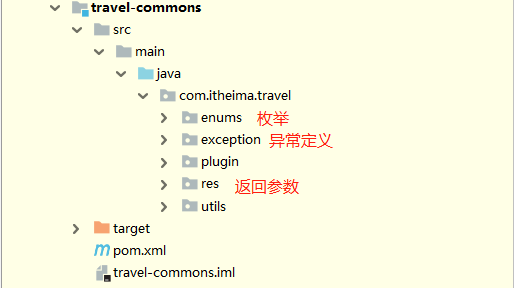
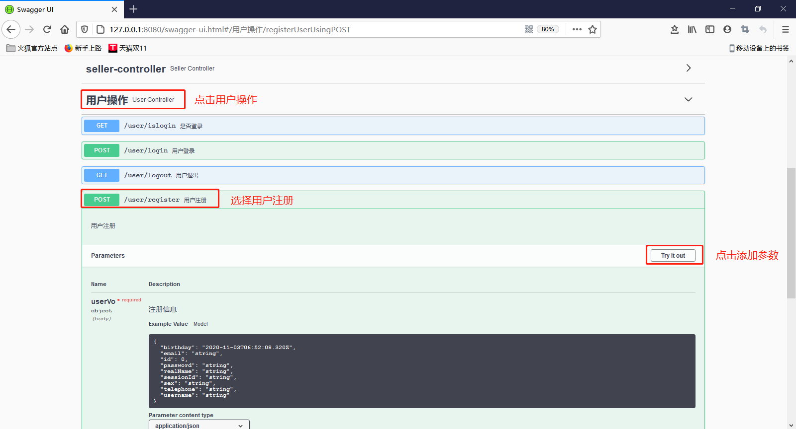
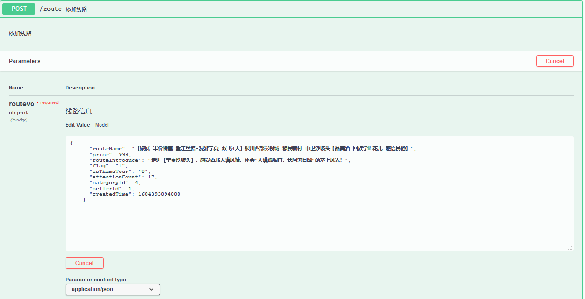

目录

[TOC]


## 学习目标

```html
1、完成各个模块开发
2、完成swagger2集成及开发
3、掌握缓存集成及使用
```

## 第一章 web-platform的开发

### 1、返回参数封装

##### 【1.1】依赖引入

```xml
<?xml version="1.0" encoding="UTF-8"?>

<project xmlns="http://maven.apache.org/POM/4.0.0" xmlns:xsi="http://www.w3.org/2001/XMLSchema-instance"
         xsi:schemaLocation="http://maven.apache.org/POM/4.0.0 http://maven.apache.org/xsd/maven-4.0.0.xsd">
    <parent>
        <artifactId>travel-parent</artifactId>
        <groupId>com.itheima.travel</groupId>
        <version>1.0-SNAPSHOT</version>
    </parent>
    <modelVersion>4.0.0</modelVersion>

    <artifactId>travel-web-platform</artifactId>
    <packaging>war</packaging>

    <name>travel-web-platform</name>


    <dependencies>

        <dependency>
            <groupId>com.itheima.travel</groupId>
            <artifactId>travel-service</artifactId>
        </dependency>

        <!--servlet 容器依赖-->
        <dependency>
            <groupId>javax.servlet</groupId>
            <artifactId>javax.servlet-api</artifactId>
            <scope>provided</scope>
        </dependency>

    </dependencies>

    <build>
        <finalName>travel-web-platform</finalName>
        <plugins>
            <!-- 声明打包时，不需要web.xml -->
            <plugin>
                <groupId>org.apache.maven.plugins</groupId>
                <artifactId>maven-war-plugin</artifactId>
                <configuration>
                    <failOnMissingWebXml>false</failOnMissingWebXml>
                </configuration>
            </plugin>
            <!-- tomcat7插件,命令： mvn tomcat7:run -DskipTests -->
            <plugin>
                <groupId>org.apache.tomcat.maven</groupId>
                <artifactId>tomcat7-maven-plugin</artifactId>
                <configuration>
                    <uriEncoding>utf-8</uriEncoding>
                    <port>8080</port>
                    <path>/</path>
                </configuration>
            </plugin>
        </plugins>
    </build>
</project>
```

##### 【1.2】返回参数

拷贝\黑马旅游-day03\02-课程资料目录里enums，res，exception到travel-commons项目中




用于返回信息的枚举定义

```Java
package com.itheima.travel.enums;

/**
 * @Description：
 */
public enum StatusEnum {
    SUCCEED("200","操作成功"),
    FAIL("1000","操作失败"),
    NO_LOGIN("1001", "请登录"),
    LOGIN_FAILURE("1002", "登录失败"),
    LOGOUT("1003", "注销成功"),
    NO_AUTH("1004", "权限不足"),
    NO_ROLE("1005", "角色不符合"),
    UPLOAD_FAIL("1006", "上传失败"),
    BIND_BUSINESS_FAIL("1007", "附件绑定业务失败"),
    FIND_AFFIX_BUSINESSID_FAIL("1008", "查询业务对应附件失败"),
    FIND_ALL_CATEGORY_FAIL("1009", "查询分类失败"),
    ADD_FAVORITE_FAIL("1010", "添加收藏失败"),
    FIND_MYFAVORITE_FAIL("1011", "查询我的收藏失败"),
    ISFAVORITED_FAIL("1013", "查询是否收藏失败"),
    ADD_ROUTE_FAIL("1014", "添加线路失败"),
    UPDATE_ROUTE_FAIL("1015", "修改线路失败"),
    FIND_ROUTE_ID_FAIL("1016", "查询线路失败"),
    FIND_ROUTE_PAGE_FAIL("1017", "分页查询线路失败"),
    REGISTER_USER_FAIL("1018", "注册用户失败"),
    LOGIN_USER_FAIL("1019", "用户登录失败"),
    ISLOGIN_FAIL("1020", "是否登录查询失败")

    ;

    private String code;
    private String msg;

    StatusEnum(String code, String msg) {
        this.code = code;
        this.msg = msg;
    }

    public String getCode() {
        return code;
    }

    public String getMsg() {
        return msg;
    }

}
```

用于同意一场处理的定义

```java
package com.itheima.travel.exception;

/**
 * @Description：自定义异常
 */
public class ProjectException extends Exception {

    //错误编码
    private String code;

    //提示信息
    private String message;

    public ProjectException() {
    }

    public ProjectException(String code, String message) {
        this.code = code;
        this.message = message;
    }

    public String getCode() {
        return code;
    }

    public void setCode(String code) {
        this.code = code;
    }

    @Override
    public String getMessage() {
        return message;
    }

    public void setMessage(String message) {
        this.message = message;
    }

    @Override
    public String toString() {
        return "ProjectException{" +
                "code='" + code + '\'' +
                ", message='" + message + '\'' +
                '}';
    }
}
```

用于返回参数的定义

```Java
package com.itheima.travel.res;

import com.fasterxml.jackson.annotation.JsonFormat;
import com.itheima.travel.utils.ToString;
import lombok.AllArgsConstructor;
import lombok.Builder;
import lombok.Data;
import lombok.NoArgsConstructor;

import java.util.Date;

/**
 * @Description 返回结果
 */
@Data
@Builder
@AllArgsConstructor
@NoArgsConstructor
public class ResponseWrap<T> extends ToString {

    //返回编码
    private String code;

    //返回信息
    private String msg;

    //创建时间,处理json的时间参数解析
    @JsonFormat(pattern = "yyyy-MM-dd hh:mm:ss",timezone = "GMT+8")
    private Date operationTime;

    //返回结果
    private T data;

    //图片站点
    private String webSite;

}
```

### 2、web端相关配置

#### 【1】PlatformSpringMvcConfig

在travel-web-platform项目中添加下列配置

```java
package com.itheima.travel;

import com.itheima.travel.config.SpringMvcConfig;
import com.itheima.travel.interceptors.LoginInterceptor;
import org.springframework.context.annotation.Bean;
import org.springframework.context.annotation.ComponentScan;
import org.springframework.context.annotation.Configuration;
import org.springframework.web.servlet.config.annotation.DefaultServletHandlerConfigurer;
import org.springframework.web.servlet.config.annotation.InterceptorRegistry;
import org.springframework.web.servlet.config.annotation.ResourceHandlerRegistry;
import org.springframework.web.servlet.config.annotation.ViewControllerRegistry;

/**
 * @Description：声明spring-mvc的配置类
 */
@ComponentScan(value = {"com.itheima.travel.web"})
@Configuration
public class PlatformSpringMvcConfig extends SpringMvcConfig {

    /**
     * @Description 登录拦截
     */
    @Bean("loginInterceptor")
    public LoginInterceptor loginInterceptor(){
        return new LoginInterceptor();
    }

    /**
     * @Description 拦截器
     */
    @Override
    public void addInterceptors(InterceptorRegistry registry) {
        // 登录拦截
        registry.addInterceptor(loginInterceptor())
                .addPathPatterns("/**")
                .excludePathPatterns(
                    "/**/user/**",
                    "/**/seller/**",
                    "/**/category/**",
                    "/**/webjars/**",
                    "/**/swagger-ui.html",
                    "/**/swagger-resources/**",
                    "/**/v2/**"
                );

    }
}
```

#### 【2】ProjectConfig

projectConfig 为启动文件

```Java
package com.itheima.travel;

import com.itheima.travel.config.MybatisConfig;
import com.itheima.travel.config.SpringConfig;
import org.springframework.context.annotation.Configuration;
import org.springframework.web.filter.CharacterEncodingFilter;
import org.springframework.web.servlet.support.AbstractAnnotationConfigDispatcherServletInitializer;

import javax.servlet.FilterRegistration;
import javax.servlet.ServletContext;
import javax.servlet.ServletException;

/**
 * @Description：声明启动时加载的类
 */
@Configuration
public class ProjectConfig extends AbstractAnnotationConfigDispatcherServletInitializer {


    /**
     * @Description 配置字符过滤
     * @param servletContext 容器
     * @return
     */
    @Override
    public void onStartup(ServletContext servletContext) throws ServletException {
        super.onStartup(servletContext);
        //字符集
        FilterRegistration.Dynamic dynamic = servletContext.addFilter("encodingFilter", CharacterEncodingFilter.class);
        dynamic.setInitParameter("encoding", "UTF-8");
        dynamic.addMappingForUrlPatterns(null, true, "/*");
    }

    @Override
    protected Class<?>[] getRootConfigClasses() {
        return new Class[]{SpringConfig.class, MybatisConfig.class};
    }

    @Override
    protected Class<?>[] getServletConfigClasses() {
        return new Class[]{PlatformSpringMvcConfig.class};
    }

    @Override
    protected String[] getServletMappings() {
        return new String[]{"/"};
    }
}
```

#### 【3】LoginInterceptor

LoginInterceptor为登录拦截器

```java
package com.itheima.travel.interceptors;

import com.alibaba.fastjson.JSONObject;
import com.itheima.travel.enums.StatusEnum;
import com.itheima.travel.pojo.User;
import com.itheima.travel.req.UserVo;
import com.itheima.travel.res.ResponseWrap;
import com.itheima.travel.utils.EmptyUtil;
import org.springframework.beans.factory.annotation.Autowired;
import org.springframework.beans.factory.annotation.Value;
import org.springframework.web.servlet.HandlerInterceptor;

import javax.servlet.http.HttpServletRequest;
import javax.servlet.http.HttpServletResponse;
import javax.servlet.http.HttpSession;
import java.util.Date;

/**
 * @Description：是否登录拦截
 */
public class LoginInterceptor implements HandlerInterceptor {


    @Autowired
    HttpSession session;


    //是否是测试环境
    @Value("${context.test}")
    String isTest;

    //预处理方法
    @Override
    public boolean preHandle(HttpServletRequest request, HttpServletResponse response,
                             Object handler) throws Exception {
        //是否为测试环境，如果是则直接放过
        if (Boolean.valueOf(isTest)){
            return true;
        }
        //如果当前的session中有用户信息，则表示当前用户已经登录
        boolean isLogin = false;
        Object attribute = session.getAttribute(session.getId());
        if (!EmptyUtil.isNullOrEmpty(attribute)){
            isLogin=true;
        }
        //如果当前用户未登录，则输出对应的错误信息给前段
        if (!isLogin) {
            response.setContentType("application/json; charset=utf-8");
            ResponseWrap<String> responseWrap = ResponseWrap.<String>builder()
                    .code(StatusEnum.NO_LOGIN.getCode())
                    .msg(StatusEnum.NO_LOGIN.getMsg())
                    .operationTime(new Date())
                    .data(null)
                    .build();
            //转换json,且处理时间格式
            response.getWriter().write(JSONObject.toJSONString(responseWrap));
            return false;
        }
        return true;
    }

}
```

### 3、controller开发

#### 【1】用户模块

```java
package com.itheima.travel.web;

import com.github.pagehelper.PageInfo;
import com.itheima.travel.enums.StatusEnum;
import com.itheima.travel.exception.ProjectException;
import com.itheima.travel.req.RouteVo;
import com.itheima.travel.req.UserVo;
import com.itheima.travel.res.ResponseWrap;
import com.itheima.travel.service.UserService;
import com.itheima.travel.utils.ExceptionsUtil;
import io.swagger.annotations.Api;
import io.swagger.annotations.ApiImplicitParam;
import io.swagger.annotations.ApiOperation;
import lombok.extern.log4j.Log4j2;
import org.springframework.beans.factory.annotation.Autowired;
import org.springframework.web.bind.annotation.*;

import java.util.Date;

/**
 * @ClassName UserController.java
 * @Description 用户controller
 */
@RestController
@RequestMapping
@Log4j2
@CrossOrigin
public class UserController {

    @Autowired
    UserService userService;

    /***
     * @description 注册用户
     * @param userVo 注册信息
     * @return: java.lang.Boolean
     */
    @PostMapping("user/register")
    public ResponseWrap<Boolean> registerUser(@RequestBody UserVo userVo) throws ProjectException {
        try {
            Boolean flag = userService.registerUser(userVo);
            return ResponseWrap.<Boolean>builder()
                    .code(StatusEnum.SUCCEED.getCode())
                    .msg(StatusEnum.SUCCEED.getMsg())
                    .operationTime(new Date())
                    .data(flag)
                    .build();
        }catch (Exception e){
            log.error("用户注册：{}", ExceptionsUtil.getStackTraceAsString(e));
            throw new ProjectException(StatusEnum.REGISTER_USER_FAIL.getCode(),
                    StatusEnum.REGISTER_USER_FAIL.getMsg());
        }

    }

    /***
     * @description 用户登录
     * @param userVo 登录信息：账号和密码不能为空
     * @return: com.itheima.travel.req.UserVo
     */
    @PostMapping("user/login")
    public ResponseWrap<UserVo> loginUser(@RequestBody UserVo userVo) throws ProjectException {
        try {
            UserVo userVoResult = userService.loginUser(userVo);
            return ResponseWrap.<UserVo>builder()
                    .code(StatusEnum.SUCCEED.getCode())
                    .msg(StatusEnum.SUCCEED.getMsg())
                    .operationTime(new Date())
                    .data(userVoResult)
                    .build();
        }catch (Exception e){
            log.error("用户登录：{}", ExceptionsUtil.getStackTraceAsString(e));
            throw new ProjectException(StatusEnum.LOGIN_USER_FAIL.getCode(),
                    StatusEnum.LOGIN_USER_FAIL.getMsg());
        }

    }

    /***
     * @description 用户退出
     * @return: com.itheima.travel.req.UserVo
     */
    @GetMapping("user/logout")
    public ResponseWrap<Boolean> loginOutUser() throws ProjectException {
        Boolean flag = true;
        try {
            userService.loginOutUser();
            return ResponseWrap.<Boolean>builder()
                    .code(StatusEnum.SUCCEED.getCode())
                    .msg(StatusEnum.SUCCEED.getMsg())
                    .operationTime(new Date())
                    .data(flag)
                    .build();
        }catch (Exception e){
            log.error("是否登录：{}", ExceptionsUtil.getStackTraceAsString(e));
            throw new ProjectException(StatusEnum.FAIL.getCode(),
                    StatusEnum.FAIL.getMsg());
        }
    }

    /***
     * @description 用户是否登录
     * @return: java.lang.Boolean
     */
    @GetMapping("user/islogin")
    public ResponseWrap<Boolean> isLogin() throws ProjectException {
        try {
            Boolean flag = userService.isLogin();
            return ResponseWrap.<Boolean>builder()
                    .code(StatusEnum.SUCCEED.getCode())
                    .msg(StatusEnum.SUCCEED.getMsg())
                    .operationTime(new Date())
                    .data(flag)
                    .build();
        }catch (Exception e){
            log.error("是否登录：{}", ExceptionsUtil.getStackTraceAsString(e));
            throw new ProjectException(StatusEnum.ISLOGIN_FAIL.getCode(),
                    StatusEnum.ISLOGIN_FAIL.getMsg());
        }

    }
    
    /***
     * @description 当前用户
     * @return: java.lang.Boolean
     */
    @RequestMapping("user/currentUser")
    public ResponseWrap<UserVo> currentUser() throws ProjectException {
        try {
            Object sessionAttribute = session.getAttribute(session.getId());
            if (!EmptyUtil.isNullOrEmpty(sessionAttribute)){
                return ResponseWrap.<UserVo>builder()
                        .code(StatusEnum.SUCCEED.getCode())
                        .msg(StatusEnum.SUCCEED.getMsg())
                        .operationTime(new Date())
                        .data((UserVo) sessionAttribute)
                        .build();
            }else {
                return ResponseWrap.<UserVo>builder()
                        .code(StatusEnum.SUCCEED.getCode())
                        .msg(StatusEnum.SUCCEED.getMsg())
                        .operationTime(new Date())
                        .data(null)
                        .build();
            }
        }catch (Exception e){
            log.error("当前用户：{}", ExceptionsUtil.getStackTraceAsString(e));
            throw new ProjectException(StatusEnum.FAIL.getCode(),
                    StatusEnum.FAIL.getMsg());
        }

    }
    
}

```


#### 【2】收藏模块

```java
package com.itheima.travel.web;

import com.github.pagehelper.PageInfo;
import com.itheima.travel.enums.StatusEnum;
import com.itheima.travel.exception.ProjectException;
import com.itheima.travel.pojo.Favorite;
import com.itheima.travel.req.CategoryVo;
import com.itheima.travel.req.FavoriteVo;
import com.itheima.travel.req.RouteVo;
import com.itheima.travel.res.ResponseWrap;
import com.itheima.travel.service.FavoriteService;
import com.itheima.travel.utils.ExceptionsUtil;
import io.swagger.annotations.Api;
import io.swagger.annotations.ApiImplicitParam;
import io.swagger.annotations.ApiImplicitParams;
import io.swagger.annotations.ApiOperation;
import lombok.extern.log4j.Log4j2;
import org.springframework.beans.factory.annotation.Autowired;
import org.springframework.web.bind.annotation.*;

import java.util.Date;
import java.util.List;

/**
 * @ClassName FavoriteController.java
 * @Description 我的关注
 */
@RestController
@RequestMapping
@Log4j2
@CrossOrigin
public class FavoriteController {

    @Autowired
    FavoriteService favoriteService;
    
    @Value("${upLoad.webSite}")
    String webSite;

    /***
     * @description 添加关注
     * @param favoriteVo
     * @return: java.lang.Integer
     */
    @PostMapping("favorite")
    public ResponseWrap<Integer> addFavorite(@RequestBody FavoriteVo favoriteVo) throws ProjectException {
        try {
            Integer flag = favoriteService.addFavorite(favoriteVo);
            return ResponseWrap.<Integer>builder()
                    .code(StatusEnum.SUCCEED.getCode())
                    .msg(StatusEnum.SUCCEED.getMsg())
                    .operationTime(new Date())
                    .data(flag)
                    .build();
        }catch (Exception e){
            log.error("添加收藏：{}", ExceptionsUtil.getStackTraceAsString(e));
            throw new ProjectException(StatusEnum.ADD_FAVORITE_FAIL.getCode(),
                    StatusEnum.ADD_FAVORITE_FAIL.getMsg());
        }

    }

    /***
     * @description 查询我的分页 需要注意的是：此处使用@RequestBody必须使用@PostMapping
     * @param favoriteVo 查询对象
     * @param pageNum 页码
     * @param pageSize 每页返回数
     * @return: com.github.pagehelper.PageInfo<com.itheima.travel.req.RouteVo>
     */
    @PostMapping("favorite/{pageNum}/{pageSize}")
    public ResponseWrap<PageInfo<RouteVo>> findMyFavorite(@RequestBody FavoriteVo favoriteVo,
                                     @PathVariable("pageNum")Integer pageNum,
                                     @PathVariable("pageSize")Integer pageSize) throws ProjectException {
        try {
            PageInfo<RouteVo> myFavorite = favoriteService.findMyFavorite(favoriteVo, pageNum, pageSize);
            return ResponseWrap.<PageInfo<RouteVo>>builder()
                    .code(StatusEnum.SUCCEED.getCode())
                    .msg(StatusEnum.SUCCEED.getMsg())
                    .operationTime(new Date())
               		.webSite(webSite)
                    .data(myFavorite)
                    .build();
        }catch (Exception e){
            log.error("我的收藏：{}", ExceptionsUtil.getStackTraceAsString(e));
            throw new ProjectException(StatusEnum.FIND_MYFAVORITE_FAIL.getCode(),
                    StatusEnum.FIND_MYFAVORITE_FAIL.getMsg());
        }

    }

    /***
     * @description 是否关注
     * @param routeId 线路Id
     * @return: java.lang.Boolean
     */
    @GetMapping("favorite/{routeId}")
    public ResponseWrap<Boolean> isFavorited(@PathVariable("routeId") Long routeId) throws ProjectException {
        FavoriteVo favoriteVo = FavoriteVo.builder().routeId(routeId).build();
        try {
            Boolean flag = favoriteService.isFavorited(favoriteVo);
            return ResponseWrap.<Boolean>builder()
                    .code(StatusEnum.SUCCEED.getCode())
                    .msg(StatusEnum.SUCCEED.getMsg())
                    .operationTime(new Date())
                    .data(flag)
                    .build();
        }catch (Exception e){
            log.error("是否收藏：{}", ExceptionsUtil.getStackTraceAsString(e));
            throw new ProjectException(StatusEnum.ISFAVORITED_FAIL.getCode(),
                    StatusEnum.ISFAVORITED_FAIL.getMsg());
        }

    }
}

```

#### 【3】分类模块

```java
package com.itheima.travel.web;

import com.itheima.travel.enums.StatusEnum;
import com.itheima.travel.exception.ProjectException;
import com.itheima.travel.req.AffixVo;
import com.itheima.travel.req.CategoryVo;
import com.itheima.travel.res.ResponseWrap;
import com.itheima.travel.service.CategoryService;
import com.itheima.travel.utils.ExceptionsUtil;
import io.swagger.annotations.Api;
import io.swagger.annotations.ApiOperation;
import lombok.extern.log4j.Log4j2;
import org.springframework.beans.factory.annotation.Autowired;
import org.springframework.web.bind.annotation.GetMapping;
import org.springframework.web.bind.annotation.RequestMapping;
import org.springframework.web.bind.annotation.RestController;

import java.util.Date;
import java.util.List;

/**
 * @ClassName CategoryController.java
 * @Description 分类controller
 */
@RequestMapping
@RestController
@Log4j2
@CrossOrigin
public class CategoryController {

    @Autowired
    CategoryService categoryService;

    /***
     * @description 查询所有分类列表
     * @return: java.util.List<com.itheima.travel.req.CategoryVo>
     */
    @GetMapping("category")
    public ResponseWrap<List<CategoryVo>> findAllCategory() throws ProjectException {
        try {
            List<CategoryVo> allCategory = categoryService.findAllCategory();
            return ResponseWrap.<List<CategoryVo>>builder()
                    .code(StatusEnum.SUCCEED.getCode())
                    .msg(StatusEnum.SUCCEED.getMsg())
                    .operationTime(new Date())
                    .data(allCategory)
                    .build();
        }catch (Exception e){
            log.error("查询分类：{}", ExceptionsUtil.getStackTraceAsString(e));
            throw new ProjectException(StatusEnum.FIND_ALL_CATEGORY_FAIL.getCode(),
                    StatusEnum.FIND_ALL_CATEGORY_FAIL.getMsg());
        }

    }
}

```

#### 【4】线路模块

```java
package com.itheima.travel.web;

import com.github.pagehelper.PageInfo;
import com.itheima.travel.enums.StatusEnum;
import com.itheima.travel.exception.ProjectException;
import com.itheima.travel.req.CategoryVo;
import com.itheima.travel.req.RouteVo;
import com.itheima.travel.res.ResponseWrap;
import com.itheima.travel.service.RouteService;
import com.itheima.travel.utils.ExceptionsUtil;
import io.swagger.annotations.Api;
import io.swagger.annotations.ApiImplicitParam;
import io.swagger.annotations.ApiImplicitParams;
import io.swagger.annotations.ApiOperation;
import lombok.extern.log4j.Log4j2;
import org.springframework.beans.factory.annotation.Autowired;
import org.springframework.web.bind.annotation.*;

import java.util.Date;
import java.util.List;

/**
 * @ClassName RouteController.java
 * @Description 线路controller
 */
@RestController
@RequestMapping("route")
@Log4j2
@CrossOrigin
public class RouteController {

    @Autowired
    RouteService routeService;
    
    @Value("${upLoad.webSite}")
    String webSite;
    
    /**
     * @Description 添加路线
     * @param routeVo 路径请求参数
     * @return 影响行数
     */
    @PostMapping
    public ResponseWrap<Integer> addRoute(@RequestBody RouteVo routeVo) throws ProjectException {
        try {
            Integer flag = routeService.addRoute(routeVo);
            return ResponseWrap.<Integer>builder()
                    .code(StatusEnum.SUCCEED.getCode())
                    .msg(StatusEnum.SUCCEED.getMsg())
                    .operationTime(new Date())
                    .data(flag)
                    .build();
        }catch (Exception e){
            log.error("添加线路：{}", ExceptionsUtil.getStackTraceAsString(e));
            throw new ProjectException(StatusEnum.ADD_ROUTE_FAIL.getCode(),
                    StatusEnum.ADD_ROUTE_FAIL.getMsg());
        }

    }

    /**
     * @Description 编辑线路
     * @param routeVo 线路请求参数
     * @return 影响行数
     */
    @PutMapping
    public ResponseWrap<Integer> updateRoute(@RequestBody RouteVo routeVo) throws ProjectException {
        try {
            Integer flag = routeService.updateRoute(routeVo);
            return ResponseWrap.<Integer>builder()
                    .code(StatusEnum.SUCCEED.getCode())
                    .msg(StatusEnum.SUCCEED.getMsg())
                    .operationTime(new Date())
                	.webSite(webSite)
                    .data(flag)
                    .build();
        }catch (Exception e){
            log.error("修改线路：{}", ExceptionsUtil.getStackTraceAsString(e));
            throw new ProjectException(StatusEnum.UPDATE_ROUTE_FAIL.getCode(),
                    StatusEnum.UPDATE_ROUTE_FAIL.getMsg());
        }

    }

    /**
     * @Description 查询线路
     * @param routeId 路径id
     * @return 线路详情
     */
    @GetMapping("{routeId}")
    public ResponseWrap<RouteVo> findRouteById(@PathVariable("routeId") Long routeId) throws ProjectException {
        try {
            RouteVo routeVo = RouteVo.builder().id(routeId).build();
            RouteVo routeResult = routeService.findRouteById(routeVo);
            return ResponseWrap.<RouteVo>builder()
                    .code(StatusEnum.SUCCEED.getCode())
                    .msg(StatusEnum.SUCCEED.getMsg())
                    .operationTime(new Date())
                	.webSite(webSite)
                    .data(routeResult)
                    .build();
        }catch (Exception e){
            log.error("查询线路：{}", ExceptionsUtil.getStackTraceAsString(e));
            throw new ProjectException(StatusEnum.FIND_ROUTE_ID_FAIL.getCode(),
                    StatusEnum.FIND_ROUTE_ID_FAIL.getMsg());
        }

    }

    /**
     * @description 分页查询线路
     * @param routeVo 查询条件
     * @param pageNum 分页
     * @param pageSize 每页返回数
     * @return: com.github.pagehelper.PageInfo<com.itheima.travel.req.RouteVo>
     */
    @PostMapping("{pageNum}/{pageSize}")
    public ResponseWrap<PageInfo<RouteVo>> findRouteByPage(@RequestBody RouteVo routeVo,
                                      @PathVariable("pageNum") Integer pageNum,
                                      @PathVariable("pageSize") Integer pageSize) throws ProjectException {
        try {
            PageInfo<RouteVo> routeByPage = routeService.findRouteByPage(routeVo, pageNum, pageSize);
            return ResponseWrap.<PageInfo<RouteVo>>builder()
                    .code(StatusEnum.SUCCEED.getCode())
                    .msg(StatusEnum.SUCCEED.getMsg())
                    .operationTime(new Date())
                	.webSite(webSite)
                    .data(routeByPage)
                    .build();
        }catch (Exception e){
            log.error("分页查询线路：{}", ExceptionsUtil.getStackTraceAsString(e));
            throw new ProjectException(StatusEnum.FIND_ROUTE_PAGE_FAIL.getCode(),
                    StatusEnum.FIND_ROUTE_PAGE_FAIL.getMsg());
        }

    }

}

```

#### 【5】附件模块

```java
package com.itheima.travel.web;

import com.itheima.travel.enums.StatusEnum;
import com.itheima.travel.exception.ProjectException;
import com.itheima.travel.req.AffixVo;
import com.itheima.travel.res.ResponseWrap;
import com.itheima.travel.service.AffixService;
import com.itheima.travel.utils.ExceptionsUtil;
import io.swagger.annotations.Api;
import io.swagger.annotations.ApiImplicitParam;
import io.swagger.annotations.ApiImplicitParams;
import io.swagger.annotations.ApiOperation;
import lombok.extern.log4j.Log4j2;
import org.springframework.beans.factory.annotation.Autowired;
import org.springframework.web.bind.annotation.*;
import org.springframework.web.multipart.MultipartFile;

import java.io.IOException;
import java.util.Date;
import java.util.List;

/**
 * @ClassName AffixController.java
 * @Description 附件模块
 */
@RestController
@RequestMapping("affix")
@Log4j2
@CrossOrigin
public class AffixController {

    @Autowired
    AffixService affixService;

    /***
     * @description 文件上传
     * @param file 上传对象
     * @return: com.itheima.travel.req.AffixVo
     */
    @PostMapping(value = "upload/{businessType}")
    public ResponseWrap<AffixVo> upLoad(
            MultipartFile file,
            @PathVariable("businessType") String businessType)
            throws ProjectException {
        AffixVo affixVo = AffixVo.builder().businessType(businessType).build();
        AffixVo affixVoResult = null;
        try {
            affixVoResult = affixService.upLoad(file, affixVo);
            return ResponseWrap.<AffixVo>builder()
                    .code(StatusEnum.SUCCEED.getCode())
                    .msg(StatusEnum.SUCCEED.getMsg())
                    .operationTime(new Date())
                    .data(affixVoResult)
                    .build();
        } catch (IOException e) {
            log.error("文件上传异常：{}",ExceptionsUtil.getStackTraceAsString(e));
            throw new ProjectException(StatusEnum.UPLOAD_FAIL.getCode(),
                    StatusEnum.UPLOAD_FAIL.getMsg());
        }
    }

    /***
     * @description 绑定业务
     * @param affixVo 附件信息
     * @return: java.lang.Boolean
     */
    @PostMapping("bindBusinessId")
    public ResponseWrap<Boolean> bindBusinessId(@RequestBody AffixVo affixVo) throws ProjectException {
        try {
            Boolean flag = affixService.bindBusinessId(affixVo);
            return ResponseWrap.<Boolean>builder()
                    .code(StatusEnum.SUCCEED.getCode())
                    .msg(StatusEnum.SUCCEED.getMsg())
                    .operationTime(new Date())
                    .data(flag)
                    .build();
        }catch (Exception e){
            log.error("附件绑定业务异常：{}",ExceptionsUtil.getStackTraceAsString(e));
            throw new ProjectException(StatusEnum.BIND_BUSINESS_FAIL.getCode(),
                    StatusEnum.BIND_BUSINESS_FAIL.getMsg());
        }

    }

    /**
     * @description 按业务ID查询附件
     * @param  businessId 业务ID
     * @return java.util.List<com.itheima.travel.req.AffixVo>
     */
    @GetMapping("{businessId}")
    public ResponseWrap<List<AffixVo>> findAffixByBusinessId(@PathVariable("businessId") Long businessId) throws ProjectException {
        try {
            AffixVo affixVo = AffixVo.builder().businessId(businessId).build();
            List<AffixVo> AffixVoList = affixService.findAffixByBusinessId(affixVo);
            return ResponseWrap.<List<AffixVo>>builder()
                    .code(StatusEnum.SUCCEED.getCode())
                    .msg(StatusEnum.SUCCEED.getMsg())
                    .operationTime(new Date())
                    .data(AffixVoList)
                    .build();
        }catch (Exception e){
            log.error("查询业务对应附件：{}",ExceptionsUtil.getStackTraceAsString(e));
            throw new ProjectException(StatusEnum.FIND_AFFIX_BUSINESSID_FAIL.getCode(),
                    StatusEnum.FIND_AFFIX_BUSINESSID_FAIL.getMsg());
        }
    }

}

```

#### 【6】商家模块

```java
package com.itheima.travel.web;

import com.github.pagehelper.PageInfo;
import com.itheima.travel.enums.StatusEnum;
import com.itheima.travel.exception.ProjectException;
import com.itheima.travel.req.RouteVo;
import com.itheima.travel.req.SellerVo;
import com.itheima.travel.res.ResponseWrap;
import com.itheima.travel.service.SellerService;
import com.itheima.travel.utils.ExceptionsUtil;
import io.swagger.annotations.Api;
import io.swagger.annotations.ApiImplicitParam;
import io.swagger.annotations.ApiOperation;
import lombok.extern.log4j.Log4j2;
import org.springframework.beans.factory.annotation.Autowired;
import org.springframework.web.bind.annotation.*;

import java.util.Date;

/**
 * @ClassName SellerController.java
 * @Description 商家用户controller
 */
@RestController
@RequestMapping
@Log4j2
@CrossOrigin
public class SellerController {

    @Autowired
    SellerService sellerService;

    /***
     * @description 注册商家用户
     * @param sellerVo 注册信息
     * @return: java.lang.Boolean
     */
    @PostMapping("seller/register")
    public ResponseWrap<Boolean> registerSeller(@RequestBody SellerVo sellerVo) throws ProjectException {
        try {
            Boolean flag = sellerService.registerSeller(sellerVo);
            return ResponseWrap.<Boolean>builder()
                    .code(StatusEnum.SUCCEED.getCode())
                    .msg(StatusEnum.SUCCEED.getMsg())
                    .operationTime(new Date())
                    .data(flag)
                    .build();
        }catch (Exception e){
            log.error("商家用户注册：{}", ExceptionsUtil.getStackTraceAsString(e));
            throw new ProjectException(StatusEnum.REGISTER_USER_FAIL.getCode(),
                    StatusEnum.REGISTER_USER_FAIL.getMsg());
        }

    }

    /***
     * @description 商家用户登录
     * @param sellerVo 登录信息：账号和密码不能为空
     * @return: com.itheima.travel.req.SellerVo
     */
    @PostMapping("seller/login")
    public ResponseWrap<SellerVo> loginSeller(@RequestBody SellerVo sellerVo) throws ProjectException {
        try {
            SellerVo sellerVoResult = sellerService.loginSeller(sellerVo);
            return ResponseWrap.<SellerVo>builder()
                    .code(StatusEnum.SUCCEED.getCode())
                    .msg(StatusEnum.SUCCEED.getMsg())
                    .operationTime(new Date())
                    .data(sellerVoResult)
                    .build();
        }catch (Exception e){
            log.error("商家用户登录：{}", ExceptionsUtil.getStackTraceAsString(e));
            throw new ProjectException(StatusEnum.LOGIN_USER_FAIL.getCode(),
                    StatusEnum.LOGIN_USER_FAIL.getMsg());
        }

    }

    /***
     * @description 商家用户退出
     * @return: com.itheima.travel.req.SellerVo
     */
    @GetMapping("seller/logout")
    public ResponseWrap<Boolean> loginOutUser() throws ProjectException {
        Boolean flag = true;
        try {
            sellerService.loginOutSeller();
            return ResponseWrap.<Boolean>builder()
                    .code(StatusEnum.SUCCEED.getCode())
                    .msg(StatusEnum.SUCCEED.getMsg())
                    .operationTime(new Date())
                    .data(flag)
                    .build();
        }catch (Exception e){
            log.error("是否登录：{}", ExceptionsUtil.getStackTraceAsString(e));
            throw new ProjectException(StatusEnum.FAIL.getCode(),
                    StatusEnum.FAIL.getMsg());
        }
    }

    /***
     * @description 商家用户是否登录
     * @return: java.lang.Boolean
     */
    @GetMapping("seller/islogin")
    public ResponseWrap<Boolean> isLogin() throws ProjectException {
        try {
            Boolean flag = sellerService.isLogin();
            return ResponseWrap.<Boolean>builder()
                    .code(StatusEnum.SUCCEED.getCode())
                    .msg(StatusEnum.SUCCEED.getMsg())
                    .operationTime(new Date())
                    .data(flag)
                    .build();
        }catch (Exception e){
            log.error("是否登录：{}", ExceptionsUtil.getStackTraceAsString(e));
            throw new ProjectException(StatusEnum.ISLOGIN_FAIL.getCode(),
                    StatusEnum.ISLOGIN_FAIL.getMsg());
        }

    }
    
    /***
     * @description 按id查询商家信息
     * @return: java.lang.Boolean
     */
    @GetMapping("seller/{sellerId}")
    public ResponseWrap<SellerVo> findSellerById(@PathVariable("sellerId") Long sellerId) throws ProjectException {
        try {
            SellerVo sellerVo = SellerVo.builder().id(sellerId).build();
            SellerVo sellerVoById = sellerService.findSellerVoById(sellerVo);
            return ResponseWrap.<SellerVo>builder()
                    .code(StatusEnum.SUCCEED.getCode())
                    .msg(StatusEnum.SUCCEED.getMsg())
                    .operationTime(new Date())
                    .data(sellerVoById)
                    .build();
        }catch (Exception e){
            log.error("商家信息：{}", ExceptionsUtil.getStackTraceAsString(e));
            throw new ProjectException(StatusEnum.FAIL.getCode(),
                    StatusEnum.FAIL.getMsg());
        }
    }
}
```

## 第二章  Swagger2构建RESTful API

### 1、为什么使用swagger

​		由于Spring Boot能够快速开发、便捷部署等特性，相信有很大一部分Spring Boot的用户会用来构建RESTful  API。而我们构建RESTful  API的目的通常都是由于多终端的原因，这些终端会共用很多底层业务逻辑，因此我们会抽象出这样一层来同时服务于多个移动端或者Web前端。

这样一来，我们的RESTful  API就有可能要面对多个开发人员或多个开发团队：IOS开发、Android开发或是Web开发等。为了减少与其他团队平时开发期间的频繁沟通成本，传统做法我们会创建一份RESTful API文档来记录所有接口细节，然而这样的做法有以下几个问题：

```properties
	由于接口众多，并且细节复杂（需要考虑不同的HTTP请求类型、HTTP头部信息、HTTP请求内容等），高质量地创建这份文档本身就是件非常吃力的事，下游的抱怨声不绝于耳。
	随着时间推移，不断修改接口实现的时候都必须同步修改接口文档，而文档与代码又处于两个不同的媒介，除非有严格的管理机制，不然很容易导致不一致现象。
```

### 2、配置swagger2

#### 【1】添加pom依赖

在travel-parent的pom添加

```xml
<!--swagger2版本支持-->
<swagger2>2.10.5</swagger2>

<!--swagger2支持-->
<dependency>
    <groupId>io.springfox</groupId>
    <artifactId>springfox-swagger2</artifactId>
    <version>${swagger2}</version>
</dependency>
<dependency>
    <groupId>io.springfox</groupId>
    <artifactId>springfox-swagger-ui</artifactId>
    <version>${swagger2}</version>
</dependency>

<dependency>
    <groupId>io.springfox</groupId>
    <artifactId>springfox-spring-webmvc</artifactId>
    <version>${swagger2}</version>
</dependency>
```

在travel-web-platform中引入依赖

#### 【2】SwaggerConfig

在2.10.X的版本中使用是@EnableSwagger2WebMvc，之前版本使用@EnableSwagger2，3.0以后是@EnableOpenApi

```java
package com.itheima.travel;

import org.springframework.context.annotation.Bean;
import org.springframework.context.annotation.Configuration;
import springfox.documentation.builders.ApiInfoBuilder;
import springfox.documentation.builders.PathSelectors;
import springfox.documentation.builders.RequestHandlerSelectors;
import springfox.documentation.service.Contact;
import springfox.documentation.spi.DocumentationType;
import springfox.documentation.spring.web.plugins.Docket;
import springfox.documentation.swagger2.annotations.EnableSwagger2WebMvc;

import java.util.function.Predicate;

@Configuration
//开启swagger2的webmvc支持
@EnableSwagger2WebMvc
public class SwaggerConfig {

    @Bean
    public Docket createRestApi() {
        // 构建API文档  文档类型为swagger2
        return new Docket(DocumentationType.SWAGGER_2)
                .select()
                // 配置 api扫描路径
                .apis(RequestHandlerSelectors.basePackage("com.itheima.travel.web"))
                // 指定路径的设置  any代表所有路径
                .paths(PathSelectors.any())
                // api的基本信息
                .build().apiInfo(new ApiInfoBuilder()
                        // api文档名称
                        .title("SSM黑马旅游Swagger接口文档")
                        // api文档描述
                        .description("SSM黑马旅游，描述信息......")
                        .contact(new Contact("束XX", "http://www.itcatst.com", "58948528@qq.com"))
                        // api文档版本
                        .version("1.0") // 版本
                        .build());
    }

}

```

#### 【3】编辑PlatformSpringMvcConfig

​		@ComponentScan(value = {"com.itheima.travel.web","springfox.documentation.swagger.web"})中添加swagger的扫描，这个是为了让springfox.documentation.swagger.web.ApiResourceController生效

​		loginInterceptor()中要添加对应资源的放过，addResourceHandlers中添加对应静态资源的放过

```java
package com.itheima.travel;

import com.itheima.travel.config.SpringMvcConfig;
import com.itheima.travel.interceptors.LoginInterceptor;
import org.springframework.context.annotation.Bean;
import org.springframework.context.annotation.ComponentScan;
import org.springframework.context.annotation.Configuration;
import org.springframework.web.servlet.config.annotation.DefaultServletHandlerConfigurer;
import org.springframework.web.servlet.config.annotation.InterceptorRegistry;
import org.springframework.web.servlet.config.annotation.ResourceHandlerRegistry;
import org.springframework.web.servlet.config.annotation.ViewControllerRegistry;

/**
 * @Description：声明spring-mvc的配置类
 */
@ComponentScan(value = {"com.itheima.travel.web","springfox.documentation.swagger.web"})
@Configuration
public class PlatformSpringMvcConfig extends SpringMvcConfig {

    /**
     * @Description 登录拦截
     */
    @Bean("loginInterceptor")
    public LoginInterceptor loginInterceptor(){
        return new LoginInterceptor();
    }

    /**
     * 资源路径 映射
     */
    @Override
    protected void addResourceHandlers(ResourceHandlerRegistry registry) {
        /**
         * 支持webjars
         */
        registry.addResourceHandler("/webjars/**")
                .addResourceLocations("classpath:/META-INF/resources/webjars/");
        /**
         * 支持swagger
         */
        registry.addResourceHandler("swagger-ui.html")
                .addResourceLocations("classpath:/META-INF/resources/");
        super.addResourceHandlers(registry);
    }

    /**
     * @Description 拦截器
     */
    @Override
    public void addInterceptors(InterceptorRegistry registry) {
        // 登录拦截
        registry.addInterceptor(loginInterceptor())
                .addPathPatterns("/**")
                .excludePathPatterns(
                    "/**/user/**",
                    "/**/seller/**",
                    "/**/category/**",
                    "/**/webjars/**",
                    "/**/swagger-ui.html",
                    "/**/swagger-resources/**",
                    "/**/v2/**"
                );

    }
}

```

### 3、swagger2支持controller

#### 【1】swagger2常用注解

```text
@Api：用在请求的类上，表示对类的说明
    tags="说明该类的作用，可以在UI界面上看到的注解"
    value="该参数没什么意义，在UI界面上也看到，所以不需要配置"

@ApiOperation：用在请求的方法上，说明方法的用途、作用
    value="说明方法的用途、作用"
    notes="方法的备注说明"

@ApiImplicitParams：用在请求的方法上，表示一组参数说明
    @ApiImplicitParam：用在@ApiImplicitParams注解中，指定一个请求参数的各个方面
        name：参数名
        value：参数的汉字说明、解释
        required：参数是否必须传
        paramType：参数放在哪个地方
            · header --> 请求参数的获取：@RequestHeader
            · query --> 请求参数的获取：@RequestParam
            · path（用于restful接口）--> 请求参数的获取：@PathVariable
            · div（不常用）
            · form（不常用）    
        dataType：参数类型，默认String，其它值dataType="Integer"       
        defaultValue：参数的默认值

@ApiResponses：用在请求的方法上，表示一组响应
    @ApiResponse：用在@ApiResponses中，一般用于表达一个错误的响应信息
        code：数字，例如400
        message：信息，例如"请求参数没填好"
        response：抛出异常的类

@ApiModel：用于响应类上，表示一个返回响应数据的信息
            （这种一般用在post创建的时候，使用@RequestBody这样的场景，
            请求参数无法使用@ApiImplicitParam注解进行描述的时候）
@ApiModelProperty：用在属性上，描述响应类的属性
```

#### 【2】用户模块

##### 【2.1】UserController

```java
package com.itheima.travel.web;

import com.github.pagehelper.PageInfo;
import com.itheima.travel.enums.StatusEnum;
import com.itheima.travel.exception.ProjectException;
import com.itheima.travel.req.RouteVo;
import com.itheima.travel.req.UserVo;
import com.itheima.travel.res.ResponseWrap;
import com.itheima.travel.service.UserService;
import com.itheima.travel.utils.EmptyUtil;
import com.itheima.travel.utils.ExceptionsUtil;
import io.swagger.annotations.Api;
import io.swagger.annotations.ApiImplicitParam;
import io.swagger.annotations.ApiOperation;
import lombok.extern.log4j.Log4j2;
import org.springframework.beans.factory.annotation.Autowired;
import org.springframework.web.bind.annotation.*;

import javax.servlet.http.HttpSession;
import java.util.Date;

/**
 * @ClassName UserController.java
 * @Description 用户controller
 */
@RestController
@RequestMapping
@Api(tags = "用户操作")
@Log4j2
@CrossOrigin
public class UserController {

    @Autowired
    UserService userService;

    @Autowired
    HttpSession session;

    /***
     * @description 注册用户
     * @param userVo 注册信息
     * @return: java.lang.Boolean
     */
    @PostMapping("user/register")
    @ApiOperation(value = "用户注册",notes = "用户注册")
    @ApiImplicitParam(name = "userVo",value = "注册信息",required = true,dataType = "UserVo")
    public ResponseWrap<Boolean> registerUser(@RequestBody UserVo userVo) throws ProjectException {
        try {
            Boolean flag = userService.registerUser(userVo);
            return ResponseWrap.<Boolean>builder()
                    .code(StatusEnum.SUCCEED.getCode())
                    .msg(StatusEnum.SUCCEED.getMsg())
                    .operationTime(new Date())
                    .data(flag)
                    .build();
        }catch (Exception e){
            log.error("用户注册：{}", ExceptionsUtil.getStackTraceAsString(e));
            throw new ProjectException(StatusEnum.REGISTER_USER_FAIL.getCode(),
                    StatusEnum.REGISTER_USER_FAIL.getMsg());
        }

    }

    /***
     * @description 用户登录
     * @param userVo 登录信息：账号和密码不能为空
     * @return: com.itheima.travel.req.UserVo
     */
    @PostMapping("user/login")
    @ApiOperation(value = "用户登录",notes = "用户登录")
    @ApiImplicitParam(name = "userVo",value = "登录信息",required = true,dataType = "UserVo")
    public ResponseWrap<UserVo> loginUser(@RequestBody UserVo userVo) throws ProjectException {
        try {
            UserVo userVoResult = userService.loginUser(userVo);
            return ResponseWrap.<UserVo>builder()
                    .code(StatusEnum.SUCCEED.getCode())
                    .msg(StatusEnum.SUCCEED.getMsg())
                    .operationTime(new Date())
                    .data(userVoResult)
                    .build();
        }catch (Exception e){
            log.error("用户登录：{}", ExceptionsUtil.getStackTraceAsString(e));
            throw new ProjectException(StatusEnum.LOGIN_USER_FAIL.getCode(),
                    StatusEnum.LOGIN_USER_FAIL.getMsg());
        }

    }

    /***
     * @description 用户退出
     * @return: com.itheima.travel.req.UserVo
     */
    @GetMapping("user/logout")
    @ApiOperation(value = "用户退出",notes = "用户退出")
    public ResponseWrap<Boolean> loginOutUser() throws ProjectException {
        Boolean flag = true;
        try {
            userService.loginOutUser();
            return ResponseWrap.<Boolean>builder()
                    .code(StatusEnum.SUCCEED.getCode())
                    .msg(StatusEnum.SUCCEED.getMsg())
                    .operationTime(new Date())
                    .data(flag)
                    .build();
        }catch (Exception e){
            log.error("是否登录：{}", ExceptionsUtil.getStackTraceAsString(e));
            throw new ProjectException(StatusEnum.FAIL.getCode(),
                    StatusEnum.FAIL.getMsg());
        }
    }

    /***
     * @description 用户是否登录
     * @return: java.lang.Boolean
     */
    @GetMapping("user/islogin")
    @ApiOperation(value = "是否登录",notes = "是否登录")
    public ResponseWrap<Boolean> isLogin() throws ProjectException {
        try {
            Boolean flag = userService.isLogin();
            return ResponseWrap.<Boolean>builder()
                    .code(StatusEnum.SUCCEED.getCode())
                    .msg(StatusEnum.SUCCEED.getMsg())
                    .operationTime(new Date())
                    .data(flag)
                    .build();
        }catch (Exception e){
            log.error("是否登录：{}", ExceptionsUtil.getStackTraceAsString(e));
            throw new ProjectException(StatusEnum.ISLOGIN_FAIL.getCode(),
                    StatusEnum.ISLOGIN_FAIL.getMsg());
        }
    }

    /***
     * @description 当前用户
     * @return: java.lang.Boolean
     */
    @RequestMapping("user/currentUser")
    @ApiOperation(value = "当前用户",notes = "当前用户")
    public ResponseWrap<UserVo> currentUser() throws ProjectException {
        try {
            Object sessionAttribute = session.getAttribute(session.getId());
            if (!EmptyUtil.isNullOrEmpty(sessionAttribute)){
                return ResponseWrap.<UserVo>builder()
                        .code(StatusEnum.SUCCEED.getCode())
                        .msg(StatusEnum.SUCCEED.getMsg())
                        .operationTime(new Date())
                        .data((UserVo) sessionAttribute)
                        .build();
            }else {
                return ResponseWrap.<UserVo>builder()
                        .code(StatusEnum.SUCCEED.getCode())
                        .msg(StatusEnum.SUCCEED.getMsg())
                        .operationTime(new Date())
                        .data(null)
                        .build();
            }
        }catch (Exception e){
            log.error("当前用户：{}", ExceptionsUtil.getStackTraceAsString(e));
            throw new ProjectException(StatusEnum.FAIL.getCode(),
                    StatusEnum.FAIL.getMsg());
        }

    }
}

```

##### 【2.2】用户注册测试

使用maven的tomcat启动项目：


访问：http://127.0.0.1:8080/swagger-ui.html


swagger会吧com.itheima.travel.web下的所有接口都会扫描的且自动生成对应的文档接口



点击try it out后页面会展示的一个窗口如图：


填写内容如下

```json
{
  "birthday": "2020-11-03T06:52:08.320Z",
  "email": "59948528@qq.com",
  "password": "pass",
  "realName": "束XX",
  "sex": "1",
  "telephone": "15156403088",
  "username": "shu"
}
```


数据库


##### 【2.3】用户登录测试


填写内容

```json
{
  "password": "pass",
  "username": "admin"
}
```


##### 【2.4】是否登录测试


##### 【2.5】用户退出测试


##### 【2.6】当前用户


#### 【3】收藏模块

##### 【3.1】FavoriteController

```java
package com.itheima.travel.web;

import com.github.pagehelper.PageInfo;
import com.itheima.travel.enums.StatusEnum;
import com.itheima.travel.exception.ProjectException;
import com.itheima.travel.pojo.Favorite;
import com.itheima.travel.req.CategoryVo;
import com.itheima.travel.req.FavoriteVo;
import com.itheima.travel.req.RouteVo;
import com.itheima.travel.res.ResponseWrap;
import com.itheima.travel.service.FavoriteService;
import com.itheima.travel.utils.ExceptionsUtil;
import io.swagger.annotations.Api;
import io.swagger.annotations.ApiImplicitParam;
import io.swagger.annotations.ApiImplicitParams;
import io.swagger.annotations.ApiOperation;
import lombok.extern.log4j.Log4j2;
import org.springframework.beans.factory.annotation.Autowired;
import org.springframework.beans.factory.annotation.Value;
import org.springframework.web.bind.annotation.*;

import java.util.Date;
import java.util.List;

/**
 * @ClassName FavoriteController.java
 * @Description 我的关注
 */
@RestController
@RequestMapping
@Api(tags = "收藏操作")
@Log4j2
@CrossOrigin
public class FavoriteController {

    @Autowired
    FavoriteService favoriteService;

    @Value("${upLoad.webSite}")
    String webSite;

    /***
     * @description 添加关注
     * @param favoriteVo
     * @return: java.lang.Integer
     */
    @PostMapping("favorite")
    @ApiOperation(value = "添加收藏",notes = "添加收藏")
    @ApiImplicitParam(name = "favoriteVo",value = "收藏信息",required = true,dataType = "FavoriteVo")
    public ResponseWrap<Integer> addFavorite(@RequestBody FavoriteVo favoriteVo) throws ProjectException {
        try {
            Integer flag = favoriteService.addFavorite(favoriteVo);
            return ResponseWrap.<Integer>builder()
                    .code(StatusEnum.SUCCEED.getCode())
                    .msg(StatusEnum.SUCCEED.getMsg())
                    .operationTime(new Date())
                    .data(flag)
                    .build();
        }catch (Exception e){
            log.error("添加收藏：{}", ExceptionsUtil.getStackTraceAsString(e));
            throw new ProjectException(StatusEnum.ADD_FAVORITE_FAIL.getCode(),
                    StatusEnum.ADD_FAVORITE_FAIL.getMsg());
        }

    }

    /***
     * @description 查询我的分页 需要注意的是：此处使用@RequestBody必须使用@PostMapping
     * @param favoriteVo 查询对象
     * @param pageNum 页码
     * @param pageSize 每页返回数
     * @return: com.github.pagehelper.PageInfo<com.itheima.travel.req.RouteVo>
     */
    @PostMapping("favorite/{pageNum}/{pageSize}")
    @ApiOperation(value = "我的收藏",notes = "我的收藏")
    @ApiImplicitParams({
            @ApiImplicitParam(name = "favoriteVo",value = "收藏查询对象",required = false,dataType = "FavoriteVo"),
            @ApiImplicitParam(paramType = "path",name = "pageNum",value = "页码",dataType = "Integer"),
            @ApiImplicitParam(paramType = "path",name = "pageSize",value = "每页条数",dataType = "Integer")
            })
    public ResponseWrap<PageInfo<RouteVo>> findMyFavorite(@RequestBody FavoriteVo favoriteVo,
                                     @PathVariable("pageNum")Integer pageNum,
                                     @PathVariable("pageSize")Integer pageSize) throws ProjectException {
        try {
            PageInfo<RouteVo> myFavorite = favoriteService.findMyFavorite(favoriteVo, pageNum, pageSize);
            return ResponseWrap.<PageInfo<RouteVo>>builder()
                    .code(StatusEnum.SUCCEED.getCode())
                    .msg(StatusEnum.SUCCEED.getMsg())
                    .operationTime(new Date())
                    .webSite(webSite)
                    .data(myFavorite)
                    .build();
        }catch (Exception e){
            log.error("我的收藏：{}", ExceptionsUtil.getStackTraceAsString(e));
            throw new ProjectException(StatusEnum.FIND_MYFAVORITE_FAIL.getCode(),
                    StatusEnum.FIND_MYFAVORITE_FAIL.getMsg());
        }

    }

    /***
     * @description 是否关注
     * @param routeId 线路Id
     * @return: java.lang.Boolean
     */
    @GetMapping("favorite/{routeId}")
    @ApiOperation(value = "是否收藏",notes = "是否收藏")
    @ApiImplicitParam(paramType = "path",name = "routeId",value = "线路Id",dataType = "Long")
    public ResponseWrap<Boolean> isFavorited(@PathVariable("routeId") Long routeId) throws ProjectException {
        FavoriteVo favoriteVo = FavoriteVo.builder().routeId(routeId).build();
        try {
            Boolean flag = favoriteService.isFavorited(favoriteVo);
            return ResponseWrap.<Boolean>builder()
                    .code(StatusEnum.SUCCEED.getCode())
                    .msg(StatusEnum.SUCCEED.getMsg())
                    .operationTime(new Date())
                    .data(flag)
                    .build();
        }catch (Exception e){
            log.error("是否收藏：{}", ExceptionsUtil.getStackTraceAsString(e));
            throw new ProjectException(StatusEnum.ISFAVORITED_FAIL.getCode(),
                    StatusEnum.ISFAVORITED_FAIL.getMsg());
        }

    }
}

```

##### 【3.2】添加收藏

请先使用用户登录接口执行登录操作，然后选择添加收藏进行操作,


填写内容

```json
{
  "routeId": 1
}
```


##### 【3.3】我的收藏


##### 【3.4】是否收藏


#### 【4】分类模块

##### 【4.1】CategoryController

```java
package com.itheima.travel.web;

import com.itheima.travel.enums.StatusEnum;
import com.itheima.travel.exception.ProjectException;
import com.itheima.travel.req.AffixVo;
import com.itheima.travel.req.CategoryVo;
import com.itheima.travel.res.ResponseWrap;
import com.itheima.travel.service.CategoryService;
import com.itheima.travel.utils.ExceptionsUtil;
import io.swagger.annotations.Api;
import io.swagger.annotations.ApiOperation;
import lombok.extern.log4j.Log4j2;
import org.springframework.beans.factory.annotation.Autowired;
import org.springframework.web.bind.annotation.GetMapping;
import org.springframework.web.bind.annotation.RequestMapping;
import org.springframework.web.bind.annotation.RestController;

import java.util.Date;
import java.util.List;

/**
 * @ClassName CategoryController.java
 * @Description 分类controller
 */
@RequestMapping
@RestController
@Api(tags = "分类操作")
@Log4j2
@CrossOrigin
public class CategoryController {

    @Autowired
    CategoryService categoryService;

    /***
     * @description 查询所有分类列表
     * @return: java.util.List<com.itheima.travel.req.CategoryVo>
     */
    @GetMapping("category")
    @ApiOperation(value = "查询分类",notes = "查询分类")
    public ResponseWrap<List<CategoryVo>> findAllCategory() throws ProjectException {
        try {
            List<CategoryVo> allCategory = categoryService.findAllCategory();
            return ResponseWrap.<List<CategoryVo>>builder()
                    .code(StatusEnum.SUCCEED.getCode())
                    .msg(StatusEnum.SUCCEED.getMsg())
                    .operationTime(new Date())
                    .data(allCategory)
                    .build();
        }catch (Exception e){
            log.error("查询分类：{}", ExceptionsUtil.getStackTraceAsString(e));
            throw new ProjectException(StatusEnum.FIND_ALL_CATEGORY_FAIL.getCode(),
                    StatusEnum.FIND_ALL_CATEGORY_FAIL.getMsg());
        }

    }
}

```

##### 【4.2】查询分类测试


#### 【5】线路模块

##### 【5.1】RouteController

```java
package com.itheima.travel.web;

import com.github.pagehelper.PageInfo;
import com.itheima.travel.enums.StatusEnum;
import com.itheima.travel.exception.ProjectException;
import com.itheima.travel.req.CategoryVo;
import com.itheima.travel.req.RouteVo;
import com.itheima.travel.res.ResponseWrap;
import com.itheima.travel.service.RouteService;
import com.itheima.travel.utils.ExceptionsUtil;
import io.swagger.annotations.Api;
import io.swagger.annotations.ApiImplicitParam;
import io.swagger.annotations.ApiImplicitParams;
import io.swagger.annotations.ApiOperation;
import lombok.extern.log4j.Log4j2;
import org.springframework.beans.factory.annotation.Autowired;
import org.springframework.beans.factory.annotation.Value;
import org.springframework.web.bind.annotation.*;

import java.util.Date;
import java.util.List;

/**
 * @ClassName RouteController.java
 * @Description 线路controller
 */
@RestController
@RequestMapping("route")
@Api(tags = "线路操作")
@Log4j2
@CrossOrigin
public class RouteController {

    @Autowired
    RouteService routeService;

    @Value("${upLoad.webSite}")
    String webSite;
    /**
     * @Description 添加路线
     * @param routeVo 路径请求参数
     * @return 影响行数
     */
    @PostMapping
    @ApiOperation(value = "添加线路",notes = "添加线路")
    @ApiImplicitParam(name = "routeVo",value = "线路信息",required = true,dataType = "RouteVo")
    public ResponseWrap<Integer> addRoute(@RequestBody RouteVo routeVo) throws ProjectException {
        try {
            Integer flag = routeService.addRoute(routeVo);
            return ResponseWrap.<Integer>builder()
                    .code(StatusEnum.SUCCEED.getCode())
                    .msg(StatusEnum.SUCCEED.getMsg())
                    .operationTime(new Date())
                    .data(flag)
                    .build();
        }catch (Exception e){
            log.error("添加线路：{}", ExceptionsUtil.getStackTraceAsString(e));
            throw new ProjectException(StatusEnum.ADD_ROUTE_FAIL.getCode(),
                    StatusEnum.ADD_ROUTE_FAIL.getMsg());
        }

    }

    /**
     * @Description 编辑线路
     * @param routeVo 线路请求参数
     * @return 影响行数
     */
    @PutMapping
    @ApiOperation(value = "修改线路",notes = "修改线路")
    @ApiImplicitParam(name = "routeVo",value = "线路信息",required = true,dataType = "RouteVo")
    public ResponseWrap<Integer> updateRoute(@RequestBody RouteVo routeVo) throws ProjectException {
        try {
            Integer flag = routeService.updateRoute(routeVo);
            return ResponseWrap.<Integer>builder()
                    .code(StatusEnum.SUCCEED.getCode())
                    .msg(StatusEnum.SUCCEED.getMsg())
                    .operationTime(new Date())
                    .data(flag)
                    .webSite(webSite)
                    .build();
        }catch (Exception e){
            log.error("修改线路：{}", ExceptionsUtil.getStackTraceAsString(e));
            throw new ProjectException(StatusEnum.UPDATE_ROUTE_FAIL.getCode(),
                    StatusEnum.UPDATE_ROUTE_FAIL.getMsg());
        }

    }

    /**
     * @Description 查询线路
     * @param routeId 路径id
     * @return 线路详情
     */
    @GetMapping("{routeId}")
    @ApiOperation(value = "按线路Id查询线路信息",notes = "按线路Id查询线路信息")
    @ApiImplicitParam(paramType = "path",name = "routeId",value = "线路id",required = true,dataType = "Long")
    public ResponseWrap<RouteVo> findRouteById(@PathVariable("routeId") Long routeId) throws ProjectException {
        try {
            RouteVo routeVo = RouteVo.builder().id(routeId).build();
            RouteVo routeResult = routeService.findRouteById(routeVo);
            return ResponseWrap.<RouteVo>builder()
                    .code(StatusEnum.SUCCEED.getCode())
                    .msg(StatusEnum.SUCCEED.getMsg())
                    .operationTime(new Date())
                    .data(routeResult)
                    .webSite(webSite)
                    .build();
        }catch (Exception e){
            log.error("查询线路：{}", ExceptionsUtil.getStackTraceAsString(e));
            throw new ProjectException(StatusEnum.FIND_ROUTE_ID_FAIL.getCode(),
                    StatusEnum.FIND_ROUTE_ID_FAIL.getMsg());
        }

    }

    /**
     * @description 分页查询线路
     * @param routeVo 查询条件
     * @param pageNum 分页
     * @param pageSize 每页返回数
     * @return: com.github.pagehelper.PageInfo<com.itheima.travel.req.RouteVo>
     */
    @PostMapping("{pageNum}/{pageSize}")
    @ApiOperation(value = "线路分页",notes = "线路分页")
    @ApiImplicitParams({
            @ApiImplicitParam(name = "routeVo",value = "线路查询对象",required = false,dataType = "RouteVo"),
            @ApiImplicitParam(paramType = "path",name = "pageNum",value = "页码",dataType = "Integer"),
            @ApiImplicitParam(paramType = "path",name = "pageSize",value = "每页条数",dataType = "Integer")
    })
    public ResponseWrap<PageInfo<RouteVo>> findRouteByPage(@RequestBody RouteVo routeVo,
                                      @PathVariable("pageNum") Integer pageNum,
                                      @PathVariable("pageSize") Integer pageSize) throws ProjectException {
        try {
            PageInfo<RouteVo> routeByPage = routeService.findRouteByPage(routeVo, pageNum, pageSize);
            return ResponseWrap.<PageInfo<RouteVo>>builder()
                    .code(StatusEnum.SUCCEED.getCode())
                    .msg(StatusEnum.SUCCEED.getMsg())
                    .operationTime(new Date())
                    .data(routeByPage)
                    .webSite(webSite)
                    .build();
        }catch (Exception e){
            log.error("分页查询线路：{}", ExceptionsUtil.getStackTraceAsString(e));
            throw new ProjectException(StatusEnum.FIND_ROUTE_PAGE_FAIL.getCode(),
                    StatusEnum.FIND_ROUTE_PAGE_FAIL.getMsg());
        }

    }

}

```

##### 【5.2】添加线路测试



填写内容

```json
{
    "routeName": "【旅展 半价特惠 重走丝路•漫游宁夏 双飞4天】银川西部影视城 穆民新村 】",
    "price": 999,
    "routeIntroduce": "走进【宁夏沙坡头】，西北大漠风情、体会“大漠孤烟直，长河落日圆”的塞上风光！",
    "flag": "1",
    "isThemeTour": "0",
    "attentionCount": 17,
    "categoryId": 4,
    "sellerId": 1,
    "createdTime": 1604393094000
}
```


##### 【5.3】修改线路测试


填写参数

```json
{
    "id":1,
    "routeName": "【旅展 半价特惠 重走丝路•漫游宁夏 双飞4天】银川西部影视城 穆民新村 】",
    "price": 999,
    "routeIntroduce": "走进【宁夏沙坡头】，西北大漠风情、体会“大漠孤烟直，长河落日圆”的塞上风光！",
    "flag": "1",
    "isThemeTour": "0",
    "attentionCount": 17,
    "categoryId": 4,
    "sellerId": 1,
    "createdTime": 1604393094000
}
```

##### 【5.4】查询线路测试


##### 【5.5】线路分页测试


#### 【6】附件模块【补全异常处理】

##### 【6.1】AffixController

```java
package com.itheima.travel.web;

import com.itheima.travel.req.AffixVo;
import com.itheima.travel.service.AffixService;
import io.swagger.annotations.Api;
import io.swagger.annotations.ApiImplicitParam;
import io.swagger.annotations.ApiImplicitParams;
import io.swagger.annotations.ApiOperation;
import org.springframework.beans.factory.annotation.Autowired;
import org.springframework.web.bind.annotation.*;
import org.springframework.web.multipart.MultipartFile;

import java.io.IOException;
import java.util.List;

/**
 * @ClassName AffixController.java
 * @Description 附件模块
 */
@RestController
@RequestMapping("affix")
@Api(tags = "附件模块")
@CrossOrigin
public class AffixController {

    @Autowired
    AffixService affixService;

    /***
     * @description 文件上传
     * @param file 上传对象
     * @return: com.itheima.travel.req.AffixVo
     */
    @PostMapping(value = "upload/{businessType}")
    @ApiOperation(value = "文件上传",notes = "文件上传")
    @ApiImplicitParams({
            @ApiImplicitParam(paramType = "form", name = "file", value = "文件对象", required = true, dataType = "__file"),
            @ApiImplicitParam(paramType = "path", name = "businessType",value = "业务类型",dataType = "String")

    })
    public AffixVo upLoad(MultipartFile file, @PathVariable("businessType") String businessType) throws IOException {
        AffixVo affixVo = AffixVo.builder().businessType(businessType).build();
        return affixService.upLoad(file,affixVo);
    }

    /***
     * @description 绑定业务
     * @param affixVo 附件信息
     * @return: java.lang.Boolean
     */
    @PostMapping("bindBusinessId")
    @ApiOperation(value = "附件绑定业务",notes = "附件绑定业务")
    @ApiImplicitParam(name = "affixVo",value = "附件对象",required = true,dataType = "AffixVo")
    public Boolean bindBusinessId(@RequestBody AffixVo affixVo){
        return affixService.bindBusinessId(affixVo);
    }

    /**
     * @description 按业务ID查询附件
     * @param  businessId 业务ID
     * @return java.util.List<com.itheima.travel.req.AffixVo>
     */
    @GetMapping("{businessId}")
    @ApiOperation(value = "查询业务对应附件",notes = "查询业务对应附件")
    @ApiImplicitParam(paramType = "path",name = "businessId",value = "附件对象",dataType = "Long")
    public List<AffixVo> findAffixByBusinessId(@PathVariable("businessId") Long businessId){
        AffixVo affixVo = AffixVo.builder().businessId(businessId).build();
        return affixService.findAffixByBusinessId(affixVo);
    }

}
```

##### 【6.2】附件上传测试


##### 【6.3】绑定业务测试


填入参数

```json
{
  "businessId": 1,
  "id": 25016538135568384
}
```


##### 【6.4】查询业务附件测试


#### 【7】商家模块

##### 【7.1】SellerController

```java
package com.itheima.travel.web;

import com.github.pagehelper.PageInfo;
import com.itheima.travel.enums.StatusEnum;
import com.itheima.travel.exception.ProjectException;
import com.itheima.travel.req.RouteVo;
import com.itheima.travel.req.SellerVo;
import com.itheima.travel.res.ResponseWrap;
import com.itheima.travel.service.SellerService;
import com.itheima.travel.utils.ExceptionsUtil;
import io.swagger.annotations.Api;
import io.swagger.annotations.ApiImplicitParam;
import io.swagger.annotations.ApiOperation;
import lombok.extern.log4j.Log4j2;
import org.springframework.beans.factory.annotation.Autowired;
import org.springframework.web.bind.annotation.*;

import java.util.Date;

/**
 * @ClassName SellerController.java
 * @Description 商家用户controller
 */
@RestController
@RequestMapping
@Api(tags = "商家用户操作")
@Log4j2
@CrossOrigin
public class SellerController {

    @Autowired
    SellerService sellerService;

    /***
     * @description 注册商家用户
     * @param sellerVo 注册信息
     * @return: java.lang.Boolean
     */
    @PostMapping("seller/register")
    @ApiOperation(value = "商家用户注册",notes = "商家用户注册")
    @ApiImplicitParam(name = "sellerVo",value = "注册信息",required = true,dataType = "SellerVo")
    public ResponseWrap<Boolean> registerSeller(@RequestBody SellerVo sellerVo) throws ProjectException {
        try {
            Boolean flag = sellerService.registerSeller(sellerVo);
            return ResponseWrap.<Boolean>builder()
                    .code(StatusEnum.SUCCEED.getCode())
                    .msg(StatusEnum.SUCCEED.getMsg())
                    .operationTime(new Date())
                    .data(flag)
                    .build();
        }catch (Exception e){
            log.error("商家用户注册：{}", ExceptionsUtil.getStackTraceAsString(e));
            throw new ProjectException(StatusEnum.REGISTER_USER_FAIL.getCode(),
                    StatusEnum.REGISTER_USER_FAIL.getMsg());
        }

    }

    /***
     * @description 商家用户登录
     * @param sellerVo 登录信息：账号和密码不能为空
     * @return: com.itheima.travel.req.SellerVo
     */
    @PostMapping("seller/login")
    @ApiOperation(value = "商家用户登录",notes = "商家用户登录")
    @ApiImplicitParam(name = "sellerVo",value = "登录信息",required = true,dataType = "SellerVo")
    public ResponseWrap<SellerVo> loginSeller(@RequestBody SellerVo sellerVo) throws ProjectException {
        try {
            SellerVo sellerVoResult = sellerService.loginSeller(sellerVo);
            return ResponseWrap.<SellerVo>builder()
                    .code(StatusEnum.SUCCEED.getCode())
                    .msg(StatusEnum.SUCCEED.getMsg())
                    .operationTime(new Date())
                    .data(sellerVoResult)
                    .build();
        }catch (Exception e){
            log.error("商家用户登录：{}", ExceptionsUtil.getStackTraceAsString(e));
            throw new ProjectException(StatusEnum.LOGIN_USER_FAIL.getCode(),
                    StatusEnum.LOGIN_USER_FAIL.getMsg());
        }

    }

    /***
     * @description 商家用户退出
     * @return: com.itheima.travel.req.SellerVo
     */
    @GetMapping("seller/logout")
    @ApiOperation(value = "用户退出",notes = "用户退出")
    public ResponseWrap<Boolean> loginOutUser() throws ProjectException {
        Boolean flag = true;
        try {
            sellerService.loginOutSeller();
            return ResponseWrap.<Boolean>builder()
                    .code(StatusEnum.SUCCEED.getCode())
                    .msg(StatusEnum.SUCCEED.getMsg())
                    .operationTime(new Date())
                    .data(flag)
                    .build();
        }catch (Exception e){
            log.error("是否登录：{}", ExceptionsUtil.getStackTraceAsString(e));
            throw new ProjectException(StatusEnum.FAIL.getCode(),
                    StatusEnum.FAIL.getMsg());
        }
    }

    /***
     * @description 商家用户是否登录
     * @return: java.lang.Boolean
     */
    @GetMapping("seller/islogin")
    @ApiOperation(value = "是否登录",notes = "是否登录")
    public ResponseWrap<Boolean> isLogin() throws ProjectException {
        try {
            Boolean flag = sellerService.isLogin();
            return ResponseWrap.<Boolean>builder()
                    .code(StatusEnum.SUCCEED.getCode())
                    .msg(StatusEnum.SUCCEED.getMsg())
                    .operationTime(new Date())
                    .data(flag)
                    .build();
        }catch (Exception e){
            log.error("是否登录：{}", ExceptionsUtil.getStackTraceAsString(e));
            throw new ProjectException(StatusEnum.ISLOGIN_FAIL.getCode(),
                    StatusEnum.ISLOGIN_FAIL.getMsg());
        }
    }

    /***
     * @description 按id查询商家信息
     * @return: java.lang.Boolean
     */
    @GetMapping("seller/{sellerId}")
    @ApiOperation(value = "按ID商家用户信息",notes = "按ID商家用户信息")
    @ApiImplicitParam(paramType = "path",name = "sellerId",value = "商家ID",dataType = "Long")
    public ResponseWrap<SellerVo> findSellerById(@PathVariable("sellerId") Long sellerId) throws ProjectException {
        try {
            SellerVo sellerVo = SellerVo.builder().id(sellerId).build();
            SellerVo sellerVoById = sellerService.findSellerVoById(sellerVo);
            return ResponseWrap.<SellerVo>builder()
                    .code(StatusEnum.SUCCEED.getCode())
                    .msg(StatusEnum.SUCCEED.getMsg())
                    .operationTime(new Date())
                    .data(sellerVoById)
                    .build();
        }catch (Exception e){
            log.error("是否登录：{}", ExceptionsUtil.getStackTraceAsString(e));
            throw new ProjectException(StatusEnum.FAIL.getCode(),
                    StatusEnum.FAIL.getMsg());
        }
    }
}

```

##### 【7.2】商家用户注册测试


##### 【7.3】商家用户登录测试


##### 【7.4】商家是否登录


##### 【7.5】商家退出测试


##### 【7.6】按ID查询商家测试


### 4、统一异常处理

travel-web-platform中添加BasicController统一异常处理器

```java
package com.itheima.travel.web;

import com.itheima.travel.enums.StatusEnum;
import com.itheima.travel.exception.ProjectException;
import com.itheima.travel.res.ResponseWrap;
import org.springframework.web.bind.annotation.ExceptionHandler;
import org.springframework.web.bind.annotation.RestControllerAdvice;

import java.util.Date;

/**
 * @ClassName BasicController.java
 * @Description 基础controller处理异常
 */
@RestControllerAdvice
public class BasicController {

    @ExceptionHandler
    public ResponseWrap<Boolean> ExceptionHandler(Exception e){
        ProjectException projectException = null;
        if (e instanceof ProjectException){
            projectException= (ProjectException) e;
        }else {
            projectException = new ProjectException("10000","未定义异常");
        }
        return ResponseWrap.<Boolean>builder()
                .code(projectException.getCode())
                .msg(projectException.getMessage())
                .operationTime(new Date())
                .data(false)
                .build();
    }
}
```

## 第三章  使用redisson缓存

### 1、redisson概述

​	Redisson是一个在Redis的基础上实现的Java驻内存数据网格（In-Memory Data Grid）。它不仅提供了一系列的分布式的Java常用对象，还提供了许多分布式服务

Redisson底层采用的是<span style="color:red">【Netty】</span >框架,以下是Redisson的结构：


[Redisson的github地址](https://github.com/redisson/redisson/wiki/Redisson)

单节点：默认本地配置，这里不需要指服务器地址

```java
// 默认连接地址 127.0.0.1:6379
RedissonClient redisson = Redisson.create();
```

单节点：使用指定地址的配置方式

```java
Config config = new Config();
config.useSingleServer().setAddress("myredisserver:6379");
RedissonClient redisson = Redisson.create(config);
```

集群配置

```java
Config config = new Config();
config.useClusterServers()
    .setScanInterval(2000) // 集群状态扫描间隔时间，单位是毫秒
    //可以用"rediss://"来启用SSL连接
    .addNodeAddress("redis://127.0.0.1:7000", "redis://127.0.0.1:7001")
    .addNodeAddress("redis://127.0.0.1:7002");

RedissonClient redisson = Redisson.create(config);
```

分布式对象：

```
key相关操作
通用对象桶（RBucket<T>）
二进制流（RBinaryStream）
地理空间对象桶(RGeo<String>)
原子整长形（RAtomicLong）
原子浮点型（RAtomicDouble)
布隆过滤器（RBloomFilter<T>）
基数估计算法（RHyperLogLog<T>）
整长型累加器（RLongAdder ）
双精度浮点累加器（RLongDouble ）
限流器（RRateLimiter ）
```

分布式集合

```
映射（RMap<K, T>）
多映射（RMultimap<K, V>）
	【1】基于集（Set）的多值映射（RSetMultimap<K,V>）
	【2】基于列表（List）的多值映射（RListMultimap<K, V>）
不重复集（RSet<T>）
有序集（RSortedSet<T>）
计分排序集（RScoredSortedSet<T>）
字典排序集（RLexSortedSet）
列表（RList<T>）
```

分布式锁和同步器

```
可重入锁（RLock ）
锁（RLock ）
联锁（RedissonMultiLock ）
红锁（RedissonRedLock ）
读写锁（RReadWriteLock ）
信号量（RSemaphore）
可过期性信号量（RPermitExpirableSemaphore ）
闭锁（RCountDownLatch ）
```

### 2、spring集成redisson

在travel-parent中添加redisson依赖声明

```xml
<!--redisson版本-->
<redisson.version>3.11.5</redisson.version>

<!--redis缓存客户端-->
<dependency>
  <groupId>org.redisson</groupId>
  <artifactId>redisson</artifactId>
  <version>${redisson.version}</version>
</dependency>
```

在travel-core中添加redisson依赖

```xml
<!--redisson 依赖-->
<dependency>
    <groupId>org.redisson</groupId>
    <artifactId>redisson</artifactId>
</dependency>
```

[Redisson官方配置方式](https://github.com/redisson/redisson/wiki/2.-配置方法)

在travel-core模块中com.itheima.travel.config目录添加RedissonConfig

```java
package com.itheima.travel.config;

import lombok.extern.log4j.Log4j2;
import org.redisson.Redisson;
import org.redisson.api.RedissonClient;
import org.redisson.config.Config;
import org.springframework.beans.factory.annotation.Value;
import org.springframework.context.annotation.Bean;
import org.springframework.context.annotation.Configuration;
import org.springframework.context.annotation.PropertySource;

/**
 * rsson操作redis配置类
 **/
@Configuration
@Log4j2
@PropertySource(value = "classpath:db.properties")
public class RedissonConfig {

    /**
     * redis连接地址
     */
    @Value("${redis.nodes}")
    private String nodes;

    /**
     * 获取连接超时时间
     */
    @Value("${redis.connectTimeout}")
    private int connectTimeout;

    /**
     * 最小空闲连接数
     */
    @Value("${redis.connectPoolSize}")
    private int connectPoolSize;

    /**
     * 最小连接数
     */
    @Value("${redis.connectionMinimumidleSize}")
    private int connectionMinimumidleSize;

    /**
     * 等待数据返回超时时间
     */
    @Value("${redis.timeout}")
    private int timeout;

    /**
     * 刷新时间
     */
    @Value("${redis.retryInterval}")
    private int retryInterval;

    @Bean(value = "redissonClient",destroyMethod="shutdown")
    public RedissonClient config() {
        log.info("=====初始化RedissonClient开始======");
        String[] nodeList = nodes.split(",");
        Config config = new Config();
        //单节点
        if (nodeList.length == 1) {
            config.useSingleServer().setAddress(nodeList[0])
                    .setConnectTimeout(connectTimeout)
                    .setConnectionMinimumIdleSize(connectionMinimumidleSize)
                    .setConnectionPoolSize(connectPoolSize)
                    .setTimeout(timeout);
        //集群节点
        } else {
            config.useClusterServers().addNodeAddress(nodeList)
                    .setConnectTimeout(connectTimeout)
                    .setRetryInterval(retryInterval)
                    .setMasterConnectionMinimumIdleSize(connectionMinimumidleSize)
                    .setMasterConnectionPoolSize(connectPoolSize)
                    .setSlaveConnectionMinimumIdleSize(connectionMinimumidleSize)
                    .setSlaveConnectionPoolSize(connectPoolSize)
                    .setTimeout(3000);
        }
        log.info("=====初始化RedissonClient完成======");
        return Redisson.create(config);
    }

}

```

添加db.properties

```properties
dataSource.driverClassName=com.mysql.jdbc.Driver
dataSource.url=jdbc:mysql://127.0.0.1:3306/spring-travel
dataSource.username=root
dataSource.password=root

redis.nodes=redis://127.0.0.1:7379
redis.connectTimeout=5000
redis.connectPoolSize=64
redis.connectionMinimumidleSize=64
redis.maxtotal=500
redis.timeout=4000
redis.retryInterval=1500

seq.workerId =10
seq.datacenterId=10

context.test=true

upLoad.pathRoot= F:/file-service
        
```

### 3、缓存的那些事


前台请求，后台先从缓存中取数据，取到直接返回结果，取不到时从数据库中取，数据库取到更新缓存，并返回结果，数据库也没取到，那直接返回空结果


### 4、缓存应用

#### 【1】附件模块

执行findAffixByBusinessId方法，我们先从缓存中获得，如果获得不到则查询数据库，查询结果不为空，返回数据，同时添加缓存

```java
package com.itheima.travel.service.impl;

import com.itheima.travel.config.SnowflakeIdWorker;
import com.itheima.travel.constant.RedisConstant;
import com.itheima.travel.mapper.AffixMapper;
import com.itheima.travel.pojo.Affix;
import com.itheima.travel.pojo.AffixExample;
import com.itheima.travel.req.AffixVo;
import com.itheima.travel.service.AffixService;
import com.itheima.travel.utils.BeanConv;
import com.itheima.travel.utils.EmptyUtil;
import org.redisson.api.RBucket;
import org.redisson.api.RList;
import org.redisson.api.RedissonClient;
import org.springframework.beans.factory.annotation.Autowired;
import org.springframework.beans.factory.annotation.Value;
import org.springframework.stereotype.Service;
import org.springframework.web.multipart.MultipartFile;

import java.io.File;
import java.io.IOException;
import java.util.List;
import java.util.UUID;
import java.util.concurrent.TimeUnit;

/**
 * @Description：文件上传实现
 */
@Service
public class AffixServiceImpl implements AffixService {

    @Autowired
    AffixMapper affixMapper;

    @Autowired
    SnowflakeIdWorker snowflakeIdWorker;

    @Value("${upLoad.pathRoot}")
    String pathRoot;

    @Autowired
    RedissonClient redissonClient;

    @Override
    public AffixVo upLoad(MultipartFile multipartFile,
                          AffixVo affixVo) throws IOException {
        //判断文件是否为空
        if (multipartFile==null){
            return null;
        }
        String businessType = affixVo.getBusinessType();
        //关联业务
        affixVo.setBusinessType(businessType);
        //原始上传的文件名称aaa.jpg
        String originalFilename = multipartFile.getOriginalFilename();
        //后缀名称.jpg
        String suffix = originalFilename.substring(originalFilename.lastIndexOf("."));
        affixVo.setSuffix(suffix);
        //文件名称
        String fileName = String.valueOf(snowflakeIdWorker.nextId());
        affixVo.setFileName(fileName);
        //构建访问路径
        String pathUrl = businessType+"/"+fileName+suffix;
        //判断业务类型的文件夹是否存在
        File file = new File(pathRoot+businessType);
        //文件夹不存在则创建
        if (!file.exists()){
            file.mkdir();
        }
        file = new File(pathRoot+"/"+pathUrl);
        multipartFile.transferTo(file);
        affixVo.setPathUrl(pathUrl);
        Affix affix = BeanConv.toBean(affixVo, Affix.class);
        affixMapper.insert(affix);
        return BeanConv.toBean(affix, AffixVo.class);
    }

    @Override
    public Boolean bindBusinessId(AffixVo affixVo) {
        Affix affix = BeanConv.toBean(affixVo, Affix.class);
        int flag = affixMapper.updateByPrimaryKeySelective(affix);
        return flag>0;
    }

    @Override
    public List<AffixVo> findAffixByBusinessId(AffixVo affixVo) {
        //读取缓存
        String key= RedisConstant.AFFIXSERVICE_FINDAFFIXBYBUSINESSID+affixVo.getBusinessId();
        RBucket<List<AffixVo>> bucket = redissonClient.getBucket(key);
        List<AffixVo> affixesCache = bucket.get();
        if (!EmptyUtil.isNullOrEmpty(affixesCache)){
            return affixesCache;
        }
        //未读取缓存读取数据库
        AffixExample example = new AffixExample();
        example.createCriteria().andBusinessIdEqualTo(affixVo.getBusinessId());
        List<Affix> affixes = affixMapper.selectByExample(example);
        //更新缓存
        if (!EmptyUtil.isNullOrEmpty(affixes)){
            bucket.set(BeanConv.toBeanList(affixes,AffixVo.class),1800,TimeUnit.SECONDS);
        }
        return BeanConv.toBeanList(affixes, AffixVo.class);
    }
}
```

#### 【2】分类模块

执行findAllCategory方法，我们先从缓存中获得，如果获得不到则查询数据库，查询结果不为空，返回数据，同时添加缓存

```java
package com.itheima.travel.service.impl;

import com.itheima.travel.constant.RedisConstant;
import com.itheima.travel.mapper.CategoryMapper;
import com.itheima.travel.pojo.Category;
import com.itheima.travel.pojo.CategoryExample;
import com.itheima.travel.req.CategoryVo;
import com.itheima.travel.service.CategoryService;
import com.itheima.travel.utils.BeanConv;
import com.itheima.travel.utils.EmptyUtil;
import org.redisson.api.RBucket;
import org.redisson.api.RedissonClient;
import org.springframework.beans.factory.annotation.Autowired;
import org.springframework.stereotype.Service;

import java.util.List;
import java.util.concurrent.TimeUnit;

/**
 * @Description 分类服务实现
 */
@Service
public class CategoryServiceImpl implements CategoryService {

    @Autowired
    private CategoryMapper categoryMapper;

    @Autowired
    private RedissonClient redissonClient;


    @Override
    public List<CategoryVo> findAllCategory() {
        //查询缓存
        RBucket<List<CategoryVo>> bucket = redissonClient.getBucket(RedisConstant.CATEGORYSERVICE_FINDALLCATEGORY);
        List<CategoryVo> categoryVoCache = bucket.get();
        if (!EmptyUtil.isNullOrEmpty(categoryVoCache)){
            return categoryVoCache;
        }
        //如果没有则查询数据库
        CategoryExample example = new CategoryExample();
        List<Category> categories = categoryMapper.selectByExample(example);
        //更新缓存
        if (!EmptyUtil.isNullOrEmpty(categories)){
            bucket.set(BeanConv.toBeanList(categories, CategoryVo.class),1800, TimeUnit.SECONDS);
        }
        return BeanConv.toBeanList(categories, CategoryVo.class);
    }
}
```

#### 【3】线路模块

执行updateRoute方法，需要删除路线缓存和图片缓存

执行findRouteByPage方法，需要拿到图片缓存

```java
package com.itheima.travel.service.impl;

import com.github.pagehelper.PageHelper;
import com.github.pagehelper.PageInfo;
import com.itheima.travel.constant.RedisConstant;
import com.itheima.travel.mapper.FavoriteMapper;
import com.itheima.travel.mapper.RouteMapper;
import com.itheima.travel.pojo.Route;
import com.itheima.travel.pojo.RouteExample;
import com.itheima.travel.req.AffixVo;
import com.itheima.travel.req.RouteVo;
import com.itheima.travel.req.SellerVo;
import com.itheima.travel.service.AffixService;
import com.itheima.travel.service.RouteService;
import com.itheima.travel.utils.BeanConv;
import com.itheima.travel.utils.EmptyUtil;
import org.redisson.api.RBucket;
import org.redisson.api.RedissonClient;
import org.springframework.beans.factory.annotation.Autowired;
import org.springframework.stereotype.Service;

import javax.servlet.http.HttpSession;
import java.util.List;
import java.util.concurrent.TimeUnit;

@Service
public class RouteServiceImpl implements RouteService {

    @Autowired
    private RouteMapper routeMapper;

    @Autowired
    private FavoriteMapper favoriteMapper;

    @Autowired
    private RedissonClient redissonClient;

    @Autowired
    AffixService affixService;

    @Autowired
    HttpSession session;

    @Override
    public Integer addRoute(RouteVo routeVo) {
        SellerVo sellerVo = (SellerVo) session.getAttribute(session.getId());
        routeVo.setSellerId(sellerVo.getId());
        //保存
        return routeMapper.insert(BeanConv.toBean(routeVo, Route.class));
    }

    @Override
    public Integer updateRoute(RouteVo routeVo) {
        if (EmptyUtil.isNullOrEmpty(routeVo.getId())){
            return 0;
        }
        int flag = routeMapper.updateByPrimaryKey(BeanConv.toBean(routeVo, Route.class));
        if (flag>0){
            //删除线路缓存
            RBucket<RouteVo> bucketRouteVo = redissonClient.getBucket(
                    RedisConstant.ROUTESERVICE_FINDROUTEBYID + routeVo.getId());
            bucketRouteVo.delete();
            //删除附件缓存
            RBucket<AffixVo> bucketAffixVo = redissonClient.getBucket(
                    RedisConstant.AFFIXSERVICE_FINDAFFIXBYBUSINESSID + routeVo.getId());
            bucketAffixVo.delete();
        }
        return flag;
    }

    @Override
    public RouteVo findRouteById(RouteVo routeVo) {
        //读取缓存信息
        RBucket<RouteVo> bucket = redissonClient.getBucket(RedisConstant.ROUTESERVICE_FINDROUTEBYID + routeVo.getId());
        RouteVo routeVoCache = bucket.get();
        if (!EmptyUtil.isNullOrEmpty(routeVoCache)){
            return routeVoCache;
        }
        //如果缓存没有从数据库中查询，放入缓存
        RouteVo routeVoResult = BeanConv.toBean(routeMapper.selectByPrimaryKey(routeVo.getId()), RouteVo.class);
        if (!EmptyUtil.isNullOrEmpty(routeVoResult)){
            //查询附件信息
            List<AffixVo> affixByBusinessId = affixService.findAffixByBusinessId(AffixVo.builder().businessId(routeVo.getId()).build());
            routeVoResult.setAffixVoList(affixByBusinessId);
            bucket.set(routeVoResult,1800, TimeUnit.SECONDS);
        }
        //返回数据
        return routeVoResult;
    }

    @Override
    public PageInfo<RouteVo> findRouteByPage(RouteVo routeVo, int pageNum, int pageSize) {
        PageHelper.startPage(pageNum, pageSize);
        RouteExample example = new RouteExample();
        RouteExample.Criteria criteria = example.createCriteria();
        //多条件查询
        if (!EmptyUtil.isNullOrEmpty(routeVo.getCategoryId())){
            criteria.andCategoryIdEqualTo(routeVo.getCategoryId());
        }
        if (!EmptyUtil.isNullOrEmpty(routeVo.getRouteName())){
            criteria.andRouteNameLike("%"+routeVo.getRouteName());
        }
        if (!EmptyUtil.isNullOrEmpty(routeVo.getRouteName())){
            criteria.andRouteNameLike("%"+routeVo.getRouteName());
        }
        if (!EmptyUtil.isNullOrEmpty(routeVo.getMinPrice())){
            criteria.andPriceGreaterThan(routeVo.getMinPrice());
        }
        if (!EmptyUtil.isNullOrEmpty(routeVo.getMaxPrice())){
            criteria.andPriceLessThan(routeVo.getMaxPrice());
        }
        List<Route> routes = routeMapper.selectByExample(example);
        PageInfo<Route> pageInfo = new PageInfo<>(routes);
        PageInfo<RouteVo> pageInfoVo = new PageInfo<>();
        //外部对象拷贝
        BeanConv.toBean(pageInfo, pageInfoVo);
        //结果集转换
        List<RouteVo> routeVoList = BeanConv.toBeanList(pageInfo.getList(), RouteVo.class);
        pageInfoVo.setList(routeVoList);
        //处理图片
        for (RouteVo routeVoHandler : routeVoList) {
            AffixVo affixVo = AffixVo.builder().businessId(routeVoHandler.getId()).build();
            routeVoHandler.setAffixVoList(affixService.findAffixByBusinessId(affixVo));
        }
        return pageInfoVo;
    }

}

```

#### 【4】收藏模块

```java
package com.itheima.travel.service.impl;

import com.github.pagehelper.PageHelper;
import com.github.pagehelper.PageInfo;
import com.itheima.travel.mapper.FavoriteMapper;
import com.itheima.travel.mapper.RouteMapper;
import com.itheima.travel.mapperExt.FavoriteMapperExt;
import com.itheima.travel.mapperExt.RouteMapperExt;
import com.itheima.travel.pojo.Favorite;
import com.itheima.travel.pojo.FavoriteExample;
import com.itheima.travel.pojo.Route;
import com.itheima.travel.req.AffixVo;
import com.itheima.travel.req.FavoriteVo;
import com.itheima.travel.req.RouteVo;
import com.itheima.travel.req.UserVo;
import com.itheima.travel.service.AffixService;
import com.itheima.travel.service.FavoriteService;
import com.itheima.travel.utils.BeanConv;
import com.itheima.travel.utils.EmptyUtil;
import org.springframework.beans.factory.annotation.Autowired;
import org.springframework.stereotype.Service;
import org.springframework.transaction.annotation.Transactional;

import javax.servlet.http.HttpSession;
import java.util.List;

/**
 * @Description：收藏服务类
 */
@Service
public class FavoriteServiceImpl implements FavoriteService {

    @Autowired
    FavoriteMapper favoriteMapper;

    @Autowired
    FavoriteMapperExt favoriteMapperExt;

    @Autowired
    RouteMapper routeMapper;

    @Autowired
    RouteMapperExt routeMapperExt;

    @Autowired
    HttpSession session;
    
    @Autowired
    AffixService affixService;

    @Transactional
    @Override
    public Integer addFavorite(FavoriteVo favoriteVo) {
        //1、获得当前用户
        Object object = session.getAttribute(session.getId());
        UserVo userVo = null;
        if (!EmptyUtil.isNullOrEmpty(object)){
            userVo= (UserVo) object;
        }else {
            return null;
        }
        favoriteVo.setUserId(userVo.getId());
        //2.向tab_favorite表插入一条数据
        favoriteMapper.insert(BeanConv.toBean(favoriteVo, Favorite.class));
        //3.更新tab_route表的count字段+1
        Long flag = routeMapperExt.updateRouteCountById(favoriteVo.getRouteId());
        if (flag==0){
            throw new RuntimeException("修改统计表出错");
        }
        //4.重新查询tab_route表的count字段
        Route route = routeMapper.selectByPrimaryKey(favoriteVo.getRouteId());
        return route.getAttentionCount();
    }

    @Override
    public PageInfo<RouteVo> findMyFavorite(FavoriteVo favoriteVo,int pageNum, int pageSize) {
        //使用分页
        PageHelper.startPage(pageNum, pageSize);
        //获取当前登录用户
        Object object = session.getAttribute(session.getId());
        UserVo userVo = null;
        if (!EmptyUtil.isNullOrEmpty(object)){
            userVo= (UserVo) object;
        }else {
            return null;
        }
        //需要注意的是不要直接使用BeanConv对list进行copy,这样会到导致统计页面出错
        List<Route> list = favoriteMapperExt.findFavoriteByUserId(userVo.getId());
        PageInfo<Route> pageInfo = new PageInfo<>(list);
        PageInfo<RouteVo> pageInfoVo = new PageInfo<>();
        //外部对象拷贝
        BeanConv.toBean(pageInfo, pageInfoVo);
        //结果集转换
        List<RouteVo> routeVoList = BeanConv.toBeanList(pageInfo.getList(), RouteVo.class);
        pageInfoVo.setList(routeVoList);
        //处理图片
        for (RouteVo routeVoHandler : routeVoList) {
            AffixVo affixVo = AffixVo.builder().businessId(routeVoHandler.getId()).build();
            routeVoHandler.setAffixVoList(affixService.findAffixByBusinessId(affixVo));
        }
        return pageInfoVo;
    }

    @Override
    public Boolean isFavorited(FavoriteVo favoriteVo) {
        //获取当前登录用户
        Object object = session.getAttribute(session.getId());
        UserVo userVo = null;
        if (!EmptyUtil.isNullOrEmpty(object)){
            userVo= (UserVo) object;
        }else {
            return false;
        }
        FavoriteExample favoriteExample = new FavoriteExample();
        favoriteExample.createCriteria().andRouteIdEqualTo(favoriteVo.getRouteId())
                .andUserIdEqualTo(userVo.getId());
        List<Favorite> favoriteList = favoriteMapper.selectByExample(favoriteExample);
        return favoriteList.size()>0;
    }
}
```