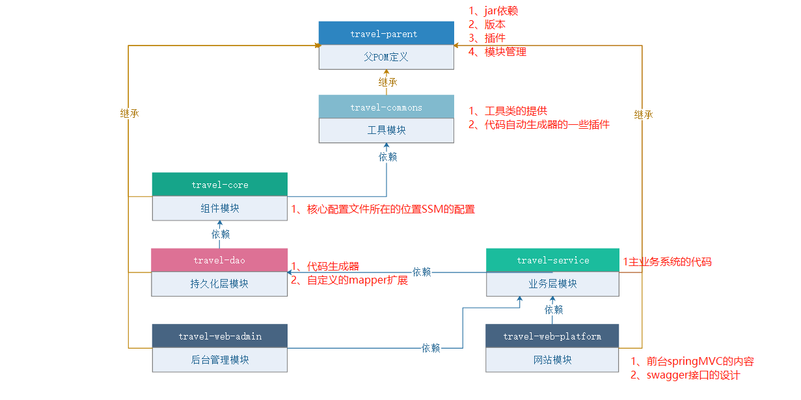
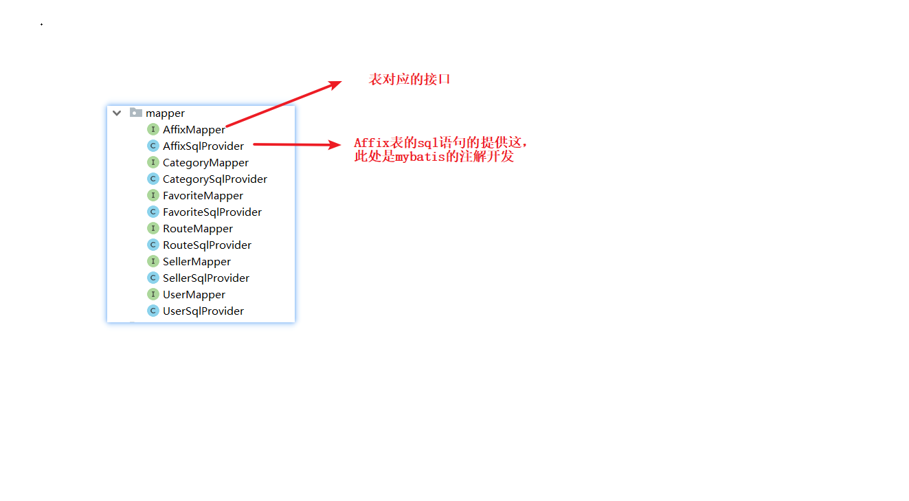
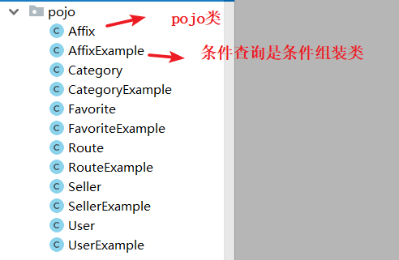
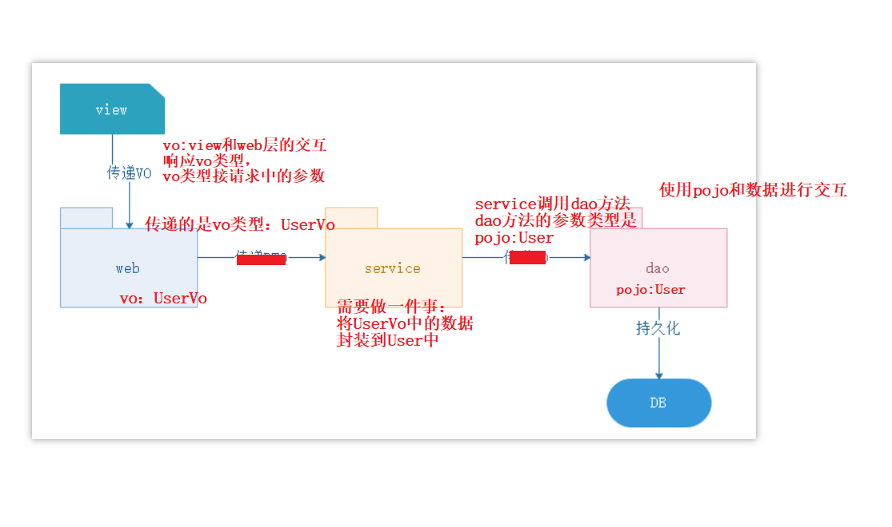
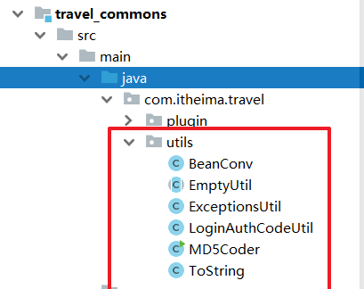
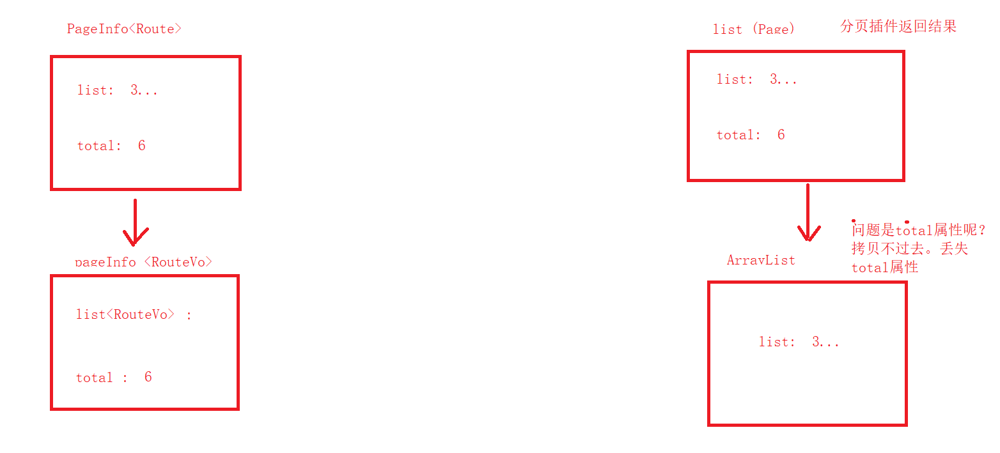

# 黑马旅游笔记

# 1.项目搭建

## 1.1 模块构建





~~~
创建项目
travel-parent： 父工程
travel-commons: 通用模块
travel-core:  框架集成
travel-dao: dao层
travel-service: 业务层
travel-web-platform: controller层

~~~


## 1.2 构建模块间依赖

模块间的依赖管理如上图

~~~
1.父工程统一声明所有子模块的版本
2.根据图构建模块之间的依赖关系
~~~

1.父工程统一声明所有子模块的版本

```xml
<properties>
     <project.build.sourceEncoding>UTF-8</project.build.sourceEncoding>
     <!-- 管理模块的版本号-->
     <travel.version>1.0-SNAPSHOT</travel.version>
 </properties>

 <!--
    父工程中统一声明子模块的版本号
-->
 <dependencyManagement>
     <dependencies>
         <dependency>
             <groupId>com.itheima.travel</groupId>
             <artifactId>travel_commons</artifactId>
             <version>${travel.version}</version>
         </dependency>
         <dependency>
             <groupId>com.itheima.travel</groupId>
             <artifactId>travel_service</artifactId>
             <version>${travel.version}</version>
         </dependency>
         <dependency>
             <groupId>com.itheima.travel</groupId>
             <artifactId>travel_dao</artifactId>
             <version>${travel.version}</version>
         </dependency>
         <dependency>
             <groupId>com.itheima.travel</groupId>
             <artifactId>travel_core</artifactId>
             <version>${travel.version}</version>
         </dependency>
         <dependency>
             <groupId>com.itheima.travel</groupId>
             <artifactId>travel_web_platform</artifactId>
             <version>${travel.version}</version>
         </dependency>
     </dependencies>
 </dependencyManagement>
```

2.根据图构建模块之间的依赖关系

例如：

core依赖于commons

~~~xml
  <dependencies>
        <!-- core依赖commons-->
        <dependency>
            <groupId>com.itheima.travel</groupId>
            <artifactId>travel_commons</artifactId>
        </dependency>
    </dependencies>
~~~

3.测试模块


# 2基础集成

## 2.1 travel_parent

**注意：对于模块的声明，校验模块的坐标是否和你们自己的一致。**

~~~
父工程：
1.统一管理所有的依赖版本
2.统一管理插件的版本
~~~

```xml
<?xml version="1.0" encoding="UTF-8"?>
<project xmlns="http://maven.apache.org/POM/4.0.0"
         xmlns:xsi="http://www.w3.org/2001/XMLSchema-instance"
         xsi:schemaLocation="http://maven.apache.org/POM/4.0.0 http://maven.apache.org/xsd/maven-4.0.0.xsd">
    <modelVersion>4.0.0</modelVersion>

    <groupId>com.itheima.travel</groupId>
    <artifactId>travel_parent</artifactId>
    <packaging>pom</packaging>
    <version>1.0-SNAPSHOT</version>
    <modules>
        <module>travel_commons</module>
        <module>travel_core</module>
        <module>travel_dao</module>
        <module>travel_service</module>
        <module>travel_web_platform</module>
    </modules>


    <properties>
        <project.build.sourceEncoding>UTF-8</project.build.sourceEncoding>
        <!-- 管理模块的版本号-->
        <travel.version>1.0-SNAPSHOT</travel.version>

        <!--servlet版本-->
        <servlet.version>4.0.1</servlet.version>
        <!--spring 版本-->
        <spring.version>5.2.0.RELEASE</spring.version>

        <!--mysql驱动版本-->
        <mysql.version>5.1.30</mysql.version>
        <!--druid版本-->
        <druid.version>1.0.29</druid.version>
        <!-- mybatis版本 -->
        <mybatis.version>3.5.5</mybatis.version>
        <!-- mybatis-spring整合包版本 -->
        <mybatis.spring.version>2.0.5</mybatis.spring.version>
        <!--generator-->
        <mybatis-generator.version>1.3.5</mybatis-generator.version>
        <!--pagehelper-->
        <pagehelper.version>5.1.11</pagehelper.version>

        <!--jackson版本-->
        <jackson.version>2.9.0</jackson.version>
        <!--fastJson-->
        <fastjson.version>1.2.47</fastjson.version>
        <!-- 日志版本 -->
        <log4j.version>2.8.2</log4j.version>
        <!--lombok-->
        <lombok.version>1.16.20</lombok.version>
        <!--文件上传-->
        <commons-fileupload>1.4</commons-fileupload>
        <!--lang3-->
        <commons.lang3.version>3.8.1</commons.lang3.version>
        <!--commons-beanutils-->
        <commons-beanutils.version>1.8.3</commons-beanutils.version>
        <!--commons-codec-->
        <commons-codec.version>1.8</commons-codec.version>
        <!--swagger2版本支持-->
        <swagger2>2.10.5</swagger2>
        <!--redisson版本-->
        <redisson.version>3.11.5</redisson.version>
    </properties>


    <dependencies>
        <dependency>
            <groupId>junit</groupId>
            <artifactId>junit</artifactId>
            <version>4.12</version>
            <scope>test</scope>
        </dependency>
        <!--lombok-->
        <dependency>
            <groupId>org.projectlombok</groupId>
            <artifactId>lombok</artifactId>
            <version>${lombok.version}</version>
        </dependency>

        <dependency>
            <groupId>org.springframework</groupId>
            <artifactId>spring-test</artifactId>
            <version>${spring.version}</version>
            <scope>test</scope>
        </dependency>
    </dependencies>
    <!--
       父工程中统一声明子模块的版本号
   -->
    <dependencyManagement>
        <dependencies>
            <dependency>
                <groupId>com.itheima.travel</groupId>
                <artifactId>travel_commons</artifactId>
                <version>${travel.version}</version>
            </dependency>
            <dependency>
                <groupId>com.itheima.travel</groupId>
                <artifactId>travel_service</artifactId>
                <version>${travel.version}</version>
            </dependency>
            <dependency>
                <groupId>com.itheima.travel</groupId>
                <artifactId>travel_dao</artifactId>
                <version>${travel.version}</version>
            </dependency>
            <dependency>
                <groupId>com.itheima.travel</groupId>
                <artifactId>travel_core</artifactId>
                <version>${travel.version}</version>
            </dependency>
            <dependency>
                <groupId>com.itheima.travel</groupId>
                <artifactId>travel_web_platform</artifactId>
                <version>${travel.version}</version>
            </dependency>

            <!-- 依赖版本 -->
            <!--servlet 容器依赖-->
            <dependency>
                <groupId>javax.servlet</groupId>
                <artifactId>javax.servlet-api</artifactId>
                <version>${servlet.version}</version>
                <scope>provided</scope>
            </dependency>

            <!--spring 容器依赖-->
            <dependency>
                <groupId>org.springframework</groupId>
                <artifactId>spring-context</artifactId>
                <version>${spring.version}</version>
            </dependency>

            <!--spring aop依赖-->
            <dependency>
                <groupId>org.springframework</groupId>
                <artifactId>spring-aspects</artifactId>
                <version>${spring.version}</version>
            </dependency>

            <!--spring mvc容器依赖-->
            <dependency>
                <groupId>org.springframework</groupId>
                <artifactId>spring-webmvc</artifactId>
                <version>${spring.version}</version>
            </dependency>

            <!-- mysql驱动依赖 -->
            <dependency>
                <groupId>mysql</groupId>
                <artifactId>mysql-connector-java</artifactId>
                <version>${mysql.version}</version>
            </dependency>

            <!--spring-jdbc依赖-->
            <dependency>
                <groupId>org.springframework</groupId>
                <artifactId>spring-jdbc</artifactId>
                <version>${spring.version}</version>
            </dependency>

            <!--druid依赖-->
            <dependency>
                <groupId>com.alibaba</groupId>
                <artifactId>druid</artifactId>
                <version>${druid.version}</version>
            </dependency>

            <!--mybatis依赖-->
            <dependency>
                <groupId>org.mybatis</groupId>
                <artifactId>mybatis</artifactId>
                <version>${mybatis.version}</version>
            </dependency>

            <!--mybatis-spring依赖-->
            <dependency>
                <groupId>org.mybatis</groupId>
                <artifactId>mybatis-spring</artifactId>
                <version>${mybatis.spring.version}</version>
            </dependency>

            <!-- 分页插件 -->
            <dependency>
                <groupId>com.github.pagehelper</groupId>
                <artifactId>pagehelper</artifactId>
                <version>${pagehelper.version}</version>
            </dependency>

            <dependency>
                <groupId>org.mybatis.generator</groupId>
                <artifactId>mybatis-generator-core</artifactId>
                <version>${mybatis-generator.version}</version>
            </dependency>

            <!--jackson依赖包-->
            <dependency>
                <groupId>com.fasterxml.jackson.core</groupId>
                <artifactId>jackson-core</artifactId>
                <version>${jackson.version}</version>
            </dependency>
            <dependency>
                <groupId>com.fasterxml.jackson.core</groupId>
                <artifactId>jackson-databind</artifactId>
                <version>${jackson.version}</version>
            </dependency>
            <dependency>
                <groupId>com.fasterxml.jackson.core</groupId>
                <artifactId>jackson-annotations</artifactId>
                <version>${jackson.version}</version>
            </dependency>

            <!--fastjson依赖包-->
            <dependency>
                <groupId>com.alibaba</groupId>
                <artifactId>fastjson</artifactId>
                <version>${fastjson.version}</version>
            </dependency>

            <!-- log4j2驱动依赖 -->
            <dependency>
                <groupId>org.apache.logging.log4j</groupId>
                <artifactId>log4j-api</artifactId>
                <version>${log4j.version}</version>
            </dependency>

            <dependency>
                <groupId>org.apache.logging.log4j</groupId>
                <artifactId>log4j-core</artifactId>
                <version>${log4j.version}</version>
            </dependency>

            <dependency>
                <groupId>org.apache.logging.log4j</groupId>
                <artifactId>log4j-web</artifactId>
                <version>${log4j.version}</version>
            </dependency>


            <!--文件上传-->
            <dependency>
                <groupId>commons-fileupload</groupId>
                <artifactId>commons-fileupload</artifactId>
                <version>${commons-fileupload}</version>
            </dependency>

            <!--工具包-->
            <dependency>
                <groupId>org.apache.commons</groupId>
                <artifactId>commons-lang3</artifactId>
                <version>${commons.lang3.version}</version>
            </dependency>

            <dependency>
                <groupId>commons-codec</groupId>
                <artifactId>commons-codec</artifactId>
                <version>${commons-codec.version}</version>
            </dependency>

            <dependency>
                <groupId>commons-beanutils</groupId>
                <artifactId>commons-beanutils</artifactId>
                <version>${commons-beanutils.version}</version>
            </dependency>
        </dependencies>
    </dependencyManagement>


    <build>
        <plugins>
            <!-- java编译插件 -->
            <plugin>
                <groupId>org.apache.maven.plugins</groupId>
                <artifactId>maven-compiler-plugin</artifactId>
                <version>3.2</version>
                <configuration>
                    <source>1.8</source>
                    <target>1.8</target>
                </configuration>
            </plugin>
            <!-- maven-surefire-plugin 测试包 -->
            <plugin>
                <groupId>org.apache.maven.plugins</groupId>
                <artifactId>maven-surefire-plugin</artifactId>
                <version>2.4.2</version>
                <configuration>
                    <!-- 全局是否执行maven生命周期中的测试：是否跳过测试 -->
                    <skipTests>true</skipTests>
                    <!-- 解决测试中文乱码-->
                    <forkMode>once</forkMode>
                    <argLine>-Dfile.encoding=UTF-8</argLine>
                </configuration>
            </plugin>
        </plugins>
        <pluginManagement>
            <plugins>
                <!-- 声明打包时，不需要web.xml -->
                <plugin>
                    <groupId>org.apache.maven.plugins</groupId>
                    <artifactId>maven-war-plugin</artifactId>
                    <version>2.4</version>
                </plugin>
                <!-- tomcat7插件,命令： mvn tomcat7:run -DskipTests -->
                <plugin>
                    <groupId>org.apache.tomcat.maven</groupId>
                    <artifactId>tomcat7-maven-plugin</artifactId>
                    <version>2.2</version>
                </plugin>
                <!-- mybatis插件 -->
                <plugin>
                    <groupId>org.mybatis.generator</groupId>
                    <artifactId>mybatis-generator-maven-plugin</artifactId>
                    <version>1.3.5</version>
                </plugin>
            </plugins>
        </pluginManagement>
    </build>
</project>
```


## 2.2 travel-core的集成

~~~
步骤：
1.引入相关的依赖
2.纯注解开发
~~~

travel-core引入相关依赖

~~~xml
 <!--servlet 容器依赖-->
    <dependency>
        <groupId>javax.servlet</groupId>
        <artifactId>javax.servlet-api</artifactId>
        <scope>provided</scope>
    </dependency>

    <!--spring 容器依赖-->
    <dependency>
        <groupId>org.springframework</groupId>
        <artifactId>spring-context</artifactId>
    </dependency>

    <!--spring aop依赖-->
    <dependency>
        <groupId>org.springframework</groupId>
        <artifactId>spring-aspects</artifactId>
    </dependency>

    <!--spring mvc容器依赖-->
    <dependency>
        <groupId>org.springframework</groupId>
        <artifactId>spring-webmvc</artifactId>
    </dependency>

    <!-- mysql驱动依赖 -->
    <dependency>
        <groupId>mysql</groupId>
        <artifactId>mysql-connector-java</artifactId>
    </dependency>

    <!--spring-jdbc依赖-->
    <dependency>
        <groupId>org.springframework</groupId>
        <artifactId>spring-jdbc</artifactId>
    </dependency>

    <!--druid依赖-->
    <dependency>
        <groupId>com.alibaba</groupId>
        <artifactId>druid</artifactId>
    </dependency>

    <!--mybatis依赖-->
    <dependency>
        <groupId>org.mybatis</groupId>
        <artifactId>mybatis</artifactId>
    </dependency>

    <!--mybatis-spring依赖-->
    <dependency>
        <groupId>org.mybatis</groupId>
        <artifactId>mybatis-spring</artifactId>
    </dependency>

    <!-- 分页插件 -->
    <dependency>
        <groupId>com.github.pagehelper</groupId>
        <artifactId>pagehelper</artifactId>
    </dependency>

    <!--fastjson依赖包-->
    <dependency>
        <groupId>com.alibaba</groupId>
        <artifactId>fastjson</artifactId>
    </dependency>

    <!-- log4j2驱动依赖 -->
    <dependency>
        <groupId>org.apache.logging.log4j</groupId>
        <artifactId>log4j-api</artifactId>
    </dependency>

    <dependency>
        <groupId>org.apache.logging.log4j</groupId>
        <artifactId>log4j-core</artifactId>
    </dependency>

    <dependency>
        <groupId>org.apache.logging.log4j</groupId>
        <artifactId>log4j-web</artifactId>
    </dependency>


    <!--文件上传-->
    <dependency>
        <groupId>commons-fileupload</groupId>
        <artifactId>commons-fileupload</artifactId>
    </dependency>

    <!--工具包-->
    <dependency>
        <groupId>org.apache.commons</groupId>
        <artifactId>commons-lang3</artifactId>
    </dependency>

    <dependency>
        <groupId>commons-codec</groupId>
        <artifactId>commons-codec</artifactId>
    </dependency>

    <dependency>
        <groupId>commons-beanutils</groupId>
        <artifactId>commons-beanutils</artifactId>
    </dependency>
~~~

纯注解开发：

~~~
1.在travel-core中创建包结构com.itheima.travel.config
2.复制4个配置类
3.检查4个配置类的配置内容是否需要不全
	mybait配置扫描的dao层的包需要创建出来
	springmvc扫描的controller包需要创建
	mybatis中加载的外部配置需要创建jdbc.properties
4.在controller中编写handler进行测试
5.测试之前，因为动了其他模块的代码，所以需要在父工程中点击install按钮，更新代码到本地仓库，然后再启动web工程
~~~

模块结构：


1.在travel-core中创建包结构com.itheima.travel.config

2.复制4个配置类

spring的配置

```java
package com.itheima.travel.config;

import org.springframework.context.annotation.*;
import org.springframework.stereotype.Controller;
import org.springframework.transaction.annotation.EnableTransactionManagement;

@Configuration //声明当前类是一个配置类
@ComponentScan(value = "com.itheima",
        excludeFilters = @ComponentScan.Filter(Controller.class)) //注解扫描，排除注解Controller
@PropertySource("classpath:jdbc.properties") //加载外部配置
@Import(MyBatisConfig.class)
@EnableTransactionManagement //开启注解事务
@EnableAspectJAutoProxy //开启注解aop
public class SpringConfig {
}
```

spring整合mybatis的配置

```java
package com.itheima.travel.config;

import com.alibaba.druid.pool.DruidDataSource;
import org.apache.ibatis.session.Configuration;
import org.apache.ibatis.session.SqlSessionFactory;
import org.mybatis.spring.SqlSessionFactoryBean;
import org.mybatis.spring.annotation.MapperScan;
import org.springframework.beans.factory.annotation.Qualifier;
import org.springframework.beans.factory.annotation.Value;
import org.springframework.context.annotation.Bean;
import org.springframework.jdbc.datasource.DataSourceTransactionManager;
import org.springframework.transaction.annotation.Transactional;

import javax.sql.DataSource;


@MapperScan(basePackages = "com.itheima.travel.dao",sqlSessionFactoryRef ="sqlSessionFactory" )
public class MyBatisConfig {

    @Value("${jdbc.password}")
    private String password;

    @Value("${jdbc.url}")
    private String url;

    @Value("${jdbc.username}")
    private String username;

    @Value("${jdbc.driverClass}")
    private String driverClassName;


    @Bean
    public DataSource dataSource(){

        DruidDataSource dataSource = new DruidDataSource();
        dataSource.setPassword(password);
        dataSource.setUsername(username);
        dataSource.setDriverClassName(driverClassName);
        dataSource.setUrl(url);

        return dataSource;
    }


    /**
     * @Description 配置事务管理器
     * 细节：名称必须是：transactionManager，如果更换需要在使用时指定
     */
    @Bean("transactionManager")
    public DataSourceTransactionManager transactionManager(DataSource dataSource){
        return new DataSourceTransactionManager(dataSource);
    }


    @Bean
    public SqlSessionFactory sqlSessionFactory(DataSource dataSource){
        SqlSessionFactoryBean sqlSessionFactoryBean = new SqlSessionFactoryBean();

        //属性设置，设置数据源
        sqlSessionFactoryBean.setDataSource(dataSource);

        //设置包扫描
        sqlSessionFactoryBean.setTypeAliasesPackage("com.itheima.pojo");

        //设置configuration
        Configuration configuration = new Configuration();
        configuration.setMapUnderscoreToCamelCase(true);
        sqlSessionFactoryBean.setConfiguration(configuration);


        SqlSessionFactory sqlSessionFactory = null;
        try {
            //spring创建对象的第四种方式，实现FactroyBean接口，会调用getObject()方法创建对象
            sqlSessionFactory = sqlSessionFactoryBean.getObject();
        } catch (Exception e) {
            e.printStackTrace();
        }

        return sqlSessionFactory;
    }

}
```


springmvc的配置

```java
package com.itheima.travel.config;

import org.springframework.context.annotation.Bean;
import org.springframework.context.annotation.ComponentScan;
import org.springframework.web.multipart.commons.CommonsMultipartResolver;
import org.springframework.web.servlet.config.annotation.DefaultServletHandlerConfigurer;
import org.springframework.web.servlet.config.annotation.EnableWebMvc;
import org.springframework.web.servlet.config.annotation.WebMvcConfigurationSupport;
import org.springframework.web.servlet.view.InternalResourceViewResolver;

@ComponentScan("com.itheima.travel.controller") //包扫描
@EnableWebMvc  //开启注解驱动
public class SpringMVCConfig extends WebMvcConfigurationSupport {


    /**
     * @Description 文件上传
     */
    @Bean
    public CommonsMultipartResolver multipartResolver(){
        CommonsMultipartResolver multipartResolver = new CommonsMultipartResolver();
        multipartResolver.setDefaultEncoding("UTF-8");
        multipartResolver.setMaxUploadSize(104857600);
        multipartResolver.setMaxInMemorySize(4096);
        return multipartResolver;
    }


}
```

代替web.xml的配置

```java
package com.itheima.travel.config;

import org.springframework.web.filter.CharacterEncodingFilter;
import org.springframework.web.servlet.support.AbstractAnnotationConfigDispatcherServletInitializer;

import javax.servlet.FilterRegistration;
import javax.servlet.ServletContext;
import javax.servlet.ServletException;

public class WebProjectInitConfig extends AbstractAnnotationConfigDispatcherServletInitializer {


    @Override
    public void onStartup(ServletContext servletContext) throws ServletException {

        //注册过滤器
        FilterRegistration.Dynamic encodingFilter = servletContext.addFilter("characterEncodingFilter", new CharacterEncodingFilter());

        //配置过滤器的初始化参数
        encodingFilter.setInitParameter("encoding","utf-8");

        //配置过滤器的映射路径
        encodingFilter.addMappingForUrlPatterns(null,false,"/*");

        super.onStartup(servletContext);
    }

    //spring的配置类
    @Override
    protected Class<?>[] getRootConfigClasses() {
        return new Class[]{SpringConfig.class};
    }

    //springmvc的配置类
    @Override
    protected Class<?>[] getServletConfigClasses() {
        return new Class[]{SpringMVCConfig.class};
    }

    // 前端控制器DispatcherServlet的映射路径
    @Override
    protected String[] getServletMappings() {
        return new String[]{"/"};
    }
}
```

3.检查4个配置类的配置内容是否需要不全
	mybait配置扫描的dao层的包需要创建出来
	springmvc扫描的controller包需要创建
	mybatis中加载的外部配置需要创建jdbc.properties
4.在controller中编写handler进行测试

```java
package com.itheima.travel.controller;

import org.springframework.http.HttpStatus;
import org.springframework.stereotype.Controller;
import org.springframework.web.bind.annotation.RequestMapping;
import org.springframework.web.bind.annotation.ResponseStatus;

@Controller
@RequestMapping("/demo")
public class DemoController {

    @ResponseStatus(HttpStatus.OK) //没有任何响应体
    @RequestMapping("/demo")
    public void demo(){
        System.out.println("controller执行了");
    }
}
```

5.测试之前，因为动了其他模块的代码，所以需要在父工程中点击install按钮，更新代码到本地仓库，然后再启动web工程


测试结果：


## 2.3 mybatis逆向工程

~~~
步骤：
0.idea中安装plugins，lombok插件
1.需要在travel-dao层引入mybatis-generator相关的依赖和插件
2.需要mybatis-generator的核心配置
3.需要在travel-commons中引入mybatis-generator需要的工具类
4.先在travel-parent中执行install命令，然后再在travel-dao层执行generator插件。
~~~

0.idea中安装plugins，lombok插件


1.需要在travel-dao层引入mybatis-generator相关的依赖和插件

注意：这个插件依赖的工具类在travel_commons中，检查这个模块的坐标配置

```xml
<plugins>
    <!--代码生成器：mybatis-generator-maven-plugin-->
    <plugin>
        <groupId>org.mybatis.generator</groupId>
        <artifactId>mybatis-generator-maven-plugin</artifactId>
        <dependencies>
            <!--代码生成器：mysql依赖-->
            <dependency>
                <groupId>mysql</groupId>
                <artifactId>mysql-connector-java</artifactId>
                <version>${mysql.version}</version>
            </dependency>
            <!--代码生成器：mybatis-generator-core依赖-->
            <dependency>
                <groupId>org.mybatis.generator</groupId>
                <artifactId>mybatis-generator-core</artifactId>
                <version>1.3.5</version>
            </dependency>
            <!--代码生成器：自定义插件依赖-->
            <dependency>
                <groupId>com.itheima.travel</groupId>
                <artifactId>travel_commons</artifactId>
                <version>${travel.version}</version>
            </dependency>
        </dependencies>
        <executions>
            <execution>
                <id>Generate MyBatis Artifacts</id>
                <phase>package</phase>
                <goals>
                    <goal>generate</goal>
                </goals>
            </execution>
        </executions>
        <configuration>
            <!--允许移动生成的文件 -->
            <verbose>true</verbose>
            <!-- 是否覆盖 -->
            <overwrite>true</overwrite>
            <!-- 自动生成的配置 -->
            <configurationFile>
                src/main/resources/mybatis-generator.xml
            </configurationFile>
        </configuration>
    </plugin>
</plugins>
```

2.需要mybatis-generator的核心配置

mybatis的接口放在了mapper包下，需要改mybatis配置扫描的包


~~~
注意：此配置抄写过来，一般需要手动改写的配置
1.mysql驱动的位置
2.mysql连接配置
3.生成的实体位置
4.xml方式的话，注意映射文件的位置
5.mapper接口的位置
6.表明和实体名的映射
~~~


```xml
<?xml version="1.0" encoding="UTF-8"?>
<!DOCTYPE generatorConfiguration
        PUBLIC "-//mybatis.org//DTD MyBatis Generator Configuration 1.0//EN"
        "http://mybatis.org/dtd/mybatis-generator-config_1_0.dtd">

<generatorConfiguration>
    <!--导入mysql的驱动-->
    <classPathEntry
            location="E:\maven\apache-maven-3.5.2-bin\apache-maven-3.5.2\repository\mysql\mysql-connector-java\5.1.38\mysql-connector-java-5.1.38.jar"/>

    <!-- context 是逆向工程的主要配置信息 -->
    <!-- id：起个名字 -->
    <!-- targetRuntime：设置生成的文件适用于那个 mybatis 版本 -->
    <context id="default" targetRuntime="MyBatis3">

        <!-- 数据库注释,数据库注释到实体的乱码 -->
        <!--<property name="javaFileEncoding" value="UTF-8"/>-->
        <!--  插件-->
        <!--  帮助实体类生成toString方法的  -->
        <plugin type="com.itheima.travel.plugin.ToStringPlugin"/>
        <!-- 帮助生成的实体类，采用lombok注解 -->
        <plugin type="com.itheima.travel.plugin.LombokPlugin"/>
        <!-- 序列化-->
        <plugin type="org.mybatis.generator.plugins.SerializablePlugin"/>

        <!-- 根据数据库列的注释，生成的实体的属性也会自动添加注释 -->
        <commentGenerator type="com.itheima.travel.plugin.CommentGenerator">
            <property name="suppressAllComments" value="false"/>
        </commentGenerator>

        <!--optional,旨在创建class时，对注释进行控制-->
        <!--<commentGenerator>-->
        <!--<property name="suppressDate" value="false" />-->
        <!--&lt;!&ndash; 是否去除自动生成的注释 true：是 ： false:否 &ndash;&gt;-->
        <!--<property name="suppressAllComments" value="true" />-->
        <!--</commentGenerator>-->

        <!--jdbc的数据库连接-->
        <jdbcConnection driverClass="com.mysql.jdbc.Driver"
                        connectionURL="jdbc:mysql://127.0.0.1:3306/spring-travel"
                        userId="root"
                        password="root" />

        <!--非必须，类型处理器，在数据库类型和java类型之间的转换控制-->
        <javaTypeResolver>
            <!-- 默认情况下数据库中的 decimal，bigInt 在 Java 对应是 sql 下的 BigDecimal 类 -->
            <!-- 不是 double 和 long 类型 -->
            <!-- 使用常用的基本类型代替 sql 包下的引用类型 -->
            <property name="forceBigDecimals" value="false" />
        </javaTypeResolver>

        <!-- targetPackage：生成的实体类所在的包 -->
        <!-- targetProject：生成的实体类所在的硬盘位置 -->
        <javaModelGenerator targetPackage="com.itheima.travel.pojo"
                            targetProject="src/main/java">
            <property name="javaFileEncoding" value="UTF-8"/>
            <!-- 是否允许子包 -->
            <property name="enableSubPackages" value="false" />
            <!-- 是否对modal添加构造函数 -->
            <property name="constructorBased" value="false" />
            <!-- 是否清理从数据库中查询出的字符串左右两边的空白字符 -->
            <property name="trimStrings" value="true" />
            <!-- 建立modal对象是否不可改变 即生成的modal对象不会有setter方法，只有构造方法 -->
            <property name="immutable" value="false" />
        </javaModelGenerator>

        <!-- targetPackage 和 targetProject：生成的 mapper 文件的包和位置 -->
        <sqlMapGenerator targetPackage="sqlMapper"
                         targetProject="src/main/resources">
            <!-- 针对数据库的一个配置，是否把 schema 作为字包名 -->
            <property name="enableSubPackages" value="false" />
        </sqlMapGenerator>

        <!-- targetPackage 和 targetProject：生成的 interface 文件的包和位置 XMLMAPPER：生成XML方式，ANNOTATEDMAPPER：生成注解方式-->
        <javaClientGenerator type="ANNOTATEDMAPPER"
                             targetPackage="com.itheima.travel.mapper" targetProject="src/main/java">
            <!-- 针对 oracle 数据库的一个配置，是否把 schema 作为字包名 -->
            <property name="enableSubPackages" value="false" />
        </javaClientGenerator>

        <!-- 所有表与实体名的映射 -->
        <table tableName="tab_affix" domainObjectName="Affix">
            <generatedKey column="id" sqlStatement="MySql" identity="true"/>
        </table>

        <table tableName="tab_category" domainObjectName="Category" >
            <generatedKey column="id" sqlStatement="MySql" identity="true"/>
        </table>

        <table tableName="tab_favorite" domainObjectName="Favorite">
            <generatedKey column="id" sqlStatement="MySql" identity="true"/>
        </table>

        <table tableName="tab_seller" domainObjectName="Seller">
            <generatedKey column="id" sqlStatement="MySql" identity="true"/>
        </table>

        <table tableName="tab_user" domainObjectName="User">
            <generatedKey column="id" sqlStatement="MySql" identity="true"/>
        </table>

        <table tableName="tab_route" domainObjectName="Route">
            <generatedKey column="id" sqlStatement="MySql" identity="true"/>
        </table>

    </context>
</generatorConfiguration>
```

3.需要在travel-commons中引入mybatis-generator需要的工具类和依赖


```xml
<dependencies>

        <!-- log4j2驱动依赖 -->

        <dependency>

            <groupId>org.apache.logging.log4j</groupId>

            <artifactId>log4j-api</artifactId>

        </dependency>
  
	<dependency>
        <groupId>org.apache.logging.log4j</groupId>
        <artifactId>log4j-core</artifactId>
    </dependency>

    <dependency>
        <groupId>org.apache.logging.log4j</groupId>
        <artifactId>log4j-web</artifactId>
    </dependency>
    <!--工具包-->
    <dependency>
        <groupId>org.apache.commons</groupId>
        <artifactId>commons-lang3</artifactId>
    </dependency>

    <dependency>
        <groupId>commons-beanutils</groupId>
        <artifactId>commons-beanutils</artifactId>
    </dependency>

    <dependency>
        <groupId>commons-codec</groupId>
        <artifactId>commons-codec</artifactId>
    </dependency>

    <dependency>
        <groupId>org.mybatis.generator</groupId>
        <artifactId>mybatis-generator-core</artifactId>
    </dependency>

    <!--jackson依赖包-->
    <dependency>
        <groupId>com.fasterxml.jackson.core</groupId>
        <artifactId>jackson-core</artifactId>
    </dependency>
    <dependency>
        <groupId>com.fasterxml.jackson.core</groupId>
        <artifactId>jackson-databind</artifactId>
    </dependency>
    <dependency>
        <groupId>com.fasterxml.jackson.core</groupId>
        <artifactId>jackson-annotations</artifactId>
    </dependency>
</dependencies>
```


4.先在travel-parent中执行install命令，然后再在travel-dao层执行generator插件。


## 2.4 逆向工程详解

mapper接口和接口需要的sql语句的提供类：



实体和查询条件的组装类。




Mybatis逆向工程的mapper接口详解：


选择性的（Selective）：


条件查询(ByExample):


测试类：

```java
package com.itheima.travel.mapper;

import com.itheima.travel.config.SpringConfig;
import com.itheima.travel.pojo.User;
import com.itheima.travel.pojo.UserExample;
import org.junit.Test;
import org.junit.runner.RunWith;
import org.springframework.beans.factory.annotation.Autowired;
import org.springframework.test.context.ContextConfiguration;
import org.springframework.test.context.junit4.SpringJUnit4ClassRunner;

import java.util.Date;
import java.util.List;

import static org.junit.Assert.*;

@RunWith(SpringJUnit4ClassRunner.class)
@ContextConfiguration(classes = SpringConfig.class)
public class UserMapperTest {

    @Autowired
    private UserMapper userMapper;

    @Test
    public void countByExample() {
    }

    @Test
    public void deleteByExample() {
    }

    @Test
    public void deleteByPrimaryKey() {
    }

    @Test
    public void insert() {
        //lombok的builder创建对象方式
        User user = User.builder()
                .username("zhangsan")
                .password("123")

                .sex("0")
                .realName("张三")
                .email("123@qq.com")
                .birthday(new Date())
                .build();
        userMapper.insert(user);
    }

    @Test
    public void insertSelective() {
        //lombok的builder创建对象方式
        User user = User.builder()
                .username("zhangsan")
                .password("123")
                .realName("张三")
                .email("123@qq.com")
                .build();
        userMapper.insertSelective(user);

    }

    @Test
    public void selectByExample() {

        //组装查询的条件
        UserExample userExample = new UserExample();
        userExample.setOrderByClause("sex desc"); // 性别排序
        userExample.createCriteria()
                .andUsernameLike("%shu%"); //用户名模糊查询
                //.andIdEqualTo(1l);//id等于1的

        List<User> userList = userMapper.selectByExample(userExample);
        for(User user:userList){
            System.out.println(user);
        }
    }

    @Test
    public void selectByPrimaryKey() {
        User user = userMapper.selectByPrimaryKey(1l);
        System.out.println(user);
    }

    @Test
    public void updateByExampleSelective() {
    }

    @Test
    public void updateByExample() {
    }

    @Test
    public void updateByPrimaryKeySelective() {
    }

    @Test
    public void updateByPrimaryKey() {
    }
}
```


# 3.业务层

## 3.1 vo和pojo

~~~
vo:view Object。表现层对象。
pojo:: 普通无规则对象。
dto:data transfer object.  数据传输对象。
po: 普通的持久化对象

为何需要这么划分实体？
问题：数据表有20个字段。
     pojo用于对应表，java中的数据持久化到数据库。
     页面展示：需要分页信息，pojo能封装吗？ 所以针对页面需要展示的数据，我们需要创建实体（VO）来封装。
     数据传输：但是我传输用户数据只需要传输5个字段。使用pojo可以传，但是其他15个字段在进行json字符串转换的时候也会转换，所以传输数据时这些数据也会传递，但是无意义。所以浪费字眼，影响性能，所以需要dto，只声明数据传输时需要的字段。

此处我们只是用vo和pojo.
~~~




小结：

~~~
web层需要使用Vo类型，
dao层需要使用pojo类型。
service涉及到vo和pojo的转换
~~~

## 3.2 用户模块业务

拷贝vo实体


实现步骤：

~~~
0.拷贝utils工具类到travel-commons模块
1.根据接口文档，编写service接口
2.编写service实现类，根据接口文档，实现接口中的方法
3.编写测试类，测试即可，注意通过@WebAppConfiguration 模拟web环境进行测试
~~~


0.拷贝utils工具类到travel-commons模块



1.根据接口文档，编写service接口

```java
package com.itheima.travel.service;

import com.itheima.travel.req.UserVo;

public interface UserService {

    /**
     *
     * @param userVo  请求中的数据封装成的vo类型
     * @return 注册成功与否
     */
    public boolean registerUser(UserVo userVo);

    /**
     *
     * @param userVo 包含用户名和密码
     * @return 登录成功与否
     */
    public boolean loginUser(UserVo userVo);

    /**
     *  退出
     */
    public void logoutUser();


    /**
     * 是否登录
     * @return
     */
    public boolean isLogin();
}
```

2.编写service实现类，根据接口文档，实现接口中的方法

```java
package com.itheima.travel.service.impl;

import com.itheima.travel.mapper.UserMapper;
import com.itheima.travel.pojo.User;
import com.itheima.travel.pojo.UserExample;
import com.itheima.travel.req.UserVo;
import com.itheima.travel.service.UserService;
import com.itheima.travel.utils.BeanConv;
import com.itheima.travel.utils.MD5Coder;
import org.springframework.beans.factory.annotation.Autowired;
import org.springframework.stereotype.Service;

import javax.servlet.http.HttpSession;
import java.util.List;

@Service  //创建service对象
public class UserServiceImpl implements UserService {

    @Autowired //依赖的自动注入
    private UserMapper userMapper;

    @Autowired
    private HttpSession session;

    @Override
    public boolean registerUser(UserVo userVo) {

        //属性拷贝，拷贝到User类型的对象中
        User user = BeanConv.toBean(userVo, User.class);

        //对原密码进行加密
        //加盐
        //user.setPassword(MD5Coder.md5Encode("ITHEIMA_"+user.getPassword()));
        user.setPassword(MD5Coder.md5Encode(user.getPassword()));

        //1.将数据保存到数据库
        int num = userMapper.insert(user);
        //2.自动登录的功能,将用户信息保存到session中
        if(num==1){
            String key = session.getId();
            session.setAttribute(key,user);
        }
        return num==1;
    }

    @Override
    public boolean loginUser(UserVo userVo) {

        //对密码进行加密
        userVo.setPassword(MD5Coder.md5Encode(userVo.getPassword()));

        //创建查询条件
        UserExample userExample = new UserExample();
        userExample.createCriteria()
                .andUsernameEqualTo(userVo.getUsername())
                .andPasswordEqualTo(userVo.getPassword());
        //查询
        List<User> list = userMapper.selectByExample(userExample);

        if(list.size()==1){
            //登录成功,用户信息保存到session
            session.setAttribute(session.getId(),list.get(0));
        }

        return list.size()==1;
    }

    @Override
    public void logoutUser() {

        //清空session
        session.invalidate();//销毁session
    }

    @Override
    public boolean isLogin() {

        //获取session中的用户信息
        Object user = session.getAttribute(session.getId());

        return user!=null;
    }
}

```

3.编写测试类，测试即可，注意通过@WebAppConfiguration 模拟web环境进行测试

```java
package com.itheima.travel.service;

import com.itheima.travel.config.SpringConfig;
import com.itheima.travel.req.UserVo;
import org.junit.Test;
import org.junit.runner.RunWith;
import org.springframework.beans.factory.annotation.Autowired;
import org.springframework.test.context.ContextConfiguration;
import org.springframework.test.context.junit4.SpringJUnit4ClassRunner;
import org.springframework.test.context.web.WebAppConfiguration;

import java.util.Date;

import static org.junit.Assert.*;

@RunWith(SpringJUnit4ClassRunner.class)
@ContextConfiguration(classes = SpringConfig.class)
@WebAppConfiguration //模拟web测试环境
public class UserServiceTest {


    @Autowired
    private UserService userService;
    @Test
    public void registerUser() {
        UserVo userVo = UserVo.builder()
                .telephone("12345612345")
                .sex("1")
                .realName("李四")
                .email("123@qq.com")
                .birthday(new Date())
                .username("lisi")
                .password("12345")
                .build();

        userService.registerUser(userVo);
    }

    @Test
    public void loginUser() {

        //判断是否登录
        boolean flag = userService.isLogin();
        System.out.println("此时登录状态:"+flag);


        //登录
        UserVo userVo = UserVo.builder()
                .username("lisi")
                .password("12345")
                .build();
        boolean flag2 = userService.loginUser(userVo);
        System.out.println("登录结果:"+flag2);

        //判断是否登录
        boolean flag3 = userService.isLogin();
        System.out.println("此时登录状态:"+flag3);

        //退出
        userService.logoutUser();

        //判断是否登录
        boolean flag4 = userService.isLogin();
        System.out.println("此时登录状态:"+flag4);

    }

    @Test
    public void logoutUser() {
    }

    @Test
    public void isLogin() {
    }
}
```


**md5介绍**

~~~
算法：一种运算规则，这种规则的反向规则，就对应了解密。
所以很多时候，我们希望更安全，不容易破解。
md5不可逆的。只能通过明文生成密文，无法通过密文推导明文。
~~~


## 3.3 分类模块

~~~
1.编写service
2.抽取公共测试配置类
3.其他配置类，继承公共测试配置类
~~~


1.编写service


```java
package com.itheima.travel.service;

import com.itheima.travel.req.CategoryVo;

import java.util.List;

public interface CategoryService {

    /**
     * 查询所有的类别信息
     * @return CategoryVo的集合
     */
    public List<CategoryVo> findAllCategories();
}
```


```java
package com.itheima.travel.service.impl;

import com.itheima.travel.mapper.CategoryMapper;
import com.itheima.travel.pojo.Category;
import com.itheima.travel.req.CategoryVo;
import com.itheima.travel.service.CategoryService;
import com.itheima.travel.utils.BeanConv;
import org.springframework.beans.factory.annotation.Autowired;
import org.springframework.stereotype.Service;

import java.util.List;

@Service
public class CategoryServiceImpl implements CategoryService {

    @Autowired
    private CategoryMapper categoryMapper;

    @Override
    public List<CategoryVo> findAllCategories() {

        //没有任何条件
        List<Category> categoryList = categoryMapper.selectByExample(null);

        //属性拷贝
        List<CategoryVo> categoryVoList = BeanConv.toBeanList(categoryList, CategoryVo.class);


        return categoryVoList;
    }
}
```


2.抽取公共测试配置类

```java
package com.itheima.travel.service;

import com.itheima.travel.config.SpringConfig;
import org.junit.runner.RunWith;
import org.springframework.beans.factory.annotation.Autowired;
import org.springframework.test.context.ContextConfiguration;
import org.springframework.test.context.junit4.SpringJUnit4ClassRunner;
import org.springframework.test.context.web.WebAppConfiguration;

@RunWith(SpringJUnit4ClassRunner.class)
@ContextConfiguration(classes = SpringConfig.class)
@WebAppConfiguration //模拟web测试环境
public abstract class TestConfig {

    @Autowired
    public UserService userService;

    @Autowired
    public CategoryService categoryService;
}
```

3.其他配置类，继承公共测试配置类


~~~java
package com.itheima.travel.service;

import com.itheima.travel.req.CategoryVo;
import org.junit.Test;

import java.util.List;

import static org.junit.Assert.*;

public class CategoryServiceTest extends TestConfig {

    @Test
    public void findAllCategories() {

        List<CategoryVo> categoryVoList = categoryService.findAllCategories();
        for(CategoryVo categoryVo:categoryVoList){
            System.out.println(categoryVo);
        }
    }
}
~~~


测试结果：


## 3.4 收藏模块

### 3.4.1 业务

~~~
1.编写接口和实现类
2.添加扩展mapperExt
3.注意添加收藏需要添加事务
4.编写测试类

注意：针对于扩展的mapper接口，放在mapperExt包下，并且spring整合mybatis配置需要扫描扩展接口包
~~~

service模块：


dao模块：添加扩展mapper


core模块扫描扩展包


1.编写接口和实现类

```java
package com.itheima.travel.service;

import com.itheima.travel.req.FavoriteVo;

public interface FavoriteService {


    public void findMyFavorite();

    /**
     * 是否收藏
     * @param favoriteVo
     * @return
     */
    public boolean isFavorited(FavoriteVo favoriteVo);


    /**
     * 添加收藏
     * @param favoriteVo
     * @return 收藏成功后，收藏的次数
     */
    public int addFavorited(FavoriteVo favoriteVo);
}
```


2.添加扩展mapper


```java
package com.itheima.travel.mapperExt;

import org.apache.ibatis.annotations.Param;
import org.apache.ibatis.annotations.Update;

public interface RouteMapperExt {


    @Update("update tab_route set attention_count=attention_count+1 where id=#{routeId}")
    public int updateRouteAttentionCount(@Param("routeId") long routeId);
}
```


2.注意添加收藏需要添加事务

```java
package com.itheima.travel.service.impl;

import com.itheima.travel.mapper.FavoriteMapper;
import com.itheima.travel.mapper.RouteMapper;
import com.itheima.travel.mapperExt.RouteMapperExt;
import com.itheima.travel.pojo.Favorite;
import com.itheima.travel.pojo.FavoriteExample;
import com.itheima.travel.pojo.Route;
import com.itheima.travel.pojo.User;
import com.itheima.travel.req.FavoriteVo;
import com.itheima.travel.service.FavoriteService;
import org.springframework.beans.factory.annotation.Autowired;
import org.springframework.stereotype.Service;
import org.springframework.transaction.annotation.Transactional;

import javax.servlet.http.HttpSession;
import java.util.List;

@Service
public class FavoriteServiceImpl implements FavoriteService {

    @Autowired
    private HttpSession session;

    @Autowired
    private FavoriteMapper favoriteMapper;

    @Autowired
    private RouteMapperExt routeMapperExt;

    @Autowired
    private RouteMapper routeMapper;

    @Override
    public void findMyFavorite() {

    }

    @Override
    public boolean isFavorited(FavoriteVo favoriteVo) {


        /**
         * 此处的登录判断是多个地方都需要的，所以我们可以做登录拦截器,
         * 此处能进来，都表示拦截器放行。直接获取登录的用户信息。
         */
        User user= (User)session.getAttribute(session.getId());
//        if(user==null){
//            //未登录，也代表了未收藏，显示红色按钮
//            return  false;
//        }

        //根据用户的id和旅游线路的id去tab_favorite表查询数据
        FavoriteExample favoriteExample = new FavoriteExample();
        favoriteExample.createCriteria()
                .andUserIdEqualTo(user.getId())//当前登录的用户的id
                .andRouteIdEqualTo(favoriteVo.getRouteId()); //旅游线路的id，前端传递过来
        //查询
        List<Favorite> favoriteList = favoriteMapper.selectByExample(favoriteExample);
        return favoriteList.size()==1;
    }

    @Transactional //添加事务即可
    @Override
    public int addFavorited(FavoriteVo favoriteVo) {

        //1.修改tab_route表的attention_count字段
        routeMapperExt.updateRouteAttentionCount(favoriteVo.getRouteId());
        //2.向tab_favorite表添加一条数据
        //int i = 1/0;
        //获取登录的用户信息
        User user = (User) session.getAttribute(session.getId());

        Favorite favorite = new Favorite();
        favorite.setUserId(user.getId());
        favorite.setRouteId(favoriteVo.getRouteId());
        favoriteMapper.insert(favorite);

        //3.重新查询tab_route表的attention_count字段
        Route route = routeMapper.selectByPrimaryKey(favoriteVo.getRouteId());


        return route.getAttentionCount();
    }
}
```

3.编写测试类

```java
package com.itheima.travel.service;

import com.itheima.travel.req.FavoriteVo;
import com.itheima.travel.req.UserVo;
import org.junit.Before;
import org.junit.Test;

import static org.junit.Assert.*;

public class FavoriteServiceTest extends TestConfig {

    //所有测试方法之前执行，
    @Before
    public void login(){
        //登录
        UserVo userVo = UserVo.builder()
                .username("lisi")
                .password("12345")
                .build();
        boolean flag2 = userService.loginUser(userVo);


    }

    @Test
    public void findMyFavorite() {
    }

    @Test
    public void isFavorited() {

        FavoriteVo favoriteVo = FavoriteVo.builder()
                .routeId(1l)
                .build();
        //判断用户是否收藏
        boolean flag = favoriteService.isFavorited(favoriteVo);
        System.out.println("收藏的结果："+flag);
    }

    @Test
    public void addFavorited() {
        FavoriteVo favoriteVo = FavoriteVo.builder()
                .routeId(3l)
                .build();
        int attentionCount = favoriteService.addFavorited(favoriteVo);
        System.out.println("收藏后的次数："+attentionCount);
    }
}
```
### 3.4.2 分页插件

~~~
mybatis分页插件底层通过拦截器，在executor执行sql之前，对sql语句进行拦截。然后修改sql，分别进行count查询和limit分页查询。
~~~


#### 3.4.2.1 mybatis分页插件的使用

~~~
1.因为这个插件需要和mybatis做集成，travel-core模块引入依赖分页插件依赖
2.在MyBatisConfig里面创建一个分页插件拦截器对象，将这个拦截器配置给mybatis
3.在service中执行mapper方法之前，通过PageHelper.setPageNum(pageNum,pageSize)，mybatis在执行mapper方法之前，就会做拦截，自动进行分页查询。
~~~


1.因为这个插件需要和mybatis做集成，travel-core模块引入依赖分页插件依赖

```xml
<!-- 分页插件 -->
<dependency>
    <groupId>com.github.pagehelper</groupId>
    <artifactId>pagehelper</artifactId>
</dependency>
```


2.在MyBatisConfig里面创建一个分页插件拦截器对象，将这个拦截器配置给mybatis

```java
/**
 * @Description 分页插件
 */
@Bean
public PageInterceptor initPageInterceptor(){
    PageInterceptor pageInterceptor = new PageInterceptor();
    Properties properties = new Properties();
    //方言，mysql方言。
    properties.setProperty("helperDialect", "mysql");
    //该参数默认为false
    //设置为true时，会将RowBounds第一个参数offset当成pageNum页码使用
    properties.setProperty("offsetAsPageNum", "true");
    //使用RowBounds分页会进行count查询。
    properties.setProperty("rowBoundsWithCount", "true");
    pageInterceptor.setProperties(properties);
    return pageInterceptor;
}
```


3.在service中执行mapper方法之前，通过PageHelper.setPageNum(pageNum,pageSize)，mybatis在执行mapper方法之前，就会做拦截，自动进行分页查询。

```java
@Override
public void findMyFavoriteByPage(int pageNum, int pageSize) {

    //1.查询数据的总数量
    // select count(*) from tab_route where ....
    //2.分页查询收藏的旅游线路
    // select * from tab_route where ...  limit (pageNum-1)*pageSize,pageSize
    //3.封装到PageBean返回

    /**
     *  分页查询我收藏的旅游线路完整sql
     *  -- 当前用户收藏的旅游线路的分页
        select r.* from tab_favorite f,tab_route r     where f.route_id=r.id and f.user_id= '3022260735877126'  limit 3,3
     */

    //1.告知mybatis进行分页查询
    PageHelper.startPage(pageNum,pageSize);
    //2.查询所有即可
    User user = (User) session.getAttribute(session.getId());
    //这个list中，包含了分页的旅游线路信息 和 count数据
    List<Route> list = favoriteMapperExt.findMyFavoriteByPage(user.getId());

    PageInfo<Route> pageInfo = new PageInfo<>(list);
    System.out.println("分页查询的结果："+pageInfo);
}
```


扩展mapper

```java
package com.itheima.travel.mapperExt;

import com.itheima.travel.pojo.Route;
import org.apache.ibatis.annotations.Param;
import org.apache.ibatis.annotations.Select;

import java.util.List;

public interface FavoriteMapperExt {

    @Select("select r.* from tab_favorite f,tab_route r where f.route_id=r.id and f.user_id= #{userId}")
    public List<Route> findMyFavoriteByPage(@Param("userId") Long userId);
}
```


单元测试：调用方法，断点查询service的结果好控制台sql语句


小结：

~~~
1.分页插件和mybatis做集成
  a.引入依赖
  b.创建分页拦截器，pageInterceptor,并且配置给mybatis
2.如何使用
  a.通过PageHelper.startPage(pageNum,pageSize); 通知mybatis做分页查询
  b.执行的sql只需要查询所有即可。
~~~

#### 3.4.2.2 service返回值PageInfo<RouteVo>类型


我们service需要PageInfo<routeVo>类型的返回值，所以需要属性拷贝。

但是注意：此处不能先拷贝集合，必须先拷贝pageInfo,然后再拷贝集合。

```java
   @Override
    public PageInfo<RouteVo> findMyFavoriteByPage(int pageNum, int pageSize) {

        //1.查询数据的总数量
        // select count(*) from tab_route where ....
        //2.分页查询收藏的旅游线路
        // select * from tab_route where ...  limit (pageNum-1)*pageSize,pageSize
        //3.封装到PageBean返回

        /**
         *  分页查询我收藏的旅游线路完整sql
         *  -- 当前用户收藏的旅游线路的分页
            select r.* from tab_favorite f,tab_route r     where f.route_id=r.id and f.user_id= '3022260735877126'  limit 3,3
         */

        //1.告知mybatis进行分页查询
        PageHelper.startPage(pageNum,pageSize);
        //2.查询所有即可
        User user = (User) session.getAttribute(session.getId());
        //这个list中，包含了分页的旅游线路信息 和 count数据
        List<Route> list = favoriteMapperExt.findMyFavoriteByPage(user.getId());

        /**
         * 此处2个问题？
         * 第一个，为什么不能先做集合的拷贝。total不正确
         * 第二个，pageInfo的total属性的值哪里来的呢？
         */
        //集合属性拷贝
//        List<RouteVo> routeVoList = BeanConv.toBeanList(list, RouteVo.class);
//
//        PageInfo<RouteVo> voPageInfo = new PageInfo<>(routeVoList);
        PageInfo<Route> pageInfo = new PageInfo<>(list);
        System.out.println("分页查询的结果："+pageInfo);

        //属性拷贝
        PageInfo<RouteVo> voPageInfo = new PageInfo<>();
        //只能拷贝total属性，不能拷贝list。
        BeanConv.toBean(pageInfo,voPageInfo);
        //针对list进行拷贝
        List<RouteVo> routeVoList = BeanConv.toBeanList(pageInfo.getList(), RouteVo.class);
        voPageInfo.setList(routeVoList);

        return voPageInfo;
    }
```


#### 3.4.2.3 mybatis的分页插件原理

~~~
mybatis分页插件底层通过拦截器，在executor执行sql之前，对sql语句进行拦截。然后修改sql，分别进行count查询和limit分页查询。
~~~

源码调试


执行器执行sql之前，做了PageInterceptor的intercept()


pageInterceptor拦截器核心代码


count查询的核心：


分页查询的核心


分页插件的返回值返回的是page


Page类型：


属性拷贝原理：




## 3.5 附件模块（旅游线路的图片）

~~~
后台管理员相关业务，不写。文件上传，和业务绑定
步骤：
1.编写接口
2.编写实现类
3.测试
~~~


1.编写接口

```java
package com.itheima.travel.service;

import com.itheima.travel.pojo.Affix;
import com.itheima.travel.req.AffixVo;

import java.util.List;

public interface AffixService {


    /**
     * 根据旅游线路的id查询旅游线路的信息
     * @param affixVo  旅游线路的唯一标识
     * @return  图片集合 List<AffixVo>
     */
    public List<AffixVo> findAffixByBusinessId(AffixVo affixVo);
}
```

2.编写实现类

```java
package com.itheima.travel.service.impl;

import com.itheima.travel.mapper.AffixMapper;
import com.itheima.travel.pojo.Affix;
import com.itheima.travel.pojo.AffixExample;
import com.itheima.travel.req.AffixVo;
import com.itheima.travel.service.AffixService;
import com.itheima.travel.utils.BeanConv;
import org.springframework.beans.factory.annotation.Autowired;
import org.springframework.stereotype.Service;

import java.util.List;

@Service
public class AffixServiceImpl implements AffixService {

    @Autowired
    private AffixMapper affixMapper;

    @Override
    public List<AffixVo> findAffixByBusinessId(AffixVo affixVo) {

        //组装查询的条件
        AffixExample affixExample = new AffixExample();
        affixExample.createCriteria()
                .andBusinessIdEqualTo(affixVo.getBusinessId());

        List<Affix> affixList = affixMapper.selectByExample(affixExample);

        //属性拷贝
        List<AffixVo> affixVos = BeanConv.toBeanList(affixList, AffixVo.class);

        return affixVos;
    }
}
```

3.测试

```java
package com.itheima.travel.service;

import com.itheima.travel.pojo.Affix;
import com.itheima.travel.req.AffixVo;
import org.junit.Test;

import java.util.List;

import static org.junit.Assert.*;

public class AffixServiceTest extends TestConfig{

    @Test
    public void findAffixByBusinessId() {


        AffixVo affixVo = AffixVo.builder()
                .businessId(1l)
                .build();
        List<AffixVo> affixVos = affixService.findAffixByBusinessId(affixVo);

        for(AffixVo affix:affixVos){
            System.out.println(affix);
        }

    }
}
```


## 3.6 线路模块

~~~
线路的后台管理功能，添加和修改，不做。
需要完成的是面向用户的前台的功能：  分页条件查询，查询旅游线路的详情
~~~

### 3.6.1 查询详情业务

~~~
主要查询4张表的数据，其中tab_route和tab_seller和tab_category做关联查询
tab_affix信息调用现有的业务即可。
~~~

扩展实体类：多表关联情况下的实体设计

```java
package com.itheima.travel.pojoExt;

import java.io.Serializable;
import java.math.BigDecimal;
import java.util.Date;
import java.util.List;

import com.itheima.travel.pojo.Category;
import com.itheima.travel.pojo.Seller;
import lombok.AllArgsConstructor;
import lombok.Builder;
import lombok.Data;
import lombok.NoArgsConstructor;
import org.apache.commons.lang3.builder.ToStringBuilder;
import org.apache.commons.lang3.builder.ToStringStyle;

@Data
@Builder
@NoArgsConstructor
@AllArgsConstructor
public class RouteExt implements Serializable {
    /**
     * 主键
     */
    private Long id;

    /**
     * 线路名称
     */
    private String routeName;

    /**
     * 价格
     */
    private BigDecimal price;

    /**
     * 线路描述
     */
    private String routeIntroduce;

    /**
     * 标记
     */
    private String flag;

    /**
     * 是否主体之旅
     */
    private String isThemeTour;

    /**
     * 当前统计
     */
    private Integer attentionCount;

    /**
     * 分类id
     */
    private Long categoryId;

    /**
     * 供应商
     */
    private Long sellerId;

    /**
     * 发布时间
     */
    private Date createdTime;

    /**
     * 多表查询的属性封装
     */
    private Category category;
    private Seller seller;

    private static final long serialVersionUID = 1L;

    @Override
    public String toString() {
        return ToStringBuilder.reflectionToString(this, ToStringStyle.SHORT_PREFIX_STYLE);
    }
}
```

RouteVo.java

```java
package com.itheima.travel.req;

import com.itheima.travel.pojo.Affix;
import lombok.AllArgsConstructor;
import lombok.Builder;
import lombok.Data;
import lombok.NoArgsConstructor;
import org.apache.commons.lang3.builder.ToStringBuilder;
import org.apache.commons.lang3.builder.ToStringStyle;

import java.io.Serializable;
import java.math.BigDecimal;
import java.util.Date;
import java.util.List;

/**
 * @Description：路线对象
 */
@Data
@Builder
@NoArgsConstructor
@AllArgsConstructor
public class RouteVo implements Serializable {

    /**
     * 主键
     */
    private Long id;

    /**
     * 线路名称
     */
    private String routeName;

    /**
     * 价格
     */
    private BigDecimal price;

    /**
     * 线路描述
     */
    private String routeIntroduce;

    /**
     * 标记
     */
    private String flag;

    /**
     * 是否主体之旅
     */
    private String isThemeTour;

    /**
     * 当前统计
     */
    private Integer attentionCount;

    /**
     * 分类id
     */
    private Long categoryId;

    /**
     * 供应商
     */
    private Long sellerId;

    /**
     * 发布时间
     */
    private Date createdTime;

    /**
     * 最低价格
     */
    private BigDecimal minPrice;

    /**
     * 最高价格
     */
    private BigDecimal maxPrice;

    private CategoryVo categoryVo;
    private SellerVo sellerVo;
    private List<AffixVo> affixVoList;


    private static final long serialVersionUID = 1L;

    @Override
    public String toString() {
        return ToStringBuilder.reflectionToString(this, ToStringStyle.SHORT_PREFIX_STYLE);
    }
}

```


dao的关联查询：

```java
/**
 * 根据旅游线路的信息查询旅游线路的详情 (tab_route,tab_category,tab_seller)
 *
 * 注解方式的多表查询：必须拆成单表查询。
 *
      -- 查询线路信息，查询商家信息，查询类别信息
     select * from tab_route where id = 1;


     -- 此处的1哪里来的，上面sql语句的结果中的seller_id这列的值
     select * from tab_seller where id=1


     -- 此处的4哪里来的，第一条sql的结果的category_id这列的值
     select * from tab_category where id = 4
 *
 * @param rid  旅游线路的id
 * @return Route(包含3张的数据)
 *
 *  @Results注解：作用和<resultMap></>标签一样，声明开始结果集映射
 *  @Result注解：作用和<result></>标签一样，用于属性和列的映射
 *
 *  注解方式默认开始自动映射的  autoMapping=true.
 */
@Results({
     @Result(property = "id",column = "id",id = true), //表示手动开启主键映射
     @Result(property = "category",
             column = "category_id",
             one = @One(select = "com.itheima.travel.mapper.CategoryMapper.selectByPrimaryKey")),
     @Result(property = "seller",
             column = "seller_id",
             one = @One(select = "com.itheima.travel.mapper.SellerMapper.selectByPrimaryKey"))
})
@Select("select * from tab_route where id = #{rid}")
public RouteExt findRouteDetailsByRid(long rid);
```

service的实现：

```java
@Override
public RouteVo findRouteDetailsByRouteId(RouteVo routeVo) {

    /*
        旅游线路的详情，包含了tab_category,tab_affix,tab_route,tab_seller信息
        此处只做3表  tab_route,tab_category,tab_seller信息，
        附件信息的查询业务，直接调用现有的AffixService中的业务。而且后期做图片信息的缓存。
     */
    RouteExt routeExt = routeMapperExt.findRouteDetailsByRid(routeVo.getId());
    //System.out.println(routeExt);


    //属性拷贝
    CategoryVo categoryVo = BeanConv.toBean(routeExt.getCategory(), CategoryVo.class);
    SellerVo sellerVo = BeanConv.toBean(routeExt.getSeller(), SellerVo.class);
    RouteVo routeVo1 = BeanConv.toBean(routeExt, RouteVo.class);
    routeVo1.setSellerVo(sellerVo);
    routeVo1.setCategoryVo(categoryVo);

    //图片
    AffixVo affixVo = AffixVo.builder()
            .businessId(routeVo.getId()).build();//businessId就是旅游线路的id
    List<AffixVo> affixVoList = affixService.findAffixByBusinessId(affixVo);
    routeVo1.setAffixVoList(affixVoList);
    return routeVo1;
}
```


测试：

```java
package com.itheima.travel.service;

import com.itheima.travel.req.RouteVo;
import org.junit.Test;

import static org.junit.Assert.*;

public class RouteServiceTest extends TestConfig {

    @Test
    public void findRouteDetailsByRouteId() {

        RouteVo routeVo = RouteVo.builder()
                .id(1l)
                .build();

        RouteVo routeVo1 = routeService.findRouteDetailsByRouteId(routeVo);
        System.out.println(routeVo1);
    }

    @Test
    public void favoriteRouteRankByPage() {
    }
}
```


### 3.6.2 多条件分页查询收藏排行榜信息

~~~
1.分页查询，mybatis的pageHelper
2.按照多条件查询，动态sql
3.按照收藏的次数排行。
~~~

扩展mapper，采用的是注解方式的动态sql


sql语句的提供类

```java
package com.itheima.travel.mapperExt;

import com.itheima.travel.pojo.Route;
import org.apache.commons.lang3.StringUtils;
import org.apache.ibatis.annotations.Param;

import java.util.List;

public class RouteSqlExtProvider {

    //动态sql
    public String favoriteRouteRankByPage(@Param("rname") String rname,
                                               @Param("minPrice") double minPrice,
                                               @Param("maxPrice") double maxPrice){
        //注意，所有的字符串后面跟上空格
        String sql = "select * from tab_route where 1=1 ";
        //判断线路名称
        if(StringUtils.isNotEmpty(rname)){
            sql+=" and route_name like concat('%',#{rname},'%') ";
        }
        //判断价格
        if(minPrice>0){
            sql+=" and price>#{minPrice} ";
        }

        //判断价格
        if(maxPrice>0){
            sql+=" and price<#{maxPrice} ";
        }

        //排序
        sql+=" order by attention_count desc ";
        return sql;
    }
}
```

mapper接口方法

```java
/**
 *
 * @param rname  线路名称
 * @param minPrice  最小价格
 * @param maxPrice  最大价格
 * @return
 */
@SelectProvider(type = RouteSqlExtProvider.class,method = "favoriteRouteRankByPage")
public List<Route> favoriteRouteRankByPage(@Param("rname") String rname,
                                           @Param("minPrice") double minPrice,
                                           @Param("maxPrice") double maxPrice);
```


service

```java
@Override
public PageInfo<RouteVo> favoriteRouteRankByPage(RouteVo routeVo, int pageNum, int pageSize) {

     //mybatis分页查询
    PageHelper.startPage(pageNum,pageSize);


    //多条件查询，并且按照收藏次数进行排行
    List<Route> routeList = routeMapperExt.favoriteRouteRankByPage(routeVo.getRouteName(), routeVo.getMinPrice().doubleValue(), routeVo.getMaxPrice().doubleValue());

    PageInfo<Route> pageInfo = new PageInfo<>(routeList);

    //属性拷贝
    PageInfo<RouteVo> voPageInfo = new PageInfo<>();
    BeanConv.toBean(pageInfo,voPageInfo);
    //拷贝集合
    List<RouteVo> routeVoList = BeanConv.toBeanList(routeList, RouteVo.class);
    voPageInfo.setList(routeVoList);


    return voPageInfo;
}
```

测试

~~~java
@Test
public void favoriteRouteRankByPage() {
    //查询的条件
    RouteVo routeVo = RouteVo.builder()
            .routeName("张家界")
            .maxPrice(new BigDecimal(5000)) //数值初始化为0
            .minPrice(new BigDecimal(2000))
            .build();

    //分页的
    int pageNum = 1;
    int pageSize=3;
    PageInfo<RouteVo> pageInfo = routeService.favoriteRouteRankByPage(routeVo, pageNum, pageSize);
    System.out.println(pageInfo);
}
~~~


# 4.雪花算法

## 4.1 雪花算法的介绍

~~~
雪花算法：用来生成唯一标识的规则。

为什么要用雪花算法？
我们数据库表的主键采用的是主键自增。实际企业开发不用，第一，id容易泄露。第二，不适用于分表分库环境。

所以基于上述问题：我们需要唯一标识。早期有很多中方案。

中心化生成： 依赖于一个核心，如何这个核心出问题了，就不行了。
redis中心
基于sequence区间的。

去中心化生成： 不依赖于一个核心。直接依赖于jar包。
uuid： 随机，不重复
雪花算法： 随机，总体是自增的数字
相对于uuid来说：对于数据库索引的维护是非常有帮助的。


~~~

雪花算法的原理：


## 4.2 集成到mybatis中

~~~
集成原理：
	通过mybatis拦截器，在executor执行sql（insert）之前，获取实体，
	设置实体的id的值为雪花算法生成的值。然后再去执行sql

集成步骤：
	0.配置机房id和机器id，创建雪花算法对象
	1.创建雪花算法拦截器对象，将雪花算法对象交给拦截器
	2.将这个拦截器对象配置给mybatis。
~~~


1.拷贝雪花算法工具类到core模块中

```java
package com.itheima.travel.config;

/**
 * Twitter_Snowflake<br>
 * SnowFlake的结构如下(每部分用-分开):<br>
 * 0 - 0000000000 0000000000 0000000000 0000000000 0 - 00000 - 00000 - 000000000000 <br>
 * 1位标识，由于long基本类型在Java中是带符号的，最高位是符号位，正数是0，负数是1，所以id一般是正数，最高位是0<br>
 * 41位时间截(毫秒级)，注意，41位时间截不是存储当前时间的时间截，而是存储时间截的差值（当前时间截 - 开始时间截)
 * 得到的值），这里的的开始时间截，一般是我们的id生成器开始使用的时间，由我们程序来指定的（如下下面程序IdWorker类的startTime属性）。41位的时间截，可以使用69年，年T = (1L << 41) / (1000L * 60 * 60 * 24 * 365) = 69<br>
 * 10位的数据机器位，可以部署在1024个节点，包括5位datacenterId和5位workerId<br>
 * 12位序列，毫秒内的计数，12位的计数顺序号支持每个节点每毫秒(同一机器，同一时间截)产生4096个ID序号<br>
 * 加起来刚好64位，为一个Long型。<br>
 * SnowFlake的优点是，整体上按照时间自增排序，并且整个分布式系统内不会产生ID碰撞(由数据中心ID和机器ID作区分)，并且效率较高，经测试，SnowFlake每秒能够产生26万ID左右。
 */
public class SnowflakeIdWorker {
    // ==============================Fields===========================================
    /** 开始时间截 (2020-08-28) */
    private final long twepoch = 1598598185157L;

    /** 机器id所占的位数 */
    private final long workerIdBits = 5L;

    /** 数据标识id所占的位数 */
    private final long datacenterIdBits = 5L;

    /** 支持的最大机器id，结果是31 (这个移位算法可以很快的计算出几位二进制数所能表示的最大十进制数) */
    private final long maxWorkerId = -1L ^ (-1L << workerIdBits);

    /** 支持的最大数据标识id，结果是31 */
    private final long maxDatacenterId = -1L ^ (-1L << datacenterIdBits);

    /** 序列在id中占的位数 */
    private final long sequenceBits = 12L;

    /** 机器ID向左移12位 */
    private final long workerIdShift = sequenceBits;

    /** 数据标识id向左移17位(12+5) */
    private final long datacenterIdShift = sequenceBits + workerIdBits;

    /** 时间截向左移22位(5+5+12) */
    private final long timestampLeftShift = sequenceBits + workerIdBits + datacenterIdBits;

    /** 生成序列的掩码，这里为4095 (0b111111111111=0xfff=4095) */
    private final long sequenceMask = -1L ^ (-1L << sequenceBits);

    /** 工作机器ID(0~31) */
    private long workerId;

    /** 数据中心ID(0~31) */
    private long datacenterId;

    /** 毫秒内序列(0~4095) */
    private long sequence = 0L;

    /** 上次生成ID的时间截 */
    private long lastTimestamp = -1L;

    //==============================Constructors=====================================
    /**
     * 构造函数
     * @param workerId 工作ID (0~31)
     * @param datacenterId 数据中心ID (0~31)
     */
    public SnowflakeIdWorker(long workerId, long datacenterId) {
        if (workerId > maxWorkerId || workerId < 0) {
            throw new IllegalArgumentException(String.format("worker Id can't be greater than %d or less than 0", maxWorkerId));
        }
        if (datacenterId > maxDatacenterId || datacenterId < 0) {
            throw new IllegalArgumentException(String.format("datacenter Id can't be greater than %d or less than 0", maxDatacenterId));
        }
        this.workerId = workerId;
        this.datacenterId = datacenterId;
    }

    // ==============================Methods==========================================
    /**
     * 获得下一个ID (该方法是线程安全的)
     * @return SnowflakeId
     */
    public synchronized long nextId() {
        long timestamp = timeGen();

        //如果当前时间小于上一次ID生成的时间戳，说明系统时钟回退过这个时候应当抛出异常
        if (timestamp < lastTimestamp) {
            throw new RuntimeException(
                    String.format("Clock moved backwards.  Refusing to generate id for %d milliseconds", lastTimestamp - timestamp));
        }

        //如果是同一时间生成的，则进行毫秒内序列
        if (lastTimestamp == timestamp) {
            sequence = (sequence + 1) & sequenceMask;
            //毫秒内序列溢出
            if (sequence == 0) {
                //阻塞到下一个毫秒,获得新的时间戳
                timestamp = tilNextMillis(lastTimestamp);
            }
        }
        //时间戳改变，毫秒内序列重置
        else {
            sequence = 0L;
        }

        //上次生成ID的时间截
        lastTimestamp = timestamp;

        //移位并通过或运算拼到一起组成64位的ID
        long id = ((timestamp - twepoch) << timestampLeftShift) //
                | (datacenterId << datacenterIdShift) //
                | (workerId << workerIdShift) //
                | sequence;
        return id;
    }

    /**
     * 阻塞到下一个毫秒，直到获得新的时间戳
     * @param lastTimestamp 上次生成ID的时间截
     * @return 当前时间戳
     */
    protected long tilNextMillis(long lastTimestamp) {
        long timestamp = timeGen();
        while (timestamp <= lastTimestamp) {
            timestamp = timeGen();
        }
        return timestamp;
    }

    /**
     * 返回以毫秒为单位的当前时间
     * @return 当前时间(毫秒)
     */
    protected long timeGen() {
        return System.currentTimeMillis();
    }

    //==============================Test=============================================
    /** 测试 */
    public static void main(String[] args) {
        SnowflakeIdWorker idWorker = new SnowflakeIdWorker(0, 0);
        for (int i = 0; i < 1000; i++) {
            long id = idWorker.nextId();
            System.out.println(id);
        }
    }
}
```

2.拷贝雪花算法拦截器到core模块的interceptors包中

~~~java
package com.itheima.travel.interceptor;

import com.itheima.travel.config.SnowflakeIdWorker;
import com.itheima.travel.utils.EmptyUtil;
import lombok.extern.log4j.Log4j2;
import org.apache.commons.beanutils.BeanUtils;
import org.apache.ibatis.executor.Executor;
import org.apache.ibatis.mapping.MappedStatement;
import org.apache.ibatis.mapping.SqlCommandType;
import org.apache.ibatis.plugin.*;
import org.springframework.beans.factory.annotation.Autowired;

import java.lang.reflect.Field;
import java.lang.reflect.InvocationTargetException;
import java.util.List;
import java.util.Map;
import java.util.Properties;

/**
 * @Description 主键雪花算法
 */
@Intercepts({@Signature(type = Executor.class, method = "update", args ={MappedStatement.class,Object.class})})
@Log4j2
public class PrimaryKeyInterceptor implements Interceptor {

    //主键生成策略
    private SnowflakeIdWorker snowflakeIdWorker;

    //主键标识
    private String primaryKey ;

    public PrimaryKeyInterceptor() {

    }

    public PrimaryKeyInterceptor(SnowflakeIdWorker snowflakeIdWorker) {
        this.snowflakeIdWorker = snowflakeIdWorker;
    }

    @Override
    public Object intercept(Invocation invocation) throws Throwable {
        Object[] args = invocation.getArgs();
        if (args == null || args.length != 2) {
            return invocation.proceed();
        } else {
            MappedStatement ms = (MappedStatement) args[0];
            // 操作类型
            SqlCommandType sqlCommandType = ms.getSqlCommandType();
            // 只处理insert操作
            if (!EmptyUtil.isNullOrEmpty(sqlCommandType) && sqlCommandType == SqlCommandType.INSERT) {
                if (args[1] instanceof Map) {
                    // 批量插入
                    List list = (List) ((Map) args[1]).get("list");
                    for (Object obj : list) {
                        setProperty(obj, primaryKey, snowflakeIdWorker.nextId());
                    }
                } else {
                    setProperty(args[1], primaryKey, snowflakeIdWorker.nextId());
                }
            }
        }
        return invocation.proceed();
    }

    @Override
    public Object plugin(Object o) {

        return Plugin.wrap(o, this);
    }

    @Override
    public void setProperties(Properties properties) {
        //指定主键
        primaryKey = properties.getProperty("primaryKey");
        if (EmptyUtil.isNullOrEmpty(primaryKey)){
            primaryKey="id";
        }
    }

    /**
     * 设置对象属性值
     *
     * @param obj      对象
     * @param property 属性名称
     * @param value    属性值
     */
    private void setProperty(Object obj, String property, Object value)
            throws NoSuchFieldException,
            IllegalAccessException,
            InvocationTargetException {

        Field field = obj.getClass().getDeclaredField(property);
        if (!EmptyUtil.isNullOrEmpty(field)) {
            field.setAccessible(true);
            Object val = field.get(obj);
            if (EmptyUtil.isNullOrEmpty(val)) {
                BeanUtils.setProperty(obj, property, value);
            }
        }
    }

    public void setSnowflakeIdWorker(SnowflakeIdWorker snowflakeIdWorker) {
        this.snowflakeIdWorker = snowflakeIdWorker;
    }
}

~~~


3.配置机房id和机器id，创建雪花算法对象

jdbc.properties添加配置

~~~~properties
jdbc.username=root
jdbc.password=root
jdbc.url=jdbc:mysql://localhost:3306/spring-travel
jdbc.driverClass=com.mysql.jdbc.Driver

snow.workerId=20
snow.datacenterId=15
~~~~

在MyBatisConfig.java中读取配置


4.在MyabtisConfig.java创建雪花算法拦截器对象，将雪花算法对象交给拦截器

```java
/**
 * @Description 雪花算法支持
 */
@Bean
public SnowflakeIdWorker snowflakeIdWorker(){
    return new SnowflakeIdWorker(Long.valueOf(workerId),Long.valueOf(datacenterId));
}

/**
 * @Description 主键生成拦截
 */
@Bean
public PrimaryKeyInterceptor initPrimaryKeyInterceptor(){
    PrimaryKeyInterceptor primaryKeyInterceptor =  new PrimaryKeyInterceptor();
    Properties properties = new Properties();
    properties.setProperty("primaryKey", "id");
    primaryKeyInterceptor.setProperties(properties);

    primaryKeyInterceptor.setSnowflakeIdWorker(snowflakeIdWorker());
    return primaryKeyInterceptor;
}
```

5.将这个拦截器对象配置给mybatis。


6.mybatis的逆向工程中，去掉主键的自增。重新生成


7.插入用户数据测试：


# 5.controller层开发

## 5.1 web环境准备

~~~
步骤；
1.引入servlet依赖
2.拷贝相关的工具类，（统一响应结果的实体，业务操作的状态枚举，自定义业务异常）
3.在travel-platform-web中，开发projectInitConfig.java配置类，用来代替xml配置
4.扩展springmvc的配置，添加登录拦截器配置，拷贝登录拦截器

~~~

1.在travel-platform-web模块引入servlet依赖和插件

~~~xml
 <!--servlet 容器依赖-->
        <dependency>
            <groupId>javax.servlet</groupId>
            <artifactId>javax.servlet-api</artifactId>
            <scope>provided</scope>
        </dependency>
~~~

~~~xml
 <!-- 声明打包时，不需要web.xml -->
            <plugin>
                <groupId>org.apache.maven.plugins</groupId>
                <artifactId>maven-war-plugin</artifactId>
                <configuration>
                    <failOnMissingWebXml>false</failOnMissingWebXml>
                </configuration>
            </plugin>
~~~


2.拷贝相关的工具类，（统一响应结果的实体，业务操作的状态枚举，自定义业务异常）


3.在travel-platform-web中，开发projectInitConfig.java配置类，用来代替xml配置


```java
package com.itheima.travel.config;

import org.springframework.web.filter.CharacterEncodingFilter;
import org.springframework.web.servlet.support.AbstractAnnotationConfigDispatcherServletInitializer;

import javax.servlet.FilterRegistration;
import javax.servlet.ServletContext;
import javax.servlet.ServletException;

public class WebProjectInitConfig extends AbstractAnnotationConfigDispatcherServletInitializer {


    @Override
    public void onStartup(ServletContext servletContext) throws ServletException {

        //注册过滤器
        FilterRegistration.Dynamic encodingFilter = servletContext.addFilter("characterEncodingFilter", new CharacterEncodingFilter());

        //配置过滤器的初始化参数
        encodingFilter.setInitParameter("encoding","utf-8");

        //配置过滤器的映射路径
        encodingFilter.addMappingForUrlPatterns(null,false,"/*");

        super.onStartup(servletContext);
    }

    //spring的配置类
    @Override
    protected Class<?>[] getRootConfigClasses() {
        return new Class[]{SpringConfig.class};
    }

    //springmvc的配置类
    @Override
    protected Class<?>[] getServletConfigClasses() {
        return new Class[]{SpringMVCConfig.class};
    }

    // 前端控制器DispatcherServlet的映射路径
    @Override
    protected String[] getServletMappings() {
        return new String[]{"/"};
    }
}
```


4.扩展springmvc的配置，添加登录拦截器配置，拷贝登录拦截器


```java
package com.itheima.travel.config;

import com.itheima.travel.interceptors.LoginInterceptor;
import org.springframework.context.annotation.Bean;
import org.springframework.web.servlet.config.annotation.InterceptorRegistry;

public class PlatformSpringMvcConfig extends SpringMVCConfig {

    /**
     * @Description 登录拦截
     */
    @Bean("loginInterceptor")
    public LoginInterceptor loginInterceptor(){
        return new LoginInterceptor();
    }

    /**
     * @Description 拦截器
     */
    @Override
    public void addInterceptors(InterceptorRegistry registry) {
        // 登录拦截
        registry.addInterceptor(loginInterceptor())
                .addPathPatterns("/**")
                .excludePathPatterns(
                        "/**/user/**",
                        "/**/seller/**",
                        "/**/category/**",
                        "/**/webjars/**",
                        "/**/swagger-ui.html",
                        "/**/swagger-resources/**",
                        "/**/v2/**"
                );
    }
}
```

登录拦截器

```java
package com.itheima.travel.interceptors;

import com.alibaba.fastjson.JSONObject;
import com.itheima.travel.enums.StatusEnum;
import com.itheima.travel.pojo.User;
import com.itheima.travel.req.UserVo;
import com.itheima.travel.res.ResponseWrap;
import com.itheima.travel.utils.EmptyUtil;
import org.springframework.beans.factory.annotation.Autowired;
import org.springframework.beans.factory.annotation.Value;
import org.springframework.web.servlet.HandlerInterceptor;

import javax.servlet.http.HttpServletRequest;
import javax.servlet.http.HttpServletResponse;
import javax.servlet.http.HttpSession;
import java.util.Date;

/**
 * @Description：是否登录拦截
 */
public class LoginInterceptor implements HandlerInterceptor {


    @Autowired
    HttpSession session;


    //是否是测试环境
    @Value("${context.test}")
    String isTest;

    //预处理方法
    @Override
    public boolean preHandle(HttpServletRequest request, HttpServletResponse response,
                             Object handler) throws Exception {
        //是否为测试环境，如果是则直接放过
        if (Boolean.valueOf(isTest)){
            return true;
        }
        //如果当前的session中有用户信息，则表示当前用户已经登录
        boolean isLogin = false;
        Object attribute = session.getAttribute(session.getId());
        if (!EmptyUtil.isNullOrEmpty(attribute)){
            isLogin=true;
        }
        //如果当前用户未登录，则输出对应的错误信息给前段
        if (!isLogin) {
            response.setContentType("application/json; charset=utf-8");
            ResponseWrap<String> responseWrap = ResponseWrap.<String>builder()
                    .code(StatusEnum.NO_LOGIN.getCode())
                    .msg(StatusEnum.NO_LOGIN.getMsg())
                    .operationTime(new Date())
                    .data(null)
                    .build();
            //转换json,且处理时间格式
            response.getWriter().write(JSONObject.toJSONString(responseWrap));
            return false;
        }
        return true;
    }

}
```

启动测试：测试DemoController.


## 5.2 细节修改

1.因为我们针对springmvc的配置进行了扩展，所以，ProjectInitConfig中修改springMvcConfig的配置类。


2.因为版本原因，springMvcConfig必须继承WebMvcConfigurerAdapter，否则无法注册拦截。


3.拦截器注册更改


## 5.3 controller开发

~~~
controller开发步骤：
1.创建controller类，添加注解@RestController，添加@RequestMapping，配置父级访问路径
2.创建handler方法，handler方法接受参数，添加@GetMapping等注解来映射路径
3.handler中调用service，将service的结果进行统一结果集的封装，ResponseWrap
4.进行整个handler方法的try catche，throw给dispathcerServlet进行统一处理，再做日志的输出
~~~


### 5.3.1 分类模块

```java
package com.itheima.travel.controller;


import com.itheima.travel.enums.StatusEnum;
import com.itheima.travel.exception.ProjectException;
import com.itheima.travel.req.CategoryVo;
import com.itheima.travel.res.ResponseWrap;
import com.itheima.travel.service.CategoryService;
import com.itheima.travel.utils.ExceptionsUtil;
import lombok.extern.log4j.Log4j;
import lombok.extern.log4j.Log4j2;
import org.springframework.beans.factory.annotation.Autowired;
import org.springframework.web.bind.annotation.GetMapping;
import org.springframework.web.bind.annotation.RequestMapping;
import org.springframework.web.bind.annotation.RestController;

import java.util.Date;
import java.util.List;

@RequestMapping("/category") //配置访问当前模块的父级路径
@RestController //所有handler的返回值为json格式
@Log4j2 //采用log4j2进行日志输出
public class CategoryController {


    @Autowired
    private CategoryService categoryService;

    @GetMapping("/findAllCategory")
    public ResponseWrap<List<CategoryVo>> findAllCategory() throws ProjectException {

        try {
            List<CategoryVo> categoryVos = categoryService.findAllCategories();

            return ResponseWrap.<List<CategoryVo>>builder()
                    .operationTime(new Date())
                    .code(StatusEnum.SUCCEED.getCode())
                    .msg(StatusEnum.SUCCEED.getMsg())
                    .data(categoryVos)
                    .build();
        } catch (Exception e) {
            //e.printStackTrace();
            log.error("查询类别：{}", ExceptionsUtil.getStackTraceAsString(e));
            throw new ProjectException(StatusEnum.FIND_ALL_CATEGORY_FAIL.getCode(),
                    StatusEnum.FIND_ALL_CATEGORY_FAIL.getMsg());
        }
    }
}
```


浏览器根据接口文档进行测试：


### 5.3.2 附件模块


### 5.3.3 用户模块

对于登录的service，返回值是userVo类型


```java
package com.itheima.travel.controller;

import com.itheima.travel.enums.StatusEnum;
import com.itheima.travel.exception.ProjectException;
import com.itheima.travel.pojo.User;
import com.itheima.travel.req.UserVo;
import com.itheima.travel.res.ResponseWrap;
import com.itheima.travel.service.UserService;
import com.itheima.travel.utils.BeanConv;
import com.itheima.travel.utils.ExceptionsUtil;
import lombok.extern.log4j.Log4j2;
import org.springframework.beans.factory.annotation.Autowired;
import org.springframework.web.bind.annotation.*;

import javax.servlet.http.HttpSession;
import java.util.Date;

@RequestMapping("/user")
@RestController
@Log4j2
public class UserController {

    @Autowired
    private UserService userService;

    @Autowired
    private HttpSession session;

    @PostMapping("/register")
    public ResponseWrap<Boolean> registerUser(@RequestBody UserVo userVo) throws ProjectException {

        try {
            boolean flag = userService.registerUser(userVo);

            return ResponseWrap.<Boolean>builder()
                    .operationTime(new Date())
                    .code(StatusEnum.SUCCEED.getCode())
                    .msg(StatusEnum.SUCCEED.getMsg())
                    .data(flag)
                    .build();
        } catch (Exception e) {
            log.error("用户注册：{}", ExceptionsUtil.getStackTraceAsString(e));
            throw new ProjectException(StatusEnum.REGISTER_USER_FAIL.getCode(),
                    StatusEnum.REGISTER_USER_FAIL.getMsg());
        }
    }


    @GetMapping("/login")
    public ResponseWrap<UserVo> loginUser(@RequestBody UserVo userVo) throws ProjectException {


        try {
            UserVo loginUser = userService.loginUser(userVo);

            return ResponseWrap.<UserVo>builder()
                    .operationTime(new Date())
                    .code(StatusEnum.SUCCEED.getCode())
                    .msg(StatusEnum.SUCCEED.getMsg())
                    .data(loginUser)
                    .build();
        } catch (Exception e) {
            log.error("用户登录：{}", ExceptionsUtil.getStackTraceAsString(e));
            throw new ProjectException(StatusEnum.LOGIN_USER_FAIL.getCode(),
                    StatusEnum.LOGIN_USER_FAIL.getMsg());
        }

    }

    @GetMapping("/logout")
    public ResponseWrap<Boolean> logoutUser() throws ProjectException {


        try {
           userService.logoutUser();
            return ResponseWrap.<Boolean>builder()
                    .operationTime(new Date())
                    .code(StatusEnum.SUCCEED.getCode())
                    .msg(StatusEnum.SUCCEED.getMsg())
                    .data(true)
                    .build();
        } catch (Exception e) {
            log.error("用户退出：{}", ExceptionsUtil.getStackTraceAsString(e));
            throw new ProjectException(StatusEnum.FAIL.getCode(),
                    StatusEnum.FAIL.getMsg());
        }

    }

    @GetMapping("/islogin")
    public ResponseWrap<Boolean> isLogin() throws ProjectException {


        try {
            boolean flag = userService.isLogin();
            return ResponseWrap.<Boolean>builder()
                    .operationTime(new Date())
                    .code(StatusEnum.SUCCEED.getCode())
                    .msg(StatusEnum.SUCCEED.getMsg())
                    .data(flag)
                    .build();
        } catch (Exception e) {
            log.error("是否登录：{}", ExceptionsUtil.getStackTraceAsString(e));
            throw new ProjectException(StatusEnum.ISLOGIN_FAIL.getCode(),
                    StatusEnum.ISLOGIN_FAIL.getMsg());
        }

    }


    @GetMapping("/getCurrentUser")
    public ResponseWrap<UserVo> getCurrentUser() throws ProjectException {

        try {
            User attribute = (User) session.getAttribute(session.getId());

            return ResponseWrap.<UserVo>builder()
                    .operationTime(new Date())
                    .code(StatusEnum.SUCCEED.getCode())
                    .msg(StatusEnum.SUCCEED.getMsg())
                    .data(BeanConv.toBean(attribute,UserVo.class))
                    .build();
        } catch (Exception e) {
            log.error("查询登录的用户信息：{}", ExceptionsUtil.getStackTraceAsString(e));
            throw new ProjectException(StatusEnum.FAIL.getCode(),
                    StatusEnum.FAIL.getMsg());
        }

    }

}
```


### 5.3.4 收藏模块

```java
package com.itheima.travel.controller;

import com.github.pagehelper.PageInfo;
import com.itheima.travel.enums.StatusEnum;
import com.itheima.travel.exception.ProjectException;
import com.itheima.travel.req.FavoriteVo;
import com.itheima.travel.req.RouteVo;
import com.itheima.travel.res.ResponseWrap;
import com.itheima.travel.service.FavoriteService;
import com.itheima.travel.utils.ExceptionsUtil;
import lombok.extern.log4j.Log4j2;
import org.springframework.beans.factory.annotation.Autowired;
import org.springframework.web.bind.annotation.*;

import java.util.Date;

@RestController
@RequestMapping("/favorite")
@Log4j2
public class FavoriteController {


    @Autowired
    private FavoriteService favoriteService;

    @GetMapping("/{pageNum}/{pageSize}")
    public ResponseWrap<PageInfo<RouteVo>> findMyFavorite(@PathVariable("pageNum") int pageNum,
                                                          @PathVariable("pageSize") int pageSize) throws ProjectException {

        try {
            PageInfo<RouteVo> voPageInfo = favoriteService.findMyFavoriteByPage(pageNum, pageSize);

            return ResponseWrap.<PageInfo<RouteVo>>builder()
                    .operationTime(new Date())
                    .code(StatusEnum.SUCCEED.getCode())
                    .msg(StatusEnum.SUCCEED.getMsg())
                    .data(voPageInfo)
                    .build();
        } catch (Exception e) {
            log.error("查询我的收藏：{}", ExceptionsUtil.getStackTraceAsString(e));
            throw new ProjectException(StatusEnum.FIND_MYFAVORITE_FAIL.getCode(),
                    StatusEnum.FIND_MYFAVORITE_FAIL.getMsg());
        }
    }

    @PostMapping("/addFavorite")
    public ResponseWrap<Integer> addFavorite(@RequestBody FavoriteVo favoriteVo) throws ProjectException {

        try {
            int attentionCount = favoriteService.addFavorited(favoriteVo);

            return ResponseWrap.<Integer>builder()
                    .operationTime(new Date())
                    .code(StatusEnum.SUCCEED.getCode())
                    .msg(StatusEnum.SUCCEED.getMsg())
                    .data(attentionCount)
                    .build();
        } catch (Exception e) {
            log.error("添加收藏：{}", ExceptionsUtil.getStackTraceAsString(e));
            throw new ProjectException(StatusEnum.ADD_FAVORITE_FAIL.getCode(),
                    StatusEnum.ADD_FAVORITE_FAIL.getMsg());
        }
    }

    @PostMapping("/{routeId}")
    public ResponseWrap<Boolean> isFavorited(@PathVariable("routeId") long routeId) throws ProjectException {

        try {
            boolean flag = favoriteService.isFavorited(FavoriteVo.builder().routeId(routeId).build());

            return ResponseWrap.<Boolean>builder()
                    .operationTime(new Date())
                    .code(StatusEnum.SUCCEED.getCode())
                    .msg(StatusEnum.SUCCEED.getMsg())
                    .data(flag)
                    .build();
        } catch (Exception e) {
            log.error("是否收藏：{}", ExceptionsUtil.getStackTraceAsString(e));
            throw new ProjectException(StatusEnum.ISFAVORITED_FAIL.getCode(),
                    StatusEnum.ISFAVORITED_FAIL.getMsg());
        }
    }

}
```


### 5.3.5 线路模块


```java
package com.itheima.travel.controller;


import com.github.pagehelper.PageInfo;
import com.itheima.travel.enums.StatusEnum;
import com.itheima.travel.exception.ProjectException;
import com.itheima.travel.req.RouteVo;
import com.itheima.travel.req.UserVo;
import com.itheima.travel.res.ResponseWrap;
import com.itheima.travel.service.RouteService;
import com.itheima.travel.utils.ExceptionsUtil;
import lombok.extern.log4j.Log4j2;
import org.springframework.beans.factory.annotation.Autowired;
import org.springframework.web.bind.annotation.GetMapping;
import org.springframework.web.bind.annotation.RequestBody;
import org.springframework.web.bind.annotation.RequestMapping;
import org.springframework.web.bind.annotation.RestController;

import java.util.Date;

@RequestMapping("/route")
@RestController
@Log4j2
public class RouteController {

    @Autowired
    private RouteService routeService;


    @GetMapping("/favoriteRankByPageAndCondition")
    public ResponseWrap<PageInfo<RouteVo>> favoriteRankByPageAndCondition(@RequestBody RouteVo routeVo) throws ProjectException {

        try {
            PageInfo<RouteVo> voPageInfo = routeService.favoriteRouteRankByPage(routeVo, routeVo.getPageNum(), routeVo.getPageSize());
            return ResponseWrap.<PageInfo<RouteVo>>builder()
                    .operationTime(new Date())
                    .code(StatusEnum.SUCCEED.getCode())
                    .msg(StatusEnum.SUCCEED.getMsg())
                    .data(voPageInfo)
                    .build();
        } catch (Exception e) {
            log.error("收藏排行榜的按条件分页查询：{}", ExceptionsUtil.getStackTraceAsString(e));
            throw new ProjectException(StatusEnum.FIND_ROUTE_PAGE_FAIL.getCode(),
                    StatusEnum.FIND_ROUTE_PAGE_FAIL.getMsg());
        }
    }


    @GetMapping("/findRouteDetailsByRouteId")
    public ResponseWrap<RouteVo> findRouteDetailsByRouteId(@RequestBody RouteVo routeVo) throws ProjectException {

        try {
            RouteVo routeVo1 = routeService.findRouteDetailsByRouteId(routeVo);
            return ResponseWrap.<RouteVo>builder()
                    .operationTime(new Date())
                    .code(StatusEnum.SUCCEED.getCode())
                    .msg(StatusEnum.SUCCEED.getMsg())
                    .data(routeVo1)
                    .build();
        } catch (Exception e) {
            log.error("收藏线路详情：{}", ExceptionsUtil.getStackTraceAsString(e));
            throw new ProjectException(StatusEnum.FAIL.getCode(),
                    StatusEnum.FAIL.getMsg());
        }

    }
}

```


# 6.Swagger2构建测试接口文档

~~~
我们测试时，需要根据接口文档进行测试。
带来2个问题：
1.我们需要时刻的维护接口文档
2.如果忘记维护，会导致测试时，测试不成功，因为接口文档的描述和实际代码不一致

我们使用Swagger2进行自动的构建接口文档，
spring针对swagger2进行了整合，springfox
通过注解扫描，扫描controller包下的controller类，动态的生成接口文档，我们直接测试即可。
说白了，swagger2动态帮助我们维护接口文档。

~~~

## 6.1 集成swagger2

~~~
1.引入依赖
2.创建swagger2的配置类，检查swagger2的配置
3.在controller和handler中添加swagger2的相关注解，辅助swagger生成接口文档
4.浏览器测试。
~~~

1.引入依赖

pom.xml中声明依赖：

~~~xml
  <!--swagger2支持-->
            <dependency>
                <groupId>io.springfox</groupId>
                <artifactId>springfox-swagger2</artifactId>
                <version>${swagger2}</version>
            </dependency>
            <dependency>
                <groupId>io.springfox</groupId>
                <artifactId>springfox-swagger-ui</artifactId>
                <version>${swagger2}</version>
            </dependency>

            <dependency>
                <groupId>io.springfox</groupId>
                <artifactId>springfox-spring-webmvc</artifactId>
                <version>${swagger2}</version>
            </dependency>
~~~


2.创建swagger2的配置类，检查swagger2的配置

创建swaggerConfig.java,检查controller的扫描路径是不是自己的


~~~java
package com.itheima.travel;

import org.springframework.context.annotation.Bean;
import org.springframework.context.annotation.Configuration;
import springfox.documentation.builders.ApiInfoBuilder;
import springfox.documentation.builders.PathSelectors;
import springfox.documentation.builders.RequestHandlerSelectors;
import springfox.documentation.service.Contact;
import springfox.documentation.spi.DocumentationType;
import springfox.documentation.spring.web.plugins.Docket;
import springfox.documentation.swagger2.annotations.EnableSwagger2WebMvc;

import java.util.function.Predicate;

@Configuration
//开启swagger2的webmvc支持
@EnableSwagger2WebMvc
public class SwaggerConfig {

    @Bean
    public Docket createRestApi() {
        // 构建API文档  文档类型为swagger2
        return new Docket(DocumentationType.SWAGGER_2)
                .select()
                // 配置 api扫描路径
                .apis(RequestHandlerSelectors.basePackage("com.itheima.travel.controller"))
                // 指定路径的设置  any代表所有路径
                .paths(PathSelectors.any())
                // api的基本信息
                .build().apiInfo(new ApiInfoBuilder()
                        // api文档名称
                        .title("SSM黑马旅游Swagger接口文档")
                        // api文档描述
                        .description("SSM黑马旅游，描述信息......")
                        .contact(new Contact("黄星成", "http://www.itcatst.com", "58948528@qq.com"))
                        // api文档版本
                        .version("1.0") // 版本
                        .build());
    }

}

~~~


在springmvc的配置中，palteformSpringMvcConfig.java中配置扫描和资源释放


```java
package com.itheima.travel.config;

import com.itheima.travel.interceptors.LoginInterceptor;
import org.springframework.beans.factory.annotation.Autowired;
import org.springframework.context.annotation.Bean;
import org.springframework.context.annotation.Configuration;
import org.springframework.web.servlet.config.annotation.InterceptorRegistry;
import org.springframework.web.servlet.config.annotation.ResourceHandlerRegistry;
import sun.rmi.runtime.Log;

@Configuration //声明当前类是一个配置。
public class PlatformSpringMvcConfig extends SpringMVCConfig {

    /**
     * @Description 登录拦截
     */
    @Bean("loginInterceptor")
    public LoginInterceptor loginInterceptor(){
        return new LoginInterceptor();
    }


    @Autowired
    private LoginInterceptor loginInterceptor;


    /**
     * 资源路径 映射
     */
    @Override
    public void addResourceHandlers(ResourceHandlerRegistry registry) {
        /**
         * 支持webjars
         */
        registry.addResourceHandler("/webjars/**")
                .addResourceLocations("classpath:/META-INF/resources/webjars/");
        /**
         * 支持swagger
         */
        registry.addResourceHandler("swagger-ui.html")
                .addResourceLocations("classpath:/META-INF/resources/");
        super.addResourceHandlers(registry);
    }


    /**
     * @Description 拦截器
     */
    @Override
    public void addInterceptors(InterceptorRegistry registry) {
        // 登录拦截
        registry.addInterceptor(loginInterceptor)
                .addPathPatterns("/**")
                .excludePathPatterns(
                        "/**/user/**",
                        "/**/seller/**",
                        "/**/category/**",
                        "/**/webjars/**",
                        "/**/swagger-ui.html",
                        "/**/swagger-resources/**",
                        "/**/v2/**"
                );
    }
}
```


3.在controller和handler中添加swagger2的相关注解，辅助swagger生成接口文档

常用swagger2注解

~~~
@Api：用在请求的类上，表示对类的说明
    tags="说明该类的作用，可以在UI界面上看到的注解"
    value="该参数没什么意义，在UI界面上也看到，所以不需要配置"

@ApiOperation：用在请求的方法上，说明方法的用途、作用
    value="说明方法的用途、作用"
    notes="方法的备注说明"

@ApiImplicitParams：用在请求的方法上，表示一组参数说明
    @ApiImplicitParam：用在@ApiImplicitParams注解中，指定一个请求参数的各个方面
        name：参数名
        value：参数的汉字说明、解释
        required：参数是否必须传
        paramType：参数放在哪个地方
            · header --> 请求参数的获取：@RequestHeader
            · query --> 请求参数的获取：@RequestParam
            · path（用于restful接口）--> 请求参数的获取：@PathVariable
            · div（不常用）
            · form（不常用）    
        dataType：参数类型，默认String，其它值dataType="Integer"       
        defaultValue：参数的默认值

@ApiResponses：用在请求的方法上，表示一组响应
    @ApiResponse：用在@ApiResponses中，一般用于表达一个错误的响应信息
        code：数字，例如400
        message：信息，例如"请求参数没填好"
        response：抛出异常的类

@ApiModel：用于响应类上，表示一个返回响应数据的信息
            （这种一般用在post创建的时候，使用@RequestBody这样的场景，
            请求参数无法使用@ApiImplicitParam注解进行描述的时候）
@ApiModelProperty：用在属性上，描述响应类的属性
~~~


4.浏览器测试。http://127.0.0.1:8080/swagger-ui.html

都是扫描问题，检查扫描的包路径是不是写错了


注意：springmvc的配置文件添加注解@Configuration


## 6.2 用户模块测试

注意注册时的日期格式的json转换问题：


controller

```java
package com.itheima.travel.controller;

import com.itheima.travel.enums.StatusEnum;
import com.itheima.travel.exception.ProjectException;
import com.itheima.travel.pojo.User;
import com.itheima.travel.req.UserVo;
import com.itheima.travel.res.ResponseWrap;
import com.itheima.travel.service.UserService;
import com.itheima.travel.utils.BeanConv;
import com.itheima.travel.utils.ExceptionsUtil;
import io.swagger.annotations.Api;
import io.swagger.annotations.ApiImplicitParam;
import io.swagger.annotations.ApiOperation;
import lombok.extern.log4j.Log4j2;
import org.springframework.beans.factory.annotation.Autowired;
import org.springframework.web.bind.annotation.*;

import javax.servlet.http.HttpSession;
import java.util.Date;

@RequestMapping("/user")
@RestController
@Log4j2
@Api(tags = "用户模块")
public class UserController {

    @Autowired
    private UserService userService;

    @Autowired
    private HttpSession session;

    @ApiOperation(value = "注册功能")
    @ApiImplicitParam(name = "userVo" ,value = "用户注册的信息",required = true,dataType = "UserVo")
    @PostMapping("/register")
    public ResponseWrap<Boolean> registerUser(@RequestBody UserVo userVo) throws ProjectException {

        try {
            boolean flag = userService.registerUser(userVo);

            return ResponseWrap.<Boolean>builder()
                    .operationTime(new Date())
                    .code(StatusEnum.SUCCEED.getCode())
                    .msg(StatusEnum.SUCCEED.getMsg())
                    .data(flag)
                    .build();
        } catch (Exception e) {
            log.error("用户注册：{}", ExceptionsUtil.getStackTraceAsString(e));
            throw new ProjectException(StatusEnum.REGISTER_USER_FAIL.getCode(),
                    StatusEnum.REGISTER_USER_FAIL.getMsg());
        }
    }


    @ApiOperation(value = "登录")
    @ApiImplicitParam(value = "用户登录的用户名和密码",name = "userVo",dataType ="UserVo",required = true)
    @PostMapping("/login")
    public ResponseWrap<UserVo> loginUser(@RequestBody UserVo userVo) throws ProjectException {


        try {
            UserVo loginUser = userService.loginUser(userVo);

            return ResponseWrap.<UserVo>builder()
                    .operationTime(new Date())
                    .code(StatusEnum.SUCCEED.getCode())
                    .msg(StatusEnum.SUCCEED.getMsg())
                    .data(loginUser)
                    .build();
        } catch (Exception e) {
            log.error("用户登录：{}", ExceptionsUtil.getStackTraceAsString(e));
            throw new ProjectException(StatusEnum.LOGIN_USER_FAIL.getCode(),
                    StatusEnum.LOGIN_USER_FAIL.getMsg());
        }

    }

    @ApiOperation(value = "退出功能")
    @GetMapping("/logout")
    public ResponseWrap<Boolean> logoutUser() throws ProjectException {


        try {
           userService.logoutUser();
            return ResponseWrap.<Boolean>builder()
                    .operationTime(new Date())
                    .code(StatusEnum.SUCCEED.getCode())
                    .msg(StatusEnum.SUCCEED.getMsg())
                    .data(true)
                    .build();
        } catch (Exception e) {
            log.error("用户退出：{}", ExceptionsUtil.getStackTraceAsString(e));
            throw new ProjectException(StatusEnum.FAIL.getCode(),
                    StatusEnum.FAIL.getMsg());
        }

    }

    @ApiOperation(value = "是否登录")
    @GetMapping("/islogin")
    public ResponseWrap<Boolean> isLogin() throws ProjectException {


        try {
            boolean flag = userService.isLogin();
            return ResponseWrap.<Boolean>builder()
                    .operationTime(new Date())
                    .code(StatusEnum.SUCCEED.getCode())
                    .msg(StatusEnum.SUCCEED.getMsg())
                    .data(flag)
                    .build();
        } catch (Exception e) {
            log.error("是否登录：{}", ExceptionsUtil.getStackTraceAsString(e));
            throw new ProjectException(StatusEnum.ISLOGIN_FAIL.getCode(),
                    StatusEnum.ISLOGIN_FAIL.getMsg());
        }

    }


    @ApiOperation(value = "获取当前用户信息")
    @GetMapping("/getCurrentUser")
    public ResponseWrap<UserVo> getCurrentUser() throws ProjectException {

        try {
            User attribute = (User) session.getAttribute(session.getId());

            return ResponseWrap.<UserVo>builder()
                    .operationTime(new Date())
                    .code(StatusEnum.SUCCEED.getCode())
                    .msg(StatusEnum.SUCCEED.getMsg())
                    .data(BeanConv.toBean(attribute,UserVo.class))
                    .build();
        } catch (Exception e) {
            log.error("查询登录的用户信息：{}", ExceptionsUtil.getStackTraceAsString(e));
            throw new ProjectException(StatusEnum.FAIL.getCode(),
                    StatusEnum.FAIL.getMsg());
        }

    }

}
```


swagger2的测试界面


# 7.redisson缓存

## 7.1 缓存注意要点

~~~
1.什么样的数据适合做缓存？  不经常发生改变的数据都可以做缓存
2.基于缓存，数据查询的流程？  优先查缓存，缓存有，直接返回，如果没有，从数据库获取，然后放入缓存。
3.如果缓存的数据发生了更新？  同步删除缓存数据。

redis：基于内存，将数据保存到内存中。 key-value格式保存数据的。
jedis：只是一个基本的redis命令的封装。不用
redisson：是一个分布式的java操作redis的框架，底层采用的是Netty框架（异步非阻塞的），而且redisson内部提供了很多redis使用时的应用级解决方案：
	分布式锁   -解决缓存击穿
	限流器(令牌桶算法)     -解决缓存穿透
	，布隆过滤器，分布式对象。。。。
~~~


redisson的github地址：https://github.com/redisson/redisson/wiki


## 7.2 spring集成redisson

~~~
spring集成redisson的核心：将redissonClient对象交给spring管理即可
~~~

~~~
redisson的参考api
~~~


~~~
spring集成redisson的步骤：
1.引入redisson的依赖
2.外部properties配置，配置redis的信息
3.springConfig中读取外部redis相关配置，创建redissonClient对象即可。
4.直接在DemoController中依赖注入redissonClient对象，注入成功，表示集成成功
~~~

1.travel-core引入redisson的依赖,父工程中版本做好声明。

```xml
<!--redisson 依赖-->
<dependency>
    <groupId>org.redisson</groupId>
    <artifactId>redisson</artifactId>
</dependency>
```

2.外部properties配置，配置redis的信息

```properties
# redis
redis.nodes=redis://127.0.0.1:6379
redis.connectTimeout=5000
redis.connectPoolSize=64
redis.connectionMinimumidleSize=64
redis.maxtotal=500
redis.timeout=4000
redis.retryInterval=1500
```

3.springConfig中读取外部redis相关配置，创建redissonClient对象即可。

```java
package com.itheima.travel.config;

import lombok.extern.log4j.Log4j2;
import org.redisson.Redisson;
import org.redisson.api.RedissonClient;
import org.redisson.config.Config;
import org.springframework.beans.factory.annotation.Value;
import org.springframework.context.annotation.Bean;
import org.springframework.context.annotation.Configuration;
import org.springframework.context.annotation.PropertySource;

/**
 * rsson操作redis配置类
 **/
@Configuration
@Log4j2
public class RedissonConfig {

    /**
     * redis连接地址
     */
    @Value("${redis.nodes}")
    private String nodes;

    /**
     * 获取连接超时时间
     */
    @Value("${redis.connectTimeout}")
    private int connectTimeout;

    /**
     * 最小空闲连接数
     */
    @Value("${redis.connectPoolSize}")
    private int connectPoolSize;

    /**
     * 最小连接数
     */
    @Value("${redis.connectionMinimumidleSize}")
    private int connectionMinimumidleSize;

    /**
     * 等待数据返回超时时间
     */
    @Value("${redis.timeout}")
    private int timeout;

    /**
     * 刷新时间
     */
    @Value("${redis.retryInterval}")
    private int retryInterval;

    @Bean(value = "redissonClient",destroyMethod="shutdown")
    public RedissonClient config() {
        log.info("=====初始化RedissonClient开始======");
        String[] nodeList = nodes.split(",");
        Config config = new Config();
        //单节点
        if (nodeList.length == 1) {
            config.useSingleServer().setAddress(nodeList[0])
                    .setConnectTimeout(connectTimeout)
                    .setConnectionMinimumIdleSize(connectionMinimumidleSize)
                    .setConnectionPoolSize(connectPoolSize)
                    .setTimeout(timeout);
            //集群节点
        } else {
            config.useClusterServers().addNodeAddress(nodeList)
                    .setConnectTimeout(connectTimeout)
                    .setRetryInterval(retryInterval)
                    .setMasterConnectionMinimumIdleSize(connectionMinimumidleSize)
                    .setMasterConnectionPoolSize(connectPoolSize)
                    .setSlaveConnectionMinimumIdleSize(connectionMinimumidleSize)
                    .setSlaveConnectionPoolSize(connectPoolSize)
                    .setTimeout(3000);
        }
        log.info("=====初始化RedissonClient完成======");
        return Redisson.create(config);
    }

}
```

4.直接在DemoController中依赖注入redissonClient对象，注入成功，表示集成成功


## 7.3 缓存业务


~~~
步骤：
0.引入常量类，此常量类定义了缓存的key.
1.优先查询缓存，有直接返回
2.如果没有，再查询数据库，将数据保存到redis中
~~~


### 7.3.1 图片做缓存

```java
package com.itheima.travel.service.impl;

import com.itheima.travel.constant.RedisConstant;
import com.itheima.travel.mapper.AffixMapper;
import com.itheima.travel.pojo.Affix;
import com.itheima.travel.pojo.AffixExample;
import com.itheima.travel.req.AffixVo;
import com.itheima.travel.service.AffixService;
import com.itheima.travel.utils.BeanConv;
import com.itheima.travel.utils.EmptyUtil;
import org.redisson.api.RBucket;
import org.redisson.api.RedissonClient;
import org.springframework.beans.factory.annotation.Autowired;
import org.springframework.stereotype.Service;

import java.util.List;
import java.util.concurrent.TimeUnit;

@Service
public class AffixServiceImpl implements AffixService {

    @Autowired
    private AffixMapper affixMapper;

    @Autowired
    private RedissonClient redissonClient;

    @Override
    public List<AffixVo> findAffixByBusinessId(AffixVo affixVo) {


        //1.优先查询缓存
        //获取通用对象桶
        RBucket<List<AffixVo>> bucket = redissonClient.getBucket(RedisConstant.AFFIXSERVICE_FINDAFFIXBYBUSINESSID + affixVo.getBusinessId());
        List<AffixVo> affixVos = bucket.get();
        if(!EmptyUtil.isNullOrEmpty(affixVos)){
            System.out.println("***************走了缓存拿图片");
            return affixVos;
        }

        //2.如果没有查询数据，并且保存到缓存中
        System.out.println("***************从数据库获取图片");
        //组装查询的条件
        AffixExample affixExample = new AffixExample();
        affixExample.createCriteria()
                .andBusinessIdEqualTo(affixVo.getBusinessId());

        List<Affix> affixList = affixMapper.selectByExample(affixExample);

        //属性拷贝
       affixVos = BeanConv.toBeanList(affixList, AffixVo.class);

       //存储缓存,缓存数据存储半小时
        bucket.set(affixVos,1800, TimeUnit.SECONDS);

        return affixVos;
    }
}
```


### 7.3.2 分类信息做缓存

```java
package com.itheima.travel.service.impl;

import com.itheima.travel.constant.RedisConstant;
import com.itheima.travel.mapper.CategoryMapper;
import com.itheima.travel.pojo.Category;
import com.itheima.travel.req.CategoryVo;
import com.itheima.travel.service.CategoryService;
import com.itheima.travel.utils.BeanConv;
import com.itheima.travel.utils.EmptyUtil;
import lombok.extern.log4j.Log4j2;
import org.redisson.api.RBucket;
import org.redisson.api.RedissonClient;
import org.springframework.beans.factory.annotation.Autowired;
import org.springframework.stereotype.Service;

import java.util.List;

@Service
@Log4j2
public class CategoryServiceImpl implements CategoryService {

    @Autowired
    private CategoryMapper categoryMapper;
    
    @Autowired
    private RedissonClient redissonClient;

    @Override
    public List<CategoryVo> findAllCategories() {

        //1.从缓存查询
        RBucket<List<CategoryVo>> bucket = redissonClient.getBucket(RedisConstant.CATEGORYSERVICE_FINDALLCATEGORY);
        List<CategoryVo> categoryVoList = bucket.get();
        if(!EmptyUtil.isNullOrEmpty(categoryVoList)){
            log.debug("****************************8所有的类别信息查询缓存");
            return categoryVoList;
        }
        log.debug("****************************8所有的类别信息查询数据库");
        //2.缓存没有从数据库查
        //没有任何条件
        List<Category> categoryList = categoryMapper.selectByExample(null);

        //属性拷贝
        categoryVoList = BeanConv.toBeanList(categoryList, CategoryVo.class);
        //保存到缓存
        bucket.set(categoryVoList);

        return categoryVoList;
    }
}
```

### 7.3.3 收藏模块查询


```java
 @Override
    public PageInfo<RouteVo> findMyFavoriteByPage(int pageNum, int pageSize) {

        //1.查询数据的总数量
        // select count(*) from tab_route where ....
        //2.分页查询收藏的旅游线路
        // select * from tab_route where ...  limit (pageNum-1)*pageSize,pageSize
        //3.封装到PageBean返回

        /**
         *  分页查询我收藏的旅游线路完整sql
         *  -- 当前用户收藏的旅游线路的分页
            select r.* from tab_favorite f,tab_route r     where f.route_id=r.id and f.user_id= '3022260735877126'  limit 3,3
         */

        //1.告知mybatis进行分页查询
        PageHelper.startPage(pageNum,pageSize);
        //2.查询所有即可
        User user = (User) session.getAttribute(session.getId());
        //这个list中，包含了分页的旅游线路信息 和 count数据
        //list是什么类型？ 真实的类型是Page类型
        List<Route> list = favoriteMapperExt.findMyFavoriteByPage(user.getId());

        /**
         * 此处2个问题？
         * 第一个，为什么不能先做集合的拷贝。total不正确
         * 第二个，pageInfo的total属性的值哪里来的呢？
         */
        //集合属性拷贝
//        List<RouteVo> routeVoList = BeanConv.toBeanList(list, RouteVo.class);
//
//        PageInfo<RouteVo> voPageInfo = new PageInfo<>(routeVoList);
        //此处，total属性来自于list（Page）的total，list来自list（Page）本身
        PageInfo<Route> pageInfo = new PageInfo<>(list);
        System.out.println("分页查询的结果："+pageInfo);

        //属性拷贝
        PageInfo<RouteVo> voPageInfo = new PageInfo<>();
        //只能拷贝total属性，不能拷贝list。
        BeanConv.toBean(pageInfo,voPageInfo);
        //针对list进行拷贝
        List<RouteVo> routeVoList = BeanConv.toBeanList(pageInfo.getList(), RouteVo.class);
        voPageInfo.setList(routeVoList);


        //旅游线路的图片信息走缓存
        for(RouteVo routeVo:routeVoList){
            //旅游线路的id封装成AffixVo类型的businessId中
            List<AffixVo> affixVos = affixService.findAffixByBusinessId(AffixVo.builder().businessId(routeVo.getId()).build());
            //赋值给旅游线路
            routeVo.setAffixVoList(affixVos);
        }


        return voPageInfo;
    }
```

### 7.3.4 旅游线路模块查询

此模块和收藏模块一模一样


# 8.异常的统一处理

在travel-platform-web模块中的controller中，添加用于统一异常处理的BasicController

```java
package com.itheima.travel.web;

import com.itheima.travel.enums.StatusEnum;
import com.itheima.travel.exception.ProjectException;
import com.itheima.travel.res.ResponseWrap;
import org.springframework.web.bind.annotation.ExceptionHandler;
import org.springframework.web.bind.annotation.RestControllerAdvice;

import java.util.Date;

/**
 * @ClassName BasicController.java
 * @Description 基础controller处理异常
 */
@RestControllerAdvice
public class BasicController {

    @ExceptionHandler
    public ResponseWrap<Boolean> ExceptionHandler(Exception e){
        ProjectException projectException = null;
        if (e instanceof ProjectException){
            projectException= (ProjectException) e;
        }else {
            projectException = new ProjectException("10000","未定义异常");
        }
        return ResponseWrap.<Boolean>builder()
                .code(projectException.getCode())
                .msg(projectException.getMessage())
                .operationTime(new Date())
                .data(false)
                .build();
    }
}
```