[TOC]


## 第一章  基础前台

### 1、前台基础结构搭建

#### 【1】搭建过程

##### 【1】travel-vue-platform

新建maven的web项目travel-vue-platform


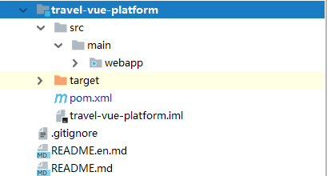

##### 【2】导入静态资源

拷贝黑马旅游-day04\02-课程资料\01-静态页面到webapp下

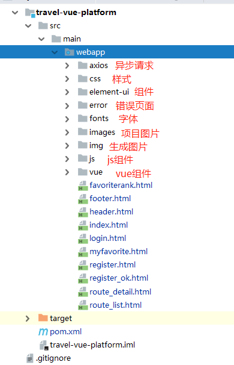

#### 【2】图片服务器

##### 【2.1】准备工作

 随便找个盘，新建一个空白文件夹，然后复制几个文件过来，最好是视频图片文字都有。我的是F:\file-service

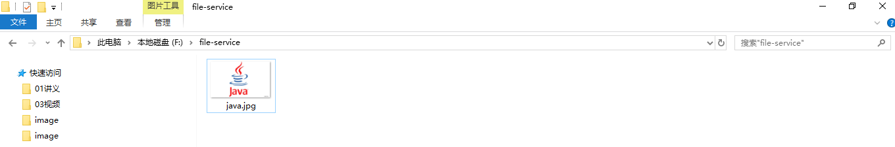

##### 【2.2】配置tomcat

在tomcat的安装目录中找到conf文件

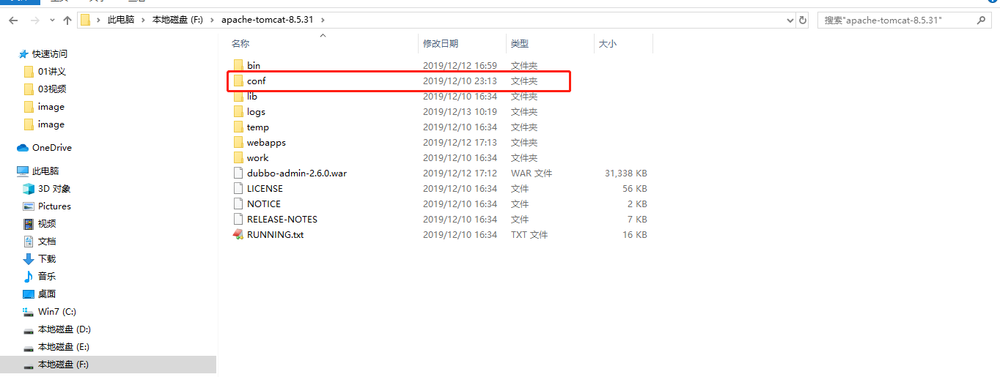

打开conf找到service.xml

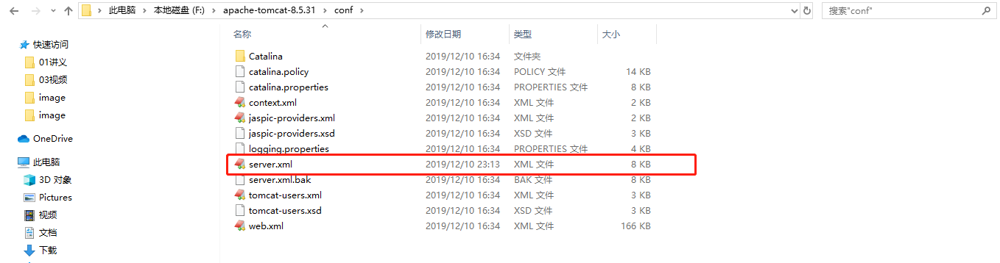

编辑service.xml

在Host节点下配置<Context path="/file-service" docBase="F:\file-service"/>以下为部分代码

```xml
.....      
<Host name="localhost"  appBase="webapps"
      unpackWARs="true" autoDeploy="true">
    <!--设置图片服务器映射路径-->
    <Context path="/file-service" docBase="F:\file-service"/>
    <Valve className="org.apache.catalina.valves.AccessLogValve" directory="logs"
           prefix="localhost_access_log" suffix=".txt"
           pattern="%h %l %u %t &quot;%r&quot; %s %b" />
</Host>
.....
```

在Service节点下找到protocol="HTTP/1.1"的Connector节点，设置访问端口，以下为部分代码

```xml
<Connector port="80" protocol="HTTP/1.1"
               connectionTimeout="20000"
               redirectPort="8443" />
```

启动tomcat

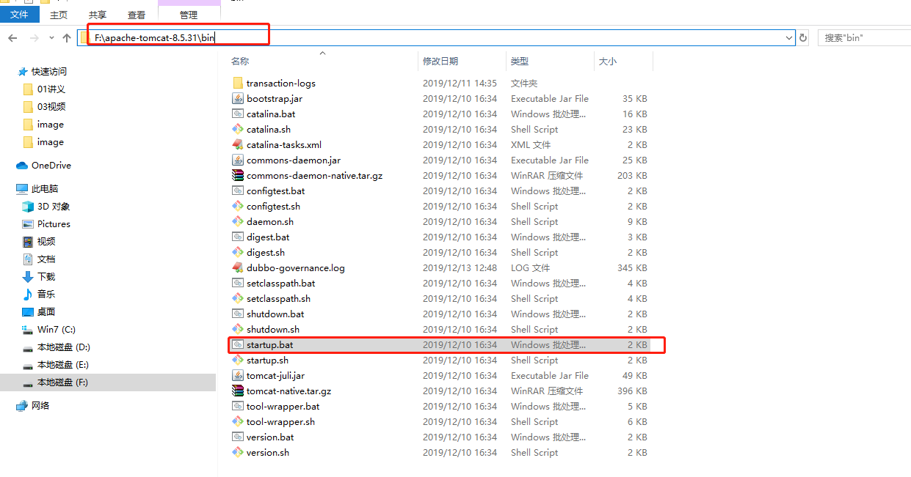

##### 【2.3】访问测试

访问 http://127.0.0.1/file-service/java.jpg 

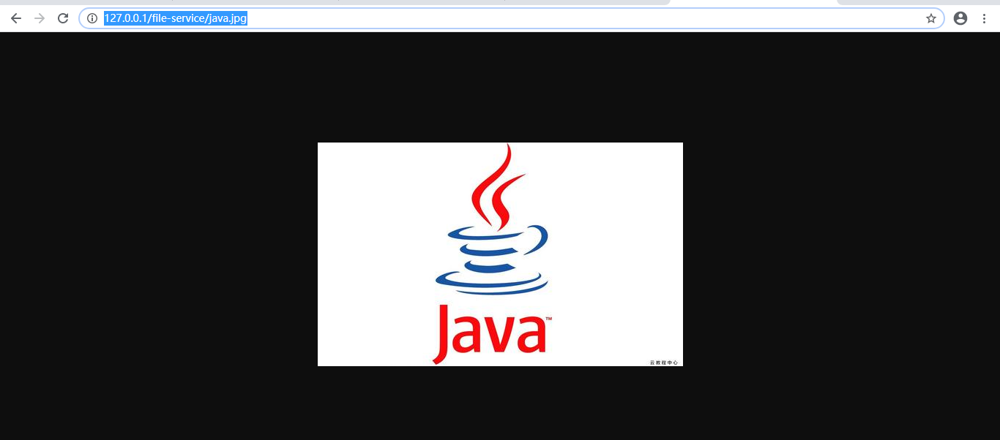

### 2、基础框架封装

​		在vue项目中，和后台交互获取数据这块，我们通常使用的是axios库，它是基于promise的http库，可运行在浏览器端和node.js中。他有很多优秀的特性，例如拦截请求和响应、取消请求、转换json、客户端防御cSRF等。所以我们的尤大大也是果断放弃了对其官方库vue-resource的维护，直接推荐我们使用axios库

#### 【1】基础声明

```js
import { logout } from './user.js'

// 每次请求携带cookies信息
axios.defaults.withCredentials = true;
```

#### 【2】环境及超时设置

baseURL：主要是设置你请求目标服务器

timeout：全局超时时间

```js
// create an axios instance
const service = axios.create({
    baseURL: "http://127.0.0.1:8080/",
    timeout: 5000 // request timeout
});
```

#### 【3】请求拦截

```js
//请求之前拦截
service.interceptors.request.use(
  config => {
    return config
  },
  error => {
    // do something with request error
    console.log(error) ;// for debug
    return Promise.reject(error)
  }
);
```

#### 【4】返回处理

请求返回时，我们会根据对应的状态进行不同的处理

```js
//返回之后处理
service.interceptors.response.use(
  response => {
    console.log(response);
    const res = response.data;
    console.log(res.code);
    if (res.code !== '200') {
      //未知异常处理
      if (res.code === '-1') {
        Vue.prototype.$confirm('超时，可以取消继续留在该页面，或者重新登录', '确定登出', {
          confirmButtonText: '重新登录',
          cancelButtonText: '取消',
          type: 'warning'
        }).then(() => {
          removeToken();
          location.href="index.html";
        })
      }
      //未登录处理
      else if (res.code === '1001') {
          logout().then(() => {
              location.href="login.html";
          })
      } else {
        Vue.prototype.$message({
          message: res.msg,
          type: 'error',
          duration: 5 * 1000
        });
        return res
      }
    } else {
      return res
    }
  },
```

#### 【5】错误处理

```js
//错误处理
  error => {
    console.log('err' + error); // for debug
    Vue.prototype.$message({
      message: '请求出错，请联系管理员!',
      type: 'error',
      duration: 5 * 1000
    });
    return Promise.reject(error)
  }
);
export default service
```

## 第二章  基础业务编写

### 1、跨域问题【重点】

#### 【1.1】为什么会出现跨域问题

8083->8081

​		出于浏览器的同源策略限制。同源策略（Sameoriginpolicy）是一种约定，它是浏览器最核心也最基本的安全功能，如果缺少了同源策略，则浏览器的正常功能可能都会受到影响。可以说Web是构建在同源策略基础之上的，浏览器只是针对同源策略的一种实现。同源策略会阻止一个域的javascript脚本和另外一个域的内容进行交互。所谓同源（即指在同一个域）就是两个页面具有相同的协议（protocol），主机（host）和端口号（port）

#### 【1.2】什么是跨域

当一个请求url的**协议、域名、端口**三者之间任意一个与当前页面url不同即为跨域

| **当前页面url**           | **被请求页面url**               | **是否跨域** | **原因**                       |
| ------------------------- | ------------------------------- | ------------ | ------------------------------ |
| http://www.test.com/      | http://www.test.com/index.html  | 否           | 同源（协议、域名、端口号相同） |
| http://www.test.com/      | https://www.test.com/index.html | 跨域         | 协议不同（http/https）         |
| http://www.test.com/      | http://www.baidu.com/           | 跨域         | 主域名不同（test/baidu）       |
| http://www.test.com/      | http://blog.test.com/           | 跨域         | 子域名不同（www/blog）         |
| http://www.test.com:8080/ | http://www.test.com:7001/       | 跨域         | 端口号不同（8080/7001）        |

#### 【1.3】非同源限制

【1】无法读取非同源网页的 Cookie、LocalStorage 和 IndexedDB

【2】无法接触非同源网页的 DOM

【3】无法向非同源地址发送 AJAX 、axios请求

#### 【1.4】跨域的处理方式

```
添加@CrossOrigin
添加跨域拦截器
```

##### 【1.4.1】@CrossOrigin

controller方法的CORS配置

你可以向@RequestMapping注解处理程序方法添加一个@CrossOrigin注解，以便启用CORS（默认情况下，@CrossOrigin允许在@RequestMapping注解中指定的所有源和HTTP方法）：

##### 【1.4.2】跨域拦截器

travel-web-platform-A和travel-web-platform-B中com.itheima.travel.interceptors中添加CrossInterceptor

```java
package com.itheima.travel.interceptors;

import org.springframework.web.servlet.HandlerInterceptor;

import javax.servlet.http.HttpServletRequest;
import javax.servlet.http.HttpServletResponse;

/**
 * @Description：
 */
public class CrossInterceptor implements HandlerInterceptor {

    @Override
    public boolean preHandle(HttpServletRequest request, HttpServletResponse response,
                             Object handler) throws Exception {
            //解决跨域问题
            String origin = request.getHeader("Origin");
            response.setHeader("Access-Control-Allow-Origin", origin);
            response.setHeader("access-control-allow-methods", "*");
            //是否支持cookie跨域
            response.setHeader("access-control-allow-credentials", "true");
            //指定头部跨域传递accessToken
            response.setHeader("Access-Control-Allow-Headers", "Content-Type");

        return true;
    }

}

```

### 2、头部页面

目标编辑页面：header.html

#### 【1】页面信息


#### 【2】页面代码

##### 【2.1】category.js

职能：发起请求到后台

```js
import request from './request.js'

/**
 * 分页信息
 * @param data
 */
export function findAllCategory() {
    return request({
        url: 'category',
        method: 'get'
    })
}

```

##### 【2.2】user.js

职能：与后台交互用户注册、登录、当前用户、退出、是否登录

```js
import request from './request.js'

/**
 * 用户注册
 * @param data
 */
export function registerUser(data) {
  return request({
    url: 'user/register',
    method: 'post',
    data
  })
}

/**
 * 用户登录
 * @param data
 */
export function loginUser(data) {
  console.log("用户登录："+data);
  return request({
    url: 'user/login',
    method: 'post',
    data
  })
}

/**
 * 当前用户
 */
export function currentSubject() {
  return request({
    url: 'user/currentUser',
    method: 'get'
  })
}

/**
 * 用户退出
 */
export function logout() {
  return request({
    url: 'user/logout',
    method: 'get'
  })
}

/**
 * 用户是否登录
 * @param data
 */
export function isLogin() {
  return request({
    url: 'user/islogin',
    method: 'get'
  })
}

```

##### 【2.3】页面script

```js
<script src="js/vue.js"></script>
<script src="element-ui/index.js"></script>
<script src="vue/axios.min.js"></script>
<script src="vue/js-cookie.js"></script>
<script type="module">
    //导入js
    import {isLogin,currentSubject,logout} from './vue/user.js'
    import {findAllCategory} from './vue/category.js'
    var app = new Vue({
        el:"#app",
        //页面数据定义
        data:{
            //结果集
            resultList:{
                isLogin:undefined,
                //用于保存类别信息
                categories:{},
                //用于传递搜索框内容
                categoryName:undefined,
                //用于传递搜当前用户
                curentUser:{}
            },
            routeName:undefined
        },
        //页面加载时执行
        created() {
            this.login();
            this.allCategory();
            this.currentUser();
        },
        //方法函数
        methods:{
            //搜索方法
            search() {
                location.href="route_list.html?routeName="+this.routeName;
                },
            //退出
            logout(){
                logout().then(response => {
                    console.log("是否退出成功："+response.data);
                    if (response.data){
                        location.href="index.html";
                    }
                });
            },
            //是否登录
            login(){
                isLogin().then(response => {
                    console.log("查询当前用户登录状态："+response.data);
                    this.resultList.isLogin =response.data;
                });
            },
            //查询分类
            allCategory(){
                findAllCategory().then(response => {
                    console.log("查询所有分类："+response.data);
                    this.resultList.categories =response.data;
                });
            },
            //查询当前用户
            currentUser(){
                currentSubject().then(response => {
                    console.log("查询当前用户："+response.data);
                    if (response.data!==null){
                        this.resultList.curentUser =response.data;
                    }

                })
            }
        }
    });

</script>
```

##### 【2.4】登录状态判断

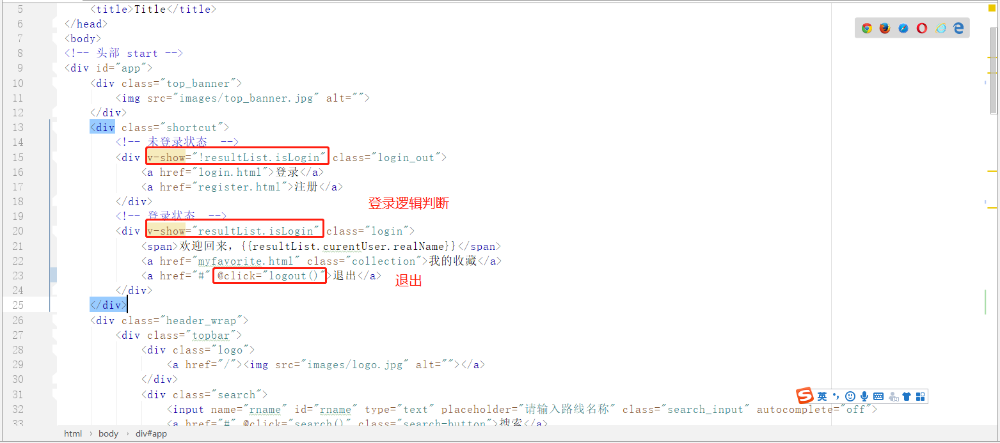

```html
<div class="shortcut">
    <!-- 未登录状态  -->
    <div v-show="!resultList.isLogin" class="login_out">
        <a href="login.html">登录</a>
        <a href="register.html">注册</a>
    </div>
    <!-- 登录状态  -->
    <div v-show="resultList.isLogin" class="login">
        <span>欢迎回来，{{resultList.curentUser.realName}}</span>
        <a href="myfavorite.html" class="collection">我的收藏</a>
        <a href="#" @click="logout()">退出</a>
    </div>
</div>
```

##### 【2.5】分类列表查询

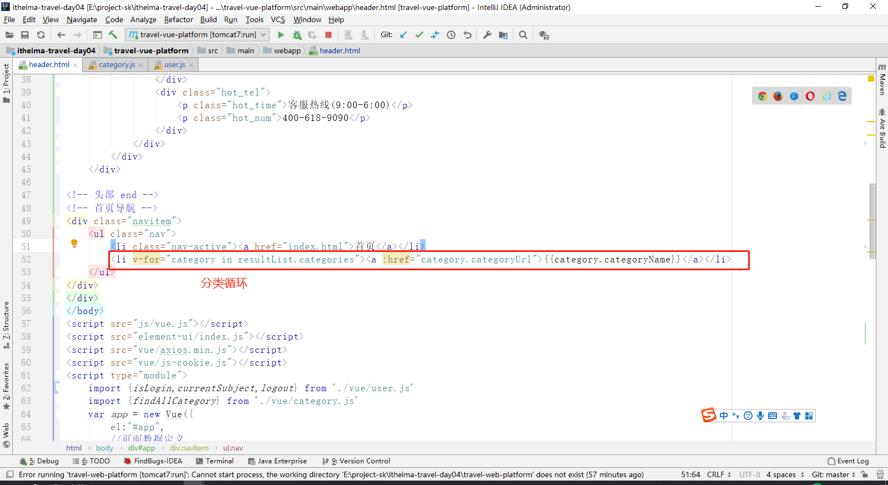

```js
<div class="navitem">
    <ul class="nav">
        <li class="nav-active"><a href="index.html">首页</a></li>
        <li v-for="category in resultList.categories"><a :href="category.categoryUrl">{{category.categoryName}}</a></li>
    </ul>
</div>
```

### 3、登录页面

目标编辑页面：login.html

#### 【1】页面信息

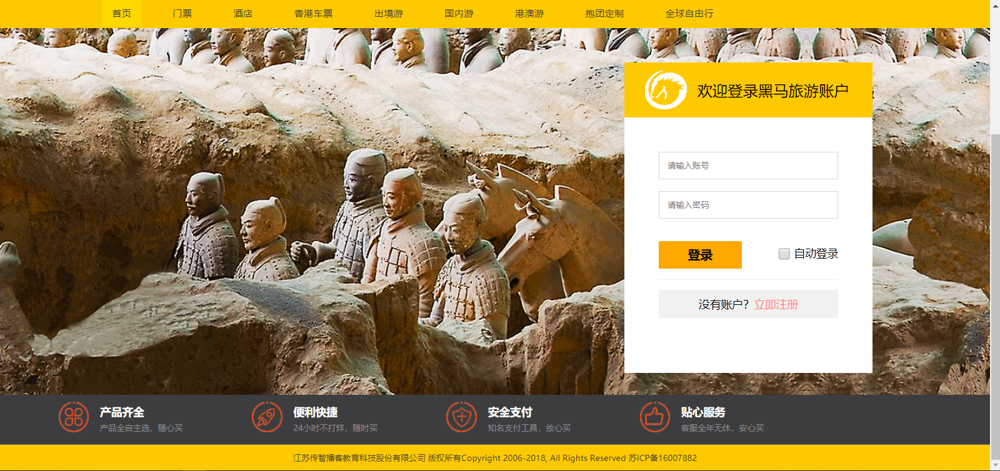

#### 【2】页面代码

##### 【2.1】页面script

这里需要注意登录成功后需要把token存放到cookie中

```js
<script src="js/vue.js"></script>
<script src="element-ui/index.js"></script>
<script src="vue/axios.min.js"></script>
<script src="vue/js-cookie.js"></script>
<script type="module">
    import {loginUser} from './vue/user.js'
    import {setToken } from './vue/auth.js'
    var login = new Vue({
        el:"#login_wrap",
        data:{
            //请求参数
            loginOpe:{
                "username":undefined,
                "password" :undefined
            },
            curentUser:undefined,
            //密码校验
            rules: {
                // 要以数组形式展示
                username: [
                    {required: true, message: "用户名不能为空", trigger: "blur"},
                    {min: 2, max: 30, message: "长度在 2 到 30 个字符", trigger: "blur"}
                ],
                password: [
                    {required: true, message: "密码不能为空", trigger: "blur"},
                    {min: 2, max: 30, message: "长度在 2 到 30 个字符", trigger: "blur"}
                ]
            }
        },

        created:function () {

        },
        methods:{
            //登录方法
            login(){
                this.$refs.registerForm.validate(valid => {
                    if (valid) {
                        loginUser(this.loginOpe).then(response => {
                            console.log("用户登录返回："+response.data);
                            this.curentUser =response.data;
                            if (this.curentUser!==null){
                                //登录成功后需要把token存放到cookie中
                                setToken(this.curentUser.token);
                                location.href="index.html";
                            }else{
                                Vue.prototype.$message({
                                    message: '登录失败',
                                    type: 'error',
                                    duration: 5 * 1000
                                });
                            }
                        });
                    } else {
                        console.log("error submit!!");
                        return false;
                    }
                });
            }
        }
    });

</script>
```

##### 【2.2】登录绑定

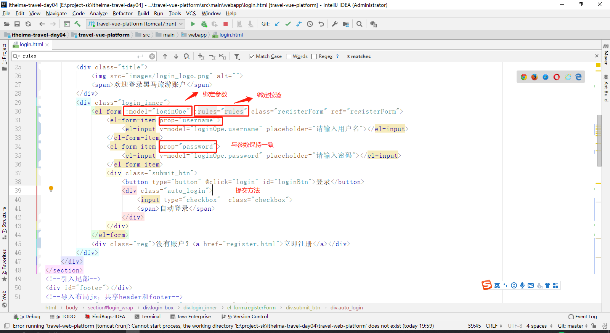

```html
<div class="login_inner">
    <el-form :model="loginOpe" :rules="rules" class="registerForm" ref="registerForm">
        <el-form-item prop="username">
            <el-input v-model="loginOpe.username" placeholder="请输入用户名"></el-input>
        </el-form-item>
        <el-form-item prop="password">
            <el-input v-model="loginOpe.password" placeholder="请输入密码"></el-input>
        </el-form-item>
        <div class="submit_btn">
            <button type="button" @click="login" id="loginBtn">登录</button>
            <div class="auto_login">
                <input type="checkbox"  class="checkbox">
                <span>自动登录</span>
            </div>
        </div>
    </el-form>
    <div class="reg">没有账户？<a href="register.html">立即注册</a></div>
</div>
```

### 4、注册页面

#### 【1】页面信息

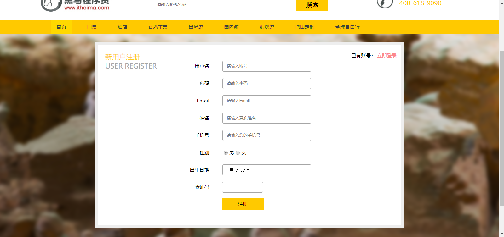

#### 【2】页面代码

##### 【2.1】页面script

```js
<script src="js/vue.js"></script>
<script src="element-ui/index.js"></script>
<script src="vue/axios.min.js"></script>
<script src="vue/js-cookie.js"></script>
<script type="module">
    import {registerUser} from './vue/user.js'

    const checkphone = (rule, value, callback) => {
        // let phoneReg = /(^1[3|4|5|6|7|8|9]\d{9}$)|(^09\d{8}$)/;
        if (value == "") {
            callback(new Error("请输入手机号"));
        } else if (!/^1(3|4|5|6|7|8)\d{9}$/.test(value)) {//引入methods中封装的检查手机格式的方法
            callback(new Error("请输入正确的手机号!"));
        } else {
            callback();
        }
    }
    var register = new Vue({
        el:"#content",
        data:{
            //请求参数
            registerUser:{
                "username":undefined,
                "password":undefined,
                "realName":undefined,
                "telephone":undefined,
                "sex":undefined,
                "birthday":undefined,
                "email":undefined
            },

            //密码校验
            rules: {
                // 要以数组形式展示
                username: [
                    {required: true, message: "用户名不能为空", trigger: "blur"},
                    {min: 2, max: 30, message: "长度在 2 到 30 个字符", trigger: "blur"}
                ],
                password: [
                    {required: true, message: "密码不能为空", trigger: "blur"},
                    {min: 2, max: 30, message: "长度在 2 到 30 个字符", trigger: "blur"}
                ],
                realName: [
                    {required: true, message: "姓名不能为空", trigger: "blur"}
                ],
                //validator: checkphone是验证手机的引入checkphone函数
                telephone: [
                    { required: true, validator: checkphone, trigger: "blur" }
                ],
                sex: [{ required: true, message: '必填', trigger: 'change' }],
                email: [
                    {
                        type: "email",
                        required: true,
                        message: "邮箱格式不正确",
                        trigger: "blur"
                    }
                ],
            }
        },

        created:function () {

        },
        methods:{
            doRegisterUser(){
                this.$refs.registerForm.validate(valid => {
                    if (valid) {
                        registerUser(this.registerUser).then(response => {
                            console.log("用户登录返回："+response.data);
                            this.curentUser =response.data;
                            if (this.curentUser!==null){
                                location.href="register_ok.html";
                            }else{
                                Vue.prototype.$message({
                                    message: '注册失败',
                                    type: 'error',
                                    duration: 5 * 1000
                                });
                            }
                        });
                    } else {
                        console.log("error submit!!");
                        return false;
                    }
                });
            }
        }
    });

</script>
```

##### 【2.2】注册绑定

```html
<div class="rg_form_center">
    <el-form :model="registerUser" :rules="rules" class="registerForm" ref="registerForm" label-width="80px">
        <el-form-item label="账号" prop="username">
            <el-input v-model="registerUser.username" placeholder="请输入用户名"></el-input>
        </el-form-item>
        <el-form-item label="密码" prop="password">
            <el-input v-model="registerUser.password" placeholder="请输入密码" type="password"></el-input>
        </el-form-item>
        <el-form-item label="姓名" prop="realName">
            <el-input v-model="registerUser.realName" placeholder="请输入用户名"></el-input>
        </el-form-item>
        <el-form-item label="生日" prop="birthday">
            <el-date-picker
                    v-model="registerUser.birthday"
                    placeholder="选择日期">
            </el-date-picker>
        </el-form-item>
        <el-form-item label="邮箱" prop="email">
            <el-input v-model="registerUser.email" placeholder="请输入邮箱"></el-input>
        </el-form-item>
        <el-form-item label="手机" prop="telephone">
            <el-input v-model="registerUser.telephone" placeholder="请输入邮箱"></el-input>
        </el-form-item>
        <el-form-item label="性别" prop="sex">
            <el-select v-model="registerUser.sex" placeholder="请选择性别">
                <el-option label="男" value="1"></el-option>
                <el-option label="女" value="0"></el-option>
            </el-select>
        </el-form-item>
        <el-form-item>
            <el-button type="primary"  class="submit_btn" @click="doRegisterUser()">注 册</el-button>
        </el-form-item>
    </el-form>
</div>
```

### 5、首页信息

#### 【1】页面信息

黑马精选、国内游、境外游都是对线路的查询的所以可以使用同一个请求处理


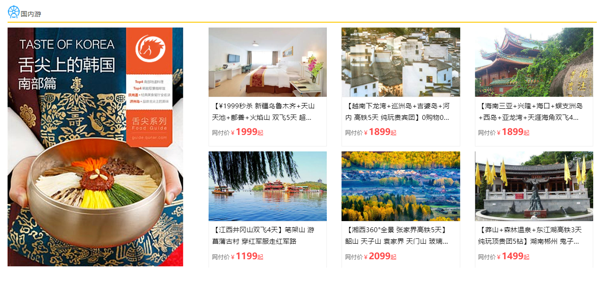


#### 【2】页面代码

##### 【2.1】route.js

```js
import request from './request.js'

/**
 * 添加路线
 * @param data
 */
export function addRoute(data) {
    return request({
        url: 'route',
        method: 'post',
        data
    })
}

/**
 * 修改路线
 * @param data
 */
export function updateRoute(data) {
    return request({
        url: 'route',
        method: 'put',
        data
    })
}

/**
 * 查询线路按线路ID
 * @param data
 */
export function findRouteById(data) {
    return request({
        url: 'route/'+data,
        method: 'get'
    })
}

/**
 * 线路分页查询
 * @param data
 */
export function findRouteByPage(data,pageNum,pageSize) {
    return request({
        url: 'route/'+pageNum+"/"+pageSize,
        method: 'post',
        data
    })
}

```

##### 【2.2】页面script

```js
<script src="js/vue.js"></script>
<script src="element-ui/index.js"></script>
<script src="vue/axios.min.js"></script>
<script src="vue/js-cookie.js"></script>
<script type="module">
    import {findRouteByPage} from './vue/route.js'
    var indexVue = new Vue({
        el:"#content",
        data:{
            //查询条件
            queryCondition:{
                //是否主题
                "isThemeTour":undefined,
                //分类
                "categoryId":undefined,
                //路线名称
                "routeName":undefined,
                //排序
                "orderPopularity":undefined,
                "orderNewest":undefined

            },
            //结果集
            resultList:{
                popularityResult:undefined,
                newestResult:undefined,
                themeTourResult:undefined,
                domesticResult:undefined,
                foreignResult:undefined,
                webSite:undefined
            },

        },
        created() {
            this.popularity();
            this.newest();
            this.themeTour();
            this.domestic();
            this.foreign();
        },
        methods:{
            // 重置查询条件
            resetTemp() {
                this.queryCondition = {
                    //是否主题
                    "isThemeTour": undefined,
                    //分类
                    "categoryId": undefined,
                    //路线名称
                    "routeName": undefined,
                    //排序
                    "orderPopularity":undefined,
                    "orderNewest":undefined
                }
            },
            //去详情页面
            toRouteDetail(id){
                location.href="route_detail.html?id="+id
            },
            //人气
            popularity(){
                this.resetTemp();
                this.queryCondition.orderPopularity=" attention_count asc ";
                findRouteByPage(this.queryCondition,1,4).then(response => {
                    console.log("人气返回："+response.data);
                    this.resultList.popularityResult =response.data.list;
                    this.resultList.webSite = response.webSite;
                });
            },
            //最新
            newest(){
                this.resetTemp();
                this.queryCondition.orderNewest=" created_time desc";
                findRouteByPage(this.queryCondition,1,4).then(response => {
                    console.log("最新返回："+response.data);
                    this.resultList.newestResult =response.data.list;
                    this.resultList.webSite = response.webSite;
                });
            },
            //主题
            themeTour(){
                this.resetTemp();
                this.queryCondition.isThemeTour="1";
                findRouteByPage(this.queryCondition,1,4).then(response => {
                    console.log("主题返回："+response.data);
                    this.resultList.themeTourResult =response.data.list;
                    this.resultList.webSite = response.webSite;
                });
            },
            //国内
            domestic(){
                this.resetTemp();
                this.queryCondition.categoryId="5";
                findRouteByPage(this.queryCondition,1,6).then(response => {
                    console.log("国内返回："+response.data);
                    this.resultList.domesticResult =response.data.list;
                    this.resultList.webSite = response.webSite;
                });
            },
            //国外
            foreign(){
                this.resetTemp();
                this.queryCondition.categoryId="4";
                findRouteByPage(this.queryCondition,1,6).then(response => {
                    console.log("国外返回："+response.data);
                    this.resultList.foreignResult =response.data.list;
                    this.resultList.webSite = response.webSite;
                });
            },
        }
    });

</script>
```

##### 【2.3】后端代码修改

com.itheima.travel.req.RouteVo中添加新增端

```java
/**
   * 排序
   */
private String orderPopularity;

private String orderNewest;

/**
  * 图片信息
  */
private List<AffixVo> affixVoList;
```

修改 RouteServiceImpl 中的findRouteByPage方法添加排序支持

```java
@Override
    public PageInfo<RouteVo> findRouteByPage(RouteVo routeVo, int pageNum, int pageSize) {
        PageHelper.startPage(pageNum, pageSize);
        RouteExample example = new RouteExample();
        RouteExample.Criteria criteria = example.createCriteria();
        //多条件查询
        if (!EmptyUtil.isNullOrEmpty(routeVo.getCategoryId())){
            criteria.andCategoryIdEqualTo(routeVo.getCategoryId());
        }
        if (!EmptyUtil.isNullOrEmpty(routeVo.getRouteName())){
            criteria.andRouteNameLike("%"+routeVo.getRouteName());
        }
        if (!EmptyUtil.isNullOrEmpty(routeVo.getRouteName())){
            criteria.andRouteNameLike("%"+routeVo.getRouteName());
        }
        if (!EmptyUtil.isNullOrEmpty(routeVo.getMinPrice())){
            criteria.andPriceGreaterThan(routeVo.getMinPrice());
        }
        if (!EmptyUtil.isNullOrEmpty(routeVo.getMaxPrice())){
            criteria.andPriceLessThan(routeVo.getMaxPrice());
        }
        //注意这里的字段为数据库字段：类似example.setOrderByClause("index ASC,created_time ASC");
        if (!EmptyUtil.isNullOrEmpty(routeVo.getOrderNewest())){
            example.setOrderByClause(routeVo.getOrderNewest());
        }
        if (!EmptyUtil.isNullOrEmpty(routeVo.getOrderPopularity())){
            example.setOrderByClause(routeVo.getOrderPopularity());
        }
        List<Route> routes = routeMapper.selectByExample(example);
        PageInfo<Route> pageInfo = new PageInfo<>(routes);
        PageInfo<RouteVo> pageInfoVo = new PageInfo<>();
        //外部对象拷贝
        BeanConv.toBean(pageInfo, pageInfoVo);
        //结果集转换
        List<RouteVo> routeVoList = BeanConv.toBeanList(pageInfo.getList(), RouteVo.class);
        pageInfoVo.setList(routeVoList);
        //处理图片
        for (RouteVo routeVoHandler : routeVoList) {
            AffixVo affixVo = AffixVo.builder().businessId(routeVoHandler.getId()).build();
            routeVoHandler.setAffixVoList(affixService.findAffixByBusinessId(affixVo));
        }
        return pageInfoVo;
    }
```

##### 【2.4】人气

```html
<div role="tabpanel" class="tab-pane active" id="popularity">
    <div class="row">
        <div v-for ="popularity in resultList.popularityResult " class="col-md-3">
            <a @click="toRouteDetail(popularity.id)">
                
                <div class="has_border">
                    <h3>{{popularity.routeName}}</h3>
                    <div class="price">网付价<em>￥</em><strong>{{popularity.price}}</strong><em>起</em></div>
                </div>
            </a>
        </div>
    </div>
</div>
```

##### 【2.5】最新

```html
<div role="tabpanel" class="tab-pane" id="newest">
    <div class="row">
        <div v-for ="newest in resultList.newestResult " class="col-md-3">
            <a href="javascript:" @click="toRouteDetail(newest.id)">
                
                <div class="has_border">
                    <h3>{{newest.routeName}}</h3>
                    <div class="price">网付价<em>￥</em><strong>{{newest.price}}</strong><em>起</em></div>
                </div>
            </a>
        </div>
    </div>
</div>
```

##### 【2.6】主题

```html
<div role="tabpanel" class="tab-pane" id="theme">
    <div class="row">
        <div v-for ="themeTour in resultList.themeTourResult " class="col-md-3">
            <a href="javascript:" @click="toRouteDetail(themeTour.id)">
                
                <div class="has_border">
                    <h3>{{themeTour.routeName}}</h3>
                    <div class="price">网付价<em>￥</em><strong>{{themeTour.price}}</strong><em>起</em></div>
                </div>
            </a>
        </div>
    </div>
</div>
```

##### 【2.7】国内

```html
<div class="heima_gn">
    <div class="guonei_l">
        
    </div>
    <div class="guone_r">
        <div class="row">
            <div v-for ="domestic in resultList.domesticResult " class="col-md-4">
                <a href="javascript:" @click="toRouteDetail(domestic.id)">
                    
                    <div class="has_border">
                        <h3>{{domestic.routeName}}</h3>
                        <div class="price">网付价<em>￥</em><strong>{{domestic.price}}</strong><em>起</em></div>
                    </div>
                </a>
            </div>
        </div>
    </div>
</div>
```

##### 【2.8】国外

```html
<div class="heima_gn">
    <div class="guonei_l">
        
    </div>
    <div class="guone_r">
        <div class="row">
            <div v-for ="foreign in resultList.foreignResult " class="col-md-4">
                <a href="javascript:" @click="toRouteDetail(foreign.id)">
                    
                    <div class="has_border">
                        <h3>{{foreign.routeName}}</h3>
                        <div class="price">网付价<em>￥</em><strong>{{foreign.price}}</strong><em>起</em></div>
                    </div>
                </a>
            </div>
        </div>
    </div>
</div>
```

### 6、线路详情

#### 【1】页面信息

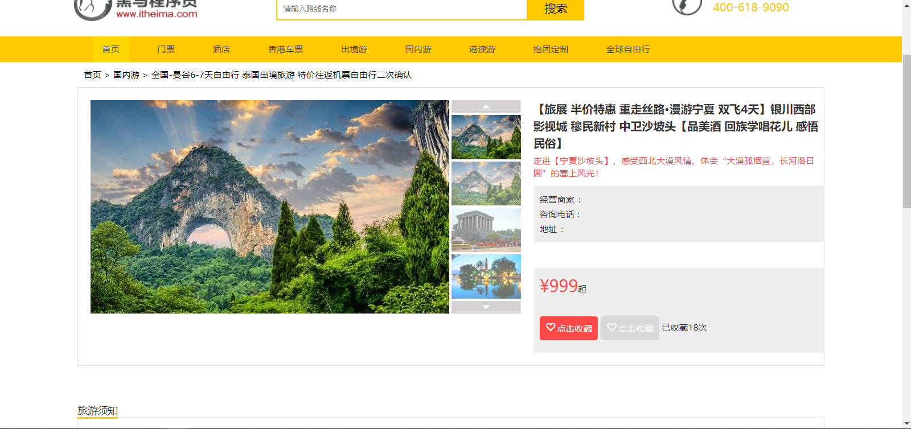

#### 【2】页面代码

##### 【2.1】页面script

```js
<script type="module">
    import {getRequestParm} from './vue/tool.js'
    import {findRouteById} from './vue/route.js'
    import {findSellerVoByid} from './vue/seller.js'
    import {isFavorited,addFavorite,findMyFavorite} from './vue/favorite.js'
    var routeDetail = new Vue({
        el:"#route_detail",
        //页面数据定义
        data:{
            //结果集
            query_detail:{
                id:undefined,
                routeName:undefined
            },
            //线路详情
            routeResult:{},
            //卖家详情
            sellerResult:{},
            //站点详情
            webSite:'',
            //背景图片
            bigImg:'',
            //是否收藏
            isFavorited:{}
        },
        //页面加载时执行
        created() {
            this.routeDetail();
        },
        //方法函数
        methods:{
            //收藏状态
            favoriteStatus(){
                isFavorited({"routeId":this.routeResult.id}).then(response => {
                    console.log("是否收藏状态："+response.data);
                    this.isFavorited =response.data;
                });
            },
            //添加收藏
            addFavorite(){
                addFavorite({"routeId":this.routeResult.id}).then(response => {
                    console.log("是否收藏状态："+response.data);
                    this.routeResult.attentionCount =response.data;
                    this.isFavorited=true;
                });
            },
            //路线详情
            routeDetail(){
                this.query_detail.id = getRequestParm("id");
                findRouteById(this.query_detail).then(response => {
                    this.routeResult=response.data;
                    console.log("返回路线信息："+this.routeResult);
                    this.webSite = response.webSite;
                    this.bigImg =this.routeResult.affixVoList[0].pathUrl;
                    if (this.routeResult.sellerId!=null){
                        this.favoriteStatus();
                        findSellerVoByid({id:this.routeResult.sellerId}).then(response => {
                            console.log("返回商家信息："+response.data)
                            this.sellerResult=response.data;
                        });
                    }

                });
            }
        }
    });

</script>
```

##### 【2.2】seller.js

```js
import request from './request.js'

/**
 * 买家信息
 * @param data
 */
export function findSellerVoByid(data) {
    return request({
        url: 'seller/'+data,
        method: 'get'
    })
}

```

##### 【2.3】favorite.js

```js
import request from './request.js'

/**
 * 我的收藏
 * @param data
 */
export function findMyFavorite(pageNum,pageSize) {
    return request({
        url: 'favorite/'+pageNum+'/'+pageSize,
        method: 'post'
    })
}

/**
 * 是否关注
 * @param data
 */
export function isFavorited(data) {
    return request({
        url: 'favorite/'+data,
        method: 'get'
    })
}

/**
 * 添加收藏
 * @param data
 */
export function addFavorite(data) {
    return request({
        url: 'favorite',
        method: 'post',
        data
    })
}

```

##### 【2.4】图片展示

```html
<dl class="prosum_left">
    <dt>
        
    </dt>
    <dd>
        <a class="up_img up_img_disable"></a>

        <a title="" v-for ="(item,index) in routeResult.affixVoList "
           :class="index == 3 ? 'little_img cur_img' : 'little_img'"
           :data-bigpic="webSite+item.pathUrl">
            
        </a>

        <a class="down_img down_img_disable" style="margin-bottom: 0;"></a>
    </dd>
</dl>
```

##### 【2.5】线路详情

```html
<div class="prosum_right">

    <p class="pros_title">{{routeResult.routeName}}</p>
    <p class="hot">{{routeResult.routeIntroduce}}</p>
    <div class="pros_other">
        <p>经营商家  ：{{sellerResult.sellerName}}</p>
        <p>咨询电话 : {{sellerResult.telephone}}</p>
        <p>地址 ： {{sellerResult.address}}</p>
    </div>
    <div class="pros_price">
        <p class="price"><strong>¥{{routeResult.price}}</strong><span>起</span></p>
        <p class="collect">

            <a class="btn" v-show="!isFavorited" @click="addFavorite()"><i class="glyphicon glyphicon-heart-empty"></i>点击收藏</a>

            <a  class="btn already" v-show="isFavorited"  disabled="disabled"><i class="glyphicon glyphicon-heart-empty"></i>点击收藏</a>

            <span>已收藏{{routeResult.attentionCount}}次</span>
        </p>
    </div>
</div>
```

### 7、我的收藏

#### 【1】页面信息


#### 【2】页面代码

##### 【2.1】页面script

```js
<script src="js/vue.js"></script>
<script src="element-ui/index.js"></script>
<script src="vue/axios.min.js"></script>
<script src="vue/js-cookie.js"></script>
<script type="module">
    import {findMyFavorite} from './vue/favorite.js'
    var myfavorite = new Vue({
        el:"#content",
        //页面数据定义
        data:{
            //线路详情
            favoritedResult:{
                favoriteds:{},
                webSite:undefined
            },
            pageHelp:{
                pageNum:1,
                pageSize:12
            }
        },
        //页面加载时执行
        created() {
            this.myFavorite();
        },
        //方法函数
        methods:{
            //去详情页面
            toRouteDetail(id){
                location.href="route_detail.html?id="+id
            },
            //路线详情
            myFavorite(val) {
                if (val!=undefined){
                    this.pageHelp.pageNum=val;
                }
                findMyFavorite(this.pageHelp.pageNum,this.pageHelp.pageSize).then(response => {
                    console.log("返回我的收藏信息：" + response.data);
                    this.favoritedResult.favoriteds = response.data;
                    this.favoritedResult.webSite = response.webSite;
                });
            }
        }
    });

</script>
```

##### 【2.2】收藏列表

```html
<div class="jx_content">
    <!-- Tab panes -->
    <div class="tab-content">
        <div role="tabpanel" class="tab-pane active" id="home">
            <div class="row">
                <div v-for ="favorited in favoritedResult.favoriteds.list " class="col-md-3">
                    <a href="javascript:" @click="toRouteDetail(favorited.id)">
                        
                        <div class="has_border">
                            <h3>{{favorited.routeName}}</h3>
                            <div class="price">网付价<em>￥</em><strong>{{favorited.price}}</strong><em>起</em></div>
                        </div>
                    </a>
                </div>
            </div>
        </div>
    </div>
</div>
<div class="pageNum">
    <el-pagination
            background
            layout="prev, pager, next"
            :total="favoritedResult.favoriteds.total"
            :current-page="favoritedResult.favoriteds.pageNum"
            :page-size="favoritedResult.favoriteds.pageSize"
            :pager-count="11"
            @current-change="myFavorite">
    </el-pagination>
</div>
```

### 8、搜索功能

#### 【1】页面信息

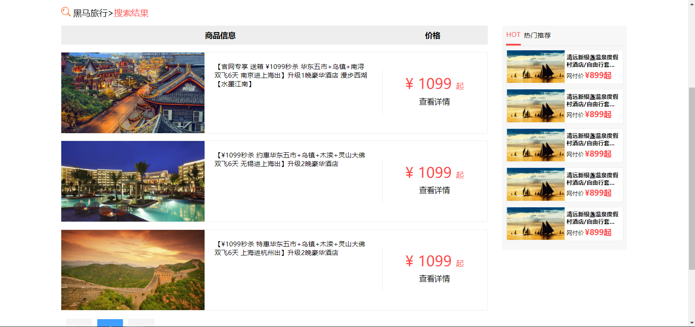

#### 【2】页面代码

##### 【2.1】页面script

```js
<script src="js/vue.js"></script>
<script src="element-ui/index.js"></script>
<script src="vue/axios.min.js"></script>
<script src="vue/js-cookie.js"></script>
<script type="module">
    import {findRouteByPage} from './vue/route.js'
    import {getRequestParm} from './vue/tool.js'
    var routeList = new Vue({
        el:"#routeContant",
        //页面数据定义
        data:{
            //线路详情
            routeResult:{
                routes:{},
                webSite:{}
            },
            pageHelp:{
                pageNum:1,
                pageSize:5
            },
            routeName:undefined,
            orderPopularity:undefined
        },
        //页面加载时执行
        created() {
            this.routeList();
        },
        //方法函数
        methods:{
            //去详情页面
            toRouteDetail(id){
                location.href="route_detail.html?id="+id
            },
            //路线详情
            routeList(val) {
                if (val!=undefined){
                    this.pageHelp.pageNum=val;
                }
                this.routeName = getRequestParm("routeName");
                if(this.routeName==null){
                    this.orderPopularity=" attention_count asc ";
                }

                findRouteByPage({"routeName":this.routeName,"orderPopularity":this.orderPopularity},this.pageHelp.pageNum,this.pageHelp.pageSize).then(response => {
                    console.log("搜索返回："+response.data);
                    this.routeResult.routes =response.data;
                    this.routeResult.webSite = response.webSite;
                });
            }
        }
    });

</script>
```

【2.2】搜索列表

```html
<div class="xinxi clearfix">
    <div class="left">
        <div class="header">
            <span>商品信息</span>
            <span class="jg">价格</span>
        </div>
        <ul>
            <li v-for ="route in routeResult.routes.list ">
                <div class="img">
                    
                </div>
                <div class="text1">
                    <p>{{route.routeName}}</p>
                </div>
                <div class="price">
                    <p class="price_num">
                        <span>&yen;</span>
                        <span>{{route.price}}</span>
                        <span>起</span>
                    </p>
                    <p><a href="#" @click="toRouteDetail(route.id)">查看详情</a></p>
                </div>
            </li>
        </ul>
        <div class="pageNum ">
            <ul id="laypage">
                <el-pagination
                        background
                        layout="prev, pager, next"
                        :total="routeResult.routes.total"
                        :current-page="routeResult.routes.pageNum"
                        :page-size="routeResult.routes.pageSize"
                        :pager-count="11"
                        @current-change="routeList">
                </el-pagination>
            </ul>
        </div>
    </div>
    <div class="right">
        <div class="top">
            <div class="hot">HOT</div>
            <span>热门推荐</span>
        </div>
        <ul>
            <li>
                <div class="left"></div>
                <div class="right">
                    <p>清远新银盏温泉度假村酒店/自由行套...</p>
                    <p>网付价<span>&yen;<span>899</span>起</span>
                    </p>
                </div>
            </li>
            <li>
                <div class="left"></div>
                <div class="right">
                    <p>清远新银盏温泉度假村酒店/自由行套...</p>
                    <p>网付价<span>&yen;<span>899</span>起</span>
                    </p>
                </div>
            </li>
            <li>
                <div class="left"></div>
                <div class="right">
                    <p>清远新银盏温泉度假村酒店/自由行套...</p>
                    <p>网付价<span>&yen;<span>899</span>起</span>
                    </p>
                </div>
            </li>
            <li>
                <div class="left"></div>
                <div class="right">
                    <p>清远新银盏温泉度假村酒店/自由行套...</p>
                    <p>网付价<span>&yen;<span>899</span>起</span>
                    </p>
                </div>
            </li>
            <li>
                <div class="left"></div>
                <div class="right">
                    <p>清远新银盏温泉度假村酒店/自由行套...</p>
                    <p>网付价<span>&yen;<span>899</span>起</span>
                    </p>
                </div>
            </li>
        </ul>
    </div>
</div>
```