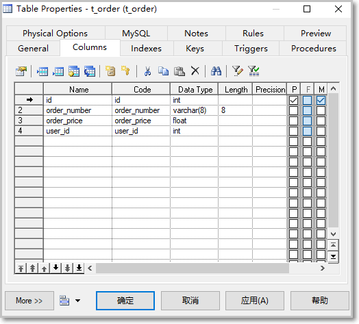
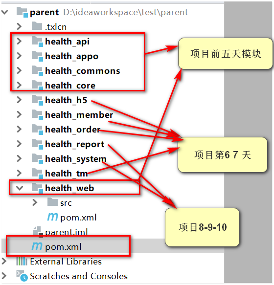
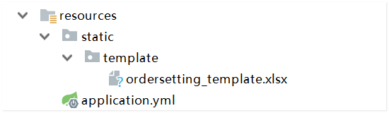
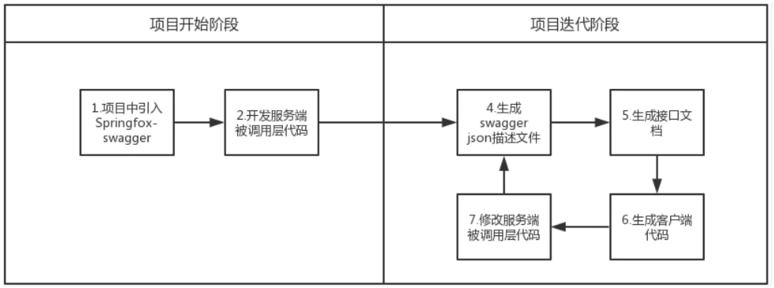
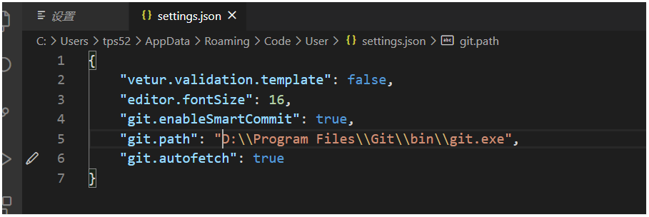

# 第1章 项目概述和环境搭建

学习目标

- 掌握传智健康后台项目搭建
- 掌握传智健康前端项目搭建
- 掌握swagger2生成接口文档
- 了解apizza接口文档的编写
- 了解前端项目目录结构及如何运行前端项目

## 1. 项目概述

1.  项目介绍

```java
传智健康管理系统是一款应用于健康管理机构的业务系统，实现健康管理机构工作内容可视化、会员管理专业化、健康评估数字化、健康干预流程化、知识库集成化，从而提高健康管理师的工作效率，加强与会员间的互动，增强管理者对健康管理机构运营情况的了解。
```

详见：资料中的传智健康PRD文档（产品需求说明书）.docx

2. 原型展示
--------

参见资料中的静态原型。


当我们在后台的套餐管理添加一个套餐，移动端就会多出一个套餐可以供用户进行选择：


3. 技术架构
--------


4. 功能架构
--------


5. 软件开发流程
------------

软件开发一般会经历如下几个阶段，整个过程是顺序展开，所以通常称为瀑布模型。

通常会分为三个阶段：定义阶段、开发阶段、维护阶段

定义阶段：

1.  可行性研究与计划

>   对项目进行可行性判断，是否可以正常开发，有没有赚头。

2. 需求分析

>   和客户进行沟通，并观察客户的日常需求，设计要符合客户的使用习惯，具体有哪些功能等等。

开发阶段：

3. 设计

>   根据需求分析设计页面原型，有哪些模块，有哪些功能，有哪些表，表结构是怎么样的，有哪些字段，表和表之间的关系是怎么样的等等。

4. 编码

>   根据设计的功能和页面等，使用代码进行功能的实现。

5. 测试

>   功能完成后需要进行代码的测试，有没有bug，有没有需要完善的地方。

以上瀑布模型的三个阶段是软件工程中标准的作法，但其实在正常企业开发中可能并不会严格按照以上的阶段一步一步来进行的，我们还是需要符合各自企业的风格来进行开发。

 

## 2. 网站数据建模说明（了解）

**PowerDesigner**是Sybase公司的一款数据库建模工具，使用它可以方便地对系统进行分析设计，pd几乎包括了数据库模型设计的全过程。利用PowerDesigner可以制作数据流程图、概念数据模型、物理数据模型、面向对象模型。

在项目设计阶段通常会使用PowerDesigner进行数据库设计。

使用PowerDesigner可以更加直观的表现出数据库中表之间的关系，并且可以**直接导出相应的建表语句**。

#### 2.1 PD操作演示   用户表和订单

PowerDesigner使用,创建PDM(物理数据模型)

操作步骤：先安装软件

 

打开界面

1、创建PDM，选择物理数据模型Physical Date Model

 

2、选择数据库类型  我们选择mysql5.0版本即可

 

#### 2.2 创建t_user模型

选择菜单选项 table 选中  ，在空白画布单击即可

 

空白地方单击鼠标即可！  再次选择菜单想的鼠标箭头 即可选中 双击对模型进行编辑

 

编写目标表名

 

创建字段：选择该界面的 Columns 选项即可进行表的字段的编写

 

设置某个字段属性，在字段上右键

 

 

以此操作，完成单表的模型创建！


主键设置和自增： 勾选 p

 

   


#### 2.3 创建t_order添加表关系1对多

按照上述操作，同样创建一张订单表

 

添加外键约束，记得工具栏 选中对应的线即可。


如果旁边没Palette,可以右键显示：工作栏显示出来！

 

添加外键关系：  双击关联的这个线 即可打开两张表的关系编辑模式

 

完成后效果如下： 完成外键关联！  xxx.pdm

 

#### 2.4 从PDM导出SQL脚本

可以通过PowerDesigner设计的PDM模型导出为SQL脚本，如下：

 

选择导出到哪里：

 

生成如下：

 

#### 2.5 逆向工程-sql文件生成pdm模型

上面我们是首先创建PDM模型，然后通过PowerDesigner提供的功能导出SQL脚本。

实际上这个过程也可以反过来，也就是我们可以通过**SQL脚本逆向生成PDM模型**

这称为逆向工程，操作如下：

 

点击确定：

 

点击“确定”选择sql文件：

 

完成后效果如下：

 

-------------java程序员 基于 pd  生成 对应sql 即可  -----使用sqlyong  导入xxx.sql数据库即可！

 

#### 2.6 生成数据库报表文件(了解)

为了方便其他人查看数据库表结构，我们可以通过PowerDesigner提供的功能，可以将PDM模型生成一个报表文件，具体操作如下：

为了

（1）打开报表向导窗

 

（2）指定报表名称和语言

 

点击完成直接导出即可。

当然也有可能经理会直接发一个pdm文件给我们，让我们自己查看数据库表结构。

关于pd 会使用即可！


## 3. 传智健康项目环境搭建

#### 3.1 传智健康项目架构说明


传智健康项目采用maven分模块（聚合工程）开发方式，

即对整个项目按照功能模块划分，每个maven子工程存放特定的一类代码，

具体搭建模块步骤如下：

https://www.processon.com/diagraming/5f5ef65f637689556171161e

   

各模块职责定位： 采用SOA架构设计

```markdown
health_parent：父工程，打包方式为pom，统一项目开发版本，所有子模块工程的父模块。

health_common：通用功能模块，存放项目中使用到的一些工具类和常量类

health_api：存放po , vo  ,dto ,service服务接口模块以及通用结果集封装对象

health_appointment：Dubbo服务提供和消费模块，存放项目所有服务实现类，提供预约服务

health_report :  Dubbo服务提供模块，存放项目所有服务实现类，作为服务提供方，作为服务源 提供报表服务

health_member : Dubbo服务提供模块，存放项目所有服务实现类，提供会员服务

health_order : Dubbo服务和消费提供模块，存放项目所有服务实现类， 提供订单服务

health_system : Dubbo服务提供模块，存放项目所有服务实现类，作为服务提供方，作为服务源 提供用户管理服务（用户、菜单、权限、角色服务）
health_core :  所有服务模块的公共部分 - 所有服务需要依赖的通用配置（配置类、依赖）

health_web：PC后台服务消费方，存放Controller组件 接收前端请求，调用服务

health_h5 : 移动端服务消费方，传智健康 移动端开发 存放Controller组件 接收客户请求

```

#### 3.2 项目工程搭建步骤

打开下发的资料：  

 

模块课程安排说明：

 

##### 3.2.1 项目环境版本统一

**JDK版本 1.8    不要使用高版本避免环境异常错误**

**springboot 2.3.0  + dubbo 2.7.5  + mybatisplus 3.3.2**

##### 3.2.2  步骤1： 创建health_parent父工程

创建health_parent，父工程，**打包方式为pom**，用于统一管理依赖版本

根据下发的资料，将对应的内容拷贝到对应得模块即可！

**格式化快捷键：ctrl+alt+l**

```xml

    学员复制时 子模块的版本号 切换自己的版本号  以实际版本号为准 - 老师这里使用的1.1.4-SNAPSHOT
    子模块的坐标 切换成学员自己的坐标   老师的坐标 com.itheima.health 
   <parent>
        <groupId>org.springframework.boot</groupId>
        <artifactId>spring-boot-starter-parent</artifactId>
        <version>2.3.0.RELEASE</version>
    </parent>

    <properties>
        <mybatisplus.version>3.3.2</mybatisplus.version>
        <fastjson.version>1.2.72</fastjson.version>
        <health.api.version>1.0-SNAPSHOT</health.api.version>
        <health.commons.version>1.0-SNAPSHOT</health.commons.version>
        <health.core.version>1.0-SNAPSHOT</health.core.version>
        <springboot-dubbo-version>2.7.5</springboot-dubbo-version>
    </properties>
    <!--项目模块-->
    <dependencyManagement>
        <dependencies>
            <dependency>
                <groupId>cn.itcast.health</groupId>
                <artifactId>health_core</artifactId>
                <version>${health.core.version}</version>
            </dependency>
            <dependency>
                <groupId>cn.itcast.health</groupId>
                <artifactId>health_commons</artifactId>
                <version>${health.commons.version}</version>
            </dependency>
            <dependency>
                <groupId>cn.itcast.health</groupId>
                <artifactId>health_api</artifactId>
                <version>${health.api.version}</version>
            </dependency>
        </dependencies>
    </dependencyManagement>
```

##### 3.2.3 步骤2：创建health_common子工程

pom的依赖配置如下 

```xml
<dependencies>
    <!--spring  data  redis-->
    <dependency>
        <groupId>org.springframework.boot</groupId>
        <artifactId>spring-boot-starter-data-redis</artifactId>
    </dependency>

    <dependency>
        <groupId>org.springframework.boot</groupId>
        <artifactId>spring-boot-starter-quartz</artifactId>
    </dependency>

    <dependency>
        <groupId>org.springframework.boot</groupId>
        <artifactId>spring-boot-starter-amqp</artifactId>
    </dependency>

    <dependency>
        <groupId>commons-logging</groupId>
        <artifactId>commons-logging</artifactId>
        <version>1.2</version>
    </dependency>

    <dependency>
        <groupId>org.redisson</groupId>
        <artifactId>redisson</artifactId>
        <version>3.12.5</version>
    </dependency>

    <!--json序列化-->
    <dependency>
        <groupId>com.alibaba</groupId>
        <artifactId>fastjson</artifactId>
        <version>1.2.47</version>
    </dependency>

    <!--POI报表-->
    <dependency>
        <groupId>org.apache.poi</groupId>
        <artifactId>poi</artifactId>
        <version>3.14</version>
    </dependency>
    <dependency>
        <groupId>org.apache.poi</groupId>
        <artifactId>poi-ooxml</artifactId>
        <version>3.14</version>
    </dependency>

    <!--easypoi-->
    <dependency>
        <groupId>cn.afterturn</groupId>
        <artifactId>easypoi-base</artifactId>
        <version>3.0.3</version>
    </dependency>
    <dependency>
        <groupId>cn.afterturn</groupId>
        <artifactId>easypoi-web</artifactId>
        <version>3.0.3</version>
    </dependency>
    <dependency>
        <groupId>cn.afterturn</groupId>
        <artifactId>easypoi-annotation</artifactId>
        <version>3.0.3</version>
    </dependency>
    <!--阿里云短信依赖 升级版-->
    <dependency>
        <groupId>com.aliyun</groupId>
        <artifactId>aliyun-java-sdk-core</artifactId>
        <version>4.5.0</version>
    </dependency>

    <!--跨服务器文件上传依赖-->
    <dependency>
        <groupId>com.sun.jersey</groupId>
        <artifactId>jersey-client</artifactId>
        <version>1.18.1</version>
    </dependency>

    <dependency>
        <groupId>junit</groupId>
        <artifactId>junit</artifactId>
        <version>4.12</version>
    </dependency>

    <!--阿里云 oss-->
    <dependency>
        <groupId>com.aliyun.oss</groupId>
        <artifactId>aliyun-sdk-oss</artifactId>
        <version>3.10.2</version>
    </dependency>

    <dependency>
        <groupId>org.springframework.boot</groupId>
        <artifactId>spring-boot-starter-test</artifactId>
        <scope>test</scope>
    </dependency>

    <dependency>
        <groupId>com.baomidou</groupId>
        <artifactId>mybatis-plus-extension</artifactId>
        <version>${mybatisplus.version}</version>
    </dependency>

    <!--jwt 依赖-->
    <dependency>
        <groupId>io.jsonwebtoken</groupId>
        <artifactId>jjwt</artifactId>
        <version>0.9.0</version>
    </dependency>
    <!-- https://mvnrepository.com/artifact/joda-time/joda-time -->
    <dependency>
        <groupId>joda-time</groupId>
        <artifactId>joda-time</artifactId>
        <version>2.9.9</version>
    </dependency>

    <dependency>
        <groupId>org.projectlombok</groupId>
        <artifactId>lombok</artifactId>
    </dependency>
</dependencies>
```

通用类： 找到资料中对应得模块main目录下拷贝即可

 

##### 3.2.4 步骤3：创建health_api子工程

**存放po,vo,dto和服务接口模块**

 

dto: 数据传输对象  用来封装客户端提交的数据，传递给service层

vo: 数据展示对象： 响应给浏览器端生成json数据的对象

po: 实体类 = 数据库表对应得类

service: 服务接口，生产者和消费者 调用的服务接口定义

entity : 定义请求和响应的json标准数据对象

pom.xml文件

```xml
   <dependencies>
             <!--vo  dto   po   mybatis -mp  + service 接口-->
          <dependency>
              <groupId>org.springframework.boot</groupId>
              <artifactId>spring-boot-starter-jdbc</artifactId>
          </dependency>
          <!--mybatis-plus 启动器 -->
          <dependency>
              <groupId>com.baomidou</groupId>
              <artifactId>mybatis-plus-boot-starter</artifactId>
              <version>${mybatisplus.version}</version>
          </dependency>
          <!--mp依赖包-->
          <dependency>
              <groupId>com.baomidou</groupId>
              <artifactId>mybatis-plus-extension</artifactId>
              <version>${mybatisplus.version}</version>
          </dependency>
          <dependency>
              <groupId>org.projectlombok</groupId>
              <artifactId>lombok</artifactId>
          </dependency>
      </dependencies>
```

同理 拷贝资料中api模块对应得java类 到main目录下！

##### 3.2.5 步骤4：创建health_service服务模块-服务模块

创建health_core模块

首先搭建所有服务的通用组件模块  **health_core**

传智健康项目后台 - health_core通用服务模块 主要为 **预约服务、订单服务、会员服务、报表服务、系统服务**等 提供通用的服务组件（包含通用配置类和maven通用依赖）

pom.xml

```xml
 <dependencies>
        <dependency>
            <groupId>org.springframework.boot</groupId>
            <artifactId>spring-boot-starter-web</artifactId>
        </dependency>
        <!--springboot 整合dubbo 开始 -->
        <dependency>
            <groupId>org.apache.dubbo</groupId>
            <artifactId>dubbo-spring-boot-starter</artifactId>
            <version>2.7.5</version>
        </dependency>
        <dependency>
            <groupId>org.apache.dubbo</groupId>
            <artifactId>dubbo-dependencies-zookeeper</artifactId>
            <version>2.7.5</version>
            <type>pom</type>
            <exclusions>
                <exclusion>
                    <groupId>org.slf4j</groupId>
                    <artifactId>slf4j-log4j12</artifactId>
                </exclusion>
            </exclusions>
        </dependency>
        <!--springboot 整合dubbo 结束-->

        <dependency>
            <groupId>org.springframework.boot</groupId>
            <artifactId>spring-boot-configuration-processor</artifactId>
        </dependency>

        <dependency>
            <groupId>com.itheima.health</groupId>
            <artifactId>health_api</artifactId>
        </dependency>
        <dependency>
            <groupId>com.itheima.health</groupId>
            <artifactId>health_commons</artifactId>
        </dependency>

        <!--数据库连接  mp 已经在  api模块导入依赖 这里不需要重复导入-->
        <dependency>
            <groupId>mysql</groupId>
            <artifactId>mysql-connector-java</artifactId>
        </dependency>
        <!--分布式事务配置 后续分布式事务使用-->
        <dependency>
            <groupId>com.codingapi.txlcn</groupId>
            <artifactId>txlcn-tc</artifactId>
            <version>5.0.2.RELEASE</version>
        </dependency>
        <dependency>
            <groupId>com.codingapi.txlcn</groupId>
            <artifactId>txlcn-txmsg-netty</artifactId>
            <version>5.0.2.RELEASE</version>
        </dependency>
    </dependencies>
```

yml文件配置

在resources目录下 application.yml    后续所有的后台服务 依赖此配置即可！

```yaml
spring:
  datasource:
    url: jdbc:mysql://localhost:3306/heima?characterEncoding=utf-8&serverTimezone=GMT%2B8
    username: root
    password: root
    driver-class-name: com.mysql.cj.jdbc.Driver
dubbo:
  protocol:
    name: dubbo
    port: -1  #服务提供者端口 2088x
  registry:
    address: zookeeper://localhost:2181 #注册中心地址
  scan:
    base-packages: com.itheima.health.service.impl #暴露服务的包扫描  后续所有的服务类 都存放在此包路径下
  provider:
    timeout: 30000 #@Service(timeout=30000)
  consumer:
    check: false
logging:
  level:
    com:
      itheima:
        health: debug  #mybatis日志输出打印

```

配置服务查询需要的分页插件：  com.itheima.health.config

 

从下发的对应得资料中直接拷贝即可：

```java
package com.itheima.health.config;

import com.baomidou.mybatisplus.extension.plugins.PaginationInterceptor;
import org.springframework.context.annotation.Bean;
import org.springframework.context.annotation.Configuration;

@Configuration
public class PageHelperConfig {

    @Bean
    public PaginationInterceptor paginationInterceptor(){
        return new PaginationInterceptor();
    }

}
```

##### 3.2.6 步骤5：创建health_appo预约服务模块

该服务模块：是传智健康后台服务中的基础服务模块

提供了 检查项、检查组、套餐、预约等基础服务，是dubbo体系中 服务的提供者！ 端口 9091

pom.xml

```xml
  依赖 health-core模块即可
   <dependencies>
       <dependency>
           <groupId>com.itheima.health</groupId>
           <artifactId>health_core</artifactId>
       </dependency>
   </dependencies>
打包插件 后续上线发布使用
    <build>
        <plugins>
            <plugin>
                <groupId>org.springframework.boot</groupId>
                <artifactId>spring-boot-maven-plugin</artifactId>
            </plugin>
        </plugins>
    </build>
```

重要： yaml文件配置 + 依赖 health-core 模块

在resources目录下创建config目录

 

说明：  config目录 里面的yaml配置，优先级高，如果需要重写 health_core里面的配置，可以在此配置

application.yml  

```yaml
#业务应用配置  优先加载，可以重写 health_core 配置文件信息
server:
  port: 9091
spring:
  application:
    name: appo-application #应用名称

```

创建对于的包名+启动类

 

##### 3.2.7 步骤6: 创建health_web模块

dubbo体系中的服务调用者：消费端

传智健康后台，接收前端的请求，调用dubbo服务，提供响应数据，返回给前端

pom.xml

```xml
<dependencies>
    <dependency>
        <groupId>org.springframework.boot</groupId>
        <artifactId>spring-boot-starter-web</artifactId>
    </dependency>

     <!--权限框架  后续使用-->
    <!--<dependency>-->
        <!--<groupId>org.springframework.boot</groupId>-->
        <!--<artifactId>spring-boot-starter-security</artifactId>-->
    <!--</dependency>-->

    <dependency>
        <groupId>com.itheima.health</groupId>
        <artifactId>health_api</artifactId>
        <exclusions>
            <exclusion>
                <groupId>org.springframework.boot</groupId>
                <artifactId>spring-boot-starter-jdbc</artifactId>
            </exclusion>
        </exclusions>
    </dependency>
    <dependency>
        <groupId>com.itheima.health</groupId>
        <artifactId>health_commons</artifactId>
    </dependency>
    <!--springboot 整合dubbo 开始 -->
    <dependency>
        <groupId>org.apache.dubbo</groupId>
        <artifactId>dubbo-spring-boot-starter</artifactId>
        <version>2.7.5</version>
    </dependency>
    <dependency>
        <groupId>org.apache.dubbo</groupId>
        <artifactId>dubbo-dependencies-zookeeper</artifactId>
        <version>2.7.5</version>
        <type>pom</type>
        <exclusions>
            <exclusion>
                <groupId>org.slf4j</groupId>
                <artifactId>slf4j-log4j12</artifactId>
            </exclusion>
        </exclusions>
    </dependency>
    <!--springboot 整合dubbo 结束-->
    <!-- 整合swagger ui  接口文档的生成-->
    <dependency>
        <groupId>io.springfox</groupId>
        <artifactId>springfox-swagger2</artifactId>
        <version>2.9.2</version>
    </dependency>
    <dependency>
        <groupId>io.springfox</groupId>
        <artifactId>springfox-swagger-ui</artifactId>
        <version>2.9.2</version>
    </dependency>
</dependencies>

<build>
    <plugins>
        <plugin>
            <groupId>org.springframework.boot</groupId>
            <artifactId>spring-boot-maven-plugin</artifactId>
        </plugin>
    </plugins>
</build>
```

yaml文件配置 - 拷贝下发的资料  端口 8081

 

```yaml
server:
  port: 8081
dubbo:
    application:            #应用配置，用于配置当前应用信息，不管该应用是提供者还是消费者。
      name: robot_consumer
    registry:                 #注册中心配置，用于配置连接注册中心相关信息。
      address: zookeeper://127.0.0.1:2181
    protocol:     #协议配置，用于配置提供服务的协议信息，协议由提供方指定，消费方被动接受。
      name: dubbo
      port: -1
    scan:
      base-packages: com.itheima
    consumer:
      check: false

#  公钥和私钥 生成地址
#health:
#  jwt:
#    pubKeyPath: D:/keys/id_rsa.pub # 公钥地址
#    priKeyPath: D:/keys/id_rsa # 私钥地址
#    expire: 30 # 过期时间,单位分钟
```

src搭建包环境： **swagger配置类 可以直接拷贝下发的资料即可：**

com.itheima.health包下创建： config  配置 接口文档配置类和controller 包

 

 


项目最终maven架构设计：

  

**四大部分：**

health_api  : 包含项目所需的 po  vo  dto  service接口等组件

health_commons ： 项目所需相关通用工具组件包

health_service ： dubbo生态系统的服务组件

health_web ： dubbo生态系统中消费组件（移动端和pc端）

## 4. Swagger2+Apizza接口文档学习

```markdown
Swagger 是一个规范和完整的框架，用于生成、描述、调用和可视化 RESTful 风格的 Web 服务。
总体目标是使客户端和文件系统作为服务器以同样的速度来更新。文件的方法、参数和模型紧密集成到服务器端的代码，允许 API 来始终保持同步。Swagger 让部署管理和使用功能强大的 API 从未如此简单
```

### 4.1 Swagger流程应用

如何结合现有的工具和功能，设计一个流程，去保证一个项目从开始开发到后面持续迭代的时候，以最小代价去维护代码、接口文档以及Swagger描述文件。

#### 4.1.1 项目开始阶段

一般来说，**接口文档都是由服务端来编写的**。

在项目开发阶段的时候，服务端开发可以视情况来决定是直接编写服务端调用层代码，还是写Swagger描述文件。建议是如果项目启动阶段，就已经搭好了后台框架，那可以直接编写服务端被调用层的代码（即controller及其入参出参对象），然后通过Springfox－swagger 生成swagger json描述文件。

如果项目启动阶段并没有相关后台框架，而前端对接口文档追得紧，那就建议先编写swagger描述文件，通过该描述文件生成接口文档。后续后台框架搭好了，也可以生成相关的服务端代码。

#### 4.1.2 项目迭代阶段

到这个阶段，事情就简单很多了。后续后台人员，无需关注Swagger描述文件和接口文档，有需求变更导致接口变化，直接写代码就好了。把调用层的代码做个修改，然后生成新的描述文件和接口文档后，给到前端即可。真正做到了一劳永逸。

### 4.2 Swagger开发流程

总结一下就是通过下面这两种流程中的一种，可以做到代码和接口文档的一致性，服务端开发再也不用花费精力去维护接口文档。

##### 流程一 了解


##### 流程二 主流



### 4.3 Swagger开发步骤实现

基于springboot + swagger 生成接口文档

#### 4.3.1 搭建项目环境

-- 基于springboot环境 添加swagger依赖：  **已经在web模块pom添加**

https://www.processon.com/view/link/5f5df4e4e401fd60a15130f7

```xml
<dependency>
    <groupId>io.springfox</groupId>
    <artifactId>springfox-swagger2</artifactId>
    <version>2.9.2</version>
</dependency>
<dependency>
    <groupId>io.springfox</groupId>
    <artifactId>springfox-swagger-ui</artifactId>
    <version>2.9.2</version>
</dependency>
```

#### 4.3.2 定义swagger配置类

```java
package com.itheima.health.config;

import com.itheima.health.ConsumerMain;
import org.springframework.context.annotation.Bean;
import org.springframework.context.annotation.Configuration;
import springfox.documentation.builders.ApiInfoBuilder;
import springfox.documentation.builders.PathSelectors;
import springfox.documentation.builders.RequestHandlerSelectors;
import springfox.documentation.service.ApiInfo;
import springfox.documentation.spi.DocumentationType;
import springfox.documentation.spring.web.plugins.Docket;
import springfox.documentation.swagger2.annotations.EnableSwagger2;

@Configuration
@EnableSwagger2
public class SwaggerConfig {
    @Bean
    public Docket createRestApi() {
        String basePck = WebApplicaiton.class.getPackage().getName();
        System.out.println(basePck+"=启动类所在的包为路径扫描=====定义生成接口文档的包路径=====");
        return new Docket(DocumentationType.SWAGGER_2)
                .apiInfo(apiInfo())
                .select()
                .apis(RequestHandlerSelectors.basePackage(basePck))
                .paths(PathSelectors.any())
                .build();
    }
    private ApiInfo apiInfo() {
        return new ApiInfoBuilder()
                .title("传智播客_传智健康_接口文档")
                .description("描述内容")
                .version("2.1.1")
                .build();
    }

}
```

  

启动类：WebApplication.java

```java
package com.itheima;

import org.springframework.boot.SpringApplication;
import org.springframework.boot.autoconfigure.SpringBootApplication;
import springfox.documentation.swagger2.annotations.EnableSwagger2;

@SpringBootApplication
@EnableSwagger2  //  开启swagger配置
public class WebApplication {

    public static void main(String[] args) {
        SpringApplication.run(WebApplication.class,args);
        System.out.println("===health_web消费端启动---");
    }
}
```

#### 4.3.3 Swagger常用注解说明

| 作用范围           | API                | 使用位置                                             |
| :----------------- | :----------------- | :--------------------------------------------------- |
| 协议集描述         | @Api               | 用于controller类上                                   |
| 协议描述           | @ApiOperation      | 用在controller的方法上                               |
| 非对象参数集       | @ApiImplicitParams | 用在controller的方法上                               |
| 非对象参数描述     | @ApiImplicitParam  | 用在@ApiImplicitParams的方法里边                     |
| 对象参数描述       | @ApiParam          | 用在@ApiImplicitParams的方法里边，定义接收的参数形式 |
| 描述返回对象的意义 | @ApiModel          | 用在返回对象类上                                     |
| 对象属性           | @ApiModelProperty  | 用在参数对象的字段上                                 |
| Response集         | @ApiResponses      | 用在controller的方法上                               |
| Response           | @ApiResponse       | 用在 @ApiResponses里边                               |
| Response           | @ResponseHeader    |                                                      |

常用两个注解： 一个类 和 一个方法 

**@Api   和  @ApiOperation** 

示例： controller包下开发检查项所有列表查询

```java
@RestController
@Api(tags = "检查项模块管理")
public class CheckItemController {
    @Reference
    private CheckItemService checkItemService;
      //   开发 检查项模块   crud
    @GetMapping("checkitem/findAll")
    @ApiOperation(value = "查询检查项方法",notes = "查询所有的检查项列表信息")
    public Result findAll(){
            List<CheckItem> list = checkItemService.list();
            return  new Result(true, MessageConstant.QUERY_CHECKITEM_SUCCESS,list);
    }
}
```

#### 4.3.4 案例演示

访问页面： 查询文档接口

**http://localhost:8081/swagger-ui.html**

### 4.4 Rest风格相关注解使用说明

一般在controller对象中接收浏览器请求 对于的不同的crud 请求 我们采用不同的注解接收，这样接口文档生成才会规范

**@PostMapping**：

url**的**post**请求，相当于**@RequestMapping(method=RequestMethod.POST)，但只能用在方法上，不能用在类上

**@GetMapping**：在**Restful API**中代表 **查询**

**@PutMapping**：**在**Restful API中代表 **更新**

**@DeleteMapping**：在**Restful API**中代表 **删除**

**@GetMapping("/user/{id}")** 表示给请求url中的**/user/**后的片段取了个名为**id**，这个片段在参数中可以用

**@PathVariable**注解获取路径参数信息

```markdown
PathVariable：路径变量，可以用来做路径传参功能，该功能相对于问号传参更加方便，可以直接指定变量的数据类型，而无需再做数据类型的转换，也可以实现传入多个参数
```

### 4.5 Apizza接口文档的使用

<https://apizza.net/pro/#/>

swagger生成文档，一般用于局域网或内外开发！ 线上协作开发难度很大，我们可以使用apizza 来完成团队之间的在线协作开发

***apizza* 是一个专属于极客的api接口管理工具,你可以在这里进行api调试,方便快捷的编写api文档,智能识别参数,让你的团队协作更高效。**

 

登录网址自行注册用户登录即可！ 免费版 可以2人一起协作开发 ，收费版可以多人协作开发

 

管理平台创建每一个功能模块，编写对应的接口文档！  一般后台开发人员完成接口文档之后，分享给团队小组成员！

 

关于：apizza的使用 根据老师当天课程视频学习！  将swagger生成的文档 拷贝到apizza上 即可！

关于swagger2生成接口文档示例：

```java
@ApiOperation(value = "套餐查询",notes = "分页套餐查询")
    @ApiImplicitParams({
            @ApiImplicitParam(name="currentPage",value="当前分页页码",required=true,paramType="form",dataType="Integer"),
            @ApiImplicitParam(name="pageSize",value="每页显示记录数",required=true,paramType="form",dataType="Integer"),
            @ApiImplicitParam(name="queryString",value="查询条件",required=false,paramType="form",dataType="String")
    })
    @ApiResponses({
            @ApiResponse(code=400,message="请求参数没填好"),
            @ApiResponse(code=404,message="请求路径没有或页面跳转路径不对")
    })

   //  上述注解 添加在目标方法上！ 
   public Result findPage(@RequestBody QueryPageBean queryPageBean){
            PageResult pageResult = setmealService.findPage(queryPageBean);
            return  new Result(pageResult);
    }

```

将生成好的文档： api-docs.json 文件 导入apizza中即可！

 

 

ctrl+s 保存到本地 ：  api-docs.json  

在apizza网站 点击导入即可：

 

选择刚刚下载好的 api-docs.json文件即可！

 

完成！  效果如下：

 

## 5. 前端系统环境搭建

准备工作： 学员需要先安装node环境，具体操作详见老师资料： 前端项目环境.md文档

### 5.1 NodeJS相关学习

关于node和vscode简易使用请打开资料：   参照 前端项目环境.md文档

 

下发资料：

 

 

- 分别安装  **nodejs/vscode 软件**   学员电脑要安装**node环境方可进行下面操作**

- 找到**health_front**目录工程，使用**vscode**打开!

- 注意：关于打开项目**如果出现v-for警告**处理，如果页面出现v-for警告红线，可以以下解决方案：

Vue 2.2.0+的版本里，当在组件中**使用v-for时，key是必须**的。

我们可以更改vetur配置 ：**vscode文件->首选项->设置->搜索vetur.validation.Template**，将这一项去掉就可以了


**添加key的方式：**   <tr v-for="c in tableData" v-bind:key="c">

注意2： 关于vscode 初始化英文转中文界面操作

**操作步骤：**

按**Ctrl + Shift + P**打开命令调色板，然后开始键入display 并显示 Configure Display Language命令。	

点击 选择 其他语言  选择：chinese ...开头的  中文即可：

选择安装其他语言：

 

选择中文 点击 **install**  重启vscode即可！

  可以**点左侧按钮**：

 

 

### 5.2 运行前端系统

- vue.config.js 配置文件说明:    前端服务访问端口7001    配置代理路径：访问后台系统 ： 8081端口

 

 

在vs  控制台输入 **npm run dev** 命令 如果缺少组件控制台信息异常：  

可以输入 ：命令npm install  --save

ctrl+`  打开终端 输入命令： **如果缺少组件可以先  执行npm  install --save**  安装组件，

项目会自动加载项目根目录下：**package.json** 文件，进行组件依赖下载！(联网)

组件安装成功之后，再执行 npm run dev

 

访问前端系统： 浏览器直接输入 访问地址即可：

 

至此 环境搭建完成！

### 5.3 前端项目git clone

学员机器：克隆项目！

1. vscode配置git 插件

打开 vscode    点击设置 首选项

 

界面弹出：输入 git.p 提示

 

点击 settings.json 

 

将自己电脑上git安装的程序目录 配置到 git.path目录即可！

2. 将gitee 仓库项目clone 操作

在vscode 界面 点击快捷键   **ctrl+shift +p**   , 选择clone  将老师的仓库地址拷贝

 

 

回车

选择 项目存放的位置目录

 

完成！  要去联网操作！ 等待。。。。。。。。

最后使用 **vscode** ---->打开文件夹 选择刚刚clone项目的目录位置 即可！

### 5.4 vue-cli脚手架搭建前端项目（扩展知识）

在前端开发中，也有类似java开发中的springboot 这样的脚手架工具，叫做vue-cli

具体学习可以参照老师下发的资料：

 

课上老师会演示一下创建项目过程： 具体操作内容步骤：可以参照上述pdf文档

文档中学员**需要了解**一下：**1.  前端项目的结构  2. 路由的跳转   3. 组件的导入和使用配置**

 

main.js中导入组件，方可使用！有点类似 java导包

 

路由核心配置文件 router/index.js  配置路由跳转的组件

 

 

表示浏览器输入 xxxx/checkgroup  当前路由会加载 : views/appoment/checkgroup.vue 组件

前端项目地址：  https://gitee.com/tang_peng520/health114.git

后台项目地址： https://gitee.com/tang_peng520/health114_health.git

**能力目标 ：**实操！

1. SOA 完成项目后台环境搭建,注意项目模块依赖关系
3. 使用git将当天前后端项目clone到本地
3. 能够使用**swagger2+apizza 完成在线接口文档编写**
4. 能够运行**前端项目**


## 7. 预留小作业：

#### 提前注册阿里云oss

第四天需要阿里云oss来做图片服务器，具体注册步骤详见第四天笔记！


后台git: https://gitee.com/tang_peng520/heima117_health.git


前端git : https://gitee.com/tang_peng520/heima117_front.git


