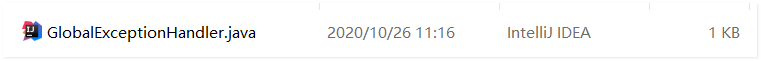
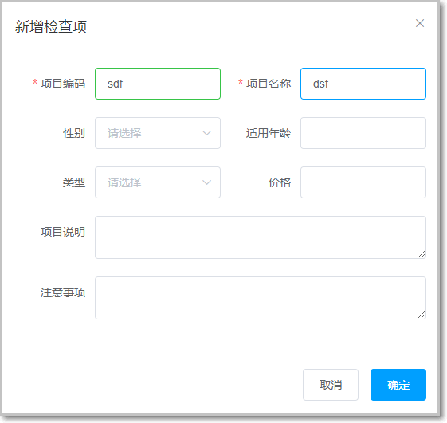
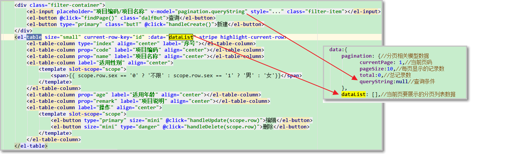

#   第2章 预约管理-检查项管理


2.1 功能介绍 
--------

```java
本章节完成的功能开发是预约管理功能中的检查项管理功能，
在预约管理功能中包括检查项管理（身高、体重、视力等等）、检查组管理（一般检查、血常规、尿常规等等，一个检查组里可以有多个检查项）
体检套餐管理(入职体检，入职体检中可以包含多个检查组)、预约设置等。
预约管理属于系统的基础功能，主要就是管理一些体检的基础数据。
```

页面原型框架已经提供给大家了，接下来我们要完成后台代码功能


## 2.2 表关系说明

今天的课程涉及到两张表： 检查项表和检查组 表的关系

检查项和检查组之间的关系：**多对多**

 

体检套餐和检查组之间的关系：多对多

 

## 2.3 基础数据准备

目标

完成表设计和sql脚本的导入：api和common模块添加对应的实体类、结果类、条件类、通用类以及公共资源等。

第一步： 下发的sql脚本资料导入到数据库中，**注意新建一个数据库** 

数据库配置参数要和  health_core模块里面yaml文件要一致！

 

第二步：导入实体类

  

**名词解释**：

**PageResult**:封装分页数据

 


**Result**:统一响应数据到页面的结果类，一般用于封装页面需要的数据。

 


**QueryPageBean**:用于封装查询条件的类

 


**全局异常处理类-GlobalExceptionHandler**

所有业务异常通用处理： 如果后台出现代码异常，通过该类直接将异常信息响应给前端

 

```java
@RestControllerAdvice
public class GlobalExceptionHandler {

    @ExceptionHandler
    public Result exceptionHandle(Exception ex){
        ex.printStackTrace();
        String errorMsg = ex.getMessage();
        if(errorMsg.length() > 200)
            return new Result(false,errorMsg.substring(0,200) + "...");
        else
            return new Result(false,errorMsg);
    }

}
```

异常处理类存放位置： 和controller 存放在一起！类似：  业务层抛出异常 由 GlobalExceptionHandler 来统一处理异常信息，封装到Result.java结果集中，响应给前端！   

 

## 2.4 页面布局分析

### 2.4.1 默认首页设置

目标页面：前端系统：**checkitem.vue**

 

### 2.4.2 页面布局说明

 

### 2.4.3 检查项管理-新建弹窗

在预约管理-检查项管理中，当点击“新建”按钮后弹窗如下：

 

弹窗的实现步骤

第一步：弹出新增窗口

页面中已经提供了新增窗口，只是处于隐藏状态。只需要将控制展示状态的属性**dialogFormVisible改为true**显示出新增窗口。

 

点击新建按钮时绑定的方法为**handleCreate**，在handleCreate方法中修改dialogFormVisible属性的值为true即可。

 

第二步：新建窗口表单数据情况

当第一次在对话框输入数据后，第二次再次打开对话框，有上一次的数据。

 

```js
// 重置表单  
resetForm() {  
this.formData = {};  
},  
// 弹出添加窗口  
handleCreate() {  
this.resetForm();  //  弹出窗口之前 先重置表单数据
this.dialogFormVisible = true;  
}
```

至此我们初步完成了页面数据的修改工作！

## 2.5 新增检查项功能

目标 ： 点击预约管理中的”新建”按钮，完成添加一条检查项的数据。


新增检查项表单：

 

实现步骤如下：

### 2.5.1 新增检查项表单校验

找到checkitem.vue 页面对应的表单校验部分js代码，完善字段校验规则：可以参照官方手册完成

校验规则可参考：


在对应的js模块添加对应的规则：

```js
rules: {//校验规则  
code: [{ required: true, message: '项目编码为必填项', trigger: 'blur' }],  
name: [{ required: true, message: '项目名称为必填项', trigger: 'blur' }],
    age: [
                        { required: true, message: '年龄必填项', trigger: 'blur' },
                        { type: 'number', min:1,message: '年龄必须为数字值' }
                    ]
}

添加数值类型  v-model.number 需要添加修饰符 不要忘记！

```

 

测试表单验证

在methods方法区中添加表单提交的校验方法

```js
handleAdd () {  
 //校验表单输入项是否合法  
 this.$refs['dataAddForm'].validate((valid) => {  
   if (valid) {  
    alert(valid)  
  } else {  
     this.$message.error("表单数据校验失败");  
     
  }  
});  
}
```

### 2.5.2 提交表单校验

点击新增窗口中的确定按钮时，触发handleAdd方法，所以需要在handleAdd方法中进行完善。

```js
//表单提交方法 
handleAdd () {  
    //校验表单输入项是否合法  
    this.$refs["dataAddForm"].validate((valid)=>{  
    if(valid){  
    //校验通过发送请求新增检查项  
    this.$http.post("api/checkitem/add",this.formData).then((res)=>{

    //关闭新增窗口  
    this.dialogFormVisible=false;  
    //判断后台返回的flag值，true表示添加操作成功，false为添加操作失败  
    if(res.data.flag){
    //新增成功，提示成功信息  
    this.$message.success("新增成功");

}else{
    //提示新增失败信息  
    this.$message.error("新增失败");  
    }  
    })  
    }else{  
    this.$message({  
    type:"error",  
    message:"表单数据校验失败"  
    })  
    }  
})  

}
 
```

### 2.5.3 新增检查项-后台代码实现

第一步：Controller编写，在health_web模块消费者端完成

在health_web工程中创建CheckItemController.java

注意：编写Controller对象按照标准规范编写，请求和响应的数据均采用标准对象格式

```java
@RestController  
public class CheckItemController {  

@Reference  //  注意引入dubbo对应的注解
private CheckItemService checkItemService;  

@PostMapping("checkitem/add")  //  方法请求参数封装对象  结果响应json采用Result对象封装
public Result add(@RequestBody CheckItem checkItem){  
   checkItemService.save(checkItem); 
   return new Result(true);  
}  

}

```

### 2.5.4 服务接口编写

health_api模块添加接口编写

```java
public interface CheckItemService extends IService<CheckItem>{  
 
}
```

### 2.5.5 服务接口实现类编写

在**health_service_provider**工程中创建CheckItemServiceImpl.java实现类

**所有的接口服务实现，都在服务提供方模块编写** 

```java
@Service
@Transactional
public class CheckItemServiceImpl extends ServiceImpl<CheckItemMapper,CheckItem> implements CheckItemService{
    
}
```

服务实现类需要调用数据访问层：mapper接口完成数据源的crud操作

### 2.5.6 数据源访问接口编写

在health_mapper工程中创建CheckItemMapper接口

```java
public interface CheckItemMapper extends BaseMapper<CheckItem> {  
    
}
```

### 2.5.8 测试 - 启动zookeeper

双击启动即可

 

启动如下：

 

- 启动后台系统：service服务端和consumer消费端

- 执行npm   run dev  启动前端系统

浏览器：访问页面，填写数据

新增内容可以参考资料中的文件：

 

 

查看数据库表中是否添加对应的数据记录！

## 2.6 检查项分页查询功能

### 2.6.0 mybatis-plus分页插件使用说明

**说明：** 1. 前端使用**elementui+vue**  完成分页栏  2. 后台使用Mybatis-plus分页插件完成分页查询

**目标：后台只需要提供分页总记录数和分页数据**，前台即可自动实现分页

后台使用分页插件完成分页查询数据功能

在health_core模块： 提供分页插件Bean配置： 分页插件会自动根据数据库方言，生成对应得sql 

 

1. 分页插件配置PaginationInterceptor.java 完成分页查询

```java

@Configuration
public class PageHelperConfig {

    @Bean
    public PaginationInterceptor paginationInterceptor(){
        return new PaginationInterceptor();
    }

}

```

2. 消费者端，编写业务层代码 ： mp已经提供了page方法，完成分页的查询！


```java
 //  分页请求参数条件  封装到 Page对象中 通过构造方法 注入即可
Page对象说明： 分页的请求参数：currentPage  pageSize 只要传递给Page对象，那么mp能够自动的完成分页的查询！
            Page<CheckItem> page = checkItemService.page(new Page<CheckItem>(queryPageBean.getCurrentPage(), queryPageBean.getPageSize()));
            List<CheckItem> checkItemList = page.getRecords();// 每页分页数据
            long total = page.getTotal();//  总记录数
```

只需要调用mp默认的 page方法即可完成分页查询！

**补充：** 开发时，install和package 都要忽略test模块

 

实际开发  install或发布项目一般都会将test模块过滤！ 

### 2.6.1 检查项无条件分页查询功能

目标： 当前进入页面就查询所有分页数据，或者也可以通过查询按钮查询分页数据：


功能实现分析： 

本项目所有分页功能都是基于ajax的异步请求来完成的，请求参数和后台响应数据格式都使用json数据格式。

分页查询请求参数： 包括页码、每页显示记录数、查询条件 - 所有的请求参数都会封装到实体 PageQueryBean对象中。

 

请求参数的json格式为：{currentPage:1,pageSize:10,queryString:''itcast''}

**分页查询后台响应数据** ： 包括**总记录数、当前页需要展示的数据集合**。  我们已经完成后台的代码实现！

响应数据的json格式为：{total:1000,rows:[]}

响应的分页数据都会封装到 ： Result.java对象中

### 2.6.2 第一步 检查项分页查询

1. 分页栏的数据完善

```js
pagination: {//分页相关模型数据  
 currentPage: 1,//当前页码  
 pageSize:10,//每页显示的记录数  
 total:0,//总记录数  
 queryString:null//查询条件  
}, 
dataList: [],//当前页要展示的分页列表数据   我们需要将后台的分页数据转换成json对象 使用该数组接受
```

页面数据双向绑定说明： 找到checkitem.vue页面  注意数据的双向绑定！



### 2.6.3 第二步 分页查询前端js编写

在页面中提供了**findPage**方法用于分页查询，

为了能够在checkitem.vue页面加载后直接可以展示分页数据，可以在VUE提供的钩子函数created中调用findPage方法。页面加载完成时，立刻发起ajax后台分页查询

checkitem.html页面加载完成或者点击查询按钮完成分页查询：在created函数中编写分页查询方法

```js
 created: function () {
                // 页面加载完成  立刻查询第一页  10条记录
                this.findPage();  // 因为后续条件查询或者点击查询 都需要加载pageQuery方法
            },
                
                
  methods方法模块编写findPage方法的实现
              //分页查询
                findPage() {
                    //pageNum  pageSize  @RequestBody {pageNum:xxx,pageSize:xxx}  后台：QueryPageBean接收
                    this.$http.post("api/checkitem/findPage",this.pagination).then((res)=>{
                        // res PageResult 包含两部分   :List<T>   total 总记录  
                        console.info(res)
                        if(res.data.flag){
                            this.dataList=res.data.data.rows;
                            this.pagination.total=res.data.data.total;
                        }else{
                            this.$message.error(res.data.message)
                        }

                    })


                }
  
  这里需要注意的细节：数据双向邦定 页面标签要和vue中的数据对应
   
```

表格分页数据列表：  tableData

 

### 2.6.4 分页查询后台代码实现

1.  第一步：Controller

在CheckItemController中增加分页查询方法

```java

    //   开发 检查项模块   crud
    @PostMapping("checkitem/findPage")
    @ApiOperation(value = "分页查询",notes = "根据分页条件查询分页数据")
    public Result findPage(@RequestBody QueryPageBean pageBean){
             PageResult pageResult = checkItemService.findPage(pageBean);
            return  new Result(pageResult);
       
    }
```

2. 第二步：服务接口

```java
public interface CheckItemService extends IService<CheckItem> {
}
```

3. 第三步：服务实现类 

```java
    @Override
    public PageResult findPage(QueryPageBean pageBean) {       
            // mp  无分页查询     先配置 分页插件
                 Page<CheckItem> page = page(new Page<CheckItem(pageBean.getCurrentPage(), pageBean.getPageSize()));
        PageResult  result = new PageResult(page.getTotal(),page.getRecords());
        return result;
    }
}
```

4. 测试

如果没有数据，可以执行资料中的t_checkitem.sql脚本添加数据：

 

-----

## 2.7 点击分页栏查询功能

我们完成分页查询之后，当用户进行分页查询时，此时对于分页栏的前一页，后一页，当前页，指定也的查询功能也需要完善功能

### 2.7.1 完善checkitem.vue页面

除了在created钩子函数中调用findPage方法查询分页数据之外，当用户点击点击分页条中的页码时也需要调用findPage方法重新发起查询请求。

分页组件提供了对应的分页查询事件：

**注意**： 当进行新的分页查询，我们需要将查询的最新页码传递给pageQuery方法！

```js
 <!--分页栏制作-->
                    <div class="pagination-container">
                        <el-pagination
                                class="pagiantion"
                                @current-change="handleCurrentChange"                        
                                :current-page="pagination.currentPage"
                                :page-size="pagination.pageSize"
                                layout="total, prev, pager, next, jumper"
                                :total="pagination.total">
                        </el-pagination>
                    </div>
其中 @current-change事件 表示 点击某一页码查询对应分页数据
   
    
我们在methods模块中分别添加对应的事件方法实现即可
注意： 当进行新的分页查询，我们需要将查询的最新页码传递给pageQuery方法！
注意这里的方法参数 就是用户分页查询的当前点击的页码

                      //切换页码
                handleCurrentChange(currentPage) {
                    //  currentPage  点击当前页码
                    this.pagination.currentPage=currentPage;
                    this.findPage()
                },

              

```

### 2.7.2 完善分页查询

当点击分页栏在其他页面进行条件查询时查不到数据：


```js
<el-button @click="findPageByCondition" class="dalfBut">查询</el-button>
```

在该方法中重置页码为1并再次调用findPage方法：

```js
     findPageByCondition(){
                    this.pagination.currentPage=1
                    this.findPage()
                }

   //分页查询
                findPage() {
                    // pageNum  pageSize  @RequestBody {pageNum:xxx,pageSize:xxx}  QueryPageBean接收
                    this.$http.post("api/checkitem/findPage",this.pagination).then((res)=>{
                        //  res  包含两部分    List<T>   total 总记录   Result
                        console.info(res)
                        if(res.data.flag){
                           this.dataList = res.data.data.rows;
                           this.pagination.total= res.data.data.total;
                        }else{
                            this.$message.error(res.data.message)
                        }

                    })


                },
```


### 2.7.3  新建检查项后-执行分页查询

目标

当新建检查项成功后，我们需要立即查询分页数据以便显示最新数据：


完善页面

点击新增窗口中的确定按钮时，触发handleAdd方法，所以需要在handleAdd方法中进行完善。

```js
      //添加
                handleAdd () {
                  //  1. 表单提交  校验 合法 提交表单  2. 表单ajax 提交给后台   3.  后台响应数据  关闭对话框 给用户提示
                    this.$refs['dataAddForm'].validate((valid)=>{
                        if(valid){
                           this.$http.post("api/checkitem/add",this.formData).then((res)=>{
                               console.info(res)  //  res.data== result
                               if(res.data.flag){
                                   //  添加成功  重新从第一页查询
                                   this.pagination.currentPage=1
                                   this.findPage()
                               }else{
                                   this.$message.error(res.data.message)
                               }
                               this.dialogFormVisible=false
                           })
                        }else{
                            this.$message.error("数据非法")
                            return false;
                        }

                    })

                },
```

## 2.8 检查项条件分页查询

说明： 添加条件按照检查项名称进行分页模糊查询

 

分析： 当用户输入条件，点击查询时，将用户输入的条件封装到pagination对象中，发送给后台controller

文本输入框： v-model 双向绑定用户输入的数据

实现步骤:

- 页面添加输入框双向绑定

 

- pagination对象中添加查询条件

```js
     pagination: {//分页相关模型数据
     currentPage: 1,//当前页码
     pageSize:5,//每页显示的记录数
     total:0,//总记录数
     queryString:null//查询条件   双向绑定
},
```

- 条件分页查询 方法实现

```js
//  条件分页查询实现
findPageByCondition(){
    //  有条件和 无条件 分页查询  都有该方法实现
    this.pagination.currentPage=1
    this.findPage()

},
```

- 后台消费者端：controller代码实现，业务层完成条件查询业务封装

``` java
  //   开发 检查项模块   crud
    @PostMapping("checkitem/findPage")
    @ApiOperation(value = "分页查询",notes = "根据分页条件查询分页数据")
    public Result findPage(@RequestBody QueryPageBean pageBean){
             PageResult pageResult = checkItemService.findPage(pageBean);
            return  new Result(pageResult);
       
    }
```

- 生产者 提供业务方法实现  ：checkItemService.findPage

```java
@Override
    public PageResult findPage(QueryPageBean pageBean) {

        Page<CheckItem> page=null;
        QueryWrapper queryWrapper = new QueryWrapper();
        queryWrapper.eq("is_delete",0);  //  逻辑删除  查询  有效的数据   is_delete = 0
//      有条件分页查询
        if(StringUtils.isEmpty(pageBean.getQueryString())){
            // mp  无分页查询     先配置 分页插件
         page = page(new Page<CheckItem>(pageBean.getCurrentPage(), pageBean.getPageSize()),queryWrapper);
        }else{
            queryWrapper.like("name",pageBean.getQueryString());// 按照名称模糊查询
            page = page(new Page<CheckItem>(pageBean.getCurrentPage(), pageBean.getPageSize()),queryWrapper);
        }
        //  select  *  from   xx  limit  ..
        PageResult  result = new PageResult(page.getTotal(),page.getRecords());
        return result;
    }
}
```

测试：  输入 **细** 点击查询，分页栏点击查询js代码无需更改！

 


## 2.9 删除检查项-完善最新分页数据

1.  目标

当点击“删除”按钮后，完成删除功能：一般在后台系统中，删除功能分为物理删除和逻辑删除

物理删除，是将数据彻底从数据库中删除，无法恢复。谨慎使用！

逻辑删除，是通过表中的某些字段来决定是否是有效记录,系统开发往往采用逻辑删除

 


1.  在我们传智健康系统中，我们采用逻辑删除完成删除功能，在操作删除操作时，弹窗确认框给与用户再次确认

2.  逻辑删除成功之后，需要刷新页面，查询最新数据


完善页面

为了防止用户误操作，点击删除按钮时需要弹出确认删除的提示，用户点击取消则不做任何操作，用户点击确定按钮再提交删除请求。

### 2.9.1 第一步：删除选项绑定单击事件

需要为删除按钮绑定单击事件，并且将当前行数据作为参数传递给处理函数

```js
checkitem.vue  页面代码 找到删除标签位置：

<template slot-scope="scope">
   <el-button type="primary" size="mini" @click="handleUpdate(scope.row)">编辑</el-button>
   <el-button size="mini" type="danger" @click="handleDelete(scope.row)">删除</el-button>
</template>

编写删除js事件：

// methods模块添加逻辑删除删除事件  
handleDelete(row) {  
 alert(row.id);  
}

<el-table size="small" current-row-key="id" :data="dataList" stripe highlight-current-row>
说明：slot-scope就是取data的值
 slot-scope="scope" 获取表格对象的作用域插槽:data绑定的数据，scope可以随便替换其他名称，只是定义对象来代表取得的data数据，便于使用
```


### 2.9.2 第二步：弹出确认操作提示

用户点击删除按钮会执行handleDelete方法，此处需要完善handleDelete方法，弹出确认提示信息。ElementUI提供了\$confirm方法来实现确认提示信息弹框效果

```js
 // 删除
                handleDelete(row) {
                    //  弹窗确认框   row.id
                    this.$confirm('您确定要删除吗?', '提示', {
                        confirmButtonText: '确定',
                        cancelButtonText: '取消',
                        type: 'warning'
                    }).then(() => {

                        this.$http.delete("api/checkitem/deleteCheckItemById?id="+row.id).then((res)=>{
                            if(res.data.flag){
                                this.findPage()//  删除成功  重新查询
                            }else{
                                this.$message.error(res.data.message)
                            }
                        })
                    }).catch(() => {
                        this.$message({
                            type: 'info',
                            message: '已取消删除'
                        });
                    });

                },
```


### 2.9.3 第三步：逻辑删除业务请求发送

如果用户点击确定按钮就需要发送ajax请求，并且将当前检查项的id作为参数提交到后台进行删除操作

> ```js
>     // 删除
>                 handleDelete(row) {
>                     //  弹窗确认框   row.id
>                     this.$confirm('您确定要删除吗?', '提示', {
>                         confirmButtonText: '确定',
>                         cancelButtonText: '取消',
>                         type: 'warning'
>                     }).then(() => {
> 
>                         this.$http.delete("/checkitem/deleteCheckItemById/"+row.id).then((res)=>{
>                             if(res.data.flag){
>                                 this.findPage()//  删除成功  重新查询
>                             }else{
>                                 this.$message.error(res.data.message)
>                             }
>                         })
>                     }).catch(() => {
>                         this.$message({
>                             type: 'info',
>                             message: '已取消删除'
>                         });
>                     });
>    
>                 },
>    ```
>    


### 2.9.4 CheckItemCotroller后台代码

#### 2.9.4.1 第一步：Controller业务方法实现

在CheckItemController.java中增加逻辑删除方法

> ```java
>    @DeleteMapping("checkitem/deleteCheckItemById/{id}")
>     public Result deleteCheckItemById(@PathVariable("id")Integer id){
>            //  update  xxx  set is_delete = 1 where id = 1
>          CheckItem checkItem = new CheckItem();
>             checkItem.setId(id);
>             checkItem.setIs_delete(1); //  修改字段值
>             checkItemService.updateById(checkItem);
>             return  new Result(true);
>    
>     }
>    ```
>    


#### 2.9.4.2 逻辑删除最后一条记录问题

当删除某一页的最后一条数据后，会显示空页面，如下：


解决方案

删除后，重置页码，重新从第一页开始查询：

```js
   // 删除
                handleDelete(row) {
                    //  弹窗确认框   row.id
                    this.$confirm('您确定要删除吗?', '提示', {
                        confirmButtonText: '确定',
                        cancelButtonText: '取消',
                        type: 'warning'
                    }).then(() => {

                        this.$http.delete("api/checkitem/deleteCheckItemById?id="+row.id).then((res)=>{
                            if(res.data.flag){
                                this.pagination.currentPage=1  
                                this.findPage()//  删除成功  重新查询
                            }else{
                                this.$message.error(res.data.message)
                            }
                        })
                    }).catch(() => {
                        this.$message({
                            type: 'info',
                            message: '已取消删除'
                        });
                    });

                },
```


## 3. 检查项编辑功能

编辑检查项： 将当前的信息回显弹窗显示给客户，当用户修改完成提交更新后台即可

需要注意： 修改检查项：对于表中具有唯一标识或者关键字的 一般不予修改权限，例如主键等

 

对于项目编码 是不可以修改的！ 整张表唯一！

```html
  <el-input v-model="formData.code" disabled/>

   在对应的字段属性上添加 disabled 即可
```


### 3.1 编辑检查项回显原始数据

1、当点击“编辑”按钮，弹出编辑窗口

2、显示当前检查项的数据以供修改

 

checkitem.vue完善页面

用户点击编辑按钮时，需要弹出编辑窗口并且将当前记录的数据进行回显，用户修改完成后点击确定按钮将修改后的数据提交到后台进行数据库操作。

#### 3.1.1 第一步：绑定单击事件

需要为编辑按钮绑定单击事件，并且将当前行数据作为参数传递给处理函数

```js
<el-button type="primary" size="mini"
@click="handleUpdate(scope.row)">编辑</el-button>

// methods模块中添加修改事件  row表示当前被点击的记录行数据对象 封装了当前行的数据
handleUpdate(row) {  
 alert(row);  
}

```

#### 3.1.2 第二步：弹出编辑窗口并回显数据

当前页面中的编辑窗口已经提供好了，默认处于隐藏状态。在handleUpdate方法中需要将编辑窗口展示出来，并且需要发送ajax请求查询当前检查项数据用于回显

```js
  // 弹出编辑窗口
                handleUpdate(row) {
                    this.dialogFormVisible4Edit=true;
                    this.formData = row;

                },
```

#### 3.1. 3 第三步：数据更新修改功能

将修改的检查项数据更新到数据库中

1.  编辑更新完成后查询最新数据

 

和添加一样 重要字段添加字段校验方可提交表单（表单校验功能：学员参照添加功能自行完成）

##### 3.1.3.1 修改业务请求发送

在编辑窗口中修改完成后，点击确定按钮需要提交请求，所以需要为确定按钮绑定事件并提供处理函数handleEdit

```js
//添加检查项表单按钮：
  <el-button type="primary" @click="handleAdd('dataAddForm')">确定</el-button>
// 修改检查项表单按钮
 <el-button type="primary" @click="handleEdit('dataEditForm')">确定</el-button>

//  修改表单数据 提交后台 修改 操作
                handleEdit(vlidForm){
                    this.handleAdd(vlidForm)
                    this.dialogFormVisible4Edit = false
                    // this.pagination.currentPage=1
                    this.findPage()
                },
                    
          //  dataAddForm   dataEditForm
                        handleAdd(validForm){
                            //   表单合法检验
                            this.$refs[validForm].validate((valid)=>{
                                 if(valid){
                                     //  表单校验合法  提交数据到后台 
                                     this.$http.post("api/checkitem/add",this.formData).then((res)=>{
                                         if(res.data.flag){
                                              this.dialogFormVisible = false 
                                         }else{
                                               this.$message.error(res.data.message)
                                         }

                                     })

                                 }else{
                                     this.$message.error("表单数据非法")
                                 }
                            })
                        },                
```

##### 3.1.3.2 后台代码CheckItemController.java

在CheckItemController中增加编辑方法

```java
  @PostMapping("checkitem/add")
    public Result add(@RequestBody CheckItem checkItem){
       //  checkItemService.add(checkItem);
            //   checkItem  有无 ID  mp帮助我们自动完成添加或修改操作   如果实体类存在 id   update 操作 否则 插入操作
            checkItemService.saveOrUpdate(checkItem);
            return  new Result(true);

    }
```


## 4. 能力目标

完成：

1. 掌握检查项管理的crud 
2. 掌握mp分页插件代码使用


## 5 前端-路由学习（扩展）

本章节主要扩展：**前端路由**的学习

1. 使用 vue-cli 脚手架  使用vue   ui 命令  黑窗口  cmd

​     图形化操作 创建项目即可

    2. 找到创建好的项目 - 直接使用 vscode 打开项目即可

​    参照  第一天下发  pdf文档

 


## 6 Mybatis-plus代码生成器（扩展）

实际开发中，当数据库环境搭建完成之后，我们需要根据表反向生成后台的 

controller/service/po等对象 可以基于mp的代码生成器完成：

官网：https://baomidou.com/guide/generator.html#%E4%BD%BF%E7%94%A8%E6%95%99%E7%A8%8B

 

开发步骤：  

注意：单独**搭建一个新工程 专门用来完成mp代码生成器的，编码因代码生成器导致项目业务代码被修改！**

1. 导入依赖 pom.xml

根据官方提供的代码要求 提供对应得依赖即可；

基于springboot环境完成

```xml
 <parent>
     <groupId>org.springframework.boot</groupId>
     <artifactId>spring-boot-starter-parent</artifactId>
     <version>2.3.0.RELEASE</version>
 </parent>
<properties>
     <mybatisplus.version>3.3.2</mybatisplus.version>
</properties>
 <dependencies>
     <dependency>
         <groupId>org.springframework.boot</groupId>
         <artifactId>spring-boot-starter-web</artifactId>
     </dependency>
     <dependency>
         <groupId>mysql</groupId>
         <artifactId>mysql-connector-java</artifactId>
         <scope>runtime</scope>
     </dependency>
     <dependency>
         <groupId>org.projectlombok</groupId>
         <artifactId>lombok</artifactId>
     </dependency>
     <!--mybatis-plus 启动器 -->
     <dependency>
         <groupId>com.baomidou</groupId>
         <artifactId>mybatis-plus-boot-starter</artifactId>
         <version>${mybatisplus.version}</version>
     </dependency>
     <!--mp依赖包-->
     <dependency>
         <groupId>com.baomidou</groupId>
         <artifactId>mybatis-plus-extension</artifactId>
         <version>${mybatisplus.version}</version>
     </dependency>
     <!--mybaits-plus 代码生成器-->
     <dependency>
         <groupId>com.baomidou</groupId>
         <artifactId>mybatis-plus-generator</artifactId>
         <version>${mybatisplus.version}</version>
     </dependency>
     <!--代码生成器需要模板 依赖-->
     <dependency>
         <groupId>org.apache.velocity</groupId>
         <artifactId>velocity-engine-core</artifactId>
         <version>2.2</version>
     </dependency>
     <dependency>
         <groupId>org.freemarker</groupId>
         <artifactId>freemarker</artifactId>
         <version>2.3.30</version>
     </dependency>
  <!--工具类StringUtils-->
     <dependency>
         <groupId>commons-lang</groupId>
         <artifactId>commons-lang</artifactId>
         <version>2.6</version>
     </dependency>
 </dependencies>
```

2. 根据官网提供的模板代码改造：

```java
/**
 * 代码生成器  配置类  
 *   启动main    控制台输入
 *   1. 生成代码需要的存放的包路径 = 模块名称 
 *   2. 输入数据库需要生成的表名称 以逗号分隔
 *   回车即可
 */
public class CodeGenerator {
    /**
     * <p>
     * 读取控制台内容
     * </p>
     */
    public static String scanner(String tip) {
        Scanner scanner = new Scanner(System.in);
        StringBuilder help = new StringBuilder();
        help.append("请输入" + tip + "：");
        System.out.println(help.toString());
        if (scanner.hasNext()) {
            String ipt = scanner.next();
            if (StringUtils.isNotBlank(ipt)) {
                return ipt;
            }
        }
        throw new MybatisPlusException("请输入正确的" + tip + "！");
    }

    public static void main(String[] args) {
        // 代码生成器
        AutoGenerator mpg = new AutoGenerator();

        // 全局配置
        GlobalConfig gc = new GlobalConfig();
        String projectPath = System.getProperty("user.dir");
        gc.setOutputDir(projectPath + "/src/main/java"); // 输出的源码路径
        gc.setAuthor("tps");
        gc.setOpen(false);

        //生成的service接口名字首字母是否为I，这样设置就没有I
        gc.setServiceName("%sService"); //  去除接口生成时 自带的I开头前缀
        // gc.setSwagger2(true); 实体属性 Swagger2 注解
        mpg.setGlobalConfig(gc);

        // 数据源配置  以自己的数据库环境为主，注意一点 mysql使用5.8版本 需要配置serverTimezone
        DataSourceConfig dsc = new DataSourceConfig();
        dsc.setUrl("jdbc:mysql://localhost:3306/heima?characterEncoding=utf-8&serverTimezone=GMT%2B8");
        // dsc.setSchemaName("public");
        dsc.setDriverName("com.mysql.cj.jdbc.Driver"); //注意 mysql 5.8 驱动包
        dsc.setUsername("root");
        dsc.setPassword("root");
        mpg.setDataSource(dsc);

        // 包配置
        PackageConfig pc = new PackageConfig();
        pc.setModuleName(scanner("模块名")); // 生成的mapper  controller service 所在的包名
        pc.setParent("com.itheima");
        mpg.setPackageInfo(pc);

        // 自定义配置
        InjectionConfig cfg = new InjectionConfig() {
            @Override
            public void initMap() {
                // to do nothing
            }
        };

        // 如果模板引擎是 freemarker
        String templatePath = "/templates/mapper.xml.ftl";
        // 如果模板引擎是 velocity
        // String templatePath = "/templates/mapper.xml.vm";

        // 自定义输出配置
        List<FileOutConfig> focList = new ArrayList<>();
        // 自定义配置会被优先输出
        focList.add(new FileOutConfig(templatePath) {
            @Override
            public String outputFile(TableInfo tableInfo) {
                // 自定义输出文件名 ， 如果你 Entity 设置了前后缀、此处注意 xml 的名称会跟着发生变化！！
                return projectPath + "/src/main/resources/mapper/" + pc.getModuleName()
                        + "/" + tableInfo.getEntityName() + "Mapper" + StringPool.DOT_XML;
            }
        });
      
        cfg.setFileOutConfigList(focList);
        mpg.setCfg(cfg);

        // 配置模板
        TemplateConfig templateConfig = new TemplateConfig();
        // 配置自定义输出模板
        //指定自定义模板路径，注意不要带上.ftl/.vm, 会根据使用的模板引擎自动识别
        // templateConfig.setEntity("templates/entity2.java");
        // templateConfig.setService();
        // templateConfig.setController();

        templateConfig.setXml(null);
        mpg.setTemplate(templateConfig);

        // 策略配置
        StrategyConfig strategy = new StrategyConfig();
        strategy.setNaming(NamingStrategy.underline_to_camel);
        strategy.setColumnNaming(NamingStrategy.underline_to_camel);
//        strategy.setSuperEntityClass("你自己的父类实体,没有就不用设置!");
        strategy.setEntityLombokModel(true);
        strategy.setRestControllerStyle(true);
        // 公共父类
//        strategy.setSuperControllerClass("你自己的父类控制器,没有就不用设置!");
        // 写于父类中的公共字段
//        strategy.setSuperEntityColumns("id");
        strategy.setInclude(scanner("表名，多个英文逗号分割").split(","));
        strategy.setControllerMappingHyphenStyle(true);
        strategy.setTablePrefix("t_");// 表明的前缀  生成的实体类 将自动去除 表的前缀
        // 我的数据库表 是以t_开头 故 这里写的是 t_,实际以数据库前缀为主
        mpg.setStrategy(strategy);
        mpg.setTemplateEngine(new FreemarkerTemplateEngine());
        mpg.execute();
    }
```

执行main方法，前提 数据库环境要先搭建完成

以我的表为例： 当数据库已经完成表设计，方可执行上述代码！

 

执行main之后 会在当前工程下生成对应得 mapper  controller  service  以及 resources目录下的mapper.xml映射文件


 